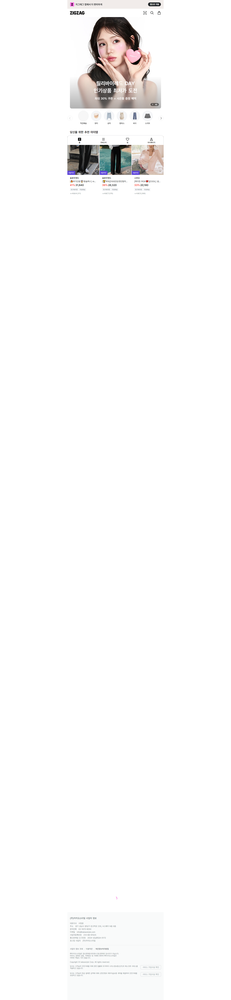

# 글로벌 패션·악세사리 트렌드 리포트

- **날짜**: 2026-05-15
- **생성**: 2026-05-15 20:45 KST
- **센싱 국가**: 1개
- **센싱 사이트**: 4개 (성공 3)
- **수집 페이지**: OK 3 / FAIL 1
- **다운로드 이미지**: 0장

---

## 1. Executive Summary

오늘 1개국 4개 사이트에서 3개 페이지를 수집하고, 0장의 대표 이미지를 정규화/저장했습니다.

## 2. 글로벌 트렌드 TOP 10

### 키워드

| # | keyword | count | 출처 사이트 수 |
|---:|---|---:|---:|
| 1 | `여름` | 5 | 1 |
| 2 | `감도` | 3 | 1 |
| 3 | `깊은` | 3 | 1 |
| 4 | `썸머` | 3 | 1 |
| 5 | `취향` | 2 | 1 |
| 6 | `셀렉트샵` | 2 | 1 |
| 7 | `지그재그` | 2 | 1 |
| 8 | `클리오` | 2 | 1 |
| 9 | `슈즈` | 2 | 1 |
| 10 | `쾌적한` | 2 | 1 |

### 컬러

| # | keyword | count | 출처 사이트 수 |
|---:|---|---:|---:|
| 1 | `블랙` | 1 | 1 |
| 2 | `레드` | 1 | 1 |

### 카테고리

| # | keyword | count | 출처 사이트 수 |
|---:|---|---:|---:|
| 1 | `블라우스` | 1 | 1 |
| 2 | `원피스` | 1 | 1 |

## 3. 국가별 핵심 트렌드 요약

### 한국

- **키워드** (10): `여름`(5), `감도`(3), `깊은`(3), `썸머`(3), `취향`(2)- **컬러** (2): `블랙`(1), `레드`(1)- **카테고리** (2): `블라우스`(1), `원피스`(1)

## 4. 국가별 상세 센싱 결과

### 4.1 한국 _( South Korea )_

- 한국 수출규모 순위: **#30** · region: `asia` · tier `1` · currency `KRW`
- 수집 사이트: **4개** (성공 3)
- 메모: 비교 기준 (자국). 국내 사업동향 센싱
#### [29CM](https://www.29cm.co.kr/)

- URL: <https://www.29cm.co.kr/>
- 페이지: **OK 1 · FAIL 0**

**최근 유행 상품** (50건 · 상품명 클릭 시 해당 사이트로 이동)

| # | 상품명 | 브랜드 | 가격 | 페이지 |
|---:|---|---|---:|---|
| 1 | [유니러브 피드미 3-in-1 부스터 의자 밀크티](https://product.29cm.co.kr/catalog/3995812) | 유니러브 | 127,200 KRW | `home` |
| 2 | [유니러브 피드미 3-in-1 부스터 의자 토피브라운](https://product.29cm.co.kr/catalog/3995888) | 유니러브 | 127,200 KRW | `home` |
| 3 | [유니러브 피드미 3-in-1 부스터 의자 아보카도그린](https://product.29cm.co.kr/catalog/3995841) | 유니러브 | 127,200 KRW | `home` |
| 4 | [Rugby Long Sleeve (2 Colors)](https://product.29cm.co.kr/catalog/3696816) | 시눈 | 74,800 KRW | `home` |
| 5 | [Multi Stripe Long Sleeve (5 Colors)](https://product.29cm.co.kr/catalog/3696813) | 시눈 | 55,250 KRW | `home` |
| 6 | [Basic Halter Top Set (6 Colors)](https://product.29cm.co.kr/catalog/3696811) | 시눈 | 57,800 KRW | `home` |
| 7 | [[3차 리오더]Sun Crop Strap Cover-Up[LMBFSW273]-White](https://product.29cm.co.kr/catalog/3930088) | 라메레이 | 47,650 KRW | `home` |
| 8 | [[3차 리오더]Sun Draw String Cover-Up[LMBFSW272]-White](https://product.29cm.co.kr/catalog/3930085) | 라메레이 | 47,650 KRW | `home` |
| 9 | [[2차 리오더]Boat Neck Shirring Swim Top[LMBFSW274]-Chocolate Brown](https://product.29cm.co.kr/catalog/3930080) | 라메레이 | 79,140 KRW | `home` |
| 10 | [ONE SHOULDER RAGLAN T-SHIRT_SKY BLUE](https://product.29cm.co.kr/catalog/3962506) | 셀리테일즈 | 79,200 KRW | `home` |
| 11 | [ONE SHOULDER RAGLAN T-SHIRT_PINK](https://product.29cm.co.kr/catalog/3962502) | 셀리테일즈 | 79,200 KRW | `home` |
| 12 | [STRIPE HALTER NECK TOP_CHARCOAL](https://product.29cm.co.kr/catalog/3962492) | 셀리테일즈 | 40,500 KRW | `home` |
| 13 | [Shimmer logo t-shirt_charcoal](https://product.29cm.co.kr/catalog/3947203) | 위드아웃썸머 | 52,020 KRW | `home` |
| 14 | [Shimmer logo t-shirt_ivory](https://product.29cm.co.kr/catalog/3947202) | 위드아웃썸머 | 52,020 KRW | `home` |
| 15 | [Plain band skirt_check](https://product.29cm.co.kr/catalog/3947186) | 위드아웃썸머 | 94,860 KRW | `home` |
| 16 | [FLAP POCKET SHIRTS(TAUPE)](https://product.29cm.co.kr/catalog/3996956) | 아인파흐 | 149,000 KRW | `home` |
| 17 | [MILITARY BAG(BEIGE)](https://product.29cm.co.kr/catalog/3996958) | 아인파흐 | 89,000 KRW | `home` |
| 18 | [MILITARY BAG(BLACK)](https://product.29cm.co.kr/catalog/3996957) | 아인파흐 | 89,000 KRW | `home` |
| 19 | [Mint Melody Backpack](https://product.29cm.co.kr/catalog/3996865) | 블랭크수프 | 115,060 KRW | `home` |
| 20 | [Im Pony Button Reversible Bag (Navy)](https://product.29cm.co.kr/catalog/3996859) | 블랭크수프 | 70,560 KRW | `home` |

**페이지 메타 정보**

| page | title | description |
|---|---|---|
| [`home`](https://www.29cm.co.kr/) | 감도 깊은 취향 셀렉트샵 29CM | 패션, 라이프스타일, 컬처까지 29CM만의 감도 깊은 셀렉션을 만나보세요. |

#### [Musinsa](https://www.musinsa.com/)

- URL: <https://www.musinsa.com/>
- 페이지: **OK 0 · FAIL 1**

**실패 페이지**

- `home` — robots_disallowed

#### [W Concept](https://www.wconcept.co.kr/)

- URL: <https://www.wconcept.co.kr/>
- 페이지: **OK 1 · FAIL 0**

**최근 유행 상품** (20건 · 상품명 클릭 시 해당 사이트로 이동)

| # | 상품명 | 브랜드 | 가격 | 페이지 |
|---:|---|---|---:|---|
| 1 | [[단독][NEW컬러 추가]NEFF LINEN KNIT (7colors)](https://m.wconcept.co.kr/Product/305914779) | 망고매니플리즈 | 76,761 KRW | `home` |
| 2 | [[NEW컬러추가]NEFF LINEN CROP KNIT_5COLORS](https://m.wconcept.co.kr/Product/306801591) | 망고매니플리즈 | 78,327 KRW | `home` |
| 3 | [[단독]NEER CHECK SHIRT_PINK](https://m.wconcept.co.kr/Product/308210825) | 망고매니플리즈 | 82,243 KRW | `home` |
| 4 | [SORR BANDING PANTS_2COLORS](https://m.wconcept.co.kr/Product/306934580) | 망고매니플리즈 | 85,376 KRW | `home` |
| 5 | [PERU STRIPE PANTS (2colors)](https://m.wconcept.co.kr/Product/305962202) | 망고매니플리즈 | 76,678 KRW | `home` |
| 6 | [[단독]HERRIT RAGLAN KNIT_YELLOW](https://m.wconcept.co.kr/Product/308445618) | 망고매니플리즈 | 85,376 KRW | `home` |
| 7 | [[단독]OLI STRIPE SHIRT_2COLORS](https://m.wconcept.co.kr/Product/306631374) | 망고매니플리즈 | 82,243 KRW | `home` |
| 8 | [DAISY TEE (4colors)](https://m.wconcept.co.kr/Product/306018803) | 망고매니플리즈 | 33,680 KRW | `home` |
| 9 | [NET SUMMER CARDIGAN (3colors)](https://m.wconcept.co.kr/Product/305913696) | 망고매니플리즈 | 114,605 KRW | `home` |
| 10 | [[단독]MOOR SUMMER SHIRT_BLUE STRIPE](https://m.wconcept.co.kr/Product/308445078) | 망고매니플리즈 | 93,209 KRW | `home` |
| 11 | [ROSY LACE SKIRT_IVORY](https://m.wconcept.co.kr/Product/306631277) | 망고매니플리즈 | 94,817 KRW | `home` |
| 12 | [LIBET BIKER SHORTS (2colors)](https://m.wconcept.co.kr/Product/305913797) | 망고매니플리즈 | 68,433 KRW | `home` |
| 13 | [PIORA SHIRRING BLOUSON_LIME](https://m.wconcept.co.kr/Product/308210826) | 망고매니플리즈 | 164,075 KRW | `home` |
| 14 | [RYLE SHIRRING SKIRT_WHITE](https://m.wconcept.co.kr/Product/306631265) | 망고매니플리즈 | 81,625 KRW | `home` |
| 15 | [ROY SUMMER JACKET_PURE IVORY](https://m.wconcept.co.kr/Product/308445091) | 망고매니플리즈 | 152,738 KRW | `home` |
| 16 | [[단독]SALT BANDING PANTS_WHITE](https://m.wconcept.co.kr/Product/308445074) | 망고매니플리즈 | 97,909 KRW | `home` |
| 17 | [BORN SHIRRING FLAT SHOES_5COLORS](https://m.wconcept.co.kr/Product/306061330) | 망고매니플리즈 | 131,095 KRW | `home` |
| 18 | [TOUCH BANDING PANTS (2colors)](https://m.wconcept.co.kr/Product/305913751) | 망고매니플리즈 | 69,711 KRW | `home` |
| 19 | [TETTA WASHED PANTS_MIST](https://m.wconcept.co.kr/Product/308210836) | 망고매니플리즈 | 114,605 KRW | `home` |
| 20 | [[단독]MOLLI ROUND CARDIGAN_MINT](https://m.wconcept.co.kr/Product/308159749) | 망고매니플리즈 | 77,544 KRW | `home` |

**페이지 메타 정보**

| page | title | description |
|---|---|---|
| [`home`](https://www.wconcept.co.kr/) | _(empty)_ |  |

#### [Zigzag](https://zigzag.kr/)

- URL: <https://zigzag.kr/>
- 페이지: **OK 1 · FAIL 0**

**최근 유행 상품** (36건 · 상품명 클릭 시 해당 사이트로 이동)

| # | 상품명 | 브랜드 | 가격 | 페이지 |
|---:|---|---|---:|---|
| 1 | [[🏆역대급100만장/편안함최강] made. 마켓 와이드 트레이닝슬랙스 (+숏/베이직/롱ver) - 3 size](https://store.zigzag.kr/app/catalog/products/141360158?browsing_type=NATIVE_BROWSER) | 슬로우앤드 | 26,320 KRW | `home` |
| 2 | [[🔥후기인증/🎖️1등슬랙스] made. 모먼트 투커버 올데이슬랙스 (+숏/베이직/롱ver) - 4 size](https://store.zigzag.kr/app/catalog/products/136095576?browsing_type=NATIVE_BROWSER) | 슬로우앤드 | 31,840 KRW | `home` |
| 3 | [[백지헌 PICK💖][COOL] 썸머 골지 카디건_SPCKG24G02](https://store.zigzag.kr/app/catalog/products/168873846?browsing_type=NATIVE_BROWSER) | 스파오 | 20,180 KRW | `home` |
| 4 | [[+여름🌴/50만장돌파/made] 허쉬 코튼 와이드팬츠 (숏/기본/롱)](https://store.zigzag.kr/app/catalog/products/143224732?browsing_type=NATIVE_BROWSER) | 리얼코코 | 16,110 KRW | `home` |
| 5 | [[10만장판매/Essential] 릴리스 텐셀 오버핏 셔츠](https://store.zigzag.kr/app/catalog/products/160269610?browsing_type=NATIVE_BROWSER) | 매니크 | 25,080 KRW | `home` |
| 6 | [헨리넥 반팔티_SPRWG24G01](https://store.zigzag.kr/app/catalog/products/168759103?browsing_type=NATIVE_BROWSER) | 스파오 | 23,310 KRW | `home` |
| 7 | [[✨구김걱정NO/💐하객룩추천] made. 세미부츠컷 찰랑슬랙스 (+베이직/롱ver) - 4 size](https://store.zigzag.kr/app/catalog/products/142355088?browsing_type=NATIVE_BROWSER) | 슬로우앤드 | 31,120 KRW | `home` |
| 8 | [[🌸사계절필수/인생티♥] made. 솔트 클린 반팔티셔츠 (스탠다드핏/루즈핏) - 7 color](https://store.zigzag.kr/app/catalog/products/141373178?browsing_type=NATIVE_BROWSER) | 슬로우앤드 | 12,510 KRW | `home` |
| 9 | [[오픈할인중] made. 내츄럴 소프트 블라우스 & 스커트 SET (개별 구매 가능!) - 2 size](https://store.zigzag.kr/app/catalog/products/169981192?browsing_type=NATIVE_BROWSER) | 슬로우앤드 | 24,210 KRW | `home` |
| 10 | [[✨살안타템] made. 플레인 여리핏 썸머가디건 - 6 color](https://store.zigzag.kr/app/catalog/products/141374160?browsing_type=NATIVE_BROWSER) | 슬로우앤드 | 28,720 KRW | `home` |
| 11 | [[💗기본템/부유방커버] made. 쫀쫀 커버핏 슬리브리스 (유교걸나시!) - 7 color](https://store.zigzag.kr/app/catalog/products/160291278?browsing_type=NATIVE_BROWSER) | 슬로우앤드 | 15,210 KRW | `home` |
| 12 | [[3타입][무지/배색/스트라이프][MADE] 러브유 보트넥 레이어드 민소매 골지나시 (44~110) (빅사이즈나시-끈나시-민소매-무지나시-스트라이프나시--부유방커버나시)](https://store.zigzag.kr/app/catalog/products/159214859?browsing_type=NATIVE_BROWSER) | 핫핑 | 14,360 KRW | `home` |
| 13 | [[🌴여름ver추가🏆매시즌베스트/FREE+L/사이즈선택/살안타템/하객룩][간절기/여름가디건][MADE]마렌라운드가디건 - 9color](https://store.zigzag.kr/app/catalog/products/156389482?browsing_type=NATIVE_BROWSER) | 니썸 | 25,920 KRW | `home` |
| 14 | [[여름청바지👖/후기최고] made. 투데이 썸머라이트 데님팬츠 (+베이직/롱ver) - 4 size](https://store.zigzag.kr/app/catalog/products/122809429?browsing_type=NATIVE_BROWSER) | 슬로우앤드 | 26,820 KRW | `home` |
| 15 | [[1만장돌파] made  로즈앙 캉캉 원피스(휴양지룩/여행룩/휴양지원피스/롱원피스/여름원피스/캉캉/여름/바캉스/데일리룩/데이트룩/반팔원피스/반팔/바캉스룩)](https://store.zigzag.kr/app/catalog/products/100635396?browsing_type=NATIVE_BROWSER) | 베니토 | 45,280 KRW | `home` |
| 16 | [[💙여름][직진배송/10만장돌파][MNLB] 퍼퓸 레이스 라인 스트랩 코튼 블라우스](https://store.zigzag.kr/app/catalog/products/134884542?browsing_type=NATIVE_BROWSER) | 디어먼트 | 29,120 KRW | `home` |
| 17 | [(문의폭주)도트 레이어드 탑 반팔 블라우스](https://store.zigzag.kr/app/catalog/products/169926860?browsing_type=NATIVE_BROWSER) | 에이딘에이블 | 32,000 KRW | `home` |
| 18 | [[💙여름원피스/S,M] made. 딥블루체크 여리핏 미니원피스 - 2 size](https://store.zigzag.kr/app/catalog/products/169870404?browsing_type=NATIVE_BROWSER) | 슬로우앤드 | 26,400 KRW | `home` |
| 19 | [[+반팔💙/하객룩/made] 드멜린 블라우스](https://store.zigzag.kr/app/catalog/products/160291434?browsing_type=NATIVE_BROWSER) | 리얼코코 | 25,130 KRW | `home` |
| 20 | [[🧊여름/MNQ] 멜리즈 레이스 브이넥 슬리브리스](https://store.zigzag.kr/app/catalog/products/168512224?browsing_type=NATIVE_BROWSER) | 매니크 | 24,320 KRW | `home` |

**페이지 메타 정보**

| page | title | description |
|---|---|---|
| [`home`](https://zigzag.kr/) | 지그재그 스토어 | 4,000만 여성이 선택한 올인원 쇼핑 앱 지그재그 - 제가 알아서 살게요. |

## 5. 의류 카테고리별 글로벌 트렌드

| # | 카테고리 | 건수 | 대표 상품명 |
|---:|---|---:|---|
| 1 | `shirt` | 11 | ONE SHOULDER RAGLAN T-SHIRT_SKY BLUE · ONE SHOULDER RAGLAN T-SHIRT_PINK · Shimmer logo t-shirt_charcoal |
| 2 | `블라우스` | 6 | [오픈할인중] made. 내츄럴 소프트 블라우스 & 스커트 SET (개별 구매 가능!) - 2 size · [💙여름][직진배송/10만장돌파][MNLB] 퍼퓸 레이스 라인 스트랩 코튼 블라우스 · (문의폭주)도트 레이어드 탑 반팔 블라우스 |
| 3 | `pants` | 5 | SORR BANDING PANTS_2COLORS · PERU STRIPE PANTS (2colors) · [단독]SALT BANDING PANTS_WHITE |
| 4 | `jacket` | 4 | BDU Half Shirt Jacket Dark Brown · BDU Half Shirt Jacket Dark Navy · ROY SUMMER JACKET_PURE IVORY |
| 5 | `tee` | 4 | 10.5 oz USA Cotton Tubular Gusset Tee Black · 10.5 oz USA Cotton Tubular Gusset Tee Indigo · 10.5 oz USA Cotton Tubular Gusset Tee White |
| 6 | `팬츠` | 4 | [+여름🌴/50만장돌파/made] 허쉬 코튼 와이드팬츠 (숏/기본/롱) · [여름청바지👖/후기최고] made. 투데이 썸머라이트 데님팬츠 (+베이직/롱ver) - 4 size · [컬러추가] WONT 리코 밴딩 팬츠 (숏,롱ver)/ 코튼 와이드 밴딩 팬츠 |
| 7 | `셔츠` | 4 | [10만장판매/Essential] 릴리스 텐셀 오버핏 셔츠 · [🌸사계절필수/인생티♥] made. 솔트 클린 반팔티셔츠 (스탠다드핏/루즈핏) - 7 color · [66-120]로맨퍼프 티셔츠 |
| 8 | `skirt` | 3 | Plain band skirt_check · ROSY LACE SKIRT_IVORY · RYLE SHIRRING SKIRT_WHITE |
| 9 | `슬랙스` | 3 | [🏆역대급100만장/편안함최강] made. 마켓 와이드 트레이닝슬랙스 (+숏/베이직/롱ver) - 3 size · [🔥후기인증/🎖️1등슬랙스] made. 모먼트 투커버 올데이슬랙스 (+숏/베이직/롱ver) - 4 size · [✨구김걱정NO/💐하객룩추천] made. 세미부츠컷 찰랑슬랙스 (+베이직/롱ver) - 4 size |
| 10 | `cardigan` | 2 | NET SUMMER CARDIGAN (3colors) · [단독]MOLLI ROUND CARDIGAN_MINT |

**국가별 의류 TOP**

- **korea**: `shirt`(11), `블라우스`(6), `pants`(5), `jacket`(4), `tee`(4)
## 6. 악세사리 카테고리별 글로벌 트렌드

| # | 카테고리 | 건수 | 대표 상품명 |
|---:|---|---:|---|
| 1 | `ring` | 4 | [3차 리오더]Sun Draw String Cover-Up[LMBFSW272]-White · [2차 리오더]Boat Neck Shirring Swim Top[LMBFSW274]-Chocolate Brown · PIORA SHIRRING BLOUSON_LIME |
| 2 | `bag` | 4 | MILITARY BAG(BEIGE) · MILITARY BAG(BLACK) · Im Pony Button Reversible Bag (Navy) |
| 3 | `backpack` | 1 | Mint Melody Backpack |
| 4 | `cap` | 1 | Captured Hotfix Bikini [Blue] |

**국가별 악세사리 TOP**

- **korea**: `ring`(4), `bag`(4), `backpack`(1), `cap`(1)
## 7. 국가별 가격대 비교

| 국가 | 통화 | 표본 | min | p25 | median | p75 | max | median (USD) |
|---|---|---:|---:|---:|---:|---:|---:|---:|
| korea | KRW | 106 | 2510 | 26930 | 61570 | 88094 | 455400 | 41.8 |

> p25/p75 는 IQR 기준 분위수. USD 환산은 `config/exchange_rates.yaml` 기준 (운영자가 정기 갱신).

## 8. 국내 의류·악세사리 사업동향

> _`domestic` 명령 실행 후 자동 채워집니다 (`uv run fashion-sensing domestic --date 2026-05-15`)._

## 9. 한국 사업자 관점 기회 국가 TOP 10

| # | 국가 | tier | region | 점수 | 근거 |
|---:|---|---:|---|---:|---|
| 1 | 태국 _( Thailand )_ | 1 | `asia` | **140.0** | tier1 기본점(90); 아시아 권역(+20); ASEAN 시장(+10); K-패션/콘텐츠 친화 시장(+20) |
| 2 | 일본 _( Japan )_ | 1 | `asia` | **130.0** | tier1 기본점(90); 아시아 권역(+20); K-패션/콘텐츠 친화 시장(+20) |
| 3 | 대만 _( Taiwan )_ | 1 | `asia` | **130.0** | tier1 기본점(90); 아시아 권역(+20); K-패션/콘텐츠 친화 시장(+20) |
| 4 | 인도네시아 _( Indonesia )_ | 1 | `asia` | **120.0** | tier1 기본점(90); 아시아 권역(+20); ASEAN 시장(+10) |
| 5 | 베트남 _( Vietnam )_ | 1 | `asia` | **120.0** | tier1 기본점(90); 아시아 권역(+20); ASEAN 시장(+10) |
| 6 | 필리핀 _( Philippines )_ | 2 | `asia` | **110.0** | tier2 기본점(60); 아시아 권역(+20); ASEAN 시장(+10); K-패션/콘텐츠 친화 시장(+20) |
| 7 | 미국 _( United States )_ | 1 | `north_america` | **90.0** | tier1 기본점(90) |
| 8 | 말레이시아 _( Malaysia )_ | 2 | `asia` | **90.0** | tier2 기본점(60); 아시아 권역(+20); ASEAN 시장(+10) |
| 9 | 싱가포르 _( Singapore )_ | 2 | `asia` | **90.0** | tier2 기본점(60); 아시아 권역(+20); ASEAN 시장(+10) |
| 10 | 홍콩 _( Hong Kong )_ | 2 | `asia` | **80.0** | tier2 기본점(60); 아시아 권역(+20) |

## 10. 실행 제안

### **1위 태국** (점수 140, tier1 · asia)

- K-패션 친화도가 명시된 시장이므로 K-브랜드 아이덴티티 및 한류 셀럽 협업을 강조.
- ASEAN 권역 시장 — 물류/관세(FTA) 활용 + 동남아 통합 마케팅 검토 권장.
- tier1 핵심 시장 — 현지 마켓플레이스(예: 해당 국가의 대표 패션 플랫폼) 공식 입점 + 셀러 운영 채널 확보 우선.
- 연계 가능한 국내 수출/지원 사업이 식별되지 않음 — `domestic_sources.yaml` 의 `landing_url` 을 KOTRA 사업 공고/기업마당 수출바우처로 직접 지정 권장.

### **2위 일본** (점수 130, tier1 · asia)

- K-패션 친화도가 명시된 시장이므로 K-브랜드 아이덴티티 및 한류 셀럽 협업을 강조.
- 아시아 권역 시장 — 시차/언어 친화 + 한국 본사 직배송 모델 검토.
- tier1 핵심 시장 — 현지 마켓플레이스(예: 해당 국가의 대표 패션 플랫폼) 공식 입점 + 셀러 운영 채널 확보 우선.
- 연계 가능한 국내 수출/지원 사업이 식별되지 않음 — `domestic_sources.yaml` 의 `landing_url` 을 KOTRA 사업 공고/기업마당 수출바우처로 직접 지정 권장.

### **3위 대만** (점수 130, tier1 · asia)

- K-패션 친화도가 명시된 시장이므로 K-브랜드 아이덴티티 및 한류 셀럽 협업을 강조.
- 아시아 권역 시장 — 시차/언어 친화 + 한국 본사 직배송 모델 검토.
- tier1 핵심 시장 — 현지 마켓플레이스(예: 해당 국가의 대표 패션 플랫폼) 공식 입점 + 셀러 운영 채널 확보 우선.
- 연계 가능한 국내 수출/지원 사업이 식별되지 않음 — `domestic_sources.yaml` 의 `landing_url` 을 KOTRA 사업 공고/기업마당 수출바우처로 직접 지정 권장.

### 운영 점검 노트

- **신호 밀도 부족**: 후보국 트렌드 매칭이 거의 잡히지 않음. `sites.yaml` 의 `page_targets` 를 신상/베스트 페이지로 채워 어휘사전 매칭률을 끌어올린 뒤 다시 분석 권장.
- **ASEAN 다중 진출 기회**: TOP10 중 ASEAN 국가가 3개 이상. Shopee/Lazada/Zalora 통합 운영을 통한 동남아 멀티마켓 전략을 검토 권장.

## 11. 수집 실패/주의 사이트

| 국가 | 사이트 | 페이지 | 상태 | 사유 |
|---|---|---|---|---|
| korea | Musinsa | home | failed | robots_disallowed |
| korea | Musinsa | home | failed | robots_disallowed |

## 12. 원문 출처 및 이미지 출처

### 한국

- **29CM** — <https://www.29cm.co.kr/>
- **Musinsa** — <https://www.musinsa.com/>
- **W Concept** — <https://www.wconcept.co.kr/>
- **Zigzag** — <https://zigzag.kr/>

---

_본 보고서는 fashion-sensing-agent 가 자동 생성한 운영용 리포트입니다. 이미지/스크린샷의 저작권은 원 출처에 있으며, 외부 공개 시 출처 표기 또는 링크 전환을 권장합니다._
