# 글로벌 패션·악세사리 트렌드 리포트

- **날짜**: 2026-05-17
- **생성**: 2026-05-17 22:06 KST
- **센싱 국가**: 4개
- **센싱 사이트**: 19개 (성공 17)
- **수집 페이지**: OK 17 / FAIL 2
- **다운로드 이미지**: 164장

---

## 1. Executive Summary

오늘 4개국 19개 사이트에서 17개 페이지를 수집하고, 164장의 대표 이미지를 정규화/저장했습니다.

## 2. 글로벌 트렌드 TOP 10

### 키워드

| # | keyword | count | 출처 사이트 수 |
|---:|---|---:|---:|
| 1 | `shop` | 16 | 7 |
| 2 | `online` | 11 | 5 |
| 3 | `women's` | 10 | 3 |
| 4 | `faves` | 10 | 1 |
| 5 | `wishlist` | 10 | 1 |
| 6 | `clothing` | 9 | 3 |
| 7 | `bag` | 9 | 1 |
| 8 | `penshoppe` | 8 | 1 |
| 9 | `new` | 7 | 3 |
| 10 | `myer` | 6 | 1 |

### 컬러

| # | keyword | count | 출처 사이트 수 |
|---:|---|---:|---:|
| 1 | `coral` | 2 | 1 |
| 2 | `블랙` | 2 | 1 |
| 3 | `red` | 1 | 1 |

### 소재

| # | keyword | count | 출처 사이트 수 |
|---:|---|---:|---:|
| 1 | `cotton` | 3 | 1 |
| 2 | `lace` | 3 | 2 |
| 3 | `knit` | 2 | 1 |
| 4 | `rayon` | 2 | 1 |
| 5 | `denim` | 1 | 1 |

### 스타일

| # | keyword | count | 출처 사이트 수 |
|---:|---|---:|---:|
| 1 | `wide` | 4 | 3 |
| 2 | `베이직` | 1 | 1 |
| 3 | `casual` | 1 | 1 |

### 카테고리

| # | keyword | count | 출처 사이트 수 |
|---:|---|---:|---:|
| 1 | `bag` | 13 | 2 |
| 2 | `shirt` | 4 | 1 |
| 3 | `accessories` | 3 | 3 |
| 4 | `tote` | 3 | 1 |
| 5 | `knit` | 2 | 1 |
| 6 | `ring` | 2 | 1 |
| 7 | `t-shirt` | 2 | 1 |
| 8 | `cap` | 2 | 2 |
| 9 | `jacket` | 1 | 1 |
| 10 | `pants` | 1 | 1 |

## 3. 국가별 핵심 트렌드 요약

### 호주

- **키워드** (10): `women's`(10), `shop`(10), `faves`(10), `clothing`(9), `new`(7)- **소재** (4): `cotton`(3), `knit`(2), `denim`(1), `lace`(1)- **스타일** (1): `wide`(1)- **카테고리** (5): `knit`(2), `jacket`(1), `pants`(1), `denim`(1), `accessories`(1)
### 홍콩

- **키워드** (10): `bag`(9), `fashion`(4), `ona`(4), `soft`(4), `top`(4)- **컬러** (1): `coral`(2)- **소재** (2): `rayon`(2), `lace`(2)- **카테고리** (6): `bag`(9), `shirt`(4), `ring`(2), `t-shirt`(2), `accessories`(1)
### 한국

- **키워드** (10): `감도`(3), `깊은`(3), `오늘`(3), `취향`(2), `셀렉트샵`(2)- **컬러** (1): `블랙`(2)- **스타일** (1): `베이직`(1)
### 필리핀

- **키워드** (10): `wishlist`(10), `penshoppe`(8), `lazada`(6), `shop`(6), `online`(6)- **컬러** (1): `red`(1)- **스타일** (2): `wide`(3), `casual`(1)- **카테고리** (4): `bag`(4), `tote`(3), `accessories`(1), `cap`(1)

## 4. 국가별 상세 센싱 결과

### 4.1 호주 _( Australia )_

- 한국 수출규모 순위: **#9** · region: `oceania` · tier `2` · currency `AUD`
- 수집 사이트: **5개** (성공 5)
- 메모: 안정적 소비 시장
#### [Cotton On](https://cottonon.com/AU/)

- URL: <https://cottonon.com/AU/>
- 페이지: **OK 1 · FAIL 0**

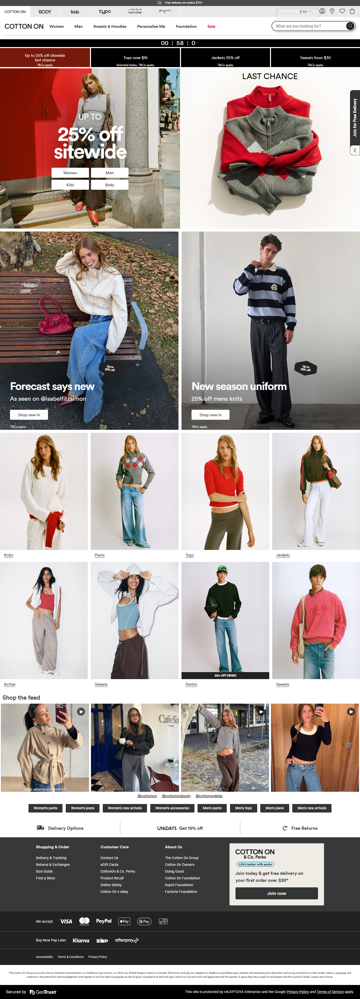

**대표 상품 이미지** (상위 6장, 출처 URL 포함)

- 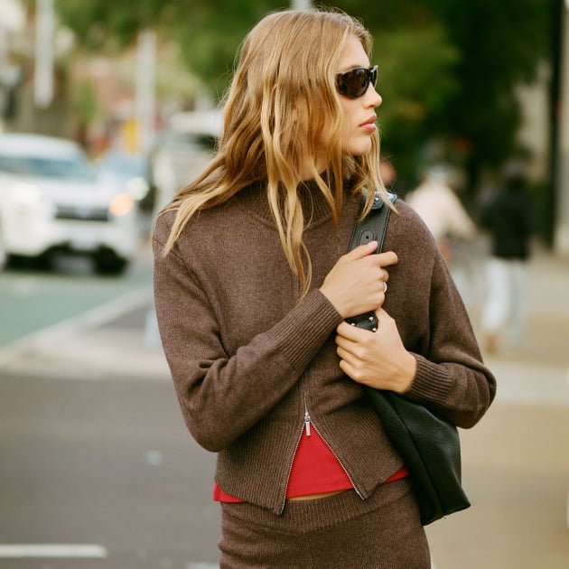 — 출처 <https://cottonon.com/on/demandware.static/-/Library-Sites-cog-megastore-shared-library/default/dwacdd28a0/group/home-page/mega-menu-tiles/C_5073900_MEGANAV_DT_MAY_AU_5086831_0526-W-4.jpg>
- 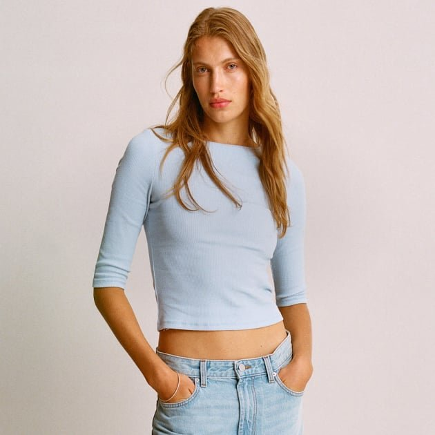 — 출처 <https://cottonon.com/on/demandware.static/-/Library-Sites-cog-megastore-shared-library/default/dwedf5b840/group/home-page/mega-menu-tiles/C_5073900_MEGANAV_DT_MAY_AU_5086831_0526-W-5.jpg>
- 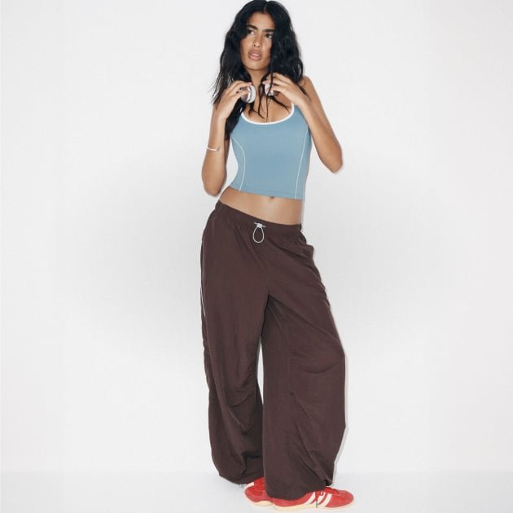 — 출처 <https://cottonon.com/on/demandware.static/-/Library-Sites-cog-megastore-shared-library/default/dwfb23e239/group/home-page/mega-menu-tiles/C_5073900_MEGANAV_DT_MAY_AU_5086831_0526-W-3.jpg>
- 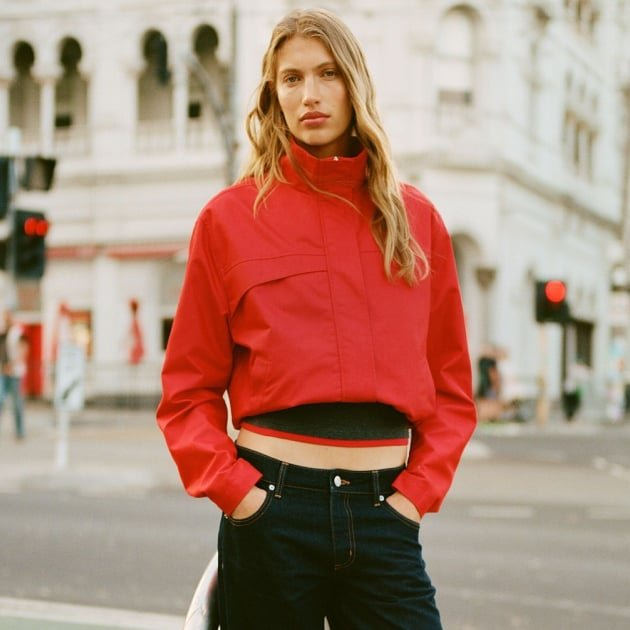 — 출처 <https://cottonon.com/on/demandware.static/-/Library-Sites-cog-megastore-shared-library/default/dwdad0a419/group/home-page/mega-menu-tiles/C_5073900_MEGANAV_DT_MAY_AU_5086831_0526-W-6.jpg>
- 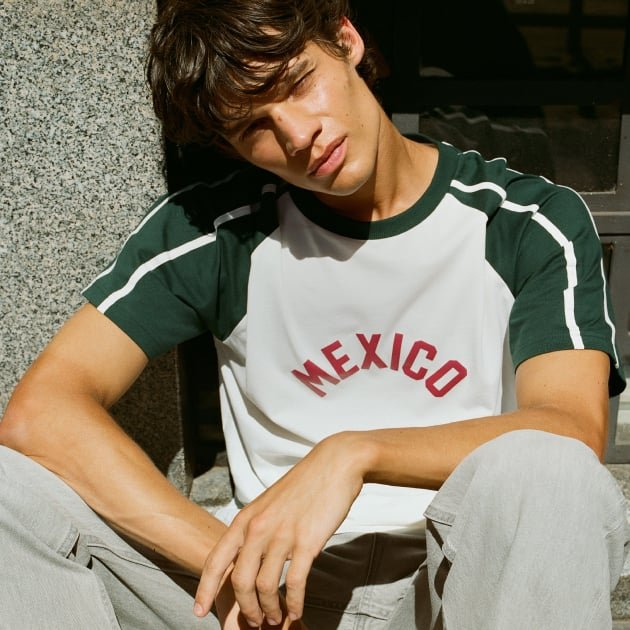 — 출처 <https://cottonon.com/on/demandware.static/-/Library-Sites-cog-megastore-shared-library/default/dwe0ceb0cd/group/home-page/mega-menu-tiles/C_5073900_MEGANAV_DT_MAY_AU_5086831_0526-M-1.jpg>
- 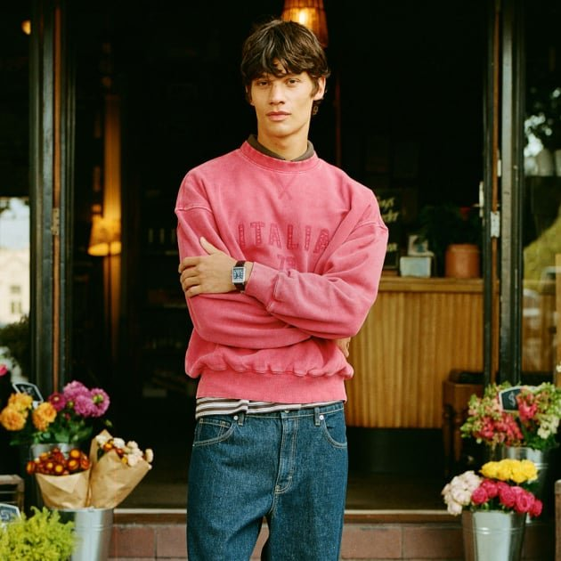 — 출처 <https://cottonon.com/on/demandware.static/-/Library-Sites-cog-megastore-shared-library/default/dwb991f359/group/home-page/mega-menu-tiles/C_5073900_MEGANAV_DT_MAY_AU_5086831_0526-M-2.jpg>

**페이지 메타 정보**

| page | title | description |
|---|---|---|
| [`home`](https://cottonon.com/AU/) | Cotton On Australia | Women's, Men's & Kids Clothing & Accessories | Shop Six Brands in one place! Discover the latest trends at Cotton On, Body, Cotton On Kids, Typo, Factorie & Supre. |

#### [David Jones](https://www.davidjones.com/)

- URL: <https://www.davidjones.com/>
- 페이지: **OK 1 · FAIL 0**

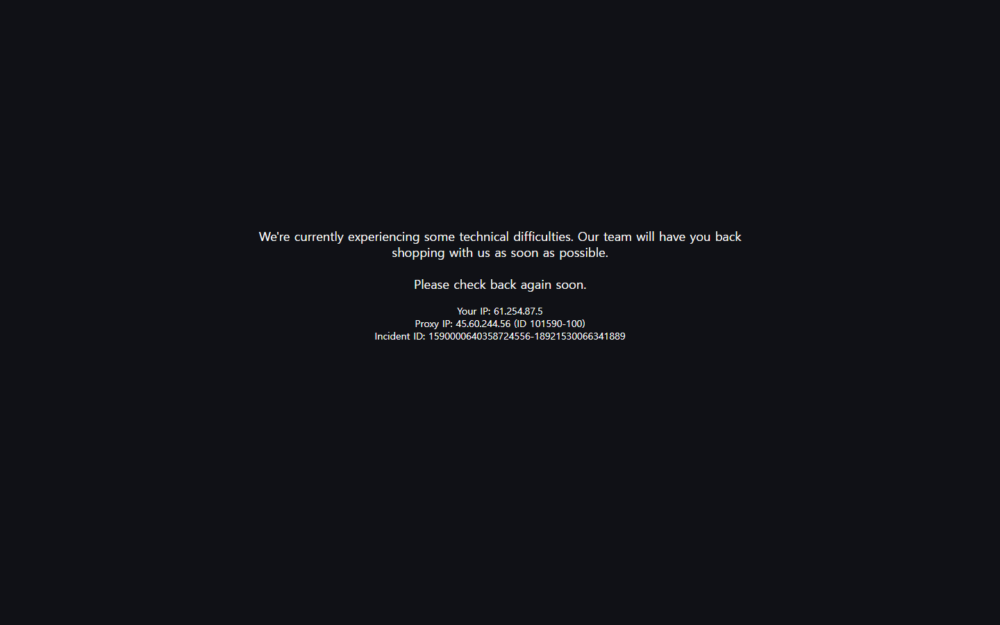

**페이지 메타 정보**

| page | title | description |
|---|---|---|
| [`home`](https://www.davidjones.com/) | Pardon Our Interruption |  |

#### [Myer](https://www.myer.com.au/)

- URL: <https://www.myer.com.au/>
- 페이지: **OK 1 · FAIL 0**

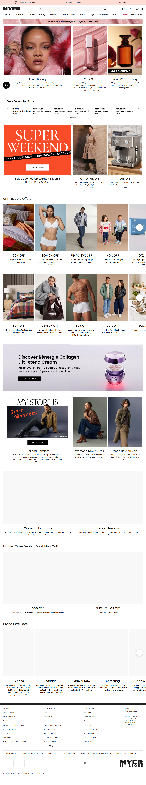

**대표 상품 이미지** (상위 6장, 출처 URL 포함)

-  — 출처 <https://content-us-5.content-cms.com/af9094ac-4ec2-4ea9-8480-e7ef2c8369de/dxresources/4a74/4a7430d7-172a-4514-ae3a-a1d4f80e67d2.jpg?resize=400px%3A200px&crop=400%3A200%3B0%2C0&output-format=webp&w=828&q=75>
-  — 출처 <https://content-us-5.content-cms.com/af9094ac-4ec2-4ea9-8480-e7ef2c8369de/dxresources/cf51/cf51ba52-8d74-449b-9617-632e12e8e7c3.jpg?resize=400px%3A200px&crop=400%3A200%3B0%2C0&output-format=webp&w=828&q=75>
-  — 출처 <https://content-us-5.content-cms.com/af9094ac-4ec2-4ea9-8480-e7ef2c8369de/dxresources/fbb4/fbb4540b-37a1-432f-b824-bfc57f4b802f.jpg?resize=400px%3A200px&crop=400%3A200%3B0%2C0&output-format=webp&w=828&q=75>
-  — 출처 <https://content-us-5.content-cms.com/af9094ac-4ec2-4ea9-8480-e7ef2c8369de/dxresources/e4ae/e4aed948-c35d-402d-9ce2-2548899ca9bd.jpg?resize=400px%3A200px&crop=400%3A200%3B0%2C0&output-format=webp&w=828&q=75>
-  — 출처 <https://content-us-5.content-cms.com/af9094ac-4ec2-4ea9-8480-e7ef2c8369de/dxresources/8361/8361f4aa-e45e-4647-9eed-fb97503e4098.jpg?resize=400px%3A200px&crop=400%3A200%3B0%2C0&output-format=webp&w=828&q=75>
-  — 출처 <https://content-us-5.content-cms.com/af9094ac-4ec2-4ea9-8480-e7ef2c8369de/dxresources/fd0c/fd0c7d5d-2ed6-4625-a71a-e8073f81418d.jpg?resize=400px%3A200px&crop=400%3A200%3B0%2C0&output-format=webp&w=828&q=75>

**페이지 메타 정보**

| page | title | description |
|---|---|---|
| [`home`](https://www.myer.com.au/) | MYER | Shop Fashion, Beauty, Homewares, Gifting and More | Shop at Myer, Australia's largest department store. Shop Fashion, Beauty, Homewares, Toys, Gifting and more with Afterpay, Velocity or Amex  |

#### [Princess Polly](https://www.princesspolly.com.au/)

- URL: <https://www.princesspolly.com.au/>
- 페이지: **OK 1 · FAIL 0**

**최근 유행 상품** (30건 · 상품명 클릭 시 해당 사이트로 이동)

| # | 상품명 | 브랜드 | 가격 | 페이지 |
|---:|---|---|---:|---|
| 1 | [Where Lovers Meet Sequin Graphic Tank Top Blue](https://www.princesspolly.com.au/products/where-lovers-meet-sequin-graphic-tank-top-blue) | Princess Polly | 60 AUD | `new` |
| 2 | [Danee Beaded Mesh Halter Top Brown](https://www.princesspolly.com.au/products/danee-beaded-mesh-halter-top-brown) | Princess Polly | 65 AUD | `new` |
| 3 | [Idiana Halter Keyhole Top Blue Stripe](https://www.princesspolly.com.au/products/idiana-halter-keyhole-top-blue-stripe) | Princess Polly | 65 AUD | `new` |
| 4 | [Quani Lace Top Black](https://www.princesspolly.com.au/products/quani-lace-top-black) | Princess Polly | 65 AUD | `new` |
| 5 | [Quani Lace Midi Skirt Black](https://www.princesspolly.com.au/products/quani-lace-midi-skirt-black) | Princess Polly | 75 AUD | `new` |
| 6 | [Daily Define Halter Tank Top Red](https://www.princesspolly.com.au/products/daily-define-halter-tank-top-red) | Princess Polly Lower Impact | 45 AUD | `new` |
| 7 | [Idiana Halter Keyhole Top Cream](https://www.princesspolly.com.au/products/idiana-halter-keyhole-top-cream) | Princess Polly | 65 AUD | `new` |
| 8 | [Edeni Lace Splice Halter Mini Dress Black](https://www.princesspolly.com.au/products/edeni-lace-splice-halter-mini-dress-black) | Princess Polly Lower Impact | 85 AUD | `new` |
| 9 | [Edeni Lace Splice Halter Mini Dress Multi](https://www.princesspolly.com.au/products/edeni-lace-splice-halter-mini-dress-multi) | Princess Polly Lower Impact | 85 AUD | `new` |
| 10 | [Picante Bias Cross Back Maxi Dress Pink Polka](https://www.princesspolly.com.au/products/picante-bias-cross-back-maxi-dress-pink-polka) | Princess Polly | 95 AUD | `new` |
| 11 | [Yalanda Cut Out Collared Top White](https://www.princesspolly.com.au/products/yalanda-cut-out-collared-top-white) | Princess Polly | 65 AUD | `new` |
| 12 | [Zarelle Graphic Halter Top Multi](https://www.princesspolly.com.au/products/zarelle-graphic-halter-top-multi) | Princess Polly Lower Impact | 50 AUD | `new` |
| 13 | [Korrine Off Shoulder Short Sleeve Lace Top Black](https://www.princesspolly.com.au/products/korrine-off-shoulder-short-sleeve-lace-top-black) | Princess Polly | 60 AUD | `new` |
| 14 | [Leocadia Scoop Neck Bead Detail Top Chocolate](https://www.princesspolly.com.au/products/leocadia-scoop-neck-bead-detail-top-chocolateolate) | Princess Polly Lower Impact | 60 AUD | `new` |
| 15 | [In My Lane Ruched Waist Midi Skirt Multi](https://www.princesspolly.com.au/products/in-my-lane-ruched-waist-midi-skirt-multi) | Princess Polly | 60 AUD | `new` |
| 16 | [In My Lane Top Multi](https://www.princesspolly.com.au/products/in-my-lane-top-multi) | Princess Polly | 55 AUD | `new` |
| 17 | [Rusten Sheer Cinched Collared Top White](https://www.princesspolly.com.au/products/rusten-sheer-cinched-collared-top-white) | Princess Polly | 65 AUD | `new` |
| 18 | [Tit For Tat Long Sleeve Draped Top Chocolate](https://www.princesspolly.com.au/products/tit-for-tat-long-sleeve-drapes-top-chocolate) | Princess Polly | 70 AUD | `new` |
| 19 | [Antonetta Off Shoulder Ruched Mini Dress Grey Marle](https://www.princesspolly.com.au/products/antonetta-off-shoulder-ruched-mini-dress-grey-marle) | Princess Polly | 85 AUD | `new` |
| 20 | [Agnessa Ruched Detail Mini Dress White](https://www.princesspolly.com.au/products/agnessa-ruched-detail-mini-dress-white) | Princess Polly | 80 AUD | `new` |

**페이지 메타 정보**

| page | title | description |
|---|---|---|
| [`new`](https://www.princesspolly.com.au/collections/new) | Shop New Arrivals Today! | Princess Polly | Shop New clothing online at Princess Polly. Buy now pay later with Afterpay. FREE & FAST shipping available. |

#### [The Iconic](https://www.theiconic.com.au/)

- URL: <https://www.theiconic.com.au/>
- 페이지: **OK 1 · FAIL 0**

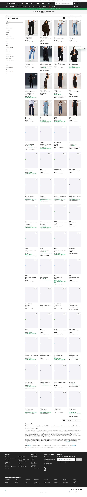

**최근 유행 상품** (12건 · 상품명 클릭 시 해당 사이트로 이동)

| # | 상품명 | 브랜드 | 가격 | 페이지 |
|---:|---|---|---:|---|
| 1 | Lola Barrel Pants | Assembly Label | 100 AUD | `new_women` |
| 2 | Trail Sherpa Jacket ICONIC EXCLUSIVE | Cotton On Body Active | 90 AUD | `new_women` |
| 3 | Ribcage Wide Leg Jeans | Levi's | 160 AUD | `new_women` |
| 4 | 501 90s Jeans | Levi's | 160 AUD | `new_women` |
| 5 | 501 Original Fit Jeans | Levi's | 160 AUD | `new_women` |
| 6 | Sportswear Phoenix Fleece HighWaisted WideLeg Pants | Nike | 100 AUD | `new_women` |
| 7 | Firebird Loose Track Pants | adidas Originals | 120 AUD | `new_women` |
| 8 | Lina Oversized Blazer | AtmosandHere | 110 AUD | `new_women` |
| 9 | Sportswear Phoenix Fleece HighWaisted Oversized Tracksuit Bottoms | Nike | 90 AUD | `new_women` |
| 10 | Originals Wide Leg Satin Pants in Leopard | adidas Originals | 120 AUD | `new_women` |
| 11 | Gigi Barrel Jeans | Rolla's | 160 AUD | `new_women` |
| 12 | Organic Cotton Barrel Leg Pants | AERE | 100 AUD | `new_women` |

**페이지 메타 정보**

| page | title | description |
|---|---|---|
| [`new_women`](https://www.theiconic.com.au/womens-clothing-just-arrived/) | Women's Clothing | Buy Women's Clothes Online Australia |- THE ICONIC | Buy women's clothing online. Designer clothing from top Australian and international fashion designers. Free and fast delivery available. Sh |

### 4.2 홍콩 _( Hong Kong )_

- 한국 수출규모 순위: **#6** · region: `asia` · tier `2` · currency `HKD`
- 수집 사이트: **5개** (성공 5)
- 메모: 무역중개 허브. 럭셔리/셀렉트 숍 발달
#### [HKTVmall](https://www.hktvmall.com/)

- URL: <https://www.hktvmall.com/>
- 페이지: **OK 1 · FAIL 0**

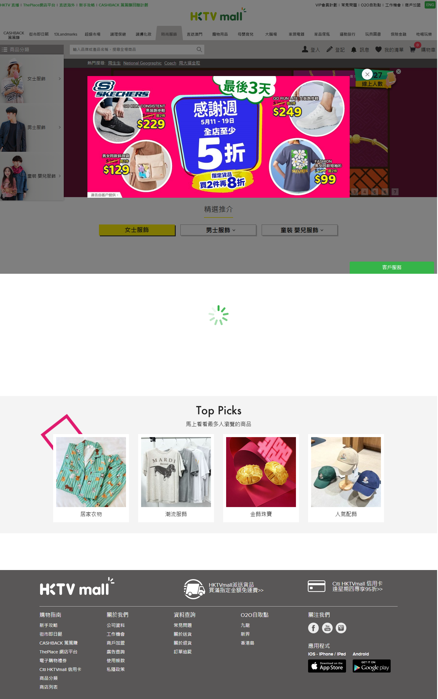

**대표 상품 이미지** (상위 6장, 출처 URL 포함)

-  — 출처 <https://images.hktvmall.com/h0293001/h0293001_mobilelogo_210317112242.jpg>
-  — 출처 <https://www.hktvmall.com/_ui/shared/common/svg/common/store_logo_not_found.png>
-  — 출처 <https://images.hktvmall.com/h7449001/h7449001_mobilelogo_200324025841.jpg>
-  — 출처 <https://cdn-media.hktvmall.com/hktv-mms/HKTV/mms/uploadStoreImage/854c/4855/993a/VUhhItZzio20260416113255.jpg>
-  — 출처 <https://images.hktvmall.com/h7794001/h7794001_mobilelogo_240503095653.jpg>
-  — 출처 <https://images.hktvmall.com/h7140001/h7140001_mobilelogo_191128061225.jpg>

**페이지 메타 정보**

| page | title | description |
|---|---|---|
| [`home`](https://www.hktvmall.com/) | 時尚服飾 | HKTVmall 香港最大網購平台 | 韓國直送時裝！價格緊貼首爾，每週超過3,000件新款時裝上架，週一至週三更可享新到女裝折上折優惠！ Fossil、GUESS、Salad、hellolulu、ARTĒ Madrid、周大福及六福珠寶等國際品牌進駐HKTVmall，品牌正貨保證，更提供網上獨家優惠，讓你安心體驗網上 |

#### [i.t](https://www.ithk.com/)

- URL: <https://www.ithk.com/>
- 페이지: **OK 1 · FAIL 0**

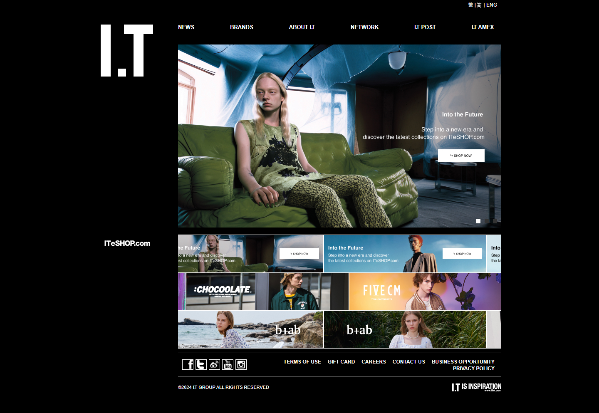

**대표 상품 이미지** (상위 6장, 출처 URL 포함)

-  — 출처 <https://www.ithk.com/storage/main_banner/777x440_1.jpg>
- 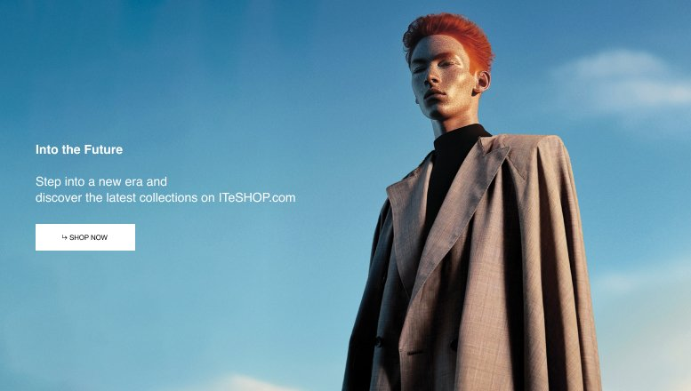 — 출처 <https://www.ithk.com/storage/main_banner/777x440_2.jpg>
-  — 출처 <https://www.ithk.com/storage/main_banner/777x440_3.jpg>

**페이지 메타 정보**

| page | title | description |
|---|---|---|
| [`home`](https://www.ithk.com/eng/html/front/index.html) | I.T - Home | I.T Official Website | Being an unique multi-brand fashion house, I.T has been bringing in the most cutting edge fashion labels around the g |

#### [Kapok](https://ka-pok.com/)

- URL: <https://ka-pok.com/>
- 페이지: **OK 1 · FAIL 0**

**최근 유행 상품** (30건 · 상품명 클릭 시 해당 사이트로 이동)

| # | 상품명 | 브랜드 | 가격 | 페이지 |
|---:|---|---|---:|---|
| 1 | [Cambridge Basket](https://ka-pok.com/products/cambridge-basket) | Astier de Villatte | 1,670 HKD | `home` |
| 2 | [Small Loaf Crossbody](https://ka-pok.com/products/small-loaf-crossbody-4) | Future Classics | 1,880 HKD | `home` |
| 3 | [Oversized Petal Messenger](https://ka-pok.com/products/oversized-petal-messenger) | Future Classics | 2,980 HKD | `home` |
| 4 | [Oversized Petal Hobo](https://ka-pok.com/products/oversized-petal-hobo) | Future Classics | 2,780 HKD | `home` |
| 5 | [Medium Boat Tote](https://ka-pok.com/products/medium-boat-tote) | Future Classics | 2,180 HKD | `home` |
| 6 | [Mini Postbox Crossbody](https://ka-pok.com/products/mini-postbox-crossbody) | Future Classics | 1,780 HKD | `home` |
| 7 | [Medium Convertible Bucket](https://ka-pok.com/products/medium-convertible-bucket) | Future Classics | 2,180 HKD | `home` |
| 8 | [Large Petal Hobo](https://ka-pok.com/products/large-petal-hobo-3) | Future Classics | 2,580 HKD | `home` |
| 9 | [Large Petal Hobo](https://ka-pok.com/products/large-petal-hobo-2) | Future Classics | 2,580 HKD | `home` |
| 10 | [Drew Jean - Lapis Wash](https://ka-pok.com/products/drew-jean-lapis-wash) | Damson Madder | 1,390 HKD | `home` |
| 11 | [Caillavet Cotton Mini Patch Coeur](https://ka-pok.com/products/caillavet-cotton-mini-patch-coeur) | Maison Labiche | 1,190 HKD | `home` |
| 12 | [1000pcs Puzzle - Vintage Cats](https://ka-pok.com/products/1000pcs-puzzle-vintage-cats) | Cavallini & Co. | 290 HKD | `home` |
| 13 | [1000 Piece Puzzle - Dogs](https://ka-pok.com/products/cavallini-co-1000-piece-puzzle-dogs) | Cavallini & Co. | 290 HKD | `home` |
| 14 | [Camel Caeman Cotton Twill Pants](https://ka-pok.com/products/in-good-company-cotton-twill-caeman-pants-camel) | In Good Company | 763 HKD | `home` |
| 15 | [Small Cradle Shoulder](https://ka-pok.com/products/small-cradle-shoulder-2) | Future Classics | 1,880 HKD | `home` |
| 16 | [GOCapSC-Field-LoopyMU-LoopyMU-Lightgrey-M/L](https://ka-pok.com/products/ciele-gocapsc-field-loopymu-loopymu-lightgrey-m-l) | Ciele | 266 HKD | `home` |
| 17 | [Sac A Dos Tech Rebound](https://ka-pok.com/products/sac-a-dos-tech-rebound) | A.P.C. | 2,790 HKD | `home` |
| 18 | [OSM Indian Sandalwood Hand Cream](https://ka-pok.com/products/osm-indian-sandalwood-hand-cream) | Aery Living | 190 HKD | `home` |
| 19 | [Kep Crossbody Bag 2L](https://ka-pok.com/products/elliker-kep-crossbody-bag-2l) | Elliker | 429 HKD | `home` |
| 20 | [Backpack Tote](https://ka-pok.com/products/backpack-tote) | Elliker | 890 HKD | `home` |

**대표 상품 이미지** (상위 6장, 출처 URL 포함)

-  — 출처 <https://ka-pok.com/cdn/shop/files/shapes.png?v=1721454307>
- 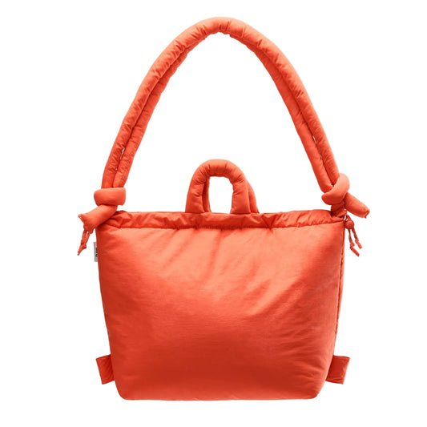 — 출처 <https://ka-pok.com/cdn/shop/files/OlendOnaSoftBagOna-Coral.webp?v=1777449663&width=533>
-  — 출처 <https://ka-pok.com/cdn/shop/files/OlendOnaSoftBagOna-Coral.webp?v=1777449663>
-  — 출처 <https://ka-pok.com/cdn/shop/files/OlendOnaSoftBagOna-Coral3.webp?v=1748508119&width=533>
- 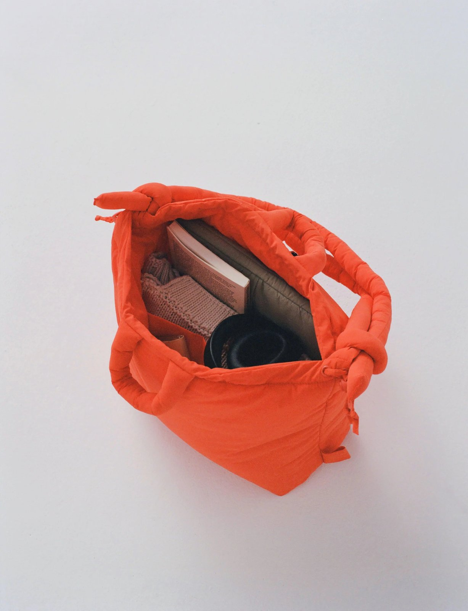 — 출처 <https://ka-pok.com/cdn/shop/files/OlendOnaSoftBagOna-Coral3.webp?v=1748508119>
- 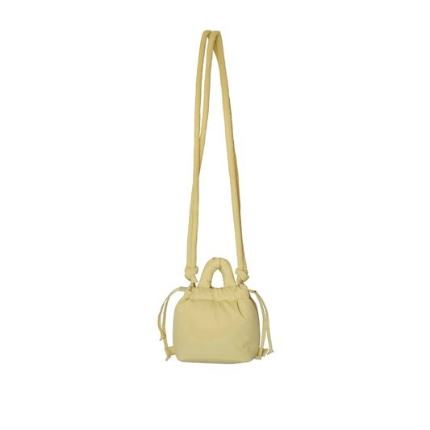 — 출처 <https://ka-pok.com/cdn/shop/files/MicroOnaSoftBaglime.webp?v=1776331017&width=533>

**페이지 메타 정보**

| page | title | description |
|---|---|---|
| [`home`](https://ka-pok.com/) | kapok - Hong Kong Fashion and Lifestyle Select Shop | Over 340 international designer brands including fashion, lifestyle, accessories etc. at kapok.com. Free local shipping available. |

#### [Lane Crawford](https://www.lanecrawford.com/)

- URL: <https://www.lanecrawford.com/>
- 페이지: **OK 1 · FAIL 0**

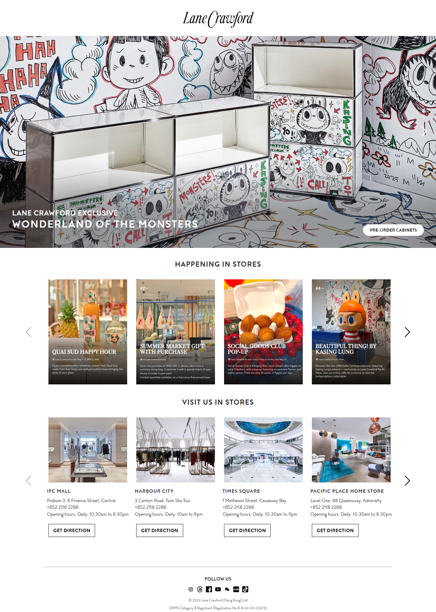

**대표 상품 이미지** (상위 6장, 출처 URL 포함)

- 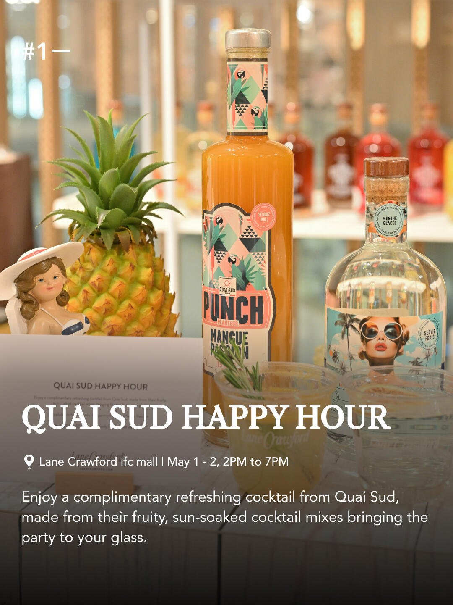 — 출처 <https://media.lanecrawford.com/feature/hp_temp_Happening-in-stores-20260430-1.jpg>
-  — 출처 <https://media.lanecrawford.com/feature/hp_temp_Happening-in-stores-20260430-2.jpg>
- 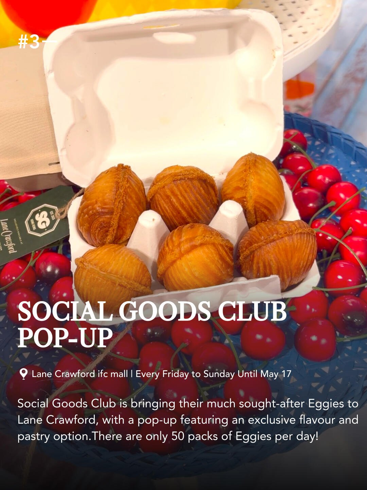 — 출처 <https://media.lanecrawford.com/feature/hp_temp_Happening-in-stores-20260430-3.jpg>
-  — 출처 <https://media.lanecrawford.com/feature/hp_temp_Happening-in-stores-20260430-4.jpg>
- 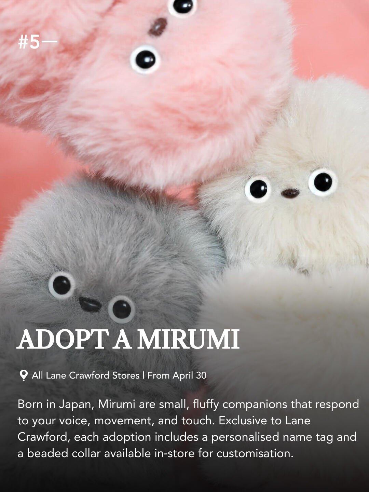 — 출처 <https://media.lanecrawford.com/feature/hp_temp_Happening-in-stores-20260430-5.jpg>
- 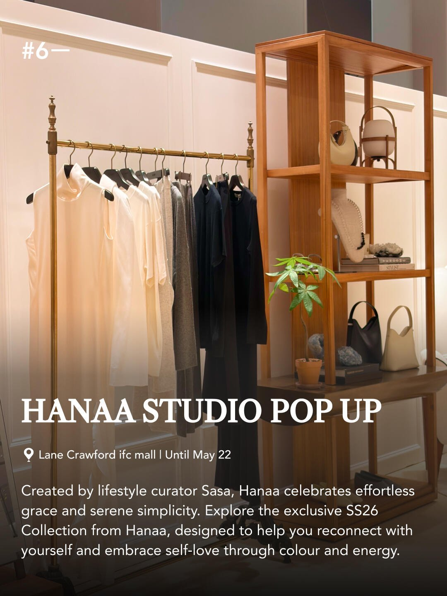 — 출처 <https://media.lanecrawford.com/feature/hp_temp_Happening-in-stores-20260430-6.jpg>

**페이지 메타 정보**

| page | title | description |
|---|---|---|
| [`home`](https://media.lanecrawford.com/maintenance/row.html) | Lane Crawford |  |

#### [Zalora Hong Kong](https://www.zalora.com.hk/)

- URL: <https://www.zalora.com.hk/>
- 페이지: **OK 1 · FAIL 0**

**페이지 메타 정보**

| page | title | description |
|---|---|---|
| [`home`](https://www.zalora.com.hk/) | Access to this page has been denied | px-captcha |

### 4.3 한국 _( South Korea )_

- 한국 수출규모 순위: **#30** · region: `asia` · tier `1` · currency `KRW`
- 수집 사이트: **4개** (성공 3)
- 메모: 비교 기준 (자국). 국내 사업동향 센싱
#### [29CM](https://www.29cm.co.kr/)

- URL: <https://www.29cm.co.kr/>
- 페이지: **OK 1 · FAIL 0**

**최근 유행 상품** (50건 · 상품명 클릭 시 해당 사이트로 이동)

| # | 상품명 | 브랜드 | 가격 | 페이지 |
|---:|---|---|---:|---|
| 1 | [[리우드]토르 수영복(SS26)_07T085912](https://product.29cm.co.kr/catalog/3965894) | 리우드 | 74,550 KRW | `home` |
| 2 | [[리우드]카밀 런치박스(SS26) _07T082605](https://product.29cm.co.kr/catalog/3965892) | 리우드 | 39,050 KRW | `home` |
| 3 | [[리우드]맥스 반팔 수영복(SS26)_07T085911](https://product.29cm.co.kr/catalog/3965888) | 리우드 | 74,550 KRW | `home` |
| 4 | [Percale Pillow Sham - Shaded Yellow (50x70)](https://product.29cm.co.kr/catalog/3629307) | 테클라 | 71,250 KRW | `home` |
| 5 | [Percale Duvet Cover - Shaded Yellow - Single (160x210)](https://product.29cm.co.kr/catalog/3629285) | 테클라 | 308,750 KRW | `home` |
| 6 | [Percale Duvet Cover - Shaded Yellow - Double (220x240)](https://product.29cm.co.kr/catalog/3851965) | 테클라 | 498,750 KRW | `home` |
| 7 | [Washcloth - Racing Green (30x30)](https://product.29cm.co.kr/catalog/2879731) | 테클라 | 28,980 KRW | `home` |
| 8 | [Washcloth - Sky Blue (30x30)](https://product.29cm.co.kr/catalog/3851974) | 테클라 | 28,980 KRW | `home` |
| 9 | [Guest towel - Kodiak Stripes (30x50)](https://product.29cm.co.kr/catalog/2879686) | 테클라 | 39,900 KRW | `home` |
| 10 | [ONE SHOULDER RAGLAN T-SHIRT_SKY BLUE](https://product.29cm.co.kr/catalog/3962506) | 셀리테일즈 | 79,200 KRW | `home` |
| 11 | [ONE SHOULDER RAGLAN T-SHIRT_PINK](https://product.29cm.co.kr/catalog/3962502) | 셀리테일즈 | 79,200 KRW | `home` |
| 12 | [STRIPE HALTER NECK TOP_CHARCOAL](https://product.29cm.co.kr/catalog/3962492) | 셀리테일즈 | 40,500 KRW | `home` |
| 13 | [VIVID SLIM SPAN HALF SLEEVE T-SHIRT (APPLE MINT)](https://product.29cm.co.kr/catalog/3946890) | 론크 | 34,880 KRW | `home` |
| 14 | [[루피타 PICK] VIVID SLIM SPAN HALF SLEEVE T-SHIRT (RED)](https://product.29cm.co.kr/catalog/3946893) | 론크 | 34,880 KRW | `home` |
| 15 | [[루피타 PICK] FLORAL EMBROIDERY CROP BLOUSE (IVORY)](https://product.29cm.co.kr/catalog/3947148) | 론크 | 116,530 KRW | `home` |
| 16 | [House Cushion Frame](https://product.29cm.co.kr/catalog/3974483) | 레베베 | 27,690 KRW | `home` |
| 17 | [[Washable] Ring My Bear](https://product.29cm.co.kr/catalog/3974479) | 레베베 | 39,050 KRW | `home` |
| 18 | [A Touch of Stripe Set](https://product.29cm.co.kr/catalog/3974471) | 레베베 | 30,530 KRW | `home` |
| 19 | [원형 꼬꼬떼 18cm 화이트 트러플 ST1018107](https://product.29cm.co.kr/catalog/489497) | 스타우브 | 252,750 KRW | `home` |
| 20 | [원형 꼬꼬떼 20cm 화이트 트러플 ST1020107](https://product.29cm.co.kr/catalog/489478) | 스타우브 | 278,250 KRW | `home` |

**대표 상품 이미지** (상위 6장, 출처 URL 포함)

-  — 출처 <https://img.29cm.co.kr/cms/202605/11f1501f461a68bb8e7df175bdf309b9.png?width=3840&format=webp>
-  — 출처 <https://img.29cm.co.kr/cms/202605/11f1501f34e88df083a40543e3c0ee3c.jpg?width=3840&format=webp>
-  — 출처 <https://img.29cm.co.kr/cms/202605/11f1501f279ec28083a4755898ac0118.png?width=3840&format=webp>
- 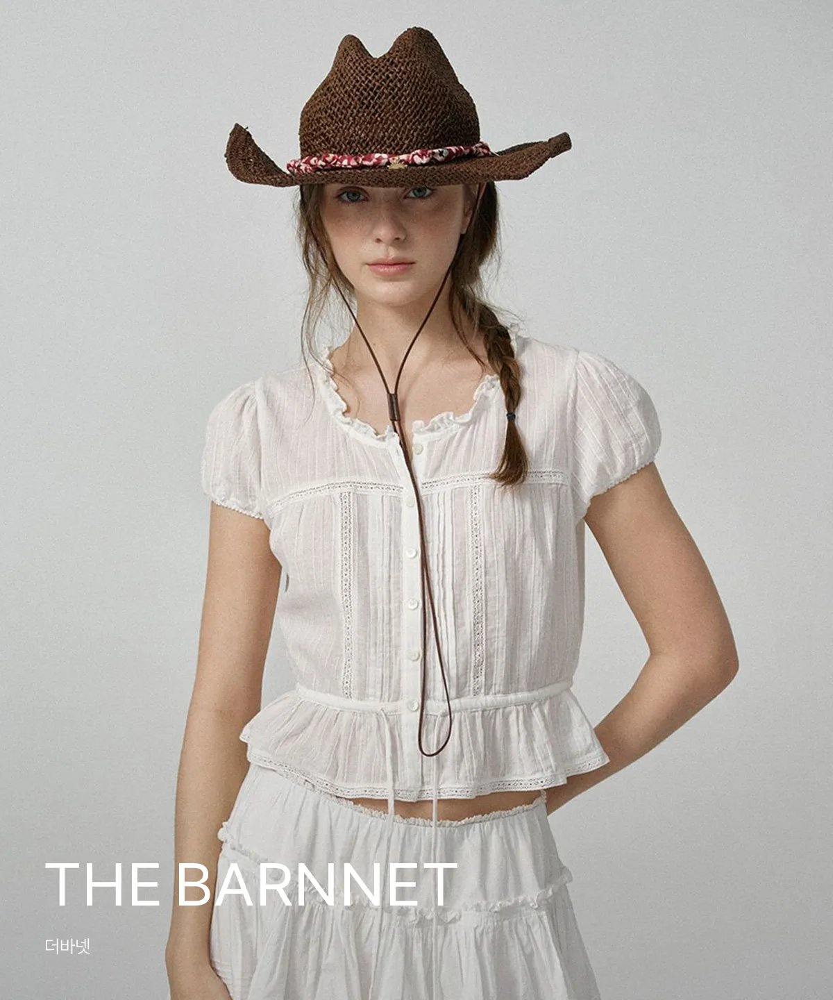 — 출처 <https://img.29cm.co.kr/cms/202605/11f14f59246d91aa83a43fe78b9c14f0.jpg?width=3840&format=webp>
-  — 출처 <https://img.29cm.co.kr/cms/202605/11f14f58fccf5b4683a4dd35be43c951.jpg?width=3840&format=webp>
-  — 출처 <https://img.29cm.co.kr/cms/202605/11f14f58dc43e78883a4db3e05b2ce57.jpg?width=3840&format=webp>

**페이지 메타 정보**

| page | title | description |
|---|---|---|
| [`home`](https://www.29cm.co.kr/) | 감도 깊은 취향 셀렉트샵 29CM | 패션, 라이프스타일, 컬처까지 29CM만의 감도 깊은 셀렉션을 만나보세요. |

#### [Musinsa](https://www.musinsa.com/)

- URL: <https://www.musinsa.com/>
- 페이지: **OK 0 · FAIL 1**

**실패 페이지**

- `home` — robots_disallowed

#### [W Concept](https://www.wconcept.co.kr/)

- URL: <https://www.wconcept.co.kr/>
- 페이지: **OK 1 · FAIL 0**

**최근 유행 상품** (20건 · 상품명 클릭 시 해당 사이트로 이동)

| # | 상품명 | 브랜드 | 가격 | 페이지 |
|---:|---|---|---:|---|
| 1 | [2160 경량 플레어 와이드 팬츠 (2 COLORS)](https://m.wconcept.co.kr/Product/306773246) | 마롭 | 66,211 KRW | `home` |
| 2 | [6607  썸머 반팔 자켓 (2 COLORS)](https://m.wconcept.co.kr/Product/306925808) | 마롭 | 119,046 KRW | `home` |
| 3 | [3115 크링클 랩 스커트 (2 COLORS)](https://m.wconcept.co.kr/Product/308385786) | 마롭 | 66,211 KRW | `home` |
| 4 | [9107 경량 와이드 데님팬츠 (3 COLORS)](https://m.wconcept.co.kr/Product/301618956) | 마롭 | 59,523 KRW | `home` |
| 5 | [[경은 PICK] 6610 노카라 반팔자켓 (2 COLORS)](https://m.wconcept.co.kr/Product/308385668) | 마롭 | 119,715 KRW | `home` |
| 6 | [[이환 PICK] 9106 세미 와이드 데님팬츠 (6 color)](https://m.wconcept.co.kr/Product/301850813) | 마롭 | 59,523 KRW | `home` |
| 7 | [[단독] 9153 초경량 텐셀밴딩 데님 (그레이)](https://m.wconcept.co.kr/Product/308389708) | 마롭 | 77,455 KRW | `home` |
| 8 | [[유주 PICK] 2174 경량 치노 릴렉스 팬츠 (베이지)](https://m.wconcept.co.kr/Product/308385850) | 마롭 | 77,455 KRW | `home` |
| 9 | [9160 린넨 와이드 팬츠 (2 COLORS)](https://m.wconcept.co.kr/Product/308389745) | 마롭 | 77,455 KRW | `home` |
| 10 | [[단독][진주언니,채랑 PICK] 9157 소프트 칼라데님 팬츠 (베이지)](https://m.wconcept.co.kr/Product/308151411) | 마롭 | 72,899 KRW | `home` |
| 11 | [2175 경량 슬림 와이드 팬츠 (다크 그레이)](https://m.wconcept.co.kr/Product/308385823) | 마롭 | 70,349 KRW | `home` |
| 12 | [[지유, 여울 PICK] 7106 슬리브리스 롱 원피스 (화이트)](https://m.wconcept.co.kr/Product/308385752) | 마롭 | 133,091 KRW | `home` |
| 13 | [9130 경량 린넨 컬러데님 (3 COLORS)](https://m.wconcept.co.kr/Product/305811519) | 마롭 | 70,349 KRW | `home` |
| 14 | [6607  썸머 반팔 자켓 셋업 (2 COLORS)](https://m.wconcept.co.kr/Product/306926086) | 마롭 | 196,836 KRW | `home` |
| 15 | [2306 경량 골지 스웨트 팬츠 (그레이)](https://m.wconcept.co.kr/Product/308550021) | 마롭 | 70,684 KRW | `home` |
| 16 | [[진주언니 PICK] [단독] 2172 원턱 와이드 팬츠 (다크 그레이)](https://m.wconcept.co.kr/Product/308149663) | 마롭 | 72,899 KRW | `home` |
| 17 | [9134 레귤러 부츠컷 데님 (4COLORS)](https://m.wconcept.co.kr/Product/306043639) | 마롭 | 77,455 KRW | `home` |
| 18 | [[진주언니,지구,채랑 PICK] 4124 나일론 스트라이프 셔츠 (2 COLORS)](https://m.wconcept.co.kr/Product/308147960) | 마롭 | 79,587 KRW | `home` |
| 19 | [5214 시그니쳐 반팔티 (화이트)](https://m.wconcept.co.kr/Product/308389913) | 마롭 | 34,028 KRW | `home` |
| 20 | [9153 초경량 텐셀밴딩 데님 (라이트 인디고)](https://m.wconcept.co.kr/Product/308389704) | 마롭 | 77,455 KRW | `home` |

**페이지 메타 정보**

| page | title | description |
|---|---|---|
| [`home`](https://www.wconcept.co.kr/) | _(empty)_ |  |

#### [Zigzag](https://zigzag.kr/)

- URL: <https://zigzag.kr/>
- 페이지: **OK 1 · FAIL 0**

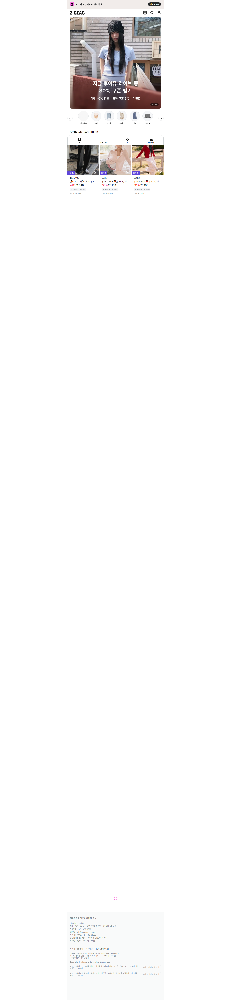

**최근 유행 상품** (36건 · 상품명 클릭 시 해당 사이트로 이동)

| # | 상품명 | 브랜드 | 가격 | 페이지 |
|---:|---|---|---:|---|
| 1 | [[🔥후기인증/🎖️1등슬랙스] made. 모먼트 투커버 올데이슬랙스 (+숏/베이직/롱ver) - 4 size](https://store.zigzag.kr/app/catalog/products/136095576?browsing_type=NATIVE_BROWSER) | 슬로우앤드 | 31,840 KRW | `home` |
| 2 | [[+여름🌴/50만장돌파/made] 허쉬 코튼 와이드팬츠 (숏/기본/롱)](https://store.zigzag.kr/app/catalog/products/143224732?browsing_type=NATIVE_BROWSER) | 리얼코코 | 16,110 KRW | `home` |
| 3 | [[35만장판매] [B-BASIC] 스탠다드 유넥 반팔티 (3SIZE)](https://store.zigzag.kr/app/catalog/products/138075679?browsing_type=NATIVE_BROWSER) | 블랙업 | 17,350 KRW | `home` |
| 4 | [[20%쿠폰][IS-BASIC] mts727 이즈 코튼 슬림 반팔 티셔츠](https://store.zigzag.kr/app/catalog/products/162044286?browsing_type=NATIVE_BROWSER) | 에드모어 | 11,860 KRW | `home` |
| 5 | [[예약판매]랩 반팔 티셔츠_MIWHWG602A/MIWHWG78RA](https://store.zigzag.kr/app/catalog/products/169644772?browsing_type=NATIVE_BROWSER) | 미쏘 | 22,420 KRW | `home` |
| 6 | [헨리넥 반팔티_SPRWG24G01](https://store.zigzag.kr/app/catalog/products/168759103?browsing_type=NATIVE_BROWSER) | 스파오 | 23,310 KRW | `home` |
| 7 | [[✨구김걱정NO/💐하객룩추천] made. 세미부츠컷 찰랑슬랙스 (+베이직/롱ver) - 4 size](https://store.zigzag.kr/app/catalog/products/142355088?browsing_type=NATIVE_BROWSER) | 슬로우앤드 | 31,120 KRW | `home` |
| 8 | [[💗기본템/부유방커버] made. 쫀쫀 커버핏 슬리브리스 (유교걸나시!) - 7 color](https://store.zigzag.kr/app/catalog/products/160291278?browsing_type=NATIVE_BROWSER) | 슬로우앤드 | 15,210 KRW | `home` |
| 9 | [[🌸사계절필수/인생티♥] made. 솔트 클린 반팔티셔츠 (스탠다드핏/루즈핏) - 7 color](https://store.zigzag.kr/app/catalog/products/141373178?browsing_type=NATIVE_BROWSER) | 슬로우앤드 | 12,510 KRW | `home` |
| 10 | [[3타입][무지/배색/스트라이프][MADE] 러브유 보트넥 레이어드 민소매 골지나시 (44~110) (빅사이즈나시-끈나시-민소매-무지나시-스트라이프나시--부유방커버나시)](https://store.zigzag.kr/app/catalog/products/159214859?browsing_type=NATIVE_BROWSER) | 핫핑 | 14,360 KRW | `home` |
| 11 | [[오픈할인중] made. 내츄럴 소프트 블라우스 & 스커트 SET (개별 구매 가능!) - 2 size](https://store.zigzag.kr/app/catalog/products/169981192?browsing_type=NATIVE_BROWSER) | 슬로우앤드 | 24,210 KRW | `home` |
| 12 | [여리핏 썸머부클 브이니트 - 4 color](https://store.zigzag.kr/app/catalog/products/139679479?browsing_type=NATIVE_BROWSER) | 슬로우앤드 | 26,820 KRW | `home` |
| 13 | [[🏆역대급100만장/편안함최강] made. 마켓 와이드 트레이닝슬랙스 (+숏/베이직/롱ver) - 3 size](https://store.zigzag.kr/app/catalog/products/141360158?browsing_type=NATIVE_BROWSER) | 슬로우앤드 | 26,320 KRW | `home` |
| 14 | [[🌴여름ver추가🏆매시즌베스트/FREE+L/사이즈선택/살안타템/하객룩][간절기/여름가디건][MADE]마렌라운드가디건 - 9color](https://store.zigzag.kr/app/catalog/products/156389482?browsing_type=NATIVE_BROWSER) | 니썸 | 25,920 KRW | `home` |
| 15 | [[RE:MOMENT/월요일 순차출고] made. 카엘 퍼프 롱원피스 3color! (여름원피스/러블리/체형커버/플레어원피스)](https://store.zigzag.kr/app/catalog/products/169989878?browsing_type=NATIVE_BROWSER) | 오디너리먼트 | 43,890 KRW | `home` |
| 16 | [[여름청바지👖/후기최고] made. 투데이 썸머라이트 데님팬츠 (+베이직/롱ver) - 4 size](https://store.zigzag.kr/app/catalog/products/122809429?browsing_type=NATIVE_BROWSER) | 슬로우앤드 | 26,820 KRW | `home` |
| 17 | [[캉캉레이스💕/바스락/핀터무드][MADE] 뮤이니 레이스 캉캉 맥시 롱스커트(44~110) (빅사이즈롱스커트-밴딩스커트-캉캉스커트-레이스스커트-사이드리본스커트-롱치마)](https://store.zigzag.kr/app/catalog/products/169984220?browsing_type=NATIVE_BROWSER) | 핫핑 | 30,240 KRW | `home` |
| 18 | [B3195 프릴 세일러 블라우스](https://store.zigzag.kr/app/catalog/products/169981714?browsing_type=NATIVE_BROWSER) | 딘트 | 97,000 KRW | `home` |
| 19 | [[30만장돌파/MADE]누벨 데일리 나일론 슬릿 롱 스커트 (S-L/여름스커트/바스락스커트/데일리룩/출근룩/h라인스커트/나일론치마/롱치마)](https://store.zigzag.kr/app/catalog/products/140798161?browsing_type=NATIVE_BROWSER) | 케이클럽 | 21,500 KRW | `home` |
| 20 | [[+반팔💙/하객룩/made] 드멜린 블라우스](https://store.zigzag.kr/app/catalog/products/160291434?browsing_type=NATIVE_BROWSER) | 리얼코코 | 25,130 KRW | `home` |

**대표 상품 이미지** (상위 6장, 출처 URL 포함)

-  — 출처 <https://cf.image-farm.s.zigzag.kr/original/cms/2026/04/28/202604280154164065_020417.jpg?format=webp&quality=80&width=1029&height=1188>
- 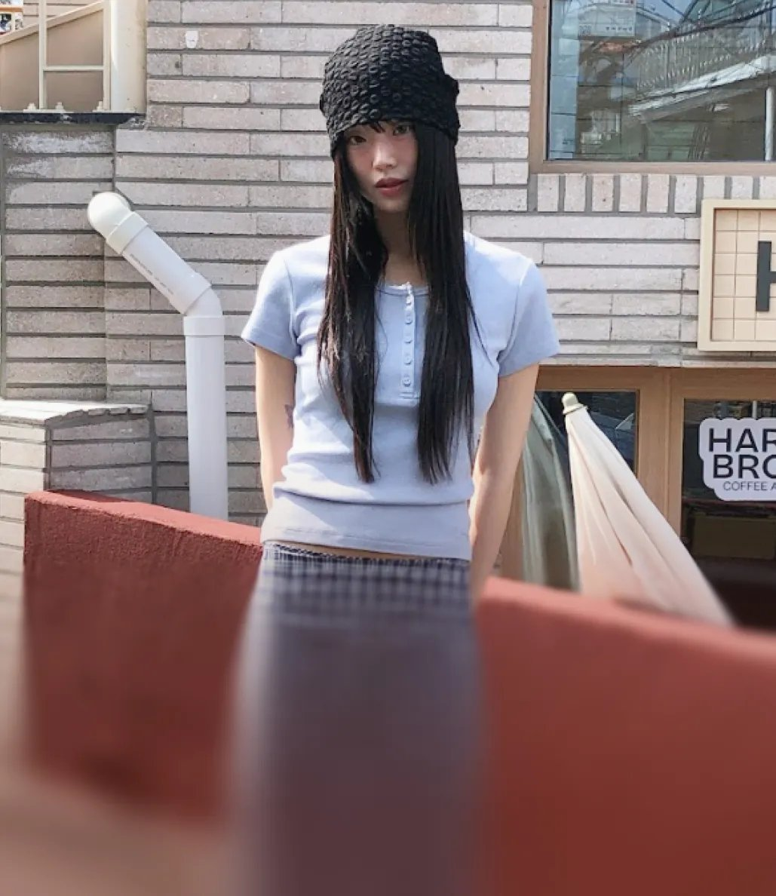 — 출처 <https://cf.image-farm.s.zigzag.kr/original/cms/2026/05/08/202605080623562363_082057.jpg?width=1029&height=1188&quality=80&format=webp&transparent=true>
- 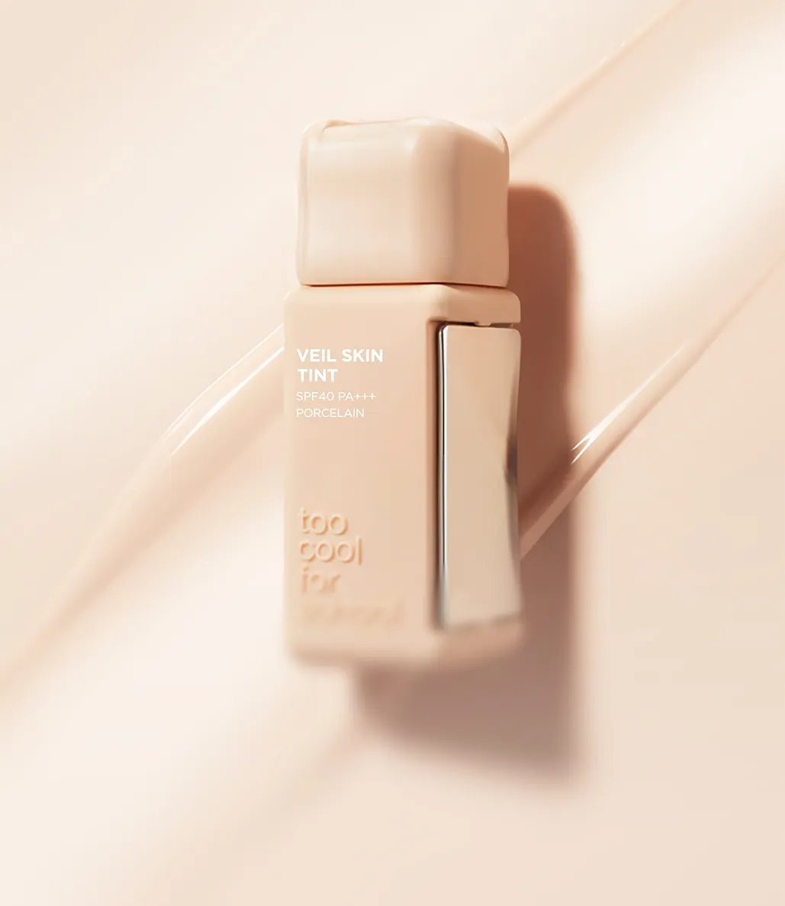 — 출처 <https://cf.image-farm.s.zigzag.kr/original/cms/2026/05/10/202605101416224017_098832.jpg?width=1029&height=1188&quality=80&format=webp&transparent=true>
-  — 출처 <https://cf.image-farm.s.zigzag.kr/original/cms/2026/05/10/202605101549405370_091331.jpg?width=1029&height=1188&quality=80&format=webp&transparent=true>
- 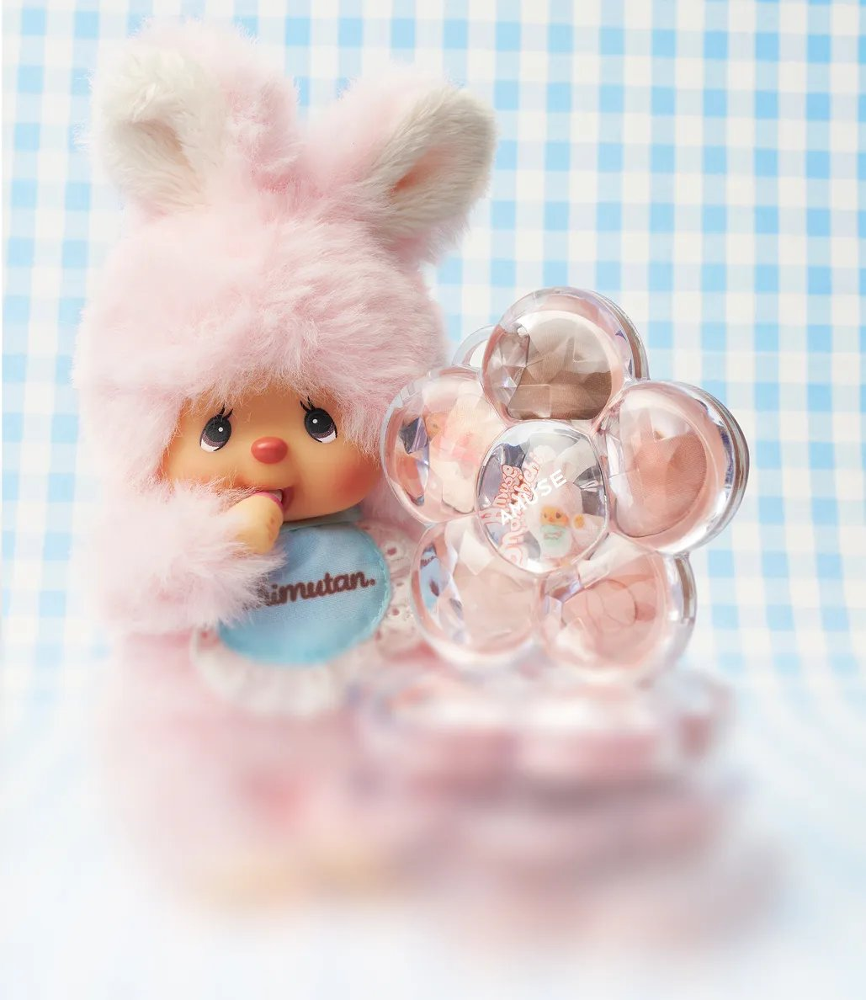 — 출처 <https://cf.image-farm.s.zigzag.kr/original/cms/2026/05/10/202605101547543621_017951.jpg?width=1029&height=1188&quality=80&format=webp&transparent=true>
- 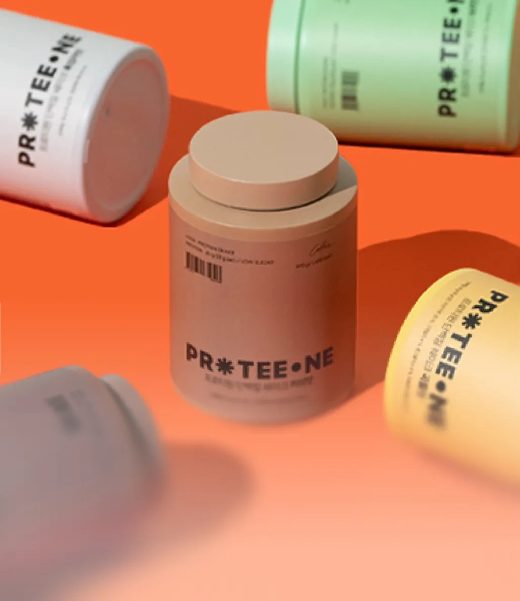 — 출처 <https://cf.image-farm.s.zigzag.kr/original/cms/2026/05/16/202605160933047641_059363.jpg?width=1029&height=1188&quality=80&format=webp&transparent=true>

**페이지 메타 정보**

| page | title | description |
|---|---|---|
| [`home`](https://zigzag.kr/) | 지그재그 스토어 | 4,000만 여성이 선택한 올인원 쇼핑 앱 지그재그 - 제가 알아서 살게요. |

### 4.4 필리핀 _( Philippines )_

- 한국 수출규모 순위: **#16** · region: `asia` · tier `2` · currency `PHP`
- 수집 사이트: **5개** (성공 4)
- 메모: 영어 사용 + K-콘텐츠 영향력 높음
#### [Bench](https://www.bench.com.ph/)

- URL: <https://www.bench.com.ph/>
- 페이지: **OK 0 · FAIL 1**

**실패 페이지**

- `home` — http_status_522

#### [Lazada Philippines](https://www.lazada.com.ph/)

- URL: <https://www.lazada.com.ph/>
- 페이지: **OK 1 · FAIL 0**

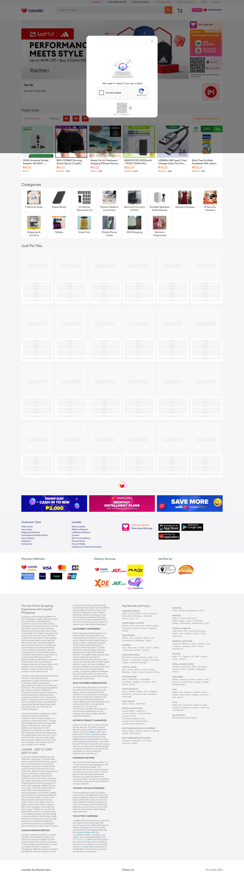

**대표 상품 이미지** (상위 6장, 출처 URL 포함)

-  — 출처 <https://img.lazcdn.com/us/domino/4c7322a5c7c56033b88982d607e12587.png>
-  — 출처 <https://img.lazcdn.com/g/tps/images/ims-web/TB19SB7aMFY.1VjSZFnXXcFHXXa.png>
- 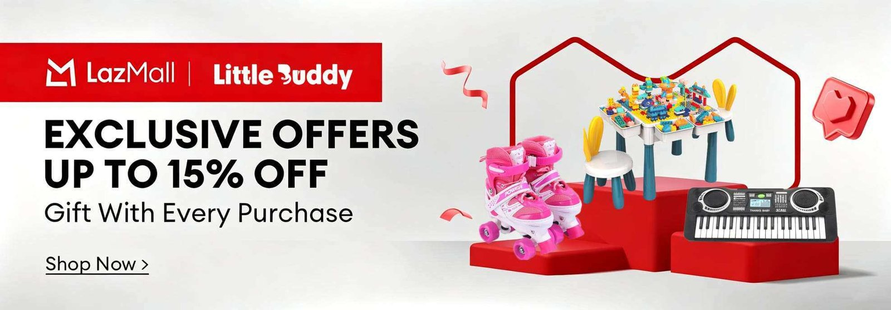 — 출처 <https://img.lazcdn.com/g/tps/imgextra/i3/O1CN01N7boek1IN5g3FvMMa_!!6000000000880-0-tps-1976-688.jpg_2200x2200q80.jpg>
-  — 출처 <https://img.lazcdn.com/g/tps/imgextra/i3/O1CN01ljSLYD1v1oI5TP5Ak_!!6000000006113-0-tps-1976-688.jpg_2200x2200q80.jpg>
- 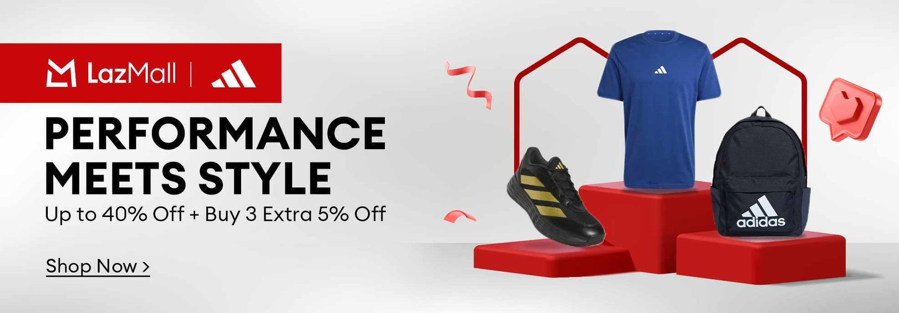 — 출처 <https://img.lazcdn.com/g/tps/imgextra/i3/O1CN01h4dngk27d9yg6dnPk_!!6000000007819-0-tps-1976-688.jpg_2200x2200q80.jpg>
-  — 출처 <https://img.lazcdn.com/g/tps/imgextra/i2/O1CN01XdzV9u1cPeCm6ekBB_!!6000000003593-0-tps-1976-688.jpg_2200x2200q80.jpg>

**페이지 메타 정보**

| page | title | description |
|---|---|---|
| [`home`](https://www.lazada.com.ph/#?) | Lazada Philippines | Best Deals & Free Shipping, Shop Now! | Explore Lazada Philippines for diverse electronics, trending fashion, beauty essentials, and fun toys. Enjoy easy online shopping for genuin |

#### [Penshoppe](https://www.penshoppe.com/)

- URL: <https://www.penshoppe.com/>
- 페이지: **OK 1 · FAIL 0**

**최근 유행 상품** (30건 · 상품명 클릭 시 해당 사이트로 이동)

| # | 상품명 | 브랜드 | 가격 | 페이지 |
|---:|---|---|---:|---|
| 1 | [Twill Classic Cap](https://www.penshoppe.com/products/twill-classic-cap-991385-peach) | Penshoppe | 399 PHP | `home` |
| 2 | [Coin Purse](https://www.penshoppe.com/products/coin-purse-993054-gray) | Penshoppe | 199 PHP | `home` |
| 3 | [Penshoppe Play High-Waisted Flare Leggings](https://www.penshoppe.com/products/penshoppe-play-high-waisted-flare-leggings-992796-black) | Penshoppe | 999 PHP | `home` |
| 4 | [Penshoppe Est 1986 Classic Cap](https://www.penshoppe.com/products/penshoppe-est-1986-classic-cap-991530-cloud-blue) | Penshoppe | 399 PHP | `home` |
| 5 | [Baggy Fit Cargo Denim Shorts](https://www.penshoppe.com/products/baggy-fit-cargo-denim-shorts-992052-black) | Penshoppe | 1,199 PHP | `home` |
| 6 | [Trainers Fit Board Shorts](https://www.penshoppe.com/products/trainers-fit-board-shorts-992056-powder-blue) | Penshoppe | 799 PHP | `home` |
| 7 | [Essentials Striped Relaxed T-Shirt](https://www.penshoppe.com/products/essentials-striped-relaxed-t-shirt-993619-off-white) | Penshoppe | 499 PHP | `home` |
| 8 | [Slim Inner T-Shirt Pack of 2](https://www.penshoppe.com/products/slim-inner-t-shirt-pack-of-2-991335-combination-2) | Penshoppe | 249 PHP | `home` |
| 9 | [Penshoppe ❤️ Hello Kitty Twill Varsity Cap](https://www.penshoppe.com/products/penshoppe-hello-kitty-twill-varsity-cap-994303-blush) | Penshoppe | 599 PHP | `home` |
| 10 | [Essentials Cargo Skort](https://www.penshoppe.com/products/essentials-cargo-skort-986099-sand) | Penshoppe | 719 PHP | `home` |
| 11 | [Penshoppe Staples Nylon Coin Purse](https://www.penshoppe.com/products/penshoppe-staples-nylon-coin-purse-993012-taupe) | Penshoppe | 349 PHP | `home` |
| 12 | [Dress Code Striped Relaxed Polo](https://www.penshoppe.com/products/dress-code-striped-relaxed-polo-992323-powder-blue) | Penshoppe | 999 PHP | `home` |
| 13 | [Dress Code Striped Relaxed Polo](https://www.penshoppe.com/products/dress-code-striped-relaxed-polo-992323-off-white) | Penshoppe | 999 PHP | `home` |
| 14 | [Twill Classic Cap](https://www.penshoppe.com/products/twill-classic-cap-992310-cream) | Penshoppe | 319 PHP | `home` |
| 15 | [Dress Code Polo](https://www.penshoppe.com/products/dress-code-polo-984565-powder-blue) | Penshoppe | 999 PHP | `home` |
| 16 | [Dress Code Leather Bowler Bag](https://www.penshoppe.com/products/dress-code-leather-bowler-bag-992847-taupe) | Penshoppe | 799 PHP | `home` |
| 17 | [Twill Classic Cap](https://www.penshoppe.com/products/twill-classic-cap-991390-off-white) | Penshoppe | 319 PHP | `home` |
| 18 | [Penshoppe Play Skort](https://www.penshoppe.com/products/penshoppe-play-skort-988630-bone) | Penshoppe | 899 PHP | `home` |
| 19 | [Trucker Cap](https://www.penshoppe.com/products/trucker-cap-990579-moss-green-1) | Penshoppe | 319 PHP | `home` |
| 20 | [Relaxed Striped T-Shirt](https://www.penshoppe.com/products/relaxed-striped-t-shirt-989622-orange) | Penshoppe | 489 PHP | `home` |

**대표 상품 이미지** (상위 6장, 출처 URL 포함)

-  — 출처 <https://cdn.shopify.com/s/files/1/2282/7539/files/pen_logo_e329b026-1dbb-4c1c-9561-8774f9e7ce9f.png?v=1743577322>
- 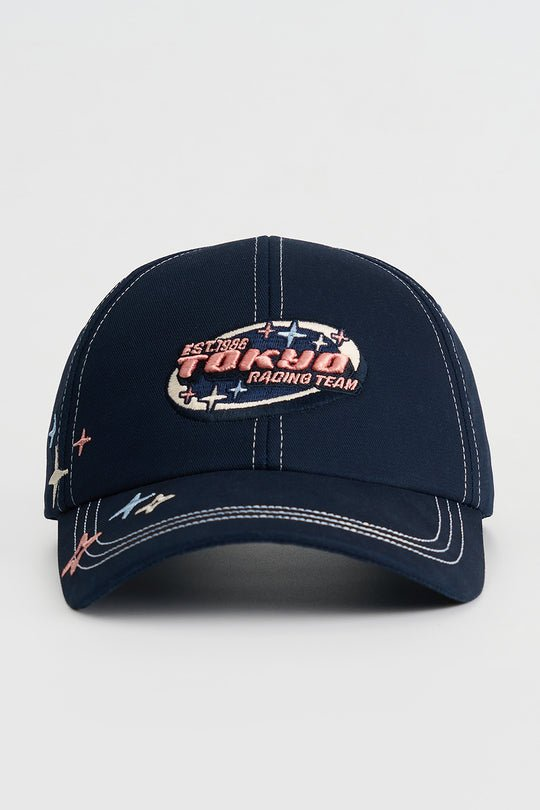 — 출처 <https://www.penshoppe.com/cdn/shop/files/993597-Navy_Blue_3.jpg?v=1778829428&width=540>
- 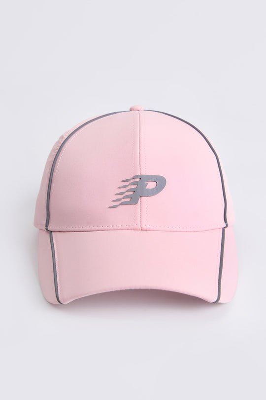 — 출처 <https://www.penshoppe.com/cdn/shop/files/993583-Blush_4.jpg?v=1778829408&width=540>
- 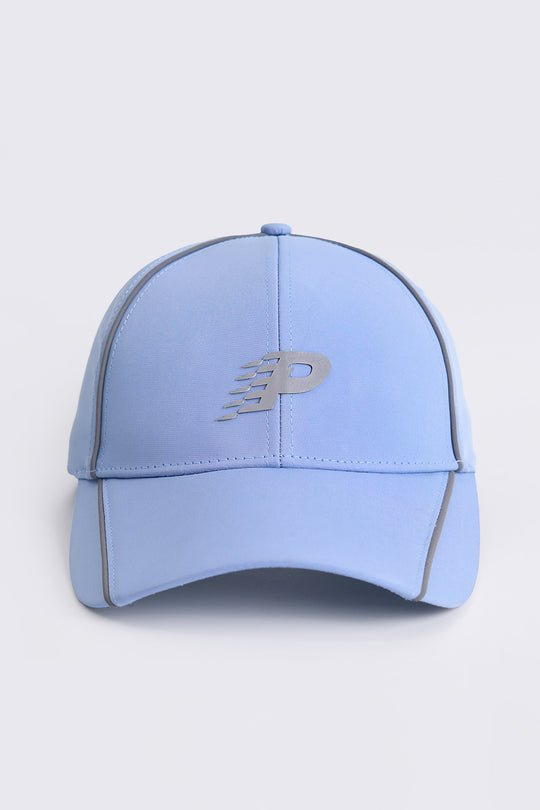 — 출처 <https://www.penshoppe.com/cdn/shop/files/993583-Blue_Stone_4.jpg?v=1778829392&width=540>
- 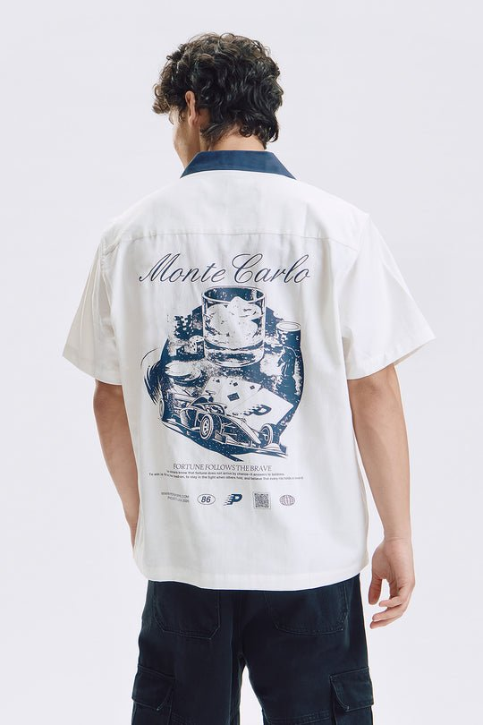 — 출처 <https://www.penshoppe.com/cdn/shop/files/993747-Ivory_5.jpg?v=1778829102&width=540>
- 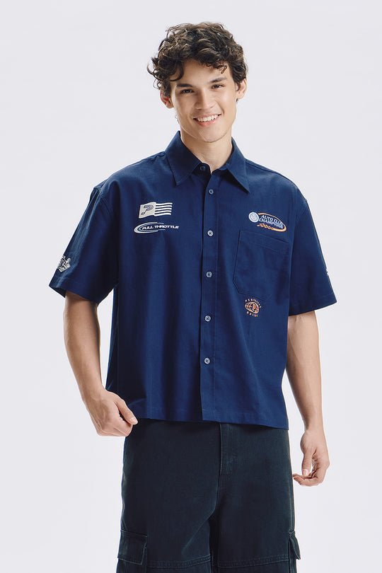 — 출처 <https://www.penshoppe.com/cdn/shop/files/993708-Midnight_Navy_4.jpg?v=1778829091&width=540>

**페이지 메타 정보**

| page | title | description |
|---|---|---|
| [`home`](https://www.penshoppe.com/) | Penshoppe Online Store | On Trend Shopping at Your Convenience
– PENSHOPPE | Shop on-trend, quality, affordable casual wear. Men's & Women's Tops, Bottoms, Accessories, Footwear, Innerwear, Personal Care. ✓Nationwide  |

#### [Shopee Philippines](https://shopee.ph/)

- URL: <https://shopee.ph/>
- 페이지: **OK 1 · FAIL 0**

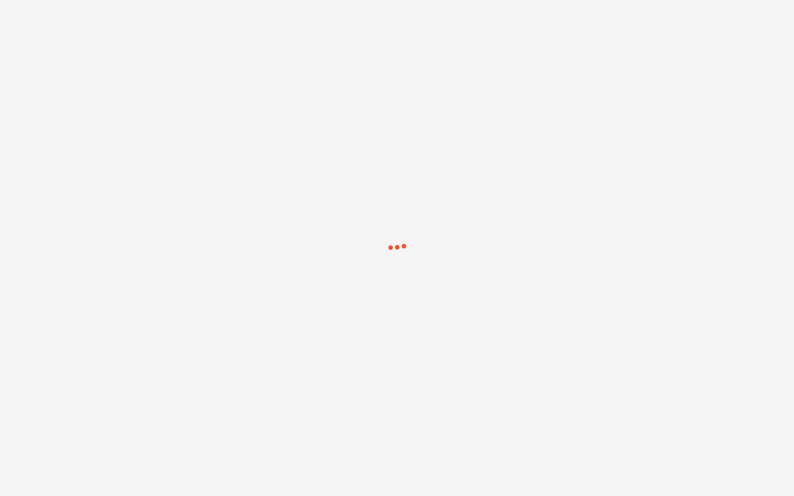

**페이지 메타 정보**

| page | title | description |
|---|---|---|
| [`home`](https://shopee.ph/) | Shopee Philippines | Shop Online with Promos and Vouchers |  |

#### [Zalora Philippines](https://www.zalora.com.ph/)

- URL: <https://www.zalora.com.ph/>
- 페이지: **OK 1 · FAIL 0**

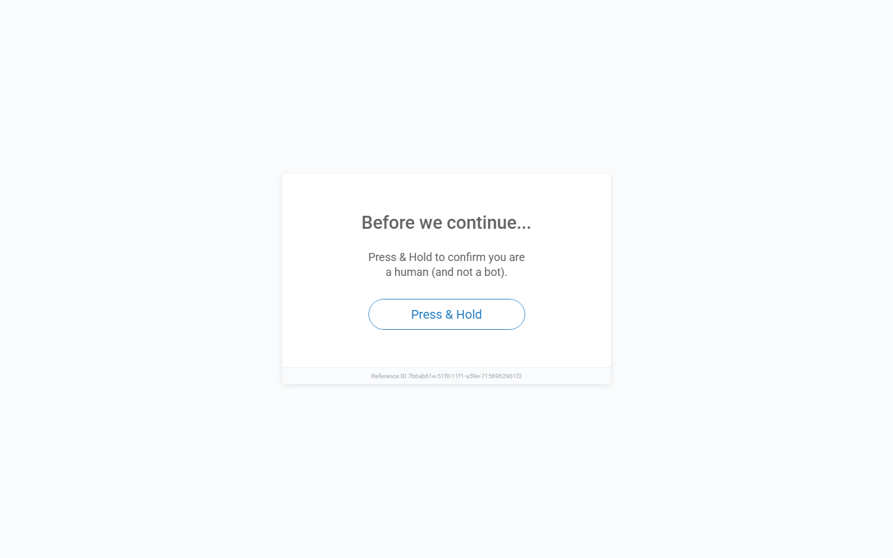

**페이지 메타 정보**

| page | title | description |
|---|---|---|
| [`home`](https://www.zalora.com.ph/) | Access to this page has been denied | px-captcha |

## 5. 의류 카테고리별 글로벌 트렌드

| # | 카테고리 | 건수 | 대표 상품명 |
|---:|---|---:|---|
| 1 | `dress` | 13 | Edeni Lace Splice Halter Mini Dress Black · Edeni Lace Splice Halter Mini Dress Multi · Picante Bias Cross Back Maxi Dress Pink Polka |
| 2 | `pants` | 13 | Wild Haze Tie Waist Pants Dark Green · Lunea Concealed Waistband Pants Beige Stripe · Lola Barrel Pants |
| 3 | `팬츠` | 11 | 2160 경량 플레어 와이드 팬츠 (2 COLORS) · 9107 경량 와이드 데님팬츠 (3 COLORS) · [이환 PICK] 9106 세미 와이드 데님팬츠 (6 color) |
| 4 | `shirt` | 10 | No Way Twill Shirt White (women) · ONE SHOULDER RAGLAN T-SHIRT_SKY BLUE · ONE SHOULDER RAGLAN T-SHIRT_PINK |
| 5 | `셔츠` | 8 | [진주언니,지구,채랑 PICK] 4124 나일론 스트라이프 셔츠 (2 COLORS) · [20%쿠폰][IS-BASIC] mts727 이즈 코튼 슬림 반팔 티셔츠 · [예약판매]랩 반팔 티셔츠_MIWHWG602A/MIWHWG78RA |
| 6 | `블라우스` | 6 | [오픈할인중] made. 내츄럴 소프트 블라우스 & 스커트 SET (개별 구매 가능!) - 2 size · B3195 프릴 세일러 블라우스 · [+반팔💙/하객룩/made] 드멜린 블라우스 |
| 7 | `skirt` | 5 | Quani Lace Midi Skirt Black · In My Lane Ruched Waist Midi Skirt Multi · [경은 PICK] LACE SATIN MIDI SKIRT_SILVER |
| 8 | `jeans` | 4 | Ribcage Wide Leg Jeans · 501 90s Jeans · 501 Original Fit Jeans |
| 9 | `blouse` | 4 | [루피타 PICK] FLORAL EMBROIDERY CROP BLOUSE (IVORY) · Passage Shirring Blouse_white · Adele Ruffle Blouse (Pure Vanilla) |
| 10 | `데님` | 4 | [단독] 9153 초경량 텐셀밴딩 데님 (그레이) · 9130 경량 린넨 컬러데님 (3 COLORS) · 9134 레귤러 부츠컷 데님 (4COLORS) |
| 11 | `자켓` | 3 | 6607  썸머 반팔 자켓 (2 COLORS) · [경은 PICK] 6610 노카라 반팔자켓 (2 COLORS) · 6607  썸머 반팔 자켓 셋업 (2 COLORS) |
| 12 | `스커트` | 3 | 3115 크링클 랩 스커트 (2 COLORS) · [캉캉레이스💕/바스락/핀터무드][MADE] 뮤이니 레이스 캉캉 맥시 롱스커트(44~110) (빅사이즈롱스커트-밴딩스커트-캉캉스커트-레이스스커트-사이드리본스커트-롱치마) · [30만장돌파/MADE]누벨 데일리 나일론 슬릿 롱 스커트 (S-L/여름스커트/바스락스커트/데일리룩/출근룩/h라인스커트/나일론치마/롱치마) |
| 13 | `jacket` | 2 | Napoleon Faux Leather Jacket Dark Brown · Trail Sherpa Jacket ICONIC EXCLUSIVE |
| 14 | `hoodie` | 1 | Trooper Contrast Hoodie Navy / Grey |
| 15 | `cardigan` | 1 | Early Nights Longline Cardigan Grey |

**국가별 의류 TOP**

- **australia**: `dress`(8), `pants`(7), `jeans`(4), `skirt`(2), `jacket`(2)- **hong_kong**: `pants`(1), `shirt`(1), `sweater`(1)- **korea**: `팬츠`(11), `셔츠`(8), `블라우스`(6), `shirt`(5), `pants`(5)- **philippines**: `dress`(5), `shirt`(4)
## 6. 악세사리 카테고리별 글로벌 트렌드

| # | 카테고리 | 건수 | 대표 상품명 |
|---:|---|---:|---|
| 1 | `cap` | 7 | GOCapSC-Field-LoopyMU-LoopyMU-Lightgrey-M/L · Twill Classic Cap · Penshoppe Est 1986 Classic Cap |
| 2 | `bag` | 4 | Kep Crossbody Bag 2L · Baggy Fit Cargo Denim Shorts · Hard Case Sling Bag |
| 3 | `crossbody` | 3 | Small Loaf Crossbody · Mini Postbox Crossbody · Mini Sheepskin Phone Crossbody |
| 4 | `샌들` | 2 | [리우드]브리 샌들(참)_07T083911 · [리우드]브리 샌들_ 07T083910 |
| 5 | `tote` | 1 | Medium Boat Tote |
| 6 | `backpack` | 1 | Backpack Tote |
| 7 | `ring` | 1 | [Washable] Ring My Bear |

**국가별 악세사리 TOP**

- **hong_kong**: `crossbody`(3), `tote`(1), `cap`(1), `bag`(1), `backpack`(1)- **korea**: `샌들`(2), `ring`(1)- **philippines**: `cap`(6), `bag`(3)
## 7. 국가별 가격대 비교

| 국가 | 통화 | 표본 | min | p25 | median | p75 | max | median (USD) |
|---|---|---:|---:|---:|---:|---:|---:|---:|
| australia | AUD | 42 | 45 | 65 | 82 | 100 | 160 | 59.04 |
| hong_kong | HKD | 30 | 190 | 826 | 1730 | 2580 | 4190 | 220.92 |
| korea | KRW | 106 | 7660 | 26820 | 49685 | 79490 | 498750 | 33.17 |
| philippines | PHP | 30 | 99 | 319 | 494 | 884 | 1199 | 8.01 |

> p25/p75 는 IQR 기준 분위수. USD 환산은 `config/exchange_rates.yaml` 기준 (운영자가 정기 갱신).

## 8. 국내 의류·악세사리 사업동향

### KITA K-stat

- 한국무역통계의 국가 수출입 통계 총괄 페이지입니다.
- 사이트: <https://stat.kita.net/stat/kts/ctr/CtrTotalImpExpList.screen>

| # | topic | title | url |
|---:|---|---|---|
| 1 | `trade` | KITA.NET | <https://www.kita.net/> |
| 2 | `trade` | K-stat 란? | <https://www.kita.net/pdf/statGuide/index.html#p=1> |
| 3 | `무역통계` | 무역통계 분류 | <https://stat.kita.net/stat/guide/guide_18_01.screen> |
| 4 | `trade` | 한국품목코드 | <https://stat.kita.net/stat/kts/statCode/ItemHierCodeList.screen> |
| 5 | `trade` | 해외품목코드 | <https://stat.kita.net/stat/istat/common/IstatHSCode.screen> |
| 6 | `trade` | 대륙/경제코드 | <https://stat.kita.net/stat/kts/statCode/ConEcoCodeList.screen> |
| 7 | `trade` | 수출입 총괄 | <https://stat.kita.net/stat/kts/sum/SumImpExpTotalList.screen> |
| 8 | `trade` | 가공단계 수출입 | <https://stat.kita.net/stat/kts/use/BecList.screen> |
| 9 | `trade` | 품목 수출입 | <https://stat.kita.net/stat/kts/pum/ItemImpExpList.screen> |
| 10 | `trade` | 국가 수출입 | <https://stat.kita.net/stat/kts/ctr/CtrTotalImpExpList.screen> |
| 11 | `trade` | 대륙/경제권 수출입 | <https://stat.kita.net/stat/kts/rel/RelColligationList.screen> |
| 12 | `trade` | 지자체 수출입 | <https://stat.kita.net/stat/kts/prod/ProdWholeList.screen> |
| 13 | `trade` | 항구/공항 수출입 | <https://stat.kita.net/stat/kts/port/PortImpExpList.screen> |
| 14 | `trade` | FTA체결국 수출입 | <https://stat.kita.net/stat/kts/fta/FtaCtrImpExpList.screen> |
| 15 | `trade` | 간접수출 현황 | <https://stat.kita.net/stat/ind/KtsIndMain.screen> |

### Korea Customs Service

- 수출입 현황, 물류통계 등 관세청 무역통계정보를 종합적으로 제공
- 사이트: <https://tradedata.go.kr/cts/index_eng.do>

| # | topic | title | url |
|---:|---|---|---|
| 1 | `trade` | Korea Customs Service | <http://customs.go.kr/english/main.do> |

### KOSIS

- 코시스, 국가데이터처가 제공하는 원스톱 통계 서비스, 국가승인통계, 국제통계, 북한통계, e-지방지표, 통계시각화콘텐츠, 온라인간행물 등 제공
- 사이트: <https://kosis.kr/statisticsList/statisticsListIndex.do;jsessionid=v_vmw91KBumZQERZe4fgy7uShKnDrXksnqUsrGFB.esvwas4_S41?parmTabId=M_01_01&vwcd=MT_ZTITLE&menuId=M_01_01&outLink=Y&entrType=>

| # | topic | title | url |
|---:|---|---|---|
| 1 | `statistics` | 쉽게 보는 통계 | <http://kosis.kr/easyViewStatis/customStatisIndex.do?vwcd=MT_TM1_TITLE&menuId=M_03_01> |
| 2 | `statistics` | 이슈별 접근 | <http://kosis.kr/easyViewStatis/customStatisIndex.do?vwcd=MT_TM2_TITLE&menuId=M_03_02> |
| 3 | `statistics` | 통계시각화콘텐츠 | <http://kosis.kr/easyViewStatis/visualizationIndex.do> |
| 4 | `statistics` | 온라인간행물 | <http://kosis.kr/publication/publicationThema.do> |
| 5 | `statistics` | 기획간행물 | <http://kosis.kr/publication/publicationStat.do> |
| 6 | `statistics` | KOSIS 길라잡이 | <http://kosis.kr/civilComplaint/kosisGuideIndex.do> |
| 7 | `statistics` | 홈페이지 개선의견 | <http://kosis.kr/civilComplaint/siteRequestList.do> |
| 8 | `statistics` | 찾아가는 KOSIS | <http://kosis.kr/civilComplaint/kosisEduIndex.do> |
| 9 | `statistics` | 서비스 소개 | <http://kosis.kr/serviceInfo/kosisIntroduce.do> |
| 10 | `statistics` | 국가통계현황 | <http://kosis.kr/serviceInfo/statisInstitution.do> |
| 11 | `statistics` | 국가통계 공표일정 | <http://kosis.kr/serviceInfo/statisPublicationList.do> |
| 12 | `statistics` | 팩트체크 서비스 | <http://kosis.kr/serviceInfo/factCheckList.do> |
| 13 | `statistics` | 서비스정책 | <http://kosis.kr/serviceInfo/useGuide.do> |
| 14 | `statistics` | 공유서비스 (OpenAPI) | <http://kosis.kr/serviceInfo/openAPIGuide.do> |
| 15 | `statistics` | English | <https://kosis.kr/eng> |

### KOTRA

- 코트라, KOTRA, 대한무역투자진흥공사, 트라이빅, TriBIG, 무역투자통계, 국가별 시장정보, 품목별 유망시장, 기업별 맞춤정보, 해외바이어 정보
- 사이트: <https://www.kotra.or.kr/bigdata/visualization/korea#search/ALL/ALL/2024>

| # | topic | title | url |
|---:|---|---|---|
| 1 | `trade` | kotra 무역투자24 | <https://www.kotra.or.kr/bigdata/kotraSsoRedirect?targetURL=https://www.kotra.or.kr> |
| 2 | `trade` | 해외비즈니스 정보 포털 | <https://www.kotra.or.kr/bigdata/kotraSsoRedirect?targetURL=https://dream.kotra.or.kr/dream> |
| 3 | `trade` | 글로벌 전시포털 | <https://www.kotra.or.kr/bigdata/kotraSsoRedirect?targetURL=https://www.gep.or.kr/> |
| 4 | `trade` | KOTRA 해외인재유치센터 | <https://www.kotra.or.kr/gtc_kor> |
| 5 | `trade` | 투자유치정보제공 | <https://www.kotra.or.kr/bigdata/kotraSsoRedirect?targetURL=https://www.investkorea.org/> |
| 6 | `수출지원` | 수출지원 온라인 플랫폼 | <https://www.kotra.or.kr/bigdata/kotraSsoRedirect?targetURL=https://www.buykorea.or.kr/> |
| 7 | `trade` | 빅데이터 서비스 | <https://www.kotra.or.kr/bigdata/> |
| 8 | `trade` | 경제외교 활용포털 | <https://www.kotra.or.kr/bigdata/kotraSsoRedirect?targetURL=https://president.globalwindow.org> |
| 9 | `trade` | 방산물자교역지원센터 | <https://www.kotra.or.kr/bigdata/kotraSsoRedirect?targetURL=https://www.kotra.or.kr/kodits> |
| 10 | `trade` | 외투기업고충처리 | <https://www.kotra.or.kr/bigdata/kotraSsoRedirect?targetURL=https://ombudsman.kotra.or.kr/ob-kr> |
| 11 | `trade` | 수출바우처 · 지사화 | <https://www.exportvoucher.com> |
| 12 | `trade` | 무역투자통계 | <https://www.kotra.or.kr/bigdata/visualization/korea> |
| 13 | `trade` | 국가별 시장정보 | <https://www.kotra.or.kr/bigdata/marketAnalysis> |
| 14 | `trade` | 품목별 유망시장 | <https://www.kotra.or.kr/bigdata/bhrcMarket> |
| 15 | `trade` | 해외바이어 정보 | <https://www.kotra.or.kr/bigdata/partner/search> |

### Statistics Korea Online Shopping

- 국가데이터처,List | 전체 | 보도자료 | 새소식
- 사이트: <https://mods.go.kr/board.es?mid=a10301010000&bid=11789>

| # | topic | title | url |
|---:|---|---|---|
| 1 | `statistics` | 정보공개제도 | <https://mods.go.kr/menu.es?mid=a10101010100> |
| 2 | `statistics` | 정보공개청구 | <https://www.open.go.kr/com/main/mainView.do> |
| 3 | `statistics` | 비공개대상정보세부기준 | <https://mods.go.kr/menu.es?mid=a10101030000> |
| 4 | `statistics` | 고객수요분석 | <https://mods.go.kr/menu.es?mid=a10101040000> |
| 5 | `statistics` | 사전정보공표 | <https://mods.go.kr/menu.es?mid=a10103010000> |
| 6 | `statistics` | 사전정보공표목록 | <https://mods.go.kr/menu.es?mid=a10103010100> |
| 7 | `statistics` | 핵심단어목록 | <https://mods.go.kr/menu.es?mid=a10103020100> |
| 8 | `statistics` | 인기정보TOP10 | <https://mods.go.kr/menu.es?mid=a10103030100> |
| 9 | `statistics` | 행정자료실 | <https://mods.go.kr/menu.es?mid=a10104010000> |
| 10 | `statistics` | 업무추진비 | <https://mods.go.kr/menu.es?mid=a10104010100> |
| 11 | `statistics` | 국회관련정보 | <https://mods.go.kr/menu.es?mid=a10104040000> |
| 12 | `statistics` | 정책실명제 | <https://mods.go.kr/menu.es?mid=a10105010000> |
| 13 | `statistics` | 연도별대상사업현황 | <https://mods.go.kr/menu.es?mid=a10105020000> |
| 14 | `statistics` | 중점관리대상사업 | <https://mods.go.kr/menu.es?mid=a10105030600> |
| 15 | `statistics` | 국민신청실명제 | <https://mods.go.kr/menu.es?mid=a10105040000> |

### 기업마당

- 기업마당>정책정보>지원사업 공고
- 사이트: <https://www.bizinfo.go.kr/sii/siia/selectSIIA200View.do?null>

| # | topic | title | url |
|---:|---|---|---|
| 1 | `policy` | 지원사업 공고 | <https://www.bizinfo.go.kr/sii/siia/selectSIIA200View.do> |
| 2 | `policy` | 품목별 법정의무 인증제도 | <https://www.bizinfo.go.kr/biz/biza/selectBIZA100View.do> |
| 3 | `policy` | 입법·행정예고/고시 | <https://www.bizinfo.go.kr/biz/biza/selectBIZA300View.do> |
| 4 | `policy` | 월간 중기누리 | <https://www.bizinfo.go.kr/biz/biza/selectBIZA400View.do> |
| 5 | `policy` | 기업업무용 서식 | <https://www.bizinfo.go.kr/biz/bizb/selectBIZB100View.do> |
| 6 | `policy` | 입주기업 모집공고 | <https://www.bizinfo.go.kr/biz/bizb/selectBIZB200View.do> |
| 7 | `policy` | 온라인화상회의실 | <https://www.k-startup.go.kr/web/contents/webOLNIVIDEOMTRM.do> |
| 8 | `policy` | 정책정보 개방 | <https://www.bizinfo.go.kr/apiList.do> |
| 9 | `policy` | 속보성 대시보드 | <https://www.bizinfo.go.kr/dashboard.do> |
| 10 | `policy` | 고객의 소리 | <https://www.bizinfo.go.kr/biz/bizc/selectBIZC200Regist.do> |
| 11 | `policy` | 자주하는질문 | <https://www.bizinfo.go.kr/biz/bizc/selectBIZC300View.do> |
| 12 | `policy` | 이메일주소 무단 수집 거부안내 | <https://www.bizinfo.go.kr/biz/bizd/selectBIZD110View.do> |
| 13 | `policy` | 저작권 정책 | <https://www.bizinfo.go.kr/biz/bizd/selectBIZD120View.do> |
| 14 | `policy` | 웹접근성 정책 | <https://www.bizinfo.go.kr/biz/bizd/selectBIZD130View.do> |
| 15 | `policy` | 전체메뉴보기 | <https://www.bizinfo.go.kr/sitemap/intro.do> |

### 서울경제진흥원

- 서울경제진흥원 에러페이지
- 사이트: <https://www.sba.seoul.kr/Pages/error_404.html?aspxerrorpath=/Pages/NSub06_01.aspx>

### 소상공인24

- 소상공인24
- 사이트: <https://www.sbiz24.kr/#/pbanc>

### 중소벤처기업부

- 중소기업중앙회 등 기관 중소기업 조사, 통계 DB화 검색, 내려받기 등 제공.
- 사이트: <https://www.mss.go.kr/site/smba/ex/bbs/List.do?cbIdx=86>

| # | topic | title | url |
|---:|---|---|---|
| 1 | `policy` | 어린이 누리집 | <https://www.mss.go.kr/site/kids/main.do> |
| 2 | `policy` | English | <https://www.mss.go.kr/site/eng/main.do> |
| 3 | `policy` | 누리집 안내지도 | <https://www.mss.go.kr/site/smba/ex/siteMap/siteMap.do> |
| 4 | `policy` | 훈령/예규/고시/공고 | <https://www.mss.go.kr/site/smba/ex/bbs/List.do?cbIdx=125&ext6=Y> |
| 5 | `policy` | 입법/행정예고 | <https://www.mss.go.kr/site/smba/ex/bbs/List.do?cbIdx=126&searchRltnYn=Y> |
| 6 | `policy` | 인사·채용 | <https://www.mss.go.kr/site/smba/ex/bbs/List.do?cbIdx=82> |
| 7 | `policy` | 보도설명자료 | <https://www.mss.go.kr/site/smba/ex/bbs/List.do?cbIdx=87> |
| 8 | `policy` | 현장속으로 | <https://www.mss.go.kr/site/smba/brdcststnVod/brdcststnVodList.do?ctgr_code=C01> |
| 9 | `policy` | 중기부소식지 | <https://www.mss.go.kr/site/smba/ex/bbs/List.do?cbIdx=95> |
| 10 | `policy` | 통계발표자료 | <https://www.mss.go.kr/site/smba/foffice/ex/statDB/ptScheduleList.do> |
| 11 | `policy` | 주제별 통계 | <https://www.mss.go.kr/site/smba/foffice/ex/statDB/temaList.do?tabCd=0001> |
| 12 | `policy` | 조사별 통계 | <https://www.mss.go.kr/site/smba/foffice/ex/statDB/surveyList.do?tabCd=0001> |
| 13 | `policy` | 조사보고서 | <https://www.mss.go.kr/site/smba/foffice/ex/statDB/stReportRoList.do?gb=1&nodeId=&roCode=> |
| 14 | `policy` | 주제별 조회 | <https://www.mss.go.kr/site/smba/foffice/ex/statDB/stReportRcList.do?gb=2&nodeId=&rcCode=> |
| 15 | `policy` | 중소기업위상 | <https://www.mss.go.kr/site/smba/foffice/ex/statDB/MainSubStat.do?scd=0001> |

## 9. 한국 사업자 관점 기회 국가 TOP 10

| # | 국가 | tier | region | 점수 | 근거 |
|---:|---|---:|---|---:|---|
| 1 | 태국 _( Thailand )_ | 1 | `asia` | **140.0** | tier1 기본점(90); 아시아 권역(+20); ASEAN 시장(+10); K-패션/콘텐츠 친화 시장(+20) |
| 2 | 일본 _( Japan )_ | 1 | `asia` | **130.0** | tier1 기본점(90); 아시아 권역(+20); K-패션/콘텐츠 친화 시장(+20) |
| 3 | 대만 _( Taiwan )_ | 1 | `asia` | **130.0** | tier1 기본점(90); 아시아 권역(+20); K-패션/콘텐츠 친화 시장(+20) |
| 4 | 인도네시아 _( Indonesia )_ | 1 | `asia` | **120.0** | tier1 기본점(90); 아시아 권역(+20); ASEAN 시장(+10) |
| 5 | 베트남 _( Vietnam )_ | 1 | `asia` | **120.0** | tier1 기본점(90); 아시아 권역(+20); ASEAN 시장(+10) |
| 6 | 필리핀 _( Philippines )_ | 2 | `asia` | **117.0** | tier2 기본점(60); 아시아 권역(+20); ASEAN 시장(+10); K-패션/콘텐츠 친화 시장(+20); 트렌드 신호 밀도 7 |
| 7 | 홍콩 _( Hong Kong )_ | 2 | `asia` | **92.5** | tier2 기본점(60); 아시아 권역(+20); 트렌드 신호 밀도 12 |
| 8 | 미국 _( United States )_ | 1 | `north_america` | **90.0** | tier1 기본점(90) |
| 9 | 말레이시아 _( Malaysia )_ | 2 | `asia` | **90.0** | tier2 기본점(60); 아시아 권역(+20); ASEAN 시장(+10) |
| 10 | 싱가포르 _( Singapore )_ | 2 | `asia` | **90.0** | tier2 기본점(60); 아시아 권역(+20); ASEAN 시장(+10) |

## 10. 실행 제안

### **1위 태국** (점수 140, tier1 · asia)

- K-패션 친화도가 명시된 시장이므로 K-브랜드 아이덴티티 및 한류 셀럽 협업을 강조.
- ASEAN 권역 시장 — 물류/관세(FTA) 활용 + 동남아 통합 마케팅 검토 권장.
- tier1 핵심 시장 — 현지 마켓플레이스(예: 해당 국가의 대표 패션 플랫폼) 공식 입점 + 셀러 운영 채널 확보 우선.
- 연계 가능한 국내 수출/지원 사업이 식별되지 않음 — `domestic_sources.yaml` 의 `landing_url` 을 KOTRA 사업 공고/기업마당 수출바우처로 직접 지정 권장.

### **2위 일본** (점수 130, tier1 · asia)

- K-패션 친화도가 명시된 시장이므로 K-브랜드 아이덴티티 및 한류 셀럽 협업을 강조.
- 아시아 권역 시장 — 시차/언어 친화 + 한국 본사 직배송 모델 검토.
- tier1 핵심 시장 — 현지 마켓플레이스(예: 해당 국가의 대표 패션 플랫폼) 공식 입점 + 셀러 운영 채널 확보 우선.
- 연계 가능한 국내 수출/지원 사업이 식별되지 않음 — `domestic_sources.yaml` 의 `landing_url` 을 KOTRA 사업 공고/기업마당 수출바우처로 직접 지정 권장.

### **3위 대만** (점수 130, tier1 · asia)

- K-패션 친화도가 명시된 시장이므로 K-브랜드 아이덴티티 및 한류 셀럽 협업을 강조.
- 아시아 권역 시장 — 시차/언어 친화 + 한국 본사 직배송 모델 검토.
- tier1 핵심 시장 — 현지 마켓플레이스(예: 해당 국가의 대표 패션 플랫폼) 공식 입점 + 셀러 운영 채널 확보 우선.
- 연계 가능한 국내 수출/지원 사업이 식별되지 않음 — `domestic_sources.yaml` 의 `landing_url` 을 KOTRA 사업 공고/기업마당 수출바우처로 직접 지정 권장.

### 운영 점검 노트

- **ASEAN 다중 진출 기회**: TOP10 중 ASEAN 국가가 3개 이상. Shopee/Lazada/Zalora 통합 운영을 통한 동남아 멀티마켓 전략을 검토 권장.

## 11. 수집 실패/주의 사이트

| 국가 | 사이트 | 페이지 | 상태 | 사유 |
|---|---|---|---|---|
| philippines | Bench | home | failed | http_status_522 |
| korea | Musinsa | home | failed | robots_disallowed |

## 12. 원문 출처 및 이미지 출처

### 호주

- **Cotton On** — <https://cottonon.com/AU/>
  - 이미지 출처: <https://cottonon.com/on/demandware.static/-/Library-Sites-cog-megastore-shared-library/default/dwacdd28a0/group/home-page/mega-menu-tiles/C_5073900_MEGANAV_DT_MAY_AU_5086831_0526-W-4.jpg>
  - 이미지 출처: <https://cottonon.com/on/demandware.static/-/Library-Sites-cog-megastore-shared-library/default/dwedf5b840/group/home-page/mega-menu-tiles/C_5073900_MEGANAV_DT_MAY_AU_5086831_0526-W-5.jpg>
  - 이미지 출처: <https://cottonon.com/on/demandware.static/-/Library-Sites-cog-megastore-shared-library/default/dwfb23e239/group/home-page/mega-menu-tiles/C_5073900_MEGANAV_DT_MAY_AU_5086831_0526-W-3.jpg>
  - 이미지 출처: <https://cottonon.com/on/demandware.static/-/Library-Sites-cog-megastore-shared-library/default/dwdad0a419/group/home-page/mega-menu-tiles/C_5073900_MEGANAV_DT_MAY_AU_5086831_0526-W-6.jpg>
  - 이미지 출처: <https://cottonon.com/on/demandware.static/-/Library-Sites-cog-megastore-shared-library/default/dwe0ceb0cd/group/home-page/mega-menu-tiles/C_5073900_MEGANAV_DT_MAY_AU_5086831_0526-M-1.jpg>
  - 이미지 출처: <https://cottonon.com/on/demandware.static/-/Library-Sites-cog-megastore-shared-library/default/dwb991f359/group/home-page/mega-menu-tiles/C_5073900_MEGANAV_DT_MAY_AU_5086831_0526-M-2.jpg>
  - 이미지 출처: <https://cottonon.com/on/demandware.static/-/Library-Sites-cog-megastore-shared-library/default/dw0c3dd380/group/home-page/mega-menu-tiles/C_5073900_MEGANAV_DT_MAY_AU_5086831_0526-M-3.jpg>
  - 이미지 출처: <https://cottonon.com/on/demandware.static/-/Library-Sites-cog-megastore-shared-library/default/dwcfc87d7e/group/home-page/mega-menu-tiles/C_5073900_MEGANAV_DT_MAY_AU_5086831_0526-M-4.jpg>
  - 이미지 출처: <https://cottonon.com/on/demandware.static/-/Library-Sites-cog-megastore-shared-library/default/dw119f13c4/group/home-page/mega-menu-tiles/C_4936501_MEGANAV_DT_TILE_SWEATS_AU_4947003_0326_DT.jpg>
  - 이미지 출처: <https://cottonon.com/on/demandware.static/-/Library-Sites-cog-megastore-shared-library/default/dw2c267ab6/group/home-page/2026/05_MAY/AU/C_BP_CF_LAUNCH_AU_5078982_1_1UP_DT.jpg>
  - 이미지 출처: <https://cottonon.com/on/demandware.static/-/Library-Sites-cog-megastore-shared-library/default/dw00c6dc10/group/home-page/2026/05_MAY/AU/C_BP_CF_LAUNCH_AU_5078982_1_1UP_MB_V2.gif>
  - 이미지 출처: <https://cottonon.com/on/demandware.static/-/Library-Sites-cog-megastore-shared-library/default/dw12ddddbf/group/home-page/2026/05_MAY/AU/C_BP_MOD_CF_2UP_UGC_AU_5164351_1_2UP_DT.jpg>
  - 이미지 출처: <https://cottonon.com/on/demandware.static/-/Library-Sites-cog-megastore-shared-library/default/dw3ffa232e/group/home-page/2026/05_MAY/AU/C_BP_MOD_CF_2UP_UGC_AU_5164351_1_2UP_MB.jpg>
  - 이미지 출처: <https://cottonon.com/on/demandware.static/-/Library-Sites-cog-megastore-shared-library/default/dwe3cba647/group/home-page/2026/05_MAY/AU/C_BP_MOD_CF_2UP_UGC_AU_5164351_2_2UP_DT.jpg>
  - 이미지 출처: <https://cottonon.com/on/demandware.static/-/Library-Sites-cog-megastore-shared-library/default/dw0fc485f7/group/home-page/2026/05_MAY/AU/C_BP_MOD_CF_2UP_UGC_AU_5164351_2_2UP_MB.jpg>
  - 이미지 출처: <https://cottonon.com/on/demandware.static/-/Library-Sites-cog-megastore-shared-library/default/dw127cff57/group/home-page/2026/05_MAY/AU/C_BP_CF_LAUNCH_AU_5078982_2_4UP.jpg>
  - 이미지 출처: <https://cottonon.com/on/demandware.static/-/Library-Sites-cog-megastore-shared-library/default/dw31b278b2/group/home-page/2026/05_MAY/AU/C_BP_CF_LAUNCH_AU_5078982_3_4UP.jpg>
  - 이미지 출처: <https://cottonon.com/on/demandware.static/-/Library-Sites-cog-megastore-shared-library/default/dw9b00b214/group/home-page/2026/05_MAY/AU/C_BP_CF_LAUNCH_AU_5078982_4_4UP.jpg>
  - 이미지 출처: <https://cottonon.com/on/demandware.static/-/Library-Sites-cog-megastore-shared-library/default/dw1dc1ad61/group/home-page/2026/05_MAY/AU/C_BP_CF_LAUNCH_AU_5078982_5_4UP.jpg>
- **David Jones** — <https://www.davidjones.com/>
- **Myer** — <https://www.myer.com.au/>
  - 이미지 출처: <https://content-us-5.content-cms.com/af9094ac-4ec2-4ea9-8480-e7ef2c8369de/dxresources/4a74/4a7430d7-172a-4514-ae3a-a1d4f80e67d2.jpg?resize=400px%3A200px&crop=400%3A200%3B0%2C0&output-format=webp&w=828&q=75>
  - 이미지 출처: <https://content-us-5.content-cms.com/af9094ac-4ec2-4ea9-8480-e7ef2c8369de/dxresources/cf51/cf51ba52-8d74-449b-9617-632e12e8e7c3.jpg?resize=400px%3A200px&crop=400%3A200%3B0%2C0&output-format=webp&w=828&q=75>
  - 이미지 출처: <https://content-us-5.content-cms.com/af9094ac-4ec2-4ea9-8480-e7ef2c8369de/dxresources/fbb4/fbb4540b-37a1-432f-b824-bfc57f4b802f.jpg?resize=400px%3A200px&crop=400%3A200%3B0%2C0&output-format=webp&w=828&q=75>
  - 이미지 출처: <https://content-us-5.content-cms.com/af9094ac-4ec2-4ea9-8480-e7ef2c8369de/dxresources/e4ae/e4aed948-c35d-402d-9ce2-2548899ca9bd.jpg?resize=400px%3A200px&crop=400%3A200%3B0%2C0&output-format=webp&w=828&q=75>
  - 이미지 출처: <https://content-us-5.content-cms.com/af9094ac-4ec2-4ea9-8480-e7ef2c8369de/dxresources/8361/8361f4aa-e45e-4647-9eed-fb97503e4098.jpg?resize=400px%3A200px&crop=400%3A200%3B0%2C0&output-format=webp&w=828&q=75>
  - 이미지 출처: <https://content-us-5.content-cms.com/af9094ac-4ec2-4ea9-8480-e7ef2c8369de/dxresources/fd0c/fd0c7d5d-2ed6-4625-a71a-e8073f81418d.jpg?resize=400px%3A200px&crop=400%3A200%3B0%2C0&output-format=webp&w=828&q=75>
  - 이미지 출처: <https://content-us-5.content-cms.com/af9094ac-4ec2-4ea9-8480-e7ef2c8369de/dxresources/866d/866d7c85-cd6a-426f-9678-77c11f7c427a.jpg?resize=400px%3A200px&crop=400%3A200%3B0%2C0&output-format=webp&w=828&q=75>
  - 이미지 출처: <https://content-us-5.content-cms.com/af9094ac-4ec2-4ea9-8480-e7ef2c8369de/dxresources/971f/971f3728-a14b-41a0-a626-06bf25daf2a8.jpg?resize=400px%3A200px&crop=400%3A200%3B0%2C0&output-format=webp&w=828&q=75>
  - 이미지 출처: <https://content-us-5.content-cms.com/af9094ac-4ec2-4ea9-8480-e7ef2c8369de/dxresources/565b/565b07bc-af3e-40e6-bc52-8e372cf9f0fb.jpg?resize=400px%3A200px&crop=400%3A200%3B0%2C0&output-format=webp&w=828&q=75>
  - 이미지 출처: <https://content-us-5.content-cms.com/af9094ac-4ec2-4ea9-8480-e7ef2c8369de/dxresources/d4ec/d4ec7c1a-b019-47df-b7cc-b5bcf4a2d9f5.jpg?resize=400px%3A200px&crop=400%3A200%3B0%2C0&output-format=webp&w=828&q=75>
  - 이미지 출처: <https://content-us-5.content-cms.com/af9094ac-4ec2-4ea9-8480-e7ef2c8369de/dxresources/0d22/0d2238cc-dacb-44ea-8cb4-08b5a87ba5d9.jpg?resize=382px%3A288px&crop=382%3A288%3B0%2C0&output-format=webp&w=828&q=75>
  - 이미지 출처: <https://content-us-5.content-cms.com/af9094ac-4ec2-4ea9-8480-e7ef2c8369de/dxresources/e150/e150128f-734f-438c-b23f-b07bcc14497a.jpg?resize=175px%3A240px&crop=175%3A240%3B0%2C0&output-format=webp&w=384&q=75>
  - 이미지 출처: <https://content-us-5.content-cms.com/af9094ac-4ec2-4ea9-8480-e7ef2c8369de/dxresources/fa35/fa359ddd-a175-4a87-8d62-3e510145ea31.jpg?resize=175px%3A240px&crop=175%3A240%3B0%2C0&output-format=webp&w=384&q=75>
  - 이미지 출처: <https://content-us-5.content-cms.com/af9094ac-4ec2-4ea9-8480-e7ef2c8369de/dxresources/548a/548ad80a-ea71-448e-8208-25055d06bafc.jpg?resize=382px%3A288px&crop=382%3A288%3B0%2C0&output-format=webp&w=828&q=75>
  - 이미지 출처: <https://content-us-5.content-cms.com/af9094ac-4ec2-4ea9-8480-e7ef2c8369de/dxresources/732c/732c89d5-2880-4016-9003-78ba92b6e68d.jpg?resize=175px%3A240px&crop=175%3A240%3B0%2C0&output-format=webp&w=384&q=75>
  - 이미지 출처: <https://content-us-5.content-cms.com/af9094ac-4ec2-4ea9-8480-e7ef2c8369de/dxresources/c09e/c09e58f3-e369-4856-998c-e059933bb96b.jpg?resize=175px%3A240px&crop=175%3A240%3B0%2C0&output-format=webp&w=384&q=75>
  - 이미지 출처: <https://content-us-5.content-cms.com/af9094ac-4ec2-4ea9-8480-e7ef2c8369de/dxresources/c5c8/c5c8d816-8a87-4d9c-8742-60bca7bdd486.jpg?resize=180px:270px&crop=180:270;0,0&output-format=webp&w=384&q=75>
  - 이미지 출처: <https://content-us-5.content-cms.com/af9094ac-4ec2-4ea9-8480-e7ef2c8369de/dxresources/b124/b124f8c4-1b01-4fc3-a18f-2651f2fb2438.jpg?resize=180px:270px&crop=180:270;0,0&output-format=webp&w=384&q=75>
  - 이미지 출처: <https://content-us-5.content-cms.com/af9094ac-4ec2-4ea9-8480-e7ef2c8369de/dxresources/e213/e2139cf9-bdf7-4cc9-955d-7d0573efdeab.jpg?resize=180px:270px&crop=180:270;0,0&output-format=webp&w=384&q=75>
- **Princess Polly** — <https://www.princesspolly.com.au/>
- **The Iconic** — <https://www.theiconic.com.au/>

### 홍콩

- **HKTVmall** — <https://www.hktvmall.com/>
  - 이미지 출처: <https://images.hktvmall.com/h0293001/h0293001_mobilelogo_210317112242.jpg>
  - 이미지 출처: <https://www.hktvmall.com/_ui/shared/common/svg/common/store_logo_not_found.png>
  - 이미지 출처: <https://images.hktvmall.com/h7449001/h7449001_mobilelogo_200324025841.jpg>
  - 이미지 출처: <https://cdn-media.hktvmall.com/hktv-mms/HKTV/mms/uploadStoreImage/854c/4855/993a/VUhhItZzio20260416113255.jpg>
  - 이미지 출처: <https://images.hktvmall.com/h7794001/h7794001_mobilelogo_240503095653.jpg>
  - 이미지 출처: <https://images.hktvmall.com/h7140001/h7140001_mobilelogo_191128061225.jpg>
  - 이미지 출처: <https://cdn-media.hktvmall.com/hktv-mms/HKTV/mms/uploadStoreImage/1bd5/51d8/94ea/FfHPHwXEiE20260401182732.jpg>
  - 이미지 출처: <https://images.hktvmall.com/p0046001/p0046001_mobilelogo_200423045534.jpg>
  - 이미지 출처: <https://images.hktvmall.com/p0026001/p0026001_mobilelogo_200422121047.jpg>
  - 이미지 출처: <https://images.hktvmall.com/p0049005/p0049005_mobilelogo_240424093945.jpg>
  - 이미지 출처: <https://images.hktvmall.com/p0055001/p0055001_mobilelogo_200422095952.jpg>
  - 이미지 출처: <https://images.hktvmall.com/p0056001/p0056001_mobilelogo_200417050637.jpg>
  - 이미지 출처: <https://images.hktvmall.com/h5727001/h5727001_mobilelogo_220816050356.jpg>
  - 이미지 출처: <https://images.hktvmall.com/h7008001/h7008001_mobilelogo_190815023611.jpg>
  - 이미지 출처: <https://images.hktvmall.com/h5793001/h5793001_mobilelogo_171221042535.jpg>
  - 이미지 출처: <https://cdn-media.hktvmall.com/hktv-mms/HKTV/mms/uploadStoreImage/9348/5f2e/d0a2/frSjygGKYo20260515150912.png>
  - 이미지 출처: <https://cdn-media.hktvmall.com/hktv-mms/HKTV/mms/uploadStoreImage/d25f/3c1a/b89d/HnmnTHedLc20251115104559.png>
  - 이미지 출처: <https://images.hktvmall.com/h9295001/h9295001_mobilelogo_210907113916.jpg>
  - 이미지 출처: <https://images.hktvmall.com/h8702001/h8702001_mobilelogo_210413032807.jpg>
- **i.t** — <https://www.ithk.com/>
  - 이미지 출처: <https://www.ithk.com/storage/main_banner/777x440_1.jpg>
  - 이미지 출처: <https://www.ithk.com/storage/main_banner/777x440_2.jpg>
  - 이미지 출처: <https://www.ithk.com/storage/main_banner/777x440_3.jpg>
- **Kapok** — <https://ka-pok.com/>
  - 이미지 출처: <https://ka-pok.com/cdn/shop/files/shapes.png?v=1721454307>
  - 이미지 출처: <https://ka-pok.com/cdn/shop/files/OlendOnaSoftBagOna-Coral.webp?v=1777449663&width=533>
  - 이미지 출처: <https://ka-pok.com/cdn/shop/files/OlendOnaSoftBagOna-Coral.webp?v=1777449663>
  - 이미지 출처: <https://ka-pok.com/cdn/shop/files/OlendOnaSoftBagOna-Coral3.webp?v=1748508119&width=533>
  - 이미지 출처: <https://ka-pok.com/cdn/shop/files/OlendOnaSoftBagOna-Coral3.webp?v=1748508119>
  - 이미지 출처: <https://ka-pok.com/cdn/shop/files/MicroOnaSoftBaglime.webp?v=1776331017&width=533>
  - 이미지 출처: <https://ka-pok.com/cdn/shop/files/MicroOnaSoftBaglime.webp?v=1776331017>
  - 이미지 출처: <https://ka-pok.com/cdn/shop/files/ClothingStandardGridsnw_f0c46fd8-cfe0-40a9-8081-813b73a9ea3a.png?v=1776331017&width=533>
  - 이미지 출처: <https://ka-pok.com/cdn/shop/files/ClothingStandardGridsnw_f0c46fd8-cfe0-40a9-8081-813b73a9ea3a.png?v=1776331017>
  - 이미지 출처: <https://ka-pok.com/cdn/shop/files/03-03-2025-JW_F4833-WTM_1_1.webp?v=1741159851&width=533>
  - 이미지 출처: <https://ka-pok.com/cdn/shop/files/03-03-2025-JW_F4833-WTM_1_1.webp?v=1741159851>
  - 이미지 출처: <https://ka-pok.com/cdn/shop/files/03-03-2025-JW_F4833-WTM_10_1.webp?v=1741159851&width=533>
  - 이미지 출처: <https://ka-pok.com/cdn/shop/files/03-03-2025-JW_F4833-WTM_10_1.webp?v=1741159851>
  - 이미지 출처: <https://ka-pok.com/cdn/shop/files/FW25_FWBG9052A_06028_EARTHY_OLIVE_FLAT_d9fee190-d693-444b-b0be-d2e8207323e0.jpg?v=1755156860&width=533>
  - 이미지 출처: <https://ka-pok.com/cdn/shop/files/FW25_FWBG9052A_06028_EARTHY_OLIVE_FLAT_d9fee190-d693-444b-b0be-d2e8207323e0.jpg?v=1755156860>
  - 이미지 출처: <https://ka-pok.com/cdn/shop/files/FW25_FWBG9052A_06028_EARTHY_OLIVE_FLAT_BACK.jpg?v=1755156838&width=533>
  - 이미지 출처: <https://ka-pok.com/cdn/shop/files/FW25_FWBG9052A_06028_EARTHY_OLIVE_FLAT_BACK.jpg?v=1755156838>
  - 이미지 출처: <https://ka-pok.com/cdn/shop/files/v2_feb_web_BG_colour.png?v=1772089156&width=600>
- **Lane Crawford** — <https://www.lanecrawford.com/>
  - 이미지 출처: <https://media.lanecrawford.com/feature/hp_temp_Happening-in-stores-20260430-1.jpg>
  - 이미지 출처: <https://media.lanecrawford.com/feature/hp_temp_Happening-in-stores-20260430-2.jpg>
  - 이미지 출처: <https://media.lanecrawford.com/feature/hp_temp_Happening-in-stores-20260430-3.jpg>
  - 이미지 출처: <https://media.lanecrawford.com/feature/hp_temp_Happening-in-stores-20260430-4.jpg>
  - 이미지 출처: <https://media.lanecrawford.com/feature/hp_temp_Happening-in-stores-20260430-5.jpg>
  - 이미지 출처: <https://media.lanecrawford.com/feature/hp_temp_Happening-in-stores-20260430-6.jpg>
  - 이미지 출처: <https://media.lanecrawford.com/feature/hp_temp_Happening-in-stores-20260430-7.jpg>
  - 이미지 출처: <https://media.lanecrawford.com/feature/hp_temp_Happening-in-stores-20260430-8.jpg>
  - 이미지 출처: <https://media.lanecrawford.com/feature/IFC01.jpg>
  - 이미지 출처: <https://media.lanecrawford.com/feature/CR01.jpg>
  - 이미지 출처: <https://media.lanecrawford.com/feature/TSQ01.jpg>
  - 이미지 출처: <https://media.lanecrawford.com/feature/PPH01.jpg>
  - 이미지 출처: <https://media.lanecrawford.com/feature/hp_temp_Visit-us-in-stores_hk_20260408_Lane_Crawford_warehouse.jpg>
  - 이미지 출처: <https://media.lanecrawford.com/feature/hp_temp_Visit-us-in-stores_hk_20260408_Pedder_warehouse.jpg>
- **Zalora Hong Kong** — <https://www.zalora.com.hk/>

### 한국

- **29CM** — <https://www.29cm.co.kr/>
  - 이미지 출처: <https://img.29cm.co.kr/cms/202605/11f1501f461a68bb8e7df175bdf309b9.png?width=3840&format=webp>
  - 이미지 출처: <https://img.29cm.co.kr/cms/202605/11f1501f34e88df083a40543e3c0ee3c.jpg?width=3840&format=webp>
  - 이미지 출처: <https://img.29cm.co.kr/cms/202605/11f1501f279ec28083a4755898ac0118.png?width=3840&format=webp>
  - 이미지 출처: <https://img.29cm.co.kr/cms/202605/11f14f59246d91aa83a43fe78b9c14f0.jpg?width=3840&format=webp>
  - 이미지 출처: <https://img.29cm.co.kr/cms/202605/11f14f58fccf5b4683a4dd35be43c951.jpg?width=3840&format=webp>
  - 이미지 출처: <https://img.29cm.co.kr/cms/202605/11f14f58dc43e78883a4db3e05b2ce57.jpg?width=3840&format=webp>
  - 이미지 출처: <https://img.29cm.co.kr/cms/202605/11f14f58e6879eee83a40ddc2fe24a64.jpg?width=3840&format=webp>
  - 이미지 출처: <https://img.29cm.co.kr/cms/202605/11f14f58b13d806b8e7d15263f8760e8.jpg?width=3840&format=webp>
  - 이미지 출처: <https://img.29cm.co.kr/cms/202605/11f14f58873e28ec83a4311eaa1fdd53.jpg?width=3840&format=webp>
  - 이미지 출처: <https://img.29cm.co.kr/cms/202605/11f14e8a416669fe83a48373349b0f8f.png?width=3840&format=webp>
  - 이미지 출처: <https://img.29cm.co.kr/cms/202605/11f14e8a2cf8289483a4dbefba5979bd.png?width=3840&format=webp>
  - 이미지 출처: <https://img.29cm.co.kr/cms/202605/11f14e8a1a37220883a4674fc86fac26.png?width=3840&format=webp>
  - 이미지 출처: <https://img.29cm.co.kr/cms/202605/11f14e8a0f5ccff58e7dc316d64dda8e.png?width=3840&format=webp>
  - 이미지 출처: <https://img.29cm.co.kr/cms/202605/11f14e89fd5443a483a481c3c59b7b57.png?width=3840&format=webp>
  - 이미지 출처: <https://img.29cm.co.kr/cms/202605/11f14dc8cece239c83a44f9baa0e319c.jpg?width=3840&format=webp>
  - 이미지 출처: <https://img.29cm.co.kr/cms/202605/11f14dc8af4ccde683a4290101af7dfd.jpg?width=3840&format=webp>
  - 이미지 출처: <https://img.29cm.co.kr/cms/202605/11f14dc89a60f80c83a469e1b659c23a.jpg?width=3840&format=webp>
  - 이미지 출처: <https://img.29cm.co.kr/cms/202605/11f14dc87b852f938e7d9147f83715f3.jpg?width=3840&format=webp>
  - 이미지 출처: <https://img.29cm.co.kr/cms/202605/11f14d056905f86083a48b39a191d597.png?width=3840&format=webp>
- **Musinsa** — <https://www.musinsa.com/>
- **W Concept** — <https://www.wconcept.co.kr/>
- **Zigzag** — <https://zigzag.kr/>
  - 이미지 출처: <https://cf.image-farm.s.zigzag.kr/original/cms/2026/04/28/202604280154164065_020417.jpg?format=webp&quality=80&width=1029&height=1188>
  - 이미지 출처: <https://cf.image-farm.s.zigzag.kr/original/cms/2026/05/08/202605080623562363_082057.jpg?width=1029&height=1188&quality=80&format=webp&transparent=true>
  - 이미지 출처: <https://cf.image-farm.s.zigzag.kr/original/cms/2026/05/10/202605101416224017_098832.jpg?width=1029&height=1188&quality=80&format=webp&transparent=true>
  - 이미지 출처: <https://cf.image-farm.s.zigzag.kr/original/cms/2026/05/10/202605101549405370_091331.jpg?width=1029&height=1188&quality=80&format=webp&transparent=true>
  - 이미지 출처: <https://cf.image-farm.s.zigzag.kr/original/cms/2026/05/10/202605101547543621_017951.jpg?width=1029&height=1188&quality=80&format=webp&transparent=true>
  - 이미지 출처: <https://cf.image-farm.s.zigzag.kr/original/cms/2026/05/16/202605160933047641_059363.jpg?width=1029&height=1188&quality=80&format=webp&transparent=true>
  - 이미지 출처: <https://cf.image-farm.s.zigzag.kr/original/cms/2026/05/04/202605040729153812_020913.png?quality=80&format=webp&transparent=true&width=1029&height=1188>
  - 이미지 출처: <https://cf.image-farm.s.zigzag.kr/original/cms/2026/05/06/202605060255236768_078042.png?quality=80&format=webp&transparent=true&width=1029&height=1188>
  - 이미지 출처: <https://cf.image-farm.s.zigzag.kr/original/cms/2026/05/06/202605060341269493_025072.png?quality=80&format=webp&transparent=true&width=1029&height=1188>
  - 이미지 출처: <https://cf.image-farm.s.zigzag.kr/original/cms/2026/05/06/202605060744288970_065433.jpg?width=1029&height=1188&quality=80&format=webp&transparent=true>
  - 이미지 출처: <https://cf.image-farm.s.zigzag.kr/original/cms/2026/05/07/202605070531275119_053395.jpg?width=1029&height=1188&quality=80&format=webp&transparent=true>
  - 이미지 출처: <https://cf.image-farm.s.zigzag.kr/original/cms/2026/05/07/202605070538223160_086535.jpg?width=1029&height=1188&quality=80&format=webp&transparent=true>
  - 이미지 출처: <https://cf.image-farm.s.zigzag.kr/original/cms/2026/05/07/202605070545045346_052566.jpg?width=1029&height=1188&quality=80&format=webp&transparent=true>
  - 이미지 출처: <https://cf.image-farm.s.zigzag.kr/original/cms/2026/05/07/202605070550209087_025642.png?quality=80&format=webp&transparent=true&width=1029&height=1188>
  - 이미지 출처: <https://cf.image-farm.s.zigzag.kr/original/cms/2026/05/07/202605070622059874_048304.jpg?width=1029&height=1188&quality=80&format=webp&transparent=true>
  - 이미지 출처: <https://cf.image-farm.s.zigzag.kr/original/cms/2026/05/07/202605070740068718_035715.png?quality=80&format=webp&transparent=true&width=1029&height=1188>
  - 이미지 출처: <https://cf.image-farm.s.zigzag.kr/original/cms/2026/05/07/202605070748393735_061243.jpg?width=1029&height=1188&quality=80&format=webp&transparent=true>
  - 이미지 출처: <https://cf.image-farm.s.zigzag.kr/original/cms/2026/05/07/202605070533194183_049128.png?quality=80&format=webp&transparent=true&width=1029&height=1188>

### 필리핀

- **Bench** — <https://www.bench.com.ph/>
- **Lazada Philippines** — <https://www.lazada.com.ph/>
  - 이미지 출처: <https://img.lazcdn.com/us/domino/4c7322a5c7c56033b88982d607e12587.png>
  - 이미지 출처: <https://img.lazcdn.com/g/tps/images/ims-web/TB19SB7aMFY.1VjSZFnXXcFHXXa.png>
  - 이미지 출처: <https://img.lazcdn.com/g/tps/imgextra/i3/O1CN01N7boek1IN5g3FvMMa_!!6000000000880-0-tps-1976-688.jpg_2200x2200q80.jpg>
  - 이미지 출처: <https://img.lazcdn.com/g/tps/imgextra/i3/O1CN01ljSLYD1v1oI5TP5Ak_!!6000000006113-0-tps-1976-688.jpg_2200x2200q80.jpg>
  - 이미지 출처: <https://img.lazcdn.com/g/tps/imgextra/i3/O1CN01h4dngk27d9yg6dnPk_!!6000000007819-0-tps-1976-688.jpg_2200x2200q80.jpg>
  - 이미지 출처: <https://img.lazcdn.com/g/tps/imgextra/i2/O1CN01XdzV9u1cPeCm6ekBB_!!6000000003593-0-tps-1976-688.jpg_2200x2200q80.jpg>
  - 이미지 출처: <https://img.lazcdn.com/g/tps/imgextra/i3/O1CN01S6Go3s1dP1HHNsKi2_!!6000000003727-0-tps-1976-688.jpg_2200x2200q80.jpg>
  - 이미지 출처: <https://img.lazcdn.com/g/tps/imgextra/i2/O1CN01BPy4JU1xFD6uZRSGj_!!6000000006413-0-tps-1976-688.jpg_2200x2200q80.jpg>
  - 이미지 출처: <https://img.lazcdn.com/g/tps/imgextra/i3/O1CN01dpwFFQ22IwPpZpnq3_!!6000000007098-0-tps-1976-688.jpg_2200x2200q80.jpg>
  - 이미지 출처: <https://img.lazcdn.com/g/tps/imgextra/i1/O1CN0151WS8J1aPzGcX3YnR_!!6000000003323-0-tps-1976-688.jpg_2200x2200q80.jpg>
  - 이미지 출처: <https://img.lazcdn.com/g/tps/imgextra/i3/O1CN01O9Kp8f27O2mUGrIdM_!!6000000007786-0-tps-1976-688.jpg_2200x2200q80.jpg>
  - 이미지 출처: <https://img.lazcdn.com/g/tps/imgextra/i3/O1CN017qi7NK1HIDqwLdJln_!!6000000000734-0-tps-1976-688.jpg_2200x2200q80.jpg>
  - 이미지 출처: <https://img.lazcdn.com/us/domino/a96c58a6a88070c43bc63444f6774f51.png_120x120q80.png>
  - 이미지 출처: <https://img.lazcdn.com/us/domino/0942ea5ea6ff9ca262ea382b52b1500e.png_360x360q80.png>
  - 이미지 출처: <https://img.lazcdn.com/us/domino/bf9403bb-c546-4646-815e-dc3126f8f14c_PH-276-260.png_300x300q80.png>
- **Penshoppe** — <https://www.penshoppe.com/>
  - 이미지 출처: <https://cdn.shopify.com/s/files/1/2282/7539/files/pen_logo_e329b026-1dbb-4c1c-9561-8774f9e7ce9f.png?v=1743577322>
  - 이미지 출처: <https://www.penshoppe.com/cdn/shop/files/993597-Navy_Blue_3.jpg?v=1778829428&width=540>
  - 이미지 출처: <https://www.penshoppe.com/cdn/shop/files/993583-Blush_4.jpg?v=1778829408&width=540>
  - 이미지 출처: <https://www.penshoppe.com/cdn/shop/files/993583-Blue_Stone_4.jpg?v=1778829392&width=540>
  - 이미지 출처: <https://www.penshoppe.com/cdn/shop/files/993747-Ivory_5.jpg?v=1778829102&width=540>
  - 이미지 출처: <https://www.penshoppe.com/cdn/shop/files/993708-Midnight_Navy_4.jpg?v=1778829091&width=540>
  - 이미지 출처: <https://www.penshoppe.com/cdn/shop/files/993998-Off_White_3.jpg?v=1778829080&width=540>
  - 이미지 출처: <https://www.penshoppe.com/cdn/shop/files/984565-Khaki_4.jpg?v=1778829070&width=540>
  - 이미지 출처: <https://www.penshoppe.com/cdn/shop/files/984565-Blue_Dusk_3.jpg?v=1778829059&width=540>
  - 이미지 출처: <https://www.penshoppe.com/cdn/shop/files/982816-Sea_Blue_4.jpg?v=1778829047&width=540>
  - 이미지 출처: <https://www.penshoppe.com/cdn/shop/files/995517-Terracotta_2.jpg?v=1778829035&width=540>
  - 이미지 출처: <https://www.penshoppe.com/cdn/shop/files/995517-Blue_Stone_3.jpg?v=1778829025&width=540>
  - 이미지 출처: <https://www.penshoppe.com/cdn/shop/files/994308-Green_5.jpg?v=1778719156&width=540>
  - 이미지 출처: <https://www.penshoppe.com/cdn/shop/files/995802-Black_3.jpg?v=1778719145&width=540>
  - 이미지 출처: <https://www.penshoppe.com/cdn/shop/files/993844-Light_Gray_3.jpg?v=1778719135&width=540>
  - 이미지 출처: <https://www.penshoppe.com/cdn/shop/files/993993-Off_White_3.jpg?v=1778719124&width=540>
  - 이미지 출처: <https://www.penshoppe.com/cdn/shop/files/993878-Navy_Blue_3.jpg?v=1778719115&width=540>
  - 이미지 출처: <https://www.penshoppe.com/cdn/shop/files/993878-Bottle_Green_1.jpg?v=1778719103&width=540>
  - 이미지 출처: <https://www.penshoppe.com/cdn/shop/files/994789-Off_White_4.jpg?v=1778632799&width=540>
  - 이미지 출처: <https://www.penshoppe.com/cdn/shop/files/994630-Periwinkle_4.jpg?v=1778632789&width=540>
- **Shopee Philippines** — <https://shopee.ph/>
- **Zalora Philippines** — <https://www.zalora.com.ph/>

---

_본 보고서는 fashion-sensing-agent 가 자동 생성한 운영용 리포트입니다. 이미지/스크린샷의 저작권은 원 출처에 있으며, 외부 공개 시 출처 표기 또는 링크 전환을 권장합니다._
