# 글로벌 패션·악세사리 트렌드 리포트

- **날짜**: 2026-05-18
- **생성**: 2026-05-18 09:15 KST
- **센싱 국가**: 7개
- **센싱 사이트**: 34개 (성공 28)
- **수집 페이지**: OK 32 / FAIL 9
- **다운로드 이미지**: 216장

---

## 1. Executive Summary

오늘 7개국 34개 사이트에서 32개 페이지를 수집하고, 216장의 대표 이미지를 정규화/저장했습니다.

## 2. 글로벌 트렌드 TOP 10

### 키워드

| # | keyword | count | 출처 사이트 수 |
|---:|---|---:|---:|
| 1 | `fashion` | 19 | 4 |
| 2 | `design` | 12 | 1 |
| 3 | `pomelo` | 12 | 1 |
| 4 | `lazada` | 10 | 2 |
| 5 | `latest` | 8 | 2 |
| 6 | `pinkoi` | 8 | 1 |
| 7 | `great` | 8 | 1 |
| 8 | `new` | 8 | 1 |
| 9 | `ファッション` | 7 | 1 |
| 10 | `pants` | 7 | 1 |

### 컬러

| # | keyword | count | 출처 사이트 수 |
|---:|---|---:|---:|
| 1 | `pink` | 8 | 1 |
| 2 | `red` | 4 | 3 |
| 3 | `blue` | 2 | 1 |
| 4 | `yellow` | 1 | 1 |
| 5 | `khaki` | 1 | 1 |

### 소재

| # | keyword | count | 출처 사이트 수 |
|---:|---|---:|---:|
| 1 | `lace` | 7 | 2 |
| 2 | `knit` | 5 | 2 |
| 3 | `cotton` | 4 | 1 |
| 4 | `denim` | 3 | 2 |
| 5 | `linen` | 2 | 1 |
| 6 | `satin` | 2 | 1 |
| 7 | `wool` | 1 | 1 |
| 8 | `nylon` | 1 | 1 |

### 스타일

| # | keyword | count | 출처 사이트 수 |
|---:|---|---:|---:|
| 1 | `wide` | 8 | 3 |
| 2 | `crop` | 1 | 1 |

### 카테고리

| # | keyword | count | 출처 사이트 수 |
|---:|---|---:|---:|
| 1 | `dress` | 7 | 3 |
| 2 | `pants` | 7 | 1 |
| 3 | `accessories` | 6 | 3 |
| 4 | `knit` | 5 | 2 |
| 5 | `denim` | 3 | 2 |
| 6 | `ring` | 3 | 1 |
| 7 | `shoes` | 3 | 1 |
| 8 | `hat` | 3 | 2 |
| 9 | `scarf` | 2 | 1 |
| 10 | `jacket` | 2 | 1 |

## 3. 국가별 핵심 트렌드 요약

### 인도네시아

- **키워드** (10): `latest`(2), `scarf`(2), `tunic`(2), `dress`(2), `collection`(2)- **카테고리** (3): `dress`(2), `scarf`(2), `blouse`(1)
### 일본

- **키워드** (10): `ファッション`(7), `楽天`(6), `rakuten`(5), `fashion`(5), `らせ`(4)
### 한국

- **키워드** (10): `감도`(3), `깊은`(3), `취향`(2), `셀렉트샵`(2), `지그재그`(2)- **카테고리** (4): `자켓`(1), `셔츠`(1), `블라우스`(1), `부츠`(1)
### 대만

- **키워드** (10): `design`(12), `pinkoi`(8), `great`(8), `momo`(5), `asia`(4)- **컬러** (2): `pink`(8), `red`(1)- **소재** (1): `lace`(4)
### 태국

- **키워드** (10): `fashion`(14), `pomelo`(12), `lazada`(6), `latest`(6), `thailand`(4)- **컬러** (1): `red`(3)- **소재** (2): `denim`(2), `knit`(2)- **스타일** (1): `wide`(3)- **카테고리** (7): `accessories`(3), `jacket`(2), `dress`(2), `denim`(2), `knit`(2)
### 미국

- **키워드** (10): `new`(8), `pants`(7), `nordstrom`(6), `now`(5), `top`(5)- **컬러** (1): `yellow`(1)- **소재** (7): `cotton`(4), `knit`(3), `lace`(3), `linen`(2), `satin`(2)- **스타일** (2): `wide`(3), `crop`(1)- **카테고리** (10): `pants`(7), `dress`(3), `knit`(3), `ring`(3), `accessories`(3)
### 베트남

- **키워드** (10): `trang`(7), `nam`(7), `mua`(7), `canifa`(5), `nghi`(5)- **컬러** (2): `blue`(2), `khaki`(1)- **소재** (1): `denim`(1)- **스타일** (1): `wide`(2)- **카테고리** (2): `denim`(1), `hat`(1)

## 4. 국가별 상세 센싱 결과

### 4.1 인도네시아 _( Indonesia )_

- 한국 수출규모 순위: **#5** · region: `asia` · tier `1` · currency `IDR`
- 수집 사이트: **5개** (성공 3)
- 메모: 동남아 최대 인구, modest fashion 비중 큼
#### [Berrybenka](https://www.berrybenka.com/)

- URL: <https://www.berrybenka.com/>
- 페이지: **OK 0 · FAIL 1**

**실패 페이지**

- `home` — http_error: ConnectError: [Errno 11001] getaddrinfo failed

#### [Hijup](https://www.hijup.com/)

- URL: <https://www.hijup.com/>
- 페이지: **OK 1 · FAIL 0**

**페이지 메타 정보**

| page | title | description |
|---|---|---|
| [`home`](https://www.hijup.com/) | Latest Scarf, Tunic, Long Dress Collection | HIJUP | Trusted Muslim Women's Clothing Online Shopping Site. Buy latest collection of Abaya, Blouse, Dress, Tunic, Printed Scarf. International shi |

#### [Shopee Indonesia](https://shopee.co.id/)

- URL: <https://shopee.co.id/>
- 페이지: **OK 1 · FAIL 0**

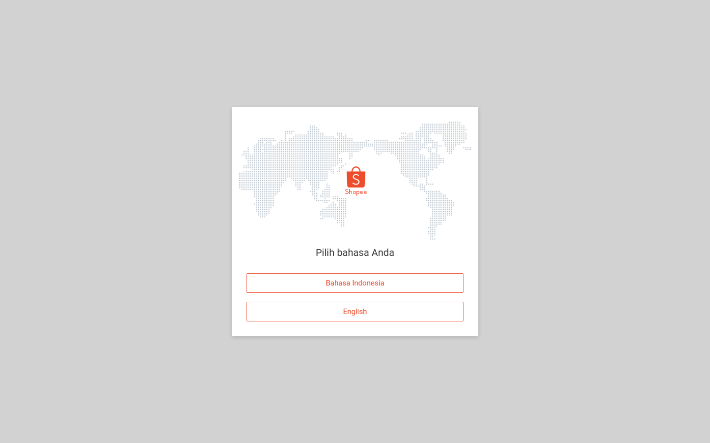

**페이지 메타 정보**

| page | title | description |
|---|---|---|
| [`home`](https://shopee.co.id/) | Shopee Indonesia | Situs Belanja Online Terlengkap & Terpercaya |  |

#### [Tokopedia](https://www.tokopedia.com/)

- URL: <https://www.tokopedia.com/>
- 페이지: **OK 0 · FAIL 1**

**실패 페이지**

- `home` — playwright_error: Error: Page.goto: net::ERR_HTTP2_PROTOCOL_ERROR at https://www.tokopedia.com/
Call log:
  - navigating to "https://www.tokopedia.com/", waiting until "domcontentloaded"

#### [Zalora Indonesia](https://www.zalora.co.id/)

- URL: <https://www.zalora.co.id/>
- 페이지: **OK 1 · FAIL 0**

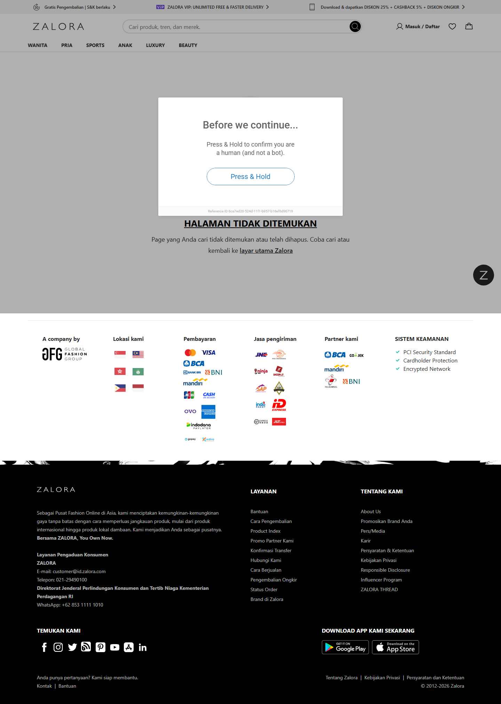

**대표 상품 이미지** (상위 6장, 출처 URL 포함)

- 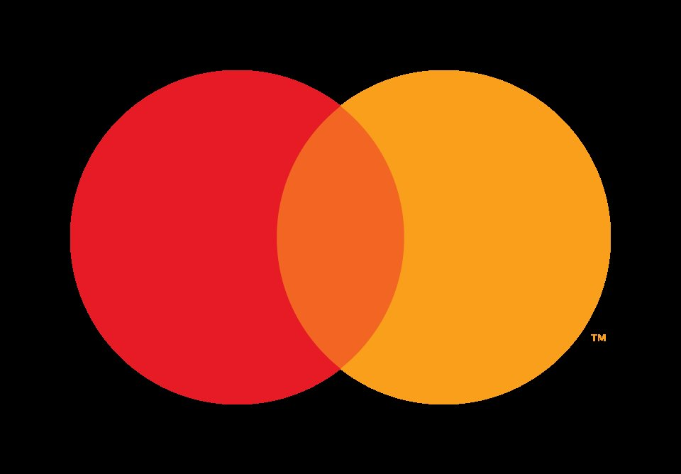 — 출처 <https://static-id.zacdn.com/next-assets/static-assets/images/logo/icon_mastercard.png>
-  — 출처 <https://static-id.zacdn.com/next-assets/static-assets/images/logo/icon_visa.png>
-  — 출처 <https://static-id.zacdn.com/next-assets/static-assets/images/logo/icon_ovo.png>

**페이지 메타 정보**

| page | title | description |
|---|---|---|
| [`new_women`](https://www.zalora.co.id/wanita/new-arrivals) | Halaman tidak ditemukan | ZALORA |  |

### 4.2 일본 _( Japan )_

- 한국 수출규모 순위: **#2** · region: `asia` · tier `1` · currency `JPY`
- 수집 사이트: **5개** (성공 4)
- 메모: K-패션 선호도 높고 온라인 패션몰 발달
#### [GU Japan](https://www.gu-global.com/jp/)

- URL: <https://www.gu-global.com/jp/>
- 페이지: **OK 1 · FAIL 0**

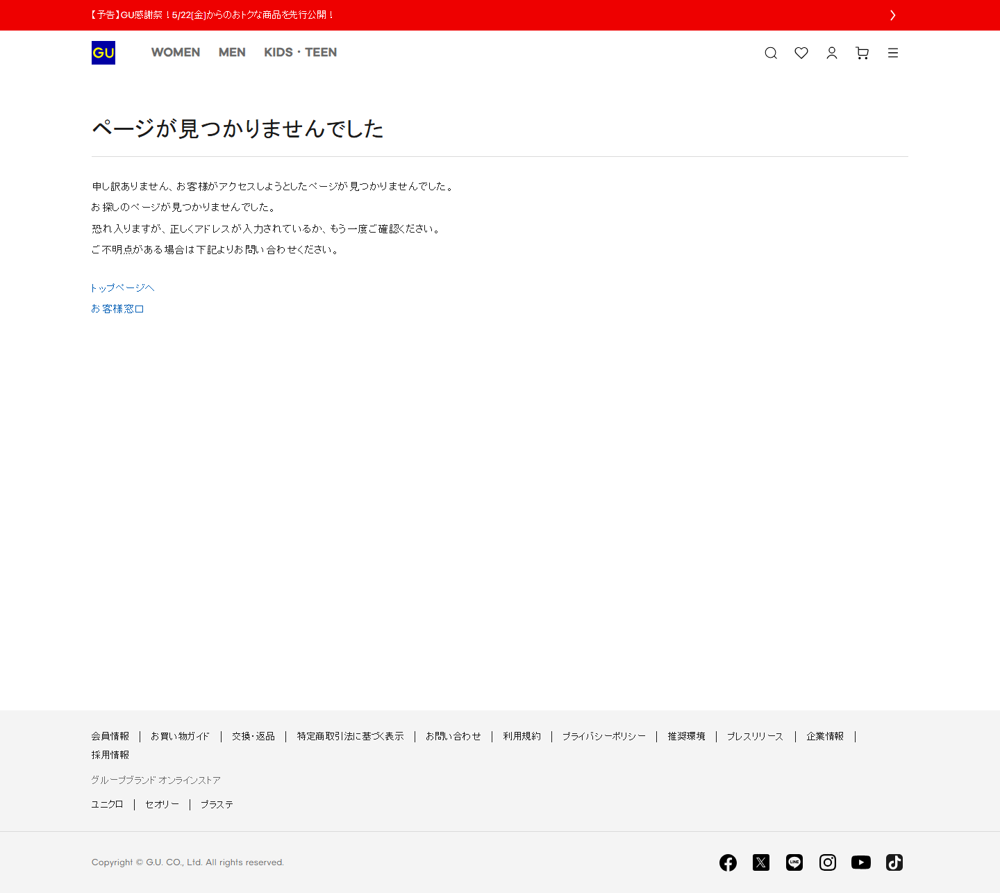

**대표 상품 이미지** (상위 6장, 출처 URL 포함)

-  — 출처 <https://image.uniqlo.com/GU/ST3/jp/imagesother/Navigation/WOMEN_Category/2026/260513/Category_w_Half-Tshirt.png>
-  — 출처 <https://image.uniqlo.com/GU/ST3/jp/imagesother/Navigation/WOMEN_Category/2026/260515/Category_w_Tshirt.png>
-  — 출처 <https://image.uniqlo.com/GU/ST3/jp/imagesother/Navigation/WOMEN_Category/2026/260513/Category_w_Shirt-Blouse.png>
- 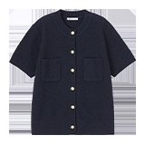 — 출처 <https://image.uniqlo.com/GU/ST3/jp/imagesother/Navigation/WOMEN_Category/2026/260513/Category_w_Knit-Cardigan.png>
-  — 출처 <https://image.uniqlo.com/GU/ST3/jp/imagesother/Navigation/WOMEN_Category/2026/260513/Category_w_onepeace.png>
-  — 출처 <https://image.uniqlo.com/GU/ST3/jp/imagesother/Navigation/WOMEN_Category/2026/260513/Category_w_Sweat.png>

**페이지 메타 정보**

| page | title | description |
|---|---|---|
| [`new_arrivals`](https://www.gu-global.com/jp/ja/not-found) | 申し訳ありません、お客様がアクセスしようとしたページが見つかりませんでした。恐れ入りますが、正しくアドレスが入力されているか、もう一度ご確認ください。 | ジーユー | 申し訳ありません、お客様がアクセスしようとしたページが見つかりませんでした。恐れ入りますが、正しくアドレスが入力されているか、もう一度ご確認ください。 |

#### [Rakuten Fashion](https://brandavenue.rakuten.co.jp/)

- URL: <https://brandavenue.rakuten.co.jp/>
- 페이지: **OK 1 · FAIL 1**

**대표 상품 이미지** (상위 6장, 출처 URL 포함)

-  — 출처 <https://brandavenue.r10s.jp/img/library/index/sbn_flagshipstore_20231003.png>
- 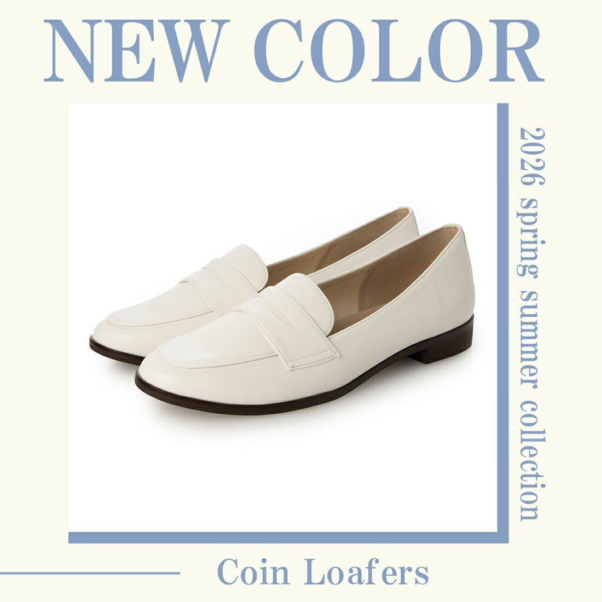 — 출처 <https://brandavenue.r10s.jp/img/news/01/372752/pc_n.jpg>
- 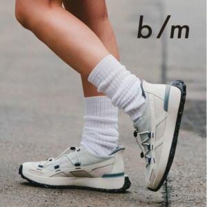 — 출처 <https://brandavenue.r10s.jp/img/news/01/373644/pc_n.jpg>
- 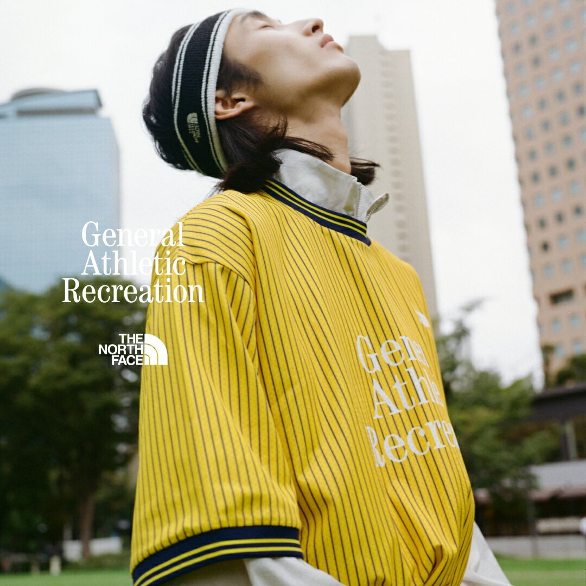 — 출처 <https://brandavenue.r10s.jp/img/news/01/373542/pc_n.jpg>
- 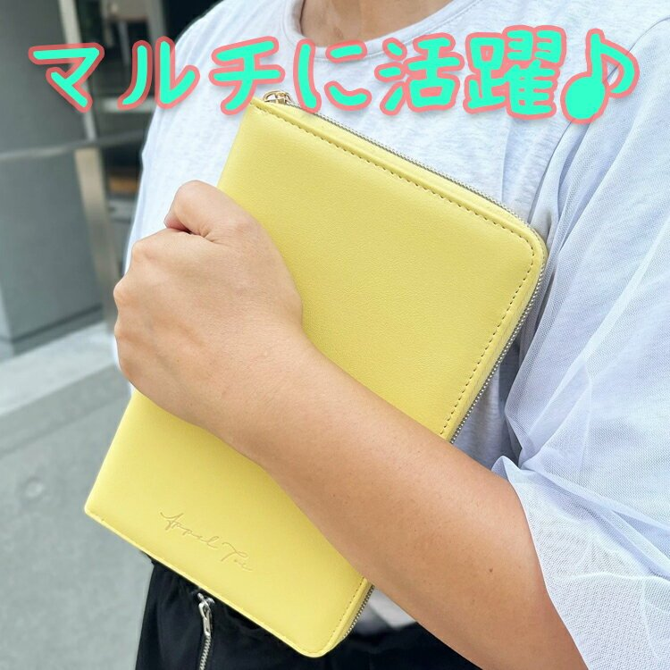 — 출처 <https://brandavenue.r10s.jp/img/news/01/373942/pc_n.jpg>
- 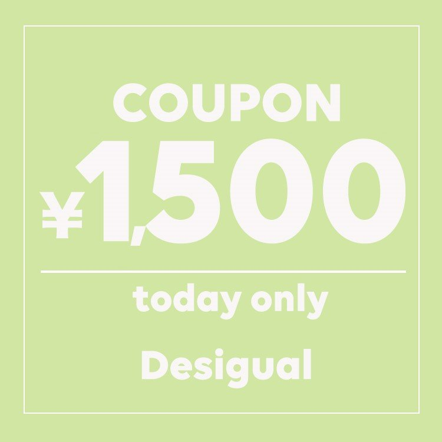 — 출처 <https://brandavenue.r10s.jp/img/news/01/372944/pc_n.jpg>

**페이지 메타 정보**

| page | title | description |
|---|---|---|
| [`men`](https://brandavenue.rakuten.co.jp/men/) | MEN | ファッション通販 Rakuten Fashion(楽天ファッション／旧楽天ブランドアベニュー) | Rakuten Fashion(楽天ファッション)は人気ブランドを取り扱うファッション通販サイトです。新作アイテム続々入荷！セール商品やクーポン対象商品も豊富。／税込3,980円以上購入で送料無料／楽天ポイントが使えて貯まる！ |

**실패 페이지**

- `women` — http_status_404

#### [Uniqlo Japan](https://www.uniqlo.com/jp/)

- URL: <https://www.uniqlo.com/jp/>
- 페이지: **OK 1 · FAIL 0**

**페이지 메타 정보**

| page | title | description |
|---|---|---|
| [`new_arrivals`](https://www.uniqlo.com/jp/ja/contents/feature/new-arrivals/) | 404 Not Found |  |

#### [WEAR](https://wear.jp/)

- URL: <https://wear.jp/>
- 페이지: **OK 1 · FAIL 0**

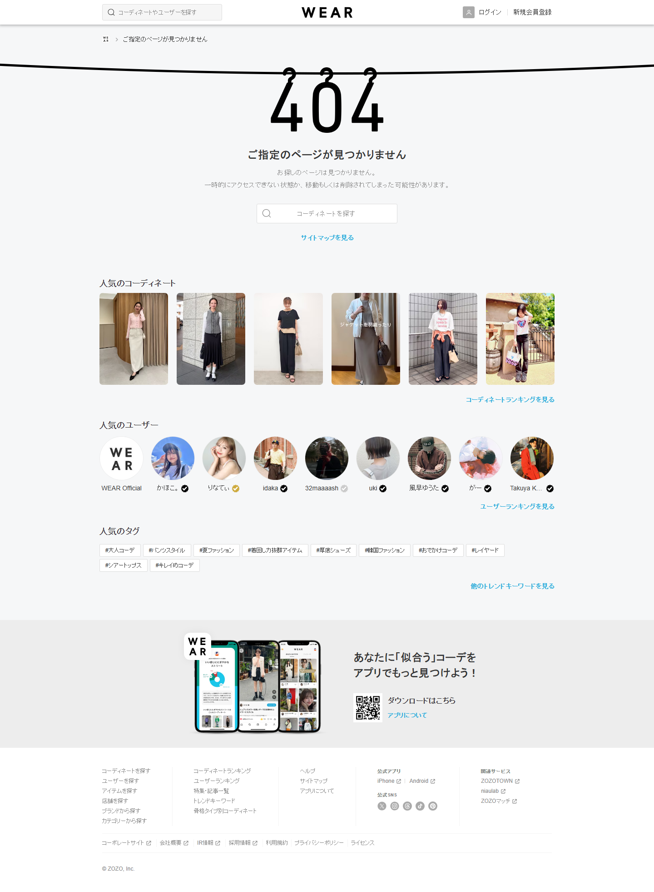

**대표 상품 이미지** (상위 6장, 출처 URL 포함)

-  — 출처 <https://wear.jp/public/_next/static/media/notfound_bg.0mfqf_sjjg4.q.png>
-  — 출처 <https://wear.jp/public/_next/static/media/notfound_4.0h3~tstn7vy~q.png>
-  — 출처 <https://wear.jp/public/_next/static/media/notfound_0.17sfauikqe-ig.png>
- 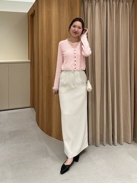 — 출처 <https://images.wear2.jp/coordinate/gGizzoQv/sJocPi9g/1778727726_276.jpg>
- 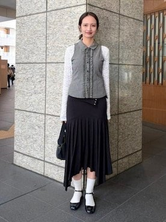 — 출처 <https://images.wear2.jp/coordinate/Z8iyzr/gxqCkPfc/1778838447_276.jpg>
- 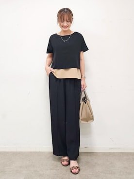 — 출처 <https://images.wear2.jp/coordinate/m0iAMGnm/kE2fqSHn/1778723168_276.jpg>

**페이지 메타 정보**

| page | title | description |
|---|---|---|
| [`ranking`](https://wear.jp/ranking/coordinate/) | ご指定のページが見つかりません - WEAR |  |

#### [ZOZOTOWN](https://zozo.jp/)

- URL: <https://zozo.jp/>
- 페이지: **OK 0 · FAIL 2**

**실패 페이지**

- `new` — playwright_error: TimeoutError: Page.goto: Timeout 30000ms exceeded.
Call log:
  - navigating to "https://zozo.jp/category/new/", waiting until "domcontentloaded"

- `ranking` — playwright_error: TimeoutError: Page.goto: Timeout 30000ms exceeded.
Call log:
  - navigating to "https://zozo.jp/ranking/", waiting until "domcontentloaded"

### 4.3 한국 _( South Korea )_

- 한국 수출규모 순위: **#30** · region: `asia` · tier `1` · currency `KRW`
- 수집 사이트: **4개** (성공 3)
- 메모: 비교 기준 (자국). 국내 사업동향 센싱
#### [29CM](https://www.29cm.co.kr/)

- URL: <https://www.29cm.co.kr/>
- 페이지: **OK 1 · FAIL 0**

**최근 유행 상품** (50건 · 상품명 클릭 시 해당 사이트로 이동)

| # | 상품명 | 브랜드 | 가격 | 페이지 |
|---:|---|---|---:|---|
| 1 | [BOAT NECK SLEEVELESS (BROWN)](https://product.29cm.co.kr/catalog/3933793) | 포코포스카 | 64,600 KRW | `home` |
| 2 | [BOAT NECK SLEEVELESS (BLUE)](https://product.29cm.co.kr/catalog/3933879) | 포코포스카 | 57,000 KRW | `home` |
| 3 | [BOAT NECK SLEEVELESS (SALMON PINK)](https://product.29cm.co.kr/catalog/3933838) | 포코포스카 | 57,000 KRW | `home` |
| 4 | [씬에어(THINAIR) ANANTA PARKA W_Greyish Khaki_KWW24528K5](https://product.29cm.co.kr/catalog/2819749) | 케이투 | 184,000 KRW | `home` |
| 5 | [GOLDEN K95 에끌레어(ECLAIR) COAT LONG W_Black_GWW25546Z1](https://product.29cm.co.kr/catalog/3602173) | 케이투 | 317,000 KRW | `home` |
| 6 | [씬에어(THINAIR) ANANTA PARKA_Black_KMW24527Z1](https://product.29cm.co.kr/catalog/2944904) | 케이투 | 184,000 KRW | `home` |
| 7 | [[리우드]토르 수영복(SS26)_07T085912](https://product.29cm.co.kr/catalog/3965894) | 리우드 | 74,550 KRW | `home` |
| 8 | [[리우드]카밀 런치박스(SS26) _07T082605](https://product.29cm.co.kr/catalog/3965892) | 리우드 | 39,050 KRW | `home` |
| 9 | [[리우드]맥스 반팔 수영복(SS26)_07T085911](https://product.29cm.co.kr/catalog/3965888) | 리우드 | 74,550 KRW | `home` |
| 10 | [Percale Pillow Sham - Shaded Yellow (50x70)](https://product.29cm.co.kr/catalog/3629307) | 테클라 | 71,250 KRW | `home` |
| 11 | [Percale Duvet Cover - Shaded Yellow - Single (160x210)](https://product.29cm.co.kr/catalog/3629285) | 테클라 | 308,750 KRW | `home` |
| 12 | [Percale Duvet Cover - Shaded Yellow - Double (220x240)](https://product.29cm.co.kr/catalog/3851965) | 테클라 | 498,750 KRW | `home` |
| 13 | [Washcloth - Racing Green (30x30)](https://product.29cm.co.kr/catalog/2879731) | 테클라 | 28,980 KRW | `home` |
| 14 | [Washcloth - Sky Blue (30x30)](https://product.29cm.co.kr/catalog/3851974) | 테클라 | 28,980 KRW | `home` |
| 15 | [Guest towel - Kodiak Stripes (30x50)](https://product.29cm.co.kr/catalog/2879686) | 테클라 | 39,900 KRW | `home` |
| 16 | [ONE SHOULDER RAGLAN T-SHIRT_SKY BLUE](https://product.29cm.co.kr/catalog/3962506) | 셀리테일즈 | 79,200 KRW | `home` |
| 17 | [ONE SHOULDER RAGLAN T-SHIRT_PINK](https://product.29cm.co.kr/catalog/3962502) | 셀리테일즈 | 79,200 KRW | `home` |
| 18 | [STRIPE HALTER NECK TOP_CHARCOAL](https://product.29cm.co.kr/catalog/3962492) | 셀리테일즈 | 40,500 KRW | `home` |
| 19 | [VIVID SLIM SPAN HALF SLEEVE T-SHIRT (APPLE MINT)](https://product.29cm.co.kr/catalog/3946890) | 론크 | 34,880 KRW | `home` |
| 20 | [[루피타 PICK] VIVID SLIM SPAN HALF SLEEVE T-SHIRT (RED)](https://product.29cm.co.kr/catalog/3946893) | 론크 | 34,880 KRW | `home` |

**대표 상품 이미지** (상위 6장, 출처 URL 포함)

-  — 출처 <https://img.29cm.co.kr/cms/202605/11f1501f461a68bb8e7df175bdf309b9.png?width=3840&format=webp>
- 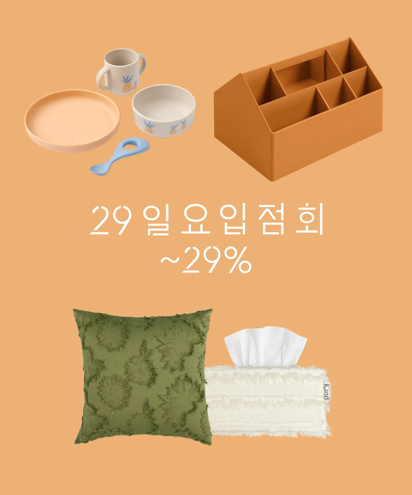 — 출처 <https://img.29cm.co.kr/cms/202605/11f1501f34e88df083a40543e3c0ee3c.jpg?width=3840&format=webp>
- 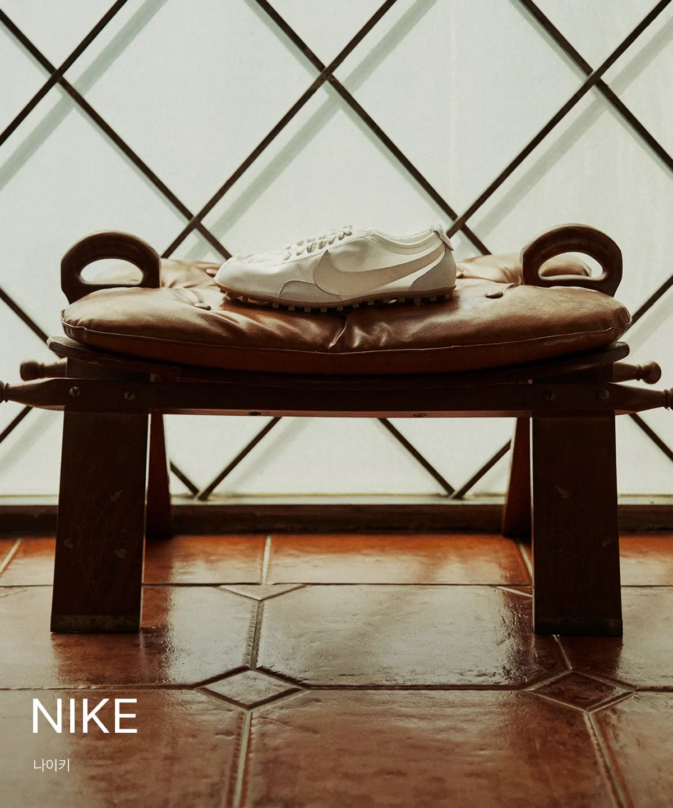 — 출처 <https://img.29cm.co.kr/cms/202605/11f1501f279ec28083a4755898ac0118.png?width=3840&format=webp>
-  — 출처 <https://img.29cm.co.kr/cms/202605/11f14f59246d91aa83a43fe78b9c14f0.jpg?width=3840&format=webp>
- 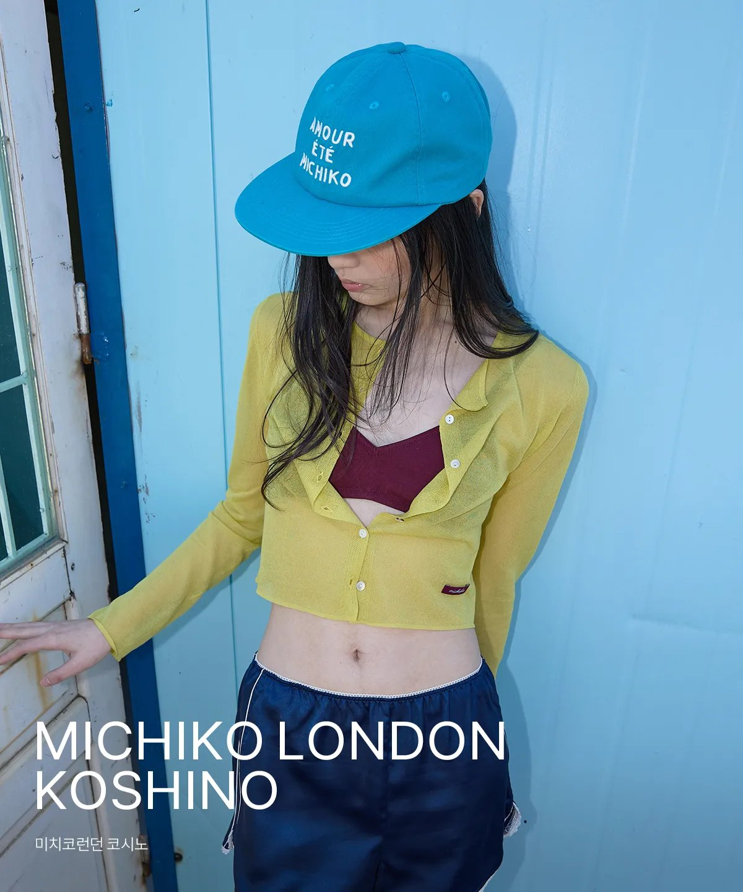 — 출처 <https://img.29cm.co.kr/cms/202605/11f14f58fccf5b4683a4dd35be43c951.jpg?width=3840&format=webp>
- 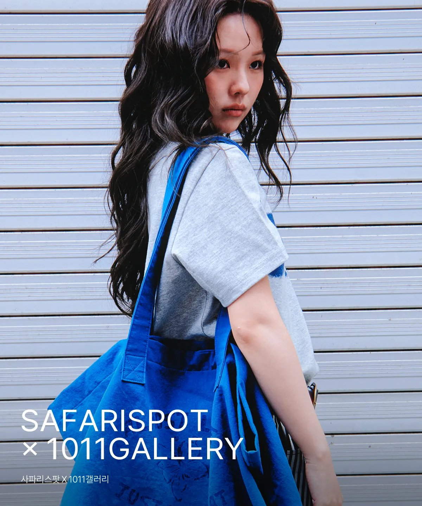 — 출처 <https://img.29cm.co.kr/cms/202605/11f14f58dc43e78883a4db3e05b2ce57.jpg?width=3840&format=webp>

**페이지 메타 정보**

| page | title | description |
|---|---|---|
| [`home`](https://www.29cm.co.kr/) | 감도 깊은 취향 셀렉트샵 29CM | 패션, 라이프스타일, 컬처까지 29CM만의 감도 깊은 셀렉션을 만나보세요. |

#### [Musinsa](https://www.musinsa.com/)

- URL: <https://www.musinsa.com/>
- 페이지: **OK 0 · FAIL 1**

**실패 페이지**

- `home` — robots_disallowed

#### [W Concept](https://www.wconcept.co.kr/)

- URL: <https://www.wconcept.co.kr/>
- 페이지: **OK 1 · FAIL 0**

**최근 유행 상품** (20건 · 상품명 클릭 시 해당 사이트로 이동)

| # | 상품명 | 브랜드 | 가격 | 페이지 |
|---:|---|---|---:|---|
| 1 | [Roosa dress (2colors)](https://m.wconcept.co.kr/Product/306788003) | 이바나헬싱키 | 141,368 KRW | `home` |
| 2 | [Asla layered dress](https://m.wconcept.co.kr/Product/308507203) | 이바나헬싱키 | 173,136 KRW | `home` |
| 3 | [Russu tweed Crop jacket(4colors)](https://m.wconcept.co.kr/Product/302729896) | 이바나헬싱키 | 169,490 KRW | `home` |
| 4 | [Russu tweed midi skirt(4colors)](https://m.wconcept.co.kr/Product/302729897) | 이바나헬싱키 | 138,391 KRW | `home` |
| 5 | [Nuppu shirring blouse (2colors)](https://m.wconcept.co.kr/Product/308515927) | 이바나헬싱키 | 101,658 KRW | `home` |
| 6 | [Lena wrap Dress (3colors)](https://m.wconcept.co.kr/Product/308516450) | 이바나헬싱키 | 157,252 KRW | `home` |
| 7 | [Heartlie mini Dress (3colors)](https://m.wconcept.co.kr/Product/308507090) | 이바나헬싱키 | 149,310 KRW | `home` |
| 8 | [Aalto Caul Blouse (3colors)](https://m.wconcept.co.kr/Product/308515672) | 이바나헬싱키 | 85,774 KRW | `home` |
| 9 | [Ruid Tie Blouse (2colors)](https://m.wconcept.co.kr/Product/308507141) | 이바나헬싱키 | 85,774 KRW | `home` |
| 10 | [Melodia dress (2colors)](https://m.wconcept.co.kr/Product/306642433) | 이바나헬싱키 | 325,140 KRW | `home` |
| 11 | [Latte Tucked Blouse (2colors)](https://m.wconcept.co.kr/Product/308365044) | 이바나헬싱키 | 109,600 KRW | `home` |
| 12 | [Miel Shirring Dress (2colors)](https://m.wconcept.co.kr/Product/308516438) | 이바나헬싱키 | 149,310 KRW | `home` |
| 13 | [Soili mini dress (3colors)](https://m.wconcept.co.kr/Product/306787996) | 이바나헬싱키 | 133,927 KRW | `home` |
| 14 | [Latte Half sleeve Blouse (2colors)](https://m.wconcept.co.kr/Product/308507129) | 이바나헬싱키 | 101,658 KRW | `home` |
| 15 | [Cove tweed jacket (3colors)](https://m.wconcept.co.kr/Product/308473813) | 이바나헬싱키 | 186,595 KRW | `home` |
| 16 | [Virta Tie Blouse (2colors)](https://m.wconcept.co.kr/Product/308507174) | 이바나헬싱키 | 117,542 KRW | `home` |
| 17 | [Blue Laine tweed skirt (5colors)](https://m.wconcept.co.kr/Product/308473861) | 이바나헬싱키 | 133,927 KRW | `home` |
| 18 | [Auro Button Skirt (2colors)](https://m.wconcept.co.kr/Product/308507217) | 이바나헬싱키 | 101,658 KRW | `home` |
| 19 | [Anita dress (2colors)](https://m.wconcept.co.kr/Product/306787998) | 이바나헬싱키 | 140,699 KRW | `home` |
| 20 | [Cordelia jacket (3colors)](https://m.wconcept.co.kr/Product/308473832) | 이바나헬싱키 | 141,368 KRW | `home` |

**페이지 메타 정보**

| page | title | description |
|---|---|---|
| [`home`](https://www.wconcept.co.kr/) | _(empty)_ |  |

#### [Zigzag](https://zigzag.kr/)

- URL: <https://zigzag.kr/>
- 페이지: **OK 1 · FAIL 0**

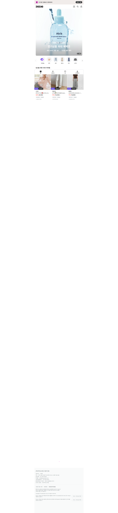

**최근 유행 상품** (36건 · 상품명 클릭 시 해당 사이트로 이동)

| # | 상품명 | 브랜드 | 가격 | 페이지 |
|---:|---|---|---:|---|
| 1 | [[🔥후기인증/🎖️1등슬랙스] made. 모먼트 투커버 올데이슬랙스 (+숏/베이직/롱ver) - 4 size](https://store.zigzag.kr/app/catalog/products/136095576?browsing_type=NATIVE_BROWSER) | 슬로우앤드 | 31,840 KRW | `home` |
| 2 | [[백지헌 PICK💖][COOL] 썸머 카디건_SPCKG24G01](https://store.zigzag.kr/app/catalog/products/168873831?browsing_type=NATIVE_BROWSER) | 스파오 | 20,180 KRW | `home` |
| 3 | [[+여름🌴/50만장돌파/made] 허쉬 코튼 와이드팬츠 (숏/기본/롱)](https://store.zigzag.kr/app/catalog/products/143224732?browsing_type=NATIVE_BROWSER) | 리얼코코 | 15,930 KRW | `home` |
| 4 | [[5만장판매] [B-BASIC] 에어스웨트 와이드 투웨이 밴딩팬츠](https://store.zigzag.kr/app/catalog/products/161816482?browsing_type=NATIVE_BROWSER) | 블랙업 | 34,400 KRW | `home` |
| 5 | [[🌴마법보정핏+미친편안함/재구매율1등🏆부츠컷데님독보적1등/누적50만장🌸로우ver+코튼+데님/여름바지/여름청바지][made]세인트부츠컷데님 - 9color](https://store.zigzag.kr/app/catalog/products/111046579?browsing_type=NATIVE_BROWSER) | 니썸 | 23,940 KRW | `home` |
| 6 | [헨리넥 반팔티_SPRWG24G01](https://store.zigzag.kr/app/catalog/products/168759103?browsing_type=NATIVE_BROWSER) | 스파오 | 23,310 KRW | `home` |
| 7 | [[✨구김걱정NO/💐하객룩추천] made. 세미부츠컷 찰랑슬랙스 (+베이직/롱ver) - 4 size](https://store.zigzag.kr/app/catalog/products/142355088?browsing_type=NATIVE_BROWSER) | 슬로우앤드 | 31,120 KRW | `home` |
| 8 | [[오픈할인중] made. 내츄럴 소프트 블라우스 & 스커트 SET (개별 구매 가능!) - 2 size](https://store.zigzag.kr/app/catalog/products/169981192?browsing_type=NATIVE_BROWSER) | 슬로우앤드 | 23,940 KRW | `home` |
| 9 | [[💗기본템/부유방커버] made. 쫀쫀 커버핏 슬리브리스 (유교걸나시!) - 7 color](https://store.zigzag.kr/app/catalog/products/160291278?browsing_type=NATIVE_BROWSER) | 슬로우앤드 | 15,040 KRW | `home` |
| 10 | [[✨살안타템] made. 플레인 여리핏 썸머가디건 - 6 color](https://store.zigzag.kr/app/catalog/products/141374160?browsing_type=NATIVE_BROWSER) | 슬로우앤드 | 28,720 KRW | `home` |
| 11 | [[3타입][무지/배색/스트라이프][MADE] 러브유 보트넥 레이어드 민소매 골지나시 (44~110) (빅사이즈나시-끈나시-민소매-무지나시-스트라이프나시--부유방커버나시)](https://store.zigzag.kr/app/catalog/products/159214859?browsing_type=NATIVE_BROWSER) | 핫핑 | 14,200 KRW | `home` |
| 12 | [[🌸사계절필수/인생티♥] made. 솔트 클린 반팔티셔츠 (스탠다드핏/루즈핏) - 7 color](https://store.zigzag.kr/app/catalog/products/141373178?browsing_type=NATIVE_BROWSER) | 슬로우앤드 | 12,370 KRW | `home` |
| 13 | [[🏆역대급100만장/편안함최강] made. 마켓 와이드 트레이닝슬랙스 (+숏/베이직/롱ver) - 3 size](https://store.zigzag.kr/app/catalog/products/141360158?browsing_type=NATIVE_BROWSER) | 슬로우앤드 | 26,320 KRW | `home` |
| 14 | [[여름청바지👖/후기최고] made. 투데이 썸머라이트 데님팬츠 (+베이직/롱ver) - 4 size](https://store.zigzag.kr/app/catalog/products/122809429?browsing_type=NATIVE_BROWSER) | 슬로우앤드 | 26,520 KRW | `home` |
| 15 | [오버테이크 토숀 베스트 브이넥 레이스 크롭 민소매 나시 (2 color)](https://store.zigzag.kr/app/catalog/products/169996186?browsing_type=NATIVE_BROWSER) | 바이안 | 48,000 KRW | `home` |
| 16 | [[백지헌 PICK💖][COOL] 썸머 골지 카디건_SPCKG24G02](https://store.zigzag.kr/app/catalog/products/168873846?browsing_type=NATIVE_BROWSER) | 스파오 | 20,180 KRW | `home` |
| 17 | [리터 베이비 버튼 린넨 헨리넥 니트 긴팔 크롭 썸머 여름 liter 떠유니](https://store.zigzag.kr/app/catalog/products/169996758?browsing_type=NATIVE_BROWSER) | 떠유니 | 52,200 KRW | `home` |
| 18 | [[3SIZE] 네브아 라글란 코튼 골지 반팔 니트 ( 여름-신상-데일리룩-출근룩-하객룩-데이트룩-오피스룩-자체제작-팬던트-하객-반팔-반팔니트-라글란-래글런-골지-여름니트 )](https://store.zigzag.kr/app/catalog/products/169960255?browsing_type=NATIVE_BROWSER) | 오브넬 | 27,280 KRW | `home` |
| 19 | [[🌴여름ver추가🏆매시즌베스트/FREE+L/사이즈선택/살안타템/하객룩][간절기/여름가디건][MADE]마렌라운드가디건 - 9color](https://store.zigzag.kr/app/catalog/products/156389482?browsing_type=NATIVE_BROWSER) | 니썸 | 25,980 KRW | `home` |
| 20 | [[30만장돌파/MADE]누벨 데일리 나일론 슬릿 롱 스커트 (S-L/여름스커트/바스락스커트/데일리룩/출근룩/h라인스커트/나일론치마/롱치마)](https://store.zigzag.kr/app/catalog/products/140798161?browsing_type=NATIVE_BROWSER) | 케이클럽 | 23,880 KRW | `home` |

**대표 상품 이미지** (상위 6장, 출처 URL 포함)

-  — 출처 <https://cf.image-farm.s.zigzag.kr/original/cms/2026/04/28/202604280154164065_020417.jpg?format=webp&quality=80&width=1029&height=1188>
- 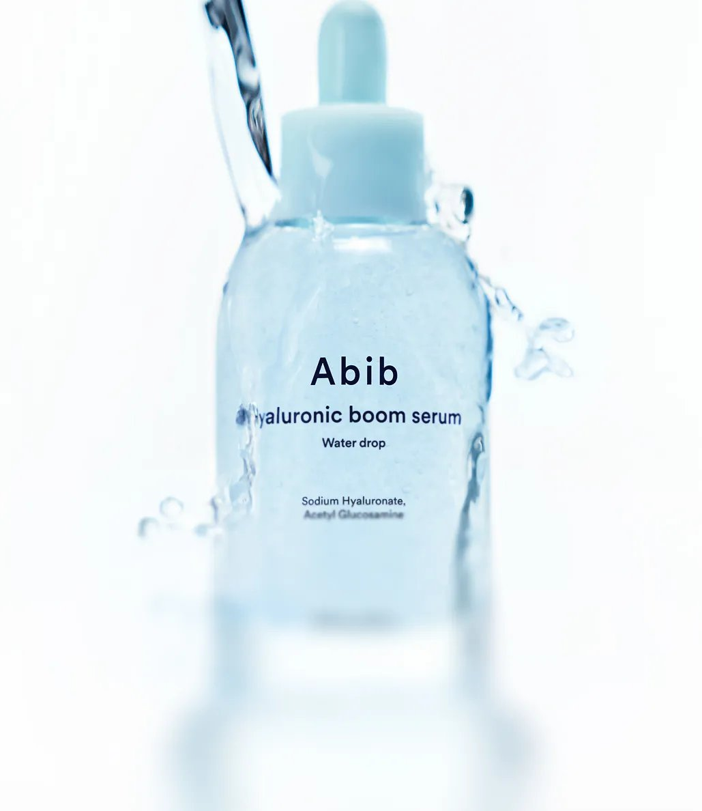 — 출처 <https://cf.image-farm.s.zigzag.kr/original/cms/2026/05/17/202605170957469565_040200.jpg?width=1029&height=1188&quality=80&format=webp&transparent=true>
-  — 출처 <https://cf.image-farm.s.zigzag.kr/original/cms/2026/05/17/202605171153369298_096013.jpg?width=1029&height=1188&quality=80&format=webp&transparent=true>
- 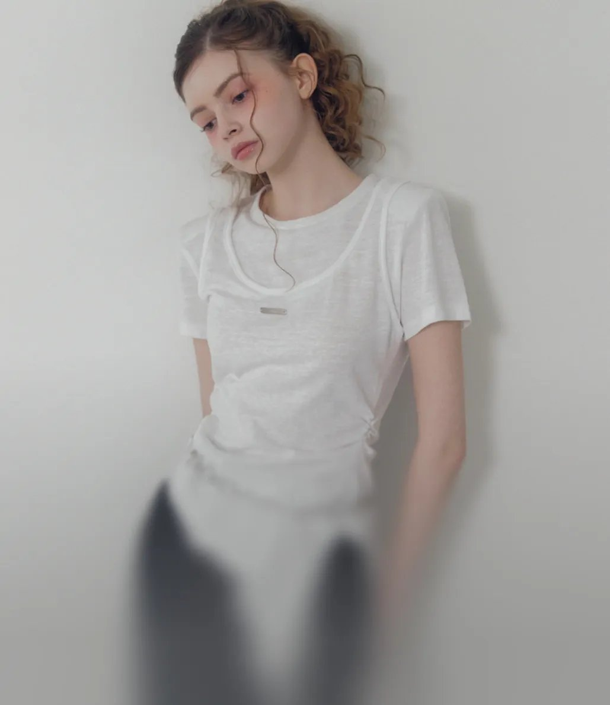 — 출처 <https://cf.image-farm.s.zigzag.kr/original/cms/2026/05/13/202605131201059356_044641.jpg?width=1029&height=1188&quality=80&format=webp&transparent=true>
- 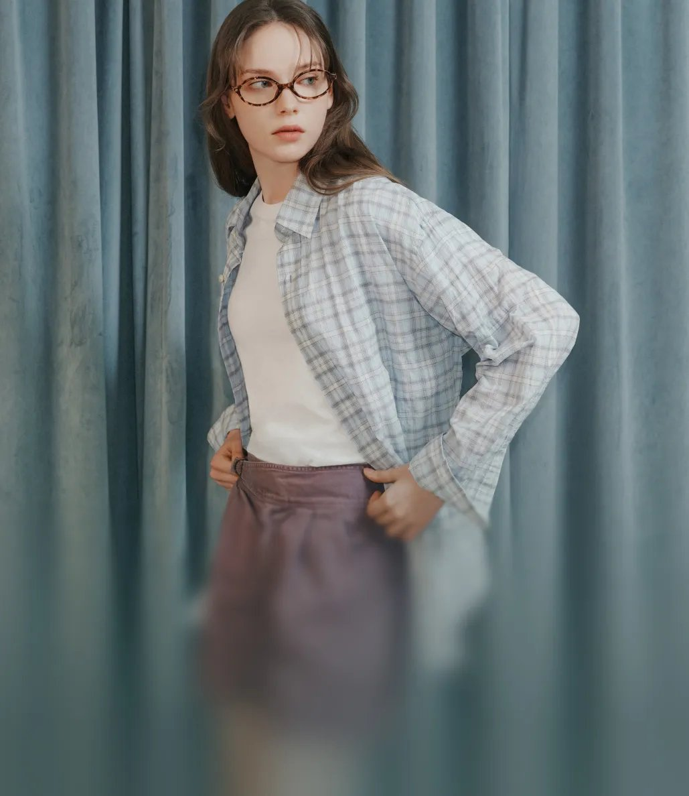 — 출처 <https://cf.image-farm.s.zigzag.kr/original/cms/2026/05/15/202605150412066776_048852.jpg?width=1029&height=1188&quality=80&format=webp&transparent=true>
-  — 출처 <https://cf.image-farm.s.zigzag.kr/original/cms/2026/05/15/202605150325069753_011145.png?quality=80&format=webp&transparent=true&width=1029&height=1188>

**페이지 메타 정보**

| page | title | description |
|---|---|---|
| [`home`](https://zigzag.kr/) | 지그재그 스토어 | 4,000만 여성이 선택한 올인원 쇼핑 앱 지그재그 - 제가 알아서 살게요. |

### 4.4 대만 _( Taiwan )_

- 한국 수출규모 순위: **#7** · region: `asia` · tier `1` · currency `TWD`
- 수집 사이트: **5개** (성공 4)
- 메모: K-패션 친화도 높음
#### [momo](https://www.momoshop.com.tw/)

- URL: <https://www.momoshop.com.tw/>
- 페이지: **OK 1 · FAIL 0**

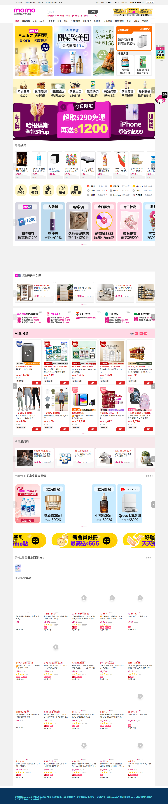

**대표 상품 이미지** (상위 6장, 출처 URL 포함)

-  — 출처 <https://img2.momoshop.com.tw/ecm/img/online/10/998/00/000/bt_0_271_01/bt_0_271_01_e2.jpg?t=1777893650110>
- 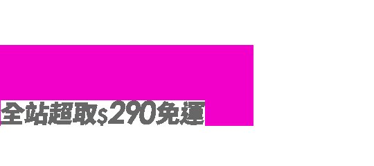 — 출처 <https://img4.momoshop.com.tw/ecm/img/online/10/998/00/000/bt_0_243_01/bt_0_243_01_e2.png?t=1777893501680>
-  — 출처 <https://img2.momoshop.com.tw/ecm/img/online/10/998/00/000/bt_0_245_01/bt_0_245_01_P1_1_e2.png?t=1779033613455>
- 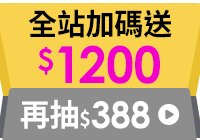 — 출처 <https://img1.momoshop.com.tw/ecm/img/online/10/998/00/000/bt_0_245_01/bt_0_245_01_P1_2_e2.png?t=1778428815016>
-  — 출처 <https://img1.momoshop.com.tw/ecm/img/online/10/998/00/000/bt_0_245_01/bt_0_245_01_P1_3_e2.png?t=1778428815016>
- 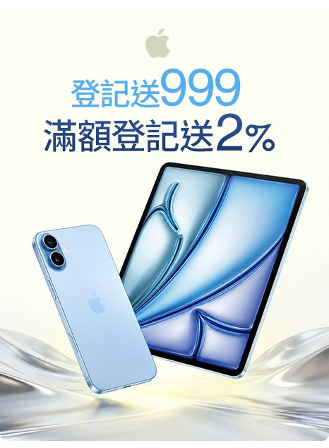 — 출처 <https://img3.momoshop.com.tw/ecm/img/online/81/998/00/000/mobile/bt_7_701_01/bt_7_701_01_e21.jpg?t=1778839793698>

**페이지 메타 정보**

| page | title | description |
|---|---|---|
| [`home`](https://www.momoshop.com.tw/main/Main.jsp) | momo購物網 - 好評推薦 - 2026年5月 | momo購物網提供美妝保養、流行服飾、時尚精品、3C、數位家電、生活用品、美食旅遊票券…等數百萬件商品。快速到貨、超商取貨讓您購物最便利。mo店+商品抵用券天天搶、免運吃到飽，電視/直播商品限時下殺，每日讓您享超低價，並享有十天猶豫期；momo購物網為富邦及台灣大哥大關係企業 |

#### [OB Design](https://www.obdesign.com.tw/)

- URL: <https://www.obdesign.com.tw/>
- 페이지: **OK 1 · FAIL 0**

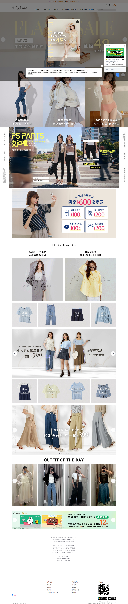

**대표 상품 이미지** (상위 6장, 출처 URL 포함)

- 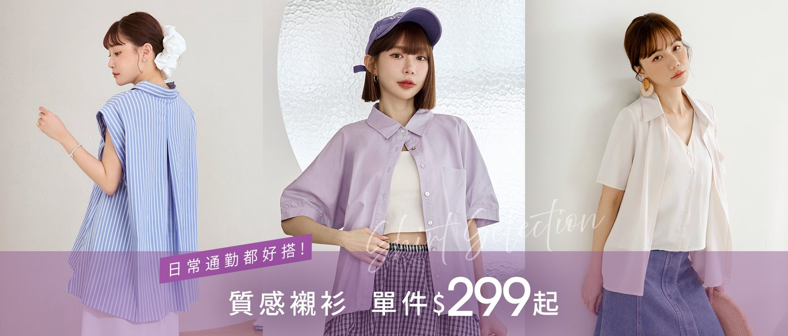 — 출처 <https://cms-static.cdn.91app.com/images/original/41602/92f19e4d-89b7-4330-9570-02cf1dff9742-1778637069-w0s0fz0ca4_d_1920x820_1280x547_1124x480_800x342_600x256_400x171.jpg>
-  — 출처 <https://cms-static.cdn.91app.com/images/original/41602/92f19e4d-89b7-4330-9570-02cf1dff9742-1778816518-a1ttjqlpdt_d_1920x820_1280x547_1124x480_800x342_600x256_400x171.jpg>
-  — 출처 <https://cms-static.cdn.91app.com/images/compress/41602/92f19e4d-89b7-4330-9570-02cf1dff9742-1778816518-a1ttjqlpdt_d_400x171.webp>
- 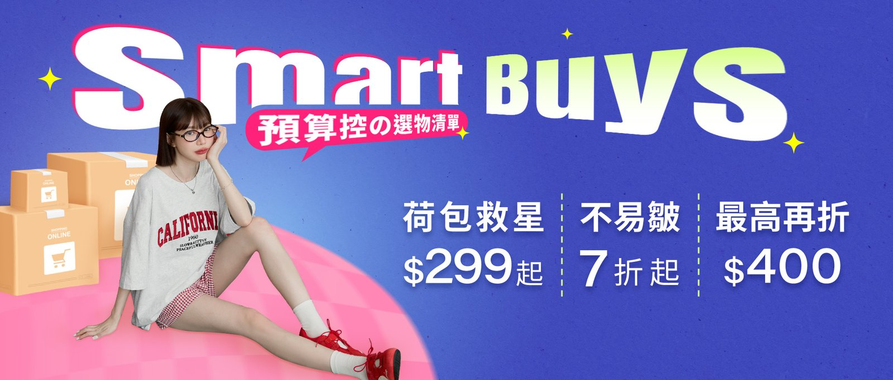 — 출처 <https://cms-static.cdn.91app.com/images/original/41602/92f19e4d-89b7-4330-9570-02cf1dff9742-1778552826-fq6i98do8_d_1920x820_1280x547_1124x480_800x342_600x256_400x171.jpg>
- 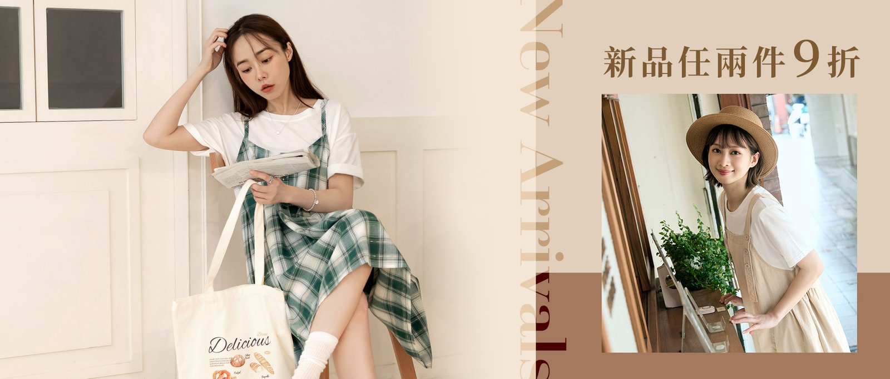 — 출처 <https://cms-static.cdn.91app.com/images/original/41602/92f19e4d-89b7-4330-9570-02cf1dff9742-1778489474-6drun5zyc4_d_1920x820_1280x547_1124x480_800x342_600x256_400x171.jpg>
- 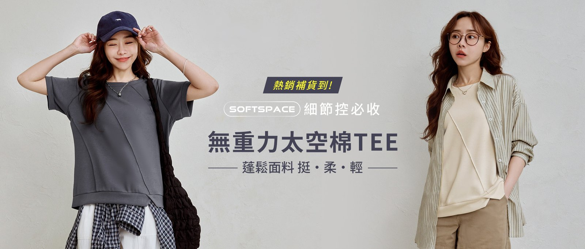 — 출처 <https://cms-static.cdn.91app.com/images/original/41602/92f19e4d-89b7-4330-9570-02cf1dff9742-1778746403-a0d3jhklbp_d_1920x820_1280x547_1124x480_800x342_600x256_400x171.jpg>

**페이지 메타 정보**

| page | title | description |
|---|---|---|
| [`home`](https://www.obdesign.com.tw/) | OB嚴選｜高CP值人氣熱銷服飾，流行服飾品牌 | 你的日常穿搭好夥伴，快上OB嚴選找，OB嚴選提供女裝、孕童、運動、男裝各項流行服飾，秉持優質服務給你高CP值的購物體驗。各種風格都能滿足熱愛穿搭的你，天天上新品，快速出貨，一起加入OB style！網路人氣服飾品牌OB嚴選 |

#### [PChome](https://24h.pchome.com.tw/)

- URL: <https://24h.pchome.com.tw/>
- 페이지: **OK 0 · FAIL 1**

**실패 페이지**

- `home` — http_status_429

#### [Pinkoi Taiwan](https://www.pinkoi.com/)

- URL: <https://www.pinkoi.com/>
- 페이지: **OK 2 · FAIL 0**

**대표 상품 이미지** (상위 6장, 출처 URL 포함)

-  — 출처 <https://cdn04.pinkoi.com/pinkoi.site/logo/og_image.png>

**페이지 메타 정보**

| page | title | description |
|---|---|---|
| [`accessories`](https://en.pinkoi.com/) | Pinkoi | Asia’s cross-border design marketplace | Design the way you are | Shop for original design products from Asia's independent designers. Pinkoi lives and breathes great design, great quality, great service, a |
| [`bags`](https://en.pinkoi.com/) | Pinkoi | Asia’s cross-border design marketplace | Design the way you are | Shop for original design products from Asia's independent designers. Pinkoi lives and breathes great design, great quality, great service, a |

#### [Yahoo Taiwan Shopping](https://tw.buy.yahoo.com/)

- URL: <https://tw.buy.yahoo.com/>
- 페이지: **OK 1 · FAIL 0**

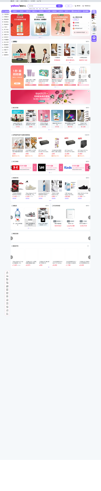

**대표 상품 이미지** (상위 6장, 출처 URL 포함)

- 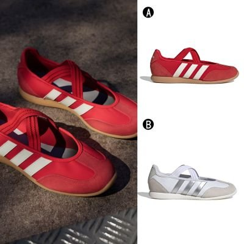 — 출처 <https://img.yec.tw/zp/MerchandiseImages/8760617204-SP-21929884.jpg>
- 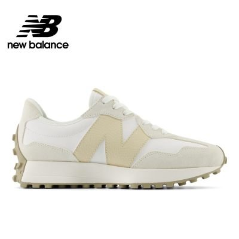 — 출처 <https://img.yec.tw/zp/MerchandiseImages/d2a5dcf358-Gd-11139010.jpg>
- 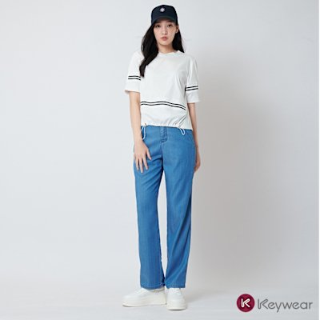 — 출처 <https://img.yec.tw/zp/MerchandiseImages/71C6C78805-SP-19557537.jpg>

**페이지 메타 정보**

| page | title | description |
|---|---|---|
| [`home`](https://tw.buy.yahoo.com/) | Yahoo購物中心 - 最懂生活的人 | 數百萬件商品，貼心客服為您服務，15天鑑賞期購物保障！ |

### 4.5 태국 _( Thailand )_

- 한국 수출규모 순위: **#8** · region: `asia` · tier `1` · currency `THB`
- 수집 사이트: **5개** (성공 5)
- 메모: 동남아 K-패션 핵심 시장
#### [Central Online](https://www.central.co.th/)

- URL: <https://www.central.co.th/>
- 페이지: **OK 1 · FAIL 0**

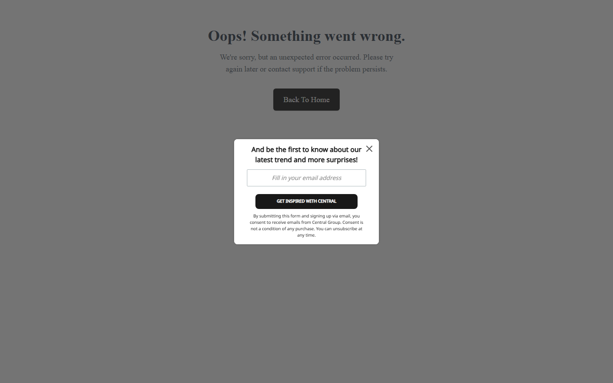

**페이지 메타 정보**

| page | title | description |
|---|---|---|
| [`home`](https://www.central.co.th/th) | _(empty)_ |  |

#### [Lazada Thailand Fashion](https://www.lazada.co.th/)

- URL: <https://www.lazada.co.th/>
- 페이지: **OK 1 · FAIL 0**

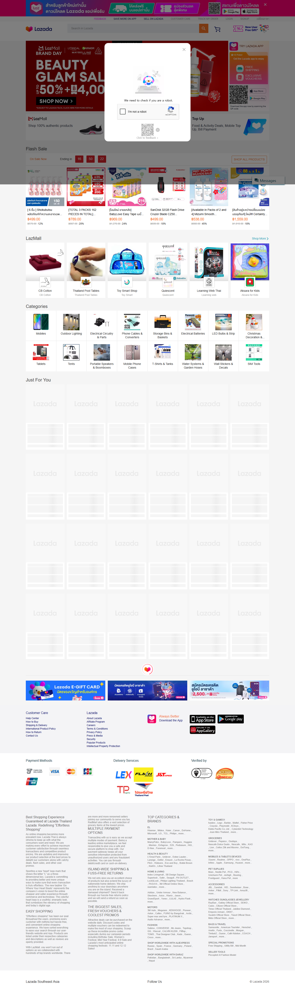

**대표 상품 이미지** (상위 6장, 출처 URL 포함)

-  — 출처 <https://img.lazcdn.com/us/domino/40845120240f19d13f738fa9a7978edd.png>
-  — 출처 <https://img.lazcdn.com/g/tps/images/ims-web/TB1KB2laMFY.1VjSZFnXXcFHXXa.png>
-  — 출처 <https://img.lazcdn.com/us/domino/1b431701-1652-483b-8511-341ad40e69d3_TH-1976-688.jpg_2200x2200q80.jpg>
-  — 출처 <https://img.lazcdn.com/us/domino/63d084b3-0d70-4749-84fe-cf97e5b3c0cc_TH-1976-688.jpg_2200x2200q80.jpg>
-  — 출처 <https://img.lazcdn.com/us/domino/082d3c84-0b12-4616-81ab-d68d169e4bdb_TH-1976-688.jpg_2200x2200q80.jpg>
- 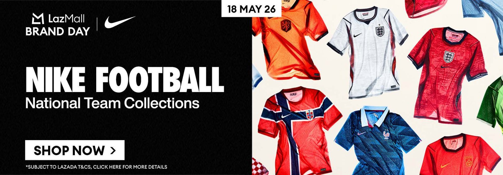 — 출처 <https://img.lazcdn.com/us/domino/b8497442-873a-4318-b82f-3627a7e119e4_TH-1976-688.jpg_2200x2200q80.jpg>

**페이지 메타 정보**

| page | title | description |
|---|---|---|
| [`home`](https://www.lazada.co.th/#?) | Lazada Thailand | ช้อปออนไลน์ สินค้าดี พร้อมดีลพิเศษทุกวัน | พบกับ Lazada แพลตฟอร์มช้อปปิ้งชั้นนำในอาเซียน พร้อมบริการเก็บเงินปลายทาง LazMall LazFlash และดีลเด็ดจากแบรนด์ดังทุกวัน |

#### [Pomelo](https://www.pomelofashion.com/)

- URL: <https://www.pomelofashion.com/>
- 페이지: **OK 2 · FAIL 0**

**대표 상품 이미지** (상위 6장, 출처 URL 포함)

-  — 출처 <https://cdn.pomelofashion.com/img/nav/3271/c/7422/20260428100935_69f024efaf715_banner-image.jpg?auto=compress,format&fm=webp,jpg,png&w=375&h=100>
-  — 출처 <https://cdn.pomelofashion.com/img/nav/3271/c/7419/20260302182158_69a572d670875_banner-image.jpg?auto=compress,format&fm=webp,jpg,png&w=375&h=100>
-  — 출처 <https://cdn.pomelofashion.com/img/nav/3271/c/88/20250620125126_6854f6de2dc98_banner-image.jpg?auto=compress,format&fm=webp,jpg,png&w=375&h=100>
-  — 출처 <https://cdn.pomelofashion.com/img/nav/3271/c/7420/20260312173657_69b297499ac84_banner-image.jpg?auto=compress,format&fm=webp,jpg,png&w=375&h=100>
-  — 출처 <https://cdn.pomelofashion.com/img/nav/3271/c/7418/20260216172249_6992eff96d8e5_banner-image.jpg?auto=compress,format&fm=webp,jpg,png&w=375&h=100>
-  — 출처 <https://cdn.pomelofashion.com/img/nav/3271/c/3658/20250620125237_6854f725c93d4_banner-image.jpg?auto=compress,format&fm=webp,jpg,png&w=375&h=100>

**페이지 메타 정보**

| page | title | description |
|---|---|---|
| [`new`](https://pomelofashion.com/global/en/collections/new-arrivals) | POMELO Fashion | Get all the latest fashion, updated twice every week! - Pomelo | Shop the latest fashion at POMELO fashion. Designed and manufactured in house for quality and style. Dresses, tops, knits, jackets, denim, a |
| [`best`](https://pomelofashion.com/global/en/collections/best-sellers) | POMELO Fashion | Get all the latest fashion, updated twice every week! - Pomelo | Shop the latest fashion at POMELO fashion. Designed and manufactured in house for quality and style. Dresses, tops, knits, jackets, denim, a |

#### [Shopee Thailand Fashion](https://shopee.co.th/)

- URL: <https://shopee.co.th/>
- 페이지: **OK 1 · FAIL 0**

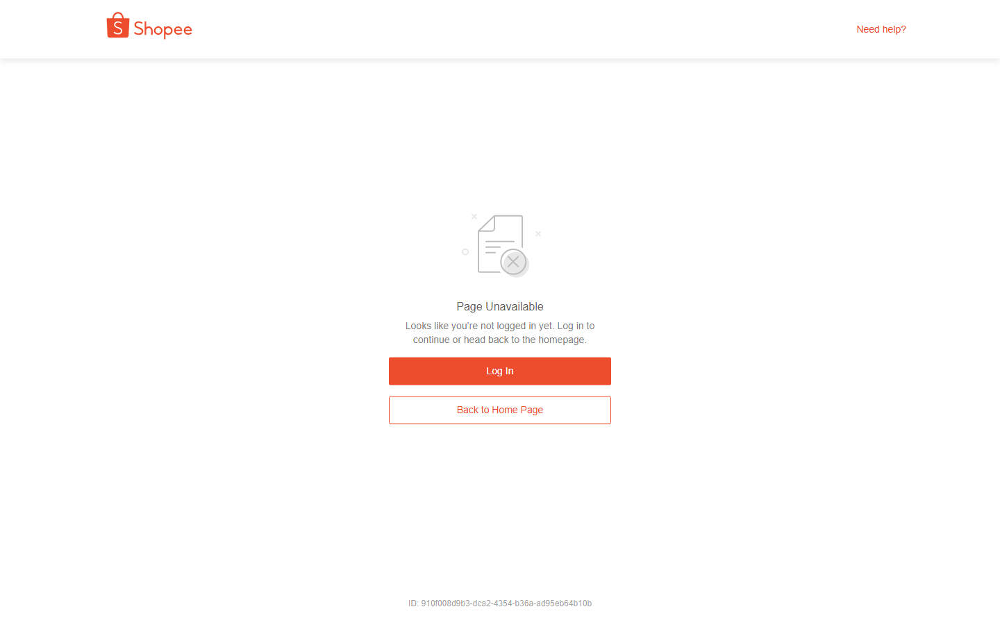

**페이지 메타 정보**

| page | title | description |
|---|---|---|
| [`home`](https://shopee.co.th/) | Shopee Thailand | Hot Deals, Best Prices |  |

#### [Zalora Thailand](https://www.zalora.co.th/)

- URL: <https://www.zalora.co.th/>
- 페이지: **OK 1 · FAIL 0**

**대표 상품 이미지** (상위 6장, 출처 URL 포함)

-  — 출처 <https://www.zalora.co.th/images/landingpage/525x500.gif>

**페이지 메타 정보**

| page | title | description |
|---|---|---|
| [`home`](https://www.zalora.co.th/) | ZALORA - ASIA'S LEADING ONLINE FASHION DESTINATION |  |

### 4.6 미국 _( United States )_

- 한국 수출규모 순위: **#1** · region: `north_america` · tier `1` · currency `USD`
- 수집 사이트: **5개** (성공 4)
- 메모: 한국 의류 최대 수출국. 대형 이커머스와 브랜드 커머스 중심
#### [Etsy](https://www.etsy.com/)

- URL: <https://www.etsy.com/>
- 페이지: **OK 2 · FAIL 0**

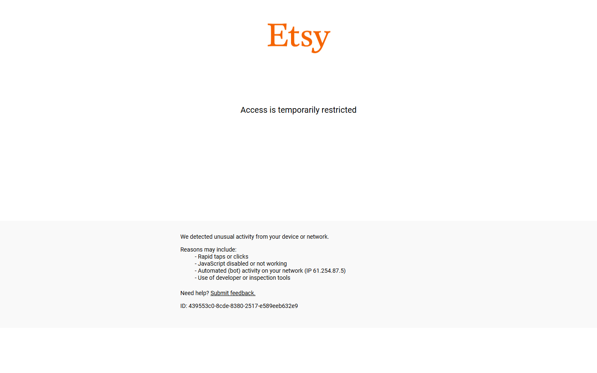

**페이지 메타 정보**

| page | title | description |
|---|---|---|
| [`trending_jewelry`](https://www.etsy.com/c/jewelry) | etsy.com |  |
| [`trending_accessories`](https://www.etsy.com/c/accessories) | etsy.com |  |

#### [Macy's](https://www.macys.com/)

- URL: <https://www.macys.com/>
- 페이지: **OK 1 · FAIL 0**

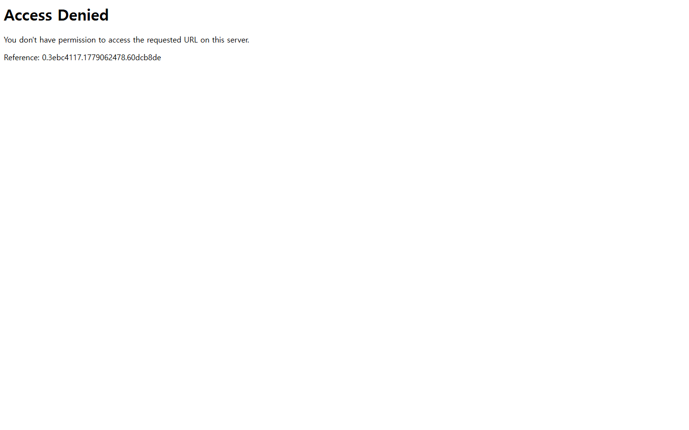

**페이지 메타 정보**

| page | title | description |
|---|---|---|
| [`new`](https://www.macys.com/shop/whats-new?id=14834) | Access Denied |  |

#### [Nordstrom](https://www.nordstrom.com/)

- URL: <https://www.nordstrom.com/>
- 페이지: **OK 2 · FAIL 0**

**대표 상품 이미지** (상위 6장, 출처 URL 포함)

-  — 출처 <https://n.nordstrommedia.com/is/image/nordstrom/WMNS_TRD01F_0526_0068.jpeg?width=240&dpr=2&crop=2760%3A3450%2Coffset-x50%2Coffset-y50>
-  — 출처 <https://n.nordstrommedia.com/is/image/nordstrom/MENS_CONT01F_0526_0028.jpeg?width=240&dpr=2&crop=2418.371%3A3022.964%2Coffset-x50%2Coffset-y0&trim=0.073%2C0.098%2C0%2C0.026>
-  — 출처 <https://n.nordstrommedia.com/is/image/nordstrom/DESW_APP01F_0326_1696.jpeg?width=240&dpr=2&crop=3791.155%3A4738.944%2Coffset-x28.288%2Coffset-y50&trim=0.312%2C0%2C0.114%2C0>
-  — 출처 <https://n.nordstrommedia.com/is/image/nordstrom/NPG_0824_KIDS_01_LK04_003.jpeg?width=240&dpr=2&crop=4247%3A5308.75%2Coffset-x50%2Coffset-y50>
-  — 출처 <https://n.nordstrommedia.com/is/image/nordstrom/FRA_FRGW03P_0226.jpeg?width=240&dpr=2&crop=4372%3A5465%2Coffset-x60.734%2Coffset-y50>
- 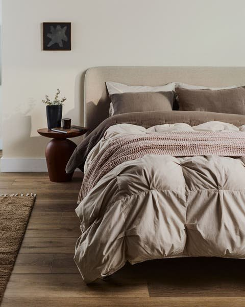 — 출처 <https://n.nordstrommedia.com/is/image/nordstrom/parachute_0226_v05717a_001-1.jpeg?width=240&dpr=2&crop=4000%3A5000%2Coffset-x50%2Coffset-y50>

**페이지 메타 정보**

| page | title | description |
|---|---|---|
| [`new`](https://www.nordstrom.com/browse/new) | New & Now | Nordstrom | Shop a great selection of New Arrivals at Nordstrom.com. Top brands. New trends. |
| [`women`](https://www.nordstrom.com/browse/women) | Women's Clothing, Shoes, & Accessories | Nordstrom | Find a great selection of Women's Clothing, Shoes, & Accessories at Nordstrom.com. Shop popular brands and top designers. |

#### [Revolve](https://www.revolve.com/)

- URL: <https://www.revolve.com/>
- 페이지: **OK 0 · FAIL 2**

**실패 페이지**

- `new` — playwright_error: Error: Page.goto: net::ERR_HTTP2_PROTOCOL_ERROR at https://www.revolve.com/new/br/c79f88/
Call log:
  - navigating to "https://www.revolve.com/new/br/c79f88/", waiting until "domcontentloaded"

- `trending` — playwright_error: Error: Page.goto: net::ERR_HTTP2_PROTOCOL_ERROR at https://www.revolve.com/most-loved/br/4a9ca5/
Call log:
  - navigating to "https://www.revolve.com/most-loved/br/4a9ca5/", waiting until "domcontentloaded"

#### [Urban Outfitters](https://www.urbanoutfitters.com/)

- URL: <https://www.urbanoutfitters.com/>
- 페이지: **OK 1 · FAIL 0**

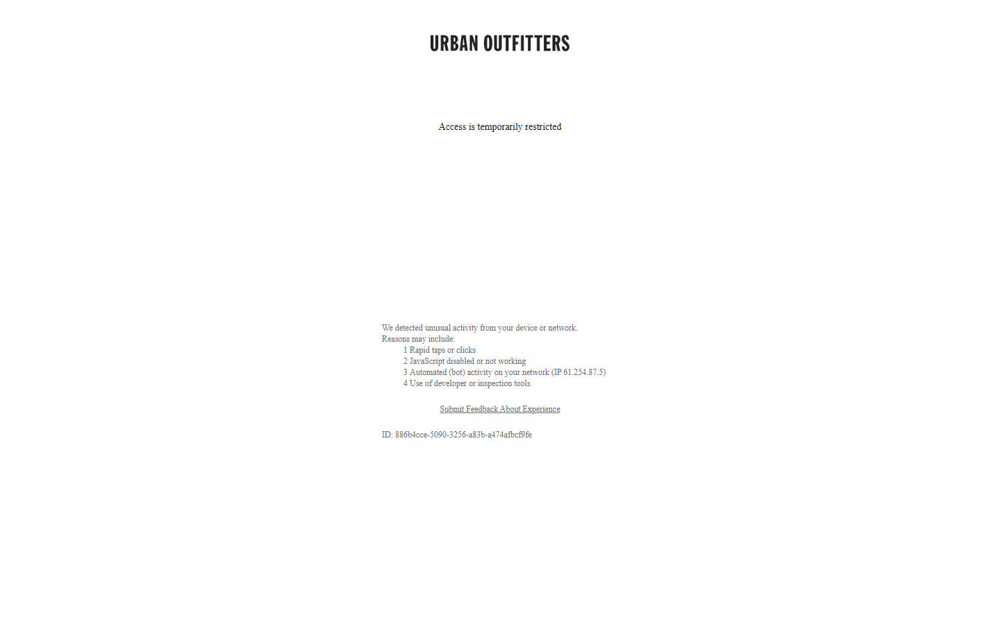

**페이지 메타 정보**

| page | title | description |
|---|---|---|
| [`new_women`](https://www.urbanoutfitters.com/womens-new-arrivals) | urbanoutfitters.com |  |

### 4.7 베트남 _( Vietnam )_

- 한국 수출규모 순위: **#4** · region: `asia` · tier `1` · currency `VND`
- 수집 사이트: **5개** (성공 5)
- 메모: 의류 생산기지/원단 수출 비중 큼. 빠르게 성장하는 이커머스
#### [Canifa](https://canifa.com/)

- URL: <https://canifa.com/>
- 페이지: **OK 1 · FAIL 0**

**대표 상품 이미지** (상위 6장, 출처 URL 포함)

-  — 출처 <https://2885371169.e.cdneverest.net/Simiconnector/BannerSlider/t/c/tce_topbanner_desktop-130526.webp>
- 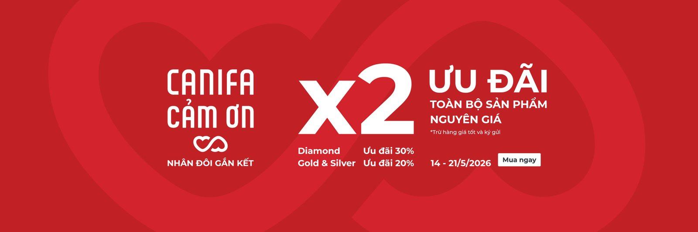 — 출처 <https://2885371169.e.cdneverest.net/Simiconnector/BannerSlider/c/n/cnfcamon_topbanner_desktop-120526.webp>

**페이지 메타 정보**

| page | title | description |
|---|---|---|
| [`home`](https://canifa.com/) | CANIFA | Fashion For All | CANIFA - thương hiệu thời trang hàng đầu Việt Nam. Hàng ngàn mẫu quần áo phụ kiện nam, nữ, trẻ em cao cấp, chất lượng, an toàn liên tục được |

#### [IVY moda](https://ivymoda.com/)

- URL: <https://ivymoda.com/>
- 페이지: **OK 1 · FAIL 0**

**대표 상품 이미지** (상위 6장, 출처 URL 포함)

-  — 출처 <https://cotton4u.vn/files/news/2026/05/15/9b42a98f507089578805846b859322d8.webp>
-  — 출처 <https://cotton4u.vn/files/news/2026/04/21/ee8c829766d8e7ad1f945e385f9d7514.webp>
- 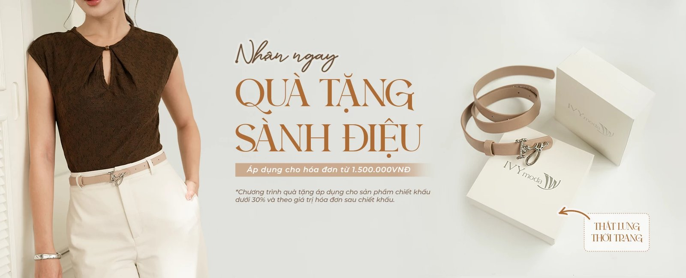 — 출처 <https://cotton4u.vn/files/news/2026/04/22/fec27d4b5a6c53610034c81b17ad70d0.webp>
- 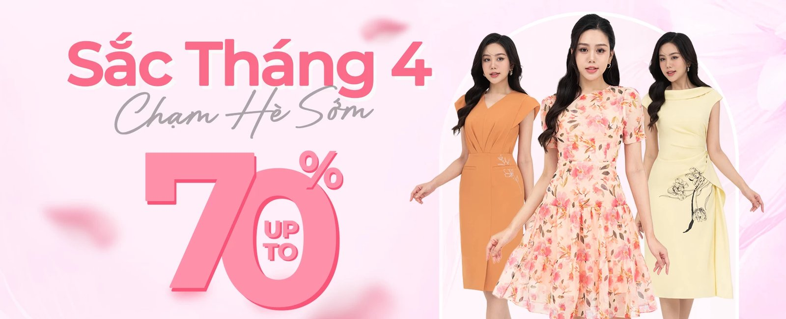 — 출처 <https://cotton4u.vn/files/news/2026/04/16/3f9f97dfd004b226e01c20c595a85fc8.webp>
- 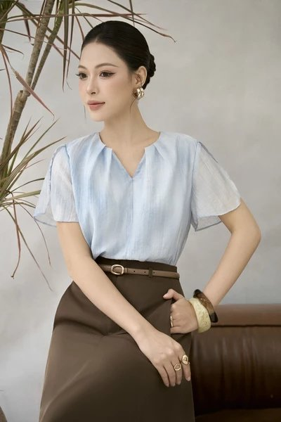 — 출처 <https://cotton4u.vn/files/product/thumab/400/2026/04/03/602a6ca7ba1b9a870f3202c3e7c6b099.webp>
- 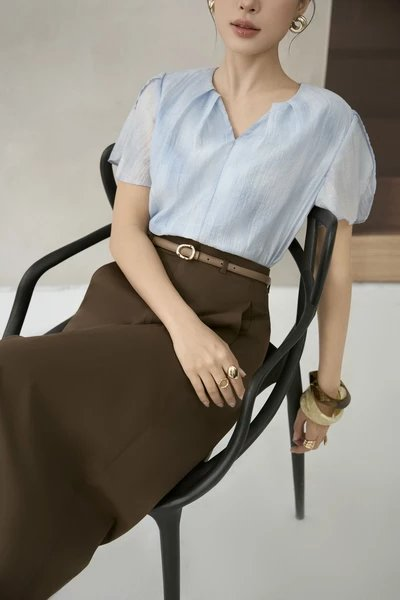 — 출처 <https://cotton4u.vn/files/product/thumab/400/2026/04/03/07ec2c724e9d60c50c3ef28035ea8bbd.webp>

**페이지 메타 정보**

| page | title | description |
|---|---|---|
| [`home`](https://ivymoda.com/) | IVY moda - Thời Trang Công Sở Hiện Đại | IVY moda |  |

#### [Lazada Vietnam](https://www.lazada.vn/)

- URL: <https://www.lazada.vn/>
- 페이지: **OK 1 · FAIL 0**

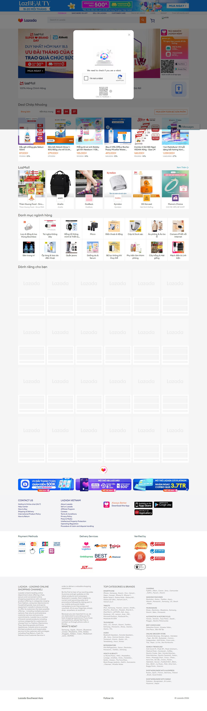

**대표 상품 이미지** (상위 6장, 출처 URL 포함)

-  — 출처 <https://img.lazcdn.com/us/domino/2ad4f22ce5a43dc145f221d13feed352.png>
-  — 출처 <https://img.lazcdn.com/g/tps/images/ims-web/TB1T7K2d8Cw3KVjSZFuXXcAOpXa.png>
-  — 출처 <https://img.lazcdn.com/us/domino/3b4e0307-9ba1-4380-86d4-6515aa38bbf6_VN-1976-688.jpg_2200x2200q80.jpg>
- 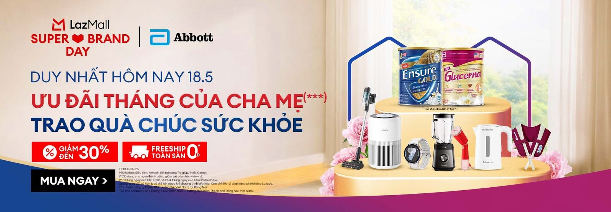 — 출처 <https://img.lazcdn.com/us/domino/a116306c-b169-44db-89e2-7cddd4ffe504_VN-1976-688.jpg_2200x2200q80.jpg>
- 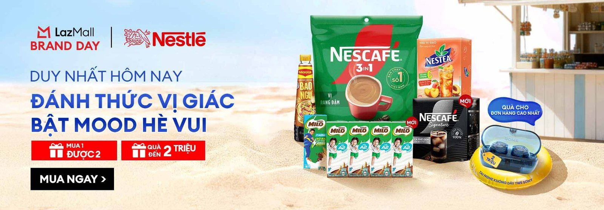 — 출처 <https://img.lazcdn.com/us/domino/0c3b09ea-40b6-4107-82b1-4b76b462c2c8_VN-1976-688.jpg_2200x2200q80.jpg>
-  — 출처 <https://img.lazcdn.com/us/domino/14603e86-4ed9-40ee-b076-025c4f7b9f73_VN-1976-688.jpg_2200x2200q80.jpg>

**페이지 메타 정보**

| page | title | description |
|---|---|---|
| [`home`](https://www.lazada.vn/#?) | Lazada Việt Nam | Mua Sắm Online, Giá Tốt Nhất Mỗi Ngày | Mua sắm đồ điện tử, thời trang, làm đẹp và đồ chơi giá cả phải chăng. Đảm bảo sản phẩm chính hãng và trải nghiệm mua sắm tiện lợi – mua ngay |

#### [Shopee Vietnam](https://shopee.vn/)

- URL: <https://shopee.vn/>
- 페이지: **OK 1 · FAIL 0**

**페이지 메타 정보**

| page | title | description |
|---|---|---|
| [`home`](https://shopee.vn/) | Shopee Việt Nam | Hot Deals, Best Prices |  |

#### [Tiki](https://tiki.vn/)

- URL: <https://tiki.vn/>
- 페이지: **OK 1 · FAIL 0**

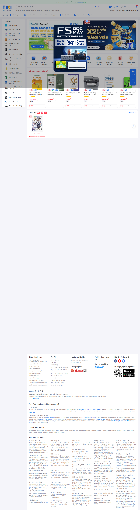

**대표 상품 이미지** (상위 6장, 출처 URL 포함)

-  — 출처 <https://salt.tikicdn.com/ts/tikimsp/4e/4c/ed/313d8df46c0962eae583d21469ee398a.png>
-  — 출처 <https://salt.tikicdn.com/cache/100x100/ts/category/ed/20/60/afa9b3b474bf7ad70f10dd6443211d5f.png>
-  — 출처 <https://salt.tikicdn.com/cache/100x100/ts/category/f6/22/46/7e2185d2cf1bca72d5aeac385a865b2b.png>
-  — 출처 <https://salt.tikicdn.com/cache/100x100/ts/category/54/c0/ff/fe98a4afa2d3e5142dc8096addc4e40b.png>
-  — 출처 <https://salt.tikicdn.com/cache/100x100/ts/category/13/64/43/226301adcc7660ffcf44a61bb6df99b7.png>
-  — 출처 <https://salt.tikicdn.com/cache/100x100/ts/category/75/34/29/78e428fdd90408587181005f5cc3de32.png>

**페이지 메타 정보**

| page | title | description |
|---|---|---|
| [`home`](https://tiki.vn/) | Tiki - Mua hàng online giá tốt, hàng chuẩn, ship nhanh | Tiện lợi mua sắm hàng triệu mặt hàng, dịch vụ. Vô vàn ưu đãi freeship, mã giảm giá. Hoàn tiền 15% tối đa 600k/tháng với thẻ tín dụng TikiCAR |

## 5. 의류 카테고리별 글로벌 트렌드

| # | 카테고리 | 건수 | 대표 상품명 |
|---:|---|---:|---|
| 1 | `blouse` | 9 | [루피타 PICK] FLORAL EMBROIDERY CROP BLOUSE (IVORY) · Passage Shirring Blouse_white · Adele Ruffle Blouse (Pure Vanilla) |
| 2 | `dress` | 8 | Roosa dress (2colors) · Asla layered dress · Lena wrap Dress (3colors) |
| 3 | `skirt` | 6 | [경은 PICK] LACE SATIN MIDI SKIRT_SILVER · Soft Pleated Midi Skirt_lilac · Smudge Gored Skirt_cream |
| 4 | `블라우스` | 6 | [오픈할인중] made. 내츄럴 소프트 블라우스 & 스커트 SET (개별 구매 가능!) - 2 size · [💙여름][직진배송/10만장돌파][MNLB] 퍼퓸 레이스 라인 스트랩 코튼 블라우스 · [+반팔💙/하객룩/made] 드멜린 블라우스 |
| 5 | `pants` | 5 | Diagonal strap bootcut pants BLACK · COTTON SHEER PANTS_WHITE · COTTON SHEER PANTS_BLACK |
| 6 | `shirt` | 4 | ONE SHOULDER RAGLAN T-SHIRT_SKY BLUE · ONE SHOULDER RAGLAN T-SHIRT_PINK · VIVID SLIM SPAN HALF SLEEVE T-SHIRT (APPLE MINT) |
| 7 | `jacket` | 4 | Crop round collar jacket CHARCOAL · Russu tweed Crop jacket(4colors) · Cove tweed jacket (3colors) |
| 8 | `팬츠` | 4 | [+여름🌴/50만장돌파/made] 허쉬 코튼 와이드팬츠 (숏/기본/롱) · [5만장판매] [B-BASIC] 에어스웨트 와이드 투웨이 밴딩팬츠 · [여름청바지👖/후기최고] made. 투데이 썸머라이트 데님팬츠 (+베이직/롱ver) - 4 size |
| 9 | `셔츠` | 4 | [🌸사계절필수/인생티♥] made. 솔트 클린 반팔티셔츠 (스탠다드핏/루즈핏) - 7 color · [💯매일입는셔츠] made. 내츄럴핏 스트라이프 셔츠 - 9 color · [백지헌 PICK💖] 시스루 셔츠_SPYWG37W01 |
| 10 | `니트` | 3 | 립 니트 페플럼 탑 (Cream) · 리터 베이비 버튼 린넨 헨리넥 니트 긴팔 크롭 썸머 여름 liter 떠유니 · [3SIZE] 네브아 라글란 코튼 골지 반팔 니트 ( 여름-신상-데일리룩-출근룩-하객룩-데이트룩-오피스룩-자체제작-팬던트-하객-반팔-반팔니트-라글란-래글런-골지-여름니트 ) |

**국가별 의류 TOP**

- **korea**: `blouse`(9), `dress`(8), `skirt`(6), `블라우스`(6), `pants`(5)
## 6. 악세사리 카테고리별 글로벌 트렌드

| # | 카테고리 | 건수 | 대표 상품명 |
|---:|---|---:|---|
| 1 | `샌들` | 2 | [리우드]브리 샌들(참)_07T083911 · [리우드]브리 샌들_ 07T083910 |
| 2 | `ring` | 1 | [Washable] Ring My Bear |
| 3 | `부츠` | 1 | [COOL] 부츠컷 진_SPTJG25G61 |

**국가별 악세사리 TOP**

- **korea**: `샌들`(2), `ring`(1), `부츠`(1)
## 7. 국가별 가격대 비교

| 국가 | 통화 | 표본 | min | p25 | median | p75 | max | median (USD) |
|---|---|---:|---:|---:|---:|---:|---:|---:|
| korea | KRW | 106 | 12370 | 28780 | 61800 | 117289 | 498750 | 41.26 |

> p25/p75 는 IQR 기준 분위수. USD 환산은 `config/exchange_rates.yaml` 기준 (운영자가 정기 갱신).

## 8. 국내 의류·악세사리 사업동향

### KITA K-stat

- 한국무역통계의 국가 수출입 통계 총괄 페이지입니다.
- 사이트: <https://stat.kita.net/stat/kts/ctr/CtrTotalImpExpList.screen>

| # | topic | title | url |
|---:|---|---|---|
| 1 | `trade` | KITA.NET | <https://www.kita.net/> |
| 2 | `trade` | K-stat 란? | <https://www.kita.net/pdf/statGuide/index.html#p=1> |
| 3 | `무역통계` | 무역통계 분류 | <https://stat.kita.net/stat/guide/guide_18_01.screen> |
| 4 | `trade` | 한국품목코드 | <https://stat.kita.net/stat/kts/statCode/ItemHierCodeList.screen> |
| 5 | `trade` | 해외품목코드 | <https://stat.kita.net/stat/istat/common/IstatHSCode.screen> |
| 6 | `trade` | 대륙/경제코드 | <https://stat.kita.net/stat/kts/statCode/ConEcoCodeList.screen> |
| 7 | `trade` | 수출입 총괄 | <https://stat.kita.net/stat/kts/sum/SumImpExpTotalList.screen> |
| 8 | `trade` | 가공단계 수출입 | <https://stat.kita.net/stat/kts/use/BecList.screen> |
| 9 | `trade` | 품목 수출입 | <https://stat.kita.net/stat/kts/pum/ItemImpExpList.screen> |
| 10 | `trade` | 국가 수출입 | <https://stat.kita.net/stat/kts/ctr/CtrTotalImpExpList.screen> |
| 11 | `trade` | 대륙/경제권 수출입 | <https://stat.kita.net/stat/kts/rel/RelColligationList.screen> |
| 12 | `trade` | 지자체 수출입 | <https://stat.kita.net/stat/kts/prod/ProdWholeList.screen> |
| 13 | `trade` | 항구/공항 수출입 | <https://stat.kita.net/stat/kts/port/PortImpExpList.screen> |
| 14 | `trade` | FTA체결국 수출입 | <https://stat.kita.net/stat/kts/fta/FtaCtrImpExpList.screen> |
| 15 | `trade` | 간접수출 현황 | <https://stat.kita.net/stat/ind/KtsIndMain.screen> |

### Korea Customs Service

- 수출입 현황, 물류통계 등 관세청 무역통계정보를 종합적으로 제공
- 사이트: <https://tradedata.go.kr/cts/index_eng.do>

| # | topic | title | url |
|---:|---|---|---|
| 1 | `trade` | Korea Customs Service | <http://customs.go.kr/english/main.do> |

### KOSIS

- 코시스, 국가데이터처가 제공하는 원스톱 통계 서비스, 국가승인통계, 국제통계, 북한통계, e-지방지표, 통계시각화콘텐츠, 온라인간행물 등 제공
- 사이트: <https://kosis.kr/statisticsList/statisticsListIndex.do;jsessionid=5eB-37gAuG0NxhVWfy32f-IigRPdMWn0ZoRcTpiV.esvwas3_S31?parmTabId=M_01_01&vwcd=MT_ZTITLE&menuId=M_01_01&outLink=Y&entrType=>

| # | topic | title | url |
|---:|---|---|---|
| 1 | `statistics` | 쉽게 보는 통계 | <http://kosis.kr/easyViewStatis/customStatisIndex.do?vwcd=MT_TM1_TITLE&menuId=M_03_01> |
| 2 | `statistics` | 이슈별 접근 | <http://kosis.kr/easyViewStatis/customStatisIndex.do?vwcd=MT_TM2_TITLE&menuId=M_03_02> |
| 3 | `statistics` | 통계시각화콘텐츠 | <http://kosis.kr/easyViewStatis/visualizationIndex.do> |
| 4 | `statistics` | 온라인간행물 | <http://kosis.kr/publication/publicationThema.do> |
| 5 | `statistics` | 기획간행물 | <http://kosis.kr/publication/publicationStat.do> |
| 6 | `statistics` | KOSIS 길라잡이 | <http://kosis.kr/civilComplaint/kosisGuideIndex.do> |
| 7 | `statistics` | 홈페이지 개선의견 | <http://kosis.kr/civilComplaint/siteRequestList.do> |
| 8 | `statistics` | 찾아가는 KOSIS | <http://kosis.kr/civilComplaint/kosisEduIndex.do> |
| 9 | `statistics` | 서비스 소개 | <http://kosis.kr/serviceInfo/kosisIntroduce.do> |
| 10 | `statistics` | 국가통계현황 | <http://kosis.kr/serviceInfo/statisInstitution.do> |
| 11 | `statistics` | 국가통계 공표일정 | <http://kosis.kr/serviceInfo/statisPublicationList.do> |
| 12 | `statistics` | 팩트체크 서비스 | <http://kosis.kr/serviceInfo/factCheckList.do> |
| 13 | `statistics` | 서비스정책 | <http://kosis.kr/serviceInfo/useGuide.do> |
| 14 | `statistics` | 공유서비스 (OpenAPI) | <http://kosis.kr/serviceInfo/openAPIGuide.do> |
| 15 | `statistics` | English | <https://kosis.kr/eng> |

### KOTRA

- 코트라, KOTRA, 대한무역투자진흥공사, 트라이빅, TriBIG, 무역투자통계, 국가별 시장정보, 품목별 유망시장, 기업별 맞춤정보, 해외바이어 정보
- 사이트: <https://www.kotra.or.kr/bigdata/visualization/korea#search/ALL/ALL/2024>

| # | topic | title | url |
|---:|---|---|---|
| 1 | `trade` | kotra 무역투자24 | <https://www.kotra.or.kr/bigdata/kotraSsoRedirect?targetURL=https://www.kotra.or.kr> |
| 2 | `trade` | 해외비즈니스 정보 포털 | <https://www.kotra.or.kr/bigdata/kotraSsoRedirect?targetURL=https://dream.kotra.or.kr/dream> |
| 3 | `trade` | 글로벌 전시포털 | <https://www.kotra.or.kr/bigdata/kotraSsoRedirect?targetURL=https://www.gep.or.kr/> |
| 4 | `trade` | KOTRA 해외인재유치센터 | <https://www.kotra.or.kr/gtc_kor> |
| 5 | `trade` | 투자유치정보제공 | <https://www.kotra.or.kr/bigdata/kotraSsoRedirect?targetURL=https://www.investkorea.org/> |
| 6 | `수출지원` | 수출지원 온라인 플랫폼 | <https://www.kotra.or.kr/bigdata/kotraSsoRedirect?targetURL=https://www.buykorea.or.kr/> |
| 7 | `trade` | 빅데이터 서비스 | <https://www.kotra.or.kr/bigdata/> |
| 8 | `trade` | 경제외교 활용포털 | <https://www.kotra.or.kr/bigdata/kotraSsoRedirect?targetURL=https://president.globalwindow.org> |
| 9 | `trade` | 방산물자교역지원센터 | <https://www.kotra.or.kr/bigdata/kotraSsoRedirect?targetURL=https://www.kotra.or.kr/kodits> |
| 10 | `trade` | 외투기업고충처리 | <https://www.kotra.or.kr/bigdata/kotraSsoRedirect?targetURL=https://ombudsman.kotra.or.kr/ob-kr> |
| 11 | `trade` | 수출바우처 · 지사화 | <https://www.exportvoucher.com> |
| 12 | `trade` | 무역투자통계 | <https://www.kotra.or.kr/bigdata/visualization/korea> |
| 13 | `trade` | 국가별 시장정보 | <https://www.kotra.or.kr/bigdata/marketAnalysis> |
| 14 | `trade` | 품목별 유망시장 | <https://www.kotra.or.kr/bigdata/bhrcMarket> |
| 15 | `trade` | 해외바이어 정보 | <https://www.kotra.or.kr/bigdata/partner/search> |

### Statistics Korea Online Shopping

- 국가데이터처,List | 전체 | 보도자료 | 새소식
- 사이트: <https://mods.go.kr/board.es?mid=a10301010000&bid=11789>

| # | topic | title | url |
|---:|---|---|---|
| 1 | `statistics` | 정보공개제도 | <https://mods.go.kr/menu.es?mid=a10101010100> |
| 2 | `statistics` | 정보공개청구 | <https://www.open.go.kr/com/main/mainView.do> |
| 3 | `statistics` | 비공개대상정보세부기준 | <https://mods.go.kr/menu.es?mid=a10101030000> |
| 4 | `statistics` | 고객수요분석 | <https://mods.go.kr/menu.es?mid=a10101040000> |
| 5 | `statistics` | 사전정보공표 | <https://mods.go.kr/menu.es?mid=a10103010000> |
| 6 | `statistics` | 사전정보공표목록 | <https://mods.go.kr/menu.es?mid=a10103010100> |
| 7 | `statistics` | 핵심단어목록 | <https://mods.go.kr/menu.es?mid=a10103020100> |
| 8 | `statistics` | 인기정보TOP10 | <https://mods.go.kr/menu.es?mid=a10103030100> |
| 9 | `statistics` | 행정자료실 | <https://mods.go.kr/menu.es?mid=a10104010000> |
| 10 | `statistics` | 업무추진비 | <https://mods.go.kr/menu.es?mid=a10104010100> |
| 11 | `statistics` | 국회관련정보 | <https://mods.go.kr/menu.es?mid=a10104040000> |
| 12 | `statistics` | 정책실명제 | <https://mods.go.kr/menu.es?mid=a10105010000> |
| 13 | `statistics` | 연도별대상사업현황 | <https://mods.go.kr/menu.es?mid=a10105020000> |
| 14 | `statistics` | 중점관리대상사업 | <https://mods.go.kr/menu.es?mid=a10105030600> |
| 15 | `statistics` | 국민신청실명제 | <https://mods.go.kr/menu.es?mid=a10105040000> |

### 기업마당

- 기업마당>정책정보>지원사업 공고
- 사이트: <https://www.bizinfo.go.kr/sii/siia/selectSIIA200View.do?null>

| # | topic | title | url |
|---:|---|---|---|
| 1 | `policy` | 지원사업 공고 | <https://www.bizinfo.go.kr/sii/siia/selectSIIA200View.do> |
| 2 | `policy` | 품목별 법정의무 인증제도 | <https://www.bizinfo.go.kr/biz/biza/selectBIZA100View.do> |
| 3 | `policy` | 입법·행정예고/고시 | <https://www.bizinfo.go.kr/biz/biza/selectBIZA300View.do> |
| 4 | `policy` | 월간 중기누리 | <https://www.bizinfo.go.kr/biz/biza/selectBIZA400View.do> |
| 5 | `policy` | 기업업무용 서식 | <https://www.bizinfo.go.kr/biz/bizb/selectBIZB100View.do> |
| 6 | `policy` | 입주기업 모집공고 | <https://www.bizinfo.go.kr/biz/bizb/selectBIZB200View.do> |
| 7 | `policy` | 온라인화상회의실 | <https://www.k-startup.go.kr/web/contents/webOLNIVIDEOMTRM.do> |
| 8 | `policy` | 정책정보 개방 | <https://www.bizinfo.go.kr/apiList.do> |
| 9 | `policy` | 속보성 대시보드 | <https://www.bizinfo.go.kr/dashboard.do> |
| 10 | `policy` | 고객의 소리 | <https://www.bizinfo.go.kr/biz/bizc/selectBIZC200Regist.do> |
| 11 | `policy` | 자주하는질문 | <https://www.bizinfo.go.kr/biz/bizc/selectBIZC300View.do> |
| 12 | `policy` | 이메일주소 무단 수집 거부안내 | <https://www.bizinfo.go.kr/biz/bizd/selectBIZD110View.do> |
| 13 | `policy` | 저작권 정책 | <https://www.bizinfo.go.kr/biz/bizd/selectBIZD120View.do> |
| 14 | `policy` | 웹접근성 정책 | <https://www.bizinfo.go.kr/biz/bizd/selectBIZD130View.do> |
| 15 | `policy` | 전체메뉴보기 | <https://www.bizinfo.go.kr/sitemap/intro.do> |

### 서울경제진흥원

- 서울경제진흥원 에러페이지
- 사이트: <https://www.sba.seoul.kr/Pages/error_404.html?aspxerrorpath=/Pages/NSub06_01.aspx>

### 소상공인24

- 소상공인24
- 사이트: <https://www.sbiz24.kr/#/pbanc>

### 중소벤처기업부

- 중소기업중앙회 등 기관 중소기업 조사, 통계 DB화 검색, 내려받기 등 제공.
- 사이트: <https://www.mss.go.kr/site/smba/ex/bbs/List.do?cbIdx=86>

| # | topic | title | url |
|---:|---|---|---|
| 1 | `policy` | 어린이 누리집 | <https://www.mss.go.kr/site/kids/main.do> |
| 2 | `policy` | English | <https://www.mss.go.kr/site/eng/main.do> |
| 3 | `policy` | 누리집 안내지도 | <https://www.mss.go.kr/site/smba/ex/siteMap/siteMap.do> |
| 4 | `policy` | 훈령/예규/고시/공고 | <https://www.mss.go.kr/site/smba/ex/bbs/List.do?cbIdx=125&ext6=Y> |
| 5 | `policy` | 입법/행정예고 | <https://www.mss.go.kr/site/smba/ex/bbs/List.do?cbIdx=126&searchRltnYn=Y> |
| 6 | `policy` | 인사·채용 | <https://www.mss.go.kr/site/smba/ex/bbs/List.do?cbIdx=82> |
| 7 | `policy` | 보도설명자료 | <https://www.mss.go.kr/site/smba/ex/bbs/List.do?cbIdx=87> |
| 8 | `policy` | 현장속으로 | <https://www.mss.go.kr/site/smba/brdcststnVod/brdcststnVodList.do?ctgr_code=C01> |
| 9 | `policy` | 중기부소식지 | <https://www.mss.go.kr/site/smba/ex/bbs/List.do?cbIdx=95> |
| 10 | `policy` | 통계발표자료 | <https://www.mss.go.kr/site/smba/foffice/ex/statDB/ptScheduleList.do> |
| 11 | `policy` | 주제별 통계 | <https://www.mss.go.kr/site/smba/foffice/ex/statDB/temaList.do?tabCd=0001> |
| 12 | `policy` | 조사별 통계 | <https://www.mss.go.kr/site/smba/foffice/ex/statDB/surveyList.do?tabCd=0001> |
| 13 | `policy` | 조사보고서 | <https://www.mss.go.kr/site/smba/foffice/ex/statDB/stReportRoList.do?gb=1&nodeId=&roCode=> |
| 14 | `policy` | 주제별 조회 | <https://www.mss.go.kr/site/smba/foffice/ex/statDB/stReportRcList.do?gb=2&nodeId=&rcCode=> |
| 15 | `policy` | 중소기업위상 | <https://www.mss.go.kr/site/smba/foffice/ex/statDB/MainSubStat.do?scd=0001> |

## 9. 한국 사업자 관점 기회 국가 TOP 10

| # | 국가 | tier | region | 점수 | 근거 |
|---:|---|---:|---|---:|---|
| 1 | 태국 _( Thailand )_ | 1 | `asia` | **151.5** | tier1 기본점(90); 아시아 권역(+20); ASEAN 시장(+10); K-패션/콘텐츠 친화 시장(+20); 트렌드 신호 밀도 12 |
| 2 | 대만 _( Taiwan )_ | 1 | `asia` | **136.5** | tier1 기본점(90); 아시아 권역(+20); K-패션/콘텐츠 친화 시장(+20); 트렌드 신호 밀도 6 |
| 3 | 일본 _( Japan )_ | 1 | `asia` | **130.0** | tier1 기본점(90); 아시아 권역(+20); K-패션/콘텐츠 친화 시장(+20) |
| 4 | 베트남 _( Vietnam )_ | 1 | `asia` | **124.0** | tier1 기본점(90); 아시아 권역(+20); ASEAN 시장(+10); 트렌드 신호 밀도 4 |
| 5 | 인도네시아 _( Indonesia )_ | 1 | `asia` | **122.5** | tier1 기본점(90); 아시아 권역(+20); ASEAN 시장(+10); 트렌드 신호 밀도 2 |
| 6 | 미국 _( United States )_ | 1 | `north_america` | **115.5** | tier1 기본점(90); 트렌드 신호 밀도 26 |
| 7 | 필리핀 _( Philippines )_ | 2 | `asia` | **110.0** | tier2 기본점(60); 아시아 권역(+20); ASEAN 시장(+10); K-패션/콘텐츠 친화 시장(+20) |
| 8 | 말레이시아 _( Malaysia )_ | 2 | `asia` | **90.0** | tier2 기본점(60); 아시아 권역(+20); ASEAN 시장(+10) |
| 9 | 싱가포르 _( Singapore )_ | 2 | `asia` | **90.0** | tier2 기본점(60); 아시아 권역(+20); ASEAN 시장(+10) |
| 10 | 홍콩 _( Hong Kong )_ | 2 | `asia` | **80.0** | tier2 기본점(60); 아시아 권역(+20) |

## 10. 실행 제안

### **1위 태국** (점수 152, tier1 · asia)

- 현지 스타일 TOP: `wide` — 시즌 컬렉션 기획 시 우선 반영.
- 현지 컬러 TOP: `red` — 시즌 컬렉션 기획 시 우선 반영.
- 현지 소재 TOP: `denim`, `knit` — 시즌 컬렉션 기획 시 우선 반영.
- 현지 카테고리 TOP: `accessories`, `jacket`, `dress` — 시즌 컬렉션 기획 시 우선 반영.
- K-패션 친화도가 명시된 시장이므로 K-브랜드 아이덴티티 및 한류 셀럽 협업을 강조.
- ASEAN 권역 시장 — 물류/관세(FTA) 활용 + 동남아 통합 마케팅 검토 권장.
- tier1 핵심 시장 — 현지 마켓플레이스(예: 해당 국가의 대표 패션 플랫폼) 공식 입점 + 셀러 운영 채널 확보 우선.
- 연계 가능한 국내 수출/지원 사업이 식별되지 않음 — `domestic_sources.yaml` 의 `landing_url` 을 KOTRA 사업 공고/기업마당 수출바우처로 직접 지정 권장.

### **2위 대만** (점수 136, tier1 · asia)

- 현지 컬러 TOP: `pink`, `red` — 시즌 컬렉션 기획 시 우선 반영.
- 현지 소재 TOP: `lace` — 시즌 컬렉션 기획 시 우선 반영.
- K-패션 친화도가 명시된 시장이므로 K-브랜드 아이덴티티 및 한류 셀럽 협업을 강조.
- 아시아 권역 시장 — 시차/언어 친화 + 한국 본사 직배송 모델 검토.
- tier1 핵심 시장 — 현지 마켓플레이스(예: 해당 국가의 대표 패션 플랫폼) 공식 입점 + 셀러 운영 채널 확보 우선.
- 연계 가능한 국내 수출/지원 사업이 식별되지 않음 — `domestic_sources.yaml` 의 `landing_url` 을 KOTRA 사업 공고/기업마당 수출바우처로 직접 지정 권장.

### **3위 일본** (점수 130, tier1 · asia)

- K-패션 친화도가 명시된 시장이므로 K-브랜드 아이덴티티 및 한류 셀럽 협업을 강조.
- 아시아 권역 시장 — 시차/언어 친화 + 한국 본사 직배송 모델 검토.
- tier1 핵심 시장 — 현지 마켓플레이스(예: 해당 국가의 대표 패션 플랫폼) 공식 입점 + 셀러 운영 채널 확보 우선.
- 연계 가능한 국내 수출/지원 사업이 식별되지 않음 — `domestic_sources.yaml` 의 `landing_url` 을 KOTRA 사업 공고/기업마당 수출바우처로 직접 지정 권장.

### 운영 점검 노트

- **ASEAN 다중 진출 기회**: TOP10 중 ASEAN 국가가 3개 이상. Shopee/Lazada/Zalora 통합 운영을 통한 동남아 멀티마켓 전략을 검토 권장.

## 11. 수집 실패/주의 사이트

| 국가 | 사이트 | 페이지 | 상태 | 사유 |
|---|---|---|---|---|
| usa | Revolve | new | failed | playwright_error: Error: Page.goto: net::ERR_HTTP2_PROTOCOL_ERROR at https://www.revolve.com/new/br/c79f88/
Call log:
  - navigating to "https://www.revolve.com/new/br/c79f88/", waiting until "domcontentloaded"
 |
| usa | Revolve | trending | failed | playwright_error: Error: Page.goto: net::ERR_HTTP2_PROTOCOL_ERROR at https://www.revolve.com/most-loved/br/4a9ca5/
Call log:
  - navigating to "https://www.revolve.com/most-loved/br/4a9ca5/", waiting until "domcontentloaded"
 |
| japan | ZOZOTOWN | new | failed | playwright_error: TimeoutError: Page.goto: Timeout 30000ms exceeded.
Call log:
  - navigating to "https://zozo.jp/category/new/", waiting until "domcontentloaded"
 |
| japan | ZOZOTOWN | ranking | failed | playwright_error: TimeoutError: Page.goto: Timeout 30000ms exceeded.
Call log:
  - navigating to "https://zozo.jp/ranking/", waiting until "domcontentloaded"
 |
| japan | Rakuten Fashion | women | failed | http_status_404 |
| indonesia | Tokopedia | home | failed | playwright_error: Error: Page.goto: net::ERR_HTTP2_PROTOCOL_ERROR at https://www.tokopedia.com/
Call log:
  - navigating to "https://www.tokopedia.com/", waiting until "domcontentloaded"
 |
| indonesia | Berrybenka | home | failed | http_error: ConnectError: [Errno 11001] getaddrinfo failed |
| taiwan | PChome | home | failed | http_status_429 |
| korea | Musinsa | home | failed | robots_disallowed |

## 12. 원문 출처 및 이미지 출처

### 인도네시아

- **Berrybenka** — <https://www.berrybenka.com/>
- **Hijup** — <https://www.hijup.com/>
- **Shopee Indonesia** — <https://shopee.co.id/>
- **Tokopedia** — <https://www.tokopedia.com/>
- **Zalora Indonesia** — <https://www.zalora.co.id/>
  - 이미지 출처: <https://static-id.zacdn.com/next-assets/static-assets/images/logo/icon_mastercard.png>
  - 이미지 출처: <https://static-id.zacdn.com/next-assets/static-assets/images/logo/icon_visa.png>
  - 이미지 출처: <https://static-id.zacdn.com/next-assets/static-assets/images/logo/icon_ovo.png>

### 일본

- **GU Japan** — <https://www.gu-global.com/jp/>
  - 이미지 출처: <https://image.uniqlo.com/GU/ST3/jp/imagesother/Navigation/WOMEN_Category/2026/260513/Category_w_Half-Tshirt.png>
  - 이미지 출처: <https://image.uniqlo.com/GU/ST3/jp/imagesother/Navigation/WOMEN_Category/2026/260515/Category_w_Tshirt.png>
  - 이미지 출처: <https://image.uniqlo.com/GU/ST3/jp/imagesother/Navigation/WOMEN_Category/2026/260513/Category_w_Shirt-Blouse.png>
  - 이미지 출처: <https://image.uniqlo.com/GU/ST3/jp/imagesother/Navigation/WOMEN_Category/2026/260513/Category_w_Knit-Cardigan.png>
  - 이미지 출처: <https://image.uniqlo.com/GU/ST3/jp/imagesother/Navigation/WOMEN_Category/2026/260513/Category_w_onepeace.png>
  - 이미지 출처: <https://image.uniqlo.com/GU/ST3/jp/imagesother/Navigation/WOMEN_Category/2026/260513/Category_w_Sweat.png>
  - 이미지 출처: <https://image.uniqlo.com/GU/ST3/jp/imagesother/Navigation/WOMEN_Category/2026/260513/Category_w_Outer.png>
  - 이미지 출처: <https://image.uniqlo.com/GU/ST3/jp/imagesother/Navigation/WOMEN_Category/2026/260513/Category_w_Pants.png>
  - 이미지 출처: <https://image.uniqlo.com/GU/ST3/jp/imagesother/Navigation/WOMEN_Category/2026/260513/Category_w_Skirt.png>
  - 이미지 출처: <https://image.uniqlo.com/GU/ST3/jp/imagesother/Navigation/WOMEN_Category/2026/260513/Category_w_RoomWear.png>
  - 이미지 출처: <https://image.uniqlo.com/GU/ST3/jp/imagesother/Navigation/WOMEN_Category/2026/260513/Category_w_inner.png>
  - 이미지 출처: <https://image.uniqlo.com/GU/ST3/jp/imagesother/Navigation/WOMEN_Category/2026/260513/Category_w_DRY-inner.png>
  - 이미지 출처: <https://image.uniqlo.com/GU/ST3/jp/imagesother/Navigation/WOMEN_Category/2026/260513/Category_w_shoes.png>
  - 이미지 출처: <https://image.uniqlo.com/GU/ST3/jp/imagesother/Navigation/WOMEN_Category/2026/260513/Category_w_Goods.png>
- **Rakuten Fashion** — <https://brandavenue.rakuten.co.jp/>
  - 이미지 출처: <https://brandavenue.r10s.jp/img/library/index/sbn_flagshipstore_20231003.png>
  - 이미지 출처: <https://brandavenue.r10s.jp/img/news/01/372752/pc_n.jpg>
  - 이미지 출처: <https://brandavenue.r10s.jp/img/news/01/373644/pc_n.jpg>
  - 이미지 출처: <https://brandavenue.r10s.jp/img/news/01/373542/pc_n.jpg>
  - 이미지 출처: <https://brandavenue.r10s.jp/img/news/01/373942/pc_n.jpg>
  - 이미지 출처: <https://brandavenue.r10s.jp/img/news/01/372944/pc_n.jpg>
  - 이미지 출처: <https://brandavenue.r10s.jp/img/news/01/372945/pc_n.jpg>
  - 이미지 출처: <https://brandavenue.r10s.jp/img/news/01/372968/pc_n.jpg>
  - 이미지 출처: <https://brandavenue.r10s.jp/img/news/01/373745/pc_n.jpg>
  - 이미지 출처: <https://brandavenue.r10s.jp/img/news/01/367303/pc_n.jpg>
  - 이미지 출처: <https://brandavenue.r10s.jp/img/news/01/367672/pc_n.jpg>
  - 이미지 출처: <https://brandavenue.r10s.jp/img/news/01/367754/pc_n.jpg>
  - 이미지 출처: <https://brandavenue.r10s.jp/img/news/01/367181/pc_n.jpg>
  - 이미지 출처: <https://brandavenue.r10s.jp/img/news/01/373888/pc_n.jpg>
  - 이미지 출처: <https://brandavenue.r10s.jp/img/news/01/373833/pc_n.jpg>
  - 이미지 출처: <https://brandavenue.r10s.jp/img/news/01/373820/pc_n.jpg>
  - 이미지 출처: <https://brandavenue.r10s.jp/img/news/01/373518/pc_n.jpg>
  - 이미지 출처: <https://brandavenue.r10s.jp/img/news/01/373940/pc_n.png>
- **Uniqlo Japan** — <https://www.uniqlo.com/jp/>
- **WEAR** — <https://wear.jp/>
  - 이미지 출처: <https://wear.jp/public/_next/static/media/notfound_bg.0mfqf_sjjg4.q.png>
  - 이미지 출처: <https://wear.jp/public/_next/static/media/notfound_4.0h3~tstn7vy~q.png>
  - 이미지 출처: <https://wear.jp/public/_next/static/media/notfound_0.17sfauikqe-ig.png>
  - 이미지 출처: <https://images.wear2.jp/coordinate/gGizzoQv/sJocPi9g/1778727726_276.jpg>
  - 이미지 출처: <https://images.wear2.jp/coordinate/Z8iyzr/gxqCkPfc/1778838447_276.jpg>
  - 이미지 출처: <https://images.wear2.jp/coordinate/m0iAMGnm/kE2fqSHn/1778723168_276.jpg>
  - 이미지 출처: <https://images.wear2.jp/coordinate/leilj56/QqQ4RcXE/1779048918_276.jpg>
  - 이미지 출처: <https://images.wear2.jp/coordinate/Z8iaBnBv/mR6HILr6/1778462951_276.jpg>
  - 이미지 출처: <https://images.wear2.jp/coordinate/3oiwr82o/MmHgRzvw/1779035046_276.jpg>
  - 이미지 출처: <https://images.wear2.jp/profile/6gio2xl5/hpSX0raH/1715229637_120.jpg>
  - 이미지 출처: <https://images.wear2.jp/profile/qriLRPz/jLwOv5uN/1758633200_120.jpg>
  - 이미지 출처: <https://images.wear2.jp/profile/08iY7Jpg/YoV0VfFz/1688375171_120.jpg>
  - 이미지 출처: <https://images.wear2.jp/profile/m0iA6wA5/F0eZo10P/1752485832_120.jpg>
  - 이미지 출처: <https://images.wear2.jp/profile/vdiGkBZ4/OQvKKuEc/1766802001_120.jpg>
  - 이미지 출처: <https://cdn.wimg.jp/profile/e5gvvs/20210422190902624_120.jpg>
  - 이미지 출처: <https://images.wear2.jp/profile/ROimkR8l/s6PUX3ZA/1715756537_120.jpg>
  - 이미지 출처: <https://images.wear2.jp/profile/oJilz2gb/nzOB74X7/1646729132_120.jpg>
  - 이미지 출처: <https://images.wear2.jp/profile/2qipWLEM/2xp8gMav/1646704085_120.jpg>
  - 이미지 출처: <https://wear.jp/public/_next/static/media/mock.0i-zctnzuboij.webp>
  - 이미지 출처: <https://wear.jp/public/_next/static/media/icon_ios.0~ker89fyl9ww.webp>
- **ZOZOTOWN** — <https://zozo.jp/>

### 한국

- **29CM** — <https://www.29cm.co.kr/>
  - 이미지 출처: <https://img.29cm.co.kr/cms/202605/11f1501f461a68bb8e7df175bdf309b9.png?width=3840&format=webp>
  - 이미지 출처: <https://img.29cm.co.kr/cms/202605/11f1501f34e88df083a40543e3c0ee3c.jpg?width=3840&format=webp>
  - 이미지 출처: <https://img.29cm.co.kr/cms/202605/11f1501f279ec28083a4755898ac0118.png?width=3840&format=webp>
  - 이미지 출처: <https://img.29cm.co.kr/cms/202605/11f14f59246d91aa83a43fe78b9c14f0.jpg?width=3840&format=webp>
  - 이미지 출처: <https://img.29cm.co.kr/cms/202605/11f14f58fccf5b4683a4dd35be43c951.jpg?width=3840&format=webp>
  - 이미지 출처: <https://img.29cm.co.kr/cms/202605/11f14f58dc43e78883a4db3e05b2ce57.jpg?width=3840&format=webp>
  - 이미지 출처: <https://img.29cm.co.kr/cms/202605/11f14f58e6879eee83a40ddc2fe24a64.jpg?width=3840&format=webp>
  - 이미지 출처: <https://img.29cm.co.kr/cms/202605/11f14f58873e28ec83a4311eaa1fdd53.jpg?width=3840&format=webp>
  - 이미지 출처: <https://img.29cm.co.kr/cms/202605/11f14e8a416669fe83a48373349b0f8f.png?width=3840&format=webp>
  - 이미지 출처: <https://img.29cm.co.kr/cms/202605/11f14e8a2cf8289483a4dbefba5979bd.png?width=3840&format=webp>
  - 이미지 출처: <https://img.29cm.co.kr/cms/202605/11f14e8a1a37220883a4674fc86fac26.png?width=3840&format=webp>
  - 이미지 출처: <https://img.29cm.co.kr/cms/202605/11f14e89fd5443a483a481c3c59b7b57.png?width=3840&format=webp>
  - 이미지 출처: <https://img.29cm.co.kr/cms/202605/11f14dc8cece239c83a44f9baa0e319c.jpg?width=3840&format=webp>
  - 이미지 출처: <https://img.29cm.co.kr/cms/202605/11f14dc89a60f80c83a469e1b659c23a.jpg?width=3840&format=webp>
  - 이미지 출처: <https://img.29cm.co.kr/cms/202605/11f14d056905f86083a48b39a191d597.png?width=3840&format=webp>
  - 이미지 출처: <https://img.29cm.co.kr/cms/202605/11f14d0541772b4c83a4dbe8ff1f5b94.png?width=3840&format=webp>
  - 이미지 출처: <https://img.29cm.co.kr/cms/202605/11f14d05136be7f283a4a3dc90455b25.png?width=3840&format=webp>
  - 이미지 출처: <https://img.29cm.co.kr/cms/202605/11f14d0501fa93898e7d810169820dcd.png?width=3840&format=webp>
  - 이미지 출처: <https://img.29cm.co.kr/cms/202605/11f14a9a195f7083bc924d4c76b2cbf1.png?width=3840&format=webp>
- **Musinsa** — <https://www.musinsa.com/>
- **W Concept** — <https://www.wconcept.co.kr/>
- **Zigzag** — <https://zigzag.kr/>
  - 이미지 출처: <https://cf.image-farm.s.zigzag.kr/original/cms/2026/04/28/202604280154164065_020417.jpg?format=webp&quality=80&width=1029&height=1188>
  - 이미지 출처: <https://cf.image-farm.s.zigzag.kr/original/cms/2026/05/17/202605170957469565_040200.jpg?width=1029&height=1188&quality=80&format=webp&transparent=true>
  - 이미지 출처: <https://cf.image-farm.s.zigzag.kr/original/cms/2026/05/17/202605171153369298_096013.jpg?width=1029&height=1188&quality=80&format=webp&transparent=true>
  - 이미지 출처: <https://cf.image-farm.s.zigzag.kr/original/cms/2026/05/13/202605131201059356_044641.jpg?width=1029&height=1188&quality=80&format=webp&transparent=true>
  - 이미지 출처: <https://cf.image-farm.s.zigzag.kr/original/cms/2026/05/15/202605150412066776_048852.jpg?width=1029&height=1188&quality=80&format=webp&transparent=true>
  - 이미지 출처: <https://cf.image-farm.s.zigzag.kr/original/cms/2026/05/15/202605150325069753_011145.png?quality=80&format=webp&transparent=true&width=1029&height=1188>
  - 이미지 출처: <https://cf.image-farm.s.zigzag.kr/original/cms/2026/05/10/202605101335099664_050532.jpg?format=webp&quality=80&width=1029&height=1188>
  - 이미지 출처: <https://cf.image-farm.s.zigzag.kr/original/cms/2026/05/04/202605040806465015_072472.png?quality=80&format=webp&transparent=true&width=1029&height=1188>
  - 이미지 출처: <https://cf.image-farm.s.zigzag.kr/original/cms/2026/05/06/202605060911039113_065177.png?quality=80&format=webp&transparent=true&width=1029&height=1188>
  - 이미지 출처: <https://cf.image-farm.s.zigzag.kr/original/cms/2026/05/13/202605130213169318_082726.png?quality=80&format=webp&transparent=true&width=1029&height=1188>
  - 이미지 출처: <https://cf.image-farm.s.zigzag.kr/original/ad/2026/5/12/202605121617440820_88686.png?format=webp&quality=80&width=1029&height=1188&transparent=true>
  - 이미지 출처: <https://cf.image-farm.s.zigzag.kr/original/cms/2026/05/13/202605130748502600_076643.jpg?width=1029&height=1188&quality=80&format=webp&transparent=true>
  - 이미지 출처: <https://cf.image-farm.s.zigzag.kr/original/cms/2026/05/14/202605140053447819_074581.png?quality=80&format=webp&transparent=true&width=1029&height=1188>
  - 이미지 출처: <https://cf.image-farm.s.zigzag.kr/original/cms/2026/05/13/202605130729302922_056572.png?quality=80&format=webp&transparent=true&width=1029&height=1188>
  - 이미지 출처: <https://cf.image-farm.s.zigzag.kr/original/cms/2026/05/14/202605140237563246_051111.jpg?width=1029&height=1188&quality=80&format=webp&transparent=true>
  - 이미지 출처: <https://cf.image-farm.s.zigzag.kr/original/ad/2026/5/14/202605141038460332_99741.png?format=webp&quality=80&width=1029&height=1188&transparent=true>
  - 이미지 출처: <https://cf.image-farm.s.zigzag.kr/original/cms/2026/05/14/202605140353496921_063785.png?quality=80&format=webp&transparent=true&width=1029&height=1188>
  - 이미지 출처: <https://cf.image-farm.s.zigzag.kr/original/ad/2026/5/14/202605141025410803_69572.png?format=webp&quality=80&width=1029&height=1188&transparent=true>

### 대만

- **momo** — <https://www.momoshop.com.tw/>
  - 이미지 출처: <https://img2.momoshop.com.tw/ecm/img/online/10/998/00/000/bt_0_271_01/bt_0_271_01_e2.jpg?t=1777893650110>
  - 이미지 출처: <https://img4.momoshop.com.tw/ecm/img/online/10/998/00/000/bt_0_243_01/bt_0_243_01_e2.png?t=1777893501680>
  - 이미지 출처: <https://img2.momoshop.com.tw/ecm/img/online/10/998/00/000/bt_0_245_01/bt_0_245_01_P1_1_e2.png?t=1779033613455>
  - 이미지 출처: <https://img1.momoshop.com.tw/ecm/img/online/10/998/00/000/bt_0_245_01/bt_0_245_01_P1_2_e2.png?t=1778428815016>
  - 이미지 출처: <https://img1.momoshop.com.tw/ecm/img/online/10/998/00/000/bt_0_245_01/bt_0_245_01_P1_3_e2.png?t=1778428815016>
  - 이미지 출처: <https://img3.momoshop.com.tw/ecm/img/online/81/998/00/000/mobile/bt_7_701_01/bt_7_701_01_e21.jpg?t=1778839793698>
  - 이미지 출처: <https://img3.momoshop.com.tw/ecm/img/online/81/998/00/000/mobile/bt_7_701_01/bt_7_701_01_e61.jpg?t=1778836007510>
  - 이미지 출처: <https://img3.momoshop.com.tw/ecm/img/online/81/998/00/000/mobile/bt_7_701_01/bt_7_701_01_e41.jpg?t=1778758560530>
  - 이미지 출처: <https://img3.momoshop.com.tw/ecm/img/online/81/998/00/000/mobile/bt_7_701_01/bt_7_701_01_e131.jpg?t=1778758560608>
  - 이미지 출처: <https://img3.momoshop.com.tw/ecm/img/online/81/998/00/000/mobile/bt_7_701_01/bt_7_701_01_e121.jpg?t=1778758560594>
  - 이미지 출처: <https://img3.momoshop.com.tw/ecm/img/online/81/998/00/000/mobile/bt_7_701_01/bt_7_701_01_e151.jpg?t=1778758560631>
  - 이미지 출처: <https://img3.momoshop.com.tw/ecm/img/online/81/998/00/000/mobile/bt_7_701_01/bt_7_701_01_e51.jpg?t=1778758560543>
  - 이미지 출처: <https://img3.momoshop.com.tw/ecm/img/online/81/998/00/000/mobile/bt_7_701_01/bt_7_701_01_e81.jpg?t=1778836007521>
  - 이미지 출처: <https://img3.momoshop.com.tw/ecm/img/online/81/998/00/000/mobile/bt_7_701_01/bt_7_701_01_e31.jpg?t=1778839793711>
  - 이미지 출처: <https://img3.momoshop.com.tw/ecm/img/online/81/998/00/000/mobile/bt_7_701_01/bt_7_701_01_e141.jpg?t=1778758560621>
  - 이미지 출처: <https://img1.momoshop.com.tw/ecm/img/online/81/998/00/000/mobile/bt_7_701_01/bt_7_701_01_e161.jpg?t=1778758641213>
  - 이미지 출처: <https://img3.momoshop.com.tw/ecm/img/online/81/998/00/000/mobile/bt_7_701_01/bt_7_701_01_e91.jpg?t=1778836007534>
  - 이미지 출처: <https://img3.momoshop.com.tw/ecm/img/online/81/998/00/000/mobile/bt_7_701_01/bt_7_701_01_e101.jpg?t=1778758560568>
  - 이미지 출처: <https://img3.momoshop.com.tw/ecm/img/online/81/998/00/000/mobile/bt_7_701_01/bt_7_701_01_e111.jpg?t=1778758560581>
  - 이미지 출처: <https://img3.momoshop.com.tw/ecm/img/online/81/998/00/000/mobile/bt_7_701_01/bt_7_701_01_e71.jpg?t=1778758560555>
- **OB Design** — <https://www.obdesign.com.tw/>
  - 이미지 출처: <https://cms-static.cdn.91app.com/images/original/41602/92f19e4d-89b7-4330-9570-02cf1dff9742-1778637069-w0s0fz0ca4_d_1920x820_1280x547_1124x480_800x342_600x256_400x171.jpg>
  - 이미지 출처: <https://cms-static.cdn.91app.com/images/original/41602/92f19e4d-89b7-4330-9570-02cf1dff9742-1778816518-a1ttjqlpdt_d_1920x820_1280x547_1124x480_800x342_600x256_400x171.jpg>
  - 이미지 출처: <https://cms-static.cdn.91app.com/images/compress/41602/92f19e4d-89b7-4330-9570-02cf1dff9742-1778816518-a1ttjqlpdt_d_400x171.webp>
  - 이미지 출처: <https://cms-static.cdn.91app.com/images/original/41602/92f19e4d-89b7-4330-9570-02cf1dff9742-1778552826-fq6i98do8_d_1920x820_1280x547_1124x480_800x342_600x256_400x171.jpg>
  - 이미지 출처: <https://cms-static.cdn.91app.com/images/original/41602/92f19e4d-89b7-4330-9570-02cf1dff9742-1778489474-6drun5zyc4_d_1920x820_1280x547_1124x480_800x342_600x256_400x171.jpg>
  - 이미지 출처: <https://cms-static.cdn.91app.com/images/original/41602/92f19e4d-89b7-4330-9570-02cf1dff9742-1778746403-a0d3jhklbp_d_1920x820_1280x547_1124x480_800x342_600x256_400x171.jpg>
  - 이미지 출처: <https://cms-static.cdn.91app.com/images/original/41602/92f19e4d-89b7-4330-9570-02cf1dff9742-1778555133-p7ileh8xvh_d_1920x820_1280x547_1124x480_800x342_600x256_400x171.jpg>
  - 이미지 출처: <https://cms-static.cdn.91app.com/images/original/41602/92f19e4d-89b7-4330-9570-02cf1dff9742-1778727661-3sy0baovmv_d_1920x820_1280x547_1124x480_800x342_600x256_400x171.jpg>
  - 이미지 출처: <https://cms-static.cdn.91app.com/images/compress/41602/92f19e4d-89b7-4330-9570-02cf1dff9742-1778727661-3sy0baovmv_d_400x171.webp>
  - 이미지 출처: <https://cms-static.cdn.91app.com/images/original/41602/92f19e4d-89b7-4330-9570-02cf1dff9742-1778727749-wz3vkxolfi_d_1920x820_1280x547_1124x480_800x342_600x256_400x171.jpg>
  - 이미지 출처: <https://cms-static.cdn.91app.com/images/original/41602/20e150ef-f3b9-41e5-a7d1-3e246e070a59-1766996640-zaqbt3m2o6_m.png>
  - 이미지 출처: <https://cms-static.cdn.91app.com/images/original/41602/20e150ef-f3b9-41e5-a7d1-3e246e070a59-1767328066-hpr7vgg5h2_m.png>
  - 이미지 출처: <https://cms-static.cdn.91app.com/images/original/41602/20e150ef-f3b9-41e5-a7d1-3e246e070a59-1767067052-avl82sdmyk_m.gif>
  - 이미지 출처: <https://cms-static.cdn.91app.com/images/original/41602/20e150ef-f3b9-41e5-a7d1-3e246e070a59-1772016038-bahn8sg6xa_m.png>
  - 이미지 출처: <https://cms-static.cdn.91app.com/images/original/41602/92f19e4d-89b7-4330-9570-02cf1dff9742-1778641141-94akhqr4gj_d_1280x600_1124x527_800x375_600x281_400x188.jpg>
  - 이미지 출처: <https://cms-static.cdn.91app.com/images/original/41602/92f19e4d-89b7-4330-9570-02cf1dff9742-1778478790-ittsqzd6wy_m_1280x600_1124x527_800x375_600x281_400x188.jpg>
- **PChome** — <https://24h.pchome.com.tw/>
- **Pinkoi Taiwan** — <https://www.pinkoi.com/>
  - 이미지 출처: <https://cdn04.pinkoi.com/pinkoi.site/logo/og_image.png>
- **Yahoo Taiwan Shopping** — <https://tw.buy.yahoo.com/>
  - 이미지 출처: <https://img.yec.tw/zp/MerchandiseImages/8760617204-SP-21929884.jpg>
  - 이미지 출처: <https://img.yec.tw/zp/MerchandiseImages/d2a5dcf358-Gd-11139010.jpg>
  - 이미지 출처: <https://img.yec.tw/zp/MerchandiseImages/71C6C78805-SP-19557537.jpg>

### 태국

- **Central Online** — <https://www.central.co.th/>
- **Lazada Thailand Fashion** — <https://www.lazada.co.th/>
  - 이미지 출처: <https://img.lazcdn.com/us/domino/40845120240f19d13f738fa9a7978edd.png>
  - 이미지 출처: <https://img.lazcdn.com/g/tps/images/ims-web/TB1KB2laMFY.1VjSZFnXXcFHXXa.png>
  - 이미지 출처: <https://img.lazcdn.com/us/domino/1b431701-1652-483b-8511-341ad40e69d3_TH-1976-688.jpg_2200x2200q80.jpg>
  - 이미지 출처: <https://img.lazcdn.com/us/domino/63d084b3-0d70-4749-84fe-cf97e5b3c0cc_TH-1976-688.jpg_2200x2200q80.jpg>
  - 이미지 출처: <https://img.lazcdn.com/us/domino/082d3c84-0b12-4616-81ab-d68d169e4bdb_TH-1976-688.jpg_2200x2200q80.jpg>
  - 이미지 출처: <https://img.lazcdn.com/us/domino/b8497442-873a-4318-b82f-3627a7e119e4_TH-1976-688.jpg_2200x2200q80.jpg>
  - 이미지 출처: <https://img.lazcdn.com/us/domino/51484b48-867c-4e9f-8c2a-fef127564825_TH-1976-688.jpg_2200x2200q80.jpg>
  - 이미지 출처: <https://img.lazcdn.com/us/domino/f06e28b4-77fc-423b-857a-f7b7f8b261e0_TH-1976-688.jpg_2200x2200q80.jpg>
  - 이미지 출처: <https://img.lazcdn.com/us/domino/034ee8c8-0475-48b2-bc0c-22296cffbf13_TH-1976-688.jpg_2200x2200q80.jpg>
  - 이미지 출처: <https://img.lazcdn.com/us/domino/ec367436-3f70-458e-9f46-f4fe64709eda_TH-1976-688.jpg_2200x2200q80.jpg>
  - 이미지 출처: <https://img.lazcdn.com/us/domino/ae0097cdb1eceff6a1c6c8e67b5c09f7.png_360x360q80.png>
  - 이미지 출처: <https://img.lazcdn.com/us/domino/2982506b-639f-44f6-8482-d49a42106fe6_TH-276-260.png_300x300q80.png>
- **Pomelo** — <https://www.pomelofashion.com/>
  - 이미지 출처: <https://cdn.pomelofashion.com/img/nav/3271/c/7422/20260428100935_69f024efaf715_banner-image.jpg?auto=compress,format&fm=webp,jpg,png&w=375&h=100>
  - 이미지 출처: <https://cdn.pomelofashion.com/img/nav/3271/c/7419/20260302182158_69a572d670875_banner-image.jpg?auto=compress,format&fm=webp,jpg,png&w=375&h=100>
  - 이미지 출처: <https://cdn.pomelofashion.com/img/nav/3271/c/88/20250620125126_6854f6de2dc98_banner-image.jpg?auto=compress,format&fm=webp,jpg,png&w=375&h=100>
  - 이미지 출처: <https://cdn.pomelofashion.com/img/nav/3271/c/7420/20260312173657_69b297499ac84_banner-image.jpg?auto=compress,format&fm=webp,jpg,png&w=375&h=100>
  - 이미지 출처: <https://cdn.pomelofashion.com/img/nav/3271/c/7418/20260216172249_6992eff96d8e5_banner-image.jpg?auto=compress,format&fm=webp,jpg,png&w=375&h=100>
  - 이미지 출처: <https://cdn.pomelofashion.com/img/nav/3271/c/3658/20250620125237_6854f725c93d4_banner-image.jpg?auto=compress,format&fm=webp,jpg,png&w=375&h=100>
  - 이미지 출처: <https://cdn.pomelofashion.com/img/nav/3271/c/7192/20250620125311_6854f747de70b_banner-image.jpg?auto=compress,format&fm=webp,jpg,png&w=375&h=100>
  - 이미지 출처: <https://cdn.pomelofashion.com/img/nav/3271/c/128/20250620125213_6854f70d2e5f9_banner-image.jpg?auto=compress,format&fm=webp,jpg,png&w=375&h=100>
  - 이미지 출처: <https://cdn.pomelofashion.com/img/nav/3271/c/36/20250620125433_6854f799a010d_banner-image.jpg?auto=compress,format&fm=webp,jpg,png&w=375&h=100>
  - 이미지 출처: <https://cdn.pomelofashion.com/img/nav/3271/c/6/20250620125337_6854f76160753_banner-image.jpg?auto=compress,format&fm=webp,jpg,png&w=375&h=100>
  - 이미지 출처: <https://cdn.pomelofashion.com/img/nav/3271/c/7/20250620125406_6854f77e26786_banner-image.jpg?auto=compress,format&fm=webp,jpg,png&w=375&h=100>
  - 이미지 출처: <https://cdn.pomelofashion.com/img/nav/3271/c/1658/20250620125457_6854f7b1ef681_banner-image.jpg?auto=compress,format&fm=webp,jpg,png&w=375&h=100>
  - 이미지 출처: <https://cdn.pomelofashion.com/img/nav/3271/c/332/20250620125545_6854f7e1bacf9_banner-image.jpg?auto=compress,format&fm=webp,jpg,png&w=375&h=100>
  - 이미지 출처: <https://cdn.pomelofashion.com/img/nav/3271/c/61/20250620125616_6854f800be70a_banner-image.jpg?auto=compress,format&fm=webp,jpg,png&w=375&h=100>
  - 이미지 출처: <https://cdn.pomelofashion.com/img/nav/3271/c/104/20250620125639_6854f817b83c2_banner-image.jpg?auto=compress,format&fm=webp,jpg,png&w=375&h=100>
- **Shopee Thailand Fashion** — <https://shopee.co.th/>
- **Zalora Thailand** — <https://www.zalora.co.th/>
  - 이미지 출처: <https://www.zalora.co.th/images/landingpage/525x500.gif>

### 미국

- **Etsy** — <https://www.etsy.com/>
- **Macy's** — <https://www.macys.com/>
- **Nordstrom** — <https://www.nordstrom.com/>
  - 이미지 출처: <https://n.nordstrommedia.com/is/image/nordstrom/WMNS_TRD01F_0526_0068.jpeg?width=240&dpr=2&crop=2760%3A3450%2Coffset-x50%2Coffset-y50>
  - 이미지 출처: <https://n.nordstrommedia.com/is/image/nordstrom/MENS_CONT01F_0526_0028.jpeg?width=240&dpr=2&crop=2418.371%3A3022.964%2Coffset-x50%2Coffset-y0&trim=0.073%2C0.098%2C0%2C0.026>
  - 이미지 출처: <https://n.nordstrommedia.com/is/image/nordstrom/DESW_APP01F_0326_1696.jpeg?width=240&dpr=2&crop=3791.155%3A4738.944%2Coffset-x28.288%2Coffset-y50&trim=0.312%2C0%2C0.114%2C0>
  - 이미지 출처: <https://n.nordstrommedia.com/is/image/nordstrom/NPG_0824_KIDS_01_LK04_003.jpeg?width=240&dpr=2&crop=4247%3A5308.75%2Coffset-x50%2Coffset-y50>
  - 이미지 출처: <https://n.nordstrommedia.com/is/image/nordstrom/FRA_FRGW03P_0226.jpeg?width=240&dpr=2&crop=4372%3A5465%2Coffset-x60.734%2Coffset-y50>
  - 이미지 출처: <https://n.nordstrommedia.com/is/image/nordstrom/parachute_0226_v05717a_001-1.jpeg?width=240&dpr=2&crop=4000%3A5000%2Coffset-x50%2Coffset-y50>
  - 이미지 출처: <https://n.nordstrommedia.com/is/image/nordstrom/mango_0526_v06381a_007-1.jpeg?width=580&dpr=2&crop=2000%3A2500%2Coffset-x50%2Coffset-y50>
  - 이미지 출처: <https://n.nordstrommedia.com/is/image/nordstrom/mango_0526_v06381a_007-1.jpeg?width=1180&dpr=2&crop=2000%3A1250%2Coffset-x50%2Coffset-y31.2>
  - 이미지 출처: <https://n.nordstrommedia.com/is/image/nordstrom/WMNS_TRD02F_0526_0039_altBgd_ext_8-5.jpeg?width=580&dpr=2&crop=2478.136%3A3097.67%2Coffset-x64.798%2Coffset-y50&trim=0.076%2C0.154%2C0.082%2C0.095>
  - 이미지 출처: <https://n.nordstrommedia.com/is/image/nordstrom/WMNS_TRD02F_0526_0039_altBgd_ext_8-5.jpeg?width=1180&dpr=2&crop=4421.392%3A2763.37%2Coffset-x50%2Coffset-y0&trim=0.076%2C0.154%2C0.082%2C0.095>
  - 이미지 출처: <https://n.nordstrommedia.com/is/image/nordstrom/WMNS_DEN02F_0526_V2_0127.jpeg?width=580&dpr=2&crop=2208%3A2760%2Coffset-x50%2Coffset-y50&trim=0.244%2C0.003%2C0.006%2C0.045>
  - 이미지 출처: <https://n.nordstrommedia.com/is/image/nordstrom/WMNS_DEN02F_0526_V2_0127.jpeg?width=1180&dpr=2&crop=2627.52%3A1642.2%2Coffset-x50%2Coffset-y18.066&trim=0.244%2C0.003%2C0.006%2C0.045>
  - 이미지 출처: <https://n.nordstrommedia.com/is/image/nordstrom/WMNS_ADC04F_0526_0262_altBgd_ext_8-5.jpeg?width=580&dpr=2&crop=2412%3A3015%2Coffset-x100%2Coffset-y50&trim=0%2C0.271%2C0%2C0>
  - 이미지 출처: <https://n.nordstrommedia.com/is/image/nordstrom/WMNS_ADC04F_0526_0262_altBgd_ext_8-5.jpeg?width=1180&dpr=2&crop=3516.396%3A2197.747%2Coffset-x50%2Coffset-y50&trim=0%2C0.271%2C0%2C0>
  - 이미지 출처: <https://n.nordstrommedia.com/is/image/nordstrom/WMNS_DRES03F_0526_0099.jpeg?width=580&dpr=2&crop=1871.766%3A2339.708%2Coffset-x57.317%2Coffset-y50&trim=0.151%2C0.323%2C0.002%2C0.06>
  - 이미지 출처: <https://n.nordstrommedia.com/is/image/nordstrom/WMNS_DRES03F_0526_0099.jpeg?width=1180&dpr=2&crop=2272.51%3A1420.319%2Coffset-x50%2Coffset-y0&trim=0.151%2C0.323%2C0.002%2C0.06>
  - 이미지 출처: <https://n.nordstrommedia.com/is/image/nordstrom/hm_0426_v06174a_003-2.jpeg?width=580&dpr=2&crop=2333%3A2916.25%2Coffset-x50%2Coffset-y0&trim=0.036%2C0%2C0.07%2C0>
  - 이미지 출처: <https://n.nordstrommedia.com/is/image/nordstrom/hm_0426_v06174a_003-2.jpeg?width=1180&dpr=2&crop=2333%3A1458.125%2Coffset-x50%2Coffset-y33.242&trim=0.036%2C0%2C0.07%2C0>
  - 이미지 출처: <https://n.nordstrommedia.com/is/image/nordstrom/SERVICES_0917_INST_ORDER_CART_0075_altBgd_ext_2-1.jpeg?width=580&dpr=2&crop=3267.827%3A4084.784%2Coffset-x43.922%2Coffset-y50&trim=0%2C0%2C0.154%2C0>
  - 이미지 출처: <https://n.nordstrommedia.com/it/7f51c20a-b069-4154-9cfb-1e6d13a7c608.gif>
- **Revolve** — <https://www.revolve.com/>
- **Urban Outfitters** — <https://www.urbanoutfitters.com/>

### 베트남

- **Canifa** — <https://canifa.com/>
  - 이미지 출처: <https://2885371169.e.cdneverest.net/Simiconnector/BannerSlider/t/c/tce_topbanner_desktop-130526.webp>
  - 이미지 출처: <https://2885371169.e.cdneverest.net/Simiconnector/BannerSlider/c/n/cnfcamon_topbanner_desktop-120526.webp>
- **IVY moda** — <https://ivymoda.com/>
  - 이미지 출처: <https://cotton4u.vn/files/news/2026/05/15/9b42a98f507089578805846b859322d8.webp>
  - 이미지 출처: <https://cotton4u.vn/files/news/2026/04/21/ee8c829766d8e7ad1f945e385f9d7514.webp>
  - 이미지 출처: <https://cotton4u.vn/files/news/2026/04/22/fec27d4b5a6c53610034c81b17ad70d0.webp>
  - 이미지 출처: <https://cotton4u.vn/files/news/2026/04/16/3f9f97dfd004b226e01c20c595a85fc8.webp>
  - 이미지 출처: <https://cotton4u.vn/files/product/thumab/400/2026/04/03/602a6ca7ba1b9a870f3202c3e7c6b099.webp>
  - 이미지 출처: <https://cotton4u.vn/files/product/thumab/400/2026/04/03/07ec2c724e9d60c50c3ef28035ea8bbd.webp>
  - 이미지 출처: <https://cotton4u.vn/files/product/thumab/400/2026/04/03/5ffe230903fadaa74773296f7383660b.webp>
  - 이미지 출처: <https://cotton4u.vn/files/product/thumab/400/2026/04/03/a41cd80f503295f5ab0312b1546ca4ee.webp>
  - 이미지 출처: <https://cotton4u.vn/files/product/thumab/400/2026/04/03/037e3050f577af3e8222f9e8c00f8be9.webp>
  - 이미지 출처: <https://cotton4u.vn/files/product/thumab/400/2026/04/03/ed29e4ea6887d8cc52c54abb7224ffdd.webp>
  - 이미지 출처: <https://cotton4u.vn/files/product/thumab/400/2026/04/03/0f6371ad6a6d8a9a3980b70192747ccb.webp>
  - 이미지 출처: <https://cotton4u.vn/files/product/thumab/400/2026/04/03/162e37de1afaf1fc473c1a823c1255d0.webp>
  - 이미지 출처: <https://cotton4u.vn/files/product/thumab/400/2026/04/03/15fb7990e47f05445ce92642d73d87a2.webp>
- **Lazada Vietnam** — <https://www.lazada.vn/>
  - 이미지 출처: <https://img.lazcdn.com/us/domino/2ad4f22ce5a43dc145f221d13feed352.png>
  - 이미지 출처: <https://img.lazcdn.com/g/tps/images/ims-web/TB1T7K2d8Cw3KVjSZFuXXcAOpXa.png>
  - 이미지 출처: <https://img.lazcdn.com/us/domino/3b4e0307-9ba1-4380-86d4-6515aa38bbf6_VN-1976-688.jpg_2200x2200q80.jpg>
  - 이미지 출처: <https://img.lazcdn.com/us/domino/a116306c-b169-44db-89e2-7cddd4ffe504_VN-1976-688.jpg_2200x2200q80.jpg>
  - 이미지 출처: <https://img.lazcdn.com/us/domino/0c3b09ea-40b6-4107-82b1-4b76b462c2c8_VN-1976-688.jpg_2200x2200q80.jpg>
  - 이미지 출처: <https://img.lazcdn.com/us/domino/14603e86-4ed9-40ee-b076-025c4f7b9f73_VN-1976-688.jpg_2200x2200q80.jpg>
  - 이미지 출처: <https://img.lazcdn.com/us/domino/2808e0d0-1a72-48f8-9618-e1b921eacf17_VN-1976-688.jpg_2200x2200q80.jpg>
  - 이미지 출처: <https://img.lazcdn.com/us/domino/f205f6d6-736f-48bf-a9d4-c79106c3b517_VN-1976-688.jpg_2200x2200q80.jpg>
  - 이미지 출처: <https://img.lazcdn.com/us/domino/f1289cad-4d6e-432e-b167-1e00d892b026_VN-1976-688.jpg_2200x2200q80.jpg>
  - 이미지 출처: <https://img.lazcdn.com/us/domino/3528b997-537c-4417-b217-aa3a22f0aa18_VN-1976-688.jpg_2200x2200q80.jpg>
  - 이미지 출처: <https://img.lazcdn.com/us/domino/37d11021-5201-4542-9918-fe1afc49bae5_VN-1976-688.jpg_2200x2200q80.jpg>
  - 이미지 출처: <https://img.lazcdn.com/us/domino/f1e06d7d-9ea9-4256-8518-f71b788eb7da_VN-1976-688.jpg_2200x2200q80.jpg>
  - 이미지 출처: <https://img.lazcdn.com/us/domino/155d849c-7dd7-4d20-b97e-00a5733dae64_VN-1976-688.jpg_2200x2200q80.jpg>
  - 이미지 출처: <https://img.lazcdn.com/us/domino/a96c58a6a88070c43bc63444f6774f51.png_120x120q80.png>
  - 이미지 출처: <https://img.lazcdn.com/us/domino/c7412e89f2d826219b7a37ed5f7d6d50.png_360x360q80.png>
- **Shopee Vietnam** — <https://shopee.vn/>
- **Tiki** — <https://tiki.vn/>
  - 이미지 출처: <https://salt.tikicdn.com/ts/tikimsp/4e/4c/ed/313d8df46c0962eae583d21469ee398a.png>
  - 이미지 출처: <https://salt.tikicdn.com/cache/100x100/ts/category/ed/20/60/afa9b3b474bf7ad70f10dd6443211d5f.png>
  - 이미지 출처: <https://salt.tikicdn.com/cache/100x100/ts/category/f6/22/46/7e2185d2cf1bca72d5aeac385a865b2b.png>
  - 이미지 출처: <https://salt.tikicdn.com/cache/100x100/ts/category/54/c0/ff/fe98a4afa2d3e5142dc8096addc4e40b.png>
  - 이미지 출처: <https://salt.tikicdn.com/cache/100x100/ts/category/13/64/43/226301adcc7660ffcf44a61bb6df99b7.png>
  - 이미지 출처: <https://salt.tikicdn.com/cache/100x100/ts/category/75/34/29/78e428fdd90408587181005f5cc3de32.png>

---

_본 보고서는 fashion-sensing-agent 가 자동 생성한 운영용 리포트입니다. 이미지/스크린샷의 저작권은 원 출처에 있으며, 외부 공개 시 출처 표기 또는 링크 전환을 권장합니다._
