# 글로벌 패션·악세사리 트렌드 리포트

- **날짜**: 2026-05-22
- **생성**: 2026-05-22 09:17 KST
- **센싱 국가**: 7개
- **센싱 사이트**: 34개 (성공 28)
- **수집 페이지**: OK 31 / FAIL 10
- **다운로드 이미지**: 214장

---

## 1. Executive Summary

오늘 7개국 34개 사이트에서 31개 페이지를 수집하고, 214장의 대표 이미지를 정규화/저장했습니다.

## 2. 글로벌 트렌드 TOP 10

### 키워드

| # | keyword | count | 출처 사이트 수 |
|---:|---|---:|---:|
| 1 | `fashion` | 19 | 4 |
| 2 | `design` | 12 | 1 |
| 3 | `pomelo` | 12 | 1 |
| 4 | `lazada` | 10 | 2 |
| 5 | `latest` | 8 | 2 |
| 6 | `pinkoi` | 8 | 1 |
| 7 | `great` | 8 | 1 |
| 8 | `ファッション` | 7 | 1 |
| 9 | `trang` | 7 | 3 |
| 10 | `nam` | 7 | 4 |

### 컬러

| # | keyword | count | 출처 사이트 수 |
|---:|---|---:|---:|
| 1 | `pink` | 8 | 1 |
| 2 | `red` | 5 | 4 |
| 3 | `blue` | 2 | 1 |
| 4 | `민트` | 1 | 1 |
| 5 | `brown` | 1 | 1 |
| 6 | `khaki` | 1 | 1 |
| 7 | `green` | 1 | 1 |

### 소재

| # | keyword | count | 출처 사이트 수 |
|---:|---|---:|---:|
| 1 | `lace` | 4 | 1 |
| 2 | `cotton` | 4 | 1 |
| 3 | `denim` | 3 | 2 |
| 4 | `linen` | 3 | 1 |
| 5 | `knit` | 2 | 1 |

### 스타일

| # | keyword | count | 출처 사이트 수 |
|---:|---|---:|---:|
| 1 | `wide` | 7 | 3 |
| 2 | `crop` | 1 | 1 |
| 3 | `basic` | 1 | 1 |
| 4 | `classic` | 1 | 1 |

### 카테고리

| # | keyword | count | 출처 사이트 수 |
|---:|---|---:|---:|
| 1 | `shirt` | 7 | 1 |
| 2 | `accessories` | 6 | 3 |
| 3 | `dress` | 5 | 3 |
| 4 | `t-shirt` | 4 | 1 |
| 5 | `denim` | 3 | 2 |
| 6 | `pants` | 3 | 1 |
| 7 | `shoes` | 3 | 1 |
| 8 | `scarf` | 2 | 1 |
| 9 | `팬츠` | 2 | 1 |
| 10 | `jacket` | 2 | 1 |

## 3. 국가별 핵심 트렌드 요약

### 인도네시아

- **키워드** (10): `latest`(2), `scarf`(2), `tunic`(2), `dress`(2), `collection`(2)- **카테고리** (3): `dress`(2), `scarf`(2), `blouse`(1)
### 일본

- **키워드** (10): `ファッション`(7), `楽天`(6), `rakuten`(5), `fashion`(5), `らせ`(4)
### 한국

- **키워드** (10): `여름`(6), `감도`(3), `깊은`(3), `취향`(2), `셀렉트샵`(2)- **컬러** (1): `민트`(1)- **카테고리** (4): `팬츠`(2), `셔츠`(1), `티셔츠`(1), `주얼리`(1)
### 대만

- **키워드** (10): `design`(12), `pinkoi`(8), `great`(8), `momo`(5), `asia`(4)- **컬러** (2): `pink`(8), `red`(1)- **소재** (1): `lace`(4)
### 태국

- **키워드** (10): `fashion`(14), `pomelo`(12), `lazada`(6), `latest`(6), `shop`(4)- **컬러** (1): `red`(3)- **소재** (2): `denim`(2), `knit`(2)- **스타일** (1): `wide`(3)- **카테고리** (7): `accessories`(3), `jacket`(2), `dress`(2), `denim`(2), `knit`(2)
### 미국

- **키워드** (10): `regular`(6), `petite`(6), `wit`(4), `wisdom`(4), `caslon`(4)- **컬러** (2): `brown`(1), `red`(1)- **소재** (2): `cotton`(4), `linen`(3)- **스타일** (3): `wide`(2), `crop`(1), `basic`(1)- **카테고리** (10): `shirt`(7), `t-shirt`(4), `pants`(3), `accessories`(3), `shoes`(3)
### 베트남

- **키워드** (10): `trang`(7), `nam`(7), `mua`(7), `canifa`(5), `lazada`(4)- **컬러** (3): `blue`(2), `khaki`(1), `green`(1)- **소재** (1): `denim`(1)- **스타일** (2): `wide`(2), `classic`(1)- **카테고리** (2): `denim`(1), `hat`(1)

## 4. 국가별 상세 센싱 결과

### 4.1 인도네시아 _( Indonesia )_

- 한국 수출규모 순위: **#5** · region: `asia` · tier `1` · currency `IDR`
- 수집 사이트: **5개** (성공 3)
- 메모: 동남아 최대 인구, modest fashion 비중 큼
#### [Berrybenka](https://www.berrybenka.com/)

- URL: <https://www.berrybenka.com/>
- 페이지: **OK 0 · FAIL 1**

**실패 페이지**

- `home` — http_error: ConnectError: [Errno 11001] getaddrinfo failed

#### [Hijup](https://www.hijup.com/)

- URL: <https://www.hijup.com/>
- 페이지: **OK 1 · FAIL 0**

**페이지 메타 정보**

| page | title | description |
|---|---|---|
| [`home`](https://www.hijup.com/) | Latest Scarf, Tunic, Long Dress Collection | HIJUP | Trusted Muslim Women's Clothing Online Shopping Site. Buy latest collection of Abaya, Blouse, Dress, Tunic, Printed Scarf. International shi |

#### [Shopee Indonesia](https://shopee.co.id/)

- URL: <https://shopee.co.id/>
- 페이지: **OK 1 · FAIL 0**

**페이지 메타 정보**

| page | title | description |
|---|---|---|
| [`home`](https://shopee.co.id/) | Shopee Indonesia | Situs Belanja Online Terlengkap & Terpercaya |  |

#### [Tokopedia](https://www.tokopedia.com/)

- URL: <https://www.tokopedia.com/>
- 페이지: **OK 0 · FAIL 1**

**실패 페이지**

- `home` — playwright_error: Error: Page.goto: net::ERR_HTTP2_PROTOCOL_ERROR at https://www.tokopedia.com/
Call log:
  - navigating to "https://www.tokopedia.com/", waiting until "domcontentloaded"

#### [Zalora Indonesia](https://www.zalora.co.id/)

- URL: <https://www.zalora.co.id/>
- 페이지: **OK 1 · FAIL 0**

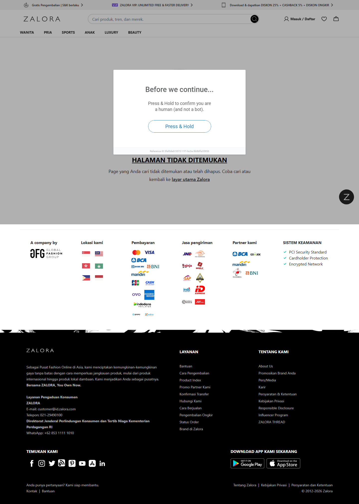

**대표 상품 이미지** (상위 6장, 출처 URL 포함)

-  — 출처 <https://static-id.zacdn.com/next-assets/static-assets/images/logo/icon_mastercard.png>
-  — 출처 <https://static-id.zacdn.com/next-assets/static-assets/images/logo/icon_visa.png>
-  — 출처 <https://static-id.zacdn.com/next-assets/static-assets/images/logo/icon_ovo.png>

**페이지 메타 정보**

| page | title | description |
|---|---|---|
| [`new_women`](https://www.zalora.co.id/wanita/new-arrivals) | Halaman tidak ditemukan | ZALORA |  |

### 4.2 일본 _( Japan )_

- 한국 수출규모 순위: **#2** · region: `asia` · tier `1` · currency `JPY`
- 수집 사이트: **5개** (성공 4)
- 메모: K-패션 선호도 높고 온라인 패션몰 발달
#### [GU Japan](https://www.gu-global.com/jp/)

- URL: <https://www.gu-global.com/jp/>
- 페이지: **OK 1 · FAIL 0**

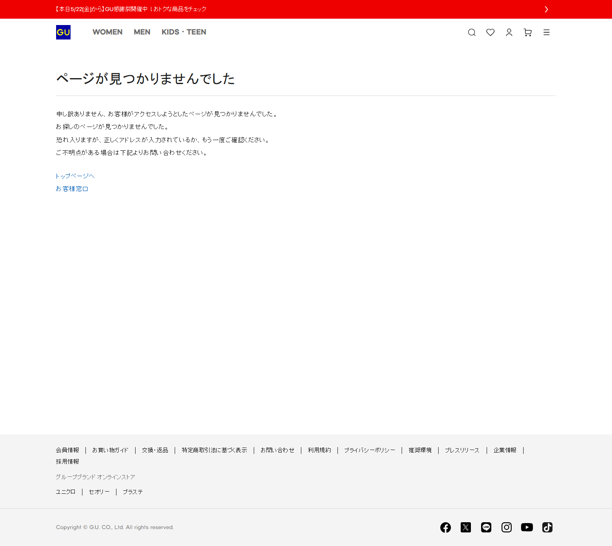

**대표 상품 이미지** (상위 6장, 출처 URL 포함)

-  — 출처 <https://image.uniqlo.com/GU/ST3/jp/imagesother/Navigation/WOMEN_Category/2026/260513/Category_w_Half-Tshirt.png>
-  — 출처 <https://image.uniqlo.com/GU/ST3/jp/imagesother/Navigation/WOMEN_Category/2026/260515/Category_w_Tshirt.png>
- 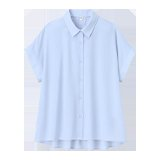 — 출처 <https://image.uniqlo.com/GU/ST3/jp/imagesother/Navigation/WOMEN_Category/2026/260513/Category_w_Shirt-Blouse.png>
-  — 출처 <https://image.uniqlo.com/GU/ST3/jp/imagesother/Navigation/WOMEN_Category/2026/260513/Category_w_Knit-Cardigan.png>
-  — 출처 <https://image.uniqlo.com/GU/ST3/jp/imagesother/Navigation/WOMEN_Category/2026/260513/Category_w_onepeace.png>
-  — 출처 <https://image.uniqlo.com/GU/ST3/jp/imagesother/Navigation/WOMEN_Category/2026/260513/Category_w_Sweat.png>

**페이지 메타 정보**

| page | title | description |
|---|---|---|
| [`new_arrivals`](https://www.gu-global.com/jp/ja/not-found) | 申し訳ありません、お客様がアクセスしようとしたページが見つかりませんでした。恐れ入りますが、正しくアドレスが入力されているか、もう一度ご確認ください。 | ジーユー | 申し訳ありません、お客様がアクセスしようとしたページが見つかりませんでした。恐れ入りますが、正しくアドレスが入力されているか、もう一度ご確認ください。 |

#### [Rakuten Fashion](https://brandavenue.rakuten.co.jp/)

- URL: <https://brandavenue.rakuten.co.jp/>
- 페이지: **OK 1 · FAIL 1**

**대표 상품 이미지** (상위 6장, 출처 URL 포함)

-  — 출처 <https://brandavenue.r10s.jp/img/library/index/sbn_flagshipstore_20231003.png>
- 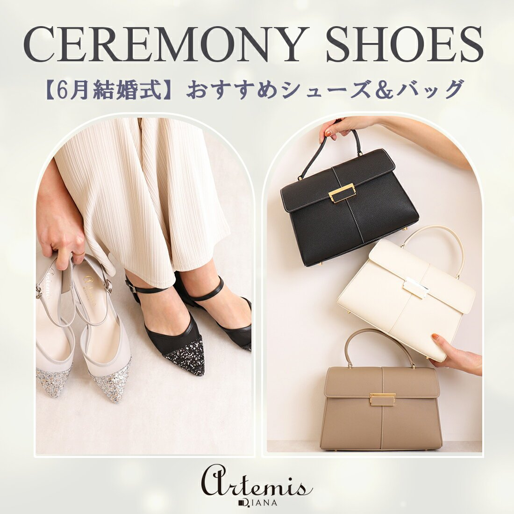 — 출처 <https://brandavenue.r10s.jp/img/news/01/374083/pc_n.jpg>
- 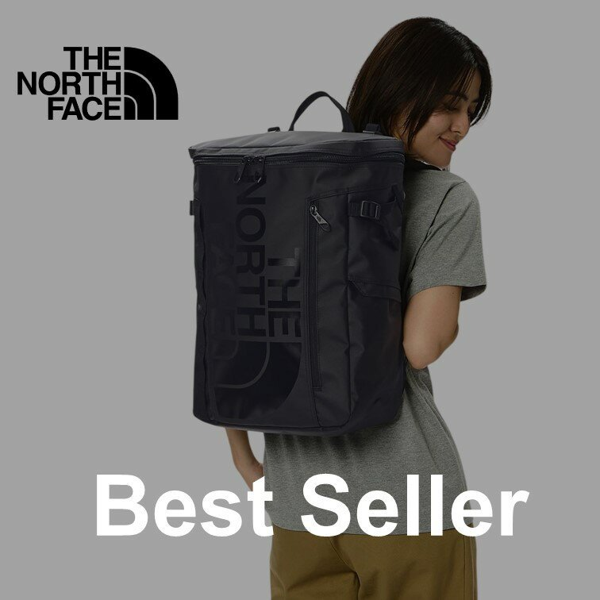 — 출처 <https://brandavenue.r10s.jp/img/news/01/374827/pc_n.jpg>
- 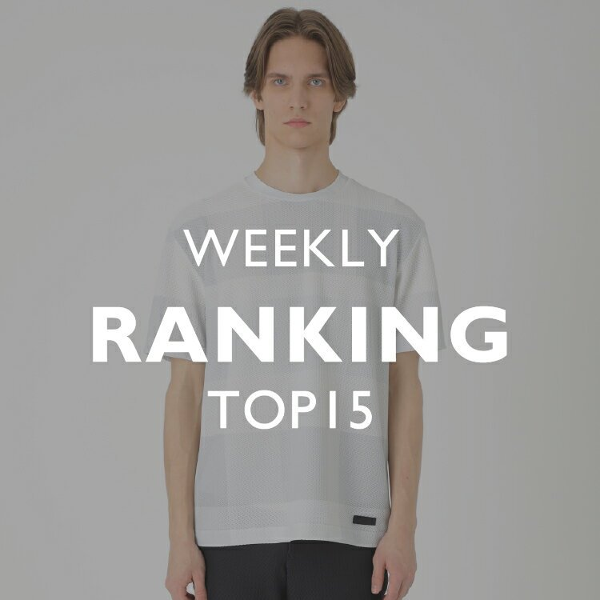 — 출처 <https://brandavenue.r10s.jp/img/news/01/374429/pc_n.jpg>
-  — 출처 <https://brandavenue.r10s.jp/img/news/01/374434/pc_n.jpg>
- 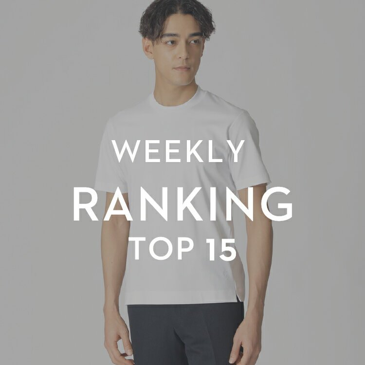 — 출처 <https://brandavenue.r10s.jp/img/news/01/374438/pc_n.jpg>

**페이지 메타 정보**

| page | title | description |
|---|---|---|
| [`men`](https://brandavenue.rakuten.co.jp/men/) | MEN | ファッション通販 Rakuten Fashion(楽天ファッション／旧楽天ブランドアベニュー) | Rakuten Fashion(楽天ファッション)は人気ブランドを取り扱うファッション通販サイトです。新作アイテム続々入荷！セール商品やクーポン対象商品も豊富。／税込3,980円以上購入で送料無料／楽天ポイントが使えて貯まる！ |

**실패 페이지**

- `women` — http_status_404

#### [Uniqlo Japan](https://www.uniqlo.com/jp/)

- URL: <https://www.uniqlo.com/jp/>
- 페이지: **OK 1 · FAIL 0**

**페이지 메타 정보**

| page | title | description |
|---|---|---|
| [`new_arrivals`](https://www.uniqlo.com/jp/ja/contents/feature/new-arrivals/) | 404 Not Found |  |

#### [WEAR](https://wear.jp/)

- URL: <https://wear.jp/>
- 페이지: **OK 1 · FAIL 0**

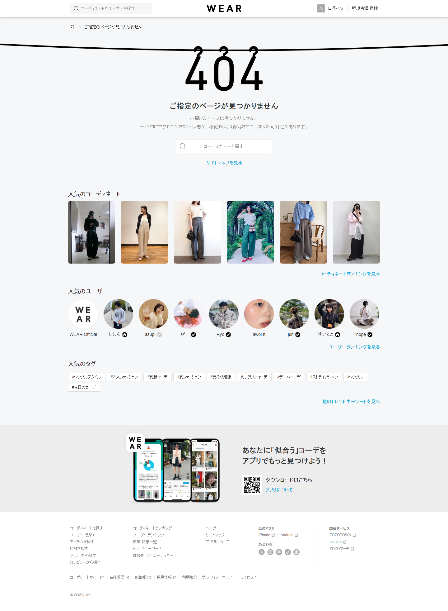

**대표 상품 이미지** (상위 6장, 출처 URL 포함)

-  — 출처 <https://wear.jp/public/_next/static/media/notfound_bg.0mfqf_sjjg4.q.png>
-  — 출처 <https://wear.jp/public/_next/static/media/notfound_4.0h3~tstn7vy~q.png>
-  — 출처 <https://wear.jp/public/_next/static/media/notfound_0.17sfauikqe-ig.png>
- 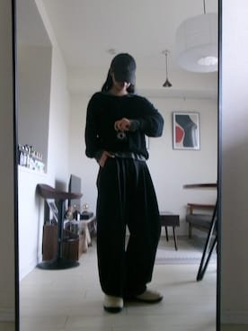 — 출처 <https://images.wear2.jp/coordinate/Paiwa2lZ/WU6LTajA/1778285263_276.jpg>
- 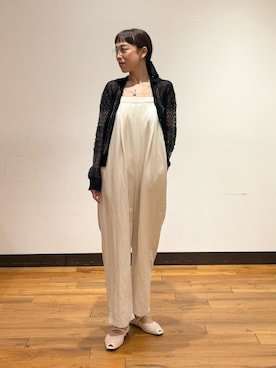 — 출처 <https://images.wear2.jp/coordinate/7biZW4D/dDlSk5gk/1779330057_276.jpg>
- 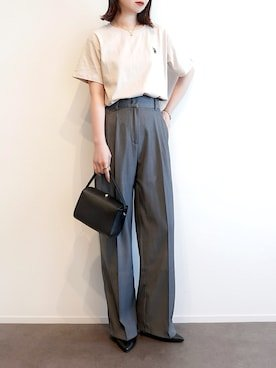 — 출처 <https://images.wear2.jp/coordinate/kAiO3P8/1jkEAmUI/1779367344_276.jpg>

**페이지 메타 정보**

| page | title | description |
|---|---|---|
| [`ranking`](https://wear.jp/ranking/coordinate/) | ご指定のページが見つかりません - WEAR |  |

#### [ZOZOTOWN](https://zozo.jp/)

- URL: <https://zozo.jp/>
- 페이지: **OK 0 · FAIL 2**

**실패 페이지**

- `new` — playwright_error: TimeoutError: Page.goto: Timeout 30000ms exceeded.
Call log:
  - navigating to "https://zozo.jp/category/new/", waiting until "domcontentloaded"

- `ranking` — playwright_error: TimeoutError: Page.goto: Timeout 30000ms exceeded.
Call log:
  - navigating to "https://zozo.jp/ranking/", waiting until "domcontentloaded"

### 4.3 한국 _( South Korea )_

- 한국 수출규모 순위: **#30** · region: `asia` · tier `1` · currency `KRW`
- 수집 사이트: **4개** (성공 3)
- 메모: 비교 기준 (자국). 국내 사업동향 센싱
#### [29CM](https://www.29cm.co.kr/)

- URL: <https://www.29cm.co.kr/>
- 페이지: **OK 1 · FAIL 0**

**최근 유행 상품** (50건 · 상품명 클릭 시 해당 사이트로 이동)

| # | 상품명 | 브랜드 | 가격 | 페이지 |
|---:|---|---|---:|---|
| 1 | [Pita Cardigan_Sage Green](https://product.29cm.co.kr/catalog/3970614) | 베뉴엣 | 85,050 KRW | `home` |
| 2 | [Pita Cardigan_Natural Beige](https://product.29cm.co.kr/catalog/3970594) | 베뉴엣 | 85,050 KRW | `home` |
| 3 | [Pita Cardigan_Cream](https://product.29cm.co.kr/catalog/3970593) | 베뉴엣 | 85,050 KRW | `home` |
| 4 | [sidetable unit-2](https://product.29cm.co.kr/catalog/3950927) | 얼라인 | 270,000 KRW | `home` |
| 5 | [sidetable unit-3](https://product.29cm.co.kr/catalog/3950928) | 얼라인 | 365,000 KRW | `home` |
| 6 | [sidetable unit-1](https://product.29cm.co.kr/catalog/3950915) | 얼라인 | 270,000 KRW | `home` |
| 7 | [[이케아 쉬레 스툴 호환] KB1 (이케아 포함X) 10colors](https://product.29cm.co.kr/catalog/2536784) | 비아크 | 50,160 KRW | `home` |
| 8 | [[이케아 토카보 조명 호환] TSL(이케아 포함X) 3colors](https://product.29cm.co.kr/catalog/3286484) | 비아크 | 145,340 KRW | `home` |
| 9 | [[이케아 바페뷔 스피커 호환] VP1 (이케아 포함X)](https://product.29cm.co.kr/catalog/3286376) | 비아크 | 48,400 KRW | `home` |
| 10 | [캐스터네츠 커스텀 캣타워 (H, 가드형)](https://product.29cm.co.kr/catalog/2300613) | 일룸 | 649,000 KRW | `home` |
| 11 | [캐스터네츠 커스텀 캣타워 미니 (투명해먹형)](https://product.29cm.co.kr/catalog/2300597) | 일룸 | 399,000 KRW | `home` |
| 12 | [캐스터네츠 클로캣 4단 800폭 캣타워 세트](https://product.29cm.co.kr/catalog/3634007) | 일룸 | 497,000 KRW | `home` |
| 13 | [SLUB JERSEY SLEEVELESS TOP_ BLACK](https://product.29cm.co.kr/catalog/3971435) | 우우소오 | 39,200 KRW | `home` |
| 14 | [SLUB JERSEY SLEEVELESS TOP_ IVORY](https://product.29cm.co.kr/catalog/3971434) | 우우소오 | 39,200 KRW | `home` |
| 15 | [FRINGE CROCHET SCARF_ BLACK](https://product.29cm.co.kr/catalog/3971430) | 우우소오 | 39,200 KRW | `home` |
| 16 | [[29CM 단독] 바이크로스 그레이스 터쿼이즈 목걸이(White) BH7N65775WB600](https://product.29cm.co.kr/catalog/3986438) | 바이이에르 | 44,970 KRW | `home` |
| 17 | [[29CM 단독] [925 silver] 바이그레인 실버 터쿼이즈 크로스 목걸이 (White) BH7N63708W9500](https://product.29cm.co.kr/catalog/3869723) | 바이이에르 | 83,300 KRW | `home` |
| 18 | [[29CM 단독] [925 silver] 바이그레인 실버 터쿼이즈 포인트 귀걸이 (White) BH7E64722W9XXX](https://product.29cm.co.kr/catalog/3909680) | 바이이에르 | 57,460 KRW | `home` |
| 19 | [호머로린 헤일로 그린 오발 플레이트 29cm](https://product.29cm.co.kr/catalog/3974477) | 호머로린 | 42,840 KRW | `home` |
| 20 | [호머로린 헤일로 레드 오발 플레이트 29cm](https://product.29cm.co.kr/catalog/3974447) | 호머로린 | 42,840 KRW | `home` |

**대표 상품 이미지** (상위 6장, 출처 URL 포함)

- 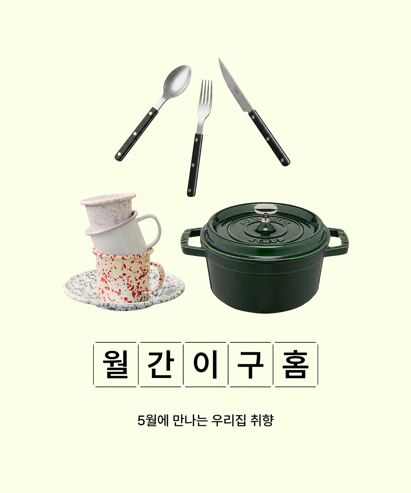 — 출처 <https://img.29cm.co.kr/cms/202605/11f153f620c77a258e7ddb40e8b9806c.png?width=3840&format=webp>
- 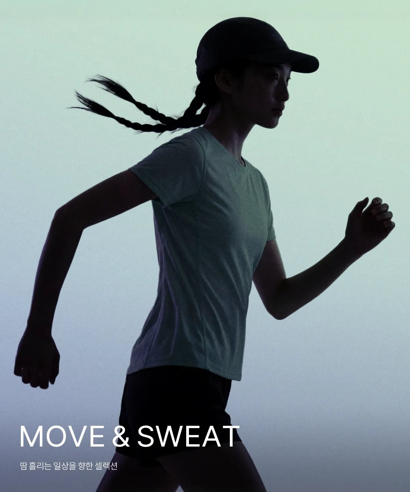 — 출처 <https://img.29cm.co.kr/cms/202605/11f153f60eb3a3898e7dbb4c98d437a6.png?width=3840&format=webp>
- 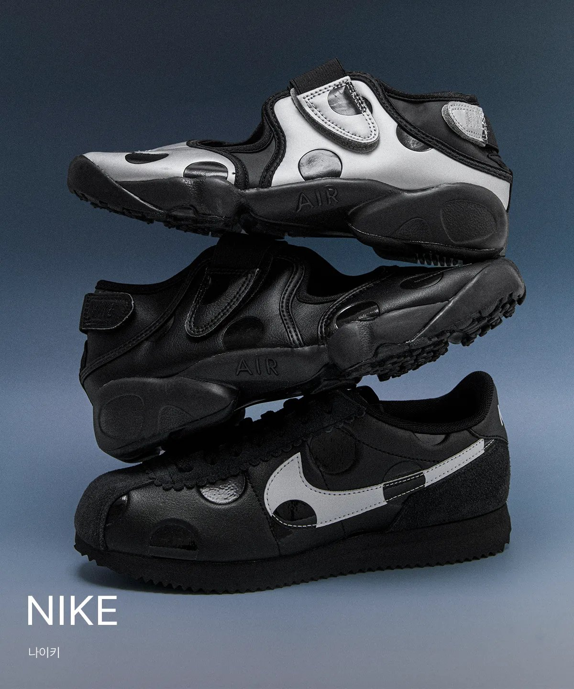 — 출처 <https://img.29cm.co.kr/cms/202605/11f153f5ffca7ffa83a4132564c4850c.png?width=3840&format=webp>
- 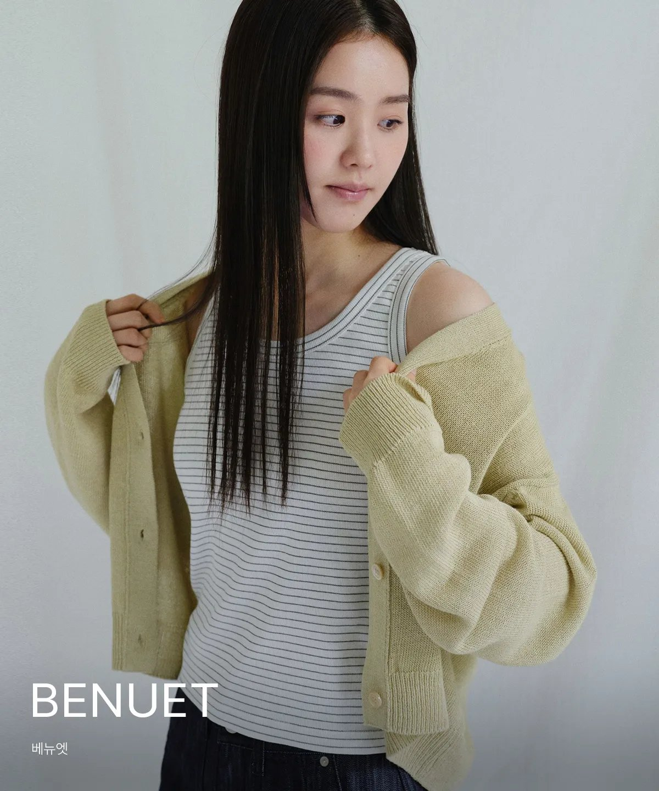 — 출처 <https://img.29cm.co.kr/cms/202605/11f153f5f579d0538e7dcf9141d2a136.png?width=3840&format=webp>
- 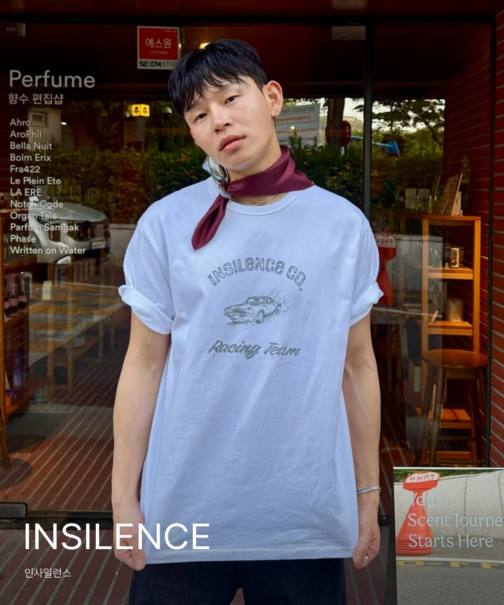 — 출처 <https://img.29cm.co.kr/cms/202605/11f153f5eb70b0f58e7d97401cf6c991.png?width=3840&format=webp>
- 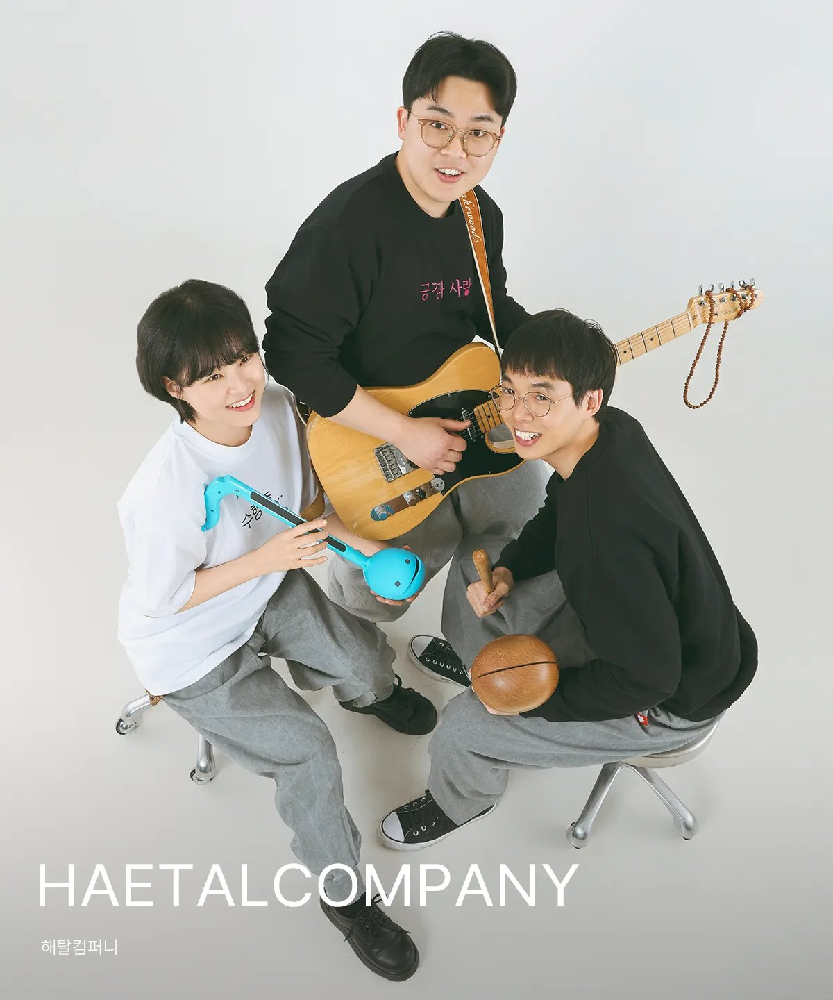 — 출처 <https://img.29cm.co.kr/cms/202605/11f153f5e22cb65f8e7d6372c70937a1.png?width=3840&format=webp>

**페이지 메타 정보**

| page | title | description |
|---|---|---|
| [`home`](https://www.29cm.co.kr/) | 감도 깊은 취향 셀렉트샵 29CM | 패션, 라이프스타일, 컬처까지 29CM만의 감도 깊은 셀렉션을 만나보세요. |

#### [Musinsa](https://www.musinsa.com/)

- URL: <https://www.musinsa.com/>
- 페이지: **OK 0 · FAIL 1**

**실패 페이지**

- `home` — robots_disallowed

#### [W Concept](https://www.wconcept.co.kr/)

- URL: <https://www.wconcept.co.kr/>
- 페이지: **OK 1 · FAIL 0**

**최근 유행 상품** (20건 · 상품명 클릭 시 해당 사이트로 이동)

| # | 상품명 | 브랜드 | 가격 | 페이지 |
|---:|---|---|---:|---|
| 1 | [[4차 리오더][SET-UP]엠마 린넨 스트랩 자켓 / EMMA LINEN STRAP JACKET_3colors](https://m.wconcept.co.kr/Product/306811066) | 룩캐스트 | 91,244 KRW | `home` |
| 2 | [하나 노카라 트위드 자켓 / HANA NO COLLAR TWEED JACKET_2colors](https://m.wconcept.co.kr/Product/308442133) | 룩캐스트 | 115,216 KRW | `home` |
| 3 | [[6차 리오더][NEW컬러 추가] 제제 언발란스 티셔츠 / ZEZE UNBALANCE T-SHIRT_6colors](https://m.wconcept.co.kr/Product/308442104) | 룩캐스트 | 31,122 KRW | `home` |
| 4 | [폴린 코튼 핀턱 블라우스 / PAULINE COTTON PINTUCK BLOUSE_2colors](https://m.wconcept.co.kr/Product/308442097) | 룩캐스트 | 74,693 KRW | `home` |
| 5 | [[3차 리오더]아리아 플라워 슬리브리스 블라우스 / ARIA FLOWER SLEEVELESS BLOUSE_2colors](https://m.wconcept.co.kr/Product/306811064) | 룩캐스트 | 58,330 KRW | `home` |
| 6 | [클로에 스퀘어 넥 슬리브리스 니트 / CHLOE SQUARE NECK SLEEVELESS KNIT_3colors](https://m.wconcept.co.kr/Product/305814273) | 룩캐스트 | 29,739 KRW | `home` |
| 7 | [노라 베이직 티셔츠 / NORA BASIC T-SHIRT_5colors](https://m.wconcept.co.kr/Product/308145541) | 룩캐스트 | 24,898 KRW | `home` |
| 8 | [[3차 리오더][SET-UP]엠마 린넨 턱 쇼츠 팬츠 / EMMA LINEN TUCK SHORT PANTS_3colors](https://m.wconcept.co.kr/Product/306811062) | 룩캐스트 | 48,122 KRW | `home` |
| 9 | [로린 썸머 오버핏 자켓_화이트 / LAURINE SUMMER OVERFIT JACKET_WHITE](https://m.wconcept.co.kr/Product/308442132) | 룩캐스트 | 121,448 KRW | `home` |
| 10 | [로아 린넨 크롭 자켓_베이지 / ROA LINEN CROP JACKET_BEIGE](https://m.wconcept.co.kr/Product/308442115) | 룩캐스트 | 91,244 KRW | `home` |
| 11 | [솔렌 모크넥 버튼업 블라우스 / SOLENE MOCK-NECK BUTTON UP BLOUSE_4colors](https://m.wconcept.co.kr/Product/308442095) | 룩캐스트 | 74,727 KRW | `home` |
| 12 | [[3차 리오더]슈 슬리브리스 미니 드레스 / SHU SLEEVELESS MINI DRESS_2colors](https://m.wconcept.co.kr/Product/306811054) | 룩캐스트 | 95,797 KRW | `home` |
| 13 | [[단독]에디트 베이직 라운드 가디건 / EDITH BASIC ROUND CARDIGAN_5colors](https://m.wconcept.co.kr/Product/308442093) | 룩캐스트 | 43,152 KRW | `home` |
| 14 | [시아 텐셀 드레이프 티셔츠 / SIA TENCEL DRAPED T-SHIRT_3colors](https://m.wconcept.co.kr/Product/308442112) | 룩캐스트 | 33,212 KRW | `home` |
| 15 | [루아 숄 니트 셋업  / LUA SHAWL KNIT SET UP_3colors](https://m.wconcept.co.kr/Product/308442087) | 룩캐스트 | 53,970 KRW | `home` |
| 16 | [소핀 브이넥 텍스처드 래글런 블라우스 / SOPHINE V-NECK TEXTURED RAGLAN BLOUSE_2colors](https://m.wconcept.co.kr/Product/308442098) | 룩캐스트 | 69,768 KRW | `home` |
| 17 | [지젤 아워글래스 퍼프 자켓_베이지 / GISELLE HOURGLASS PUFF JACKET_BEIGE](https://m.wconcept.co.kr/Product/308442131) | 룩캐스트 | 116,189 KRW | `home` |
| 18 | [[워셔블] 레나 리브드 브이넥 슬리브리스 니트 / LENA RIBBED V-NECK SLEEVELESS KNIT_4colors](https://m.wconcept.co.kr/Product/308442086) | 룩캐스트 | 29,070 KRW | `home` |
| 19 | [[워셔블]리디 슬림핏 폴로 니트 탑_그레이 / LYDIE SLIM FIT POLO KNIT TOP_GREY](https://m.wconcept.co.kr/Product/308442092) | 룩캐스트 | 50,646 KRW | `home` |
| 20 | [끌로에 실크 카울넥 블라우스 / CHLOE SILK COWL NECK BLOUSE_3colors](https://m.wconcept.co.kr/Product/308510617) | 룩캐스트 | 80,352 KRW | `home` |

**페이지 메타 정보**

| page | title | description |
|---|---|---|
| [`home`](https://www.wconcept.co.kr/) | _(empty)_ |  |

#### [Zigzag](https://zigzag.kr/)

- URL: <https://zigzag.kr/>
- 페이지: **OK 1 · FAIL 0**

**최근 유행 상품** (36건 · 상품명 클릭 시 해당 사이트로 이동)

| # | 상품명 | 브랜드 | 가격 | 페이지 |
|---:|---|---|---:|---|
| 1 | [[🏆역대급100만장/편안함최강] made. 마켓 와이드 트레이닝슬랙스 (+숏/베이직/롱ver) - 3 size](https://store.zigzag.kr/app/catalog/products/141360158?browsing_type=NATIVE_BROWSER) | 슬로우앤드 | 26,320 KRW | `home` |
| 2 | [[백지헌 PICK💖][COOL] 썸머 카디건_SPCKG24G01](https://store.zigzag.kr/app/catalog/products/168873831?browsing_type=NATIVE_BROWSER) | 스파오 | 20,180 KRW | `home` |
| 3 | [[여름청바지👖/3단기장/made] 시그니처 논페이드 데님 팬츠](https://store.zigzag.kr/app/catalog/products/158971418?browsing_type=NATIVE_BROWSER) | 리얼코코 | 15,930 KRW | `home` |
| 4 | [[10만장판매/Essential] 릴리스 텐셀 오버핏 셔츠](https://store.zigzag.kr/app/catalog/products/160269610?browsing_type=NATIVE_BROWSER) | 매니크 | 26,540 KRW | `home` |
| 5 | [[예약판매]카울넥 반팔 티셔츠_MIWHWG502A](https://store.zigzag.kr/app/catalog/products/168991739?browsing_type=NATIVE_BROWSER) | 미쏘 | 21,300 KRW | `home` |
| 6 | [[✨구김걱정NO/💐하객룩추천] made. 세미부츠컷 찰랑슬랙스 (+베이직/롱ver) - 4 size](https://store.zigzag.kr/app/catalog/products/142355088?browsing_type=NATIVE_BROWSER) | 슬로우앤드 | 31,120 KRW | `home` |
| 7 | [헨리넥 반팔티_SPRWG24G01](https://store.zigzag.kr/app/catalog/products/168759103?browsing_type=NATIVE_BROWSER) | 스파오 | 23,310 KRW | `home` |
| 8 | [[💗기본템/부유방커버] made. 쫀쫀 커버핏 슬리브리스 (유교걸나시!) - 7 color](https://store.zigzag.kr/app/catalog/products/160291278?browsing_type=NATIVE_BROWSER) | 슬로우앤드 | 15,040 KRW | `home` |
| 9 | [[🔥후기인증팬츠] made. 나스 디테일러 와이드팬츠 (+베이직/롱ver) - 4 size](https://store.zigzag.kr/app/catalog/products/140796259?browsing_type=NATIVE_BROWSER) | 슬로우앤드 | 35,200 KRW | `home` |
| 10 | [[🌸사계절필수/인생티♥] made. 솔트 클린 반팔티셔츠 (스탠다드핏/루즈핏) - 7 color](https://store.zigzag.kr/app/catalog/products/141373178?browsing_type=NATIVE_BROWSER) | 슬로우앤드 | 12,370 KRW | `home` |
| 11 | [[3타입][무지/배색/스트라이프][MADE] 러브유 보트넥 레이어드 민소매 골지나시 (44~110) (빅사이즈나시-끈나시-민소매-무지나시-스트라이프나시--부유방커버나시)](https://store.zigzag.kr/app/catalog/products/159214859?browsing_type=NATIVE_BROWSER) | 핫핑 | 14,200 KRW | `home` |
| 12 | [[1+1][들뜸ZERO][❄쿨기능성] 심리스 쿨메쉬 브라렛 (볼륨/올데이)](https://store.zigzag.kr/app/catalog/products/167265910?browsing_type=NATIVE_BROWSER) | 에블린 | 51,700 KRW | `home` |
| 13 | [[🔥후기인증/🎖️1등슬랙스] made. 모먼트 투커버 올데이슬랙스 (+숏/베이직/롱ver) - 4 size](https://store.zigzag.kr/app/catalog/products/136095576?browsing_type=NATIVE_BROWSER) | 슬로우앤드 | 31,840 KRW | `home` |
| 14 | [[💙여름][직진배송/10만장돌파][MNLB] 퍼퓸 레이스 라인 스트랩 코튼 블라우스](https://store.zigzag.kr/app/catalog/products/134884542?browsing_type=NATIVE_BROWSER) | 디어먼트 | 25,470 KRW | `home` |
| 15 | [[🧊여름/MNQ] 디킨슨 레이스 밴딩 미디 스커트](https://store.zigzag.kr/app/catalog/products/170037488?browsing_type=NATIVE_BROWSER) | 매니크 | 34,400 KRW | `home` |
| 16 | [[MADE/7color]젠느 투타입 반팔 티셔츠](https://store.zigzag.kr/app/catalog/products/163287572?browsing_type=NATIVE_BROWSER) | 베이델리 | 15,610 KRW | `home` |
| 17 | [[🩵여름신상] 라라 나시 뷔스티에 블라우스](https://store.zigzag.kr/app/catalog/products/170049633?browsing_type=NATIVE_BROWSER) | 루앤메리 | 47,020 KRW | `home` |
| 18 | [핑크플라워 오버핏 반팔티](https://store.zigzag.kr/app/catalog/products/170045788?browsing_type=NATIVE_BROWSER) | 소솔마켓 | 26,610 KRW | `home` |
| 19 | [[여름청바지👖/후기최고] made. 투데이 썸머라이트 데님팬츠 (+베이직/롱ver) - 4 size](https://store.zigzag.kr/app/catalog/products/122809429?browsing_type=NATIVE_BROWSER) | 슬로우앤드 | 26,520 KRW | `home` |
| 20 | [[30만장돌파/MADE]누벨 데일리 나일론 슬릿 롱 스커트 (S-L/장마룩/여름스커트/바스락스커트/데일리룩/출근룩/h라인스커트/나일론치마/롱치마)](https://store.zigzag.kr/app/catalog/products/140798161?browsing_type=NATIVE_BROWSER) | 케이클럽 | 23,880 KRW | `home` |

**대표 상품 이미지** (상위 6장, 출처 URL 포함)

-  — 출처 <https://cf.image-farm.s.zigzag.kr/original/cms/2026/05/18/202605180047380868_072611.png?quality=80&format=webp&transparent=true&width=1029&height=1188>
-  — 출처 <https://cf.image-farm.s.zigzag.kr/original/cms/2026/05/17/202605171153369298_096013.jpg?width=1029&height=1188&quality=80&format=webp&transparent=true>
- 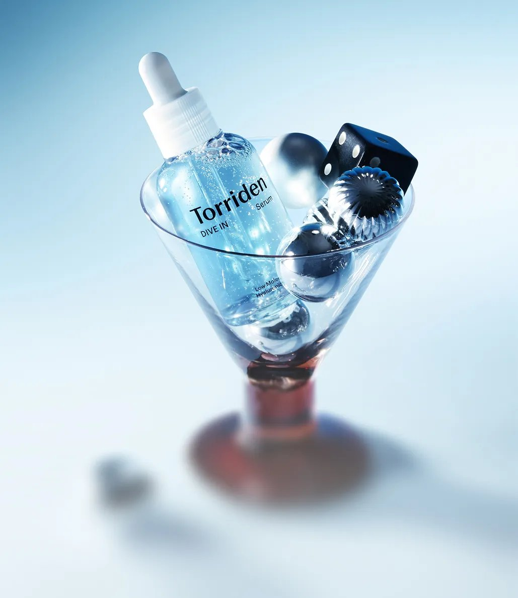 — 출처 <https://cf.image-farm.s.zigzag.kr/original/cms/2026/05/18/202605180233541008_024577.jpg?width=1029&height=1188&quality=80&format=webp&transparent=true>
- 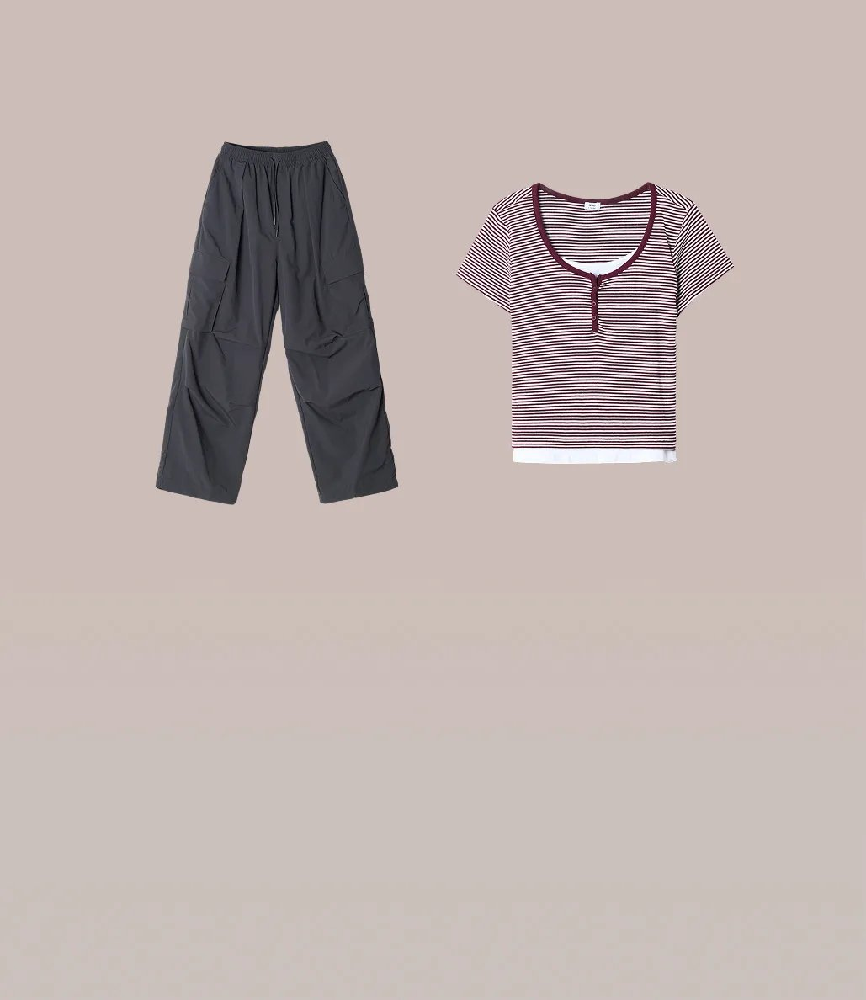 — 출처 <https://cf.image-farm.s.zigzag.kr/original/cms/2026/05/21/202605210547258118_020689.jpg?width=1029&height=1188&quality=80&format=webp&transparent=true>
- 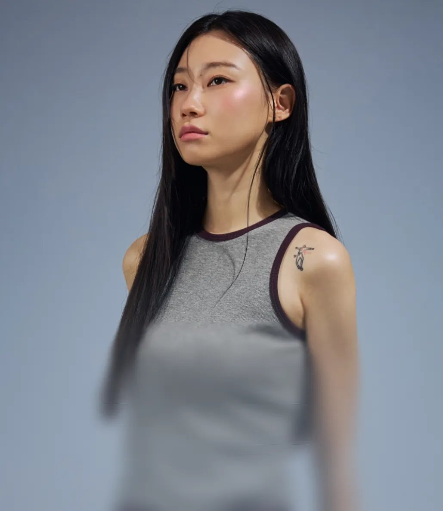 — 출처 <https://cf.image-farm.s.zigzag.kr/original/cms/2026/05/10/202605100430019500_090039.png?quality=80&format=webp&transparent=true&width=1029&height=1188>
- 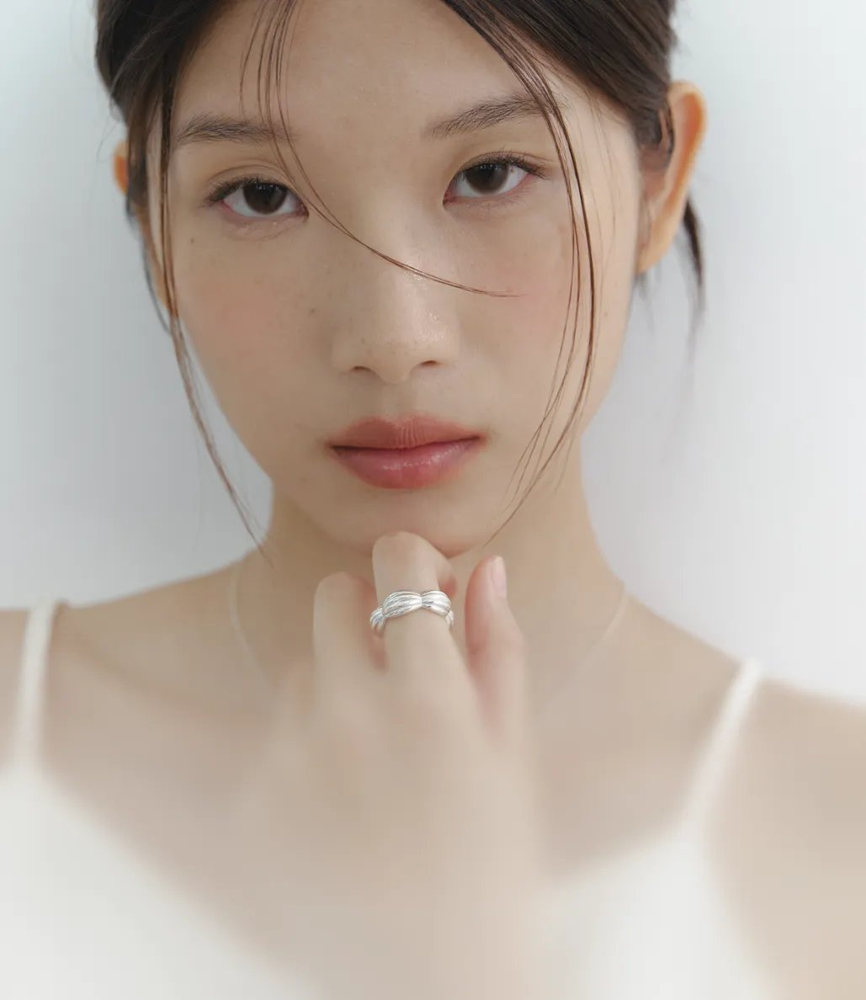 — 출처 <https://cf.image-farm.s.zigzag.kr/original/cms/2026/05/13/202605130306302034_062251.png?quality=80&format=webp&transparent=true&width=1029&height=1188>

**페이지 메타 정보**

| page | title | description |
|---|---|---|
| [`home`](https://zigzag.kr/) | 지그재그 스토어 | 4,000만 여성이 선택한 올인원 쇼핑 앱 지그재그 - 제가 알아서 살게요. |

### 4.4 대만 _( Taiwan )_

- 한국 수출규모 순위: **#7** · region: `asia` · tier `1` · currency `TWD`
- 수집 사이트: **5개** (성공 4)
- 메모: K-패션 친화도 높음
#### [momo](https://www.momoshop.com.tw/)

- URL: <https://www.momoshop.com.tw/>
- 페이지: **OK 1 · FAIL 0**

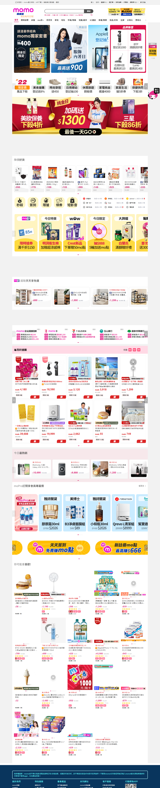

**대표 상품 이미지** (상위 6장, 출처 URL 포함)

-  — 출처 <https://img2.momoshop.com.tw/ecm/img/online/10/998/00/000/bt_0_271_01/bt_0_271_01_e2.jpg?t=1777893650110>
-  — 출처 <https://img4.momoshop.com.tw/ecm/img/online/10/998/00/000/bt_0_243_01/bt_0_243_01_e2.gif?t=1779094783980>
- 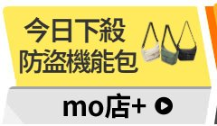 — 출처 <https://img1.momoshop.com.tw/ecm/img/online/10/998/00/000/bt_0_245_01/bt_0_245_01_P1_1_e2.png?t=1779379206484>
-  — 출처 <https://img1.momoshop.com.tw/ecm/img/online/10/998/00/000/bt_0_245_01/bt_0_245_01_P1_2_e2.png?t=1779120011027>
-  — 출처 <https://img1.momoshop.com.tw/ecm/img/online/10/998/00/000/bt_0_245_01/bt_0_245_01_P1_3_e2.png?t=1779120011027>
- 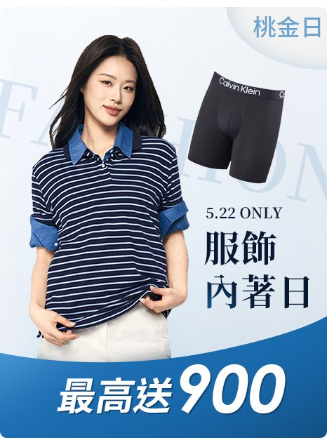 — 출처 <https://img4.momoshop.com.tw/ecm/img/online/81/998/00/000/mobile/bt_7_701_01/bt_7_701_01_e41.jpg?t=1779351095408>

**페이지 메타 정보**

| page | title | description |
|---|---|---|
| [`home`](https://www.momoshop.com.tw/main/Main.jsp) | momo購物網 - 好評推薦 - 2026年5月 | momo購物網提供美妝保養、流行服飾、時尚精品、3C、數位家電、生活用品、美食旅遊票券…等數百萬件商品。快速到貨、超商取貨讓您購物最便利。mo店+商品抵用券天天搶、免運吃到飽，電視/直播商品限時下殺，每日讓您享超低價，並享有十天猶豫期；momo購物網為富邦及台灣大哥大關係企業 |

#### [OB Design](https://www.obdesign.com.tw/)

- URL: <https://www.obdesign.com.tw/>
- 페이지: **OK 1 · FAIL 0**

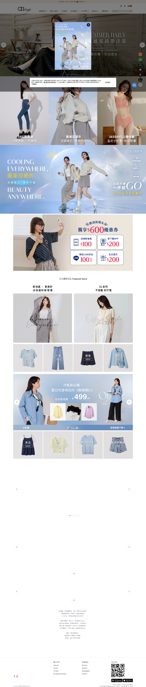

**대표 상품 이미지** (상위 6장, 출처 URL 포함)

-  — 출처 <https://cms-static.cdn.91app.com/images/original/41602/92f19e4d-89b7-4330-9570-02cf1dff9742-1778727661-3sy0baovmv_d_1920x820_1280x547_1124x480_800x342_600x256_400x171.jpg>
-  — 출처 <https://cms-static.cdn.91app.com/images/compress/41602/92f19e4d-89b7-4330-9570-02cf1dff9742-1778727661-3sy0baovmv_d_400x171.webp>
- 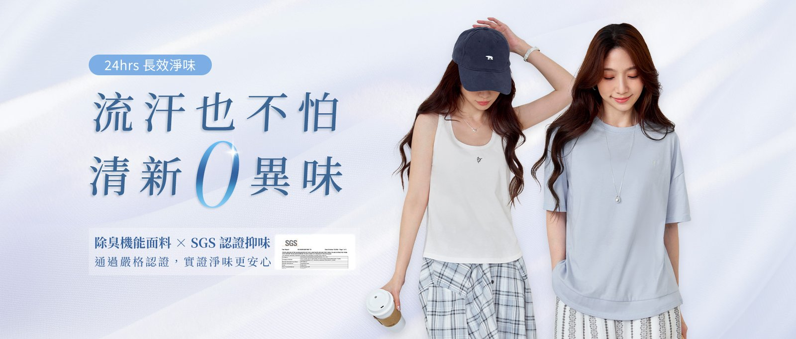 — 출처 <https://cms-static.cdn.91app.com/images/original/41602/92f19e4d-89b7-4330-9570-02cf1dff9742-1779094503-6drun5zyc4_d_1920x820_1280x547_1124x480_800x342_600x256_400x171.jpg>
- 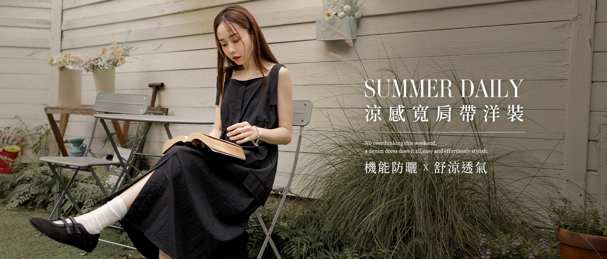 — 출처 <https://cms-static.cdn.91app.com/images/original/41602/92f19e4d-89b7-4330-9570-02cf1dff9742-1779070872-a0d3jhklbp_d_1920x820_1280x547_1124x480_800x342_600x256_400x171.jpg>
- 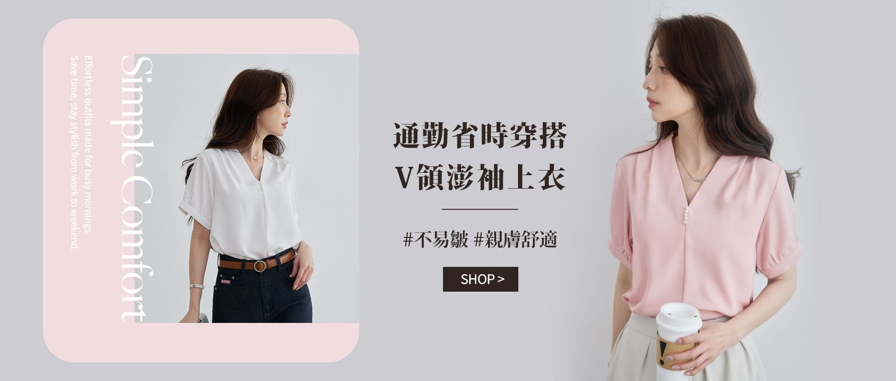 — 출처 <https://cms-static.cdn.91app.com/images/original/41602/92f19e4d-89b7-4330-9570-02cf1dff9742-1779070916-p7ileh8xvh_d_1920x820_1280x547_1124x480_800x342_600x256_400x171.jpg>
- 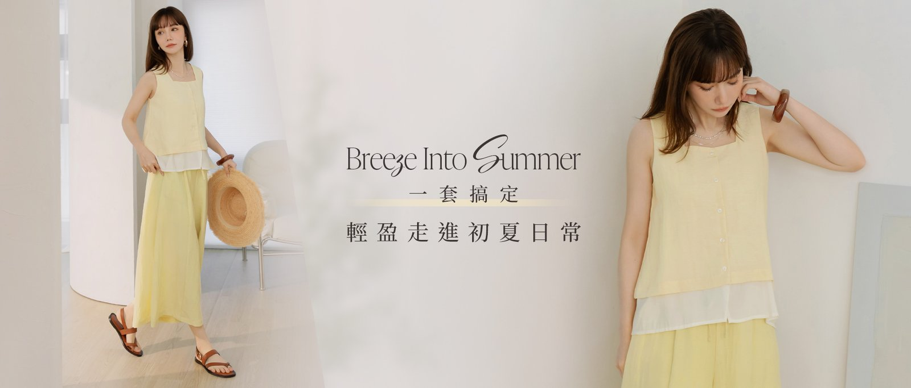 — 출처 <https://cms-static.cdn.91app.com/images/original/41602/92f19e4d-89b7-4330-9570-02cf1dff9742-1779071329-wz3vkxolfi_d_1920x820_1280x547_1124x480_800x342_600x256_400x171.jpg>

**페이지 메타 정보**

| page | title | description |
|---|---|---|
| [`home`](https://www.obdesign.com.tw/) | OB嚴選｜高CP值人氣熱銷服飾，流行服飾品牌 | 你的日常穿搭好夥伴，快上OB嚴選找，OB嚴選提供女裝、孕童、運動、男裝各項流行服飾，秉持優質服務給你高CP值的購物體驗。各種風格都能滿足熱愛穿搭的你，天天上新品，快速出貨，一起加入OB style！網路人氣服飾品牌OB嚴選 |

#### [PChome](https://24h.pchome.com.tw/)

- URL: <https://24h.pchome.com.tw/>
- 페이지: **OK 0 · FAIL 1**

**실패 페이지**

- `home` — http_status_429

#### [Pinkoi Taiwan](https://www.pinkoi.com/)

- URL: <https://www.pinkoi.com/>
- 페이지: **OK 2 · FAIL 0**

**대표 상품 이미지** (상위 6장, 출처 URL 포함)

-  — 출처 <https://cdn04.pinkoi.com/pinkoi.site/logo/og_image.png>

**페이지 메타 정보**

| page | title | description |
|---|---|---|
| [`accessories`](https://en.pinkoi.com/) | Pinkoi | Asia’s cross-border design marketplace | Design the way you are | Shop for original design products from Asia's independent designers. Pinkoi lives and breathes great design, great quality, great service, a |
| [`bags`](https://en.pinkoi.com/) | Pinkoi | Asia’s cross-border design marketplace | Design the way you are | Shop for original design products from Asia's independent designers. Pinkoi lives and breathes great design, great quality, great service, a |

#### [Yahoo Taiwan Shopping](https://tw.buy.yahoo.com/)

- URL: <https://tw.buy.yahoo.com/>
- 페이지: **OK 1 · FAIL 0**

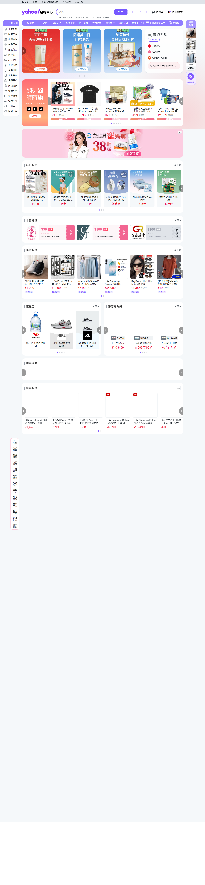

**대표 상품 이미지** (상위 6장, 출처 URL 포함)

- 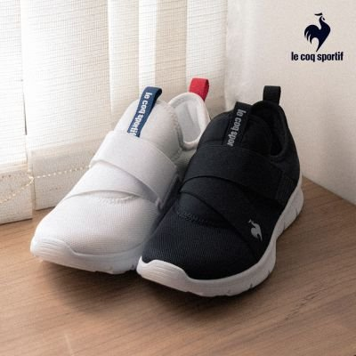 — 출처 <https://img.yec.tw/zp/MerchandiseImages/843f70351d-Gd-11889752.jpg>
- 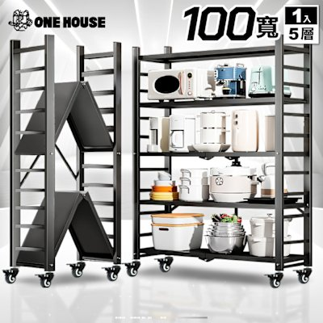 — 출처 <https://img.yec.tw/zp/MerchandiseImages/b023e0fd61-Gd-11516706.jpg>
- 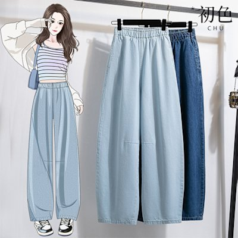 — 출처 <https://img.yec.tw/zp/MerchandiseImages/87805221BF-SP-19222321.jpg>

**페이지 메타 정보**

| page | title | description |
|---|---|---|
| [`home`](https://tw.buy.yahoo.com/) | Yahoo購物中心 - 最懂生活的人 | 數百萬件商品，貼心客服為您服務，15天鑑賞期購物保障！ |

### 4.5 태국 _( Thailand )_

- 한국 수출규모 순위: **#8** · region: `asia` · tier `1` · currency `THB`
- 수집 사이트: **5개** (성공 5)
- 메모: 동남아 K-패션 핵심 시장
#### [Central Online](https://www.central.co.th/)

- URL: <https://www.central.co.th/>
- 페이지: **OK 1 · FAIL 0**

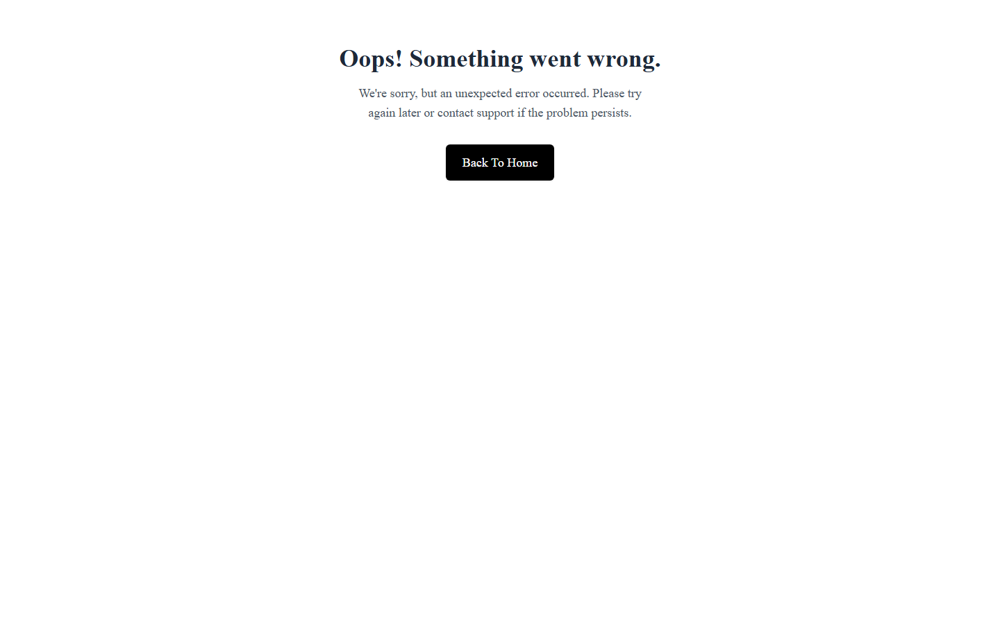

**페이지 메타 정보**

| page | title | description |
|---|---|---|
| [`home`](https://www.central.co.th/th) | _(empty)_ |  |

#### [Lazada Thailand Fashion](https://www.lazada.co.th/)

- URL: <https://www.lazada.co.th/>
- 페이지: **OK 1 · FAIL 0**

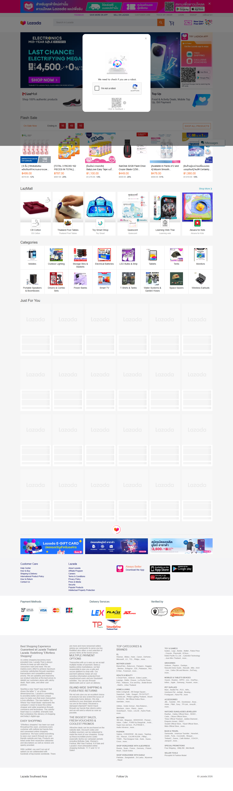

**대표 상품 이미지** (상위 6장, 출처 URL 포함)

-  — 출처 <https://img.lazcdn.com/us/domino/40845120240f19d13f738fa9a7978edd.png>
-  — 출처 <https://img.lazcdn.com/g/tps/images/ims-web/TB1KB2laMFY.1VjSZFnXXcFHXXa.png>
-  — 출처 <https://img.lazcdn.com/us/domino/9211e869-e5e3-43d2-b9bb-df065281ccd1_TH-1976-688.jpg_2200x2200q80.jpg>
- 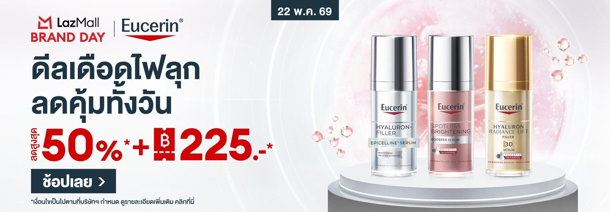 — 출처 <https://img.lazcdn.com/us/domino/68b3f44d-8183-44a4-a3a5-04e13a4a8d45_TH-1976-688.jpg_2200x2200q80.jpg>
- 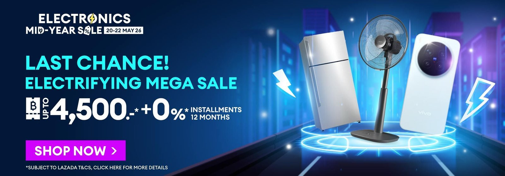 — 출처 <https://img.lazcdn.com/us/domino/962dfd8e-3e3e-47af-baf4-148a30f3c35e_TH-1976-688.jpg_2200x2200q80.jpg>
-  — 출처 <https://img.lazcdn.com/us/domino/ad5d685c-edeb-4fab-a7a4-cf4908275dfe_TH-1976-688.jpg_2200x2200q80.jpg>

**페이지 메타 정보**

| page | title | description |
|---|---|---|
| [`home`](https://www.lazada.co.th/#?) | Lazada Thailand | ช้อปออนไลน์ สินค้าดี พร้อมดีลพิเศษทุกวัน | พบกับ Lazada แพลตฟอร์มช้อปปิ้งชั้นนำในอาเซียน พร้อมบริการเก็บเงินปลายทาง LazMall LazFlash และดีลเด็ดจากแบรนด์ดังทุกวัน |

#### [Pomelo](https://www.pomelofashion.com/)

- URL: <https://www.pomelofashion.com/>
- 페이지: **OK 2 · FAIL 0**

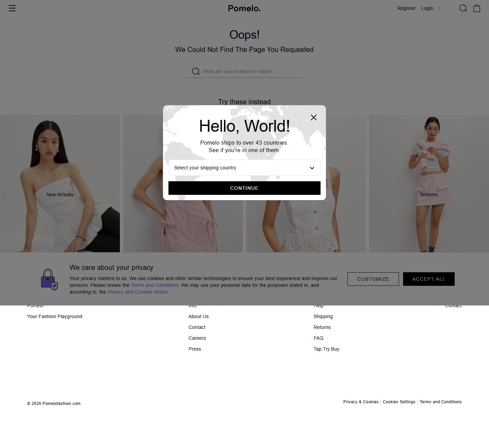

**대표 상품 이미지** (상위 6장, 출처 URL 포함)

-  — 출처 <https://cdn.pomelofashion.com/img/nav/3271/c/7422/20260428100935_69f024efaf715_banner-image.jpg?auto=compress,format&fm=webp,jpg,png&w=375&h=100>
-  — 출처 <https://cdn.pomelofashion.com/img/nav/3271/c/7419/20260302182158_69a572d670875_banner-image.jpg?auto=compress,format&fm=webp,jpg,png&w=375&h=100>
-  — 출처 <https://cdn.pomelofashion.com/img/nav/3271/c/88/20250620125126_6854f6de2dc98_banner-image.jpg?auto=compress,format&fm=webp,jpg,png&w=375&h=100>
-  — 출처 <https://cdn.pomelofashion.com/img/nav/3271/c/7420/20260312173657_69b297499ac84_banner-image.jpg?auto=compress,format&fm=webp,jpg,png&w=375&h=100>
-  — 출처 <https://cdn.pomelofashion.com/img/nav/3271/c/7418/20260216172249_6992eff96d8e5_banner-image.jpg?auto=compress,format&fm=webp,jpg,png&w=375&h=100>
-  — 출처 <https://cdn.pomelofashion.com/img/nav/3271/c/3658/20250620125237_6854f725c93d4_banner-image.jpg?auto=compress,format&fm=webp,jpg,png&w=375&h=100>

**페이지 메타 정보**

| page | title | description |
|---|---|---|
| [`new`](https://pomelofashion.com/global/en/collections/new-arrivals) | POMELO Fashion | Get all the latest fashion, updated twice every week! - Pomelo | Shop the latest fashion at POMELO fashion. Designed and manufactured in house for quality and style. Dresses, tops, knits, jackets, denim, a |
| [`best`](https://pomelofashion.com/global/en/collections/best-sellers) | POMELO Fashion | Get all the latest fashion, updated twice every week! - Pomelo | Shop the latest fashion at POMELO fashion. Designed and manufactured in house for quality and style. Dresses, tops, knits, jackets, denim, a |

#### [Shopee Thailand Fashion](https://shopee.co.th/)

- URL: <https://shopee.co.th/>
- 페이지: **OK 1 · FAIL 0**

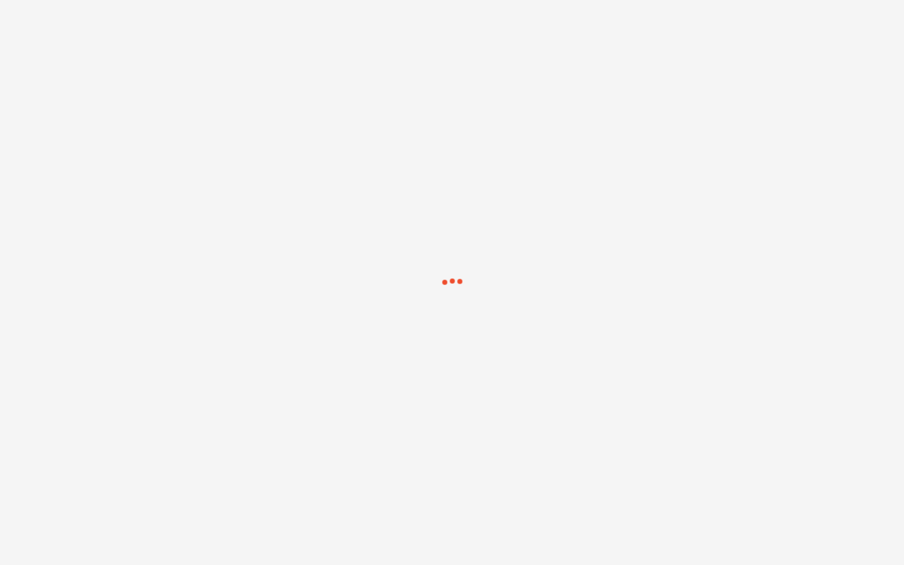

**페이지 메타 정보**

| page | title | description |
|---|---|---|
| [`home`](https://shopee.co.th/) | _(empty)_ |  |

#### [Zalora Thailand](https://www.zalora.co.th/)

- URL: <https://www.zalora.co.th/>
- 페이지: **OK 1 · FAIL 0**

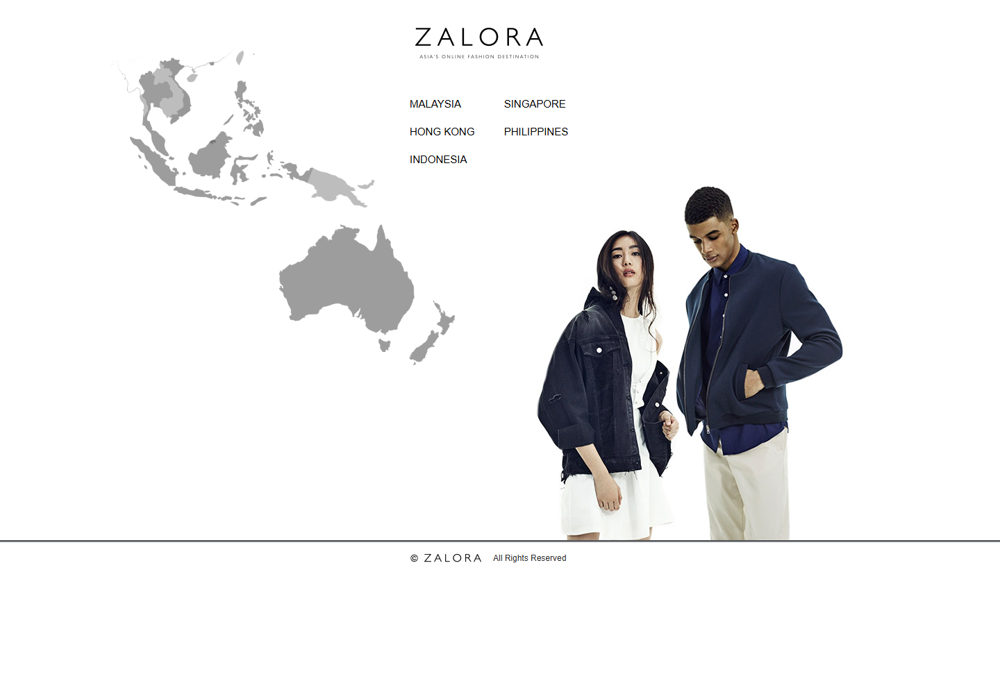

**대표 상품 이미지** (상위 6장, 출처 URL 포함)

-  — 출처 <https://www.zalora.co.th/images/landingpage/525x500.gif>

**페이지 메타 정보**

| page | title | description |
|---|---|---|
| [`home`](https://www.zalora.co.th/) | ZALORA - ASIA'S LEADING ONLINE FASHION DESTINATION |  |

### 4.6 미국 _( United States )_

- 한국 수출규모 순위: **#1** · region: `north_america` · tier `1` · currency `USD`
- 수집 사이트: **5개** (성공 4)
- 메모: 한국 의류 최대 수출국. 대형 이커머스와 브랜드 커머스 중심
#### [Etsy](https://www.etsy.com/)

- URL: <https://www.etsy.com/>
- 페이지: **OK 2 · FAIL 0**

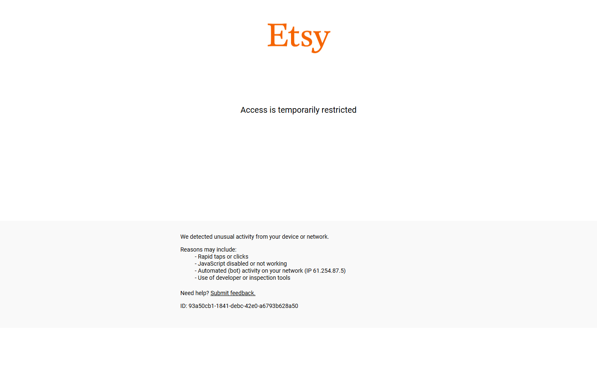

**페이지 메타 정보**

| page | title | description |
|---|---|---|
| [`trending_jewelry`](https://www.etsy.com/c/jewelry) | etsy.com |  |
| [`trending_accessories`](https://www.etsy.com/c/accessories) | etsy.com |  |

#### [Macy's](https://www.macys.com/)

- URL: <https://www.macys.com/>
- 페이지: **OK 1 · FAIL 0**

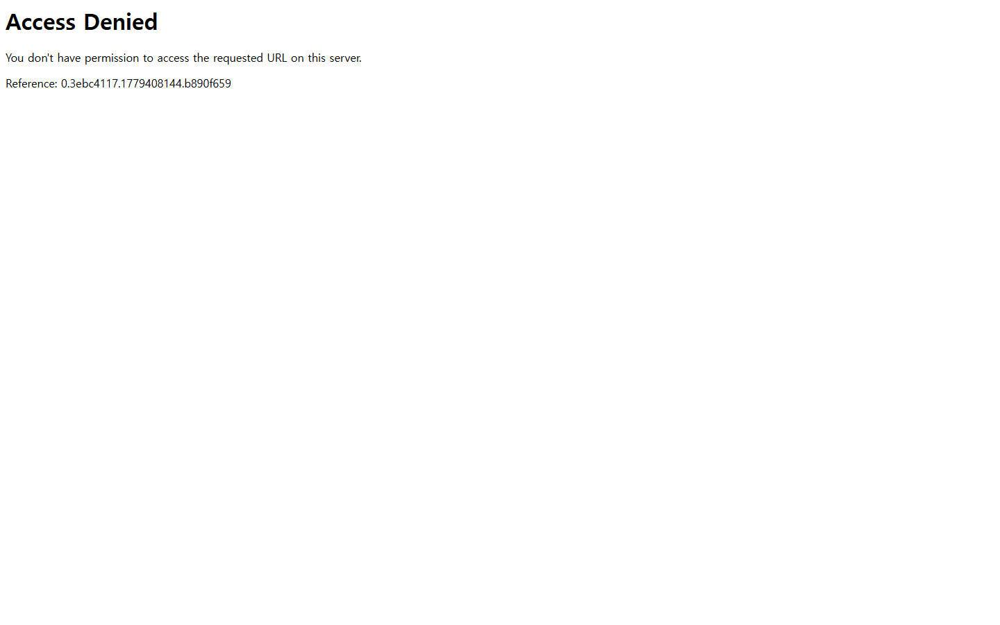

**페이지 메타 정보**

| page | title | description |
|---|---|---|
| [`new`](https://www.macys.com/shop/whats-new?id=14834) | Access Denied |  |

#### [Nordstrom](https://www.nordstrom.com/)

- URL: <https://www.nordstrom.com/>
- 페이지: **OK 1 · FAIL 1**

**대표 상품 이미지** (상위 6장, 출처 URL 포함)

-  — 출처 <https://n.nordstrommedia.com/is/image/nordstrom/03_Womens-Sale_Tile_1-1_12130522.png?width=240&dpr=2&crop=1280%3A1600%2Coffset-x50%2Coffset-y50>
-  — 출처 <https://n.nordstrommedia.com/is/image/nordstrom/WMNS_ADC01F_0626_0049.jpeg?width=240&dpr=2&crop=2519.661%3A3149.577%2Coffset-x76.185%2Coffset-y50&trim=0.117%2C0%2C0.027%2C0>
-  — 출처 <https://n.nordstrommedia.com/is/image/nordstrom/ACC_HDBG02P_0526_altBgd_ext_8-5.jpeg?width=240&dpr=2&crop=4999.343%3A6249.179%2Coffset-x50%2Coffset-y50&trim=0%2C0%2C0.237%2C0>
-  — 출처 <https://n.nordstrommedia.com/is/image/nordstrom/WSH_YC01P_0126_altBgd_ext_8-5.jpeg?width=240&dpr=2&crop=6553.6%3A8192%2Coffset-x50%2Coffset-y50>
-  — 출처 <https://n.nordstrommedia.com/is/image/nordstrom/DESW_APP06F_0526_0230.jpeg?width=240&dpr=2&crop=1602.288%3A2002.86%2Coffset-x100%2Coffset-y50&trim=0.115%2C0.236%2C0.159%2C0>
-  — 출처 <https://n.nordstrommedia.com/is/image/nordstrom/FRA_FRGW03P_0126_V1.jpeg?width=240&dpr=2&crop=4371.2%3A5464%2Coffset-x78.978%2Coffset-y50&trim=0%2C0%2C0%2C0.261>

**페이지 메타 정보**

| page | title | description |
|---|---|---|
| [`women`](https://www.nordstrom.com/browse/women) | Women's Clothing, Shoes, & Accessories | Nordstrom | Find a great selection of Women's Clothing, Shoes, & Accessories at Nordstrom.com. Shop popular brands and top designers. |

**실패 페이지**

- `new` — playwright_error: TimeoutError: Page.screenshot: Timeout 30000ms exceeded.
Call log:
  - taking page screenshot
  - waiting for fonts to load...
  - fonts loaded

#### [Revolve](https://www.revolve.com/)

- URL: <https://www.revolve.com/>
- 페이지: **OK 0 · FAIL 2**

**실패 페이지**

- `new` — playwright_error: Error: Page.goto: net::ERR_HTTP2_PROTOCOL_ERROR at https://www.revolve.com/new/br/c79f88/
Call log:
  - navigating to "https://www.revolve.com/new/br/c79f88/", waiting until "domcontentloaded"

- `trending` — playwright_error: Error: Page.goto: net::ERR_HTTP2_PROTOCOL_ERROR at https://www.revolve.com/most-loved/br/4a9ca5/
Call log:
  - navigating to "https://www.revolve.com/most-loved/br/4a9ca5/", waiting until "domcontentloaded"

#### [Urban Outfitters](https://www.urbanoutfitters.com/)

- URL: <https://www.urbanoutfitters.com/>
- 페이지: **OK 1 · FAIL 0**

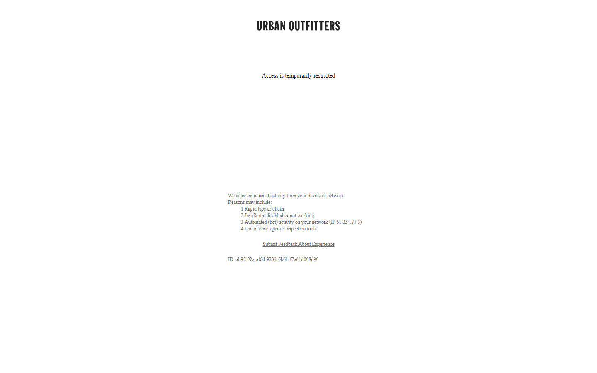

**페이지 메타 정보**

| page | title | description |
|---|---|---|
| [`new_women`](https://www.urbanoutfitters.com/womens-new-arrivals) | urbanoutfitters.com |  |

### 4.7 베트남 _( Vietnam )_

- 한국 수출규모 순위: **#4** · region: `asia` · tier `1` · currency `VND`
- 수집 사이트: **5개** (성공 5)
- 메모: 의류 생산기지/원단 수출 비중 큼. 빠르게 성장하는 이커머스
#### [Canifa](https://canifa.com/)

- URL: <https://canifa.com/>
- 페이지: **OK 1 · FAIL 0**

**대표 상품 이미지** (상위 6장, 출처 URL 포함)

-  — 출처 <https://2885371169.e.cdneverest.net/Simiconnector/BannerSlider/t/c/tce_topbanner_desktop-130526.webp>
-  — 출처 <https://2885371169.e.cdneverest.net/Simiconnector/BannerSlider/t/r/tramnghihe_topbanner_desktop-210526.webp>

**페이지 메타 정보**

| page | title | description |
|---|---|---|
| [`home`](https://canifa.com/) | CANIFA | Fashion For All | CANIFA - thương hiệu thời trang hàng đầu Việt Nam. Hàng ngàn mẫu quần áo phụ kiện nam, nữ, trẻ em cao cấp, chất lượng, an toàn liên tục được |

#### [IVY moda](https://ivymoda.com/)

- URL: <https://ivymoda.com/>
- 페이지: **OK 1 · FAIL 0**

**대표 상품 이미지** (상위 6장, 출처 URL 포함)

-  — 출처 <https://cotton4u.vn/files/news/2026/05/19/67ec568cf9a2322c79a4241e00f152e1.webp>
-  — 출처 <https://cotton4u.vn/files/news/2026/05/15/9b42a98f507089578805846b859322d8.webp>
- 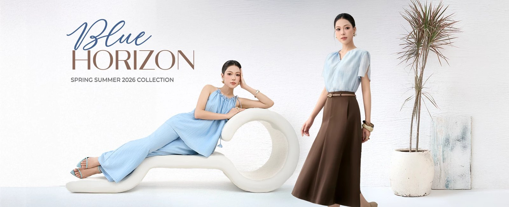 — 출처 <https://cotton4u.vn/files/news/2026/04/21/ee8c829766d8e7ad1f945e385f9d7514.webp>
-  — 출처 <https://cotton4u.vn/files/product/thumab/400/2026/04/24/e9d0c03e72943adeca848ff43377a777.webp>
-  — 출처 <https://cotton4u.vn/files/product/thumab/400/2026/05/15/cdf259456ed32efa026e979c3685ade5.webp>
-  — 출처 <https://cotton4u.vn/files/product/thumab/400/2026/04/24/f15809a1f6817d2de077bc16752f1e82.webp>

**페이지 메타 정보**

| page | title | description |
|---|---|---|
| [`home`](https://ivymoda.com/) | IVY moda - Thời Trang Công Sở Hiện Đại | IVY moda |  |

#### [Lazada Vietnam](https://www.lazada.vn/)

- URL: <https://www.lazada.vn/>
- 페이지: **OK 1 · FAIL 0**

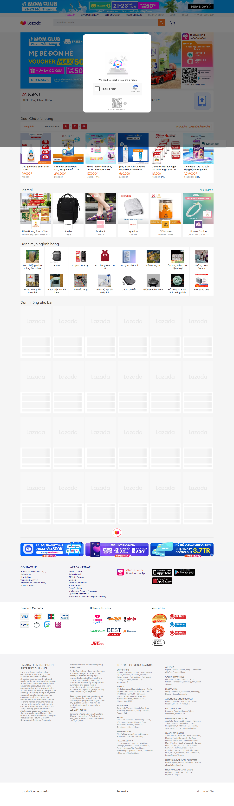

**대표 상품 이미지** (상위 6장, 출처 URL 포함)

-  — 출처 <https://img.lazcdn.com/us/domino/2ad4f22ce5a43dc145f221d13feed352.png>
-  — 출처 <https://img.lazcdn.com/g/tps/images/ims-web/TB1T7K2d8Cw3KVjSZFuXXcAOpXa.png>
-  — 출처 <https://img.lazcdn.com/us/domino/d9d5c1cf-471d-4a96-b5fe-559f9f8219ad_VN-1976-688.jpg_2200x2200q80.jpg>
-  — 출처 <https://img.lazcdn.com/us/domino/9447d642-a18b-4158-b321-d542249a8e53_VN-1976-688.jpg_2200x2200q80.jpg>
- 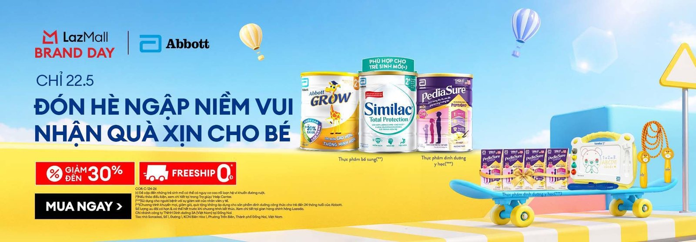 — 출처 <https://img.lazcdn.com/us/domino/3b991f0f-c0ae-4813-84b2-42757b35adbf_VN-1976-688.jpg_2200x2200q80.jpg>
- 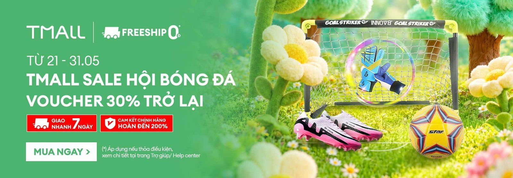 — 출처 <https://img.lazcdn.com/us/domino/12ae79de-6db3-43eb-adf3-07a2696f8c61_VN-1976-688.jpg_2200x2200q80.jpg>

**페이지 메타 정보**

| page | title | description |
|---|---|---|
| [`home`](https://www.lazada.vn/#?) | Lazada Việt Nam | Mua Sắm Online, Giá Tốt Nhất Mỗi Ngày | Mua sắm đồ điện tử, thời trang, làm đẹp và đồ chơi giá cả phải chăng. Đảm bảo sản phẩm chính hãng và trải nghiệm mua sắm tiện lợi – mua ngay |

#### [Shopee Vietnam](https://shopee.vn/)

- URL: <https://shopee.vn/>
- 페이지: **OK 1 · FAIL 0**

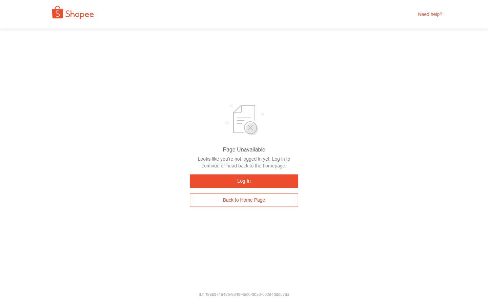

**페이지 메타 정보**

| page | title | description |
|---|---|---|
| [`home`](https://shopee.vn/verify/traffic/error?home_url=https%3A%2F%2Fshopee.vn&is_logged_in=false&next=https%3A%2F%2Fshopee.vn%2F&tracking_id=198b871a426-8848-4ac6-8b33-002e4ddd57a3&type=4) | Shopee Việt Nam | Hot Deals, Best Prices |  |

#### [Tiki](https://tiki.vn/)

- URL: <https://tiki.vn/>
- 페이지: **OK 1 · FAIL 0**

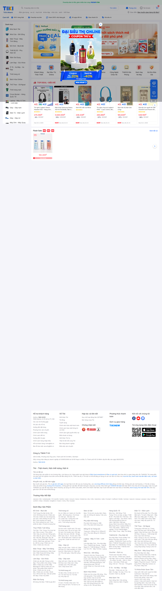

**대표 상품 이미지** (상위 6장, 출처 URL 포함)

-  — 출처 <https://salt.tikicdn.com/ts/tikimsp/55/55/23/7b924f07404558e64104284d0599cfa6.png>
-  — 출처 <https://salt.tikicdn.com/cache/100x100/ts/category/ed/20/60/afa9b3b474bf7ad70f10dd6443211d5f.png>
-  — 출처 <https://salt.tikicdn.com/cache/100x100/ts/category/f6/22/46/7e2185d2cf1bca72d5aeac385a865b2b.png>
-  — 출처 <https://salt.tikicdn.com/cache/100x100/ts/category/54/c0/ff/fe98a4afa2d3e5142dc8096addc4e40b.png>
-  — 출처 <https://salt.tikicdn.com/cache/100x100/ts/category/13/64/43/226301adcc7660ffcf44a61bb6df99b7.png>
-  — 출처 <https://salt.tikicdn.com/cache/100x100/ts/category/75/34/29/78e428fdd90408587181005f5cc3de32.png>

**페이지 메타 정보**

| page | title | description |
|---|---|---|
| [`home`](https://tiki.vn/) | Tiki - Mua hàng online giá tốt, hàng chuẩn, ship nhanh | Tiện lợi mua sắm hàng triệu mặt hàng, dịch vụ. Vô vàn ưu đãi freeship, mã giảm giá. Hoàn tiền 15% tối đa 600k/tháng với thẻ tín dụng TikiCAR |

## 5. 의류 카테고리별 글로벌 트렌드

| # | 카테고리 | 건수 | 대표 상품명 |
|---:|---|---:|---|
| 1 | `셔츠` | 15 | [29CM 단독][뉴뉴 PICK] 체크 시어서커 오버핏 셔츠 블루 MDSH019CHECKBLUE · [오제 PICK] 에센셜 레이어드 반팔 티셔츠 MDTS099_5 Colors · 테리 크롭 반팔 티셔츠 (3color) |
| 2 | `블라우스` | 12 | 폴린 코튼 핀턱 블라우스 / PAULINE COTTON PINTUCK BLOUSE_2colors · [3차 리오더]아리아 플라워 슬리브리스 블라우스 / ARIA FLOWER SLEEVELESS BLOUSE_2colors · 솔렌 모크넥 버튼업 블라우스 / SOLENE MOCK-NECK BUTTON UP BLOUSE_4colors |
| 3 | `자켓` | 6 | [4차 리오더][SET-UP]엠마 린넨 스트랩 자켓 / EMMA LINEN STRAP JACKET_3colors · 하나 노카라 트위드 자켓 / HANA NO COLLAR TWEED JACKET_2colors · 로린 썸머 오버핏 자켓_화이트 / LAURINE SUMMER OVERFIT JACKET_WHITE |
| 4 | `cardigan` | 5 | Pita Cardigan_Sage Green · Pita Cardigan_Natural Beige · Pita Cardigan_Cream |
| 5 | `팬츠` | 5 | 에센셜 스트링 코튼 팬츠 블랙 MDPT080BLACK · [3차 리오더][SET-UP]엠마 린넨 턱 쇼츠 팬츠 / EMMA LINEN TUCK SHORT PANTS_3colors · [여름청바지👖/3단기장/made] 시그니처 논페이드 데님 팬츠 |
| 6 | `니트` | 5 | 클로에 스퀘어 넥 슬리브리스 니트 / CHLOE SQUARE NECK SLEEVELESS KNIT_3colors · 루아 숄 니트 셋업  / LUA SHAWL KNIT SET UP_3colors · [워셔블] 레나 리브드 브이넥 슬리브리스 니트 / LENA RIBBED V-NECK SLEEVELESS KNIT_4colors |
| 7 | `가디건` | 4 | [단독]에디트 베이직 라운드 가디건 / EDITH BASIC ROUND CARDIGAN_5colors · [🌴여름가디건🏆매시즌베스트/FREE+L/사이즈선택/살안타템/살안템/하객룩][간절기/여름가디건][MADE]마렌라운드가디건 - 9color · [살안타가디건][여름가디건][단독] 데바 썸머 베이직 버튼(cd) |
| 8 | `스커트` | 4 | [🧊여름/MNQ] 디킨슨 레이스 밴딩 미디 스커트 · [30만장돌파/MADE]누벨 데일리 나일론 슬릿 롱 스커트 (S-L/장마룩/여름스커트/바스락스커트/데일리룩/출근룩/h라인스커트/나일론치마/롱치마) · [20%쿠폰][MADE] msk479 멜로디 코튼 캉캉 롱 스커트 |
| 9 | `shirt` | 3 | STRIPE BUTTON HALF SHIRT (IVORY) · Pleated Pendant Boat Neck Short Sleeve T-Shirt, BLACK · Pleated Pendant Boat Neck Short Sleeve T-Shirt, BROWN |
| 10 | `슬랙스` | 3 | [🏆역대급100만장/편안함최강] made. 마켓 와이드 트레이닝슬랙스 (+숏/베이직/롱ver) - 3 size · [✨구김걱정NO/💐하객룩추천] made. 세미부츠컷 찰랑슬랙스 (+베이직/롱ver) - 4 size · [🔥후기인증/🎖️1등슬랙스] made. 모먼트 투커버 올데이슬랙스 (+숏/베이직/롱ver) - 4 size |

**국가별 의류 TOP**

- **korea**: `셔츠`(15), `블라우스`(12), `자켓`(6), `cardigan`(5), `팬츠`(5)
## 6. 악세사리 카테고리별 글로벌 트렌드

| # | 카테고리 | 건수 | 대표 상품명 |
|---:|---|---:|---|
| 1 | `목걸이` | 2 | [29CM 단독] 바이크로스 그레이스 터쿼이즈 목걸이(White) BH7N65775WB600 · [29CM 단독] [925 silver] 바이그레인 실버 터쿼이즈 크로스 목걸이 (White) BH7N63708W9500 |
| 2 | `ring` | 1 | FRINGE CROCHET SCARF_ BLACK |
| 3 | `귀걸이` | 1 | [29CM 단독] [925 silver] 바이그레인 실버 터쿼이즈 포인트 귀걸이 (White) BH7E64722W9XXX |

**국가별 악세사리 TOP**

- **korea**: `목걸이`(2), `ring`(1), `귀걸이`(1)
## 7. 국가별 가격대 비교

| 국가 | 통화 | 표본 | min | p25 | median | p75 | max | median (USD) |
|---|---|---:|---:|---:|---:|---:|---:|---:|
| korea | KRW | 106 | 12370 | 26525 | 45995 | 80346 | 649000 | 30.63 |

> p25/p75 는 IQR 기준 분위수. USD 환산은 `config/exchange_rates.yaml` 기준 (운영자가 정기 갱신).

## 8. 국내 의류·악세사리 사업동향

### KITA K-stat

- KITA K-stat
- 사이트: <https://stat.kita.net/jsp/wait_default_T.jsp?host=stat.kita.net&ip=61.254.87.5&port=80&pageUrl=/stat/kts/ctr/CtrTotalImpExpList.screen&loginId=61.254.87.5_T_882897_WC>

### Korea Customs Service

- 수출입 현황, 물류통계 등 관세청 무역통계정보를 종합적으로 제공
- 사이트: <https://tradedata.go.kr/cts/index_eng.do>

| # | topic | title | url |
|---:|---|---|---|
| 1 | `trade` | Korea Customs Service | <http://customs.go.kr/english/main.do> |

### KOSIS

- 코시스, 국가데이터처가 제공하는 원스톱 통계 서비스, 국가승인통계, 국제통계, 북한통계, e-지방지표, 통계시각화콘텐츠, 온라인간행물 등 제공
- 사이트: <https://kosis.kr/statisticsList/statisticsListIndex.do;jsessionid=yHcqB9j4QIurcXoo4tb7-xhUjQ_SInpdeZr-wiYf.esvwas2_S21?parmTabId=M_01_01&vwcd=MT_ZTITLE&menuId=M_01_01&outLink=Y&entrType=>

| # | topic | title | url |
|---:|---|---|---|
| 1 | `statistics` | 쉽게 보는 통계 | <http://kosis.kr/easyViewStatis/customStatisIndex.do?vwcd=MT_TM1_TITLE&menuId=M_03_01> |
| 2 | `statistics` | 이슈별 접근 | <http://kosis.kr/easyViewStatis/customStatisIndex.do?vwcd=MT_TM2_TITLE&menuId=M_03_02> |
| 3 | `statistics` | 통계시각화콘텐츠 | <http://kosis.kr/easyViewStatis/visualizationIndex.do> |
| 4 | `statistics` | 온라인간행물 | <http://kosis.kr/publication/publicationThema.do> |
| 5 | `statistics` | 기획간행물 | <http://kosis.kr/publication/publicationStat.do> |
| 6 | `statistics` | KOSIS 길라잡이 | <http://kosis.kr/civilComplaint/kosisGuideIndex.do> |
| 7 | `statistics` | 홈페이지 개선의견 | <http://kosis.kr/civilComplaint/siteRequestList.do> |
| 8 | `statistics` | 찾아가는 KOSIS | <http://kosis.kr/civilComplaint/kosisEduIndex.do> |
| 9 | `statistics` | 서비스 소개 | <http://kosis.kr/serviceInfo/kosisIntroduce.do> |
| 10 | `statistics` | 국가통계현황 | <http://kosis.kr/serviceInfo/statisInstitution.do> |
| 11 | `statistics` | 국가통계 공표일정 | <http://kosis.kr/serviceInfo/statisPublicationList.do> |
| 12 | `statistics` | 팩트체크 서비스 | <http://kosis.kr/serviceInfo/factCheckList.do> |
| 13 | `statistics` | 서비스정책 | <http://kosis.kr/serviceInfo/useGuide.do> |
| 14 | `statistics` | 공유서비스 (OpenAPI) | <http://kosis.kr/serviceInfo/openAPIGuide.do> |
| 15 | `statistics` | English | <https://kosis.kr/eng> |

### KOTRA

- 코트라, KOTRA, 대한무역투자진흥공사, 트라이빅, TriBIG, 무역투자통계, 국가별 시장정보, 품목별 유망시장, 기업별 맞춤정보, 해외바이어 정보
- 사이트: <https://www.kotra.or.kr/bigdata/visualization/korea#search/ALL/ALL/2024>

| # | topic | title | url |
|---:|---|---|---|
| 1 | `trade` | kotra 무역투자24 | <https://www.kotra.or.kr/bigdata/kotraSsoRedirect?targetURL=https://www.kotra.or.kr> |
| 2 | `trade` | 해외비즈니스 정보 포털 | <https://www.kotra.or.kr/bigdata/kotraSsoRedirect?targetURL=https://dream.kotra.or.kr/dream> |
| 3 | `trade` | 글로벌 전시포털 | <https://www.kotra.or.kr/bigdata/kotraSsoRedirect?targetURL=https://www.gep.or.kr/> |
| 4 | `trade` | KOTRA 해외인재유치센터 | <https://www.kotra.or.kr/gtc_kor> |
| 5 | `trade` | 투자유치정보제공 | <https://www.kotra.or.kr/bigdata/kotraSsoRedirect?targetURL=https://www.investkorea.org/> |
| 6 | `수출지원` | 수출지원 온라인 플랫폼 | <https://www.kotra.or.kr/bigdata/kotraSsoRedirect?targetURL=https://www.buykorea.or.kr/> |
| 7 | `trade` | 빅데이터 서비스 | <https://www.kotra.or.kr/bigdata/> |
| 8 | `trade` | 경제외교 활용포털 | <https://www.kotra.or.kr/bigdata/kotraSsoRedirect?targetURL=https://president.globalwindow.org> |
| 9 | `trade` | 방산물자교역지원센터 | <https://www.kotra.or.kr/bigdata/kotraSsoRedirect?targetURL=https://www.kotra.or.kr/kodits> |
| 10 | `trade` | 외투기업고충처리 | <https://www.kotra.or.kr/bigdata/kotraSsoRedirect?targetURL=https://ombudsman.kotra.or.kr/ob-kr> |
| 11 | `trade` | 수출바우처 · 지사화 | <https://www.exportvoucher.com> |
| 12 | `trade` | 무역투자통계 | <https://www.kotra.or.kr/bigdata/visualization/korea> |
| 13 | `trade` | 국가별 시장정보 | <https://www.kotra.or.kr/bigdata/marketAnalysis> |
| 14 | `trade` | 품목별 유망시장 | <https://www.kotra.or.kr/bigdata/bhrcMarket> |
| 15 | `trade` | 해외바이어 정보 | <https://www.kotra.or.kr/bigdata/partner/search> |

### Statistics Korea Online Shopping

- 국가데이터처,List | 전체 | 보도자료 | 새소식
- 사이트: <https://mods.go.kr/board.es?mid=a10301010000&bid=11789>

| # | topic | title | url |
|---:|---|---|---|
| 1 | `statistics` | 정보공개제도 | <https://mods.go.kr/menu.es?mid=a10101010100> |
| 2 | `statistics` | 정보공개청구 | <https://www.open.go.kr/com/main/mainView.do> |
| 3 | `statistics` | 비공개대상정보세부기준 | <https://mods.go.kr/menu.es?mid=a10101030000> |
| 4 | `statistics` | 고객수요분석 | <https://mods.go.kr/menu.es?mid=a10101040000> |
| 5 | `statistics` | 사전정보공표 | <https://mods.go.kr/menu.es?mid=a10103010000> |
| 6 | `statistics` | 사전정보공표목록 | <https://mods.go.kr/menu.es?mid=a10103010100> |
| 7 | `statistics` | 핵심단어목록 | <https://mods.go.kr/menu.es?mid=a10103020100> |
| 8 | `statistics` | 인기정보TOP10 | <https://mods.go.kr/menu.es?mid=a10103030100> |
| 9 | `statistics` | 행정자료실 | <https://mods.go.kr/menu.es?mid=a10104010000> |
| 10 | `statistics` | 업무추진비 | <https://mods.go.kr/menu.es?mid=a10104010100> |
| 11 | `statistics` | 국회관련정보 | <https://mods.go.kr/menu.es?mid=a10104040000> |
| 12 | `statistics` | 정책실명제 | <https://mods.go.kr/menu.es?mid=a10105010000> |
| 13 | `statistics` | 연도별대상사업현황 | <https://mods.go.kr/menu.es?mid=a10105020000> |
| 14 | `statistics` | 중점관리대상사업 | <https://mods.go.kr/menu.es?mid=a10105030600> |
| 15 | `statistics` | 국민신청실명제 | <https://mods.go.kr/menu.es?mid=a10105040000> |

### 기업마당

- 기업마당>정책정보>지원사업 공고
- 사이트: <https://www.bizinfo.go.kr/sii/siia/selectSIIA200View.do?null>

| # | topic | title | url |
|---:|---|---|---|
| 1 | `policy` | 지원사업 공고 | <https://www.bizinfo.go.kr/sii/siia/selectSIIA200View.do> |
| 2 | `policy` | 품목별 법정의무 인증제도 | <https://www.bizinfo.go.kr/biz/biza/selectBIZA100View.do> |
| 3 | `policy` | 입법·행정예고/고시 | <https://www.bizinfo.go.kr/biz/biza/selectBIZA300View.do> |
| 4 | `policy` | 월간 중기누리 | <https://www.bizinfo.go.kr/biz/biza/selectBIZA400View.do> |
| 5 | `policy` | 기업업무용 서식 | <https://www.bizinfo.go.kr/biz/bizb/selectBIZB100View.do> |
| 6 | `policy` | 입주기업 모집공고 | <https://www.bizinfo.go.kr/biz/bizb/selectBIZB200View.do> |
| 7 | `policy` | 온라인화상회의실 | <https://www.k-startup.go.kr/web/contents/webOLNIVIDEOMTRM.do> |
| 8 | `policy` | 정책정보 개방 | <https://www.bizinfo.go.kr/apiList.do> |
| 9 | `policy` | 속보성 대시보드 | <https://www.bizinfo.go.kr/dashboard.do> |
| 10 | `policy` | 고객의 소리 | <https://www.bizinfo.go.kr/biz/bizc/selectBIZC200Regist.do> |
| 11 | `policy` | 자주하는질문 | <https://www.bizinfo.go.kr/biz/bizc/selectBIZC300View.do> |
| 12 | `policy` | 이메일주소 무단 수집 거부안내 | <https://www.bizinfo.go.kr/biz/bizd/selectBIZD110View.do> |
| 13 | `policy` | 저작권 정책 | <https://www.bizinfo.go.kr/biz/bizd/selectBIZD120View.do> |
| 14 | `policy` | 웹접근성 정책 | <https://www.bizinfo.go.kr/biz/bizd/selectBIZD130View.do> |
| 15 | `policy` | 전체메뉴보기 | <https://www.bizinfo.go.kr/sitemap/intro.do> |

### 서울경제진흥원

- 서울경제진흥원 에러페이지
- 사이트: <https://www.sba.seoul.kr/Pages/error_404.html?aspxerrorpath=/Pages/NSub06_01.aspx>

### 소상공인24

- 소상공인24
- 사이트: <https://www.sbiz24.kr/#/pbanc>

### 중소벤처기업부

- 중소기업중앙회 등 기관 중소기업 조사, 통계 DB화 검색, 내려받기 등 제공.
- 사이트: <https://www.mss.go.kr/site/smba/ex/bbs/List.do?cbIdx=86>

| # | topic | title | url |
|---:|---|---|---|
| 1 | `policy` | 어린이 누리집 | <https://www.mss.go.kr/site/kids/main.do> |
| 2 | `policy` | English | <https://www.mss.go.kr/site/eng/main.do> |
| 3 | `policy` | 누리집 안내지도 | <https://www.mss.go.kr/site/smba/ex/siteMap/siteMap.do> |
| 4 | `policy` | 훈령/예규/고시/공고 | <https://www.mss.go.kr/site/smba/ex/bbs/List.do?cbIdx=125&ext6=Y> |
| 5 | `policy` | 입법/행정예고 | <https://www.mss.go.kr/site/smba/ex/bbs/List.do?cbIdx=126&searchRltnYn=Y> |
| 6 | `policy` | 인사·채용 | <https://www.mss.go.kr/site/smba/ex/bbs/List.do?cbIdx=82> |
| 7 | `policy` | 보도설명자료 | <https://www.mss.go.kr/site/smba/ex/bbs/List.do?cbIdx=87> |
| 8 | `policy` | 현장속으로 | <https://www.mss.go.kr/site/smba/brdcststnVod/brdcststnVodList.do?ctgr_code=C01> |
| 9 | `policy` | 중기부소식지 | <https://www.mss.go.kr/site/smba/ex/bbs/List.do?cbIdx=95> |
| 10 | `policy` | 통계발표자료 | <https://www.mss.go.kr/site/smba/foffice/ex/statDB/ptScheduleList.do> |
| 11 | `policy` | 주제별 통계 | <https://www.mss.go.kr/site/smba/foffice/ex/statDB/temaList.do?tabCd=0001> |
| 12 | `policy` | 조사별 통계 | <https://www.mss.go.kr/site/smba/foffice/ex/statDB/surveyList.do?tabCd=0001> |
| 13 | `policy` | 조사보고서 | <https://www.mss.go.kr/site/smba/foffice/ex/statDB/stReportRoList.do?gb=1&nodeId=&roCode=> |
| 14 | `policy` | 주제별 조회 | <https://www.mss.go.kr/site/smba/foffice/ex/statDB/stReportRcList.do?gb=2&nodeId=&rcCode=> |
| 15 | `policy` | 중소기업위상 | <https://www.mss.go.kr/site/smba/foffice/ex/statDB/MainSubStat.do?scd=0001> |

## 9. 한국 사업자 관점 기회 국가 TOP 10

| # | 국가 | tier | region | 점수 | 근거 |
|---:|---|---:|---|---:|---|
| 1 | 태국 _( Thailand )_ | 1 | `asia` | **151.5** | tier1 기본점(90); 아시아 권역(+20); ASEAN 시장(+10); K-패션/콘텐츠 친화 시장(+20); 트렌드 신호 밀도 12 |
| 2 | 대만 _( Taiwan )_ | 1 | `asia` | **136.5** | tier1 기본점(90); 아시아 권역(+20); K-패션/콘텐츠 친화 시장(+20); 트렌드 신호 밀도 6 |
| 3 | 일본 _( Japan )_ | 1 | `asia` | **130.0** | tier1 기본점(90); 아시아 권역(+20); K-패션/콘텐츠 친화 시장(+20) |
| 4 | 베트남 _( Vietnam )_ | 1 | `asia` | **125.0** | tier1 기본점(90); 아시아 권역(+20); ASEAN 시장(+10); 트렌드 신호 밀도 5 |
| 5 | 인도네시아 _( Indonesia )_ | 1 | `asia` | **122.5** | tier1 기본점(90); 아시아 권역(+20); ASEAN 시장(+10); 트렌드 신호 밀도 2 |
| 6 | 필리핀 _( Philippines )_ | 2 | `asia` | **110.0** | tier2 기본점(60); 아시아 권역(+20); ASEAN 시장(+10); K-패션/콘텐츠 친화 시장(+20) |
| 7 | 미국 _( United States )_ | 1 | `north_america` | **109.5** | tier1 기본점(90); 트렌드 신호 밀도 20 |
| 8 | 말레이시아 _( Malaysia )_ | 2 | `asia` | **90.0** | tier2 기본점(60); 아시아 권역(+20); ASEAN 시장(+10) |
| 9 | 싱가포르 _( Singapore )_ | 2 | `asia` | **90.0** | tier2 기본점(60); 아시아 권역(+20); ASEAN 시장(+10) |
| 10 | 홍콩 _( Hong Kong )_ | 2 | `asia` | **80.0** | tier2 기본점(60); 아시아 권역(+20) |

## 10. 실행 제안

### **1위 태국** (점수 152, tier1 · asia)

- 현지 스타일 TOP: `wide` — 시즌 컬렉션 기획 시 우선 반영.
- 현지 컬러 TOP: `red` — 시즌 컬렉션 기획 시 우선 반영.
- 현지 소재 TOP: `denim`, `knit` — 시즌 컬렉션 기획 시 우선 반영.
- 현지 카테고리 TOP: `accessories`, `jacket`, `dress` — 시즌 컬렉션 기획 시 우선 반영.
- K-패션 친화도가 명시된 시장이므로 K-브랜드 아이덴티티 및 한류 셀럽 협업을 강조.
- ASEAN 권역 시장 — 물류/관세(FTA) 활용 + 동남아 통합 마케팅 검토 권장.
- tier1 핵심 시장 — 현지 마켓플레이스(예: 해당 국가의 대표 패션 플랫폼) 공식 입점 + 셀러 운영 채널 확보 우선.
- 연계 가능한 국내 수출/지원 사업이 식별되지 않음 — `domestic_sources.yaml` 의 `landing_url` 을 KOTRA 사업 공고/기업마당 수출바우처로 직접 지정 권장.

### **2위 대만** (점수 136, tier1 · asia)

- 현지 컬러 TOP: `pink`, `red` — 시즌 컬렉션 기획 시 우선 반영.
- 현지 소재 TOP: `lace` — 시즌 컬렉션 기획 시 우선 반영.
- K-패션 친화도가 명시된 시장이므로 K-브랜드 아이덴티티 및 한류 셀럽 협업을 강조.
- 아시아 권역 시장 — 시차/언어 친화 + 한국 본사 직배송 모델 검토.
- tier1 핵심 시장 — 현지 마켓플레이스(예: 해당 국가의 대표 패션 플랫폼) 공식 입점 + 셀러 운영 채널 확보 우선.
- 연계 가능한 국내 수출/지원 사업이 식별되지 않음 — `domestic_sources.yaml` 의 `landing_url` 을 KOTRA 사업 공고/기업마당 수출바우처로 직접 지정 권장.

### **3위 일본** (점수 130, tier1 · asia)

- K-패션 친화도가 명시된 시장이므로 K-브랜드 아이덴티티 및 한류 셀럽 협업을 강조.
- 아시아 권역 시장 — 시차/언어 친화 + 한국 본사 직배송 모델 검토.
- tier1 핵심 시장 — 현지 마켓플레이스(예: 해당 국가의 대표 패션 플랫폼) 공식 입점 + 셀러 운영 채널 확보 우선.
- 연계 가능한 국내 수출/지원 사업이 식별되지 않음 — `domestic_sources.yaml` 의 `landing_url` 을 KOTRA 사업 공고/기업마당 수출바우처로 직접 지정 권장.

### 운영 점검 노트

- **ASEAN 다중 진출 기회**: TOP10 중 ASEAN 국가가 3개 이상. Shopee/Lazada/Zalora 통합 운영을 통한 동남아 멀티마켓 전략을 검토 권장.

## 11. 수집 실패/주의 사이트

| 국가 | 사이트 | 페이지 | 상태 | 사유 |
|---|---|---|---|---|
| usa | Nordstrom | new | failed | playwright_error: TimeoutError: Page.screenshot: Timeout 30000ms exceeded.
Call log:
  - taking page screenshot
  - waiting for fonts to load...
  - fonts loaded
 |
| usa | Revolve | new | failed | playwright_error: Error: Page.goto: net::ERR_HTTP2_PROTOCOL_ERROR at https://www.revolve.com/new/br/c79f88/
Call log:
  - navigating to "https://www.revolve.com/new/br/c79f88/", waiting until "domcontentloaded"
 |
| usa | Revolve | trending | failed | playwright_error: Error: Page.goto: net::ERR_HTTP2_PROTOCOL_ERROR at https://www.revolve.com/most-loved/br/4a9ca5/
Call log:
  - navigating to "https://www.revolve.com/most-loved/br/4a9ca5/", waiting until "domcontentloaded"
 |
| japan | ZOZOTOWN | new | failed | playwright_error: TimeoutError: Page.goto: Timeout 30000ms exceeded.
Call log:
  - navigating to "https://zozo.jp/category/new/", waiting until "domcontentloaded"
 |
| japan | ZOZOTOWN | ranking | failed | playwright_error: TimeoutError: Page.goto: Timeout 30000ms exceeded.
Call log:
  - navigating to "https://zozo.jp/ranking/", waiting until "domcontentloaded"
 |
| japan | Rakuten Fashion | women | failed | http_status_404 |
| indonesia | Tokopedia | home | failed | playwright_error: Error: Page.goto: net::ERR_HTTP2_PROTOCOL_ERROR at https://www.tokopedia.com/
Call log:
  - navigating to "https://www.tokopedia.com/", waiting until "domcontentloaded"
 |
| indonesia | Berrybenka | home | failed | http_error: ConnectError: [Errno 11001] getaddrinfo failed |
| taiwan | PChome | home | failed | http_status_429 |
| korea | Musinsa | home | failed | robots_disallowed |

## 12. 원문 출처 및 이미지 출처

### 인도네시아

- **Berrybenka** — <https://www.berrybenka.com/>
- **Hijup** — <https://www.hijup.com/>
- **Shopee Indonesia** — <https://shopee.co.id/>
- **Tokopedia** — <https://www.tokopedia.com/>
- **Zalora Indonesia** — <https://www.zalora.co.id/>
  - 이미지 출처: <https://static-id.zacdn.com/next-assets/static-assets/images/logo/icon_mastercard.png>
  - 이미지 출처: <https://static-id.zacdn.com/next-assets/static-assets/images/logo/icon_visa.png>
  - 이미지 출처: <https://static-id.zacdn.com/next-assets/static-assets/images/logo/icon_ovo.png>

### 일본

- **GU Japan** — <https://www.gu-global.com/jp/>
  - 이미지 출처: <https://image.uniqlo.com/GU/ST3/jp/imagesother/Navigation/WOMEN_Category/2026/260513/Category_w_Half-Tshirt.png>
  - 이미지 출처: <https://image.uniqlo.com/GU/ST3/jp/imagesother/Navigation/WOMEN_Category/2026/260515/Category_w_Tshirt.png>
  - 이미지 출처: <https://image.uniqlo.com/GU/ST3/jp/imagesother/Navigation/WOMEN_Category/2026/260513/Category_w_Shirt-Blouse.png>
  - 이미지 출처: <https://image.uniqlo.com/GU/ST3/jp/imagesother/Navigation/WOMEN_Category/2026/260513/Category_w_Knit-Cardigan.png>
  - 이미지 출처: <https://image.uniqlo.com/GU/ST3/jp/imagesother/Navigation/WOMEN_Category/2026/260513/Category_w_onepeace.png>
  - 이미지 출처: <https://image.uniqlo.com/GU/ST3/jp/imagesother/Navigation/WOMEN_Category/2026/260513/Category_w_Sweat.png>
  - 이미지 출처: <https://image.uniqlo.com/GU/ST3/jp/imagesother/Navigation/WOMEN_Category/2026/260513/Category_w_Outer.png>
  - 이미지 출처: <https://image.uniqlo.com/GU/ST3/jp/imagesother/Navigation/WOMEN_Category/2026/260513/Category_w_Pants.png>
  - 이미지 출처: <https://image.uniqlo.com/GU/ST3/jp/imagesother/Navigation/WOMEN_Category/2026/260513/Category_w_Skirt.png>
  - 이미지 출처: <https://image.uniqlo.com/GU/ST3/jp/imagesother/Navigation/WOMEN_Category/2026/260518/Category_w_Short-Pants.png>
  - 이미지 출처: <https://image.uniqlo.com/GU/ST3/jp/imagesother/Navigation/WOMEN_Category/2026/260513/Category_w_RoomWear.png>
  - 이미지 출처: <https://image.uniqlo.com/GU/ST3/jp/imagesother/Navigation/WOMEN_Category/2026/260513/Category_w_inner.png>
  - 이미지 출처: <https://image.uniqlo.com/GU/ST3/jp/imagesother/Navigation/WOMEN_Category/2026/260513/Category_w_DRY-inner.png>
  - 이미지 출처: <https://image.uniqlo.com/GU/ST3/jp/imagesother/Navigation/WOMEN_Category/2026/260513/Category_w_shoes.png>
- **Rakuten Fashion** — <https://brandavenue.rakuten.co.jp/>
  - 이미지 출처: <https://brandavenue.r10s.jp/img/library/index/sbn_flagshipstore_20231003.png>
  - 이미지 출처: <https://brandavenue.r10s.jp/img/news/01/374083/pc_n.jpg>
  - 이미지 출처: <https://brandavenue.r10s.jp/img/news/01/374827/pc_n.jpg>
  - 이미지 출처: <https://brandavenue.r10s.jp/img/news/01/374429/pc_n.jpg>
  - 이미지 출처: <https://brandavenue.r10s.jp/img/news/01/374434/pc_n.jpg>
  - 이미지 출처: <https://brandavenue.r10s.jp/img/news/01/374438/pc_n.jpg>
  - 이미지 출처: <https://brandavenue.r10s.jp/img/news/01/374439/pc_n.jpg>
  - 이미지 출처: <https://brandavenue.r10s.jp/img/news/01/374441/pc_n.jpg>
  - 이미지 출처: <https://brandavenue.r10s.jp/img/news/01/374433/pc_n.jpg>
  - 이미지 출처: <https://brandavenue.r10s.jp/img/news/01/374834/pc_n.jpg>
  - 이미지 출처: <https://brandavenue.r10s.jp/img/news/01/374818/pc_n.jpg>
  - 이미지 출처: <https://brandavenue.r10s.jp/img/news/01/374820/pc_n.jpg>
  - 이미지 출처: <https://brandavenue.r10s.jp/img/news/01/374822/pc_n.jpg>
  - 이미지 출처: <https://brandavenue.r10s.jp/img/news/01/374720/pc_n.jpg>
  - 이미지 출처: <https://brandavenue.r10s.jp/img/news/01/374276/pc_n.jpg>
  - 이미지 출처: <https://brandavenue.r10s.jp/img/news/01/374713/pc_n.jpg>
  - 이미지 출처: <https://brandavenue.r10s.jp/img/news/01/374591/pc_n.jpg>
  - 이미지 출처: <https://brandavenue.r10s.jp/img/news/01/374730/pc_n.jpg>
- **Uniqlo Japan** — <https://www.uniqlo.com/jp/>
- **WEAR** — <https://wear.jp/>
  - 이미지 출처: <https://wear.jp/public/_next/static/media/notfound_bg.0mfqf_sjjg4.q.png>
  - 이미지 출처: <https://wear.jp/public/_next/static/media/notfound_4.0h3~tstn7vy~q.png>
  - 이미지 출처: <https://wear.jp/public/_next/static/media/notfound_0.17sfauikqe-ig.png>
  - 이미지 출처: <https://images.wear2.jp/coordinate/Paiwa2lZ/WU6LTajA/1778285263_276.jpg>
  - 이미지 출처: <https://images.wear2.jp/coordinate/7biZW4D/dDlSk5gk/1779330057_276.jpg>
  - 이미지 출처: <https://images.wear2.jp/coordinate/kAiO3P8/1jkEAmUI/1779367344_276.jpg>
  - 이미지 출처: <https://images.wear2.jp/coordinate/5EiWpMDP/RoPObKWK/1779351552_276.jpg>
  - 이미지 출처: <https://images.wear2.jp/coordinate/7binyqO8/6n6gyO5V/1779352539_276.jpg>
  - 이미지 출처: <https://images.wear2.jp/coordinate/ekiqgwAP/jlpEZmFm/1778135506_276.jpg>
  - 이미지 출처: <https://images.wear2.jp/profile/6gio2xl5/hpSX0raH/1715229637_120.jpg>
  - 이미지 출처: <https://images.wear2.jp/profile/Z8iaZlkD/FcuxbiuY/1730267967_120.jpg>
  - 이미지 출처: <https://images.wear2.jp/profile/YMipbRlq/WKDHgaWC/1772154105_120.jpg>
  - 이미지 출처: <https://images.wear2.jp/profile/oJilz2gb/nzOB74X7/1646729132_120.jpg>
  - 이미지 출처: <https://images.wear2.jp/profile/leikWnG/c13Q7vcl/1641973100_120.jpg>
  - 이미지 출처: <https://images.wear2.jp/profile/qrir3Qg/yhymAz3d/1772908220_120.jpg>
  - 이미지 출처: <https://cdn.wimg.jp/profile/58l0yz/20210611222407027_120.jpg>
  - 이미지 출처: <https://images.wear2.jp/profile/6ginq68V/NRgMxEW6/1772581058_120.jpg>
  - 이미지 출처: <https://cdn.wimg.jp/profile/vjx42a/20210325102818212_120.jpg>
  - 이미지 출처: <https://wear.jp/public/_next/static/media/mock.0i-zctnzuboij.webp>
  - 이미지 출처: <https://wear.jp/public/_next/static/media/icon_ios.0~ker89fyl9ww.webp>
- **ZOZOTOWN** — <https://zozo.jp/>

### 한국

- **29CM** — <https://www.29cm.co.kr/>
  - 이미지 출처: <https://img.29cm.co.kr/cms/202605/11f153f620c77a258e7ddb40e8b9806c.png?width=3840&format=webp>
  - 이미지 출처: <https://img.29cm.co.kr/cms/202605/11f153f60eb3a3898e7dbb4c98d437a6.png?width=3840&format=webp>
  - 이미지 출처: <https://img.29cm.co.kr/cms/202605/11f153f5ffca7ffa83a4132564c4850c.png?width=3840&format=webp>
  - 이미지 출처: <https://img.29cm.co.kr/cms/202605/11f153f5f579d0538e7dcf9141d2a136.png?width=3840&format=webp>
  - 이미지 출처: <https://img.29cm.co.kr/cms/202605/11f153f5eb70b0f58e7d97401cf6c991.png?width=3840&format=webp>
  - 이미지 출처: <https://img.29cm.co.kr/cms/202605/11f153f5e22cb65f8e7d6372c70937a1.png?width=3840&format=webp>
  - 이미지 출처: <https://img.29cm.co.kr/cms/202605/11f153f5d9d8e8298e7d635feb4127d0.png?width=3840&format=webp>
  - 이미지 출처: <https://img.29cm.co.kr/cms/202605/11f153f5ccd9ba458e7dc563b86aa781.png?width=3840&format=webp>
  - 이미지 출처: <https://img.29cm.co.kr/cms/202605/11f15358765427c78e7d410c7a01d82b.jpg?width=3840&format=webp>
  - 이미지 출처: <https://img.29cm.co.kr/cms/202605/11f153586d7e584b8e7d7fdd4166c0f4.jpg?width=3840&format=webp>
  - 이미지 출처: <https://img.29cm.co.kr/cms/202605/11f1527f5ec0e53883a403c1398f73c8.jpg?width=3840&format=webp>
  - 이미지 출처: <https://img.29cm.co.kr/cms/202605/11f1527f1a96ca558e7d175dd8d64e30.jpg?width=3840&format=webp>
  - 이미지 출처: <https://img.29cm.co.kr/cms/202605/11f1527f0c1039138e7d35c0fd198ae5.jpg?width=3840&format=webp>
  - 이미지 출처: <https://img.29cm.co.kr/cms/202605/11f1501f7e9888f683a46725a9ec24e7.png?width=3840&format=webp>
  - 이미지 출처: <https://img.29cm.co.kr/cms/202605/11f1501f77a13d8283a437794d78bcae.png?width=3840&format=webp>
  - 이미지 출처: <https://img.29cm.co.kr/cms/202605/11f1501f6fd5b2b78e7ddde4a38d16b3.png?width=3840&format=webp>
  - 이미지 출처: <https://img.29cm.co.kr/cms/202605/11f1501f60eb7dc38e7d359131cdbf02.png?width=3840&format=webp>
  - 이미지 출처: <https://img.29cm.co.kr/cms/202605/11f14f59246d91aa83a43fe78b9c14f0.jpg?width=3840&format=webp>
  - 이미지 출처: <https://img.29cm.co.kr/cms/202605/11f14f58fccf5b4683a4dd35be43c951.jpg?width=3840&format=webp>
- **Musinsa** — <https://www.musinsa.com/>
- **W Concept** — <https://www.wconcept.co.kr/>
- **Zigzag** — <https://zigzag.kr/>
  - 이미지 출처: <https://cf.image-farm.s.zigzag.kr/original/cms/2026/05/18/202605180047380868_072611.png?quality=80&format=webp&transparent=true&width=1029&height=1188>
  - 이미지 출처: <https://cf.image-farm.s.zigzag.kr/original/cms/2026/05/17/202605171153369298_096013.jpg?width=1029&height=1188&quality=80&format=webp&transparent=true>
  - 이미지 출처: <https://cf.image-farm.s.zigzag.kr/original/cms/2026/05/18/202605180233541008_024577.jpg?width=1029&height=1188&quality=80&format=webp&transparent=true>
  - 이미지 출처: <https://cf.image-farm.s.zigzag.kr/original/cms/2026/05/21/202605210547258118_020689.jpg?width=1029&height=1188&quality=80&format=webp&transparent=true>
  - 이미지 출처: <https://cf.image-farm.s.zigzag.kr/original/cms/2026/05/10/202605100430019500_090039.png?quality=80&format=webp&transparent=true&width=1029&height=1188>
  - 이미지 출처: <https://cf.image-farm.s.zigzag.kr/original/cms/2026/05/13/202605130306302034_062251.png?quality=80&format=webp&transparent=true&width=1029&height=1188>
  - 이미지 출처: <https://cf.image-farm.s.zigzag.kr/original/cms/2026/05/13/202605130732557091_018738.png?quality=80&format=webp&transparent=true&width=1029&height=1188>
  - 이미지 출처: <https://cf.image-farm.s.zigzag.kr/original/cms/2026/05/13/202605130219374340_057623.png?quality=80&format=webp&transparent=true&width=1029&height=1188>
  - 이미지 출처: <https://cf.image-farm.s.zigzag.kr/original/cms/2026/05/13/202605131102300858_012284.png?quality=80&format=webp&transparent=true&width=1029&height=1188>
  - 이미지 출처: <https://cf.image-farm.s.zigzag.kr/original/cms/2026/05/14/202605140054481173_034623.png?quality=80&format=webp&transparent=true&width=1029&height=1188>
  - 이미지 출처: <https://cf.image-farm.s.zigzag.kr/original/cms/2026/05/14/202605140707398808_092708.png?quality=80&format=webp&transparent=true&width=1029&height=1188>
  - 이미지 출처: <https://cf.image-farm.s.zigzag.kr/original/cms/2026/05/15/202605150103414802_037413.png?quality=80&format=webp&transparent=true&width=1029&height=1188>
  - 이미지 출처: <https://cf.image-farm.s.zigzag.kr/original/cms/2026/05/15/202605150119309083_014607.png?quality=80&format=webp&transparent=true&width=1029&height=1188>
  - 이미지 출처: <https://cf.image-farm.s.zigzag.kr/original/cms/2026/05/13/202605131038139851_020607.png?quality=80&format=webp&transparent=true&width=1029&height=1188>
  - 이미지 출처: <https://cf.image-farm.s.zigzag.kr/original/cms/2026/05/15/202605150331051406_066230.png?quality=80&format=webp&transparent=true&width=1029&height=1188>
  - 이미지 출처: <https://cf.image-farm.s.zigzag.kr/original/cms/2026/05/15/202605150404511524_045008.png?quality=80&format=webp&transparent=true&width=1029&height=1188>
  - 이미지 출처: <https://cf.image-farm.s.zigzag.kr/original/cms/2026/05/15/202605150409137738_032961.png?quality=80&format=webp&transparent=true&width=1029&height=1188>
  - 이미지 출처: <https://cf.image-farm.s.zigzag.kr/original/cms/2026/05/15/202605150611116957_071494.png?width=1029&height=1188&quality=80&format=webp&transparent=true>

### 대만

- **momo** — <https://www.momoshop.com.tw/>
  - 이미지 출처: <https://img2.momoshop.com.tw/ecm/img/online/10/998/00/000/bt_0_271_01/bt_0_271_01_e2.jpg?t=1777893650110>
  - 이미지 출처: <https://img4.momoshop.com.tw/ecm/img/online/10/998/00/000/bt_0_243_01/bt_0_243_01_e2.gif?t=1779094783980>
  - 이미지 출처: <https://img1.momoshop.com.tw/ecm/img/online/10/998/00/000/bt_0_245_01/bt_0_245_01_P1_1_e2.png?t=1779379206484>
  - 이미지 출처: <https://img1.momoshop.com.tw/ecm/img/online/10/998/00/000/bt_0_245_01/bt_0_245_01_P1_2_e2.png?t=1779120011027>
  - 이미지 출처: <https://img1.momoshop.com.tw/ecm/img/online/10/998/00/000/bt_0_245_01/bt_0_245_01_P1_3_e2.png?t=1779120011027>
  - 이미지 출처: <https://img4.momoshop.com.tw/ecm/img/online/81/998/00/000/mobile/bt_7_701_01/bt_7_701_01_e41.jpg?t=1779351095408>
  - 이미지 출처: <https://img4.momoshop.com.tw/ecm/img/online/81/998/00/000/mobile/bt_7_701_01/bt_7_701_01_e21.jpg?t=1779353430250>
  - 이미지 출처: <https://img4.momoshop.com.tw/ecm/img/online/81/998/00/000/mobile/bt_7_701_01/bt_7_701_01_e61.jpg?t=1779351095415>
  - 이미지 출처: <https://img4.momoshop.com.tw/ecm/img/online/81/998/00/000/mobile/bt_7_701_01/bt_7_701_01_e111.jpg?t=1779351095432>
  - 이미지 출처: <https://img4.momoshop.com.tw/ecm/img/online/81/998/00/000/mobile/bt_7_701_01/bt_7_701_01_e131.jpg?t=1779351095438>
  - 이미지 출처: <https://img4.momoshop.com.tw/ecm/img/online/81/998/00/000/mobile/bt_7_701_01/bt_7_701_01_e151.jpg?t=1779351095446>
  - 이미지 출처: <https://img4.momoshop.com.tw/ecm/img/online/81/998/00/000/mobile/bt_7_701_01/bt_7_701_01_e161.jpg?t=1779351095449>
  - 이미지 출처: <https://img4.momoshop.com.tw/ecm/img/online/81/998/00/000/mobile/bt_7_701_01/bt_7_701_01_e31.jpg?t=1779351095405>
  - 이미지 출처: <https://img4.momoshop.com.tw/ecm/img/online/81/998/00/000/mobile/bt_7_701_01/bt_7_701_01_e101.jpg?t=1779351095428>
  - 이미지 출처: <https://img4.momoshop.com.tw/ecm/img/online/81/998/00/000/mobile/bt_7_701_01/bt_7_701_01_e51.jpg?t=1779351095412>
  - 이미지 출처: <https://img4.momoshop.com.tw/ecm/img/online/81/998/00/000/mobile/bt_7_701_01/bt_7_701_01_e91.jpg?t=1779351095425>
  - 이미지 출처: <https://img4.momoshop.com.tw/ecm/img/online/81/998/00/000/mobile/bt_7_701_01/bt_7_701_01_e81.jpg?t=1779351095421>
  - 이미지 출처: <https://img4.momoshop.com.tw/ecm/img/online/81/998/00/000/mobile/bt_7_701_01/bt_7_701_01_e71.jpg?t=1779351095418>
  - 이미지 출처: <https://img4.momoshop.com.tw/ecm/img/online/81/998/00/000/mobile/bt_7_701_01/bt_7_701_01_e121.jpg?t=1779351095435>
  - 이미지 출처: <https://img4.momoshop.com.tw/ecm/img/online/81/998/00/000/mobile/bt_7_701_01/bt_7_701_01_e141.jpg?t=1779351095442>
- **OB Design** — <https://www.obdesign.com.tw/>
  - 이미지 출처: <https://cms-static.cdn.91app.com/images/original/41602/92f19e4d-89b7-4330-9570-02cf1dff9742-1778727661-3sy0baovmv_d_1920x820_1280x547_1124x480_800x342_600x256_400x171.jpg>
  - 이미지 출처: <https://cms-static.cdn.91app.com/images/compress/41602/92f19e4d-89b7-4330-9570-02cf1dff9742-1778727661-3sy0baovmv_d_400x171.webp>
  - 이미지 출처: <https://cms-static.cdn.91app.com/images/original/41602/92f19e4d-89b7-4330-9570-02cf1dff9742-1779094503-6drun5zyc4_d_1920x820_1280x547_1124x480_800x342_600x256_400x171.jpg>
  - 이미지 출처: <https://cms-static.cdn.91app.com/images/original/41602/92f19e4d-89b7-4330-9570-02cf1dff9742-1779070872-a0d3jhklbp_d_1920x820_1280x547_1124x480_800x342_600x256_400x171.jpg>
  - 이미지 출처: <https://cms-static.cdn.91app.com/images/original/41602/92f19e4d-89b7-4330-9570-02cf1dff9742-1779070916-p7ileh8xvh_d_1920x820_1280x547_1124x480_800x342_600x256_400x171.jpg>
  - 이미지 출처: <https://cms-static.cdn.91app.com/images/original/41602/92f19e4d-89b7-4330-9570-02cf1dff9742-1779071329-wz3vkxolfi_d_1920x820_1280x547_1124x480_800x342_600x256_400x171.jpg>
  - 이미지 출처: <https://cms-static.cdn.91app.com/images/original/41602/92f19e4d-89b7-4330-9570-02cf1dff9742-1779084695-w0s0fz0ca4_d_1920x820_1280x547_1124x480_800x342_600x256_400x171.jpg>
  - 이미지 출처: <https://cms-static.cdn.91app.com/images/original/41602/20e150ef-f3b9-41e5-a7d1-3e246e070a59-1766996640-zaqbt3m2o6_m.png>
  - 이미지 출처: <https://cms-static.cdn.91app.com/images/original/41602/20e150ef-f3b9-41e5-a7d1-3e246e070a59-1767328066-hpr7vgg5h2_m.png>
  - 이미지 출처: <https://cms-static.cdn.91app.com/images/original/41602/20e150ef-f3b9-41e5-a7d1-3e246e070a59-1767067052-avl82sdmyk_m.gif>
  - 이미지 출처: <https://cms-static.cdn.91app.com/images/original/41602/20e150ef-f3b9-41e5-a7d1-3e246e070a59-1772016038-bahn8sg6xa_m.png>
  - 이미지 출처: <https://cms-static.cdn.91app.com/images/original/41602/92f19e4d-89b7-4330-9570-02cf1dff9742-1778641141-94akhqr4gj_d_1280x600_1124x527_800x375_600x281_400x188.jpg>
  - 이미지 출처: <https://cms-static.cdn.91app.com/images/original/41602/92f19e4d-89b7-4330-9570-02cf1dff9742-1779181915-ittsqzd6wy_m_1280x600_1124x527_800x375_600x281_400x188.jpg>
  - 이미지 출처: <https://cms-static.cdn.91app.com/images/original/41602/92f19e4d-89b7-4330-9570-02cf1dff9742-1776836656-oy3ba049j8_m_1280x600_1124x527_800x375_600x281_400x188.jpg>
  - 이미지 출처: <https://cms-static.cdn.91app.com/images/original/41602/92f19e4d-89b7-4330-9570-02cf1dff9742-1776652678-ymm4osncd8_d_600x600_400x400.gif>
  - 이미지 출처: <https://cms-static.cdn.91app.com/images/original/41602/92f19e4d-89b7-4330-9570-02cf1dff9742-1779183356-fgamwl8yh2_d_600x600_400x400.gif>
- **PChome** — <https://24h.pchome.com.tw/>
- **Pinkoi Taiwan** — <https://www.pinkoi.com/>
  - 이미지 출처: <https://cdn04.pinkoi.com/pinkoi.site/logo/og_image.png>
- **Yahoo Taiwan Shopping** — <https://tw.buy.yahoo.com/>
  - 이미지 출처: <https://img.yec.tw/zp/MerchandiseImages/843f70351d-Gd-11889752.jpg>
  - 이미지 출처: <https://img.yec.tw/zp/MerchandiseImages/b023e0fd61-Gd-11516706.jpg>
  - 이미지 출처: <https://img.yec.tw/zp/MerchandiseImages/87805221BF-SP-19222321.jpg>

### 태국

- **Central Online** — <https://www.central.co.th/>
- **Lazada Thailand Fashion** — <https://www.lazada.co.th/>
  - 이미지 출처: <https://img.lazcdn.com/us/domino/40845120240f19d13f738fa9a7978edd.png>
  - 이미지 출처: <https://img.lazcdn.com/g/tps/images/ims-web/TB1KB2laMFY.1VjSZFnXXcFHXXa.png>
  - 이미지 출처: <https://img.lazcdn.com/us/domino/9211e869-e5e3-43d2-b9bb-df065281ccd1_TH-1976-688.jpg_2200x2200q80.jpg>
  - 이미지 출처: <https://img.lazcdn.com/us/domino/68b3f44d-8183-44a4-a3a5-04e13a4a8d45_TH-1976-688.jpg_2200x2200q80.jpg>
  - 이미지 출처: <https://img.lazcdn.com/us/domino/962dfd8e-3e3e-47af-baf4-148a30f3c35e_TH-1976-688.jpg_2200x2200q80.jpg>
  - 이미지 출처: <https://img.lazcdn.com/us/domino/ad5d685c-edeb-4fab-a7a4-cf4908275dfe_TH-1976-688.jpg_2200x2200q80.jpg>
  - 이미지 출처: <https://img.lazcdn.com/us/domino/c7f3f1fd-101b-4245-b6db-41babd4f735b_TH-1976-688.jpg_2200x2200q80.jpg>
  - 이미지 출처: <https://img.lazcdn.com/us/domino/f0746183-20a3-480a-b7ce-cbd6b4aa130e_TH-1976-688.jpg_2200x2200q80.jpg>
  - 이미지 출처: <https://img.lazcdn.com/us/domino/7e9e6fa9-42ca-42e7-aab1-17dbf80ba682_TH-1976-688.jpg_2200x2200q80.jpg>
  - 이미지 출처: <https://img.lazcdn.com/us/domino/c1768ff0-11e3-4f8b-8110-25e562d25c79_TH-1976-688.jpg_2200x2200q80.jpg>
  - 이미지 출처: <https://img.lazcdn.com/us/domino/ae0097cdb1eceff6a1c6c8e67b5c09f7.png_360x360q80.png>
  - 이미지 출처: <https://img.lazcdn.com/us/domino/2982506b-639f-44f6-8482-d49a42106fe6_TH-276-260.png_300x300q80.png>
- **Pomelo** — <https://www.pomelofashion.com/>
  - 이미지 출처: <https://cdn.pomelofashion.com/img/nav/3271/c/7422/20260428100935_69f024efaf715_banner-image.jpg?auto=compress,format&fm=webp,jpg,png&w=375&h=100>
  - 이미지 출처: <https://cdn.pomelofashion.com/img/nav/3271/c/7419/20260302182158_69a572d670875_banner-image.jpg?auto=compress,format&fm=webp,jpg,png&w=375&h=100>
  - 이미지 출처: <https://cdn.pomelofashion.com/img/nav/3271/c/88/20250620125126_6854f6de2dc98_banner-image.jpg?auto=compress,format&fm=webp,jpg,png&w=375&h=100>
  - 이미지 출처: <https://cdn.pomelofashion.com/img/nav/3271/c/7420/20260312173657_69b297499ac84_banner-image.jpg?auto=compress,format&fm=webp,jpg,png&w=375&h=100>
  - 이미지 출처: <https://cdn.pomelofashion.com/img/nav/3271/c/7418/20260216172249_6992eff96d8e5_banner-image.jpg?auto=compress,format&fm=webp,jpg,png&w=375&h=100>
  - 이미지 출처: <https://cdn.pomelofashion.com/img/nav/3271/c/3658/20250620125237_6854f725c93d4_banner-image.jpg?auto=compress,format&fm=webp,jpg,png&w=375&h=100>
  - 이미지 출처: <https://cdn.pomelofashion.com/img/nav/3271/c/7192/20250620125311_6854f747de70b_banner-image.jpg?auto=compress,format&fm=webp,jpg,png&w=375&h=100>
  - 이미지 출처: <https://cdn.pomelofashion.com/img/nav/3271/c/128/20250620125213_6854f70d2e5f9_banner-image.jpg?auto=compress,format&fm=webp,jpg,png&w=375&h=100>
  - 이미지 출처: <https://cdn.pomelofashion.com/img/nav/3271/c/36/20250620125433_6854f799a010d_banner-image.jpg?auto=compress,format&fm=webp,jpg,png&w=375&h=100>
  - 이미지 출처: <https://cdn.pomelofashion.com/img/nav/3271/c/6/20250620125337_6854f76160753_banner-image.jpg?auto=compress,format&fm=webp,jpg,png&w=375&h=100>
  - 이미지 출처: <https://cdn.pomelofashion.com/img/nav/3271/c/7/20250620125406_6854f77e26786_banner-image.jpg?auto=compress,format&fm=webp,jpg,png&w=375&h=100>
  - 이미지 출처: <https://cdn.pomelofashion.com/img/nav/3271/c/1658/20250620125457_6854f7b1ef681_banner-image.jpg?auto=compress,format&fm=webp,jpg,png&w=375&h=100>
  - 이미지 출처: <https://cdn.pomelofashion.com/img/nav/3271/c/332/20250620125545_6854f7e1bacf9_banner-image.jpg?auto=compress,format&fm=webp,jpg,png&w=375&h=100>
  - 이미지 출처: <https://cdn.pomelofashion.com/img/nav/3271/c/61/20250620125616_6854f800be70a_banner-image.jpg?auto=compress,format&fm=webp,jpg,png&w=375&h=100>
  - 이미지 출처: <https://cdn.pomelofashion.com/img/nav/3271/c/104/20250620125639_6854f817b83c2_banner-image.jpg?auto=compress,format&fm=webp,jpg,png&w=375&h=100>
- **Shopee Thailand Fashion** — <https://shopee.co.th/>
- **Zalora Thailand** — <https://www.zalora.co.th/>
  - 이미지 출처: <https://www.zalora.co.th/images/landingpage/525x500.gif>

### 미국

- **Etsy** — <https://www.etsy.com/>
- **Macy's** — <https://www.macys.com/>
- **Nordstrom** — <https://www.nordstrom.com/>
  - 이미지 출처: <https://n.nordstrommedia.com/is/image/nordstrom/03_Womens-Sale_Tile_1-1_12130522.png?width=240&dpr=2&crop=1280%3A1600%2Coffset-x50%2Coffset-y50>
  - 이미지 출처: <https://n.nordstrommedia.com/is/image/nordstrom/WMNS_ADC01F_0626_0049.jpeg?width=240&dpr=2&crop=2519.661%3A3149.577%2Coffset-x76.185%2Coffset-y50&trim=0.117%2C0%2C0.027%2C0>
  - 이미지 출처: <https://n.nordstrommedia.com/is/image/nordstrom/ACC_HDBG02P_0526_altBgd_ext_8-5.jpeg?width=240&dpr=2&crop=4999.343%3A6249.179%2Coffset-x50%2Coffset-y50&trim=0%2C0%2C0.237%2C0>
  - 이미지 출처: <https://n.nordstrommedia.com/is/image/nordstrom/WSH_YC01P_0126_altBgd_ext_8-5.jpeg?width=240&dpr=2&crop=6553.6%3A8192%2Coffset-x50%2Coffset-y50>
  - 이미지 출처: <https://n.nordstrommedia.com/is/image/nordstrom/DESW_APP06F_0526_0230.jpeg?width=240&dpr=2&crop=1602.288%3A2002.86%2Coffset-x100%2Coffset-y50&trim=0.115%2C0.236%2C0.159%2C0>
  - 이미지 출처: <https://n.nordstrommedia.com/is/image/nordstrom/FRA_FRGW03P_0126_V1.jpeg?width=240&dpr=2&crop=4371.2%3A5464%2Coffset-x78.978%2Coffset-y50&trim=0%2C0%2C0%2C0.261>
  - 이미지 출처: <https://n.nordstrommedia.com/is/image/nordstrom/mango_0526_v06381a_007-1.jpeg?width=580&dpr=2&crop=2000%3A2500%2Coffset-x50%2Coffset-y50>
  - 이미지 출처: <https://n.nordstrommedia.com/is/image/nordstrom/mango_0526_v06381a_007-1.jpeg?width=1180&dpr=2&crop=2000%3A1250%2Coffset-x50%2Coffset-y31.2>
  - 이미지 출처: <https://n.nordstrommedia.com/is/image/nordstrom/WMNS_TRD02F_0526_0039_altBgd_ext_8-5.jpeg?width=580&dpr=2&crop=2478.136%3A3097.67%2Coffset-x64.798%2Coffset-y50&trim=0.076%2C0.154%2C0.082%2C0.095>
  - 이미지 출처: <https://n.nordstrommedia.com/is/image/nordstrom/WMNS_TRD02F_0526_0039_altBgd_ext_8-5.jpeg?width=1180&dpr=2&crop=4421.392%3A2763.37%2Coffset-x50%2Coffset-y0&trim=0.076%2C0.154%2C0.082%2C0.095>
  - 이미지 출처: <https://n.nordstrommedia.com/is/image/nordstrom/WMNS_DRES01F_0526_0003_altBgd_ext_1-1.jpeg?width=580&dpr=2&crop=4030.56%3A5038.2%2Coffset-x36.508%2Coffset-y50&trim=0.06%2C0.072%2C0.04%2C0.082>
  - 이미지 출처: <https://n.nordstrommedia.com/is/image/nordstrom/WMNS_DRES01F_0526_0003_altBgd_ext_1-1.jpeg?width=1180&dpr=2&crop=4735.908%3A2959.942%2Coffset-x50%2Coffset-y47.845&trim=0.06%2C0.072%2C0.04%2C0.082>
  - 이미지 출처: <https://n.nordstrommedia.com/is/image/nordstrom/leftonfriday_0226_v05691a_001-1.jpeg?width=580&dpr=2&crop=1098.25%3A1372.813%2Coffset-x50%2Coffset-y0&trim=0%2C0%2C0%2C0.045>
  - 이미지 출처: <https://n.nordstrommedia.com/is/image/nordstrom/leftonfriday_0226_v05691a_001-1.jpeg?width=1180&dpr=2&crop=1098.25%3A686.406%2Coffset-x50%2Coffset-y2.904&trim=0%2C0%2C0%2C0.045>
  - 이미지 출처: <https://n.nordstrommedia.com/is/image/nordstrom/WMNS_ADC03F_0526_0117_altBgd_ext_8-5.jpeg?width=580&dpr=2&crop=2255.104%3A2818.88%2Coffset-x57.289%2Coffset-y50&trim=0.234%2C0%2C0%2C0>
  - 이미지 출처: <https://n.nordstrommedia.com/is/image/nordstrom/WMNS_ADC03F_0526_0117_altBgd_ext_8-5.jpeg?width=1180&dpr=2&crop=2760%3A1725%2Coffset-x50%2Coffset-y0&trim=0.234%2C0%2C0%2C0>
  - 이미지 출처: <https://n.nordstrommedia.com/is/image/nordstrom/NPG_0526_NordstromLabel_P8218063_x8764481_003x_778.jpeg?width=580&dpr=2&crop=4785%3A5981.25%2Coffset-x50%2Coffset-y0&trim=0.03%2C0%2C0%2C0>
  - 이미지 출처: <https://n.nordstrommedia.com/is/image/nordstrom/NPG_0526_NordstromLabel_P8218063_x8764481_003x_778.jpeg?width=1180&dpr=2&crop=4785%3A2990.625%2Coffset-x50%2Coffset-y27.062&trim=0.03%2C0%2C0%2C0>
  - 이미지 출처: <https://n.nordstrommedia.com/it/09b74729-4cd3-400e-952b-1af8bd44dfa8.jpeg?h=368&w=240&dpr=2>
- **Revolve** — <https://www.revolve.com/>
- **Urban Outfitters** — <https://www.urbanoutfitters.com/>

### 베트남

- **Canifa** — <https://canifa.com/>
  - 이미지 출처: <https://2885371169.e.cdneverest.net/Simiconnector/BannerSlider/t/c/tce_topbanner_desktop-130526.webp>
  - 이미지 출처: <https://2885371169.e.cdneverest.net/Simiconnector/BannerSlider/t/r/tramnghihe_topbanner_desktop-210526.webp>
- **IVY moda** — <https://ivymoda.com/>
  - 이미지 출처: <https://cotton4u.vn/files/news/2026/05/19/67ec568cf9a2322c79a4241e00f152e1.webp>
  - 이미지 출처: <https://cotton4u.vn/files/news/2026/05/15/9b42a98f507089578805846b859322d8.webp>
  - 이미지 출처: <https://cotton4u.vn/files/news/2026/04/21/ee8c829766d8e7ad1f945e385f9d7514.webp>
  - 이미지 출처: <https://cotton4u.vn/files/product/thumab/400/2026/04/24/e9d0c03e72943adeca848ff43377a777.webp>
  - 이미지 출처: <https://cotton4u.vn/files/product/thumab/400/2026/05/15/cdf259456ed32efa026e979c3685ade5.webp>
  - 이미지 출처: <https://cotton4u.vn/files/product/thumab/400/2026/04/24/f15809a1f6817d2de077bc16752f1e82.webp>
  - 이미지 출처: <https://cotton4u.vn/files/product/thumab/400/2026/05/15/806dbd14e3dbf0048ffd3dc8068449cb.webp>
  - 이미지 출처: <https://cotton4u.vn/files/product/thumab/400/2026/04/24/da96da285fec37e9662618a77263f6dd.webp>
  - 이미지 출처: <https://cotton4u.vn/files/product/thumab/400/2026/04/24/7f4faf7f4f0f4050d79df25503907a17.webp>
  - 이미지 출처: <https://cotton4u.vn/files/product/thumab/400/2026/05/15/3c09ac1672894a7cdd74644284095877.webp>
  - 이미지 출처: <https://cotton4u.vn/files/product/thumab/400/2026/05/15/7d27c1a3164055940538f0dce1f90032.webp>
- **Lazada Vietnam** — <https://www.lazada.vn/>
  - 이미지 출처: <https://img.lazcdn.com/us/domino/2ad4f22ce5a43dc145f221d13feed352.png>
  - 이미지 출처: <https://img.lazcdn.com/g/tps/images/ims-web/TB1T7K2d8Cw3KVjSZFuXXcAOpXa.png>
  - 이미지 출처: <https://img.lazcdn.com/us/domino/d9d5c1cf-471d-4a96-b5fe-559f9f8219ad_VN-1976-688.jpg_2200x2200q80.jpg>
  - 이미지 출처: <https://img.lazcdn.com/us/domino/9447d642-a18b-4158-b321-d542249a8e53_VN-1976-688.jpg_2200x2200q80.jpg>
  - 이미지 출처: <https://img.lazcdn.com/us/domino/3b991f0f-c0ae-4813-84b2-42757b35adbf_VN-1976-688.jpg_2200x2200q80.jpg>
  - 이미지 출처: <https://img.lazcdn.com/us/domino/12ae79de-6db3-43eb-adf3-07a2696f8c61_VN-1976-688.jpg_2200x2200q80.jpg>
  - 이미지 출처: <https://img.lazcdn.com/us/domino/a24f01db-936f-48c1-8cb9-d61f67d11d1f_VN-1976-688.jpg_2200x2200q80.jpg>
  - 이미지 출처: <https://img.lazcdn.com/us/domino/f602589c-4578-4a17-9627-732d6ad22789_VN-1976-688.jpg_2200x2200q80.jpg>
  - 이미지 출처: <https://img.lazcdn.com/us/domino/368e1b67-a59e-4603-93c4-41708fb13b46_VN-1976-688.jpg_2200x2200q80.jpg>
  - 이미지 출처: <https://img.lazcdn.com/us/domino/68ebbebc-ab7e-45d5-8d81-2780d861ee1c_VN-1976-688.jpg_2200x2200q80.jpg>
  - 이미지 출처: <https://img.lazcdn.com/us/domino/adb404cd-5f3e-492f-9510-13f7beb9f092_VN-1976-688.jpg_2200x2200q80.jpg>
  - 이미지 출처: <https://img.lazcdn.com/us/domino/2cb25e34-f1e3-4075-8939-f685d6dca1f5_VN-1976-688.jpg_2200x2200q80.jpg>
  - 이미지 출처: <https://img.lazcdn.com/us/domino/6b65572f-5b36-4e2c-8a39-32360898c4dc_VN-1976-688.jpg_2200x2200q80.jpg>
  - 이미지 출처: <https://img.lazcdn.com/us/domino/7549291d-2b03-4fc8-86be-699b77aef635_VN-1976-688.jpg_2200x2200q80.jpg>
  - 이미지 출처: <https://img.lazcdn.com/us/domino/a96c58a6a88070c43bc63444f6774f51.png_120x120q80.png>
  - 이미지 출처: <https://img.lazcdn.com/us/domino/c7412e89f2d826219b7a37ed5f7d6d50.png_360x360q80.png>
- **Shopee Vietnam** — <https://shopee.vn/>
- **Tiki** — <https://tiki.vn/>
  - 이미지 출처: <https://salt.tikicdn.com/ts/tikimsp/55/55/23/7b924f07404558e64104284d0599cfa6.png>
  - 이미지 출처: <https://salt.tikicdn.com/cache/100x100/ts/category/ed/20/60/afa9b3b474bf7ad70f10dd6443211d5f.png>
  - 이미지 출처: <https://salt.tikicdn.com/cache/100x100/ts/category/f6/22/46/7e2185d2cf1bca72d5aeac385a865b2b.png>
  - 이미지 출처: <https://salt.tikicdn.com/cache/100x100/ts/category/54/c0/ff/fe98a4afa2d3e5142dc8096addc4e40b.png>
  - 이미지 출처: <https://salt.tikicdn.com/cache/100x100/ts/category/13/64/43/226301adcc7660ffcf44a61bb6df99b7.png>
  - 이미지 출처: <https://salt.tikicdn.com/cache/100x100/ts/category/75/34/29/78e428fdd90408587181005f5cc3de32.png>

---

_본 보고서는 fashion-sensing-agent 가 자동 생성한 운영용 리포트입니다. 이미지/스크린샷의 저작권은 원 출처에 있으며, 외부 공개 시 출처 표기 또는 링크 전환을 권장합니다._
