# 글로벌 패션·악세사리 트렌드 리포트

- **날짜**: 2026-05-28
- **생성**: 2026-05-28 15:27 KST
- **센싱 국가**: 30개
- **센싱 사이트**: 149개 (성공 131)
- **수집 페이지**: OK 136 / FAIL 21
- **다운로드 이미지**: 859장

---

## 1. Executive Summary

오늘 30개국 149개 사이트에서 136개 페이지를 수집하고, 859장의 대표 이미지를 정규화/저장했습니다.

## 2. 글로벌 트렌드 TOP 10

### 키워드

| # | keyword | count | 출처 사이트 수 |
|---:|---|---:|---:|
| 1 | `online` | 66 | 23 |
| 2 | `shop` | 57 | 21 |
| 3 | `fashion` | 53 | 19 |
| 4 | `women's` | 31 | 11 |
| 5 | `access` | 31 | 14 |
| 6 | `denied` | 28 | 13 |
| 7 | `clothing` | 27 | 9 |
| 8 | `moda` | 22 | 7 |
| 9 | `mode` | 19 | 6 |
| 10 | `new` | 16 | 7 |

### 컬러

| # | keyword | count | 출처 사이트 수 |
|---:|---|---:|---:|
| 1 | `red` | 28 | 20 |
| 2 | `blue` | 8 | 4 |
| 3 | `pink` | 8 | 1 |
| 4 | `black` | 4 | 1 |
| 5 | `coral` | 2 | 1 |
| 6 | `green` | 2 | 2 |
| 7 | `gold` | 2 | 2 |
| 8 | `silver` | 1 | 1 |
| 9 | `그레이` | 1 | 1 |
| 10 | `khaki` | 1 | 1 |

### 소재

| # | keyword | count | 출처 사이트 수 |
|---:|---|---:|---:|
| 1 | `lace` | 9 | 5 |
| 2 | `leather` | 8 | 2 |
| 3 | `cotton` | 7 | 2 |
| 4 | `knit` | 6 | 4 |
| 5 | `denim` | 6 | 5 |
| 6 | `linen` | 4 | 3 |
| 7 | `wool` | 4 | 1 |
| 8 | `rayon` | 2 | 1 |
| 9 | `silk` | 2 | 1 |
| 10 | `satin` | 2 | 2 |

### 스타일

| # | keyword | count | 출처 사이트 수 |
|---:|---|---:|---:|
| 1 | `wide` | 14 | 9 |
| 2 | `basic` | 2 | 2 |
| 3 | `casual` | 2 | 2 |
| 4 | `classic` | 2 | 1 |
| 5 | `modern` | 2 | 2 |
| 6 | `minimal` | 1 | 1 |
| 7 | `unisex` | 1 | 1 |
| 8 | `crop` | 1 | 1 |
| 9 | `vintage` | 1 | 1 |

### 카테고리

| # | keyword | count | 출처 사이트 수 |
|---:|---|---:|---:|
| 1 | `accessories` | 24 | 16 |
| 2 | `dress` | 21 | 12 |
| 3 | `bag` | 19 | 6 |
| 4 | `shirt` | 18 | 5 |
| 5 | `t-shirt` | 13 | 3 |
| 6 | `shoes` | 13 | 8 |
| 7 | `ring` | 10 | 8 |
| 8 | `hat` | 8 | 7 |
| 9 | `jeans` | 8 | 1 |
| 10 | `cap` | 7 | 6 |

## 3. 국가별 핵심 트렌드 요약

### 호주

- **키워드** (10): `women's`(10), `shop`(10), `faves`(10), `clothing`(9), `new`(8)- **소재** (4): `cotton`(3), `knit`(2), `denim`(1), `lace`(1)- **스타일** (1): `wide`(1)- **카테고리** (3): `knit`(2), `denim`(1), `accessories`(1)
### 브라질

- **키워드** (10): `moda`(8), `cookies`(7), `encontra`(5), `infantil`(4), `mais`(4)- **컬러** (1): `red`(2)
### 캐나다

- **키워드** (10): `fashion`(5), `shop`(5), `cookies`(4), `how`(4), `women's`(3)- **컬러** (2): `red`(4), `blue`(1)- **카테고리** (8): `dress`(2), `hat`(2), `jacket`(1), `coat`(1), `sweater`(1)
### 칠레

- **키워드** (10): `por`(6), `compra`(6), `paris`(6), `categor`(5), `todo`(4)- **컬러** (1): `red`(1)
### 프랑스

- **키워드** (10): `beaut`(8), `leather`(7), `maison`(6), `printemps`(6), `luxe`(5)- **컬러** (1): `silver`(1)- **소재** (2): `leather`(7), `linen`(1)- **카테고리** (10): `bag`(5), `handbag`(5), `dress`(3), `shirt`(2), `jacket`(1)
### 독일

- **키워드** (10): `mode`(13), `online`(12), `und`(10), `breuninger`(8), `sie`(8)- **스타일** (1): `basic`(1)- **카테고리** (5): `dress`(3), `jacket`(1), `accessories`(1), `ring`(1), `hat`(1)
### 홍콩

- **키워드** (10): `bag`(9), `fashion`(4), `ona`(4), `soft`(4), `top`(4)- **컬러** (1): `coral`(2)- **소재** (2): `rayon`(2), `lace`(2)- **카테고리** (6): `bag`(9), `shirt`(4), `ring`(2), `t-shirt`(2), `accessories`(1)
### 인도

- **키워드** (10): `flipkart`(9), `online`(5), `shopping`(3), `access`(2), `denied`(2)- **소재** (1): `fur`(1)- **카테고리** (1): `hat`(1)
### 인도네시아

- **키워드** (10): `online`(3), `latest`(2), `scarf`(2), `tunic`(2), `dress`(2)- **카테고리** (3): `dress`(2), `scarf`(2), `blouse`(1)
### 이탈리아

- **키워드** (10): `cookie`(8), `privacy`(5), `calzedonia's`(4), `cookies`(4), `ovs`(4)- **컬러** (1): `green`(1)- **카테고리** (3): `cap`(3), `socks`(2), `tee`(1)
### 일본

- **키워드** (10): `ファッション`(7), `楽天`(6), `rakuten`(5), `fashion`(5), `らせ`(4)
### 카자흐스탄

- **키워드** (10): `kaspi`(3), `javascript`(2), `red`(1), `bank`(1), `antibot`(1)- **컬러** (1): `red`(1)
### 한국

- **키워드** (10): `여름`(7), `감도`(3), `깊은`(3), `지그재그`(3), `취향`(2)- **컬러** (1): `그레이`(1)- **카테고리** (4): `셔츠`(1), `티셔츠`(1), `부츠`(1), `샌들`(1)
### 말레이시아

- **키워드** (10): `categories`(14), `malaysia`(11), `spotlight`(8), `women`(8), `shopping`(7)- **컬러** (1): `green`(1)- **스타일** (2): `basic`(1), `wide`(1)- **카테고리** (6): `ring`(2), `hat`(1), `bag`(1), `accessories`(1), `shoes`(1)
### 멕시코

- **키워드** (10): `hasta`(12), `con`(10), `para`(10), `hombre`(9), `adidas`(7)- **컬러** (1): `red`(1)- **소재** (1): `fleece`(1)- **스타일** (3): `minimal`(1), `casual`(1), `unisex`(1)
### 네덜란드

- **키워드** (10): `core`(8), `jeans`(8), `otrium`(5), `men's`(5), `women's`(5)- **컬러** (3): `black`(4), `blue`(4), `red`(1)- **소재** (1): `denim`(1)- **스타일** (2): `classic`(2), `modern`(1)- **카테고리** (6): `jeans`(8), `accessories`(4), `shoes`(1), `shirt`(1), `denim`(1)
### 필리핀

- **키워드** (10): `wishlist`(10), `t-shirt`(10), `penshoppe`(8), `essentials`(7), `lazada`(6)- **컬러** (1): `red`(1)- **스타일** (2): `wide`(3), `casual`(1)- **카테고리** (4): `shirt`(10), `t-shirt`(10), `accessories`(1), `cap`(1)
### 폴란드

- **키워드** (10): `answear`(6), `moda`(6), `cookie`(6), `sklep`(5), `ccc`(5)- **컬러** (1): `gold`(1)
### 사우디아라비아

- **키워드** (10): `verification`(4), `access`(4), `denied`(4), `luxury`(3), `just`(2)- **컬러** (2): `red`(1), `gold`(1)
### 싱가포르

- **키워드** (10): `shop`(10), `clothing`(8), `women's`(5), `love`(5), `bonito`(5)- **컬러** (1): `red`(5)- **카테고리** (7): `accessories`(3), `bag`(2), `shoes`(2), `dress`(1), `skirt`(1)
### 남아프리카공화국

- **키워드** (10): `online`(13), `trending`(10), `shop`(9), `superbalist`(7), `beauty`(7)- **컬러** (1): `red`(2)- **소재** (2): `wool`(4), `silk`(2)- **스타일** (1): `wide`(1)- **카테고리** (4): `accessories`(3), `shoes`(2), `hat`(1), `dress`(1)
### 스페인

- **키워드** (2): `access`(10), `denied`(10)
### 스웨덴

- **키워드** (10): `online`(5), `na-kd`(5), `access`(4), `denied`(4), `women's`(4)- **컬러** (1): `red`(1)- **카테고리** (3): `ring`(1), `accessories`(1), `shoes`(1)
### 대만

- **키워드** (10): `design`(12), `pinkoi`(8), `great`(8), `momo`(5), `asia`(4)- **컬러** (2): `pink`(8), `red`(1)- **소재** (1): `lace`(4)
### 태국

- **키워드** (10): `fashion`(14), `pomelo`(12), `lazada`(6), `latest`(6), `best`(4)- **컬러** (1): `red`(3)- **소재** (2): `denim`(2), `knit`(2)- **스타일** (1): `wide`(3)- **카테고리** (8): `accessories`(3), `jacket`(2), `dress`(2), `denim`(2), `knit`(2)
### 튀르키예

- **키워드** (10): `defacto`(4), `veri`(4), `online`(3), `lke`(2), `dil`(2)
### UAE

- **키워드** (10): `access`(4), `denied`(4), `ounass`(3), `uae`(3), `luxury`(3)- **카테고리** (1): `shoes`(1)
### 영국

- **키워드** (10): `dress`(5), `access`(4), `denied`(4), `farfetch`(4), `delivery`(4)- **컬러** (1): `red`(1)- **소재** (6): `cotton`(4), `linen`(1), `denim`(1), `knit`(1), `lace`(1)- **스타일** (2): `modern`(1), `wide`(1)- **카테고리** (8): `dress`(5), `shoes`(2), `trousers`(2), `bag`(1), `accessories`(1)
### 미국

- **키워드** (10): `women's`(4), `women`(4), `pants`(4), `regular`(4), `petite`(4)- **컬러** (1): `red`(3)- **소재** (6): `linen`(2), `leather`(1), `knit`(1), `lace`(1), `satin`(1)- **스타일** (3): `wide`(2), `crop`(1), `vintage`(1)- **카테고리** (10): `pants`(4), `accessories`(3), `shoes`(3), `dress`(2), `ring`(2)
### 베트남

- **키워드** (10): `trang`(7), `nam`(7), `mua`(7), `canifa`(5), `lazada`(4)- **컬러** (2): `blue`(3), `khaki`(1)- **소재** (1): `denim`(1)- **스타일** (1): `wide`(2)- **카테고리** (2): `denim`(1), `hat`(1)

## 4. 국가별 상세 센싱 결과

### 4.1 호주 _( Australia )_

- 한국 수출규모 순위: **#9** · region: `oceania` · tier `2` · currency `AUD`
- 수집 사이트: **5개** (성공 5)
- 메모: 안정적 소비 시장
#### [Cotton On](https://cottonon.com/AU/)

- URL: <https://cottonon.com/AU/>
- 페이지: **OK 1 · FAIL 0**

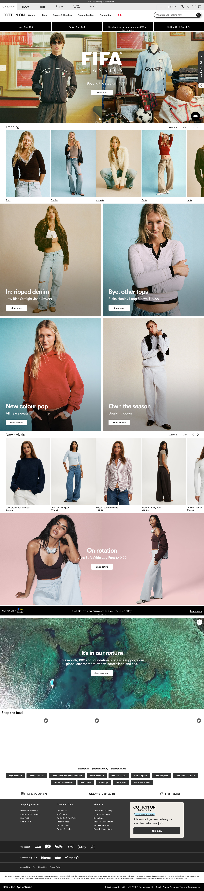

**대표 상품 이미지** (상위 6장, 출처 URL 포함)

- 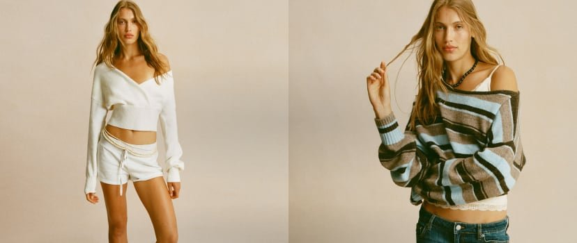 — 출처 <https://cottonon.com/on/demandware.static/-/Library-Sites-cog-megastore-shared-library/default/dwaf9342fb/group/home-page/mega-menu-tiles/C_5141500_MEGANAV_MB_JUNE_AU_5141520_0626.jpg>
- 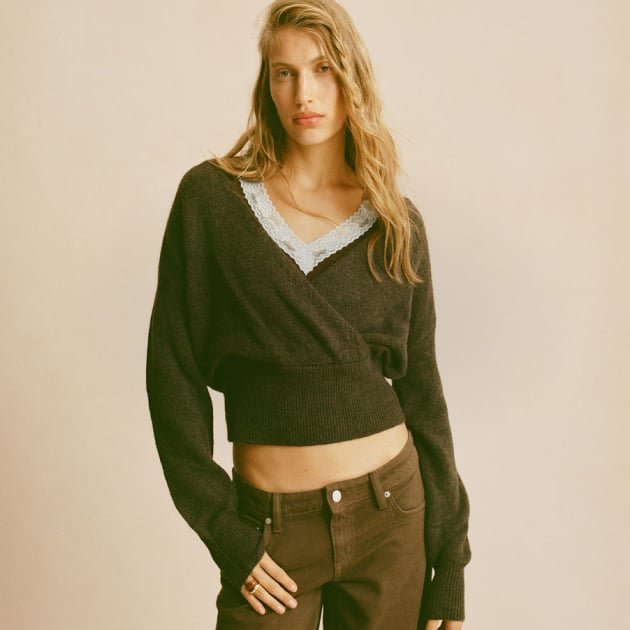 — 출처 <https://cottonon.com/on/demandware.static/-/Library-Sites-cog-megastore-shared-library/default/dw3bd43da3/group/home-page/2026/05_MAY/AU/C_5141500_MEGANAV_DT_JUNE_AU_5141538_0626-W-1.jpg>
- 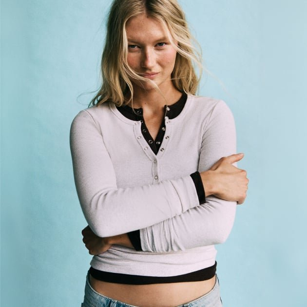 — 출처 <https://cottonon.com/on/demandware.static/-/Library-Sites-cog-megastore-shared-library/default/dw51cf53f6/group/home-page/2026/05_MAY/AU/C_5141500_MEGANAV_DT_JUNE_AU_5141538_0626-W-2.jpg>
- 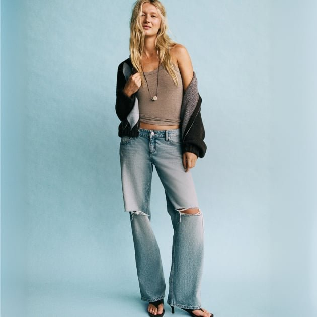 — 출처 <https://cottonon.com/on/demandware.static/-/Library-Sites-cog-megastore-shared-library/default/dwff5539ea/group/home-page/2026/05_MAY/AU/C_5141500_MEGANAV_DT_JUNE_AU_5141538_0626-W-4.jpg>
- 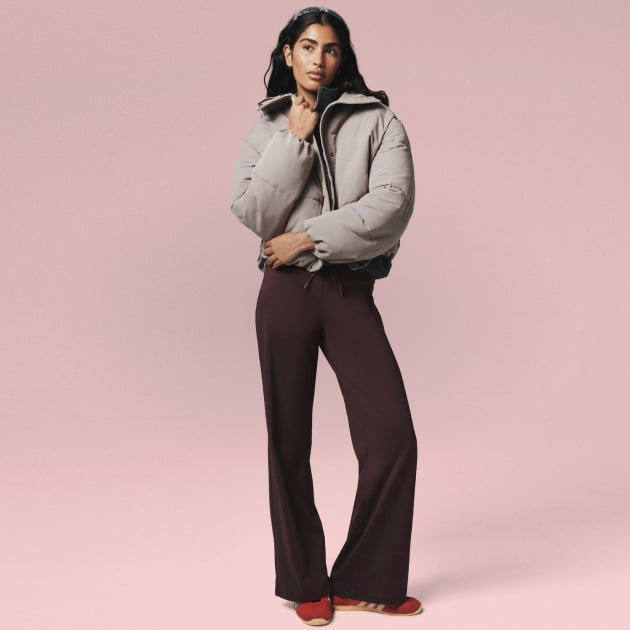 — 출처 <https://cottonon.com/on/demandware.static/-/Library-Sites-cog-megastore-shared-library/default/dwd6a984a9/group/home-page/2026/05_MAY/AU/C_5141500_MEGANAV_DT_JUNE_AU_5141538_0626-W-7.jpg>
- 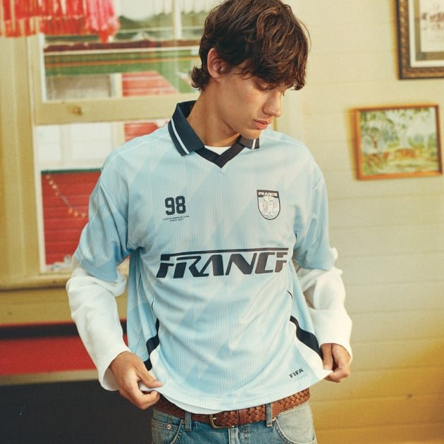 — 출처 <https://cottonon.com/on/demandware.static/-/Library-Sites-cog-megastore-shared-library/default/dw9a5d108c/group/home-page/2026/05_MAY/AU/C_5141500_MEGANAV_DT_JUNE_AU_5141538_0626-M-1.jpg>

**페이지 메타 정보**

| page | title | description |
|---|---|---|
| [`home`](https://cottonon.com/AU/) | Cotton On Australia | Women's, Men's & Kids Clothing & Accessories | Shop Six Brands in one place! Discover the latest trends at Cotton On, Body, Cotton On Kids, Typo, Factorie & Supre. |

#### [David Jones](https://www.davidjones.com/)

- URL: <https://www.davidjones.com/>
- 페이지: **OK 1 · FAIL 0**

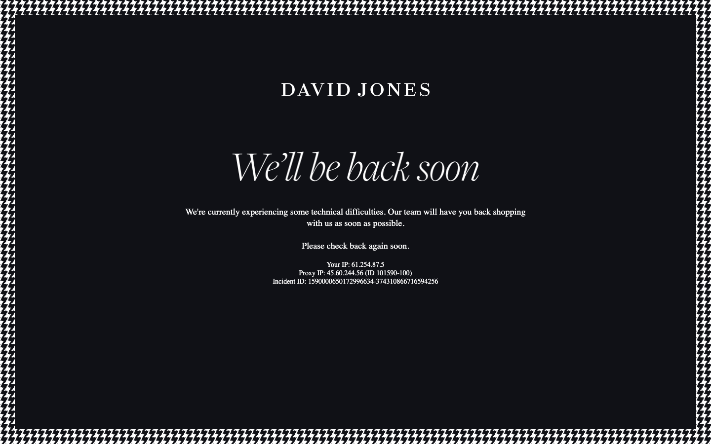

**페이지 메타 정보**

| page | title | description |
|---|---|---|
| [`home`](https://www.davidjones.com/) | _(empty)_ |  |

#### [Myer](https://www.myer.com.au/)

- URL: <https://www.myer.com.au/>
- 페이지: **OK 1 · FAIL 0**

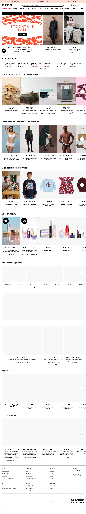

**대표 상품 이미지** (상위 6장, 출처 URL 포함)

-  — 출처 <https://content-us-5.content-cms.com/af9094ac-4ec2-4ea9-8480-e7ef2c8369de/dxresources/1981/19814e61-1957-4b9f-a827-9b2eaada7f21.jpg?resize=400px%3A200px&crop=400%3A200%3B0%2C0&output-format=webp&w=828&q=75>
-  — 출처 <https://content-us-5.content-cms.com/af9094ac-4ec2-4ea9-8480-e7ef2c8369de/dxresources/6c4d/6c4d04a5-a916-4c36-93ee-bae4cd1eff7a.jpg?resize=400px%3A200px&crop=400%3A200%3B0%2C0&output-format=webp&w=828&q=75>
-  — 출처 <https://content-us-5.content-cms.com/af9094ac-4ec2-4ea9-8480-e7ef2c8369de/dxresources/dd2e/dd2e3712-5094-4cd3-a4ed-edfd9295a7b5.jpg?resize=400px%3A200px&crop=400%3A200%3B0%2C0&output-format=webp&w=828&q=75>
-  — 출처 <https://content-us-5.content-cms.com/af9094ac-4ec2-4ea9-8480-e7ef2c8369de/dxresources/8b27/8b2790f5-98b4-4df0-8df7-d8e97bcc1dbd.jpg?resize=400px%3A200px&crop=400%3A200%3B0%2C0&output-format=webp&w=828&q=75>
-  — 출처 <https://content-us-5.content-cms.com/af9094ac-4ec2-4ea9-8480-e7ef2c8369de/dxresources/e4ae/e4aed948-c35d-402d-9ce2-2548899ca9bd.jpg?resize=400px%3A200px&crop=400%3A200%3B0%2C0&output-format=webp&w=828&q=75>
-  — 출처 <https://content-us-5.content-cms.com/af9094ac-4ec2-4ea9-8480-e7ef2c8369de/dxresources/cade/cade0a89-f086-4719-9053-aa4a3dbc0d9a.jpg?resize=400px%3A200px&crop=400%3A200%3B0%2C0&output-format=webp&w=828&q=75>

**페이지 메타 정보**

| page | title | description |
|---|---|---|
| [`home`](https://www.myer.com.au/) | MYER | Shop Fashion, Beauty, Homewares, Gifting and More | Shop at Myer, Australia's largest department store. Shop Fashion, Beauty, Homewares, Toys, Gifting and more with Afterpay, Velocity or Amex  |

#### [Princess Polly](https://www.princesspolly.com.au/)

- URL: <https://www.princesspolly.com.au/>
- 페이지: **OK 1 · FAIL 0**

**최근 유행 상품** (30건 · 상품명 클릭 시 해당 사이트로 이동)

| # | 상품명 | 브랜드 | 가격 | 페이지 |
|---:|---|---|---:|---|
| 1 | [Mankind Baggy Cargo Pants White](https://www.princesspolly.com.au/products/mankind-baggy-cargo-pants-white) | Princess Polly Lower Impact | 95 AUD | `new` |
| 2 | [Mankind Baggy Cargo Pants Olive](https://www.princesspolly.com.au/products/mankind-baggy-cargo-pants-olive) | Princess Polly Lower Impact | 95 AUD | `new` |
| 3 | [Therapy Graze Patent Square Toe Flats Red](https://www.princesspolly.com.au/products/therapy-graze-patent-square-toe-flats-red) | Princess Polly | 70 AUD | `new` |
| 4 | [Billini Arley Faux Suede Thong Sandals Sandstone](https://www.princesspolly.com.au/products/billini-arley-faux-suede-thong-sandals-sandstone) | Therapy | 100 AUD | `new` |
| 5 | [Alnira Cap Sleeve Denim Top Indigo](https://www.princesspolly.com.au/products/alnira-cap-sleeve-denim-top-indigo) | MOTEL | 80 AUD | `new` |
| 6 | [Rovie Twill Cargo Midi Skirt Latte](https://www.princesspolly.com.au/products/rovie-twill-cargo-midi-skirt-latte) | Princess Polly Lower Impact | 84 AUD | `new` |
| 7 | [Miriza Lace Trim Midi Skirt Chocolate / Blue](https://www.princesspolly.com.au/products/miriza-lace-trim-midi-skirt-chocolate-blue) | Princess Polly Lower Impact | 75 AUD | `new` |
| 8 | [Long Weekends Semi-Sheer Long Sleeve Top White](https://www.princesspolly.com.au/products/long-weekends-semi-sheer-long-sleeve-top-white) | Princess Polly | 55 AUD | `new` |
| 9 | [Another Try Cargo Mini Skirt Khaki](https://www.princesspolly.com.au/products/another-try-cargo-mini-skirt-khaki) | Princess Polly Lower Impact | 65 AUD | `new` |
| 10 | [Kleoh Off Shoulder Long Sleeve Henley Top Grey Marle](https://www.princesspolly.com.au/products/kleoh-off-shoulder-long-sleeve-henley-top-grey-marle) | Princess Polly Lower Impact | 60 AUD | `new` |
| 11 | [Delah Cable Knit Roll Neck Jumper Cream](https://www.princesspolly.com.au/products/delah-cable-knit-roll-neck-jumper-cream) | Princess Polly | 100 AUD | `new` |
| 12 | [Anjela Off Shoulder Playsuit Cherry](https://www.princesspolly.com.au/products/anjela-off-shoulder-playsuit-cherry) | Princess Polly | 75 AUD | `new` |
| 13 | [True Visions Belted Maxi Skirt Charcoal](https://www.princesspolly.com.au/products/true-visions-belted-maxi-skirt-charcoal) | Princess Polly | 75 AUD | `new` |
| 14 | [True Visions Belted Maxi Skirt Sand](https://www.princesspolly.com.au/products/true-visions-belted-maxi-skirt-sand) | Princess Polly | 75 AUD | `new` |
| 15 | [Lionne Slouchy Off Shoulder Maxi Dress Black](https://www.princesspolly.com.au/products/lionne-slouchy-off-shoulder-maxi-dress-black) | Princess Polly | 95 AUD | `new` |
| 16 | [Loran Mesh Draped Maxi Dress Wine](https://www.princesspolly.com.au/products/loran-mesh-draped-maxi-dress-wine) | Princess Polly | 105 AUD | `new` |
| 17 | [Alfea Funnel Neck Denim Bomber Jacket Mid Blue Wash](https://www.princesspolly.com.au/products/alfea-funnel-neck-denim-bomber-jacket-mid-blue-wash) | Princess Polly | 125 AUD | `new` |
| 18 | [Stick Season Quilted Jacket Black](https://www.princesspolly.com.au/products/stick-season-quilted-jacket-black) | Princess Polly | 100 AUD | `new` |
| 19 | [Long Weekends Semi-Sheer Long Sleeve Top Brown](https://www.princesspolly.com.au/products/long-weekends-semi-sheer-long-sleeve-top-brown) | Princess Polly | 55 AUD | `new` |
| 20 | [Long Weekends Semi-Sheer Long Sleeve Top Black](https://www.princesspolly.com.au/products/long-weekends-semi-sheer-long-sleeve-top-black) | Princess Polly | 55 AUD | `new` |

**페이지 메타 정보**

| page | title | description |
|---|---|---|
| [`new`](https://www.princesspolly.com.au/collections/new) | Shop New Arrivals Today! | Princess Polly | Shop New clothing online at Princess Polly. Buy now pay later with Afterpay. FREE & FAST shipping available. |

#### [The Iconic](https://www.theiconic.com.au/)

- URL: <https://www.theiconic.com.au/>
- 페이지: **OK 1 · FAIL 0**

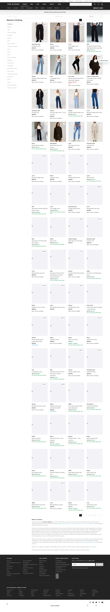

**최근 유행 상품** (11건 · 상품명 클릭 시 해당 사이트로 이동)

| # | 상품명 | 브랜드 | 가격 | 페이지 |
|---:|---|---|---:|---|
| 1 | Lola Barrel Pants | Assembly Label | 100 AUD | `new_women` |
| 2 | Gigi Barrel Jeans | Rolla's | 160 AUD | `new_women` |
| 3 | Cinch Baggy Jeans | Levi's | 130 AUD | `new_women` |
| 4 | Sportswear Phoenix Fleece HighWaisted WideLeg Pants | Nike | 100 AUD | `new_women` |
| 5 | 94 High and Wide Debbie Jean | Abrand | 130 AUD | `new_women` |
| 6 | Amy No Chafe Phone Pocket Ankle Biter Leggings | Lorna Jane | 75 AUD | `new_women` |
| 7 | Trail Sherpa Jacket ICONIC EXCLUSIVE | Cotton On Body Active | 90 AUD | `new_women` |
| 8 | Ivy Wool Coat | Assembly Label | 280 AUD | `new_women` |
| 9 | 94 High and Wide Jeans Iconic Exclusive | Abrand | 130 AUD | `new_women` |
| 10 | 94 High and Wide Kendall Jean | Abrand | 120 AUD | `new_women` |
| 11 | Ribcage Straight Ankle Jeans | Levi's | 160 AUD | `new_women` |

**대표 상품 이미지** (상위 6장, 출처 URL 포함)

-  — 출처 <https://img1.theiconic.com.au/4GRJ-FpMq8csx6QEfCFY_zgpt-M=/265x159/filters:fill(ffffff,1):quality(90):format(jpeg)/https%3A%2F%2Fimages.prismic.io%2Ftheiconic-content-service%2FaO3WbZ5xUNkB16gs_GIRLS-NavTileDesk.jpg>

**페이지 메타 정보**

| page | title | description |
|---|---|---|
| [`new_women`](https://www.theiconic.com.au/womens-clothing-just-arrived/) | Women's Clothing | Buy Women's Clothes Online Australia |- THE ICONIC | Buy women's clothing online. Designer clothing from top Australian and international fashion designers. Free and fast delivery available. Sh |

### 4.2 브라질 _( Brazil )_

- 한국 수출규모 순위: **#24** · region: `south_america` · tier `3` · currency `BRL`
- 수집 사이트: **5개** (성공 4)
- 메모: 남미 최대 시장
#### [C&A Brazil](https://www.cea.com.br/)

- URL: <https://www.cea.com.br/>
- 페이지: **OK 1 · FAIL 0**

**대표 상품 이미지** (상위 6장, 출처 URL 포함)

-  — 출처 <https://cea.vtexassets.com/assets/vtex.file-manager-graphql/images/4ff2f2d6-71a9-413d-a036-6ad335452e22___a6d4dd27e7cb2b0655b2676c2e41e288.jpg>
-  — 출처 <https://cea.vtexassets.com/assets/vtex.file-manager-graphql/images/1e44129b-1ce3-4eaf-b586-6b71a594b7df___988276e05e144d07b32d3aed52a07d4b.jpg>
- 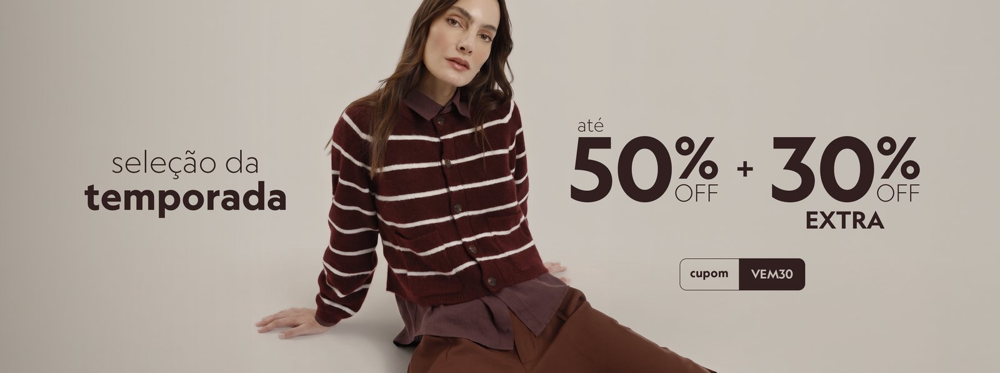 — 출처 <https://cea.vtexassets.com/assets/vtex.file-manager-graphql/images/12249e5e-8d16-43de-a996-6fe8b1be84b6___89786854eb82462df8b7b4f39036fa81.jpg>
- 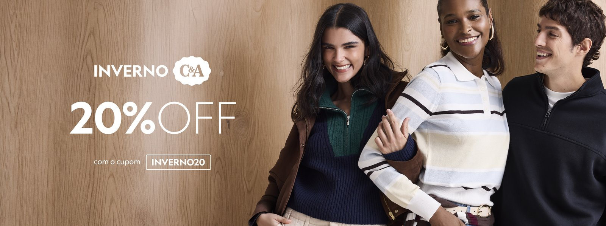 — 출처 <https://cea.vtexassets.com/assets/vtex.file-manager-graphql/images/f148ced8-edcc-4751-a826-6b44506c633c___f10cafb110eed1f4b8a6c20f5e1cc599.jpg>
- 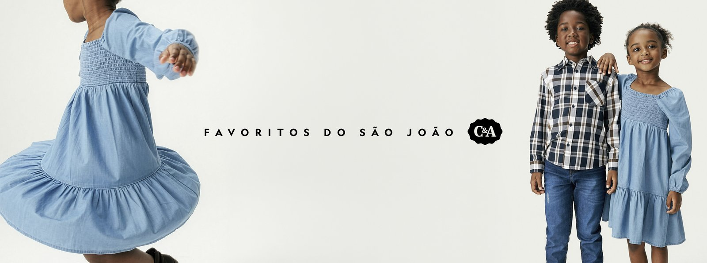 — 출처 <https://cea.vtexassets.com/assets/vtex.file-manager-graphql/images/07d567d3-6a2f-4e9b-8fa2-c90ece2257be___03528422f257eac97c130f9b414bb7c3.jpg>
-  — 출처 <https://cea.vtexassets.com/assets/vtex.file-manager-graphql/images/c737f390-74e1-4a88-9710-0dc8a43b903d___090bf51a1b512cec8547c16923749d16.jpg>

**페이지 메타 정보**

| page | title | description |
|---|---|---|
| [`home`](https://www.cea.com.br/) | C&A | Moda feminina, Masculina, Infantil, Beleza e mais | Encontre as melhores ofertas em moda feminina, masculina, infantil, calçados e beleza aqui na C&A. A gente se encontra na moda, a gente se e |

#### [Dafiti](https://www.dafiti.com.br/)

- URL: <https://www.dafiti.com.br/>
- 페이지: **OK 0 · FAIL 1**

**실패 페이지**

- `new` — playwright_error: Error: Page.goto: net::ERR_HTTP2_PROTOCOL_ERROR at https://www.dafiti.com.br/lancamentos/?
Call log:
  - navigating to "https://www.dafiti.com.br/lancamentos/?", waiting until "domcontentloaded"

#### [Mercado Livre Brazil](https://www.mercadolivre.com.br/)

- URL: <https://www.mercadolivre.com.br/>
- 페이지: **OK 1 · FAIL 0**

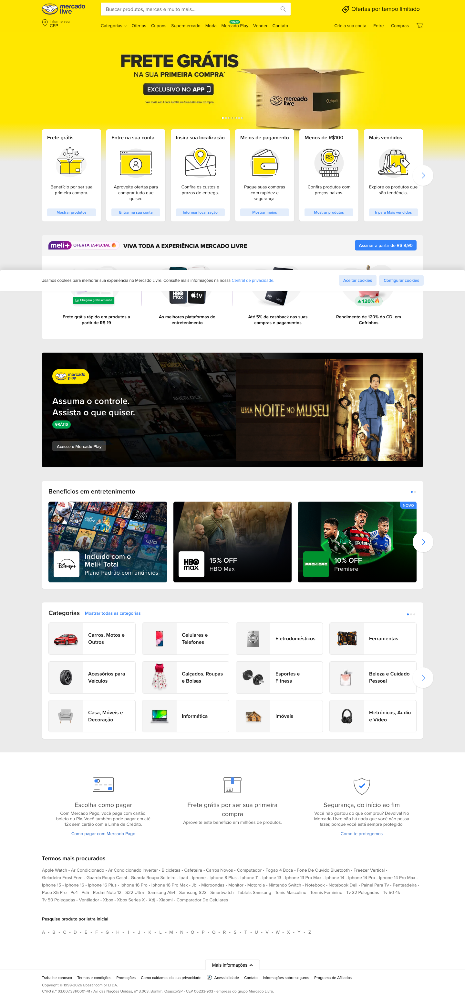

**대표 상품 이미지** (상위 6장, 출처 URL 포함)

-  — 출처 <https://http2.mlstatic.com/D_NQ_998066-MLA111080903588_052026-OO.webp>
-  — 출처 <https://http2.mlstatic.com/D_NQ_615968-MLA108191289211_032026-OO.webp>
-  — 출처 <https://http2.mlstatic.com/D_NQ_816930-MLA112071233089_052026-OO.webp>
-  — 출처 <https://http2.mlstatic.com/D_NQ_781903-MLA112251843365_052026-OO.webp>
-  — 출처 <https://http2.mlstatic.com/D_NQ_753055-MLA112068138293_052026-OO.webp>
-  — 출처 <https://http2.mlstatic.com/D_NQ_883273-MLA111084199920_052026-OO.webp>

**페이지 메타 정보**

| page | title | description |
|---|---|---|
| [`home`](https://www.mercadolivre.com.br/) | Mercado Livre Brasil - Frete Grátis no mesmo dia | Compre produtos com Frete Grátis no mesmo dia no Mercado Livre Brasil. Encontre milhares de marcas e produtos a preços incríveis. |

#### [Renner](https://www.lojasrenner.com.br/)

- URL: <https://www.lojasrenner.com.br/>
- 페이지: **OK 1 · FAIL 0**

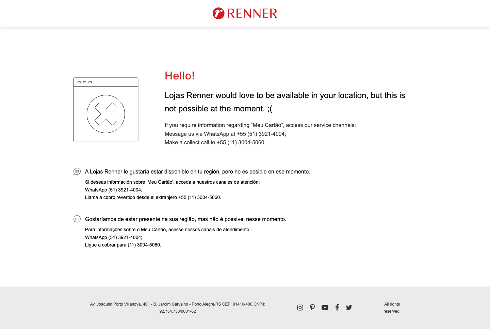

**페이지 메타 정보**

| page | title | description |
|---|---|---|
| [`home`](https://www.lojasrenner.com.br/) | Document |  |

#### [Riachuelo](https://www.riachuelo.com.br/)

- URL: <https://www.riachuelo.com.br/>
- 페이지: **OK 1 · FAIL 0**

**페이지 메타 정보**

| page | title | description |
|---|---|---|
| [`home`](https://www.riachuelo.com.br/) | Access Denied |  |

### 4.3 캐나다 _( Canada )_

- 한국 수출규모 순위: **#10** · region: `north_america` · tier `3` · currency `CAD`
- 수집 사이트: **5개** (성공 3)
- 메모: 북미 보조 시장
#### [Aritzia](https://www.aritzia.com/)

- URL: <https://www.aritzia.com/>
- 페이지: **OK 1 · FAIL 0**

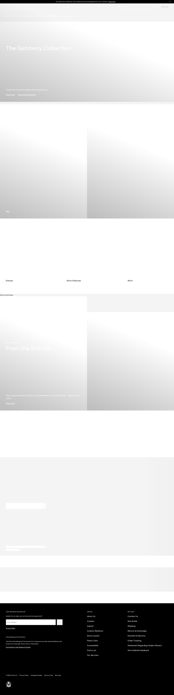

**대표 상품 이미지** (상위 6장, 출처 URL 포함)

- 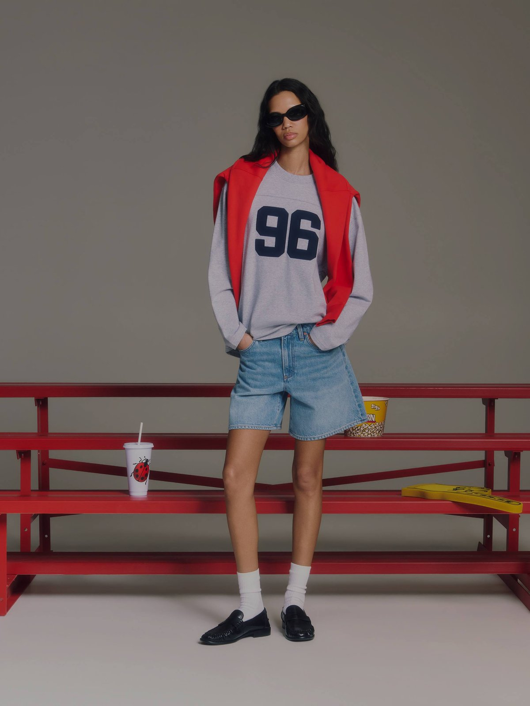 — 출처 <https://assets.aritzia.com/image/upload/q_auto,f_auto,dpr_auto/su26-hp-wk7-05-25-2026-slot3-a>

**페이지 메타 정보**

| page | title | description |
|---|---|---|
| [`home`](https://www.aritzia.com/intl/en) | Women's Fashion Boutique | Aritzia INTL | Shop the latest women's clothing and accessories - jackets, coats, sweaters, and dresses. |

#### [Dynamite](https://www.dynamiteclothing.com/)

- URL: <https://www.dynamiteclothing.com/>
- 페이지: **OK 0 · FAIL 1**

**실패 페이지**

- `home` — http_status_403

#### [Hudson's Bay](https://www.thebay.com/)

- URL: <https://www.thebay.com/>
- 페이지: **OK 0 · FAIL 1**

**실패 페이지**

- `home` — playwright_error: TimeoutError: Page.goto: Timeout 30000ms exceeded.
Call log:
  - navigating to "https://www.thebay.com/", waiting until "domcontentloaded"

#### [Simons](https://www.simons.ca/)

- URL: <https://www.simons.ca/>
- 페이지: **OK 1 · FAIL 0**

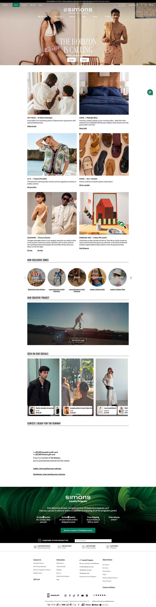

**대표 상품 이미지** (상위 6장, 출처 URL 포함)

-  — 출처 <https://imagescdn.simons.ca/simons/css/images/logo_print.png?version=1593>
- 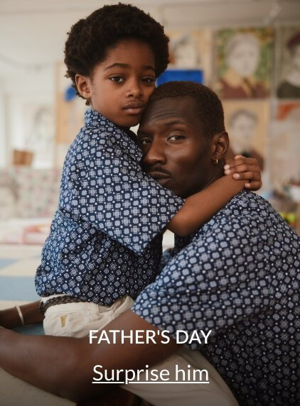 — 출처 <https://imagescdn.simons.ca/vb/c5f9c9808b177c727ae99f90038c5e3f/dropdown-principal-en.jpg>
- 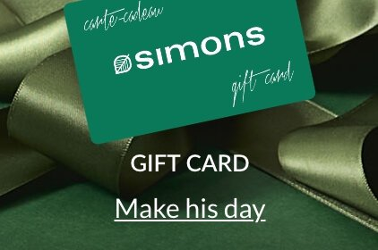 — 출처 <https://imagescdn.simons.ca/vb/a50baaebf21e2733af866f12180be75e/dropdown-cartecadeaux-en.jpg>
- 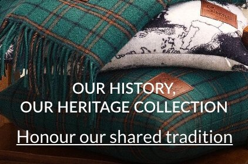 — 출처 <https://imagescdn.simons.ca/vb/110cf8459211dd1bd9e624c9c8a03ee3/dropdown-heritage-en.jpg>
- 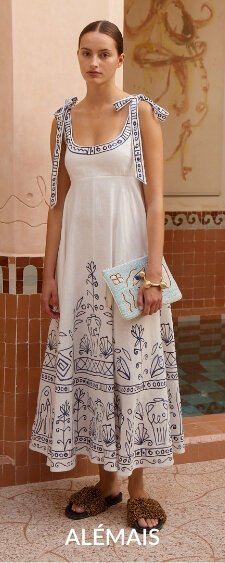 — 출처 <https://imagescdn.simons.ca/vb/abd5ffb1eca6b06372f49712d142c9d7/alemais.jpg>
- 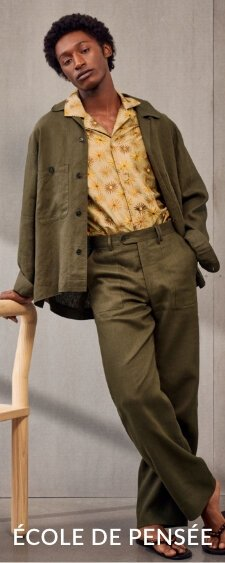 — 출처 <https://imagescdn.simons.ca/vb/b39647b65148e8f3375006615d603028/20875a944b639330d81b9a81e33ccdda.jpg>

**페이지 메타 정보**

| page | title | description |
|---|---|---|
| [`home`](https://www.simons.ca/en) | Canadian Fashion Destination Since 1840 | Simons | Get your hands on new arrivals inspired by the latest women's, men's and home trends at Simons. |

#### [SSENSE](https://www.ssense.com/)

- URL: <https://www.ssense.com/>
- 페이지: **OK 1 · FAIL 0**

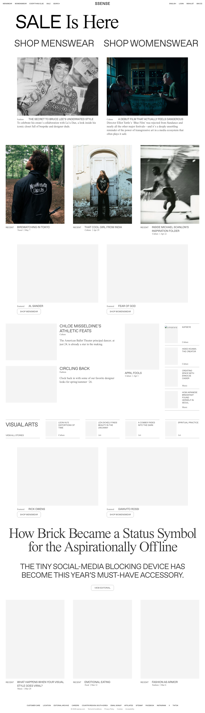

**페이지 메타 정보**

| page | title | description |
|---|---|---|
| [`home`](https://www.ssense.com/en-kr) | Luxury fashion & independent designers | SSENSE 대한민국 |  |

### 4.4 칠레 _( Chile )_

- 한국 수출규모 순위: **#28** · region: `south_america` · tier `3` · currency `CLP`
- 수집 사이트: **5개** (성공 5)
- 메모: 남미 안정 시장
#### [Dafiti Chile](https://www.dafiti.cl/)

- URL: <https://www.dafiti.cl/>
- 페이지: **OK 1 · FAIL 0**

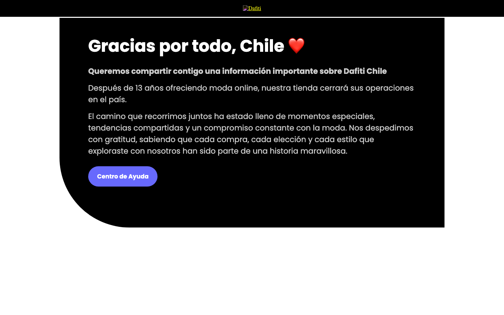

**페이지 메타 정보**

| page | title | description |
|---|---|---|
| [`home`](https://www.dafiti.cl/) | Gracias por todo, Chile ❤️ | Dafiti |  |

#### [Falabella Chile](https://www.falabella.com/falabella-cl)

- URL: <https://www.falabella.com/falabella-cl>
- 페이지: **OK 1 · FAIL 0**

**대표 상품 이미지** (상위 6장, 출처 URL 포함)

-  — 출처 <https://images.falabella.com/v3/assets/blt7c5c2f2f888a7cc3/bltc979df574bc3f373/titulo-lo-ultimo-dk-newHome2025.jpg>
- 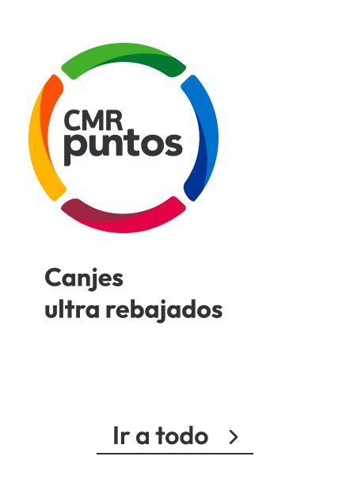 — 출처 <https://images.falabella.com/v3/assets/blt7c5c2f2f888a7cc3/blt59cbe2f38ac95f59/695fb78c57341d02523ac3af/cmr-puntos-titulo-regalables.jpg>
-  — 출처 <https://images.falabella.com/v3/assets/blt7c5c2f2f888a7cc3/blt40e40be8f592efeb/65ef4430a7eab49ce691419a/POPUP_CMR_FALABELLA-GENERICO_10K_MOBILE.webp>
-  — 출처 <https://images.falabella.com/v3/assets/blt7c5c2f2f888a7cc3/blt82dfb1aadb87635c/OG_Fcom.jpg>

**페이지 메타 정보**

| page | title | description |
|---|---|---|
| [`home`](https://www.falabella.com/falabella-cl) | falabella.com | Todo lo que necesitas en un solo lugar | Encuentra lo ultimo en Moda, Electrónicos, Calzados, Deco, Mascotas, Deportes, Bebé y más. ¡Haz clic ahora y aprovecha nuestras ofertas! |

#### [Mercado Libre Chile](https://www.mercadolibre.cl/)

- URL: <https://www.mercadolibre.cl/>
- 페이지: **OK 1 · FAIL 0**

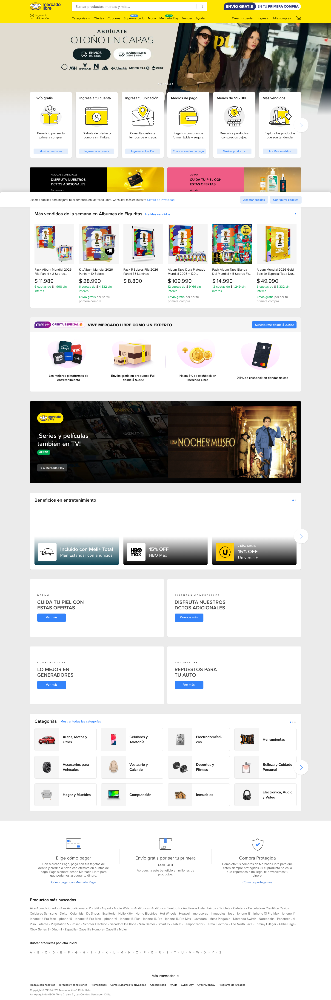

**대표 상품 이미지** (상위 6장, 출처 URL 포함)

-  — 출처 <https://http2.mlstatic.com/D_NQ_917435-MLA96201475628_102025-OO.webp>
- 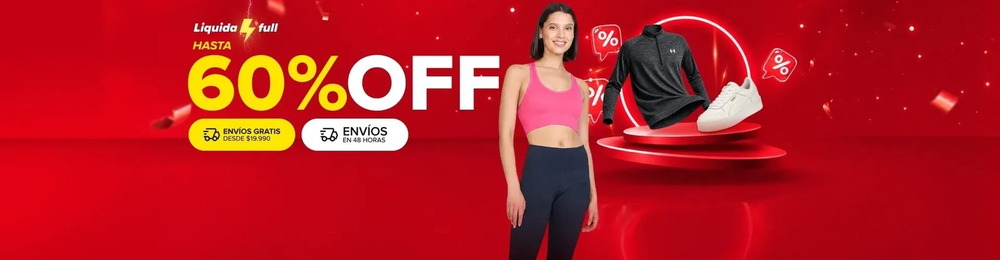 — 출처 <https://http2.mlstatic.com/D_NQ_840256-MLA111196913818_052026-OO.webp>
-  — 출처 <https://http2.mlstatic.com/D_NQ_957425-MLA111301965568_052026-OO.webp>
- 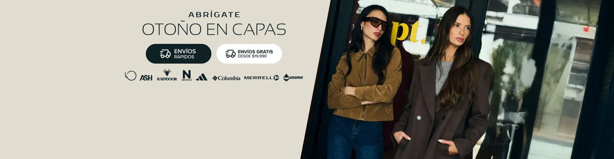 — 출처 <https://http2.mlstatic.com/D_NQ_742743-MLA112165647443_052026-OO.webp>
-  — 출처 <https://http2.mlstatic.com/D_NQ_675706-MLA110800980358_052026-OO.webp>
-  — 출처 <https://http2.mlstatic.com/D_NQ_651558-MLA112198258117_052026-OO.webp>

**페이지 메타 정보**

| page | title | description |
|---|---|---|
| [`home`](https://www.mercadolibre.cl/) | Mercado Libre Chile - Envíos Gratis en el día | Compre productos con Envío Gratis en el día en Mercado Libre Chile. Encuentre miles de marcas y productos a precios increíbles. |

#### [Paris Chile](https://www.paris.cl/)

- URL: <https://www.paris.cl/>
- 페이지: **OK 1 · FAIL 0**

**대표 상품 이미지** (상위 6장, 출처 URL 포함)

-  — 출처 <https://cl-paris-media-hub.ecomm.cencosud.com/files/assets/huincha_voladora/huincha_voladora_servicios_18mar26_mob_v2.png?v=1>
- 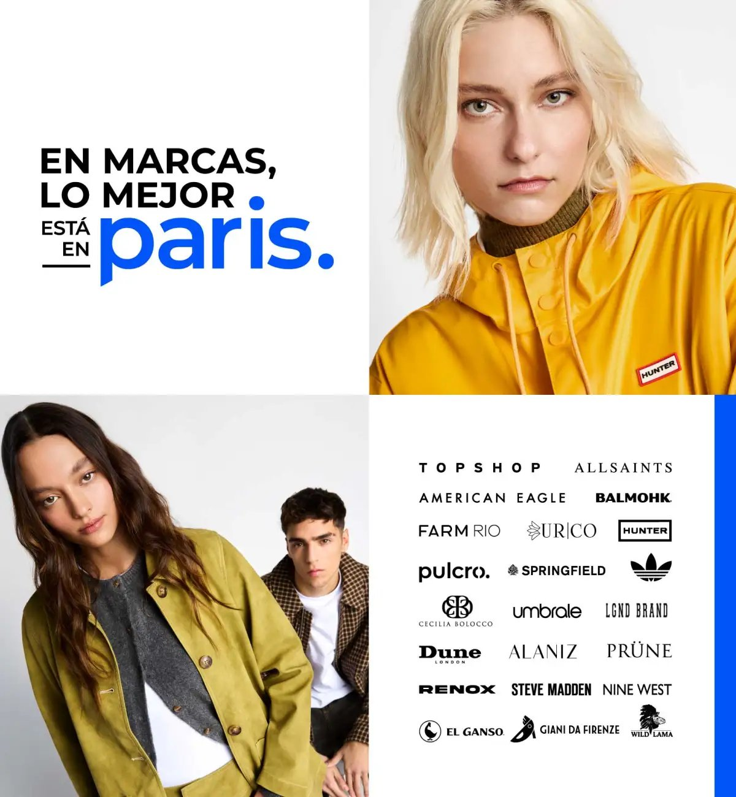 — 출처 <https://cl-paris-media-hub.ecomm.cencosud.com/files/home/home_tarjeta/2026/carrusel_banner_tarjeta_18may26_vst_campanamarcas_mob.webp?v=1>
- 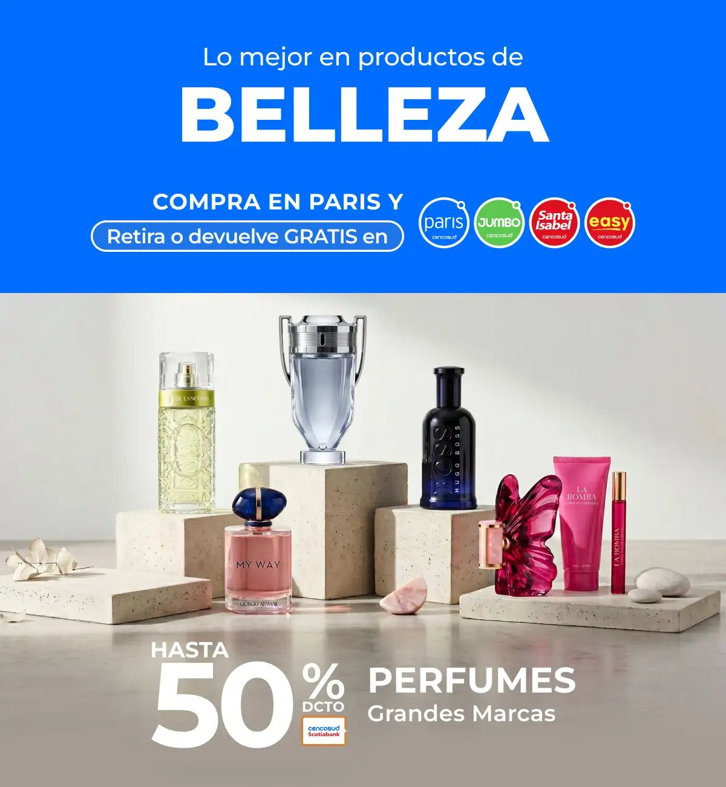 — 출처 <https://cl-paris-media-hub.ecomm.cencosud.com/files/home/home-generico/a2026/carrusel_banner_generico_26may26_bll_belleza_mob.webp?v=1>
-  — 출처 <https://cl-paris-media-hub.ecomm.cencosud.com/files/home/home-generico/a2026/carrusel_banner_generico_26may26_vst_moda_mob.webp?v=4>
- 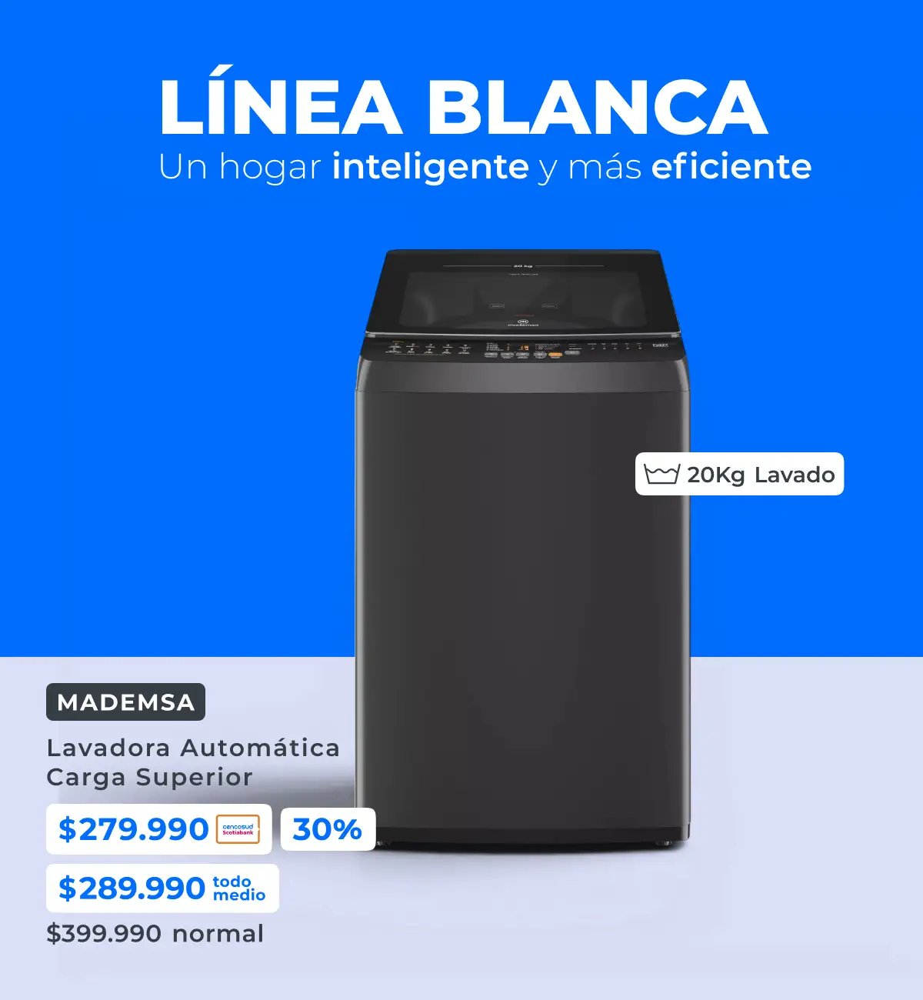 — 출처 <https://cl-paris-media-hub.ecomm.cencosud.com/files/home/home-generico/a2026/carrusel_banner_generico_26may26_elb_lb_mob.webp?v=1>
- 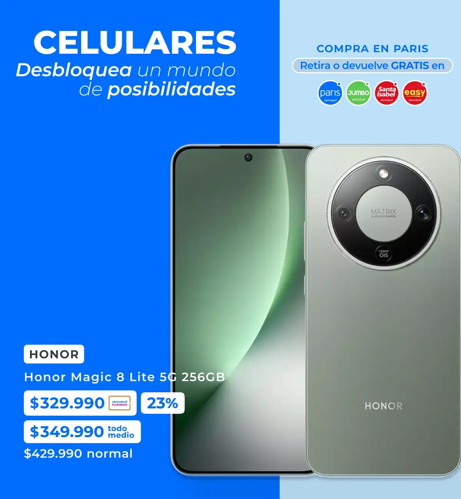 — 출처 <https://cl-paris-media-hub.ecomm.cencosud.com/files/home/home-generico/a2026/carrusel_banner_generico_26may26_tec_comunicaciones_mob.webp?v=1>

**페이지 메타 정보**

| page | title | description |
|---|---|---|
| [`home`](https://www.paris.cl/) | Paris.cl | Tu experiencia de compra más confiable y segura | En Paris.cl compra online lo mejor en tecnología, electrónica, línea blanca, muebles, moda, zapatos, belleza, deportes, juguetes y mucho más |

#### [Ripley Chile](https://simple.ripley.cl/)

- URL: <https://simple.ripley.cl/>
- 페이지: **OK 1 · FAIL 0**

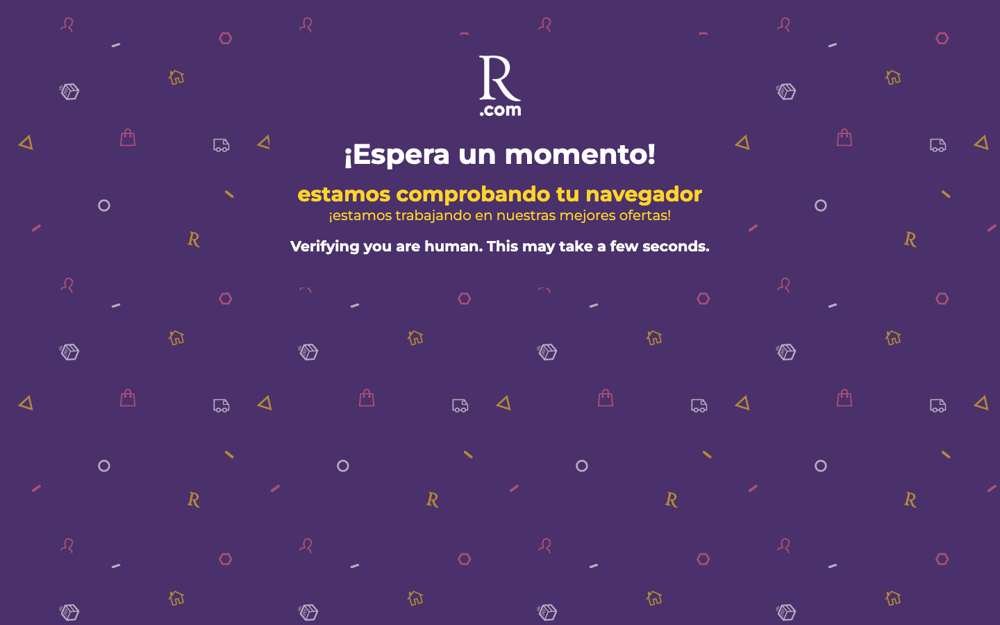

**페이지 메타 정보**

| page | title | description |
|---|---|---|
| [`home`](https://simple.ripley.cl/) | Just a moment... |  |

### 4.5 프랑스 _( France )_

- 한국 수출규모 순위: **#13** · region: `europe` · tier `2` · currency `EUR`
- 수집 사이트: **5개** (성공 5)
- 메모: 럭셔리/디자이너 시장
#### [Galeries Lafayette](https://www.galerieslafayette.com/)

- URL: <https://www.galerieslafayette.com/>
- 페이지: **OK 1 · FAIL 0**

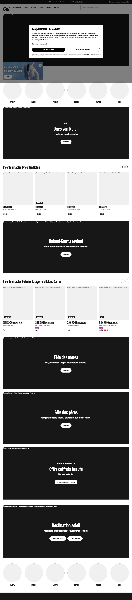

**대표 상품 이미지** (상위 6장, 출처 URL 포함)

- 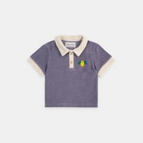 — 출처 <https://static.galerieslafayette.com/cdn-cgi/image/width=202,height=202,quality=85,format=auto,fit=cover/https://sapapi.galerieslafayette.com/medias/sys_master/images/h6c/h11/9113680674846/ancre_enfant/ancre-enfant.jpg>

**페이지 메타 정보**

| page | title | description |
|---|---|---|
| [`home`](https://www.galerieslafayette.com/) | Boutique en ligne : mode, maison et beauté | Galeries Lafayette | Découvrez nos larges collections de vêtements et chaussures femme, homme et enfant sur GaleriesLafayette.com. Plus de 2000 marques. Livraiso |

#### [La Redoute](https://www.laredoute.fr/)

- URL: <https://www.laredoute.fr/>
- 페이지: **OK 1 · FAIL 0**

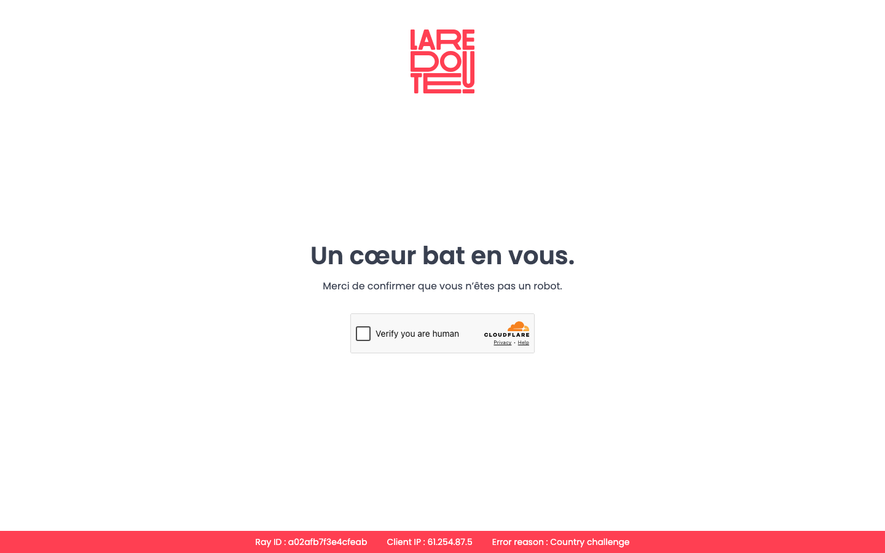

**페이지 메타 정보**

| page | title | description |
|---|---|---|
| [`new_women`](https://www.laredoute.fr/pplp/v1/590225/0/0.aspx) | Just a moment... |  |

#### [Printemps](https://www.printemps.com/)

- URL: <https://www.printemps.com/>
- 페이지: **OK 1 · FAIL 0**

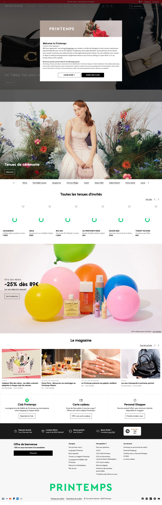

**대표 상품 이미지** (상위 6장, 출처 URL 포함)

-  — 출처 <https://media-cdn.printemps.com/image/64/9/9261649.jpg>
- 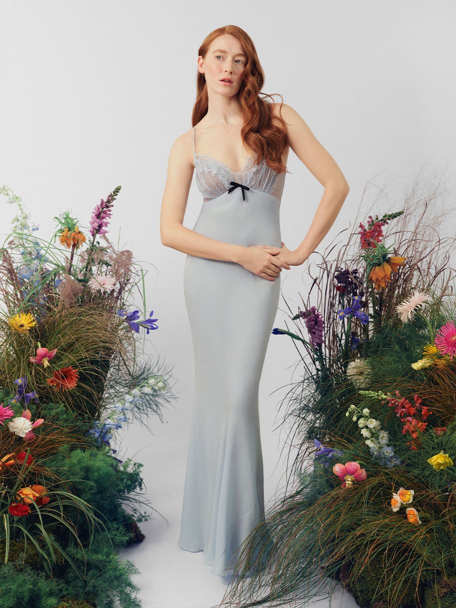 — 출처 <https://media-cdn.printemps.com/image/85/2/9245852.jpg>
- 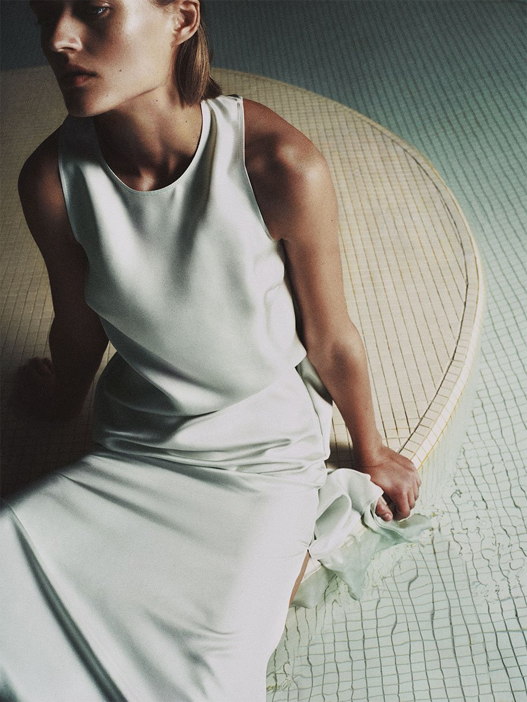 — 출처 <https://media-cdn.printemps.com/image/60/5/9271605.jpg>
- 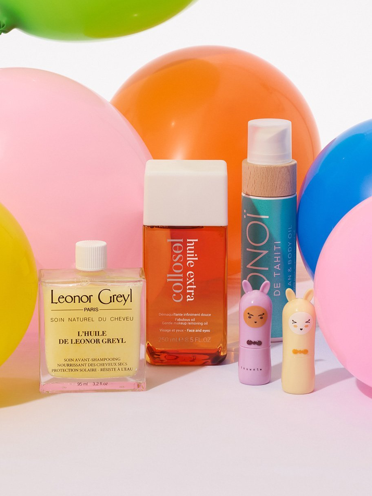 — 출처 <https://media-cdn.printemps.com/image/76/5/9267765.jpg>
- 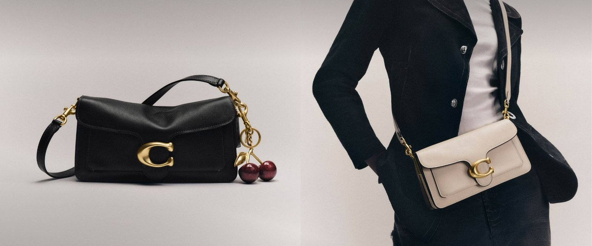 — 출처 <https://media-cdn.printemps.com/image/50/8/9306508.jpg>
- 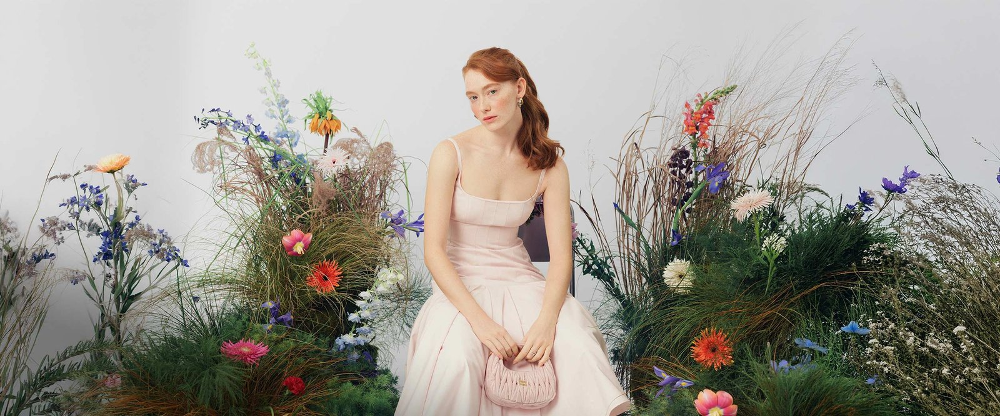 — 출처 <https://media-cdn.printemps.com/image/56/2/9247562.jpg>

**페이지 메타 정보**

| page | title | description |
|---|---|---|
| [`home`](https://www.printemps.com/fr/fr) | Printemps.com - Mode, beauté et articles de maison de luxe | Printemps | Sur Printemps.com découvrez une sélection de marques luxe et créateurs tendance. Homme, femme, beauté, Maison et accessoires, craquez pour l |

#### [Sézane](https://www.sezane.com/)

- URL: <https://www.sezane.com/>
- 페이지: **OK 1 · FAIL 0**

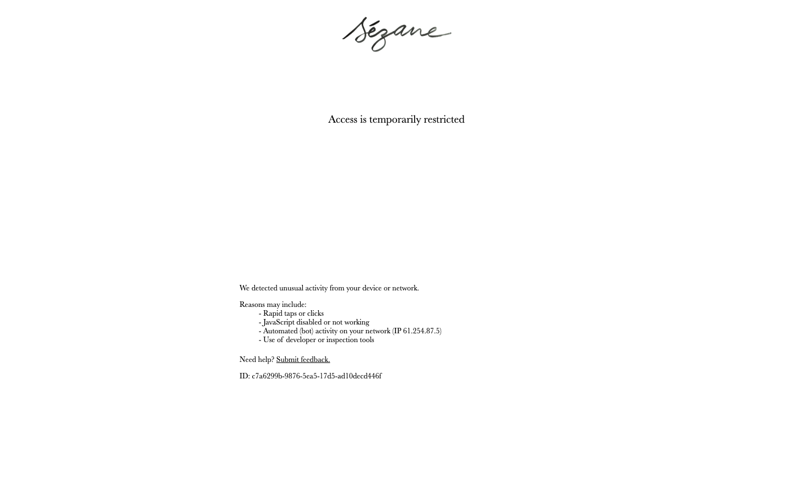

**페이지 메타 정보**

| page | title | description |
|---|---|---|
| [`new`](https://www.sezane.com/fr/collection/nouveautes) | sezane.com |  |

#### [Vestiaire Collective](https://www.vestiairecollective.com/)

- URL: <https://www.vestiairecollective.com/>
- 페이지: **OK 1 · FAIL 0**

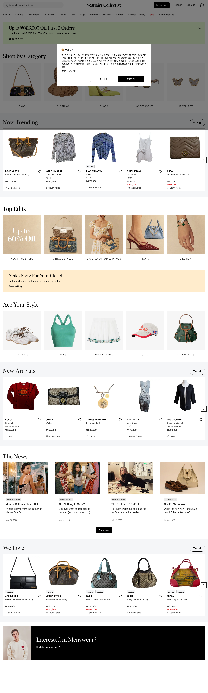

**대표 상품 이미지** (상위 6장, 출처 URL 포함)

- 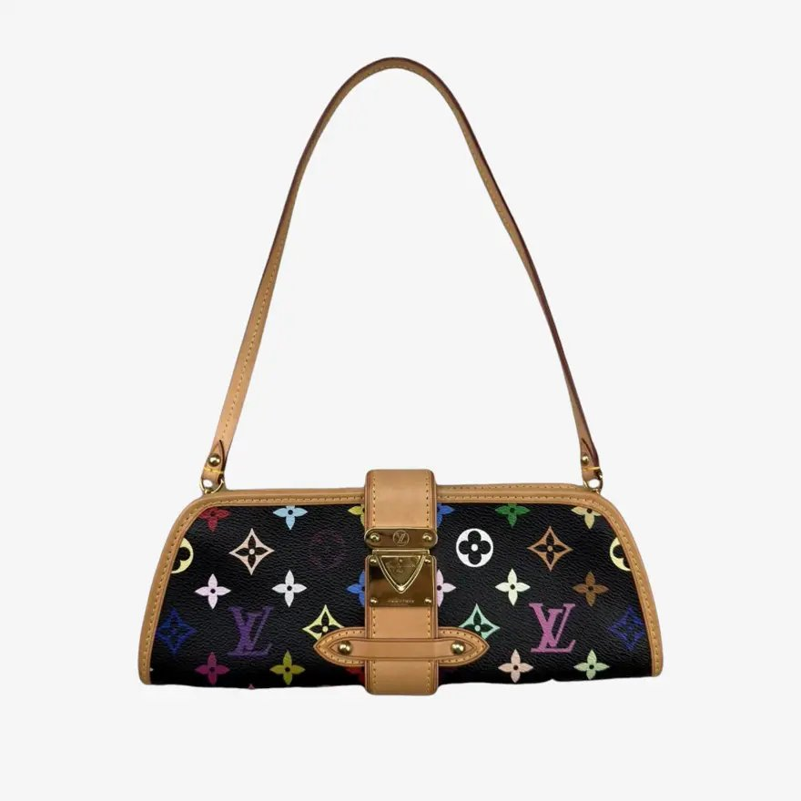 — 출처 <https://eu-images.contentstack.com/v3/assets/blt82432b0782155fc9/blte0f5eed0002851b5/6a06ef4a2ce75075d1a1fd4f/2026-05-15-shop-by-category-bags.png?quality=70&fit=bounds&format=webp&dpr=2&disable=upscale&width=440&height=440>
- 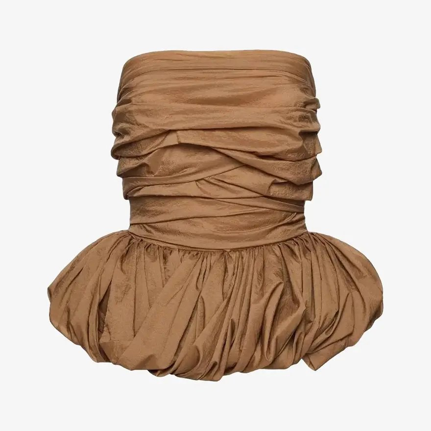 — 출처 <https://eu-images.contentstack.com/v3/assets/blt82432b0782155fc9/blt0ecc3e7738f19023/6a0dc8ac59ca091513ba4599/MERCH-WM-brown-linen-magda-butrym-top.jpg?quality=70&fit=bounds&format=webp&dpr=2&disable=upscale&width=440&height=440>
- 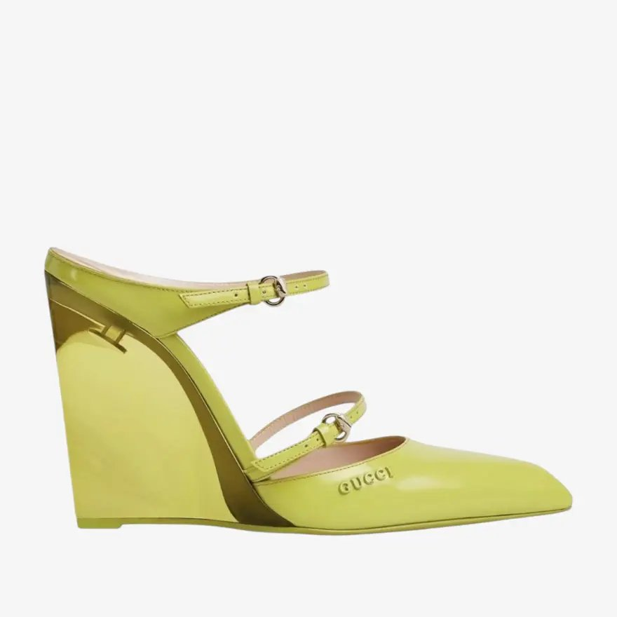 — 출처 <https://eu-images.contentstack.com/v3/assets/blt82432b0782155fc9/blt1d60a525a33cde5a/6a07132368d6d9ab6b6e7cbd/2026-05-15-shop-by-category-shoes.png?quality=70&fit=bounds&format=webp&dpr=2&disable=upscale&width=440&height=440>
- 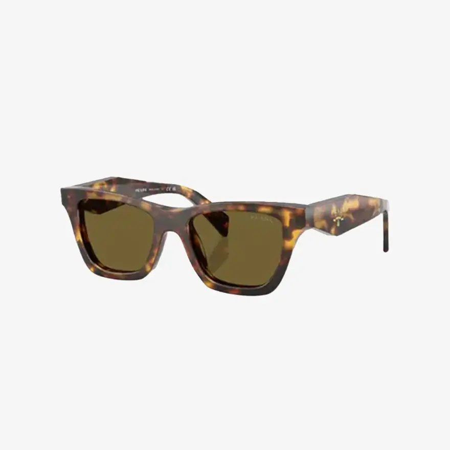 — 출처 <https://eu-images.contentstack.com/v3/assets/blt82432b0782155fc9/blta82254cd27c39bb7/6a0719a2eb9f4a71f8786080/MERCH-WM-prada-sunglasses.jpg?quality=70&fit=bounds&format=webp&dpr=2&disable=upscale&width=440&height=440>
- 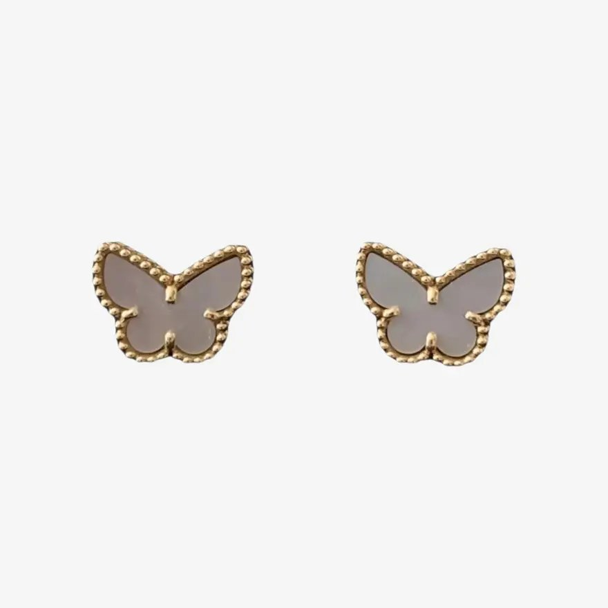 — 출처 <https://eu-images.contentstack.com/v3/assets/blt82432b0782155fc9/blt9e0e3e58a74c1edc/6a0718c068d6d9633f6e7ccd/2026-05-15-shop-by-category-jewellery.png?quality=70&fit=bounds&format=webp&dpr=2&disable=upscale&width=440&height=440>
- 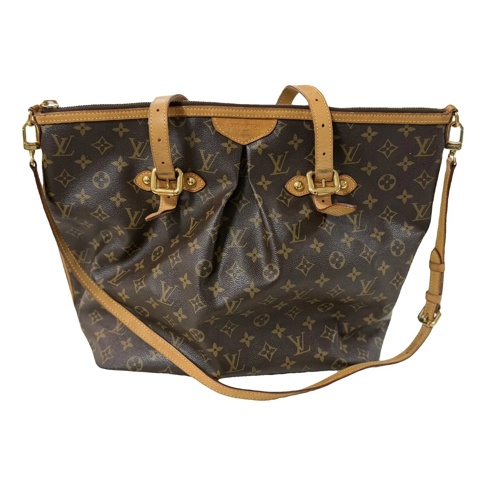 — 출처 <https://images.vestiairecollective.com/images/resized/w=2920,q=75,f=auto,/produit/brown-leather-palermo-louis-vuitton-handbag-67467058-1_2.jpg>

**페이지 메타 정보**

| page | title | description |
|---|---|---|
| [`home`](https://www.vestiairecollective.com/) | Vestiaire Collective: Buy & sell designer second-hand fashion. | 3 million items, 12,000+ brands. Luxury pre-loved fashion, up to 70% off. Expert authentication, trusted by millions. |

### 4.6 독일 _( Germany )_

- 한국 수출규모 순위: **#12** · region: `europe` · tier `2` · currency `EUR`
- 수집 사이트: **5개** (성공 4)
- 메모: 유럽 최대 이커머스 시장
#### [About You](https://www.aboutyou.de/)

- URL: <https://www.aboutyou.de/>
- 페이지: **OK 1 · FAIL 0**

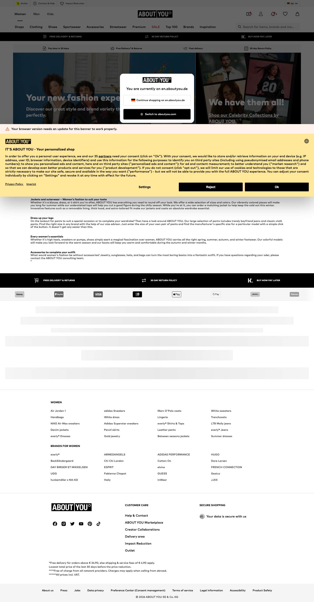

**대표 상품 이미지** (상위 6장, 출처 URL 포함)

-  — 출처 <https://cdn.aboutstatic.com/file/images/ab8632bb0155f2f889992f22bf3857e1.png?quality=75&height=480&width=360>
- 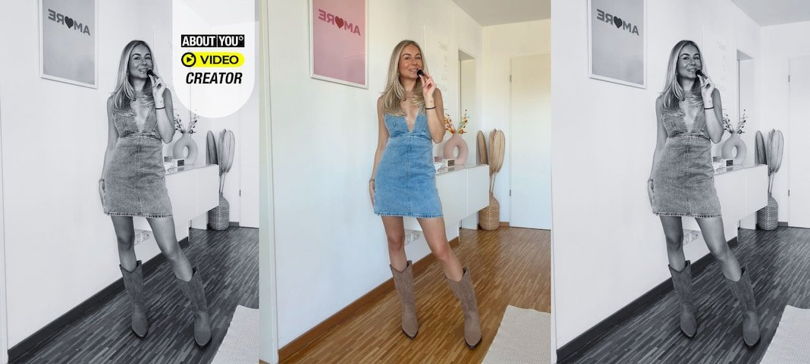 — 출처 <https://cdn.aboutstatic.com/file/9f45fd7ee0896aee119933e0f24d5285.jpg?quality=75&height=480>
-  — 출처 <https://cdn.aboutstatic.com/file/9f45fd7ee0896aee119933e0f24d5285.jpg?quality=75&height=525>
- 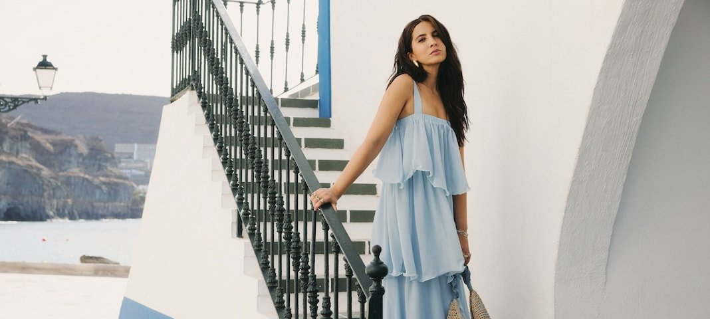 — 출처 <https://cdn.aboutstatic.com/file/a370e4ca6c459f1b29a1a24d79671a24.jpg?quality=75&height=480>
-  — 출처 <https://cdn.aboutstatic.com/file/a370e4ca6c459f1b29a1a24d79671a24.jpg?quality=75&height=525>
- 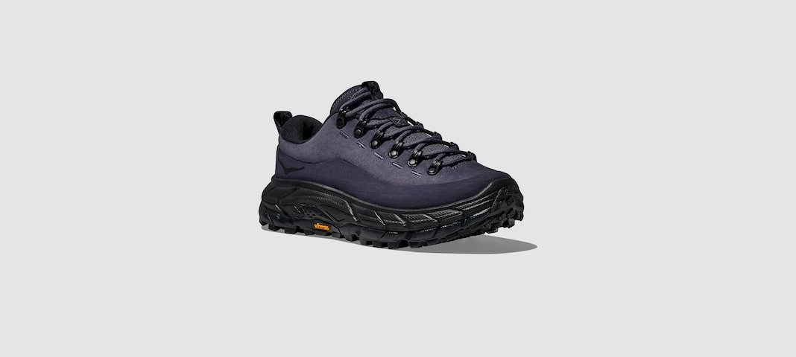 — 출처 <https://cdn.aboutstatic.com/file/1db417642aa3c062e3e4d05eb4c5b4eb.jpg?quality=75&height=480>

**페이지 메타 정보**

| page | title | description |
|---|---|---|
| [`home`](https://en.aboutyou.de/your-shop) | Online fashion from over 3000 top brands  | ABOUT YOU | Order your fashion today at ABOUT YOU. Free* & fast delivery! Over 3000 Brands - 30 Days Return Policy - Fast delivery |

#### [Breuninger](https://www.breuninger.com/)

- URL: <https://www.breuninger.com/>
- 페이지: **OK 1 · FAIL 0**

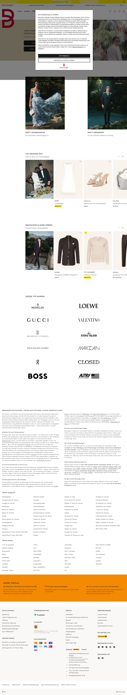

**대표 상품 이미지** (상위 6장, 출처 URL 포함)

- 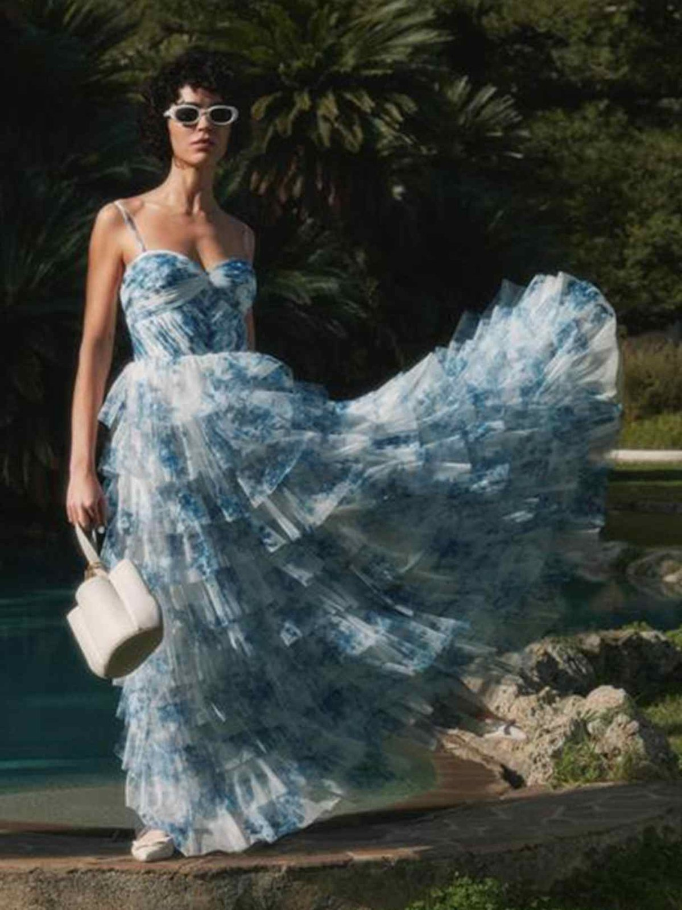 — 출처 <https://teaser.prod.breuni.de/cont/image/upload/t_double-content-small-mobile/v1775724349/2026/Kampagnen/Festive/DOB/Content_Carousel_Module_01_jtyhhk.jpg>
- 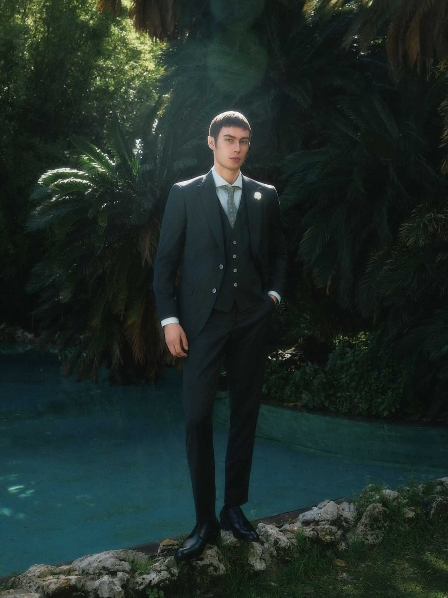 — 출처 <https://teaser.prod.breuni.de/cont/image/upload/t_double-content-small-mobile/v1774004121/2026/Kampagnen/Festive/HAKA/260212_Breuninger_SoMe1566_hires_lax53s.jpg>
-  — 출처 <https://teaser.prod.breuni.de/cont/image/upload/t_merchandising-carousel-large-mobile/v1773839491/2026/Kampagnen/Festive/260212_Breuninger_SoMe1757_hires_svjzov.jpg>
- 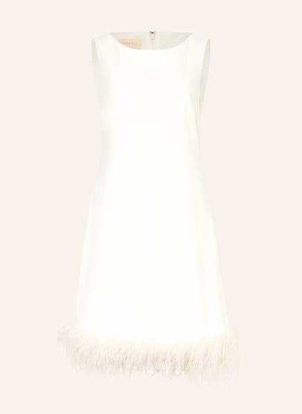 — 출처 <https://cms.brnstc.de/product_images/435x596/cpne/media/images/product/26/2/100308071011000_0_1771372800000.jpg>
- 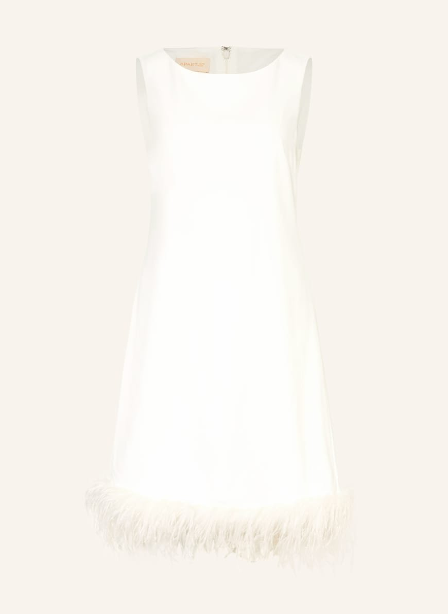 — 출처 <https://cms.brnstc.de/product_images/435x596_retina/cpne/media/images/product/26/2/100308071011000_0_1771372800000.jpg>
- 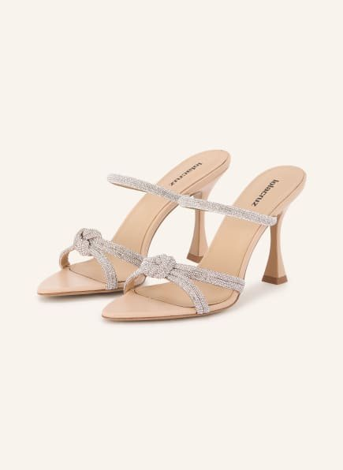 — 출처 <https://cms.brnstc.de/product_images/435x596/cpne/media/images/product/26/2/100302450912000_0_1771891200000.jpg>

**페이지 메타 정보**

| page | title | description |
|---|---|---|
| [`home`](https://www.breuninger.com/de/) | BREUNINGER Online Shop | Wir lieben Mode seit über 140 Jahren | Mode, Beauty, Taschen & Schuhe von über 1500 Designer-Marken im Breuninger Onlineshop ✓ Schnelle Lieferung ✓ 30 Tage Rückgaberecht ➤ Jetzt k |

#### [Otto](https://www.otto.de/)

- URL: <https://www.otto.de/>
- 페이지: **OK 1 · FAIL 0**

**대표 상품 이미지** (상위 6장, 출처 URL 포함)

- 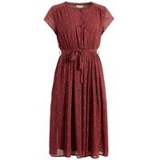 — 출처 <https://i.otto.de/i/otto/cd05c6c6-8692-5b95-95c3-c221f3e2a99c/?h=200&upscale=true&w=200>
- 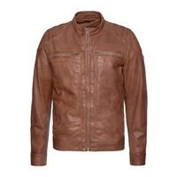 — 출처 <https://i.otto.de/i/otto/28397874/?h=200&upscale=true&w=200>
- 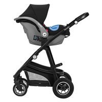 — 출처 <https://i.otto.de/i/otto/f9ea3238-ee30-438c-ace9-5858e6221443/?h=200&upscale=true&w=200>
- 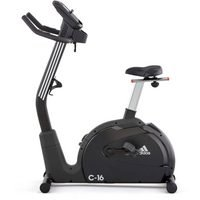 — 출처 <https://i.otto.de/i/otto/18517368/?h=200&upscale=true&w=200>
- 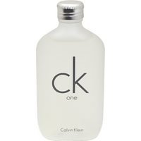 — 출처 <https://i.otto.de/i/otto/f1707ac6-3183-5795-aada-f0e9c849449e/?h=200&upscale=true&w=200>
- 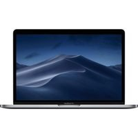 — 출처 <https://i.otto.de/i/otto/34177157/?h=200&upscale=true&w=200>

**페이지 메타 정보**

| page | title | description |
|---|---|---|
| [`home`](https://www.otto.de/) | OTTO - Mode, Möbel & Technik » Zum Online-Shop | OTTO Online-Shop » Viele Marken ✓ Tolle Angebote ✓ Top Service » Ratenkauf ✓ Kauf auf Rechnung ✓ Altgeräte-Mitnahme ✓ Aufbauservice ✓ Jetzt  |

#### [Peek & Cloppenburg](https://www.peek-cloppenburg.de/)

- URL: <https://www.peek-cloppenburg.de/>
- 페이지: **OK 1 · FAIL 0**

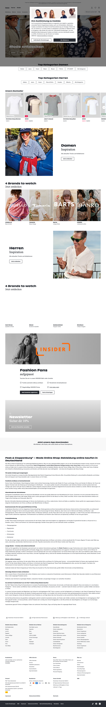

**대표 상품 이미지** (상위 6장, 출처 URL 포함)

-  — 출처 <https://editorial.fidcdn.net/cdn-cgi/image/width=375,height=500/cms/dam/jcr:8b4e5b28-2245-43de-9f6e-07ac1ee8afa5/Header%201%20(1).2026-04-30-08-56-47.jpg>
- 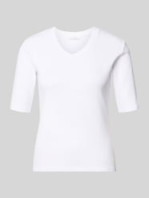 — 출처 <https://product.fidcdn.net/cdn-cgi/image/width=186,height=248/75548hqi8pa4gdpg64qkodqmad63ch2f6p14egpp6913egqj699l8ia2a9658l2b88o3igqg8coj2gia6d3jqf9t7krm4php61j30phl68o3id3471hm2d1hcoom6dhm6pgmcohpcor66===.jpg>
- 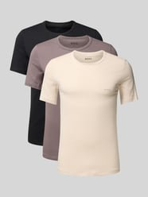 — 출처 <https://product.fidcdn.net/cdn-cgi/image/width=186,height=248/94sj8cqg9l3jecpj65444ja47134ikaa61252iq195a48e1o8d852chk8ookoe2e958k6hie9ksj8cq1913jqf9t7koj0e9i68ojcphh68p3gd1n69h62p1k68o3geb36cojco9g68s30===.jpg>
- 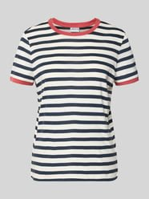 — 출처 <https://product.fidcdn.net/cdn-cgi/image/width=186,height=248/ad1kie2k9d150h2la92jedik9p744iaa6gpk8gah952kagpi9p64sci16933il2a8grj6i2h6cpjgk1j68o3qf9t7ks38dhi6dijacb16sq3gd3668pjgdhjckomcopk71hj6oj2cpgjc===.jpg>
- 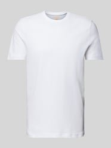 — 출처 <https://product.fidcdn.net/cdn-cgi/image/width=186,height=248/84o56c289p8l0ihg6d74kd2e8d84uc2aaor44jqcal4l2ea29cpjigq7al2kgk2i9p546haf8h3lchih6oo3qf9t7kr3cc1m6goj2d1j6ksjid1gccom2dr16cpj2chmc5gm2e9ncpim6===.jpg>
- 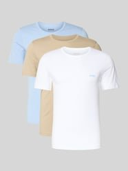 — 출처 <https://product.fidcdn.net/cdn-cgi/image/width=186,height=248/6t736dpl8p8j2gah6d956h25aopk6kpm9h8jcca6akoj2ji49sp4kl2m952jejqd6144mhpm9gqkgdik84o3qf9t7ks62ob568pjcc1nc4rm6d1p70p3ipb26oo32p34c8o3ep366lij8===.jpg>

**페이지 메타 정보**

| page | title | description |
|---|---|---|
| [`home`](https://www.peek-cloppenburg.de/) | P&C Online Shop | Schnelle Lieferung | Peek & Cloppenburg | Jetzt bei ➧ P&C: Mode & Schuhe online entdecken | mehr als 300 Top-Marken | 62 Tage Rückgaberecht |

#### [Zalando Germany](https://www.zalando.de/)

- URL: <https://www.zalando.de/>
- 페이지: **OK 0 · FAIL 1**

**실패 페이지**

- `new_women` — playwright_error: TimeoutError: Page.goto: Timeout 30000ms exceeded.
Call log:
  - navigating to "https://www.zalando.de/damenmode-neuheiten/", waiting until "domcontentloaded"

### 4.7 홍콩 _( Hong Kong )_

- 한국 수출규모 순위: **#6** · region: `asia` · tier `2` · currency `HKD`
- 수집 사이트: **5개** (성공 5)
- 메모: 무역중개 허브. 럭셔리/셀렉트 숍 발달
#### [HKTVmall](https://www.hktvmall.com/)

- URL: <https://www.hktvmall.com/>
- 페이지: **OK 1 · FAIL 0**

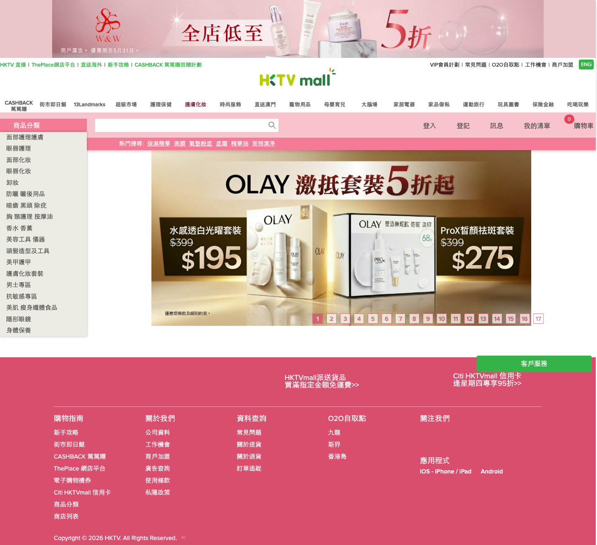

**대표 상품 이미지** (상위 6장, 출처 URL 포함)

-  — 출처 <https://images.hktvmall.com/banner/bannerzh_260522022916.jpg>
-  — 출처 <https://images.hktvmall.com/p0006001/p0006001_mobilelogo_230321053509.jpg>
-  — 출처 <https://images.hktvmall.com/p0038002/p0038002_mobilelogo_220823080456.jpeg>
-  — 출처 <https://images.hktvmall.com/h5113006/h5113006_mobilelogo_230315062531.jpg>
-  — 출처 <https://images.hktvmall.com/p0038001/p0038001_mobilelogo_231218125449.jpg>
-  — 출처 <https://images.hktvmall.com/h7829001/h7829001_mobilelogo_200618115331.jpg>

**페이지 메타 정보**

| page | title | description |
|---|---|---|
| [`home`](https://www.hktvmall.com/) | 護膚化妝 | HKTVmall 香港最大網購平台 | 超過30,000件護膚化粧、個人護理、保健醫藥及隱形眼鏡用品！當中包括一系列日韓歐美至Hit產品任你揀，更有定期超筍優惠及每週新品！立即進入HKTVmall「藥粧護理」專區！ |

#### [i.t](https://www.ithk.com/)

- URL: <https://www.ithk.com/>
- 페이지: **OK 1 · FAIL 0**

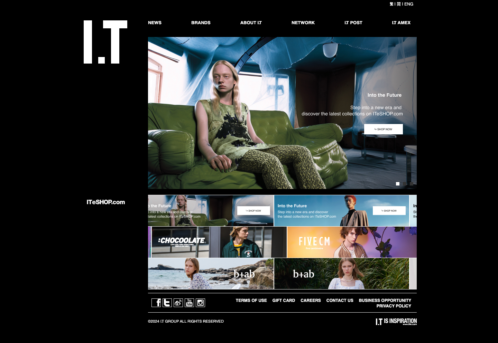

**대표 상품 이미지** (상위 6장, 출처 URL 포함)

- 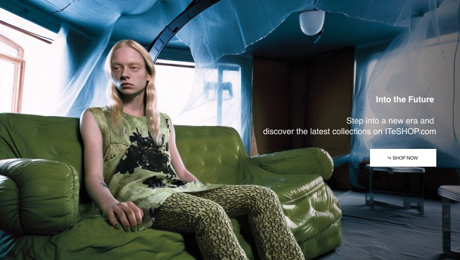 — 출처 <https://www.ithk.com/storage/main_banner/777x440_1.jpg>
-  — 출처 <https://www.ithk.com/storage/main_banner/777x440_2.jpg>
- 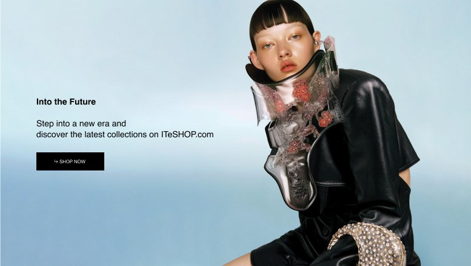 — 출처 <https://www.ithk.com/storage/main_banner/777x440_3.jpg>

**페이지 메타 정보**

| page | title | description |
|---|---|---|
| [`home`](https://www.ithk.com/eng/html/front/index.html) | I.T - Home | I.T Official Website | Being an unique multi-brand fashion house, I.T has been bringing in the most cutting edge fashion labels around the g |

#### [Kapok](https://ka-pok.com/)

- URL: <https://ka-pok.com/>
- 페이지: **OK 1 · FAIL 0**

**최근 유행 상품** (30건 · 상품명 클릭 시 해당 사이트로 이동)

| # | 상품명 | 브랜드 | 가격 | 페이지 |
|---:|---|---|---:|---|
| 1 | [Pull Gia](https://ka-pok.com/products/pull-gia) | A.P.C. | 2,390 HKD | `home` |
| 2 | [Pull Hector](https://ka-pok.com/products/pull-hector) | A.P.C. | 2,790 HKD | `home` |
| 3 | [Cardigan Rosa](https://ka-pok.com/products/cardigan-rosa) | A.P.C. | 3,090 HKD | `home` |
| 4 | [Sac Crochet Fleurs](https://ka-pok.com/products/sac-crochet-fleurs) | EMILE & IDA | 990 HKD | `home` |
| 5 | [Tote Lou](https://ka-pok.com/products/tote-lou-8) | A.P.C. | 1,290 HKD | `home` |
| 6 | [Eventail Movida Blueberry](https://ka-pok.com/products/eventail-movida-blueberry) | Ole Ole | 390 HKD | `home` |
| 7 | [Pull Gabby](https://ka-pok.com/products/pull-gabby) | A.P.C. | 2,690 HKD | `home` |
| 8 | [Summer Suiting "Harlan" Jacket](https://ka-pok.com/products/summer-suiting-harlan-jacket-1) | In Good Company | 1,790 HKD | `home` |
| 9 | [Shopping Diane](https://ka-pok.com/products/shopping-diane) | A.P.C. | 1,490 HKD | `home` |
| 10 | [Veste Grand Jack](https://ka-pok.com/products/veste-grand-jack) | A.P.C. | 4,090 HKD | `home` |
| 11 | [Casquette Rabbit](https://ka-pok.com/products/casquette-rabbit) | A.P.C. | 890 HKD | `home` |
| 12 | [Shopping Je Sors Ce Soir](https://ka-pok.com/products/shopping-je-sors-ce-soir) | A.P.C. | 1,490 HKD | `home` |
| 13 | [T-Shirt Renoncement](https://ka-pok.com/products/t-shirt-renoncement) | A.P.C. | 1,290 HKD | `home` |
| 14 | [T-Shirt Olivier M](https://ka-pok.com/products/t-shirt-olivier-m) | A.P.C. | 1,290 HKD | `home` |
| 15 | [Chino Tupelo](https://ka-pok.com/products/chino-tupelo) | A.P.C. | 2,990 HKD | `home` |
| 16 | [Chemise Jessica O](https://ka-pok.com/products/chemise-jessica-o) | A.P.C. | 2,590 HKD | `home` |
| 17 | [Bentota - Cotton Bag With Beads Embroidery](https://ka-pok.com/products/bentota-cotton-bag-with-beads-embroidery) | Imayin | 3,590 HKD | `home` |
| 18 | [Yala - Cotton Bag With Beads Embroidery](https://ka-pok.com/products/yala-cotton-bag-with-beads-embroidery) | Imayin | 3,390 HKD | `home` |
| 19 | [Monstera - Cotton Bag With Beads Embroidery](https://ka-pok.com/products/monstera-cotton-bag-with-beads-embroidery) | Imayin | 3,090 HKD | `home` |
| 20 | [WEEJUN HERITAGE Larson Western Stud Loafers](https://ka-pok.com/products/weejun-heritage-larson-western-stud) | G.H. Bass & Co. | 2,290 HKD | `home` |

**대표 상품 이미지** (상위 6장, 출처 URL 포함)

- 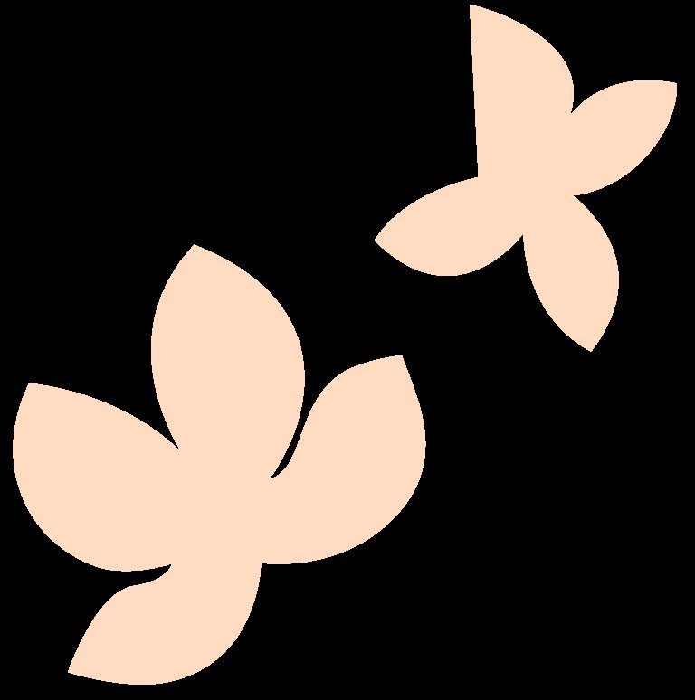 — 출처 <https://ka-pok.com/cdn/shop/files/shapes.png?v=1721454307>
-  — 출처 <https://ka-pok.com/cdn/shop/files/OlendOnaSoftBagOna-Coral.webp?v=1777449663&width=533>
- 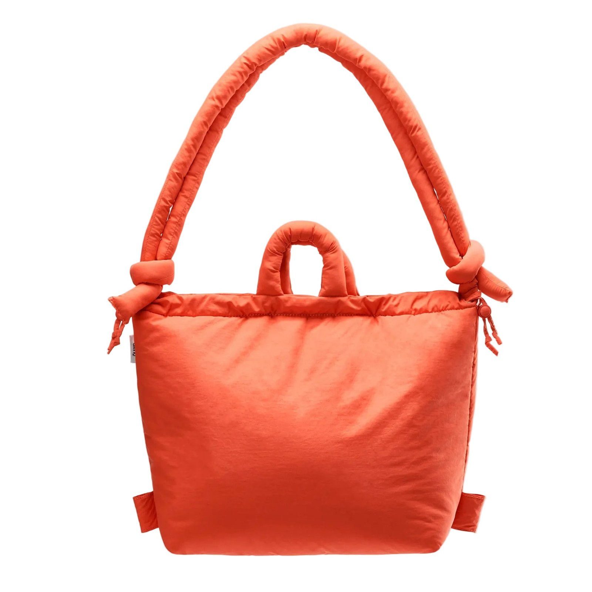 — 출처 <https://ka-pok.com/cdn/shop/files/OlendOnaSoftBagOna-Coral.webp?v=1777449663>
-  — 출처 <https://ka-pok.com/cdn/shop/files/OlendOnaSoftBagOna-Coral3.webp?v=1748508119&width=533>
-  — 출처 <https://ka-pok.com/cdn/shop/files/OlendOnaSoftBagOna-Coral3.webp?v=1748508119>
-  — 출처 <https://ka-pok.com/cdn/shop/files/MicroOnaSoftBaglime.webp?v=1776331017&width=533>

**페이지 메타 정보**

| page | title | description |
|---|---|---|
| [`home`](https://ka-pok.com/) | kapok - Hong Kong Fashion and Lifestyle Select Shop | Over 340 international designer brands including fashion, lifestyle, accessories etc. at kapok.com. Free local shipping available. |

#### [Lane Crawford](https://www.lanecrawford.com/)

- URL: <https://www.lanecrawford.com/>
- 페이지: **OK 1 · FAIL 0**

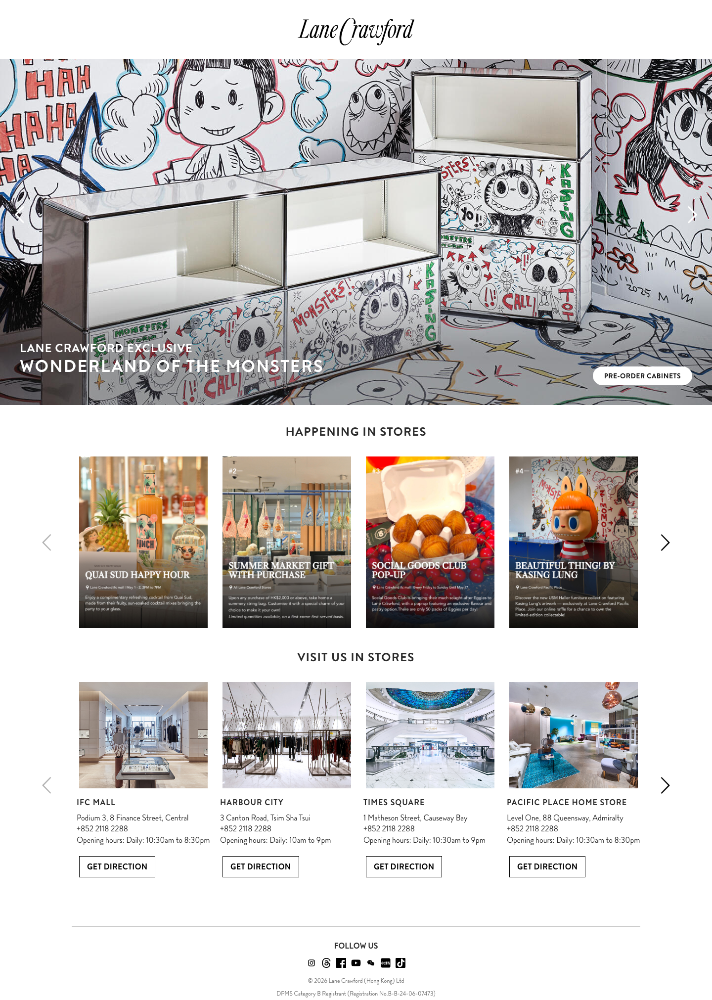

**대표 상품 이미지** (상위 6장, 출처 URL 포함)

-  — 출처 <https://media.lanecrawford.com/feature/hp_temp_Happening-in-stores-20260430-1.jpg>
- 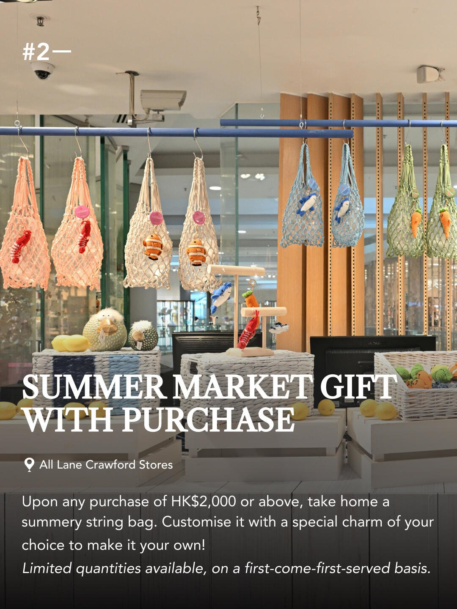 — 출처 <https://media.lanecrawford.com/feature/hp_temp_Happening-in-stores-20260430-2.jpg>
-  — 출처 <https://media.lanecrawford.com/feature/hp_temp_Happening-in-stores-20260430-3.jpg>
- 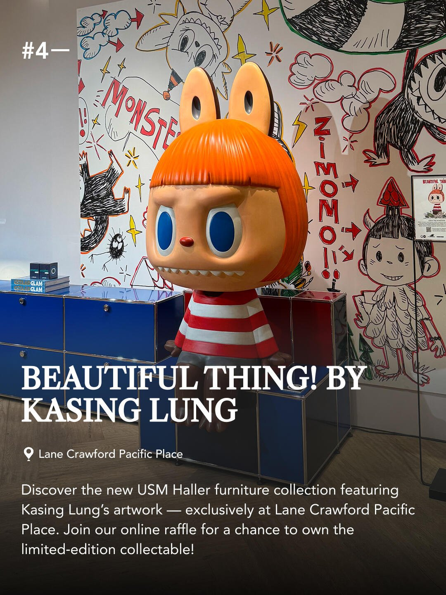 — 출처 <https://media.lanecrawford.com/feature/hp_temp_Happening-in-stores-20260430-4.jpg>
-  — 출처 <https://media.lanecrawford.com/feature/hp_temp_Happening-in-stores-20260430-5.jpg>
-  — 출처 <https://media.lanecrawford.com/feature/hp_temp_Happening-in-stores-20260430-6.jpg>

**페이지 메타 정보**

| page | title | description |
|---|---|---|
| [`home`](https://media.lanecrawford.com/maintenance/row.html) | Lane Crawford |  |

#### [Zalora Hong Kong](https://www.zalora.com.hk/)

- URL: <https://www.zalora.com.hk/>
- 페이지: **OK 1 · FAIL 0**

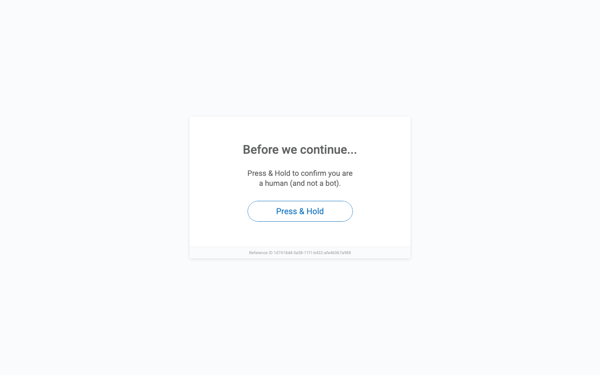

**페이지 메타 정보**

| page | title | description |
|---|---|---|
| [`home`](https://www.zalora.com.hk/) | Access to this page has been denied | px-captcha |

### 4.8 인도 _( India )_

- 한국 수출규모 순위: **#19** · region: `asia` · tier `2` · currency `INR`
- 수집 사이트: **5개** (성공 3)
- 메모: 거대 성장 시장, 가격 민감
#### [Ajio](https://www.ajio.com/)

- URL: <https://www.ajio.com/>
- 페이지: **OK 1 · FAIL 0**

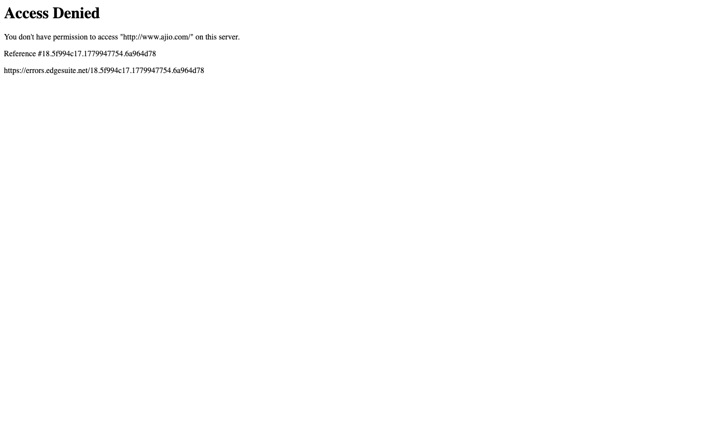

**페이지 메타 정보**

| page | title | description |
|---|---|---|
| [`home`](https://www.ajio.com/) | Access Denied |  |

#### [Flipkart Fashion](https://www.flipkart.com/)

- URL: <https://www.flipkart.com/>
- 페이지: **OK 1 · FAIL 0**

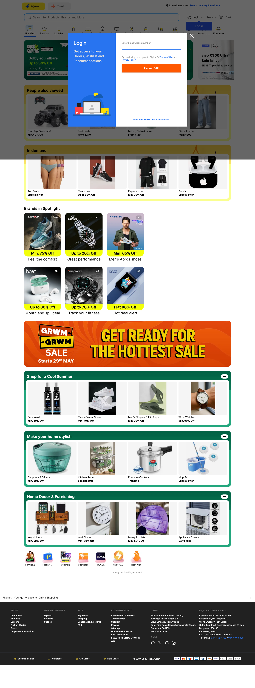

**페이지 메타 정보**

| page | title | description |
|---|---|---|
| [`home`](https://www.flipkart.com/) | Online Shopping Site for Mobiles, Electronics, Furniture, Grocery, Lifestyle, Books & More. Best Offers! |  |

#### [Myntra](https://www.myntra.com/)

- URL: <https://www.myntra.com/>
- 페이지: **OK 0 · FAIL 1**

**실패 페이지**

- `home` — playwright_error: Error: Page.goto: net::ERR_HTTP2_PROTOCOL_ERROR at https://www.myntra.com/
Call log:
  - navigating to "https://www.myntra.com/", waiting until "domcontentloaded"

#### [Nykaa Fashion](https://www.nykaafashion.com/)

- URL: <https://www.nykaafashion.com/>
- 페이지: **OK 0 · FAIL 1**

**실패 페이지**

- `home` — playwright_error: Error: Page.goto: net::ERR_HTTP2_PROTOCOL_ERROR at https://www.nykaafashion.com/
Call log:
  - navigating to "https://www.nykaafashion.com/", waiting until "domcontentloaded"

#### [Tata CLiQ Luxury](https://luxury.tatacliq.com/)

- URL: <https://luxury.tatacliq.com/>
- 페이지: **OK 1 · FAIL 0**

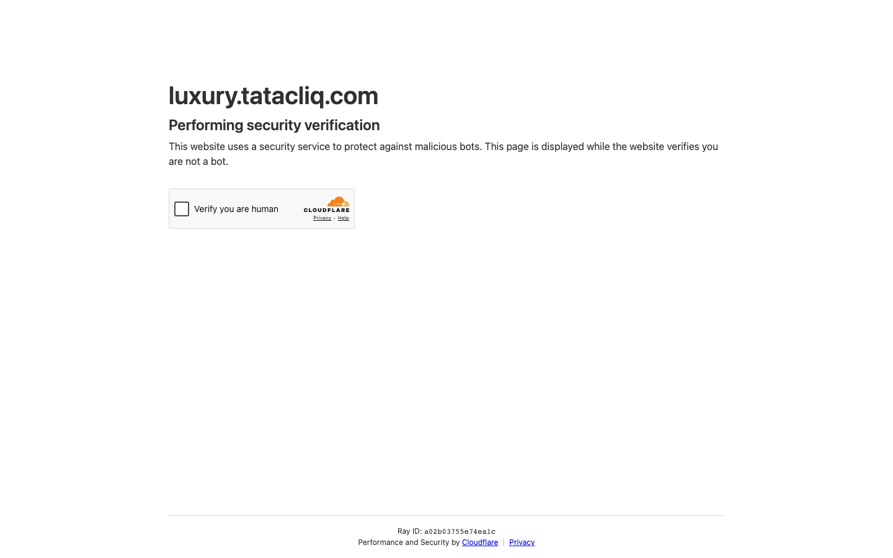

**페이지 메타 정보**

| page | title | description |
|---|---|---|
| [`home`](https://luxury.tatacliq.com/) | Just a moment... |  |

### 4.9 인도네시아 _( Indonesia )_

- 한국 수출규모 순위: **#5** · region: `asia` · tier `1` · currency `IDR`
- 수집 사이트: **5개** (성공 3)
- 메모: 동남아 최대 인구, modest fashion 비중 큼
#### [Berrybenka](https://www.berrybenka.com/)

- URL: <https://www.berrybenka.com/>
- 페이지: **OK 0 · FAIL 1**

**실패 페이지**

- `home` — http_error: ConnectError: [Errno 8] nodename nor servname provided, or not known

#### [Hijup](https://www.hijup.com/)

- URL: <https://www.hijup.com/>
- 페이지: **OK 1 · FAIL 0**

**페이지 메타 정보**

| page | title | description |
|---|---|---|
| [`home`](https://www.hijup.com/) | Latest Scarf, Tunic, Long Dress Collection | HIJUP | Trusted Muslim Women's Clothing Online Shopping Site. Buy latest collection of Abaya, Blouse, Dress, Tunic, Printed Scarf. International shi |

#### [Shopee Indonesia](https://shopee.co.id/)

- URL: <https://shopee.co.id/>
- 페이지: **OK 1 · FAIL 0**

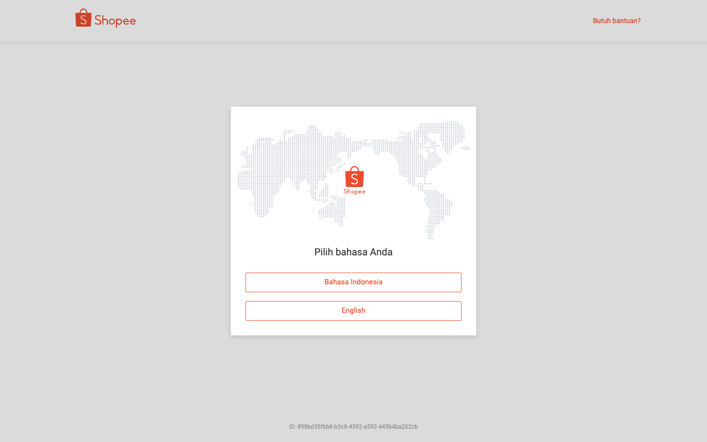

**대표 상품 이미지** (상위 6장, 출처 URL 포함)

-  — 출처 <https://deo.shopeemobile.com/shopee/shopee-pcmall-live-sg/assets/1c8bdaaf45e1fd48.png>

**페이지 메타 정보**

| page | title | description |
|---|---|---|
| [`home`](https://shopee.co.id/verify/traffic/error?home_url=https%3A%2F%2Fshopee.co.id&is_logged_in=false&next=https%3A%2F%2Fshopee.co.id%2F&tracking_id=898bd35fbb6-b3c8-4392-a592-445b4ba202cb&type=4) | Shopee Indonesia | Situs Belanja Online Terlengkap & Terpercaya |  |

#### [Tokopedia](https://www.tokopedia.com/)

- URL: <https://www.tokopedia.com/>
- 페이지: **OK 0 · FAIL 1**

**실패 페이지**

- `home` — playwright_error: Error: Page.goto: net::ERR_HTTP2_PROTOCOL_ERROR at https://www.tokopedia.com/
Call log:
  - navigating to "https://www.tokopedia.com/", waiting until "domcontentloaded"

#### [Zalora Indonesia](https://www.zalora.co.id/)

- URL: <https://www.zalora.co.id/>
- 페이지: **OK 1 · FAIL 0**

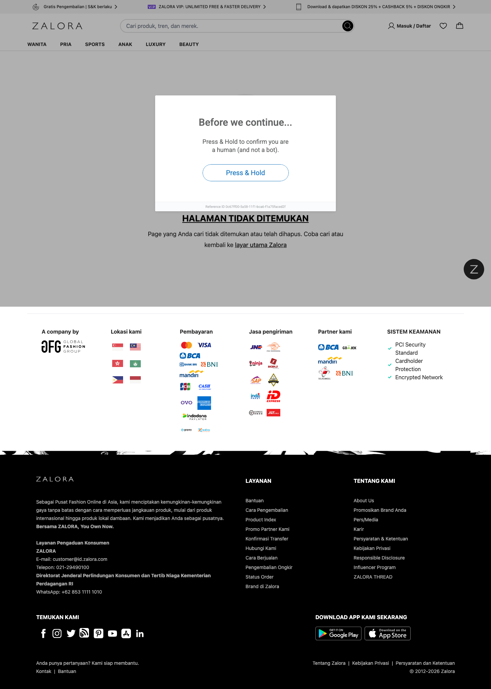

**대표 상품 이미지** (상위 6장, 출처 URL 포함)

-  — 출처 <https://static-id.zacdn.com/next-assets/static-assets/images/logo/icon_mastercard.png>
-  — 출처 <https://static-id.zacdn.com/next-assets/static-assets/images/logo/icon_visa.png>
-  — 출처 <https://static-id.zacdn.com/next-assets/static-assets/images/logo/icon_ovo.png>

**페이지 메타 정보**

| page | title | description |
|---|---|---|
| [`new_women`](https://www.zalora.co.id/wanita/new-arrivals) | Halaman tidak ditemukan | ZALORA |  |

### 4.10 이탈리아 _( Italy )_

- 한국 수출규모 순위: **#21** · region: `europe` · tier `3` · currency `EUR`
- 수집 사이트: **5개** (성공 4)
- 메모: 럭셔리/제조 강국
#### [Calzedonia](https://www.calzedonia.com/)

- URL: <https://www.calzedonia.com/>
- 페이지: **OK 1 · FAIL 0**

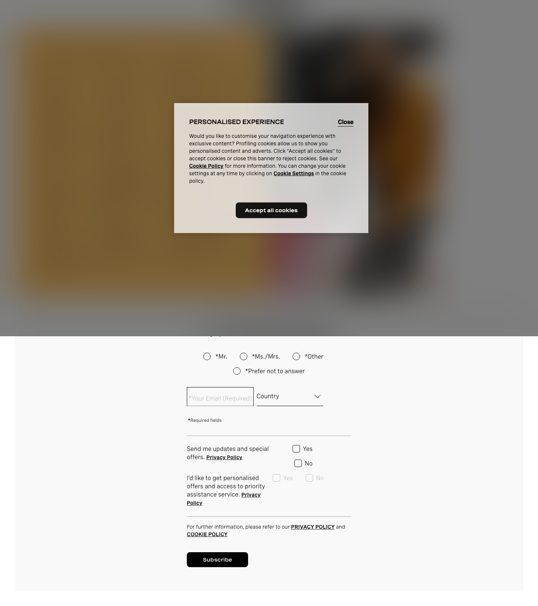

**대표 상품 이미지** (상위 6장, 출처 URL 포함)

-  — 출처 <https://cdn.cookielaw.org/logos/static/ot_company_logo.png>

**페이지 메타 정보**

| page | title | description |
|---|---|---|
| [`home`](https://www.calzedonia.com/) | Visit Calzedonia's official website: Socks, Tights, Leggings and Swimwear. Discover Calzedonia's collections for Women, Men and Children | Visit Calzedonia's official website: Socks, Tights, Leggings and Swimwear. Discover Calzedonia's collections for Women, Men and Children |

#### [LuisaViaRoma](https://www.luisaviaroma.com/)

- URL: <https://www.luisaviaroma.com/>
- 페이지: **OK 1 · FAIL 0**

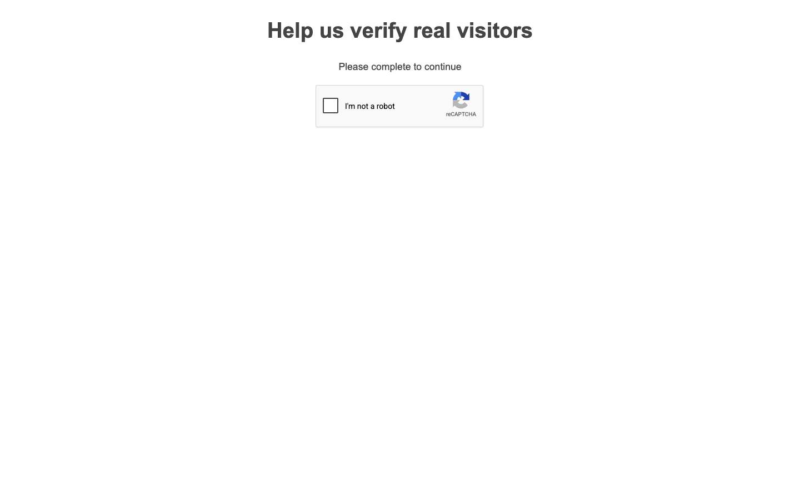

**페이지 메타 정보**

| page | title | description |
|---|---|---|
| [`home`](https://www.luisaviaroma.com/) | Captcha Page |  |

#### [OVS](https://www.ovs.it/)

- URL: <https://www.ovs.it/>
- 페이지: **OK 1 · FAIL 0**

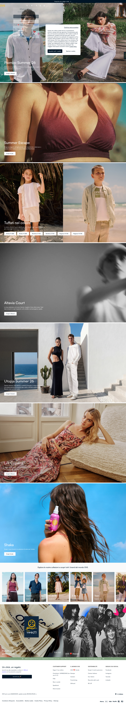

**대표 상품 이미지** (상위 6장, 출처 URL 포함)

-  — 출처 <https://www.ovs.it/on/demandware.static/-/Sites-ovs-Library/default/dw079855fd/images/menu_emoji/emoji_5.png>
-  — 출처 <https://www.ovs.it/on/demandware.static/-/Sites-ovs-Library/default/dw88d8dab4/images/menu_emoji/emoji_1.png>
- 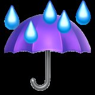 — 출처 <https://www.ovs.it/on/demandware.static/-/Sites-ovs-Library/default/dwf806cee6/images/menu_emoji/emoji_6.png>
- 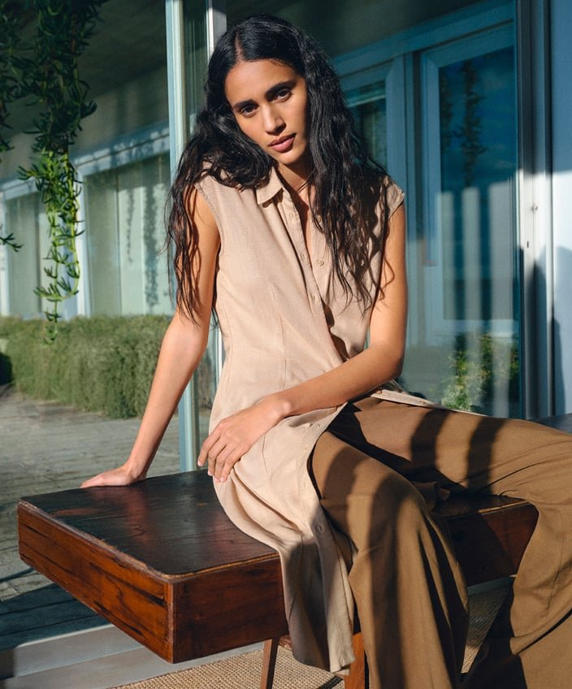 — 출처 <https://www.ovs.it/on/demandware.static/-/Sites-ovs-Library/default/dw6e8af036/images/cardnuovomenu/Donna_lino_ss26.jpg>
- 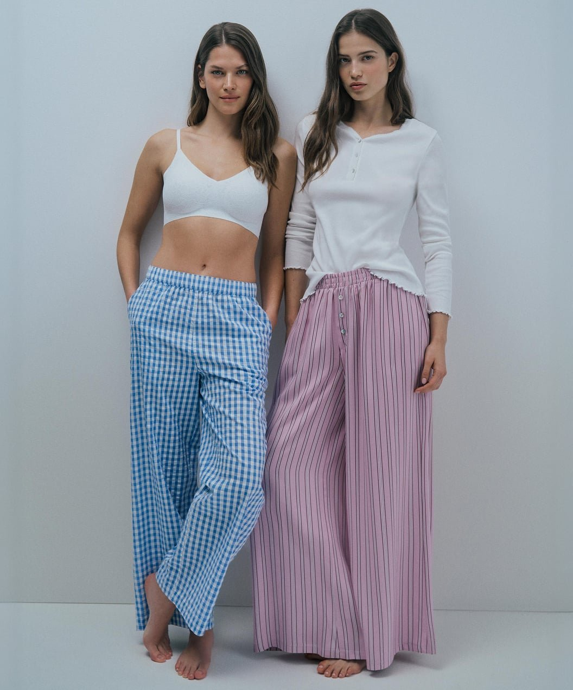 — 출처 <https://www.ovs.it/on/demandware.static/-/Sites-ovs-Library/default/dw77faff98/images/cardnuovomenu/Donna_Intimo e pigiami.jpg>
- 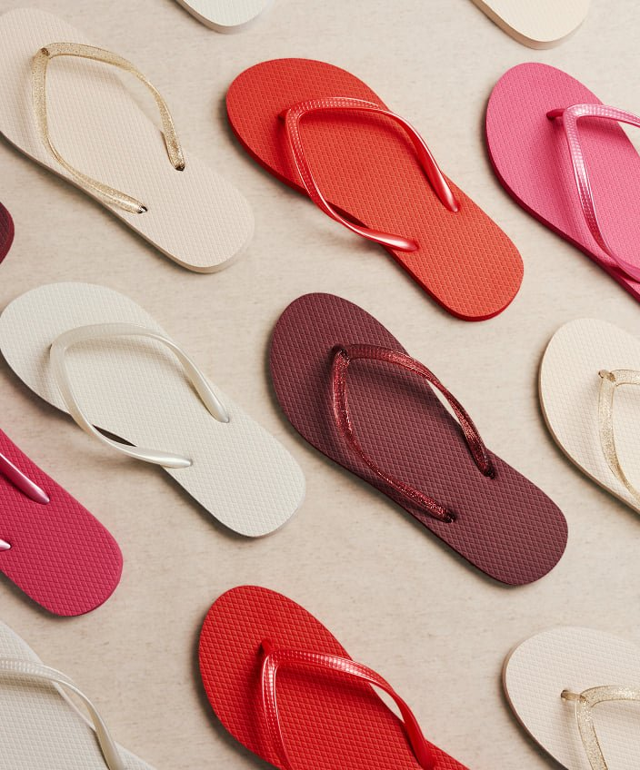 — 출처 <https://www.ovs.it/on/demandware.static/-/Sites-ovs-Library/default/dw12293212/images/cardnuovomenu/Accessori_donnamare.jpg>

**페이지 메타 정보**

| page | title | description |
|---|---|---|
| [`home`](https://www.ovs.it/it/it/) | OVS: Abbigliamento da Donna, Uomo e Bambini | Scopri le ultime novità di OVS su Abbigliamento Uomo, Donna, Bambini, prodotti di Bellezza e per la Casa. Visita il sito e acquista subito.  |

#### [Rinascente](https://www.rinascente.it/)

- URL: <https://www.rinascente.it/>
- 페이지: **OK 1 · FAIL 0**

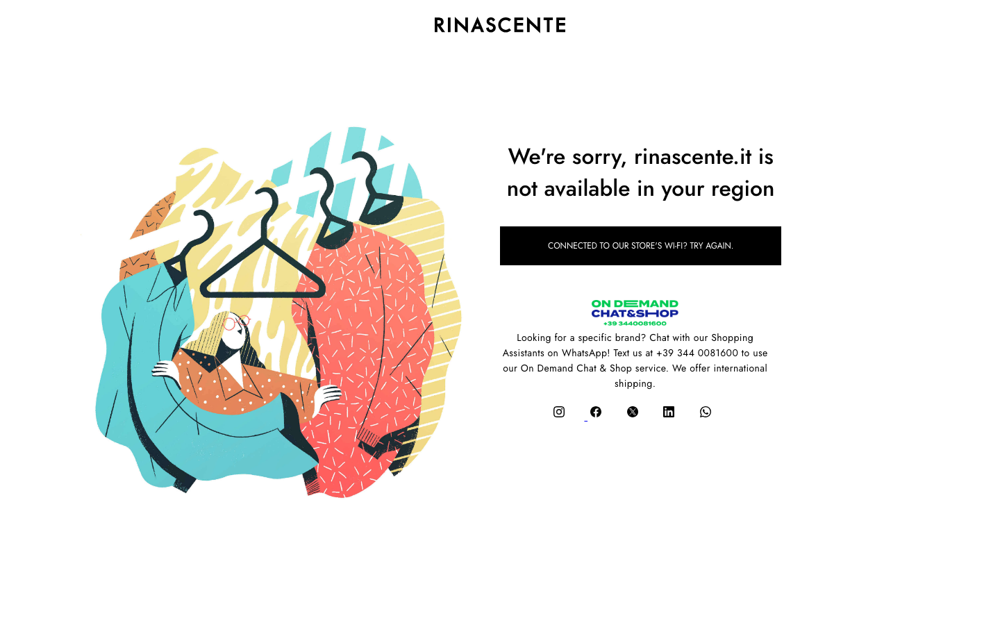

**페이지 메타 정보**

| page | title | description |
|---|---|---|
| [`home`](https://www.rinascente.it/) | rinascente.it is not available in your region |  |

#### [Yoox](https://www.yoox.com/)

- URL: <https://www.yoox.com/>
- 페이지: **OK 0 · FAIL 1**

**실패 페이지**

- `home` — playwright_error: Error: Page.goto: net::ERR_HTTP2_PROTOCOL_ERROR at https://www.yoox.com/
Call log:
  - navigating to "https://www.yoox.com/", waiting until "domcontentloaded"

### 4.11 일본 _( Japan )_

- 한국 수출규모 순위: **#2** · region: `asia` · tier `1` · currency `JPY`
- 수집 사이트: **5개** (성공 4)
- 메모: K-패션 선호도 높고 온라인 패션몰 발달
#### [GU Japan](https://www.gu-global.com/jp/)

- URL: <https://www.gu-global.com/jp/>
- 페이지: **OK 1 · FAIL 0**

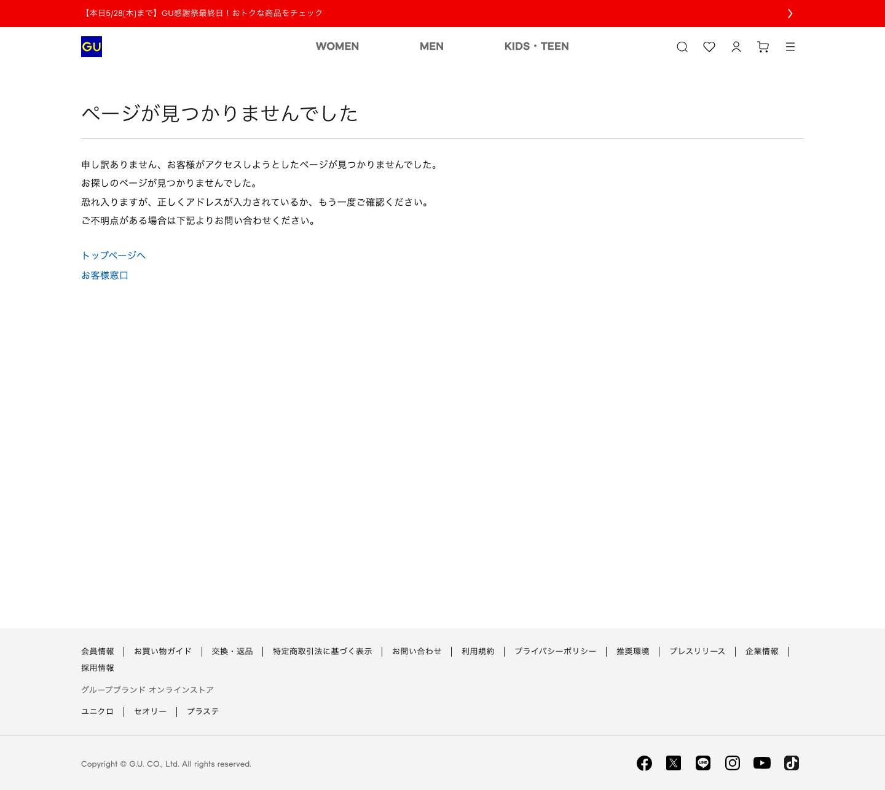

**대표 상품 이미지** (상위 6장, 출처 URL 포함)

-  — 출처 <https://image.uniqlo.com/GU/ST3/jp/imagesother/Navigation/WOMEN_Category/2026/260513/Category_w_Half-Tshirt.png>
-  — 출처 <https://image.uniqlo.com/GU/ST3/jp/imagesother/Navigation/WOMEN_Category/2026/260515/Category_w_Tshirt.png>
-  — 출처 <https://image.uniqlo.com/GU/ST3/jp/imagesother/Navigation/WOMEN_Category/2026/260513/Category_w_Shirt-Blouse.png>
-  — 출처 <https://image.uniqlo.com/GU/ST3/jp/imagesother/Navigation/WOMEN_Category/2026/260513/Category_w_Knit-Cardigan.png>
-  — 출처 <https://image.uniqlo.com/GU/ST3/jp/imagesother/Navigation/WOMEN_Category/2026/260513/Category_w_onepeace.png>
-  — 출처 <https://image.uniqlo.com/GU/ST3/jp/imagesother/Navigation/WOMEN_Category/2026/260513/Category_w_Sweat.png>

**페이지 메타 정보**

| page | title | description |
|---|---|---|
| [`new_arrivals`](https://www.gu-global.com/jp/ja/not-found) | 申し訳ありません、お客様がアクセスしようとしたページが見つかりませんでした。恐れ入りますが、正しくアドレスが入力されているか、もう一度ご確認ください。 | ジーユー | 申し訳ありません、お客様がアクセスしようとしたページが見つかりませんでした。恐れ入りますが、正しくアドレスが入力されているか、もう一度ご確認ください。 |

#### [Rakuten Fashion](https://brandavenue.rakuten.co.jp/)

- URL: <https://brandavenue.rakuten.co.jp/>
- 페이지: **OK 1 · FAIL 1**

**대표 상품 이미지** (상위 6장, 출처 URL 포함)

-  — 출처 <https://brandavenue.r10s.jp/img/library/index/sbn_flagshipstore_20231003.png>
- 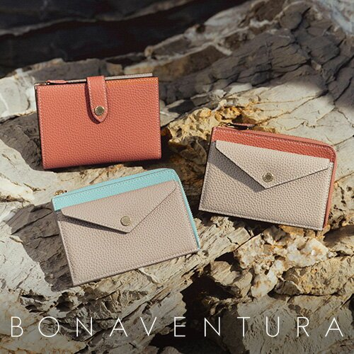 — 출처 <https://brandavenue.r10s.jp/img/news/01/376098/pc_n.jpg>
- 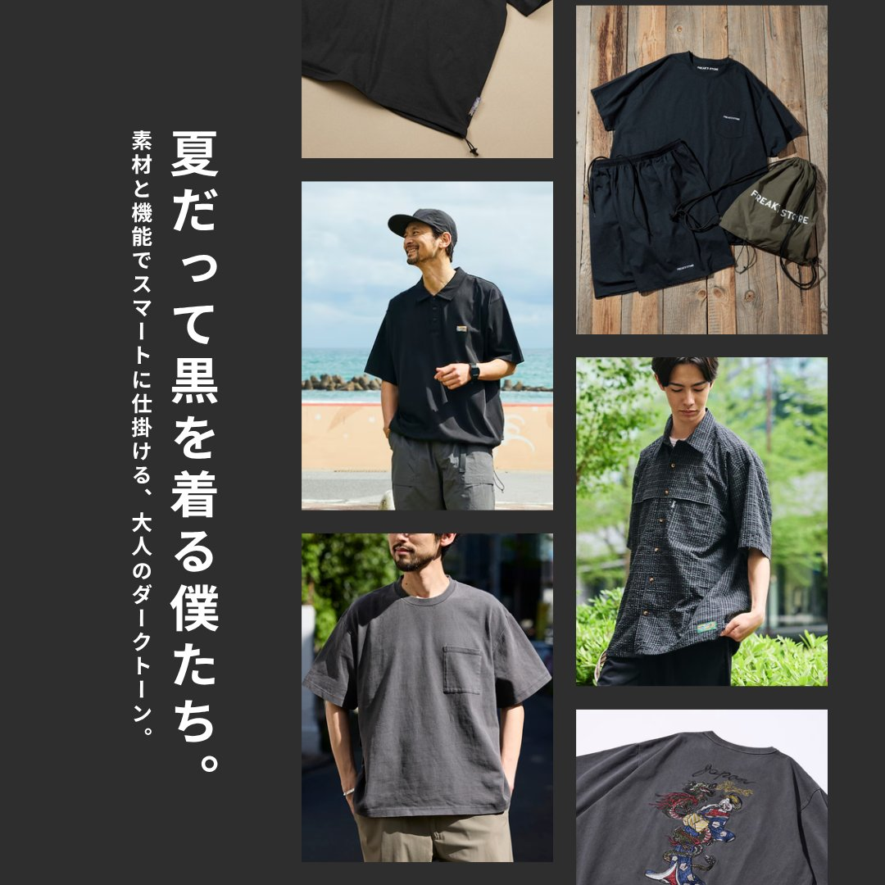 — 출처 <https://brandavenue.r10s.jp/img/news/01/376095/pc_n.png>
- 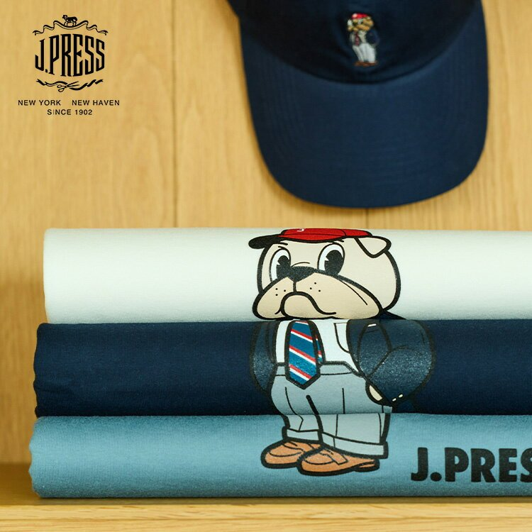 — 출처 <https://brandavenue.r10s.jp/img/news/01/376097/pc_n.jpg>
- 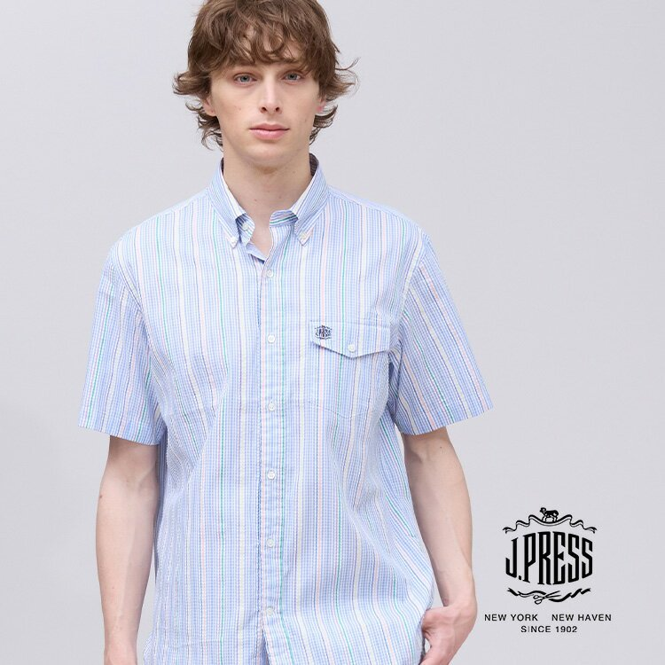 — 출처 <https://brandavenue.r10s.jp/img/news/01/376106/pc_n.jpg>
- 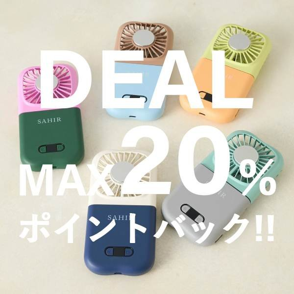 — 출처 <https://brandavenue.r10s.jp/img/news/01/376096/pc_n.jpg>

**페이지 메타 정보**

| page | title | description |
|---|---|---|
| [`men`](https://brandavenue.rakuten.co.jp/men/) | MEN | ファッション通販 Rakuten Fashion(楽天ファッション／旧楽天ブランドアベニュー) | Rakuten Fashion(楽天ファッション)は人気ブランドを取り扱うファッション通販サイトです。新作アイテム続々入荷！セール商品やクーポン対象商品も豊富。／税込3,980円以上購入で送料無料／楽天ポイントが使えて貯まる！ |

**실패 페이지**

- `women` — http_status_404

#### [Uniqlo Japan](https://www.uniqlo.com/jp/)

- URL: <https://www.uniqlo.com/jp/>
- 페이지: **OK 1 · FAIL 0**

**페이지 메타 정보**

| page | title | description |
|---|---|---|
| [`new_arrivals`](https://www.uniqlo.com/jp/ja/contents/feature/new-arrivals/) | 404 Not Found |  |

#### [WEAR](https://wear.jp/)

- URL: <https://wear.jp/>
- 페이지: **OK 1 · FAIL 0**

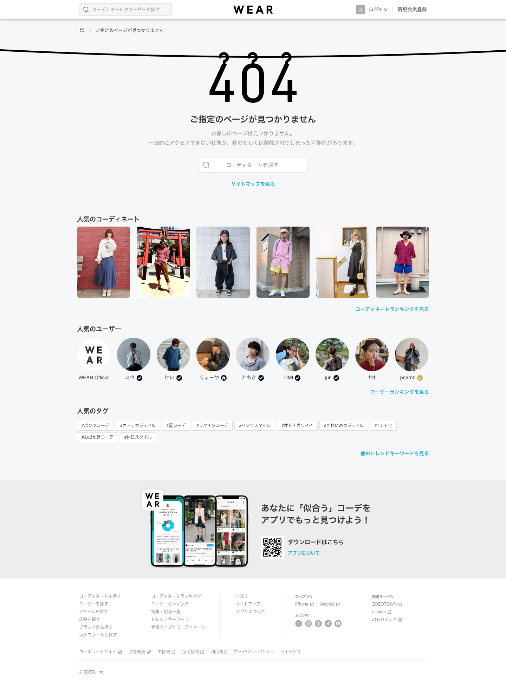

**대표 상품 이미지** (상위 6장, 출처 URL 포함)

-  — 출처 <https://wear.jp/public/_next/static/media/notfound_bg.0mfqf_sjjg4.q.png>
-  — 출처 <https://wear.jp/public/_next/static/media/notfound_4.0h3~tstn7vy~q.png>
-  — 출처 <https://wear.jp/public/_next/static/media/notfound_0.17sfauikqe-ig.png>
- 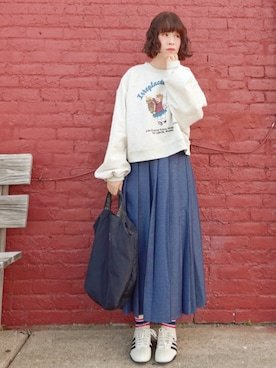 — 출처 <https://images.wear2.jp/coordinate/Grin7q0y/5Ectan5f/1779817784_276.jpg>
- 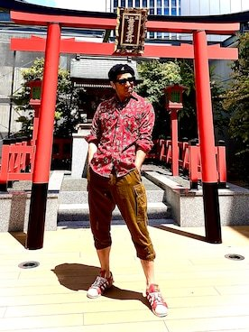 — 출처 <https://images.wear2.jp/coordinate/lei0jZzl/txcCjggP/1779837655_276.jpg>
- 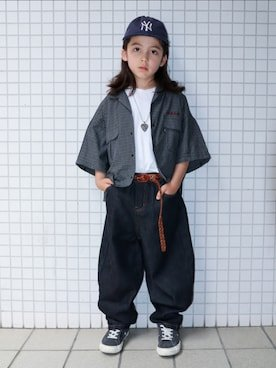 — 출처 <https://images.wear2.jp/coordinate/4XiqzJr4/YnA8mK0v/1779919546_276.jpg>

**페이지 메타 정보**

| page | title | description |
|---|---|---|
| [`ranking`](https://wear.jp/ranking/coordinate/) | ご指定のページが見つかりません - WEAR |  |

#### [ZOZOTOWN](https://zozo.jp/)

- URL: <https://zozo.jp/>
- 페이지: **OK 0 · FAIL 2**

**실패 페이지**

- `new` — playwright_error: TimeoutError: Page.goto: Timeout 30000ms exceeded.
Call log:
  - navigating to "https://zozo.jp/category/new/", waiting until "domcontentloaded"

- `ranking` — playwright_error: TimeoutError: Page.goto: Timeout 30000ms exceeded.
Call log:
  - navigating to "https://zozo.jp/ranking/", waiting until "domcontentloaded"

### 4.12 카자흐스탄 _( Kazakhstan )_

- 한국 수출규모 순위: **#31** · region: `asia` · tier `3` · currency `KZT`
- 수집 사이트: **5개** (성공 3)
- 메모: 중앙아시아 핵심 시장. 러시아 e-commerce 영향권 (Wildberries/Ozon). 사용자 추가 요청
#### [Kaspi Magazin](https://kaspi.kz/)

- URL: <https://kaspi.kz/>
- 페이지: **OK 1 · FAIL 0**

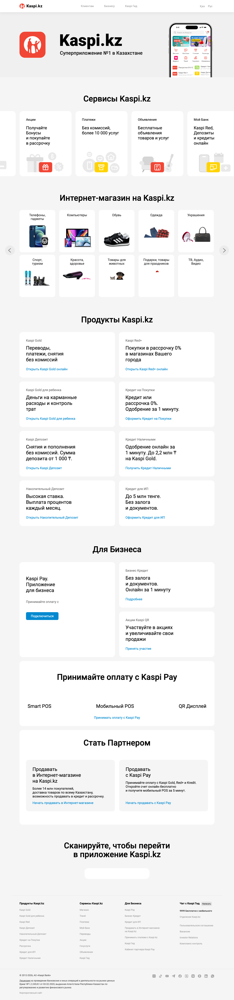

**대표 상품 이미지** (상위 6장, 출처 URL 포함)

- 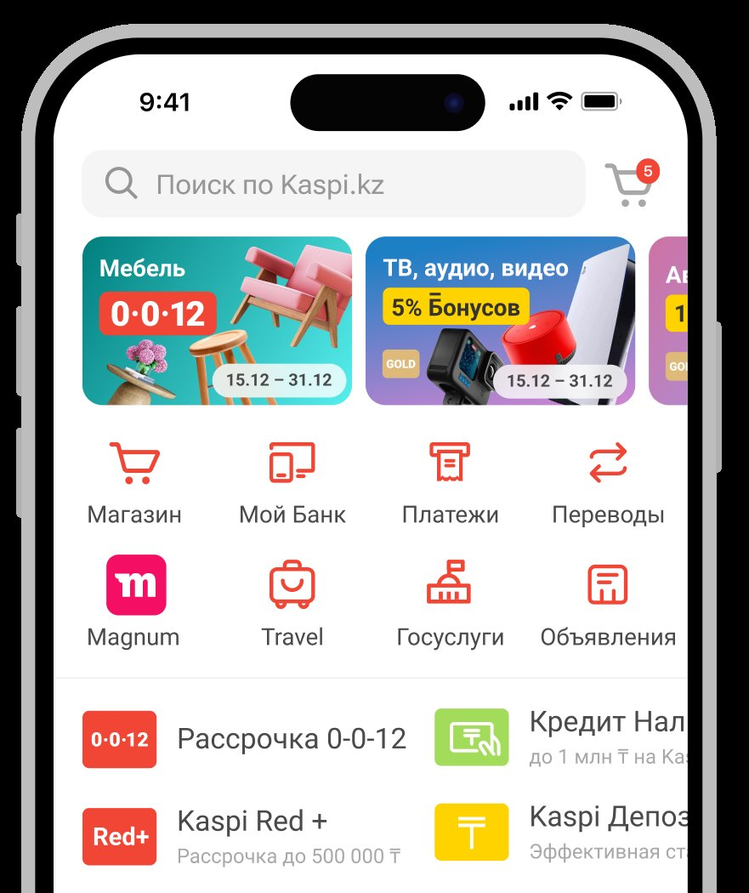 — 출처 <https://kaspi.kz/img/externalImg/2025-phone-3x-n.png>
-  — 출처 <https://kaspi.kz/img/externalImg/Phone.png>
-  — 출처 <https://kaspi.kz/img/externalImg/Computer.png>
-  — 출처 <https://kaspi.kz/img/externalImg/Shoes1.png>
- 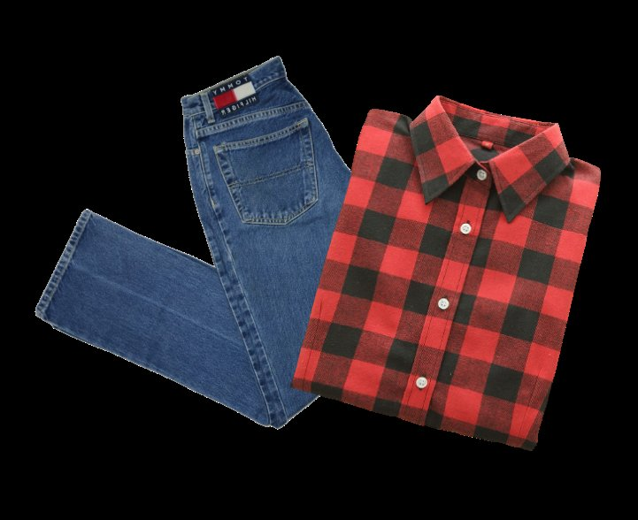 — 출처 <https://kaspi.kz/img/externalImg/Clothes1.png>
- 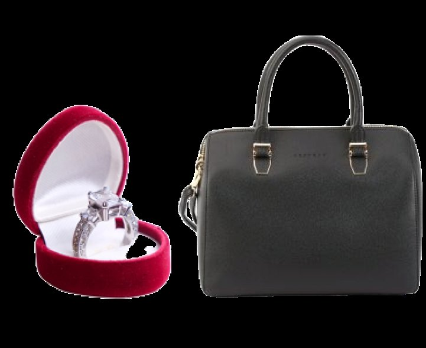 — 출처 <https://kaspi.kz/img/externalImg/Jewelry.png>

**페이지 메타 정보**

| page | title | description |
|---|---|---|
| [`home`](https://kaspi.kz/) | Kaspi.kz – Магазин, Платежи, Мой Банк, Переводы, Red, Бонусы, Гид | Покупка в кредит, Оплата услуг, Kaspi Bank, Переводы и конвертация, Выписка по картам, Остаток на депозите, Задолженность по кредиту, Покупк |

#### [Lamoda Kazakhstan](https://www.lamoda.kz/)

- URL: <https://www.lamoda.kz/>
- 페이지: **OK 0 · FAIL 1**

**실패 페이지**

- `home` — playwright_error: TimeoutError: Page.goto: Timeout 30000ms exceeded.
Call log:
  - navigating to "https://www.lamoda.kz/", waiting until "domcontentloaded"

#### [Mechta](https://mechta.kz/)

- URL: <https://mechta.kz/>
- 페이지: **OK 1 · FAIL 0**

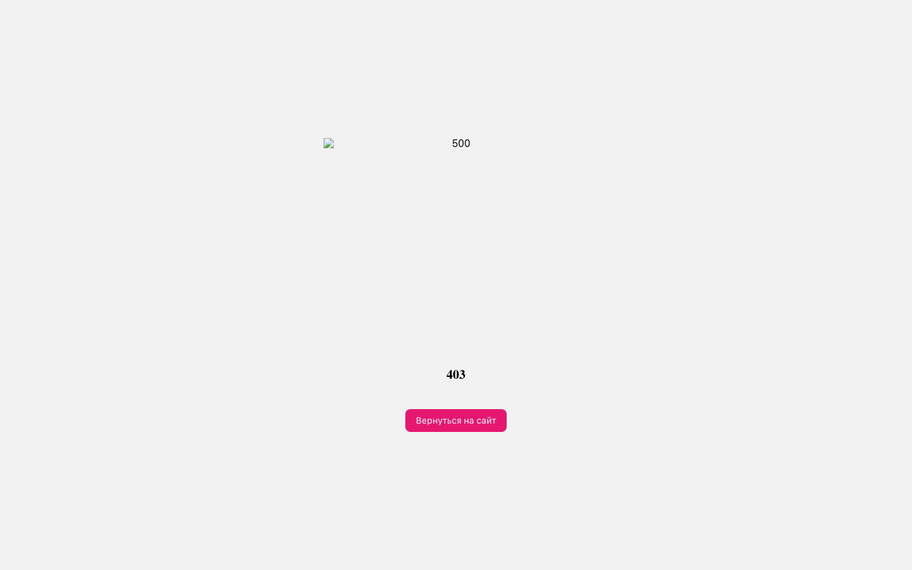

**페이지 메타 정보**

| page | title | description |
|---|---|---|
| [`home`](https://www.mechta.kz/) | _(empty)_ |  |

#### [Ozon Kazakhstan](https://www.ozon.kz/)

- URL: <https://www.ozon.kz/>
- 페이지: **OK 1 · FAIL 0**

**페이지 메타 정보**

| page | title | description |
|---|---|---|
| [`home`](https://www.ozon.kz/?__rr=1) | Antibot Challenge Page |  |

#### [Wildberries Kazakhstan](https://www.wildberries.kz/)

- URL: <https://www.wildberries.kz/>
- 페이지: **OK 0 · FAIL 1**

**실패 페이지**

- `home` — playwright_error: Error: Page.goto: net::ERR_CONNECTION_RESET at https://www.wildberries.kz/
Call log:
  - navigating to "https://www.wildberries.kz/", waiting until "domcontentloaded"

### 4.13 한국 _( South Korea )_

- 한국 수출규모 순위: **#30** · region: `asia` · tier `1` · currency `KRW`
- 수집 사이트: **4개** (성공 3)
- 메모: 비교 기준 (자국). 국내 사업동향 센싱
#### [29CM](https://www.29cm.co.kr/)

- URL: <https://www.29cm.co.kr/>
- 페이지: **OK 1 · FAIL 0**

**최근 유행 상품** (50건 · 상품명 클릭 시 해당 사이트로 이동)

| # | 상품명 | 브랜드 | 가격 | 페이지 |
|---:|---|---|---:|---|
| 1 | [[GIFT SET] 톤28 묵상 아로마틱 바디케어 세트(바디스크럽워시300g+바디로션300g+타올)](https://product.29cm.co.kr/catalog/3720823) | 톤28 | 48,000 KRW | `home` |
| 2 | [펩타시카 글로우 크림&세럼 50ml](https://product.29cm.co.kr/catalog/3910448) | 톤28 | 42,000 KRW | `home` |
| 3 | [해남 404 센텔라 아시아티카 선세럼 + 해남 404 센텔라 아시아티카 틴티드 선스크린](https://product.29cm.co.kr/catalog/3982496) | 톤28 | 70,000 KRW | `home` |
| 4 | [철제 와이드 수납장 낮은형 (40cm) / 무디타 비화이트 슬라이드 서랍장 양념통 정리 선반 캡슐보관함](https://product.29cm.co.kr/catalog/2665166) | 리본제이 | 60,710 KRW | `home` |
| 5 | [철제 와이드 수납장 43cm / 무디타 비화이트 슬라이드 서랍장 양념통 정리 선반 캡슐보관함](https://product.29cm.co.kr/catalog/2304522) | 리본제이 | 65,460 KRW | `home` |
| 6 | [세로형 철제 슬라이딩 수납장 1단 / 무디타 비화이트 슬림 홈카페 영양제 양념통 틈새 정리함](https://product.29cm.co.kr/catalog/2646901) | 리본제이 | 60,710 KRW | `home` |
| 7 | [베이비웍 16cm 블랙 ST311723](https://product.29cm.co.kr/catalog/257008) | 스타우브 | 147,200 KRW | `home` |
| 8 | [원형 꼬꼬떼 16cm 시트롱 ST1016122](https://product.29cm.co.kr/catalog/2850734) | 스타우브 | 238,400 KRW | `home` |
| 9 | [아시아볼 18cm 그레이 ST1731818](https://product.29cm.co.kr/catalog/1325912) | 스타우브 | 247,200 KRW | `home` |
| 10 | [오덴세 테누토 크레요 커트러리 한식기 1인조](https://product.29cm.co.kr/catalog/1551767) | 오덴세 | 19,400 KRW | `home` |
| 11 | [오덴세 테누토 크레요 커트러리 양식기 1인조](https://product.29cm.co.kr/catalog/1551766) | 오덴세 | 19,400 KRW | `home` |
| 12 | [오덴세 레고트 커트러리 한식기 1인조](https://product.29cm.co.kr/catalog/2197545) | 오덴세 | 16,980 KRW | `home` |
| 13 | [[29CM 단독] Flare Shirring Blouse - Ivory](https://product.29cm.co.kr/catalog/2631526) | 라미네즈 | 52,590 KRW | `home` |
| 14 | [[29CM 단독] Flare Shirring Blouse - Beige](https://product.29cm.co.kr/catalog/2631529) | 라미네즈 | 52,590 KRW | `home` |
| 15 | [[29CM 단독]_Natural Cotton Shorts - Navy](https://product.29cm.co.kr/catalog/1635452) | 라미네즈 | 36,980 KRW | `home` |
| 16 | [POCKET - T SHIRT. CreamWhite](https://product.29cm.co.kr/catalog/4009512) | 굿니스 | 71,250 KRW | `home` |
| 17 | [TOP GUN. USN FLIGHT DECK CREW JERSEY. Red](https://product.29cm.co.kr/catalog/3983364) | 굿니스 | 113,050 KRW | `home` |
| 18 | [TOP GUN. USN FLIGHT DECK CREW JERSEY. Green](https://product.29cm.co.kr/catalog/3983313) | 굿니스 | 113,050 KRW | `home` |
| 19 | [미니텀블러 마이텀 150ml 3종세트](https://product.29cm.co.kr/catalog/3994117) | 리빙크리에이터 | 57,360 KRW | `home` |
| 20 | [미니텀블러 마이텀 260ml 3종세트](https://product.29cm.co.kr/catalog/3994070) | 리빙크리에이터 | 52,560 KRW | `home` |

**대표 상품 이미지** (상위 6장, 출처 URL 포함)

- 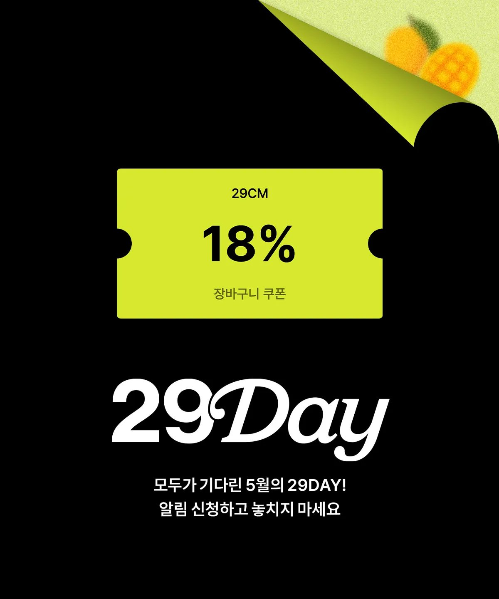 — 출처 <https://img.29cm.co.kr/cms/202605/11f159879d39e56f9f7f4b445002fcc6.png?width=3840&format=webp>
-  — 출처 <https://img.29cm.co.kr/cms/202605/11f159878c28d8af9090efe6fc0f2fe0.png?width=3840&format=webp>
- 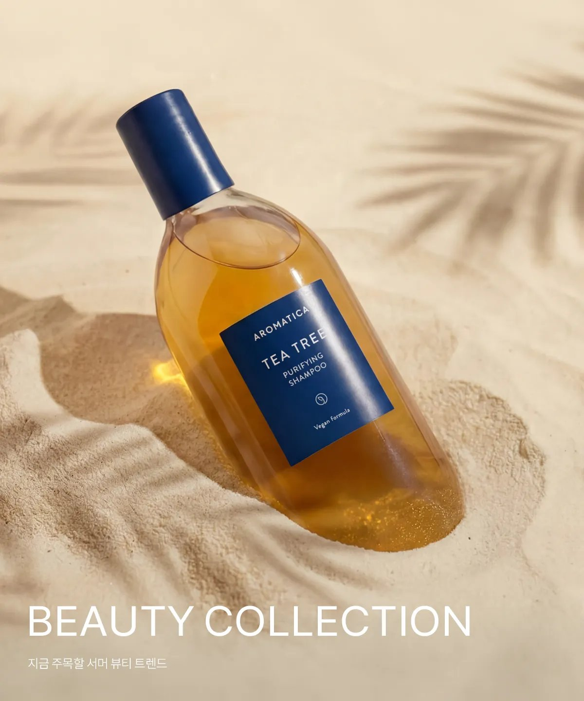 — 출처 <https://img.29cm.co.kr/cms/202605/11f1598773c6eebb90902dcca77fce7d.png?width=3840&format=webp>
- 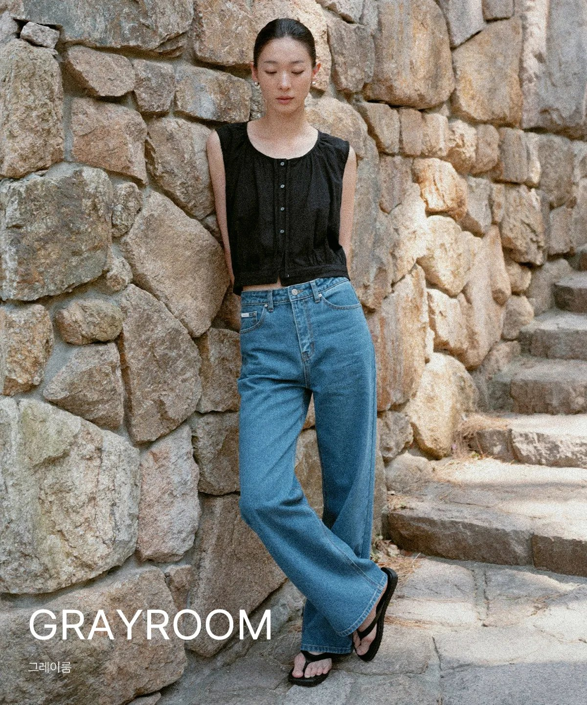 — 출처 <https://img.29cm.co.kr/cms/202605/11f159876b49c6859090f9275b971e4b.png?width=3840&format=webp>
- 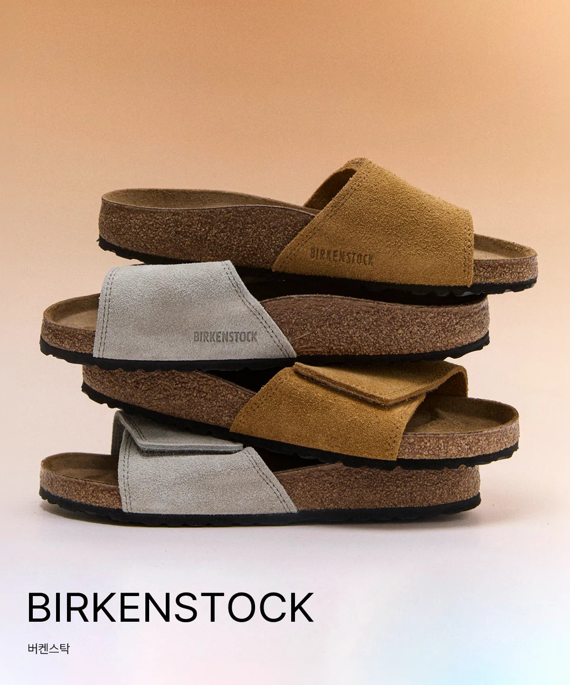 — 출처 <https://img.29cm.co.kr/cms/202605/11f15987615f52d39f7f11fecfc8005b.png?width=3840&format=webp>
- 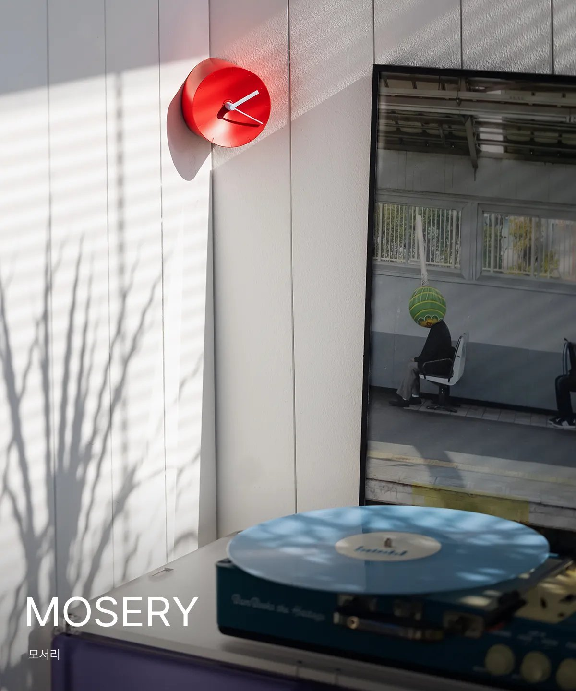 — 출처 <https://img.29cm.co.kr/cms/202605/11f159875666070d9f7fa3c6b540a2f4.png?width=3840&format=webp>

**페이지 메타 정보**

| page | title | description |
|---|---|---|
| [`home`](https://www.29cm.co.kr/) | 감도 깊은 취향 셀렉트샵 29CM | 패션, 라이프스타일, 컬처까지 29CM만의 감도 깊은 셀렉션을 만나보세요. |

#### [Musinsa](https://www.musinsa.com/)

- URL: <https://www.musinsa.com/>
- 페이지: **OK 0 · FAIL 1**

**실패 페이지**

- `home` — robots_disallowed

#### [W Concept](https://www.wconcept.co.kr/)

- URL: <https://www.wconcept.co.kr/>
- 페이지: **OK 1 · FAIL 0**

**최근 유행 상품** (30건 · 상품명 클릭 시 해당 사이트로 이동)

| # | 상품명 | 브랜드 | 가격 | 페이지 |
|---:|---|---|---:|---|
| 1 | [썸머 수피마 레깅스](https://m.wconcept.co.kr/Product/308601123) | 베베테일러 | 9,460 KRW | `home` |
| 2 | [베리팝 프릴 래쉬가드](https://m.wconcept.co.kr/Product/308594272) | 베베테일러 | 59,340 KRW | `home` |
| 3 | [말랑젤리 프릴팬츠](https://m.wconcept.co.kr/Product/308522517) | 베베테일러 | 26,660 KRW | `home` |
| 4 | [멜로우 슬릿 롱티셔츠](https://m.wconcept.co.kr/Product/308601057) | 베베테일러 | 27,520 KRW | `home` |
| 5 | [말랑젤리 랩치마바지](https://m.wconcept.co.kr/Product/308572985) | 베베테일러 | 32,680 KRW | `home` |
| 6 | [까미유 스카시 가디건](https://m.wconcept.co.kr/Product/308520754) | 베베테일러 | 42,140 KRW | `home` |
| 7 | [말랑젤리 반바지](https://m.wconcept.co.kr/Product/308572979) | 베베테일러 | 24,940 KRW | `home` |
| 8 | [루나 7부 치렝스](https://m.wconcept.co.kr/Product/308601130) | 베베테일러 | 20,640 KRW | `home` |
| 9 | [에어핏 치렝스](https://m.wconcept.co.kr/Product/308601134) | 베베테일러 | 29,240 KRW | `home` |
| 10 | [로웰 롤업 데님팬츠 _2COLORS](https://m.wconcept.co.kr/Product/308423901) | 베베테일러 | 33,540 KRW | `home` |
| 11 | [에어리 커버업 점퍼](https://m.wconcept.co.kr/Product/308594247) | 베베테일러 | 50,740 KRW | `home` |
| 12 | [버블 와이드 팬츠](https://m.wconcept.co.kr/Product/308601094) | 베베테일러 | 22,360 KRW | `home` |
| 13 | [버블 레이스 티셔츠](https://m.wconcept.co.kr/Product/308601092) | 베베테일러 | 24,080 KRW | `home` |
| 14 | [모네 아일렛 프릴 티](https://m.wconcept.co.kr/Product/308572970) | 베베테일러 | 23,220 KRW | `home` |
| 15 | [숄더 트임 프릴 티셔츠](https://m.wconcept.co.kr/Product/308522429) | 베베테일러 | 23,220 KRW | `home` |
| 16 | [플로우 블라우스_2COLORS](https://m.wconcept.co.kr/Product/308481454) | 베베테일러 | 36,980 KRW | `home` |
| 17 | [슬릿 하트 티셔츠](https://m.wconcept.co.kr/Product/308423847) | 베베테일러 | 26,660 KRW | `home` |
| 18 | [클로에 스트랩 가디건_3COLORS](https://m.wconcept.co.kr/Product/308422086) | 베베테일러 | 26,660 KRW | `home` |
| 19 | [라인 리본 프릴 쇼츠 _2COLORS](https://m.wconcept.co.kr/Product/308423890) | 베베테일러 | 29,240 KRW | `home` |
| 20 | [슈가 리본 원피스](https://m.wconcept.co.kr/Product/308573016) | 베베테일러 | 50,740 KRW | `home` |

**페이지 메타 정보**

| page | title | description |
|---|---|---|
| [`home`](https://www.wconcept.co.kr/) | _(empty)_ |  |

#### [Zigzag](https://zigzag.kr/)

- URL: <https://zigzag.kr/>
- 페이지: **OK 1 · FAIL 0**

**최근 유행 상품** (36건 · 상품명 클릭 시 해당 사이트로 이동)

| # | 상품명 | 브랜드 | 가격 | 페이지 |
|---:|---|---|---:|---|
| 1 | [[+여름🌴/50만장돌파/made] 허쉬 코튼 와이드팬츠 (숏/기본/롱)](https://store.zigzag.kr/app/catalog/products/143224732?browsing_type=NATIVE_BROWSER) | 리얼코코 | 17,710 KRW | `home` |
| 2 | [[🏆역대급100만장/편안함최강] made. 마켓 와이드 트레이닝슬랙스 (+숏/베이직/롱ver) - 3 size](https://store.zigzag.kr/app/catalog/products/141360158?browsing_type=NATIVE_BROWSER) | 슬로우앤드 | 26,320 KRW | `home` |
| 3 | [[7부/5부/크롭팬츠🤍/made] 스니크 카프리 팬츠](https://store.zigzag.kr/app/catalog/products/168285067?browsing_type=NATIVE_BROWSER) | 리얼코코 | 26,270 KRW | `home` |
| 4 | [[🧊여름/20만장판매/Essential] 릴리스 텐셀 오버핏 셔츠](https://store.zigzag.kr/app/catalog/products/160269610?browsing_type=NATIVE_BROWSER) | 매니크 | 28,800 KRW | `home` |
| 5 | [[예진 PICK] [2만9천장돌파/S-XL/MADE] 유로즈 레이어드 슬릿 롱 스커트 - 3 타입 (당일출고/여름/봄/A라인/맥시/옆트임/시스루/링클프리/하객룩/오피스룩/출근룩)](https://store.zigzag.kr/app/catalog/products/165586743?browsing_type=NATIVE_BROWSER) | 커먼유니크 | 29,250 KRW | `home` |
| 6 | [[+반팔💙/하객룩/made] 드멜린 블라우스](https://store.zigzag.kr/app/catalog/products/160291434?browsing_type=NATIVE_BROWSER) | 리얼코코 | 25,530 KRW | `home` |
| 7 | [[✨구김걱정NO/💐하객룩추천] made. 세미부츠컷 찰랑슬랙스 (+베이직/롱ver) - 4 size](https://store.zigzag.kr/app/catalog/products/142355088?browsing_type=NATIVE_BROWSER) | 슬로우앤드 | 31,120 KRW | `home` |
| 8 | [[🌸사계절필수/인생티♥] made. 솔트 클린 반팔티셔츠 (스탠다드핏/루즈핏) - 7 color](https://store.zigzag.kr/app/catalog/products/141373178?browsing_type=NATIVE_BROWSER) | 슬로우앤드 | 12,370 KRW | `home` |
| 9 | [[여름청바지👖/3단기장/made] 시그니처 논페이드 데님 팬츠](https://store.zigzag.kr/app/catalog/products/158971418?browsing_type=NATIVE_BROWSER) | 리얼코코 | 17,710 KRW | `home` |
| 10 | [[💗기본템/부유방커버] made. 쫀쫀 커버핏 슬리브리스 (유교걸나시!) - 7 color](https://store.zigzag.kr/app/catalog/products/160291278?browsing_type=NATIVE_BROWSER) | 슬로우앤드 | 15,040 KRW | `home` |
| 11 | [[S-L/5만장돌파🏆/made] 모티브 핀턱 슬랙스](https://store.zigzag.kr/app/catalog/products/141911042?browsing_type=NATIVE_BROWSER) | 리얼코코 | 17,710 KRW | `home` |
| 12 | [[+반팔💙/살안타템/made] 모드아 스트라이프 오버핏 셔츠](https://store.zigzag.kr/app/catalog/products/145874177?browsing_type=NATIVE_BROWSER) | 리얼코코 | 24,130 KRW | `home` |
| 13 | [[3타입][무지/배색/스트라이프][MADE] 러브유 보트넥 레이어드 민소매 골지나시 (44~110) (빅사이즈나시-끈나시-민소매-무지나시-스트라이프나시--부유방커버나시)](https://store.zigzag.kr/app/catalog/products/159214859?browsing_type=NATIVE_BROWSER) | 핫핑 | 14,200 KRW | `home` |
| 14 | [[🔥후기인증/🎖️1등슬랙스] made. 모먼트 투커버 올데이슬랙스 (+숏/베이직/롱ver) - 4 size](https://store.zigzag.kr/app/catalog/products/136095576?browsing_type=NATIVE_BROWSER) | 슬로우앤드 | 31,840 KRW | `home` |
| 15 | [베럴 see-through knit (3color)](https://store.zigzag.kr/app/catalog/products/170101171?browsing_type=NATIVE_BROWSER) | 리치무드 | 16,020 KRW | `home` |
| 16 | [[여름청바지👖/후기최고] made. 투데이 썸머라이트 데님팬츠 (+베이직/롱ver) - 4 size](https://store.zigzag.kr/app/catalog/products/122809429?browsing_type=NATIVE_BROWSER) | 슬로우앤드 | 26,520 KRW | `home` |
| 17 | [Basket 바스켓 - 버닝 도트 조거 팬츠 (밴딩 땡땡이) 1col](https://store.zigzag.kr/app/catalog/products/170099694?browsing_type=NATIVE_BROWSER) | 마베케이션 | 64,800 KRW | `home` |
| 18 | [[세상여리,데이트룩] 아우릴 펀칭 스칼럽 반팔 니트 가디건 88293](https://store.zigzag.kr/app/catalog/products/170106591?browsing_type=NATIVE_BROWSER) | 공구우먼 | 24,240 KRW | `home` |
| 19 | [[MADE/7color]젠느 투타입 반팔 티셔츠](https://store.zigzag.kr/app/catalog/products/163287572?browsing_type=NATIVE_BROWSER) | 베이델리 | 15,610 KRW | `home` |
| 20 | [[30만장돌파/MADE]누벨 데일리 나일론 슬릿 롱 스커트 (S-L/장마룩/여름스커트/바스락스커트/데일리룩/출근룩/h라인스커트/나일론치마/롱치마)](https://store.zigzag.kr/app/catalog/products/140798161?browsing_type=NATIVE_BROWSER) | 케이클럽 | 24,400 KRW | `home` |

**대표 상품 이미지** (상위 6장, 출처 URL 포함)

-  — 출처 <https://cf.image-farm.s.zigzag.kr/original/cms/2026/05/26/202605260719412242_053111.png?quality=80&format=webp&transparent=true&width=1029&height=1188>
-  — 출처 <https://cf.image-farm.s.zigzag.kr/original/cms/2026/05/24/202605241355010159_055597.png?width=1029&height=1188&quality=80&format=webp&transparent=true>
-  — 출처 <https://cf.image-farm.s.zigzag.kr/original/cms/2026/05/24/202605241356477066_022524.png?width=1029&height=1188&quality=80&format=webp&transparent=true>
-  — 출처 <https://cf.image-farm.s.zigzag.kr/original/cms/2026/05/24/202605241430228166_085737.jpg?width=1029&height=1188&quality=80&format=webp&transparent=true>
-  — 출처 <https://cf.image-farm.s.zigzag.kr/original/cms/2026/05/25/202605251325056069_083592.jpg?width=1029&height=1188&quality=80&format=webp&transparent=true>
-  — 출처 <https://cf.image-farm.s.zigzag.kr/original/cms/2026/05/22/202605220458483690_095492.jpg?width=1029&height=1188&quality=80&format=webp&transparent=true>

**페이지 메타 정보**

| page | title | description |
|---|---|---|
| [`home`](https://zigzag.kr/) | 지그재그 스토어 | 4,000만 여성이 선택한 올인원 쇼핑 앱 지그재그 - 제가 알아서 살게요. |

### 4.14 말레이시아 _( Malaysia )_

- 한국 수출규모 순위: **#15** · region: `asia` · tier `2` · currency `MYR`
- 수집 사이트: **5개** (성공 5)
- 메모: 다민족 시장, modest 비중 큼
#### [FashionValet](https://www.fashionvalet.com/)

- URL: <https://www.fashionvalet.com/>
- 페이지: **OK 1 · FAIL 0**

**대표 상품 이미지** (상위 6장, 출처 URL 포함)

-  — 출처 <https://www.fashionvalet.com/pub/media/2020-09/websitecms9b1228203fef0d1a50926727563054866b714bc2.png>
-  — 출처 <https://www.fashionvalet.com/pub/media/2020-09/websitecmsabd933b5badd83fd0a4a5dada5fcefc6bc1c80f5.png>
-  — 출처 <https://www.fashionvalet.com/pub/media/2020-11/websitecmse85e4ec8268f611edb8a65459af26a7960d80b86.png>
- 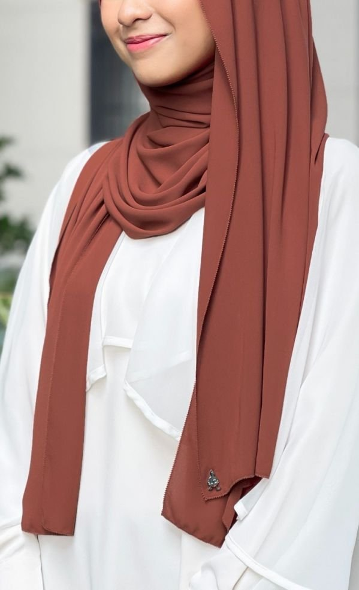 — 출처 <https://www.fashionvalet.com/pub/media/catalog/product/cache/062a0371477ef51bc121158b30011f81/b/r/brick_1.jpg>
- 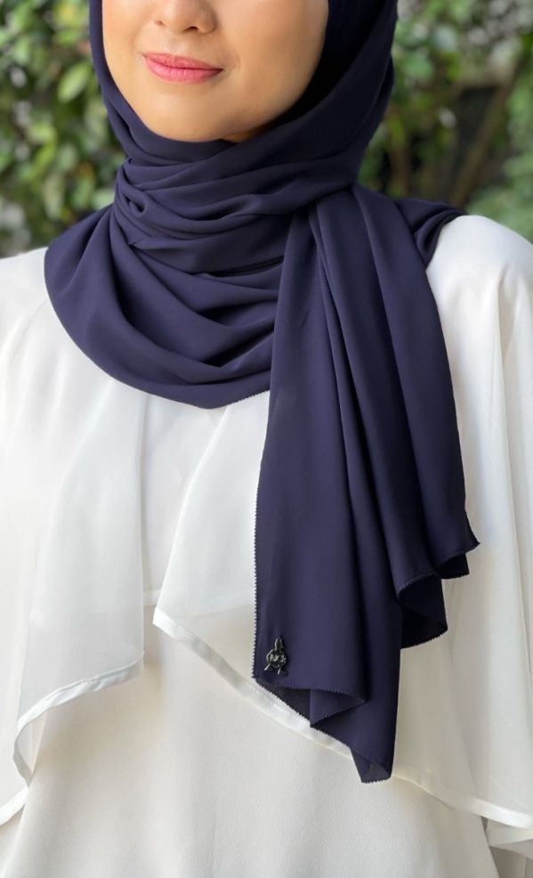 — 출처 <https://www.fashionvalet.com/pub/media/catalog/product/cache/062a0371477ef51bc121158b30011f81/d/a/dark_blue.jpg>
- 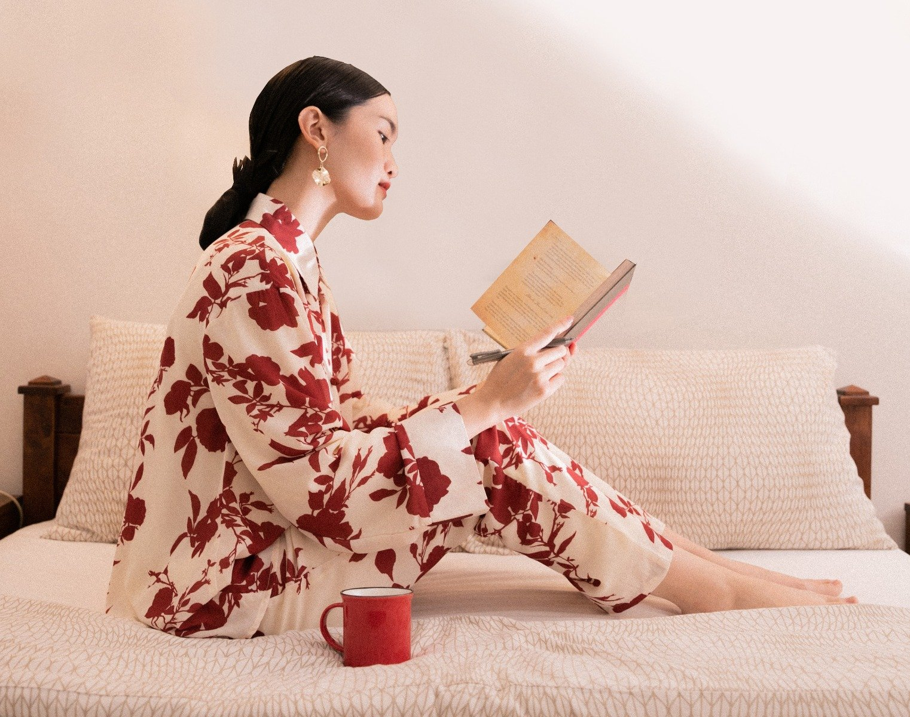 — 출처 <https://www.fashionvalet.com/pub/media/wysiwyg/DD/DD_lilit_CNY.jpg>

**페이지 메타 정보**

| page | title | description |
|---|---|---|
| [`home`](https://www.fashionvalet.com/) | Home | FashionValet |  |

#### [Lazada Malaysia](https://www.lazada.com.my/)

- URL: <https://www.lazada.com.my/>
- 페이지: **OK 1 · FAIL 0**

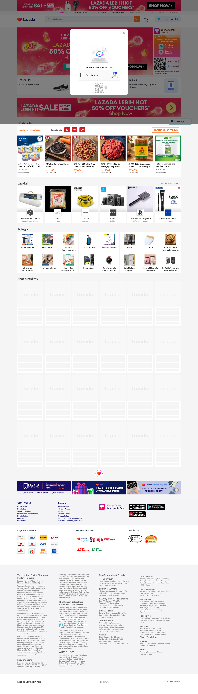

**대표 상품 이미지** (상위 6장, 출처 URL 포함)

-  — 출처 <https://img.lazcdn.com/us/domino/989a1dbe9cb739c33bb3c78782b40abe.png>
-  — 출처 <https://img.lazcdn.com/g/tps/images/ims-web/TB1HKyxaMFY.1VjSZFqXXadbXXa.png>
-  — 출처 <https://img.lazcdn.com/us/domino/e3761426-38de-4e64-b368-dd48e057656b_MY-1976-688.jpg_2200x2200q80.jpg>
-  — 출처 <https://img.lazcdn.com/us/domino/1257a84c-47ff-44de-8851-fc37a9636caf_MY-1976-688.jpg_2200x2200q80.jpg>
-  — 출처 <https://img.lazcdn.com/us/domino/462b900c-33d0-4c8d-93bd-3567e96f3f20_MY-1976-688.jpg_2200x2200q80.jpg>
-  — 출처 <https://img.lazcdn.com/us/domino/4e26969f-07a6-401d-949e-428b0cf986dc_MY-1976-688.jpg_2200x2200q80.jpg>

**페이지 메타 정보**

| page | title | description |
|---|---|---|
| [`home`](https://www.lazada.com.my/#?) | Lazada Malaysia | Top Deals & Free Shipping for You! | Discover Lazada, Southeast Asia's leading e-commerce platform, offering Cash on Delivery, LazMall, LazFlash, and daily discounts. Shop authe |

#### [Padini](https://www.padini.com/)

- URL: <https://www.padini.com/>
- 페이지: **OK 1 · FAIL 0**

**대표 상품 이미지** (상위 6장, 출처 URL 포함)

- 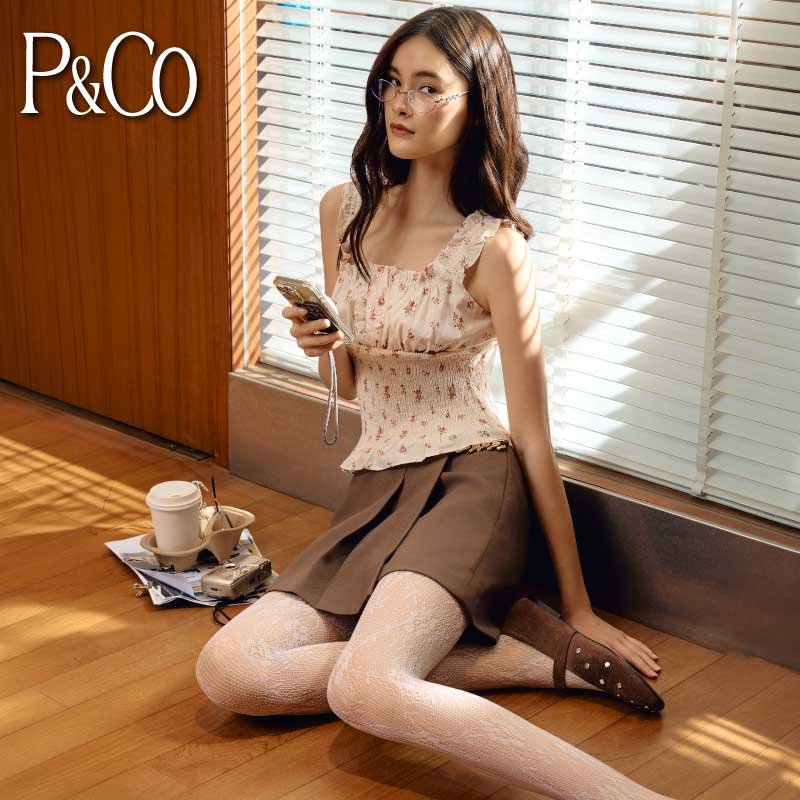 — 출처 <https://www.padini.com/media/wysiwyg/1_709.jpg>
- 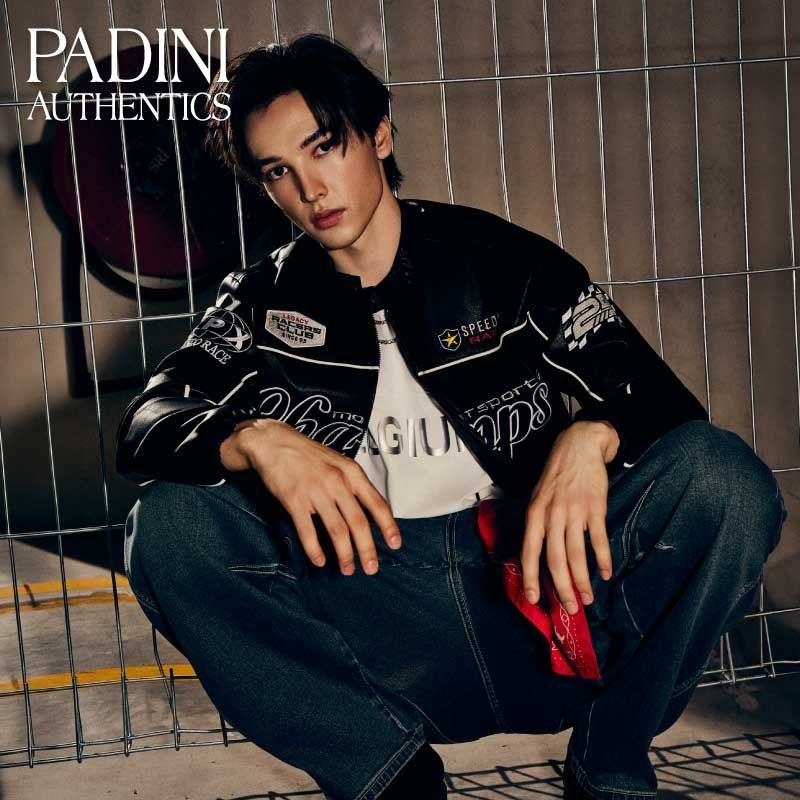 — 출처 <https://www.padini.com/media/wysiwyg/2_467.jpg>
-  — 출처 <https://www.padini.com/media/wysiwyg/3_359.jpg>
- 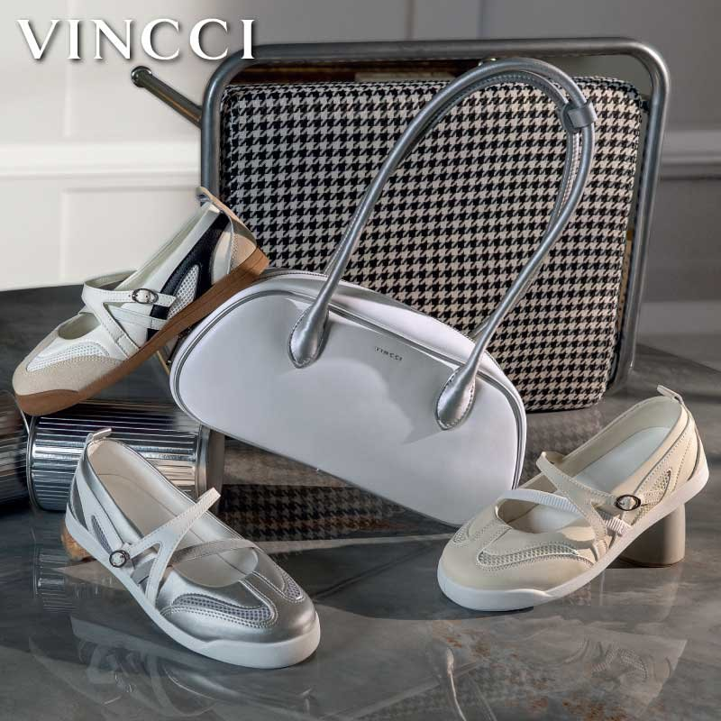 — 출처 <https://www.padini.com/media/wysiwyg/4_269.jpg>
- 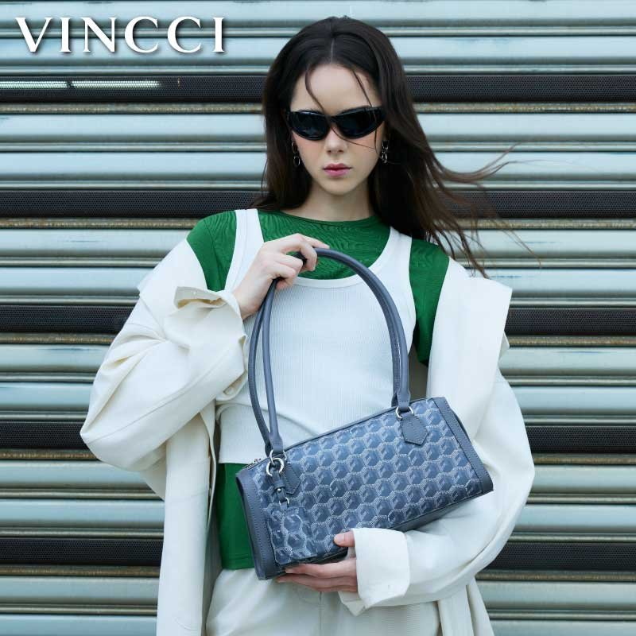 — 출처 <https://www.padini.com/media/wysiwyg/5_222.jpg>
- 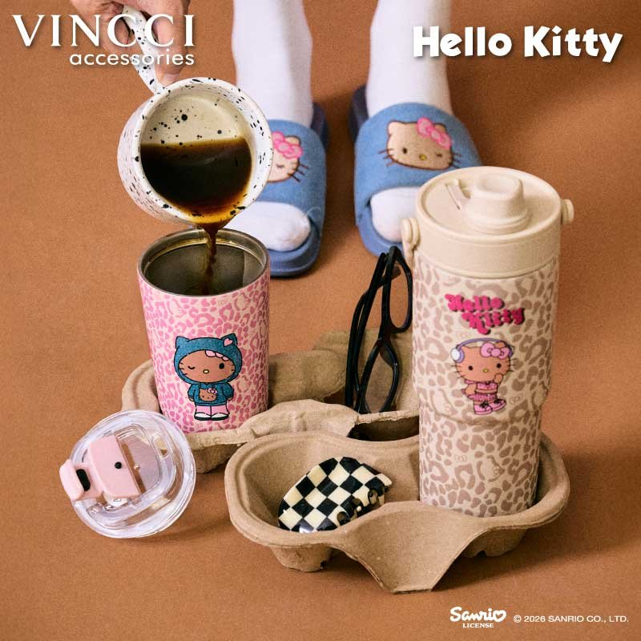 — 출처 <https://www.padini.com/media/wysiwyg/6_161.jpg>

**페이지 메타 정보**

| page | title | description |
|---|---|---|
| [`home`](https://www.padini.com/) | Padini Malaysia | Best Online Clothing Store For Fashion Shopping | Padini is one of Malaysia’s best clothing and fashion stores for online shopping, offering trendy as well as earth-friendly clothes, shoes,  |

#### [Shopee Malaysia](https://shopee.com.my/)

- URL: <https://shopee.com.my/>
- 페이지: **OK 1 · FAIL 0**

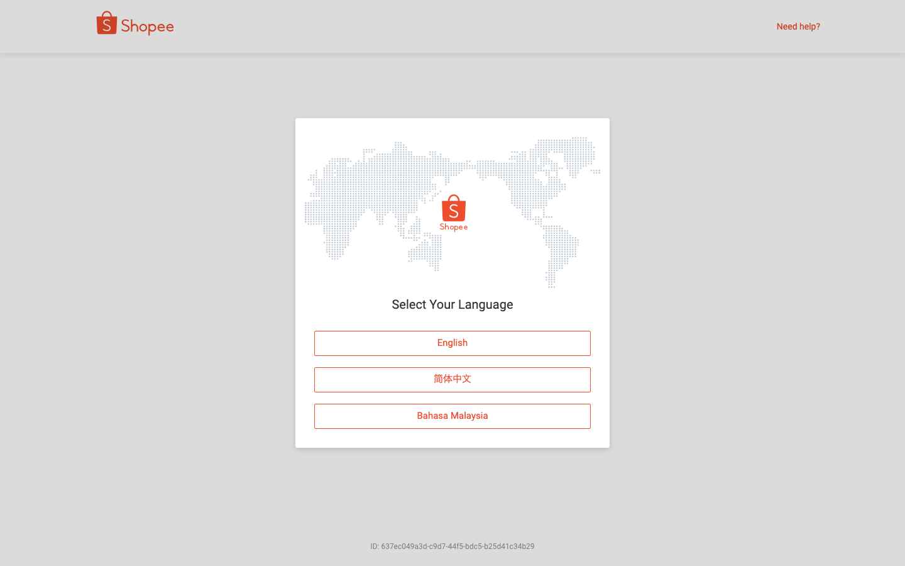

**대표 상품 이미지** (상위 6장, 출처 URL 포함)

-  — 출처 <https://deo.shopeemobile.com/shopee/shopee-pcmall-live-sg/assets/1c8bdaaf45e1fd48.png>

**페이지 메타 정보**

| page | title | description |
|---|---|---|
| [`home`](https://shopee.com.my/verify/traffic/error?home_url=https%3A%2F%2Fshopee.com.my&is_logged_in=false&next=https%3A%2F%2Fshopee.com.my%2F&tracking_id=637ec049a3d-c9d7-44f5-bdc5-b25d41c34b29&type=4) | Shopee Malaysia | Free Shipping Across Malaysia |  |

#### [Zalora Malaysia](https://www.zalora.com.my/)

- URL: <https://www.zalora.com.my/>
- 페이지: **OK 1 · FAIL 0**

**페이지 메타 정보**

| page | title | description |
|---|---|---|
| [`home`](https://www.zalora.com.my/) | Access to this page has been denied | px-captcha |

### 4.15 멕시코 _( Mexico )_

- 한국 수출규모 순위: **#17** · region: `north_america` · tier `3` · currency `MXN`
- 수집 사이트: **5개** (성공 5)
- 메모: 남미 진출 교두보
#### [Coppel](https://www.coppel.com/)

- URL: <https://www.coppel.com/>
- 페이지: **OK 1 · FAIL 0**

**페이지 메타 정보**

| page | title | description |
|---|---|---|
| [`home`](https://www.coppel.com/) | Access Denied |  |

#### [Liverpool](https://www.liverpool.com.mx/)

- URL: <https://www.liverpool.com.mx/>
- 페이지: **OK 1 · FAIL 0**

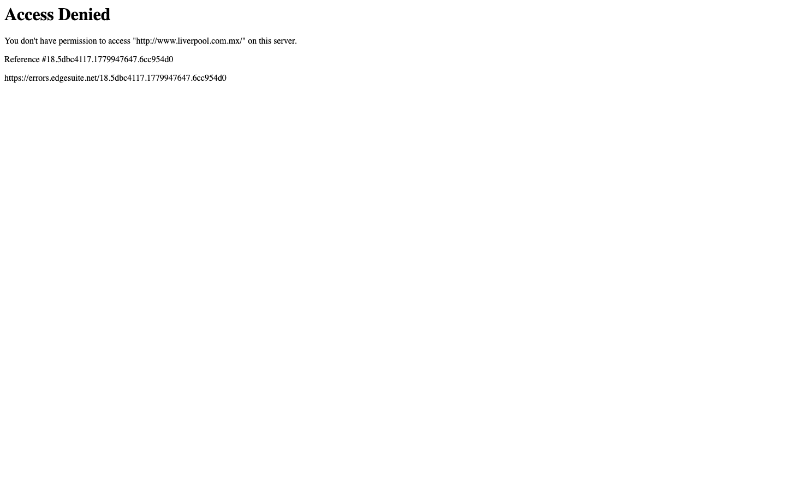

**페이지 메타 정보**

| page | title | description |
|---|---|---|
| [`home`](https://www.liverpool.com.mx/) | Access Denied |  |

#### [Mercado Libre Mexico](https://www.mercadolibre.com.mx/)

- URL: <https://www.mercadolibre.com.mx/>
- 페이지: **OK 1 · FAIL 0**

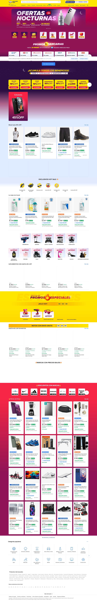

**대표 상품 이미지** (상위 6장, 출처 URL 포함)

-  — 출처 <https://http2.mlstatic.com/D_NQ_2X_677995-MLA112172977871_052026-OO.webp>
-  — 출처 <https://http2.mlstatic.com/D_NQ_2X_988905-MLA112333347497_052026-OO.webp>
-  — 출처 <https://http2.mlstatic.com/D_NQ_2X_709683-MLA112290272911_052026-OO.webp>
-  — 출처 <https://http2.mlstatic.com/D_NQ_2X_911271-MLA112081959631_052026-OO.webp>
-  — 출처 <https://http2.mlstatic.com/D_NQ_2X_981361-MLA112223312945_052026-OO.webp>
-  — 출처 <https://http2.mlstatic.com/D_NQ_2X_765665-MLA111093936344_052026-OO.webp>

**페이지 메타 정보**

| page | title | description |
|---|---|---|
| [`home`](https://www.mercadolibre.com.mx/) | 🔥 ¡Hot Sale 2026 en México Del 25 de mayo al 02 de junio! Mercado Libre | ➞ Encuentre /mejores promociones/ con ENVÍO GRATIS en el MISMO DÍA de Celulares, Pantallas y más para el Hot Sale 2025 |

#### [Palacio de Hierro](https://www.elpalaciodehierro.com/)

- URL: <https://www.elpalaciodehierro.com/>
- 페이지: **OK 1 · FAIL 0**

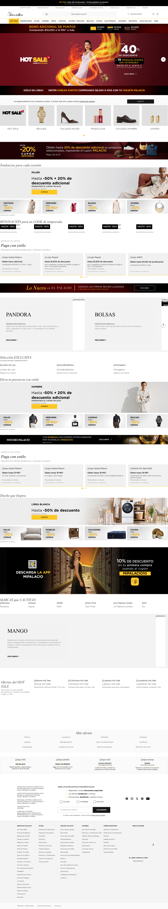

**대표 상품 이미지** (상위 6장, 출처 URL 포함)

- 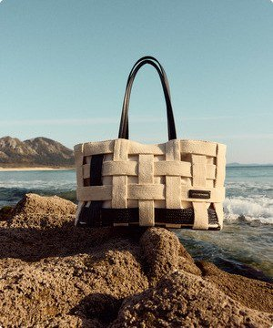 — 출처 <https://www.elpalaciodehierro.com/on/demandware.static/-/Library-Sites-palacio-content-global/default/images/Banners%2DMenu/2026/Mayo/mujer-ADOLFO-DOMINGUEZ-COOP.jpeg>
- 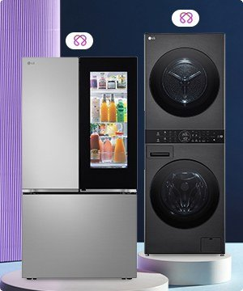 — 출처 <https://www.elpalaciodehierro.com/on/demandware.static/-/Library-Sites-palacio-content-global/default/images/Banners%2DMenu/2026/Mayo/hogar-LG-COOP.jpeg>
-  — 출처 <https://www.elpalaciodehierro.com/on/demandware.static/-/Library-Sites-palacio-content-global/default/images/Banners%2DMenu/2026/Mayo/electronica-AMAZON-COOP.jpeg>
-  — 출처 <https://www.elpalaciodehierro.com/on/demandware.static/-/Library-Sites-palacio-content-global/default/images/Home/Mayo%2D26/Home%2D22%2D24%2Dmayo%2Dht/contador%2Ddias%2Dcortesia/bg%2Dcintillo%2Ddesktop.jpg>
-  — 출처 <https://www.elpalaciodehierro.com/on/demandware.static/-/Library-Sites-palacio-content-global/default/images/Home/Mayo%2D26/cambios%2D25may/sl/sl%2Dhot%2Dsale%2D2026%2Ddesktop.jpg>
-  — 출처 <https://www.elpalaciodehierro.com/on/demandware.static/-/Library-Sites-palacio-content-global/default/images/Home/Mayo%2D26/cambios%2D25may/sl/nm%2Dhot%2Dsale%2Dmb%2Ddesktop.png>

**페이지 메타 정보**

| page | title | description |
|---|---|---|
| [`home`](https://www.elpalaciodehierro.com/) | Hot Sale en El Palacio de Hierro | Obtén Dobles Puntos comprando $6,000 o más y obtén Hasta -40% + Hasta 15 MSI en Moda, Diseñadores, Calzado, Hogar, Electrónica y más. |

#### [SHEIN Mexico](https://www.shein.com.mx/)

- URL: <https://www.shein.com.mx/>
- 페이지: **OK 1 · FAIL 0**

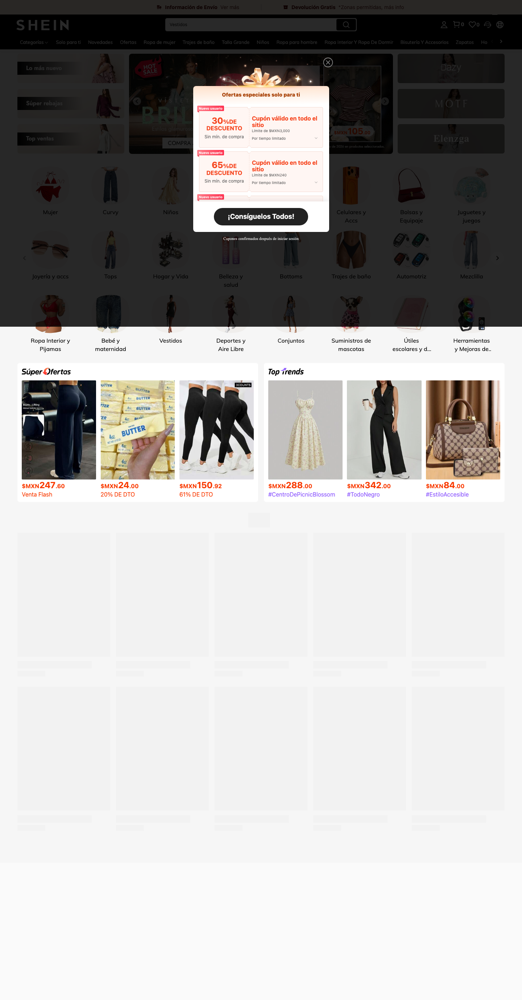

**대표 상품 이미지** (상위 6장, 출처 URL 포함)

- 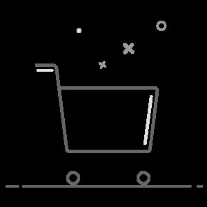 — 출처 <https://img.ltwebstatic.com/images3_ccc/2024/09/14/c4/1726308103afb22656373fc035549a3b184a4363c0.webp>
-  — 출처 <https://img.ltwebstatic.com/v4/j/ccc/2026/01/27/9b/176950474420c0a0650e037383e5ff543fc48e4325_thumbnail_624x.webp>
-  — 출처 <https://img.ltwebstatic.com/v4/j/ccc/2026/01/27/08/17695048077e54455d2be64f04836dd5f221ffa3fa_thumbnail_624x.webp>
- 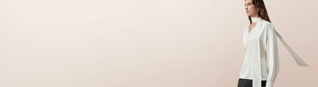 — 출처 <https://img.ltwebstatic.com/v4/j/ccc/2026/01/27/8f/1769504813fd5230d0f71d9a7ffacf83e47604822c_thumbnail_624x.webp>
- 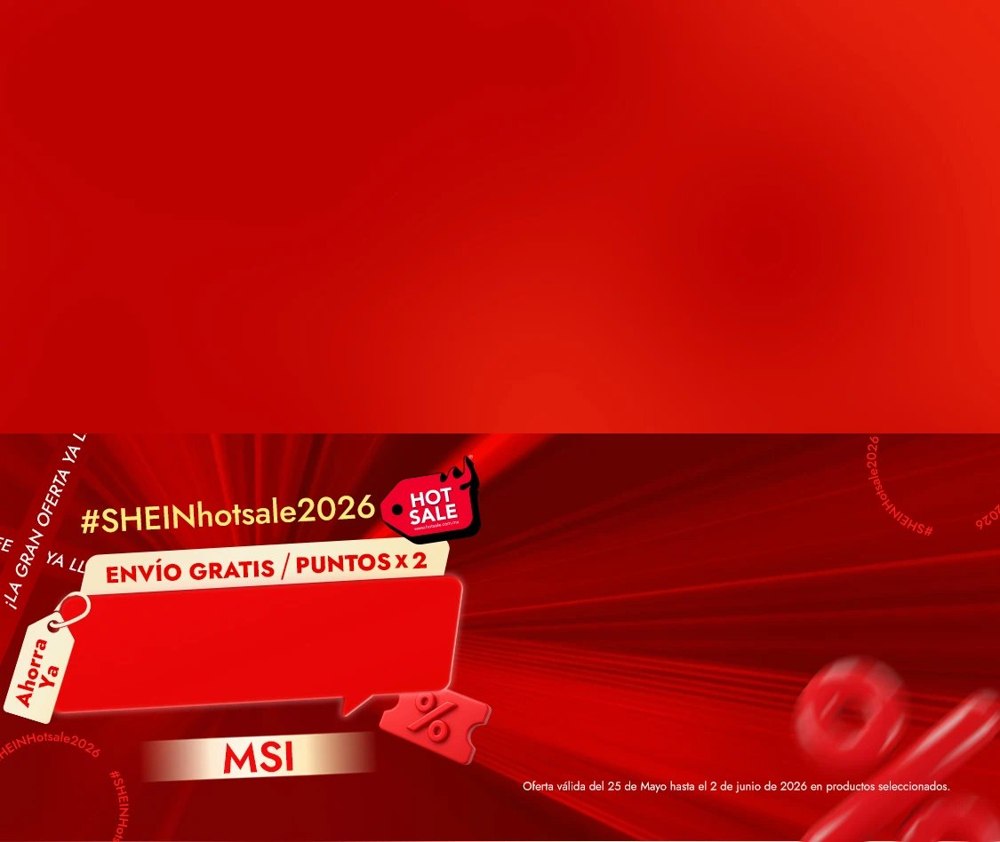 — 출처 <https://img.ltwebstatic.com/v4/j/ccc/2026/05/24/12/177962767946c36b1b9f435a21335c8415305d6b54_thumbnail_1575x.webp>
- 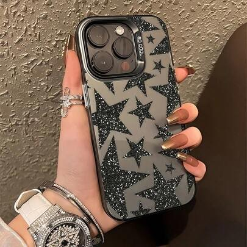 — 출처 <https://img.ltwebstatic.com/images3_spmp/2025/01/14/88/17368440776d0aff4c418c69d3ad72fff7beaa25cb_thumbnail_405x552.webp>

**페이지 메타 정보**

| page | title | description |
|---|---|---|
| [`home`](https://www.shein.com.mx/) | Ropa y Moda para Todos al Mejor Precio Online | SHEIN México | ✅ 30% dto. en tu primer pedido ✅ 2000+Novedades diarias. ¡Descubre las últimas tendencias de moda para mujeres de todas tallas, hombres, niñ |

### 4.16 네덜란드 _( Netherlands )_

- 한국 수출규모 순위: **#23** · region: `europe` · tier `3` · currency `EUR`
- 수집 사이트: **5개** (성공 5)
- 메모: 유럽 물류 허브
#### [de Bijenkorf](https://www.debijenkorf.nl/)

- URL: <https://www.debijenkorf.nl/>
- 페이지: **OK 1 · FAIL 0**

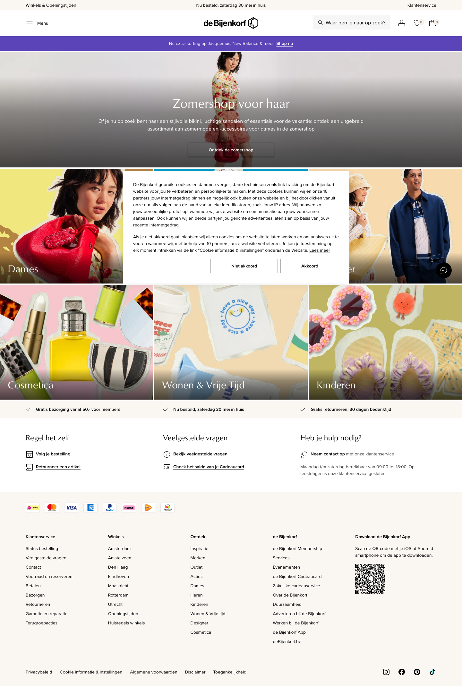

**대표 상품 이미지** (상위 6장, 출처 URL 포함)

- 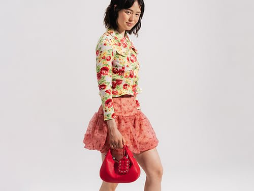 — 출처 <https://www.debijenkorf.nl/content-asset/bltf742800ae6274b8a/69f0bbf9062cc5521fd17e78/Zomershop-ss26_banner_dames_2560x549.jpg?w=500&h=375&x=0.4929713&y=0.09009278>
-  — 출처 <https://www.debijenkorf.nl/content-asset/blte44ba7fadb4a80a1/69de1054f56bbb18a0296094/hero-ss26-dames.jpg?w=400&h=400&x=0.5&y=0.5>
-  — 출처 <https://www.debijenkorf.nl/content-asset/blt92650f39846f0864/69e8add7008c4ef491415b2c/hero-heren-v2.jpg?w=400&h=400&x=0.5104493&y=0.25898468>
- 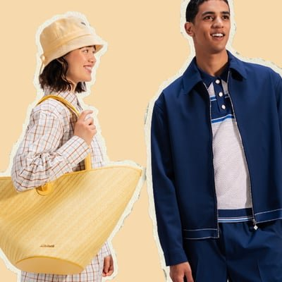 — 출처 <https://www.debijenkorf.nl/content-asset/blt468d72ef8266dea6/69de0e82d8b50e294cccdcb1/hero_ss26_designer.jpg?w=400&h=400&x=0.5&y=0.5>
- 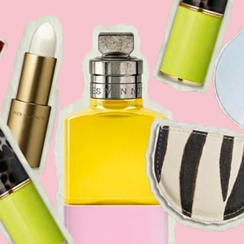 — 출처 <https://www.debijenkorf.nl/content-asset/bltc9862b74304503f6/69e60d5cb3e1d54f13eeddaf/home-cosmetica.jpg?w=400&h=400&x=0.5&y=0.5>
- 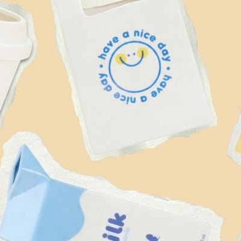 — 출처 <https://www.debijenkorf.nl/content-asset/bltb347a50b6158c0b1/69de0e9af0616111b8ab3395/hero_ss26_wonen.jpg?w=400&h=400&x=0.5&y=0.5>

**페이지 메타 정보**

| page | title | description |
|---|---|---|
| [`home`](https://www.debijenkorf.nl/) | de Bijenkorf • Mode, Cosmetica & Interieur • Snel in huis | de Bijenkorf is hét meest inspirerende, verrassende en creatieve warenhuis. Voel je alledaags bijzonder met de musthaves uit de nieuwe colle |

#### [Otrium](https://www.otrium.com/)

- URL: <https://www.otrium.com/>
- 페이지: **OK 1 · FAIL 0**

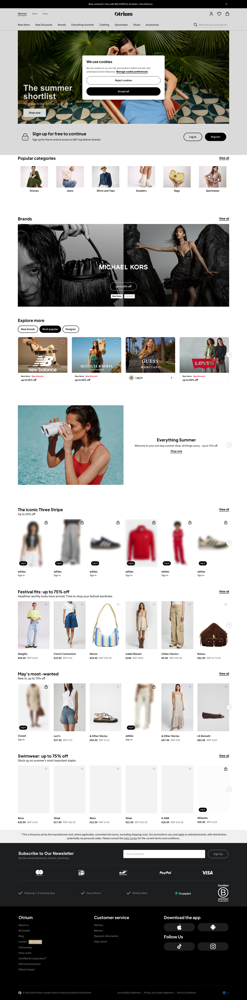

**대표 상품 이미지** (상위 6장, 출처 URL 포함)

-  — 출처 <https://images.ctfassets.net/uwglnwl613dg/2EGlIfrTNZ71GV4cO3zpeB/763609209c4fd1a025b8623b133487dc/HERO_BANNER_-_D_WW__14_.jpg>
- 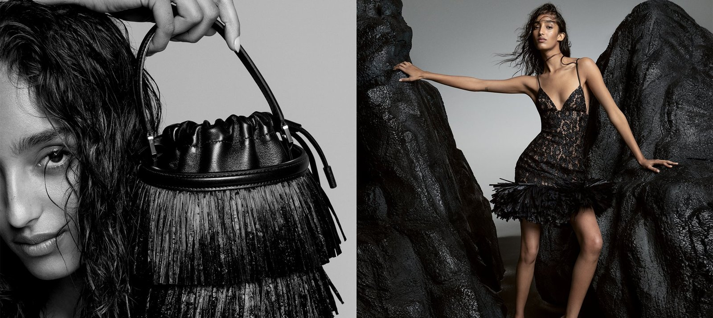 — 출처 <https://lookbook.otrium.com/brand-visuals/uploads/2026/03/9f526640-a4b9-58ba-93a6-5033e9561978/151fed3e-aeb9-4ace-8987-63c30f5de691.jpg>
-  — 출처 <https://lookbook.otrium.com/brand-visuals/uploads/2025/07/9f526640-a4b9-58ba-93a6-5033e9561978/3a135a3e-945d-4693-87af-08d98a226681.png>
- 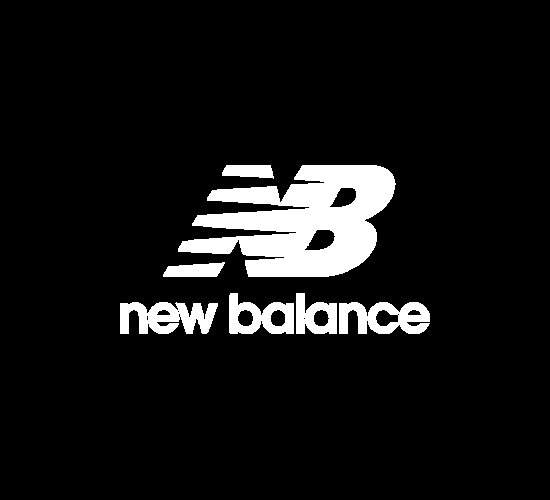 — 출처 <https://lookbook.otrium.com/brand-visuals/uploads/2024/12/fb4efee1-e875-4d1e-acbf-1b4e4c949045/53af2886-c585-4330-9c35-a0deab544e94.png>
-  — 출처 <https://lookbook.otrium.com/wp-content/uploads/2021/03/SS-Amsterdam-horizontal_logo_550x500_w.png>
-  — 출처 <https://lookbook.otrium.com/brand-visuals/uploads/2026/01/ba92c4f1-0937-46ca-b93e-883da792b3eb/30edbc25-b7bb-4ebf-8427-443e6a2afbbf.png>

**페이지 메타 정보**

| page | title | description |
|---|---|---|
| [`home`](https://www.otrium.com/women) | Otrium | Online Designer Outlet | Explore all the fashion for women at Otrium. Shop high-quality clothing, shoes, and accessories from well-known brands with discounts up to  |

#### [Scotch & Soda](https://www.scotch-soda.com/)

- URL: <https://www.scotch-soda.com/>
- 페이지: **OK 1 · FAIL 0**

**대표 상품 이미지** (상위 6장, 출처 URL 포함)

- 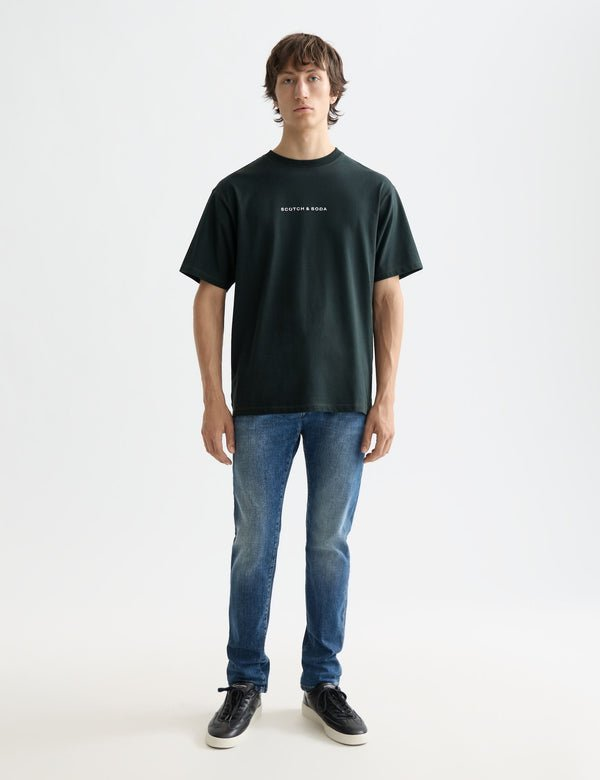 — 출처 <https://scotchandsoda.com/cdn/shop/files/Special_JPG-181850_410_R_10_FNT.jpg?v=1755029597&width=600>
- 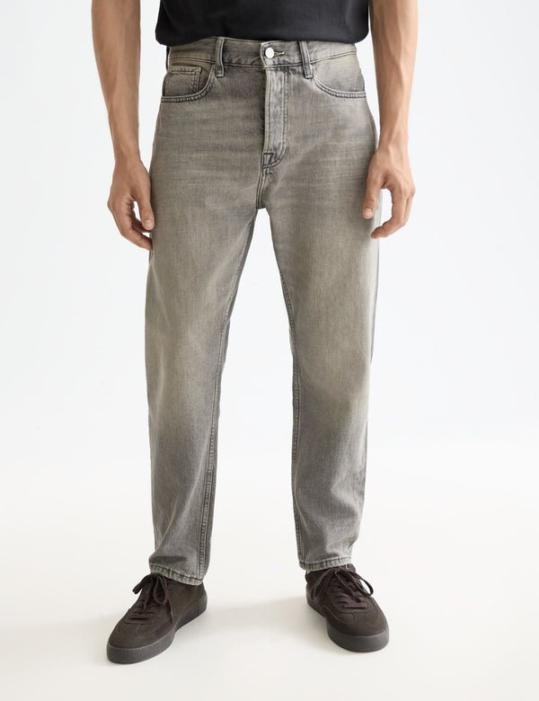 — 출처 <https://scotchandsoda.com/cdn/shop/files/Special_JPG-181848_030_R_10_FNT_C.jpg?v=1755269208&width=600>
- 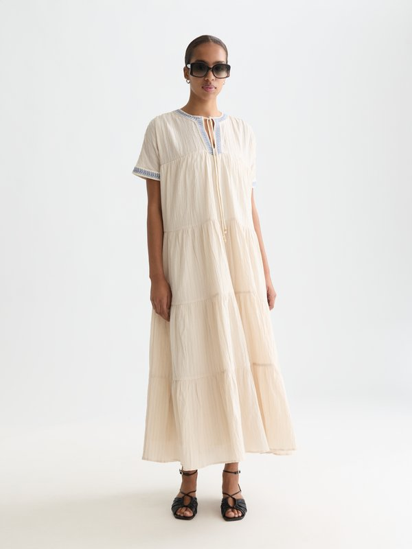 — 출처 <https://scotchandsoda.com/cdn/shop/files/UFU01434T_U244_1M-P.png?v=1768597074&width=600>
- 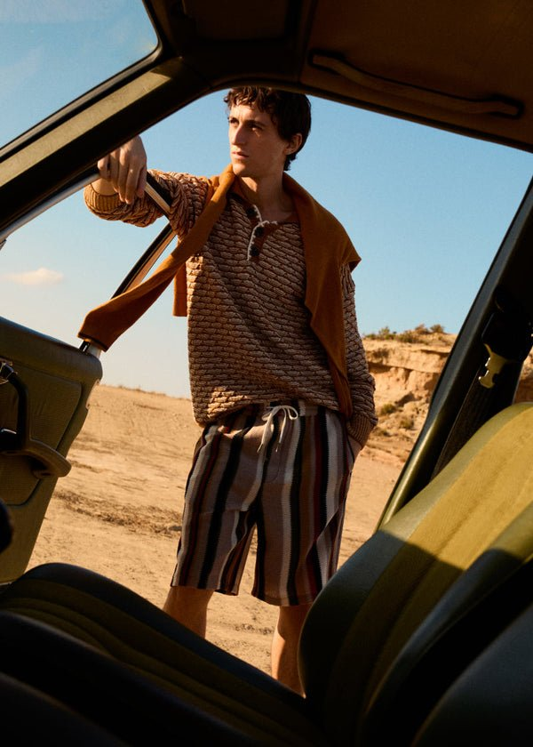 — 출처 <https://scotchandsoda.com/cdn/shop/collections/secondary_men_1_1.jpg?v=1777643667&width=600>
- 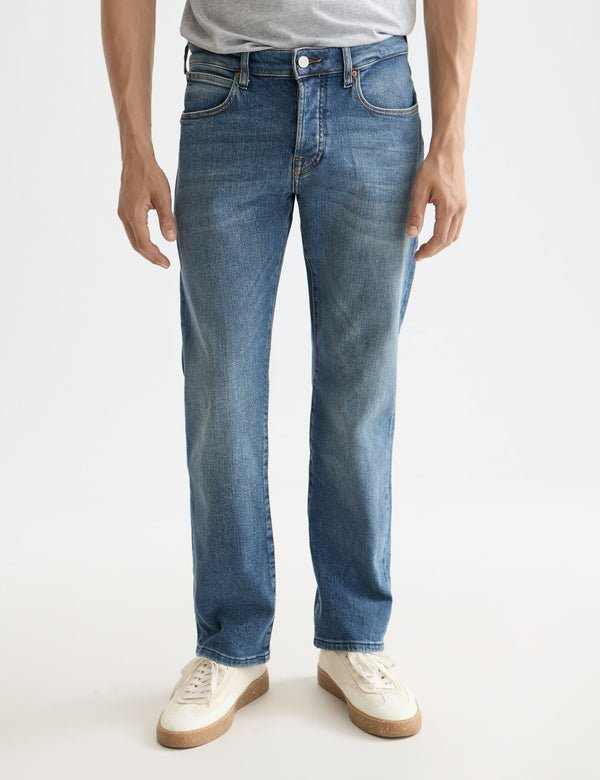 — 출처 <https://scotchandsoda.com/cdn/shop/files/Special_JPG-181846_410_R_10_FNT_C.jpg?v=1755181297&width=600>
- 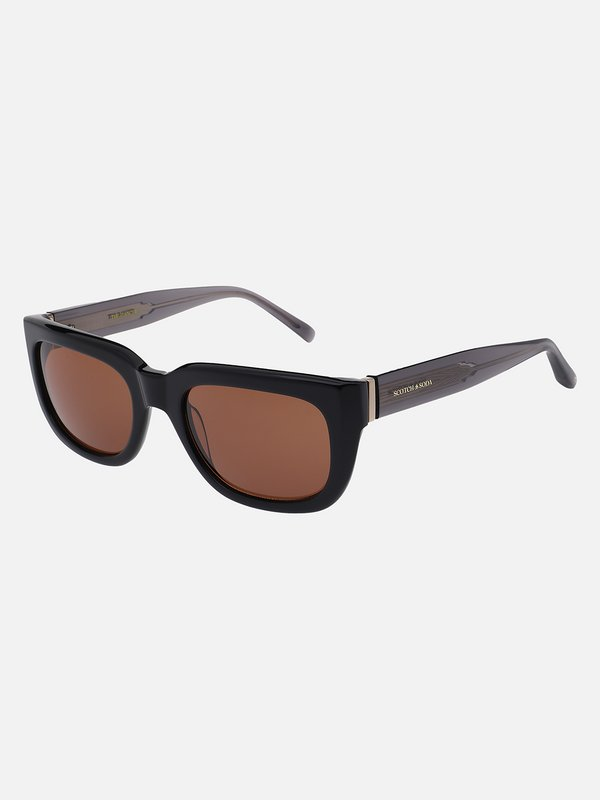 — 출처 <https://scotchandsoda.com/cdn/shop/files/PDM023160-001_0954f28d-8abd-4f5b-a633-5ea06954b6ec.png?v=1775231481&width=600>

**페이지 메타 정보**

| page | title | description |
|---|---|---|
| [`home`](https://scotchandsoda.com/) | Scotch and Soda
 – Scotch & Soda | Discover men’s and women’s clothing from Scotch & Soda. Thoughtfully designed apparel, accessories, and denim with premium fabrics and moder |

#### [Wehkamp](https://www.wehkamp.nl/)

- URL: <https://www.wehkamp.nl/>
- 페이지: **OK 1 · FAIL 0**

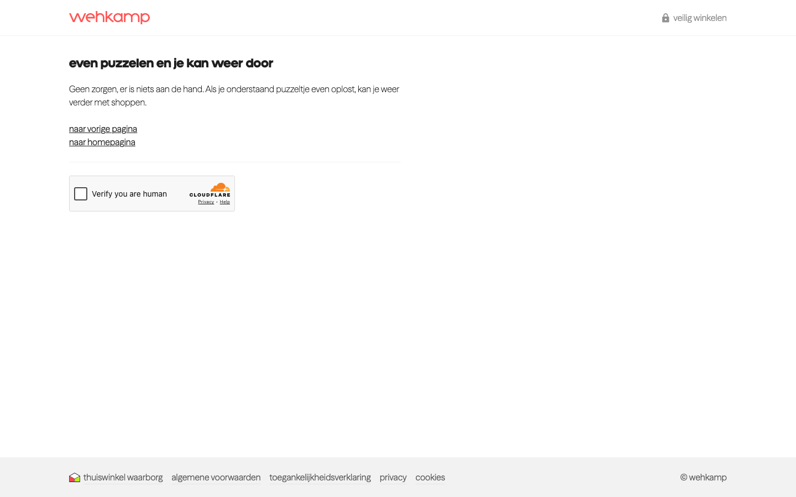

**페이지 메타 정보**

| page | title | description |
|---|---|---|
| [`home`](https://www.wehkamp.nl/) | Just a moment... |  |

#### [Zalando Netherlands](https://www.zalando.nl/)

- URL: <https://www.zalando.nl/>
- 페이지: **OK 1 · FAIL 0**

**페이지 메타 정보**

| page | title | description |
|---|---|---|
| [`home`](https://www.zalando.nl/) | Zalando |  |

### 4.17 필리핀 _( Philippines )_

- 한국 수출규모 순위: **#16** · region: `asia` · tier `2` · currency `PHP`
- 수집 사이트: **5개** (성공 4)
- 메모: 영어 사용 + K-콘텐츠 영향력 높음
#### [Bench](https://www.bench.com.ph/)

- URL: <https://www.bench.com.ph/>
- 페이지: **OK 0 · FAIL 1**

**실패 페이지**

- `home` — http_status_522

#### [Lazada Philippines](https://www.lazada.com.ph/)

- URL: <https://www.lazada.com.ph/>
- 페이지: **OK 1 · FAIL 0**

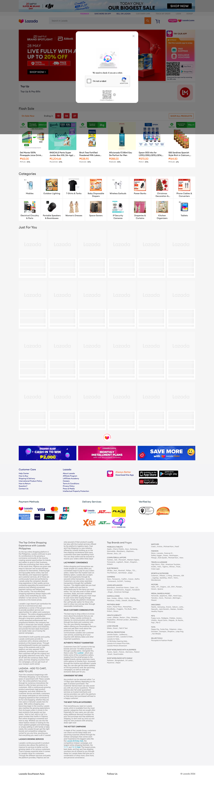

**대표 상품 이미지** (상위 6장, 출처 URL 포함)

-  — 출처 <https://img.lazcdn.com/us/domino/4c7322a5c7c56033b88982d607e12587.png>
-  — 출처 <https://img.lazcdn.com/g/tps/images/ims-web/TB19SB7aMFY.1VjSZFnXXcFHXXa.png>
-  — 출처 <https://img.lazcdn.com/us/media/de0b72d16b9f77c86cd2e2a36ebdef45-1976-688.jpg_2200x2200q80.jpg>
-  — 출처 <https://img.lazcdn.com/g/tps/imgextra/i3/O1CN01zDs3Ks1ivbXNQA0sF_!!6000000004475-0-tps-1976-688.jpg_2200x2200q80.jpg>
-  — 출처 <https://img.lazcdn.com/us/media/10223c757062a13f92aa36dc20f9ddbc-1976-688.jpg_2200x2200q80.jpg>
-  — 출처 <https://img.lazcdn.com/us/media/7dfde450e29e4cd084587a3458d0c27e-1976-688.jpg_2200x2200q80.jpg>

**페이지 메타 정보**

| page | title | description |
|---|---|---|
| [`home`](https://www.lazada.com.ph/#?) | Lazada Philippines | Best Deals & Free Shipping, Shop Now! | Explore Lazada Philippines for diverse electronics, trending fashion, beauty essentials, and fun toys. Enjoy easy online shopping for genuin |

#### [Penshoppe](https://www.penshoppe.com/)

- URL: <https://www.penshoppe.com/>
- 페이지: **OK 1 · FAIL 0**

**최근 유행 상품** (30건 · 상품명 클릭 시 해당 사이트로 이동)

| # | 상품명 | 브랜드 | 가격 | 페이지 |
|---:|---|---|---:|---|
| 1 | [86 Loose Jersey T-Shirt](https://www.penshoppe.com/products/86-loose-jersey-t-shirt-994133-off-white) | Penshoppe | 799 PHP | `home` |
| 2 | [86 Loose Jersey T-Shirt](https://www.penshoppe.com/products/86-loose-jersey-t-shirt-994133-black) | Penshoppe | 799 PHP | `home` |
| 3 | [Short Socks Pack of 3](https://www.penshoppe.com/products/short-socks-pack-of-3-992398-white) | Penshoppe | 399 PHP | `home` |
| 4 | [Short Socks Pack of 3](https://www.penshoppe.com/products/short-socks-pack-of-3-992398-black) | Penshoppe | 399 PHP | `home` |
| 5 | [Modern Fit Contrast Detail Shorts](https://www.penshoppe.com/products/modern-fit-contrast-detail-shorts-993697-black) | Penshoppe | 899 PHP | `home` |
| 6 | [Wide Leg Track Pants](https://www.penshoppe.com/products/wide-leg-track-pants-993671-blue-dusk) | Penshoppe | 1,299 PHP | `home` |
| 7 | [Lightspeed Relaxed Pullover Sweatshirt](https://www.penshoppe.com/products/lightspeed-relaxed-pullover-sweatshirt-993752-blue-stone) | Penshoppe | 999 PHP | `home` |
| 8 | [Penshoppe Est 1986 Classic Cap](https://www.penshoppe.com/products/penshoppe-est-1986-classic-cap-991530-khaki) | Penshoppe | 399 PHP | `home` |
| 9 | [Modern Fit Mesh Shorts](https://www.penshoppe.com/products/modern-fit-mesh-shorts-993698-ivory) | Penshoppe | 799 PHP | `home` |
| 10 | [Modern Fit Mesh Shorts](https://www.penshoppe.com/products/modern-fit-mesh-shorts-993698-blue-stone) | Penshoppe | 799 PHP | `home` |
| 11 | [Trucker Cap](https://www.penshoppe.com/products/trucker-cap-989921-eggshell-white) | Penshoppe | 399 PHP | `home` |
| 12 | [Trucker Cap](https://www.penshoppe.com/products/trucker-cap-989921-black) | Penshoppe | 399 PHP | `home` |
| 13 | [Men's Slides with Textured Rubber Band](https://www.penshoppe.com/products/mens-slides-with-textured-rubber-band-993577-black) | Penshoppe | 499 PHP | `home` |
| 14 | [Women's Metallic Leather Ballet Sneakers](https://www.penshoppe.com/products/womens-metallic-leather-ballet-sneakers-994468-pewter) | Penshoppe | 1,199 PHP | `home` |
| 15 | [Textured PU Sling Bag](https://www.penshoppe.com/products/textured-pu-sling-bag-996365-black) | Penshoppe | 549 PHP | `home` |
| 16 | [Men's Perforated Rubber Soft Insole Slides](https://www.penshoppe.com/products/mens-perforated-rubber-soft-insole-slides-993849-navy-blue) | Penshoppe | 699 PHP | `home` |
| 17 | [Men's Perforated Rubber Soft Insole Slides](https://www.penshoppe.com/products/mens-perforated-rubber-soft-insole-slides-993849-black) | Penshoppe | 699 PHP | `home` |
| 18 | [Bi-Fold Velcro Wallet](https://www.penshoppe.com/products/bi-fold-velcro-wallet-993613-khaki) | Penshoppe | 349 PHP | `home` |
| 19 | [Bi-Fold Velcro Wallet](https://www.penshoppe.com/products/bi-fold-velcro-wallet-993613-maroon) | Penshoppe | 349 PHP | `home` |
| 20 | [Bi-Fold Velcro Wallet](https://www.penshoppe.com/products/bi-fold-velcro-wallet-993613-black) | Penshoppe | 349 PHP | `home` |

**대표 상품 이미지** (상위 6장, 출처 URL 포함)

-  — 출처 <https://cdn.shopify.com/s/files/1/2282/7539/files/pen_logo_e329b026-1dbb-4c1c-9561-8774f9e7ce9f.png?v=1743577322>
- 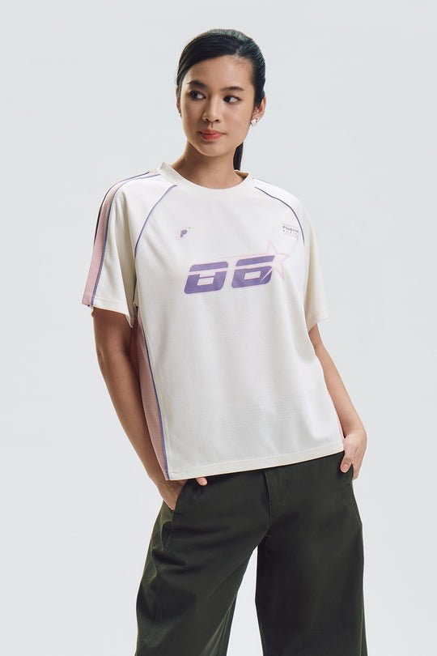 — 출처 <https://www.penshoppe.com/cdn/shop/files/994133-Off_White_3.jpg?v=1779932998&width=540>
- 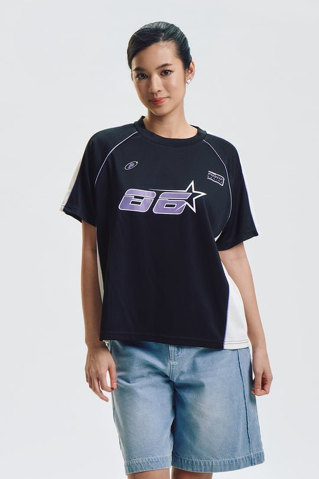 — 출처 <https://www.penshoppe.com/cdn/shop/files/994133-Black_3.jpg?v=1779932988&width=540>
- 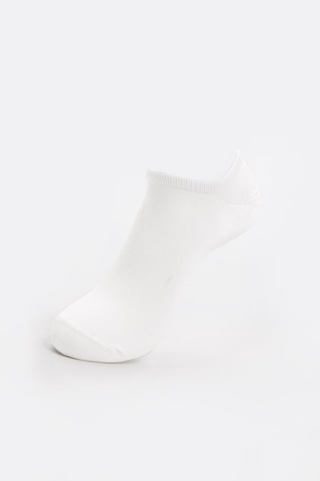 — 출처 <https://www.penshoppe.com/cdn/shop/files/992398-White_1.jpg?v=1779756889&width=540>
- 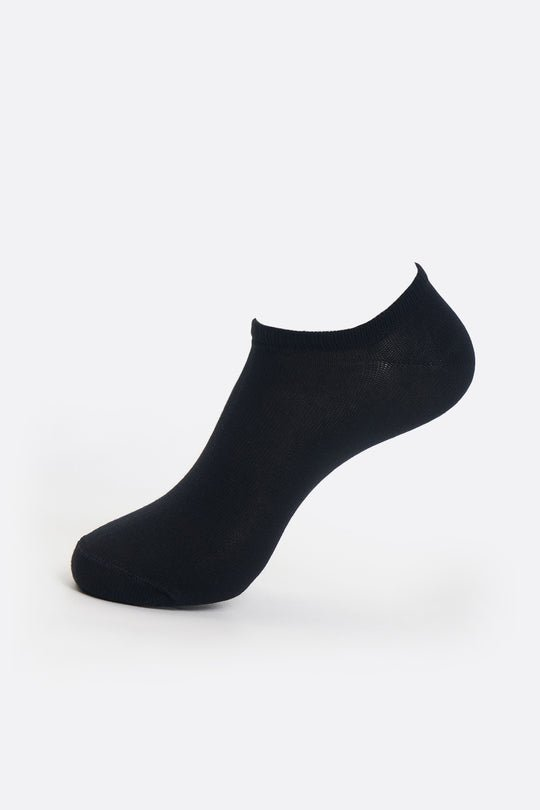 — 출처 <https://www.penshoppe.com/cdn/shop/files/992398-Black_2.jpg?v=1779756880&width=540>
- 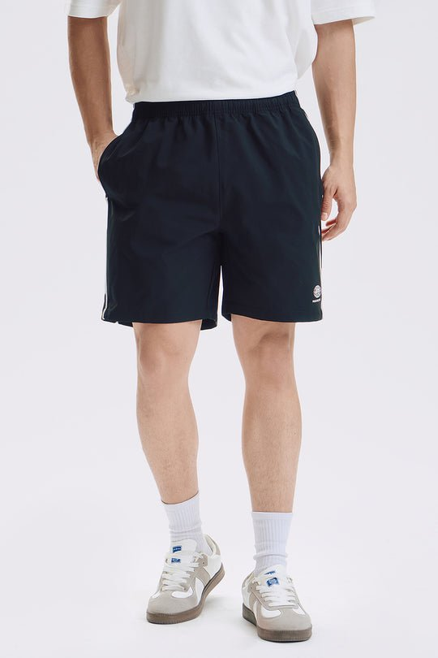 — 출처 <https://www.penshoppe.com/cdn/shop/files/993697-Black_4.jpg?v=1779756858&width=540>

**페이지 메타 정보**

| page | title | description |
|---|---|---|
| [`home`](https://www.penshoppe.com/) | Penshoppe Online Store | On Trend Shopping at Your Convenience
– PENSHOPPE | Shop on-trend, quality, affordable casual wear. Men's & Women's Tops, Bottoms, Accessories, Footwear, Innerwear, Personal Care. ✓Nationwide  |

#### [Shopee Philippines](https://shopee.ph/)

- URL: <https://shopee.ph/>
- 페이지: **OK 1 · FAIL 0**

**페이지 메타 정보**

| page | title | description |
|---|---|---|
| [`home`](https://shopee.ph/verify/traffic/error?home_url=https%3A%2F%2Fshopee.ph&is_logged_in=false&next=https%3A%2F%2Fshopee.ph%2F&tracking_id=2196b18d77c-ec70-4a4e-9e5f-36942aff717d&type=4) | Shopee Philippines | Shop Online with Promos and Vouchers |  |

#### [Zalora Philippines](https://www.zalora.com.ph/)

- URL: <https://www.zalora.com.ph/>
- 페이지: **OK 1 · FAIL 0**

**페이지 메타 정보**

| page | title | description |
|---|---|---|
| [`home`](https://www.zalora.com.ph/) | Access to this page has been denied | px-captcha |

### 4.18 폴란드 _( Poland )_

- 한국 수출규모 순위: **#25** · region: `europe` · tier `3` · currency `PLN`
- 수집 사이트: **5개** (성공 5)
- 메모: 동유럽 성장 시장
#### [Answear](https://answear.com/)

- URL: <https://answear.com/>
- 페이지: **OK 1 · FAIL 0**

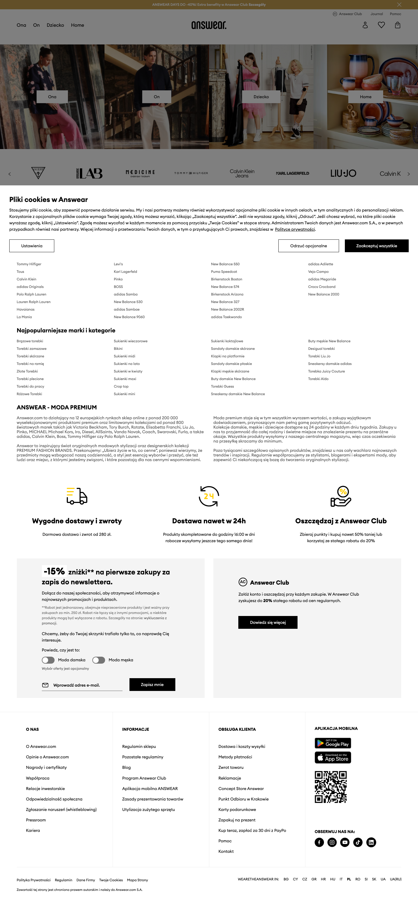

**대표 상품 이미지** (상위 6장, 출처 URL 포함)

- 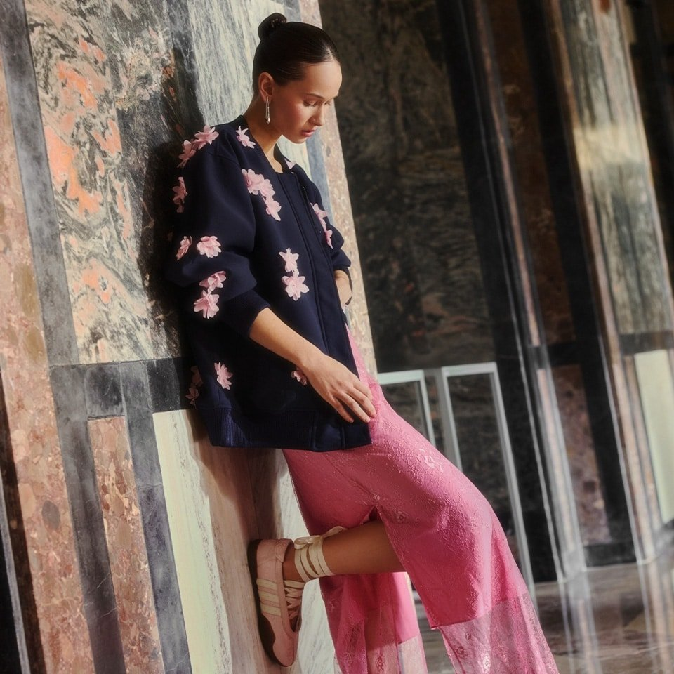 — 출처 <https://img2.ans-media.com/pl/cms/media/960x960/69a582b0538f67.12622961.jpg>
- 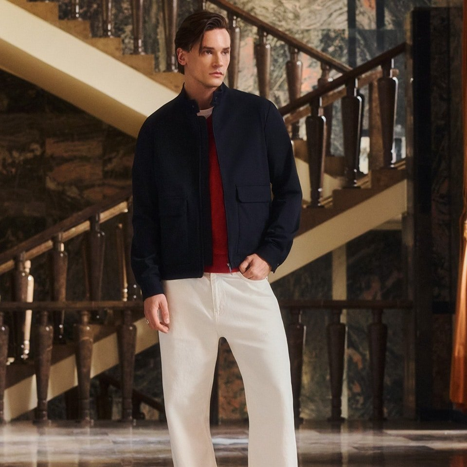 — 출처 <https://img2.ans-media.com/pl/cms/media/960x960/69a582b7133bd2.26649856.jpg>
- 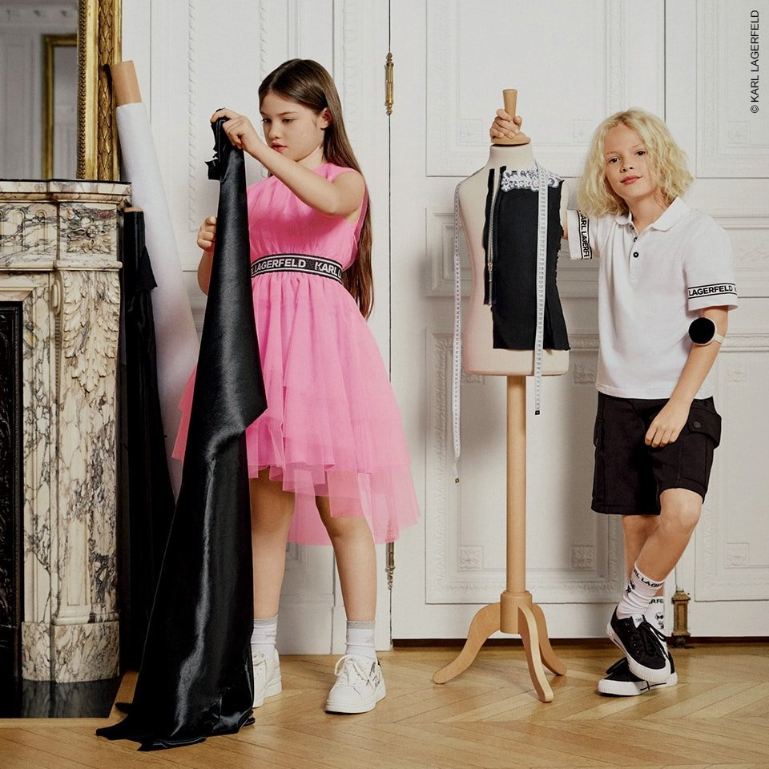 — 출처 <https://img2.ans-media.com/pl/cms/media/960x960/69a582bdd64537.51807892.jpg>
- 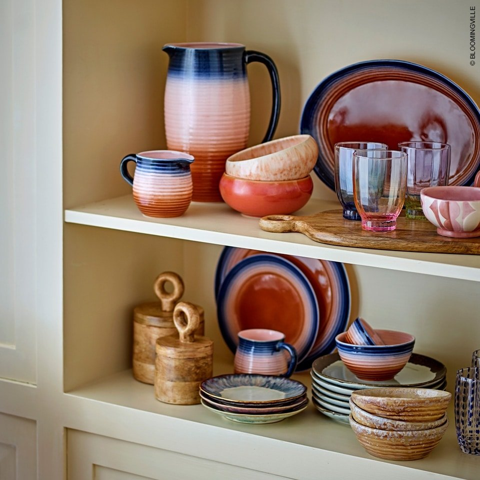 — 출처 <https://img2.ans-media.com/pl/cms/media/960x960/69a582c50527c8.10439895.jpg>

**페이지 메타 정보**

| page | title | description |
|---|---|---|
| [`home`](https://answear.com/) | Answear.com – moda premium online | Ubrania, buty, dodatki | Odkryj tysiące produktów od ponad 700 światowych marek na Answear.com. Ubrania, buty i dodatki online, szybka wysyłka, łatwe zwroty i eksklu |

#### [CCC](https://ccc.eu/pl/)

- URL: <https://ccc.eu/pl/>
- 페이지: **OK 1 · FAIL 0**

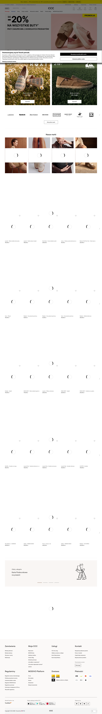

**대표 상품 이미지** (상위 6장, 출처 URL 포함)

- 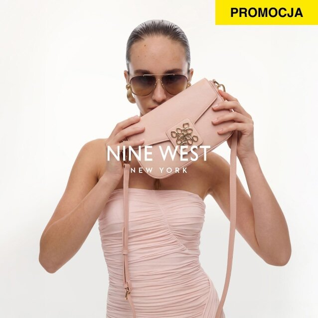 — 출처 <https://ccc.eu/media/cache/resolve/filemanager_original/images/homepage/homepage_ecpl/akcje/-40_na_torby_modivoclub_26/Menu_HD_SD_638x638_K_PL.jpg>
- 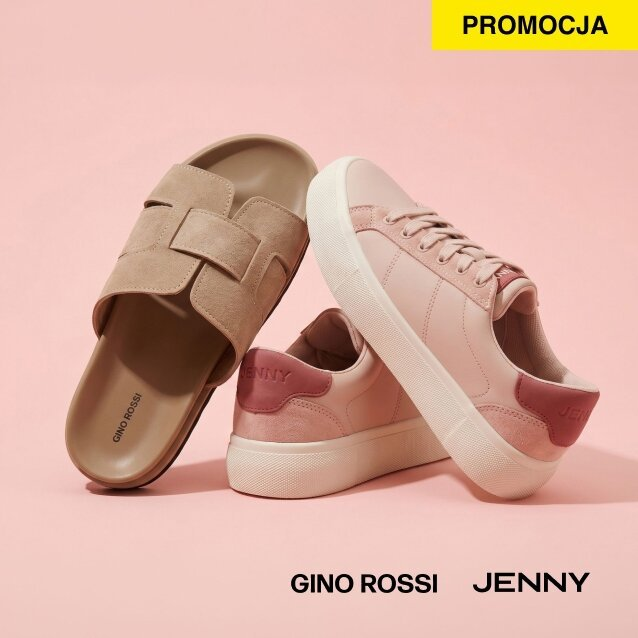 — 출처 <https://ccc.eu/media/cache/resolve/filemanager_original/images/homepage/homepage_ecpl/akcje/do_-20_na_buty_majczerwiec26/Menu_HD_SD_638x638_K.jpg>
-  — 출처 <https://ccc.eu/media/cache/resolve/filemanager_original/images/homepage/homepage_ecpl/inpiracyjne/bhpc_0426/new/MENU_638x638_PL.jpg>
- 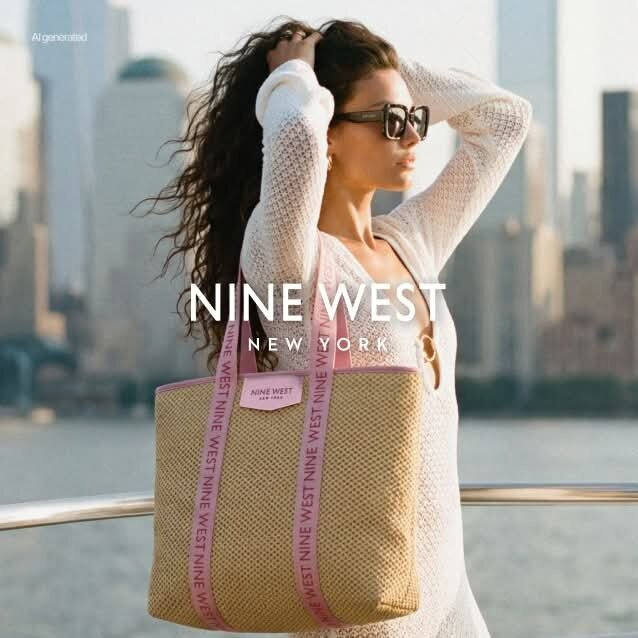 — 출처 <https://ccc.eu/media/cache/resolve/filemanager_original/images/homepage/homepage_ecpl/inpiracyjne/nine_west_26/slot_3/new/MENU_638x638_PL.jpg>
- 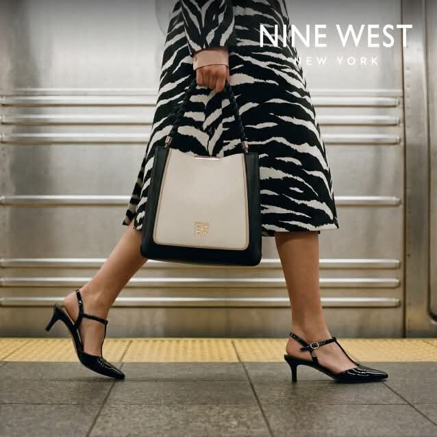 — 출처 <https://ccc.eu/media/cache/resolve/filemanager_original/images/homepage/homepage_ecpl/inpiracyjne/wazne_okazje/2026/2/slot3/MENU_638x638_K_PL_1.jpg>
- 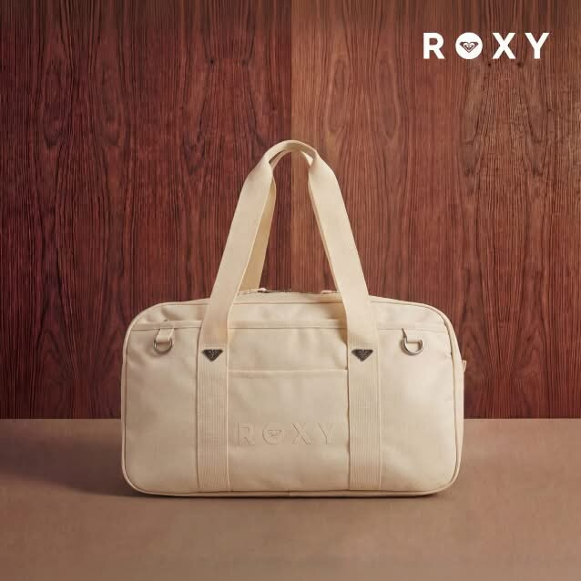 — 출처 <https://ccc.eu/media/cache/resolve/filemanager_original/images/homepage/homepage_ecpl/inpiracyjne/torby_podrozne_26/MENU_638x638_PL.jpg>

**페이지 메타 정보**

| page | title | description |
|---|---|---|
| [`home`](https://ccc.eu/pl/) | Sklep internetowy z butami, odzieżą i akcesoriami - CCC.eu | Na stronie CCC znajdziesz duży wybór butów damskich, męskich i dziecięcych na każdą okazję! W CCC również dobierzesz modne i stylowe akcesor |

#### [Modivo](https://modivo.pl/)

- URL: <https://modivo.pl/>
- 페이지: **OK 1 · FAIL 0**

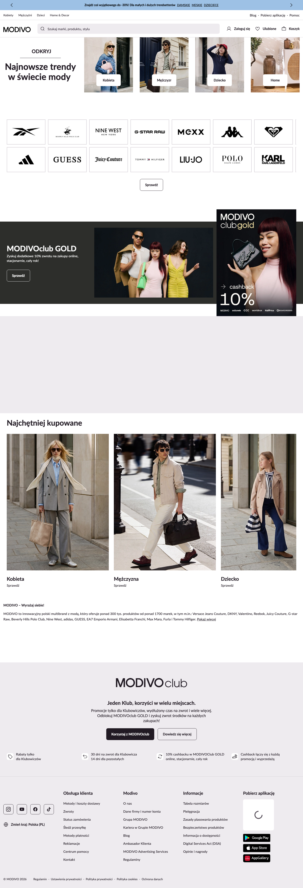

**대표 상품 이미지** (상위 6장, 출처 URL 포함)

- 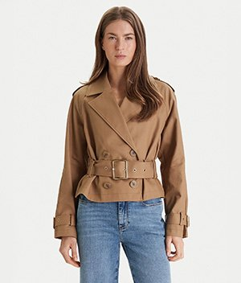 — 출처 <https://img.modivo.cloud/mod_mag(nawigacja/2026/03/wmn/n1.jpg)/n1.jpg>
- 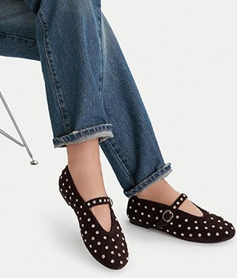 — 출처 <https://img.modivo.cloud/mod_mag(nawigacja/2026/03/wmn/n2.jpg)/n2.jpg>
- 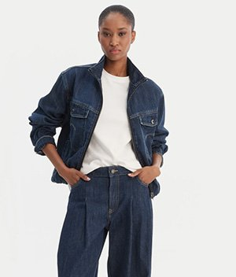 — 출처 <https://img.modivo.cloud/mod_mag(nawigacja/2026/03/wmn/s1.jpg)/s1.jpg>
- 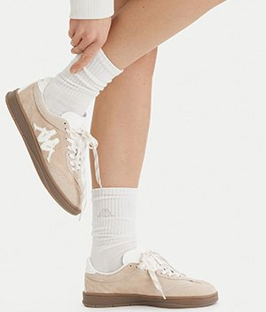 — 출처 <https://img.modivo.cloud/mod_mag(nawigacja/2026/03/wmn/s22.jpg)/s22.jpg>
- 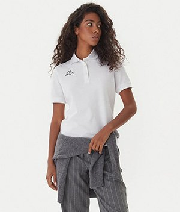 — 출처 <https://img.modivo.cloud/mod_mag(nawigacja/2026/03/wmn/m1.jpg)/m1.jpg>
- 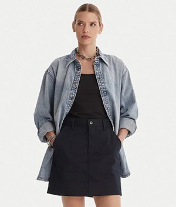 — 출처 <https://img.modivo.cloud/mod_mag(nawigacja/2026/03/wmn/m2.jpg)/m2.jpg>

**페이지 메타 정보**

| page | title | description |
|---|---|---|
| [`home`](https://modivo.pl/) | Moda damska, męska i dziecięca | Sklep internetowy MODIVO.PL | Stylowa moda męska • Najlepsze marki i topowi producenci • Szybka dostawa i zwrot • Stylowe zakupy na MODIVO.PL. |

#### [Reserved](https://www.reserved.com/pl/pl/)

- URL: <https://www.reserved.com/pl/pl/>
- 페이지: **OK 1 · FAIL 0**

**페이지 메타 정보**

| page | title | description |
|---|---|---|
| [`home`](https://www.reserved.com/pl/pl/) | Access Denied |  |

#### [Zalando Poland](https://www.zalando.pl/)

- URL: <https://www.zalando.pl/>
- 페이지: **OK 1 · FAIL 0**

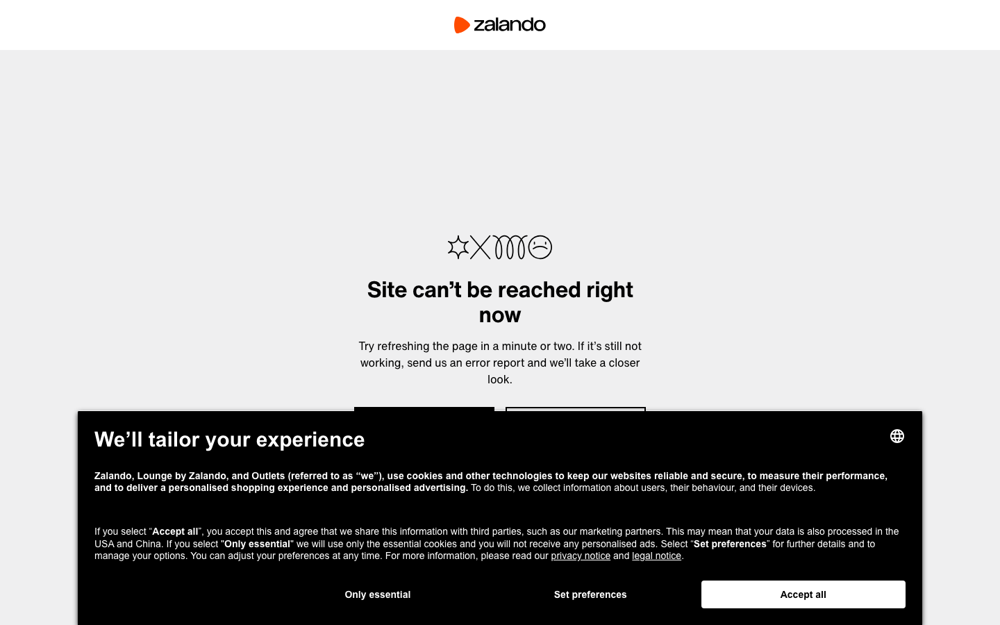

**페이지 메타 정보**

| page | title | description |
|---|---|---|
| [`home`](https://www.zalando.pl/) | Zalando |  |

### 4.19 사우디아라비아 _( Saudi Arabia )_

- 한국 수출규모 순위: **#20** · region: `middle_east` · tier `2` · currency `SAR`
- 수집 사이트: **5개** (성공 5)
- 메모: 중동 최대 시장, modest 비중 큼
#### [Centrepoint Saudi](https://www.centrepointstores.com/sa/en/)

- URL: <https://www.centrepointstores.com/sa/en/>
- 페이지: **OK 1 · FAIL 0**

**페이지 메타 정보**

| page | title | description |
|---|---|---|
| [`home`](https://www.centrepointstores.com/sa/en/) | Just a moment... |  |

#### [Max Fashion Saudi](https://www.maxfashion.com/sa/en/)

- URL: <https://www.maxfashion.com/sa/en/>
- 페이지: **OK 1 · FAIL 0**

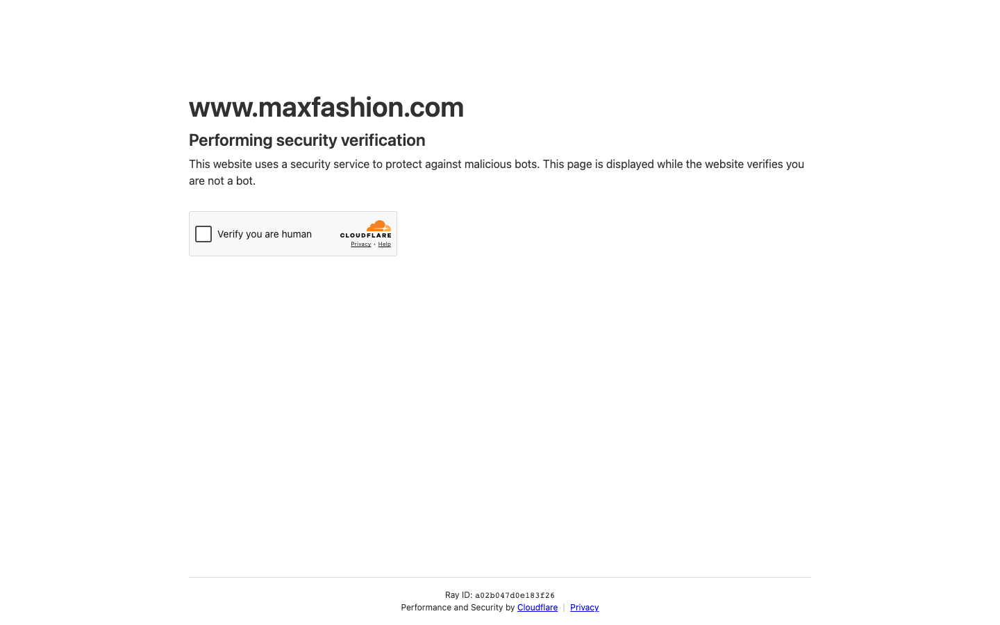

**페이지 메타 정보**

| page | title | description |
|---|---|---|
| [`home`](https://www.maxfashion.com/sa/en/) | Just a moment... |  |

#### [Namshi Saudi](https://www.namshi.com/saudi-en/)

- URL: <https://www.namshi.com/saudi-en/>
- 페이지: **OK 1 · FAIL 0**

**페이지 메타 정보**

| page | title | description |
|---|---|---|
| [`home`](https://www.namshi.com/saudi-en/) | Access Denied |  |

#### [Noon Saudi](https://www.noon.com/saudi-en/)

- URL: <https://www.noon.com/saudi-en/>
- 페이지: **OK 1 · FAIL 0**

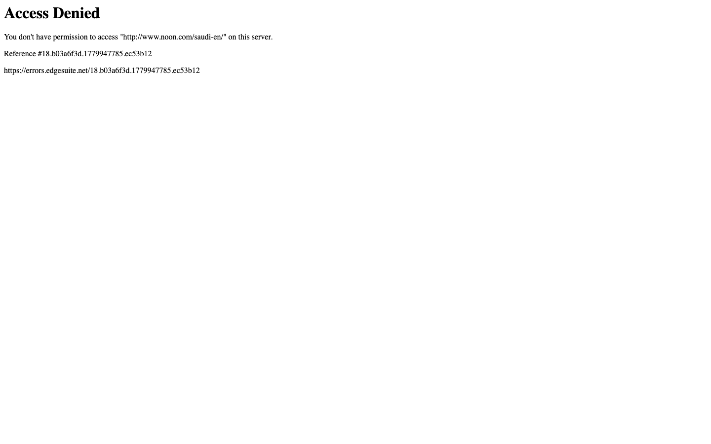

**페이지 메타 정보**

| page | title | description |
|---|---|---|
| [`home`](https://www.noon.com/saudi-en/) | Access Denied |  |

#### [Ounass Saudi](https://www.ounass.com/sa-en/)

- URL: <https://www.ounass.com/sa-en/>
- 페이지: **OK 1 · FAIL 0**

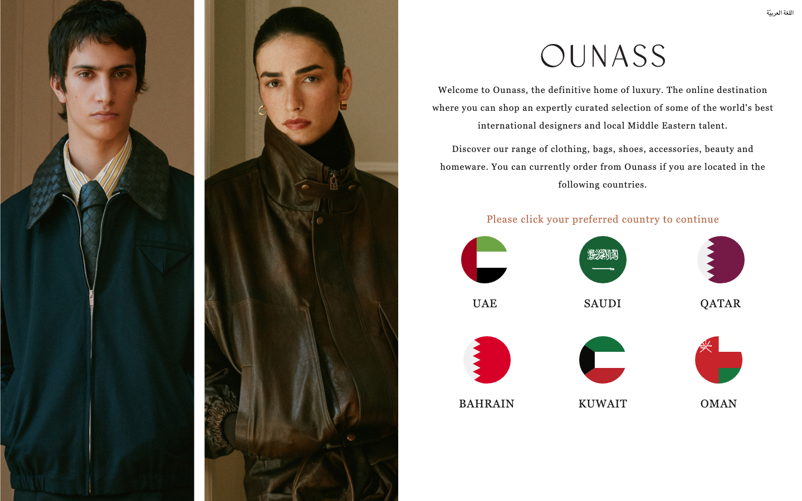

**대표 상품 이미지** (상위 6장, 출처 URL 포함)

- 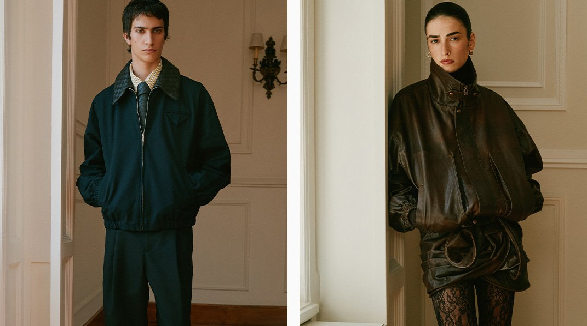 — 출처 <https://www.ounass.com/img/splash/ounass-the-definitive-home-of-luxury--sm-2x.jpg?0c9d351>

**페이지 메타 정보**

| page | title | description |
|---|---|---|
| [`home`](https://www.ounass.com/sa-en/) | OUNASS | Welcome To The Definitive Home Of Luxury | Discover the world’s most coveted fashion designers and luxury brands in the Middle East. Shop online in the UAE, Saudi Arabia and Qatar wit |

### 4.20 싱가포르 _( Singapore )_

- 한국 수출규모 순위: **#14** · region: `asia` · tier `2` · currency `SGD`
- 수집 사이트: **5개** (성공 5)
- 메모: 영어권 동남아 허브
#### [Charles & Keith](https://www.charleskeith.com/sg/)

- URL: <https://www.charleskeith.com/sg/>
- 페이지: **OK 1 · FAIL 0**

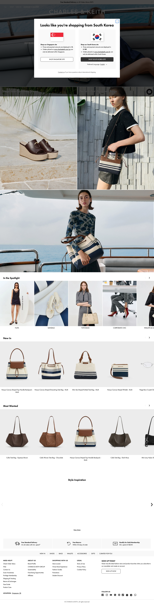

**대표 상품 이미지** (상위 6장, 출처 URL 포함)

- 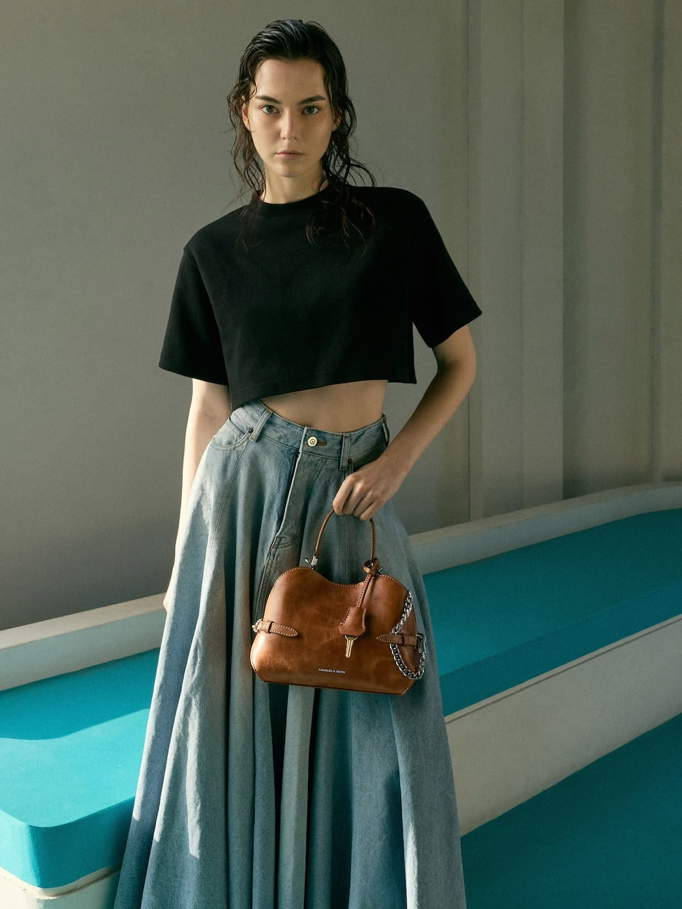 — 출처 <https://www.charleskeith.com/on/demandware.static/-/Library-Sites-CharlesKeith/default/dwbfd770cc/images/megamenu/2026/charles-keith-mega-menu-spring-26-delfina-week21-600x800.jpg>
- 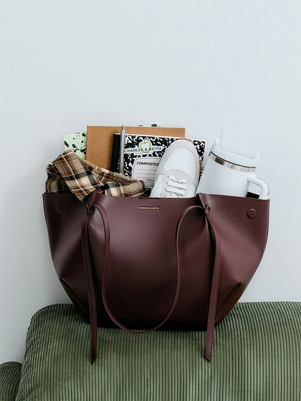 — 출처 <https://www.charleskeith.com/on/demandware.static/-/Library-Sites-CharlesKeith/default/dwb465aae3/images/megamenu/2026/charles-keith-mega-menu-spring-26-week-7-on-campus-600x800.jpg>
-  — 출처 <https://www.charleskeith.com/on/demandware.static/-/Library-Sites-CharlesKeith/default/dw703a4980/images/megamenu/2026/charles-keith-mega-menu-summer-calling-26-week20-450x300.jpg>
- 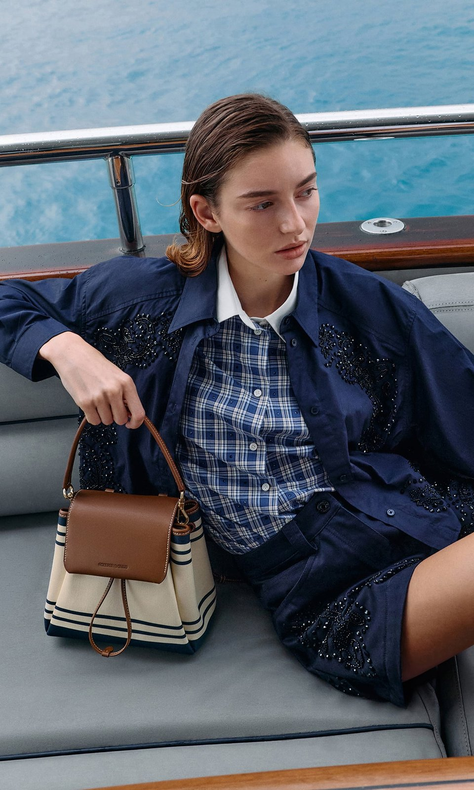 — 출처 <https://www.charleskeith.com/on/demandware.static/-/Library-Sites-CharlesKeith/default/dwd21c56e5/images/homepage/2026/charles-keith-home-s-1-week-22-600x1000-mobile.jpg>
- 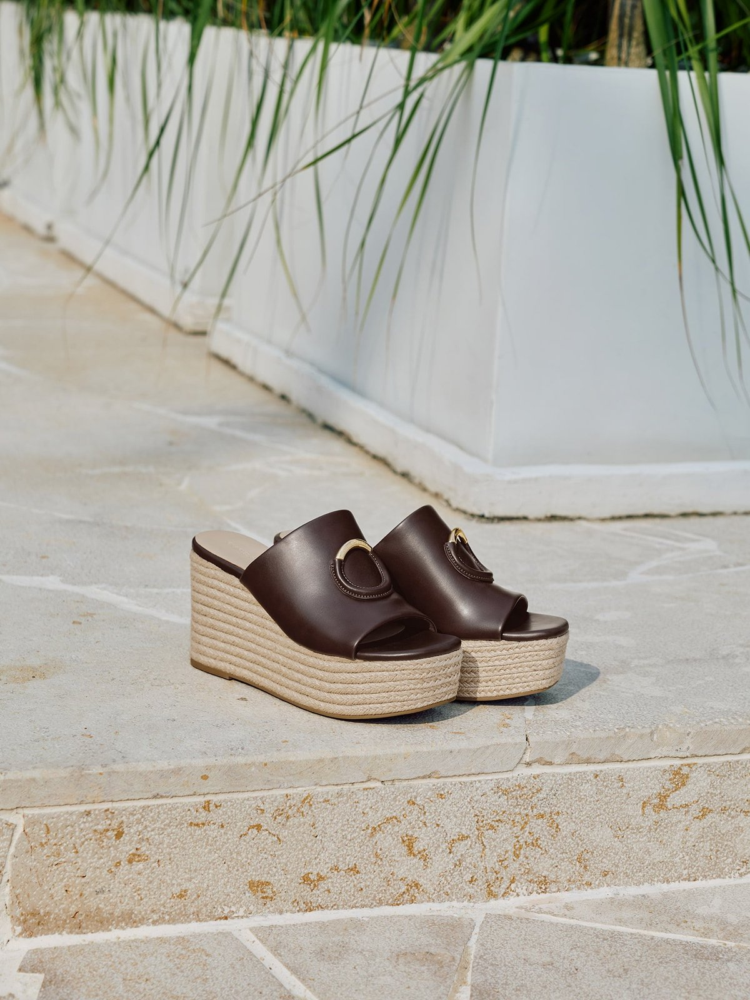 — 출처 <https://www.charleskeith.com/on/demandware.static/-/Library-Sites-CharlesKeith/default/dwa9c53fb4/images/homepage/2026/charles-keith-home-d-1-week-22-750x1000-desktop.jpg>
- 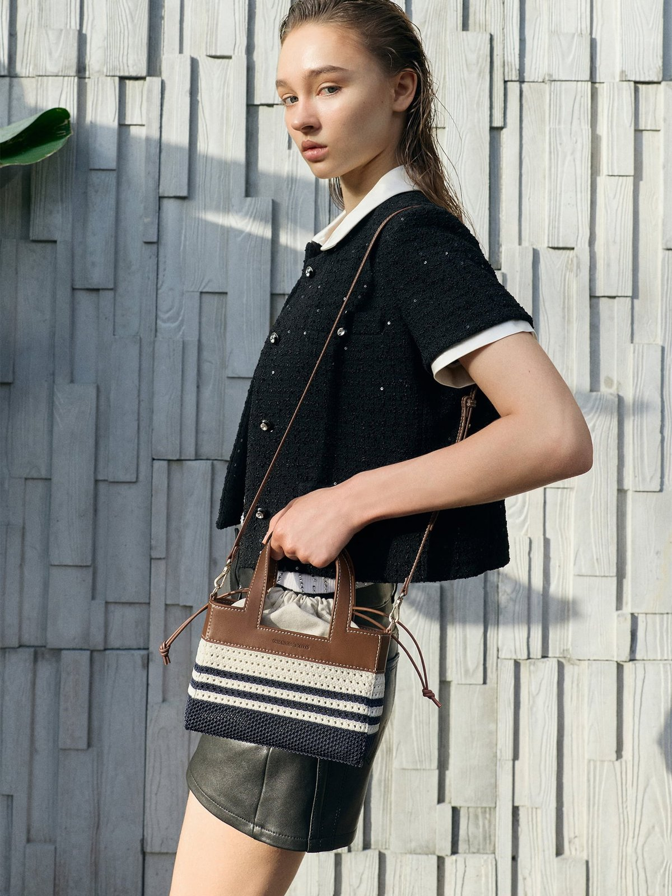 — 출처 <https://www.charleskeith.com/on/demandware.static/-/Library-Sites-CharlesKeith/default/dw55aede15/images/homepage/2026/charles-keith-home-d-2-week-22-750x1000-desktop.jpg>

**페이지 메타 정보**

| page | title | description |
|---|---|---|
| [`home`](https://www.charleskeith.com/sg) | CHARLES & KEITH Singapore - Shop the official site | Shop the official CHARLES & KEITH website for the latest in women's and kids' fashion, including bags, shoes and accessories. Check out the  |

#### [Love Bonito](https://www.lovebonito.com/sg/)

- URL: <https://www.lovebonito.com/sg/>
- 페이지: **OK 1 · FAIL 0**

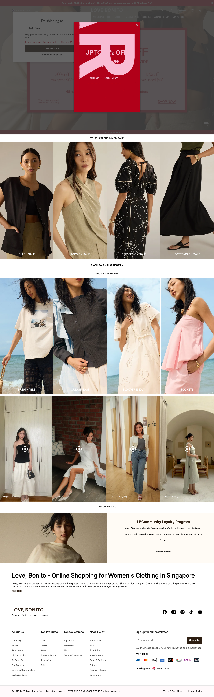

**대표 상품 이미지** (상위 6장, 출처 URL 포함)

- 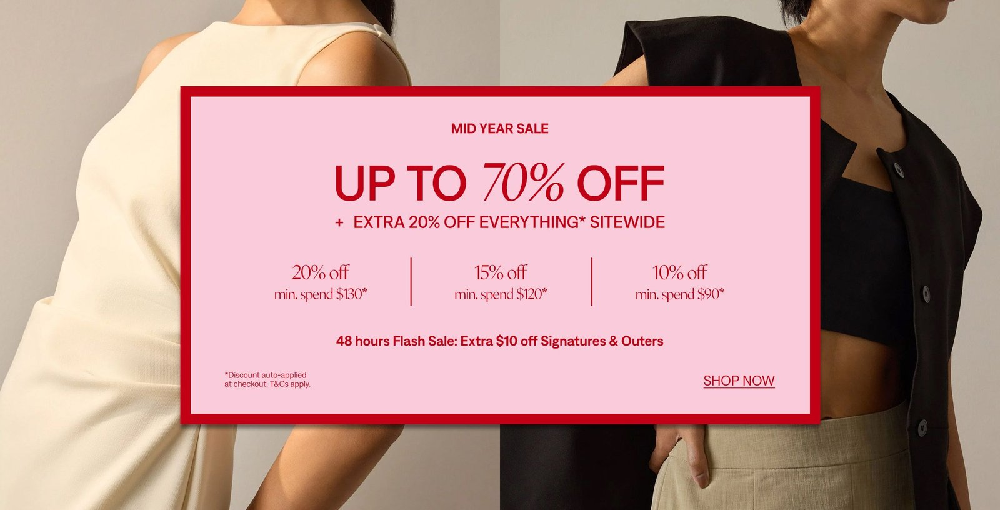 — 출처 <https://a.storyblok.com/f/126880/2400x1225/a9a33cb0a6/onsite_mys-26_fs2_homepage-hero-banner_sg_desktop.jpg/m/filters:no_upscale(),format(webp)>
- 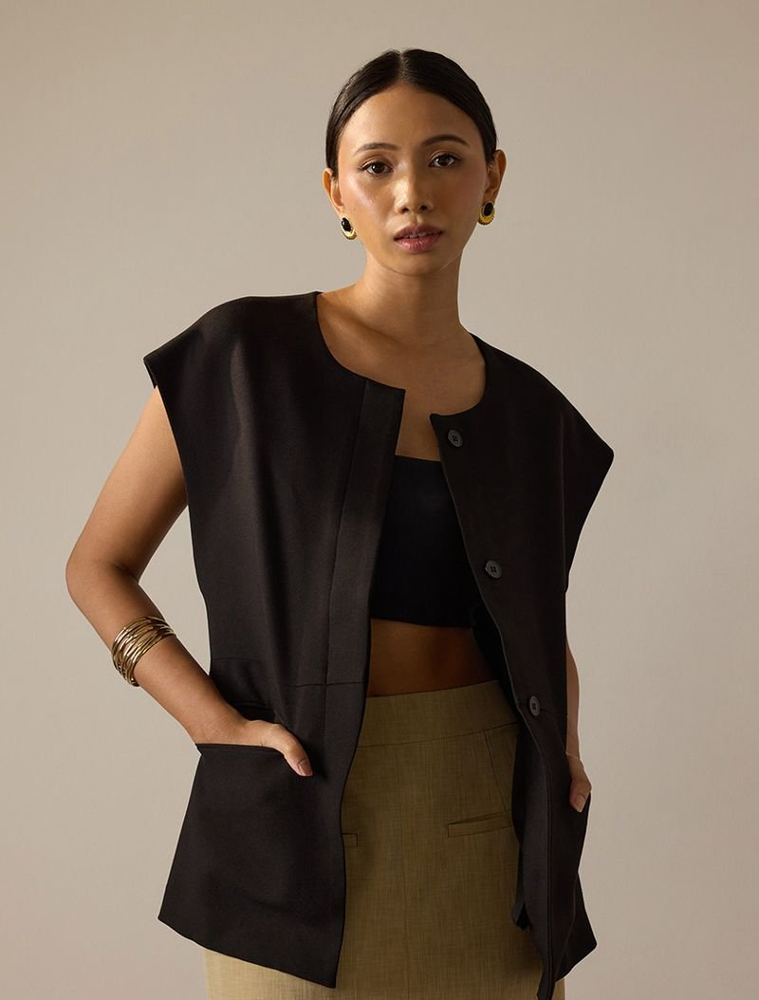 — 출처 <https://a.storyblok.com/f/126880/820x1080/6e7e3c1172/onsite_mys-26_fs_wt-banner_fs2_signatures-outers.jpg/m/800x0/filters:no_upscale(),format(webp)>
- 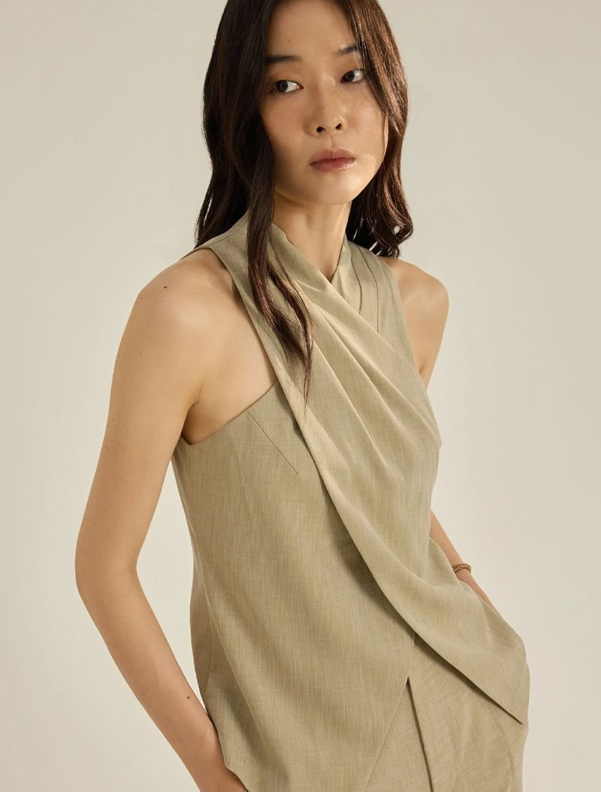 — 출처 <https://a.storyblok.com/f/126880/820x1080/c056bd8cf4/_tops.jpg/m/800x0/filters:no_upscale(),format(webp)>
- 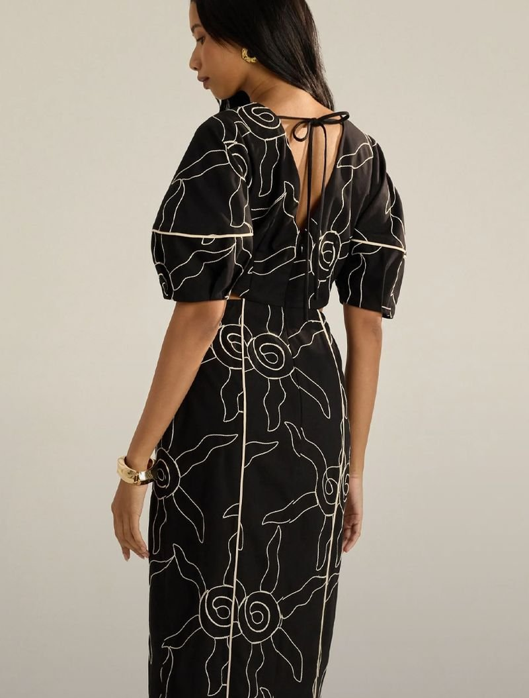 — 출처 <https://a.storyblok.com/f/126880/820x1080/aa40aaf56a/_dresses.jpg/m/800x0/filters:no_upscale(),format(webp)>
- 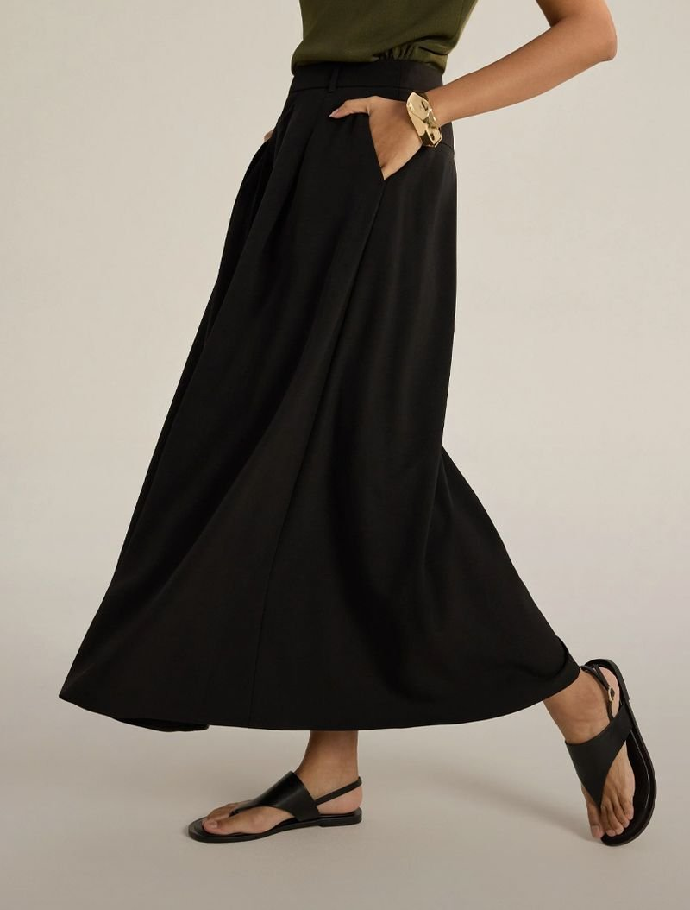 — 출처 <https://a.storyblok.com/f/126880/820x1080/b9828313c9/_bottoms.jpg/m/800x0/filters:no_upscale(),format(webp)>
- 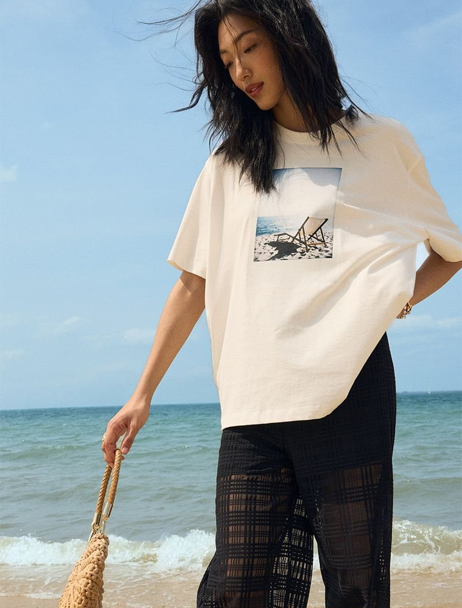 — 출처 <https://a.storyblok.com/f/126880/820x1080/17cf123a77/hp_cblock_31b6051755-31f6051859_breathable_w1.jpg/m/800x0/filters:no_upscale(),format(webp)>

**페이지 메타 정보**

| page | title | description |
|---|---|---|
| [`home`](https://www.lovebonito.com/sg) | Women's Clothing on Sale 70%+20% | Love, Bonito SG | Shop the Mid Year Sale with your besties, enjoy up to 70% off + extra 20% off everything on chic women’s fashion at Love, Bonito |

#### [Shopee Singapore](https://shopee.sg/)

- URL: <https://shopee.sg/>
- 페이지: **OK 1 · FAIL 0**

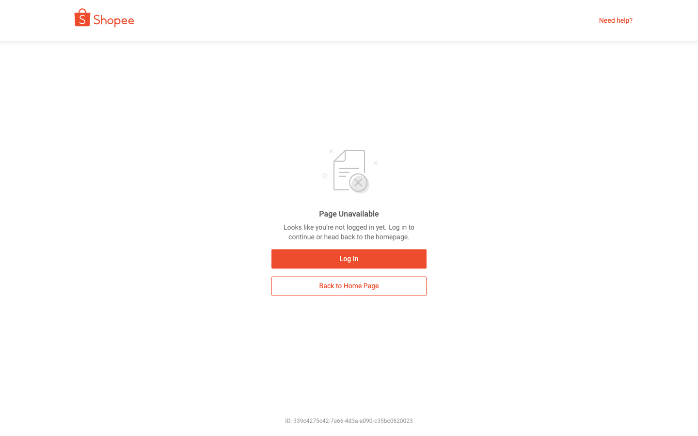

**페이지 메타 정보**

| page | title | description |
|---|---|---|
| [`home`](https://shopee.sg/verify/traffic/error?home_url=https%3A%2F%2Fshopee.sg&is_logged_in=false&next=https%3A%2F%2Fshopee.sg%2F&tracking_id=339c4275c42-7a66-4d3a-a090-c35bc0620023&type=4) | Shopee Singapore | Cheaper, Faster On Shopee |  |

#### [The Editor's Market](https://www.theeditorsmarket.com/)

- URL: <https://www.theeditorsmarket.com/>
- 페이지: **OK 1 · FAIL 0**

**최근 유행 상품** (12건 · 상품명 클릭 시 해당 사이트로 이동)

| # | 상품명 | 브랜드 | 가격 | 페이지 |
|---:|---|---|---:|---|
| 1 | Emberlyn Peterpan-Collar Blouse - Charcoal Plaid | The Editor's Market | 45 SGD | `home` |
| 2 | Emberlyn Peterpan-Collar Blouse - Blue Plaid | The Editor's Market | 45 SGD | `home` |
| 3 | Emberlyn Peterpan-Collar Blouse - Mint | The Editor's Market | 45 SGD | `home` |
| 4 | Emberlyn Peterpan-Collar Blouse - Navy | The Editor's Market | 45 SGD | `home` |
| 5 | Adrina Boat-Neck Top - Butter | The Editor's Market | 39 SGD | `home` |
| 6 | Adrina Boat-Neck Top - Ash | The Editor's Market | 39 SGD | `home` |
| 7 | Adrina Boat-Neck Top - Black | The Editor's Market | 39 SGD | `home` |
| 8 | Cassidy Swing Dress - Classic Navy Plaid | The Editor's Market | 69 SGD | `home` |
| 9 | Cassidy Swing Dress - Pillow Plaid | The Editor's Market | 69 SGD | `home` |
| 10 | Cassidy Swing Dress - Navy | The Editor's Market | 69 SGD | `home` |
| 11 | Cassidy Swing Dress - Buttermilk | The Editor's Market | 69 SGD | `home` |
| 12 | Cassidy Swing Dress - Black | The Editor's Market | 69 SGD | `home` |

**대표 상품 이미지** (상위 6장, 출처 URL 포함)

- 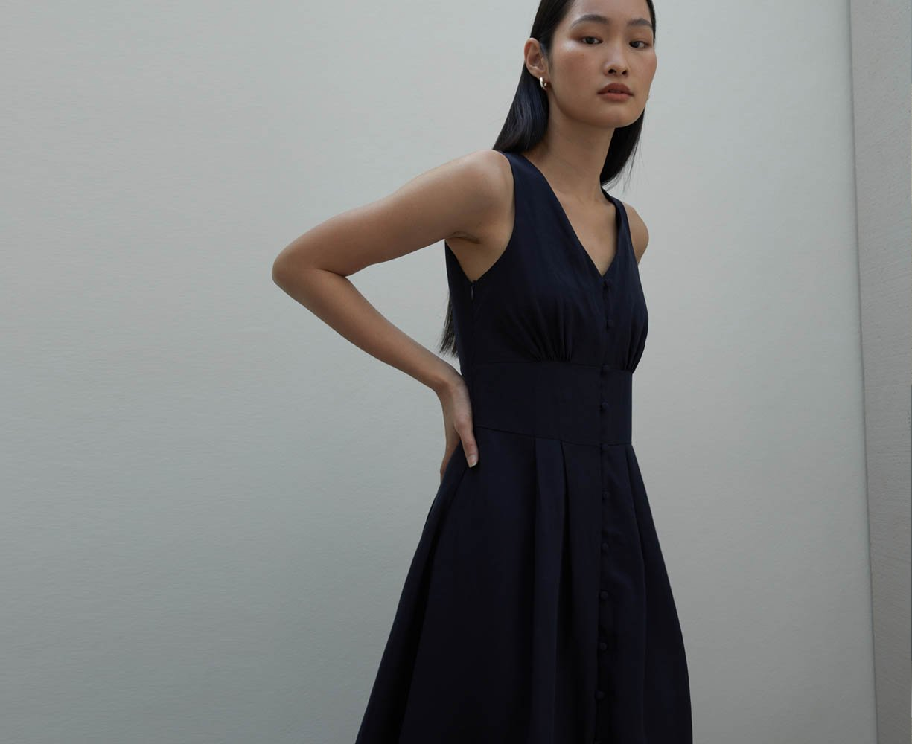 — 출처 <https://d2y4yyz2jq286d.cloudfront.net/sites/files/theeditorsmarket/banners/th3_0.jpg>
- 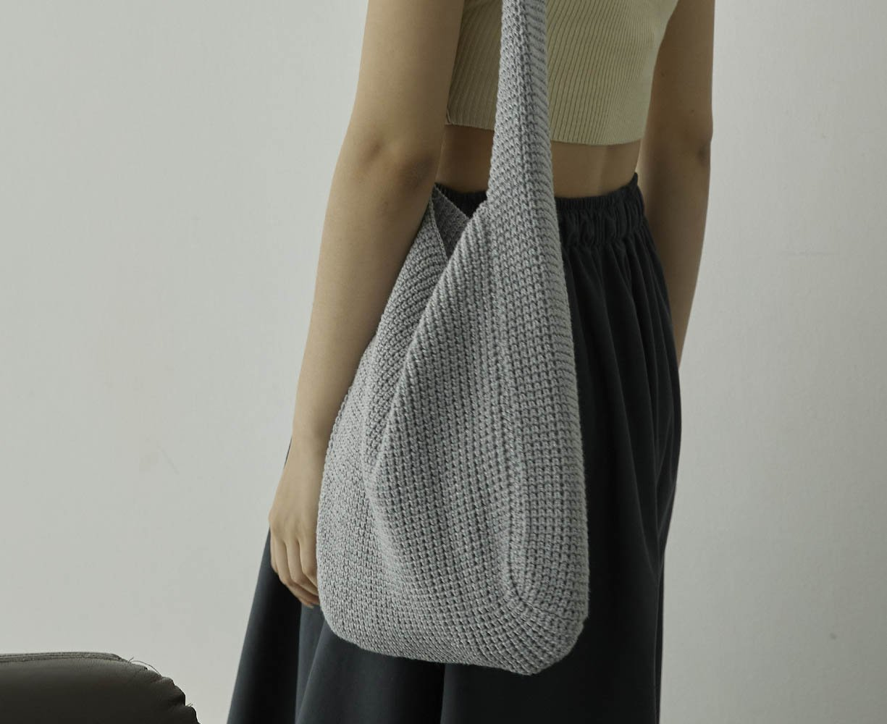 — 출처 <https://d2y4yyz2jq286d.cloudfront.net/sites/files/theeditorsmarket/banners/th_bags_1.jpg>
- 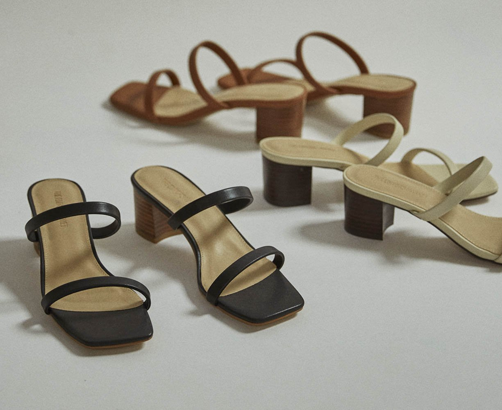 — 출처 <https://d2y4yyz2jq286d.cloudfront.net/sites/files/theeditorsmarket/banners/th_footwear_4.jpg>
-  — 출처 <https://d2y4yyz2jq286d.cloudfront.net/sites/files/theeditorsmarket/logo/logo_1.png>
- 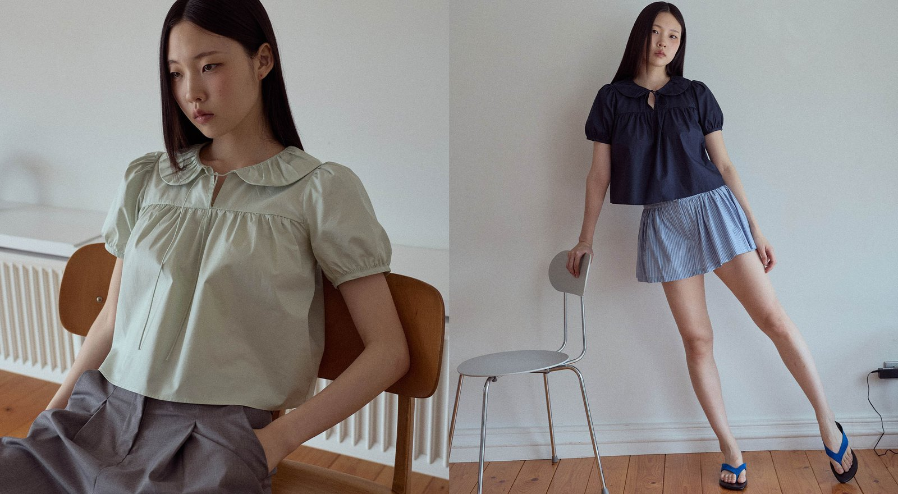 — 출처 <https://d2y4yyz2jq286d.cloudfront.net/sites/files/theeditorsmarket/banners/web_lp-21052026-sg2_x.jpg>
- 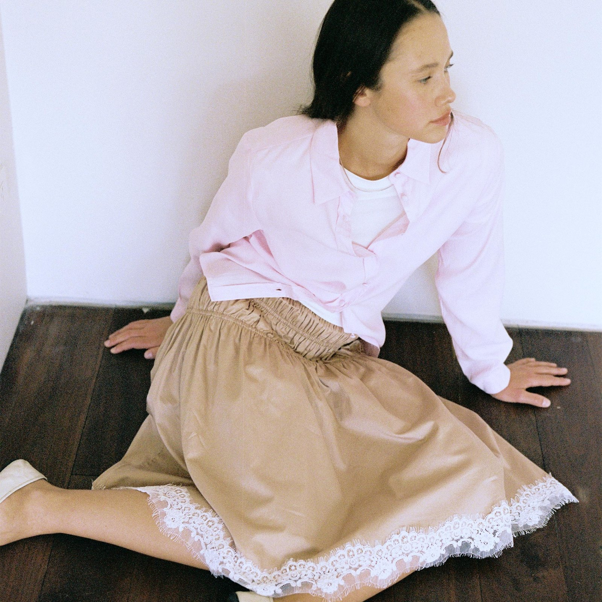 — 출처 <https://d2y4yyz2jq286d.cloudfront.net/sites/files/theeditorsmarket/banners/website-lp-tile-opt-5.jpg>

**페이지 메타 정보**

| page | title | description |
|---|---|---|
| [`home`](https://www.theeditorsmarket.com/) | The Editor's Market | Shop New Arrivals Online | Women's Fashion | Shop the latest fashion and lifestyle essentials online. Free shipping. Discover new dresses, tops, pants, skirts, accessories, homeware and |

#### [Zalora Singapore](https://www.zalora.sg/)

- URL: <https://www.zalora.sg/>
- 페이지: **OK 1 · FAIL 0**

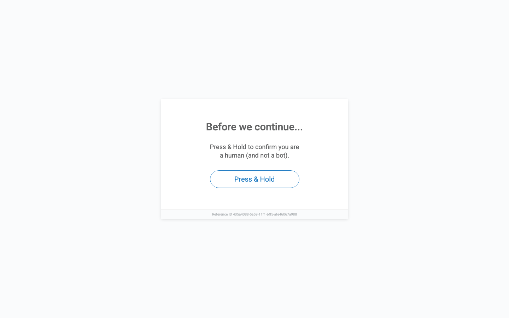

**페이지 메타 정보**

| page | title | description |
|---|---|---|
| [`home`](https://www.zalora.sg/) | Access to this page has been denied | px-captcha |

### 4.21 남아프리카공화국 _( South Africa )_

- 한국 수출규모 순위: **#29** · region: `africa` · tier `3` · currency `ZAR`
- 수집 사이트: **5개** (성공 5)
- 메모: 아프리카 진출 거점
#### [Mr Price](https://www.mrp.com/)

- URL: <https://www.mrp.com/>
- 페이지: **OK 1 · FAIL 0**

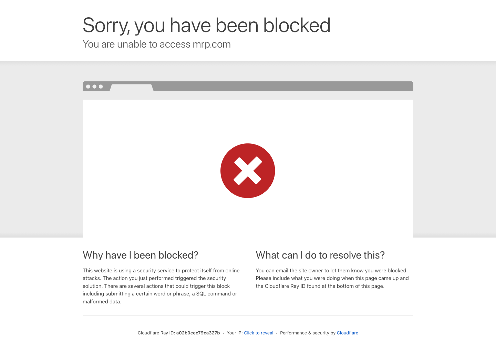

**페이지 메타 정보**

| page | title | description |
|---|---|---|
| [`home`](https://www.mrp.com/) | Attention Required! | Cloudflare |  |

#### [Superbalist](https://superbalist.com/)

- URL: <https://superbalist.com/>
- 페이지: **OK 1 · FAIL 0**

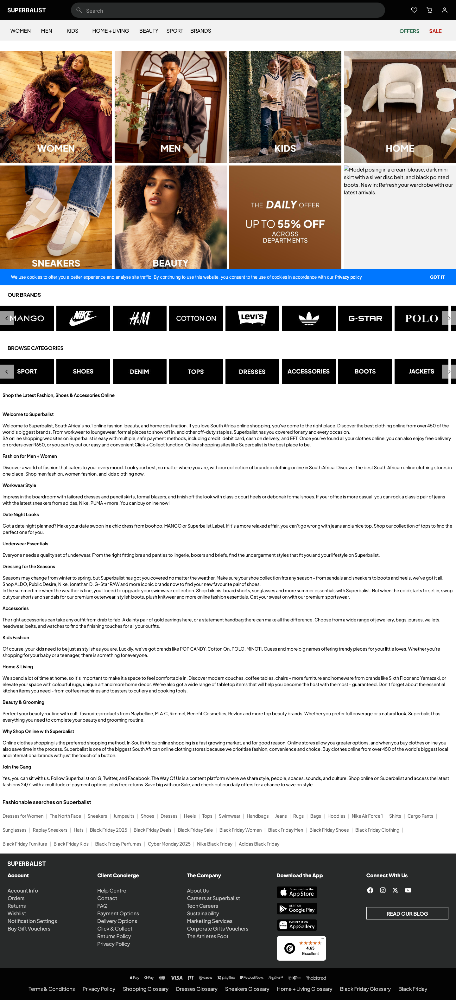

**대표 상품 이미지** (상위 6장, 출처 URL 포함)

- 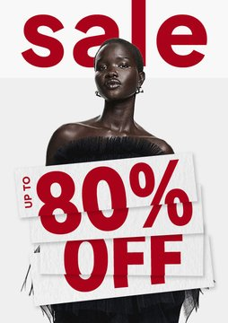 — 출처 <https://assets.superbalistcdn.co.za/254x/filters:quality(75):format(png)/4771654/original.png>
-  — 출처 <https://assets.superbalistcdn.co.za/1800x1800/filters:quality(75):format(jpg)/cms/WOMEN_CcpT443.png>
- 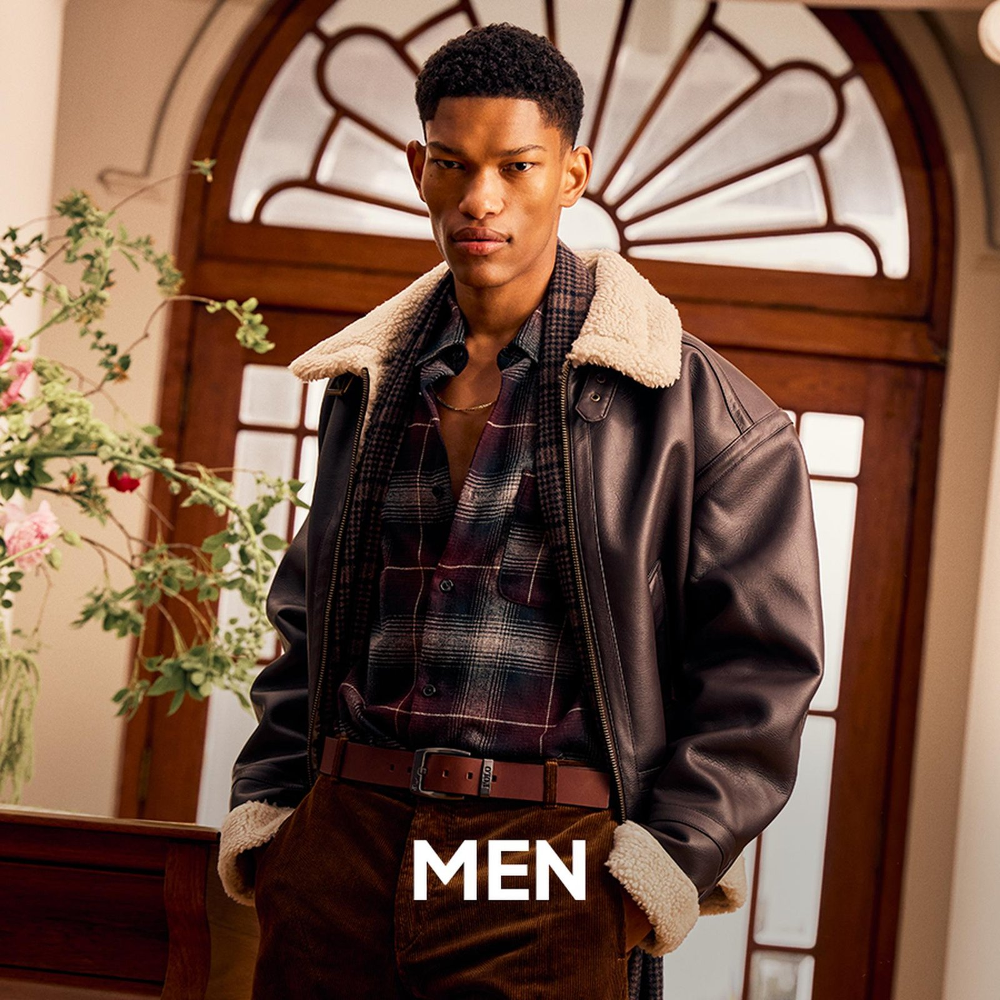 — 출처 <https://assets.superbalistcdn.co.za/1800x1800/filters:quality(75):format(jpg)/cms/MEN_gp5SSou.png>
- 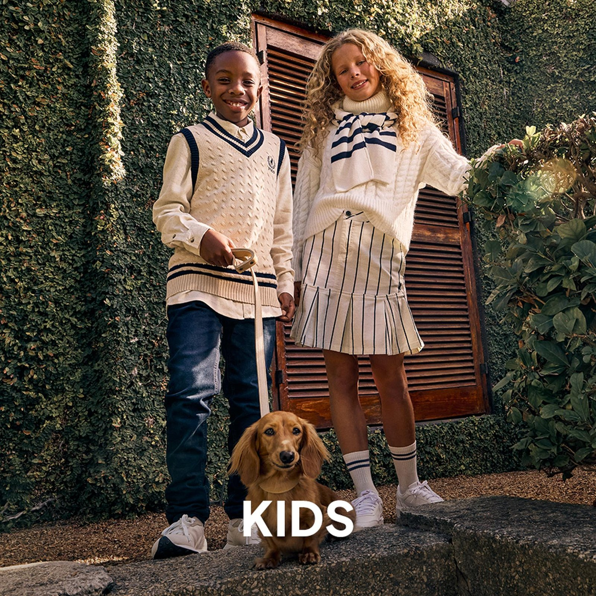 — 출처 <https://assets.superbalistcdn.co.za/1800x1800/filters:quality(75):format(jpg)/cms/KIDS_qBkUZRj.png>
- 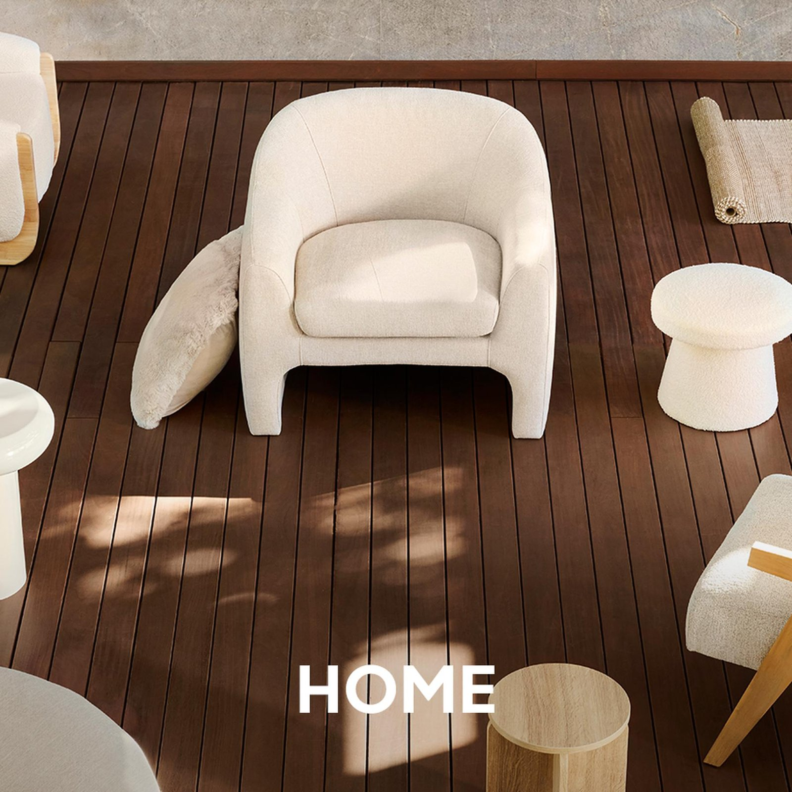 — 출처 <https://assets.superbalistcdn.co.za/1800x1800/filters:quality(75):format(jpg)/cms/HOME_HfHle6J.png>
- 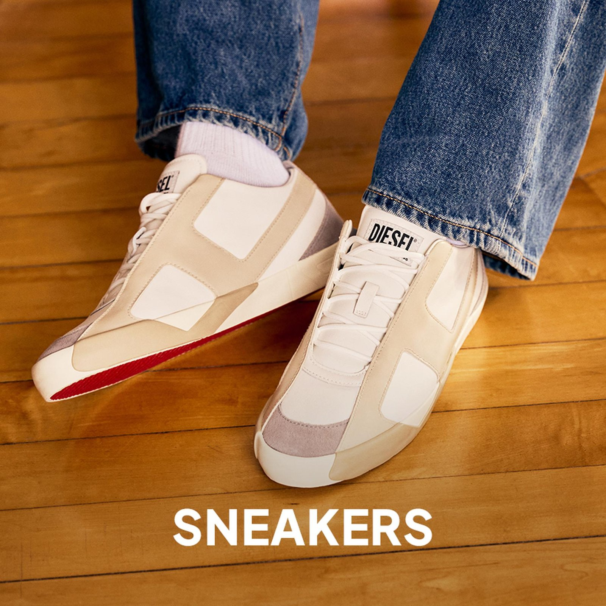 — 출처 <https://assets.superbalistcdn.co.za/1800x1800/filters:quality(75):format(jpg)/cms/SNEAKERS_UzFKJoc.png>

**페이지 메타 정보**

| page | title | description |
|---|---|---|
| [`home`](https://superbalist.com/) | SUPERBALIST: SA’s Top Online Destination for Clothing, Footwear & Home | Online Shopping - Shop wide collection of shoes, clothing, tech & accessories at South Africa's leading online store. Buy products for Men,  |

#### [Takealot](https://www.takealot.com/)

- URL: <https://www.takealot.com/>
- 페이지: **OK 1 · FAIL 0**

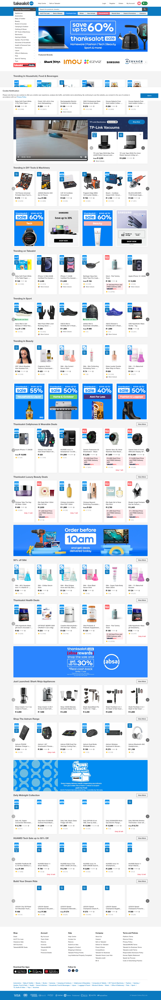

**대표 상품 이미지** (상위 6장, 출처 URL 포함)

- 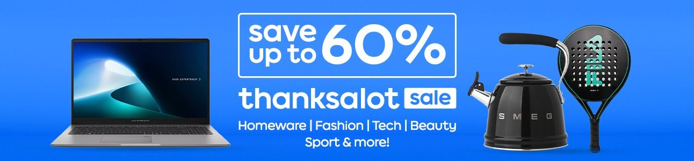 — 출처 <https://media.takealot.com/b/2/cms/p/1292x300/smart/filters:format(jpeg):background_color(white):focal(360x4:938x299)/original_images/1ccea20e0b7e4470a385b4804b86c594ff372083.png>
- 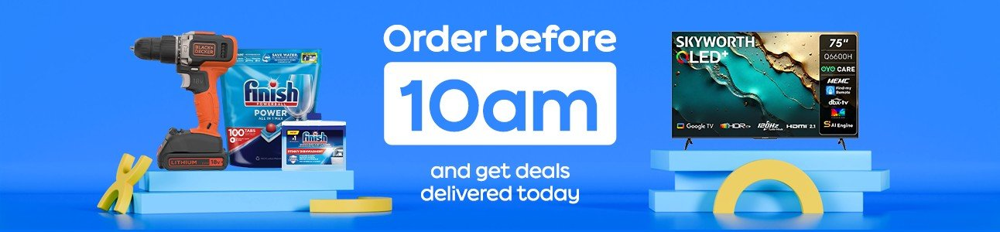 — 출처 <https://media.takealot.com/b/2/cms/p/1292x300/smart/filters:format(jpeg):background_color(white):focal(243x0:950x300)/original_images/58f13f84df1a1b6987b555194ef02e5d0d048081.png>
- 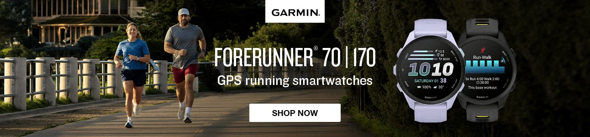 — 출처 <https://osx-tal.gumlet.io/onlinesales/image/upload/v1779448197/khsfiswbidxd465nlhjy.png>
- 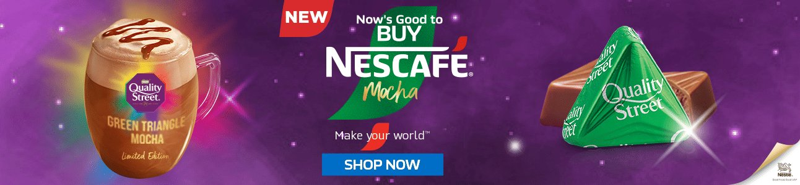 — 출처 <https://osx-tal.gumlet.io/onlinesales/image/upload/v1778668566/bcu6sso8ac0akotjzm6r.png>
-  — 출처 <https://media.takealot.com/b/2/cms/p/fit-in/450x140/original_images/72c859c8b8a0543ee69339302d3d0c61a4d25d76.png>
-  — 출처 <https://media.takealot.com/b/2/cms/p/fit-in/180x120/original_images/db06929c26742e81500f7309058a8f9af999ee5f_Jbl8f0B.png>

**페이지 메타 정보**

| page | title | description |
|---|---|---|
| [`home`](https://www.takealot.com/) | Takealot.com: Online Shopping | SA's leading online store | South Africa's leading online store. Fast, reliable delivery to your door. Many ways to pay. Shop anything you can imagine: TVs, laptops, ce |

#### [Woolworths South Africa](https://www.woolworths.co.za/)

- URL: <https://www.woolworths.co.za/>
- 페이지: **OK 1 · FAIL 0**

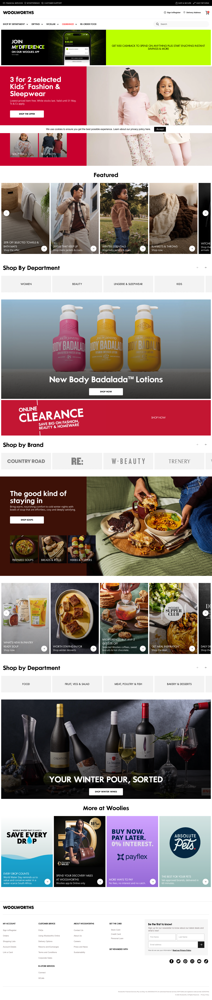

**대표 상품 이미지** (상위 6장, 출처 URL 포함)

-  — 출처 <https://www.woolworths.co.za/images/woolworths_logo.png>

**페이지 메타 정보**

| page | title | description |
|---|---|---|
| [`home`](https://www.woolworths.co.za/) | Woolworths Online Shopping | Woolworths.co.za | Online shopping for homeware, fashion, food and beauty. Discover a world of quality and value on the Woolworths online store. |

#### [Zando](https://www.zando.co.za/)

- URL: <https://www.zando.co.za/>
- 페이지: **OK 1 · FAIL 0**

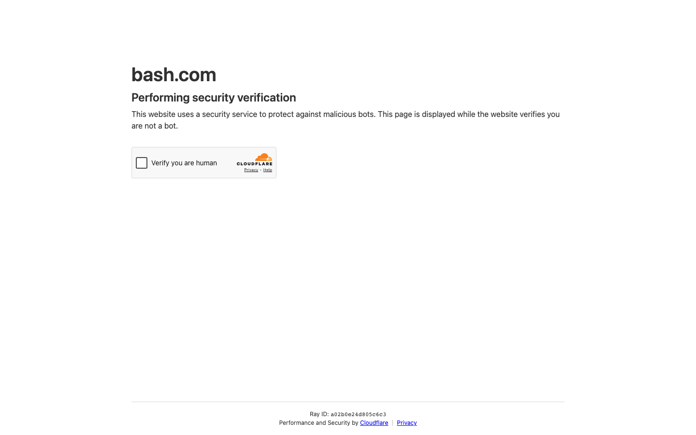

**페이지 메타 정보**

| page | title | description |
|---|---|---|
| [`home`](https://bash.com/?redirect=www.zando.co.za) | Just a moment... |  |

### 4.22 스페인 _( Spain )_

- 한국 수출규모 순위: **#22** · region: `europe` · tier `3` · currency `EUR`
- 수집 사이트: **5개** (성공 5)
- 메모: 패스트패션 본거지 (Zara/Mango)
#### [Bershka](https://www.bershka.com/)

- URL: <https://www.bershka.com/>
- 페이지: **OK 1 · FAIL 0**

**페이지 메타 정보**

| page | title | description |
|---|---|---|
| [`home`](https://www.bershka.com/) | Access Denied |  |

#### [El Corte Inglés](https://www.elcorteingles.es/)

- URL: <https://www.elcorteingles.es/>
- 페이지: **OK 1 · FAIL 0**

**페이지 메타 정보**

| page | title | description |
|---|---|---|
| [`home`](https://www.elcorteingles.es/) | Access Denied |  |

#### [Mango](https://shop.mango.com/)

- URL: <https://shop.mango.com/>
- 페이지: **OK 1 · FAIL 0**

**페이지 메타 정보**

| page | title | description |
|---|---|---|
| [`home`](https://shop.mango.com/) | Access Denied |  |

#### [Pull&Bear](https://www.pullandbear.com/)

- URL: <https://www.pullandbear.com/>
- 페이지: **OK 1 · FAIL 0**

**페이지 메타 정보**

| page | title | description |
|---|---|---|
| [`home`](https://www.pullandbear.com/) | Access Denied |  |

#### [Zara Spain](https://www.zara.com/es/)

- URL: <https://www.zara.com/es/>
- 페이지: **OK 1 · FAIL 0**

**페이지 메타 정보**

| page | title | description |
|---|---|---|
| [`home`](https://www.zara.com/es/) | Access Denied |  |

### 4.23 스웨덴 _( Sweden )_

- 한국 수출규모 순위: **#27** · region: `europe` · tier `3` · currency `SEK`
- 수집 사이트: **5개** (성공 5)
- 메모: 북유럽 트렌드 선도
#### [Åhléns](https://www.ahlens.se/)

- URL: <https://www.ahlens.se/>
- 페이지: **OK 1 · FAIL 0**

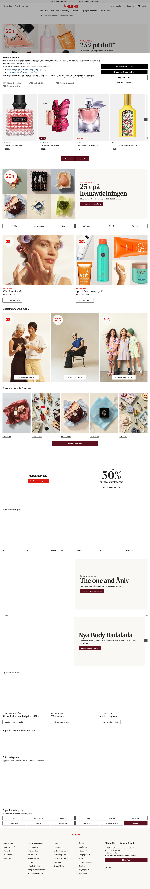

**대표 상품 이미지** (상위 6장, 출처 URL 포함)

- 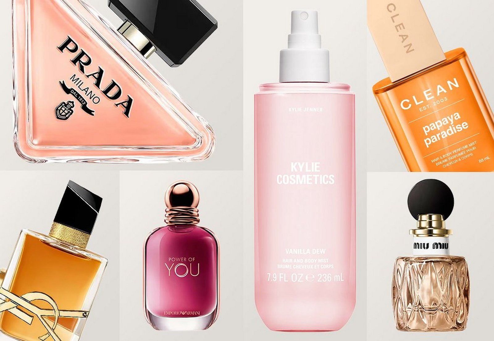 — 출처 <https://cdn.media.amplience.net/i/ahlens/doft_dam_v21/Dofter.?fmt=auto&w=3840&qlt=90&sm=aspect&aspect=13%3A9&scaleFit=poi&poi=%7B%24this.metadata.pointOfInterest.x%7D%2C%7B%24this.metadata.pointOfInterest.y%7D%2C%7B%24this.metadata.pointOfInterest.w%7D%2C%7B%24this.metadata.pointOfInterest.h%7D>
- 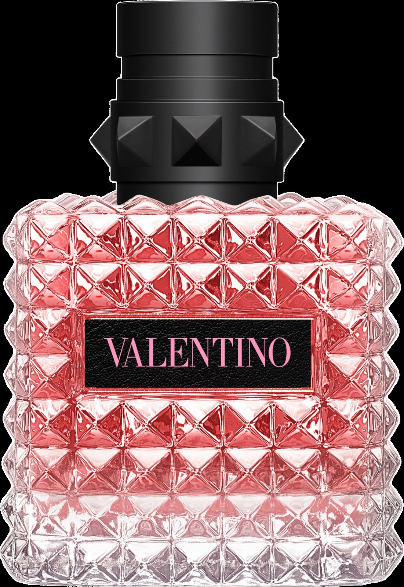 — 출처 <https://res.cloudinary.com/dxxvmvvyj/image/upload/t_ahlens-transformations-bg-removed/c_limit,w_3840/f_auto/q_auto/v1/products/bg_removed/36/14/27/3614272761421_1.jpg?_a=BAVMn6ID0>
- 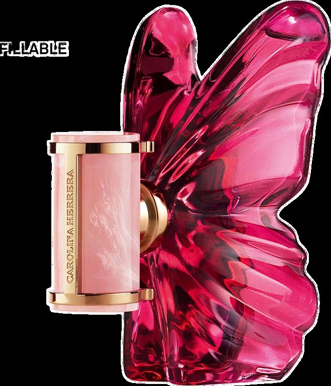 — 출처 <https://res.cloudinary.com/dxxvmvvyj/image/upload/t_ahlens-transformations-bg-removed/c_limit,w_3840/f_auto/q_auto/v1/products/bg_removed/84/11/06/8411061077153_1.jpg?_a=BAVMn6ID0>
- 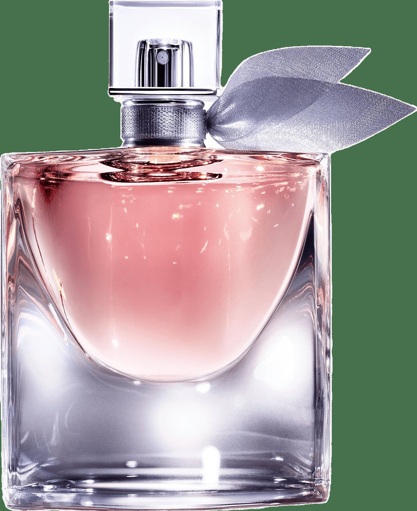 — 출처 <https://res.cloudinary.com/dxxvmvvyj/image/upload/t_ahlens-transformations-bg-removed/c_limit,w_3840/f_auto/q_auto/v1/products/bg_removed/79/57/38/57AP3877G1_79573861_1.jpg?_a=BAVMn6ID0>
- 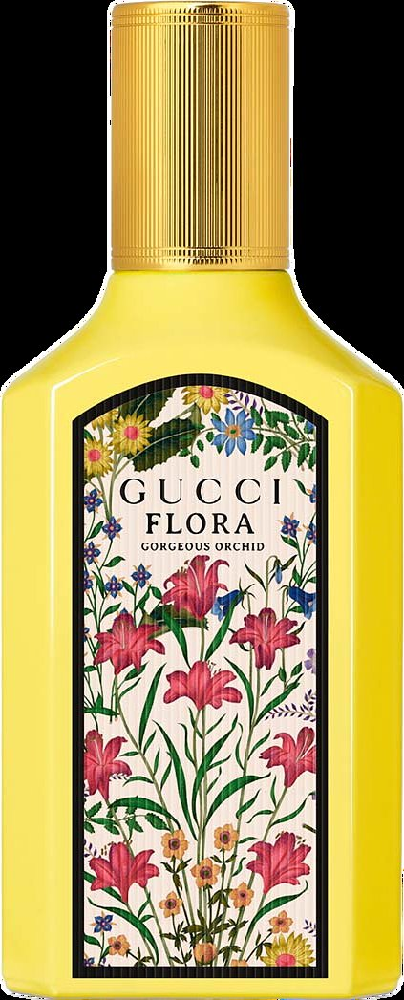 — 출처 <https://res.cloudinary.com/dxxvmvvyj/image/upload/t_ahlens-transformations-bg-removed/c_limit,w_3840/f_auto/q_auto/v1/products/bg_removed/36/16/30/3616305169266_1.jpg?_a=BAVMn6ID0>
- 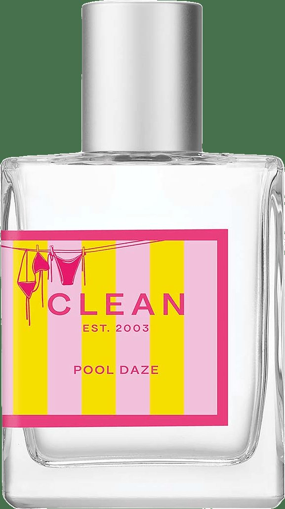 — 출처 <https://res.cloudinary.com/dxxvmvvyj/image/upload/t_ahlens-transformations-bg-removed/c_limit,w_3840/f_auto/q_auto/v1/products/bg_removed/66/53/81/66538163_1.jpg?_a=BAVMn6ID0>

**페이지 메타 정보**

| page | title | description |
|---|---|---|
| [`home`](https://www.ahlens.se/) | Åhléns - Online & Varuhus | Hos Åhléns hittar du det senaste inom mode, skönhet, inredning från mängder av populära varumärken. Fri frakt och retur till ditt varuhus. B |

#### [Boozt](https://www.boozt.com/se/sv)

- URL: <https://www.boozt.com/se/sv>
- 페이지: **OK 1 · FAIL 0**

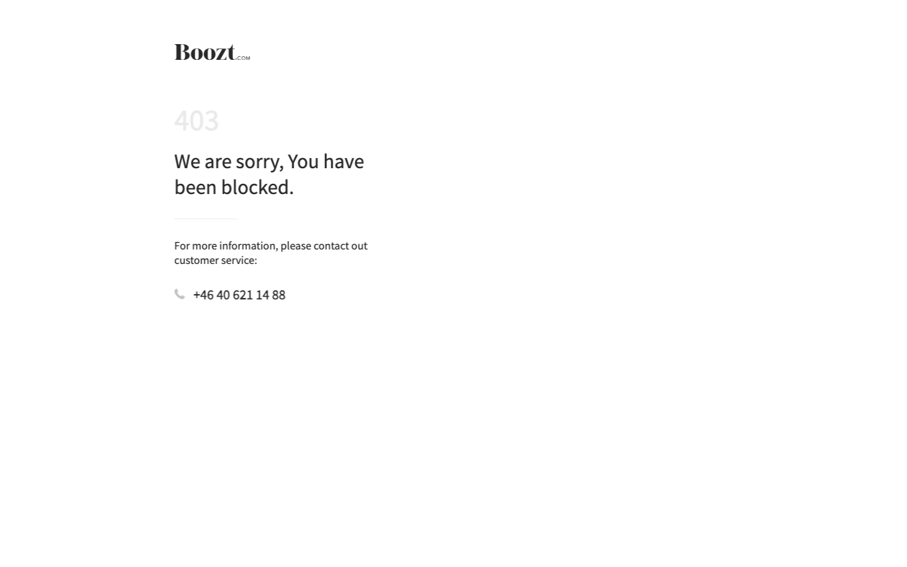

**페이지 메타 정보**

| page | title | description |
|---|---|---|
| [`home`](https://www.boozt.com/se/sv) | Boozt OOPS! |  |

#### [H&M Sweden](https://www2.hm.com/sv_se/index.html)

- URL: <https://www2.hm.com/sv_se/index.html>
- 페이지: **OK 1 · FAIL 0**

**페이지 메타 정보**

| page | title | description |
|---|---|---|
| [`home`](https://www2.hm.com/sv_se/index.html) | Access Denied |  |

#### [Lindex](https://www.lindex.com/)

- URL: <https://www.lindex.com/>
- 페이지: **OK 1 · FAIL 0**

**페이지 메타 정보**

| page | title | description |
|---|---|---|
| [`home`](https://www.lindex.com/) | Access Denied |  |

#### [NA-KD](https://www.na-kd.com/)

- URL: <https://www.na-kd.com/>
- 페이지: **OK 1 · FAIL 0**

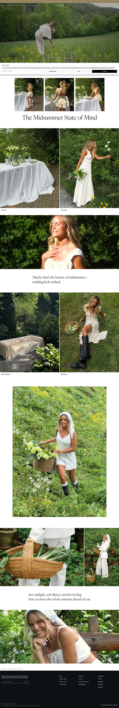

**대표 상품 이미지** (상위 6장, 출처 URL 포함)

- 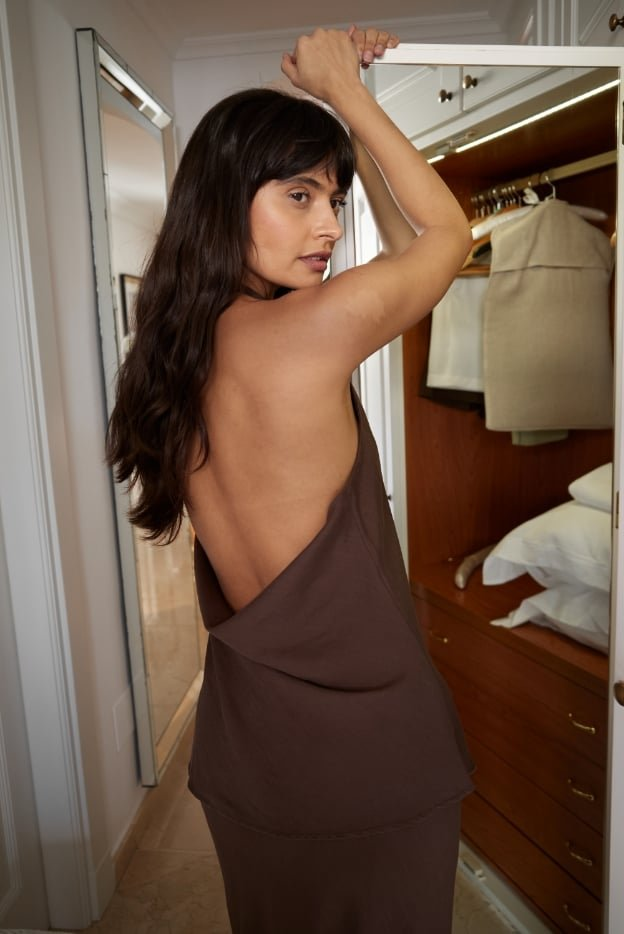 — 출처 <https://www.na-kd.com/cdn-cgi/image/width=1264/globalassets/menu/2026/04-april/occasion.jpg?ref=E15539016A>
- 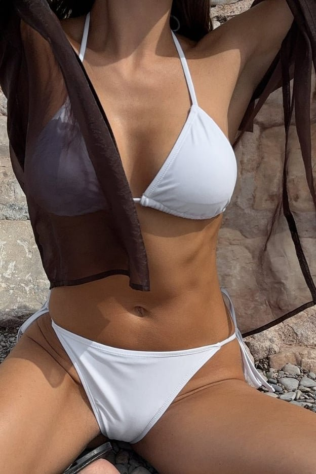 — 출처 <https://www.na-kd.com/cdn-cgi/image/width=1264/globalassets/menu/2026/04-april/swim_trending-.jpg?ref=15011161F8>
- 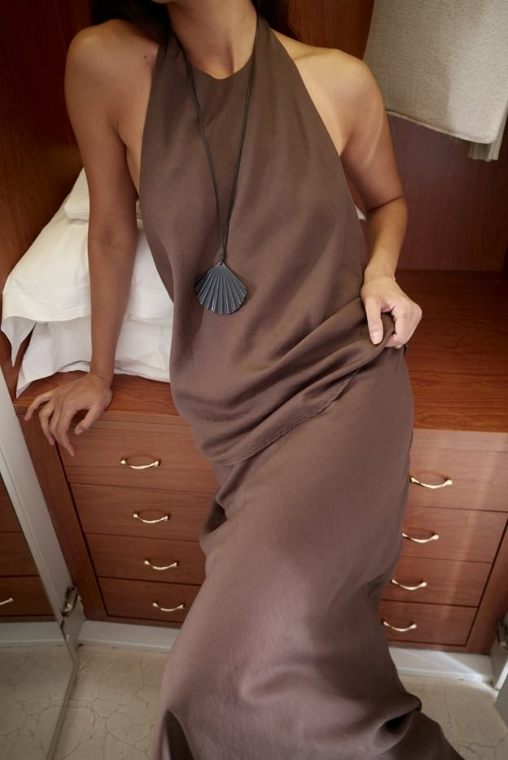 — 출처 <https://www.na-kd.com/cdn-cgi/image/width=1264/globalassets/menu/2026/04-april/linen.jpg?ref=276414C586>
- 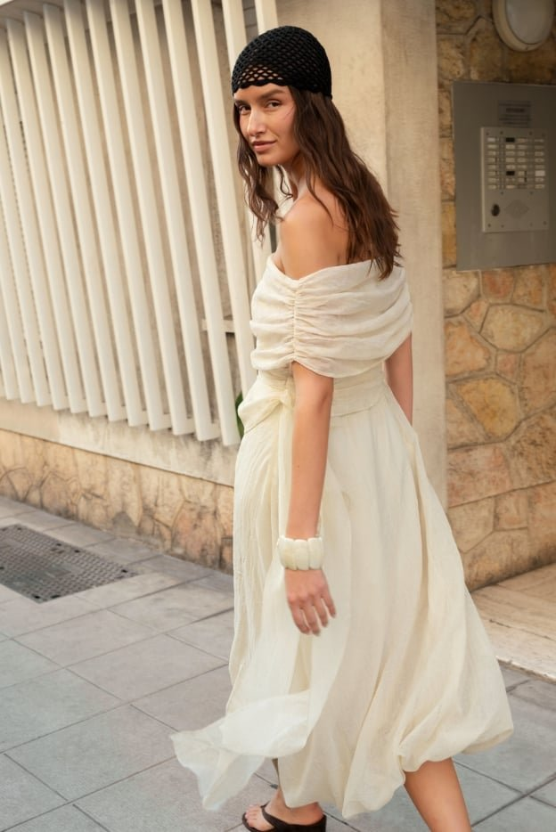 — 출처 <https://www.na-kd.com/cdn-cgi/image/width=1264/globalassets/menu/2026/04-april/newin.jpg?ref=E2037CCB76>
- 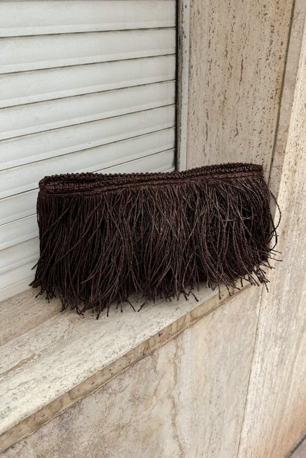 — 출처 <https://www.na-kd.com/cdn-cgi/image/width=1264/globalassets/menu/2026/04-april/bags.jpg?ref=579E305797>
- 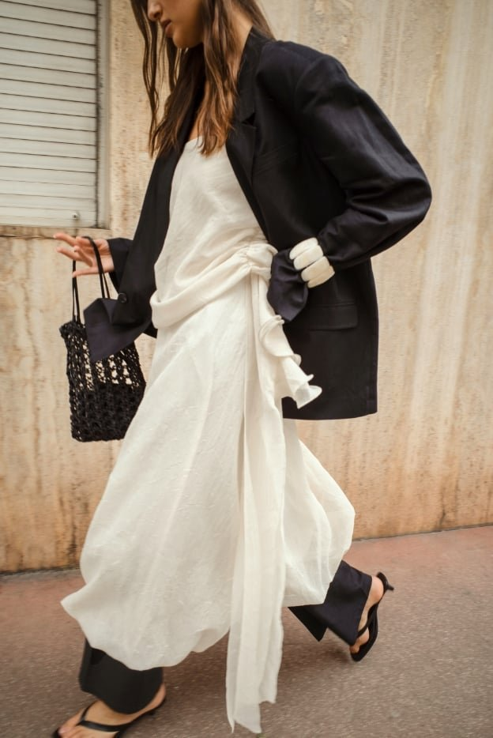 — 출처 <https://www.na-kd.com/cdn-cgi/image/width=1264/globalassets/menu/2026/04-april/jewellry.jpg?ref=D779DA702E>

**페이지 메타 정보**

| page | title | description |
|---|---|---|
| [`home`](https://www.na-kd.com/en) | NA-KD - Women's fashion online | NA-KD | Discover the latest trends in fashion, shoes, and accessories at NA-KD. Shop women's clothing for each season in our online store. New style |

### 4.24 대만 _( Taiwan )_

- 한국 수출규모 순위: **#7** · region: `asia` · tier `1` · currency `TWD`
- 수집 사이트: **5개** (성공 4)
- 메모: K-패션 친화도 높음
#### [momo](https://www.momoshop.com.tw/)

- URL: <https://www.momoshop.com.tw/>
- 페이지: **OK 1 · FAIL 0**

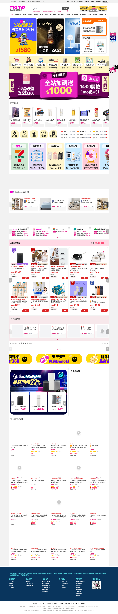

**대표 상품 이미지** (상위 6장, 출처 URL 포함)

-  — 출처 <https://img2.momoshop.com.tw/ecm/img/online/10/998/00/000/bt_0_271_01/bt_0_271_01_e2.jpg?t=1777893650110>
-  — 출처 <https://img1.momoshop.com.tw/ecm/img/online/10/998/00/000/bt_0_243_01/bt_0_243_01_e2.png?t=1779094839233>
- 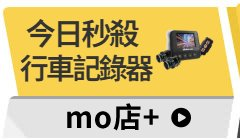 — 출처 <https://img2.momoshop.com.tw/ecm/img/online/10/998/00/000/bt_0_245_01/bt_0_245_01_P1_1_e2.png?t=1779897607908>
-  — 출처 <https://img2.momoshop.com.tw/ecm/img/online/10/998/00/000/bt_0_245_01/bt_0_245_01_P1_2_e2.png?t=1779465611975>
-  — 출처 <https://img2.momoshop.com.tw/ecm/img/online/10/998/00/000/bt_0_245_01/bt_0_245_01_P1_3_e2.png?t=1779465611975>
- 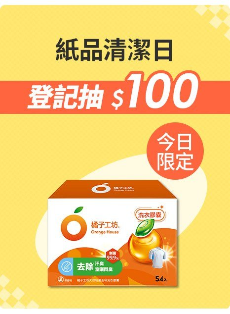 — 출처 <https://img1.momoshop.com.tw/ecm/img/online/81/998/00/000/mobile/bt_7_701_01/bt_7_701_01_e61.jpg?t=1779870412984>

**페이지 메타 정보**

| page | title | description |
|---|---|---|
| [`home`](https://www.momoshop.com.tw/main/Main.jsp) | momo購物網 - 好評推薦 - 2026年5月 | momo購物網提供美妝保養、流行服飾、時尚精品、3C、數位家電、生活用品、美食旅遊票券…等數百萬件商品。快速到貨、超商取貨讓您購物最便利。mo店+商品抵用券天天搶、免運吃到飽，電視/直播商品限時下殺，每日讓您享超低價，並享有十天猶豫期；momo購物網為富邦及台灣大哥大關係企業 |

#### [OB Design](https://www.obdesign.com.tw/)

- URL: <https://www.obdesign.com.tw/>
- 페이지: **OK 1 · FAIL 0**

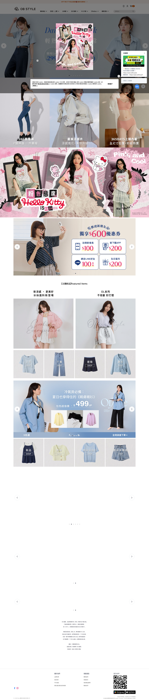

**대표 상품 이미지** (상위 6장, 출처 URL 포함)

- 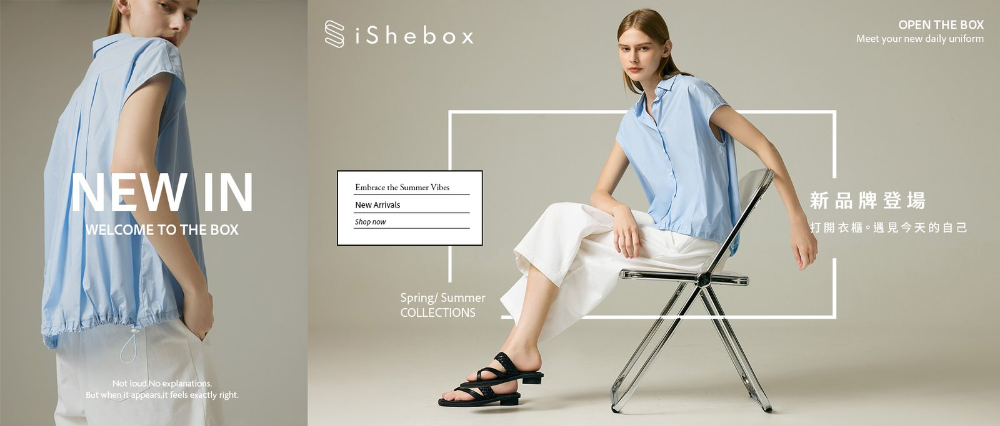 — 출처 <https://cms-static.cdn.91app.com/images/original/41602/92f19e4d-89b7-4330-9570-02cf1dff9742-1778727661-3sy0baovmv_d_1920x820_1280x547_1124x480_800x342_600x256_400x171.jpg>
- 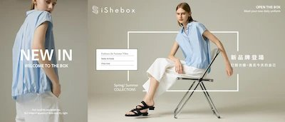 — 출처 <https://cms-static.cdn.91app.com/images/compress/41602/92f19e4d-89b7-4330-9570-02cf1dff9742-1778727661-3sy0baovmv_d_400x171.webp>
-  — 출처 <https://cms-static.cdn.91app.com/images/original/41602/92f19e4d-89b7-4330-9570-02cf1dff9742-1779846604-dn1wmx9ffo_d_1920x820_1280x547_1124x480_800x342_600x256_400x171.jpg>
-  — 출처 <https://cms-static.cdn.91app.com/images/original/41602/92f19e4d-89b7-4330-9570-02cf1dff9742-1779764649-w0s0fz0ca4_d_1920x820_1280x547_1124x480_800x342_600x256_400x171.jpg>
- 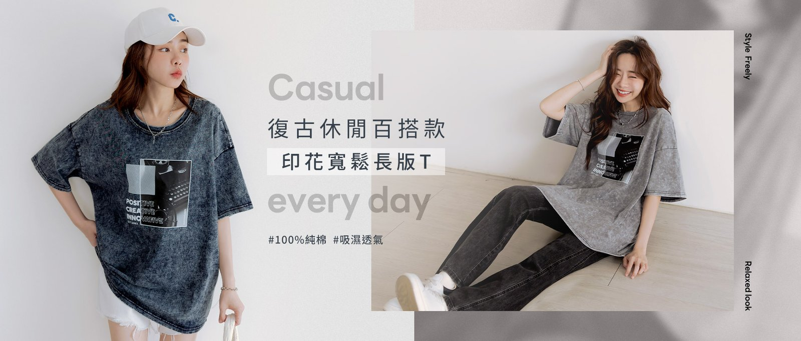 — 출처 <https://cms-static.cdn.91app.com/images/original/41602/92f19e4d-89b7-4330-9570-02cf1dff9742-1779677402-wz3vkxolfi_d_1920x820_1280x547_1124x480_800x342_600x256_400x171.jpg>
- 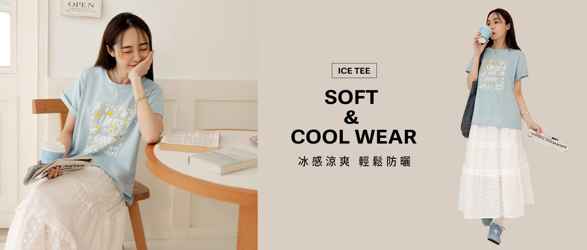 — 출처 <https://cms-static.cdn.91app.com/images/original/41602/92f19e4d-89b7-4330-9570-02cf1dff9742-1779677376-a0d3jhklbp_d_1920x820_1280x547_1124x480_800x342_600x256_400x171.jpg>

**페이지 메타 정보**

| page | title | description |
|---|---|---|
| [`home`](https://www.obdesign.com.tw/) | OB嚴選｜高CP值人氣熱銷服飾，流行服飾品牌 | 你的日常穿搭好夥伴，快上OB嚴選找，OB嚴選提供女裝、孕童、運動、男裝各項流行服飾，秉持優質服務給你高CP值的購物體驗。各種風格都能滿足熱愛穿搭的你，天天上新品，快速出貨，一起加入OB style！網路人氣服飾品牌OB嚴選 |

#### [PChome](https://24h.pchome.com.tw/)

- URL: <https://24h.pchome.com.tw/>
- 페이지: **OK 0 · FAIL 1**

**실패 페이지**

- `home` — http_status_429

#### [Pinkoi Taiwan](https://www.pinkoi.com/)

- URL: <https://www.pinkoi.com/>
- 페이지: **OK 2 · FAIL 0**

**대표 상품 이미지** (상위 6장, 출처 URL 포함)

-  — 출처 <https://cdn04.pinkoi.com/pinkoi.site/logo/og_image.png>

**페이지 메타 정보**

| page | title | description |
|---|---|---|
| [`accessories`](https://en.pinkoi.com/) | Pinkoi | Asia’s cross-border design marketplace | Design the way you are | Shop for original design products from Asia's independent designers. Pinkoi lives and breathes great design, great quality, great service, a |
| [`bags`](https://en.pinkoi.com/) | Pinkoi | Asia’s cross-border design marketplace | Design the way you are | Shop for original design products from Asia's independent designers. Pinkoi lives and breathes great design, great quality, great service, a |

#### [Yahoo Taiwan Shopping](https://tw.buy.yahoo.com/)

- URL: <https://tw.buy.yahoo.com/>
- 페이지: **OK 1 · FAIL 0**

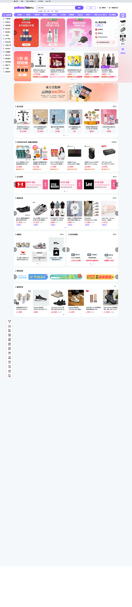

**대표 상품 이미지** (상위 6장, 출처 URL 포함)

- 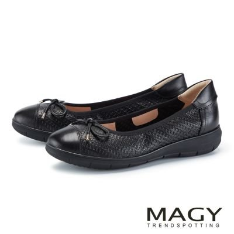 — 출처 <https://img.yec.tw/zp/MerchandiseImages/E654267EE2-SP-20974285.jpg>
- 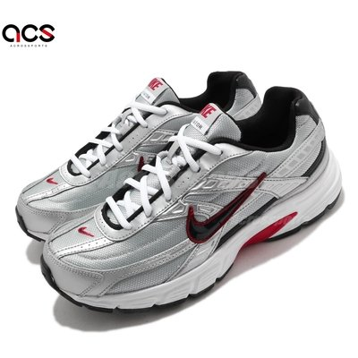 — 출처 <https://img.yec.tw/zp/MerchandiseImages/9555E46F96-SP-18367987.jpg>
- 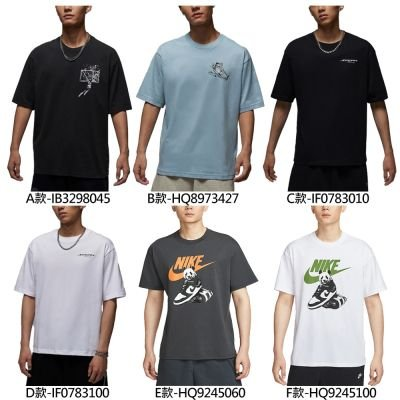 — 출처 <https://img.yec.tw/zp/MerchandiseImages/C32E568CD6-SP-22531571.jpg>

**페이지 메타 정보**

| page | title | description |
|---|---|---|
| [`home`](https://tw.buy.yahoo.com/) | Yahoo購物中心 - 最懂生活的人 | 數百萬件商品，貼心客服為您服務，15天鑑賞期購物保障！ |

### 4.25 태국 _( Thailand )_

- 한국 수출규모 순위: **#8** · region: `asia` · tier `1` · currency `THB`
- 수집 사이트: **5개** (성공 5)
- 메모: 동남아 K-패션 핵심 시장
#### [Central Online](https://www.central.co.th/)

- URL: <https://www.central.co.th/>
- 페이지: **OK 1 · FAIL 0**

**대표 상품 이미지** (상위 6장, 출처 URL 포함)

-  — 출처 <https://www.central.co.th/_next/image?url=https%3A%2F%2Fassets.central.co.th%2Ffile-assets%2Fassets%2FCMS%2Fcampaign%2F2026%2F05may%2F20260516_mc_col_birthday_heroweb_d.jpg&w=3840&q=75>
- 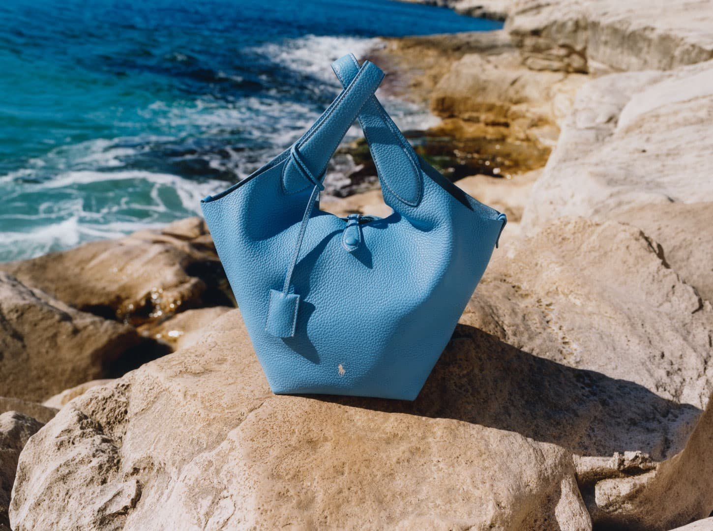 — 출처 <https://www.central.co.th/_next/image?url=https%3A%2F%2Fassets.central.co.th%2Ffile-assets%2Fassets%2FCMS%2Fcampaign%2F2026%2F05may%2F20260528_poloralphlauren_heroweb_d.jpg&w=3840&q=75>
- 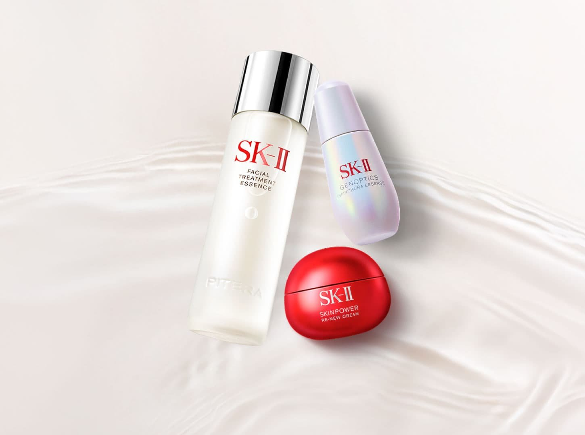 — 출처 <https://www.central.co.th/_next/image?url=https%3A%2F%2Fassets.central.co.th%2Ffile-assets%2Fassets%2FCMS%2Fcampaign%2F2026%2F06jun%2F20260522_skii_heroweb-d.jpg&w=3840&q=75>
-  — 출처 <https://www.central.co.th/_next/image?url=%2Fimages%2Ffallback-image.webp&w=3840&q=75>
- 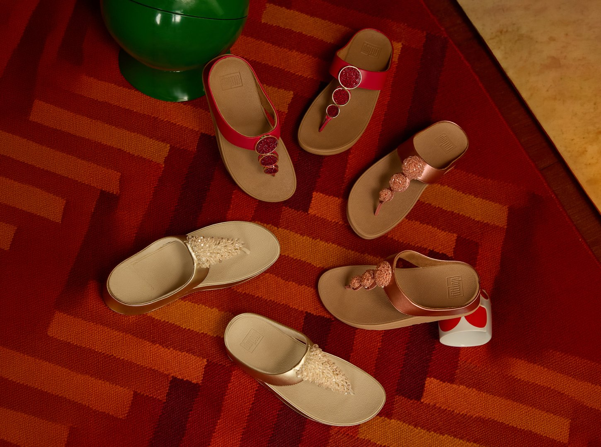 — 출처 <https://assets.central.co.th/file-assets/assets/CMS/campaign/2026/05may/20260525_fitflop_heroweb_d.jpg>
- 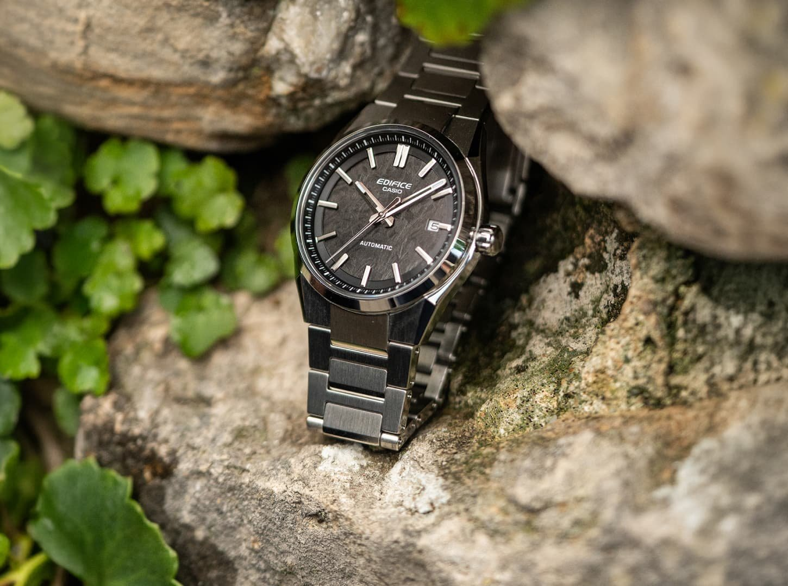 — 출처 <https://www.central.co.th/_next/image?url=https%3A%2F%2Fassets.central.co.th%2Ffile-assets%2Fassets%2FCMS%2Fcampaign%2F2026%2F05may%2F20260520_casio_heroweb_d.jpg&w=3840&q=75>

**페이지 메타 정보**

| page | title | description |
|---|---|---|
| [`home`](https://www.central.co.th/th) | Central Online | ลดสูงสุด 70% + คูปองลดเพิ่ม 25% | Central HBD เชิญคุณมาร่วมฉลองวันเกิดปีที่ 12 ของเรา! พบกับสินค้าคุณภาพจากหลายแบรนด์ดังที่เราคัดสรรมาลดราคาสูงสุดถึง 70% พร้อมคูปองลดเพิ่ม 25 |

#### [Lazada Thailand Fashion](https://www.lazada.co.th/)

- URL: <https://www.lazada.co.th/>
- 페이지: **OK 1 · FAIL 0**

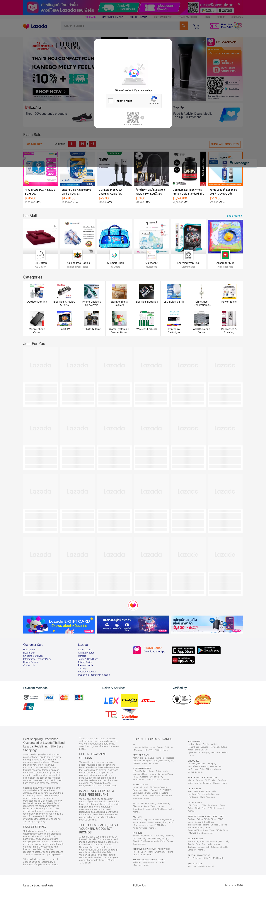

**대표 상품 이미지** (상위 6장, 출처 URL 포함)

-  — 출처 <https://img.lazcdn.com/us/domino/40845120240f19d13f738fa9a7978edd.png>
-  — 출처 <https://img.lazcdn.com/g/tps/images/ims-web/TB1KB2laMFY.1VjSZFnXXcFHXXa.png>
-  — 출처 <https://img.lazcdn.com/us/domino/921a3c9d-0188-4ab1-9477-c6bcf18e60c6_TH-1976-688.jpg_2200x2200q80.jpg>
-  — 출처 <https://img.lazcdn.com/us/domino/65acba4c-da23-4727-ba77-32e0f4956230_TH-1976-688.jpg_2200x2200q80.jpg>
-  — 출처 <https://img.lazcdn.com/us/domino/262921d0-297a-40f5-a132-fcd1678279c9_TH-1976-688.jpg_2200x2200q80.jpg>
-  — 출처 <https://img.lazcdn.com/us/domino/93affa47-c095-45d0-9dbb-d2acacb2c012_TH-1976-688.jpg_2200x2200q80.jpg>

**페이지 메타 정보**

| page | title | description |
|---|---|---|
| [`home`](https://www.lazada.co.th/#?) | Lazada Thailand | ช้อปออนไลน์ สินค้าดี พร้อมดีลพิเศษทุกวัน | พบกับ Lazada แพลตฟอร์มช้อปปิ้งชั้นนำในอาเซียน พร้อมบริการเก็บเงินปลายทาง LazMall LazFlash และดีลเด็ดจากแบรนด์ดังทุกวัน |

#### [Pomelo](https://www.pomelofashion.com/)

- URL: <https://www.pomelofashion.com/>
- 페이지: **OK 2 · FAIL 0**

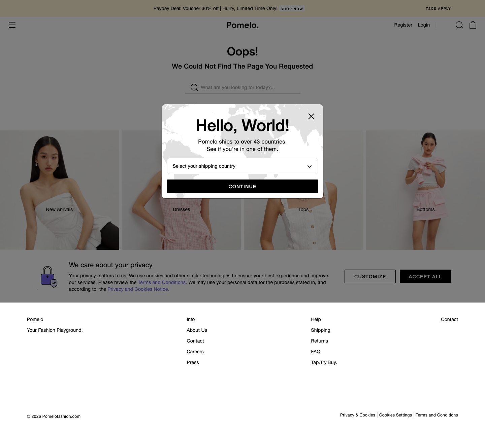

**대표 상품 이미지** (상위 6장, 출처 URL 포함)

-  — 출처 <https://cdn.pomelofashion.com/img/nav/3271/c/7422/20260428100935_69f024efaf715_banner-image.jpg?auto=compress,format&fm=webp,jpg,png&w=375&h=100>
-  — 출처 <https://cdn.pomelofashion.com/img/nav/3271/c/7419/20260302182158_69a572d670875_banner-image.jpg?auto=compress,format&fm=webp,jpg,png&w=375&h=100>
-  — 출처 <https://cdn.pomelofashion.com/img/nav/3271/c/88/20250620125126_6854f6de2dc98_banner-image.jpg?auto=compress,format&fm=webp,jpg,png&w=375&h=100>
-  — 출처 <https://cdn.pomelofashion.com/img/nav/3271/c/7420/20260312173657_69b297499ac84_banner-image.jpg?auto=compress,format&fm=webp,jpg,png&w=375&h=100>
-  — 출처 <https://cdn.pomelofashion.com/img/nav/3271/c/7418/20260216172249_6992eff96d8e5_banner-image.jpg?auto=compress,format&fm=webp,jpg,png&w=375&h=100>
-  — 출처 <https://cdn.pomelofashion.com/img/nav/3271/c/3658/20250620125237_6854f725c93d4_banner-image.jpg?auto=compress,format&fm=webp,jpg,png&w=375&h=100>

**페이지 메타 정보**

| page | title | description |
|---|---|---|
| [`new`](https://pomelofashion.com/global/en/collections/new-arrivals) | POMELO Fashion | Get all the latest fashion, updated twice every week! - Pomelo | Shop the latest fashion at POMELO fashion. Designed and manufactured in house for quality and style. Dresses, tops, knits, jackets, denim, a |
| [`best`](https://pomelofashion.com/global/en/collections/best-sellers) | POMELO Fashion | Get all the latest fashion, updated twice every week! - Pomelo | Shop the latest fashion at POMELO fashion. Designed and manufactured in house for quality and style. Dresses, tops, knits, jackets, denim, a |

#### [Shopee Thailand Fashion](https://shopee.co.th/)

- URL: <https://shopee.co.th/>
- 페이지: **OK 1 · FAIL 0**

**페이지 메타 정보**

| page | title | description |
|---|---|---|
| [`home`](https://shopee.co.th/verify/traffic/error?home_url=https%3A%2F%2Fshopee.co.th&is_logged_in=false&next=https%3A%2F%2Fshopee.co.th%2F&tracking_id=7631d245715-4cbe-4133-93d3-656e4a9a4118&type=4) | Shopee Thailand | Hot Deals, Best Prices |  |

#### [Zalora Thailand](https://www.zalora.co.th/)

- URL: <https://www.zalora.co.th/>
- 페이지: **OK 1 · FAIL 0**

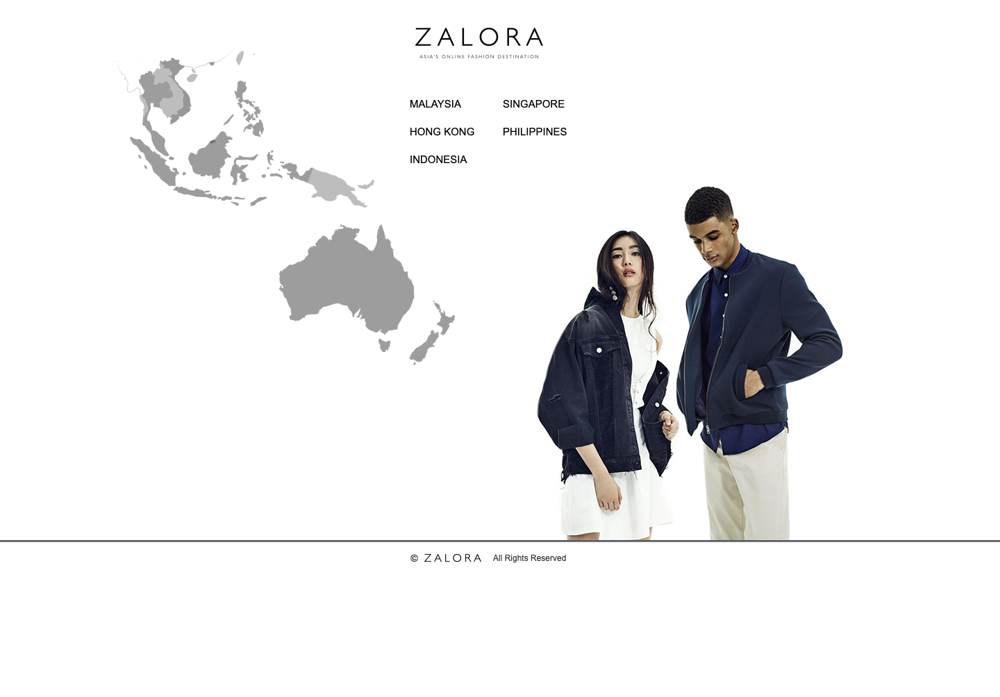

**대표 상품 이미지** (상위 6장, 출처 URL 포함)

-  — 출처 <https://www.zalora.co.th/images/landingpage/525x500.gif>

**페이지 메타 정보**

| page | title | description |
|---|---|---|
| [`home`](https://www.zalora.co.th/) | ZALORA - ASIA'S LEADING ONLINE FASHION DESTINATION |  |

### 4.26 튀르키예 _( Türkiye )_

- 한국 수출규모 순위: **#26** · region: `europe` · tier `3` · currency `TRY`
- 수집 사이트: **5개** (성공 4)
- 메모: 유럽-중동 교차 시장
#### [DeFacto](https://www.defacto.com/)

- URL: <https://www.defacto.com/>
- 페이지: **OK 1 · FAIL 0**

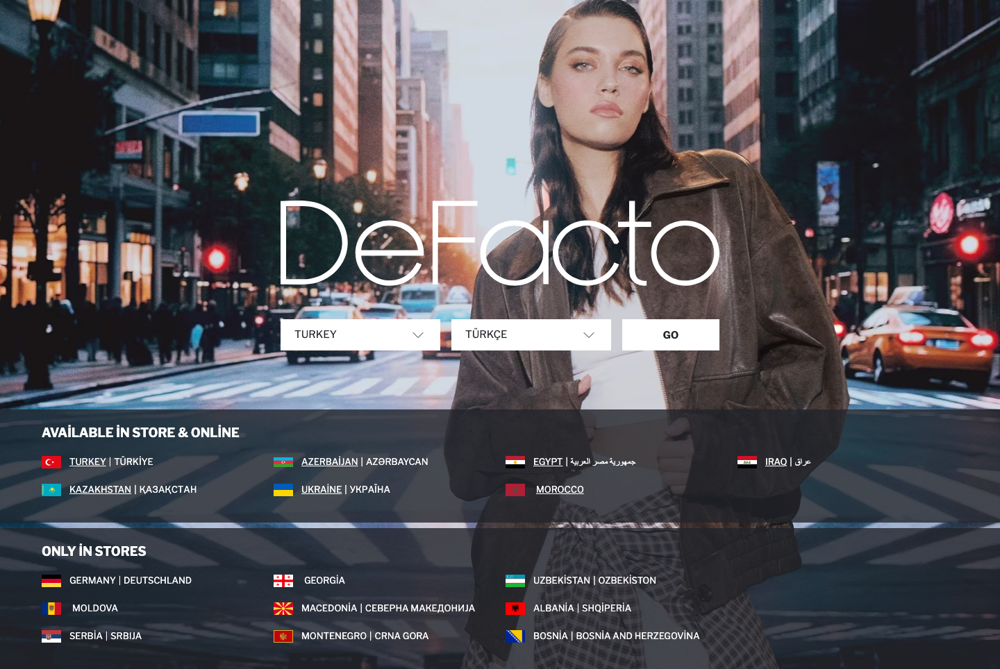

**페이지 메타 정보**

| page | title | description |
|---|---|---|
| [`home`](https://www.defacto.com.tr/countries) | DeFacto Ülke ve Dil Seçimi | Online Alışveriş için Başlangıç | DeFacto’da alışverişe başlamadan önce ülkenizi ve dili seçin. Size özel ürünler, fiyatlar ve kampanyalarla keyifli online alışverişin tadını |

#### [Hepsiburada](https://www.hepsiburada.com/)

- URL: <https://www.hepsiburada.com/>
- 페이지: **OK 1 · FAIL 0**

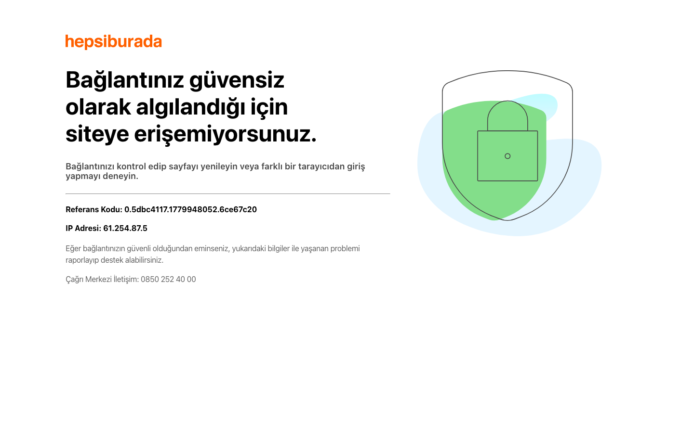

**페이지 메타 정보**

| page | title | description |
|---|---|---|
| [`home`](https://www.hepsiburada.com/) | Hepsiburada | Güvenlik |  |

#### [LC Waikiki](https://www.lcwaikiki.com/)

- URL: <https://www.lcwaikiki.com/>
- 페이지: **OK 0 · FAIL 1**

**실패 페이지**

- `home` — playwright_error: Error: Page.goto: net::ERR_HTTP2_PROTOCOL_ERROR at https://www.lcwaikiki.com/
Call log:
  - navigating to "https://www.lcwaikiki.com/", waiting until "domcontentloaded"

#### [Mavi](https://www.mavi.com/)

- URL: <https://www.mavi.com/>
- 페이지: **OK 1 · FAIL 0**

**대표 상품 이미지** (상위 6장, 출처 URL 포함)

- 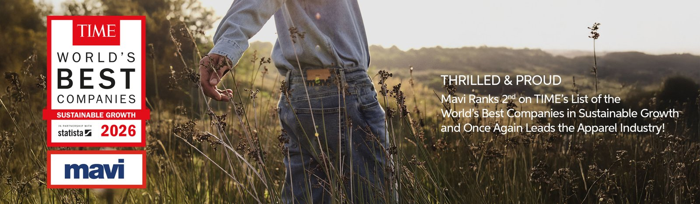 — 출처 <https://www.mavicompany.com/i/content/1_1_17nov-en.jpg>
-  — 출처 <https://www.mavicompany.com/i/content/1_2_17nov-mobil-en.jpg>
- 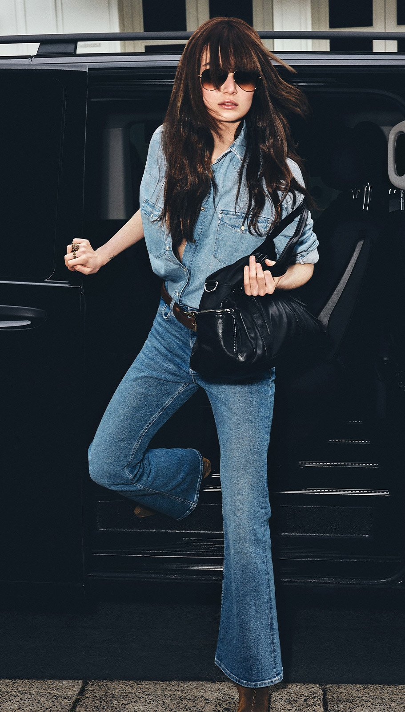 — 출처 <https://www.mavicompany.com/i/assets/documents/2026/investor.jpg>
- 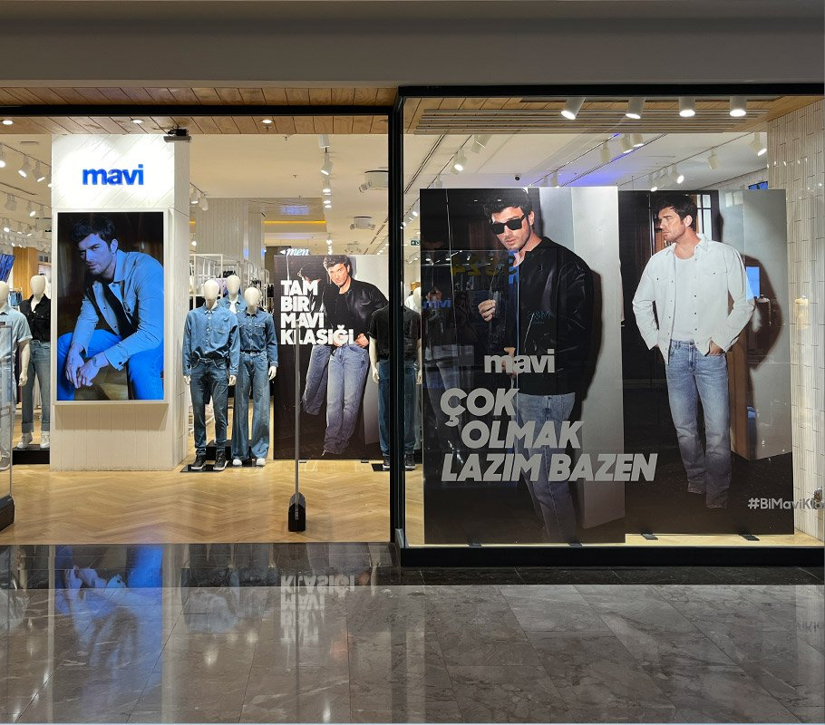 — 출처 <https://www.mavicompany.com/i/assets/documents/2025/about.jpg>
-  — 출처 <https://www.mavicompany.com/i/assets/documents/2025/advertising.jpg>
- 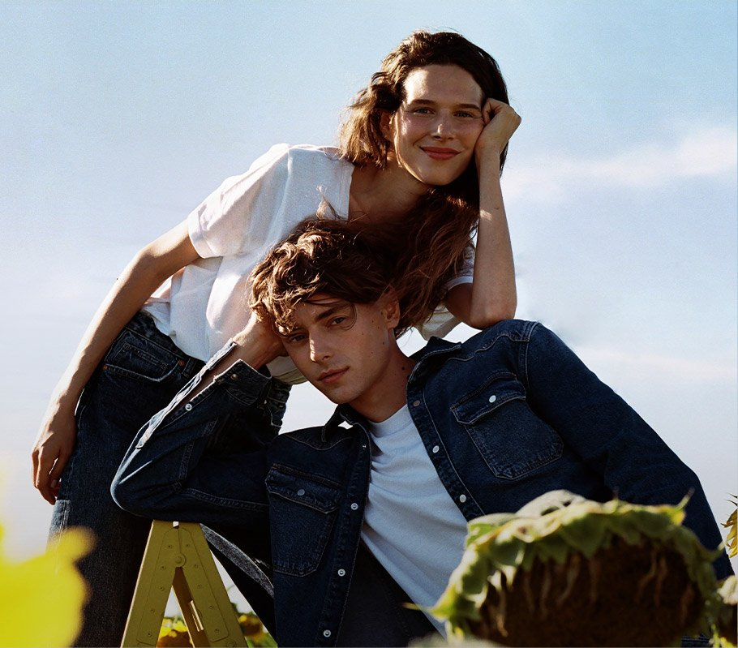 — 출처 <https://www.mavicompany.com/i/assets/documents/2023/mavicompany_10.jpg>

**페이지 메타 정보**

| page | title | description |
|---|---|---|
| [`home`](https://www.mavicompany.com/en) | Homepage |  |

#### [Trendyol](https://www.trendyol.com/)

- URL: <https://www.trendyol.com/>
- 페이지: **OK 1 · FAIL 0**

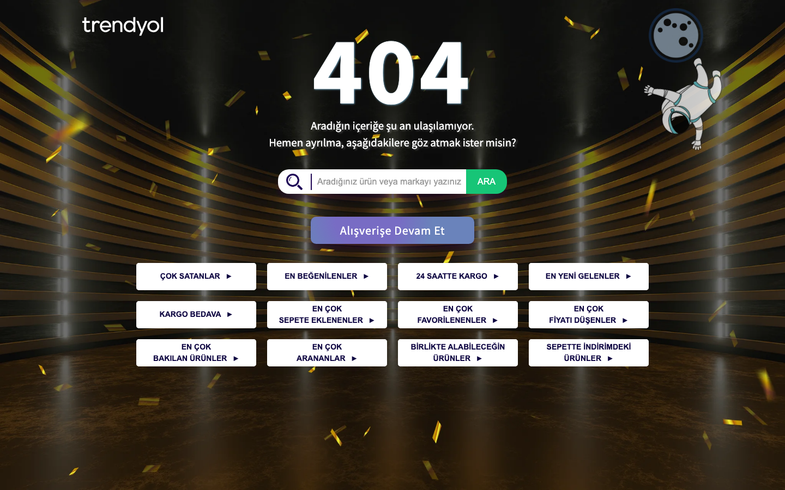

**대표 상품 이미지** (상위 6장, 출처 URL 포함)

-  — 출처 <https://cdn.dsmcdn.com/web/production/world-web-404.png>
- 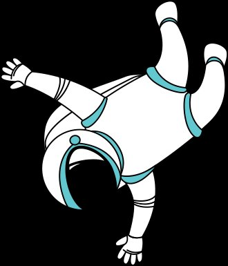 — 출처 <https://cdn.dsmcdn.com/web/production/yuri-web-404.png>

**페이지 메타 정보**

| page | title | description |
|---|---|---|
| [`new`](https://www.trendyol.com/yeni-gelenler) | trendyol.com |  |

### 4.27 UAE _( United Arab Emirates )_

- 한국 수출규모 순위: **#18** · region: `middle_east` · tier `2` · currency `AED`
- 수집 사이트: **5개** (성공 5)
- 메모: 중동 럭셔리 허브
#### [Centrepoint UAE](https://www.centrepointstores.com/ae/en/)

- URL: <https://www.centrepointstores.com/ae/en/>
- 페이지: **OK 1 · FAIL 0**

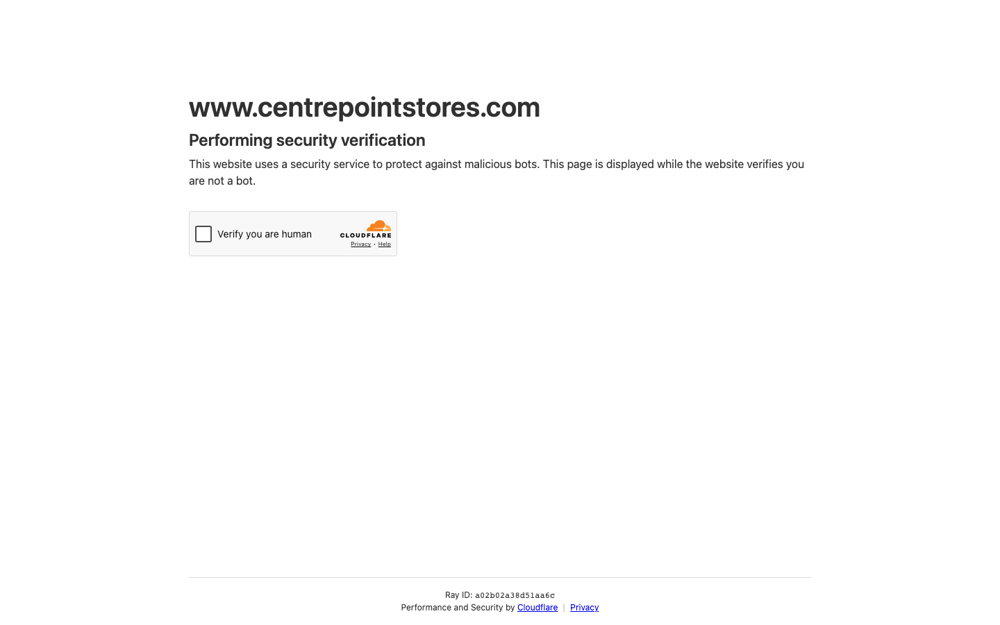

**페이지 메타 정보**

| page | title | description |
|---|---|---|
| [`home`](https://www.centrepointstores.com/ae/en/) | Just a moment... |  |

#### [Level Shoes](https://www.levelshoes.com/)

- URL: <https://www.levelshoes.com/>
- 페이지: **OK 1 · FAIL 0**

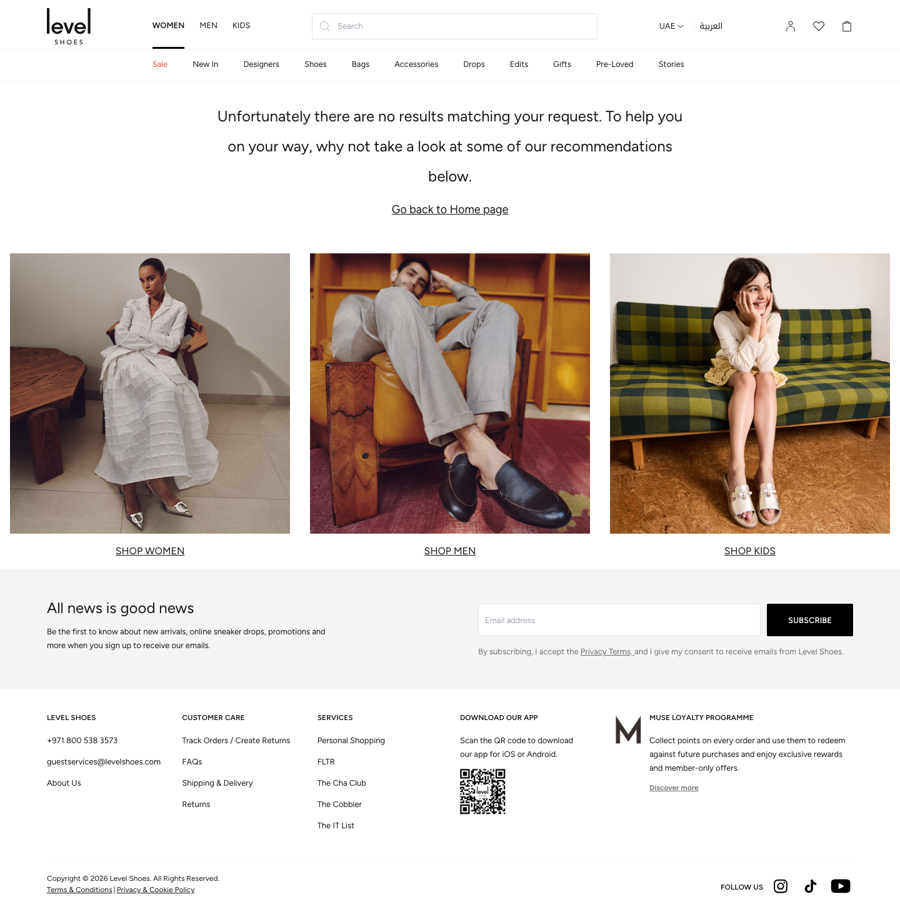

**대표 상품 이미지** (상위 6장, 출처 URL 포함)

- 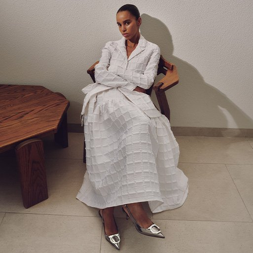 — 출처 <https://www.levelshoes.com/_next/image?url=https%3A%2F%2Fimages.assets.levelshoes.com%2FHP_JAN27%2FERROR%2FW.jpg&w=1080&q=75>
- 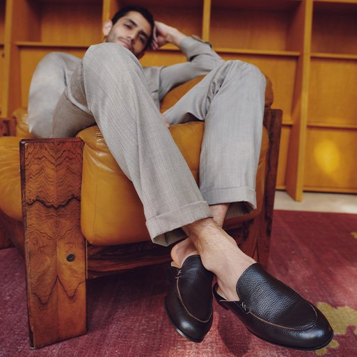 — 출처 <https://www.levelshoes.com/_next/image?url=https%3A%2F%2Fimages.assets.levelshoes.com%2FHP_JAN27%2FERROR%2FM.jpg&w=1080&q=75>
- 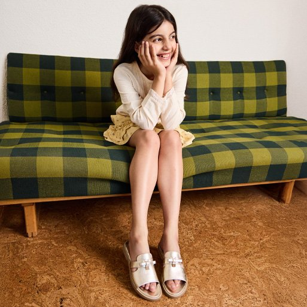 — 출처 <https://www.levelshoes.com/_next/image?url=https%3A%2F%2Fimages.assets.levelshoes.com%2FHP_JAN27%2FERROR%2FK.jpg&w=1080&q=75>

**페이지 메타 정보**

| page | title | description |
|---|---|---|
| [`new`](https://www.levelshoes.com/new-arrivals.html) | Page Not Found |  |

#### [Namshi](https://www.namshi.com/)

- URL: <https://www.namshi.com/>
- 페이지: **OK 1 · FAIL 0**

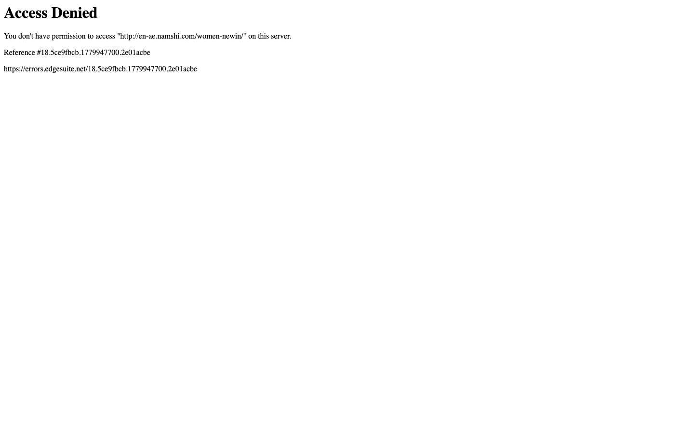

**페이지 메타 정보**

| page | title | description |
|---|---|---|
| [`new_women`](https://en-ae.namshi.com/women-newin/) | Access Denied |  |

#### [Noon UAE](https://www.noon.com/uae-en/)

- URL: <https://www.noon.com/uae-en/>
- 페이지: **OK 1 · FAIL 0**

**페이지 메타 정보**

| page | title | description |
|---|---|---|
| [`home`](https://www.noon.com/uae-en/) | Access Denied |  |

#### [Ounass](https://www.ounass.ae/)

- URL: <https://www.ounass.ae/>
- 페이지: **OK 1 · FAIL 0**

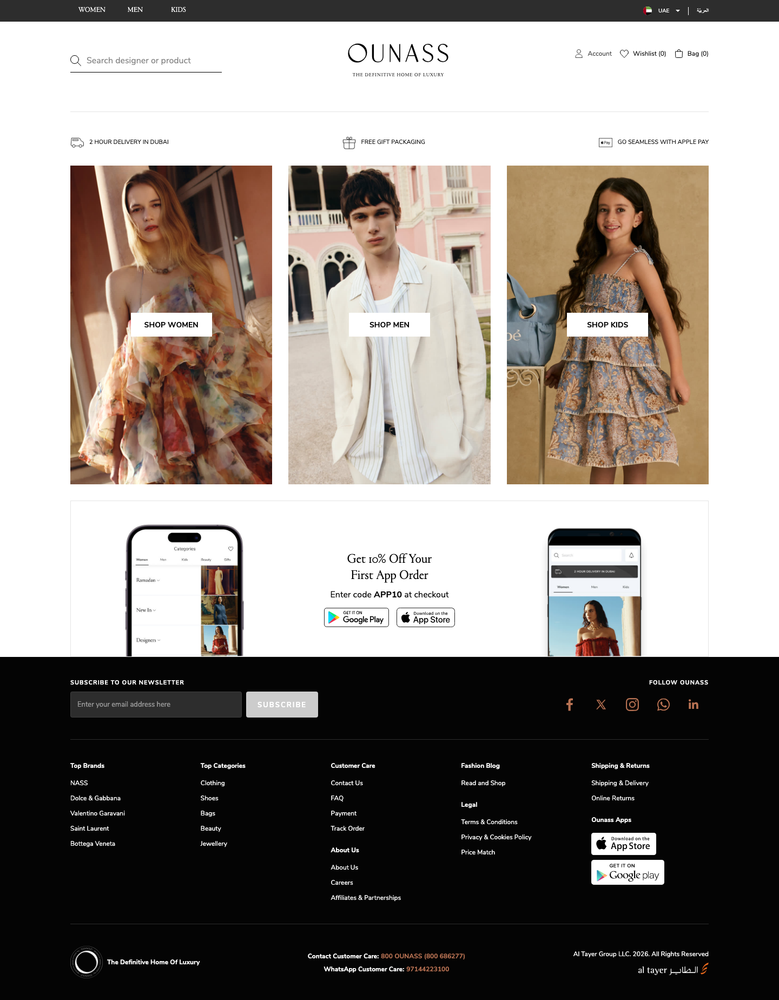

**대표 상품 이미지** (상위 6장, 출처 URL 포함)

- 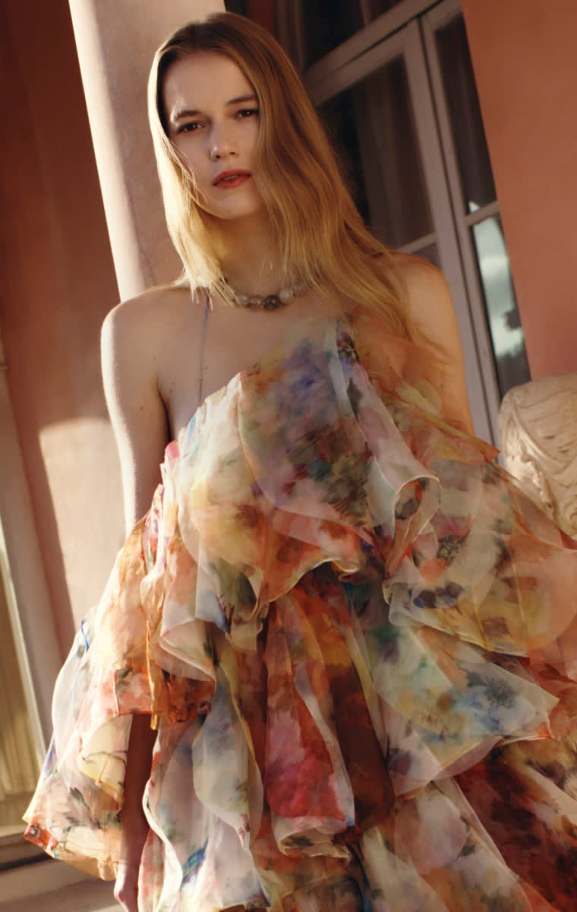 — 출처 <https://ounass-ae.atgcdn.ae/contentful/b3xlytuyfm3e/TmcLnAt2ytccnZM8yzfyH/a93e641b14818640a00d9192fc904368/WW_WK1.jpg?q=70>
-  — 출처 <https://ounass-ae.atgcdn.ae/contentful/b3xlytuyfm3e/7LkHUlQDiBMt42vjjpehr5/013c7a8a71cb884f089a7b6c876a7027/MW_WK1.jpg?q=70>
- 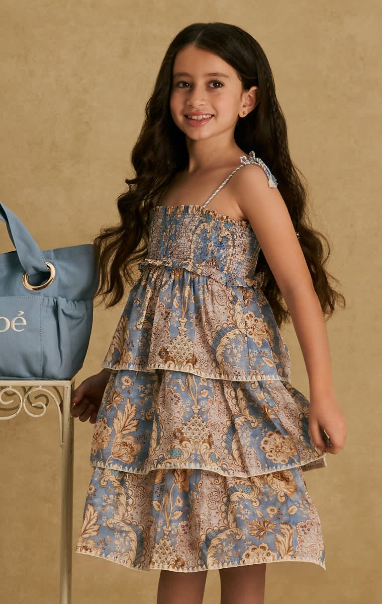 — 출처 <https://ounass-ae.atgcdn.ae/contentful/b3xlytuyfm3e/4ex3TdWghZWWxuyR1ibJWI/ca063775092ab331a97a99edbb378617/KW_WK1.jpg?q=70>
- 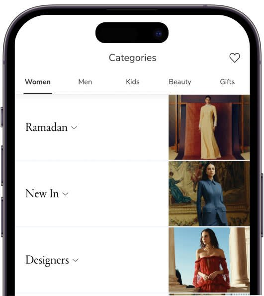 — 출처 <https://ounass-ae.atgcdn.ae/contentful/b3xlytuyfm3e/1LqSJ1R8I7XVZoXWgoIlQ7/f9f810d5694322edd573a76675a5db03/iOS_MB-WW-en.jpg?q=70>
- 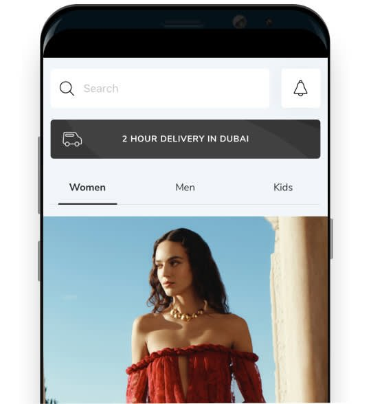 — 출처 <https://ounass-ae.atgcdn.ae/contentful/b3xlytuyfm3e/5zKnhsBszQyWEhRfYLqfMY/8b4369308105672f2cc4ebef9ee9c797/android-mob-ww-en.jpg?q=70>
-  — 출처 <https://www.ounass.ae/static/sprite-images/logos/footer-logo-white@2x.png>

**페이지 메타 정보**

| page | title | description |
|---|---|---|
| [`home`](https://www.ounass.ae/) | OUNASS UAE | The Definitive Home of Luxury - Up to 50% OFF | Luxury Online Shopping for Women, Men & Kids in UAE ✓ 2 Hour Delivery in Dubai ✓ Buy Now, Pay Later ✓ 30-Day Free Return |

### 4.28 영국 _( United Kingdom )_

- 한국 수출규모 순위: **#11** · region: `europe` · tier `2` · currency `GBP`
- 수집 사이트: **5개** (성공 4)
- 메모: 유럽 패션 허브
#### [ASOS](https://www.asos.com/)

- URL: <https://www.asos.com/>
- 페이지: **OK 2 · FAIL 0**

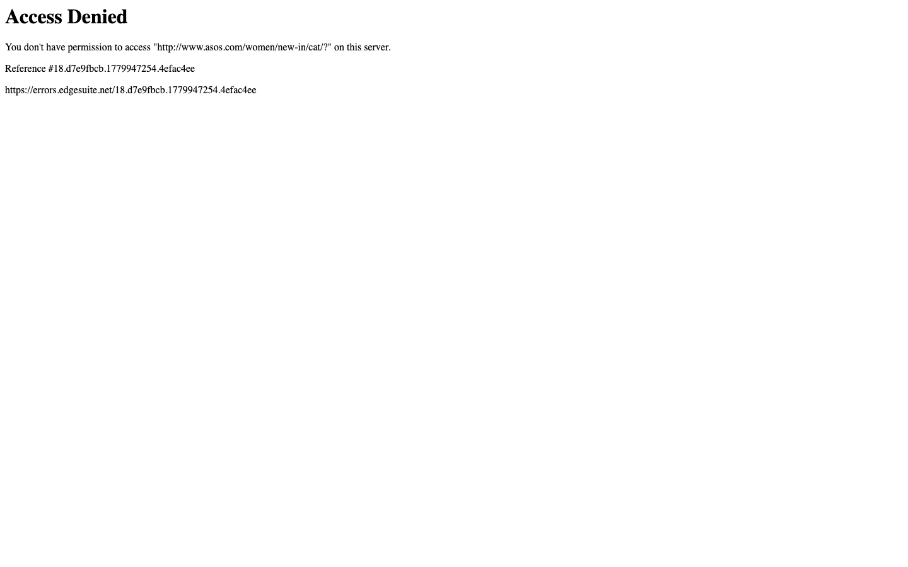

**페이지 메타 정보**

| page | title | description |
|---|---|---|
| [`new_women`](https://www.asos.com/women/new-in/cat/?cid=2623) | Access Denied |  |
| [`new_men`](https://www.asos.com/men/new-in/cat/?cid=27110) | Access Denied |  |

#### [Farfetch UK](https://www.farfetch.com/uk/)

- URL: <https://www.farfetch.com/uk/>
- 페이지: **OK 1 · FAIL 0**

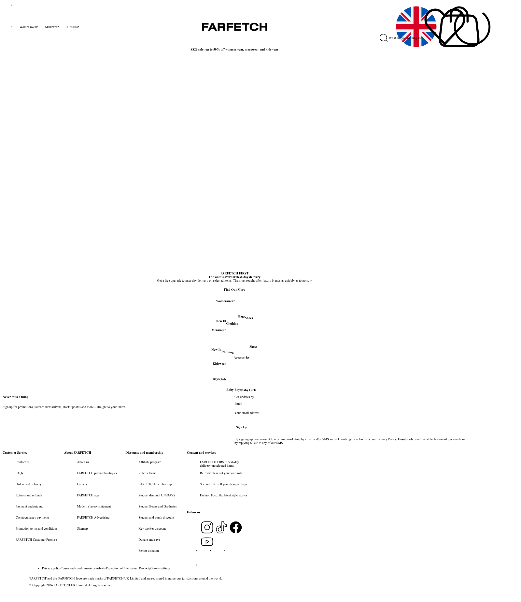

**페이지 메타 정보**

| page | title | description |
|---|---|---|
| [`home`](https://www.farfetch.com/uk/) | FARFETCH UK | The Global Destination for Modern Luxury | Enjoy express delivery ✈ when you shop on FARFETCH. Find clothing & homeware from designer brands you love like Prada, Gucci & Versace. Free |

#### [John Lewis](https://www.johnlewis.com/)

- URL: <https://www.johnlewis.com/>
- 페이지: **OK 0 · FAIL 1**

**실패 페이지**

- `home` — playwright_error: Error: Page.goto: net::ERR_HTTP2_PROTOCOL_ERROR at https://www.johnlewis.com/
Call log:
  - navigating to "https://www.johnlewis.com/", waiting until "domcontentloaded"

#### [Marks & Spencer](https://www.marksandspencer.com/)

- URL: <https://www.marksandspencer.com/>
- 페이지: **OK 1 · FAIL 0**

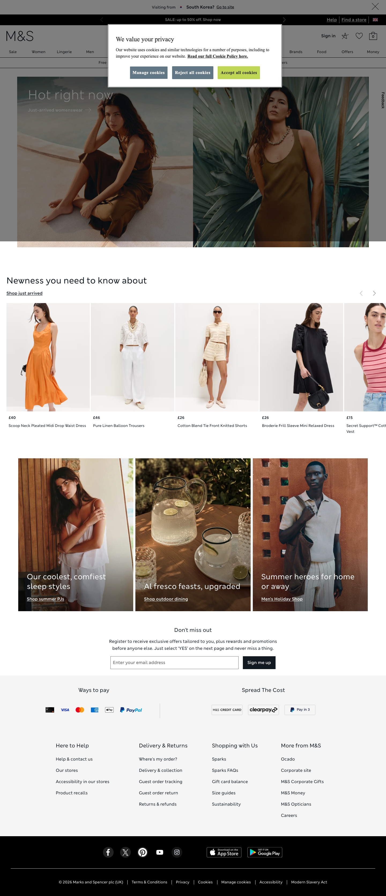

**대표 상품 이미지** (상위 6장, 출처 URL 포함)

-  — 출처 <https://images.ctfassets.net/prxuf37q3ta2/53YJMrJOT63Hw9Kw65Rl0l/d391985bac8e31f8869245ae616f1cab/DESKTOP_HERO_2880x1621.jpg?w=2560>
- 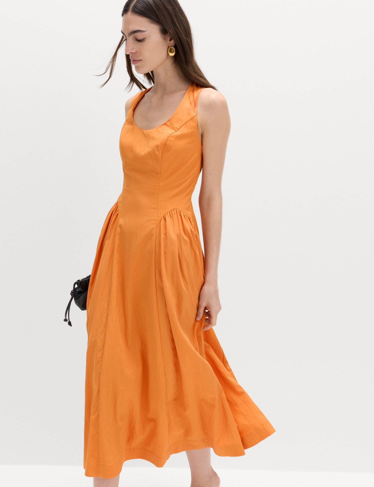 — 출처 <https://assets.digitalcontent.marksandspencer.app/image/upload/w_2560,q_auto,f_auto/SD_01_T42_5348_BR_X_EC_0>
- 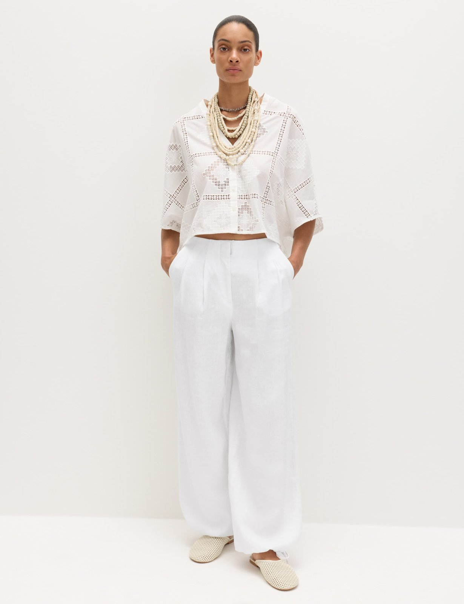 — 출처 <https://assets.digitalcontent.marksandspencer.app/image/upload/w_2560,q_auto,f_auto/SD_01_T57_2005_Z0_X_EC_0>
- 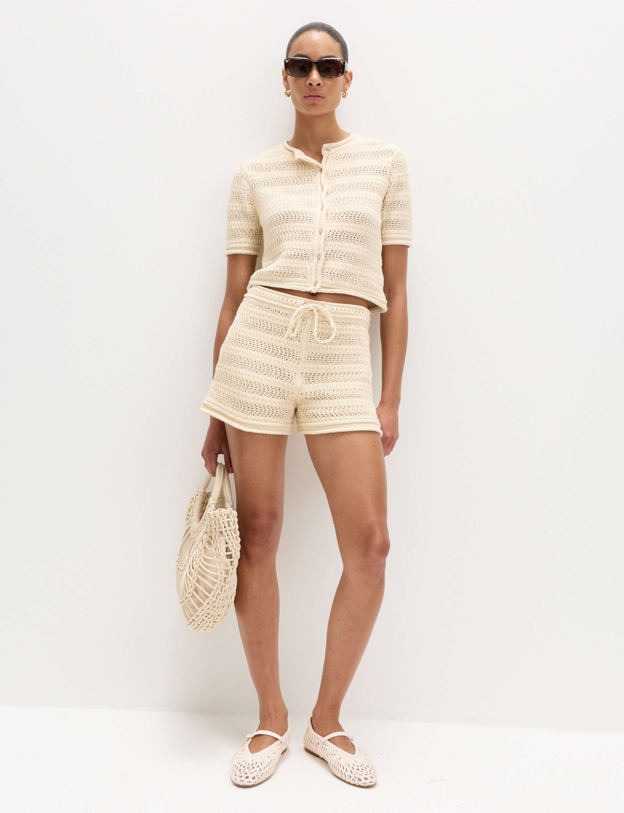 — 출처 <https://assets.digitalcontent.marksandspencer.app/image/upload/w_2560,q_auto,f_auto/SD_01_T38_6372_K1_X_EC_0>
- 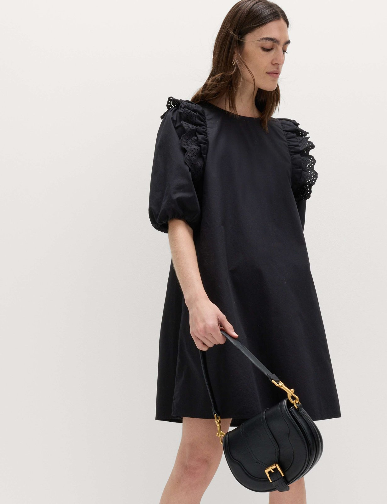 — 출처 <https://assets.digitalcontent.marksandspencer.app/image/upload/w_2560,q_auto,f_auto/SD_01_T42_2675W_Y0_X_EC_0>
- 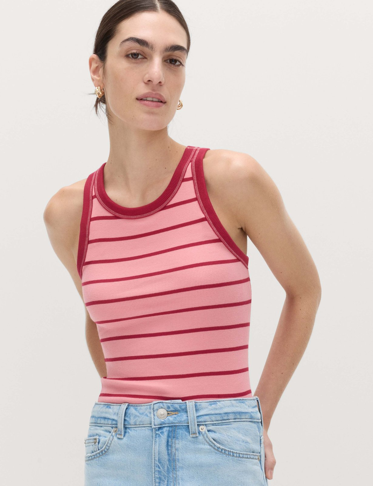 — 출처 <https://assets.digitalcontent.marksandspencer.app/image/upload/w_2560,q_auto,f_auto/SD_01_T41_1034E_A4_X_EC_0>

**페이지 메타 정보**

| page | title | description |
|---|---|---|
| [`home`](https://www.marksandspencer.com/) | M&S | Marks & Spencer | Fashion, Home, Beauty, Food & Gifts | Shop on-trend womenswear, quality menswear, home and beauty essentials and mouth-watering food and drink. Order online with free delivery or |

#### [Next](https://www.next.co.uk/)

- URL: <https://www.next.co.uk/>
- 페이지: **OK 1 · FAIL 0**

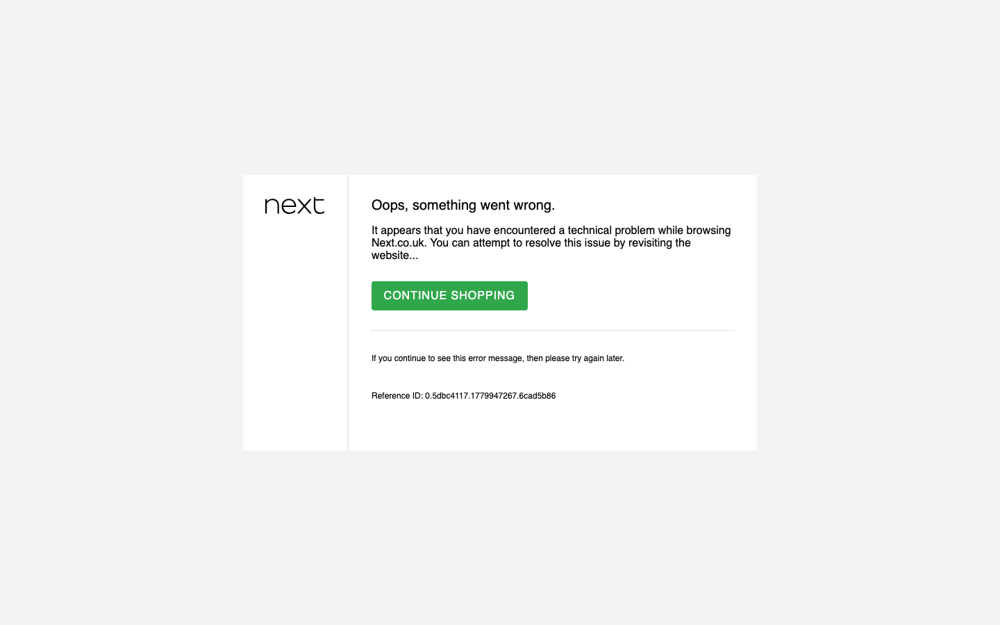

**페이지 메타 정보**

| page | title | description |
|---|---|---|
| [`home`](https://www.next.co.uk/) | _(empty)_ |  |

### 4.29 미국 _( United States )_

- 한국 수출규모 순위: **#1** · region: `north_america` · tier `1` · currency `USD`
- 수집 사이트: **5개** (성공 4)
- 메모: 한국 의류 최대 수출국. 대형 이커머스와 브랜드 커머스 중심
#### [Etsy](https://www.etsy.com/)

- URL: <https://www.etsy.com/>
- 페이지: **OK 2 · FAIL 0**

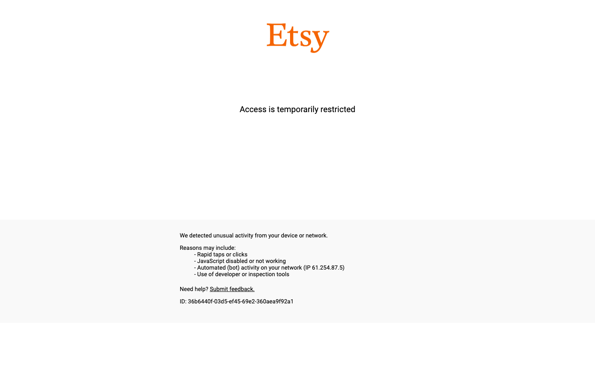

**페이지 메타 정보**

| page | title | description |
|---|---|---|
| [`trending_jewelry`](https://www.etsy.com/c/jewelry) | etsy.com |  |
| [`trending_accessories`](https://www.etsy.com/c/accessories) | etsy.com |  |

#### [Macy's](https://www.macys.com/)

- URL: <https://www.macys.com/>
- 페이지: **OK 1 · FAIL 0**

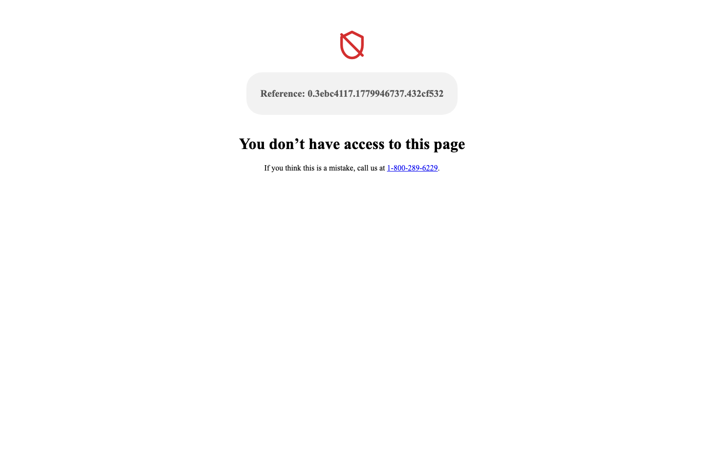

**페이지 메타 정보**

| page | title | description |
|---|---|---|
| [`new`](https://www.macys.com/shop/whats-new?id=14834) | Access Denied - Macy's | Access denied 403 |

#### [Nordstrom](https://www.nordstrom.com/)

- URL: <https://www.nordstrom.com/>
- 페이지: **OK 2 · FAIL 0**

**대표 상품 이미지** (상위 6장, 출처 URL 포함)

-  — 출처 <https://n.nordstrommedia.com/it/7f51c20a-b069-4154-9cfb-1e6d13a7c608.gif>
-  — 출처 <https://n.nordstrommedia.com/is/image/nordstrom/03_Womens-Sale_Tile_1-1_12130522.png?width=240&dpr=2&crop=1280%3A1600%2Coffset-x50%2Coffset-y50>
-  — 출처 <https://n.nordstrommedia.com/is/image/nordstrom/WMNS_ADC01F_0626_0049.jpeg?width=240&dpr=2&crop=2519.661%3A3149.577%2Coffset-x76.185%2Coffset-y50&trim=0.117%2C0%2C0.027%2C0>
-  — 출처 <https://n.nordstrommedia.com/is/image/nordstrom/ACC_HDBG02P_0526_altBgd_ext_8-5.jpeg?width=240&dpr=2&crop=4999.343%3A6249.179%2Coffset-x50%2Coffset-y50&trim=0%2C0%2C0.237%2C0>
-  — 출처 <https://n.nordstrommedia.com/is/image/nordstrom/WSH_YC01P_0126_altBgd_ext_8-5.jpeg?width=240&dpr=2&crop=6553.6%3A8192%2Coffset-x50%2Coffset-y50>
-  — 출처 <https://n.nordstrommedia.com/is/image/nordstrom/DESW_APP06F_0526_0230.jpeg?width=240&dpr=2&crop=1602.288%3A2002.86%2Coffset-x100%2Coffset-y50&trim=0.115%2C0.236%2C0.159%2C0>

**페이지 메타 정보**

| page | title | description |
|---|---|---|
| [`new`](https://www.nordstrom.com/browse/new) | _(empty)_ |  |
| [`women`](https://www.nordstrom.com/browse/women) | Women's Clothing, Shoes, & Accessories | Nordstrom | Find a great selection of Women's Clothing, Shoes, & Accessories at Nordstrom.com. Shop popular brands and top designers. |

#### [Revolve](https://www.revolve.com/)

- URL: <https://www.revolve.com/>
- 페이지: **OK 0 · FAIL 2**

**실패 페이지**

- `new` — playwright_error: Error: Page.goto: net::ERR_HTTP2_PROTOCOL_ERROR at https://www.revolve.com/new/br/c79f88/
Call log:
  - navigating to "https://www.revolve.com/new/br/c79f88/", waiting until "domcontentloaded"

- `trending` — playwright_error: Error: Page.goto: net::ERR_HTTP2_PROTOCOL_ERROR at https://www.revolve.com/most-loved/br/4a9ca5/
Call log:
  - navigating to "https://www.revolve.com/most-loved/br/4a9ca5/", waiting until "domcontentloaded"

#### [Urban Outfitters](https://www.urbanoutfitters.com/)

- URL: <https://www.urbanoutfitters.com/>
- 페이지: **OK 1 · FAIL 0**

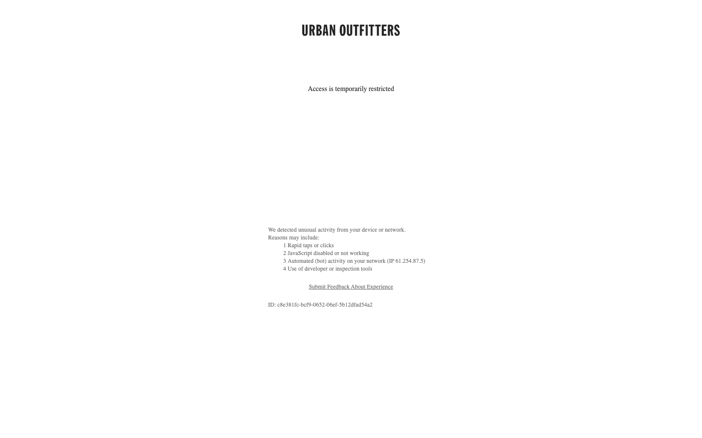

**페이지 메타 정보**

| page | title | description |
|---|---|---|
| [`new_women`](https://www.urbanoutfitters.com/womens-new-arrivals) | urbanoutfitters.com |  |

### 4.30 베트남 _( Vietnam )_

- 한국 수출규모 순위: **#4** · region: `asia` · tier `1` · currency `VND`
- 수집 사이트: **5개** (성공 5)
- 메모: 의류 생산기지/원단 수출 비중 큼. 빠르게 성장하는 이커머스
#### [Canifa](https://canifa.com/)

- URL: <https://canifa.com/>
- 페이지: **OK 1 · FAIL 0**

**대표 상품 이미지** (상위 6장, 출처 URL 포함)

-  — 출처 <https://2885371169.e.cdneverest.net/Simiconnector/BannerSlider/t/c/tce_topbanner_desktop-130526.webp>
-  — 출처 <https://2885371169.e.cdneverest.net/Simiconnector/BannerSlider/t/r/tramnghihe_topbanner_desktop-210526.webp>
-  — 출처 <https://canifa.com/_nuxt/img/chatbot-icon.c84d6ec.webp>
-  — 출처 <https://canifa.com/_nuxt/img/chat-zalo.ab5351f.webp>

**페이지 메타 정보**

| page | title | description |
|---|---|---|
| [`home`](https://canifa.com/) | CANIFA | Fashion For All | CANIFA - thương hiệu thời trang hàng đầu Việt Nam. Hàng ngàn mẫu quần áo phụ kiện nam, nữ, trẻ em cao cấp, chất lượng, an toàn liên tục được |

#### [IVY moda](https://ivymoda.com/)

- URL: <https://ivymoda.com/>
- 페이지: **OK 1 · FAIL 0**

**대표 상품 이미지** (상위 6장, 출처 URL 포함)

-  — 출처 <https://cotton4u.vn/files/news/2026/05/22/179c1077503915474aedcc329587712a.webp>
-  — 출처 <https://cotton4u.vn/files/news/2026/05/19/67ec568cf9a2322c79a4241e00f152e1.webp>
-  — 출처 <https://cotton4u.vn/files/news/2026/05/15/9b42a98f507089578805846b859322d8.webp>
-  — 출처 <https://cotton4u.vn/files/news/2026/04/21/ee8c829766d8e7ad1f945e385f9d7514.webp>
-  — 출처 <https://cotton4u.vn/files/product/thumab/400/2026/04/24/e9d0c03e72943adeca848ff43377a777.webp>
-  — 출처 <https://cotton4u.vn/files/product/thumab/400/2026/05/15/cdf259456ed32efa026e979c3685ade5.webp>

**페이지 메타 정보**

| page | title | description |
|---|---|---|
| [`home`](https://ivymoda.com/) | IVY moda - Thời Trang Công Sở Hiện Đại | IVY moda |  |

#### [Lazada Vietnam](https://www.lazada.vn/)

- URL: <https://www.lazada.vn/>
- 페이지: **OK 1 · FAIL 0**

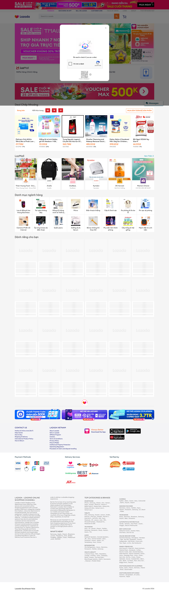

**대표 상품 이미지** (상위 6장, 출처 URL 포함)

-  — 출처 <https://img.lazcdn.com/us/domino/2ad4f22ce5a43dc145f221d13feed352.png>
-  — 출처 <https://img.lazcdn.com/g/tps/images/ims-web/TB1T7K2d8Cw3KVjSZFuXXcAOpXa.png>
- 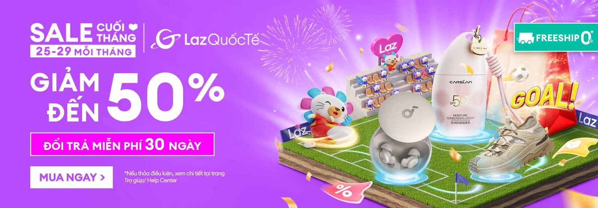 — 출처 <https://img.lazcdn.com/us/domino/2ee70226-7ab4-456f-8e48-84844e492d60_VN-1976-688.jpg_2200x2200q80.jpg>
- 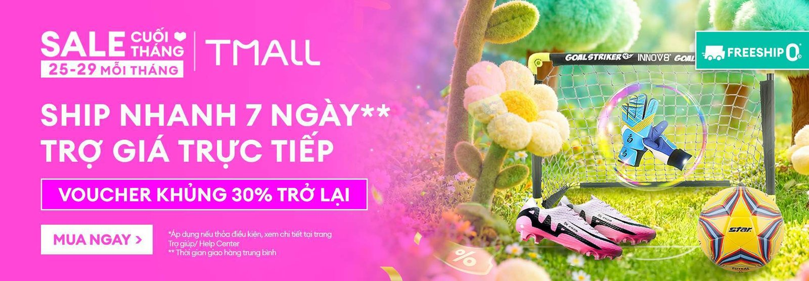 — 출처 <https://img.lazcdn.com/us/domino/0a0b804d-d417-4ea2-a75e-eb57af003d77_VN-1976-688.jpg_2200x2200q80.jpg>
-  — 출처 <https://img.lazcdn.com/us/domino/ae531cde-b75f-4715-80c6-8f3db74435ba_VN-1976-688.jpg_2200x2200q80.jpg>
-  — 출처 <https://img.lazcdn.com/us/domino/cd137fb7-243f-4771-98e4-0c0fdadafe0e_VN-1976-688.jpg_2200x2200q80.jpg>

**페이지 메타 정보**

| page | title | description |
|---|---|---|
| [`home`](https://www.lazada.vn/#?) | Lazada Việt Nam | Mua Sắm Online, Giá Tốt Nhất Mỗi Ngày | Mua sắm đồ điện tử, thời trang, làm đẹp và đồ chơi giá cả phải chăng. Đảm bảo sản phẩm chính hãng và trải nghiệm mua sắm tiện lợi – mua ngay |

#### [Shopee Vietnam](https://shopee.vn/)

- URL: <https://shopee.vn/>
- 페이지: **OK 1 · FAIL 0**

**페이지 메타 정보**

| page | title | description |
|---|---|---|
| [`home`](https://shopee.vn/verify/traffic/error?home_url=https%3A%2F%2Fshopee.vn&is_logged_in=false&next=https%3A%2F%2Fshopee.vn%2F&tracking_id=962bb36b48b-c1b1-4572-82fa-947cd69b48ab&type=4) | Shopee Việt Nam | Hot Deals, Best Prices |  |

#### [Tiki](https://tiki.vn/)

- URL: <https://tiki.vn/>
- 페이지: **OK 1 · FAIL 0**

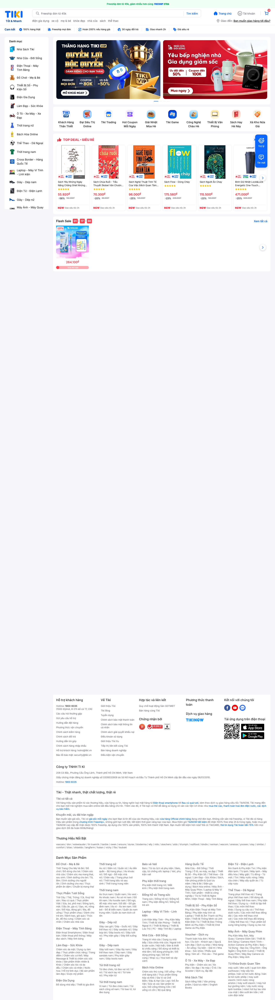

**대표 상품 이미지** (상위 6장, 출처 URL 포함)

-  — 출처 <https://salt.tikicdn.com/cache/100x100/ts/category/ed/20/60/afa9b3b474bf7ad70f10dd6443211d5f.png>
-  — 출처 <https://salt.tikicdn.com/cache/100x100/ts/category/f6/22/46/7e2185d2cf1bca72d5aeac385a865b2b.png>
-  — 출처 <https://salt.tikicdn.com/cache/100x100/ts/category/54/c0/ff/fe98a4afa2d3e5142dc8096addc4e40b.png>
-  — 출처 <https://salt.tikicdn.com/cache/100x100/ts/category/13/64/43/226301adcc7660ffcf44a61bb6df99b7.png>
-  — 출처 <https://salt.tikicdn.com/cache/100x100/ts/category/75/34/29/78e428fdd90408587181005f5cc3de32.png>
-  — 출처 <https://salt.tikicdn.com/cache/100x100/ts/category/61/d4/ea/e6ea3ffc1fcde3b6224d2bb691ea16a2.png>

**페이지 메타 정보**

| page | title | description |
|---|---|---|
| [`home`](https://tiki.vn/) | Tiki - Mua hàng online giá tốt, hàng chuẩn, ship nhanh | Tiện lợi mua sắm hàng triệu mặt hàng, dịch vụ. Vô vàn ưu đãi freeship, mã giảm giá. Hoàn tiền 15% tối đa 600k/tháng với thẻ tín dụng TikiCAR |

## 5. 의류 카테고리별 글로벌 트렌드

| # | 카테고리 | 건수 | 대표 상품명 |
|---:|---|---:|---|
| 1 | `shirt` | 20 | T-Shirt Renoncement · T-Shirt Olivier M · Didcot SS Shirt |
| 2 | `셔츠` | 13 | [금새록 PICK] 여성 95 크롭 티셔츠 4color · 멜로우 슬릿 롱티셔츠 · 버블 레이스 티셔츠 |
| 3 | `팬츠` | 12 | 말랑젤리 프릴팬츠 · 로웰 롤업 데님팬츠 _2COLORS · 버블 와이드 팬츠 |
| 4 | `tee` | 9 | Rebel Star Graphic Baby Tee Red · 10.5 oz USA Cotton Tubular Gusset Tee Black · 10.5 oz USA Cotton Tubular Gusset Tee Indigo |
| 5 | `블라우스` | 9 | 플로우 블라우스_2COLORS · [+반팔💙/하객룩/made] 드멜린 블라우스 · [💙여름][직진배송/10만장돌파][MNLB] 퍼퓸 레이스 라인 스트랩 코튼 블라우스 |
| 6 | `dress` | 8 | Lionne Slouchy Off Shoulder Maxi Dress Black · Loran Mesh Draped Maxi Dress Wine · Summer Suiting "Houston" Dress |
| 7 | `skirt` | 7 | Rovie Twill Cargo Midi Skirt Latte · Miriza Lace Trim Midi Skirt Chocolate / Blue · Another Try Cargo Mini Skirt Khaki |
| 8 | `pants` | 6 | Mankind Baggy Cargo Pants White · Mankind Baggy Cargo Pants Olive · Lola Barrel Pants |
| 9 | `blouse` | 6 | [29CM 단독] Flare Shirring Blouse - Ivory · [29CM 단독] Flare Shirring Blouse - Beige · Emberlyn Peterpan-Collar Blouse - Charcoal Plaid |
| 10 | `jeans` | 4 | Gigi Barrel Jeans · Cinch Baggy Jeans · 94 High and Wide Jeans Iconic Exclusive |
| 11 | `jacket` | 4 | Alfea Funnel Neck Denim Bomber Jacket Mid Blue Wash · Stick Season Quilted Jacket Black · Trail Sherpa Jacket ICONIC EXCLUSIVE |
| 12 | `스커트` | 4 | 쁘띠 체크 캉캉 스커트 _2COLORS · [예진 PICK] [2만9천장돌파/S-XL/MADE] 유로즈 레이어드 슬릿 롱 스커트 - 3 타입 (당일출고/여름/봄/A라인/맥시/옆트임/시스루/링클프리/하객룩/오피스룩/출근룩) · [30만장돌파/MADE]누벨 데일리 나일론 슬릿 롱 스커트 (S-L/장마룩/여름스커트/바스락스커트/데일리룩/출근룩/h라인스커트/나일론치마/롱치마) |
| 13 | `슬랙스` | 4 | [🏆역대급100만장/편안함최강] made. 마켓 와이드 트레이닝슬랙스 (+숏/베이직/롱ver) - 3 size · [✨구김걱정NO/💐하객룩추천] made. 세미부츠컷 찰랑슬랙스 (+베이직/롱ver) - 4 size · [S-L/5만장돌파🏆/made] 모티브 핀턱 슬랙스 |
| 14 | `바지` | 2 | 말랑젤리 랩치마바지 · 말랑젤리 반바지 |
| 15 | `가디건` | 2 | 까미유 스카시 가디건 · 클로에 스트랩 가디건_3COLORS |

**국가별 의류 TOP**

- **australia**: `skirt`(7), `pants`(4), `jeans`(4), `jacket`(3), `dress`(2)- **hong_kong**: `shirt`(4), `cardigan`(1), `jacket`(1), `pants`(1), `dress`(1)- **korea**: `셔츠`(13), `팬츠`(12), `shirt`(10), `블라우스`(9), `tee`(8)- **philippines**: `shirt`(6), `pants`(1)- **singapore**: `dress`(5), `blouse`(4)
## 6. 악세사리 카테고리별 글로벌 트렌드

| # | 카테고리 | 건수 | 대표 상품명 |
|---:|---|---:|---|
| 1 | `bag` | 8 | Bentota - Cotton Bag With Beads Embroidery · Yala - Cotton Bag With Beads Embroidery · Monstera - Cotton Bag With Beads Embroidery |
| 2 | `cap` | 7 | Alnira Cap Sleeve Denim Top Indigo · Iria Capri Trouser Khaki · Penshoppe Est 1986 Classic Cap |
| 3 | `socks` | 2 | Short Socks Pack of 3 |
| 4 | `sandals` | 1 | Billini Arley Faux Suede Thong Sandals Sandstone |
| 5 | `tote` | 1 | Tote Lou |
| 6 | `loafers` | 1 | WEEJUN HERITAGE Larson Western Stud Loafers |
| 7 | `hat` | 1 | Sac Chat Peach |
| 8 | `sneakers` | 1 | Women's Metallic Leather Ballet Sneakers |

**국가별 악세사리 TOP**

- **australia**: `cap`(2), `sandals`(1)- **hong_kong**: `bag`(5), `tote`(1), `loafers`(1), `hat`(1)- **philippines**: `cap`(5), `bag`(3), `socks`(2), `sneakers`(1)
## 7. 국가별 가격대 비교

| 국가 | 통화 | 표본 | min | p25 | median | p75 | max | median (USD) |
|---|---|---:|---:|---:|---:|---:|---:|---:|
| australia | AUD | 41 | 55 | 65 | 84 | 100 | 280 | 59.89 |
| hong_kong | HKD | 30 | 343 | 1090 | 1490 | 2765 | 4090 | 190.15 |
| korea | KRW | 116 | 9460 | 24360 | 32260 | 54165 | 247200 | 21.27 |
| philippines | PHP | 30 | 299 | 399 | 574 | 774 | 1299 | 9.31 |
| singapore | SGD | 12 | 39 | 44 | 45 | 69 | 69 | 35.16 |

> p25/p75 는 IQR 기준 분위수. USD 환산은 `config/exchange_rates.yaml` 기준 (운영자가 정기 갱신).

## 8. 국내 의류·악세사리 사업동향

### KITA K-stat

- 한국무역통계의 국가 수출입 통계 총괄 페이지입니다.
- 사이트: <https://stat.kita.net/stat/kts/ctr/CtrTotalImpExpList.screen>

| # | topic | title | url |
|---:|---|---|---|
| 1 | `trade` | KITA.NET | <https://www.kita.net/> |
| 2 | `trade` | K-stat 란? | <https://www.kita.net/pdf/statGuide/index.html#p=1> |
| 3 | `무역통계` | 무역통계 분류 | <https://stat.kita.net/stat/guide/guide_18_01.screen> |
| 4 | `trade` | 한국품목코드 | <https://stat.kita.net/stat/kts/statCode/ItemHierCodeList.screen> |
| 5 | `trade` | 해외품목코드 | <https://stat.kita.net/stat/istat/common/IstatHSCode.screen> |
| 6 | `trade` | 대륙/경제코드 | <https://stat.kita.net/stat/kts/statCode/ConEcoCodeList.screen> |
| 7 | `trade` | 수출입 총괄 | <https://stat.kita.net/stat/kts/sum/SumImpExpTotalList.screen> |
| 8 | `trade` | 가공단계 수출입 | <https://stat.kita.net/stat/kts/use/BecList.screen> |
| 9 | `trade` | 품목 수출입 | <https://stat.kita.net/stat/kts/pum/ItemImpExpList.screen> |
| 10 | `trade` | 국가 수출입 | <https://stat.kita.net/stat/kts/ctr/CtrTotalImpExpList.screen> |
| 11 | `trade` | 대륙/경제권 수출입 | <https://stat.kita.net/stat/kts/rel/RelColligationList.screen> |
| 12 | `trade` | 지자체 수출입 | <https://stat.kita.net/stat/kts/prod/ProdWholeList.screen> |
| 13 | `trade` | 항구/공항 수출입 | <https://stat.kita.net/stat/kts/port/PortImpExpList.screen> |
| 14 | `trade` | FTA체결국 수출입 | <https://stat.kita.net/stat/kts/fta/FtaCtrImpExpList.screen> |
| 15 | `trade` | 간접수출 현황 | <https://stat.kita.net/stat/ind/KtsIndMain.screen> |

### Korea Customs Service

- 수출입 현황, 물류통계 등 관세청 무역통계정보를 종합적으로 제공
- 사이트: <https://tradedata.go.kr/cts/index_eng.do>

| # | topic | title | url |
|---:|---|---|---|
| 1 | `trade` | Korea Customs Service | <http://customs.go.kr/english/main.do> |

### KOSIS

- 코시스, 국가데이터처가 제공하는 원스톱 통계 서비스, 국가승인통계, 국제통계, 북한통계, e-지방지표, 통계시각화콘텐츠, 온라인간행물 등 제공
- 사이트: <https://kosis.kr/statisticsList/statisticsListIndex.do;jsessionid=e4E_4fhGJyXZSpgoSUIHBBeQ-DX1Fyd3BPC-9lx0.esvwas1_S11?parmTabId=M_01_01&vwcd=MT_ZTITLE&menuId=M_01_01&outLink=Y&entrType=>

| # | topic | title | url |
|---:|---|---|---|
| 1 | `statistics` | 쉽게 보는 통계 | <http://kosis.kr/easyViewStatis/customStatisIndex.do?vwcd=MT_TM1_TITLE&menuId=M_03_01> |
| 2 | `statistics` | 이슈별 접근 | <http://kosis.kr/easyViewStatis/customStatisIndex.do?vwcd=MT_TM2_TITLE&menuId=M_03_02> |
| 3 | `statistics` | 통계시각화콘텐츠 | <http://kosis.kr/easyViewStatis/visualizationIndex.do> |
| 4 | `statistics` | 온라인간행물 | <http://kosis.kr/publication/publicationThema.do> |
| 5 | `statistics` | 기획간행물 | <http://kosis.kr/publication/publicationStat.do> |
| 6 | `statistics` | KOSIS 길라잡이 | <http://kosis.kr/civilComplaint/kosisGuideIndex.do> |
| 7 | `statistics` | 홈페이지 개선의견 | <http://kosis.kr/civilComplaint/siteRequestList.do> |
| 8 | `statistics` | 찾아가는 KOSIS | <http://kosis.kr/civilComplaint/kosisEduIndex.do> |
| 9 | `statistics` | 서비스 소개 | <http://kosis.kr/serviceInfo/kosisIntroduce.do> |
| 10 | `statistics` | 국가통계현황 | <http://kosis.kr/serviceInfo/statisInstitution.do> |
| 11 | `statistics` | 국가통계 공표일정 | <http://kosis.kr/serviceInfo/statisPublicationList.do> |
| 12 | `statistics` | 팩트체크 서비스 | <http://kosis.kr/serviceInfo/factCheckList.do> |
| 13 | `statistics` | 서비스정책 | <http://kosis.kr/serviceInfo/useGuide.do> |
| 14 | `statistics` | 공유서비스 (OpenAPI) | <http://kosis.kr/serviceInfo/openAPIGuide.do> |
| 15 | `statistics` | English | <https://kosis.kr/eng> |

### KOTRA

- 코트라, KOTRA, 대한무역투자진흥공사, 트라이빅, TriBIG, 무역투자통계, 국가별 시장정보, 품목별 유망시장, 기업별 맞춤정보, 해외바이어 정보
- 사이트: <https://www.kotra.or.kr/bigdata/visualization/korea#search/ALL/ALL/2024>

| # | topic | title | url |
|---:|---|---|---|
| 1 | `trade` | kotra 무역투자24 | <https://www.kotra.or.kr/bigdata/kotraSsoRedirect?targetURL=https://www.kotra.or.kr> |
| 2 | `trade` | 해외비즈니스 정보 포털 | <https://www.kotra.or.kr/bigdata/kotraSsoRedirect?targetURL=https://dream.kotra.or.kr/dream> |
| 3 | `trade` | 글로벌 전시포털 | <https://www.kotra.or.kr/bigdata/kotraSsoRedirect?targetURL=https://www.gep.or.kr/> |
| 4 | `trade` | KOTRA 해외인재유치센터 | <https://www.kotra.or.kr/gtc_kor> |
| 5 | `trade` | 투자유치정보제공 | <https://www.kotra.or.kr/bigdata/kotraSsoRedirect?targetURL=https://www.investkorea.org/> |
| 6 | `수출지원` | 수출지원 온라인 플랫폼 | <https://www.kotra.or.kr/bigdata/kotraSsoRedirect?targetURL=https://www.buykorea.or.kr/> |
| 7 | `trade` | 빅데이터 서비스 | <https://www.kotra.or.kr/bigdata/> |
| 8 | `trade` | 경제외교 활용포털 | <https://www.kotra.or.kr/bigdata/kotraSsoRedirect?targetURL=https://president.globalwindow.org> |
| 9 | `trade` | 방산물자교역지원센터 | <https://www.kotra.or.kr/bigdata/kotraSsoRedirect?targetURL=https://www.kotra.or.kr/kodits> |
| 10 | `trade` | 외투기업고충처리 | <https://www.kotra.or.kr/bigdata/kotraSsoRedirect?targetURL=https://ombudsman.kotra.or.kr/ob-kr> |
| 11 | `trade` | 수출바우처 · 지사화 | <https://www.exportvoucher.com> |
| 12 | `trade` | 무역투자통계 | <https://www.kotra.or.kr/bigdata/visualization/korea> |
| 13 | `trade` | 국가별 시장정보 | <https://www.kotra.or.kr/bigdata/marketAnalysis> |
| 14 | `trade` | 품목별 유망시장 | <https://www.kotra.or.kr/bigdata/bhrcMarket> |
| 15 | `trade` | 해외바이어 정보 | <https://www.kotra.or.kr/bigdata/partner/search> |

### Statistics Korea Online Shopping

- 국가데이터처,List | 전체 | 보도자료 | 새소식
- 사이트: <https://mods.go.kr/board.es?mid=a10301010000&bid=11789>

| # | topic | title | url |
|---:|---|---|---|
| 1 | `statistics` | 정보공개제도 | <https://mods.go.kr/menu.es?mid=a10101010100> |
| 2 | `statistics` | 정보공개청구 | <https://www.open.go.kr/com/main/mainView.do> |
| 3 | `statistics` | 비공개대상정보세부기준 | <https://mods.go.kr/menu.es?mid=a10101030000> |
| 4 | `statistics` | 고객수요분석 | <https://mods.go.kr/menu.es?mid=a10101040000> |
| 5 | `statistics` | 사전정보공표 | <https://mods.go.kr/menu.es?mid=a10103010000> |
| 6 | `statistics` | 사전정보공표목록 | <https://mods.go.kr/menu.es?mid=a10103010100> |
| 7 | `statistics` | 핵심단어목록 | <https://mods.go.kr/menu.es?mid=a10103020100> |
| 8 | `statistics` | 인기정보TOP10 | <https://mods.go.kr/menu.es?mid=a10103030100> |
| 9 | `statistics` | 행정자료실 | <https://mods.go.kr/menu.es?mid=a10104010000> |
| 10 | `statistics` | 업무추진비 | <https://mods.go.kr/menu.es?mid=a10104010100> |
| 11 | `statistics` | 국회관련정보 | <https://mods.go.kr/menu.es?mid=a10104040000> |
| 12 | `statistics` | 정책실명제 | <https://mods.go.kr/menu.es?mid=a10105010000> |
| 13 | `statistics` | 연도별대상사업현황 | <https://mods.go.kr/menu.es?mid=a10105020000> |
| 14 | `statistics` | 중점관리대상사업 | <https://mods.go.kr/menu.es?mid=a10105030600> |
| 15 | `statistics` | 국민신청실명제 | <https://mods.go.kr/menu.es?mid=a10105040000> |

### 기업마당

- 기업마당>정책정보>지원사업 공고
- 사이트: <https://www.bizinfo.go.kr/sii/siia/selectSIIA200View.do?null>

| # | topic | title | url |
|---:|---|---|---|
| 1 | `policy` | 지원사업 공고 | <https://www.bizinfo.go.kr/sii/siia/selectSIIA200View.do> |
| 2 | `policy` | 품목별 법정의무 인증제도 | <https://www.bizinfo.go.kr/biz/biza/selectBIZA100View.do> |
| 3 | `policy` | 입법·행정예고/고시 | <https://www.bizinfo.go.kr/biz/biza/selectBIZA300View.do> |
| 4 | `policy` | 월간 중기누리 | <https://www.bizinfo.go.kr/biz/biza/selectBIZA400View.do> |
| 5 | `policy` | 기업업무용 서식 | <https://www.bizinfo.go.kr/biz/bizb/selectBIZB100View.do> |
| 6 | `policy` | 입주기업 모집공고 | <https://www.bizinfo.go.kr/biz/bizb/selectBIZB200View.do> |
| 7 | `policy` | 온라인화상회의실 | <https://www.k-startup.go.kr/web/contents/webOLNIVIDEOMTRM.do> |
| 8 | `policy` | 정책정보 개방 | <https://www.bizinfo.go.kr/apiList.do> |
| 9 | `policy` | 속보성 대시보드 | <https://www.bizinfo.go.kr/dashboard.do> |
| 10 | `policy` | 고객의 소리 | <https://www.bizinfo.go.kr/biz/bizc/selectBIZC200Regist.do> |
| 11 | `policy` | 자주하는질문 | <https://www.bizinfo.go.kr/biz/bizc/selectBIZC300View.do> |
| 12 | `policy` | 이메일주소 무단 수집 거부안내 | <https://www.bizinfo.go.kr/biz/bizd/selectBIZD110View.do> |
| 13 | `policy` | 저작권 정책 | <https://www.bizinfo.go.kr/biz/bizd/selectBIZD120View.do> |
| 14 | `policy` | 웹접근성 정책 | <https://www.bizinfo.go.kr/biz/bizd/selectBIZD130View.do> |
| 15 | `policy` | 전체메뉴보기 | <https://www.bizinfo.go.kr/sitemap/intro.do> |

### 서울경제진흥원

- 서울경제진흥원 에러페이지
- 사이트: <https://www.sba.seoul.kr/Pages/error_404.html?aspxerrorpath=/Pages/NSub06_01.aspx>

### 소상공인24

- 소상공인24
- 사이트: <https://www.sbiz24.kr/#/pbanc>

### 중소벤처기업부

- 중소기업중앙회 등 기관 중소기업 조사, 통계 DB화 검색, 내려받기 등 제공.
- 사이트: <https://www.mss.go.kr/site/smba/ex/bbs/List.do?cbIdx=86>

| # | topic | title | url |
|---:|---|---|---|
| 1 | `policy` | 어린이 누리집 | <https://www.mss.go.kr/site/kids/main.do> |
| 2 | `policy` | English | <https://www.mss.go.kr/site/eng/main.do> |
| 3 | `policy` | 누리집 안내지도 | <https://www.mss.go.kr/site/smba/ex/siteMap/siteMap.do> |
| 4 | `policy` | 훈령/예규/고시/공고 | <https://www.mss.go.kr/site/smba/ex/bbs/List.do?cbIdx=125&ext6=Y> |
| 5 | `policy` | 입법/행정예고 | <https://www.mss.go.kr/site/smba/ex/bbs/List.do?cbIdx=126&searchRltnYn=Y> |
| 6 | `policy` | 인사·채용 | <https://www.mss.go.kr/site/smba/ex/bbs/List.do?cbIdx=82> |
| 7 | `policy` | 보도설명자료 | <https://www.mss.go.kr/site/smba/ex/bbs/List.do?cbIdx=87> |
| 8 | `policy` | 현장속으로 | <https://www.mss.go.kr/site/smba/brdcststnVod/brdcststnVodList.do?ctgr_code=C01> |
| 9 | `policy` | 중기부소식지 | <https://www.mss.go.kr/site/smba/ex/bbs/List.do?cbIdx=95> |
| 10 | `policy` | 통계발표자료 | <https://www.mss.go.kr/site/smba/foffice/ex/statDB/ptScheduleList.do> |
| 11 | `policy` | 주제별 통계 | <https://www.mss.go.kr/site/smba/foffice/ex/statDB/temaList.do?tabCd=0001> |
| 12 | `policy` | 조사별 통계 | <https://www.mss.go.kr/site/smba/foffice/ex/statDB/surveyList.do?tabCd=0001> |
| 13 | `policy` | 조사보고서 | <https://www.mss.go.kr/site/smba/foffice/ex/statDB/stReportRoList.do?gb=1&nodeId=&roCode=> |
| 14 | `policy` | 주제별 조회 | <https://www.mss.go.kr/site/smba/foffice/ex/statDB/stReportRcList.do?gb=2&nodeId=&rcCode=> |
| 15 | `policy` | 중소기업위상 | <https://www.mss.go.kr/site/smba/foffice/ex/statDB/MainSubStat.do?scd=0001> |

## 9. 한국 사업자 관점 기회 국가 TOP 10

| # | 국가 | tier | region | 점수 | 근거 |
|---:|---|---:|---|---:|---|
| 1 | 태국 _( Thailand )_ | 1 | `asia` | **152.0** | tier1 기본점(90); 아시아 권역(+20); ASEAN 시장(+10); K-패션/콘텐츠 친화 시장(+20); 트렌드 신호 밀도 12 |
| 2 | 대만 _( Taiwan )_ | 1 | `asia` | **136.5** | tier1 기본점(90); 아시아 권역(+20); K-패션/콘텐츠 친화 시장(+20); 트렌드 신호 밀도 6 |
| 3 | 일본 _( Japan )_ | 1 | `asia` | **130.0** | tier1 기본점(90); 아시아 권역(+20); K-패션/콘텐츠 친화 시장(+20) |
| 4 | 베트남 _( Vietnam )_ | 1 | `asia` | **124.5** | tier1 기본점(90); 아시아 권역(+20); ASEAN 시장(+10); 트렌드 신호 밀도 4 |
| 5 | 필리핀 _( Philippines )_ | 2 | `asia` | **123.5** | tier2 기본점(60); 아시아 권역(+20); ASEAN 시장(+10); K-패션/콘텐츠 친화 시장(+20); 트렌드 신호 밀도 14 |
| 6 | 인도네시아 _( Indonesia )_ | 1 | `asia` | **122.5** | tier1 기본점(90); 아시아 권역(+20); ASEAN 시장(+10); 트렌드 신호 밀도 2 |
| 7 | 미국 _( United States )_ | 1 | `north_america` | **106.5** | tier1 기본점(90); 트렌드 신호 밀도 16 |
| 8 | 싱가포르 _( Singapore )_ | 2 | `asia` | **98.0** | tier2 기본점(60); 아시아 권역(+20); ASEAN 시장(+10); 트렌드 신호 밀도 8 |
| 9 | 말레이시아 _( Malaysia )_ | 2 | `asia` | **95.0** | tier2 기본점(60); 아시아 권역(+20); ASEAN 시장(+10); 트렌드 신호 밀도 5 |
| 10 | 홍콩 _( Hong Kong )_ | 2 | `asia` | **92.5** | tier2 기본점(60); 아시아 권역(+20); 트렌드 신호 밀도 12 |

## 10. 실행 제안

### **1위 태국** (점수 152, tier1 · asia)

- 현지 스타일 TOP: `wide` — 시즌 컬렉션 기획 시 우선 반영.
- 현지 컬러 TOP: `red` — 시즌 컬렉션 기획 시 우선 반영.
- 현지 소재 TOP: `denim`, `knit` — 시즌 컬렉션 기획 시 우선 반영.
- 현지 카테고리 TOP: `accessories`, `jacket`, `dress` — 시즌 컬렉션 기획 시 우선 반영.
- K-패션 친화도가 명시된 시장이므로 K-브랜드 아이덴티티 및 한류 셀럽 협업을 강조.
- ASEAN 권역 시장 — 물류/관세(FTA) 활용 + 동남아 통합 마케팅 검토 권장.
- tier1 핵심 시장 — 현지 마켓플레이스(예: 해당 국가의 대표 패션 플랫폼) 공식 입점 + 셀러 운영 채널 확보 우선.
- 연계 가능한 국내 수출/지원 사업이 식별되지 않음 — `domestic_sources.yaml` 의 `landing_url` 을 KOTRA 사업 공고/기업마당 수출바우처로 직접 지정 권장.

### **2위 대만** (점수 136, tier1 · asia)

- 현지 컬러 TOP: `pink`, `red` — 시즌 컬렉션 기획 시 우선 반영.
- 현지 소재 TOP: `lace` — 시즌 컬렉션 기획 시 우선 반영.
- K-패션 친화도가 명시된 시장이므로 K-브랜드 아이덴티티 및 한류 셀럽 협업을 강조.
- 아시아 권역 시장 — 시차/언어 친화 + 한국 본사 직배송 모델 검토.
- tier1 핵심 시장 — 현지 마켓플레이스(예: 해당 국가의 대표 패션 플랫폼) 공식 입점 + 셀러 운영 채널 확보 우선.
- 연계 가능한 국내 수출/지원 사업이 식별되지 않음 — `domestic_sources.yaml` 의 `landing_url` 을 KOTRA 사업 공고/기업마당 수출바우처로 직접 지정 권장.

### **3위 일본** (점수 130, tier1 · asia)

- K-패션 친화도가 명시된 시장이므로 K-브랜드 아이덴티티 및 한류 셀럽 협업을 강조.
- 아시아 권역 시장 — 시차/언어 친화 + 한국 본사 직배송 모델 검토.
- tier1 핵심 시장 — 현지 마켓플레이스(예: 해당 국가의 대표 패션 플랫폼) 공식 입점 + 셀러 운영 채널 확보 우선.
- 연계 가능한 국내 수출/지원 사업이 식별되지 않음 — `domestic_sources.yaml` 의 `landing_url` 을 KOTRA 사업 공고/기업마당 수출바우처로 직접 지정 권장.

### 운영 점검 노트

- **ASEAN 다중 진출 기회**: TOP10 중 ASEAN 국가가 3개 이상. Shopee/Lazada/Zalora 통합 운영을 통한 동남아 멀티마켓 전략을 검토 권장.

## 11. 수집 실패/주의 사이트

| 국가 | 사이트 | 페이지 | 상태 | 사유 |
|---|---|---|---|---|
| usa | Revolve | new | failed | playwright_error: Error: Page.goto: net::ERR_HTTP2_PROTOCOL_ERROR at https://www.revolve.com/new/br/c79f88/
Call log:
  - navigating to "https://www.revolve.com/new/br/c79f88/", waiting until "domcontentloaded"
 |
| usa | Revolve | trending | failed | playwright_error: Error: Page.goto: net::ERR_HTTP2_PROTOCOL_ERROR at https://www.revolve.com/most-loved/br/4a9ca5/
Call log:
  - navigating to "https://www.revolve.com/most-loved/br/4a9ca5/", waiting until "domcontentloaded"
 |
| japan | ZOZOTOWN | new | failed | playwright_error: TimeoutError: Page.goto: Timeout 30000ms exceeded.
Call log:
  - navigating to "https://zozo.jp/category/new/", waiting until "domcontentloaded"
 |
| japan | ZOZOTOWN | ranking | failed | playwright_error: TimeoutError: Page.goto: Timeout 30000ms exceeded.
Call log:
  - navigating to "https://zozo.jp/ranking/", waiting until "domcontentloaded"
 |
| japan | Rakuten Fashion | women | failed | http_status_404 |
| indonesia | Tokopedia | home | failed | playwright_error: Error: Page.goto: net::ERR_HTTP2_PROTOCOL_ERROR at https://www.tokopedia.com/
Call log:
  - navigating to "https://www.tokopedia.com/", waiting until "domcontentloaded"
 |
| indonesia | Berrybenka | home | failed | http_error: ConnectError: [Errno 8] nodename nor servname provided, or not known |
| taiwan | PChome | home | failed | http_status_429 |
| canada | Hudson's Bay | home | failed | playwright_error: TimeoutError: Page.goto: Timeout 30000ms exceeded.
Call log:
  - navigating to "https://www.thebay.com/", waiting until "domcontentloaded"
 |
| canada | Dynamite | home | failed | http_status_403 |
| united_kingdom | John Lewis | home | failed | playwright_error: Error: Page.goto: net::ERR_HTTP2_PROTOCOL_ERROR at https://www.johnlewis.com/
Call log:
  - navigating to "https://www.johnlewis.com/", waiting until "domcontentloaded"
 |
| germany | Zalando Germany | new_women | failed | playwright_error: TimeoutError: Page.goto: Timeout 30000ms exceeded.
Call log:
  - navigating to "https://www.zalando.de/damenmode-neuheiten/", waiting until "domcontentloaded"
 |
| philippines | Bench | home | failed | http_status_522 |
| india | Myntra | home | failed | playwright_error: Error: Page.goto: net::ERR_HTTP2_PROTOCOL_ERROR at https://www.myntra.com/
Call log:
  - navigating to "https://www.myntra.com/", waiting until "domcontentloaded"
 |
| india | Nykaa Fashion | home | failed | playwright_error: Error: Page.goto: net::ERR_HTTP2_PROTOCOL_ERROR at https://www.nykaafashion.com/
Call log:
  - navigating to "https://www.nykaafashion.com/", waiting until "domcontentloaded"
 |
| italy | Yoox | home | failed | playwright_error: Error: Page.goto: net::ERR_HTTP2_PROTOCOL_ERROR at https://www.yoox.com/
Call log:
  - navigating to "https://www.yoox.com/", waiting until "domcontentloaded"
 |
| brazil | Dafiti | new | failed | playwright_error: Error: Page.goto: net::ERR_HTTP2_PROTOCOL_ERROR at https://www.dafiti.com.br/lancamentos/?
Call log:
  - navigating to "https://www.dafiti.com.br/lancamentos/?", waiting until "domcontentloaded"
 |
| turkey | LC Waikiki | home | failed | playwright_error: Error: Page.goto: net::ERR_HTTP2_PROTOCOL_ERROR at https://www.lcwaikiki.com/
Call log:
  - navigating to "https://www.lcwaikiki.com/", waiting until "domcontentloaded"
 |
| korea | Musinsa | home | failed | robots_disallowed |
| kazakhstan | Wildberries Kazakhstan | home | failed | playwright_error: Error: Page.goto: net::ERR_CONNECTION_RESET at https://www.wildberries.kz/
Call log:
  - navigating to "https://www.wildberries.kz/", waiting until "domcontentloaded"
 |
| kazakhstan | Lamoda Kazakhstan | home | failed | playwright_error: TimeoutError: Page.goto: Timeout 30000ms exceeded.
Call log:
  - navigating to "https://www.lamoda.kz/", waiting until "domcontentloaded"
 |

## 12. 원문 출처 및 이미지 출처

### 호주

- **Cotton On** — <https://cottonon.com/AU/>
  - 이미지 출처: <https://cottonon.com/on/demandware.static/-/Library-Sites-cog-megastore-shared-library/default/dwaf9342fb/group/home-page/mega-menu-tiles/C_5141500_MEGANAV_MB_JUNE_AU_5141520_0626.jpg>
  - 이미지 출처: <https://cottonon.com/on/demandware.static/-/Library-Sites-cog-megastore-shared-library/default/dw3bd43da3/group/home-page/2026/05_MAY/AU/C_5141500_MEGANAV_DT_JUNE_AU_5141538_0626-W-1.jpg>
  - 이미지 출처: <https://cottonon.com/on/demandware.static/-/Library-Sites-cog-megastore-shared-library/default/dw51cf53f6/group/home-page/2026/05_MAY/AU/C_5141500_MEGANAV_DT_JUNE_AU_5141538_0626-W-2.jpg>
  - 이미지 출처: <https://cottonon.com/on/demandware.static/-/Library-Sites-cog-megastore-shared-library/default/dwff5539ea/group/home-page/2026/05_MAY/AU/C_5141500_MEGANAV_DT_JUNE_AU_5141538_0626-W-4.jpg>
  - 이미지 출처: <https://cottonon.com/on/demandware.static/-/Library-Sites-cog-megastore-shared-library/default/dwd6a984a9/group/home-page/2026/05_MAY/AU/C_5141500_MEGANAV_DT_JUNE_AU_5141538_0626-W-7.jpg>
  - 이미지 출처: <https://cottonon.com/on/demandware.static/-/Library-Sites-cog-megastore-shared-library/default/dw9a5d108c/group/home-page/2026/05_MAY/AU/C_5141500_MEGANAV_DT_JUNE_AU_5141538_0626-M-1.jpg>
  - 이미지 출처: <https://cottonon.com/on/demandware.static/-/Library-Sites-cog-megastore-shared-library/default/dwec1f278b/group/home-page/2026/05_MAY/AU/C_5141500_MEGANAV_DT_JUNE_AU_5141538_0626-M-2.jpg>
  - 이미지 출처: <https://cottonon.com/on/demandware.static/-/Library-Sites-cog-megastore-shared-library/default/dwf9a897fa/group/home-page/2026/05_MAY/AU/C_5141500_MEGANAV_DT_JUNE_AU_5141538_0626-M-4.jpg>
  - 이미지 출처: <https://cottonon.com/on/demandware.static/-/Library-Sites-cog-megastore-shared-library/default/dw37e42a0d/group/home-page/2026/05_MAY/AU/C_5141500_MEGANAV_DT_JUNE_AU_5141538_0626-M-5.jpg>
  - 이미지 출처: <https://cottonon.com/on/demandware.static/-/Library-Sites-cog-megastore-shared-library/default/dw119f13c4/group/home-page/mega-menu-tiles/C_4936501_MEGANAV_DT_TILE_SWEATS_AU_4947003_0326_DT.jpg>
  - 이미지 출처: <https://cottonon.com/on/demandware.static/-/Library-Sites-cog-megastore-shared-library/default/dwd4858256/group/home-page/2026/05_MAY/AU/C_BP_JUNE_LAUNCH_AU_5138670_FIFA_DT.jpg>
  - 이미지 출처: <https://cottonon.com/on/demandware.static/-/Library-Sites-cog-megastore-shared-library/default/dw941b9bc7/group/home-page/2026/05_MAY/AU/C_BP_JUNE_LAUNCH_AU_5138670_FIFA_MB.jpg>
  - 이미지 출처: <https://cottonon.com/on/demandware.static/-/Library-Sites-cog-megastore-shared-library/default/dwb9e9c9b5/group/home-page/2026/05_MAY/AU/FIFA_Lockup.png>
  - 이미지 출처: <https://cottonon.com/on/demandware.static/-/Library-Sites-cog-megastore-shared-library/default/dw2e7825fa/group/home-page/2026/05_MAY/AU/C_BP_JUNE_LAUNCH_AU_5138670_1_1UP_DT.jpg>
  - 이미지 출처: <https://cottonon.com/on/demandware.static/-/Library-Sites-cog-megastore-shared-library/default/dw0c242958/group/home-page/2026/05_MAY/AU/C_BP_JUNE_LAUNCH_AU_5138670_1_1UP_MB_V2.jpg>
  - 이미지 출처: <https://cottonon.com/on/demandware.static/-/Library-Sites-cog-megastore-shared-library/default/dw7737138e/group/home-page/2026/05_MAY/AU/C_BP_JUNE_LAUNCH_AU_5138670_CAT_W_1_V2.jpg>
  - 이미지 출처: <https://cottonon.com/on/demandware.static/-/Library-Sites-cog-megastore-shared-library/default/dwbe592fb3/group/home-page/2026/05_MAY/AU/C_BP_JUNE_LAUNCH_AU_5138670_CAT_W_2.jpg>
  - 이미지 출처: <https://cottonon.com/on/demandware.static/-/Library-Sites-cog-megastore-shared-library/default/dwdb36bd93/group/home-page/2026/05_MAY/AU/C_BP_JUNE_LAUNCH_AU_5138670_CAT_W_3.jpg>
  - 이미지 출처: <https://cottonon.com/on/demandware.static/-/Library-Sites-cog-megastore-shared-library/default/dw38e52e8e/group/home-page/2026/05_MAY/AU/C_BP_JUNE_LAUNCH_AU_5138670_CAT_W_4.jpg>
  - 이미지 출처: <https://cottonon.com/on/demandware.static/-/Library-Sites-cog-megastore-shared-library/default/dwa65ad5e2/group/home-page/2026/05_MAY/AU/C_BP_JUNE_LAUNCH_AU_5138670_CAT_W_5.jpg>
- **David Jones** — <https://www.davidjones.com/>
- **Myer** — <https://www.myer.com.au/>
  - 이미지 출처: <https://content-us-5.content-cms.com/af9094ac-4ec2-4ea9-8480-e7ef2c8369de/dxresources/1981/19814e61-1957-4b9f-a827-9b2eaada7f21.jpg?resize=400px%3A200px&crop=400%3A200%3B0%2C0&output-format=webp&w=828&q=75>
  - 이미지 출처: <https://content-us-5.content-cms.com/af9094ac-4ec2-4ea9-8480-e7ef2c8369de/dxresources/6c4d/6c4d04a5-a916-4c36-93ee-bae4cd1eff7a.jpg?resize=400px%3A200px&crop=400%3A200%3B0%2C0&output-format=webp&w=828&q=75>
  - 이미지 출처: <https://content-us-5.content-cms.com/af9094ac-4ec2-4ea9-8480-e7ef2c8369de/dxresources/dd2e/dd2e3712-5094-4cd3-a4ed-edfd9295a7b5.jpg?resize=400px%3A200px&crop=400%3A200%3B0%2C0&output-format=webp&w=828&q=75>
  - 이미지 출처: <https://content-us-5.content-cms.com/af9094ac-4ec2-4ea9-8480-e7ef2c8369de/dxresources/8b27/8b2790f5-98b4-4df0-8df7-d8e97bcc1dbd.jpg?resize=400px%3A200px&crop=400%3A200%3B0%2C0&output-format=webp&w=828&q=75>
  - 이미지 출처: <https://content-us-5.content-cms.com/af9094ac-4ec2-4ea9-8480-e7ef2c8369de/dxresources/e4ae/e4aed948-c35d-402d-9ce2-2548899ca9bd.jpg?resize=400px%3A200px&crop=400%3A200%3B0%2C0&output-format=webp&w=828&q=75>
  - 이미지 출처: <https://content-us-5.content-cms.com/af9094ac-4ec2-4ea9-8480-e7ef2c8369de/dxresources/cade/cade0a89-f086-4719-9053-aa4a3dbc0d9a.jpg?resize=400px%3A200px&crop=400%3A200%3B0%2C0&output-format=webp&w=828&q=75>
  - 이미지 출처: <https://content-us-5.content-cms.com/af9094ac-4ec2-4ea9-8480-e7ef2c8369de/dxresources/9b97/9b97c2bf-7fba-4aac-b4be-5de078909a5c.jpg?resize=400px%3A200px&crop=400%3A200%3B0%2C0&output-format=webp&w=828&q=75>
  - 이미지 출처: <https://content-us-5.content-cms.com/af9094ac-4ec2-4ea9-8480-e7ef2c8369de/dxresources/e5df/e5dffd12-2fe8-43ca-a586-617c3dcf25f7.jpg?resize=400px%3A200px&crop=400%3A200%3B0%2C0&output-format=webp&w=828&q=75>
  - 이미지 출처: <https://content-us-5.content-cms.com/af9094ac-4ec2-4ea9-8480-e7ef2c8369de/dxresources/ff30/ff30337d-a6da-4c6d-9786-7ebc2fd2f5a4.jpg?resize=400px%3A200px&crop=400%3A200%3B0%2C0&output-format=webp&w=828&q=75>
  - 이미지 출처: <https://content-us-5.content-cms.com/af9094ac-4ec2-4ea9-8480-e7ef2c8369de/dxresources/2ded/2ded2c6d-41e5-4b11-85d3-7eab034b30bc.jpg?resize=400px%3A200px&crop=400%3A200%3B0%2C0&output-format=webp&w=828&q=75>
  - 이미지 출처: <https://content-us-5.content-cms.com/af9094ac-4ec2-4ea9-8480-e7ef2c8369de/dxresources/16d6/16d684bf-bc8b-4b48-b7cb-d29a2e9c973d.jpg?resize=382px%3A288px&crop=382%3A288%3B0%2C0&output-format=webp&w=828&q=75>
  - 이미지 출처: <https://content-us-5.content-cms.com/af9094ac-4ec2-4ea9-8480-e7ef2c8369de/dxresources/3959/3959224c-e4e5-4c5f-bd60-9de787bb3de9.jpg?resize=175px%3A240px&crop=175%3A240%3B0%2C0&output-format=webp&w=384&q=75>
  - 이미지 출처: <https://content-us-5.content-cms.com/af9094ac-4ec2-4ea9-8480-e7ef2c8369de/dxresources/3b13/3b1396d2-35e6-4af7-95b4-0b28a73d9254.jpg?resize=175px%3A240px&crop=175%3A240%3B0%2C0&output-format=webp&w=384&q=75>
  - 이미지 출처: <https://content-us-5.content-cms.com/af9094ac-4ec2-4ea9-8480-e7ef2c8369de/dxresources/a56e/a56e4d7e-bf91-49aa-82fe-f3ae8bc8f4db.jpg?resize=180px:270px&crop=180:270;0,0&output-format=webp&w=384&q=75>
  - 이미지 출처: <https://content-us-5.content-cms.com/af9094ac-4ec2-4ea9-8480-e7ef2c8369de/dxresources/df99/df99328b-aee4-4cd0-bef5-4c91adeffbd9.jpg?resize=180px:270px&crop=180:270;0,0&output-format=webp&w=384&q=75>
  - 이미지 출처: <https://content-us-5.content-cms.com/af9094ac-4ec2-4ea9-8480-e7ef2c8369de/dxresources/676e/676e1444-5224-4825-ab75-5bc2bac977f0.jpg?resize=180px:270px&crop=180:270;0,0&output-format=webp&w=384&q=75>
  - 이미지 출처: <https://content-us-5.content-cms.com/af9094ac-4ec2-4ea9-8480-e7ef2c8369de/dxresources/a810/a810cdf9-6088-480f-8113-c35221fff385.jpg?resize=180px:270px&crop=180:270;0,0&output-format=webp&w=384&q=75>
  - 이미지 출처: <https://content-us-5.content-cms.com/af9094ac-4ec2-4ea9-8480-e7ef2c8369de/dxresources/8b84/8b84a0a7-a122-4b51-ad29-b58756737dac.jpg?resize=180px:270px&crop=180:270;0,0&output-format=webp&w=384&q=75>
  - 이미지 출처: <https://content-us-5.content-cms.com/af9094ac-4ec2-4ea9-8480-e7ef2c8369de/dxresources/69af/69afdc19-214c-471b-a5db-25e0b3fc8869.jpg?resize=180px:270px&crop=180:270;0,0&output-format=webp&w=384&q=75>
- **Princess Polly** — <https://www.princesspolly.com.au/>
- **The Iconic** — <https://www.theiconic.com.au/>
  - 이미지 출처: <https://img1.theiconic.com.au/4GRJ-FpMq8csx6QEfCFY_zgpt-M=/265x159/filters:fill(ffffff,1):quality(90):format(jpeg)/https%3A%2F%2Fimages.prismic.io%2Ftheiconic-content-service%2FaO3WbZ5xUNkB16gs_GIRLS-NavTileDesk.jpg>

### 브라질

- **C&A Brazil** — <https://www.cea.com.br/>
  - 이미지 출처: <https://cea.vtexassets.com/assets/vtex.file-manager-graphql/images/4ff2f2d6-71a9-413d-a036-6ad335452e22___a6d4dd27e7cb2b0655b2676c2e41e288.jpg>
  - 이미지 출처: <https://cea.vtexassets.com/assets/vtex.file-manager-graphql/images/1e44129b-1ce3-4eaf-b586-6b71a594b7df___988276e05e144d07b32d3aed52a07d4b.jpg>
  - 이미지 출처: <https://cea.vtexassets.com/assets/vtex.file-manager-graphql/images/12249e5e-8d16-43de-a996-6fe8b1be84b6___89786854eb82462df8b7b4f39036fa81.jpg>
  - 이미지 출처: <https://cea.vtexassets.com/assets/vtex.file-manager-graphql/images/f148ced8-edcc-4751-a826-6b44506c633c___f10cafb110eed1f4b8a6c20f5e1cc599.jpg>
  - 이미지 출처: <https://cea.vtexassets.com/assets/vtex.file-manager-graphql/images/07d567d3-6a2f-4e9b-8fa2-c90ece2257be___03528422f257eac97c130f9b414bb7c3.jpg>
  - 이미지 출처: <https://cea.vtexassets.com/assets/vtex.file-manager-graphql/images/c737f390-74e1-4a88-9710-0dc8a43b903d___090bf51a1b512cec8547c16923749d16.jpg>
  - 이미지 출처: <https://cea.vtexassets.com/assets/vtex.file-manager-graphql/images/c3ee667e-4411-4552-bc31-bdb1d48d877f___8576c409f48aba30ead149fdb0d4480a.jpg>
  - 이미지 출처: <https://cea.vtexassets.com/assets/vtex.file-manager-graphql/images/d288bf76-08d1-40c8-a891-7b26ec0bb9de___046887f205fb1a3d1d1a307322893f96.jpg>
  - 이미지 출처: <https://cea.vtexassets.com/assets/vtex.file-manager-graphql/images/fc20cd55-6919-437b-87e9-fade33b44fbd___89861b964ceaab16139ed661ddecac5b.jpg>
  - 이미지 출처: <https://cea.vtexassets.com/assets/vtex.file-manager-graphql/images/7c81ac45-c2e7-4719-b398-1bc10946e7ae___f82e93da77a5bf7d423054e452b2e003.jpg>
  - 이미지 출처: <https://cea.vtexassets.com/assets/vtex.file-manager-graphql/images/5b5f6b7c-122d-449d-b2f3-fe1844d8342b___1b9fa0399cbb97e6a47e0f27f53f4e98.jpg>
  - 이미지 출처: <https://cea.vtexassets.com/assets/vtex.file-manager-graphql/images/d63f3fb8-ec85-48c2-a174-b8f39aabb66d___baea94cb71320cd9a1549f3aef0a6e94.jpg>
  - 이미지 출처: <https://cea.vtexassets.com/assets/vtex.file-manager-graphql/images/21f636eb-e3a7-4a77-9f71-ee91785d7f68___89383d96f7d88d4d97b832e318e4cb0d.jpg>
  - 이미지 출처: <https://cea.vtexassets.com/assets/vtex.file-manager-graphql/images/011c41dd-fdb8-40b6-82de-37afccceff2b___5704f7b2135676c0b9e8e0bda85c5370.jpg>
  - 이미지 출처: <https://cea.vtexassets.com/assets/vtex.file-manager-graphql/images/8ad31e15-6a04-44ce-a3e6-9211094e19e8___89466afe79bd0158493a51aeb0b905e0.jpg>
  - 이미지 출처: <https://cea.vtexassets.com/assets/vtex.file-manager-graphql/images/ea1b08c9-e21f-4c4b-99f2-154ad7c83a4e___5c7baac6b201a64fbac9a7ce9ed844e5.jpg>
  - 이미지 출처: <https://cea.vtexassets.com/assets/vtex.file-manager-graphql/images/6fc6718c-b4ae-4335-915a-26bd86929837___faf67c10f1f06a30bce1ab7612ce14d3.jpg>
  - 이미지 출처: <https://cea.vtexassets.com/assets/vtex.file-manager-graphql/images/672c13ac-0ffc-4aca-9d75-c0b01a483b1f___2c400185699c1c51d6a03cc401cc555d.jpg>
- **Dafiti** — <https://www.dafiti.com.br/>
- **Mercado Livre Brazil** — <https://www.mercadolivre.com.br/>
  - 이미지 출처: <https://http2.mlstatic.com/D_NQ_998066-MLA111080903588_052026-OO.webp>
  - 이미지 출처: <https://http2.mlstatic.com/D_NQ_615968-MLA108191289211_032026-OO.webp>
  - 이미지 출처: <https://http2.mlstatic.com/D_NQ_816930-MLA112071233089_052026-OO.webp>
  - 이미지 출처: <https://http2.mlstatic.com/D_NQ_781903-MLA112251843365_052026-OO.webp>
  - 이미지 출처: <https://http2.mlstatic.com/D_NQ_753055-MLA112068138293_052026-OO.webp>
  - 이미지 출처: <https://http2.mlstatic.com/D_NQ_883273-MLA111084199920_052026-OO.webp>
  - 이미지 출처: <https://http2.mlstatic.com/D_NQ_985448-MLA112070000729_052026-OO.webp>
  - 이미지 출처: <https://http2.mlstatic.com/resources/frontend/statics/loyal/partners/melimas/widget_home/benefits/Imagen-envios@2x.png>
  - 이미지 출처: <https://http2.mlstatic.com/resources/frontend/statics/loyal/partners/melimas/widget_home/benefits/partners_mega_nov_desktop@2x.png>
- **Renner** — <https://www.lojasrenner.com.br/>
- **Riachuelo** — <https://www.riachuelo.com.br/>

### 캐나다

- **Aritzia** — <https://www.aritzia.com/>
  - 이미지 출처: <https://assets.aritzia.com/image/upload/q_auto,f_auto,dpr_auto/su26-hp-wk7-05-25-2026-slot3-a>
- **Dynamite** — <https://www.dynamiteclothing.com/>
- **Hudson's Bay** — <https://www.thebay.com/>
- **Simons** — <https://www.simons.ca/>
  - 이미지 출처: <https://imagescdn.simons.ca/simons/css/images/logo_print.png?version=1593>
  - 이미지 출처: <https://imagescdn.simons.ca/vb/c5f9c9808b177c727ae99f90038c5e3f/dropdown-principal-en.jpg>
  - 이미지 출처: <https://imagescdn.simons.ca/vb/a50baaebf21e2733af866f12180be75e/dropdown-cartecadeaux-en.jpg>
  - 이미지 출처: <https://imagescdn.simons.ca/vb/110cf8459211dd1bd9e624c9c8a03ee3/dropdown-heritage-en.jpg>
  - 이미지 출처: <https://imagescdn.simons.ca/vb/abd5ffb1eca6b06372f49712d142c9d7/alemais.jpg>
  - 이미지 출처: <https://imagescdn.simons.ca/vb/b39647b65148e8f3375006615d603028/20875a944b639330d81b9a81e33ccdda.jpg>
  - 이미지 출처: <https://imagescdn.simons.ca/vb/8c4a1447c764515e089a5dd32c5fee0c/p26-dropdown-en.jpg>
  - 이미지 출처: <https://imagescdn.simons.ca/vb/3d10f4e6ac06ef8135751227b7d16dba/simons.png>
  - 이미지 출처: <https://imagescdn.simons.ca/vb/e985d9e2d8f286b116987171a3d51309/simons.jpg>
  - 이미지 출처: <https://imagescdn.simons.ca/vb/92151864872225db4111e7fc7c9cdf7f/in-dads-footsteps.jpg>
  - 이미지 출처: <https://imagescdn.simons.ca/vb/41123f5e7f75d0150a2212839935e87a/midnight-blue.jpg>
  - 이미지 출처: <https://imagescdn.simons.ca/vb/684b5bd5dd7f61d0f33789d0acd93a16/tropical-paradise.jpg>
  - 이미지 출처: <https://imagescdn.simons.ca/vb/6358c1084d4e1b15a9fa1d17e9b81fa6/sun-sandals.jpg>
  - 이미지 출처: <https://imagescdn.simons.ca/vb/ff22a0ce75721bb4175b30db3a5f1602/dress-to-dazzle.jpg>
  - 이미지 출처: <https://imagescdn.simons.ca/vb/027a8d44998d306025c0f03e87c108ee/colour-me-joyful.jpg>
  - 이미지 출처: <https://imagescdn.simons.ca/vb/2874c87c2e855a1acc4c5b49c08e295f/simons-maison.jpg>
  - 이미지 출처: <https://imagescdn.simons.ca/vb/17673b8a9f73edb5fe42cf220683a986/women-shoes.jpg>
  - 이미지 출처: <https://imagescdn.simons.ca/vb/3be77930830939125114f0b83c2f492b/men-shoes.jpg>
  - 이미지 출처: <https://imagescdn.simons.ca/vb/4736f588c7420367b40380533ec13513/women-accessories.jpg>
  - 이미지 출처: <https://imagescdn.simons.ca/vb/afdb382485e0046baede1d9b47750859/men-ccessories.jpg>
- **SSENSE** — <https://www.ssense.com/>

### 칠레

- **Dafiti Chile** — <https://www.dafiti.cl/>
- **Falabella Chile** — <https://www.falabella.com/falabella-cl>
  - 이미지 출처: <https://images.falabella.com/v3/assets/blt7c5c2f2f888a7cc3/bltc979df574bc3f373/titulo-lo-ultimo-dk-newHome2025.jpg>
  - 이미지 출처: <https://images.falabella.com/v3/assets/blt7c5c2f2f888a7cc3/blt59cbe2f38ac95f59/695fb78c57341d02523ac3af/cmr-puntos-titulo-regalables.jpg>
  - 이미지 출처: <https://images.falabella.com/v3/assets/blt7c5c2f2f888a7cc3/blt40e40be8f592efeb/65ef4430a7eab49ce691419a/POPUP_CMR_FALABELLA-GENERICO_10K_MOBILE.webp>
  - 이미지 출처: <https://images.falabella.com/v3/assets/blt7c5c2f2f888a7cc3/blt82dfb1aadb87635c/OG_Fcom.jpg>
- **Mercado Libre Chile** — <https://www.mercadolibre.cl/>
  - 이미지 출처: <https://http2.mlstatic.com/D_NQ_917435-MLA96201475628_102025-OO.webp>
  - 이미지 출처: <https://http2.mlstatic.com/D_NQ_840256-MLA111196913818_052026-OO.webp>
  - 이미지 출처: <https://http2.mlstatic.com/D_NQ_957425-MLA111301965568_052026-OO.webp>
  - 이미지 출처: <https://http2.mlstatic.com/D_NQ_742743-MLA112165647443_052026-OO.webp>
  - 이미지 출처: <https://http2.mlstatic.com/D_NQ_675706-MLA110800980358_052026-OO.webp>
  - 이미지 출처: <https://http2.mlstatic.com/D_NQ_651558-MLA112198258117_052026-OO.webp>
  - 이미지 출처: <https://http2.mlstatic.com/D_NQ_717314-MLA110470736736_052026-OO.webp>
  - 이미지 출처: <https://http2.mlstatic.com/D_NQ_715656-MLA112070300335_052026-OO.webp>
  - 이미지 출처: <https://http2.mlstatic.com/D_NQ_992200-MLA90221413039_082025-OO.webp>
  - 이미지 출처: <https://http2.mlstatic.com/D_NQ_925787-MLA86096428596_062025-OO.webp>
- **Paris Chile** — <https://www.paris.cl/>
  - 이미지 출처: <https://cl-paris-media-hub.ecomm.cencosud.com/files/assets/huincha_voladora/huincha_voladora_servicios_18mar26_mob_v2.png?v=1>
  - 이미지 출처: <https://cl-paris-media-hub.ecomm.cencosud.com/files/home/home_tarjeta/2026/carrusel_banner_tarjeta_18may26_vst_campanamarcas_mob.webp?v=1>
  - 이미지 출처: <https://cl-paris-media-hub.ecomm.cencosud.com/files/home/home-generico/a2026/carrusel_banner_generico_26may26_bll_belleza_mob.webp?v=1>
  - 이미지 출처: <https://cl-paris-media-hub.ecomm.cencosud.com/files/home/home-generico/a2026/carrusel_banner_generico_26may26_vst_moda_mob.webp?v=4>
  - 이미지 출처: <https://cl-paris-media-hub.ecomm.cencosud.com/files/home/home-generico/a2026/carrusel_banner_generico_26may26_elb_lb_mob.webp?v=1>
  - 이미지 출처: <https://cl-paris-media-hub.ecomm.cencosud.com/files/home/home-generico/a2026/carrusel_banner_generico_26may26_tec_comunicaciones_mob.webp?v=1>
  - 이미지 출처: <https://cl-paris-media-hub.ecomm.cencosud.com/files/home/home-generico/a2026/carrusel_banner_generico_26may26_tva_tv_mob.webp?v=1>
  - 이미지 출처: <https://cl-paris-media-hub.ecomm.cencosud.com/files/home/home-generico/a2026/carrusel_banner_generico_26may26_cmdia_zinus_mob.webp?v=1>
  - 이미지 출처: <https://cl-paris-media-hub.ecomm.cencosud.com/files/home/home-generico/a2026/carrusel_banner_generico_27may26_tec_computacion_mob.webp?v=1>
  - 이미지 출처: <https://cl-paris-media-hub.ecomm.cencosud.com/files/home/home-generico/a2026/carrusel_banner_generico_26may26_drm_colchones_mob.webp?v=1>
  - 이미지 출처: <https://cl-paris-media-hub.ecomm.cencosud.com/files/home/home-generico/a2026/carrusel_banner_generico_26may26_mbl_muebles_mob.webp?v=1>
  - 이미지 출처: <https://cl-paris-media-hub.ecomm.cencosud.com/files/home/home-generico/a2026/campannasparis_caluga_generico_26may26_tec_apple_v4_all.jpg?v=1>
  - 이미지 출처: <https://cl-paris-media-hub.ecomm.cencosud.com/files/home/home-generico/a2026/campannasparis_caluga_generico_18may26_tec_samsung_all.jpg?v=1>
  - 이미지 출처: <https://cl-paris-media-hub.ecomm.cencosud.com/files/home/home-generico/a2026/campannasparis_caluga_generico_25may26_tec_hp_all.jpg?v=1>
- **Ripley Chile** — <https://simple.ripley.cl/>

### 프랑스

- **Galeries Lafayette** — <https://www.galerieslafayette.com/>
  - 이미지 출처: <https://static.galerieslafayette.com/cdn-cgi/image/width=202,height=202,quality=85,format=auto,fit=cover/https://sapapi.galerieslafayette.com/medias/sys_master/images/h6c/h11/9113680674846/ancre_enfant/ancre-enfant.jpg>
- **La Redoute** — <https://www.laredoute.fr/>
- **Printemps** — <https://www.printemps.com/>
  - 이미지 출처: <https://media-cdn.printemps.com/image/64/9/9261649.jpg>
  - 이미지 출처: <https://media-cdn.printemps.com/image/85/2/9245852.jpg>
  - 이미지 출처: <https://media-cdn.printemps.com/image/60/5/9271605.jpg>
  - 이미지 출처: <https://media-cdn.printemps.com/image/76/5/9267765.jpg>
  - 이미지 출처: <https://media-cdn.printemps.com/image/50/8/9306508.jpg>
  - 이미지 출처: <https://media-cdn.printemps.com/image/56/2/9247562.jpg>
  - 이미지 출처: <https://media-cdn.printemps.com/image/65/2/8980652.png?fit=bounds&bg-color=F8F8F8&width=260&height=356&canvas=260-356>
  - 이미지 출처: <https://media-cdn.printemps.com/image/89/6/4217896.png?fit=bounds&bg-color=F8F8F8&width=260&height=356&canvas=260-356>
  - 이미지 출처: <https://media-cdn.printemps.com/image/27/6/8852276.png?fit=bounds&bg-color=F8F8F8&width=260&height=356&canvas=260-356>
  - 이미지 출처: <https://media-cdn.printemps.com/image/58/1/9196581.jpeg?fit=bounds&bg-color=F8F8F8&width=260&height=356&canvas=260-356>
  - 이미지 출처: <https://media-cdn.printemps.com/image/69/0/8746690.jpeg?fit=bounds&bg-color=F8F8F8&width=260&height=356&canvas=260-356>
  - 이미지 출처: <https://media-cdn.printemps.com/image/11/8/8533118.png?fit=bounds&bg-color=F8F8F8&width=260&height=356&canvas=260-356>
  - 이미지 출처: <https://media-cdn.printemps.com/image/42/9/9062429.png?fit=bounds&bg-color=F8F8F8&width=260&height=356&canvas=260-356>
  - 이미지 출처: <https://media-cdn.printemps.com/image/70/7/5986707.png?fit=bounds&bg-color=F8F8F8&width=260&height=356&canvas=260-356>
  - 이미지 출처: <https://media-cdn.printemps.com/image/46/0/8783460.png?fit=bounds&bg-color=F8F8F8&width=260&height=356&canvas=260-356>
  - 이미지 출처: <https://media-cdn.printemps.com/image/55/1/8906551.png?fit=bounds&bg-color=F8F8F8&width=260&height=356&canvas=260-356>
  - 이미지 출처: <https://media-cdn.printemps.com/image/32/5/8296325.png?fit=bounds&bg-color=F8F8F8&width=260&height=356&canvas=260-356>
  - 이미지 출처: <https://media-cdn.printemps.com/image/28/3/7518283.png?fit=bounds&bg-color=F8F8F8&width=260&height=356&canvas=260-356>
  - 이미지 출처: <https://media-cdn.printemps.com/image/76/2/8378762.jpeg?fit=bounds&bg-color=F8F8F8&width=260&height=356&canvas=260-356>
- **Sézane** — <https://www.sezane.com/>
- **Vestiaire Collective** — <https://www.vestiairecollective.com/>
  - 이미지 출처: <https://eu-images.contentstack.com/v3/assets/blt82432b0782155fc9/blte0f5eed0002851b5/6a06ef4a2ce75075d1a1fd4f/2026-05-15-shop-by-category-bags.png?quality=70&fit=bounds&format=webp&dpr=2&disable=upscale&width=440&height=440>
  - 이미지 출처: <https://eu-images.contentstack.com/v3/assets/blt82432b0782155fc9/blt0ecc3e7738f19023/6a0dc8ac59ca091513ba4599/MERCH-WM-brown-linen-magda-butrym-top.jpg?quality=70&fit=bounds&format=webp&dpr=2&disable=upscale&width=440&height=440>
  - 이미지 출처: <https://eu-images.contentstack.com/v3/assets/blt82432b0782155fc9/blt1d60a525a33cde5a/6a07132368d6d9ab6b6e7cbd/2026-05-15-shop-by-category-shoes.png?quality=70&fit=bounds&format=webp&dpr=2&disable=upscale&width=440&height=440>
  - 이미지 출처: <https://eu-images.contentstack.com/v3/assets/blt82432b0782155fc9/blta82254cd27c39bb7/6a0719a2eb9f4a71f8786080/MERCH-WM-prada-sunglasses.jpg?quality=70&fit=bounds&format=webp&dpr=2&disable=upscale&width=440&height=440>
  - 이미지 출처: <https://eu-images.contentstack.com/v3/assets/blt82432b0782155fc9/blt9e0e3e58a74c1edc/6a0718c068d6d9633f6e7ccd/2026-05-15-shop-by-category-jewellery.png?quality=70&fit=bounds&format=webp&dpr=2&disable=upscale&width=440&height=440>
  - 이미지 출처: <https://images.vestiairecollective.com/images/resized/w=2920,q=75,f=auto,/produit/brown-leather-palermo-louis-vuitton-handbag-67467058-1_2.jpg>
  - 이미지 출처: <https://images.vestiairecollective.com/images/resized/w=2920,q=75,f=auto,/produit/white-linen-isabel-marant-dress-67464915-1_2.jpg>
  - 이미지 출처: <https://images.vestiairecollective.com/images/resized/w=2920,q=75,f=auto,/produit/blue-polyester-pleats-please-top-66577169-1_2.jpg>
  - 이미지 출처: <https://images.vestiairecollective.com/images/resized/w=2920,q=75,f=auto,/produit/white-cotton-shushu-tong-dress-66517314-1_2.jpg>
  - 이미지 출처: <https://images.vestiairecollective.com/images/resized/w=2920,q=75,f=auto,/produit/pink-leather-marmont-gucci-wallet-67024461-1_2.jpg>

### 독일

- **About You** — <https://www.aboutyou.de/>
  - 이미지 출처: <https://cdn.aboutstatic.com/file/images/ab8632bb0155f2f889992f22bf3857e1.png?quality=75&height=480&width=360>
  - 이미지 출처: <https://cdn.aboutstatic.com/file/9f45fd7ee0896aee119933e0f24d5285.jpg?quality=75&height=480>
  - 이미지 출처: <https://cdn.aboutstatic.com/file/9f45fd7ee0896aee119933e0f24d5285.jpg?quality=75&height=525>
  - 이미지 출처: <https://cdn.aboutstatic.com/file/a370e4ca6c459f1b29a1a24d79671a24.jpg?quality=75&height=480>
  - 이미지 출처: <https://cdn.aboutstatic.com/file/a370e4ca6c459f1b29a1a24d79671a24.jpg?quality=75&height=525>
  - 이미지 출처: <https://cdn.aboutstatic.com/file/1db417642aa3c062e3e4d05eb4c5b4eb.jpg?quality=75&height=480>
  - 이미지 출처: <https://cdn.aboutstatic.com/file/1db417642aa3c062e3e4d05eb4c5b4eb.jpg?quality=75&height=525>
  - 이미지 출처: <https://cdn.aboutstatic.com/file/912c7211e2b16ecc071eec4ff001fa4c?quality=75&trim=1&height=400&width=400>
  - 이미지 출처: <https://cdn.aboutstatic.com/file/887110e62324032667e5548393a37ef9.jpg?quality=75&trim=1&height=480&width=360>
  - 이미지 출처: <https://cdn.aboutstatic.com/file/887110e62324032667e5548393a37ef9.jpg?quality=75&trim=1&height=400&width=400>
  - 이미지 출처: <https://cdn.aboutstatic.com/file/16969874aa9ab58e952ea206903dfad9.png?quality=75&height=480>
  - 이미지 출처: <https://cdn.aboutstatic.com/file/16969874aa9ab58e952ea206903dfad9.png?quality=75&height=525>
  - 이미지 출처: <https://cdn.aboutstatic.com/file/1d18c7e481153db3841f7d53dc841d21.png?quality=75&trim=1&height=480&width=360>
  - 이미지 출처: <https://cdn.aboutstatic.com/file/1d18c7e481153db3841f7d53dc841d21.png?quality=75&trim=1&height=400&width=400>
- **Breuninger** — <https://www.breuninger.com/>
  - 이미지 출처: <https://teaser.prod.breuni.de/cont/image/upload/t_double-content-small-mobile/v1775724349/2026/Kampagnen/Festive/DOB/Content_Carousel_Module_01_jtyhhk.jpg>
  - 이미지 출처: <https://teaser.prod.breuni.de/cont/image/upload/t_double-content-small-mobile/v1774004121/2026/Kampagnen/Festive/HAKA/260212_Breuninger_SoMe1566_hires_lax53s.jpg>
  - 이미지 출처: <https://teaser.prod.breuni.de/cont/image/upload/t_merchandising-carousel-large-mobile/v1773839491/2026/Kampagnen/Festive/260212_Breuninger_SoMe1757_hires_svjzov.jpg>
  - 이미지 출처: <https://cms.brnstc.de/product_images/435x596/cpne/media/images/product/26/2/100308071011000_0_1771372800000.jpg>
  - 이미지 출처: <https://cms.brnstc.de/product_images/435x596_retina/cpne/media/images/product/26/2/100308071011000_0_1771372800000.jpg>
  - 이미지 출처: <https://cms.brnstc.de/product_images/435x596/cpne/media/images/product/26/2/100302450912000_0_1771891200000.jpg>
  - 이미지 출처: <https://cms.brnstc.de/product_images/435x596_retina/cpne/media/images/product/26/2/100302450912000_0_1771891200000.jpg>
  - 이미지 출처: <https://cms.brnstc.de/product_images/435x596/cpne/media/images/product/25/11/100300981814500_0_1763596800000.jpg>
  - 이미지 출처: <https://cms.brnstc.de/product_images/435x596_retina/cpne/media/images/product/25/11/100300981814500_0_1763596800000.jpg>
  - 이미지 출처: <https://cms.brnstc.de/product_images/435x596/cpne/media/images/product/26/2/100305033811000_0_1771545600000.jpg>
  - 이미지 출처: <https://cms.brnstc.de/product_images/435x596_retina/cpne/media/images/product/26/2/100305033811000_0_1771545600000.jpg>
  - 이미지 출처: <https://cms.brnstc.de/product_images/435x596/cpne/media/images/product/26/3/100300181011000_0_1772409600000.jpg>
  - 이미지 출처: <https://cms.brnstc.de/product_images/435x596_retina/cpne/media/images/product/26/3/100300181011000_0_1772409600000.jpg>
  - 이미지 출처: <https://cms.brnstc.de/product_images/435x596/cpne/media/images/product/26/3/100296126612000_0_1774224000000.jpg>
  - 이미지 출처: <https://cms.brnstc.de/product_images/435x596_retina/cpne/media/images/product/26/3/100296126612000_0_1774224000000.jpg>
  - 이미지 출처: <https://teaser.prod.breuni.de/cont/image/upload/t_merchandising-carousel-large-mobile/v1774004128/2026/Kampagnen/Festive/HAKA/260212_Breuninger_SoMe_day25007_hires_jnwknu.jpg>
  - 이미지 출처: <https://cms.brnstc.de/product_images/435x596/cpne/media/images/product/26/2/100301652315000_0_1770076800000.jpg>
  - 이미지 출처: <https://cms.brnstc.de/product_images/435x596_retina/cpne/media/images/product/26/2/100301652315000_0_1770076800000.jpg>
  - 이미지 출처: <https://cms.brnstc.de/product_images/435x596/cpne/media/images/product/26/2/100287606612000_0_1769904000000.jpg>
  - 이미지 출처: <https://cms.brnstc.de/product_images/435x596_retina/cpne/media/images/product/26/2/100287606612000_0_1769904000000.jpg>
- **Otto** — <https://www.otto.de/>
  - 이미지 출처: <https://i.otto.de/i/otto/cd05c6c6-8692-5b95-95c3-c221f3e2a99c/?h=200&upscale=true&w=200>
  - 이미지 출처: <https://i.otto.de/i/otto/28397874/?h=200&upscale=true&w=200>
  - 이미지 출처: <https://i.otto.de/i/otto/f9ea3238-ee30-438c-ace9-5858e6221443/?h=200&upscale=true&w=200>
  - 이미지 출처: <https://i.otto.de/i/otto/18517368/?h=200&upscale=true&w=200>
  - 이미지 출처: <https://i.otto.de/i/otto/f1707ac6-3183-5795-aada-f0e9c849449e/?h=200&upscale=true&w=200>
  - 이미지 출처: <https://i.otto.de/i/otto/34177157/?h=200&upscale=true&w=200>
  - 이미지 출처: <https://i.otto.de/i/otto/20608712/?h=200&upscale=true&w=200>
  - 이미지 출처: <https://i.otto.de/i/otto/35333038/?h=200&upscale=true&w=200>
  - 이미지 출처: <https://i.otto.de/i/otto/18763571/?h=200&upscale=true&w=200>
  - 이미지 출처: <https://i.otto.de/i/otto/19992267/?h=200&upscale=true&w=200>
  - 이미지 출처: <https://i.otto.de/i/otto/2e04cc29-0785-5cbf-ad7b-24c9bc19c946/?h=200&upscale=true&w=200>
  - 이미지 출처: <https://i.otto.de/i/otto/mpp360_349513_632000/?h=200&upscale=true&w=200>
  - 이미지 출처: <https://i.otto.de/i/otto/001_2020_28_kund_repraesentant_fuer_marken_kleine_shoppromotion_72615/?h=200&upscale=true&w=200>
  - 이미지 출처: <https://i.otto.de/i/otto/001_2019_09_sale_dauerhafteaktionen_flexpage_22966_shopteaser_3/?h=200&upscale=true&w=200>
  - 이미지 출처: <https://i.otto.de/i/otto/mpp360_391292_826922?$promo_poi_4-3_s_progressive$&fmt=auto>
- **Peek & Cloppenburg** — <https://www.peek-cloppenburg.de/>
  - 이미지 출처: <https://editorial.fidcdn.net/cdn-cgi/image/width=375,height=500/cms/dam/jcr:8b4e5b28-2245-43de-9f6e-07ac1ee8afa5/Header%201%20(1).2026-04-30-08-56-47.jpg>
  - 이미지 출처: <https://product.fidcdn.net/cdn-cgi/image/width=186,height=248/75548hqi8pa4gdpg64qkodqmad63ch2f6p14egpp6913egqj699l8ia2a9658l2b88o3igqg8coj2gia6d3jqf9t7krm4php61j30phl68o3id3471hm2d1hcoom6dhm6pgmcohpcor66===.jpg>
  - 이미지 출처: <https://product.fidcdn.net/cdn-cgi/image/width=186,height=248/94sj8cqg9l3jecpj65444ja47134ikaa61252iq195a48e1o8d852chk8ookoe2e958k6hie9ksj8cq1913jqf9t7koj0e9i68ojcphh68p3gd1n69h62p1k68o3geb36cojco9g68s30===.jpg>
  - 이미지 출처: <https://product.fidcdn.net/cdn-cgi/image/width=186,height=248/ad1kie2k9d150h2la92jedik9p744iaa6gpk8gah952kagpi9p64sci16933il2a8grj6i2h6cpjgk1j68o3qf9t7ks38dhi6dijacb16sq3gd3668pjgdhjckomcopk71hj6oj2cpgjc===.jpg>
  - 이미지 출처: <https://product.fidcdn.net/cdn-cgi/image/width=186,height=248/84o56c289p8l0ihg6d74kd2e8d84uc2aaor44jqcal4l2ea29cpjigq7al2kgk2i9p546haf8h3lchih6oo3qf9t7kr3cc1m6goj2d1j6ksjid1gccom2dr16cpj2chmc5gm2e9ncpim6===.jpg>
  - 이미지 출처: <https://product.fidcdn.net/cdn-cgi/image/width=186,height=248/6t736dpl8p8j2gah6d956h25aopk6kpm9h8jcca6akoj2ji49sp4kl2m952jejqd6144mhpm9gqkgdik84o3qf9t7ks62ob568pjcc1nc4rm6d1p70p3ipb26oo32p34c8o3ep366lij8===.jpg>
  - 이미지 출처: <https://product.fidcdn.net/cdn-cgi/image/width=186,height=248/74s34ipja53kiia995130ihg9soksdph94okshph6ko36j1ia1a42jph85444dpk9cqj8ci96l23eiq59t3jqf9t7li30cj16di3cpb6cgq3gd1o74rm2e1p6sqjcc9gchi66p1g6diji===.jpg>
  - 이미지 출처: <https://product.fidcdn.net/cdn-cgi/image/width=186,height=248/917l4h2bakp4ii9k6534uh2m9p14qiq79t84mgq565b4kd2190sjcjpg9t352ga56h3kehae6h3kol1naco3qf9t7lgmcpho6tgj6chnc8q66d1kcgpjic9nc4q62eb4c8s6cob46spm2===.jpg>
  - 이미지 출처: <https://product.fidcdn.net/cdn-cgi/image/width=186,height=248/8d7kgda3aoskikqi6d34ki9i88o34di69l932j218sq36c1g8p4jce246d74ce26al7lcca188skolak9ko66p9o6or3cchj71ijap1kclj68e9l70sm8chgc4qjipj36gqjgc8.jpg>
  - 이미지 출처: <https://product.fidcdn.net/cdn-cgi/image/width=186,height=248/9pa4oci96p0kmj9l952jalik6da42khg6sq3ciad60qkika1619jgghk71a32hie9p3kchi1896jaii890o3qf9t7ksjeob365hm2p356coj0d3374rm4c9j6gpjie1p6ks32pb5c9j62===.jpg>
- **Zalando Germany** — <https://www.zalando.de/>

### 홍콩

- **HKTVmall** — <https://www.hktvmall.com/>
  - 이미지 출처: <https://images.hktvmall.com/banner/bannerzh_260522022916.jpg>
  - 이미지 출처: <https://images.hktvmall.com/p0006001/p0006001_mobilelogo_230321053509.jpg>
  - 이미지 출처: <https://images.hktvmall.com/p0038002/p0038002_mobilelogo_220823080456.jpeg>
  - 이미지 출처: <https://images.hktvmall.com/h5113006/h5113006_mobilelogo_230315062531.jpg>
  - 이미지 출처: <https://images.hktvmall.com/p0038001/p0038001_mobilelogo_231218125449.jpg>
  - 이미지 출처: <https://images.hktvmall.com/h7829001/h7829001_mobilelogo_200618115331.jpg>
  - 이미지 출처: <https://images.hktvmall.com/h1118002/h1118002_storelogo_190402095736.jpg>
  - 이미지 출처: <https://images.hktvmall.com/h5988001/h5988001_mobilelogo_230222032454.jpg>
  - 이미지 출처: <https://images.hktvmall.com/h8891001/h8891001_mobilelogo_210312054642.jpg>
  - 이미지 출처: <https://cdn-media.hktvmall.com/hktv-mms/HKTV/mms/storeLogo/498d/1873/94f0/xPyXbhXSqx20240827093123.jpg>
  - 이미지 출처: <https://images.hktvmall.com/h1189001/h1189001_storelogo_220419114518.jpg>
  - 이미지 출처: <https://images.hktvmall.com/p0076001/p0076001_mobilelogo_230103101454.jpg>
  - 이미지 출처: <https://images.hktvmall.com/p0066002/p0066002_mobilelogo_200923023600.jpg>
  - 이미지 출처: <https://images.hktvmall.com/b0665001/b0665001_mobilelogo_231204070819.jpg>
  - 이미지 출처: <https://cdn-media.hktvmall.com/hktv-mms/HKTV/mms/storeLogo/c65d/54b3/77f1/OyTQPpDHvK20240814102825.jpg>
  - 이미지 출처: <https://images.hktvmall.com/h7195001/h7195001_mobilelogo_210531120739.jpg>
  - 이미지 출처: <https://images.hktvmall.com/p0079001/p0079001_mobilelogo_200929111713.jpg>
  - 이미지 출처: <https://cdn-media.hktvmall.com/hktv-mms/HKTV/mms/storeLogo/f11c/c411/7f31/gaFrfiSdEU20241119135226.jpg>
  - 이미지 출처: <https://images.hktvmall.com/h0908006/h0908006_mobilelogo_231120110626.jpg>
- **i.t** — <https://www.ithk.com/>
  - 이미지 출처: <https://www.ithk.com/storage/main_banner/777x440_1.jpg>
  - 이미지 출처: <https://www.ithk.com/storage/main_banner/777x440_2.jpg>
  - 이미지 출처: <https://www.ithk.com/storage/main_banner/777x440_3.jpg>
- **Kapok** — <https://ka-pok.com/>
  - 이미지 출처: <https://ka-pok.com/cdn/shop/files/shapes.png?v=1721454307>
  - 이미지 출처: <https://ka-pok.com/cdn/shop/files/OlendOnaSoftBagOna-Coral.webp?v=1777449663&width=533>
  - 이미지 출처: <https://ka-pok.com/cdn/shop/files/OlendOnaSoftBagOna-Coral.webp?v=1777449663>
  - 이미지 출처: <https://ka-pok.com/cdn/shop/files/OlendOnaSoftBagOna-Coral3.webp?v=1748508119&width=533>
  - 이미지 출처: <https://ka-pok.com/cdn/shop/files/OlendOnaSoftBagOna-Coral3.webp?v=1748508119>
  - 이미지 출처: <https://ka-pok.com/cdn/shop/files/MicroOnaSoftBaglime.webp?v=1776331017&width=533>
  - 이미지 출처: <https://ka-pok.com/cdn/shop/files/MicroOnaSoftBaglime.webp?v=1776331017>
  - 이미지 출처: <https://ka-pok.com/cdn/shop/files/ClothingStandardGridsnw_f0c46fd8-cfe0-40a9-8081-813b73a9ea3a.png?v=1776331017&width=533>
  - 이미지 출처: <https://ka-pok.com/cdn/shop/files/ClothingStandardGridsnw_f0c46fd8-cfe0-40a9-8081-813b73a9ea3a.png?v=1776331017>
  - 이미지 출처: <https://ka-pok.com/cdn/shop/files/03-03-2025-JW_F4833-WTM_1_1.webp?v=1741159851&width=533>
  - 이미지 출처: <https://ka-pok.com/cdn/shop/files/03-03-2025-JW_F4833-WTM_1_1.webp?v=1741159851>
  - 이미지 출처: <https://ka-pok.com/cdn/shop/files/03-03-2025-JW_F4833-WTM_10_1.webp?v=1741159851&width=533>
  - 이미지 출처: <https://ka-pok.com/cdn/shop/files/03-03-2025-JW_F4833-WTM_10_1.webp?v=1741159851>
  - 이미지 출처: <https://ka-pok.com/cdn/shop/files/FW25_FWBG9052A_06028_EARTHY_OLIVE_FLAT_d9fee190-d693-444b-b0be-d2e8207323e0.jpg?v=1755156860&width=533>
  - 이미지 출처: <https://ka-pok.com/cdn/shop/files/FW25_FWBG9052A_06028_EARTHY_OLIVE_FLAT_d9fee190-d693-444b-b0be-d2e8207323e0.jpg?v=1755156860>
  - 이미지 출처: <https://ka-pok.com/cdn/shop/files/FW25_FWBG9052A_06028_EARTHY_OLIVE_FLAT_BACK.jpg?v=1755156838&width=533>
  - 이미지 출처: <https://ka-pok.com/cdn/shop/files/FW25_FWBG9052A_06028_EARTHY_OLIVE_FLAT_BACK.jpg?v=1755156838>
  - 이미지 출처: <https://ka-pok.com/cdn/shop/files/v2_feb_web_BG_colour.png?v=1772089156&width=600>
- **Lane Crawford** — <https://www.lanecrawford.com/>
  - 이미지 출처: <https://media.lanecrawford.com/feature/hp_temp_Happening-in-stores-20260430-1.jpg>
  - 이미지 출처: <https://media.lanecrawford.com/feature/hp_temp_Happening-in-stores-20260430-2.jpg>
  - 이미지 출처: <https://media.lanecrawford.com/feature/hp_temp_Happening-in-stores-20260430-3.jpg>
  - 이미지 출처: <https://media.lanecrawford.com/feature/hp_temp_Happening-in-stores-20260430-4.jpg>
  - 이미지 출처: <https://media.lanecrawford.com/feature/hp_temp_Happening-in-stores-20260430-5.jpg>
  - 이미지 출처: <https://media.lanecrawford.com/feature/hp_temp_Happening-in-stores-20260430-6.jpg>
  - 이미지 출처: <https://media.lanecrawford.com/feature/hp_temp_Happening-in-stores-20260430-7.jpg>
  - 이미지 출처: <https://media.lanecrawford.com/feature/hp_temp_Happening-in-stores-20260430-8.jpg>
  - 이미지 출처: <https://media.lanecrawford.com/feature/IFC01.jpg>
  - 이미지 출처: <https://media.lanecrawford.com/feature/CR01.jpg>
  - 이미지 출처: <https://media.lanecrawford.com/feature/TSQ01.jpg>
  - 이미지 출처: <https://media.lanecrawford.com/feature/PPH01.jpg>
  - 이미지 출처: <https://media.lanecrawford.com/feature/hp_temp_Visit-us-in-stores_hk_20260408_Lane_Crawford_warehouse.jpg>
  - 이미지 출처: <https://media.lanecrawford.com/feature/hp_temp_Visit-us-in-stores_hk_20260408_Pedder_warehouse.jpg>
- **Zalora Hong Kong** — <https://www.zalora.com.hk/>

### 인도

- **Ajio** — <https://www.ajio.com/>
- **Flipkart Fashion** — <https://www.flipkart.com/>
- **Myntra** — <https://www.myntra.com/>
- **Nykaa Fashion** — <https://www.nykaafashion.com/>
- **Tata CLiQ Luxury** — <https://luxury.tatacliq.com/>

### 인도네시아

- **Berrybenka** — <https://www.berrybenka.com/>
- **Hijup** — <https://www.hijup.com/>
- **Shopee Indonesia** — <https://shopee.co.id/>
  - 이미지 출처: <https://deo.shopeemobile.com/shopee/shopee-pcmall-live-sg/assets/1c8bdaaf45e1fd48.png>
- **Tokopedia** — <https://www.tokopedia.com/>
- **Zalora Indonesia** — <https://www.zalora.co.id/>
  - 이미지 출처: <https://static-id.zacdn.com/next-assets/static-assets/images/logo/icon_mastercard.png>
  - 이미지 출처: <https://static-id.zacdn.com/next-assets/static-assets/images/logo/icon_visa.png>
  - 이미지 출처: <https://static-id.zacdn.com/next-assets/static-assets/images/logo/icon_ovo.png>

### 이탈리아

- **Calzedonia** — <https://www.calzedonia.com/>
  - 이미지 출처: <https://cdn.cookielaw.org/logos/static/ot_company_logo.png>
- **LuisaViaRoma** — <https://www.luisaviaroma.com/>
- **OVS** — <https://www.ovs.it/>
  - 이미지 출처: <https://www.ovs.it/on/demandware.static/-/Sites-ovs-Library/default/dw079855fd/images/menu_emoji/emoji_5.png>
  - 이미지 출처: <https://www.ovs.it/on/demandware.static/-/Sites-ovs-Library/default/dw88d8dab4/images/menu_emoji/emoji_1.png>
  - 이미지 출처: <https://www.ovs.it/on/demandware.static/-/Sites-ovs-Library/default/dwf806cee6/images/menu_emoji/emoji_6.png>
  - 이미지 출처: <https://www.ovs.it/on/demandware.static/-/Sites-ovs-Library/default/dw6e8af036/images/cardnuovomenu/Donna_lino_ss26.jpg>
  - 이미지 출처: <https://www.ovs.it/on/demandware.static/-/Sites-ovs-Library/default/dw77faff98/images/cardnuovomenu/Donna_Intimo e pigiami.jpg>
  - 이미지 출처: <https://www.ovs.it/on/demandware.static/-/Sites-ovs-Library/default/dw12293212/images/cardnuovomenu/Accessori_donnamare.jpg>
  - 이미지 출처: <https://www.ovs.it/on/demandware.static/-/Sites-ovs-Library/default/dw6903b169/images/cardnuovomenu/CardDonna_Utopja_Summer26.jpg>
  - 이미지 출처: <https://www.ovs.it/on/demandware.static/-/Sites-ovs-Library/default/dwa7305eb7/images/cardnuovomenu/Modamare_donna26.jpg>
  - 이미지 출처: <https://www.ovs.it/on/demandware.static/-/Sites-ovs-Library/default/dwac7c2bb3/images/cardnuovomenu/Altavia_Court_Donna26.jpg>
  - 이미지 출처: <https://www.ovs.it/on/demandware.static/-/Sites-ovs-Library/default/dw241a4296/images/cardnuovomenu/Uomo_lino_ss26.jpg>
  - 이미지 출처: <https://www.ovs.it/on/demandware.static/-/Sites-ovs-Library/default/dwfc0a24bb/images/cardnuovomenu/Promo Calzini.jpg>
  - 이미지 출처: <https://www.ovs.it/on/demandware.static/-/Sites-ovs-Library/default/dwed9e75de/images/cardnuovomenu/Accessori_uomomare.jpg>
  - 이미지 출처: <https://www.ovs.it/on/demandware.static/-/Sites-ovs-Library/default/dw8e0cbe25/images/cardnuovomenu/Carduomo_Utopja_SS26.jpg>
  - 이미지 출처: <https://www.ovs.it/on/demandware.static/-/Sites-ovs-Library/default/dwe8ab6585/images/cardnuovomenu/Modamare_uomo26.jpg>
- **Rinascente** — <https://www.rinascente.it/>
- **Yoox** — <https://www.yoox.com/>

### 일본

- **GU Japan** — <https://www.gu-global.com/jp/>
  - 이미지 출처: <https://image.uniqlo.com/GU/ST3/jp/imagesother/Navigation/WOMEN_Category/2026/260513/Category_w_Half-Tshirt.png>
  - 이미지 출처: <https://image.uniqlo.com/GU/ST3/jp/imagesother/Navigation/WOMEN_Category/2026/260515/Category_w_Tshirt.png>
  - 이미지 출처: <https://image.uniqlo.com/GU/ST3/jp/imagesother/Navigation/WOMEN_Category/2026/260513/Category_w_Shirt-Blouse.png>
  - 이미지 출처: <https://image.uniqlo.com/GU/ST3/jp/imagesother/Navigation/WOMEN_Category/2026/260513/Category_w_Knit-Cardigan.png>
  - 이미지 출처: <https://image.uniqlo.com/GU/ST3/jp/imagesother/Navigation/WOMEN_Category/2026/260513/Category_w_onepeace.png>
  - 이미지 출처: <https://image.uniqlo.com/GU/ST3/jp/imagesother/Navigation/WOMEN_Category/2026/260513/Category_w_Sweat.png>
  - 이미지 출처: <https://image.uniqlo.com/GU/ST3/jp/imagesother/Navigation/WOMEN_Category/2026/260513/Category_w_Outer.png>
  - 이미지 출처: <https://image.uniqlo.com/GU/ST3/jp/imagesother/Navigation/WOMEN_Category/2026/260513/Category_w_Pants.png>
  - 이미지 출처: <https://image.uniqlo.com/GU/ST3/jp/imagesother/Navigation/WOMEN_Category/2026/260528/Category_w_skirt.png>
  - 이미지 출처: <https://image.uniqlo.com/GU/ST3/jp/imagesother/Navigation/WOMEN_Category/2026/260518/Category_w_Short-Pants.png>
  - 이미지 출처: <https://image.uniqlo.com/GU/ST3/jp/imagesother/Navigation/WOMEN_Category/2026/260513/Category_w_RoomWear.png>
  - 이미지 출처: <https://image.uniqlo.com/GU/ST3/jp/imagesother/Navigation/WOMEN_Category/2026/260513/Category_w_inner.png>
  - 이미지 출처: <https://image.uniqlo.com/GU/ST3/jp/imagesother/Navigation/WOMEN_Category/2026/260513/Category_w_DRY-inner.png>
  - 이미지 출처: <https://image.uniqlo.com/GU/ST3/jp/imagesother/Navigation/WOMEN_Category/2026/260513/Category_w_shoes.png>
- **Rakuten Fashion** — <https://brandavenue.rakuten.co.jp/>
  - 이미지 출처: <https://brandavenue.r10s.jp/img/library/index/sbn_flagshipstore_20231003.png>
  - 이미지 출처: <https://brandavenue.r10s.jp/img/news/01/376098/pc_n.jpg>
  - 이미지 출처: <https://brandavenue.r10s.jp/img/news/01/376095/pc_n.png>
  - 이미지 출처: <https://brandavenue.r10s.jp/img/news/01/376097/pc_n.jpg>
  - 이미지 출처: <https://brandavenue.r10s.jp/img/news/01/376106/pc_n.jpg>
  - 이미지 출처: <https://brandavenue.r10s.jp/img/news/01/376096/pc_n.jpg>
  - 이미지 출처: <https://brandavenue.r10s.jp/img/news/01/375762/pc_n.jpg>
  - 이미지 출처: <https://brandavenue.r10s.jp/img/news/01/375398/pc_n.jpg>
  - 이미지 출처: <https://brandavenue.r10s.jp/img/news/01/375213/pc_n.jpg>
  - 이미지 출처: <https://brandavenue.r10s.jp/img/news/01/375379/pc_n.jpg>
  - 이미지 출처: <https://brandavenue.r10s.jp/img/news/01/376080/pc_n.jpg>
  - 이미지 출처: <https://brandavenue.r10s.jp/img/news/01/376073/pc_n.jpg>
  - 이미지 출처: <https://brandavenue.r10s.jp/img/news/01/376038/pc_n.jpg>
  - 이미지 출처: <https://brandavenue.r10s.jp/img/news/01/375916/pc_n.png>
  - 이미지 출처: <https://brandavenue.r10s.jp/img/news/01/374616/pc_n.jpg>
  - 이미지 출처: <https://brandavenue.r10s.jp/img/news/01/374623/pc_n.jpg>
  - 이미지 출처: <https://brandavenue.r10s.jp/img/news/01/375956/pc_n.jpg>
  - 이미지 출처: <https://brandavenue.r10s.jp/img/news/01/375792/pc_n.jpg>
  - 이미지 출처: <https://brandavenue.r10s.jp/img/news/01/375793/pc_n.jpg>
- **Uniqlo Japan** — <https://www.uniqlo.com/jp/>
- **WEAR** — <https://wear.jp/>
  - 이미지 출처: <https://wear.jp/public/_next/static/media/notfound_bg.0mfqf_sjjg4.q.png>
  - 이미지 출처: <https://wear.jp/public/_next/static/media/notfound_4.0h3~tstn7vy~q.png>
  - 이미지 출처: <https://wear.jp/public/_next/static/media/notfound_0.17sfauikqe-ig.png>
  - 이미지 출처: <https://images.wear2.jp/coordinate/Grin7q0y/5Ectan5f/1779817784_276.jpg>
  - 이미지 출처: <https://images.wear2.jp/coordinate/lei0jZzl/txcCjggP/1779837655_276.jpg>
  - 이미지 출처: <https://images.wear2.jp/coordinate/4XiqzJr4/YnA8mK0v/1779919546_276.jpg>
  - 이미지 출처: <https://images.wear2.jp/coordinate/EJiqo0Rj/YXWLO09M/1779913371_276.jpg>
  - 이미지 출처: <https://images.wear2.jp/coordinate/ywimyzjk/TZdW89MC/1779898950_276.jpg>
  - 이미지 출처: <https://images.wear2.jp/coordinate/Gri6LZm/fziKD2RF/1779883551_276.jpg>
  - 이미지 출처: <https://images.wear2.jp/profile/6gio2xl5/hpSX0raH/1715229637_120.jpg>
  - 이미지 출처: <https://images.wear2.jp/profile/3oiwoewR/ls98Awyd/1695634350_120.jpg>
  - 이미지 출처: <https://images.wear2.jp/profile/xViddom4/nu6GUhrN/1710578951_120.jpg>
  - 이미지 출처: <https://images.wear2.jp/profile/wni2A5oM/QvFHtX1b/1707265256_120.jpg>
  - 이미지 출처: <https://images.wear2.jp/profile/3oiw78Xa/ZyHljuxj/1777108607_120.jpg>
  - 이미지 출처: <https://images.wear2.jp/profile/bBildLXx/ihuirUps/1714490324_120.jpg>
  - 이미지 출처: <https://cdn.wimg.jp/profile/58l0yz/20210611222407027_120.jpg>
  - 이미지 출처: <https://images.wear2.jp/profile/DZiekqVZ/79WNu9Ri/1779683603_120.jpg>
  - 이미지 출처: <https://images.wear2.jp/profile/ekiqYE0j/DuftZhCX/1731761488_120.jpg>
  - 이미지 출처: <https://wear.jp/public/_next/static/media/mock.0i-zctnzuboij.webp>
  - 이미지 출처: <https://wear.jp/public/_next/static/media/icon_ios.0~ker89fyl9ww.webp>
- **ZOZOTOWN** — <https://zozo.jp/>

### 카자흐스탄

- **Kaspi Magazin** — <https://kaspi.kz/>
  - 이미지 출처: <https://kaspi.kz/img/externalImg/2025-phone-3x-n.png>
  - 이미지 출처: <https://kaspi.kz/img/externalImg/Phone.png>
  - 이미지 출처: <https://kaspi.kz/img/externalImg/Computer.png>
  - 이미지 출처: <https://kaspi.kz/img/externalImg/Shoes1.png>
  - 이미지 출처: <https://kaspi.kz/img/externalImg/Clothes1.png>
  - 이미지 출처: <https://kaspi.kz/img/externalImg/Jewelry.png>
  - 이미지 출처: <https://kaspi.kz/img/externalImg/Sport1.png>
  - 이미지 출처: <https://kaspi.kz/img/externalImg/Beauty1.png>
  - 이미지 출처: <https://kaspi.kz/img/externalImg/Animals.png>
- **Lamoda Kazakhstan** — <https://www.lamoda.kz/>
- **Mechta** — <https://mechta.kz/>
- **Ozon Kazakhstan** — <https://www.ozon.kz/>
- **Wildberries Kazakhstan** — <https://www.wildberries.kz/>

### 한국

- **29CM** — <https://www.29cm.co.kr/>
  - 이미지 출처: <https://img.29cm.co.kr/cms/202605/11f159879d39e56f9f7f4b445002fcc6.png?width=3840&format=webp>
  - 이미지 출처: <https://img.29cm.co.kr/cms/202605/11f159878c28d8af9090efe6fc0f2fe0.png?width=3840&format=webp>
  - 이미지 출처: <https://img.29cm.co.kr/cms/202605/11f1598773c6eebb90902dcca77fce7d.png?width=3840&format=webp>
  - 이미지 출처: <https://img.29cm.co.kr/cms/202605/11f159876b49c6859090f9275b971e4b.png?width=3840&format=webp>
  - 이미지 출처: <https://img.29cm.co.kr/cms/202605/11f15987615f52d39f7f11fecfc8005b.png?width=3840&format=webp>
  - 이미지 출처: <https://img.29cm.co.kr/cms/202605/11f159875666070d9f7fa3c6b540a2f4.png?width=3840&format=webp>
  - 이미지 출처: <https://img.29cm.co.kr/cms/202605/11f159874fdcbfab9f7f554c2f2d8b5e.png?width=3840&format=webp>
  - 이미지 출처: <https://img.29cm.co.kr/cms/202605/11f159874312ab979f7f7f656f5d7aee.png?width=3840&format=webp>
  - 이미지 출처: <https://img.29cm.co.kr/cms/202605/11f158bd9507b75ba709f3c1ce8178ad.jpg?width=3840&format=webp>
  - 이미지 출처: <https://img.29cm.co.kr/cms/202605/11f158bd6f847180bdf5cf65778c249a.png?width=3840&format=webp>
  - 이미지 출처: <https://img.29cm.co.kr/cms/202605/11f158bd5e1602cda7093be0ffa90f9a.jpg?width=3840&format=webp>
  - 이미지 출처: <https://img.29cm.co.kr/cms/202605/11f158bd4f5db345a709098444e3d884.png?width=3840&format=webp>
  - 이미지 출처: <https://img.29cm.co.kr/cms/202605/11f158bd381e0255a709a386d232990d.jpg?width=3840&format=webp>
  - 이미지 출처: <https://img.29cm.co.kr/cms/202605/11f15597f7c2fe4abdf5f9bf67f67e60.png?width=3840&format=webp>
  - 이미지 출처: <https://img.29cm.co.kr/cms/202605/11f15597e0006207a7096fa066dc8401.png?width=3840&format=webp>
  - 이미지 출처: <https://img.29cm.co.kr/cms/202605/11f15597d5e3939ba7096da4ddf9bfa6.png?width=3840&format=webp>
  - 이미지 출처: <https://img.29cm.co.kr/cms/202605/11f15597cbf7c047a709b53ad879920c.png?width=3840&format=webp>
  - 이미지 출처: <https://img.29cm.co.kr/cms/202605/11f15597c21562c9a7093dcc35ac6b58.png?width=3840&format=webp>
  - 이미지 출처: <https://img.29cm.co.kr/cms/202605/11f15597a74ab665a709f5f800a37a5c.png?width=3840&format=webp>
- **Musinsa** — <https://www.musinsa.com/>
- **W Concept** — <https://www.wconcept.co.kr/>
- **Zigzag** — <https://zigzag.kr/>
  - 이미지 출처: <https://cf.image-farm.s.zigzag.kr/original/cms/2026/05/26/202605260719412242_053111.png?quality=80&format=webp&transparent=true&width=1029&height=1188>
  - 이미지 출처: <https://cf.image-farm.s.zigzag.kr/original/cms/2026/05/24/202605241355010159_055597.png?width=1029&height=1188&quality=80&format=webp&transparent=true>
  - 이미지 출처: <https://cf.image-farm.s.zigzag.kr/original/cms/2026/05/24/202605241356477066_022524.png?width=1029&height=1188&quality=80&format=webp&transparent=true>
  - 이미지 출처: <https://cf.image-farm.s.zigzag.kr/original/cms/2026/05/24/202605241430228166_085737.jpg?width=1029&height=1188&quality=80&format=webp&transparent=true>
  - 이미지 출처: <https://cf.image-farm.s.zigzag.kr/original/cms/2026/05/25/202605251325056069_083592.jpg?width=1029&height=1188&quality=80&format=webp&transparent=true>
  - 이미지 출처: <https://cf.image-farm.s.zigzag.kr/original/cms/2026/05/22/202605220458483690_095492.jpg?width=1029&height=1188&quality=80&format=webp&transparent=true>
  - 이미지 출처: <https://cf.image-farm.s.zigzag.kr/original/cms/2026/05/20/202605200703496280_068876.png?quality=80&format=webp&transparent=true&width=1029&height=1188>
  - 이미지 출처: <https://cf.image-farm.s.zigzag.kr/original/cms/2026/05/20/202605200733118686_065344.jpg?width=1029&height=1188&quality=80&format=webp&transparent=true>
  - 이미지 출처: <https://cf.image-farm.s.zigzag.kr/original/cms/2026/05/21/202605210723549314_063419.png?quality=80&format=webp&transparent=true&width=1029&height=1188>
  - 이미지 출처: <https://cf.image-farm.s.zigzag.kr/original/cms/2026/05/21/202605210732341982_076927.jpg?width=1029&height=1188&quality=80&format=webp&transparent=true>
  - 이미지 출처: <https://cf.image-farm.s.zigzag.kr/original/cms/2026/05/21/202605210747571512_016351.jpg?width=1029&height=1188&quality=80&format=webp&transparent=true>
  - 이미지 출처: <https://cf.image-farm.s.zigzag.kr/original/cms/2026/05/15/202605150708238067_053854.jpg?format=webp&quality=80&width=1029&height=1188>
  - 이미지 출처: <https://cf.image-farm.s.zigzag.kr/original/cms/2026/05/21/202605210824091187_089922.png?quality=80&format=webp&transparent=true&width=1029&height=1188>
  - 이미지 출처: <https://cf.image-farm.s.zigzag.kr/original/cms/2026/05/22/202605220026593272_099103.png?quality=80&format=webp&transparent=true&width=1029&height=1188>
  - 이미지 출처: <https://cf.image-farm.s.zigzag.kr/original/cms/2026/05/22/202605220044048210_088144.png?quality=80&format=webp&transparent=true&width=1029&height=1188>
  - 이미지 출처: <https://cf.image-farm.s.zigzag.kr/original/cms/2026/05/22/202605220056596375_033035.png?width=1029&height=1188&quality=80&format=webp&transparent=true>
  - 이미지 출처: <https://cf.image-farm.s.zigzag.kr/original/cms/2026/05/22/202605220241101604_036668.png?quality=80&format=webp&transparent=true&width=1029&height=1188>
  - 이미지 출처: <https://cf.image-farm.s.zigzag.kr/original/cms/2026/05/21/202605210519120418_067464.png?quality=80&format=webp&transparent=true&width=1029&height=1188>

### 말레이시아

- **FashionValet** — <https://www.fashionvalet.com/>
  - 이미지 출처: <https://www.fashionvalet.com/pub/media/2020-09/websitecms9b1228203fef0d1a50926727563054866b714bc2.png>
  - 이미지 출처: <https://www.fashionvalet.com/pub/media/2020-09/websitecmsabd933b5badd83fd0a4a5dada5fcefc6bc1c80f5.png>
  - 이미지 출처: <https://www.fashionvalet.com/pub/media/2020-11/websitecmse85e4ec8268f611edb8a65459af26a7960d80b86.png>
  - 이미지 출처: <https://www.fashionvalet.com/pub/media/catalog/product/cache/062a0371477ef51bc121158b30011f81/b/r/brick_1.jpg>
  - 이미지 출처: <https://www.fashionvalet.com/pub/media/catalog/product/cache/062a0371477ef51bc121158b30011f81/d/a/dark_blue.jpg>
  - 이미지 출처: <https://www.fashionvalet.com/pub/media/wysiwyg/DD/DD_lilit_CNY.jpg>
  - 이미지 출처: <https://www.fashionvalet.com/playground-sub/pub/media/wysiwyg/DP/August_Edit-491.jpg>
  - 이미지 출처: <https://www.fashionvalet.com/playground-sub/pub/media/wysiwyg/DP/77229072116_1_.jpg>
  - 이미지 출처: <https://www.fashionvalet.com/pub/media/wysiwyg/DD/DD_MONOGRAM_B3_CAMPAIGN-3.jpg>
  - 이미지 출처: <https://www.fashionvalet.com/pub/media/wysiwyg/DP/77231072101_1_.jpg>
  - 이미지 출처: <https://www.fashionvalet.com/pub/media/wysiwyg/DP/12813082108_a.jpg>
  - 이미지 출처: <https://www.fashionvalet.com/pub/media/wysiwyg/DD/DD-3.jpg>
  - 이미지 출처: <https://www.fashionvalet.com/pub/media/wysiwyg/DP/06010712005_1_.jpg>
  - 이미지 출처: <https://www.fashionvalet.com/pub/media/wysiwyg/DP/60111041902_5_.jpg>
  - 이미지 출처: <https://www.fashionvalet.com/pub/media/wysiwyg/DD/DD-TRIO_SCARF_RING-12.jpg>
  - 이미지 출처: <https://www.fashionvalet.com/pub/media/wysiwyg/DP/07721409001_1_.jpg>
  - 이미지 출처: <https://www.fashionvalet.com/pub/media/wysiwyg/DP/12825072101_t.jpg>
  - 이미지 출처: <https://www.fashionvalet.com/pub/media/wysiwyg/DD/DD-f0226-3.jpg>
- **Lazada Malaysia** — <https://www.lazada.com.my/>
  - 이미지 출처: <https://img.lazcdn.com/us/domino/989a1dbe9cb739c33bb3c78782b40abe.png>
  - 이미지 출처: <https://img.lazcdn.com/g/tps/images/ims-web/TB1HKyxaMFY.1VjSZFqXXadbXXa.png>
  - 이미지 출처: <https://img.lazcdn.com/us/domino/e3761426-38de-4e64-b368-dd48e057656b_MY-1976-688.jpg_2200x2200q80.jpg>
  - 이미지 출처: <https://img.lazcdn.com/us/domino/1257a84c-47ff-44de-8851-fc37a9636caf_MY-1976-688.jpg_2200x2200q80.jpg>
  - 이미지 출처: <https://img.lazcdn.com/us/domino/462b900c-33d0-4c8d-93bd-3567e96f3f20_MY-1976-688.jpg_2200x2200q80.jpg>
  - 이미지 출처: <https://img.lazcdn.com/us/domino/4e26969f-07a6-401d-949e-428b0cf986dc_MY-1976-688.jpg_2200x2200q80.jpg>
  - 이미지 출처: <https://img.lazcdn.com/us/domino/4fe4378e-61c7-47e7-b47b-4ad3aeb89887_MY-1976-688.png_2200x2200q80.png>
  - 이미지 출처: <https://img.lazcdn.com/us/domino/361cee59-1ccd-4895-aacd-b2bf05953838_MY-1976-688.jpg_2200x2200q80.jpg>
  - 이미지 출처: <https://img.lazcdn.com/us/domino/e7000db7-5173-4cdb-a003-9703c598d30a_MY-1976-688.jpg_2200x2200q80.jpg>
  - 이미지 출처: <https://img.lazcdn.com/us/domino/b3e0e7d9-8d0f-4146-b200-88a39581fa79_MY-1976-688.jpg_2200x2200q80.jpg>
  - 이미지 출처: <https://img.lazcdn.com/us/domino/2fb869b7-c1eb-4338-8981-a8793abdd91f_MY-1976-688.jpg_2200x2200q80.jpg>
  - 이미지 출처: <https://img.lazcdn.com/us/domino/1dff78ae-eb3e-4c8a-ba9e-45463f858b57_MY-1976-688.jpg_2200x2200q80.jpg>
  - 이미지 출처: <https://img.lazcdn.com/us/domino/d678c19f-fe42-4304-9f85-82eb52e2f269_MY-1976-688.png_2200x2200q80.png>
  - 이미지 출처: <https://img.lazcdn.com/us/domino/180a46e9-d2ee-4af1-ae48-fc32da343ccc_MY-1976-688.jpg_2200x2200q80.jpg>
- **Padini** — <https://www.padini.com/>
  - 이미지 출처: <https://www.padini.com/media/wysiwyg/1_709.jpg>
  - 이미지 출처: <https://www.padini.com/media/wysiwyg/2_467.jpg>
  - 이미지 출처: <https://www.padini.com/media/wysiwyg/3_359.jpg>
  - 이미지 출처: <https://www.padini.com/media/wysiwyg/4_269.jpg>
  - 이미지 출처: <https://www.padini.com/media/wysiwyg/5_222.jpg>
  - 이미지 출처: <https://www.padini.com/media/wysiwyg/6_161.jpg>
  - 이미지 출처: <https://www.padini.com/media/mageplaza/bannerslider/banner/image/w/e/web_31.jpg>
  - 이미지 출처: <https://www.padini.com/media/mageplaza/bannerslider/banner/image/1/_/1_487.jpg>
  - 이미지 출처: <https://www.padini.com/media/mageplaza/bannerslider/banner/image/d/e/deals_banner_option-04.jpg>
  - 이미지 출처: <https://www.padini.com/media/mageplaza/bannerslider/banner/image/a/l/all_under_rm29_banner_option-04.jpg>
  - 이미지 출처: <https://www.padini.com/media/mageplaza/bannerslider/banner/image/f/r/free_harry_potter_pouch_banner_new-01.jpg>
  - 이미지 출처: <https://www.padini.com/media/mageplaza/bannerslider/banner/image/w/e/web_29.jpg>
  - 이미지 출처: <https://www.padini.com/media/mageplaza/bannerslider/banner/image/m/o/mobile_40.jpg>
  - 이미지 출처: <https://www.padini.com/media/mageplaza/bannerslider/banner/image/2/_/2_436.jpg>
  - 이미지 출처: <https://www.padini.com/media/mageplaza/bannerslider/banner/image/d/e/deals_banner_option-02.jpg>
  - 이미지 출처: <https://www.padini.com/media/mageplaza/bannerslider/banner/image/a/l/all_under_rm29_banner_option-05.jpg>
- **Shopee Malaysia** — <https://shopee.com.my/>
  - 이미지 출처: <https://deo.shopeemobile.com/shopee/shopee-pcmall-live-sg/assets/1c8bdaaf45e1fd48.png>
- **Zalora Malaysia** — <https://www.zalora.com.my/>

### 멕시코

- **Coppel** — <https://www.coppel.com/>
- **Liverpool** — <https://www.liverpool.com.mx/>
- **Mercado Libre Mexico** — <https://www.mercadolibre.com.mx/>
  - 이미지 출처: <https://http2.mlstatic.com/D_NQ_2X_677995-MLA112172977871_052026-OO.webp>
  - 이미지 출처: <https://http2.mlstatic.com/D_NQ_2X_988905-MLA112333347497_052026-OO.webp>
  - 이미지 출처: <https://http2.mlstatic.com/D_NQ_2X_709683-MLA112290272911_052026-OO.webp>
  - 이미지 출처: <https://http2.mlstatic.com/D_NQ_2X_911271-MLA112081959631_052026-OO.webp>
  - 이미지 출처: <https://http2.mlstatic.com/D_NQ_2X_981361-MLA112223312945_052026-OO.webp>
  - 이미지 출처: <https://http2.mlstatic.com/D_NQ_2X_765665-MLA111093936344_052026-OO.webp>
  - 이미지 출처: <https://http2.mlstatic.com/D_NQ_2X_879708-MLA112088713893_052026-OO.webp>
  - 이미지 출처: <https://http2.mlstatic.com/D_Q_NP_693116-MLA111304731556_052026-F00.jpg-P.webp>
  - 이미지 출처: <https://http2.mlstatic.com/D_Q_NP_997210-MLA111304034576_052026-F00.jpg-P.webp>
  - 이미지 출처: <https://http2.mlstatic.com/D_Q_NP_884825-MLA112338572825_052026-F00.jpg-P.webp>
  - 이미지 출처: <https://http2.mlstatic.com/D_Q_NP_721322-MLA112338486301_052026-F00.jpg-P.webp>
  - 이미지 출처: <https://http2.mlstatic.com/D_Q_NP_804390-MLA112338576513_052026-F00.jpg-P.webp>
  - 이미지 출처: <https://http2.mlstatic.com/D_Q_NP_999405-MLA112338489711_052026-F00.jpg-P.webp>
  - 이미지 출처: <https://http2.mlstatic.com/D_Q_NP_706050-MLA112283437617_052026-F00.jpg-P.webp>
  - 이미지 출처: <https://http2.mlstatic.com/D_Q_NP_614212-MLA111257481942_052026-F00.jpg-P.webp>
  - 이미지 출처: <https://http2.mlstatic.com/storage/splinter-admin/o:f_webp,q_auto:best/1779388195421-108f90d0-5543-11f1-8d43-2919c2b4da04.png>
  - 이미지 출처: <https://http2.mlstatic.com/D_Q_NP_651960-MLA112275045885_052026-F00.jpg-P.webp>
  - 이미지 출처: <https://http2.mlstatic.com/D_Q_NP_993996-MLA111303609032_052026-F00.jpg-P.webp>
  - 이미지 출처: <https://http2.mlstatic.com/D_Q_NP_737615-MLA112007598843_052026-F00.jpg-P.webp>
- **Palacio de Hierro** — <https://www.elpalaciodehierro.com/>
  - 이미지 출처: <https://www.elpalaciodehierro.com/on/demandware.static/-/Library-Sites-palacio-content-global/default/images/Banners%2DMenu/2026/Mayo/mujer-ADOLFO-DOMINGUEZ-COOP.jpeg>
  - 이미지 출처: <https://www.elpalaciodehierro.com/on/demandware.static/-/Library-Sites-palacio-content-global/default/images/Banners%2DMenu/2026/Mayo/hogar-LG-COOP.jpeg>
  - 이미지 출처: <https://www.elpalaciodehierro.com/on/demandware.static/-/Library-Sites-palacio-content-global/default/images/Banners%2DMenu/2026/Mayo/electronica-AMAZON-COOP.jpeg>
  - 이미지 출처: <https://www.elpalaciodehierro.com/on/demandware.static/-/Library-Sites-palacio-content-global/default/images/Home/Mayo%2D26/Home%2D22%2D24%2Dmayo%2Dht/contador%2Ddias%2Dcortesia/bg%2Dcintillo%2Ddesktop.jpg>
  - 이미지 출처: <https://www.elpalaciodehierro.com/on/demandware.static/-/Library-Sites-palacio-content-global/default/images/Home/Mayo%2D26/cambios%2D25may/sl/sl%2Dhot%2Dsale%2D2026%2Ddesktop.jpg>
  - 이미지 출처: <https://www.elpalaciodehierro.com/on/demandware.static/-/Library-Sites-palacio-content-global/default/images/Home/Mayo%2D26/cambios%2D25may/sl/nm%2Dhot%2Dsale%2Dmb%2Ddesktop.png>
  - 이미지 출처: <https://www.elpalaciodehierro.com/on/demandware.static/-/Library-Sites-palacio-content-global/default/images/Home/Mayo%2D26/cambios%2D25may/sl/nm%2Dhot%2Dsale%2Ddesktop.png>
  - 이미지 출처: <https://www.elpalaciodehierro.com/dw/image/v2/BDKB_PRD/on/demandware.static/-/Library-Sites-palacio-content-global/default/dwe4e5cc9e/images/Home/Noviembre-25/Home-10-nov-19-nov/sl/sl-aniversario-app-mob.jpg>
  - 이미지 출처: <https://www.elpalaciodehierro.com/dw/image/v2/BDKB_PRD/on/demandware.static/-/Library-Sites-palacio-content-global/default/dw06a38432/images/Home/Mayo-26/cambios-25may/sl/sl-pantallas-mobile.jpg>
  - 이미지 출처: <https://www.elpalaciodehierro.com/dw/image/v2/BDKB_PRD/on/demandware.static/-/Library-Sites-palacio-content-global/default/dwa4c2a58d/images/Home/Mayo-26/cambios-25may/sl-lacoste/sl-lacoste-mobile.jpg>
  - 이미지 출처: <https://www.elpalaciodehierro.com/dw/image/v2/BDKB_PRD/on/demandware.static/-/Library-Sites-palacio-content-global/default/dw53f2a4a7/images/Home/Mayo-26/cambios-25may/sl/sl-belleza-mobile.jpg>
  - 이미지 출처: <https://www.elpalaciodehierro.com/on/demandware.static/-/Library-Sites-palacio-content-global/default/images/Campanas/HotSale/2026/Subhomes/Venta/Cintillos/hot-sale-venta-subhome-cintillo-desktop.jpeg>
  - 이미지 출처: <https://www.elpalaciodehierro.com/dw/image/v2/BDKB_PRD/on/demandware.static/-/Library-Sites-palacio-content-global/default/dw040096c3/images/Home/Mayo-26/cambios-25may/of-hot-sale-2026.jpg>
  - 이미지 출처: <https://www.elpalaciodehierro.com/dw/image/v2/BDKB_PRD/on/demandware.static/-/Library-Sites-palacio-content-global/default/dw31984c51/images/Home/Mayo-26/Home-22-24-mayo-ht/overflow/of-relojeria.jpg>
  - 이미지 출처: <https://www.elpalaciodehierro.com/dw/image/v2/BDKB_PRD/on/demandware.static/-/Library-Sites-palacio-content-global/default/dwb3ec7986/images/Home/Mayo-26/Home-22-24-mayo-ht/overflow/of-calzado-mujer.jpg>
- **SHEIN Mexico** — <https://www.shein.com.mx/>
  - 이미지 출처: <https://img.ltwebstatic.com/images3_ccc/2024/09/14/c4/1726308103afb22656373fc035549a3b184a4363c0.webp>
  - 이미지 출처: <https://img.ltwebstatic.com/v4/j/ccc/2026/01/27/9b/176950474420c0a0650e037383e5ff543fc48e4325_thumbnail_624x.webp>
  - 이미지 출처: <https://img.ltwebstatic.com/v4/j/ccc/2026/01/27/08/17695048077e54455d2be64f04836dd5f221ffa3fa_thumbnail_624x.webp>
  - 이미지 출처: <https://img.ltwebstatic.com/v4/j/ccc/2026/01/27/8f/1769504813fd5230d0f71d9a7ffacf83e47604822c_thumbnail_624x.webp>
  - 이미지 출처: <https://img.ltwebstatic.com/v4/j/ccc/2026/05/24/12/177962767946c36b1b9f435a21335c8415305d6b54_thumbnail_1575x.webp>
  - 이미지 출처: <https://img.ltwebstatic.com/images3_spmp/2025/01/14/88/17368440776d0aff4c418c69d3ad72fff7beaa25cb_thumbnail_405x552.webp>
  - 이미지 출처: <https://img.ltwebstatic.com/images3_spmp/2025/01/14/8f/17368440773d7717261f57f2c31b6c83a8b3576151_thumbnail_405x552.webp>
  - 이미지 출처: <https://img.ltwebstatic.com/images3_spmp/2025/01/14/8f/17368440773d7717261f57f2c31b6c83a8b3576151_thumbnail_405x552.jpg>
  - 이미지 출처: <https://img.ltwebstatic.com/images3_spmp/2024/11/07/58/1730992289f6c7e7aeac7d72276b2e5de3139c222a_thumbnail_405x552.webp>
  - 이미지 출처: <https://img.ltwebstatic.com/images3_spmp/2024/11/07/21/1730992311d943ee5daea08ad13a0bbc0c3d3636b1_thumbnail_405x552.webp>
  - 이미지 출처: <https://img.ltwebstatic.com/images3_spmp/2024/11/07/21/1730992311d943ee5daea08ad13a0bbc0c3d3636b1_thumbnail_405x552.jpg>
  - 이미지 출처: <https://img.ltwebstatic.com/v4/j/ccc/2026/05/25/29/177967594259228db1d018433b42dfd327f7f7eaf1_thumbnail_1479x.webp>
  - 이미지 출처: <https://img.ltwebstatic.com/v4/j/ccc/2026/05/25/29/177967594259228db1d018433b42dfd327f7f7eaf1.jpg>
  - 이미지 출처: <https://img.ltwebstatic.com/images3_pi/2024/11/25/0c/1732499407ded9a6060dba438833b4ed40704cef6e_thumbnail_405x552.webp>
  - 이미지 출처: <https://img.ltwebstatic.com/images3_pi/2024/11/25/0c/1732499407ded9a6060dba438833b4ed40704cef6e_thumbnail_405x552.jpg>
  - 이미지 출처: <https://img.ltwebstatic.com/images3_pi/2024/11/25/fe/17324994116e85f4e69841816969c1d9063181f4d5_thumbnail_405x552.webp>
  - 이미지 출처: <https://img.ltwebstatic.com/images3_pi/2024/11/25/fe/17324994116e85f4e69841816969c1d9063181f4d5_thumbnail_405x552.jpg>
  - 이미지 출처: <https://img.ltwebstatic.com/v4/j/pi/2026/05/12/06/1778576266594bdcb044fc801ff3a3e3b3e33a9f1a_thumbnail_405x552.webp>
  - 이미지 출처: <https://img.ltwebstatic.com/v4/j/pi/2026/05/12/06/1778576266594bdcb044fc801ff3a3e3b3e33a9f1a_thumbnail_405x552.jpg>
  - 이미지 출처: <https://img.ltwebstatic.com/v4/j/pi/2026/05/12/b0/177857626820e0c998012bef4f1f1d875549cbf4db_thumbnail_405x552.webp>

### 네덜란드

- **de Bijenkorf** — <https://www.debijenkorf.nl/>
  - 이미지 출처: <https://www.debijenkorf.nl/content-asset/bltf742800ae6274b8a/69f0bbf9062cc5521fd17e78/Zomershop-ss26_banner_dames_2560x549.jpg?w=500&h=375&x=0.4929713&y=0.09009278>
  - 이미지 출처: <https://www.debijenkorf.nl/content-asset/blte44ba7fadb4a80a1/69de1054f56bbb18a0296094/hero-ss26-dames.jpg?w=400&h=400&x=0.5&y=0.5>
  - 이미지 출처: <https://www.debijenkorf.nl/content-asset/blt92650f39846f0864/69e8add7008c4ef491415b2c/hero-heren-v2.jpg?w=400&h=400&x=0.5104493&y=0.25898468>
  - 이미지 출처: <https://www.debijenkorf.nl/content-asset/blt468d72ef8266dea6/69de0e82d8b50e294cccdcb1/hero_ss26_designer.jpg?w=400&h=400&x=0.5&y=0.5>
  - 이미지 출처: <https://www.debijenkorf.nl/content-asset/bltc9862b74304503f6/69e60d5cb3e1d54f13eeddaf/home-cosmetica.jpg?w=400&h=400&x=0.5&y=0.5>
  - 이미지 출처: <https://www.debijenkorf.nl/content-asset/bltb347a50b6158c0b1/69de0e9af0616111b8ab3395/hero_ss26_wonen.jpg?w=400&h=400&x=0.5&y=0.5>
  - 이미지 출처: <https://www.debijenkorf.nl/content-asset/blt073dc9c727ba4d7a/69e607f5a6887f846b13b40d/kids-home-groen-effen.jpg?w=400&h=400&x=0.5&y=0.5>
  - 이미지 출처: <https://www.debijenkorf.nl/content-asset/blte44ba7fadb4a80a1/69de1054f56bbb18a0296094/hero-ss26-dames.jpg?w=1200&h=630&x=0.5&y=0.5>
- **Otrium** — <https://www.otrium.com/>
  - 이미지 출처: <https://images.ctfassets.net/uwglnwl613dg/2EGlIfrTNZ71GV4cO3zpeB/763609209c4fd1a025b8623b133487dc/HERO_BANNER_-_D_WW__14_.jpg>
  - 이미지 출처: <https://lookbook.otrium.com/brand-visuals/uploads/2026/03/9f526640-a4b9-58ba-93a6-5033e9561978/151fed3e-aeb9-4ace-8987-63c30f5de691.jpg>
  - 이미지 출처: <https://lookbook.otrium.com/brand-visuals/uploads/2025/07/9f526640-a4b9-58ba-93a6-5033e9561978/3a135a3e-945d-4693-87af-08d98a226681.png>
  - 이미지 출처: <https://lookbook.otrium.com/brand-visuals/uploads/2024/12/fb4efee1-e875-4d1e-acbf-1b4e4c949045/53af2886-c585-4330-9c35-a0deab544e94.png>
  - 이미지 출처: <https://lookbook.otrium.com/wp-content/uploads/2021/03/SS-Amsterdam-horizontal_logo_550x500_w.png>
  - 이미지 출처: <https://lookbook.otrium.com/brand-visuals/uploads/2026/01/ba92c4f1-0937-46ca-b93e-883da792b3eb/30edbc25-b7bb-4ebf-8427-443e6a2afbbf.png>
  - 이미지 출처: <https://lookbook.otrium.com/brand-visuals/uploads/2024/09/1007c49c-12aa-53ba-a166-38a322ab3b99/0a976e4f-c0b1-42c4-b83f-56a9318fddae.png>
  - 이미지 출처: <https://lookbook.otrium.com/brand-visuals/uploads/2026/05/6071794b-0aaa-42a7-9a7c-49c24e44c37c/dcbd6e60-bbdf-4776-b3bc-57f06a9d50df.png>
  - 이미지 출처: <https://lookbook.otrium.com/wp-content/uploads/2021/06/french-connection_logo_550x500_w.png>
  - 이미지 출처: <https://lookbook.otrium.com/cdn-cgi/image/quality=80,format=auto,width=3840/product-visuals/uploads/2026/04/1dbacd7f-826e-451b-801c-0fc3cbec70ef.jpeg>
  - 이미지 출처: <https://lookbook.otrium.com/cdn-cgi/image/quality=80,format=auto,width=3840/product-visuals/uploads/2026/04/34ea97e1-2e12-4844-936a-033af35be8ae.jpeg>
  - 이미지 출처: <https://lookbook.otrium.com/cdn-cgi/image/quality=80,format=auto,width=3840/product-visuals/uploads/2026/04/638830c9-5d92-4e18-80e2-3eba27c48316.jpeg>
  - 이미지 출처: <https://lookbook.otrium.com/cdn-cgi/image/quality=80,format=auto,width=3840/product-visuals/uploads/2026/04/62bc3128-2e73-44b4-a143-e137ecc50750.jpeg>
  - 이미지 출처: <https://lookbook.otrium.com/cdn-cgi/image/quality=80,format=auto,width=3840/product-visuals/uploads/2026/04/e54fa195-9fca-4a48-bfc5-63b39163c0c9.jpeg>
  - 이미지 출처: <https://lookbook.otrium.com/cdn-cgi/image/quality=80,format=auto,width=3840/product-visuals/uploads/2026/04/3664b2e6-b426-42cc-8abf-ae7fa05d4d91.jpeg>
- **Scotch & Soda** — <https://www.scotch-soda.com/>
  - 이미지 출처: <https://scotchandsoda.com/cdn/shop/files/Special_JPG-181850_410_R_10_FNT.jpg?v=1755029597&width=600>
  - 이미지 출처: <https://scotchandsoda.com/cdn/shop/files/Special_JPG-181848_030_R_10_FNT_C.jpg?v=1755269208&width=600>
  - 이미지 출처: <https://scotchandsoda.com/cdn/shop/files/UFU01434T_U244_1M-P.png?v=1768597074&width=600>
  - 이미지 출처: <https://scotchandsoda.com/cdn/shop/collections/secondary_men_1_1.jpg?v=1777643667&width=600>
  - 이미지 출처: <https://scotchandsoda.com/cdn/shop/files/Special_JPG-181846_410_R_10_FNT_C.jpg?v=1755181297&width=600>
  - 이미지 출처: <https://scotchandsoda.com/cdn/shop/files/PDM023160-001_0954f28d-8abd-4f5b-a633-5ea06954b6ec.png?v=1775231481&width=600>
  - 이미지 출처: <https://scotchandsoda.com/cdn/shop/collections/secondary_women_1_1.jpg?v=1777643597&width=600>
  - 이미지 출처: <https://scotchandsoda.com/cdn/shop/files/U9A01247T_U744_3M.png?v=1775149341&width=600>
  - 이미지 출처: <https://scotchandsoda.com/cdn/shop/files/PDM023182-800_693a7ebd-4622-42ee-a18a-2060bcd2fc4f.png?v=1775231204&width=600>
  - 이미지 출처: <https://scotchandsoda.com/cdn/shop/collections/Secondary_KIDS.jpg?v=1773937924&width=600>
  - 이미지 출처: <https://scotchandsoda.com/cdn/shop/files/SS51860_105_02.png?v=1770072802&width=600>
  - 이미지 출처: <https://scotchandsoda.com/cdn/shop/files/SS123314_030_03.png?v=1741961235&width=600>
  - 이미지 출처: <https://scotchandsoda.com/cdn/shop/files/Hires_PNG-U9B01078T_U987_3M.png?v=1764172735&width=600>
  - 이미지 출처: <https://scotchandsoda.com/cdn/shop/files/182148_410_R_10_FNT.png?v=1768596995&width=600>
  - 이미지 출처: <https://scotchandsoda.com/cdn/shop/files/U9B01240T_V494_3M.png?v=1769380590&width=600>
  - 이미지 출처: <https://scotchandsoda.com/cdn/shop/files/Hires_PNG-180032_210_MDL_CRP.png?v=1748891334&width=600>
  - 이미지 출처: <https://scotchandsoda.com/cdn/shop/files/Special_JPG-180895_001_R_10_BCK_C.jpg?v=1755178799&width=600>
  - 이미지 출처: <https://scotchandsoda.com/cdn/shop/files/Special_JPG-U9B01036T_V469_3M.jpg?v=1755793752&width=600>
- **Wehkamp** — <https://www.wehkamp.nl/>
- **Zalando Netherlands** — <https://www.zalando.nl/>

### 필리핀

- **Bench** — <https://www.bench.com.ph/>
- **Lazada Philippines** — <https://www.lazada.com.ph/>
  - 이미지 출처: <https://img.lazcdn.com/us/domino/4c7322a5c7c56033b88982d607e12587.png>
  - 이미지 출처: <https://img.lazcdn.com/g/tps/images/ims-web/TB19SB7aMFY.1VjSZFnXXcFHXXa.png>
  - 이미지 출처: <https://img.lazcdn.com/us/media/de0b72d16b9f77c86cd2e2a36ebdef45-1976-688.jpg_2200x2200q80.jpg>
  - 이미지 출처: <https://img.lazcdn.com/g/tps/imgextra/i3/O1CN01zDs3Ks1ivbXNQA0sF_!!6000000004475-0-tps-1976-688.jpg_2200x2200q80.jpg>
  - 이미지 출처: <https://img.lazcdn.com/us/media/10223c757062a13f92aa36dc20f9ddbc-1976-688.jpg_2200x2200q80.jpg>
  - 이미지 출처: <https://img.lazcdn.com/us/media/7dfde450e29e4cd084587a3458d0c27e-1976-688.jpg_2200x2200q80.jpg>
  - 이미지 출처: <https://img.lazcdn.com/g/tps/imgextra/i3/O1CN01Fq9a4z1GrCUH8yA0Y_!!6000000000675-0-tps-1976-688.jpg_2200x2200q80.jpg>
  - 이미지 출처: <https://img.lazcdn.com/g/tps/imgextra/i2/O1CN01VdjYde1ksyUkv4CYE_!!6000000004740-0-tps-1976-688.jpg_2200x2200q80.jpg>
  - 이미지 출처: <https://img.lazcdn.com/g/tps/imgextra/i2/O1CN01h8BirI1G61gzx136K_!!6000000000572-0-tps-1976-688.jpg_2200x2200q80.jpg>
  - 이미지 출처: <https://img.lazcdn.com/us/media/20e8fef0cbcadc7d1fb4216d6324650a-1976-688.jpg_2200x2200q80.jpg>
  - 이미지 출처: <https://img.lazcdn.com/us/media/ecf1f4ec6b3bbae0f7ccd2ac39e3ee56-1976-688.jpg_2200x2200q80.jpg>
  - 이미지 출처: <https://img.lazcdn.com/us/media/b3be448f3bd98e6d1b87655d201f956e-1976-688.png_2200x2200q80.png>
  - 이미지 출처: <https://img.lazcdn.com/us/domino/a96c58a6a88070c43bc63444f6774f51.png_120x120q80.png>
  - 이미지 출처: <https://img.lazcdn.com/us/domino/0942ea5ea6ff9ca262ea382b52b1500e.png_360x360q80.png>
- **Penshoppe** — <https://www.penshoppe.com/>
  - 이미지 출처: <https://cdn.shopify.com/s/files/1/2282/7539/files/pen_logo_e329b026-1dbb-4c1c-9561-8774f9e7ce9f.png?v=1743577322>
  - 이미지 출처: <https://www.penshoppe.com/cdn/shop/files/994133-Off_White_3.jpg?v=1779932998&width=540>
  - 이미지 출처: <https://www.penshoppe.com/cdn/shop/files/994133-Black_3.jpg?v=1779932988&width=540>
  - 이미지 출처: <https://www.penshoppe.com/cdn/shop/files/992398-White_1.jpg?v=1779756889&width=540>
  - 이미지 출처: <https://www.penshoppe.com/cdn/shop/files/992398-Black_2.jpg?v=1779756880&width=540>
  - 이미지 출처: <https://www.penshoppe.com/cdn/shop/files/993697-Black_4.jpg?v=1779756858&width=540>
  - 이미지 출처: <https://www.penshoppe.com/cdn/shop/files/993671-Blue_Dusk_3.jpg?v=1779756814&width=540>
  - 이미지 출처: <https://www.penshoppe.com/cdn/shop/files/993752-Blue_Stone_5.jpg?v=1779756803&width=540>
  - 이미지 출처: <https://www.penshoppe.com/cdn/shop/files/991530-Khaki_4.jpg?v=1779756789&width=540>
  - 이미지 출처: <https://www.penshoppe.com/cdn/shop/files/993698-Ivory_3.jpg?v=1779756778&width=540>
  - 이미지 출처: <https://www.penshoppe.com/cdn/shop/files/993698-Blue_Stone_5.jpg?v=1779756766&width=540>
  - 이미지 출처: <https://www.penshoppe.com/cdn/shop/files/995650-Cream_1.jpg?v=1779756754&width=540>
  - 이미지 출처: <https://www.penshoppe.com/cdn/shop/files/995649-Navy_Blue_1.jpg?v=1779756745&width=540>
  - 이미지 출처: <https://www.penshoppe.com/cdn/shop/files/989921-Eggshell_White_3.jpg?v=1779756736&width=540>
  - 이미지 출처: <https://www.penshoppe.com/cdn/shop/files/989921-Black_2.jpg?v=1779756726&width=540>
  - 이미지 출처: <https://www.penshoppe.com/cdn/shop/files/993577-Black_4.jpg?v=1779756716&width=540>
  - 이미지 출처: <https://www.penshoppe.com/cdn/shop/files/994468-Pewter_1.jpg?v=1779756636&width=540>
  - 이미지 출처: <https://www.penshoppe.com/cdn/shop/files/996365-Black_5.jpg?v=1779756625&width=540>
  - 이미지 출처: <https://www.penshoppe.com/cdn/shop/files/995648-Black_4.jpg?v=1779756613&width=540>
  - 이미지 출처: <https://www.penshoppe.com/cdn/shop/files/993849-Navy_Blue_2.jpg?v=1779756599&width=540>
- **Shopee Philippines** — <https://shopee.ph/>
- **Zalora Philippines** — <https://www.zalora.com.ph/>

### 폴란드

- **Answear** — <https://answear.com/>
  - 이미지 출처: <https://img2.ans-media.com/pl/cms/media/960x960/69a582b0538f67.12622961.jpg>
  - 이미지 출처: <https://img2.ans-media.com/pl/cms/media/960x960/69a582b7133bd2.26649856.jpg>
  - 이미지 출처: <https://img2.ans-media.com/pl/cms/media/960x960/69a582bdd64537.51807892.jpg>
  - 이미지 출처: <https://img2.ans-media.com/pl/cms/media/960x960/69a582c50527c8.10439895.jpg>
- **CCC** — <https://ccc.eu/pl/>
  - 이미지 출처: <https://ccc.eu/media/cache/resolve/filemanager_original/images/homepage/homepage_ecpl/akcje/-40_na_torby_modivoclub_26/Menu_HD_SD_638x638_K_PL.jpg>
  - 이미지 출처: <https://ccc.eu/media/cache/resolve/filemanager_original/images/homepage/homepage_ecpl/akcje/do_-20_na_buty_majczerwiec26/Menu_HD_SD_638x638_K.jpg>
  - 이미지 출처: <https://ccc.eu/media/cache/resolve/filemanager_original/images/homepage/homepage_ecpl/inpiracyjne/bhpc_0426/new/MENU_638x638_PL.jpg>
  - 이미지 출처: <https://ccc.eu/media/cache/resolve/filemanager_original/images/homepage/homepage_ecpl/inpiracyjne/nine_west_26/slot_3/new/MENU_638x638_PL.jpg>
  - 이미지 출처: <https://ccc.eu/media/cache/resolve/filemanager_original/images/homepage/homepage_ecpl/inpiracyjne/wazne_okazje/2026/2/slot3/MENU_638x638_K_PL_1.jpg>
  - 이미지 출처: <https://ccc.eu/media/cache/resolve/filemanager_original/images/homepage/homepage_ecpl/inpiracyjne/torby_podrozne_26/MENU_638x638_PL.jpg>
  - 이미지 출처: <https://ccc.eu/media/cache/resolve/filemanager_original/images/homepage/homepage_ecpl/inpiracyjne/PL_KAFEL_KARTA.jpg>
  - 이미지 출처: <https://ccc.eu/media/cache/resolve/filemanager_original/images/homepage/homepage_ecpl/inpiracyjne/dzien_kobiet_2026/2/MENU_638X638_K_v2_PL.jpg>
  - 이미지 출처: <https://ccc.eu/media/cache/resolve/filemanager_original/images/homepage/homepage_ecpl/inpiracyjne/reebok_2026/MENU_638X638_K.jpg>
  - 이미지 출처: <https://ccc.eu/media/cache/resolve/filemanager_original/images/homepage/homepage_ecpl/akcje/-40_na_torby_modivoclub_26/Menu_HD_SD_638x638_M_PL.jpg>
  - 이미지 출처: <https://ccc.eu/media/cache/resolve/filemanager_original/images/homepage/homepage_ecpl/akcje/do_-20_na_buty_majczerwiec26/Menu_HD_SD_638x638_M.jpg>
  - 이미지 출처: <https://ccc.eu/media/cache/resolve/filemanager_original/images/homepage/homepage_ecpl/inpiracyjne/wazne_okazje/2026/2/slot3/MENU_638x638_M_PL_1.jpg>
  - 이미지 출처: <https://ccc.eu/media/cache/resolve/filemanager_original/images/homepage/homepage_ecpl/inpiracyjne/torby_podrozne_26/MENU_638x638_M_PL.jpg>
  - 이미지 출처: <https://ccc.eu/media/cache/resolve/filemanager_original/images/homepage/homepage_ecpl/inpiracyjne/kafelki_w_menu/1903/Menu_638x638_Pasek.jpg>
  - 이미지 출처: <https://ccc.eu/media/cache/resolve/filemanager_original/images/homepage/homepage_ecpl/inpiracyjne/reebok_2026/MENU_638X638_M.jpg>
  - 이미지 출처: <https://ccc.eu/media/cache/resolve/filemanager_original/images/homepage/homepage_ecpl/akcje/-40_na_torby_modivoclub_26/Menu_HD_SD_638x638_D_PL.jpg>
  - 이미지 출처: <https://ccc.eu/media/cache/resolve/filemanager_original/images/homepage/homepage_ecpl/akcje/do_-20_na_buty_majczerwiec26/Menu_HD_SD_638x638_D.jpg>
  - 이미지 출처: <https://ccc.eu/media/cache/resolve/filemanager_original/images/homepage/homepage_ecpl/inpiracyjne/kafelki_kwiecen_26/638X638_KAFLE_Z_CENAMI_Disney_Z_CENAMI2.jpg>
  - 이미지 출처: <https://ccc.eu/media/cache/resolve/filemanager_original/images/homepage/homepage_ecpl/inpiracyjne/stitch_26/MENU_638x638_PL.jpg>
  - 이미지 출처: <https://ccc.eu/media/cache/resolve/filemanager_original/images/homepage/homepage_ecpl/inpiracyjne/buty_casual_042026/dziecko/MENU_638x638_DZ.jpg>
- **Modivo** — <https://modivo.pl/>
  - 이미지 출처: <https://img.modivo.cloud/mod_mag(nawigacja/2026/03/wmn/n1.jpg)/n1.jpg>
  - 이미지 출처: <https://img.modivo.cloud/mod_mag(nawigacja/2026/03/wmn/n2.jpg)/n2.jpg>
  - 이미지 출처: <https://img.modivo.cloud/mod_mag(nawigacja/2026/03/wmn/s1.jpg)/s1.jpg>
  - 이미지 출처: <https://img.modivo.cloud/mod_mag(nawigacja/2026/03/wmn/s22.jpg)/s22.jpg>
  - 이미지 출처: <https://img.modivo.cloud/mod_mag(nawigacja/2026/03/wmn/m1.jpg)/m1.jpg>
  - 이미지 출처: <https://img.modivo.cloud/mod_mag(nawigacja/2026/03/wmn/m2.jpg)/m2.jpg>
  - 이미지 출처: <https://img.modivo.cloud/mod_mag(nawigacja/2026/03/wmn/o1.jpg)/o1.jpg>
  - 이미지 출처: <https://img.modivo.cloud/mod_mag(nawigacja/2026/03/wmn/o2.jpg)/o2.jpg>
  - 이미지 출처: <https://img.modivo.cloud/mod_mag(nawigacja/2026/03/wmn/ob1.jpg)/ob1.jpg>
  - 이미지 출처: <https://img.modivo.cloud/mod_mag(nawigacja/2026/03/wmn/ob2.jpg)/ob2.jpg>
  - 이미지 출처: <https://img.modivo.cloud/mod_mag(nawigacja/2026/03/wmn/t1.jpg)/t1.jpg>
  - 이미지 출처: <https://img.modivo.cloud/mod_mag(nawigacja/2026/03/wmn/t2.jpg)/t2.jpg>
  - 이미지 출처: <https://img.modivo.cloud/mod_mag(nawigacja/2026/03/wmn/a1.jpg)/a1.jpg>
  - 이미지 출처: <https://img.modivo.cloud/mod_mag(nawigacja/2026/03/wmn/a2.jpg)/a2.jpg>
  - 이미지 출처: <https://img.modivo.cloud/mod_mag(nawigacja/2026/03/wmn/sp1.jpg)/sp1.jpg>
  - 이미지 출처: <https://img.modivo.cloud/mod_mag(nawigacja/2026/03/wmn/sp2.jpg)/sp2.jpg>
  - 이미지 출처: <https://img.modivo.cloud/mod_mag(nawigacja/2026/03/wmn/k1.jpg)/k1.jpg>
  - 이미지 출처: <https://img.modivo.cloud/mod_mag(nawigacja/2026/03/wmn/k2.jpg)/k2.jpg>
  - 이미지 출처: <https://img.modivo.cloud/mod_mag(nawigacja/2026/03/wmn/p1.jpg)/p1.jpg>
- **Reserved** — <https://www.reserved.com/pl/pl/>
- **Zalando Poland** — <https://www.zalando.pl/>

### 사우디아라비아

- **Centrepoint Saudi** — <https://www.centrepointstores.com/sa/en/>
- **Max Fashion Saudi** — <https://www.maxfashion.com/sa/en/>
- **Namshi Saudi** — <https://www.namshi.com/saudi-en/>
- **Noon Saudi** — <https://www.noon.com/saudi-en/>
- **Ounass Saudi** — <https://www.ounass.com/sa-en/>
  - 이미지 출처: <https://www.ounass.com/img/splash/ounass-the-definitive-home-of-luxury--sm-2x.jpg?0c9d351>

### 싱가포르

- **Charles & Keith** — <https://www.charleskeith.com/sg/>
  - 이미지 출처: <https://www.charleskeith.com/on/demandware.static/-/Library-Sites-CharlesKeith/default/dwbfd770cc/images/megamenu/2026/charles-keith-mega-menu-spring-26-delfina-week21-600x800.jpg>
  - 이미지 출처: <https://www.charleskeith.com/on/demandware.static/-/Library-Sites-CharlesKeith/default/dwb465aae3/images/megamenu/2026/charles-keith-mega-menu-spring-26-week-7-on-campus-600x800.jpg>
  - 이미지 출처: <https://www.charleskeith.com/on/demandware.static/-/Library-Sites-CharlesKeith/default/dw703a4980/images/megamenu/2026/charles-keith-mega-menu-summer-calling-26-week20-450x300.jpg>
  - 이미지 출처: <https://www.charleskeith.com/on/demandware.static/-/Library-Sites-CharlesKeith/default/dwd21c56e5/images/homepage/2026/charles-keith-home-s-1-week-22-600x1000-mobile.jpg>
  - 이미지 출처: <https://www.charleskeith.com/on/demandware.static/-/Library-Sites-CharlesKeith/default/dwa9c53fb4/images/homepage/2026/charles-keith-home-d-1-week-22-750x1000-desktop.jpg>
  - 이미지 출처: <https://www.charleskeith.com/on/demandware.static/-/Library-Sites-CharlesKeith/default/dw55aede15/images/homepage/2026/charles-keith-home-d-2-week-22-750x1000-desktop.jpg>
  - 이미지 출처: <https://www.charleskeith.com/on/demandware.static/-/Library-Sites-CharlesKeith/default/dw82a29c92/images/homepage/2026/charles-keith-home-s-2-week-22-600x800-mobile.jpg>
  - 이미지 출처: <https://www.charleskeith.com/on/demandware.static/-/Library-Sites-CharlesKeith/default/dwcb0611ef/images/homepage/2026/charles-keith-home-c-1-week-22-600x800-desktop.jpg>
  - 이미지 출처: <https://www.charleskeith.com/on/demandware.static/-/Library-Sites-CharlesKeith/default/dw143d950e/images/homepage/2026/charles-keith-home-c-2-week-22-600x800-desktop.jpg>
  - 이미지 출처: <https://www.charleskeith.com/on/demandware.static/-/Library-Sites-CharlesKeith/default/dw48e64625/images/homepage/2026/charles-keith-home-c-3-week-22-600x800-desktop.jpg>
  - 이미지 출처: <https://www.charleskeith.com/on/demandware.static/-/Library-Sites-CharlesKeith/default/dw7bb6f104/images/homepage/2026/charles-keith-home-c-4-week-22-600x800-desktop.jpg>
  - 이미지 출처: <https://www.charleskeith.com/on/demandware.static/-/Library-Sites-CharlesKeith/default/dw5248424f/images/homepage/2026/charles-keith-home-c-5-week-22-600x800-desktop.jpg>
  - 이미지 출처: <https://www.charleskeith.com/on/demandware.static/-/Library-Sites-CharlesKeith/default/dwf14fd6f7/images/homepage/2026/charles-keith-home-c-6-week-22-600x800-desktop.jpg>
- **Love Bonito** — <https://www.lovebonito.com/sg/>
  - 이미지 출처: <https://a.storyblok.com/f/126880/2400x1225/a9a33cb0a6/onsite_mys-26_fs2_homepage-hero-banner_sg_desktop.jpg/m/filters:no_upscale(),format(webp)>
  - 이미지 출처: <https://a.storyblok.com/f/126880/820x1080/6e7e3c1172/onsite_mys-26_fs_wt-banner_fs2_signatures-outers.jpg/m/800x0/filters:no_upscale(),format(webp)>
  - 이미지 출처: <https://a.storyblok.com/f/126880/820x1080/c056bd8cf4/_tops.jpg/m/800x0/filters:no_upscale(),format(webp)>
  - 이미지 출처: <https://a.storyblok.com/f/126880/820x1080/aa40aaf56a/_dresses.jpg/m/800x0/filters:no_upscale(),format(webp)>
  - 이미지 출처: <https://a.storyblok.com/f/126880/820x1080/b9828313c9/_bottoms.jpg/m/800x0/filters:no_upscale(),format(webp)>
  - 이미지 출처: <https://a.storyblok.com/f/126880/820x1080/17cf123a77/hp_cblock_31b6051755-31f6051859_breathable_w1.jpg/m/800x0/filters:no_upscale(),format(webp)>
  - 이미지 출처: <https://a.storyblok.com/f/126880/820x1080/55b54be4fd/hp_cblock_31c6051965_crease-ease_w1.jpg/m/800x0/filters:no_upscale(),format(webp)>
  - 이미지 출처: <https://a.storyblok.com/f/126880/820x1080/5f09db4189/hp_cblock_31k6051758_bloat-friendly_w1.jpg/m/800x0/filters:no_upscale(),format(webp)>
  - 이미지 출처: <https://a.storyblok.com/f/126880/820x1080/57f691aeb7/hp_cblock_31h6051296_pockets_w1.jpg/m/800x0/filters:no_upscale(),format(webp)>
  - 이미지 출처: <https://a.storyblok.com/f/126880/980x1920/d21dc19fe6/new-ugc-desktop.jpg/m/500x0/filters:no_upscale(),format(webp)>
  - 이미지 출처: <https://a.storyblok.com/f/126880/980x1920/2addf12797/new-ugc-desktop-1.jpg/m/500x0/filters:no_upscale(),format(webp)>
  - 이미지 출처: <https://a.storyblok.com/f/126880/980x1920/fd6aa01d28/new-ugc-desktop-2.jpg/m/500x0/filters:no_upscale(),format(webp)>
  - 이미지 출처: <https://a.storyblok.com/f/126880/980x1920/8dae8ae805/new-ugc-desktop.jpeg/m/500x0/filters:no_upscale(),format(webp)>
  - 이미지 출처: <https://a.storyblok.com/f/126880/980x1920/d21dc19fe6/new-ugc-desktop.jpg/m/filters:no_upscale(),format(webp)>
- **Shopee Singapore** — <https://shopee.sg/>
- **The Editor's Market** — <https://www.theeditorsmarket.com/>
  - 이미지 출처: <https://d2y4yyz2jq286d.cloudfront.net/sites/files/theeditorsmarket/banners/th3_0.jpg>
  - 이미지 출처: <https://d2y4yyz2jq286d.cloudfront.net/sites/files/theeditorsmarket/banners/th_bags_1.jpg>
  - 이미지 출처: <https://d2y4yyz2jq286d.cloudfront.net/sites/files/theeditorsmarket/banners/th_footwear_4.jpg>
  - 이미지 출처: <https://d2y4yyz2jq286d.cloudfront.net/sites/files/theeditorsmarket/logo/logo_1.png>
  - 이미지 출처: <https://d2y4yyz2jq286d.cloudfront.net/sites/files/theeditorsmarket/banners/web_lp-21052026-sg2_x.jpg>
  - 이미지 출처: <https://d2y4yyz2jq286d.cloudfront.net/sites/files/theeditorsmarket/banners/website-lp-tile-opt-5.jpg>
  - 이미지 출처: <https://d2y4yyz2jq286d.cloudfront.net/sites/files/theeditorsmarket/banners/website_lp_tiles_rr_nov_29_n_18_2.jpg>
  - 이미지 출처: <https://d2y4yyz2jq286d.cloudfront.net/sites/files/theeditorsmarket/banners/website_lp_tiles_dress333.jpg>
  - 이미지 출처: <https://d2y4yyz2jq286d.cloudfront.net/sites/files/theeditorsmarket/banners/website_lp_tiles_skirts332.jpg>
  - 이미지 출처: <https://d2y4yyz2jq286d.cloudfront.net/sites/files/theeditorsmarket/banners/website_lp_tiles_pants333.jpg>
  - 이미지 출처: <https://d2y4yyz2jq286d.cloudfront.net/sites/files/theeditorsmarket/banners/website_lp_tiles_tops333.jpg>
  - 이미지 출처: <https://d2y4yyz2jq286d.cloudfront.net/sites/files/theeditorsmarket/banners/website_lp_tiles_shorts_1.jpg>
  - 이미지 출처: <https://d2y4yyz2jq286d.cloudfront.net/sites/files/theeditorsmarket/banners/website_lp_tiles_jeans_3.jpg>
  - 이미지 출처: <https://d2y4yyz2jq286d.cloudfront.net/sites/files/theeditorsmarket/images/products/202605/800x1200/s22b_tem_0629s-top.jpg>
  - 이미지 출처: <https://d2y4yyz2jq286d.cloudfront.net/sites/files/theeditorsmarket/images/products/202605/800x1200/s22b_tem_0613m-top.jpg>
- **Zalora Singapore** — <https://www.zalora.sg/>

### 남아프리카공화국

- **Mr Price** — <https://www.mrp.com/>
- **Superbalist** — <https://superbalist.com/>
  - 이미지 출처: <https://assets.superbalistcdn.co.za/254x/filters:quality(75):format(png)/4771654/original.png>
  - 이미지 출처: <https://assets.superbalistcdn.co.za/1800x1800/filters:quality(75):format(jpg)/cms/WOMEN_CcpT443.png>
  - 이미지 출처: <https://assets.superbalistcdn.co.za/1800x1800/filters:quality(75):format(jpg)/cms/MEN_gp5SSou.png>
  - 이미지 출처: <https://assets.superbalistcdn.co.za/1800x1800/filters:quality(75):format(jpg)/cms/KIDS_qBkUZRj.png>
  - 이미지 출처: <https://assets.superbalistcdn.co.za/1800x1800/filters:quality(75):format(jpg)/cms/HOME_HfHle6J.png>
  - 이미지 출처: <https://assets.superbalistcdn.co.za/1800x1800/filters:quality(75):format(jpg)/cms/SNEAKERS_UzFKJoc.png>
  - 이미지 출처: <https://assets.superbalistcdn.co.za/1800x1800/filters:quality(75):format(jpg)/cms/BEAUTY_nccByS8.png>
  - 이미지 출처: <https://assets.superbalistcdn.co.za/1800x1800/filters:quality(75):format(jpg)/cms/THURS_HP_BANNER_Xm24UlM.png>
  - 이미지 출처: <https://assets.superbalistcdn.co.za/340x160/filters:quality(75):format(jpg)/cms/MANGO_oQenx2O.jpg>
  - 이미지 출처: <https://assets.superbalistcdn.co.za/340x160/filters:quality(75):format(jpg)/cms/NIKE_opBbMkq.jpg>
  - 이미지 출처: <https://assets.superbalistcdn.co.za/340x160/filters:quality(75):format(jpg)/cms/HM_tu2SwEC.jpg>
  - 이미지 출처: <https://assets.superbalistcdn.co.za/340x160/filters:quality(75):format(jpg)/cms/COTTON_ON_P8MVJz4.jpg>
  - 이미지 출처: <https://assets.superbalistcdn.co.za/340x160/filters:quality(75):format(jpg)/cms/LEVIS_DQE98w9.jpg>
- **Takealot** — <https://www.takealot.com/>
  - 이미지 출처: <https://media.takealot.com/b/2/cms/p/1292x300/smart/filters:format(jpeg):background_color(white):focal(360x4:938x299)/original_images/1ccea20e0b7e4470a385b4804b86c594ff372083.png>
  - 이미지 출처: <https://media.takealot.com/b/2/cms/p/1292x300/smart/filters:format(jpeg):background_color(white):focal(243x0:950x300)/original_images/58f13f84df1a1b6987b555194ef02e5d0d048081.png>
  - 이미지 출처: <https://osx-tal.gumlet.io/onlinesales/image/upload/v1779448197/khsfiswbidxd465nlhjy.png>
  - 이미지 출처: <https://osx-tal.gumlet.io/onlinesales/image/upload/v1778668566/bcu6sso8ac0akotjzm6r.png>
  - 이미지 출처: <https://media.takealot.com/b/2/cms/p/fit-in/450x140/original_images/72c859c8b8a0543ee69339302d3d0c61a4d25d76.png>
  - 이미지 출처: <https://media.takealot.com/b/2/cms/p/fit-in/180x120/original_images/db06929c26742e81500f7309058a8f9af999ee5f_Jbl8f0B.png>
  - 이미지 출처: <https://media.takealot.com/covers_images/966ec8dfce454326a60e7641245908bf/s-xlpreview.file>
- **Woolworths South Africa** — <https://www.woolworths.co.za/>
  - 이미지 출처: <https://www.woolworths.co.za/images/woolworths_logo.png>
- **Zando** — <https://www.zando.co.za/>

### 스페인

- **Bershka** — <https://www.bershka.com/>
- **El Corte Inglés** — <https://www.elcorteingles.es/>
- **Mango** — <https://shop.mango.com/>
- **Pull&Bear** — <https://www.pullandbear.com/>
- **Zara Spain** — <https://www.zara.com/es/>

### 스웨덴

- **Åhléns** — <https://www.ahlens.se/>
  - 이미지 출처: <https://cdn.media.amplience.net/i/ahlens/doft_dam_v21/Dofter.?fmt=auto&w=3840&qlt=90&sm=aspect&aspect=13%3A9&scaleFit=poi&poi=%7B%24this.metadata.pointOfInterest.x%7D%2C%7B%24this.metadata.pointOfInterest.y%7D%2C%7B%24this.metadata.pointOfInterest.w%7D%2C%7B%24this.metadata.pointOfInterest.h%7D>
  - 이미지 출처: <https://res.cloudinary.com/dxxvmvvyj/image/upload/t_ahlens-transformations-bg-removed/c_limit,w_3840/f_auto/q_auto/v1/products/bg_removed/36/14/27/3614272761421_1.jpg?_a=BAVMn6ID0>
  - 이미지 출처: <https://res.cloudinary.com/dxxvmvvyj/image/upload/t_ahlens-transformations-bg-removed/c_limit,w_3840/f_auto/q_auto/v1/products/bg_removed/84/11/06/8411061077153_1.jpg?_a=BAVMn6ID0>
  - 이미지 출처: <https://res.cloudinary.com/dxxvmvvyj/image/upload/t_ahlens-transformations-bg-removed/c_limit,w_3840/f_auto/q_auto/v1/products/bg_removed/79/57/38/57AP3877G1_79573861_1.jpg?_a=BAVMn6ID0>
  - 이미지 출처: <https://res.cloudinary.com/dxxvmvvyj/image/upload/t_ahlens-transformations-bg-removed/c_limit,w_3840/f_auto/q_auto/v1/products/bg_removed/36/16/30/3616305169266_1.jpg?_a=BAVMn6ID0>
  - 이미지 출처: <https://res.cloudinary.com/dxxvmvvyj/image/upload/t_ahlens-transformations-bg-removed/c_limit,w_3840/f_auto/q_auto/v1/products/bg_removed/66/53/81/66538163_1.jpg?_a=BAVMn6ID0>
  - 이미지 출처: <https://res.cloudinary.com/dxxvmvvyj/image/upload/t_ahlens-transformations-bg-removed/c_limit,w_3840/f_auto/q_auto/v1/products/bg_removed/36/14/27/3614274521368_1.jpg?_a=BAVMn6ID0>
  - 이미지 출처: <https://res.cloudinary.com/dxxvmvvyj/image/upload/t_ahlens-transformations-bg-removed/c_limit,w_3840/f_auto/q_auto/v1/products/bg_removed/84/11/06/8411061026250_1.jpg?_a=BAVMn6ID0>
  - 이미지 출처: <https://res.cloudinary.com/dxxvmvvyj/image/upload/t_ahlens-transformations-bg-removed/c_limit,w_3840/f_auto/q_auto/v1/products/bg_removed/66/56/90/66569056_1.jpg?_a=BAVMn6ID0>
- **Boozt** — <https://www.boozt.com/se/sv>
- **H&M Sweden** — <https://www2.hm.com/sv_se/index.html>
- **Lindex** — <https://www.lindex.com/>
- **NA-KD** — <https://www.na-kd.com/>
  - 이미지 출처: <https://www.na-kd.com/cdn-cgi/image/width=1264/globalassets/menu/2026/04-april/occasion.jpg?ref=E15539016A>
  - 이미지 출처: <https://www.na-kd.com/cdn-cgi/image/width=1264/globalassets/menu/2026/04-april/swim_trending-.jpg?ref=15011161F8>
  - 이미지 출처: <https://www.na-kd.com/cdn-cgi/image/width=1264/globalassets/menu/2026/04-april/linen.jpg?ref=276414C586>
  - 이미지 출처: <https://www.na-kd.com/cdn-cgi/image/width=1264/globalassets/menu/2026/04-april/newin.jpg?ref=E2037CCB76>
  - 이미지 출처: <https://www.na-kd.com/cdn-cgi/image/width=1264/globalassets/menu/2026/04-april/bags.jpg?ref=579E305797>
  - 이미지 출처: <https://www.na-kd.com/cdn-cgi/image/width=1264/globalassets/menu/2026/04-april/jewellry.jpg?ref=D779DA702E>
  - 이미지 출처: <https://www.na-kd.com/cdn-cgi/image/width=1264/globalassets/menu/2026/04-april/shoes/shoes1.jpg?ref=6561EE4E8D>
  - 이미지 출처: <https://www.na-kd.com/cdn-cgi/image/width=1264/globalassets/menu/2026/04-april/shoes/shoes2.jpg?ref=5A21DBD40C>
  - 이미지 출처: <https://www.na-kd.com/cdn-cgi/image/width=1264/globalassets/menu/2026/04-april/shoes/shoes3.jpg?ref=3E30B4D410>
  - 이미지 출처: <https://www.na-kd.com/cdn-cgi/image/quality=80,width=1920/siteassets/startfeed/2026/05-may/28.05/webb/05_28_collab_sofi_fahrman_sf_dt_02.jpg?ref=E83F94E467>
  - 이미지 출처: <https://www.na-kd.com/cdn-cgi/image/quality=80,width=1920/siteassets/startfeed/2026/05-may/28.05/webb/05_28_collab_sofi_fahrman_sf_dt_new_in.jpg?ref=13C38EFC0D>
  - 이미지 출처: <https://www.na-kd.com/cdn-cgi/image/quality=80,width=1920/siteassets/startfeed/2026/05-may/28.05/webb/05_28_collab_sofi_fahrman_sf_dt_dresses_01.jpg?ref=F931E8DCFF>
  - 이미지 출처: <https://www.na-kd.com/cdn-cgi/image/quality=80,width=1920/siteassets/startfeed/2026/05-may/28.05/webb/05_28_collab_sofi_fahrman_sf_dt_bestsellers.jpg?ref=C8C50BB70B>
  - 이미지 출처: <https://www.na-kd.com/cdn-cgi/image/quality=80,width=1920/siteassets/startfeed/2026/05-may/28.05/webb/05_28_collab_sofi_fahrman_sf_dt_dresses_02.jpg?ref=0E571789D9>
  - 이미지 출처: <https://www.na-kd.com/cdn-cgi/image/quality=80,width=1920/siteassets/startfeed/2026/05-may/28.05/webb/05_28_collab_sofi_fahrman_sf_dt_05.jpg?ref=C6D1652DBB>

### 대만

- **momo** — <https://www.momoshop.com.tw/>
  - 이미지 출처: <https://img2.momoshop.com.tw/ecm/img/online/10/998/00/000/bt_0_271_01/bt_0_271_01_e2.jpg?t=1777893650110>
  - 이미지 출처: <https://img1.momoshop.com.tw/ecm/img/online/10/998/00/000/bt_0_243_01/bt_0_243_01_e2.png?t=1779094839233>
  - 이미지 출처: <https://img2.momoshop.com.tw/ecm/img/online/10/998/00/000/bt_0_245_01/bt_0_245_01_P1_1_e2.png?t=1779897607908>
  - 이미지 출처: <https://img2.momoshop.com.tw/ecm/img/online/10/998/00/000/bt_0_245_01/bt_0_245_01_P1_2_e2.png?t=1779465611975>
  - 이미지 출처: <https://img2.momoshop.com.tw/ecm/img/online/10/998/00/000/bt_0_245_01/bt_0_245_01_P1_3_e2.png?t=1779465611975>
  - 이미지 출처: <https://img1.momoshop.com.tw/ecm/img/online/81/998/00/000/mobile/bt_7_701_01/bt_7_701_01_e61.jpg?t=1779870412984>
  - 이미지 출처: <https://img1.momoshop.com.tw/ecm/img/online/81/998/00/000/mobile/bt_7_701_01/bt_7_701_01_e101.jpg?t=1779870412998>
  - 이미지 출처: <https://img1.momoshop.com.tw/ecm/img/online/81/998/00/000/mobile/bt_7_701_01/bt_7_701_01_e111.jpg?t=1779870413002>
  - 이미지 출처: <https://img1.momoshop.com.tw/ecm/img/online/81/998/00/000/mobile/bt_7_701_01/bt_7_701_01_e121.png?t=1779870413006>
  - 이미지 출처: <https://img1.momoshop.com.tw/ecm/img/online/81/998/00/000/mobile/bt_7_701_01/bt_7_701_01_e31.jpg?t=1779870412973>
  - 이미지 출처: <https://img1.momoshop.com.tw/ecm/img/online/81/998/00/000/mobile/bt_7_701_01/bt_7_701_01_e131.png?t=1779877778864>
  - 이미지 출처: <https://img1.momoshop.com.tw/ecm/img/online/81/998/00/000/mobile/bt_7_701_01/bt_7_701_01_e41.jpg?t=1779870412976>
  - 이미지 출처: <https://img1.momoshop.com.tw/ecm/img/online/81/998/00/000/mobile/bt_7_701_01/bt_7_701_01_e51.png?t=1779870412980>
  - 이미지 출처: <https://img1.momoshop.com.tw/ecm/img/online/81/998/00/000/mobile/bt_7_701_01/bt_7_701_01_e141.jpg?t=1779870413014>
  - 이미지 출처: <https://img1.momoshop.com.tw/ecm/img/online/81/998/00/000/mobile/bt_7_701_01/bt_7_701_01_e151.jpg?t=1779870413017>
  - 이미지 출처: <https://img1.momoshop.com.tw/ecm/img/online/81/998/00/000/mobile/bt_7_701_01/bt_7_701_01_e91.jpg?t=1779870412995>
  - 이미지 출처: <https://img1.momoshop.com.tw/ecm/img/online/81/998/00/000/mobile/bt_7_701_01/bt_7_701_01_e21.jpg?t=1779877778860>
  - 이미지 출처: <https://img1.momoshop.com.tw/ecm/img/online/81/998/00/000/mobile/bt_7_701_01/bt_7_701_01_e81.jpg?t=1779870412991>
  - 이미지 출처: <https://img1.momoshop.com.tw/ecm/img/online/81/998/00/000/mobile/bt_7_701_01/bt_7_701_01_e71.jpg?t=1779870412987>
  - 이미지 출처: <https://img1.momoshop.com.tw/ecm/img/online/81/998/00/000/mobile/bt_7_701_01/bt_7_701_01_e6.png?t=1779869386143>
- **OB Design** — <https://www.obdesign.com.tw/>
  - 이미지 출처: <https://cms-static.cdn.91app.com/images/original/41602/92f19e4d-89b7-4330-9570-02cf1dff9742-1778727661-3sy0baovmv_d_1920x820_1280x547_1124x480_800x342_600x256_400x171.jpg>
  - 이미지 출처: <https://cms-static.cdn.91app.com/images/compress/41602/92f19e4d-89b7-4330-9570-02cf1dff9742-1778727661-3sy0baovmv_d_400x171.webp>
  - 이미지 출처: <https://cms-static.cdn.91app.com/images/original/41602/92f19e4d-89b7-4330-9570-02cf1dff9742-1779846604-dn1wmx9ffo_d_1920x820_1280x547_1124x480_800x342_600x256_400x171.jpg>
  - 이미지 출처: <https://cms-static.cdn.91app.com/images/original/41602/92f19e4d-89b7-4330-9570-02cf1dff9742-1779764649-w0s0fz0ca4_d_1920x820_1280x547_1124x480_800x342_600x256_400x171.jpg>
  - 이미지 출처: <https://cms-static.cdn.91app.com/images/original/41602/92f19e4d-89b7-4330-9570-02cf1dff9742-1779677402-wz3vkxolfi_d_1920x820_1280x547_1124x480_800x342_600x256_400x171.jpg>
  - 이미지 출처: <https://cms-static.cdn.91app.com/images/original/41602/92f19e4d-89b7-4330-9570-02cf1dff9742-1779677376-a0d3jhklbp_d_1920x820_1280x547_1124x480_800x342_600x256_400x171.jpg>
  - 이미지 출처: <https://cms-static.cdn.91app.com/images/original/41602/92f19e4d-89b7-4330-9570-02cf1dff9742-1779677438-p7ileh8xvh_d_1920x820_1280x547_1124x480_800x342_600x256_400x171.jpg>
  - 이미지 출처: <https://cms-static.cdn.91app.com/images/original/41602/92f19e4d-89b7-4330-9570-02cf1dff9742-1779764702-6drun5zyc4_d_1920x820_1280x547_1124x480_800x342_600x256_400x171.jpg>
  - 이미지 출처: <https://cms-static.cdn.91app.com/images/original/41602/92f19e4d-89b7-4330-9570-02cf1dff9742-1779853021-7fae3kspsb_d_1920x820_1280x547_1124x480_800x342_600x256_400x171.jpg>
  - 이미지 출처: <https://cms-static.cdn.91app.com/images/compress/41602/92f19e4d-89b7-4330-9570-02cf1dff9742-1779853021-7fae3kspsb_d_400x171.webp>
  - 이미지 출처: <https://cms-static.cdn.91app.com/images/original/41602/20e150ef-f3b9-41e5-a7d1-3e246e070a59-1766996640-zaqbt3m2o6_m.png>
  - 이미지 출처: <https://cms-static.cdn.91app.com/images/original/41602/20e150ef-f3b9-41e5-a7d1-3e246e070a59-1767328066-hpr7vgg5h2_m.png>
  - 이미지 출처: <https://cms-static.cdn.91app.com/images/original/41602/20e150ef-f3b9-41e5-a7d1-3e246e070a59-1767067052-avl82sdmyk_m.gif>
  - 이미지 출처: <https://cms-static.cdn.91app.com/images/original/41602/20e150ef-f3b9-41e5-a7d1-3e246e070a59-1772016038-bahn8sg6xa_m.png>
  - 이미지 출처: <https://cms-static.cdn.91app.com/images/original/41602/92f19e4d-89b7-4330-9570-02cf1dff9742-1778641141-94akhqr4gj_d_1280x600_1124x527_800x375_600x281_400x188.jpg>
  - 이미지 출처: <https://cms-static.cdn.91app.com/images/original/41602/92f19e4d-89b7-4330-9570-02cf1dff9742-1779846719-ittsqzd6wy_m_1280x600_1124x527_800x375_600x281_400x188.jpg>
- **PChome** — <https://24h.pchome.com.tw/>
- **Pinkoi Taiwan** — <https://www.pinkoi.com/>
  - 이미지 출처: <https://cdn04.pinkoi.com/pinkoi.site/logo/og_image.png>
- **Yahoo Taiwan Shopping** — <https://tw.buy.yahoo.com/>
  - 이미지 출처: <https://img.yec.tw/zp/MerchandiseImages/E654267EE2-SP-20974285.jpg>
  - 이미지 출처: <https://img.yec.tw/zp/MerchandiseImages/9555E46F96-SP-18367987.jpg>
  - 이미지 출처: <https://img.yec.tw/zp/MerchandiseImages/C32E568CD6-SP-22531571.jpg>

### 태국

- **Central Online** — <https://www.central.co.th/>
  - 이미지 출처: <https://www.central.co.th/_next/image?url=https%3A%2F%2Fassets.central.co.th%2Ffile-assets%2Fassets%2FCMS%2Fcampaign%2F2026%2F05may%2F20260516_mc_col_birthday_heroweb_d.jpg&w=3840&q=75>
  - 이미지 출처: <https://www.central.co.th/_next/image?url=https%3A%2F%2Fassets.central.co.th%2Ffile-assets%2Fassets%2FCMS%2Fcampaign%2F2026%2F05may%2F20260528_poloralphlauren_heroweb_d.jpg&w=3840&q=75>
  - 이미지 출처: <https://www.central.co.th/_next/image?url=https%3A%2F%2Fassets.central.co.th%2Ffile-assets%2Fassets%2FCMS%2Fcampaign%2F2026%2F06jun%2F20260522_skii_heroweb-d.jpg&w=3840&q=75>
  - 이미지 출처: <https://www.central.co.th/_next/image?url=%2Fimages%2Ffallback-image.webp&w=3840&q=75>
  - 이미지 출처: <https://assets.central.co.th/file-assets/assets/CMS/campaign/2026/05may/20260525_fitflop_heroweb_d.jpg>
  - 이미지 출처: <https://www.central.co.th/_next/image?url=https%3A%2F%2Fassets.central.co.th%2Ffile-assets%2Fassets%2FCMS%2Fcampaign%2F2026%2F05may%2F20260520_casio_heroweb_d.jpg&w=3840&q=75>
  - 이미지 출처: <https://www.central.co.th/_next/image?url=https%3A%2F%2Fassets.central.co.th%2Ffile-assets%2Fassets%2FCMS%2Fcampaign%2F2026%2F05may%2F20260520_MINOR-SBD-HBD_heroweb_d.jpg&w=3840&q=75>
  - 이미지 출처: <https://www.central.co.th/_next/image?url=https%3A%2F%2Fassets.central.co.th%2Ffile-assets%2Fassets%2FCMS%2Fcampaign%2F2026%2F05may%2F20260526_ga_heroweb.jpg&w=3840&q=75>
  - 이미지 출처: <https://www.central.co.th/_next/image?url=https%3A%2F%2Fassets.central.co.th%2Ffile-assets%2Fassets%2FCMS%2Fcampaign%2F2026%2F05may%2F20260527_dior_heroweb_d.jpg&w=3840&q=75>
  - 이미지 출처: <https://www.central.co.th/_next/image?url=https%3A%2F%2Fassets.central.co.th%2Ffile-assets%2Fassets%2FCMS%2Fcampaign%2F2026%2F05may%2F20260522_tommyhilfiger_heroweb_d.jpg&w=3840&q=75>
  - 이미지 출처: <https://www.central.co.th/_next/image?url=https%3A%2F%2Fassets.central.co.th%2Ffile-assets%2Fassets%2FCMS%2Fcampaign%2F2026%2F05may%2F20260527_YSL_heroweb_d.jpg&w=3840&q=75>
  - 이미지 출처: <https://www.central.co.th/_next/image?url=https%3A%2F%2Fassets.central.co.th%2Ffile-assets%2Fassets%2FCMS%2Fcampaign%2F2026%2F05may%2F20260520_marcjacobs_heroweb_d.jpg&w=3840&q=75>
  - 이미지 출처: <https://www.central.co.th/_next/image?url=https%3A%2F%2Fassets.central.co.th%2Ffile-assets%2Fassets%2FCMS%2Fcampaign%2F2026%2F05may%2F20260520_muji_heroweb_d.jpg&w=3840&q=75>
  - 이미지 출처: <https://www.central.co.th/_next/image?url=https%3A%2F%2Fassets.central.co.th%2Ffile-assets%2Fassets%2FCMS%2Fcampaign%2F2026%2F05may%2F20260525_PLAYBOY_heroweb_d.jpg&w=3840&q=75>
  - 이미지 출처: <https://www.central.co.th/_next/image?url=https%3A%2F%2Fassets.central.co.th%2Ffile-assets%2Fassets%2FCMS%2Fcampaign%2F2026%2F05may%2F20260520_marshall_herobanner_d.jpg&w=3840&q=75>
  - 이미지 출처: <https://www.central.co.th/_next/image?url=https%3A%2F%2Fassets.central.co.th%2Ffile-assets%2Fassets%2FCMS%2Fcampaign%2F2026%2F05may%2F20260525_beauty_nav_th_0.png&w=3840&q=75>
  - 이미지 출처: <https://www.central.co.th/_next/image?url=https%3A%2F%2Fassets.central.co.th%2Ffile-assets%2Fassets%2FCMS%2Fevm%2Fcategory-navigation%2FCategory-carousel%2FWomen%2FTH_women.png&w=3840&q=75>
- **Lazada Thailand Fashion** — <https://www.lazada.co.th/>
  - 이미지 출처: <https://img.lazcdn.com/us/domino/40845120240f19d13f738fa9a7978edd.png>
  - 이미지 출처: <https://img.lazcdn.com/g/tps/images/ims-web/TB1KB2laMFY.1VjSZFnXXcFHXXa.png>
  - 이미지 출처: <https://img.lazcdn.com/us/domino/921a3c9d-0188-4ab1-9477-c6bcf18e60c6_TH-1976-688.jpg_2200x2200q80.jpg>
  - 이미지 출처: <https://img.lazcdn.com/us/domino/65acba4c-da23-4727-ba77-32e0f4956230_TH-1976-688.jpg_2200x2200q80.jpg>
  - 이미지 출처: <https://img.lazcdn.com/us/domino/262921d0-297a-40f5-a132-fcd1678279c9_TH-1976-688.jpg_2200x2200q80.jpg>
  - 이미지 출처: <https://img.lazcdn.com/us/domino/93affa47-c095-45d0-9dbb-d2acacb2c012_TH-1976-688.jpg_2200x2200q80.jpg>
  - 이미지 출처: <https://img.lazcdn.com/us/domino/06493f5c-71a2-476b-b498-d13588cfb7f7_TH-1976-688.jpg_2200x2200q80.jpg>
  - 이미지 출처: <https://img.lazcdn.com/us/domino/a4bd0b24-69bb-4f72-99b3-0765de8621bd_TH-1976-688.jpg_2200x2200q80.jpg>
  - 이미지 출처: <https://img.lazcdn.com/us/domino/eac43c6b-125d-46a8-a846-2b302401b125_TH-1976-688.jpg_2200x2200q80.jpg>
  - 이미지 출처: <https://img.lazcdn.com/us/domino/4cf1428f-7b75-48b2-ad50-a8fea00709f9_TH-1976-688.jpg_2200x2200q80.jpg>
  - 이미지 출처: <https://img.lazcdn.com/us/domino/ae0097cdb1eceff6a1c6c8e67b5c09f7.png_360x360q80.png>
  - 이미지 출처: <https://img.lazcdn.com/us/domino/2982506b-639f-44f6-8482-d49a42106fe6_TH-276-260.png_300x300q80.png>
- **Pomelo** — <https://www.pomelofashion.com/>
  - 이미지 출처: <https://cdn.pomelofashion.com/img/nav/3271/c/7422/20260428100935_69f024efaf715_banner-image.jpg?auto=compress,format&fm=webp,jpg,png&w=375&h=100>
  - 이미지 출처: <https://cdn.pomelofashion.com/img/nav/3271/c/7419/20260302182158_69a572d670875_banner-image.jpg?auto=compress,format&fm=webp,jpg,png&w=375&h=100>
  - 이미지 출처: <https://cdn.pomelofashion.com/img/nav/3271/c/88/20250620125126_6854f6de2dc98_banner-image.jpg?auto=compress,format&fm=webp,jpg,png&w=375&h=100>
  - 이미지 출처: <https://cdn.pomelofashion.com/img/nav/3271/c/7420/20260312173657_69b297499ac84_banner-image.jpg?auto=compress,format&fm=webp,jpg,png&w=375&h=100>
  - 이미지 출처: <https://cdn.pomelofashion.com/img/nav/3271/c/7418/20260216172249_6992eff96d8e5_banner-image.jpg?auto=compress,format&fm=webp,jpg,png&w=375&h=100>
  - 이미지 출처: <https://cdn.pomelofashion.com/img/nav/3271/c/3658/20250620125237_6854f725c93d4_banner-image.jpg?auto=compress,format&fm=webp,jpg,png&w=375&h=100>
  - 이미지 출처: <https://cdn.pomelofashion.com/img/nav/3271/c/7192/20250620125311_6854f747de70b_banner-image.jpg?auto=compress,format&fm=webp,jpg,png&w=375&h=100>
  - 이미지 출처: <https://cdn.pomelofashion.com/img/nav/3271/c/128/20250620125213_6854f70d2e5f9_banner-image.jpg?auto=compress,format&fm=webp,jpg,png&w=375&h=100>
  - 이미지 출처: <https://cdn.pomelofashion.com/img/nav/3271/c/36/20250620125433_6854f799a010d_banner-image.jpg?auto=compress,format&fm=webp,jpg,png&w=375&h=100>
  - 이미지 출처: <https://cdn.pomelofashion.com/img/nav/3271/c/6/20250620125337_6854f76160753_banner-image.jpg?auto=compress,format&fm=webp,jpg,png&w=375&h=100>
  - 이미지 출처: <https://cdn.pomelofashion.com/img/nav/3271/c/7/20250620125406_6854f77e26786_banner-image.jpg?auto=compress,format&fm=webp,jpg,png&w=375&h=100>
  - 이미지 출처: <https://cdn.pomelofashion.com/img/nav/3271/c/1658/20250620125457_6854f7b1ef681_banner-image.jpg?auto=compress,format&fm=webp,jpg,png&w=375&h=100>
  - 이미지 출처: <https://cdn.pomelofashion.com/img/nav/3271/c/332/20250620125545_6854f7e1bacf9_banner-image.jpg?auto=compress,format&fm=webp,jpg,png&w=375&h=100>
  - 이미지 출처: <https://cdn.pomelofashion.com/img/nav/3271/c/61/20250620125616_6854f800be70a_banner-image.jpg?auto=compress,format&fm=webp,jpg,png&w=375&h=100>
  - 이미지 출처: <https://cdn.pomelofashion.com/img/nav/3271/c/104/20250620125639_6854f817b83c2_banner-image.jpg?auto=compress,format&fm=webp,jpg,png&w=375&h=100>
- **Shopee Thailand Fashion** — <https://shopee.co.th/>
- **Zalora Thailand** — <https://www.zalora.co.th/>
  - 이미지 출처: <https://www.zalora.co.th/images/landingpage/525x500.gif>

### 튀르키예

- **DeFacto** — <https://www.defacto.com/>
- **Hepsiburada** — <https://www.hepsiburada.com/>
- **LC Waikiki** — <https://www.lcwaikiki.com/>
- **Mavi** — <https://www.mavi.com/>
  - 이미지 출처: <https://www.mavicompany.com/i/content/1_1_17nov-en.jpg>
  - 이미지 출처: <https://www.mavicompany.com/i/content/1_2_17nov-mobil-en.jpg>
  - 이미지 출처: <https://www.mavicompany.com/i/assets/documents/2026/investor.jpg>
  - 이미지 출처: <https://www.mavicompany.com/i/assets/documents/2025/about.jpg>
  - 이미지 출처: <https://www.mavicompany.com/i/assets/documents/2025/advertising.jpg>
  - 이미지 출처: <https://www.mavicompany.com/i/assets/documents/2023/mavicompany_10.jpg>
  - 이미지 출처: <https://www.mavicompany.com/i/assets/documents/2026/annualreport-26.jpg>
  - 이미지 출처: <https://www.mavicompany.com/i/assets/documents/2023/mavicompany_14.jpg>
  - 이미지 출처: <https://www.mavicompany.com/i/assets/documents/2023/mavicompany_16.jpg>
  - 이미지 출처: <https://www.mavicompany.com/i/assets/documents/2023/mavicompany_18.jpg>
- **Trendyol** — <https://www.trendyol.com/>
  - 이미지 출처: <https://cdn.dsmcdn.com/web/production/world-web-404.png>
  - 이미지 출처: <https://cdn.dsmcdn.com/web/production/yuri-web-404.png>

### UAE

- **Centrepoint UAE** — <https://www.centrepointstores.com/ae/en/>
- **Level Shoes** — <https://www.levelshoes.com/>
  - 이미지 출처: <https://www.levelshoes.com/_next/image?url=https%3A%2F%2Fimages.assets.levelshoes.com%2FHP_JAN27%2FERROR%2FW.jpg&w=1080&q=75>
  - 이미지 출처: <https://www.levelshoes.com/_next/image?url=https%3A%2F%2Fimages.assets.levelshoes.com%2FHP_JAN27%2FERROR%2FM.jpg&w=1080&q=75>
  - 이미지 출처: <https://www.levelshoes.com/_next/image?url=https%3A%2F%2Fimages.assets.levelshoes.com%2FHP_JAN27%2FERROR%2FK.jpg&w=1080&q=75>
- **Namshi** — <https://www.namshi.com/>
- **Noon UAE** — <https://www.noon.com/uae-en/>
- **Ounass** — <https://www.ounass.ae/>
  - 이미지 출처: <https://ounass-ae.atgcdn.ae/contentful/b3xlytuyfm3e/TmcLnAt2ytccnZM8yzfyH/a93e641b14818640a00d9192fc904368/WW_WK1.jpg?q=70>
  - 이미지 출처: <https://ounass-ae.atgcdn.ae/contentful/b3xlytuyfm3e/7LkHUlQDiBMt42vjjpehr5/013c7a8a71cb884f089a7b6c876a7027/MW_WK1.jpg?q=70>
  - 이미지 출처: <https://ounass-ae.atgcdn.ae/contentful/b3xlytuyfm3e/4ex3TdWghZWWxuyR1ibJWI/ca063775092ab331a97a99edbb378617/KW_WK1.jpg?q=70>
  - 이미지 출처: <https://ounass-ae.atgcdn.ae/contentful/b3xlytuyfm3e/1LqSJ1R8I7XVZoXWgoIlQ7/f9f810d5694322edd573a76675a5db03/iOS_MB-WW-en.jpg?q=70>
  - 이미지 출처: <https://ounass-ae.atgcdn.ae/contentful/b3xlytuyfm3e/5zKnhsBszQyWEhRfYLqfMY/8b4369308105672f2cc4ebef9ee9c797/android-mob-ww-en.jpg?q=70>
  - 이미지 출처: <https://www.ounass.ae/static/sprite-images/logos/footer-logo-white@2x.png>
  - 이미지 출처: <https://www.ounass.ae/static/images/favicons/favicon-192.png>

### 영국

- **ASOS** — <https://www.asos.com/>
- **Farfetch UK** — <https://www.farfetch.com/uk/>
- **John Lewis** — <https://www.johnlewis.com/>
- **Marks & Spencer** — <https://www.marksandspencer.com/>
  - 이미지 출처: <https://images.ctfassets.net/prxuf37q3ta2/53YJMrJOT63Hw9Kw65Rl0l/d391985bac8e31f8869245ae616f1cab/DESKTOP_HERO_2880x1621.jpg?w=2560>
  - 이미지 출처: <https://assets.digitalcontent.marksandspencer.app/image/upload/w_2560,q_auto,f_auto/SD_01_T42_5348_BR_X_EC_0>
  - 이미지 출처: <https://assets.digitalcontent.marksandspencer.app/image/upload/w_2560,q_auto,f_auto/SD_01_T57_2005_Z0_X_EC_0>
  - 이미지 출처: <https://assets.digitalcontent.marksandspencer.app/image/upload/w_2560,q_auto,f_auto/SD_01_T38_6372_K1_X_EC_0>
  - 이미지 출처: <https://assets.digitalcontent.marksandspencer.app/image/upload/w_2560,q_auto,f_auto/SD_01_T42_2675W_Y0_X_EC_0>
  - 이미지 출처: <https://assets.digitalcontent.marksandspencer.app/image/upload/w_2560,q_auto,f_auto/SD_01_T41_1034E_A4_X_EC_0>
  - 이미지 출처: <https://assets.digitalcontent.marksandspencer.app/image/upload/w_2560,q_auto,f_auto/SD_01_T42_7953D_HP_X_EC_0>
  - 이미지 출처: <https://assets.digitalcontent.marksandspencer.app/image/upload/w_2560,q_auto,f_auto/SD_01_T53_7277U_A4_X_EC_0>
  - 이미지 출처: <https://assets.digitalcontent.marksandspencer.app/image/upload/w_2560,q_auto,f_auto/SD_01_T43_9083W_KY_X_EC_0>
  - 이미지 출처: <https://assets.digitalcontent.marksandspencer.app/image/upload/w_2560,q_auto,f_auto/SD_01_T42_5384_B8_X_EC_0>
- **Next** — <https://www.next.co.uk/>

### 미국

- **Etsy** — <https://www.etsy.com/>
- **Macy's** — <https://www.macys.com/>
- **Nordstrom** — <https://www.nordstrom.com/>
  - 이미지 출처: <https://n.nordstrommedia.com/it/7f51c20a-b069-4154-9cfb-1e6d13a7c608.gif>
  - 이미지 출처: <https://n.nordstrommedia.com/is/image/nordstrom/03_Womens-Sale_Tile_1-1_12130522.png?width=240&dpr=2&crop=1280%3A1600%2Coffset-x50%2Coffset-y50>
  - 이미지 출처: <https://n.nordstrommedia.com/is/image/nordstrom/WMNS_ADC01F_0626_0049.jpeg?width=240&dpr=2&crop=2519.661%3A3149.577%2Coffset-x76.185%2Coffset-y50&trim=0.117%2C0%2C0.027%2C0>
  - 이미지 출처: <https://n.nordstrommedia.com/is/image/nordstrom/ACC_HDBG02P_0526_altBgd_ext_8-5.jpeg?width=240&dpr=2&crop=4999.343%3A6249.179%2Coffset-x50%2Coffset-y50&trim=0%2C0%2C0.237%2C0>
  - 이미지 출처: <https://n.nordstrommedia.com/is/image/nordstrom/WSH_YC01P_0126_altBgd_ext_8-5.jpeg?width=240&dpr=2&crop=6553.6%3A8192%2Coffset-x50%2Coffset-y50>
  - 이미지 출처: <https://n.nordstrommedia.com/is/image/nordstrom/DESW_APP06F_0526_0230.jpeg?width=240&dpr=2&crop=1602.288%3A2002.86%2Coffset-x100%2Coffset-y50&trim=0.115%2C0.236%2C0.159%2C0>
  - 이미지 출처: <https://n.nordstrommedia.com/is/image/nordstrom/FRA_FRGW03P_0126_V1.jpeg?width=240&dpr=2&crop=4371.2%3A5464%2Coffset-x78.978%2Coffset-y50&trim=0%2C0%2C0%2C0.261>
  - 이미지 출처: <https://n.nordstrommedia.com/is/image/nordstrom/mango_0526_v06381a_007-1.jpeg?width=580&dpr=2&crop=2000%3A2500%2Coffset-x50%2Coffset-y50>
  - 이미지 출처: <https://n.nordstrommedia.com/is/image/nordstrom/mango_0526_v06381a_007-1.jpeg?width=1180&dpr=2&crop=2000%3A1250%2Coffset-x50%2Coffset-y31.2>
  - 이미지 출처: <https://n.nordstrommedia.com/is/image/nordstrom/WMNS_DRES01F_0526_0003_altBgd_ext_1-1.jpeg?width=580&dpr=2&crop=4030.56%3A5038.2%2Coffset-x36.508%2Coffset-y50&trim=0.06%2C0.072%2C0.04%2C0.082>
  - 이미지 출처: <https://n.nordstrommedia.com/is/image/nordstrom/WMNS_DRES01F_0526_0003_altBgd_ext_1-1.jpeg?width=1180&dpr=2&crop=4735.908%3A2959.942%2Coffset-x50%2Coffset-y47.845&trim=0.06%2C0.072%2C0.04%2C0.082>
  - 이미지 출처: <https://n.nordstrommedia.com/is/image/nordstrom/leftonfriday_0226_v05691a_001-1.jpeg?width=580&dpr=2&crop=1098.25%3A1372.813%2Coffset-x50%2Coffset-y0&trim=0%2C0%2C0%2C0.045>
  - 이미지 출처: <https://n.nordstrommedia.com/is/image/nordstrom/leftonfriday_0226_v05691a_001-1.jpeg?width=1180&dpr=2&crop=1098.25%3A686.406%2Coffset-x50%2Coffset-y2.904&trim=0%2C0%2C0%2C0.045>
  - 이미지 출처: <https://n.nordstrommedia.com/is/image/nordstrom/rails_0426_v06331a_091-1.jpeg?width=580&dpr=2&crop=1571.962%3A1964.952%2Coffset-x46.477%2Coffset-y50&trim=0.01%2C0.087%2C0.396%2C0.027>
  - 이미지 출처: <https://n.nordstrommedia.com/is/image/nordstrom/rails_0426_v06331a_091-1.jpeg?width=1180&dpr=2&crop=1948.193%3A1217.62%2Coffset-x50%2Coffset-y45.131&trim=0.01%2C0.087%2C0.396%2C0.027>
  - 이미지 출처: <https://n.nordstrommedia.com/is/image/nordstrom/WMNS_ADC03F_0426_0032_altBgd_ext_8-5.jpeg?width=580&dpr=2&crop=4266.205%3A5332.757%2Coffset-x67.095%2Coffset-y50&trim=0.061%2C0.179%2C0.051%2C0.144>
  - 이미지 출처: <https://n.nordstrommedia.com/is/image/nordstrom/WMNS_ADC03F_0426_0032_altBgd_ext_8-5.jpeg?width=1180&dpr=2&crop=6495.126%3A4059.454%2Coffset-x50%2Coffset-y0&trim=0.061%2C0.179%2C0.051%2C0.144>
  - 이미지 출처: <https://n.nordstrommedia.com/is/image/nordstrom/WSP_SWM01F_0526_0114.jpeg?width=580&dpr=2&crop=2349.312%3A2936.64%2Coffset-x80.983%2Coffset-y50&trim=0.15%2C0.019%2C0.052%2C0.005>
  - 이미지 출처: <https://n.nordstrommedia.com/is/image/nordstrom/WSP_SWM01F_0526_0114.jpeg?width=1180&dpr=2&crop=2693.76%3A1683.6%2Coffset-x50%2Coffset-y14.464&trim=0.15%2C0.019%2C0.052%2C0.005>
- **Revolve** — <https://www.revolve.com/>
- **Urban Outfitters** — <https://www.urbanoutfitters.com/>

### 베트남

- **Canifa** — <https://canifa.com/>
  - 이미지 출처: <https://2885371169.e.cdneverest.net/Simiconnector/BannerSlider/t/c/tce_topbanner_desktop-130526.webp>
  - 이미지 출처: <https://2885371169.e.cdneverest.net/Simiconnector/BannerSlider/t/r/tramnghihe_topbanner_desktop-210526.webp>
  - 이미지 출처: <https://canifa.com/_nuxt/img/chatbot-icon.c84d6ec.webp>
  - 이미지 출처: <https://canifa.com/_nuxt/img/chat-zalo.ab5351f.webp>
- **IVY moda** — <https://ivymoda.com/>
  - 이미지 출처: <https://cotton4u.vn/files/news/2026/05/22/179c1077503915474aedcc329587712a.webp>
  - 이미지 출처: <https://cotton4u.vn/files/news/2026/05/19/67ec568cf9a2322c79a4241e00f152e1.webp>
  - 이미지 출처: <https://cotton4u.vn/files/news/2026/05/15/9b42a98f507089578805846b859322d8.webp>
  - 이미지 출처: <https://cotton4u.vn/files/news/2026/04/21/ee8c829766d8e7ad1f945e385f9d7514.webp>
  - 이미지 출처: <https://cotton4u.vn/files/product/thumab/400/2026/04/24/e9d0c03e72943adeca848ff43377a777.webp>
  - 이미지 출처: <https://cotton4u.vn/files/product/thumab/400/2026/05/15/cdf259456ed32efa026e979c3685ade5.webp>
  - 이미지 출처: <https://cotton4u.vn/files/product/thumab/400/2026/05/13/e2d3cd8b4a6eef4f0a4e02ffe3fb2a47.webp>
  - 이미지 출처: <https://cotton4u.vn/files/product/thumab/400/2026/05/13/8de81da5e5dd3c0b2ea4e22e7aae2f4b.webp>
  - 이미지 출처: <https://cotton4u.vn/files/product/thumab/400/2026/05/15/82d83a0f56a895e6db75e400b16f77de.webp>
  - 이미지 출처: <https://cotton4u.vn/files/product/thumab/400/2026/05/15/736c1cb98001d492c323ae6c5bb44b4f.webp>
  - 이미지 출처: <https://cotton4u.vn/files/product/thumab/400/2026/04/24/f15809a1f6817d2de077bc16752f1e82.webp>
  - 이미지 출처: <https://cotton4u.vn/files/product/thumab/400/2026/05/15/806dbd14e3dbf0048ffd3dc8068449cb.webp>
- **Lazada Vietnam** — <https://www.lazada.vn/>
  - 이미지 출처: <https://img.lazcdn.com/us/domino/2ad4f22ce5a43dc145f221d13feed352.png>
  - 이미지 출처: <https://img.lazcdn.com/g/tps/images/ims-web/TB1T7K2d8Cw3KVjSZFuXXcAOpXa.png>
  - 이미지 출처: <https://img.lazcdn.com/us/domino/2ee70226-7ab4-456f-8e48-84844e492d60_VN-1976-688.jpg_2200x2200q80.jpg>
  - 이미지 출처: <https://img.lazcdn.com/us/domino/0a0b804d-d417-4ea2-a75e-eb57af003d77_VN-1976-688.jpg_2200x2200q80.jpg>
  - 이미지 출처: <https://img.lazcdn.com/us/domino/ae531cde-b75f-4715-80c6-8f3db74435ba_VN-1976-688.jpg_2200x2200q80.jpg>
  - 이미지 출처: <https://img.lazcdn.com/us/domino/cd137fb7-243f-4771-98e4-0c0fdadafe0e_VN-1976-688.jpg_2200x2200q80.jpg>
  - 이미지 출처: <https://img.lazcdn.com/us/domino/4719d571-14e5-435b-9430-43a2d392267d_VN-1976-688.jpg_2200x2200q80.jpg>
  - 이미지 출처: <https://img.lazcdn.com/us/domino/72cd571e-e136-4187-b696-3c61bb25adfd_VN-1976-688.jpg_2200x2200q80.jpg>
  - 이미지 출처: <https://img.lazcdn.com/us/domino/69895a81-06fe-4bb7-9765-b5a98dcad6c9_VN-1976-688.jpg_2200x2200q80.jpg>
  - 이미지 출처: <https://img.lazcdn.com/us/domino/f223b121-6d9a-4480-b91b-a61cfbeb8c11_VN-1976-688.jpg_2200x2200q80.jpg>
  - 이미지 출처: <https://img.lazcdn.com/us/domino/6ca0aa40-0d0e-48ba-b427-06d9af18e009_VN-1976-688.jpg_2200x2200q80.jpg>
  - 이미지 출처: <https://img.lazcdn.com/us/domino/a96c58a6a88070c43bc63444f6774f51.png_120x120q80.png>
  - 이미지 출처: <https://img.lazcdn.com/us/domino/c7412e89f2d826219b7a37ed5f7d6d50.png_360x360q80.png>
  - 이미지 출처: <https://img.lazcdn.com/us/domino/901aecdc-e8dc-4bf2-9464-476f799a8200_VN-276-260.png_300x300q80.png>
- **Shopee Vietnam** — <https://shopee.vn/>
- **Tiki** — <https://tiki.vn/>
  - 이미지 출처: <https://salt.tikicdn.com/cache/100x100/ts/category/ed/20/60/afa9b3b474bf7ad70f10dd6443211d5f.png>
  - 이미지 출처: <https://salt.tikicdn.com/cache/100x100/ts/category/f6/22/46/7e2185d2cf1bca72d5aeac385a865b2b.png>
  - 이미지 출처: <https://salt.tikicdn.com/cache/100x100/ts/category/54/c0/ff/fe98a4afa2d3e5142dc8096addc4e40b.png>
  - 이미지 출처: <https://salt.tikicdn.com/cache/100x100/ts/category/13/64/43/226301adcc7660ffcf44a61bb6df99b7.png>
  - 이미지 출처: <https://salt.tikicdn.com/cache/100x100/ts/category/75/34/29/78e428fdd90408587181005f5cc3de32.png>
  - 이미지 출처: <https://salt.tikicdn.com/cache/100x100/ts/category/61/d4/ea/e6ea3ffc1fcde3b6224d2bb691ea16a2.png>
  - 이미지 출처: <https://salt.tikicdn.com/cache/100x100/ts/category/73/0e/89/bf5095601d17f9971d7a08a1ffe98a42.png>

---

_본 보고서는 fashion-sensing-agent 가 자동 생성한 운영용 리포트입니다. 이미지/스크린샷의 저작권은 원 출처에 있으며, 외부 공개 시 출처 표기 또는 링크 전환을 권장합니다._
