# 글로벌 패션·악세사리 트렌드 리포트

- **날짜**: 2026-06-06
- **생성**: 2026-06-06 09:11 KST
- **센싱 국가**: 7개
- **센싱 사이트**: 34개 (성공 28)
- **수집 페이지**: OK 32 / FAIL 9
- **다운로드 이미지**: 233장

---

## 1. Executive Summary

오늘 7개국 34개 사이트에서 32개 페이지를 수집하고, 233장의 대표 이미지를 정규화/저장했습니다.

## 2. 글로벌 트렌드 TOP 10

### 키워드

| # | keyword | count | 출처 사이트 수 |
|---:|---|---:|---:|
| 1 | `fashion` | 19 | 4 |
| 2 | `design` | 12 | 1 |
| 3 | `pomelo` | 12 | 1 |
| 4 | `mua` | 11 | 4 |
| 5 | `online` | 10 | 5 |
| 6 | `lazada` | 10 | 2 |
| 7 | `latest` | 8 | 2 |
| 8 | `pinkoi` | 8 | 1 |
| 9 | `great` | 8 | 1 |
| 10 | `ファッション` | 7 | 1 |

### 컬러

| # | keyword | count | 출처 사이트 수 |
|---:|---|---:|---:|
| 1 | `pink` | 8 | 1 |
| 2 | `red` | 6 | 4 |
| 3 | `blue` | 3 | 2 |
| 4 | `brown` | 2 | 1 |
| 5 | `블랙` | 1 | 1 |
| 6 | `black` | 1 | 1 |
| 7 | `khaki` | 1 | 1 |

### 소재

| # | keyword | count | 출처 사이트 수 |
|---:|---|---:|---:|
| 1 | `lace` | 5 | 2 |
| 2 | `denim` | 2 | 1 |
| 3 | `knit` | 2 | 1 |
| 4 | `린넨` | 1 | 1 |
| 5 | `leather` | 1 | 1 |
| 6 | `cotton` | 1 | 1 |
| 7 | `suede` | 1 | 1 |
| 8 | `velvet` | 1 | 1 |

### 스타일

| # | keyword | count | 출처 사이트 수 |
|---:|---|---:|---:|
| 1 | `wide` | 6 | 3 |
| 2 | `crop` | 1 | 1 |

### 카테고리

| # | keyword | count | 출처 사이트 수 |
|---:|---|---:|---:|
| 1 | `accessories` | 6 | 3 |
| 2 | `dress` | 5 | 3 |
| 3 | `jacket` | 3 | 2 |
| 4 | `ring` | 3 | 2 |
| 5 | `bag` | 3 | 2 |
| 6 | `shoes` | 3 | 1 |
| 7 | `scarf` | 2 | 1 |
| 8 | `denim` | 2 | 1 |
| 9 | `knit` | 2 | 1 |
| 10 | `pants` | 2 | 1 |

## 3. 국가별 핵심 트렌드 요약

### 인도네시아

- **키워드** (10): `online`(3), `latest`(2), `scarf`(2), `tunic`(2), `dress`(2)- **카테고리** (3): `dress`(2), `scarf`(2), `blouse`(1)
### 일본

- **키워드** (10): `ファッション`(7), `楽天`(6), `rakuten`(5), `fashion`(5), `らせ`(4)
### 한국

- **키워드** (10): `감도`(3), `깊은`(3), `특가`(3), `취향`(2), `셀렉트샵`(2)- **컬러** (1): `블랙`(1)- **소재** (1): `린넨`(1)- **카테고리** (3): `셔츠`(1), `스커트`(1), `팬츠`(1)
### 대만

- **키워드** (10): `design`(12), `pinkoi`(8), `great`(8), `momo`(5), `asia`(4)- **컬러** (2): `pink`(8), `red`(1)- **소재** (1): `lace`(4)
### 태국

- **키워드** (10): `fashion`(14), `pomelo`(12), `lazada`(6), `latest`(6), `thailand`(4)- **컬러** (1): `red`(3)- **소재** (2): `denim`(2), `knit`(2)- **스타일** (1): `wide`(3)- **카테고리** (8): `accessories`(3), `jacket`(2), `dress`(2), `denim`(2), `knit`(2)
### 미국

- **키워드** (10): `sneaker`(4), `access`(3), `women's`(3), `clothing`(3), `shoes`(3)- **컬러** (3): `red`(2), `black`(1), `blue`(1)- **소재** (4): `leather`(1), `cotton`(1), `lace`(1), `suede`(1)- **스타일** (2): `wide`(1), `crop`(1)- **카테고리** (10): `accessories`(3), `shoes`(3), `pants`(2), `bag`(2), `ring`(2)
### 베트남

- **키워드** (10): `mua`(11), `trang`(7), `nam`(7), `online`(7), `canifa`(5)- **컬러** (3): `brown`(2), `blue`(2), `khaki`(1)- **소재** (1): `velvet`(1)- **스타일** (1): `wide`(2)- **카테고리** (1): `hat`(1)

## 4. 국가별 상세 센싱 결과

### 4.1 인도네시아 _( Indonesia )_

- 한국 수출규모 순위: **#5** · region: `asia` · tier `1` · currency `IDR`
- 수집 사이트: **5개** (성공 3)
- 메모: 동남아 최대 인구, modest fashion 비중 큼
#### [Berrybenka](https://www.berrybenka.com/)

- URL: <https://www.berrybenka.com/>
- 페이지: **OK 0 · FAIL 1**

**실패 페이지**

- `home` — http_error: ConnectError: [Errno 8] nodename nor servname provided, or not known

#### [Hijup](https://www.hijup.com/)

- URL: <https://www.hijup.com/>
- 페이지: **OK 1 · FAIL 0**

**페이지 메타 정보**

| page | title | description |
|---|---|---|
| [`home`](https://www.hijup.com/) | Latest Scarf, Tunic, Long Dress Collection | HIJUP | Trusted Muslim Women's Clothing Online Shopping Site. Buy latest collection of Abaya, Blouse, Dress, Tunic, Printed Scarf. International shi |

#### [Shopee Indonesia](https://shopee.co.id/)

- URL: <https://shopee.co.id/>
- 페이지: **OK 1 · FAIL 0**

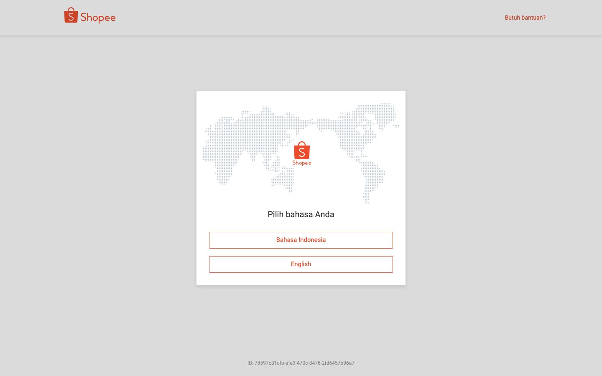

**대표 상품 이미지** (상위 6장, 출처 URL 포함)

-  — 출처 <https://deo.shopeemobile.com/shopee/shopee-pcmall-live-sg/assets/1c8bdaaf45e1fd48.png>

**페이지 메타 정보**

| page | title | description |
|---|---|---|
| [`home`](https://shopee.co.id/verify/traffic/error?home_url=https%3A%2F%2Fshopee.co.id&is_logged_in=false&next=https%3A%2F%2Fshopee.co.id%2F&tracking_id=78597c31cfb-afe3-470c-8476-2fd6457b96a7&type=4) | Shopee Indonesia | Situs Belanja Online Terlengkap & Terpercaya |  |

#### [Tokopedia](https://www.tokopedia.com/)

- URL: <https://www.tokopedia.com/>
- 페이지: **OK 0 · FAIL 1**

**실패 페이지**

- `home` — playwright_error: Error: Page.goto: net::ERR_HTTP2_PROTOCOL_ERROR at https://www.tokopedia.com/
Call log:
  - navigating to "https://www.tokopedia.com/", waiting until "domcontentloaded"

#### [Zalora Indonesia](https://www.zalora.co.id/)

- URL: <https://www.zalora.co.id/>
- 페이지: **OK 1 · FAIL 0**

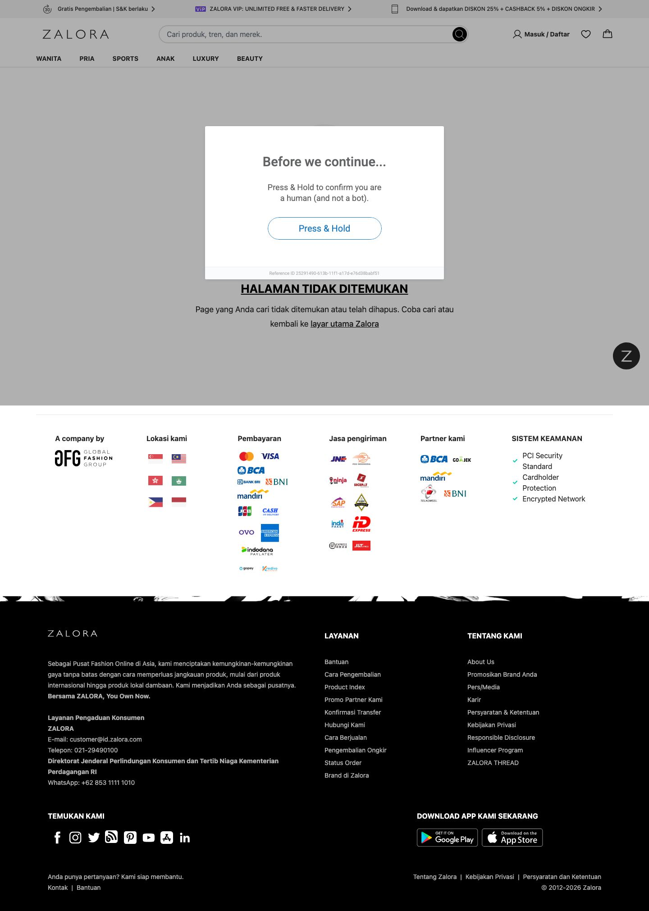

**대표 상품 이미지** (상위 6장, 출처 URL 포함)

-  — 출처 <https://static-id.zacdn.com/next-assets/static-assets/images/logo/icon_mastercard.png>
-  — 출처 <https://static-id.zacdn.com/next-assets/static-assets/images/logo/icon_visa.png>
-  — 출처 <https://static-id.zacdn.com/next-assets/static-assets/images/logo/icon_ovo.png>

**페이지 메타 정보**

| page | title | description |
|---|---|---|
| [`new_women`](https://www.zalora.co.id/wanita/new-arrivals) | Halaman tidak ditemukan | ZALORA |  |

### 4.2 일본 _( Japan )_

- 한국 수출규모 순위: **#2** · region: `asia` · tier `1` · currency `JPY`
- 수집 사이트: **5개** (성공 4)
- 메모: K-패션 선호도 높고 온라인 패션몰 발달
#### [GU Japan](https://www.gu-global.com/jp/)

- URL: <https://www.gu-global.com/jp/>
- 페이지: **OK 1 · FAIL 0**

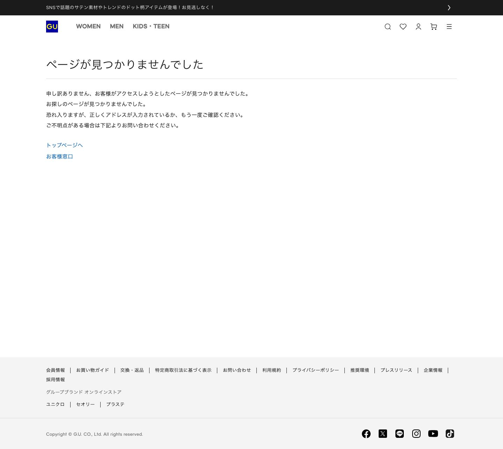

**대표 상품 이미지** (상위 6장, 출처 URL 포함)

- 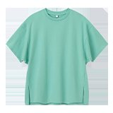 — 출처 <https://image.uniqlo.com/GU/ST3/jp/imagesother/Navigation/WOMEN_Category/2026/260513/Category_w_Half-Tshirt.png>
-  — 출처 <https://image.uniqlo.com/GU/ST3/jp/imagesother/Navigation/WOMEN_Category/2026/260515/Category_w_Tshirt.png>
-  — 출처 <https://image.uniqlo.com/GU/ST3/jp/imagesother/Navigation/WOMEN_Category/2026/260513/Category_w_Knit-Cardigan.png>
-  — 출처 <https://image.uniqlo.com/GU/ST3/jp/imagesother/Navigation/WOMEN_Category/2026/260513/Category_w_onepeace.png>
-  — 출처 <https://image.uniqlo.com/GU/ST3/jp/imagesother/Navigation/WOMEN_Category/2026/260513/Category_w_Sweat.png>
-  — 출처 <https://image.uniqlo.com/GU/ST3/jp/imagesother/Navigation/WOMEN_Category/2026/260513/Category_w_Outer.png>

**페이지 메타 정보**

| page | title | description |
|---|---|---|
| [`new_arrivals`](https://www.gu-global.com/jp/ja/not-found) | 申し訳ありません、お客様がアクセスしようとしたページが見つかりませんでした。恐れ入りますが、正しくアドレスが入力されているか、もう一度ご確認ください。 | ジーユー | 申し訳ありません、お客様がアクセスしようとしたページが見つかりませんでした。恐れ入りますが、正しくアドレスが入力されているか、もう一度ご確認ください。 |

#### [Rakuten Fashion](https://brandavenue.rakuten.co.jp/)

- URL: <https://brandavenue.rakuten.co.jp/>
- 페이지: **OK 1 · FAIL 1**

**대표 상품 이미지** (상위 6장, 출처 URL 포함)

-  — 출처 <https://brandavenue.r10s.jp/img/library/index/sbn_flagshipstore_20231003.png>
- 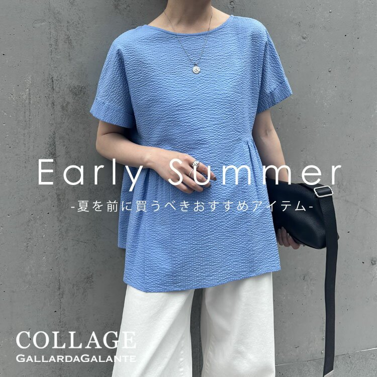 — 출처 <https://brandavenue.r10s.jp/img/news/01/377747/pc_n.jpg>
- 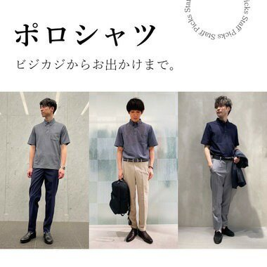 — 출처 <https://brandavenue.r10s.jp/img/news/01/376408/pc_n.jpg>
- 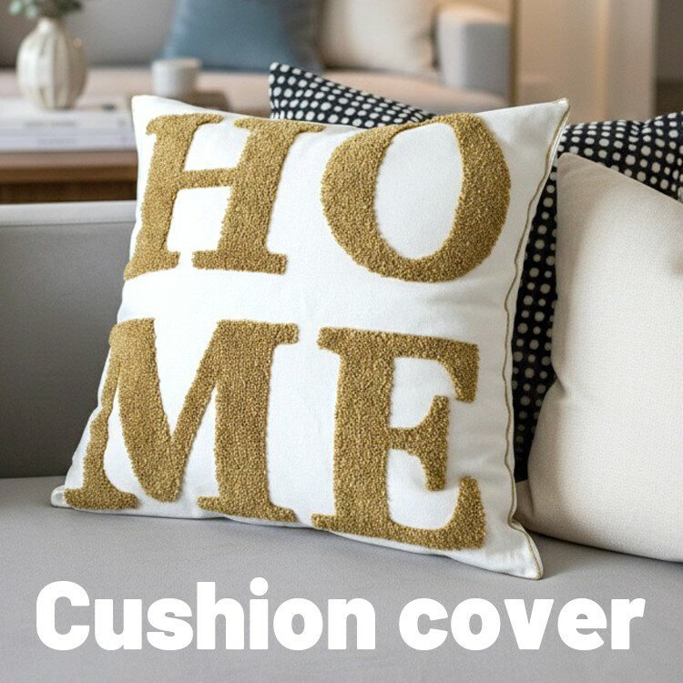 — 출처 <https://brandavenue.r10s.jp/img/news/01/378137/pc_n.jpg>
- 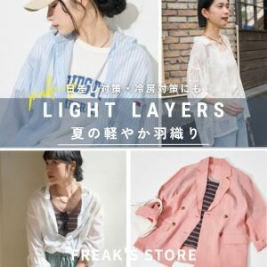 — 출처 <https://brandavenue.r10s.jp/img/news/01/377692/pc_n.jpg>
- 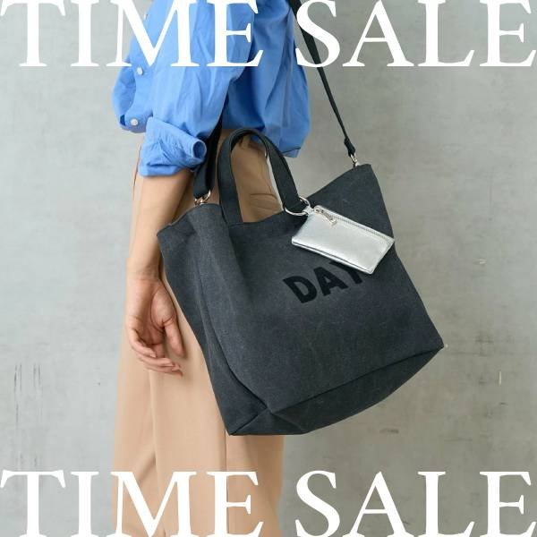 — 출처 <https://brandavenue.r10s.jp/img/news/01/378204/pc_n.jpg>

**페이지 메타 정보**

| page | title | description |
|---|---|---|
| [`men`](https://brandavenue.rakuten.co.jp/men/) | MEN | ファッション通販 Rakuten Fashion(楽天ファッション／旧楽天ブランドアベニュー) | Rakuten Fashion(楽天ファッション)は人気ブランドを取り扱うファッション通販サイトです。新作アイテム続々入荷！セール商品やクーポン対象商品も豊富。／税込3,980円以上購入で送料無料／楽天ポイントが使えて貯まる！ |

**실패 페이지**

- `women` — http_status_404

#### [Uniqlo Japan](https://www.uniqlo.com/jp/)

- URL: <https://www.uniqlo.com/jp/>
- 페이지: **OK 1 · FAIL 0**

**페이지 메타 정보**

| page | title | description |
|---|---|---|
| [`new_arrivals`](https://www.uniqlo.com/jp/ja/contents/feature/new-arrivals/) | 404 Not Found |  |

#### [WEAR](https://wear.jp/)

- URL: <https://wear.jp/>
- 페이지: **OK 1 · FAIL 0**

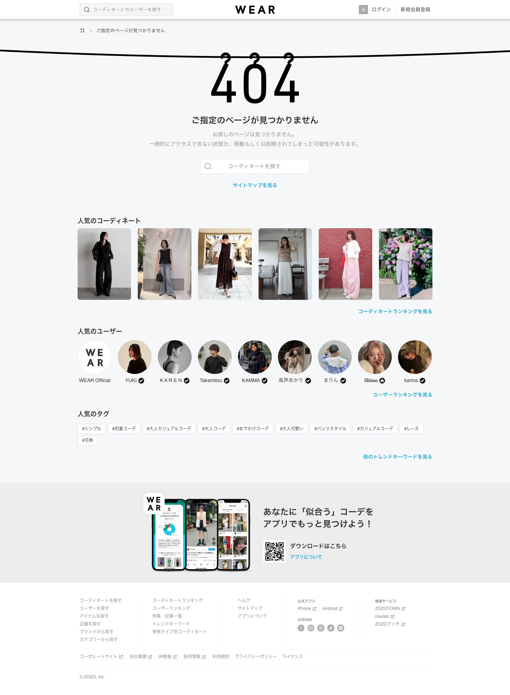

**대표 상품 이미지** (상위 6장, 출처 URL 포함)

-  — 출처 <https://wear.jp/public/_next/static/media/notfound_bg.0mfqf_sjjg4.q.png>
-  — 출처 <https://wear.jp/public/_next/static/media/notfound_4.0h3~tstn7vy~q.png>
-  — 출처 <https://wear.jp/public/_next/static/media/notfound_0.17sfauikqe-ig.png>
- 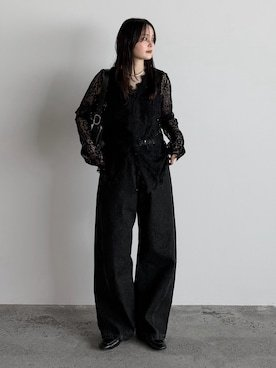 — 출처 <https://images.wear2.jp/coordinate/ekiqYE0j/nOGqgvrA/1780665334_276.jpg>
- 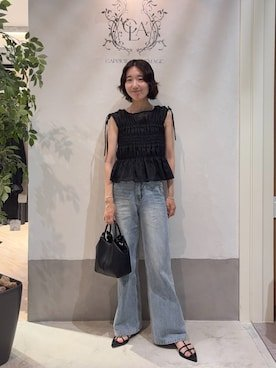 — 출처 <https://images.wear2.jp/coordinate/OwibGv42/IIPzwsW1/1780501958_276.jpg>
- 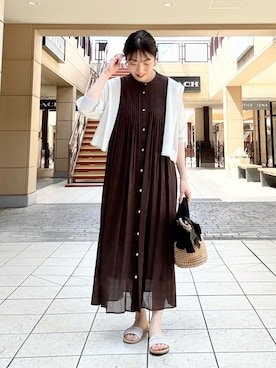 — 출처 <https://images.wear2.jp/coordinate/m0iAM4dw/eERXs4Dw/1780690562_276.jpg>

**페이지 메타 정보**

| page | title | description |
|---|---|---|
| [`ranking`](https://wear.jp/ranking/coordinate/) | ご指定のページが見つかりません - WEAR |  |

#### [ZOZOTOWN](https://zozo.jp/)

- URL: <https://zozo.jp/>
- 페이지: **OK 0 · FAIL 2**

**실패 페이지**

- `new` — playwright_error: TimeoutError: Page.goto: Timeout 30000ms exceeded.
Call log:
  - navigating to "https://zozo.jp/category/new/", waiting until "domcontentloaded"

- `ranking` — playwright_error: TimeoutError: Page.goto: Timeout 30000ms exceeded.
Call log:
  - navigating to "https://zozo.jp/ranking/", waiting until "domcontentloaded"

### 4.3 한국 _( South Korea )_

- 한국 수출규모 순위: **#30** · region: `asia` · tier `1` · currency `KRW`
- 수집 사이트: **4개** (성공 3)
- 메모: 비교 기준 (자국). 국내 사업동향 센싱
#### [29CM](https://www.29cm.co.kr/)

- URL: <https://www.29cm.co.kr/>
- 페이지: **OK 1 · FAIL 0**

**최근 유행 상품** (47건 · 상품명 클릭 시 해당 사이트로 이동)

| # | 상품명 | 브랜드 | 가격 | 페이지 |
|---:|---|---|---:|---|
| 1 | [Lithe v-neck tee (slate gray)](https://product.29cm.co.kr/catalog/4025614) | 프렙포더 | 63,190 KRW | `home` |
| 2 | [Whisper scarf V knit (espresso)](https://product.29cm.co.kr/catalog/4025623) | 프렙포더 | 84,490 KRW | `home` |
| 3 | [[2nd] Lithe v-neck tee (mahogany)](https://product.29cm.co.kr/catalog/4025615) | 프렙포더 | 63,190 KRW | `home` |
| 4 | [스누피와 형제들 핸드메이드 쿠키 틴케이스](https://product.29cm.co.kr/catalog/3991250) | 유어네이키드치즈 | 64,550 KRW | `home` |
| 5 | [투명 하트 비치볼 러비볼](https://product.29cm.co.kr/catalog/3838288) | 마이리틀데이지 | 8,520 KRW | `home` |
| 6 | [아기 러비튜브 투명 하트 물놀이튜브](https://product.29cm.co.kr/catalog/3838281) | 마이리틀데이지 | 24,360 KRW | `home` |
| 7 | [아기 마리카튜브 물놀이용품 자동차 보행기 튜브](https://product.29cm.co.kr/catalog/3838257) | 마이리틀데이지 | 32,380 KRW | `home` |
| 8 | [유아 순면 100% 논슬립 방수패드 (아기침대/S/SS)](https://product.29cm.co.kr/catalog/3839835) | 마이리틀데이지 | 10,160 KRW | `home` |
| 9 | [유아 허그 스윔캡 수영 캡모자 (S/M)](https://product.29cm.co.kr/catalog/3838370) | 마이리틀데이지 | 22,010 KRW | `home` |
| 10 | [유아 허그 래쉬가드 상하의 세트 일체형 (XS/S/M/L)](https://product.29cm.co.kr/catalog/3838365) | 마이리틀데이지 | 32,380 KRW | `home` |
| 11 | [[29cm단독] 접시 21cm  세이지그린](https://product.29cm.co.kr/catalog/3941565) | 알라바스터 | 19,880 KRW | `home` |
| 12 | [[29cm 단독] 접시 16cm 세이지그린](https://product.29cm.co.kr/catalog/3941566) | 알라바스터 | 15,910 KRW | `home` |
| 13 | [[29cm 단독] 컵 300ml 세이지그린](https://product.29cm.co.kr/catalog/3941561) | 알라바스터 | 15,910 KRW | `home` |
| 14 | [플룸 2인 세트 Floom 2 Person Set](https://product.29cm.co.kr/catalog/3867376) | 무자기 | 183,890 KRW | `home` |
| 15 | [3종 꽃 접시 세트 Flower 3type gift set](https://product.29cm.co.kr/catalog/2379557) | 무자기 | 46,860 KRW | `home` |
| 16 | [[29CM 단독] 29잎 버드 보울 Flower 29 bud bowl](https://product.29cm.co.kr/catalog/3411361) | 무자기 | 26,980 KRW | `home` |
| 17 | [[1+1] 쓰임 에센셜 컬러 도자식판 세트](https://product.29cm.co.kr/catalog/3068487) | 쓰임 | 39,000 KRW | `home` |
| 18 | [쓰임 에센셜 컬러도자식판 나눔 플레이트 세트 (핑크)](https://product.29cm.co.kr/catalog/3005562) | 쓰임 | 19,100 KRW | `home` |
| 19 | [쓰임 에센셜 컬러 도자식판 나눔 플레이트 세트 (옐로우)](https://product.29cm.co.kr/catalog/3005557) | 쓰임 | 19,100 KRW | `home` |
| 20 | [제니퍼룸X위글위글 멀티 쿠커](https://product.29cm.co.kr/catalog/4029832) | 위글위글 | 60,120 KRW | `home` |

**대표 상품 이미지** (상위 6장, 출처 URL 포함)

- 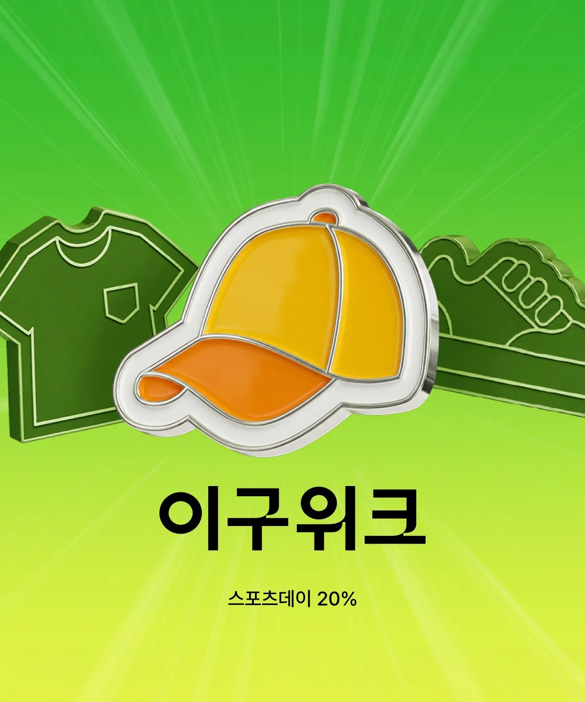 — 출처 <https://img.29cm.co.kr/cms/202606/11f15fb8333b479f90909f5e387fbbc4.png?width=3840&format=webp>
-  — 출처 <https://img.29cm.co.kr/cms/202606/11f15fb820eba0cf9f7fe5a1c786f6f4.png?width=3840&format=webp>
-  — 출처 <https://img.29cm.co.kr/cms/202606/11f15fb8122cc14b9090d98429bd9b4e.png?width=3840&format=webp>
-  — 출처 <https://img.29cm.co.kr/cms/202606/11f15fb7f705c4599f7f75bb5f150aca.png?width=3840&format=webp>
- 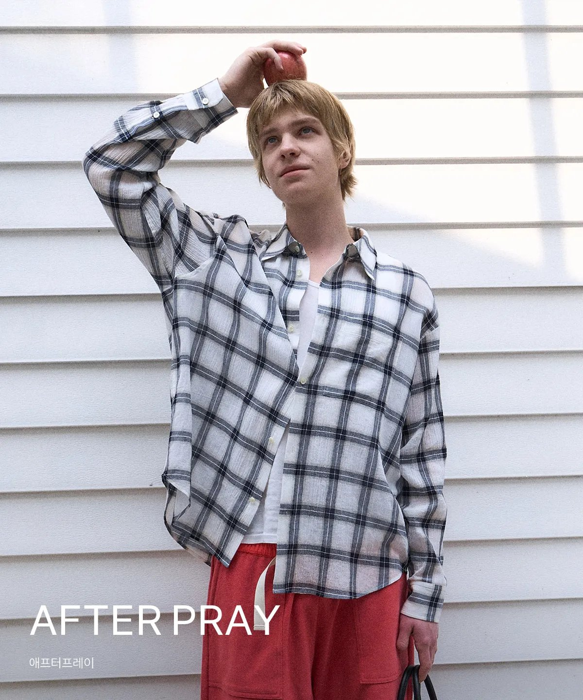 — 출처 <https://img.29cm.co.kr/cms/202606/11f15fb7e283d3e99f7f2f175f9cc2eb.png?width=3840&format=webp>
- 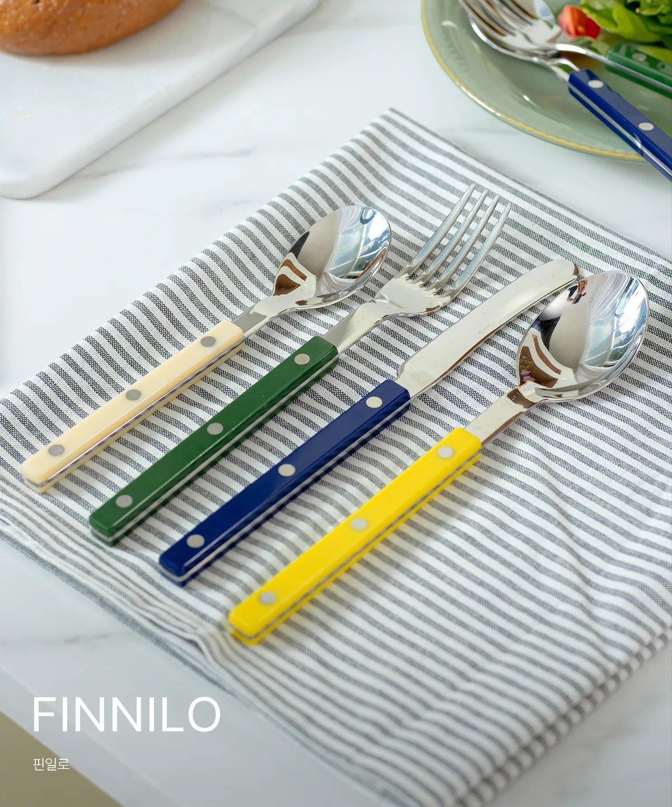 — 출처 <https://img.29cm.co.kr/cms/202606/11f15fb7d54839179090752885093fa0.png?width=3840&format=webp>

**페이지 메타 정보**

| page | title | description |
|---|---|---|
| [`home`](https://www.29cm.co.kr/) | 감도 깊은 취향 셀렉트샵 29CM | 패션, 라이프스타일, 컬처까지 29CM만의 감도 깊은 셀렉션을 만나보세요. |

#### [Musinsa](https://www.musinsa.com/)

- URL: <https://www.musinsa.com/>
- 페이지: **OK 0 · FAIL 1**

**실패 페이지**

- `home` — robots_disallowed

#### [W Concept](https://www.wconcept.co.kr/)

- URL: <https://www.wconcept.co.kr/>
- 페이지: **OK 1 · FAIL 0**

**최근 유행 상품** (30건 · 상품명 클릭 시 해당 사이트로 이동)

| # | 상품명 | 브랜드 | 가격 | 페이지 |
|---:|---|---|---:|---|
| 1 | [[IO7843-002] W NIKE SHOX Z](https://m.wconcept.co.kr/Product/308471089) | 나이키 | 118,932 KRW | `home` |
| 2 | [[IB5824-001] W NIKE AIR SUPERFLY](https://m.wconcept.co.kr/Product/306571567) | 나이키 | 79,464 KRW | `home` |
| 3 | [[IB8881-001] WMNS NIKE AIR RIFT BR](https://m.wconcept.co.kr/Product/308128408) | 나이키 | 118,932 KRW | `home` |
| 4 | [[FV1920-001] WMNS NIKE AIR MAX MUSE](https://m.wconcept.co.kr/Product/306274946) | 나이키 | 149,688 KRW | `home` |
| 5 | [[HQ7540-003] W NIKE SHOX Z](https://m.wconcept.co.kr/Product/308470389) | 나이키 | 118,932 KRW | `home` |
| 6 | [[HJ9651-001] W AIR MAX KOKO SANDAL SE](https://m.wconcept.co.kr/Product/306913864) | 나이키 | 85,624 KRW | `home` |
| 7 | [[IH2037-100] AIR ZOOM SPIRIDON CAGE 2](https://m.wconcept.co.kr/Product/306908583) | 나이키 | 128,744 KRW | `home` |
| 8 | [[IM7453-667] AS W NSW LS JERSEY](https://m.wconcept.co.kr/Product/307532155) | 나이키 | 55,616 KRW | `home` |
| 9 | [[HQ7540-002] W NIKE SHOX Z](https://m.wconcept.co.kr/Product/307473667) | 나이키 | 95,146 KRW | `home` |
| 10 | [[AR3566-002] W NIKE SHOX TL](https://m.wconcept.co.kr/Product/305940436) | 나이키 | 163,812 KRW | `home` |
| 11 | [[IR5863-060] WMNS NIKE AIR RIFT LTR](https://m.wconcept.co.kr/Product/308471402) | 나이키 | 125,928 KRW | `home` |
| 12 | [[HM8286-001] W NIKE CORTEZ](https://m.wconcept.co.kr/Product/306914150) | 나이키 | 79,464 KRW | `home` |
| 13 | [[IQ3446-010] W NIKE ASTRA ULTRA PRM](https://m.wconcept.co.kr/Product/308328115) | 나이키 | 125,928 KRW | `home` |
| 14 | [[IR1226-001] WMNS NIKE AIR RIFT](https://m.wconcept.co.kr/Product/308597858) | 나이키 | 118,008 KRW | `home` |
| 15 | [[HF3227-100] W LD-1000](https://m.wconcept.co.kr/Product/306393019) | 나이키 | 73,788 KRW | `home` |
| 16 | [[IR1226-002] WMNS NIKE AIR RIFT](https://m.wconcept.co.kr/Product/308597780) | 나이키 | 118,008 KRW | `home` |
| 17 | [[IV4690-099] W NIKE AIR MAX PHENOMENA](https://m.wconcept.co.kr/Product/308471678) | 나이키 | 149,688 KRW | `home` |
| 18 | [[IM7595-001] WMNS NIKE T90](https://m.wconcept.co.kr/Product/307646939) | 나이키 | 97,856 KRW | `home` |
| 19 | [[HJ0281-133] AS W NSW STREET SS GX JRSY TOP](https://m.wconcept.co.kr/Product/306841786) | 나이키 | 60,984 KRW | `home` |
| 20 | [[IR5687-395] W NIKE ASTROGRABBER TXT FMME](https://m.wconcept.co.kr/Product/308471261) | 나이키 | 118,008 KRW | `home` |

**페이지 메타 정보**

| page | title | description |
|---|---|---|
| [`home`](https://www.wconcept.co.kr/) | _(empty)_ |  |

#### [Zigzag](https://zigzag.kr/)

- URL: <https://zigzag.kr/>
- 페이지: **OK 1 · FAIL 0**

**최근 유행 상품** (36건 · 상품명 클릭 시 해당 사이트로 이동)

| # | 상품명 | 브랜드 | 가격 | 페이지 |
|---:|---|---|---:|---|
| 1 | [[여름바지🌴/50만장돌파/made] 허쉬 코튼 와이드팬츠 (숏/기본/롱)](https://store.zigzag.kr/app/catalog/products/143224732?browsing_type=NATIVE_BROWSER) | 리얼코코 | 17,910 KRW | `home` |
| 2 | [[🏆역대급100만장/썸머XL추가!] made. 마켓 와이드 트레이닝슬랙스 (+숏/베이직/롱ver) - 4 size](https://store.zigzag.kr/app/catalog/products/141360158?browsing_type=NATIVE_BROWSER) | 슬로우앤드 | 26,320 KRW | `home` |
| 3 | [[화사PICK/직진] 에르고핏 모달골지 끈 나시탑](https://store.zigzag.kr/app/catalog/products/167658850?browsing_type=NATIVE_BROWSER) | 컴포트랩 | 26,540 KRW | `home` |
| 4 | [스킨 레이어 핏 파운데이션 (8colors) 🚀직진배송🚀](https://store.zigzag.kr/app/catalog/products/149419525?browsing_type=NATIVE_BROWSER) | 어바웃톤 | 22,000 KRW | `home` |
| 5 | [[🔥여름바지/골반뽕탈부착][3만장돌파]렌더 하이웨스트 코튼 부츠컷 팬츠 (숏/롱ver)(5color)](https://store.zigzag.kr/app/catalog/products/162075326?browsing_type=NATIVE_BROWSER) | 프렌치오브 | 26,790 KRW | `home` |
| 6 | [[+반팔💙/하객룩/made] 드멜린 블라우스](https://store.zigzag.kr/app/catalog/products/160291434?browsing_type=NATIVE_BROWSER) | 리얼코코 | 25,530 KRW | `home` |
| 7 | [[여름투피스🌴/허리잘록/체형커버][MADE]엘비드 랩 셔츠+밴딩 롱스커트set (44~110) (빅사이즈투피스-세트-랩셔츠-롤업셔츠-반팔셔츠-자수-밴딩스커트-데일리룩-데이트룩)](https://store.zigzag.kr/app/catalog/products/170106735?browsing_type=NATIVE_BROWSER) | 핫핑 | 42,320 KRW | `home` |
| 8 | [[🌸사계절필수/인생티♥] made. 솔트 클린 반팔티셔츠 (스탠다드핏/루즈핏) - 7 color](https://store.zigzag.kr/app/catalog/products/141373178?browsing_type=NATIVE_BROWSER) | 슬로우앤드 | 12,510 KRW | `home` |
| 9 | [[✨살안타템] made. 플레인 여리핏 썸머가디건 - 6 color](https://store.zigzag.kr/app/catalog/products/141374160?browsing_type=NATIVE_BROWSER) | 슬로우앤드 | 28,720 KRW | `home` |
| 10 | [[✨구김걱정NO/💐하객룩추천] made. 세미부츠컷 찰랑슬랙스 (+베이직/롱ver) - 4 size](https://store.zigzag.kr/app/catalog/products/142355088?browsing_type=NATIVE_BROWSER) | 슬로우앤드 | 31,120 KRW | `home` |
| 11 | [[💗기본템/부유방커버] made. 쫀쫀 커버핏 슬리브리스 (유교걸나시!) - 7 color](https://store.zigzag.kr/app/catalog/products/160291278?browsing_type=NATIVE_BROWSER) | 슬로우앤드 | 15,210 KRW | `home` |
| 12 | [[🔥후기인증팬츠] made. 나스 디테일러 와이드팬츠 (+베이직/롱ver) - 4 size](https://store.zigzag.kr/app/catalog/products/140796259?browsing_type=NATIVE_BROWSER) | 슬로우앤드 | 35,200 KRW | `home` |
| 13 | [[S-L/5만장돌파🏆/made] 모티브 핀턱 슬랙스](https://store.zigzag.kr/app/catalog/products/141911042?browsing_type=NATIVE_BROWSER) | 리얼코코 | 17,910 KRW | `home` |
| 14 | [[여름청바지👖/3단기장/made] 시그니처 논페이드 데님 팬츠](https://store.zigzag.kr/app/catalog/products/158971418?browsing_type=NATIVE_BROWSER) | 리얼코코 | 17,910 KRW | `home` |
| 15 | [(Vintage)Punching u neck lace knit](https://store.zigzag.kr/app/catalog/products/170195676?browsing_type=NATIVE_BROWSER) | 팜므뮤즈 | 15,600 KRW | `home` |
| 16 | [[3타입][무지/배색/스트라이프][MADE] 러브유 보트넥 레이어드 민소매 골지나시 (44~110) (빅사이즈나시-끈나시-민소매-무지나시-스트라이프나시--부유방커버나시)](https://store.zigzag.kr/app/catalog/products/159214859?browsing_type=NATIVE_BROWSER) | 핫핑 | 15,120 KRW | `home` |
| 17 | [[포멜로]모디 퍼프 반팔 블라우스](https://store.zigzag.kr/app/catalog/products/170207355?browsing_type=NATIVE_BROWSER) | 헬로마틸다 | 45,600 KRW | `home` |
| 18 | [화이트 로즈 블라우스 1color   데일리룩/러블리/데이트룩/소개팅룩/여름블라우스/장마룩](https://store.zigzag.kr/app/catalog/products/170207698?browsing_type=NATIVE_BROWSER) | 파인땡큐 | 25,600 KRW | `home` |
| 19 | [[여름청바지👖/후기최고] made. 투데이 썸머라이트 데님팬츠 (+베이직/롱ver) - 4 size](https://store.zigzag.kr/app/catalog/products/122809429?browsing_type=NATIVE_BROWSER) | 슬로우앤드 | 26,820 KRW | `home` |
| 20 | [[🔥후기인증/🎖️1등슬랙스] made. 모먼트 투커버 올데이슬랙스 (+숏/베이직/롱ver) - 4 size](https://store.zigzag.kr/app/catalog/products/136095576?browsing_type=NATIVE_BROWSER) | 슬로우앤드 | 31,840 KRW | `home` |

**대표 상품 이미지** (상위 6장, 출처 URL 포함)

- 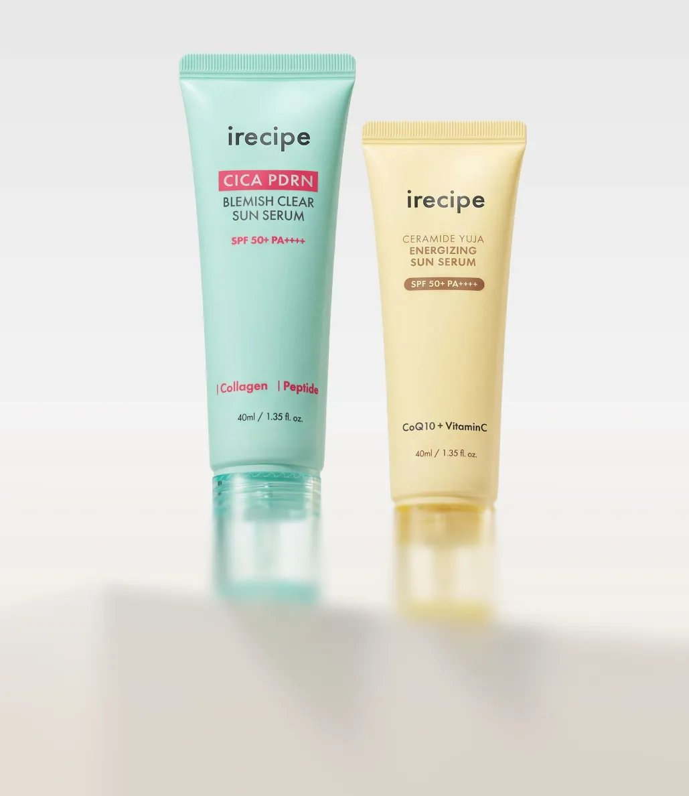 — 출처 <https://cf.image-farm.s.zigzag.kr/original/cms/2026/05/27/202605270752509302_032440.jpg?format=webp&quality=80&width=1029&height=1188>
-  — 출처 <https://cf.image-farm.s.zigzag.kr/original/cms/2026/05/28/202605280659297199_020325.jpg?width=1029&height=1188&quality=80&format=webp&transparent=true>
-  — 출처 <https://cf.image-farm.s.zigzag.kr/original/cms/2026/05/29/202605290757182162_086111.jpg?width=1029&height=1188&quality=80&format=webp&transparent=true>
-  — 출처 <https://cf.image-farm.s.zigzag.kr/original/cms/2026/06/02/202606020929143571_029583.png?quality=80&format=webp&transparent=true&width=1029&height=1188>
- 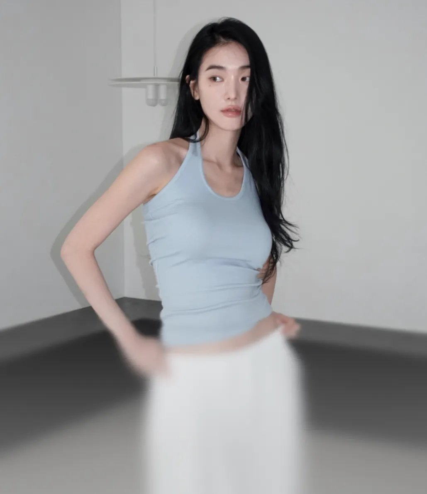 — 출처 <https://cf.image-farm.s.zigzag.kr/original/cms/2026/05/28/202605282357559014_054505.png?quality=80&format=webp&transparent=true&width=1029&height=1188>
- 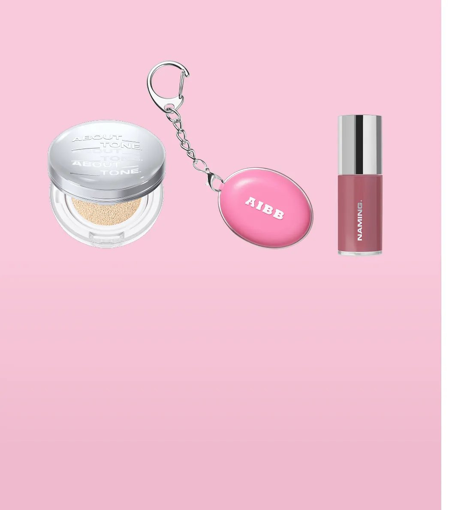 — 출처 <https://cf.image-farm.s.zigzag.kr/original/cms/2026/05/31/202605311335185701_061904.jpg?format=webp&quality=80&width=1029&height=1188>

**페이지 메타 정보**

| page | title | description |
|---|---|---|
| [`home`](https://zigzag.kr/) | 지그재그 스토어 | 4,000만 여성이 선택한 올인원 쇼핑 앱 지그재그 - 제가 알아서 살게요. |

### 4.4 대만 _( Taiwan )_

- 한국 수출규모 순위: **#7** · region: `asia` · tier `1` · currency `TWD`
- 수집 사이트: **5개** (성공 4)
- 메모: K-패션 친화도 높음
#### [momo](https://www.momoshop.com.tw/)

- URL: <https://www.momoshop.com.tw/>
- 페이지: **OK 1 · FAIL 0**

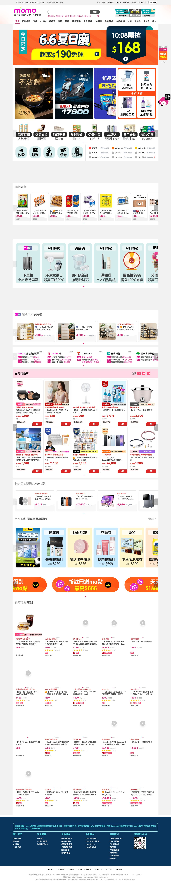

**대표 상품 이미지** (상위 6장, 출처 URL 포함)

-  — 출처 <https://img2.momoshop.com.tw/ecm/img/online/10/998/00/000/bt_0_271_01/bt_0_271_01_e2.jpg?t=1780055233125>
-  — 출처 <https://img1.momoshop.com.tw/ecm/img/online/10/998/00/000/bt_0_243_01/bt_0_243_01_e2.png?t=1780055160049>
-  — 출처 <https://img1.momoshop.com.tw/ecm/img/online/10/998/00/000/bt_0_245_01/bt_0_245_01_P1_3_e2.png?t=1780243216264>
- 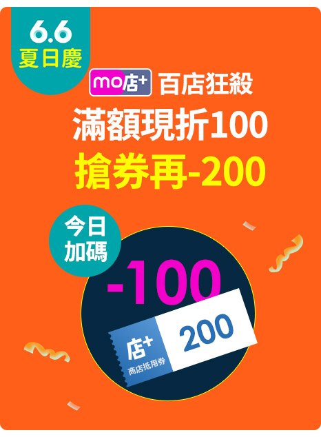 — 출처 <https://img1.momoshop.com.tw/ecm/img/online/81/998/00/000/mobile/bt_7_701_01/bt_7_701_01_e111.jpg?t=1780657166865>
- 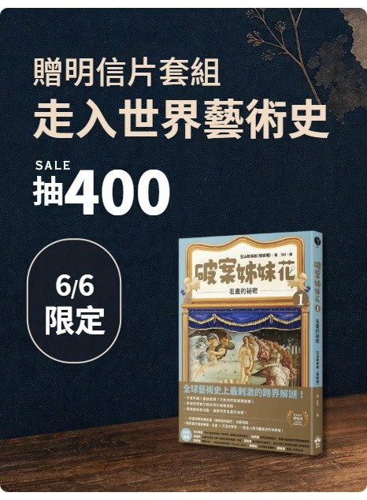 — 출처 <https://img1.momoshop.com.tw/ecm/img/online/81/998/00/000/mobile/bt_7_701_01/bt_7_701_01_e141.jpg?t=1780571873148>
-  — 출처 <https://img1.momoshop.com.tw/ecm/img/online/81/998/00/000/mobile/bt_7_701_01/bt_7_701_01_e161.jpg?t=1780571920032>

**페이지 메타 정보**

| page | title | description |
|---|---|---|
| [`home`](https://www.momoshop.com.tw/main/Main.jsp) | momo購物網 - 好評推薦 - 2026年6月 | momo購物網提供美妝保養、流行服飾、時尚精品、3C、數位家電、生活用品、美食旅遊票券…等數百萬件商品。快速到貨、超商取貨讓您購物最便利。mo店+商品抵用券天天搶、免運吃到飽，電視/直播商品限時下殺，每日讓您享超低價，並享有十天猶豫期；momo購物網為富邦及台灣大哥大關係企業 |

#### [OB Design](https://www.obdesign.com.tw/)

- URL: <https://www.obdesign.com.tw/>
- 페이지: **OK 1 · FAIL 0**

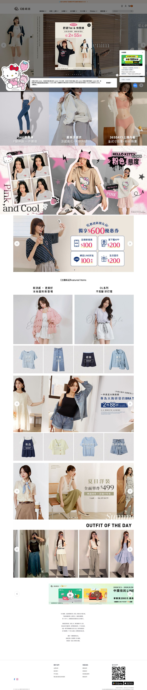

**대표 상품 이미지** (상위 6장, 출처 URL 포함)

-  — 출처 <https://cms-static.cdn.91app.com/images/original/41602/92f19e4d-89b7-4330-9570-02cf1dff9742-1779764649-w0s0fz0ca4_d_1920x820_1280x547_1124x480_800x342_600x256_400x171.jpg>
- 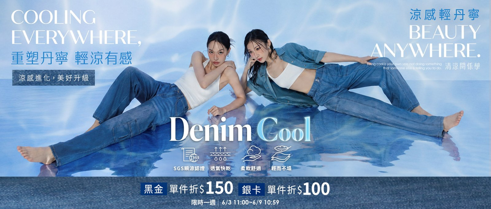 — 출처 <https://cms-static.cdn.91app.com/images/original/41602/92f19e4d-89b7-4330-9570-02cf1dff9742-1780452637-l3f8pt7f1z_d_1920x820_1280x547_1124x480_800x342_600x256_400x171.jpg>
-  — 출처 <https://cms-static.cdn.91app.com/images/compress/41602/92f19e4d-89b7-4330-9570-02cf1dff9742-1780452637-l3f8pt7f1z_d_400x171.webp>
- 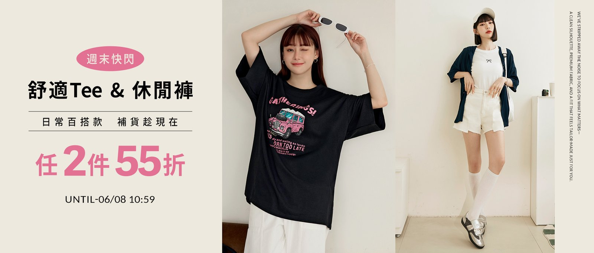 — 출처 <https://cms-static.cdn.91app.com/images/original/41602/92f19e4d-89b7-4330-9570-02cf1dff9742-1780538875-ya3boiusfj_d_1920x820_1280x547_1124x480_800x342_600x256_400x171.jpg>
-  — 출처 <https://cms-static.cdn.91app.com/images/compress/41602/92f19e4d-89b7-4330-9570-02cf1dff9742-1780538875-ya3boiusfj_d_400x171.webp>
-  — 출처 <https://cms-static.cdn.91app.com/images/original/41602/92f19e4d-89b7-4330-9570-02cf1dff9742-1780277063-a0d3jhklbp_d_1920x820_1280x547_1124x480_800x342_600x256_400x171.jpg>

**페이지 메타 정보**

| page | title | description |
|---|---|---|
| [`home`](https://www.obdesign.com.tw/) | OB嚴選｜高CP值人氣熱銷服飾，流行服飾品牌 | 你的日常穿搭好夥伴，快上OB嚴選找，OB嚴選提供女裝、孕童、運動、男裝各項流行服飾，秉持優質服務給你高CP值的購物體驗。各種風格都能滿足熱愛穿搭的你，天天上新品，快速出貨，一起加入OB style！網路人氣服飾品牌OB嚴選 |

#### [PChome](https://24h.pchome.com.tw/)

- URL: <https://24h.pchome.com.tw/>
- 페이지: **OK 0 · FAIL 1**

**실패 페이지**

- `home` — http_status_429

#### [Pinkoi Taiwan](https://www.pinkoi.com/)

- URL: <https://www.pinkoi.com/>
- 페이지: **OK 2 · FAIL 0**

**대표 상품 이미지** (상위 6장, 출처 URL 포함)

-  — 출처 <https://cdn04.pinkoi.com/pinkoi.site/logo/og_image.png>

**페이지 메타 정보**

| page | title | description |
|---|---|---|
| [`accessories`](https://en.pinkoi.com/) | Pinkoi | Asia’s cross-border design marketplace | Design the way you are | Shop for original design products from Asia's independent designers. Pinkoi lives and breathes great design, great quality, great service, a |
| [`bags`](https://en.pinkoi.com/) | Pinkoi | Asia’s cross-border design marketplace | Design the way you are | Shop for original design products from Asia's independent designers. Pinkoi lives and breathes great design, great quality, great service, a |

#### [Yahoo Taiwan Shopping](https://tw.buy.yahoo.com/)

- URL: <https://tw.buy.yahoo.com/>
- 페이지: **OK 1 · FAIL 0**

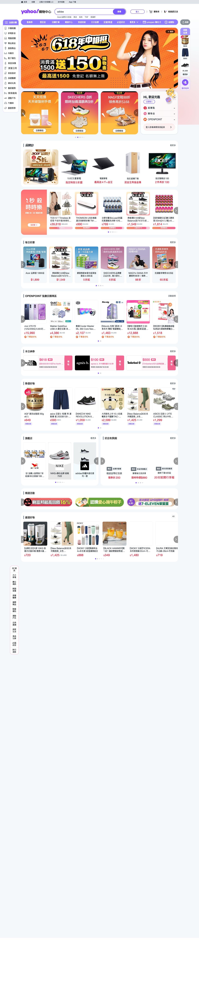

**대표 상품 이미지** (상위 6장, 출처 URL 포함)

-  — 출처 <https://img.yec.tw/zp/MerchandiseImages/42E1EA4A9A-Gd-12031900.jpg>
- 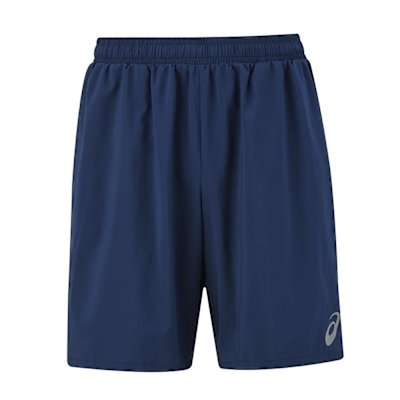 — 출처 <https://img.yec.tw/zp/MerchandiseImages/395781AA55-SP-20250272.jpg>
- 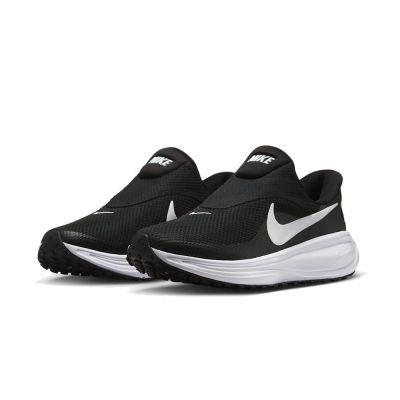 — 출처 <https://img.yec.tw/zp/MerchandiseImages/E43AAFF06A-SP-21269809.jpg>

**페이지 메타 정보**

| page | title | description |
|---|---|---|
| [`home`](https://tw.buy.yahoo.com/) | Yahoo購物中心 - 最懂生活的人 | 數百萬件商品，貼心客服為您服務，15天鑑賞期購物保障！ |

### 4.5 태국 _( Thailand )_

- 한국 수출규모 순위: **#8** · region: `asia` · tier `1` · currency `THB`
- 수집 사이트: **5개** (성공 5)
- 메모: 동남아 K-패션 핵심 시장
#### [Central Online](https://www.central.co.th/)

- URL: <https://www.central.co.th/>
- 페이지: **OK 1 · FAIL 0**

**대표 상품 이미지** (상위 6장, 출처 URL 포함)

-  — 출처 <https://www.central.co.th/_next/image?url=https%3A%2F%2Fassets.central.co.th%2Ffile-assets%2Fassets%2FCMS%2Fcampaign%2F2026%2F06jun%2F20260601_6.6_herobanner.jpg&w=3840&q=75>
-  — 출처 <https://www.central.co.th/_next/image?url=https%3A%2F%2Fassets.central.co.th%2Ffile-assets%2Fassets%2FCMS%2Fcampaign%2F2026%2F06jun%2F20260601_estee_heroweb.jpg&w=3840&q=75>
- 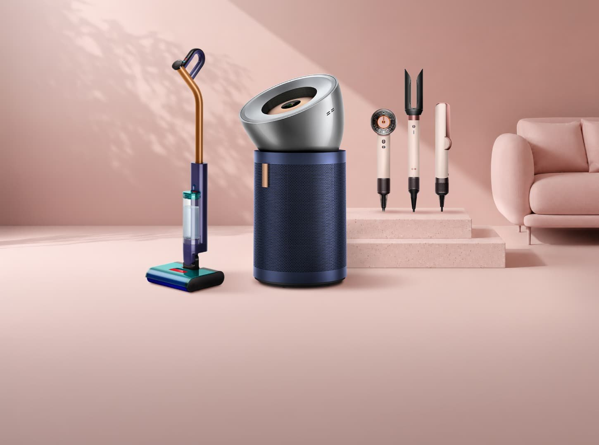 — 출처 <https://www.central.co.th/_next/image?url=https%3A%2F%2Fassets.central.co.th%2Ffile-assets%2Fassets%2FCMS%2Fcampaign%2F2026%2F06jun%2F20260601_dyson_heorweb_d.jpg&w=3840&q=75>
-  — 출처 <https://www.central.co.th/_next/image?url=%2Fimages%2Ffallback-image.webp&w=3840&q=75>
- 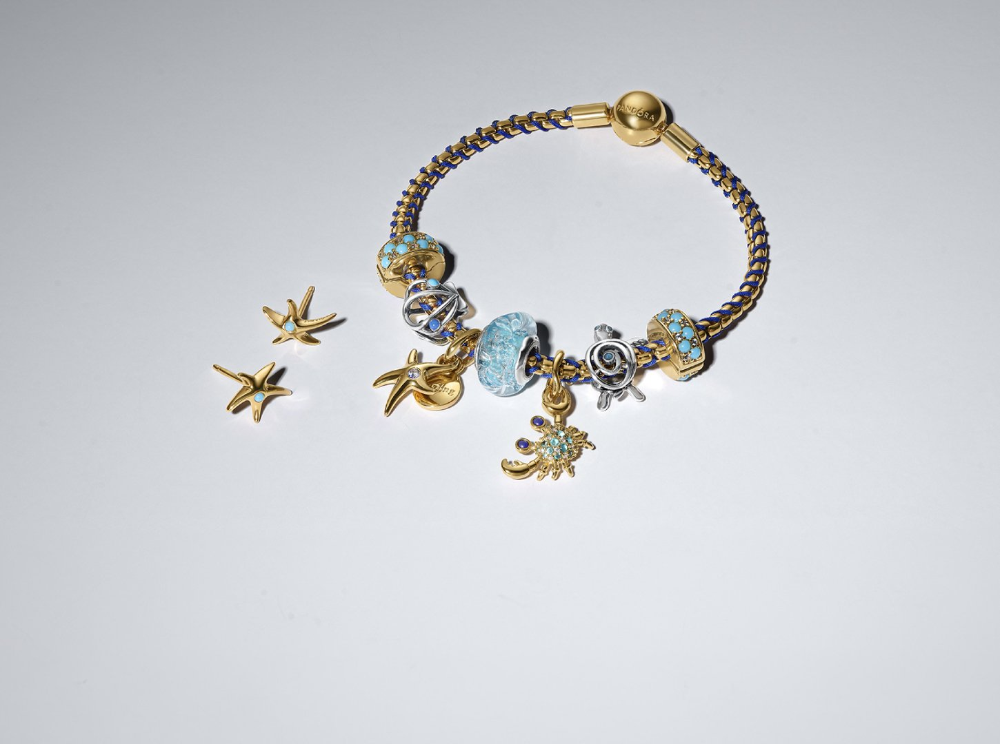 — 출처 <https://assets.central.co.th/file-assets/assets/CMS/campaign/2026/06jun/20260601_pandora_heroweb_d.jpg>
- 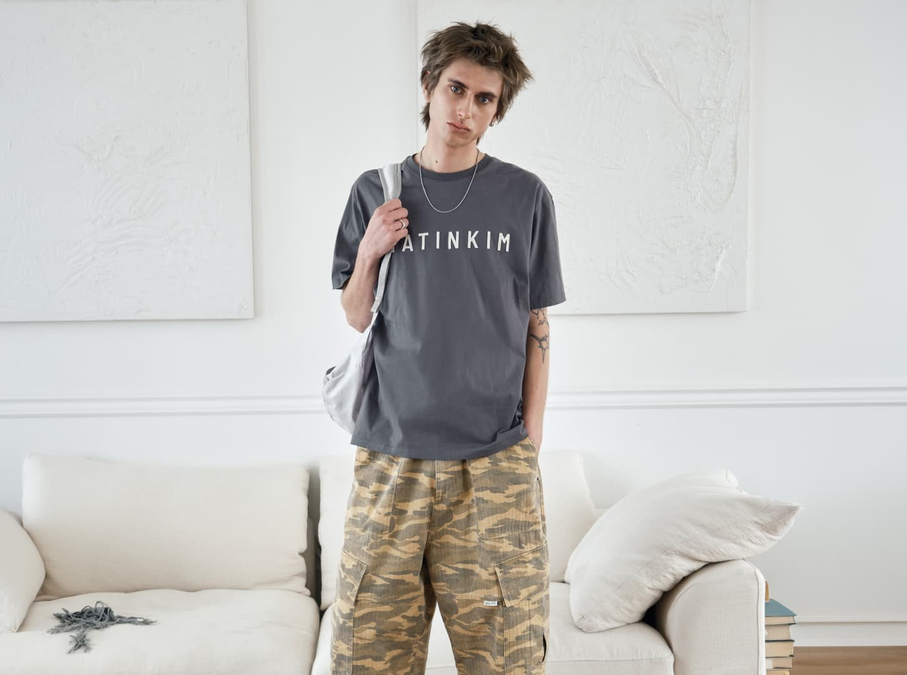 — 출처 <https://www.central.co.th/_next/image?url=https%3A%2F%2Fassets.central.co.th%2Ffile-assets%2Fassets%2FCMS%2Fcampaign%2F2026%2F06jun%2F20260601_Matin-Kim_heroweb_d.jpg&w=3840&q=75>

**페이지 메타 정보**

| page | title | description |
|---|---|---|
| [`home`](https://www.central.co.th/th) | Central Online | 6.6 | ลดสูงสุด 80% + คูปองลดเพิ่ม 14% | 6.6 Sale โปรโมชั่นสุดยิ่งใหญ่ของปี 2026 เริ่มต้นขึ้นแล้ว! พบกับสินค้าจากหลากหลายแบรนด์ดังที่เราคัดสรรมาลดราคาสูงสุดถึง 80% พร้อมคูปองลดเพิ่ม |

#### [Lazada Thailand Fashion](https://www.lazada.co.th/)

- URL: <https://www.lazada.co.th/>
- 페이지: **OK 1 · FAIL 0**

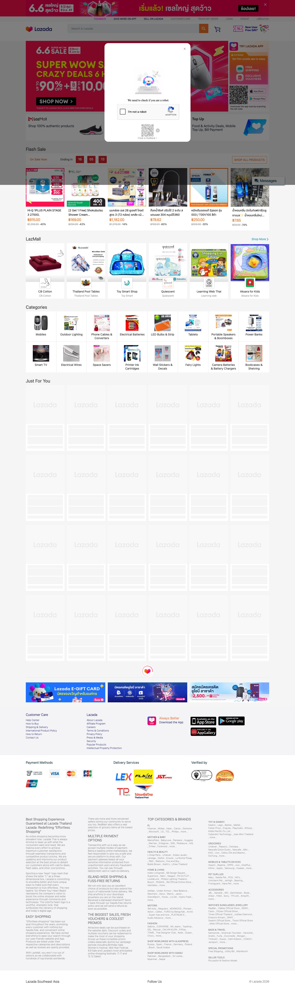

**대표 상품 이미지** (상위 6장, 출처 URL 포함)

-  — 출처 <https://img.lazcdn.com/us/domino/40845120240f19d13f738fa9a7978edd.png>
-  — 출처 <https://img.lazcdn.com/g/tps/images/ims-web/TB1KB2laMFY.1VjSZFnXXcFHXXa.png>
-  — 출처 <https://img.lazcdn.com/us/domino/254020bc-ab46-4e33-b0d4-a82446d0406a_TH-1976-688.jpg_2200x2200q80.jpg>
-  — 출처 <https://img.lazcdn.com/us/domino/5ea3664e-c271-4a22-8d86-6ef838eef8f4_TH-1976-688.jpg_2200x2200q80.jpg>
-  — 출처 <https://img.lazcdn.com/us/domino/b5abd353-62f4-43f3-8f2d-33586095d7aa_TH-1976-688.jpg_2200x2200q80.jpg>
-  — 출처 <https://img.lazcdn.com/us/domino/cb902ea1-8472-4c2c-884d-6972acadc7a7_TH-1976-688.jpg_2200x2200q80.jpg>

**페이지 메타 정보**

| page | title | description |
|---|---|---|
| [`home`](https://www.lazada.co.th/#?) | Lazada Thailand | ช้อปออนไลน์ สินค้าดี พร้อมดีลพิเศษทุกวัน | พบกับ Lazada แพลตฟอร์มช้อปปิ้งชั้นนำในอาเซียน พร้อมบริการเก็บเงินปลายทาง LazMall LazFlash และดีลเด็ดจากแบรนด์ดังทุกวัน |

#### [Pomelo](https://www.pomelofashion.com/)

- URL: <https://www.pomelofashion.com/>
- 페이지: **OK 2 · FAIL 0**

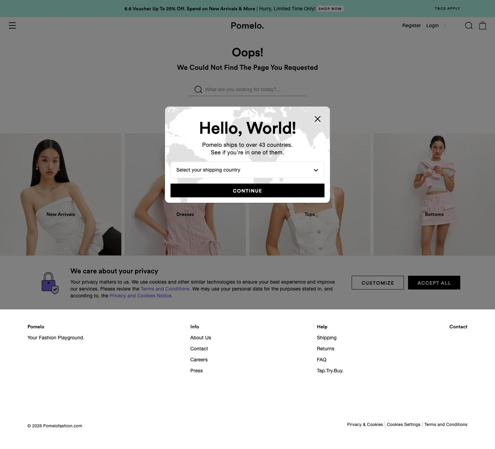

**대표 상품 이미지** (상위 6장, 출처 URL 포함)

-  — 출처 <https://cdn.pomelofashion.com/img/nav/3271/c/7422/20260428100935_69f024efaf715_banner-image.jpg?auto=compress,format&fm=webp,jpg,png&w=375&h=100>
-  — 출처 <https://cdn.pomelofashion.com/img/nav/3271/c/7419/20260302182158_69a572d670875_banner-image.jpg?auto=compress,format&fm=webp,jpg,png&w=375&h=100>
-  — 출처 <https://cdn.pomelofashion.com/img/nav/3271/c/88/20250620125126_6854f6de2dc98_banner-image.jpg?auto=compress,format&fm=webp,jpg,png&w=375&h=100>
-  — 출처 <https://cdn.pomelofashion.com/img/nav/3271/c/7420/20260312173657_69b297499ac84_banner-image.jpg?auto=compress,format&fm=webp,jpg,png&w=375&h=100>
-  — 출처 <https://cdn.pomelofashion.com/img/nav/3271/c/7418/20260216172249_6992eff96d8e5_banner-image.jpg?auto=compress,format&fm=webp,jpg,png&w=375&h=100>
-  — 출처 <https://cdn.pomelofashion.com/img/nav/3271/c/3658/20250620125237_6854f725c93d4_banner-image.jpg?auto=compress,format&fm=webp,jpg,png&w=375&h=100>

**페이지 메타 정보**

| page | title | description |
|---|---|---|
| [`new`](https://pomelofashion.com/global/en/collections/new-arrivals) | POMELO Fashion | Get all the latest fashion, updated twice every week! - Pomelo | Shop the latest fashion at POMELO fashion. Designed and manufactured in house for quality and style. Dresses, tops, knits, jackets, denim, a |
| [`best`](https://pomelofashion.com/global/en/collections/best-sellers) | POMELO Fashion | Get all the latest fashion, updated twice every week! - Pomelo | Shop the latest fashion at POMELO fashion. Designed and manufactured in house for quality and style. Dresses, tops, knits, jackets, denim, a |

#### [Shopee Thailand Fashion](https://shopee.co.th/)

- URL: <https://shopee.co.th/>
- 페이지: **OK 1 · FAIL 0**

**페이지 메타 정보**

| page | title | description |
|---|---|---|
| [`home`](https://shopee.co.th/verify/traffic/error?home_url=https%3A%2F%2Fshopee.co.th&is_logged_in=false&next=https%3A%2F%2Fshopee.co.th%2F&tracking_id=79016483579-c6e1-4de5-8c3e-c22447a5f816&type=4) | Shopee Thailand | Hot Deals, Best Prices |  |

#### [Zalora Thailand](https://www.zalora.co.th/)

- URL: <https://www.zalora.co.th/>
- 페이지: **OK 1 · FAIL 0**

**대표 상품 이미지** (상위 6장, 출처 URL 포함)

-  — 출처 <https://www.zalora.co.th/images/landingpage/525x500.gif>

**페이지 메타 정보**

| page | title | description |
|---|---|---|
| [`home`](https://www.zalora.co.th/) | ZALORA - ASIA'S LEADING ONLINE FASHION DESTINATION |  |

### 4.6 미국 _( United States )_

- 한국 수출규모 순위: **#1** · region: `north_america` · tier `1` · currency `USD`
- 수집 사이트: **5개** (성공 4)
- 메모: 한국 의류 최대 수출국. 대형 이커머스와 브랜드 커머스 중심
#### [Etsy](https://www.etsy.com/)

- URL: <https://www.etsy.com/>
- 페이지: **OK 2 · FAIL 0**

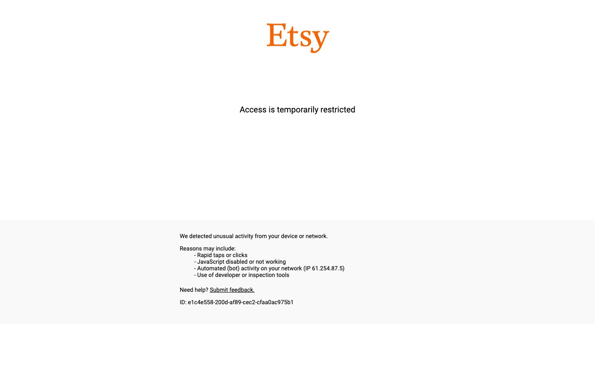

**페이지 메타 정보**

| page | title | description |
|---|---|---|
| [`trending_jewelry`](https://www.etsy.com/c/jewelry) | etsy.com |  |
| [`trending_accessories`](https://www.etsy.com/c/accessories) | etsy.com |  |

#### [Macy's](https://www.macys.com/)

- URL: <https://www.macys.com/>
- 페이지: **OK 1 · FAIL 0**

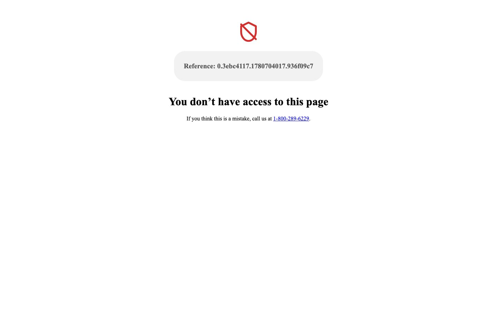

**페이지 메타 정보**

| page | title | description |
|---|---|---|
| [`new`](https://www.macys.com/shop/whats-new?id=14834) | Access Denied - Macy's | Access denied 403 |

#### [Nordstrom](https://www.nordstrom.com/)

- URL: <https://www.nordstrom.com/>
- 페이지: **OK 2 · FAIL 0**

**대표 상품 이미지** (상위 6장, 출처 URL 포함)

-  — 출처 <https://n.nordstrommedia.com/it/7f51c20a-b069-4154-9cfb-1e6d13a7c608.gif>
-  — 출처 <https://n.nordstrommedia.com/is/image/nordstrom/WMNS_ADC01F_0626_0049.jpeg?width=240&dpr=2&crop=2519.661%3A3149.577%2Coffset-x76.185%2Coffset-y50&trim=0.117%2C0%2C0.027%2C0>
-  — 출처 <https://n.nordstrommedia.com/is/image/nordstrom/ACC_HDBG02P_0526_altBgd_ext_8-5.jpeg?width=240&dpr=2&crop=4999.343%3A6249.179%2Coffset-x50%2Coffset-y50&trim=0%2C0%2C0.237%2C0>
-  — 출처 <https://n.nordstrommedia.com/is/image/nordstrom/WSH_YC01P_0126_altBgd_ext_8-5.jpeg?width=240&dpr=2&crop=6553.6%3A8192%2Coffset-x50%2Coffset-y50>
-  — 출처 <https://n.nordstrommedia.com/is/image/nordstrom/DESW_APP06F_0526_0230.jpeg?width=240&dpr=2&crop=1602.288%3A2002.86%2Coffset-x100%2Coffset-y50&trim=0.115%2C0.236%2C0.159%2C0>
-  — 출처 <https://n.nordstrommedia.com/is/image/nordstrom/FRA_FRGW03P_0126_V1.jpeg?width=240&dpr=2&crop=4371.2%3A5464%2Coffset-x78.978%2Coffset-y50&trim=0%2C0%2C0%2C0.261>

**페이지 메타 정보**

| page | title | description |
|---|---|---|
| [`new`](https://www.nordstrom.com/browse/new) | _(empty)_ |  |
| [`women`](https://www.nordstrom.com/browse/women) | Women's Clothing, Shoes, & Accessories | Nordstrom | Find a great selection of Women's Clothing, Shoes, & Accessories at Nordstrom.com. Shop popular brands and top designers. |

#### [Revolve](https://www.revolve.com/)

- URL: <https://www.revolve.com/>
- 페이지: **OK 0 · FAIL 2**

**실패 페이지**

- `new` — playwright_error: Error: Page.goto: net::ERR_HTTP2_PROTOCOL_ERROR at https://www.revolve.com/new/br/c79f88/
Call log:
  - navigating to "https://www.revolve.com/new/br/c79f88/", waiting until "domcontentloaded"

- `trending` — playwright_error: Error: Page.goto: net::ERR_HTTP2_PROTOCOL_ERROR at https://www.revolve.com/most-loved/br/4a9ca5/
Call log:
  - navigating to "https://www.revolve.com/most-loved/br/4a9ca5/", waiting until "domcontentloaded"

#### [Urban Outfitters](https://www.urbanoutfitters.com/)

- URL: <https://www.urbanoutfitters.com/>
- 페이지: **OK 1 · FAIL 0**

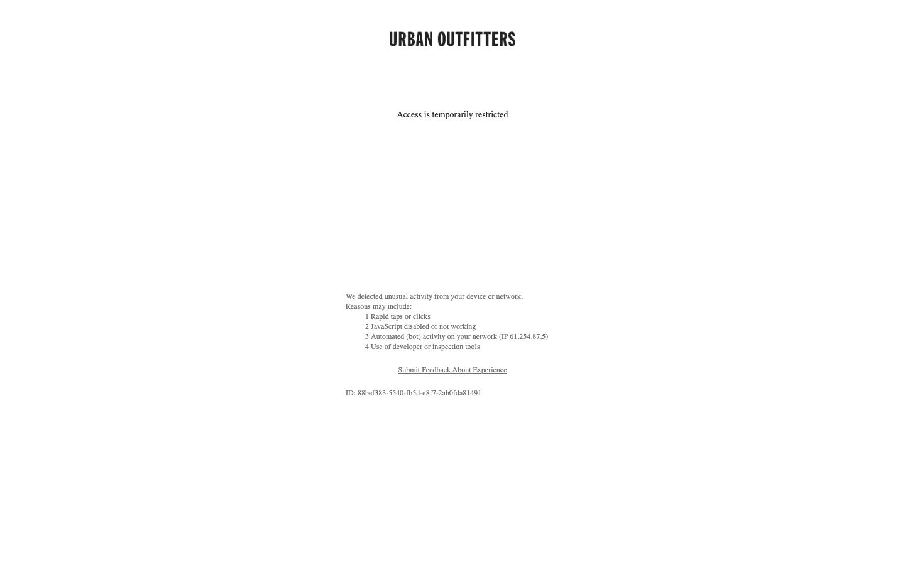

**페이지 메타 정보**

| page | title | description |
|---|---|---|
| [`new_women`](https://www.urbanoutfitters.com/womens-new-arrivals) | urbanoutfitters.com |  |

### 4.7 베트남 _( Vietnam )_

- 한국 수출규모 순위: **#4** · region: `asia` · tier `1` · currency `VND`
- 수집 사이트: **5개** (성공 5)
- 메모: 의류 생산기지/원단 수출 비중 큼. 빠르게 성장하는 이커머스
#### [Canifa](https://canifa.com/)

- URL: <https://canifa.com/>
- 페이지: **OK 1 · FAIL 0**

**대표 상품 이미지** (상위 6장, 출처 URL 포함)

-  — 출처 <https://2885371169.e.cdneverest.net/Simiconnector/BannerSlider/t/c/tce_topbanner_desktop-130526.webp>
- 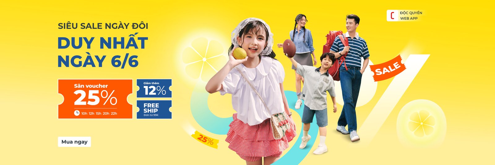 — 출처 <https://2885371169.e.cdneverest.net/Simiconnector/BannerSlider/6/6/66_topbanner_desktop-050626.webp>
-  — 출처 <https://canifa.com/_nuxt/img/chatbot-icon.c84d6ec.webp>
-  — 출처 <https://canifa.com/_nuxt/img/chat-zalo.ab5351f.webp>

**페이지 메타 정보**

| page | title | description |
|---|---|---|
| [`home`](https://canifa.com/) | CANIFA | Fashion For All | CANIFA - thương hiệu thời trang hàng đầu Việt Nam. Hàng ngàn mẫu quần áo phụ kiện nam, nữ, trẻ em cao cấp, chất lượng, an toàn liên tục được |

#### [IVY moda](https://ivymoda.com/)

- URL: <https://ivymoda.com/>
- 페이지: **OK 1 · FAIL 0**

**대표 상품 이미지** (상위 6장, 출처 URL 포함)

-  — 출처 <https://cotton4u.vn/files/news/2026/06/05/66c8b67c7c8b9d36a46126b210bf4fcb.webp>
-  — 출처 <https://cotton4u.vn/files/news/2026/06/01/d4e41606cd8e771d49b74af15e84c9d9.webp>
-  — 출처 <https://cotton4u.vn/files/news/2026/05/22/179c1077503915474aedcc329587712a.webp>
- 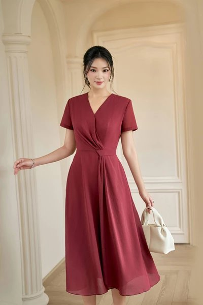 — 출처 <https://cotton4u.vn/files/product/thumab/400/2026/05/19/9d820d14667f61c6a007c35538ab08fa.webp>
-  — 출처 <https://cotton4u.vn/files/product/thumab/400/2026/05/19/0beabbbfb4c7bafe6a9e0a33ecb19eef.webp>
-  — 출처 <https://cotton4u.vn/files/product/thumab/400/2026/05/14/c6ef08cd461bd619c6208fd0a0a28238.webp>

**페이지 메타 정보**

| page | title | description |
|---|---|---|
| [`home`](https://ivymoda.com/) | IVY moda - Thời Trang Công Sở Hiện Đại | IVY moda |  |

#### [Lazada Vietnam](https://www.lazada.vn/)

- URL: <https://www.lazada.vn/>
- 페이지: **OK 1 · FAIL 0**

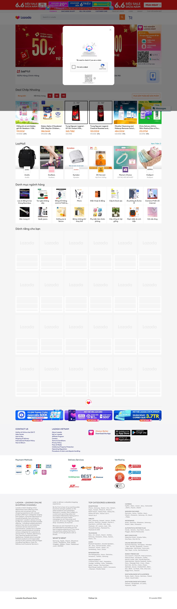

**대표 상품 이미지** (상위 6장, 출처 URL 포함)

-  — 출처 <https://img.lazcdn.com/us/domino/2ad4f22ce5a43dc145f221d13feed352.png>
-  — 출처 <https://img.lazcdn.com/g/tps/images/ims-web/TB1T7K2d8Cw3KVjSZFuXXcAOpXa.png>
- 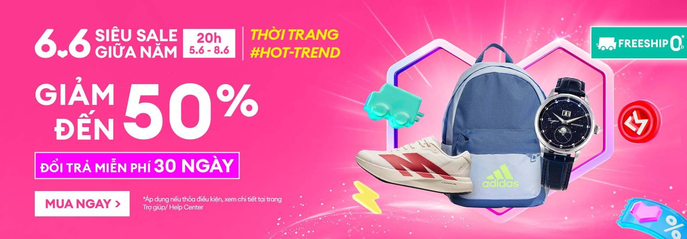 — 출처 <https://img.lazcdn.com/us/domino/00cb1567-8211-492e-ba63-e4e92f305339_VN-1976-688.jpg_2200x2200q80.jpg>
-  — 출처 <https://img.lazcdn.com/us/domino/b06b717b-b0d8-4b9a-96f9-6881ec7fc8ec_VN-1976-688.jpg_2200x2200q80.jpg>
-  — 출처 <https://img.lazcdn.com/us/domino/1b72063f-bda1-4765-bacc-914844c55858_VN-1976-688.jpg_2200x2200q80.jpg>
-  — 출처 <https://img.lazcdn.com/us/domino/fbe8fd31-5d78-45b4-8816-4d0b3c1427e0_VN-1976-688.jpg_2200x2200q80.jpg>

**페이지 메타 정보**

| page | title | description |
|---|---|---|
| [`home`](https://www.lazada.vn/#?) | Lazada Việt Nam | Mua Sắm Online, Giá Tốt Nhất Mỗi Ngày | Mua sắm đồ điện tử, thời trang, làm đẹp và đồ chơi giá cả phải chăng. Đảm bảo sản phẩm chính hãng và trải nghiệm mua sắm tiện lợi – mua ngay |

#### [Shopee Vietnam](https://shopee.vn/)

- URL: <https://shopee.vn/>
- 페이지: **OK 1 · FAIL 0**

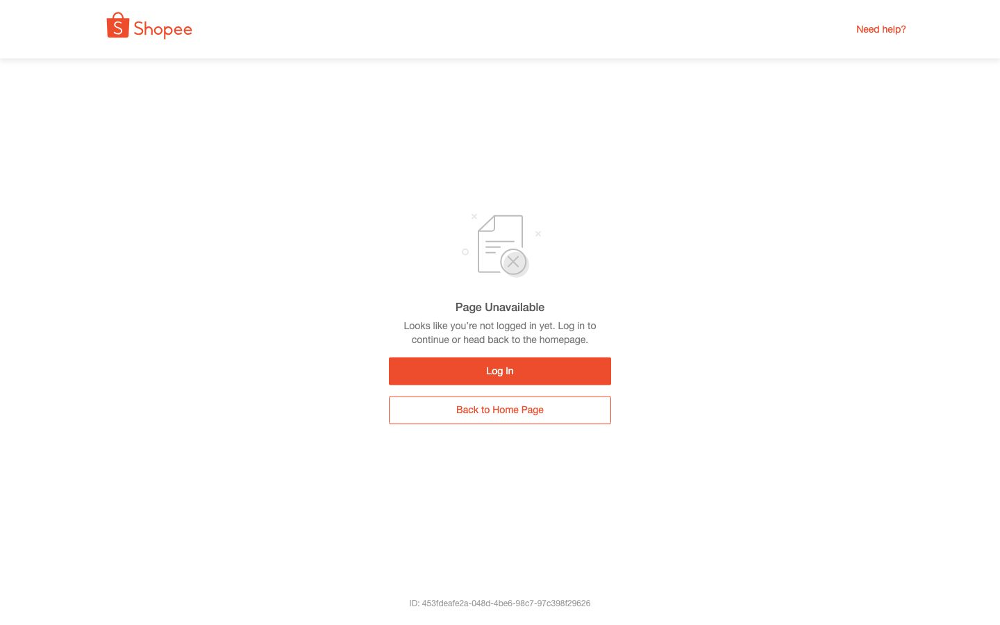

**대표 상품 이미지** (상위 6장, 출처 URL 포함)

-  — 출처 <https://deo.shopeemobile.com/shopee/shopee-pcmall-live-sg/homepagefe/26c9324913c021677768.png>

**페이지 메타 정보**

| page | title | description |
|---|---|---|
| [`home`](https://shopee.vn/verify/traffic/error?home_url=https%3A%2F%2Fshopee.vn&is_logged_in=false&next=https%3A%2F%2Fshopee.vn%2F&tracking_id=453fdeafe2a-048d-4be6-98c7-97c398f29626&type=4) | Shopee Việt Nam | Mua Sắm Online | Mua sắm trực tuyến hàng triệu sản phẩm ở tất cả ngành hàng. Giá tốt & Miễn phí vận chuyển. Mua và bán online trong 30 giây. Voucher Xtra | F |

#### [Tiki](https://tiki.vn/)

- URL: <https://tiki.vn/>
- 페이지: **OK 1 · FAIL 0**

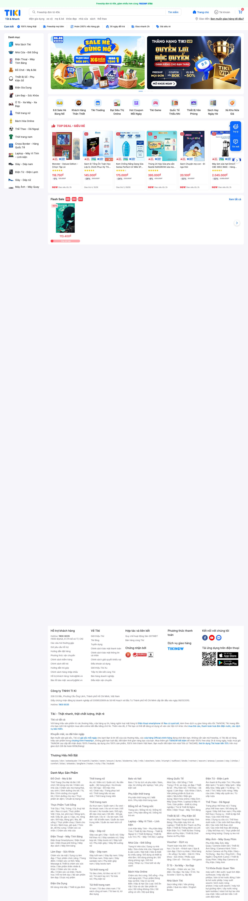

**대표 상품 이미지** (상위 6장, 출처 URL 포함)

-  — 출처 <https://salt.tikicdn.com/cache/100x100/ts/category/ed/20/60/afa9b3b474bf7ad70f10dd6443211d5f.png>
-  — 출처 <https://salt.tikicdn.com/cache/100x100/ts/category/f6/22/46/7e2185d2cf1bca72d5aeac385a865b2b.png>
-  — 출처 <https://salt.tikicdn.com/cache/100x100/ts/category/54/c0/ff/fe98a4afa2d3e5142dc8096addc4e40b.png>
-  — 출처 <https://salt.tikicdn.com/cache/100x100/ts/category/13/64/43/226301adcc7660ffcf44a61bb6df99b7.png>
-  — 출처 <https://salt.tikicdn.com/cache/100x100/ts/category/75/34/29/78e428fdd90408587181005f5cc3de32.png>
-  — 출처 <https://salt.tikicdn.com/cache/100x100/ts/category/61/d4/ea/e6ea3ffc1fcde3b6224d2bb691ea16a2.png>

**페이지 메타 정보**

| page | title | description |
|---|---|---|
| [`home`](https://tiki.vn/) | Tiki - Mua hàng online giá tốt, hàng chuẩn, ship nhanh | Tiện lợi mua sắm hàng triệu mặt hàng, dịch vụ. Vô vàn ưu đãi freeship, mã giảm giá. Hoàn tiền 15% tối đa 600k/tháng với thẻ tín dụng TikiCAR |

## 5. 의류 카테고리별 글로벌 트렌드

| # | 카테고리 | 건수 | 대표 상품명 |
|---:|---|---:|---|
| 1 | `블라우스` | 8 | [+반팔💙/하객룩/made] 드멜린 블라우스 · [포멜로]모디 퍼프 반팔 블라우스 · 화이트 로즈 블라우스 1color   데일리룩/러블리/데이트룩/소개팅룩/여름블라우스/장마룩 |
| 2 | `팬츠` | 5 | [여름바지🌴/50만장돌파/made] 허쉬 코튼 와이드팬츠 (숏/기본/롱) · [🔥여름바지/골반뽕탈부착][3만장돌파]렌더 하이웨스트 코튼 부츠컷 팬츠 (숏/롱ver)(5color) · [🔥후기인증팬츠] made. 나스 디테일러 와이드팬츠 (+베이직/롱ver) - 4 size |
| 3 | `슬랙스` | 4 | [🏆역대급100만장/썸머XL추가!] made. 마켓 와이드 트레이닝슬랙스 (+숏/베이직/롱ver) - 4 size · [✨구김걱정NO/💐하객룩추천] made. 세미부츠컷 찰랑슬랙스 (+베이직/롱ver) - 4 size · [S-L/5만장돌파🏆/made] 모티브 핀턱 슬랙스 |
| 4 | `셔츠` | 4 | [여름투피스🌴/허리잘록/체형커버][MADE]엘비드 랩 셔츠+밴딩 롱스커트set (44~110) (빅사이즈투피스-세트-랩셔츠-롤업셔츠-반팔셔츠-자수-밴딩스커트-데일리룩-데이트룩) · [🌸사계절필수/인생티♥] made. 솔트 클린 반팔티셔츠 (스탠다드핏/루즈핏) - 7 color · [MADE/7color]젠느 투타입 반팔 티셔츠 |
| 5 | `tee` | 2 | Lithe v-neck tee (slate gray) · [2nd] Lithe v-neck tee (mahogany) |
| 6 | `가디건` | 2 | [✨살안타템] made. 플레인 여리핏 썸머가디건 - 6 color · [NEW컬러추가🌴여름가디건🏆매시즌베스트/FREE+L/사이즈선택/살안타가디건/여름/살안타템/살안템/하객룩][MADE]마렌라운드가디건 - 9color |
| 7 | `스커트` | 2 | [30만장돌파/MADE/뉴컬러]누벨 데일리 나일론 슬릿 롱 스커트 (S-L/여름스커트/롱치마/여름치마/나일론치마/h라인스커트/데일리룩/장마룩/출근룩/바스락스커트) · [무료배송][2만장돌파]너티 시그니처 티어드 롱 스커트 |
| 8 | `니트` | 1 | [44-120] 라나 버튼 디테일 래글런 가디건 (여름-봄-여름니트-여름가디건-데일리가디건-휴가룩-썸머가디건-바캉스룩-커버업가디건-빅사이즈-자체제작) |
| 9 | `cardigan` | 1 | Linen Knit Cardigan [6color] |

**국가별 의류 TOP**

- **korea**: `블라우스`(8), `팬츠`(5), `슬랙스`(4), `셔츠`(4), `tee`(2)
## 6. 악세사리 카테고리별 글로벌 트렌드

| # | 카테고리 | 건수 | 대표 상품명 |
|---:|---|---:|---|
| 1 | `scarf` | 1 | Whisper scarf V knit (espresso) |
| 2 | `모자` | 1 | 유아 허그 스윔캡 수영 캡모자 (S/M) |
| 3 | `tote` | 1 | [HQ0220-010] NK NSW PUFFLE TOTE 2.0 |
| 4 | `ring` | 1 | Frill Shirring Sleeveless [3color] |

**국가별 악세사리 TOP**

- **korea**: `scarf`(1), `모자`(1), `tote`(1), `ring`(1)
## 7. 국가별 가격대 비교

| 국가 | 통화 | 표본 | min | p25 | median | p75 | max | median (USD) |
|---|---|---:|---:|---:|---:|---:|---:|---:|
| korea | KRW | 113 | 5760 | 23900 | 41820 | 79464 | 230100 | 27.29 |

> p25/p75 는 IQR 기준 분위수. USD 환산은 `config/exchange_rates.yaml` 기준 (운영자가 정기 갱신).

## 8. 국내 의류·악세사리 사업동향

### KITA K-stat

- 한국무역통계의 국가 수출입 통계 총괄 페이지입니다.
- 사이트: <https://stat.kita.net/stat/kts/ctr/CtrTotalImpExpList.screen>

| # | topic | title | url |
|---:|---|---|---|
| 1 | `trade` | KITA.NET | <https://www.kita.net/> |
| 2 | `trade` | K-stat 란? | <https://www.kita.net/pdf/statGuide/index.html#p=1> |
| 3 | `무역통계` | 무역통계 분류 | <https://stat.kita.net/stat/guide/guide_18_01.screen> |
| 4 | `trade` | 한국품목코드 | <https://stat.kita.net/stat/kts/statCode/ItemHierCodeList.screen> |
| 5 | `trade` | 해외품목코드 | <https://stat.kita.net/stat/istat/common/IstatHSCode.screen> |
| 6 | `trade` | 대륙/경제코드 | <https://stat.kita.net/stat/kts/statCode/ConEcoCodeList.screen> |
| 7 | `trade` | 수출입 총괄 | <https://stat.kita.net/stat/kts/sum/SumImpExpTotalList.screen> |
| 8 | `trade` | 가공단계 수출입 | <https://stat.kita.net/stat/kts/use/BecList.screen> |
| 9 | `trade` | 품목 수출입 | <https://stat.kita.net/stat/kts/pum/ItemImpExpList.screen> |
| 10 | `trade` | 국가 수출입 | <https://stat.kita.net/stat/kts/ctr/CtrTotalImpExpList.screen> |
| 11 | `trade` | 대륙/경제권 수출입 | <https://stat.kita.net/stat/kts/rel/RelColligationList.screen> |
| 12 | `trade` | 지자체 수출입 | <https://stat.kita.net/stat/kts/prod/ProdWholeList.screen> |
| 13 | `trade` | 항구/공항 수출입 | <https://stat.kita.net/stat/kts/port/PortImpExpList.screen> |
| 14 | `trade` | FTA체결국 수출입 | <https://stat.kita.net/stat/kts/fta/FtaCtrImpExpList.screen> |
| 15 | `trade` | 간접수출 현황 | <https://stat.kita.net/stat/ind/KtsIndMain.screen> |

### Korea Customs Service

- 수출입 현황, 물류통계 등 관세청 무역통계정보를 종합적으로 제공
- 사이트: <https://tradedata.go.kr/cts/index_eng.do>

| # | topic | title | url |
|---:|---|---|---|
| 1 | `trade` | Korea Customs Service | <http://customs.go.kr/english/main.do> |

### KOSIS

- 코시스, 국가데이터처가 제공하는 원스톱 통계 서비스, 국가승인통계, 국제통계, 북한통계, e-지방지표, 통계시각화콘텐츠, 온라인간행물 등 제공
- 사이트: <https://kosis.kr/statisticsList/statisticsListIndex.do;jsessionid=Y6VTqN3ukG7D-rZyKj9ottgZPxak0r_LBN-q6WjH.esvwas2_S21?parmTabId=M_01_01&vwcd=MT_ZTITLE&menuId=M_01_01&outLink=Y&entrType=>

| # | topic | title | url |
|---:|---|---|---|
| 1 | `statistics` | 쉽게 보는 통계 | <http://kosis.kr/easyViewStatis/customStatisIndex.do?vwcd=MT_TM1_TITLE&menuId=M_03_01> |
| 2 | `statistics` | 이슈별 접근 | <http://kosis.kr/easyViewStatis/customStatisIndex.do?vwcd=MT_TM2_TITLE&menuId=M_03_02> |
| 3 | `statistics` | 통계시각화콘텐츠 | <http://kosis.kr/easyViewStatis/visualizationIndex.do> |
| 4 | `statistics` | 온라인간행물 | <http://kosis.kr/publication/publicationThema.do> |
| 5 | `statistics` | 기획간행물 | <http://kosis.kr/publication/publicationStat.do> |
| 6 | `statistics` | KOSIS 길라잡이 | <http://kosis.kr/civilComplaint/kosisGuideIndex.do> |
| 7 | `statistics` | 홈페이지 개선의견 | <http://kosis.kr/civilComplaint/siteRequestList.do> |
| 8 | `statistics` | 찾아가는 KOSIS | <http://kosis.kr/civilComplaint/kosisEduIndex.do> |
| 9 | `statistics` | 서비스 소개 | <http://kosis.kr/serviceInfo/kosisIntroduce.do> |
| 10 | `statistics` | 국가통계현황 | <http://kosis.kr/serviceInfo/statisInstitution.do> |
| 11 | `statistics` | 국가통계 공표일정 | <http://kosis.kr/serviceInfo/statisPublicationList.do> |
| 12 | `statistics` | 팩트체크 서비스 | <http://kosis.kr/serviceInfo/factCheckList.do> |
| 13 | `statistics` | 서비스정책 | <http://kosis.kr/serviceInfo/useGuide.do> |
| 14 | `statistics` | 공유서비스 (OpenAPI) | <http://kosis.kr/serviceInfo/openAPIGuide.do> |
| 15 | `statistics` | English | <https://kosis.kr/eng> |

### KOTRA

- 코트라, KOTRA, 대한무역투자진흥공사, 트라이빅, TriBIG, 무역투자통계, 국가별 시장정보, 품목별 유망시장, 기업별 맞춤정보, 해외바이어 정보
- 사이트: <https://www.kotra.or.kr/bigdata/visualization/korea#search/ALL/ALL/2024>

| # | topic | title | url |
|---:|---|---|---|
| 1 | `trade` | kotra 무역투자24 | <https://www.kotra.or.kr/bigdata/kotraSsoRedirect?targetURL=https://www.kotra.or.kr> |
| 2 | `trade` | 해외비즈니스 정보 포털 | <https://www.kotra.or.kr/bigdata/kotraSsoRedirect?targetURL=https://dream.kotra.or.kr/dream> |
| 3 | `trade` | 글로벌 전시포털 | <https://www.kotra.or.kr/bigdata/kotraSsoRedirect?targetURL=https://www.gep.or.kr/> |
| 4 | `trade` | KOTRA 해외인재유치센터 | <https://www.kotra.or.kr/gtc_kor> |
| 5 | `trade` | 투자유치정보제공 | <https://www.kotra.or.kr/bigdata/kotraSsoRedirect?targetURL=https://www.investkorea.org/> |
| 6 | `수출지원` | 수출지원 온라인 플랫폼 | <https://www.kotra.or.kr/bigdata/kotraSsoRedirect?targetURL=https://www.buykorea.or.kr/> |
| 7 | `trade` | 빅데이터 서비스 | <https://www.kotra.or.kr/bigdata/> |
| 8 | `trade` | 경제외교 활용포털 | <https://www.kotra.or.kr/bigdata/kotraSsoRedirect?targetURL=https://president.globalwindow.org> |
| 9 | `trade` | 방산물자교역지원센터 | <https://www.kotra.or.kr/bigdata/kotraSsoRedirect?targetURL=https://www.kotra.or.kr/kodits> |
| 10 | `trade` | 외투기업고충처리 | <https://www.kotra.or.kr/bigdata/kotraSsoRedirect?targetURL=https://ombudsman.kotra.or.kr/ob-kr> |
| 11 | `trade` | 수출바우처 · 지사화 | <https://www.exportvoucher.com> |
| 12 | `trade` | 무역투자통계 | <https://www.kotra.or.kr/bigdata/visualization/korea> |
| 13 | `trade` | 국가별 시장정보 | <https://www.kotra.or.kr/bigdata/marketAnalysis> |
| 14 | `trade` | 품목별 유망시장 | <https://www.kotra.or.kr/bigdata/bhrcMarket> |
| 15 | `trade` | 해외바이어 정보 | <https://www.kotra.or.kr/bigdata/partner/search> |

### Statistics Korea Online Shopping

- 국가데이터처,List | 전체 | 보도자료 | 새소식
- 사이트: <https://mods.go.kr/board.es?mid=a10301010000&bid=11789>

| # | topic | title | url |
|---:|---|---|---|
| 1 | `statistics` | 정보공개제도 | <https://mods.go.kr/menu.es?mid=a10101010100> |
| 2 | `statistics` | 정보공개청구 | <https://www.open.go.kr/com/main/mainView.do> |
| 3 | `statistics` | 비공개대상정보세부기준 | <https://mods.go.kr/menu.es?mid=a10101030000> |
| 4 | `statistics` | 고객수요분석 | <https://mods.go.kr/menu.es?mid=a10101040000> |
| 5 | `statistics` | 사전정보공표 | <https://mods.go.kr/menu.es?mid=a10103010000> |
| 6 | `statistics` | 사전정보공표목록 | <https://mods.go.kr/menu.es?mid=a10103010100> |
| 7 | `statistics` | 핵심단어목록 | <https://mods.go.kr/menu.es?mid=a10103020100> |
| 8 | `statistics` | 인기정보TOP10 | <https://mods.go.kr/menu.es?mid=a10103030100> |
| 9 | `statistics` | 행정자료실 | <https://mods.go.kr/menu.es?mid=a10104010000> |
| 10 | `statistics` | 업무추진비 | <https://mods.go.kr/menu.es?mid=a10104010100> |
| 11 | `statistics` | 국회관련정보 | <https://mods.go.kr/menu.es?mid=a10104040000> |
| 12 | `statistics` | 정책실명제 | <https://mods.go.kr/menu.es?mid=a10105010000> |
| 13 | `statistics` | 연도별대상사업현황 | <https://mods.go.kr/menu.es?mid=a10105020000> |
| 14 | `statistics` | 중점관리대상사업 | <https://mods.go.kr/menu.es?mid=a10105030600> |
| 15 | `statistics` | 국민신청실명제 | <https://mods.go.kr/menu.es?mid=a10105040000> |

### 기업마당

- 기업마당>정책정보>지원사업 공고
- 사이트: <https://www.bizinfo.go.kr/sii/siia/selectSIIA200View.do?null>

| # | topic | title | url |
|---:|---|---|---|
| 1 | `policy` | 지원사업 공고 | <https://www.bizinfo.go.kr/sii/siia/selectSIIA200View.do> |
| 2 | `policy` | 품목별 법정의무 인증제도 | <https://www.bizinfo.go.kr/biz/biza/selectBIZA100View.do> |
| 3 | `policy` | 입법·행정예고/고시 | <https://www.bizinfo.go.kr/biz/biza/selectBIZA300View.do> |
| 4 | `policy` | 월간 중기누리 | <https://www.bizinfo.go.kr/biz/biza/selectBIZA400View.do> |
| 5 | `policy` | 기업업무용 서식 | <https://www.bizinfo.go.kr/biz/bizb/selectBIZB100View.do> |
| 6 | `policy` | 입주기업 모집공고 | <https://www.bizinfo.go.kr/biz/bizb/selectBIZB200View.do> |
| 7 | `policy` | 온라인화상회의실 | <https://www.k-startup.go.kr/web/contents/webOLNIVIDEOMTRM.do> |
| 8 | `policy` | 정책정보 개방 | <https://www.bizinfo.go.kr/apiList.do> |
| 9 | `policy` | 속보성 대시보드 | <https://www.bizinfo.go.kr/dashboard.do> |
| 10 | `policy` | 고객의 소리 | <https://www.bizinfo.go.kr/biz/bizc/selectBIZC200Regist.do> |
| 11 | `policy` | 자주하는질문 | <https://www.bizinfo.go.kr/biz/bizc/selectBIZC300View.do> |
| 12 | `policy` | 이메일주소 무단 수집 거부안내 | <https://www.bizinfo.go.kr/biz/bizd/selectBIZD110View.do> |
| 13 | `policy` | 저작권 정책 | <https://www.bizinfo.go.kr/biz/bizd/selectBIZD120View.do> |
| 14 | `policy` | 웹접근성 정책 | <https://www.bizinfo.go.kr/biz/bizd/selectBIZD130View.do> |
| 15 | `policy` | 전체메뉴보기 | <https://www.bizinfo.go.kr/sitemap/intro.do> |

### 서울경제진흥원

- 서울경제진흥원 에러페이지
- 사이트: <https://www.sba.seoul.kr/Pages/error_404.html?aspxerrorpath=/Pages/NSub06_01.aspx>

### 소상공인24

- 소상공인24
- 사이트: <https://www.sbiz24.kr/#/pbanc>

### 중소벤처기업부

- 중소기업중앙회 등 기관 중소기업 조사, 통계 DB화 검색, 내려받기 등 제공.
- 사이트: <https://www.mss.go.kr/site/smba/ex/bbs/List.do?cbIdx=86>

| # | topic | title | url |
|---:|---|---|---|
| 1 | `policy` | 어린이 누리집 | <https://www.mss.go.kr/site/kids/main.do> |
| 2 | `policy` | English | <https://www.mss.go.kr/site/eng/main.do> |
| 3 | `policy` | 누리집 안내지도 | <https://www.mss.go.kr/site/smba/ex/siteMap/siteMap.do> |
| 4 | `policy` | 훈령/예규/고시/공고 | <https://www.mss.go.kr/site/smba/ex/bbs/List.do?cbIdx=125&ext6=Y> |
| 5 | `policy` | 입법/행정예고 | <https://www.mss.go.kr/site/smba/ex/bbs/List.do?cbIdx=126&searchRltnYn=Y> |
| 6 | `policy` | 인사·채용 | <https://www.mss.go.kr/site/smba/ex/bbs/List.do?cbIdx=82> |
| 7 | `policy` | 보도설명자료 | <https://www.mss.go.kr/site/smba/ex/bbs/List.do?cbIdx=87> |
| 8 | `policy` | 현장속으로 | <https://www.mss.go.kr/site/smba/brdcststnVod/brdcststnVodList.do?ctgr_code=C01> |
| 9 | `policy` | 중기부소식지 | <https://www.mss.go.kr/site/smba/ex/bbs/List.do?cbIdx=95> |
| 10 | `policy` | 통계발표자료 | <https://www.mss.go.kr/site/smba/foffice/ex/statDB/ptScheduleList.do> |
| 11 | `policy` | 주제별 통계 | <https://www.mss.go.kr/site/smba/foffice/ex/statDB/temaList.do?tabCd=0001> |
| 12 | `policy` | 조사별 통계 | <https://www.mss.go.kr/site/smba/foffice/ex/statDB/surveyList.do?tabCd=0001> |
| 13 | `policy` | 조사보고서 | <https://www.mss.go.kr/site/smba/foffice/ex/statDB/stReportRoList.do?gb=1&nodeId=&roCode=> |
| 14 | `policy` | 주제별 조회 | <https://www.mss.go.kr/site/smba/foffice/ex/statDB/stReportRcList.do?gb=2&nodeId=&rcCode=> |
| 15 | `policy` | 중소기업위상 | <https://www.mss.go.kr/site/smba/foffice/ex/statDB/MainSubStat.do?scd=0001> |

## 9. 한국 사업자 관점 기회 국가 TOP 10

| # | 국가 | tier | region | 점수 | 근거 |
|---:|---|---:|---|---:|---|
| 1 | 태국 _( Thailand )_ | 1 | `asia` | **152.0** | tier1 기본점(90); 아시아 권역(+20); ASEAN 시장(+10); K-패션/콘텐츠 친화 시장(+20); 트렌드 신호 밀도 12 |
| 2 | 대만 _( Taiwan )_ | 1 | `asia` | **136.5** | tier1 기본점(90); 아시아 권역(+20); K-패션/콘텐츠 친화 시장(+20); 트렌드 신호 밀도 6 |
| 3 | 일본 _( Japan )_ | 1 | `asia` | **130.0** | tier1 기본점(90); 아시아 권역(+20); K-패션/콘텐츠 친화 시장(+20) |
| 4 | 베트남 _( Vietnam )_ | 1 | `asia` | **124.5** | tier1 기본점(90); 아시아 권역(+20); ASEAN 시장(+10); 트렌드 신호 밀도 4 |
| 5 | 인도네시아 _( Indonesia )_ | 1 | `asia` | **122.5** | tier1 기본점(90); 아시아 권역(+20); ASEAN 시장(+10); 트렌드 신호 밀도 2 |
| 6 | 필리핀 _( Philippines )_ | 2 | `asia` | **110.0** | tier2 기본점(60); 아시아 권역(+20); ASEAN 시장(+10); K-패션/콘텐츠 친화 시장(+20) |
| 7 | 미국 _( United States )_ | 1 | `north_america` | **103.5** | tier1 기본점(90); 트렌드 신호 밀도 14 |
| 8 | 말레이시아 _( Malaysia )_ | 2 | `asia` | **90.0** | tier2 기본점(60); 아시아 권역(+20); ASEAN 시장(+10) |
| 9 | 싱가포르 _( Singapore )_ | 2 | `asia` | **90.0** | tier2 기본점(60); 아시아 권역(+20); ASEAN 시장(+10) |
| 10 | 홍콩 _( Hong Kong )_ | 2 | `asia` | **80.0** | tier2 기본점(60); 아시아 권역(+20) |

## 10. 실행 제안

### **1위 태국** (점수 152, tier1 · asia)

- 현지 스타일 TOP: `wide` — 시즌 컬렉션 기획 시 우선 반영.
- 현지 컬러 TOP: `red` — 시즌 컬렉션 기획 시 우선 반영.
- 현지 소재 TOP: `denim`, `knit` — 시즌 컬렉션 기획 시 우선 반영.
- 현지 카테고리 TOP: `accessories`, `jacket`, `dress` — 시즌 컬렉션 기획 시 우선 반영.
- K-패션 친화도가 명시된 시장이므로 K-브랜드 아이덴티티 및 한류 셀럽 협업을 강조.
- ASEAN 권역 시장 — 물류/관세(FTA) 활용 + 동남아 통합 마케팅 검토 권장.
- tier1 핵심 시장 — 현지 마켓플레이스(예: 해당 국가의 대표 패션 플랫폼) 공식 입점 + 셀러 운영 채널 확보 우선.
- 연계 가능한 국내 수출/지원 사업이 식별되지 않음 — `domestic_sources.yaml` 의 `landing_url` 을 KOTRA 사업 공고/기업마당 수출바우처로 직접 지정 권장.

### **2위 대만** (점수 136, tier1 · asia)

- 현지 컬러 TOP: `pink`, `red` — 시즌 컬렉션 기획 시 우선 반영.
- 현지 소재 TOP: `lace` — 시즌 컬렉션 기획 시 우선 반영.
- K-패션 친화도가 명시된 시장이므로 K-브랜드 아이덴티티 및 한류 셀럽 협업을 강조.
- 아시아 권역 시장 — 시차/언어 친화 + 한국 본사 직배송 모델 검토.
- tier1 핵심 시장 — 현지 마켓플레이스(예: 해당 국가의 대표 패션 플랫폼) 공식 입점 + 셀러 운영 채널 확보 우선.
- 연계 가능한 국내 수출/지원 사업이 식별되지 않음 — `domestic_sources.yaml` 의 `landing_url` 을 KOTRA 사업 공고/기업마당 수출바우처로 직접 지정 권장.

### **3위 일본** (점수 130, tier1 · asia)

- K-패션 친화도가 명시된 시장이므로 K-브랜드 아이덴티티 및 한류 셀럽 협업을 강조.
- 아시아 권역 시장 — 시차/언어 친화 + 한국 본사 직배송 모델 검토.
- tier1 핵심 시장 — 현지 마켓플레이스(예: 해당 국가의 대표 패션 플랫폼) 공식 입점 + 셀러 운영 채널 확보 우선.
- 연계 가능한 국내 수출/지원 사업이 식별되지 않음 — `domestic_sources.yaml` 의 `landing_url` 을 KOTRA 사업 공고/기업마당 수출바우처로 직접 지정 권장.

### 운영 점검 노트

- **ASEAN 다중 진출 기회**: TOP10 중 ASEAN 국가가 3개 이상. Shopee/Lazada/Zalora 통합 운영을 통한 동남아 멀티마켓 전략을 검토 권장.

## 11. 수집 실패/주의 사이트

| 국가 | 사이트 | 페이지 | 상태 | 사유 |
|---|---|---|---|---|
| usa | Revolve | new | failed | playwright_error: Error: Page.goto: net::ERR_HTTP2_PROTOCOL_ERROR at https://www.revolve.com/new/br/c79f88/
Call log:
  - navigating to "https://www.revolve.com/new/br/c79f88/", waiting until "domcontentloaded"
 |
| usa | Revolve | trending | failed | playwright_error: Error: Page.goto: net::ERR_HTTP2_PROTOCOL_ERROR at https://www.revolve.com/most-loved/br/4a9ca5/
Call log:
  - navigating to "https://www.revolve.com/most-loved/br/4a9ca5/", waiting until "domcontentloaded"
 |
| japan | ZOZOTOWN | new | failed | playwright_error: TimeoutError: Page.goto: Timeout 30000ms exceeded.
Call log:
  - navigating to "https://zozo.jp/category/new/", waiting until "domcontentloaded"
 |
| japan | ZOZOTOWN | ranking | failed | playwright_error: TimeoutError: Page.goto: Timeout 30000ms exceeded.
Call log:
  - navigating to "https://zozo.jp/ranking/", waiting until "domcontentloaded"
 |
| japan | Rakuten Fashion | women | failed | http_status_404 |
| indonesia | Tokopedia | home | failed | playwright_error: Error: Page.goto: net::ERR_HTTP2_PROTOCOL_ERROR at https://www.tokopedia.com/
Call log:
  - navigating to "https://www.tokopedia.com/", waiting until "domcontentloaded"
 |
| indonesia | Berrybenka | home | failed | http_error: ConnectError: [Errno 8] nodename nor servname provided, or not known |
| taiwan | PChome | home | failed | http_status_429 |
| korea | Musinsa | home | failed | robots_disallowed |

## 12. 원문 출처 및 이미지 출처

### 인도네시아

- **Berrybenka** — <https://www.berrybenka.com/>
- **Hijup** — <https://www.hijup.com/>
- **Shopee Indonesia** — <https://shopee.co.id/>
  - 이미지 출처: <https://deo.shopeemobile.com/shopee/shopee-pcmall-live-sg/assets/1c8bdaaf45e1fd48.png>
- **Tokopedia** — <https://www.tokopedia.com/>
- **Zalora Indonesia** — <https://www.zalora.co.id/>
  - 이미지 출처: <https://static-id.zacdn.com/next-assets/static-assets/images/logo/icon_mastercard.png>
  - 이미지 출처: <https://static-id.zacdn.com/next-assets/static-assets/images/logo/icon_visa.png>
  - 이미지 출처: <https://static-id.zacdn.com/next-assets/static-assets/images/logo/icon_ovo.png>

### 일본

- **GU Japan** — <https://www.gu-global.com/jp/>
  - 이미지 출처: <https://image.uniqlo.com/GU/ST3/jp/imagesother/Navigation/WOMEN_Category/2026/260513/Category_w_Half-Tshirt.png>
  - 이미지 출처: <https://image.uniqlo.com/GU/ST3/jp/imagesother/Navigation/WOMEN_Category/2026/260515/Category_w_Tshirt.png>
  - 이미지 출처: <https://image.uniqlo.com/GU/ST3/jp/imagesother/Navigation/WOMEN_Category/2026/260513/Category_w_Knit-Cardigan.png>
  - 이미지 출처: <https://image.uniqlo.com/GU/ST3/jp/imagesother/Navigation/WOMEN_Category/2026/260513/Category_w_onepeace.png>
  - 이미지 출처: <https://image.uniqlo.com/GU/ST3/jp/imagesother/Navigation/WOMEN_Category/2026/260513/Category_w_Sweat.png>
  - 이미지 출처: <https://image.uniqlo.com/GU/ST3/jp/imagesother/Navigation/WOMEN_Category/2026/260513/Category_w_Outer.png>
  - 이미지 출처: <https://image.uniqlo.com/GU/ST3/jp/imagesother/Navigation/WOMEN_Category/2026/260513/Category_w_Pants.png>
  - 이미지 출처: <https://image.uniqlo.com/GU/ST3/jp/imagesother/Navigation/WOMEN_Category/2026/260528/Category_w_skirt.png>
  - 이미지 출처: <https://image.uniqlo.com/GU/ST3/jp/imagesother/Navigation/WOMEN_Category/2026/260518/Category_w_Short-Pants.png>
  - 이미지 출처: <https://image.uniqlo.com/GU/ST3/jp/imagesother/Navigation/WOMEN_Category/2026/260605/Category_w_roomwear.png>
  - 이미지 출처: <https://image.uniqlo.com/GU/ST3/jp/imagesother/Navigation/WOMEN_Category/2026/260513/Category_w_inner.png>
  - 이미지 출처: <https://image.uniqlo.com/GU/ST3/jp/imagesother/Navigation/WOMEN_Category/2026/260513/Category_w_DRY-inner.png>
  - 이미지 출처: <https://image.uniqlo.com/GU/ST3/jp/imagesother/Navigation/WOMEN_Category/2026/260513/Category_w_shoes.png>
- **Rakuten Fashion** — <https://brandavenue.rakuten.co.jp/>
  - 이미지 출처: <https://brandavenue.r10s.jp/img/library/index/sbn_flagshipstore_20231003.png>
  - 이미지 출처: <https://brandavenue.r10s.jp/img/news/01/377747/pc_n.jpg>
  - 이미지 출처: <https://brandavenue.r10s.jp/img/news/01/376408/pc_n.jpg>
  - 이미지 출처: <https://brandavenue.r10s.jp/img/news/01/378137/pc_n.jpg>
  - 이미지 출처: <https://brandavenue.r10s.jp/img/news/01/377692/pc_n.jpg>
  - 이미지 출처: <https://brandavenue.r10s.jp/img/news/01/378204/pc_n.jpg>
  - 이미지 출처: <https://brandavenue.r10s.jp/img/news/01/377461/pc_n.jpg>
  - 이미지 출처: <https://brandavenue.r10s.jp/img/news/01/375269/pc_n.jpg>
  - 이미지 출처: <https://brandavenue.r10s.jp/img/news/01/376280/pc_n.jpg>
  - 이미지 출처: <https://brandavenue.r10s.jp/img/news/01/378140/pc_n.jpg>
  - 이미지 출처: <https://brandavenue.r10s.jp/img/news/01/378142/pc_n.jpg>
  - 이미지 출처: <https://brandavenue.r10s.jp/img/news/01/378144/pc_n.jpg>
  - 이미지 출처: <https://brandavenue.r10s.jp/img/news/01/376224/pc_n.jpg>
  - 이미지 출처: <https://brandavenue.r10s.jp/img/news/01/377495/pc_n.jpg>
  - 이미지 출처: <https://brandavenue.r10s.jp/img/news/01/378156/pc_n.jpg>
  - 이미지 출처: <https://brandavenue.r10s.jp/img/news/01/377023/pc_n.jpg>
  - 이미지 출처: <https://brandavenue.r10s.jp/img/news/01/377751/pc_n.jpg>
  - 이미지 출처: <https://brandavenue.r10s.jp/img/news/01/378198/pc_n.jpg>
  - 이미지 출처: <https://brandavenue.r10s.jp/img/news/01/378012/pc_n.jpg>
- **Uniqlo Japan** — <https://www.uniqlo.com/jp/>
- **WEAR** — <https://wear.jp/>
  - 이미지 출처: <https://wear.jp/public/_next/static/media/notfound_bg.0mfqf_sjjg4.q.png>
  - 이미지 출처: <https://wear.jp/public/_next/static/media/notfound_4.0h3~tstn7vy~q.png>
  - 이미지 출처: <https://wear.jp/public/_next/static/media/notfound_0.17sfauikqe-ig.png>
  - 이미지 출처: <https://images.wear2.jp/coordinate/ekiqYE0j/nOGqgvrA/1780665334_276.jpg>
  - 이미지 출처: <https://images.wear2.jp/coordinate/OwibGv42/IIPzwsW1/1780501958_276.jpg>
  - 이미지 출처: <https://images.wear2.jp/coordinate/m0iAM4dw/eERXs4Dw/1780690562_276.jpg>
  - 이미지 출처: <https://images.wear2.jp/coordinate/DZiZG4Vy/Qz92hpHn/1780354666_276.jpg>
  - 이미지 출처: <https://images.wear2.jp/coordinate/Grin7q0y/gWHmV4es/1780596380_276.jpg>
  - 이미지 출처: <https://images.wear2.jp/coordinate/5EiWpMDP/8Zd1DkOo/1780663276_276.jpg>
  - 이미지 출처: <https://images.wear2.jp/profile/6gio2xl5/hpSX0raH/1715229637_120.jpg>
  - 이미지 출처: <https://images.wear2.jp/profile/V7ipyBky/32t9lQmD/1701717115_120.jpg>
  - 이미지 출처: <https://images.wear2.jp/profile/qrioQEw/72MJBCxP/1756304038_120.jpg>
  - 이미지 출처: <https://images.wear2.jp/profile/OwirEGrk/zrhryDG6/1702303344_120.jpg>
  - 이미지 출처: <https://images.wear2.jp/profile/5EiDePM4/Cdjn9Gl6/1732378353_120.jpg>
  - 이미지 출처: <https://images.wear2.jp/profile/4XivrgMQ/TsY83XIz/1739358434_120.jpg>
  - 이미지 출처: <https://images.wear2.jp/profile/7biBz7V/4X0QfUZr/1756218303_120.jpg>
  - 이미지 출처: <https://images.wear2.jp/profile/wnipYnRD/X8dWuLfA/1706628765_120.jpg>
  - 이미지 출처: <https://images.wear2.jp/profile/3oiqj2MY/ThKO9oo8/1674043725_120.jpg>
  - 이미지 출처: <https://wear.jp/public/_next/static/media/mock.0i-zctnzuboij.webp>
  - 이미지 출처: <https://wear.jp/public/_next/static/media/icon_ios.0~ker89fyl9ww.webp>
- **ZOZOTOWN** — <https://zozo.jp/>

### 한국

- **29CM** — <https://www.29cm.co.kr/>
  - 이미지 출처: <https://img.29cm.co.kr/cms/202606/11f15fb8333b479f90909f5e387fbbc4.png?width=3840&format=webp>
  - 이미지 출처: <https://img.29cm.co.kr/cms/202606/11f15fb820eba0cf9f7fe5a1c786f6f4.png?width=3840&format=webp>
  - 이미지 출처: <https://img.29cm.co.kr/cms/202606/11f15fb8122cc14b9090d98429bd9b4e.png?width=3840&format=webp>
  - 이미지 출처: <https://img.29cm.co.kr/cms/202606/11f15fb7f705c4599f7f75bb5f150aca.png?width=3840&format=webp>
  - 이미지 출처: <https://img.29cm.co.kr/cms/202606/11f15fb7e283d3e99f7f2f175f9cc2eb.png?width=3840&format=webp>
  - 이미지 출처: <https://img.29cm.co.kr/cms/202606/11f15fb7d54839179090752885093fa0.png?width=3840&format=webp>
  - 이미지 출처: <https://img.29cm.co.kr/cms/202606/11f15fb7c85196f99f7f93dd291d6bad.png?width=3840&format=webp>
  - 이미지 출처: <https://img.29cm.co.kr/cms/202606/11f15fb7b715345d90901b2a741dafed.png?width=3840&format=webp>
  - 이미지 출처: <https://img.29cm.co.kr/cms/202606/11f15e54d3ecc79d9f7f0d720c776fc8.png?width=3840&format=webp>
  - 이미지 출처: <https://img.29cm.co.kr/cms/202606/11f15e547efd5053909029dd026e51ec.png?width=3840&format=webp>
  - 이미지 출처: <https://img.29cm.co.kr/cms/202606/11f15e53dd4132d19f7f1b25ab2243cb.png?width=3840&format=webp>
  - 이미지 출처: <https://img.29cm.co.kr/cms/202606/11f15e53d563a62790902dcc7574e9bd.png?width=3840&format=webp>
  - 이미지 출처: <https://img.29cm.co.kr/cms/202606/11f15e53ca3392eb9f7f611eda1f46d5.png?width=3840&format=webp>
  - 이미지 출처: <https://img.29cm.co.kr/cms/202606/11f15d639c86046f9090994cf59cb2ac.png?width=3840&format=webp>
  - 이미지 출처: <https://img.29cm.co.kr/cms/202606/11f15d638881cfb79f7f7f99aaf83718.png?width=3840&format=webp>
  - 이미지 출처: <https://img.29cm.co.kr/cms/202606/11f15d63794e5ca39f7fe16af2cf8743.png?width=3840&format=webp>
  - 이미지 출처: <https://img.29cm.co.kr/cms/202606/11f15d63661cb9c39090c7d5ccb8eb52.png?width=3840&format=webp>
  - 이미지 출처: <https://img.29cm.co.kr/cms/202605/11f15b400d7e46d39090d30dcca30dcb.png?width=3840&format=webp>
  - 이미지 출처: <https://img.29cm.co.kr/cms/202605/11f15b3f237e1a99909011dd736a6452.png?width=3840&format=webp>
- **Musinsa** — <https://www.musinsa.com/>
- **W Concept** — <https://www.wconcept.co.kr/>
- **Zigzag** — <https://zigzag.kr/>
  - 이미지 출처: <https://cf.image-farm.s.zigzag.kr/original/cms/2026/05/27/202605270752509302_032440.jpg?format=webp&quality=80&width=1029&height=1188>
  - 이미지 출처: <https://cf.image-farm.s.zigzag.kr/original/cms/2026/05/28/202605280659297199_020325.jpg?width=1029&height=1188&quality=80&format=webp&transparent=true>
  - 이미지 출처: <https://cf.image-farm.s.zigzag.kr/original/cms/2026/05/29/202605290757182162_086111.jpg?width=1029&height=1188&quality=80&format=webp&transparent=true>
  - 이미지 출처: <https://cf.image-farm.s.zigzag.kr/original/cms/2026/06/02/202606020929143571_029583.png?quality=80&format=webp&transparent=true&width=1029&height=1188>
  - 이미지 출처: <https://cf.image-farm.s.zigzag.kr/original/cms/2026/05/28/202605282357559014_054505.png?quality=80&format=webp&transparent=true&width=1029&height=1188>
  - 이미지 출처: <https://cf.image-farm.s.zigzag.kr/original/cms/2026/05/31/202605311335185701_061904.jpg?format=webp&quality=80&width=1029&height=1188>
  - 이미지 출처: <https://cf.image-farm.s.zigzag.kr/original/cms/2026/05/29/202605290257136394_094392.png?width=1029&height=1188&quality=80&format=webp&transparent=true>
  - 이미지 출처: <https://cf.image-farm.s.zigzag.kr/original/cms/2026/05/31/202605310723210624_016138.jpg?width=1029&height=1188&quality=80&format=webp&transparent=true>
  - 이미지 출처: <https://cf.image-farm.s.zigzag.kr/original/cms/2026/05/31/202605311412318642_039431.jpg?width=1029&height=1188&quality=80&format=webp&transparent=true>
  - 이미지 출처: <https://cf.image-farm.s.zigzag.kr/original/cms/2026/05/27/202605270749529732_032495.jpg?width=1029&height=1188&quality=80&format=webp&transparent=true>
  - 이미지 출처: <https://cf.image-farm.s.zigzag.kr/original/cms/2026/05/29/202605290342158169_064009.png?quality=80&format=webp&transparent=true&width=1029&height=1188>
  - 이미지 출처: <https://cf.image-farm.s.zigzag.kr/original/cms/2026/05/29/202605290655076518_077607.png?quality=80&format=webp&transparent=true&width=1029&height=1188>
  - 이미지 출처: <https://cf.image-farm.s.zigzag.kr/original/cms/2026/05/29/202605290704102780_021813.jpg?format=webp&quality=80&width=1029&height=1188>
  - 이미지 출처: <https://cf.image-farm.s.zigzag.kr/original/cms/2026/05/29/202605290702425978_033019.jpg?format=webp&quality=80&width=1029&height=1188>
  - 이미지 출처: <https://cf.image-farm.s.zigzag.kr/original/cms/2026/05/22/202605220822018464_032996.png?quality=80&format=webp&transparent=true&width=1029&height=1188>
  - 이미지 출처: <https://cf.image-farm.s.zigzag.kr/original/cms/2026/05/31/202605311356054714_053782.jpg?width=1029&height=1188&quality=80&format=webp&transparent=true>
  - 이미지 출처: <https://cf.image-farm.s.zigzag.kr/original/cms/2026/05/29/202605290230319178_083287.png?quality=80&format=webp&transparent=true&width=1029&height=1188>
  - 이미지 출처: <https://cf.image-farm.s.zigzag.kr/original/cms/2026/05/28/202605280717502066_043532.jpg?width=1029&height=1188&quality=80&format=webp&transparent=true>

### 대만

- **momo** — <https://www.momoshop.com.tw/>
  - 이미지 출처: <https://img2.momoshop.com.tw/ecm/img/online/10/998/00/000/bt_0_271_01/bt_0_271_01_e2.jpg?t=1780055233125>
  - 이미지 출처: <https://img1.momoshop.com.tw/ecm/img/online/10/998/00/000/bt_0_243_01/bt_0_243_01_e2.png?t=1780055160049>
  - 이미지 출처: <https://img1.momoshop.com.tw/ecm/img/online/10/998/00/000/bt_0_245_01/bt_0_245_01_P1_3_e2.png?t=1780243216264>
  - 이미지 출처: <https://img1.momoshop.com.tw/ecm/img/online/81/998/00/000/mobile/bt_7_701_01/bt_7_701_01_e111.jpg?t=1780657166865>
  - 이미지 출처: <https://img1.momoshop.com.tw/ecm/img/online/81/998/00/000/mobile/bt_7_701_01/bt_7_701_01_e141.jpg?t=1780571873148>
  - 이미지 출처: <https://img1.momoshop.com.tw/ecm/img/online/81/998/00/000/mobile/bt_7_701_01/bt_7_701_01_e161.jpg?t=1780571920032>
  - 이미지 출처: <https://img1.momoshop.com.tw/ecm/img/online/81/998/00/000/mobile/bt_7_701_01/bt_7_701_01_e71.jpg?t=1780651507897>
  - 이미지 출처: <https://img1.momoshop.com.tw/ecm/img/online/81/998/00/000/mobile/bt_7_701_01/bt_7_701_01_e91.jpg?t=1780571873136>
  - 이미지 출처: <https://img1.momoshop.com.tw/ecm/img/online/81/998/00/000/mobile/bt_7_701_01/bt_7_701_01_e61.jpg?t=1780571873126>
  - 이미지 출처: <https://img1.momoshop.com.tw/ecm/img/online/81/998/00/000/mobile/bt_7_701_01/bt_7_701_01_e101.jpg?t=1780651406920>
  - 이미지 출처: <https://img1.momoshop.com.tw/ecm/img/online/81/998/00/000/mobile/bt_7_701_01/bt_7_701_01_e151.jpg?t=1780571873151>
  - 이미지 출처: <https://img1.momoshop.com.tw/ecm/img/online/81/998/00/000/mobile/bt_7_701_01/bt_7_701_01_e31.jpg?t=1780651406916>
  - 이미지 출처: <https://img1.momoshop.com.tw/ecm/img/online/81/998/00/000/mobile/bt_7_701_01/bt_7_701_01_e81.jpg?t=1780571873133>
  - 이미지 출처: <https://img1.momoshop.com.tw/ecm/img/online/81/998/00/000/mobile/bt_7_701_01/bt_7_701_01_e21.jpg?t=1780571873117>
  - 이미지 출처: <https://img1.momoshop.com.tw/ecm/img/online/81/998/00/000/mobile/bt_7_701_01/bt_7_701_01_e51.jpg?t=1780571873123>
  - 이미지 출처: <https://img1.momoshop.com.tw/ecm/img/online/81/998/00/000/mobile/bt_7_701_01/bt_7_701_01_e121.jpg?t=1780571873142>
- **OB Design** — <https://www.obdesign.com.tw/>
  - 이미지 출처: <https://cms-static.cdn.91app.com/images/original/41602/92f19e4d-89b7-4330-9570-02cf1dff9742-1779764649-w0s0fz0ca4_d_1920x820_1280x547_1124x480_800x342_600x256_400x171.jpg>
  - 이미지 출처: <https://cms-static.cdn.91app.com/images/original/41602/92f19e4d-89b7-4330-9570-02cf1dff9742-1780452637-l3f8pt7f1z_d_1920x820_1280x547_1124x480_800x342_600x256_400x171.jpg>
  - 이미지 출처: <https://cms-static.cdn.91app.com/images/compress/41602/92f19e4d-89b7-4330-9570-02cf1dff9742-1780452637-l3f8pt7f1z_d_400x171.webp>
  - 이미지 출처: <https://cms-static.cdn.91app.com/images/original/41602/92f19e4d-89b7-4330-9570-02cf1dff9742-1780538875-ya3boiusfj_d_1920x820_1280x547_1124x480_800x342_600x256_400x171.jpg>
  - 이미지 출처: <https://cms-static.cdn.91app.com/images/compress/41602/92f19e4d-89b7-4330-9570-02cf1dff9742-1780538875-ya3boiusfj_d_400x171.webp>
  - 이미지 출처: <https://cms-static.cdn.91app.com/images/original/41602/92f19e4d-89b7-4330-9570-02cf1dff9742-1780277063-a0d3jhklbp_d_1920x820_1280x547_1124x480_800x342_600x256_400x171.jpg>
  - 이미지 출처: <https://cms-static.cdn.91app.com/images/original/41602/92f19e4d-89b7-4330-9570-02cf1dff9742-1780277115-p7ileh8xvh_d_1920x820_1280x547_1124x480_800x342_600x256_400x171.jpg>
  - 이미지 출처: <https://cms-static.cdn.91app.com/images/original/41602/92f19e4d-89b7-4330-9570-02cf1dff9742-1779853021-7fae3kspsb_d_1920x820_1280x547_1124x480_800x342_600x256_400x171.jpg>
  - 이미지 출처: <https://cms-static.cdn.91app.com/images/compress/41602/92f19e4d-89b7-4330-9570-02cf1dff9742-1779853021-7fae3kspsb_d_400x171.webp>
  - 이미지 출처: <https://cms-static.cdn.91app.com/images/original/41602/92f19e4d-89b7-4330-9570-02cf1dff9742-1779764702-6drun5zyc4_d_1920x820_1280x547_1124x480_800x342_600x256_400x171.jpg>
  - 이미지 출처: <https://cms-static.cdn.91app.com/images/original/41602/92f19e4d-89b7-4330-9570-02cf1dff9742-1780640869-3sy0baovmv_d_1920x820_1280x547_1124x480_800x342_600x256_400x171.jpg>
  - 이미지 출처: <https://cms-static.cdn.91app.com/images/compress/41602/92f19e4d-89b7-4330-9570-02cf1dff9742-1780640869-3sy0baovmv_d_400x171.webp>
  - 이미지 출처: <https://cms-static.cdn.91app.com/images/original/41602/20e150ef-f3b9-41e5-a7d1-3e246e070a59-1766996640-zaqbt3m2o6_m.png>
  - 이미지 출처: <https://cms-static.cdn.91app.com/images/original/41602/20e150ef-f3b9-41e5-a7d1-3e246e070a59-1767328066-hpr7vgg5h2_m.png>
  - 이미지 출처: <https://cms-static.cdn.91app.com/images/original/41602/20e150ef-f3b9-41e5-a7d1-3e246e070a59-1767067052-avl82sdmyk_m.gif>
  - 이미지 출처: <https://cms-static.cdn.91app.com/images/original/41602/20e150ef-f3b9-41e5-a7d1-3e246e070a59-1772016038-bahn8sg6xa_m.png>
- **PChome** — <https://24h.pchome.com.tw/>
- **Pinkoi Taiwan** — <https://www.pinkoi.com/>
  - 이미지 출처: <https://cdn04.pinkoi.com/pinkoi.site/logo/og_image.png>
- **Yahoo Taiwan Shopping** — <https://tw.buy.yahoo.com/>
  - 이미지 출처: <https://img.yec.tw/zp/MerchandiseImages/42E1EA4A9A-Gd-12031900.jpg>
  - 이미지 출처: <https://img.yec.tw/zp/MerchandiseImages/395781AA55-SP-20250272.jpg>
  - 이미지 출처: <https://img.yec.tw/zp/MerchandiseImages/E43AAFF06A-SP-21269809.jpg>

### 태국

- **Central Online** — <https://www.central.co.th/>
  - 이미지 출처: <https://www.central.co.th/_next/image?url=https%3A%2F%2Fassets.central.co.th%2Ffile-assets%2Fassets%2FCMS%2Fcampaign%2F2026%2F06jun%2F20260601_6.6_herobanner.jpg&w=3840&q=75>
  - 이미지 출처: <https://www.central.co.th/_next/image?url=https%3A%2F%2Fassets.central.co.th%2Ffile-assets%2Fassets%2FCMS%2Fcampaign%2F2026%2F06jun%2F20260601_estee_heroweb.jpg&w=3840&q=75>
  - 이미지 출처: <https://www.central.co.th/_next/image?url=https%3A%2F%2Fassets.central.co.th%2Ffile-assets%2Fassets%2FCMS%2Fcampaign%2F2026%2F06jun%2F20260601_dyson_heorweb_d.jpg&w=3840&q=75>
  - 이미지 출처: <https://www.central.co.th/_next/image?url=%2Fimages%2Ffallback-image.webp&w=3840&q=75>
  - 이미지 출처: <https://assets.central.co.th/file-assets/assets/CMS/campaign/2026/06jun/20260601_pandora_heroweb_d.jpg>
  - 이미지 출처: <https://www.central.co.th/_next/image?url=https%3A%2F%2Fassets.central.co.th%2Ffile-assets%2Fassets%2FCMS%2Fcampaign%2F2026%2F06jun%2F20260601_Matin-Kim_heroweb_d.jpg&w=3840&q=75>
  - 이미지 출처: <https://www.central.co.th/_next/image?url=https%3A%2F%2Fassets.central.co.th%2Ffile-assets%2Fassets%2FCMS%2Fcampaign%2F2026%2F06jun%2F20260601_lacoste_heroweb_d.jpg&w=3840&q=75>
  - 이미지 출처: <https://www.central.co.th/_next/image?url=https%3A%2F%2Fassets.central.co.th%2Ffile-assets%2Fassets%2FCMS%2Fcampaign%2F2026%2F06jun%2F20260606_SKII_heroweb_d.jpg&w=3840&q=75>
  - 이미지 출처: <https://www.central.co.th/_next/image?url=https%3A%2F%2Fassets.central.co.th%2Ffile-assets%2Fassets%2FCMS%2Fcampaign%2F2026%2F06jun%2F20260603_lancome_heroweb_d.jpg&w=3840&q=75>
  - 이미지 출처: <https://www.central.co.th/_next/image?url=https%3A%2F%2Fassets.central.co.th%2Ffile-assets%2Fassets%2FCMS%2Fcampaign%2F2026%2F06jun%2F20260604_Dior_heroweb_d.jpg&w=3840&q=75>
  - 이미지 출처: <https://www.central.co.th/_next/image?url=https%3A%2F%2Fassets.central.co.th%2Ffile-assets%2Fassets%2FCMS%2Fcampaign%2F2026%2F06jun%2F20260601_philips-personal_heroweb_d.jpg&w=3840&q=75>
  - 이미지 출처: <https://www.central.co.th/_next/image?url=https%3A%2F%2Fassets.central.co.th%2Ffile-assets%2Fassets%2FCMS%2Fcampaign%2F2026%2F06jun%2F20260601_fitflop_heroweb_d.jpg&w=3840&q=75>
  - 이미지 출처: <https://www.central.co.th/_next/image?url=https%3A%2F%2Fassets.central.co.th%2Ffile-assets%2Fassets%2FCMS%2Fcampaign%2F2026%2F06jun%2F20260601_coach_heroweb_d.jpg&w=3840&q=75>
  - 이미지 출처: <https://www.central.co.th/_next/image?url=https%3A%2F%2Fassets.central.co.th%2Ffile-assets%2Fassets%2FCMS%2Fcampaign%2F2026%2F06jun%2F20260601_jessica_heroweb_d.jpg&w=3840&q=75>
  - 이미지 출처: <https://www.central.co.th/_next/image?url=https%3A%2F%2Fassets.central.co.th%2Ffile-assets%2Fassets%2FCMS%2Fcampaign%2F2026%2F06jun%2F20260601_crocs_heroweb_d.jpg&w=3840&q=75>
  - 이미지 출처: <https://www.central.co.th/_next/image?url=https%3A%2F%2Fassets.central.co.th%2Ffile-assets%2Fassets%2FCMS%2Fcampaign%2F2026%2F05may%2F20260525_beauty_nav_th_0.png&w=3840&q=75>
  - 이미지 출처: <https://www.central.co.th/_next/image?url=https%3A%2F%2Fassets.central.co.th%2Ffile-assets%2Fassets%2FCMS%2Fevm%2Fcategory-navigation%2FCategory-carousel%2FWomen%2FTH_women.png&w=3840&q=75>
- **Lazada Thailand Fashion** — <https://www.lazada.co.th/>
  - 이미지 출처: <https://img.lazcdn.com/us/domino/40845120240f19d13f738fa9a7978edd.png>
  - 이미지 출처: <https://img.lazcdn.com/g/tps/images/ims-web/TB1KB2laMFY.1VjSZFnXXcFHXXa.png>
  - 이미지 출처: <https://img.lazcdn.com/us/domino/254020bc-ab46-4e33-b0d4-a82446d0406a_TH-1976-688.jpg_2200x2200q80.jpg>
  - 이미지 출처: <https://img.lazcdn.com/us/domino/5ea3664e-c271-4a22-8d86-6ef838eef8f4_TH-1976-688.jpg_2200x2200q80.jpg>
  - 이미지 출처: <https://img.lazcdn.com/us/domino/b5abd353-62f4-43f3-8f2d-33586095d7aa_TH-1976-688.jpg_2200x2200q80.jpg>
  - 이미지 출처: <https://img.lazcdn.com/us/domino/cb902ea1-8472-4c2c-884d-6972acadc7a7_TH-1976-688.jpg_2200x2200q80.jpg>
  - 이미지 출처: <https://img.lazcdn.com/us/domino/c6d43da6-48cc-49cb-a044-0827f31fb79f_TH-1976-688.jpg_2200x2200q80.jpg>
  - 이미지 출처: <https://img.lazcdn.com/us/domino/e58137d4-8733-43a8-8c02-23bab1e1980e_TH-1976-688.jpg_2200x2200q80.jpg>
  - 이미지 출처: <https://img.lazcdn.com/us/domino/6bfcbcd7-e536-4ab8-82f6-44fb863ed4a2_TH-1976-688.jpg_2200x2200q80.jpg>
  - 이미지 출처: <https://img.lazcdn.com/us/domino/c653067e-3d2d-40a2-be2f-0651441a8072_TH-1976-688.jpg_2200x2200q80.jpg>
  - 이미지 출처: <https://img.lazcdn.com/us/domino/ae0097cdb1eceff6a1c6c8e67b5c09f7.png_360x360q80.png>
  - 이미지 출처: <https://img.lazcdn.com/us/domino/2982506b-639f-44f6-8482-d49a42106fe6_TH-276-260.png_300x300q80.png>
- **Pomelo** — <https://www.pomelofashion.com/>
  - 이미지 출처: <https://cdn.pomelofashion.com/img/nav/3271/c/7422/20260428100935_69f024efaf715_banner-image.jpg?auto=compress,format&fm=webp,jpg,png&w=375&h=100>
  - 이미지 출처: <https://cdn.pomelofashion.com/img/nav/3271/c/7419/20260302182158_69a572d670875_banner-image.jpg?auto=compress,format&fm=webp,jpg,png&w=375&h=100>
  - 이미지 출처: <https://cdn.pomelofashion.com/img/nav/3271/c/88/20250620125126_6854f6de2dc98_banner-image.jpg?auto=compress,format&fm=webp,jpg,png&w=375&h=100>
  - 이미지 출처: <https://cdn.pomelofashion.com/img/nav/3271/c/7420/20260312173657_69b297499ac84_banner-image.jpg?auto=compress,format&fm=webp,jpg,png&w=375&h=100>
  - 이미지 출처: <https://cdn.pomelofashion.com/img/nav/3271/c/7418/20260216172249_6992eff96d8e5_banner-image.jpg?auto=compress,format&fm=webp,jpg,png&w=375&h=100>
  - 이미지 출처: <https://cdn.pomelofashion.com/img/nav/3271/c/3658/20250620125237_6854f725c93d4_banner-image.jpg?auto=compress,format&fm=webp,jpg,png&w=375&h=100>
  - 이미지 출처: <https://cdn.pomelofashion.com/img/nav/3271/c/7192/20250620125311_6854f747de70b_banner-image.jpg?auto=compress,format&fm=webp,jpg,png&w=375&h=100>
  - 이미지 출처: <https://cdn.pomelofashion.com/img/nav/3271/c/128/20250620125213_6854f70d2e5f9_banner-image.jpg?auto=compress,format&fm=webp,jpg,png&w=375&h=100>
  - 이미지 출처: <https://cdn.pomelofashion.com/img/nav/3271/c/36/20250620125433_6854f799a010d_banner-image.jpg?auto=compress,format&fm=webp,jpg,png&w=375&h=100>
  - 이미지 출처: <https://cdn.pomelofashion.com/img/nav/3271/c/6/20250620125337_6854f76160753_banner-image.jpg?auto=compress,format&fm=webp,jpg,png&w=375&h=100>
  - 이미지 출처: <https://cdn.pomelofashion.com/img/nav/3271/c/7/20250620125406_6854f77e26786_banner-image.jpg?auto=compress,format&fm=webp,jpg,png&w=375&h=100>
  - 이미지 출처: <https://cdn.pomelofashion.com/img/nav/3271/c/1658/20250620125457_6854f7b1ef681_banner-image.jpg?auto=compress,format&fm=webp,jpg,png&w=375&h=100>
  - 이미지 출처: <https://cdn.pomelofashion.com/img/nav/3271/c/332/20250620125545_6854f7e1bacf9_banner-image.jpg?auto=compress,format&fm=webp,jpg,png&w=375&h=100>
  - 이미지 출처: <https://cdn.pomelofashion.com/img/nav/3271/c/61/20250620125616_6854f800be70a_banner-image.jpg?auto=compress,format&fm=webp,jpg,png&w=375&h=100>
  - 이미지 출처: <https://cdn.pomelofashion.com/img/nav/3271/c/104/20250620125639_6854f817b83c2_banner-image.jpg?auto=compress,format&fm=webp,jpg,png&w=375&h=100>
- **Shopee Thailand Fashion** — <https://shopee.co.th/>
- **Zalora Thailand** — <https://www.zalora.co.th/>
  - 이미지 출처: <https://www.zalora.co.th/images/landingpage/525x500.gif>

### 미국

- **Etsy** — <https://www.etsy.com/>
- **Macy's** — <https://www.macys.com/>
- **Nordstrom** — <https://www.nordstrom.com/>
  - 이미지 출처: <https://n.nordstrommedia.com/it/7f51c20a-b069-4154-9cfb-1e6d13a7c608.gif>
  - 이미지 출처: <https://n.nordstrommedia.com/is/image/nordstrom/WMNS_ADC01F_0626_0049.jpeg?width=240&dpr=2&crop=2519.661%3A3149.577%2Coffset-x76.185%2Coffset-y50&trim=0.117%2C0%2C0.027%2C0>
  - 이미지 출처: <https://n.nordstrommedia.com/is/image/nordstrom/ACC_HDBG02P_0526_altBgd_ext_8-5.jpeg?width=240&dpr=2&crop=4999.343%3A6249.179%2Coffset-x50%2Coffset-y50&trim=0%2C0%2C0.237%2C0>
  - 이미지 출처: <https://n.nordstrommedia.com/is/image/nordstrom/WSH_YC01P_0126_altBgd_ext_8-5.jpeg?width=240&dpr=2&crop=6553.6%3A8192%2Coffset-x50%2Coffset-y50>
  - 이미지 출처: <https://n.nordstrommedia.com/is/image/nordstrom/DESW_APP06F_0526_0230.jpeg?width=240&dpr=2&crop=1602.288%3A2002.86%2Coffset-x100%2Coffset-y50&trim=0.115%2C0.236%2C0.159%2C0>
  - 이미지 출처: <https://n.nordstrommedia.com/is/image/nordstrom/FRA_FRGW03P_0126_V1.jpeg?width=240&dpr=2&crop=4371.2%3A5464%2Coffset-x78.978%2Coffset-y50&trim=0%2C0%2C0%2C0.261>
  - 이미지 출처: <https://n.nordstrommedia.com/is/image/nordstrom/WMNS_TRD01F_0626_0094_altBgd_ext.jpeg?width=240&dpr=2&crop=2459.299%3A3074.124%2Coffset-x47.34%2Coffset-y50&trim=0.082%2C0.065%2C0.051%2C0.09>
  - 이미지 출처: <https://n.nordstrommedia.com/it/bf0ce13a-8182-4600-b5ad-14c87b3b2b5d.jpeg?h=368&w=240&dpr=2>
  - 이미지 출처: <https://n.nordstrommedia.com/it/a69f8b3d-8dfc-464b-89e5-8af49dd4aa47.jpeg?h=368&w=240&dpr=2>
  - 이미지 출처: <https://n.nordstrommedia.com/it/81cdbcc4-f1f2-46f9-8b96-ca01b70a55ad.jpeg?h=368&w=240&dpr=2>
  - 이미지 출처: <https://n.nordstrommedia.com/it/90485744-7839-4683-b2df-8615dc7b8e5c.jpeg?h=368&w=240&dpr=2>
  - 이미지 출처: <https://n.nordstrommedia.com/it/728a44c4-d3a8-48c4-80de-d6b9d12ddd17.jpeg?h=368&w=240&dpr=2>
  - 이미지 출처: <https://n.nordstrommedia.com/it/8e459097-f961-4893-8a64-41a6185500f2.jpeg?h=368&w=240&dpr=2>
  - 이미지 출처: <https://n.nordstrommedia.com/it/0a164476-67d6-4452-8e97-2192bc4f5b2a.jpeg?h=368&w=240&dpr=2>
  - 이미지 출처: <https://n.nordstrommedia.com/it/2bd64cab-e26f-4998-ba8e-457b3d8d764b.jpeg?h=368&w=240&dpr=2>
  - 이미지 출처: <https://n.nordstrommedia.com/it/b40bf496-ee26-4790-91c9-c1973043ae48.jpeg?h=368&w=240&dpr=2>
  - 이미지 출처: <https://n.nordstrommedia.com/it/e46f5f08-c4ae-4685-ac9b-6c8095a4f8fe.jpeg?h=368&w=240&dpr=2>
  - 이미지 출처: <https://n.nordstrommedia.com/it/6852ceba-673b-4095-adfc-41687caccf38.jpeg?h=368&w=240&dpr=2>
  - 이미지 출처: <https://n.nordstrommedia.com/it/4837cbae-e675-4bdd-86f1-6ab90491dfa6.jpeg?h=368&w=240&dpr=2>
- **Revolve** — <https://www.revolve.com/>
- **Urban Outfitters** — <https://www.urbanoutfitters.com/>

### 베트남

- **Canifa** — <https://canifa.com/>
  - 이미지 출처: <https://2885371169.e.cdneverest.net/Simiconnector/BannerSlider/t/c/tce_topbanner_desktop-130526.webp>
  - 이미지 출처: <https://2885371169.e.cdneverest.net/Simiconnector/BannerSlider/6/6/66_topbanner_desktop-050626.webp>
  - 이미지 출처: <https://canifa.com/_nuxt/img/chatbot-icon.c84d6ec.webp>
  - 이미지 출처: <https://canifa.com/_nuxt/img/chat-zalo.ab5351f.webp>
- **IVY moda** — <https://ivymoda.com/>
  - 이미지 출처: <https://cotton4u.vn/files/news/2026/06/05/66c8b67c7c8b9d36a46126b210bf4fcb.webp>
  - 이미지 출처: <https://cotton4u.vn/files/news/2026/06/01/d4e41606cd8e771d49b74af15e84c9d9.webp>
  - 이미지 출처: <https://cotton4u.vn/files/news/2026/05/22/179c1077503915474aedcc329587712a.webp>
  - 이미지 출처: <https://cotton4u.vn/files/product/thumab/400/2026/05/19/9d820d14667f61c6a007c35538ab08fa.webp>
  - 이미지 출처: <https://cotton4u.vn/files/product/thumab/400/2026/05/19/0beabbbfb4c7bafe6a9e0a33ecb19eef.webp>
  - 이미지 출처: <https://cotton4u.vn/files/product/thumab/400/2026/05/14/c6ef08cd461bd619c6208fd0a0a28238.webp>
  - 이미지 출처: <https://cotton4u.vn/files/product/thumab/400/2026/05/14/bbc0fd7508ae4e067ae98a5f76806964.webp>
  - 이미지 출처: <https://cotton4u.vn/files/product/thumab/400/2026/06/05/04f1b45014d282f7876de48a54edc922.webp>
  - 이미지 출처: <https://cotton4u.vn/files/product/thumab/400/2026/06/05/cca61d9001b52d2ad4220b9bec91dd40.webp>
  - 이미지 출처: <https://cotton4u.vn/files/product/thumab/400/2026/05/14/48f170c660000daa4a9dccb87ec59ac2.webp>
  - 이미지 출처: <https://cotton4u.vn/files/product/thumab/400/2026/05/14/ffc5d092c317d9feac4cd189b70790ce.webp>
  - 이미지 출처: <https://cotton4u.vn/files/product/thumab/400/2026/05/19/84e36dc2766a902fe5c0a9ad1d8d801d.webp>
  - 이미지 출처: <https://cotton4u.vn/files/product/thumab/400/2026/05/19/e69d3e225bcfad741fc9425e15d577af.webp>
- **Lazada Vietnam** — <https://www.lazada.vn/>
  - 이미지 출처: <https://img.lazcdn.com/us/domino/2ad4f22ce5a43dc145f221d13feed352.png>
  - 이미지 출처: <https://img.lazcdn.com/g/tps/images/ims-web/TB1T7K2d8Cw3KVjSZFuXXcAOpXa.png>
  - 이미지 출처: <https://img.lazcdn.com/us/domino/00cb1567-8211-492e-ba63-e4e92f305339_VN-1976-688.jpg_2200x2200q80.jpg>
  - 이미지 출처: <https://img.lazcdn.com/us/domino/b06b717b-b0d8-4b9a-96f9-6881ec7fc8ec_VN-1976-688.jpg_2200x2200q80.jpg>
  - 이미지 출처: <https://img.lazcdn.com/us/domino/1b72063f-bda1-4765-bacc-914844c55858_VN-1976-688.jpg_2200x2200q80.jpg>
  - 이미지 출처: <https://img.lazcdn.com/us/domino/fbe8fd31-5d78-45b4-8816-4d0b3c1427e0_VN-1976-688.jpg_2200x2200q80.jpg>
  - 이미지 출처: <https://img.lazcdn.com/us/domino/ec763067-212a-4802-b829-d70aacfb27ed_VN-1976-688.jpg_2200x2200q80.jpg>
  - 이미지 출처: <https://img.lazcdn.com/us/domino/97c7638b-7056-4cdc-8ce6-811d1af1aab0_VN-1976-688.jpg_2200x2200q80.jpg>
  - 이미지 출처: <https://img.lazcdn.com/us/domino/0303ecc4-9cf9-4e3a-9503-1ef59c819ab3_VN-1976-688.jpg_2200x2200q80.jpg>
  - 이미지 출처: <https://img.lazcdn.com/us/domino/9d51673f-eb0a-485c-9a28-8756f07556cb_VN-1976-688.jpg_2200x2200q80.jpg>
  - 이미지 출처: <https://img.lazcdn.com/us/domino/54f08f0f-b52e-42c5-bc30-3d6e681fa3c0_VN-1976-688.jpg_2200x2200q80.jpg>
  - 이미지 출처: <https://img.lazcdn.com/us/domino/1b85ced3-e5b0-48b7-b3b4-1e4a6da273f3_VN-1976-688.jpg_2200x2200q80.jpg>
  - 이미지 출처: <https://img.lazcdn.com/us/domino/a96c58a6a88070c43bc63444f6774f51.png_120x120q80.png>
  - 이미지 출처: <https://img.lazcdn.com/us/domino/c7412e89f2d826219b7a37ed5f7d6d50.png_360x360q80.png>
  - 이미지 출처: <https://img.lazcdn.com/us/domino/901aecdc-e8dc-4bf2-9464-476f799a8200_VN-276-260.png_300x300q80.png>
- **Shopee Vietnam** — <https://shopee.vn/>
  - 이미지 출처: <https://deo.shopeemobile.com/shopee/shopee-pcmall-live-sg/homepagefe/26c9324913c021677768.png>
- **Tiki** — <https://tiki.vn/>
  - 이미지 출처: <https://salt.tikicdn.com/cache/100x100/ts/category/ed/20/60/afa9b3b474bf7ad70f10dd6443211d5f.png>
  - 이미지 출처: <https://salt.tikicdn.com/cache/100x100/ts/category/f6/22/46/7e2185d2cf1bca72d5aeac385a865b2b.png>
  - 이미지 출처: <https://salt.tikicdn.com/cache/100x100/ts/category/54/c0/ff/fe98a4afa2d3e5142dc8096addc4e40b.png>
  - 이미지 출처: <https://salt.tikicdn.com/cache/100x100/ts/category/13/64/43/226301adcc7660ffcf44a61bb6df99b7.png>
  - 이미지 출처: <https://salt.tikicdn.com/cache/100x100/ts/category/75/34/29/78e428fdd90408587181005f5cc3de32.png>
  - 이미지 출처: <https://salt.tikicdn.com/cache/100x100/ts/category/61/d4/ea/e6ea3ffc1fcde3b6224d2bb691ea16a2.png>
  - 이미지 출처: <https://salt.tikicdn.com/cache/100x100/ts/category/73/0e/89/bf5095601d17f9971d7a08a1ffe98a42.png>

---

_본 보고서는 fashion-sensing-agent 가 자동 생성한 운영용 리포트입니다. 이미지/스크린샷의 저작권은 원 출처에 있으며, 외부 공개 시 출처 표기 또는 링크 전환을 권장합니다._
