# 글로벌 패션·악세사리 트렌드 리포트

- **날짜**: 2026-06-10
- **생성**: 2026-06-10 09:09 KST
- **센싱 국가**: 7개
- **센싱 사이트**: 34개 (성공 28)
- **수집 페이지**: OK 32 / FAIL 9
- **다운로드 이미지**: 203장

---

## 1. Executive Summary

오늘 7개국 34개 사이트에서 32개 페이지를 수집하고, 203장의 대표 이미지를 정규화/저장했습니다.

## 2. 글로벌 트렌드 TOP 10

### 키워드

| # | keyword | count | 출처 사이트 수 |
|---:|---|---:|---:|
| 1 | `fashion` | 19 | 4 |
| 2 | `design` | 12 | 1 |
| 3 | `pomelo` | 12 | 1 |
| 4 | `lazada` | 10 | 2 |
| 5 | `latest` | 8 | 2 |
| 6 | `pinkoi` | 8 | 1 |
| 7 | `great` | 8 | 1 |
| 8 | `trang` | 8 | 4 |
| 9 | `online` | 7 | 4 |
| 10 | `ファッション` | 7 | 1 |

### 컬러

| # | keyword | count | 출처 사이트 수 |
|---:|---|---:|---:|
| 1 | `pink` | 8 | 1 |
| 2 | `red` | 4 | 3 |
| 3 | `brown` | 2 | 1 |
| 4 | `khaki` | 1 | 1 |
| 5 | `white` | 1 | 1 |
| 6 | `lavender` | 1 | 1 |
| 7 | `gold` | 1 | 1 |

### 소재

| # | keyword | count | 출처 사이트 수 |
|---:|---|---:|---:|
| 1 | `lace` | 4 | 1 |
| 2 | `denim` | 2 | 1 |
| 3 | `knit` | 2 | 1 |
| 4 | `velvet` | 1 | 1 |

### 스타일

| # | keyword | count | 출처 사이트 수 |
|---:|---|---:|---:|
| 1 | `wide` | 5 | 2 |
| 2 | `클래식` | 2 | 1 |
| 3 | `classic` | 1 | 1 |

### 카테고리

| # | keyword | count | 출처 사이트 수 |
|---:|---|---:|---:|
| 1 | `dress` | 4 | 2 |
| 2 | `accessories` | 3 | 2 |
| 3 | `scarf` | 2 | 1 |
| 4 | `jacket` | 2 | 1 |
| 5 | `denim` | 2 | 1 |
| 6 | `knit` | 2 | 1 |
| 7 | `blouse` | 1 | 1 |
| 8 | `ring` | 1 | 1 |
| 9 | `tee` | 1 | 1 |
| 10 | `bag` | 1 | 1 |

## 3. 국가별 핵심 트렌드 요약

### 인도네시아

- **키워드** (10): `online`(3), `latest`(2), `scarf`(2), `tunic`(2), `dress`(2)- **카테고리** (3): `dress`(2), `scarf`(2), `blouse`(1)
### 일본

- **키워드** (10): `ファッション`(7), `楽天`(6), `rakuten`(5), `fashion`(5), `らせ`(4)
### 한국

- **키워드** (10): `감도`(3), `깊은`(3), `에블린`(3), `취향`(2), `셀렉트샵`(2)- **스타일** (1): `클래식`(2)
### 대만

- **키워드** (10): `design`(12), `pinkoi`(8), `great`(8), `momo`(5), `asia`(4)- **컬러** (2): `pink`(8), `red`(1)- **소재** (1): `lace`(4)
### 태국

- **키워드** (10): `fashion`(14), `pomelo`(12), `lazada`(6), `latest`(6), `grand`(4)- **컬러** (1): `red`(3)- **소재** (2): `denim`(2), `knit`(2)- **스타일** (1): `wide`(3)- **카테고리** (8): `accessories`(3), `jacket`(2), `dress`(2), `denim`(2), `knit`(2)
### 미국

- **키워드** (10): `access`(3), `etsy`(2), `denied`(2), `nordstrom`(2), `we've`(2)
### 베트남

- **키워드** (10): `trang`(8), `nam`(7), `mua`(7), `canifa`(5), `ivy`(4)- **컬러** (5): `brown`(2), `khaki`(1), `white`(1), `lavender`(1), `gold`(1)- **소재** (1): `velvet`(1)- **스타일** (2): `wide`(2), `classic`(1)- **카테고리** (1): `hat`(1)

## 4. 국가별 상세 센싱 결과

### 4.1 인도네시아 _( Indonesia )_

- 한국 수출규모 순위: **#5** · region: `asia` · tier `1` · currency `IDR`
- 수집 사이트: **5개** (성공 3)
- 메모: 동남아 최대 인구, modest fashion 비중 큼
#### [Berrybenka](https://www.berrybenka.com/)

- URL: <https://www.berrybenka.com/>
- 페이지: **OK 0 · FAIL 1**

**실패 페이지**

- `home` — http_error: ConnectError: [Errno 8] nodename nor servname provided, or not known

#### [Hijup](https://www.hijup.com/)

- URL: <https://www.hijup.com/>
- 페이지: **OK 1 · FAIL 0**

**페이지 메타 정보**

| page | title | description |
|---|---|---|
| [`home`](https://www.hijup.com/) | Latest Scarf, Tunic, Long Dress Collection | HIJUP | Trusted Muslim Women's Clothing Online Shopping Site. Buy latest collection of Abaya, Blouse, Dress, Tunic, Printed Scarf. International shi |

#### [Shopee Indonesia](https://shopee.co.id/)

- URL: <https://shopee.co.id/>
- 페이지: **OK 1 · FAIL 0**

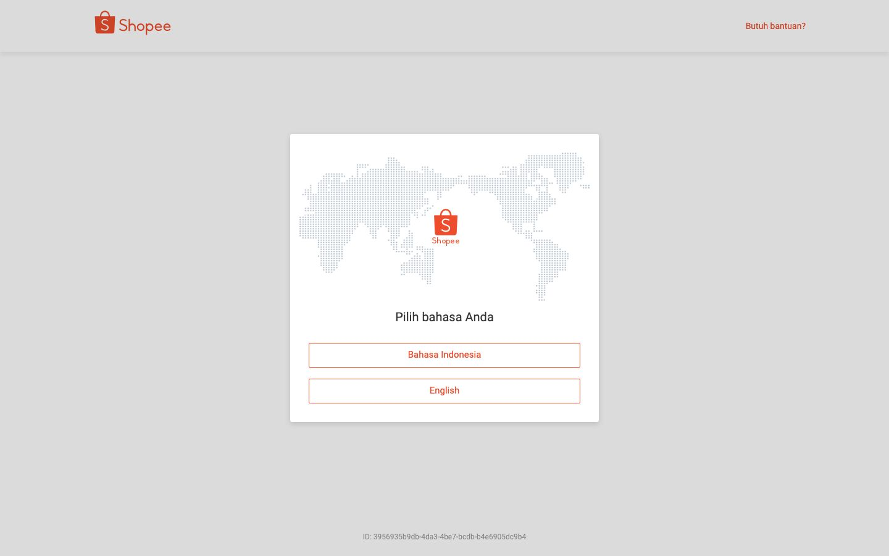

**대표 상품 이미지** (상위 6장, 출처 URL 포함)

-  — 출처 <https://deo.shopeemobile.com/shopee/shopee-pcmall-live-sg/assets/1c8bdaaf45e1fd48.png>

**페이지 메타 정보**

| page | title | description |
|---|---|---|
| [`home`](https://shopee.co.id/verify/traffic/error?home_url=https%3A%2F%2Fshopee.co.id&is_logged_in=false&next=https%3A%2F%2Fshopee.co.id%2F&tracking_id=3956935b9db-4da3-4be7-bcdb-b4e6905dc9b4&type=4) | Shopee Indonesia | Situs Belanja Online Terlengkap & Terpercaya |  |

#### [Tokopedia](https://www.tokopedia.com/)

- URL: <https://www.tokopedia.com/>
- 페이지: **OK 0 · FAIL 1**

**실패 페이지**

- `home` — playwright_error: Error: Page.goto: net::ERR_HTTP2_PROTOCOL_ERROR at https://www.tokopedia.com/
Call log:
  - navigating to "https://www.tokopedia.com/", waiting until "domcontentloaded"

#### [Zalora Indonesia](https://www.zalora.co.id/)

- URL: <https://www.zalora.co.id/>
- 페이지: **OK 1 · FAIL 0**

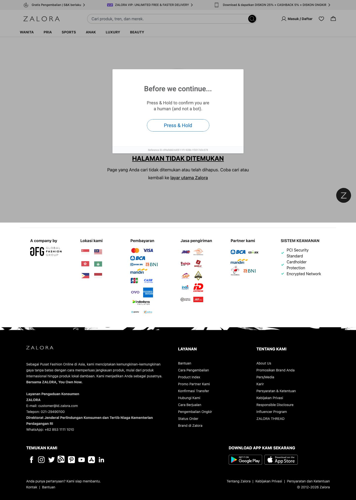

**대표 상품 이미지** (상위 6장, 출처 URL 포함)

-  — 출처 <https://static-id.zacdn.com/next-assets/static-assets/images/logo/icon_mastercard.png>
-  — 출처 <https://static-id.zacdn.com/next-assets/static-assets/images/logo/icon_visa.png>
-  — 출처 <https://static-id.zacdn.com/next-assets/static-assets/images/logo/icon_ovo.png>

**페이지 메타 정보**

| page | title | description |
|---|---|---|
| [`new_women`](https://www.zalora.co.id/wanita/new-arrivals) | Halaman tidak ditemukan | ZALORA |  |

### 4.2 일본 _( Japan )_

- 한국 수출규모 순위: **#2** · region: `asia` · tier `1` · currency `JPY`
- 수집 사이트: **5개** (성공 4)
- 메모: K-패션 선호도 높고 온라인 패션몰 발달
#### [GU Japan](https://www.gu-global.com/jp/)

- URL: <https://www.gu-global.com/jp/>
- 페이지: **OK 1 · FAIL 0**

**대표 상품 이미지** (상위 6장, 출처 URL 포함)

-  — 출처 <https://image.uniqlo.com/GU/ST3/jp/imagesother/Navigation/WOMEN_Category/2026/260513/Category_w_Half-Tshirt.png>
-  — 출처 <https://image.uniqlo.com/GU/ST3/jp/imagesother/Navigation/WOMEN_Category/2026/260515/Category_w_Tshirt.png>
-  — 출처 <https://image.uniqlo.com/GU/ST3/jp/imagesother/Navigation/WOMEN_Category/2026/260513/Category_w_Knit-Cardigan.png>
-  — 출처 <https://image.uniqlo.com/GU/ST3/jp/imagesother/Navigation/WOMEN_Category/2026/260513/Category_w_onepeace.png>
-  — 출처 <https://image.uniqlo.com/GU/ST3/jp/imagesother/Navigation/WOMEN_Category/2026/260513/Category_w_Sweat.png>
-  — 출처 <https://image.uniqlo.com/GU/ST3/jp/imagesother/Navigation/WOMEN_Category/2026/260513/Category_w_Outer.png>

**페이지 메타 정보**

| page | title | description |
|---|---|---|
| [`new_arrivals`](https://www.gu-global.com/jp/ja/not-found) | 申し訳ありません、お客様がアクセスしようとしたページが見つかりませんでした。恐れ入りますが、正しくアドレスが入力されているか、もう一度ご確認ください。 | ジーユー | 申し訳ありません、お客様がアクセスしようとしたページが見つかりませんでした。恐れ入りますが、正しくアドレスが入力されているか、もう一度ご確認ください。 |

#### [Rakuten Fashion](https://brandavenue.rakuten.co.jp/)

- URL: <https://brandavenue.rakuten.co.jp/>
- 페이지: **OK 1 · FAIL 1**

**대표 상품 이미지** (상위 6장, 출처 URL 포함)

-  — 출처 <https://brandavenue.r10s.jp/img/library/index/sbn_flagshipstore_20231003.png>
- 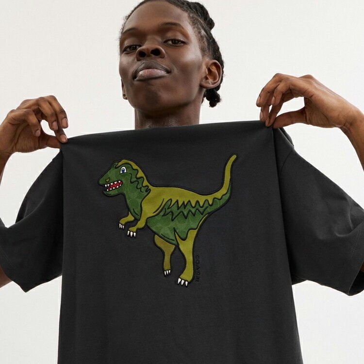 — 출처 <https://brandavenue.r10s.jp/img/news/01/377248/pc_n.jpg>
-  — 출처 <https://brandavenue.r10s.jp/img/news/01/378675/pc_n.jpg>
-  — 출처 <https://brandavenue.r10s.jp/img/news/01/377990/pc_n.jpg>
-  — 출처 <https://brandavenue.r10s.jp/img/news/01/377029/pc_n.jpg>
- 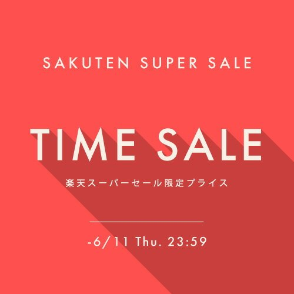 — 출처 <https://brandavenue.r10s.jp/img/news/01/377048/pc_n.jpg>

**페이지 메타 정보**

| page | title | description |
|---|---|---|
| [`men`](https://brandavenue.rakuten.co.jp/men/) | MEN | ファッション通販 Rakuten Fashion(楽天ファッション／旧楽天ブランドアベニュー) | Rakuten Fashion(楽天ファッション)は人気ブランドを取り扱うファッション通販サイトです。新作アイテム続々入荷！セール商品やクーポン対象商品も豊富。／税込3,980円以上購入で送料無料／楽天ポイントが使えて貯まる！ |

**실패 페이지**

- `women` — http_status_404

#### [Uniqlo Japan](https://www.uniqlo.com/jp/)

- URL: <https://www.uniqlo.com/jp/>
- 페이지: **OK 1 · FAIL 0**

**페이지 메타 정보**

| page | title | description |
|---|---|---|
| [`new_arrivals`](https://www.uniqlo.com/jp/ja/contents/feature/new-arrivals/) | 404 Not Found |  |

#### [WEAR](https://wear.jp/)

- URL: <https://wear.jp/>
- 페이지: **OK 1 · FAIL 0**

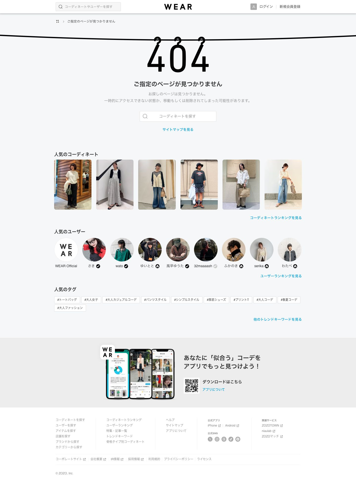

**대표 상품 이미지** (상위 6장, 출처 URL 포함)

-  — 출처 <https://wear.jp/public/_next/static/media/notfound_bg.0mfqf_sjjg4.q.png>
-  — 출처 <https://wear.jp/public/_next/static/media/notfound_4.0h3~tstn7vy~q.png>
-  — 출처 <https://wear.jp/public/_next/static/media/notfound_0.17sfauikqe-ig.png>
- 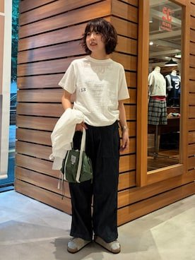 — 출처 <https://images.wear2.jp/coordinate/qriJ3n/wLFXyt8P/1780897973_276.jpg>
- 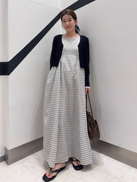 — 출처 <https://images.wear2.jp/coordinate/QWi0q82/gBqv7VWi/1780990347_276.jpg>
- 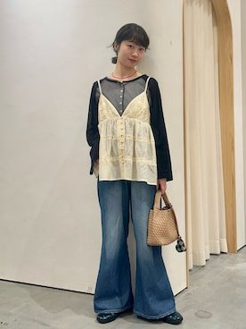 — 출처 <https://images.wear2.jp/coordinate/m0iARk3n/OwtnxtfL/1781026360_276.jpg>

**페이지 메타 정보**

| page | title | description |
|---|---|---|
| [`ranking`](https://wear.jp/ranking/coordinate/) | ご指定のページが見つかりません - WEAR |  |

#### [ZOZOTOWN](https://zozo.jp/)

- URL: <https://zozo.jp/>
- 페이지: **OK 0 · FAIL 2**

**실패 페이지**

- `new` — playwright_error: TimeoutError: Page.goto: Timeout 30000ms exceeded.
Call log:
  - navigating to "https://zozo.jp/category/new/", waiting until "domcontentloaded"

- `ranking` — playwright_error: TimeoutError: Page.goto: Timeout 30000ms exceeded.
Call log:
  - navigating to "https://zozo.jp/ranking/", waiting until "domcontentloaded"

### 4.3 한국 _( South Korea )_

- 한국 수출규모 순위: **#30** · region: `asia` · tier `1` · currency `KRW`
- 수집 사이트: **4개** (성공 3)
- 메모: 비교 기준 (자국). 국내 사업동향 센싱
#### [29CM](https://www.29cm.co.kr/)

- URL: <https://www.29cm.co.kr/>
- 페이지: **OK 1 · FAIL 0**

**최근 유행 상품** (50건 · 상품명 클릭 시 해당 사이트로 이동)

| # | 상품명 | 브랜드 | 가격 | 페이지 |
|---:|---|---|---:|---|
| 1 | [[29CM 단독] SOFA TABLE_SILVER](https://product.29cm.co.kr/catalog/3928044) | 두잉툴즈 | 132,820 KRW | `home` |
| 2 | [MINI BENCH (7colors)](https://product.29cm.co.kr/catalog/3879381) | 두잉툴즈 | 73,420 KRW | `home` |
| 3 | [[29CM 단독] SOFA TABLE (4colors)](https://product.29cm.co.kr/catalog/3928013) | 두잉툴즈 | 129,480 KRW | `home` |
| 4 | [투톤 북 캐비닛](https://product.29cm.co.kr/catalog/3374564) | 매스티지데코 | 426,220 KRW | `home` |
| 5 | [투톤 선반 서랍장](https://product.29cm.co.kr/catalog/2884685) | 매스티지데코 | 554,660 KRW | `home` |
| 6 | [샌드 원목 스툴(딥블루)](https://product.29cm.co.kr/catalog/3703424) | 매스티지데코 | 174,980 KRW | `home` |
| 7 | [뉴슬링 체어](https://product.29cm.co.kr/catalog/3871089) | 우드띠어리 | 77,390 KRW | `home` |
| 8 | [아크 스틸 체어](https://product.29cm.co.kr/catalog/3885879) | 우드띠어리 | 93,740 KRW | `home` |
| 9 | [아벨 세라믹 타원형 식탁 테이블](https://product.29cm.co.kr/catalog/3893930) | 우드띠어리 | 459,000 KRW | `home` |
| 10 | [프리츠한센 IKEBANA SMALL(BRASS)](https://product.29cm.co.kr/catalog/1966152) | 프리츠한센 | 133,480 KRW | `home` |
| 11 | [프리츠한센 IKEBANA LONG(BRASS)](https://product.29cm.co.kr/catalog/1966328) | 프리츠한센 | 247,080 KRW | `home` |
| 12 | [프리츠한센 IKEBANA SMALL(STAINLESS STEEL)](https://product.29cm.co.kr/catalog/1966498) | 프리츠한센 | 133,480 KRW | `home` |
| 13 | [ROW SOFA - Brown Vanila](https://product.29cm.co.kr/catalog/3583638) | 쥬다르 | 299,000 KRW | `home` |
| 14 | [Bed - Milk [점보]](https://product.29cm.co.kr/catalog/3593739) | 쥬다르 | 569,000 KRW | `home` |
| 15 | [Toy storage - Small](https://product.29cm.co.kr/catalog/3647781) | 쥬다르 | 59,000 KRW | `home` |
| 16 | [바미르 넛티 컬러 스툴](https://product.29cm.co.kr/catalog/3507488) | 바미르 | 77,110 KRW | `home` |
| 17 | [바미르 애쉬 원목 미니 화장대](https://product.29cm.co.kr/catalog/780423) | 바미르 | 133,870 KRW | `home` |
| 18 | [바미르 잉크나잇 와이드 선반 (TV 다이)](https://product.29cm.co.kr/catalog/3383142) | 바미르 | 386,240 KRW | `home` |
| 19 | [무타 벽선반 Air](https://product.29cm.co.kr/catalog/3759401) | 아르케 | 60,350 KRW | `home` |
| 20 | [무타 쉐이드 포터블 조명](https://product.29cm.co.kr/catalog/3835644) | 아르케 | 60,350 KRW | `home` |

**대표 상품 이미지** (상위 6장, 출처 URL 포함)

-  — 출처 <https://img.29cm.co.kr/cms/202606/11f162e4233d20a5909033ab5be6be59.png?width=3840&format=webp>
-  — 출처 <https://img.29cm.co.kr/cms/202606/11f162e41b2c00c3909043d6aaa53deb.png?width=3840&format=webp>
- 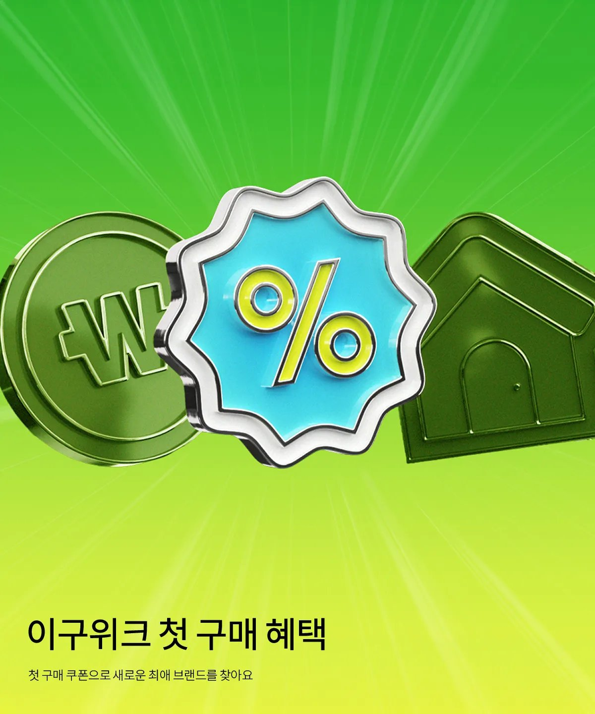 — 출처 <https://img.29cm.co.kr/cms/202606/11f162e40ea7cf31b3572de15b0c508f.png?width=3840&format=webp>
- 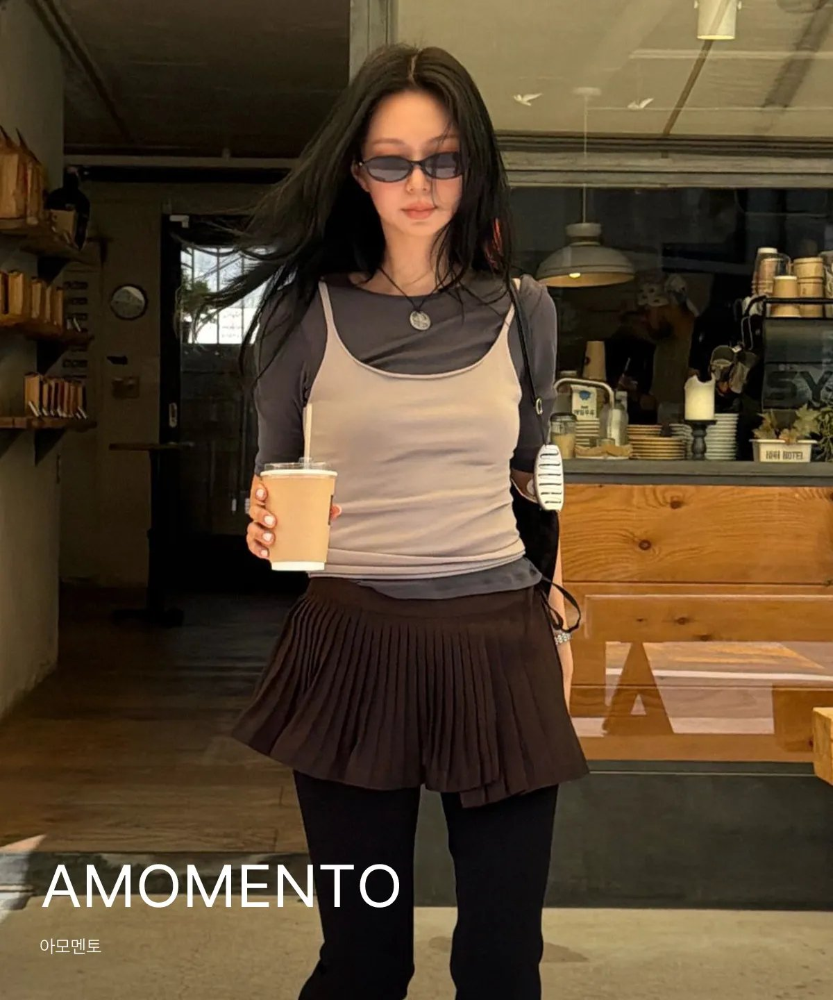 — 출처 <https://img.29cm.co.kr/cms/202606/11f162e401fd2a0f90904b4fab61f0af.png?width=3840&format=webp>
- 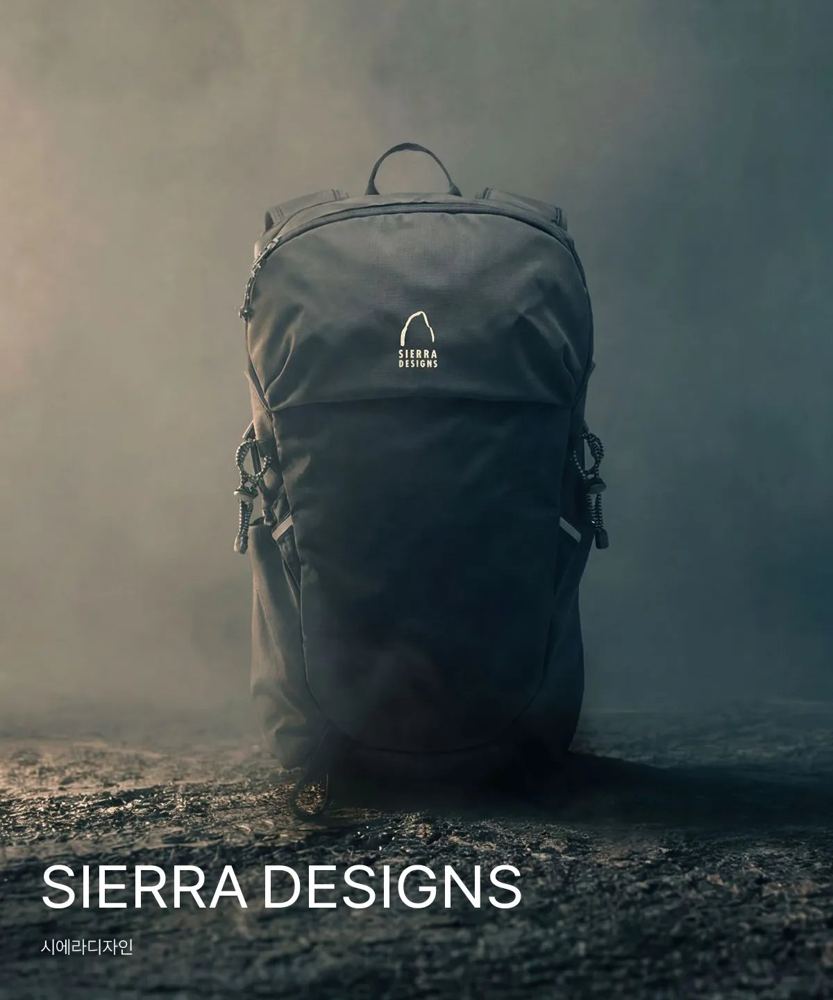 — 출처 <https://img.29cm.co.kr/cms/202606/11f162e3f87325b3b3575fdb8b219f75.png?width=3840&format=webp>
- 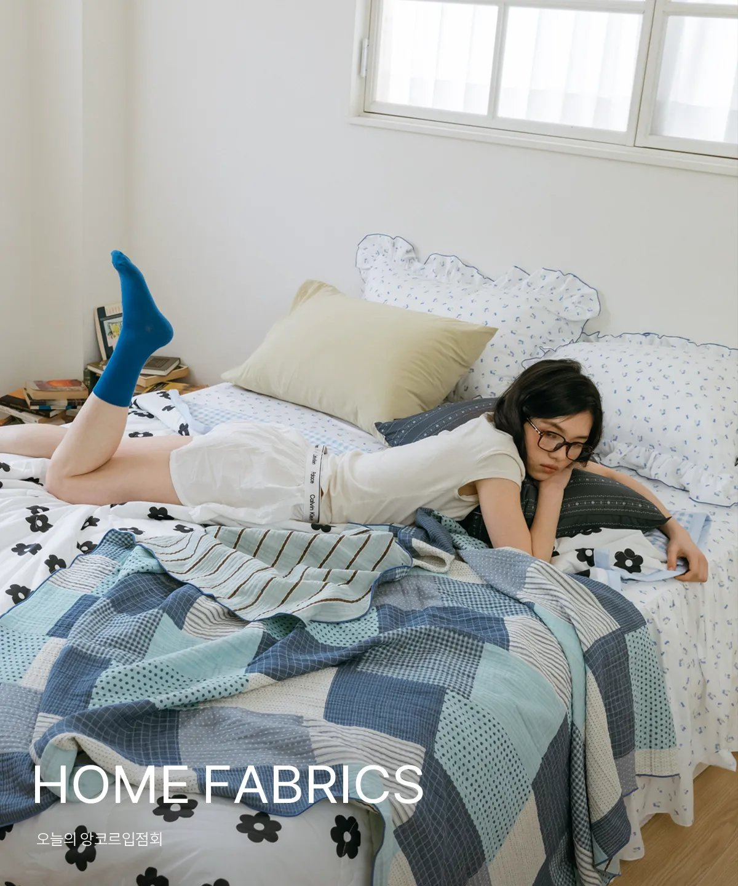 — 출처 <https://img.29cm.co.kr/cms/202606/11f162e3e7b9fd11b357c7ab53929942.png?width=3840&format=webp>

**페이지 메타 정보**

| page | title | description |
|---|---|---|
| [`home`](https://www.29cm.co.kr/) | 감도 깊은 취향 셀렉트샵 29CM | 패션, 라이프스타일, 컬처까지 29CM만의 감도 깊은 셀렉션을 만나보세요. |

#### [Musinsa](https://www.musinsa.com/)

- URL: <https://www.musinsa.com/>
- 페이지: **OK 0 · FAIL 1**

**실패 페이지**

- `home` — robots_disallowed

#### [W Concept](https://www.wconcept.co.kr/)

- URL: <https://www.wconcept.co.kr/>
- 페이지: **OK 1 · FAIL 0**

**최근 유행 상품** (30건 · 상품명 클릭 시 해당 사이트로 이동)

| # | 상품명 | 브랜드 | 가격 | 페이지 |
|---:|---|---|---:|---|
| 1 | [[단독][4차 리오더][SET-UP]엠마 린넨 스트랩 자켓 / EMMA LINEN STRAP JACKET_3colors](https://m.wconcept.co.kr/Product/306811066) | 룩캐스트 | 81,556 KRW | `home` |
| 2 | [[10차 리오더][NEW컬러 추가] 제제 언발란스 티셔츠 / ZEZE UNBALANCE T-SHIRT_6colors](https://m.wconcept.co.kr/Product/308442104) | 룩캐스트 | 26,334 KRW | `home` |
| 3 | [[5차 리오더]클로에 스퀘어 넥 슬리브리스 니트 / CHLOE SQUARE NECK SLEEVELESS KNIT_3colors](https://m.wconcept.co.kr/Product/305814273) | 룩캐스트 | 27,165 KRW | `home` |
| 4 | [[단독][3차 리오더]슈 슬리브리스 미니 드레스 / SHU SLEEVELESS MINI DRESS_2colors](https://m.wconcept.co.kr/Product/306811054) | 룩캐스트 | 86,610 KRW | `home` |
| 5 | [[단독][3차 리오더]루아 숄 니트 셋업  / LUA SHAWL KNIT SET UP_3colors](https://m.wconcept.co.kr/Product/308442087) | 룩캐스트 | 49,276 KRW | `home` |
| 6 | [하나 노카라 트위드 자켓 / HANA NO COLLAR TWEED JACKET_2colors](https://m.wconcept.co.kr/Product/308442133) | 룩캐스트 | 104,166 KRW | `home` |
| 7 | [[단독][4차 리오더]시아 텐셀 드레이프 티셔츠 / SIA TENCEL DRAPED T-SHIRT_3colors](https://m.wconcept.co.kr/Product/308442112) | 룩캐스트 | 30,324 KRW | `home` |
| 8 | [에블린 원턱 쇼츠 / EVELYNE ONE-TUCK SHORTS_3colors](https://m.wconcept.co.kr/Product/308562521) | 룩캐스트 | 47,401 KRW | `home` |
| 9 | [[단독]아델 홀터넥 리브드 슬림 캡 탑 / ADELE HALTER RIBBED SLIM CAP TOP_4colors](https://m.wconcept.co.kr/Product/308562555) | 룩캐스트 | 25,855 KRW | `home` |
| 10 | [소핀 브이넥 텍스처드 래글런 블라우스 / SOPHINE V-NECK TEXTURED RAGLAN BLOUSE_2colors](https://m.wconcept.co.kr/Product/308442098) | 룩캐스트 | 43,092 KRW | `home` |
| 11 | [[3차 리오더]아리아 플라워 슬리브리스 블라우스 / ARIA FLOWER SLEEVELESS BLOUSE_2colors](https://m.wconcept.co.kr/Product/306811064) | 룩캐스트 | 47,574 KRW | `home` |
| 12 | [[워셔블] 다니엘 베이직 브이넥 슬리브리스 니트 / DANIEL BASIC V-NECK SLEEVELESS KNIT_3colors](https://m.wconcept.co.kr/Product/308510594) | 룩캐스트 | 24,239 KRW | `home` |
| 13 | [솔렌 모크넥 버튼업 블라우스 / SOLENE MOCK-NECK BUTTON UP BLOUSE_4colors](https://m.wconcept.co.kr/Product/308442095) | 룩캐스트 | 52,429 KRW | `home` |
| 14 | [아르테 로고 티셔츠 / ARTE LOGO T-SHIRT_2colors](https://m.wconcept.co.kr/Product/301193006) | 룩캐스트 | 18,700 KRW | `home` |
| 15 | [니콜 나일론 에이치 라인 미디 스커트_네이비 / NICOLE NYLON H-LINE MIDI SKIRT_NAVY](https://m.wconcept.co.kr/Product/308442068) | 룩캐스트 | 57,283 KRW | `home` |
| 16 | [에리카 썸머 울 클레식 미니 드레스_블랙 / ERICA SUMMER WOOL CLASSIC MINI DRESS_BLACK](https://m.wconcept.co.kr/Product/308442062) | 룩캐스트 | 55,062 KRW | `home` |
| 17 | [플로라 플레어 롱 스커트 / FLORA FLARE LONG SKIRT_2colors](https://m.wconcept.co.kr/Product/308442070) | 룩캐스트 | 66,992 KRW | `home` |
| 18 | [[워셔블] 레나 리브드 브이넥 슬리브리스 니트 / LENA RIBBED V-NECK SLEEVELESS KNIT_4colors](https://m.wconcept.co.kr/Product/308442086) | 룩캐스트 | 26,888 KRW | `home` |
| 19 | [[기장 옵션추가] [3차 리오더] 리네아 스트레이트 데님 팬츠 / LINEA STRAIGHT DENIM PANTS_3colors](https://m.wconcept.co.kr/Product/308145476) | 룩캐스트 | 69,054 KRW | `home` |
| 20 | [[단독]젠 스트라이프 티셔츠 / JEN STRIPE T-SHIRT_5colors](https://m.wconcept.co.kr/Product/308562556) | 룩캐스트 | 27,703 KRW | `home` |

**페이지 메타 정보**

| page | title | description |
|---|---|---|
| [`home`](https://www.wconcept.co.kr/) | _(empty)_ |  |

#### [Zigzag](https://zigzag.kr/)

- URL: <https://zigzag.kr/>
- 페이지: **OK 1 · FAIL 0**

**최근 유행 상품** (36건 · 상품명 클릭 시 해당 사이트로 이동)

| # | 상품명 | 브랜드 | 가격 | 페이지 |
|---:|---|---|---:|---|
| 1 | [[🏆역대급100만장/썸머XL추가!] made. 마켓 와이드 트레이닝슬랙스 (+숏/베이직/롱ver) - 4 size](https://store.zigzag.kr/app/catalog/products/141360158?browsing_type=NATIVE_BROWSER) | 슬로우앤드 | 26,320 KRW | `home` |
| 2 | [[🔥20% 오픈특가] 슬로우앤드XOOTJ. 올니즈 썸머라이트 데님팬츠 (+숏/베이직/롱ver) - 4 size (6/10~12 출고예정/무료배송)](https://store.zigzag.kr/app/catalog/products/170238165?browsing_type=NATIVE_BROWSER) | 슬로우앤드 | 34,400 KRW | `home` |
| 3 | [[🧊여름/20만장판매/Essential] 릴리스 텐셀 오버핏 셔츠](https://store.zigzag.kr/app/catalog/products/160269610?browsing_type=NATIVE_BROWSER) | 매니크 | 27,360 KRW | `home` |
| 4 | [랩 반팔 티셔츠_MIWHWG602A/MIWHWG78RA](https://store.zigzag.kr/app/catalog/products/170163532?browsing_type=NATIVE_BROWSER) | 미쏘 | 21,520 KRW | `home` |
| 5 | [카울넥 반팔 티셔츠_MIWHWG502A/MIWHWG79RA](https://store.zigzag.kr/app/catalog/products/169127606?browsing_type=NATIVE_BROWSER) | 미쏘 | 19,390 KRW | `home` |
| 6 | [[☀️살안타템/두가지핏!] made. 시몬 쿨썸머 가디건 - 5 color](https://store.zigzag.kr/app/catalog/products/143745552?browsing_type=NATIVE_BROWSER) | 슬로우앤드 | 21,390 KRW | `home` |
| 7 | [[여름투피스🌴/허리잘록/체형커버][MADE]엘비드 랩 셔츠+밴딩 롱스커트set (44~110) (빅사이즈투피스-세트-랩셔츠-롤업셔츠-반팔셔츠-자수-밴딩스커트-데일리룩-데이트룩)](https://store.zigzag.kr/app/catalog/products/170106735?browsing_type=NATIVE_BROWSER) | 핫핑 | 40,200 KRW | `home` |
| 8 | [[살안타템☀️/에어컨템][여리핏][MADE] 랄피 라운드넥 긴팔 물결가디건 (44~110) (빅사이즈가디건-살안타템-여름가디건-골지가디건-에어컨템-러블리-체형커버)](https://store.zigzag.kr/app/catalog/products/162037615?browsing_type=NATIVE_BROWSER) | 핫핑 | 24,920 KRW | `home` |
| 9 | [[🌸사계절필수/인생티♥] made. 솔트 클린 반팔티셔츠 (스탠다드핏/루즈핏) - 7 color](https://store.zigzag.kr/app/catalog/products/141373178?browsing_type=NATIVE_BROWSER) | 슬로우앤드 | 12,920 KRW | `home` |
| 10 | [[💗기본템/부유방커버] made. 쫀쫀 커버핏 슬리브리스 (유교걸나시!) - 7 color](https://store.zigzag.kr/app/catalog/products/160291278?browsing_type=NATIVE_BROWSER) | 슬로우앤드 | 15,710 KRW | `home` |
| 11 | [[✨구김걱정NO/💐하객룩추천] made. 세미부츠컷 찰랑슬랙스 (+베이직/롱ver) - 4 size](https://store.zigzag.kr/app/catalog/products/142355088?browsing_type=NATIVE_BROWSER) | 슬로우앤드 | 31,120 KRW | `home` |
| 12 | [[✨살안타템] made. 플레인 여리핏 썸머가디건 - 6 color](https://store.zigzag.kr/app/catalog/products/141374160?browsing_type=NATIVE_BROWSER) | 슬로우앤드 | 28,720 KRW | `home` |
| 13 | [[🔥후기인증팬츠] made. 나스 디테일러 와이드팬츠 (+베이직/롱ver) - 4 size](https://store.zigzag.kr/app/catalog/products/140796259?browsing_type=NATIVE_BROWSER) | 슬로우앤드 | 35,200 KRW | `home` |
| 14 | [[3타입][무지/배색/스트라이프][MADE] 러브유 보트넥 레이어드 민소매 골지나시 (44~110) (빅사이즈나시-끈나시-민소매-무지나시-스트라이프나시--부유방커버나시)](https://store.zigzag.kr/app/catalog/products/159214859?browsing_type=NATIVE_BROWSER) | 핫핑 | 15,120 KRW | `home` |
| 15 | [[하객룩/출근룩/데이트룩 추천] 데비 블라우스 (3color)](https://store.zigzag.kr/app/catalog/products/170237802?browsing_type=NATIVE_BROWSER) | 베하르 | 56,000 KRW | `home` |
| 16 | [[made]썸머코튼팬츠](https://store.zigzag.kr/app/catalog/products/123531707?browsing_type=NATIVE_BROWSER) | 어텀 | 25,600 KRW | `home` |
| 17 | [[러블리/팔뚝살삭제🤍] 프릴퍼프레이스반팔블라우스](https://store.zigzag.kr/app/catalog/products/165283972?browsing_type=NATIVE_BROWSER) | 그레이레이즈 | 20,900 KRW | `home` |
| 18 | [[핏완전예쁨🏆/여리여리🤍/허리잘록핏👀] 가나다란 프니엘투 하늘하늘 브이넥 언발 랩 사이드 셔링 끈 세트 반팔 니트 티 3color](https://store.zigzag.kr/app/catalog/products/170222087?browsing_type=NATIVE_BROWSER) | 가나다란 | 26,870 KRW | `home` |
| 19 | [[단독][made]포시즌티셔츠](https://store.zigzag.kr/app/catalog/products/126298024?browsing_type=NATIVE_BROWSER) | 어텀 | 18,410 KRW | `home` |
| 20 | [[made]썸머크루즈가디건](https://store.zigzag.kr/app/catalog/products/170263336?browsing_type=NATIVE_BROWSER) | 어텀 | 26,560 KRW | `home` |

**대표 상품 이미지** (상위 6장, 출처 URL 포함)

- 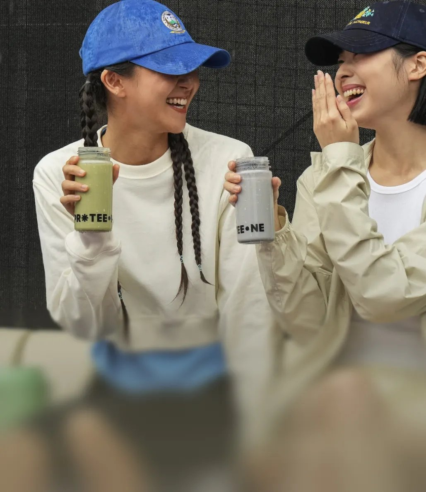 — 출처 <https://cf.image-farm.s.zigzag.kr/original/cms/2026/06/07/202606071546218221_014262.jpg?width=1029&height=1188&quality=80&format=webp&transparent=true>
- 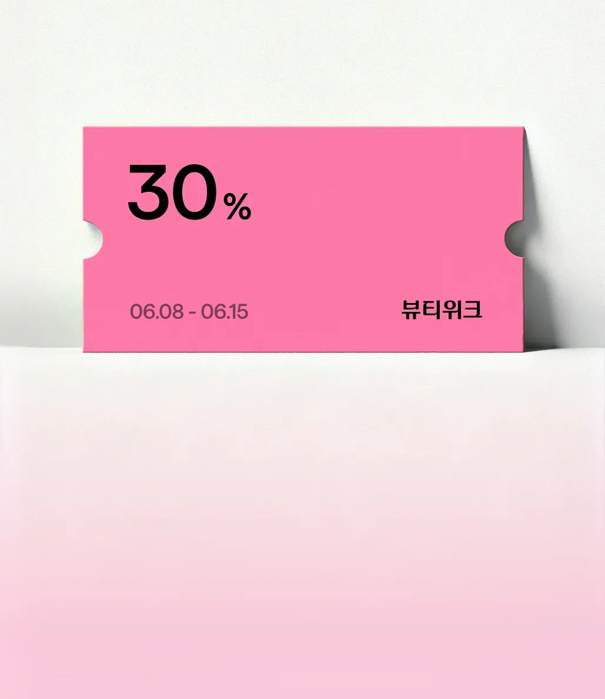 — 출처 <https://cf.image-farm.s.zigzag.kr/original/cms/2026/06/06/202606061727374996_084711.jpg?width=1029&height=1188&quality=80&format=webp&transparent=true>
- 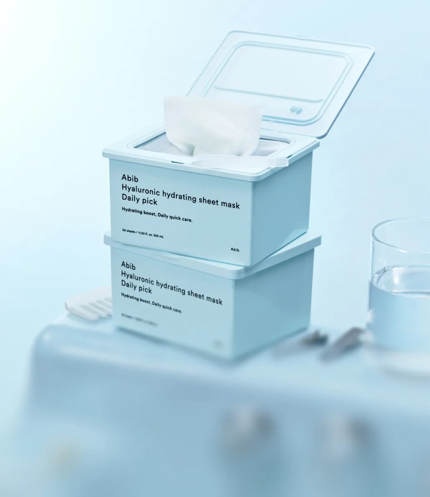 — 출처 <https://cf.image-farm.s.zigzag.kr/original/cms/2026/06/07/202606071541545195_052788.jpg?width=1029&height=1188&quality=80&format=webp&transparent=true>
- 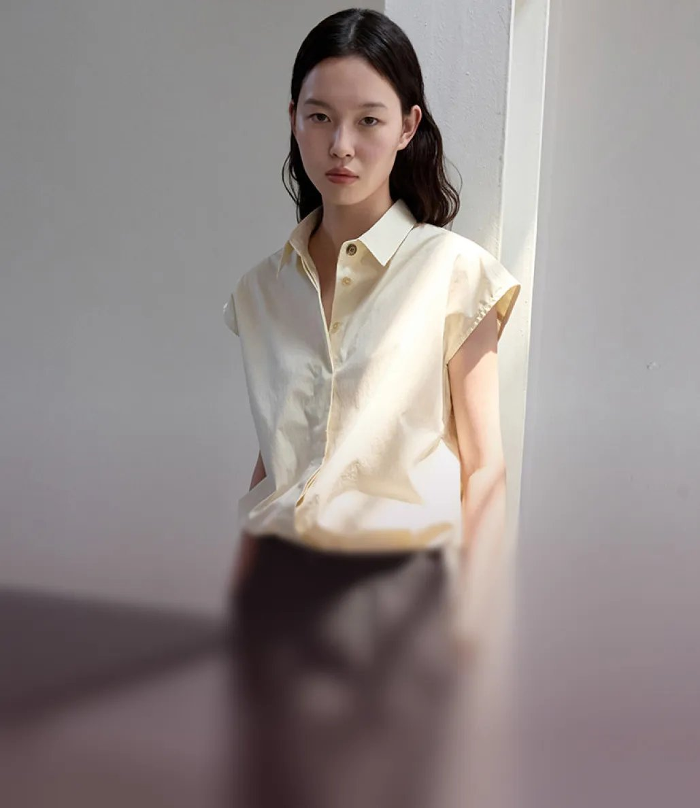 — 출처 <https://cf.image-farm.s.zigzag.kr/original/cms/2026/06/02/202606020811203246_062501.jpg?width=1029&height=1188&quality=80&format=webp&transparent=true>
- 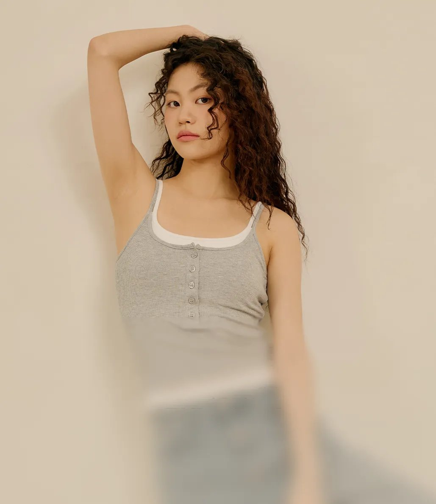 — 출처 <https://cf.image-farm.s.zigzag.kr/original/ad/2026/6/9/202606091706170954_72351.png?format=webp&quality=80&width=1029&height=1188&transparent=true>
-  — 출처 <https://cf.image-farm.s.zigzag.kr/original/ad/2026/6/5/202606051224540269_78824.png?format=webp&quality=80&width=1029&height=1188&transparent=true>

**페이지 메타 정보**

| page | title | description |
|---|---|---|
| [`home`](https://zigzag.kr/) | 지그재그 스토어 | 4,000만 여성이 선택한 올인원 쇼핑 앱 지그재그 - 제가 알아서 살게요. |

### 4.4 대만 _( Taiwan )_

- 한국 수출규모 순위: **#7** · region: `asia` · tier `1` · currency `TWD`
- 수집 사이트: **5개** (성공 4)
- 메모: K-패션 친화도 높음
#### [momo](https://www.momoshop.com.tw/)

- URL: <https://www.momoshop.com.tw/>
- 페이지: **OK 1 · FAIL 0**

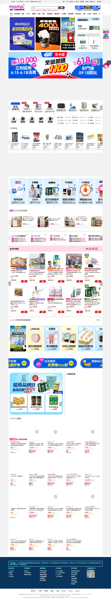

**대표 상품 이미지** (상위 6장, 출처 URL 포함)

-  — 출처 <https://img2.momoshop.com.tw/ecm/img/online/10/998/00/000/bt_0_271_01/bt_0_271_01_e2.jpg?t=1780918649360>
-  — 출처 <https://img2.momoshop.com.tw/ecm/img/online/10/998/00/000/bt_0_245_01/bt_0_245_01_P1_1_e2.png?t=1781020808566>
-  — 출처 <https://img1.momoshop.com.tw/ecm/img/online/10/998/00/000/bt_0_245_01/bt_0_245_01_P1_2_e2.png?t=1780934411497>
-  — 출처 <https://img1.momoshop.com.tw/ecm/img/online/10/998/00/000/bt_0_245_01/bt_0_245_01_P1_3_e2.png?t=1780934411497>
-  — 출처 <https://img1.momoshop.com.tw/ecm/img/online/81/998/00/000/mobile/bt_7_701_01/bt_7_701_01_e171.png?t=1780996675755>
-  — 출처 <https://img1.momoshop.com.tw/ecm/img/online/81/998/00/000/mobile/bt_7_701_01/bt_7_701_01_e161.jpg?t=1780996560877>

**페이지 메타 정보**

| page | title | description |
|---|---|---|
| [`home`](https://www.momoshop.com.tw/main/Main.jsp) | momo購物網 - 好評推薦 - 2026年6月 | momo購物網提供美妝保養、流行服飾、時尚精品、3C、數位家電、生活用品、美食旅遊票券…等數百萬件商品。快速到貨、超商取貨讓您購物最便利。mo店+商品抵用券天天搶、免運吃到飽，電視/直播商品限時下殺，每日讓您享超低價，並享有十天猶豫期；momo購物網為富邦及台灣大哥大關係企業 |

#### [OB Design](https://www.obdesign.com.tw/)

- URL: <https://www.obdesign.com.tw/>
- 페이지: **OK 1 · FAIL 0**

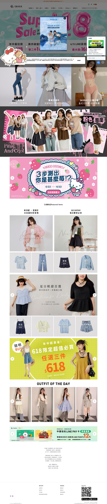

**대표 상품 이미지** (상위 6장, 출처 URL 포함)

- 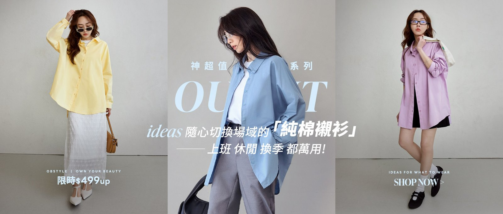 — 출처 <https://cms-static.cdn.91app.com/images/original/41602/92f19e4d-89b7-4330-9570-02cf1dff9742-1780640869-3sy0baovmv_d_1920x820_1280x547_1124x480_800x342_600x256_400x171.jpg>
-  — 출처 <https://cms-static.cdn.91app.com/images/compress/41602/92f19e4d-89b7-4330-9570-02cf1dff9742-1780640869-3sy0baovmv_d_400x171.webp>
-  — 출처 <https://cms-static.cdn.91app.com/images/original/41602/92f19e4d-89b7-4330-9570-02cf1dff9742-1780967806-w0s0fz0ca4_d_1920x820_1280x547_1124x480_800x342_600x256_400x171.jpg>
- 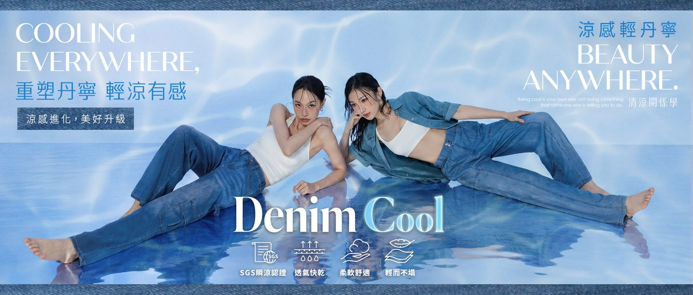 — 출처 <https://cms-static.cdn.91app.com/images/original/41602/92f19e4d-89b7-4330-9570-02cf1dff9742-1780452563-dn1wmx9ffo_d_1920x820_1280x547_1124x480_800x342_600x256_400x171.jpg>
-  — 출처 <https://cms-static.cdn.91app.com/images/original/41602/92f19e4d-89b7-4330-9570-02cf1dff9742-1780883505-a0d3jhklbp_d_1920x820_1280x547_1124x480_800x342_600x256_400x171.jpg>
- 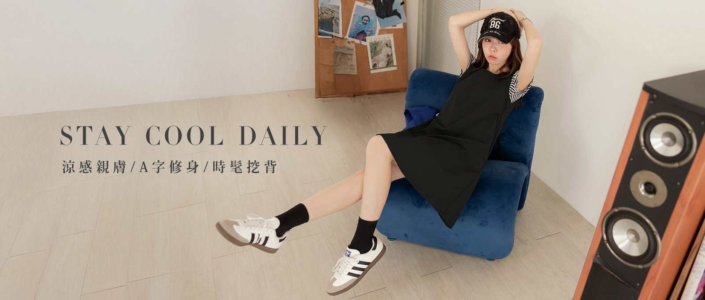 — 출처 <https://cms-static.cdn.91app.com/images/original/41602/92f19e4d-89b7-4330-9570-02cf1dff9742-1780883532-p7ileh8xvh_d_1920x820_1280x547_1124x480_800x342_600x256_400x171.jpg>

**페이지 메타 정보**

| page | title | description |
|---|---|---|
| [`home`](https://www.obdesign.com.tw/) | OB嚴選｜高CP值人氣熱銷服飾，流行服飾品牌 | 你的日常穿搭好夥伴，快上OB嚴選找，OB嚴選提供女裝、孕童、運動、男裝各項流行服飾，秉持優質服務給你高CP值的購物體驗。各種風格都能滿足熱愛穿搭的你，天天上新品，快速出貨，一起加入OB style！網路人氣服飾品牌OB嚴選 |

#### [PChome](https://24h.pchome.com.tw/)

- URL: <https://24h.pchome.com.tw/>
- 페이지: **OK 0 · FAIL 1**

**실패 페이지**

- `home` — http_status_429

#### [Pinkoi Taiwan](https://www.pinkoi.com/)

- URL: <https://www.pinkoi.com/>
- 페이지: **OK 2 · FAIL 0**

**대표 상품 이미지** (상위 6장, 출처 URL 포함)

-  — 출처 <https://cdn04.pinkoi.com/pinkoi.site/logo/og_image.png>

**페이지 메타 정보**

| page | title | description |
|---|---|---|
| [`accessories`](https://en.pinkoi.com/) | Pinkoi | Asia’s cross-border design marketplace | Design the way you are | Shop for original design products from Asia's independent designers. Pinkoi lives and breathes great design, great quality, great service, a |
| [`bags`](https://en.pinkoi.com/) | Pinkoi | Asia’s cross-border design marketplace | Design the way you are | Shop for original design products from Asia's independent designers. Pinkoi lives and breathes great design, great quality, great service, a |

#### [Yahoo Taiwan Shopping](https://tw.buy.yahoo.com/)

- URL: <https://tw.buy.yahoo.com/>
- 페이지: **OK 1 · FAIL 0**

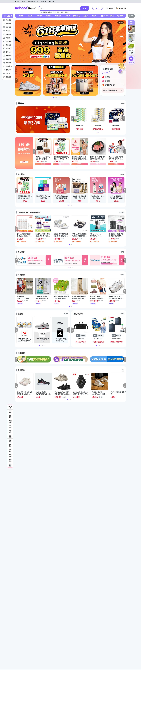

**대표 상품 이미지** (상위 6장, 출처 URL 포함)

- 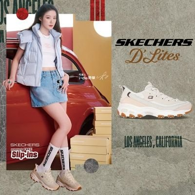 — 출처 <https://img.yec.tw/zp/MerchandiseImages/0a47fcbeba-Gd-11716309.jpg>
- 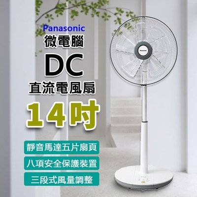 — 출처 <https://img.yec.tw/zp/MerchandiseImages/03DEC55892-SP-13567571.jpg>
-  — 출처 <https://img.yec.tw/zp/MerchandiseImages/8603831dbf-Gd-9948601.jpg>

**페이지 메타 정보**

| page | title | description |
|---|---|---|
| [`home`](https://tw.buy.yahoo.com/) | Yahoo購物中心 - 最懂生活的人 | 數百萬件商品，貼心客服為您服務，15天鑑賞期購物保障！ |

### 4.5 태국 _( Thailand )_

- 한국 수출규모 순위: **#8** · region: `asia` · tier `1` · currency `THB`
- 수집 사이트: **5개** (성공 5)
- 메모: 동남아 K-패션 핵심 시장
#### [Central Online](https://www.central.co.th/)

- URL: <https://www.central.co.th/>
- 페이지: **OK 1 · FAIL 0**

**대표 상품 이미지** (상위 6장, 출처 URL 포함)

-  — 출처 <https://www.central.co.th/_next/image?url=https%3A%2F%2Fassets.central.co.th%2Ffile-assets%2Fassets%2FCMS%2Fcampaign%2F2026%2F06jun%2F20260529_ggs_heroweb_d.jpg&w=3840&q=75>
-  — 출처 <https://www.central.co.th/_next/image?url=https%3A%2F%2Fassets.central.co.th%2Ffile-assets%2Fassets%2FCMS%2Fcampaign%2F2026%2F06jun%2F20260601_poloralphlauren_heroweb_d.jpg&w=3840&q=75>
-  — 출처 <https://www.central.co.th/_next/image?url=https%3A%2F%2Fassets.central.co.th%2Ffile-assets%2Fassets%2FCMS%2Fcampaign%2F2026%2F06jun%2F20260601_anta_heroweb_d.jpg&w=3840&q=75>
-  — 출처 <https://www.central.co.th/_next/image?url=%2Fimages%2Ffallback-image.webp&w=3840&q=75>
- 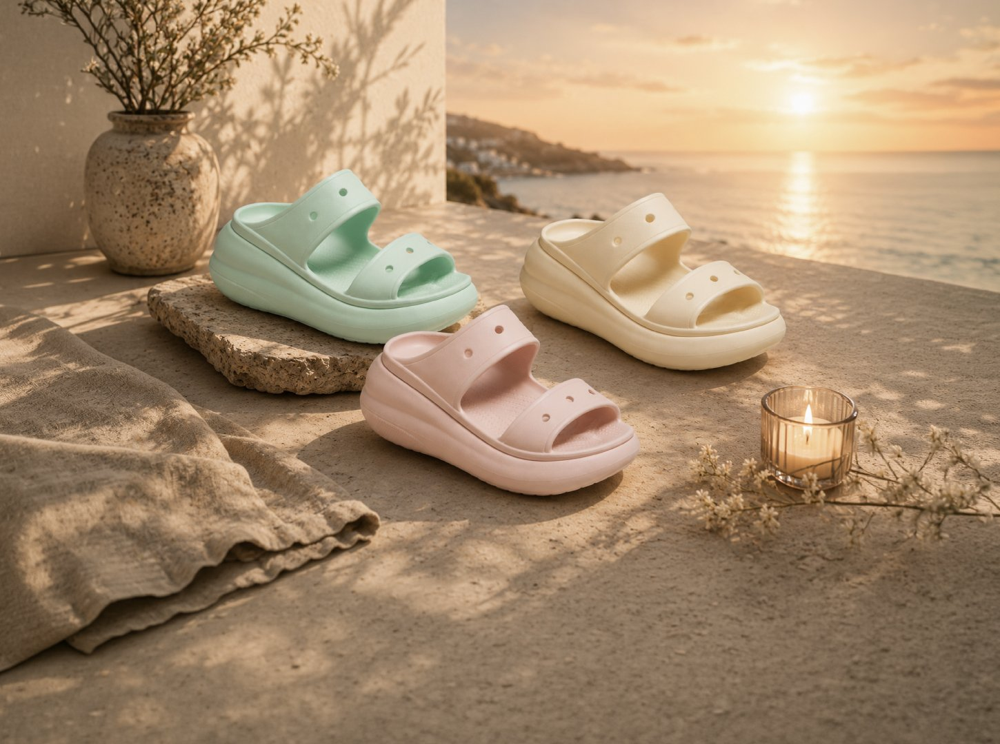 — 출처 <https://assets.central.co.th/file-assets/assets/CMS/campaign/2026/06jun/20260601_crocs_heroweb_d.jpg>
- 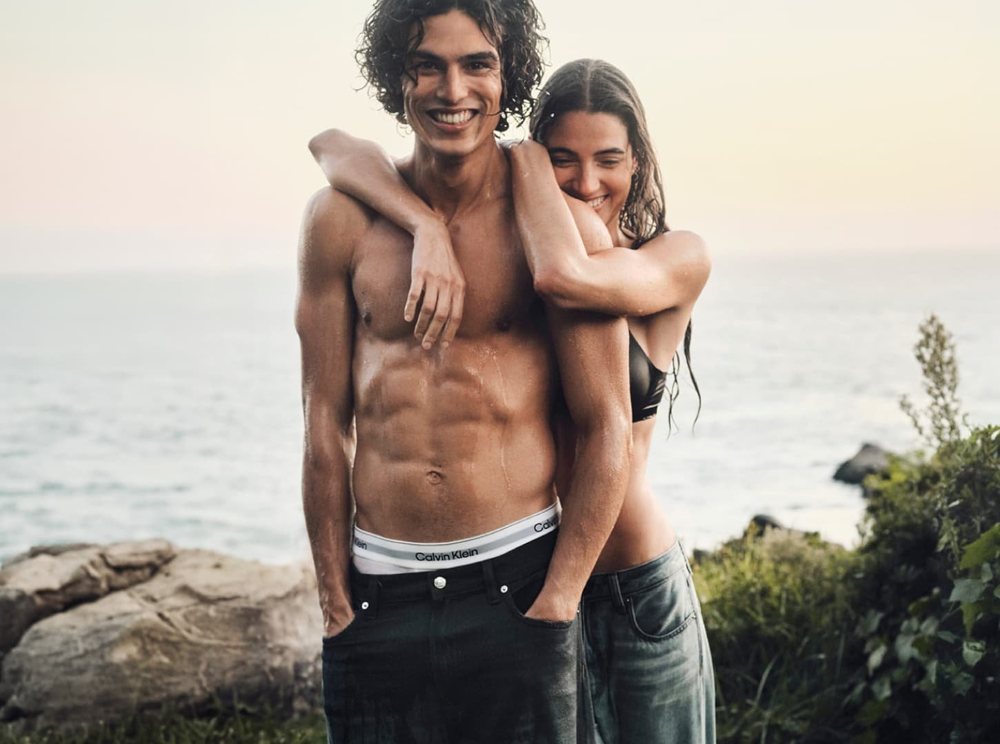 — 출처 <https://www.central.co.th/_next/image?url=https%3A%2F%2Fassets.central.co.th%2Ffile-assets%2Fassets%2FCMS%2Fcampaign%2F2026%2F06jun%2F20260601_CALVIN-KLEIN_heroweb_d.jpg&w=3840&q=75>

**페이지 메타 정보**

| page | title | description |
|---|---|---|
| [`home`](https://www.central.co.th/th) | Central Online | ลดสูงสุด 70% + คูปองลดเพิ่ม 12% | Grand Grand Sale โปรโมชั่นสุดยิ่งใหญ่ของปี 2026 เริ่มต้นขึ้นแล้ว! พบกับสินค้าจากหลากหลายแบรนด์ดังที่เราคัดสรรมาลดราคาสูงสุดถึง 70% พร้อมคูปอ |

#### [Lazada Thailand Fashion](https://www.lazada.co.th/)

- URL: <https://www.lazada.co.th/>
- 페이지: **OK 1 · FAIL 0**

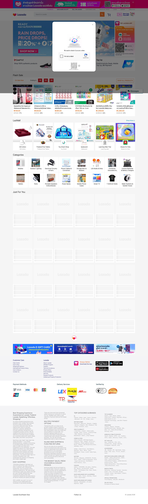

**대표 상품 이미지** (상위 6장, 출처 URL 포함)

-  — 출처 <https://img.lazcdn.com/us/domino/40845120240f19d13f738fa9a7978edd.png>
-  — 출처 <https://img.lazcdn.com/g/tps/images/ims-web/TB1KB2laMFY.1VjSZFnXXcFHXXa.png>
-  — 출처 <https://img.lazcdn.com/us/domino/703dbcf1-30e9-47a8-b288-a168c91e708c_TH-1976-688.jpg_2200x2200q80.jpg>
- 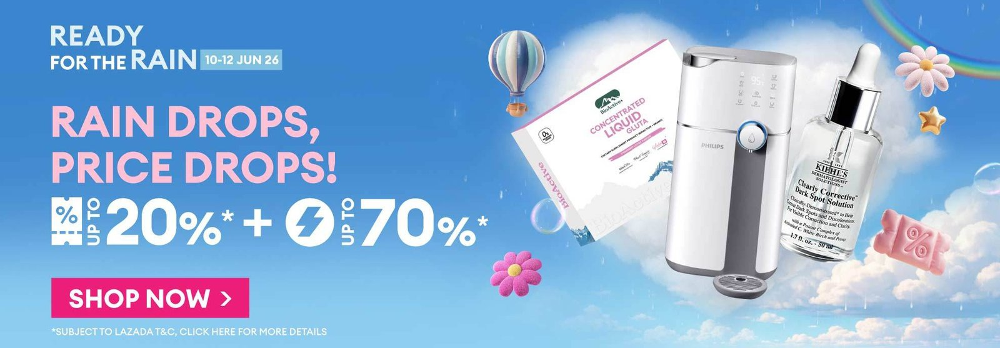 — 출처 <https://img.lazcdn.com/us/domino/fbc0983f-3af0-4c38-98f1-44a5ee3b1166_TH-1976-688.jpg_2200x2200q80.jpg>
-  — 출처 <https://img.lazcdn.com/us/domino/c400b9d1-d56f-49a6-9b5c-d42fbf6f6006_TH-1976-688.jpg_2200x2200q80.jpg>
- 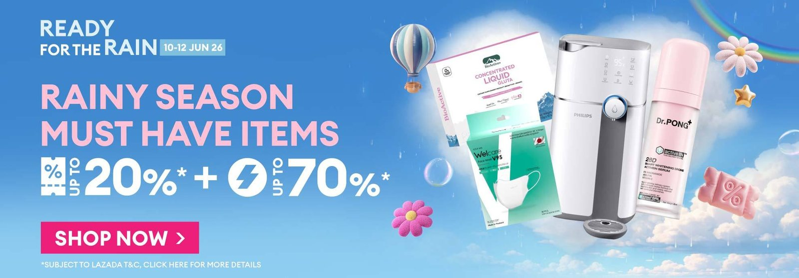 — 출처 <https://img.lazcdn.com/us/domino/65f980d7-8a32-478c-87b6-10ba9b46b39c_TH-1976-688.jpg_2200x2200q80.jpg>

**페이지 메타 정보**

| page | title | description |
|---|---|---|
| [`home`](https://www.lazada.co.th/#?) | Lazada Thailand | ช้อปออนไลน์ สินค้าดี พร้อมดีลพิเศษทุกวัน | พบกับ Lazada แพลตฟอร์มช้อปปิ้งชั้นนำในอาเซียน พร้อมบริการเก็บเงินปลายทาง LazMall LazFlash และดีลเด็ดจากแบรนด์ดังทุกวัน |

#### [Pomelo](https://www.pomelofashion.com/)

- URL: <https://www.pomelofashion.com/>
- 페이지: **OK 2 · FAIL 0**

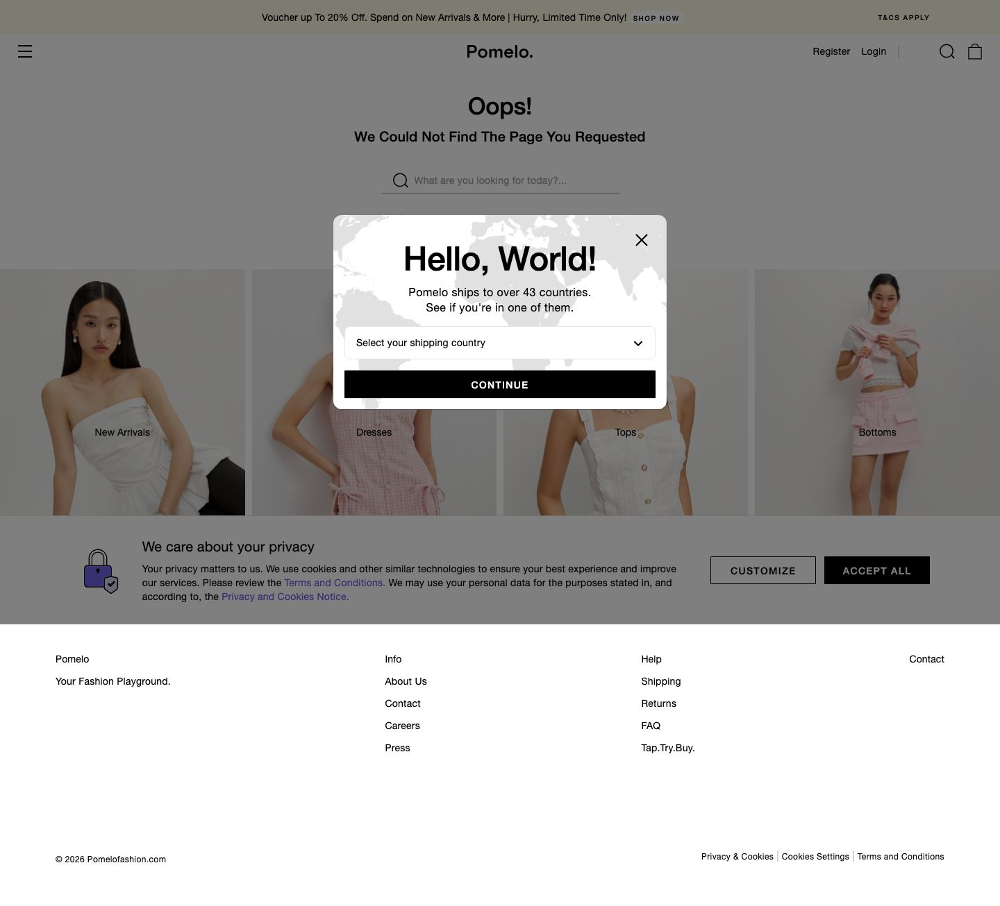

**대표 상품 이미지** (상위 6장, 출처 URL 포함)

-  — 출처 <https://cdn.pomelofashion.com/img/nav/3271/c/7422/20260428100935_69f024efaf715_banner-image.jpg?auto=compress,format&fm=webp,jpg,png&w=375&h=100>
-  — 출처 <https://cdn.pomelofashion.com/img/nav/3271/c/7419/20260302182158_69a572d670875_banner-image.jpg?auto=compress,format&fm=webp,jpg,png&w=375&h=100>
-  — 출처 <https://cdn.pomelofashion.com/img/nav/3271/c/88/20250620125126_6854f6de2dc98_banner-image.jpg?auto=compress,format&fm=webp,jpg,png&w=375&h=100>
-  — 출처 <https://cdn.pomelofashion.com/img/nav/3271/c/7420/20260312173657_69b297499ac84_banner-image.jpg?auto=compress,format&fm=webp,jpg,png&w=375&h=100>
-  — 출처 <https://cdn.pomelofashion.com/img/nav/3271/c/7418/20260216172249_6992eff96d8e5_banner-image.jpg?auto=compress,format&fm=webp,jpg,png&w=375&h=100>
-  — 출처 <https://cdn.pomelofashion.com/img/nav/3271/c/3658/20250620125237_6854f725c93d4_banner-image.jpg?auto=compress,format&fm=webp,jpg,png&w=375&h=100>

**페이지 메타 정보**

| page | title | description |
|---|---|---|
| [`new`](https://pomelofashion.com/global/en/collections/new-arrivals) | POMELO Fashion | Get all the latest fashion, updated twice every week! - Pomelo | Shop the latest fashion at POMELO fashion. Designed and manufactured in house for quality and style. Dresses, tops, knits, jackets, denim, a |
| [`best`](https://pomelofashion.com/global/en/collections/best-sellers) | POMELO Fashion | Get all the latest fashion, updated twice every week! - Pomelo | Shop the latest fashion at POMELO fashion. Designed and manufactured in house for quality and style. Dresses, tops, knits, jackets, denim, a |

#### [Shopee Thailand Fashion](https://shopee.co.th/)

- URL: <https://shopee.co.th/>
- 페이지: **OK 1 · FAIL 0**

**페이지 메타 정보**

| page | title | description |
|---|---|---|
| [`home`](https://shopee.co.th/verify/traffic/error?home_url=https%3A%2F%2Fshopee.co.th&is_logged_in=false&next=https%3A%2F%2Fshopee.co.th%2F&tracking_id=788b1a8da1d-11ab-42ca-9b7b-c160c087a5f7&type=4) | Shopee Thailand | Hot Deals, Best Prices |  |

#### [Zalora Thailand](https://www.zalora.co.th/)

- URL: <https://www.zalora.co.th/>
- 페이지: **OK 1 · FAIL 0**

**대표 상품 이미지** (상위 6장, 출처 URL 포함)

-  — 출처 <https://www.zalora.co.th/images/landingpage/525x500.gif>

**페이지 메타 정보**

| page | title | description |
|---|---|---|
| [`home`](https://www.zalora.co.th/) | ZALORA - ASIA'S LEADING ONLINE FASHION DESTINATION |  |

### 4.6 미국 _( United States )_

- 한국 수출규모 순위: **#1** · region: `north_america` · tier `1` · currency `USD`
- 수집 사이트: **5개** (성공 4)
- 메모: 한국 의류 최대 수출국. 대형 이커머스와 브랜드 커머스 중심
#### [Etsy](https://www.etsy.com/)

- URL: <https://www.etsy.com/>
- 페이지: **OK 2 · FAIL 0**

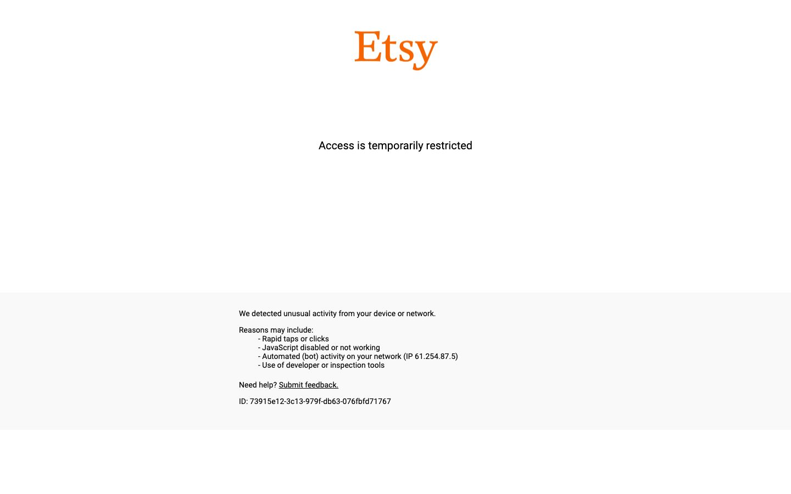

**페이지 메타 정보**

| page | title | description |
|---|---|---|
| [`trending_jewelry`](https://www.etsy.com/c/jewelry) | etsy.com |  |
| [`trending_accessories`](https://www.etsy.com/c/accessories) | etsy.com |  |

#### [Macy's](https://www.macys.com/)

- URL: <https://www.macys.com/>
- 페이지: **OK 1 · FAIL 0**

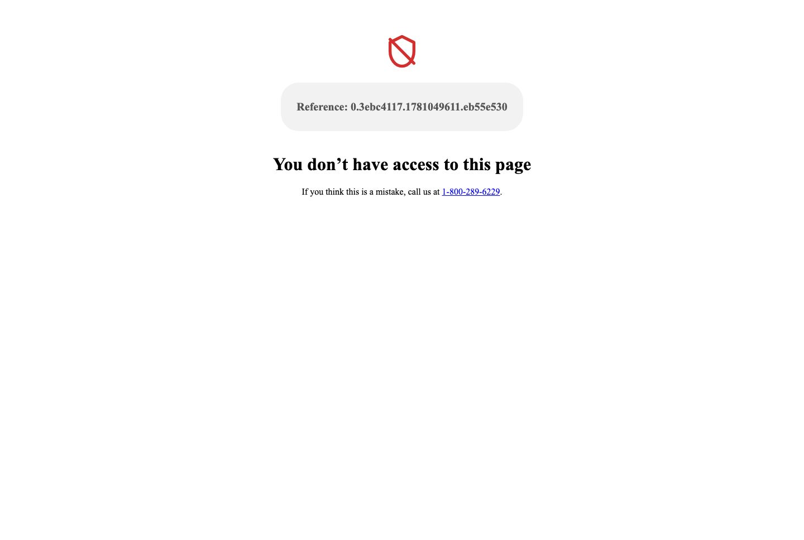

**페이지 메타 정보**

| page | title | description |
|---|---|---|
| [`new`](https://www.macys.com/shop/whats-new?id=14834) | Access Denied - Macy's | Access denied 403 |

#### [Nordstrom](https://www.nordstrom.com/)

- URL: <https://www.nordstrom.com/>
- 페이지: **OK 2 · FAIL 0**

**페이지 메타 정보**

| page | title | description |
|---|---|---|
| [`new`](https://siteclosed.nordstrom.com/invitation.html) | Nordstrom |  |
| [`women`](https://siteclosed.nordstrom.com/invitation.html) | Nordstrom |  |

#### [Revolve](https://www.revolve.com/)

- URL: <https://www.revolve.com/>
- 페이지: **OK 0 · FAIL 2**

**실패 페이지**

- `new` — playwright_error: Error: Page.goto: net::ERR_HTTP2_PROTOCOL_ERROR at https://www.revolve.com/new/br/c79f88/
Call log:
  - navigating to "https://www.revolve.com/new/br/c79f88/", waiting until "domcontentloaded"

- `trending` — playwright_error: Error: Page.goto: net::ERR_HTTP2_PROTOCOL_ERROR at https://www.revolve.com/most-loved/br/4a9ca5/
Call log:
  - navigating to "https://www.revolve.com/most-loved/br/4a9ca5/", waiting until "domcontentloaded"

#### [Urban Outfitters](https://www.urbanoutfitters.com/)

- URL: <https://www.urbanoutfitters.com/>
- 페이지: **OK 1 · FAIL 0**

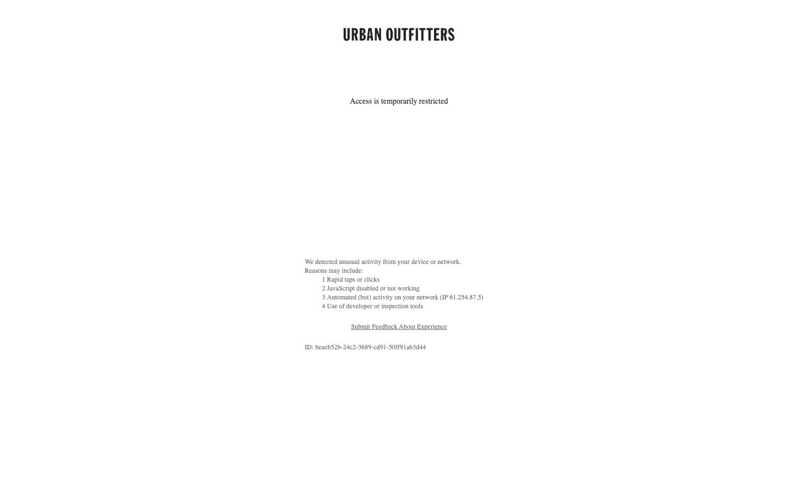

**페이지 메타 정보**

| page | title | description |
|---|---|---|
| [`new_women`](https://www.urbanoutfitters.com/womens-new-arrivals) | urbanoutfitters.com |  |

### 4.7 베트남 _( Vietnam )_

- 한국 수출규모 순위: **#4** · region: `asia` · tier `1` · currency `VND`
- 수집 사이트: **5개** (성공 5)
- 메모: 의류 생산기지/원단 수출 비중 큼. 빠르게 성장하는 이커머스
#### [Canifa](https://canifa.com/)

- URL: <https://canifa.com/>
- 페이지: **OK 1 · FAIL 0**

**대표 상품 이미지** (상위 6장, 출처 URL 포함)

-  — 출처 <https://2885371169.e.cdneverest.net/Simiconnector/BannerSlider/t/c/tce_topbanner_desktop-130526.webp>
- 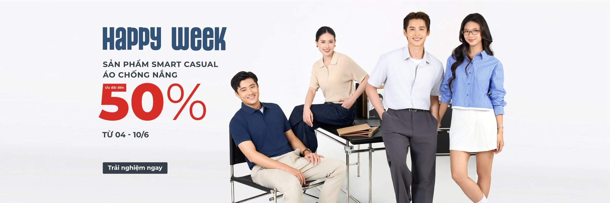 — 출처 <https://2885371169.e.cdneverest.net/Simiconnector/BannerSlider/h/w/hw1_topbanner_desktop-080626.webp>
-  — 출처 <https://canifa.com/_nuxt/img/chatbot-icon.c84d6ec.webp>
-  — 출처 <https://canifa.com/_nuxt/img/chat-zalo.ab5351f.webp>

**페이지 메타 정보**

| page | title | description |
|---|---|---|
| [`home`](https://canifa.com/) | CANIFA | Fashion For All | CANIFA - thương hiệu thời trang hàng đầu Việt Nam. Hàng ngàn mẫu quần áo phụ kiện nam, nữ, trẻ em cao cấp, chất lượng, an toàn liên tục được |

#### [IVY moda](https://ivymoda.com/)

- URL: <https://ivymoda.com/>
- 페이지: **OK 1 · FAIL 0**

**대표 상품 이미지** (상위 6장, 출처 URL 포함)

-  — 출처 <https://cotton4u.vn/files/news/2026/06/05/66c8b67c7c8b9d36a46126b210bf4fcb.webp>
-  — 출처 <https://cotton4u.vn/files/news/2026/06/01/d4e41606cd8e771d49b74af15e84c9d9.webp>
-  — 출처 <https://cotton4u.vn/files/news/2026/05/22/179c1077503915474aedcc329587712a.webp>
- 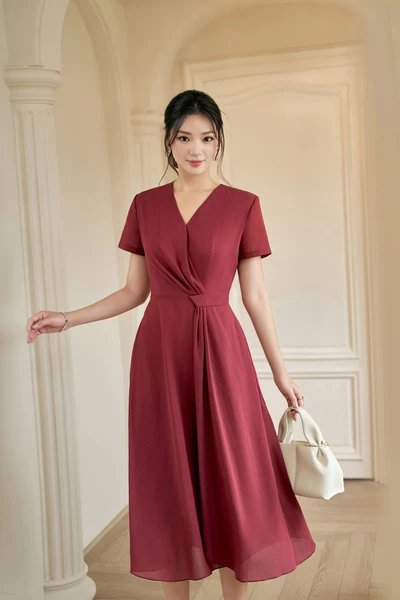 — 출처 <https://cotton4u.vn/files/product/thumab/400/2026/06/08/106562ffe6148f7b22adee8310150f91.webp>
-  — 출처 <https://cotton4u.vn/files/product/thumab/400/2026/06/08/dc039eddfa6eb70a630cba159628036a.webp>
-  — 출처 <https://cotton4u.vn/files/product/thumab/400/2026/05/14/c6ef08cd461bd619c6208fd0a0a28238.webp>

**페이지 메타 정보**

| page | title | description |
|---|---|---|
| [`home`](https://ivymoda.com/) | IVY moda - Thời Trang Công Sở Hiện Đại | IVY moda |  |

#### [Lazada Vietnam](https://www.lazada.vn/)

- URL: <https://www.lazada.vn/>
- 페이지: **OK 1 · FAIL 0**

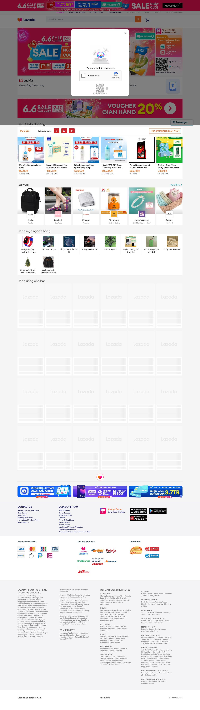

**대표 상품 이미지** (상위 6장, 출처 URL 포함)

-  — 출처 <https://img.lazcdn.com/us/domino/2ad4f22ce5a43dc145f221d13feed352.png>
-  — 출처 <https://img.lazcdn.com/g/tps/images/ims-web/TB1T7K2d8Cw3KVjSZFuXXcAOpXa.png>
-  — 출처 <https://img.lazcdn.com/us/domino/40581cd1-e577-40dc-8a42-b536c8643f97_VN-1976-688.jpg_2200x2200q80.jpg>
-  — 출처 <https://img.lazcdn.com/us/domino/0c9e7016-e124-4852-a9c0-394e8ed52444_VN-1976-688.jpg_2200x2200q80.jpg>
-  — 출처 <https://img.lazcdn.com/us/domino/74474255-36ee-4936-ae12-091e6835d5f8_VN-1976-688.jpg_2200x2200q80.jpg>
-  — 출처 <https://img.lazcdn.com/us/domino/dd3aed97-720c-4b4e-a760-a1a1195f17f5_VN-1976-688.jpg_2200x2200q80.jpg>

**페이지 메타 정보**

| page | title | description |
|---|---|---|
| [`home`](https://www.lazada.vn/#?) | Lazada Việt Nam | Mua Sắm Online, Giá Tốt Nhất Mỗi Ngày | Mua sắm đồ điện tử, thời trang, làm đẹp và đồ chơi giá cả phải chăng. Đảm bảo sản phẩm chính hãng và trải nghiệm mua sắm tiện lợi – mua ngay |

#### [Shopee Vietnam](https://shopee.vn/)

- URL: <https://shopee.vn/>
- 페이지: **OK 1 · FAIL 0**

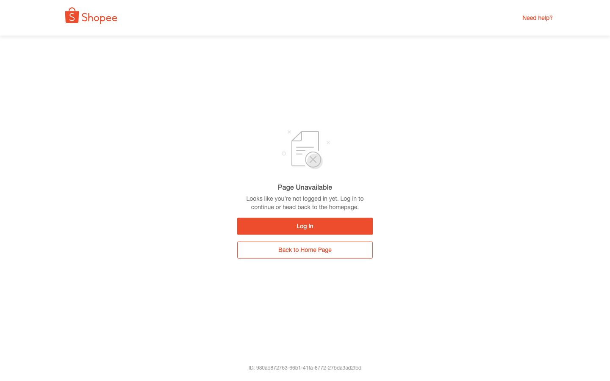

**페이지 메타 정보**

| page | title | description |
|---|---|---|
| [`home`](https://shopee.vn/verify/traffic/error?home_url=https%3A%2F%2Fshopee.vn&is_logged_in=false&next=https%3A%2F%2Fshopee.vn%2F&tracking_id=980ad872763-66b1-41fa-8772-27bda3ad2fbd&type=4) | Shopee Việt Nam | Hot Deals, Best Prices |  |

#### [Tiki](https://tiki.vn/)

- URL: <https://tiki.vn/>
- 페이지: **OK 1 · FAIL 0**

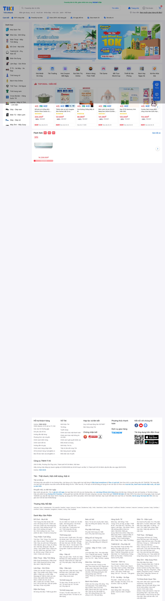

**대표 상품 이미지** (상위 6장, 출처 URL 포함)

-  — 출처 <https://salt.tikicdn.com/cache/100x100/ts/category/ed/20/60/afa9b3b474bf7ad70f10dd6443211d5f.png>
-  — 출처 <https://salt.tikicdn.com/cache/100x100/ts/category/f6/22/46/7e2185d2cf1bca72d5aeac385a865b2b.png>
-  — 출처 <https://salt.tikicdn.com/cache/100x100/ts/category/54/c0/ff/fe98a4afa2d3e5142dc8096addc4e40b.png>
-  — 출처 <https://salt.tikicdn.com/cache/100x100/ts/category/13/64/43/226301adcc7660ffcf44a61bb6df99b7.png>
-  — 출처 <https://salt.tikicdn.com/cache/100x100/ts/category/75/34/29/78e428fdd90408587181005f5cc3de32.png>
-  — 출처 <https://salt.tikicdn.com/cache/100x100/ts/category/61/d4/ea/e6ea3ffc1fcde3b6224d2bb691ea16a2.png>

**페이지 메타 정보**

| page | title | description |
|---|---|---|
| [`home`](https://tiki.vn/) | Tiki - Mua hàng online giá tốt, hàng chuẩn, ship nhanh | Tiện lợi mua sắm hàng triệu mặt hàng, dịch vụ. Vô vàn ưu đãi freeship, mã giảm giá. Hoàn tiền 15% tối đa 600k/tháng với thẻ tín dụng TikiCAR |

## 5. 의류 카테고리별 글로벌 트렌드

| # | 카테고리 | 건수 | 대표 상품명 |
|---:|---|---:|---|
| 1 | `셔츠` | 13 | [10차 리오더][NEW컬러 추가] 제제 언발란스 티셔츠 / ZEZE UNBALANCE T-SHIRT_6colors · [단독][4차 리오더]시아 텐셀 드레이프 티셔츠 / SIA TENCEL DRAPED T-SHIRT_3colors · 아르테 로고 티셔츠 / ARTE LOGO T-SHIRT_2colors |
| 2 | `블라우스` | 11 | 소핀 브이넥 텍스처드 래글런 블라우스 / SOPHINE V-NECK TEXTURED RAGLAN BLOUSE_2colors · [3차 리오더]아리아 플라워 슬리브리스 블라우스 / ARIA FLOWER SLEEVELESS BLOUSE_2colors · 솔렌 모크넥 버튼업 블라우스 / SOLENE MOCK-NECK BUTTON UP BLOUSE_4colors |
| 3 | `팬츠` | 8 | [기장 옵션추가] [3차 리오더] 리네아 스트레이트 데님 팬츠 / LINEA STRAIGHT DENIM PANTS_3colors · [3차 리오더]가엘 썸머 세미와이드 데님 팬츠_라이트 블루 / GAELLE SUMMER SEMI WIDE DENIM PANTS_LIGHT BLUE · 마르틴 투 턱 하프 팬츠_아이보리 / MARTINE TWO TUCK HALF PANTS_IVORY |
| 4 | `니트` | 7 | [5차 리오더]클로에 스퀘어 넥 슬리브리스 니트 / CHLOE SQUARE NECK SLEEVELESS KNIT_3colors · [단독][3차 리오더]루아 숄 니트 셋업  / LUA SHAWL KNIT SET UP_3colors · [워셔블] 다니엘 베이직 브이넥 슬리브리스 니트 / DANIEL BASIC V-NECK SLEEVELESS KNIT_3colors |
| 5 | `가디건` | 6 | [단독]에디트 베이직 라운드 가디건 / EDITH BASIC ROUND CARDIGAN_5colors · [☀️살안타템/두가지핏!] made. 시몬 쿨썸머 가디건 - 5 color · [살안타템☀️/에어컨템][여리핏][MADE] 랄피 라운드넥 긴팔 물결가디건 (44~110) (빅사이즈가디건-살안타템-여름가디건-골지가디건-에어컨템-러블리-체형커버) |
| 6 | `스커트` | 4 | 니콜 나일론 에이치 라인 미디 스커트_네이비 / NICOLE NYLON H-LINE MIDI SKIRT_NAVY · 플로라 플레어 롱 스커트 / FLORA FLARE LONG SKIRT_2colors · [단독]아리안느 텍스처 레이스 트림 미니 스커트 / ARIANE TEXTURED LACE TRIM MINI SKIRT_2colors |
| 7 | `dress` | 3 | [단독][3차 리오더]슈 슬리브리스 미니 드레스 / SHU SLEEVELESS MINI DRESS_2colors · 에리카 썸머 울 클레식 미니 드레스_블랙 / ERICA SUMMER WOOL CLASSIC MINI DRESS_BLACK · 모니카 퍼프 슬리브 벨트 드레스_블랙 / MONICA PUFF SLEEVE BELT DRESS_BLACK |
| 8 | `슬랙스` | 3 | [🏆역대급100만장/썸머XL추가!] made. 마켓 와이드 트레이닝슬랙스 (+숏/베이직/롱ver) - 4 size · [✨구김걱정NO/💐하객룩추천] made. 세미부츠컷 찰랑슬랙스 (+베이직/롱ver) - 4 size · [🔥후기인증/🎖️1등슬랙스] made. 모먼트 투커버 올데이슬랙스 (+숏/베이직/롱ver) - 4 size |
| 9 | `tee` | 2 | 프리츠한센 IKEBANA SMALL(STAINLESS STEEL) · PWC RIBBED EVERYDAY SHORT SLEEVE TEE_8COLOR |
| 10 | `자켓` | 2 | [단독][4차 리오더][SET-UP]엠마 린넨 스트랩 자켓 / EMMA LINEN STRAP JACKET_3colors · 하나 노카라 트위드 자켓 / HANA NO COLLAR TWEED JACKET_2colors |

**국가별 의류 TOP**

- **korea**: `셔츠`(13), `블라우스`(11), `팬츠`(8), `니트`(7), `가디건`(6)
## 6. 악세사리 카테고리별 글로벌 트렌드

| # | 카테고리 | 건수 | 대표 상품명 |
|---:|---|---:|---|
| 1 | `necklace` | 1 | SHELL SILVER  NECKLACE (SILVER) |
| 2 | `cap` | 1 | [단독]아델 홀터넥 리브드 슬림 캡 탑 / ADELE HALTER RIBBED SLIM CAP TOP_4colors |
| 3 | `벨트` | 1 | 엘르 비건 레더 벨트 / ELLE VEGAN LEATHER BELT_4colors |

**국가별 악세사리 TOP**

- **korea**: `necklace`(1), `cap`(1), `벨트`(1)
## 7. 국가별 가격대 비교

| 국가 | 통화 | 표본 | min | p25 | median | p75 | max | median (USD) |
|---|---|---:|---:|---:|---:|---:|---:|---:|
| korea | KRW | 116 | 6750 | 25515 | 34790 | 81567 | 1360000 | 22.75 |

> p25/p75 는 IQR 기준 분위수. USD 환산은 `config/exchange_rates.yaml` 기준 (운영자가 정기 갱신).

## 8. 국내 의류·악세사리 사업동향

### KITA K-stat

- 한국무역통계의 국가 수출입 통계 총괄 페이지입니다.
- 사이트: <https://stat.kita.net/stat/kts/ctr/CtrTotalImpExpList.screen>

| # | topic | title | url |
|---:|---|---|---|
| 1 | `trade` | KITA.NET | <https://www.kita.net/> |
| 2 | `trade` | K-stat 란? | <https://www.kita.net/pdf/statGuide/index.html#p=1> |
| 3 | `무역통계` | 무역통계 분류 | <https://stat.kita.net/stat/guide/guide_18_01.screen> |
| 4 | `trade` | 한국품목코드 | <https://stat.kita.net/stat/kts/statCode/ItemHierCodeList.screen> |
| 5 | `trade` | 해외품목코드 | <https://stat.kita.net/stat/istat/common/IstatHSCode.screen> |
| 6 | `trade` | 대륙/경제코드 | <https://stat.kita.net/stat/kts/statCode/ConEcoCodeList.screen> |
| 7 | `trade` | 수출입 총괄 | <https://stat.kita.net/stat/kts/sum/SumImpExpTotalList.screen> |
| 8 | `trade` | 가공단계 수출입 | <https://stat.kita.net/stat/kts/use/BecList.screen> |
| 9 | `trade` | 품목 수출입 | <https://stat.kita.net/stat/kts/pum/ItemImpExpList.screen> |
| 10 | `trade` | 국가 수출입 | <https://stat.kita.net/stat/kts/ctr/CtrTotalImpExpList.screen> |
| 11 | `trade` | 대륙/경제권 수출입 | <https://stat.kita.net/stat/kts/rel/RelColligationList.screen> |
| 12 | `trade` | 지자체 수출입 | <https://stat.kita.net/stat/kts/prod/ProdWholeList.screen> |
| 13 | `trade` | 항구/공항 수출입 | <https://stat.kita.net/stat/kts/port/PortImpExpList.screen> |
| 14 | `trade` | FTA체결국 수출입 | <https://stat.kita.net/stat/kts/fta/FtaCtrImpExpList.screen> |
| 15 | `trade` | 간접수출 현황 | <https://stat.kita.net/stat/ind/KtsIndMain.screen> |

### Korea Customs Service

- 수출입 현황, 물류통계 등 관세청 무역통계정보를 종합적으로 제공
- 사이트: <https://tradedata.go.kr/cts/index_eng.do>

| # | topic | title | url |
|---:|---|---|---|
| 1 | `trade` | Korea Customs Service | <http://customs.go.kr/english/main.do> |

### KOSIS

- 코시스, 국가데이터처가 제공하는 원스톱 통계 서비스, 국가승인통계, 국제통계, 북한통계, e-지방지표, 통계시각화콘텐츠, 온라인간행물 등 제공
- 사이트: <https://kosis.kr/statisticsList/statisticsListIndex.do;jsessionid=8J0oJjV6Ay5kbMHcEQb4dlFkLJIQJT5NDIC7nHSC.esvwas3_S31?parmTabId=M_01_01&vwcd=MT_ZTITLE&menuId=M_01_01&outLink=Y&entrType=>

| # | topic | title | url |
|---:|---|---|---|
| 1 | `statistics` | 쉽게 보는 통계 | <http://kosis.kr/easyViewStatis/customStatisIndex.do?vwcd=MT_TM1_TITLE&menuId=M_03_01> |
| 2 | `statistics` | 이슈별 접근 | <http://kosis.kr/easyViewStatis/customStatisIndex.do?vwcd=MT_TM2_TITLE&menuId=M_03_02> |
| 3 | `statistics` | 통계시각화콘텐츠 | <http://kosis.kr/easyViewStatis/visualizationIndex.do> |
| 4 | `statistics` | 온라인간행물 | <http://kosis.kr/publication/publicationThema.do> |
| 5 | `statistics` | 기획간행물 | <http://kosis.kr/publication/publicationStat.do> |
| 6 | `statistics` | KOSIS 길라잡이 | <http://kosis.kr/civilComplaint/kosisGuideIndex.do> |
| 7 | `statistics` | 홈페이지 개선의견 | <http://kosis.kr/civilComplaint/siteRequestList.do> |
| 8 | `statistics` | 찾아가는 KOSIS | <http://kosis.kr/civilComplaint/kosisEduIndex.do> |
| 9 | `statistics` | 서비스 소개 | <http://kosis.kr/serviceInfo/kosisIntroduce.do> |
| 10 | `statistics` | 국가통계현황 | <http://kosis.kr/serviceInfo/statisInstitution.do> |
| 11 | `statistics` | 국가통계 공표일정 | <http://kosis.kr/serviceInfo/statisPublicationList.do> |
| 12 | `statistics` | 팩트체크 서비스 | <http://kosis.kr/serviceInfo/factCheckList.do> |
| 13 | `statistics` | 서비스정책 | <http://kosis.kr/serviceInfo/useGuide.do> |
| 14 | `statistics` | 공유서비스 (OpenAPI) | <http://kosis.kr/serviceInfo/openAPIGuide.do> |
| 15 | `statistics` | English | <https://kosis.kr/eng> |

### KOTRA

- 트라이빅(TriBig)은 코트라(KOTRA)가 제공하는 무역투자 빅데이터 플랫폼으로 무역투자통계, 국가별 시장정보, 품목별 유망시장, 기업별 맞춤정보, 해외바이어 정보의 서비스를 제공합니다.
- 사이트: <https://www.kotra.or.kr/bigdata/visualization/korea#search/ALL/ALL/2024>

| # | topic | title | url |
|---:|---|---|---|
| 1 | `trade` | kotra 무역투자24 | <https://www.kotra.or.kr/bigdata/kotraSsoRedirect?targetURL=https://www.kotra.or.kr> |
| 2 | `trade` | 해외비즈니스 정보 포털 | <https://www.kotra.or.kr/bigdata/kotraSsoRedirect?targetURL=https://dream.kotra.or.kr/dream> |
| 3 | `trade` | 글로벌 전시포털 | <https://www.kotra.or.kr/bigdata/kotraSsoRedirect?targetURL=https://www.gep.or.kr/> |
| 4 | `trade` | KOTRA 해외인재유치센터 | <https://www.kotra.or.kr/gtc_kor> |
| 5 | `trade` | 투자유치정보제공 | <https://www.kotra.or.kr/bigdata/kotraSsoRedirect?targetURL=https://www.investkorea.org/> |
| 6 | `수출지원` | 수출지원 온라인 플랫폼 | <https://www.kotra.or.kr/bigdata/kotraSsoRedirect?targetURL=https://www.buykorea.or.kr/> |
| 7 | `trade` | 빅데이터 서비스 | <https://www.kotra.or.kr/bigdata/> |
| 8 | `trade` | 경제외교 활용포털 | <https://www.kotra.or.kr/bigdata/kotraSsoRedirect?targetURL=https://president.globalwindow.org> |
| 9 | `trade` | 방산물자교역지원센터 | <https://www.kotra.or.kr/bigdata/kotraSsoRedirect?targetURL=https://www.kotra.or.kr/kodits> |
| 10 | `trade` | 외투기업고충처리 | <https://www.kotra.or.kr/bigdata/kotraSsoRedirect?targetURL=https://ombudsman.kotra.or.kr/ob-kr> |
| 11 | `trade` | 수출바우처 · 지사화 | <https://www.exportvoucher.com> |
| 12 | `trade` | 무역투자통계 | <https://www.kotra.or.kr/bigdata/visualization/korea> |
| 13 | `trade` | 국가별 시장정보 | <https://www.kotra.or.kr/bigdata/marketAnalysis> |
| 14 | `trade` | 품목별 유망시장 | <https://www.kotra.or.kr/bigdata/bhrcMarket> |
| 15 | `trade` | 해외바이어 정보 | <https://www.kotra.or.kr/bigdata/partner/search> |

### Statistics Korea Online Shopping

- 국가데이터처,List | 전체 | 보도자료 | 새소식
- 사이트: <https://mods.go.kr/board.es?mid=a10301010000&bid=11789>

| # | topic | title | url |
|---:|---|---|---|
| 1 | `statistics` | 정보공개제도 | <https://mods.go.kr/menu.es?mid=a10101010100> |
| 2 | `statistics` | 정보공개청구 | <https://www.open.go.kr/com/main/mainView.do> |
| 3 | `statistics` | 비공개대상정보세부기준 | <https://mods.go.kr/menu.es?mid=a10101030000> |
| 4 | `statistics` | 고객수요분석 | <https://mods.go.kr/menu.es?mid=a10101040000> |
| 5 | `statistics` | 사전정보공표 | <https://mods.go.kr/menu.es?mid=a10103010000> |
| 6 | `statistics` | 사전정보공표목록 | <https://mods.go.kr/menu.es?mid=a10103010100> |
| 7 | `statistics` | 핵심단어목록 | <https://mods.go.kr/menu.es?mid=a10103020100> |
| 8 | `statistics` | 인기정보TOP10 | <https://mods.go.kr/menu.es?mid=a10103030100> |
| 9 | `statistics` | 행정자료실 | <https://mods.go.kr/menu.es?mid=a10104010000> |
| 10 | `statistics` | 업무추진비 | <https://mods.go.kr/menu.es?mid=a10104010100> |
| 11 | `statistics` | 국회관련정보 | <https://mods.go.kr/menu.es?mid=a10104040000> |
| 12 | `statistics` | 정책실명제 | <https://mods.go.kr/menu.es?mid=a10105010000> |
| 13 | `statistics` | 연도별대상사업현황 | <https://mods.go.kr/menu.es?mid=a10105020000> |
| 14 | `statistics` | 중점관리대상사업 | <https://mods.go.kr/menu.es?mid=a10105030600> |
| 15 | `statistics` | 국민신청실명제 | <https://mods.go.kr/menu.es?mid=a10105040000> |

### 기업마당

- 기업마당>정책정보>지원사업 공고
- 사이트: <https://www.bizinfo.go.kr/sii/siia/selectSIIA200View.do?null>

| # | topic | title | url |
|---:|---|---|---|
| 1 | `policy` | 지원사업 공고 | <https://www.bizinfo.go.kr/sii/siia/selectSIIA200View.do> |
| 2 | `policy` | 품목별 법정의무 인증제도 | <https://www.bizinfo.go.kr/biz/biza/selectBIZA100View.do> |
| 3 | `policy` | 입법·행정예고/고시 | <https://www.bizinfo.go.kr/biz/biza/selectBIZA300View.do> |
| 4 | `policy` | 월간 중기누리 | <https://www.bizinfo.go.kr/biz/biza/selectBIZA400View.do> |
| 5 | `policy` | 기업업무용 서식 | <https://www.bizinfo.go.kr/biz/bizb/selectBIZB100View.do> |
| 6 | `policy` | 입주기업 모집공고 | <https://www.bizinfo.go.kr/biz/bizb/selectBIZB200View.do> |
| 7 | `policy` | 온라인화상회의실 | <https://www.k-startup.go.kr/web/contents/webOLNIVIDEOMTRM.do> |
| 8 | `policy` | 정책정보 개방 | <https://www.bizinfo.go.kr/apiList.do> |
| 9 | `policy` | 속보성 대시보드 | <https://www.bizinfo.go.kr/dashboard.do> |
| 10 | `policy` | 고객의 소리 | <https://www.bizinfo.go.kr/biz/bizc/selectBIZC200Regist.do> |
| 11 | `policy` | 자주하는질문 | <https://www.bizinfo.go.kr/biz/bizc/selectBIZC300View.do> |
| 12 | `policy` | 이메일주소 무단 수집 거부안내 | <https://www.bizinfo.go.kr/biz/bizd/selectBIZD110View.do> |
| 13 | `policy` | 저작권 정책 | <https://www.bizinfo.go.kr/biz/bizd/selectBIZD120View.do> |
| 14 | `policy` | 웹접근성 정책 | <https://www.bizinfo.go.kr/biz/bizd/selectBIZD130View.do> |
| 15 | `policy` | 전체메뉴보기 | <https://www.bizinfo.go.kr/sitemap/intro.do> |

### 서울경제진흥원

- 서울경제진흥원 에러페이지
- 사이트: <https://www.sba.seoul.kr/Pages/error_404.html?aspxerrorpath=/Pages/NSub06_01.aspx>

### 소상공인24

- 소상공인24
- 사이트: <https://www.sbiz24.kr/#/pbanc>

### 중소벤처기업부

- 중소기업중앙회 등 기관 중소기업 조사, 통계 DB화 검색, 내려받기 등 제공.
- 사이트: <https://www.mss.go.kr/site/smba/ex/bbs/List.do?cbIdx=86>

| # | topic | title | url |
|---:|---|---|---|
| 1 | `policy` | 어린이 누리집 | <https://www.mss.go.kr/site/kids/main.do> |
| 2 | `policy` | English | <https://www.mss.go.kr/site/eng/main.do> |
| 3 | `policy` | 누리집 안내지도 | <https://www.mss.go.kr/site/smba/ex/siteMap/siteMap.do> |
| 4 | `policy` | 훈령/예규/고시/공고 | <https://www.mss.go.kr/site/smba/ex/bbs/List.do?cbIdx=125&ext6=Y> |
| 5 | `policy` | 입법/행정예고 | <https://www.mss.go.kr/site/smba/ex/bbs/List.do?cbIdx=126&searchRltnYn=Y> |
| 6 | `policy` | 인사·채용 | <https://www.mss.go.kr/site/smba/ex/bbs/List.do?cbIdx=82> |
| 7 | `policy` | 보도설명자료 | <https://www.mss.go.kr/site/smba/ex/bbs/List.do?cbIdx=87> |
| 8 | `policy` | 현장속으로 | <https://www.mss.go.kr/site/smba/brdcststnVod/brdcststnVodList.do?ctgr_code=C01> |
| 9 | `policy` | 중기부소식지 | <https://www.mss.go.kr/site/smba/ex/bbs/List.do?cbIdx=95> |
| 10 | `policy` | 통계발표자료 | <https://www.mss.go.kr/site/smba/foffice/ex/statDB/ptScheduleList.do> |
| 11 | `policy` | 주제별 통계 | <https://www.mss.go.kr/site/smba/foffice/ex/statDB/temaList.do?tabCd=0001> |
| 12 | `policy` | 조사별 통계 | <https://www.mss.go.kr/site/smba/foffice/ex/statDB/surveyList.do?tabCd=0001> |
| 13 | `policy` | 조사보고서 | <https://www.mss.go.kr/site/smba/foffice/ex/statDB/stReportRoList.do?gb=1&nodeId=&roCode=> |
| 14 | `policy` | 주제별 조회 | <https://www.mss.go.kr/site/smba/foffice/ex/statDB/stReportRcList.do?gb=2&nodeId=&rcCode=> |
| 15 | `policy` | 중소기업위상 | <https://www.mss.go.kr/site/smba/foffice/ex/statDB/MainSubStat.do?scd=0001> |

## 9. 한국 사업자 관점 기회 국가 TOP 10

| # | 국가 | tier | region | 점수 | 근거 |
|---:|---|---:|---|---:|---|
| 1 | 태국 _( Thailand )_ | 1 | `asia` | **152.0** | tier1 기본점(90); 아시아 권역(+20); ASEAN 시장(+10); K-패션/콘텐츠 친화 시장(+20); 트렌드 신호 밀도 12 |
| 2 | 대만 _( Taiwan )_ | 1 | `asia` | **136.5** | tier1 기본점(90); 아시아 권역(+20); K-패션/콘텐츠 친화 시장(+20); 트렌드 신호 밀도 6 |
| 3 | 일본 _( Japan )_ | 1 | `asia` | **130.0** | tier1 기본점(90); 아시아 권역(+20); K-패션/콘텐츠 친화 시장(+20) |
| 4 | 베트남 _( Vietnam )_ | 1 | `asia` | **125.5** | tier1 기본점(90); 아시아 권역(+20); ASEAN 시장(+10); 트렌드 신호 밀도 6 |
| 5 | 인도네시아 _( Indonesia )_ | 1 | `asia` | **122.5** | tier1 기본점(90); 아시아 권역(+20); ASEAN 시장(+10); 트렌드 신호 밀도 2 |
| 6 | 필리핀 _( Philippines )_ | 2 | `asia` | **110.0** | tier2 기본점(60); 아시아 권역(+20); ASEAN 시장(+10); K-패션/콘텐츠 친화 시장(+20) |
| 7 | 미국 _( United States )_ | 1 | `north_america` | **90.0** | tier1 기본점(90) |
| 8 | 말레이시아 _( Malaysia )_ | 2 | `asia` | **90.0** | tier2 기본점(60); 아시아 권역(+20); ASEAN 시장(+10) |
| 9 | 싱가포르 _( Singapore )_ | 2 | `asia` | **90.0** | tier2 기본점(60); 아시아 권역(+20); ASEAN 시장(+10) |
| 10 | 홍콩 _( Hong Kong )_ | 2 | `asia` | **80.0** | tier2 기본점(60); 아시아 권역(+20) |

## 10. 실행 제안

### **1위 태국** (점수 152, tier1 · asia)

- 현지 스타일 TOP: `wide` — 시즌 컬렉션 기획 시 우선 반영.
- 현지 컬러 TOP: `red` — 시즌 컬렉션 기획 시 우선 반영.
- 현지 소재 TOP: `denim`, `knit` — 시즌 컬렉션 기획 시 우선 반영.
- 현지 카테고리 TOP: `accessories`, `jacket`, `dress` — 시즌 컬렉션 기획 시 우선 반영.
- K-패션 친화도가 명시된 시장이므로 K-브랜드 아이덴티티 및 한류 셀럽 협업을 강조.
- ASEAN 권역 시장 — 물류/관세(FTA) 활용 + 동남아 통합 마케팅 검토 권장.
- tier1 핵심 시장 — 현지 마켓플레이스(예: 해당 국가의 대표 패션 플랫폼) 공식 입점 + 셀러 운영 채널 확보 우선.
- 연계 가능한 국내 수출/지원 사업이 식별되지 않음 — `domestic_sources.yaml` 의 `landing_url` 을 KOTRA 사업 공고/기업마당 수출바우처로 직접 지정 권장.

### **2위 대만** (점수 136, tier1 · asia)

- 현지 컬러 TOP: `pink`, `red` — 시즌 컬렉션 기획 시 우선 반영.
- 현지 소재 TOP: `lace` — 시즌 컬렉션 기획 시 우선 반영.
- K-패션 친화도가 명시된 시장이므로 K-브랜드 아이덴티티 및 한류 셀럽 협업을 강조.
- 아시아 권역 시장 — 시차/언어 친화 + 한국 본사 직배송 모델 검토.
- tier1 핵심 시장 — 현지 마켓플레이스(예: 해당 국가의 대표 패션 플랫폼) 공식 입점 + 셀러 운영 채널 확보 우선.
- 연계 가능한 국내 수출/지원 사업이 식별되지 않음 — `domestic_sources.yaml` 의 `landing_url` 을 KOTRA 사업 공고/기업마당 수출바우처로 직접 지정 권장.

### **3위 일본** (점수 130, tier1 · asia)

- K-패션 친화도가 명시된 시장이므로 K-브랜드 아이덴티티 및 한류 셀럽 협업을 강조.
- 아시아 권역 시장 — 시차/언어 친화 + 한국 본사 직배송 모델 검토.
- tier1 핵심 시장 — 현지 마켓플레이스(예: 해당 국가의 대표 패션 플랫폼) 공식 입점 + 셀러 운영 채널 확보 우선.
- 연계 가능한 국내 수출/지원 사업이 식별되지 않음 — `domestic_sources.yaml` 의 `landing_url` 을 KOTRA 사업 공고/기업마당 수출바우처로 직접 지정 권장.

### 운영 점검 노트

- **ASEAN 다중 진출 기회**: TOP10 중 ASEAN 국가가 3개 이상. Shopee/Lazada/Zalora 통합 운영을 통한 동남아 멀티마켓 전략을 검토 권장.

## 11. 수집 실패/주의 사이트

| 국가 | 사이트 | 페이지 | 상태 | 사유 |
|---|---|---|---|---|
| usa | Revolve | new | failed | playwright_error: Error: Page.goto: net::ERR_HTTP2_PROTOCOL_ERROR at https://www.revolve.com/new/br/c79f88/
Call log:
  - navigating to "https://www.revolve.com/new/br/c79f88/", waiting until "domcontentloaded"
 |
| usa | Revolve | trending | failed | playwright_error: Error: Page.goto: net::ERR_HTTP2_PROTOCOL_ERROR at https://www.revolve.com/most-loved/br/4a9ca5/
Call log:
  - navigating to "https://www.revolve.com/most-loved/br/4a9ca5/", waiting until "domcontentloaded"
 |
| japan | ZOZOTOWN | new | failed | playwright_error: TimeoutError: Page.goto: Timeout 30000ms exceeded.
Call log:
  - navigating to "https://zozo.jp/category/new/", waiting until "domcontentloaded"
 |
| japan | ZOZOTOWN | ranking | failed | playwright_error: TimeoutError: Page.goto: Timeout 30000ms exceeded.
Call log:
  - navigating to "https://zozo.jp/ranking/", waiting until "domcontentloaded"
 |
| japan | Rakuten Fashion | women | failed | http_status_404 |
| indonesia | Tokopedia | home | failed | playwright_error: Error: Page.goto: net::ERR_HTTP2_PROTOCOL_ERROR at https://www.tokopedia.com/
Call log:
  - navigating to "https://www.tokopedia.com/", waiting until "domcontentloaded"
 |
| indonesia | Berrybenka | home | failed | http_error: ConnectError: [Errno 8] nodename nor servname provided, or not known |
| taiwan | PChome | home | failed | http_status_429 |
| korea | Musinsa | home | failed | robots_disallowed |

## 12. 원문 출처 및 이미지 출처

### 인도네시아

- **Berrybenka** — <https://www.berrybenka.com/>
- **Hijup** — <https://www.hijup.com/>
- **Shopee Indonesia** — <https://shopee.co.id/>
  - 이미지 출처: <https://deo.shopeemobile.com/shopee/shopee-pcmall-live-sg/assets/1c8bdaaf45e1fd48.png>
- **Tokopedia** — <https://www.tokopedia.com/>
- **Zalora Indonesia** — <https://www.zalora.co.id/>
  - 이미지 출처: <https://static-id.zacdn.com/next-assets/static-assets/images/logo/icon_mastercard.png>
  - 이미지 출처: <https://static-id.zacdn.com/next-assets/static-assets/images/logo/icon_visa.png>
  - 이미지 출처: <https://static-id.zacdn.com/next-assets/static-assets/images/logo/icon_ovo.png>

### 일본

- **GU Japan** — <https://www.gu-global.com/jp/>
  - 이미지 출처: <https://image.uniqlo.com/GU/ST3/jp/imagesother/Navigation/WOMEN_Category/2026/260513/Category_w_Half-Tshirt.png>
  - 이미지 출처: <https://image.uniqlo.com/GU/ST3/jp/imagesother/Navigation/WOMEN_Category/2026/260515/Category_w_Tshirt.png>
  - 이미지 출처: <https://image.uniqlo.com/GU/ST3/jp/imagesother/Navigation/WOMEN_Category/2026/260513/Category_w_Knit-Cardigan.png>
  - 이미지 출처: <https://image.uniqlo.com/GU/ST3/jp/imagesother/Navigation/WOMEN_Category/2026/260513/Category_w_onepeace.png>
  - 이미지 출처: <https://image.uniqlo.com/GU/ST3/jp/imagesother/Navigation/WOMEN_Category/2026/260513/Category_w_Sweat.png>
  - 이미지 출처: <https://image.uniqlo.com/GU/ST3/jp/imagesother/Navigation/WOMEN_Category/2026/260513/Category_w_Outer.png>
  - 이미지 출처: <https://image.uniqlo.com/GU/ST3/jp/imagesother/Navigation/WOMEN_Category/2026/260513/Category_w_Pants.png>
  - 이미지 출처: <https://image.uniqlo.com/GU/ST3/jp/imagesother/Navigation/WOMEN_Category/2026/260528/Category_w_skirt.png>
  - 이미지 출처: <https://image.uniqlo.com/GU/ST3/jp/imagesother/Navigation/WOMEN_Category/2026/260518/Category_w_Short-Pants.png>
  - 이미지 출처: <https://image.uniqlo.com/GU/ST3/jp/imagesother/Navigation/WOMEN_Category/2026/260605/Category_w_roomwear.png>
  - 이미지 출처: <https://image.uniqlo.com/GU/ST3/jp/imagesother/Navigation/WOMEN_Category/2026/260513/Category_w_inner.png>
  - 이미지 출처: <https://image.uniqlo.com/GU/ST3/jp/imagesother/Navigation/WOMEN_Category/2026/260513/Category_w_DRY-inner.png>
  - 이미지 출처: <https://image.uniqlo.com/GU/ST3/jp/imagesother/Navigation/WOMEN_Category/2026/260513/Category_w_shoes.png>
- **Rakuten Fashion** — <https://brandavenue.rakuten.co.jp/>
  - 이미지 출처: <https://brandavenue.r10s.jp/img/library/index/sbn_flagshipstore_20231003.png>
  - 이미지 출처: <https://brandavenue.r10s.jp/img/news/01/377248/pc_n.jpg>
  - 이미지 출처: <https://brandavenue.r10s.jp/img/news/01/378675/pc_n.jpg>
  - 이미지 출처: <https://brandavenue.r10s.jp/img/news/01/377990/pc_n.jpg>
  - 이미지 출처: <https://brandavenue.r10s.jp/img/news/01/377029/pc_n.jpg>
  - 이미지 출처: <https://brandavenue.r10s.jp/img/news/01/377048/pc_n.jpg>
  - 이미지 출처: <https://brandavenue.r10s.jp/img/news/01/378328/pc_n.jpg>
  - 이미지 출처: <https://brandavenue.r10s.jp/img/news/01/375787/pc_n.jpg>
  - 이미지 출처: <https://brandavenue.r10s.jp/img/news/01/378653/pc_n.jpg>
  - 이미지 출처: <https://brandavenue.r10s.jp/img/news/01/378651/pc_n.jpg>
  - 이미지 출처: <https://brandavenue.r10s.jp/img/news/01/378461/pc_n.jpg>
  - 이미지 출처: <https://brandavenue.r10s.jp/img/news/01/378694/pc_n.jpg>
  - 이미지 출처: <https://brandavenue.r10s.jp/img/news/01/377337/pc_n.jpg>
  - 이미지 출처: <https://brandavenue.r10s.jp/img/news/01/378600/pc_n.jpg>
  - 이미지 출처: <https://brandavenue.r10s.jp/img/news/01/378345/pc_n.jpg>
  - 이미지 출처: <https://brandavenue.r10s.jp/img/news/01/377470/pc_n.jpg>
  - 이미지 출처: <https://brandavenue.r10s.jp/img/news/01/376110/pc_n.jpg>
  - 이미지 출처: <https://brandavenue.r10s.jp/img/news/01/378154/pc_n.jpg>
  - 이미지 출처: <https://brandavenue.r10s.jp/img/news/01/378218/pc_n.jpg>
- **Uniqlo Japan** — <https://www.uniqlo.com/jp/>
- **WEAR** — <https://wear.jp/>
  - 이미지 출처: <https://wear.jp/public/_next/static/media/notfound_bg.0mfqf_sjjg4.q.png>
  - 이미지 출처: <https://wear.jp/public/_next/static/media/notfound_4.0h3~tstn7vy~q.png>
  - 이미지 출처: <https://wear.jp/public/_next/static/media/notfound_0.17sfauikqe-ig.png>
  - 이미지 출처: <https://images.wear2.jp/coordinate/qriJ3n/wLFXyt8P/1780897973_276.jpg>
  - 이미지 출처: <https://images.wear2.jp/coordinate/QWi0q82/gBqv7VWi/1780990347_276.jpg>
  - 이미지 출처: <https://images.wear2.jp/coordinate/m0iARk3n/OwtnxtfL/1781026360_276.jpg>
  - 이미지 출처: <https://images.wear2.jp/coordinate/Gri6LZm/2U3L9wvK/1778110031_276.jpg>
  - 이미지 출처: <https://images.wear2.jp/coordinate/AAioZQv7/s2q2BEEG/1780989632_276.jpg>
  - 이미지 출처: <https://images.wear2.jp/coordinate/oJid7MlQ/IXZ7BZYU/1780927329_276.jpg>
  - 이미지 출처: <https://images.wear2.jp/profile/6gio2xl5/hpSX0raH/1715229637_120.jpg>
  - 이미지 출처: <https://images.wear2.jp/profile/rliMpBR8/UMMfc0Lb/1683903823_120.jpg>
  - 이미지 출처: <https://images.wear2.jp/profile/rlivRRy4/1gPsHNiL/1703226190_120.jpg>
  - 이미지 출처: <https://images.wear2.jp/profile/6ginq68V/NRgMxEW6/1772581058_120.jpg>
  - 이미지 출처: <https://images.wear2.jp/profile/ROimkR8l/s6PUX3ZA/1715756537_120.jpg>
  - 이미지 출처: <https://images.wear2.jp/profile/vdiGkBZ4/OQvKKuEc/1766802001_120.jpg>
  - 이미지 출처: <https://images.wear2.jp/profile/6gioLQnn/UELB3epD/1668482243_120.jpg>
  - 이미지 출처: <https://images.wear2.jp/profile/wni2z42b/I61GgCgU/1755789856_120.jpg>
  - 이미지 출처: <https://cdn.wimg.jp/profile/yh53jp/20200514025339648_120.jpg>
  - 이미지 출처: <https://wear.jp/public/_next/static/media/mock.0i-zctnzuboij.webp>
  - 이미지 출처: <https://wear.jp/public/_next/static/media/icon_ios.0~ker89fyl9ww.webp>
- **ZOZOTOWN** — <https://zozo.jp/>

### 한국

- **29CM** — <https://www.29cm.co.kr/>
  - 이미지 출처: <https://img.29cm.co.kr/cms/202606/11f162e4233d20a5909033ab5be6be59.png?width=3840&format=webp>
  - 이미지 출처: <https://img.29cm.co.kr/cms/202606/11f162e41b2c00c3909043d6aaa53deb.png?width=3840&format=webp>
  - 이미지 출처: <https://img.29cm.co.kr/cms/202606/11f162e40ea7cf31b3572de15b0c508f.png?width=3840&format=webp>
  - 이미지 출처: <https://img.29cm.co.kr/cms/202606/11f162e401fd2a0f90904b4fab61f0af.png?width=3840&format=webp>
  - 이미지 출처: <https://img.29cm.co.kr/cms/202606/11f162e3f87325b3b3575fdb8b219f75.png?width=3840&format=webp>
  - 이미지 출처: <https://img.29cm.co.kr/cms/202606/11f162e3e7b9fd11b357c7ab53929942.png?width=3840&format=webp>
  - 이미지 출처: <https://img.29cm.co.kr/cms/202606/11f162e3d5dd632d90904346c79a7478.png?width=3840&format=webp>
  - 이미지 출처: <https://img.29cm.co.kr/cms/202606/11f162e3c0c77027909087b5ba49522a.png?width=3840&format=webp>
  - 이미지 출처: <https://img.29cm.co.kr/cms/202606/11f16088510b4ddf9f7fc33576af0055.png?width=3840&format=webp>
  - 이미지 출처: <https://img.29cm.co.kr/cms/202606/11f160883489f0ed909041358880523e.png?width=3840&format=webp>
  - 이미지 출처: <https://img.29cm.co.kr/cms/202606/11f15fb7f705c4599f7f75bb5f150aca.png?width=3840&format=webp>
  - 이미지 출처: <https://img.29cm.co.kr/cms/202606/11f15fb7e283d3e99f7f2f175f9cc2eb.png?width=3840&format=webp>
  - 이미지 출처: <https://img.29cm.co.kr/cms/202606/11f15e54d3ecc79d9f7f0d720c776fc8.png?width=3840&format=webp>
  - 이미지 출처: <https://img.29cm.co.kr/cms/202606/11f15e547efd5053909029dd026e51ec.png?width=3840&format=webp>
  - 이미지 출처: <https://img.29cm.co.kr/cms/202606/11f15e53dd4132d19f7f1b25ab2243cb.png?width=3840&format=webp>
  - 이미지 출처: <https://img.29cm.co.kr/cms/202606/11f15e53d563a62790902dcc7574e9bd.png?width=3840&format=webp>
  - 이미지 출처: <https://img.29cm.co.kr/cms/202606/11f15e53ca3392eb9f7f611eda1f46d5.png?width=3840&format=webp>
  - 이미지 출처: <https://img.29cm.co.kr/cms/202606/11f15d639c86046f9090994cf59cb2ac.png?width=3840&format=webp>
  - 이미지 출처: <https://img.29cm.co.kr/cms/202606/11f15d63794e5ca39f7fe16af2cf8743.png?width=3840&format=webp>
- **Musinsa** — <https://www.musinsa.com/>
- **W Concept** — <https://www.wconcept.co.kr/>
- **Zigzag** — <https://zigzag.kr/>
  - 이미지 출처: <https://cf.image-farm.s.zigzag.kr/original/cms/2026/06/07/202606071546218221_014262.jpg?width=1029&height=1188&quality=80&format=webp&transparent=true>
  - 이미지 출처: <https://cf.image-farm.s.zigzag.kr/original/cms/2026/06/06/202606061727374996_084711.jpg?width=1029&height=1188&quality=80&format=webp&transparent=true>
  - 이미지 출처: <https://cf.image-farm.s.zigzag.kr/original/cms/2026/06/07/202606071541545195_052788.jpg?width=1029&height=1188&quality=80&format=webp&transparent=true>
  - 이미지 출처: <https://cf.image-farm.s.zigzag.kr/original/cms/2026/06/02/202606020811203246_062501.jpg?width=1029&height=1188&quality=80&format=webp&transparent=true>
  - 이미지 출처: <https://cf.image-farm.s.zigzag.kr/original/ad/2026/6/9/202606091706170954_72351.png?format=webp&quality=80&width=1029&height=1188&transparent=true>
  - 이미지 출처: <https://cf.image-farm.s.zigzag.kr/original/ad/2026/6/5/202606051224540269_78824.png?format=webp&quality=80&width=1029&height=1188&transparent=true>
  - 이미지 출처: <https://cf.image-farm.s.zigzag.kr/original/cms/2026/06/05/202606050838285576_030333.jpg?width=1029&height=1188&quality=80&format=webp&transparent=true>
  - 이미지 출처: <https://cf.image-farm.s.zigzag.kr/original/ad/2026/6/4/202606041536460503_15544.png?format=webp&quality=80&width=1029&height=1188&transparent=true>
  - 이미지 출처: <https://cf.image-farm.s.zigzag.kr/original/cms/2026/06/02/202606020515471038_040040.png?quality=80&format=webp&transparent=true&width=1029&height=1188>
  - 이미지 출처: <https://cf.image-farm.s.zigzag.kr/original/cms/2026/06/04/202606040759372875_031916.png?quality=80&format=webp&transparent=true&width=1029&height=1188>
  - 이미지 출처: <https://cf.image-farm.s.zigzag.kr/original/cms/2026/06/05/202606050308493263_020762.png?quality=80&format=webp&transparent=true&width=1029&height=1188>
  - 이미지 출처: <https://cf.image-farm.s.zigzag.kr/original/cms/2026/06/04/202606040159253055_074252.png?width=1029&height=1188&quality=80&format=webp&transparent=true>
  - 이미지 출처: <https://cf.image-farm.s.zigzag.kr/original/cms/2026/06/08/202606081402590508_020449.jpg?width=1029&height=1188&quality=80&format=webp&transparent=true>
  - 이미지 출처: <https://cf.image-farm.s.zigzag.kr/original/cms/2026/06/05/202606050519480003_094365.jpg?width=1029&height=1188&quality=80&format=webp&transparent=true>
  - 이미지 출처: <https://cf.image-farm.s.zigzag.kr/original/cms/2026/06/05/202606050038451628_011850.png?quality=80&format=webp&transparent=true&width=1029&height=1188>
  - 이미지 출처: <https://cf.image-farm.s.zigzag.kr/original/cms/2026/06/02/202606020804197108_051334.png?quality=80&format=webp&transparent=true&width=1029&height=1188>
  - 이미지 출처: <https://cf.image-farm.s.zigzag.kr/original/cms/2026/06/09/202606090656555249_089754.jpg?width=1029&height=1188&quality=80&format=webp&transparent=true>
  - 이미지 출처: <https://cf.image-farm.s.zigzag.kr/original/cms/2026/06/05/202606051503256331_043647.jpg?width=1029&height=1188&quality=80&format=webp&transparent=true>

### 대만

- **momo** — <https://www.momoshop.com.tw/>
  - 이미지 출처: <https://img2.momoshop.com.tw/ecm/img/online/10/998/00/000/bt_0_271_01/bt_0_271_01_e2.jpg?t=1780918649360>
  - 이미지 출처: <https://img2.momoshop.com.tw/ecm/img/online/10/998/00/000/bt_0_245_01/bt_0_245_01_P1_1_e2.png?t=1781020808566>
  - 이미지 출처: <https://img1.momoshop.com.tw/ecm/img/online/10/998/00/000/bt_0_245_01/bt_0_245_01_P1_2_e2.png?t=1780934411497>
  - 이미지 출처: <https://img1.momoshop.com.tw/ecm/img/online/10/998/00/000/bt_0_245_01/bt_0_245_01_P1_3_e2.png?t=1780934411497>
  - 이미지 출처: <https://img1.momoshop.com.tw/ecm/img/online/81/998/00/000/mobile/bt_7_701_01/bt_7_701_01_e171.png?t=1780996675755>
  - 이미지 출처: <https://img1.momoshop.com.tw/ecm/img/online/81/998/00/000/mobile/bt_7_701_01/bt_7_701_01_e161.jpg?t=1780996560877>
- **OB Design** — <https://www.obdesign.com.tw/>
  - 이미지 출처: <https://cms-static.cdn.91app.com/images/original/41602/92f19e4d-89b7-4330-9570-02cf1dff9742-1780640869-3sy0baovmv_d_1920x820_1280x547_1124x480_800x342_600x256_400x171.jpg>
  - 이미지 출처: <https://cms-static.cdn.91app.com/images/compress/41602/92f19e4d-89b7-4330-9570-02cf1dff9742-1780640869-3sy0baovmv_d_400x171.webp>
  - 이미지 출처: <https://cms-static.cdn.91app.com/images/original/41602/92f19e4d-89b7-4330-9570-02cf1dff9742-1780967806-w0s0fz0ca4_d_1920x820_1280x547_1124x480_800x342_600x256_400x171.jpg>
  - 이미지 출처: <https://cms-static.cdn.91app.com/images/original/41602/92f19e4d-89b7-4330-9570-02cf1dff9742-1780452563-dn1wmx9ffo_d_1920x820_1280x547_1124x480_800x342_600x256_400x171.jpg>
  - 이미지 출처: <https://cms-static.cdn.91app.com/images/original/41602/92f19e4d-89b7-4330-9570-02cf1dff9742-1780883505-a0d3jhklbp_d_1920x820_1280x547_1124x480_800x342_600x256_400x171.jpg>
  - 이미지 출처: <https://cms-static.cdn.91app.com/images/original/41602/92f19e4d-89b7-4330-9570-02cf1dff9742-1780883532-p7ileh8xvh_d_1920x820_1280x547_1124x480_800x342_600x256_400x171.jpg>
  - 이미지 출처: <https://cms-static.cdn.91app.com/images/original/41602/92f19e4d-89b7-4330-9570-02cf1dff9742-1780967653-7fae3kspsb_d_1920x820_1280x547_1124x480_800x342_600x256_400x171.jpg>
  - 이미지 출처: <https://cms-static.cdn.91app.com/images/compress/41602/92f19e4d-89b7-4330-9570-02cf1dff9742-1780967653-7fae3kspsb_d_400x171.webp>
  - 이미지 출처: <https://cms-static.cdn.91app.com/images/original/41602/92f19e4d-89b7-4330-9570-02cf1dff9742-1780028289-wz3vkxolfi_d_1920x820_1280x547_1124x480_800x342_600x256_400x171.jpg>
  - 이미지 출처: <https://cms-static.cdn.91app.com/images/original/41602/92f19e4d-89b7-4330-9570-02cf1dff9742-1780883580-6drun5zyc4_d_1920x820_1280x547_1124x480_800x342_600x256_400x171.jpg>
  - 이미지 출처: <https://cms-static.cdn.91app.com/images/original/41602/20e150ef-f3b9-41e5-a7d1-3e246e070a59-1766996640-zaqbt3m2o6_m.png>
  - 이미지 출처: <https://cms-static.cdn.91app.com/images/original/41602/20e150ef-f3b9-41e5-a7d1-3e246e070a59-1767328066-hpr7vgg5h2_m.png>
  - 이미지 출처: <https://cms-static.cdn.91app.com/images/original/41602/20e150ef-f3b9-41e5-a7d1-3e246e070a59-1767067052-avl82sdmyk_m.gif>
  - 이미지 출처: <https://cms-static.cdn.91app.com/images/original/41602/20e150ef-f3b9-41e5-a7d1-3e246e070a59-1772016038-bahn8sg6xa_m.png>
  - 이미지 출처: <https://cms-static.cdn.91app.com/images/original/41602/92f19e4d-89b7-4330-9570-02cf1dff9742-1778641141-94akhqr4gj_d_1280x600_1124x527_800x375_600x281_400x188.jpg>
  - 이미지 출처: <https://cms-static.cdn.91app.com/images/original/41602/92f19e4d-89b7-4330-9570-02cf1dff9742-1780911685-ittsqzd6wy_m_1280x600_1124x527_800x375_600x281_400x188.jpg>
- **PChome** — <https://24h.pchome.com.tw/>
- **Pinkoi Taiwan** — <https://www.pinkoi.com/>
  - 이미지 출처: <https://cdn04.pinkoi.com/pinkoi.site/logo/og_image.png>
- **Yahoo Taiwan Shopping** — <https://tw.buy.yahoo.com/>
  - 이미지 출처: <https://img.yec.tw/zp/MerchandiseImages/0a47fcbeba-Gd-11716309.jpg>
  - 이미지 출처: <https://img.yec.tw/zp/MerchandiseImages/03DEC55892-SP-13567571.jpg>
  - 이미지 출처: <https://img.yec.tw/zp/MerchandiseImages/8603831dbf-Gd-9948601.jpg>

### 태국

- **Central Online** — <https://www.central.co.th/>
  - 이미지 출처: <https://www.central.co.th/_next/image?url=https%3A%2F%2Fassets.central.co.th%2Ffile-assets%2Fassets%2FCMS%2Fcampaign%2F2026%2F06jun%2F20260529_ggs_heroweb_d.jpg&w=3840&q=75>
  - 이미지 출처: <https://www.central.co.th/_next/image?url=https%3A%2F%2Fassets.central.co.th%2Ffile-assets%2Fassets%2FCMS%2Fcampaign%2F2026%2F06jun%2F20260601_poloralphlauren_heroweb_d.jpg&w=3840&q=75>
  - 이미지 출처: <https://www.central.co.th/_next/image?url=https%3A%2F%2Fassets.central.co.th%2Ffile-assets%2Fassets%2FCMS%2Fcampaign%2F2026%2F06jun%2F20260601_anta_heroweb_d.jpg&w=3840&q=75>
  - 이미지 출처: <https://www.central.co.th/_next/image?url=%2Fimages%2Ffallback-image.webp&w=3840&q=75>
  - 이미지 출처: <https://assets.central.co.th/file-assets/assets/CMS/campaign/2026/06jun/20260601_crocs_heroweb_d.jpg>
  - 이미지 출처: <https://www.central.co.th/_next/image?url=https%3A%2F%2Fassets.central.co.th%2Ffile-assets%2Fassets%2FCMS%2Fcampaign%2F2026%2F06jun%2F20260601_CALVIN-KLEIN_heroweb_d.jpg&w=3840&q=75>
  - 이미지 출처: <https://www.central.co.th/_next/image?url=%2Fimages%2Fposter-desktop.webp&w=1920&q=75>
  - 이미지 출처: <https://www.central.co.th/_next/image?url=https%3A%2F%2Fassets.central.co.th%2Ffile-assets%2Fassets%2FCMS%2Fcampaign%2F2026%2F06jun%2F20260608_hermes_heroweb_d.jpg&w=3840&q=75>
  - 이미지 출처: <https://www.central.co.th/_next/image?url=https%3A%2F%2Fassets.central.co.th%2Ffile-assets%2Fassets%2FCMS%2Fcampaign%2F2026%2F06jun%2F20260601_marimekko_heroweb_d.jpg&w=3840&q=75>
  - 이미지 출처: <https://www.central.co.th/_next/image?url=https%3A%2F%2Fassets.central.co.th%2Ffile-assets%2Fassets%2FCMS%2Fcampaign%2F2026%2F06jun%2F20260601_philips_heroweb_d.jpg&w=3840&q=75>
  - 이미지 출처: <https://www.central.co.th/_next/image?url=https%3A%2F%2Fassets.central.co.th%2Ffile-assets%2Fassets%2FCMS%2Fcampaign%2F2026%2F06jun%2F20260610_fitflop_heroweb_d.jpg&w=3840&q=75>
  - 이미지 출처: <https://www.central.co.th/_next/image?url=https%3A%2F%2Fassets.central.co.th%2Ffile-assets%2Fassets%2FCMS%2Fevm%2Fcategory-navigation%2FCategory-carousel%2FBeauty%2FTH_beauty.png&w=3840&q=75>
  - 이미지 출처: <https://www.central.co.th/_next/image?url=https%3A%2F%2Fassets.central.co.th%2Ffile-assets%2Fassets%2FCMS%2Fevm%2Fcategory-navigation%2FCategory-carousel%2FWomen%2FTH_women.png&w=3840&q=75>
  - 이미지 출처: <https://www.central.co.th/_next/image?url=https%3A%2F%2Fassets.central.co.th%2Ffile-assets%2Fassets%2FCMS%2Fevm%2Fcategory-navigation%2FCategory-carousel%2FMen%2FTH_men.png&w=3840&q=75>
  - 이미지 출처: <https://www.central.co.th/_next/image?url=https%3A%2F%2Fassets.central.co.th%2Ffile-assets%2Fassets%2FCMS%2Fevm%2Fcategory-navigation%2FCategory-carousel%2FFashion-accessories%2FTH_fashion-accessories.png&w=3840&q=75>
  - 이미지 출처: <https://www.central.co.th/_next/image?url=https%3A%2F%2Fassets.central.co.th%2Ffile-assets%2Fassets%2FCMS%2Fcampaign%2F2025%2F09sep%2Fshoesth.png&w=3840&q=75>
  - 이미지 출처: <https://www.central.co.th/_next/image?url=https%3A%2F%2Fassets.central.co.th%2Ffile-assets%2Fassets%2FCMS%2Fevm%2Fcategory-navigation%2FCategory-carousel%2FWatches-jewelry%2FTH_watches-jewelry.png&w=3840&q=75>
- **Lazada Thailand Fashion** — <https://www.lazada.co.th/>
  - 이미지 출처: <https://img.lazcdn.com/us/domino/40845120240f19d13f738fa9a7978edd.png>
  - 이미지 출처: <https://img.lazcdn.com/g/tps/images/ims-web/TB1KB2laMFY.1VjSZFnXXcFHXXa.png>
  - 이미지 출처: <https://img.lazcdn.com/us/domino/703dbcf1-30e9-47a8-b288-a168c91e708c_TH-1976-688.jpg_2200x2200q80.jpg>
  - 이미지 출처: <https://img.lazcdn.com/us/domino/fbc0983f-3af0-4c38-98f1-44a5ee3b1166_TH-1976-688.jpg_2200x2200q80.jpg>
  - 이미지 출처: <https://img.lazcdn.com/us/domino/c400b9d1-d56f-49a6-9b5c-d42fbf6f6006_TH-1976-688.jpg_2200x2200q80.jpg>
  - 이미지 출처: <https://img.lazcdn.com/us/domino/65f980d7-8a32-478c-87b6-10ba9b46b39c_TH-1976-688.jpg_2200x2200q80.jpg>
  - 이미지 출처: <https://img.lazcdn.com/us/domino/f6b7d9c3-27f9-4321-981d-67f7de70ac45_TH-1976-688.jpg_2200x2200q80.jpg>
  - 이미지 출처: <https://img.lazcdn.com/us/domino/cecbee86-5638-4b11-99e0-c61b7d05c59d_TH-1976-688.jpg_2200x2200q80.jpg>
  - 이미지 출처: <https://img.lazcdn.com/us/domino/1acd0848-5458-437f-b672-af90a5686bb7_TH-1976-688.jpg_2200x2200q80.jpg>
  - 이미지 출처: <https://img.lazcdn.com/us/domino/4dfec083-f653-40bd-af53-038c14774b50_TH-1976-688.jpg_2200x2200q80.jpg>
  - 이미지 출처: <https://img.lazcdn.com/us/domino/ae0097cdb1eceff6a1c6c8e67b5c09f7.png_360x360q80.png>
  - 이미지 출처: <https://img.lazcdn.com/us/domino/2982506b-639f-44f6-8482-d49a42106fe6_TH-276-260.png_300x300q80.png>
- **Pomelo** — <https://www.pomelofashion.com/>
  - 이미지 출처: <https://cdn.pomelofashion.com/img/nav/3271/c/7422/20260428100935_69f024efaf715_banner-image.jpg?auto=compress,format&fm=webp,jpg,png&w=375&h=100>
  - 이미지 출처: <https://cdn.pomelofashion.com/img/nav/3271/c/7419/20260302182158_69a572d670875_banner-image.jpg?auto=compress,format&fm=webp,jpg,png&w=375&h=100>
  - 이미지 출처: <https://cdn.pomelofashion.com/img/nav/3271/c/88/20250620125126_6854f6de2dc98_banner-image.jpg?auto=compress,format&fm=webp,jpg,png&w=375&h=100>
  - 이미지 출처: <https://cdn.pomelofashion.com/img/nav/3271/c/7420/20260312173657_69b297499ac84_banner-image.jpg?auto=compress,format&fm=webp,jpg,png&w=375&h=100>
  - 이미지 출처: <https://cdn.pomelofashion.com/img/nav/3271/c/7418/20260216172249_6992eff96d8e5_banner-image.jpg?auto=compress,format&fm=webp,jpg,png&w=375&h=100>
  - 이미지 출처: <https://cdn.pomelofashion.com/img/nav/3271/c/3658/20250620125237_6854f725c93d4_banner-image.jpg?auto=compress,format&fm=webp,jpg,png&w=375&h=100>
  - 이미지 출처: <https://cdn.pomelofashion.com/img/nav/3271/c/7192/20250620125311_6854f747de70b_banner-image.jpg?auto=compress,format&fm=webp,jpg,png&w=375&h=100>
  - 이미지 출처: <https://cdn.pomelofashion.com/img/nav/3271/c/128/20250620125213_6854f70d2e5f9_banner-image.jpg?auto=compress,format&fm=webp,jpg,png&w=375&h=100>
  - 이미지 출처: <https://cdn.pomelofashion.com/img/nav/3271/c/36/20250620125433_6854f799a010d_banner-image.jpg?auto=compress,format&fm=webp,jpg,png&w=375&h=100>
  - 이미지 출처: <https://cdn.pomelofashion.com/img/nav/3271/c/6/20250620125337_6854f76160753_banner-image.jpg?auto=compress,format&fm=webp,jpg,png&w=375&h=100>
  - 이미지 출처: <https://cdn.pomelofashion.com/img/nav/3271/c/7/20250620125406_6854f77e26786_banner-image.jpg?auto=compress,format&fm=webp,jpg,png&w=375&h=100>
  - 이미지 출처: <https://cdn.pomelofashion.com/img/nav/3271/c/1658/20250620125457_6854f7b1ef681_banner-image.jpg?auto=compress,format&fm=webp,jpg,png&w=375&h=100>
  - 이미지 출처: <https://cdn.pomelofashion.com/img/nav/3271/c/332/20250620125545_6854f7e1bacf9_banner-image.jpg?auto=compress,format&fm=webp,jpg,png&w=375&h=100>
  - 이미지 출처: <https://cdn.pomelofashion.com/img/nav/3271/c/61/20250620125616_6854f800be70a_banner-image.jpg?auto=compress,format&fm=webp,jpg,png&w=375&h=100>
  - 이미지 출처: <https://cdn.pomelofashion.com/img/nav/3271/c/104/20250620125639_6854f817b83c2_banner-image.jpg?auto=compress,format&fm=webp,jpg,png&w=375&h=100>
- **Shopee Thailand Fashion** — <https://shopee.co.th/>
- **Zalora Thailand** — <https://www.zalora.co.th/>
  - 이미지 출처: <https://www.zalora.co.th/images/landingpage/525x500.gif>

### 미국

- **Etsy** — <https://www.etsy.com/>
- **Macy's** — <https://www.macys.com/>
- **Nordstrom** — <https://www.nordstrom.com/>
- **Revolve** — <https://www.revolve.com/>
- **Urban Outfitters** — <https://www.urbanoutfitters.com/>

### 베트남

- **Canifa** — <https://canifa.com/>
  - 이미지 출처: <https://2885371169.e.cdneverest.net/Simiconnector/BannerSlider/t/c/tce_topbanner_desktop-130526.webp>
  - 이미지 출처: <https://2885371169.e.cdneverest.net/Simiconnector/BannerSlider/h/w/hw1_topbanner_desktop-080626.webp>
  - 이미지 출처: <https://canifa.com/_nuxt/img/chatbot-icon.c84d6ec.webp>
  - 이미지 출처: <https://canifa.com/_nuxt/img/chat-zalo.ab5351f.webp>
- **IVY moda** — <https://ivymoda.com/>
  - 이미지 출처: <https://cotton4u.vn/files/news/2026/06/05/66c8b67c7c8b9d36a46126b210bf4fcb.webp>
  - 이미지 출처: <https://cotton4u.vn/files/news/2026/06/01/d4e41606cd8e771d49b74af15e84c9d9.webp>
  - 이미지 출처: <https://cotton4u.vn/files/news/2026/05/22/179c1077503915474aedcc329587712a.webp>
  - 이미지 출처: <https://cotton4u.vn/files/product/thumab/400/2026/06/08/106562ffe6148f7b22adee8310150f91.webp>
  - 이미지 출처: <https://cotton4u.vn/files/product/thumab/400/2026/06/08/dc039eddfa6eb70a630cba159628036a.webp>
  - 이미지 출처: <https://cotton4u.vn/files/product/thumab/400/2026/05/14/c6ef08cd461bd619c6208fd0a0a28238.webp>
  - 이미지 출처: <https://cotton4u.vn/files/product/thumab/400/2026/05/14/bbc0fd7508ae4e067ae98a5f76806964.webp>
  - 이미지 출처: <https://cotton4u.vn/files/product/thumab/400/2026/06/05/04f1b45014d282f7876de48a54edc922.webp>
  - 이미지 출처: <https://cotton4u.vn/files/product/thumab/400/2026/06/05/cca61d9001b52d2ad4220b9bec91dd40.webp>
  - 이미지 출처: <https://cotton4u.vn/files/product/thumab/400/2026/05/14/48f170c660000daa4a9dccb87ec59ac2.webp>
  - 이미지 출처: <https://cotton4u.vn/files/product/thumab/400/2026/05/14/ffc5d092c317d9feac4cd189b70790ce.webp>
  - 이미지 출처: <https://cotton4u.vn/files/product/thumab/400/2026/05/19/84e36dc2766a902fe5c0a9ad1d8d801d.webp>
  - 이미지 출처: <https://cotton4u.vn/files/product/thumab/400/2026/05/19/e69d3e225bcfad741fc9425e15d577af.webp>
- **Lazada Vietnam** — <https://www.lazada.vn/>
  - 이미지 출처: <https://img.lazcdn.com/us/domino/2ad4f22ce5a43dc145f221d13feed352.png>
  - 이미지 출처: <https://img.lazcdn.com/g/tps/images/ims-web/TB1T7K2d8Cw3KVjSZFuXXcAOpXa.png>
  - 이미지 출처: <https://img.lazcdn.com/us/domino/40581cd1-e577-40dc-8a42-b536c8643f97_VN-1976-688.jpg_2200x2200q80.jpg>
  - 이미지 출처: <https://img.lazcdn.com/us/domino/0c9e7016-e124-4852-a9c0-394e8ed52444_VN-1976-688.jpg_2200x2200q80.jpg>
  - 이미지 출처: <https://img.lazcdn.com/us/domino/74474255-36ee-4936-ae12-091e6835d5f8_VN-1976-688.jpg_2200x2200q80.jpg>
  - 이미지 출처: <https://img.lazcdn.com/us/domino/dd3aed97-720c-4b4e-a760-a1a1195f17f5_VN-1976-688.jpg_2200x2200q80.jpg>
  - 이미지 출처: <https://img.lazcdn.com/us/domino/df921e24-54a6-41ea-b5c1-94c2a82d4480_VN-1976-688.jpg_2200x2200q80.jpg>
  - 이미지 출처: <https://img.lazcdn.com/us/domino/20d67a4c-16e2-4ddf-be03-5eeb0c446f7e_VN-1976-688.jpg_2200x2200q80.jpg>
  - 이미지 출처: <https://img.lazcdn.com/us/domino/3849b792-6ee9-4dd1-bcc3-46d70bb33cc5_VN-1976-688.jpg_2200x2200q80.jpg>
  - 이미지 출처: <https://img.lazcdn.com/us/domino/33c416ac-deb9-41ac-88c3-636925b99861_VN-1976-688.jpg_2200x2200q80.jpg>
  - 이미지 출처: <https://img.lazcdn.com/us/domino/56c6a036-10d2-4db8-9725-e10c40446b67_VN-1976-688.jpg_2200x2200q80.jpg>
  - 이미지 출처: <https://img.lazcdn.com/us/domino/f6d4c7f2-fc8a-4b09-b460-1ecbba7f9819_VN-1976-688.jpg_2200x2200q80.jpg>
  - 이미지 출처: <https://img.lazcdn.com/us/domino/b76516f7-0b72-481d-9faa-093162592e99_VN-1976-688.jpg_2200x2200q80.jpg>
  - 이미지 출처: <https://img.lazcdn.com/us/domino/a96c58a6a88070c43bc63444f6774f51.png_120x120q80.png>
  - 이미지 출처: <https://img.lazcdn.com/us/domino/c7412e89f2d826219b7a37ed5f7d6d50.png_360x360q80.png>
- **Shopee Vietnam** — <https://shopee.vn/>
- **Tiki** — <https://tiki.vn/>
  - 이미지 출처: <https://salt.tikicdn.com/cache/100x100/ts/category/ed/20/60/afa9b3b474bf7ad70f10dd6443211d5f.png>
  - 이미지 출처: <https://salt.tikicdn.com/cache/100x100/ts/category/f6/22/46/7e2185d2cf1bca72d5aeac385a865b2b.png>
  - 이미지 출처: <https://salt.tikicdn.com/cache/100x100/ts/category/54/c0/ff/fe98a4afa2d3e5142dc8096addc4e40b.png>
  - 이미지 출처: <https://salt.tikicdn.com/cache/100x100/ts/category/13/64/43/226301adcc7660ffcf44a61bb6df99b7.png>
  - 이미지 출처: <https://salt.tikicdn.com/cache/100x100/ts/category/75/34/29/78e428fdd90408587181005f5cc3de32.png>
  - 이미지 출처: <https://salt.tikicdn.com/cache/100x100/ts/category/61/d4/ea/e6ea3ffc1fcde3b6224d2bb691ea16a2.png>
  - 이미지 출처: <https://salt.tikicdn.com/cache/100x100/ts/category/73/0e/89/bf5095601d17f9971d7a08a1ffe98a42.png>

---

_본 보고서는 fashion-sensing-agent 가 자동 생성한 운영용 리포트입니다. 이미지/스크린샷의 저작권은 원 출처에 있으며, 외부 공개 시 출처 표기 또는 링크 전환을 권장합니다._
