# 글로벌 패션·악세사리 트렌드 리포트

- **날짜**: 2026-07-01
- **생성**: 2026-07-01 09:10 KST
- **센싱 국가**: 7개
- **센싱 사이트**: 34개 (성공 27)
- **수집 페이지**: OK 30 / FAIL 11
- **다운로드 이미지**: 220장

---

## 1. Executive Summary

오늘 7개국 34개 사이트에서 30개 페이지를 수집하고, 220장의 대표 이미지를 정규화/저장했습니다.

## 2. 글로벌 트렌드 TOP 10

### 키워드

| # | keyword | count | 출처 사이트 수 |
|---:|---|---:|---:|
| 1 | `design` | 12 | 1 |
| 2 | `online` | 10 | 6 |
| 3 | `lazada` | 10 | 2 |
| 4 | `pinkoi` | 8 | 1 |
| 5 | `great` | 8 | 1 |
| 6 | `sneaker` | 8 | 1 |
| 7 | `ファッション` | 7 | 1 |
| 8 | `adidas` | 7 | 1 |
| 9 | `trang` | 7 | 3 |
| 10 | `nam` | 7 | 4 |

### 컬러

| # | keyword | count | 출처 사이트 수 |
|---:|---|---:|---:|
| 1 | `pink` | 8 | 1 |
| 2 | `red` | 4 | 3 |
| 3 | `gray` | 2 | 1 |
| 4 | `black` | 1 | 1 |

### 소재

| # | keyword | count | 출처 사이트 수 |
|---:|---|---:|---:|
| 1 | `lace` | 4 | 1 |
| 2 | `linen` | 4 | 1 |
| 3 | `cotton` | 4 | 2 |
| 4 | `면` | 1 | 1 |
| 5 | `satin` | 1 | 1 |
| 6 | `silk` | 1 | 1 |

### 스타일

| # | keyword | count | 출처 사이트 수 |
|---:|---|---:|---:|
| 1 | `wide` | 9 | 3 |
| 2 | `basic` | 2 | 1 |
| 3 | `crop` | 2 | 1 |
| 4 | `casual` | 2 | 1 |

### 카테고리

| # | keyword | count | 출처 사이트 수 |
|---:|---|---:|---:|
| 1 | `dress` | 6 | 2 |
| 2 | `shirt` | 6 | 1 |
| 3 | `pants` | 5 | 1 |
| 4 | `accessories` | 4 | 2 |
| 5 | `t-shirt` | 3 | 1 |
| 6 | `shoes` | 3 | 1 |
| 7 | `scarf` | 2 | 1 |
| 8 | `blouse` | 2 | 2 |
| 9 | `jacket` | 2 | 1 |
| 10 | `셔츠` | 1 | 1 |

## 3. 국가별 핵심 트렌드 요약

### 인도네시아

- **키워드** (10): `online`(3), `latest`(2), `scarf`(2), `tunic`(2), `dress`(2)- **카테고리** (3): `dress`(2), `scarf`(2), `blouse`(1)
### 일본

- **키워드** (10): `ファッション`(7), `楽天`(6), `rakuten`(5), `fashion`(5), `らせ`(4)
### 한국

- **키워드** (10): `감도`(3), `깊은`(3), `취향`(2), `셀렉트샵`(2), `지그재그`(2)- **소재** (1): `면`(1)- **카테고리** (2): `셔츠`(1), `티셔츠`(1)
### 대만

- **키워드** (10): `design`(12), `pinkoi`(8), `great`(8), `momo`(5), `asia`(4)- **컬러** (2): `pink`(8), `red`(1)- **소재** (1): `lace`(4)
### 태국

- **키워드** (10): `lazada`(6), `thailand`(4), `online`(3), `deals`(3), `best`(3)- **컬러** (1): `red`(1)- **스타일** (1): `wide`(3)- **카테고리** (3): `tee`(1), `bag`(1), `accessories`(1)
### 미국

- **키워드** (10): `sneaker`(8), `adidas`(7), `new`(6), `top`(6), `caslon`(6)- **컬러** (2): `gray`(2), `red`(2)- **소재** (3): `linen`(4), `cotton`(2), `satin`(1)- **스타일** (4): `wide`(4), `basic`(2), `crop`(2), `casual`(2)- **카테고리** (10): `shirt`(6), `pants`(5), `dress`(4), `t-shirt`(3), `accessories`(3)
### 베트남

- **키워드** (10): `trang`(7), `nam`(7), `mua`(7), `canifa`(5), `lazada`(4)- **컬러** (1): `black`(1)- **소재** (2): `cotton`(2), `silk`(1)- **스타일** (1): `wide`(2)- **카테고리** (1): `hat`(1)

## 4. 국가별 상세 센싱 결과

### 4.1 인도네시아 _( Indonesia )_

- 한국 수출규모 순위: **#5** · region: `asia` · tier `1` · currency `IDR`
- 수집 사이트: **5개** (성공 3)
- 메모: 동남아 최대 인구, modest fashion 비중 큼
#### [Berrybenka](https://www.berrybenka.com/)

- URL: <https://www.berrybenka.com/>
- 페이지: **OK 0 · FAIL 1**

**실패 페이지**

- `home` — http_error: ConnectError: [Errno 8] nodename nor servname provided, or not known

#### [Hijup](https://www.hijup.com/)

- URL: <https://www.hijup.com/>
- 페이지: **OK 1 · FAIL 0**

**페이지 메타 정보**

| page | title | description |
|---|---|---|
| [`home`](https://www.hijup.com/) | Latest Scarf, Tunic, Long Dress Collection | HIJUP | Trusted Muslim Women's Clothing Online Shopping Site. Buy latest collection of Abaya, Blouse, Dress, Tunic, Printed Scarf. International shi |

#### [Shopee Indonesia](https://shopee.co.id/)

- URL: <https://shopee.co.id/>
- 페이지: **OK 1 · FAIL 0**

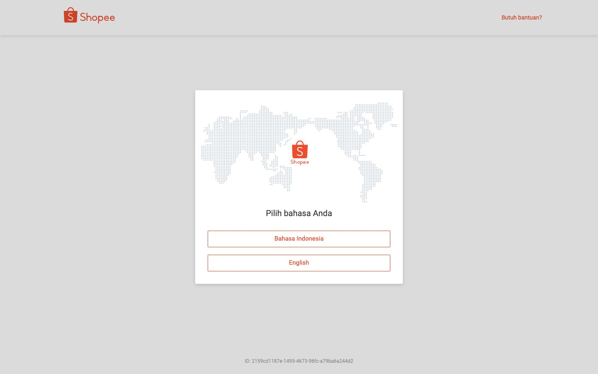

**대표 상품 이미지** (상위 6장, 출처 URL 포함)

-  — 출처 <https://deo.shopeemobile.com/shopee/shopee-pcmall-live-sg/assets/1c8bdaaf45e1fd48.png>

**페이지 메타 정보**

| page | title | description |
|---|---|---|
| [`home`](https://shopee.co.id/verify/traffic/error?home_url=https%3A%2F%2Fshopee.co.id&is_logged_in=false&next=https%3A%2F%2Fshopee.co.id%2F&tracking_id=2159cd1187e-1495-4673-96fc-a79ba6a244d2&type=4) | Shopee Indonesia | Situs Belanja Online Terlengkap & Terpercaya |  |

#### [Tokopedia](https://www.tokopedia.com/)

- URL: <https://www.tokopedia.com/>
- 페이지: **OK 0 · FAIL 1**

**실패 페이지**

- `home` — playwright_error: Error: Page.goto: net::ERR_HTTP2_PROTOCOL_ERROR at https://www.tokopedia.com/
Call log:
  - navigating to "https://www.tokopedia.com/", waiting until "domcontentloaded"

#### [Zalora Indonesia](https://www.zalora.co.id/)

- URL: <https://www.zalora.co.id/>
- 페이지: **OK 1 · FAIL 0**

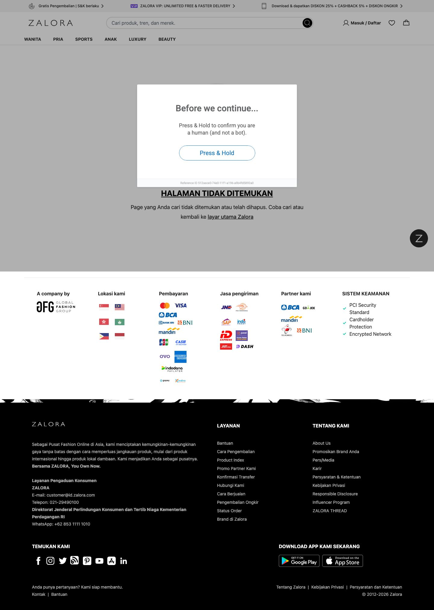

**대표 상품 이미지** (상위 6장, 출처 URL 포함)

-  — 출처 <https://static-id.zacdn.com/next-assets/static-assets/images/logo/icon_mastercard.png>
-  — 출처 <https://static-id.zacdn.com/next-assets/static-assets/images/logo/icon_visa.png>
-  — 출처 <https://static-id.zacdn.com/next-assets/static-assets/images/logo/icon_ovo.png>

**페이지 메타 정보**

| page | title | description |
|---|---|---|
| [`new_women`](https://www.zalora.co.id/wanita/new-arrivals) | Halaman tidak ditemukan | ZALORA |  |

### 4.2 일본 _( Japan )_

- 한국 수출규모 순위: **#2** · region: `asia` · tier `1` · currency `JPY`
- 수집 사이트: **5개** (성공 4)
- 메모: K-패션 선호도 높고 온라인 패션몰 발달
#### [GU Japan](https://www.gu-global.com/jp/)

- URL: <https://www.gu-global.com/jp/>
- 페이지: **OK 1 · FAIL 0**

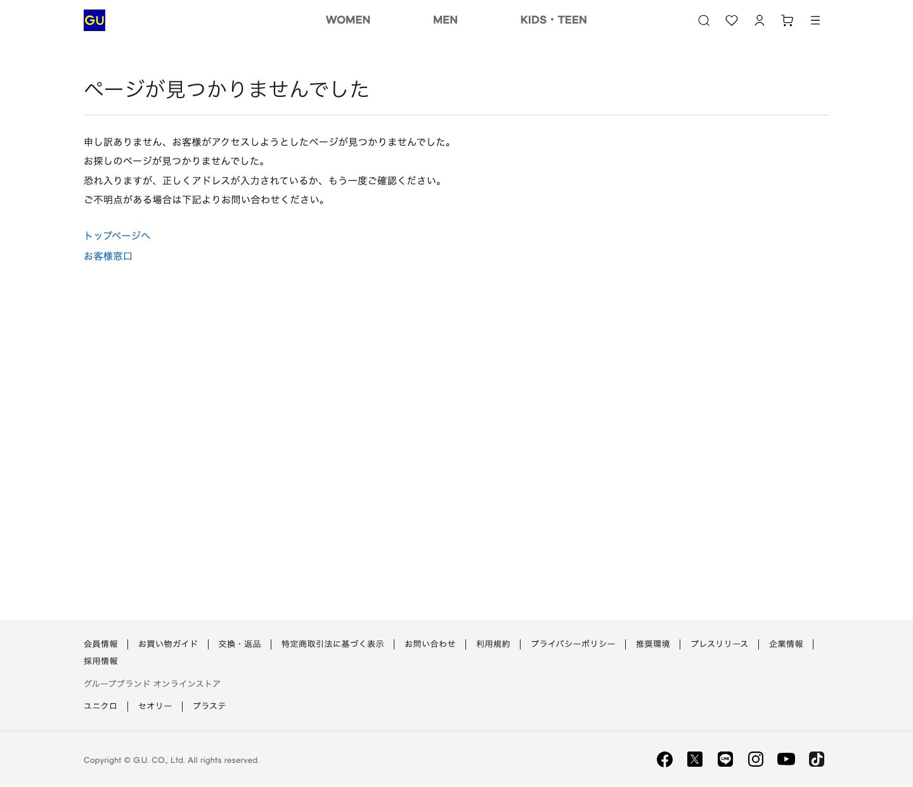

**대표 상품 이미지** (상위 6장, 출처 URL 포함)

-  — 출처 <https://image.uniqlo.com/GU/ST3/jp/imagesother/Navigation/WOMEN_Category/2026/260513/Category_w_Half-Tshirt.png>
-  — 출처 <https://image.uniqlo.com/GU/ST3/jp/imagesother/Navigation/WOMEN_Category/2026/260515/Category_w_Tshirt.png>
-  — 출처 <https://image.uniqlo.com/GU/ST3/jp/imagesother/Navigation/WOMEN_Category/2026/260612/Category_w_shirt-blouse.png>
-  — 출처 <https://image.uniqlo.com/GU/ST3/jp/imagesother/Navigation/WOMEN_Category/2026/260612/Category_w_Knit-cardigan.png>
-  — 출처 <https://image.uniqlo.com/GU/ST3/jp/imagesother/Navigation/WOMEN_Category/2026/260513/Category_w_onepeace.png>
-  — 출처 <https://image.uniqlo.com/GU/ST3/jp/imagesother/Navigation/WOMEN_Category/2026/260513/Category_w_Sweat.png>

**페이지 메타 정보**

| page | title | description |
|---|---|---|
| [`new_arrivals`](https://www.gu-global.com/jp/ja/not-found) | 申し訳ありません、お客様がアクセスしようとしたページが見つかりませんでした。恐れ入りますが、正しくアドレスが入力されているか、もう一度ご確認ください。 | ジーユー | 申し訳ありません、お客様がアクセスしようとしたページが見つかりませんでした。恐れ入りますが、正しくアドレスが入力されているか、もう一度ご確認ください。 |

#### [Rakuten Fashion](https://brandavenue.rakuten.co.jp/)

- URL: <https://brandavenue.rakuten.co.jp/>
- 페이지: **OK 1 · FAIL 1**

**대표 상품 이미지** (상위 6장, 출처 URL 포함)

-  — 출처 <https://brandavenue.r10s.jp/img/library/index/sbn_flagshipstore_20231003.png>
- 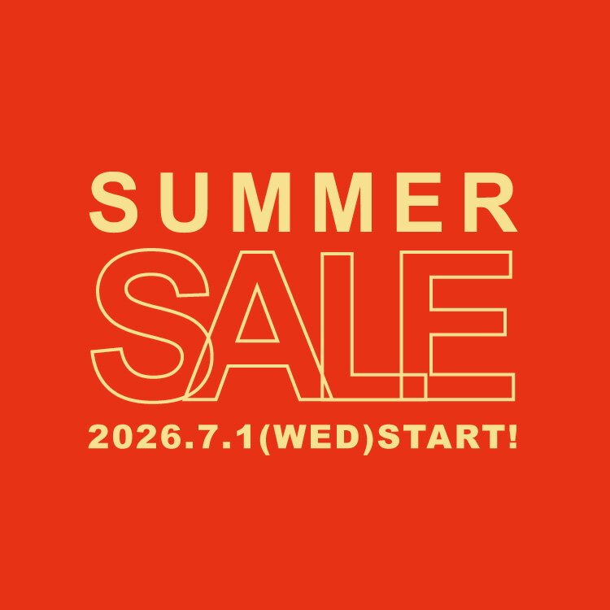 — 출처 <https://brandavenue.r10s.jp/img/news/01/382759/pc_n.jpg>
- 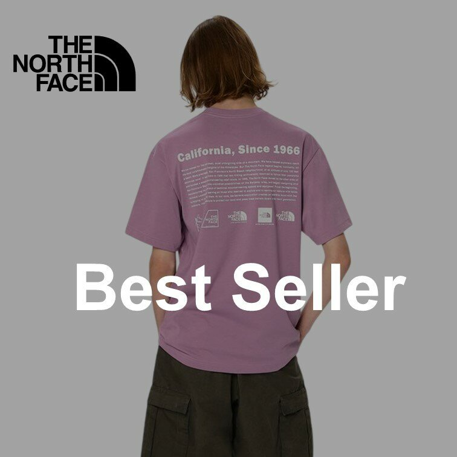 — 출처 <https://brandavenue.r10s.jp/img/news/01/382745/pc_n.jpg>
- 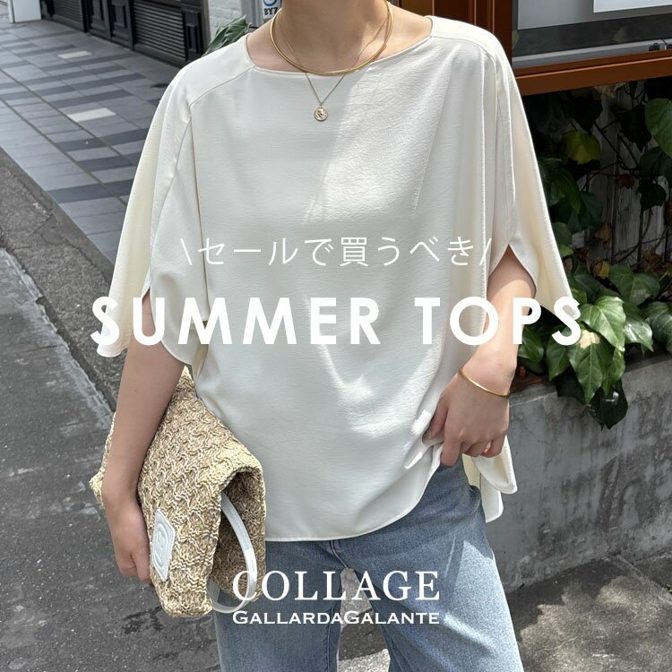 — 출처 <https://brandavenue.r10s.jp/img/news/01/382609/pc_n.jpg>
- 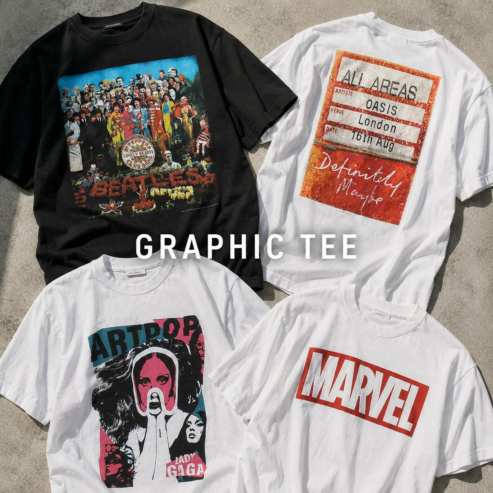 — 출처 <https://brandavenue.r10s.jp/img/news/01/382746/pc_n.jpg>
- 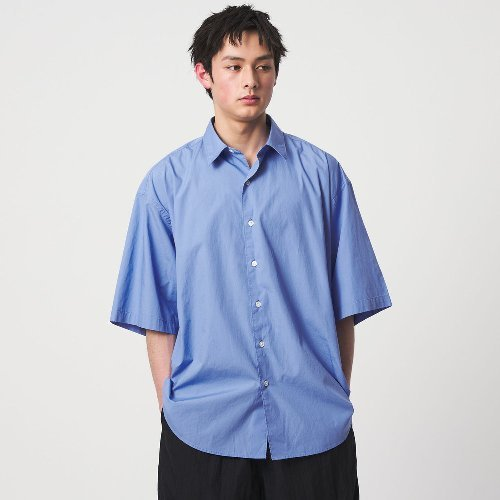 — 출처 <https://brandavenue.r10s.jp/img/news/01/382405/pc_n.jpg>

**페이지 메타 정보**

| page | title | description |
|---|---|---|
| [`men`](https://brandavenue.rakuten.co.jp/men/) | MEN | ファッション通販 Rakuten Fashion(楽天ファッション／旧楽天ブランドアベニュー) | Rakuten Fashion(楽天ファッション)は人気ブランドを取り扱うファッション通販サイトです。新作アイテム続々入荷！セール商品やクーポン対象商品も豊富。／税込3,980円以上購入で送料無料／楽天ポイントが使えて貯まる！ |

**실패 페이지**

- `women` — http_status_404

#### [Uniqlo Japan](https://www.uniqlo.com/jp/)

- URL: <https://www.uniqlo.com/jp/>
- 페이지: **OK 1 · FAIL 0**

**페이지 메타 정보**

| page | title | description |
|---|---|---|
| [`new_arrivals`](https://www.uniqlo.com/jp/ja/contents/feature/new-arrivals/) | 404 Not Found |  |

#### [WEAR](https://wear.jp/)

- URL: <https://wear.jp/>
- 페이지: **OK 1 · FAIL 0**

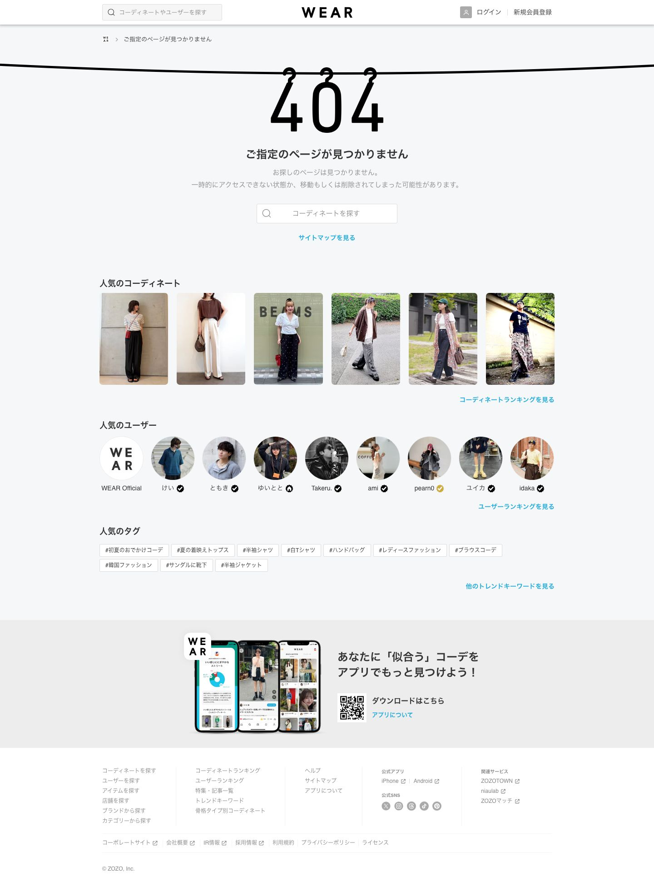

**대표 상품 이미지** (상위 6장, 출처 URL 포함)

-  — 출처 <https://wear.jp/public/_next/static/media/notfound_bg.1ywd-k_shp-hy.png>
-  — 출처 <https://wear.jp/public/_next/static/media/notfound_4.1ho27atf54bbv.png>
-  — 출처 <https://wear.jp/public/_next/static/media/notfound_0.438l9b9xjj6tm.png>
- 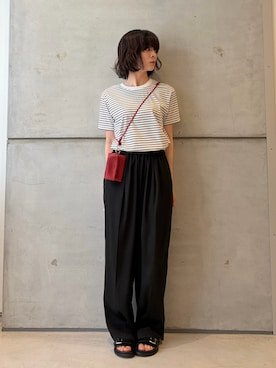 — 출처 <https://images.wear2.jp/coordinate/lei08o60/7AxNnVmG/1782831748_276.jpg>
- 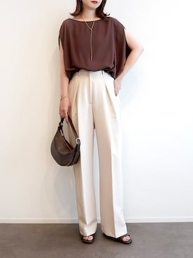 — 출처 <https://images.wear2.jp/coordinate/kAiO3P8/Yue7TH8S/1782812431_276.jpg>
- 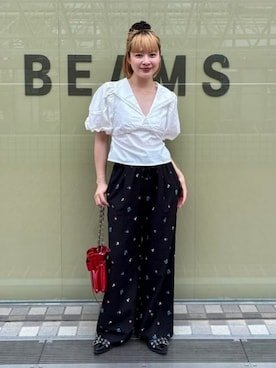 — 출처 <https://images.wear2.jp/coordinate/Z8iyzr/IyKsseaj/1782715301_276.jpg>

**페이지 메타 정보**

| page | title | description |
|---|---|---|
| [`ranking`](https://wear.jp/ranking/coordinate/) | ご指定のページが見つかりません - WEAR |  |

#### [ZOZOTOWN](https://zozo.jp/)

- URL: <https://zozo.jp/>
- 페이지: **OK 0 · FAIL 2**

**실패 페이지**

- `new` — playwright_error: TimeoutError: Page.goto: Timeout 30000ms exceeded.
Call log:
  - navigating to "https://zozo.jp/category/new/", waiting until "domcontentloaded"

- `ranking` — playwright_error: TimeoutError: Page.goto: Timeout 30000ms exceeded.
Call log:
  - navigating to "https://zozo.jp/ranking/", waiting until "domcontentloaded"

### 4.3 한국 _( South Korea )_

- 한국 수출규모 순위: **#30** · region: `asia` · tier `1` · currency `KRW`
- 수집 사이트: **4개** (성공 3)
- 메모: 비교 기준 (자국). 국내 사업동향 센싱
#### [29CM](https://www.29cm.co.kr/)

- URL: <https://www.29cm.co.kr/>
- 페이지: **OK 1 · FAIL 0**

**최근 유행 상품** (50건 · 상품명 클릭 시 해당 사이트로 이동)

| # | 상품명 | 브랜드 | 가격 | 페이지 |
|---:|---|---|---:|---|
| 1 | [베이비 애플 스트라이프 세일러 카라 오버롤_BP62OV252](https://product.29cm.co.kr/catalog/3975588) | 베베드피노 | 48,580 KRW | `home` |
| 2 | [베이비 스트로베리 세일러 카라 리본 원피스_BP62OD262](https://product.29cm.co.kr/catalog/3975549) | 베베드피노 | 41,540 KRW | `home` |
| 3 | [베이비 컬러풀 체리 올 오버 바디수트 세트_BP62SE144](https://product.29cm.co.kr/catalog/3975752) | 베베드피노 | 48,580 KRW | `home` |
| 4 | [[4차] Light Linen Cardigan - Polar Sky-Blue](https://product.29cm.co.kr/catalog/4011340) | 르바 | 67,320 KRW | `home` |
| 5 | [[2PACK][사이즈 선택] All-day Sleeveless Top - 10colors](https://product.29cm.co.kr/catalog/4004119) | 르바 | 52,020 KRW | `home` |
| 6 | [All-day Sleeveless Top - Snow White](https://product.29cm.co.kr/catalog/4004113) | 르바 | 29,070 KRW | `home` |
| 7 | [[바로배송] Dune Mult Strap Sandal 스트랩 샌들 6.5cm -WS9054 (3color)](https://product.29cm.co.kr/catalog/4056142) | 스퍼 | 82,030 KRW | `home` |
| 8 | [[바로배송] Kenshington Belted Loafer 벨티드 로퍼 4.5cm -WS9025 (1color)](https://product.29cm.co.kr/catalog/4026951) | 스퍼 | 70,880 KRW | `home` |
| 9 | [[바로배송] Vera Line Cut Comfort Pumps 천연양가죽 펌프스 5.5cm -WS9013 (3color)](https://product.29cm.co.kr/catalog/4026949) | 스퍼 | 137,270 KRW | `home` |
| 10 | [린넨 시스루 라운드 가디건 5 COLOR COWCD007](https://product.29cm.co.kr/catalog/3963433) | 커스텀어클락 | 49,600 KRW | `home` |
| 11 | [린넨 시스루 골지 라운드 가디건 5 COLOR COWCD008](https://product.29cm.co.kr/catalog/3963431) | 커스텀어클락 | 49,600 KRW | `home` |
| 12 | [린넨 시스루 슬림 라운드 가디건 4 COLOR COWCD009](https://product.29cm.co.kr/catalog/3963430) | 커스텀어클락 | 49,600 KRW | `home` |
| 13 | [Ceramic Plate 3 Section 세라믹 플레이트 3구 세트](https://product.29cm.co.kr/catalog/4052796) | 알엠에스 | 49,000 KRW | `home` |
| 14 | [Ceramic Plate 4 Section 세라믹 플레이트 4구 세트](https://product.29cm.co.kr/catalog/3678037) | 알엠에스 | 49,000 KRW | `home` |
| 15 | [Square Bowl 스퀘어 볼](https://product.29cm.co.kr/catalog/3685560) | 알엠에스 | 24,000 KRW | `home` |
| 16 | [리브드 슬리브리스 탑_4 Color](https://product.29cm.co.kr/catalog/4024542) | 루메토 | 24,320 KRW | `home` |
| 17 | [메쉬 니트 가디건_Cloud](https://product.29cm.co.kr/catalog/3995352) | 루메토 | 75,520 KRW | `home` |
| 18 | [메쉬 니트 가디건_Deep Navy](https://product.29cm.co.kr/catalog/3995121) | 루메토 | 75,520 KRW | `home` |
| 19 | [[두닷] 콰트로 큐브 데스크 2000x800 컴퓨터 책상](https://product.29cm.co.kr/catalog/3722226) | 두닷 | 336,000 KRW | `home` |
| 20 | [[두닷] 콰트로 큐브 데스크 2000x600 컴퓨터 책상](https://product.29cm.co.kr/catalog/3722224) | 두닷 | 301,000 KRW | `home` |

**대표 상품 이미지** (상위 6장, 출처 URL 포함)

-  — 출처 <https://img.29cm.co.kr/cms/202606/11f17379972fe00a81a7a947ed52a053.png?width=3840&format=webp>
- 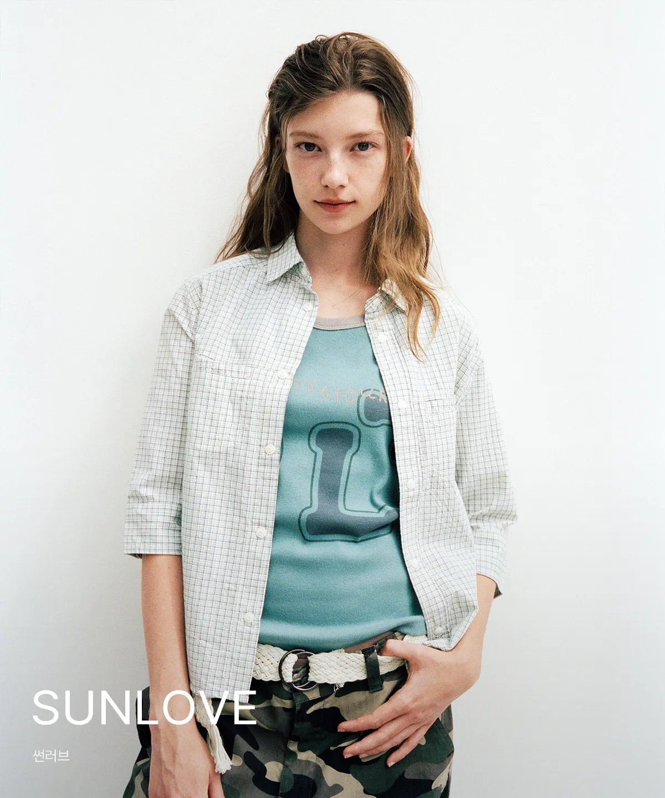 — 출처 <https://img.29cm.co.kr/cms/202606/11f173798bba864d9993c97bbce23693.png?width=3840&format=webp>
- 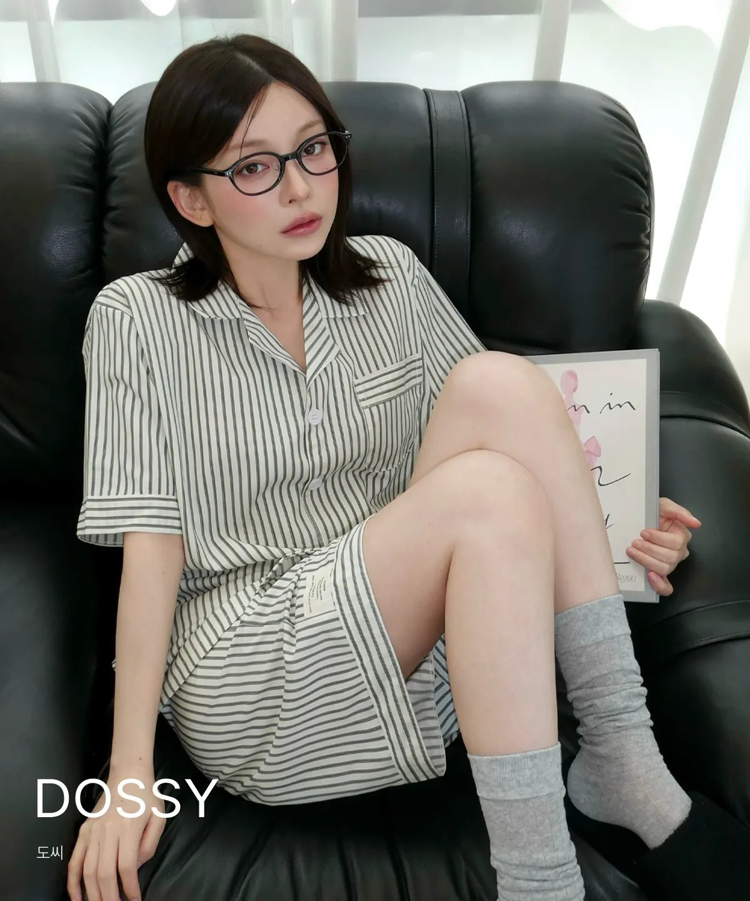 — 출처 <https://img.29cm.co.kr/cms/202606/11f17379856595559993eb9e3200cc9d.png?width=3840&format=webp>
- 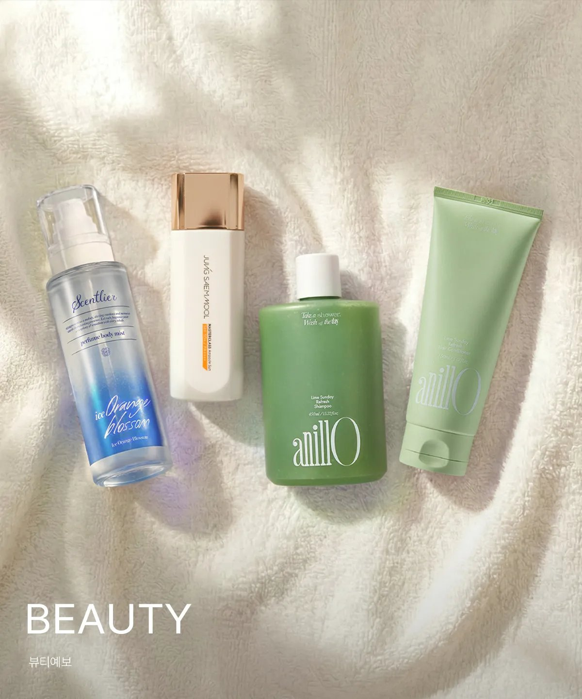 — 출처 <https://img.29cm.co.kr/cms/202606/11f173797c84546681a7794ff43bc5a0.png?width=3840&format=webp>
- 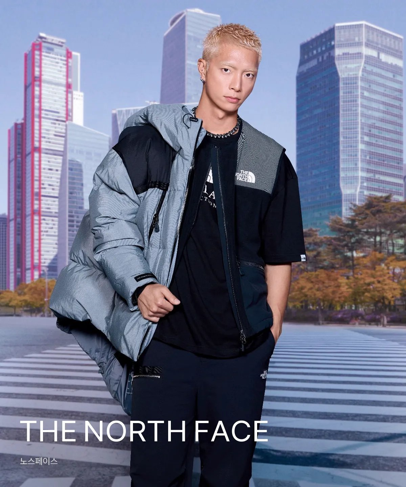 — 출처 <https://img.29cm.co.kr/cms/202606/11f1737972ee1ae999938bd42f0dcc5c.png?width=3840&format=webp>
- 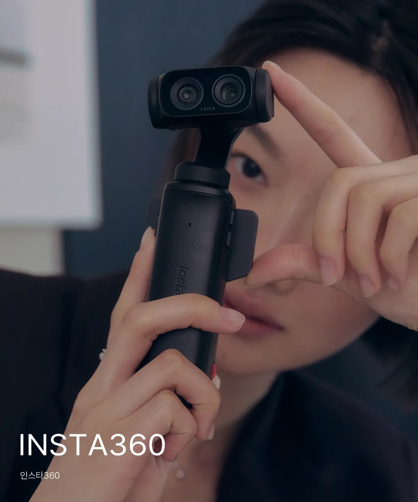 — 출처 <https://img.29cm.co.kr/cms/202606/11f1737969c5228e81a71f99e389c3df.png?width=3840&format=webp>

**페이지 메타 정보**

| page | title | description |
|---|---|---|
| [`home`](https://www.29cm.co.kr/) | 감도 깊은 취향 셀렉트샵 29CM | 패션, 라이프스타일, 컬처까지 29CM만의 감도 깊은 셀렉션을 만나보세요. |

#### [Musinsa](https://www.musinsa.com/)

- URL: <https://www.musinsa.com/>
- 페이지: **OK 0 · FAIL 1**

**실패 페이지**

- `home` — robots_disallowed

#### [W Concept](https://www.wconcept.co.kr/)

- URL: <https://www.wconcept.co.kr/>
- 페이지: **OK 1 · FAIL 0**

**최근 유행 상품** (30건 · 상품명 클릭 시 해당 사이트로 이동)

| # | 상품명 | 브랜드 | 가격 | 페이지 |
|---:|---|---|---:|---|
| 1 | [[S 사이즈 추가]SITP5191 아카이브 하운드 프린팅 반팔티_Ivory](https://m.wconcept.co.kr/Product/306634914) | 시야쥬 | 31,433 KRW | `home` |
| 2 | [SIST9024 나일론 퍼티그 스커트_2Colors](https://m.wconcept.co.kr/Product/305929040) | 시야쥬 | 62,135 KRW | `home` |
| 3 | [[단독]SIPT7078 투턱 나일론 슬랙스_2PACK](https://m.wconcept.co.kr/Product/305907610) | 시야쥬 | 109,648 KRW | `home` |
| 4 | [SITP5147 노블 시어서커 ST 셔츠_Ivory](https://m.wconcept.co.kr/Product/305708118) | 시야쥬 | 63,597 KRW | `home` |
| 5 | [SITP5063 U-neck T-shirt_4Colors](https://m.wconcept.co.kr/Product/302550155) | 시야쥬 | 26,316 KRW | `home` |
| 6 | [SIPT7078 투턱 나일론 슬랙스_Beige](https://m.wconcept.co.kr/Product/302817665) | 시야쥬 | 66,572 KRW | `home` |
| 7 | [[XS 사이즈 추가] SIPT7153 컴포트 라인 카프리 팬츠_Black](https://m.wconcept.co.kr/Product/306630847) | 시야쥬 | 66,572 KRW | `home` |
| 8 | [SIPT7078 투턱 나일론 슬랙스_Black](https://m.wconcept.co.kr/Product/302817713) | 시야쥬 | 66,572 KRW | `home` |
| 9 | [SITP5278 소프트 쉬어 썸머 셔츠_Beige](https://m.wconcept.co.kr/Product/308503731) | 시야쥬 | 63,984 KRW | `home` |
| 10 | [SITP5278 소프트 쉬어 썸머 셔츠_White](https://m.wconcept.co.kr/Product/308503730) | 시야쥬 | 63,984 KRW | `home` |
| 11 | [SIPT7153 컴포트 라인 카프리 팬츠 (여름 ver)_Black](https://m.wconcept.co.kr/Product/308570524) | 시야쥬 | 65,059 KRW | `home` |
| 12 | [SITP5064 Basset Hound T-shirt_Charcoal](https://m.wconcept.co.kr/Product/301730217) | 시야쥬 | 30,960 KRW | `home` |
| 13 | [SITP5301 라이트 플로우 셔츠_Charcoal](https://m.wconcept.co.kr/Product/308570578) | 시야쥬 | 66,736 KRW | `home` |
| 14 | [SITP5297 슈나우저 반팔 티셔츠_Melange gray](https://m.wconcept.co.kr/Product/308503709) | 시야쥬 | 29,584 KRW | `home` |
| 15 | [SITP5246 소프트 멀티 체크 셔츠_Black](https://m.wconcept.co.kr/Product/308156086) | 시야쥬 | 59,856 KRW | `home` |
| 16 | [SITP5262 PARIS 반팔 티셔츠_White](https://m.wconcept.co.kr/Product/308291070) | 시야쥬 | 29,584 KRW | `home` |
| 17 | [[단독]SITP5063 U-neck T-shirt_2PACK](https://m.wconcept.co.kr/Product/305625455) | 시야쥬 | 46,440 KRW | `home` |
| 18 | [SIPT7195 라운지 소프트 쇼츠_Black](https://m.wconcept.co.kr/Product/308503683) | 시야쥬 | 50,224 KRW | `home` |
| 19 | [SITP5201 레트로 U넥 슬림 반팔티_Ivory](https://m.wconcept.co.kr/Product/306835129) | 시야쥬 | 23,865 KRW | `home` |
| 20 | [SIPT7202 드레이프 부츠컷 슬랙스_Black](https://m.wconcept.co.kr/Product/308503664) | 시야쥬 | 73,304 KRW | `home` |

**페이지 메타 정보**

| page | title | description |
|---|---|---|
| [`home`](https://www.wconcept.co.kr/) | _(empty)_ |  |

#### [Zigzag](https://zigzag.kr/)

- URL: <https://zigzag.kr/>
- 페이지: **OK 1 · FAIL 0**

**최근 유행 상품** (36건 · 상품명 클릭 시 해당 사이트로 이동)

| # | 상품명 | 브랜드 | 가격 | 페이지 |
|---:|---|---|---:|---|
| 1 | [[반팔블라우스💙/하객룩/made] 드멜린 블라우스 (2color)](https://store.zigzag.kr/app/catalog/products/160291434?browsing_type=NATIVE_BROWSER) | 리얼코코 | 25,530 KRW | `home` |
| 2 | [[살안타템✨/R넥&V넥/made] 맬리 팬던트 니트 가디건 (8color)](https://store.zigzag.kr/app/catalog/products/151404778?browsing_type=NATIVE_BROWSER) | 리얼코코 | 18,500 KRW | `home` |
| 3 | [[made]썸머코튼팬츠](https://store.zigzag.kr/app/catalog/products/123531707?browsing_type=NATIVE_BROWSER) | 어텀 | 25,600 KRW | `home` |
| 4 | [[신상컬러💖/백지헌PICK] [COOL] 썸머 골지 카디건_SPCKG24G02](https://store.zigzag.kr/app/catalog/products/168873846?browsing_type=NATIVE_BROWSER) | 스파오 | 20,180 KRW | `home` |
| 5 | [[백지헌 PICK💖][COOL] 썸머 카디건_SPCKG24G01](https://store.zigzag.kr/app/catalog/products/168873831?browsing_type=NATIVE_BROWSER) | 스파오 | 20,180 KRW | `home` |
| 6 | [[💙여름/사계절필수] made. 솔트 클린 반팔티셔츠 (스탠다드핏/루즈핏) - 7 color](https://store.zigzag.kr/app/catalog/products/141373178?browsing_type=NATIVE_BROWSER) | 슬로우앤드 | 12,920 KRW | `home` |
| 7 | [[🧊여름바지/✨구김걱정NO] made. 세미부츠컷 찰랑슬랙스 (+숏/베이직/롱ver) - 4 size](https://store.zigzag.kr/app/catalog/products/142355088?browsing_type=NATIVE_BROWSER) | 슬로우앤드 | 25,520 KRW | `home` |
| 8 | [[💗부유방커버] made. 쫀쫀 커버핏 슬리브리스 (유교걸나시!) - 7 color](https://store.zigzag.kr/app/catalog/products/160291278?browsing_type=NATIVE_BROWSER) | 슬로우앤드 | 15,710 KRW | `home` |
| 9 | [[반팔💙/하객룩/made] 플롯 레이어드 블라우스 (6color)](https://store.zigzag.kr/app/catalog/products/159975319?browsing_type=NATIVE_BROWSER) | 리얼코코 | 18,500 KRW | `home` |
| 10 | [[🧊여름바지/후기인증] made. 나스 디테일러 와이드팬츠 (+베이직/롱ver) - 4 size](https://store.zigzag.kr/app/catalog/products/140796259?browsing_type=NATIVE_BROWSER) | 슬로우앤드 | 30,320 KRW | `home` |
| 11 | [[여름바지🌴/50만장돌파/made] 허쉬 코튼 와이드팬츠 (숏/기본/롱)](https://store.zigzag.kr/app/catalog/products/143224732?browsing_type=NATIVE_BROWSER) | 리얼코코 | 18,500 KRW | `home` |
| 12 | [[여름청바지👖/3단기장/made] 시그니처 논페이드 데님 팬츠 (2color)](https://store.zigzag.kr/app/catalog/products/158971418?browsing_type=NATIVE_BROWSER) | 리얼코코 | 18,500 KRW | `home` |
| 13 | [[🧊여름/살안타템] made. 플레인 여리핏 썸머가디건 - 6 color](https://store.zigzag.kr/app/catalog/products/141374160?browsing_type=NATIVE_BROWSER) | 슬로우앤드 | 28,720 KRW | `home` |
| 14 | [[오픈할인중/베스트재입고] only. 마인드 올데이 밴딩롱스커트 - 3 color (무료배송)](https://store.zigzag.kr/app/catalog/products/164411111?browsing_type=NATIVE_BROWSER) | 슬로우앤드 | 22,700 KRW | `home` |
| 15 | [Founders 파운더스 델핀 링클 블라우스 유넥 반팔 주름 bl (3 color)](https://store.zigzag.kr/app/catalog/products/170501021?browsing_type=NATIVE_BROWSER) | 바이안 | 47,200 KRW | `home` |
| 16 | [[🏆역대급100만장/썸머XL추가!] made. 마켓 와이드 트레이닝슬랙스 (+숏/베이직/롱ver) - 4 size](https://store.zigzag.kr/app/catalog/products/141360158?browsing_type=NATIVE_BROWSER) | 슬로우앤드 | 25,550 KRW | `home` |
| 17 | [[피버]니즈 레이스 프릴 나시 블라우스](https://store.zigzag.kr/app/catalog/products/170508748?browsing_type=NATIVE_BROWSER) | 헬로마틸다 | 30,400 KRW | `home` |
| 18 | [(당일출고) 미엘 미야 스커트 밴딩 플라워 자수 프릴 일자 미디](https://store.zigzag.kr/app/catalog/products/170504220?browsing_type=NATIVE_BROWSER) | 모에르 | 53,010 KRW | `home` |
| 19 | [[🧊여름바지/🎖️1등슬랙스] made. 모먼트 투커버 올데이슬랙스 (+숏/베이직/롱ver) - 4 size](https://store.zigzag.kr/app/catalog/products/136095576?browsing_type=NATIVE_BROWSER) | 슬로우앤드 | 31,840 KRW | `home` |
| 20 | [[30만장돌파/MADE/뉴컬러]누벨 데일리 나일론 슬릿 롱 스커트 (S-L/직잭팟/여름스커트/롱치마/여름치마/나일론치마/h라인스커트/데일리룩/장마룩/출근룩/바스락스커트)](https://store.zigzag.kr/app/catalog/products/140798161?browsing_type=NATIVE_BROWSER) | 케이클럽 | 24,360 KRW | `home` |

**대표 상품 이미지** (상위 6장, 출처 URL 포함)

- 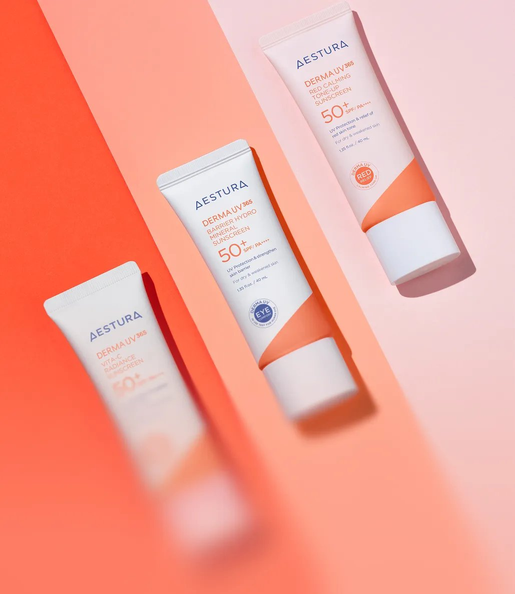 — 출처 <https://cf.image-farm.s.zigzag.kr/original/cms/2026/06/28/202606281520269827_051126.png?width=1029&height=1188&quality=80&format=webp&transparent=true>
- 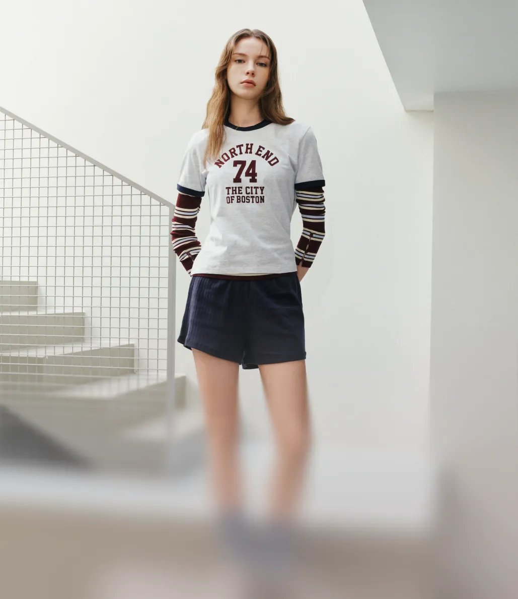 — 출처 <https://cf.image-farm.s.zigzag.kr/original/cms/2026/06/29/202606290707484034_069554.png?width=1029&height=1188&quality=80&format=webp&transparent=true>
- 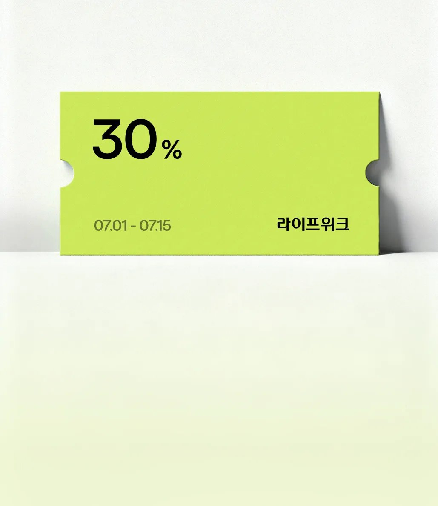 — 출처 <https://cf.image-farm.s.zigzag.kr/original/cms/2026/06/30/202606300622564126_080814.jpg?width=1029&height=1188&quality=80&format=webp&transparent=true>
-  — 출처 <https://cf.image-farm.s.zigzag.kr/original/cms/2026/06/26/202606260214476372_012478.png?quality=80&format=webp&transparent=true&width=1029&height=1188>
- 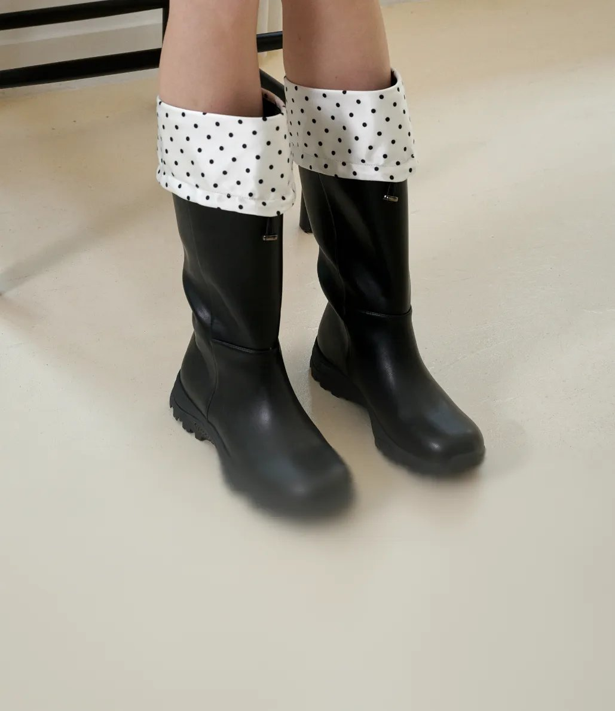 — 출처 <https://cf.image-farm.s.zigzag.kr/original/cms/2026/06/29/202606291100546712_021310.png?quality=80&format=webp&transparent=true&width=1029&height=1188>
-  — 출처 <https://cf.image-farm.s.zigzag.kr/original/cms/2026/06/23/202606230530501514_058486.jpg?width=1029&height=1188&quality=80&format=webp&transparent=true>

**페이지 메타 정보**

| page | title | description |
|---|---|---|
| [`home`](https://zigzag.kr/) | 지그재그 스토어 | 4,000만 여성이 선택한 올인원 쇼핑 앱 지그재그 - 제가 알아서 살게요. |

### 4.4 대만 _( Taiwan )_

- 한국 수출규모 순위: **#7** · region: `asia` · tier `1` · currency `TWD`
- 수집 사이트: **5개** (성공 4)
- 메모: K-패션 친화도 높음
#### [momo](https://www.momoshop.com.tw/)

- URL: <https://www.momoshop.com.tw/>
- 페이지: **OK 1 · FAIL 0**

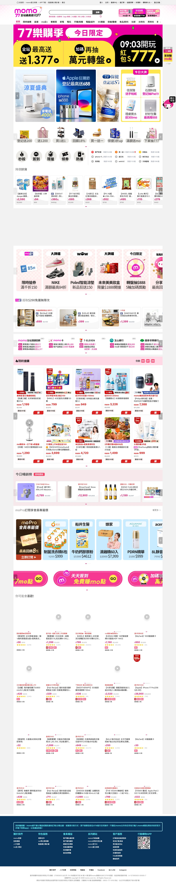

**대표 상품 이미지** (상위 6장, 출처 URL 포함)

-  — 출처 <https://img2.momoshop.com.tw/ecm/img/online/10/998/00/000/bt_0_271_01/bt_0_271_01_e2.jpg?t=1782816137623>
- 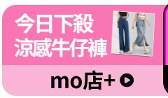 — 출처 <https://img1.momoshop.com.tw/ecm/img/online/10/998/00/000/bt_0_245_01/bt_0_245_01_P1_1_e2.png?t=1782835211764>
-  — 출처 <https://img1.momoshop.com.tw/ecm/img/online/10/998/00/000/bt_0_245_01/bt_0_245_01_P1_2_e2.png?t=1782835211764>
-  — 출처 <https://img1.momoshop.com.tw/ecm/img/online/10/998/00/000/bt_0_245_01/bt_0_245_01_P1_3_e2.png?t=1782835211764>
- 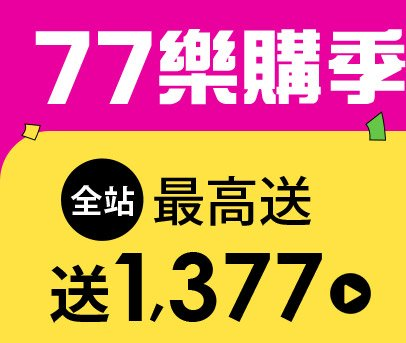 — 출처 <https://img2.momoshop.com.tw/ecm/img/online/81/998/00/000/mobile/bt_7_707_09/bt_7_707_09_P1_1_e2.jpg?t=1782835751645>
- 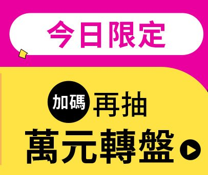 — 출처 <https://img2.momoshop.com.tw/ecm/img/online/81/998/00/000/mobile/bt_7_707_09/bt_7_707_09_P1_2_e2.jpg?t=1782835217010>

**페이지 메타 정보**

| page | title | description |
|---|---|---|
| [`home`](https://www.momoshop.com.tw/main/Main.jsp) | momo購物網 - 好評推薦 - 2026年7月 | momo購物網提供美妝保養、流行服飾、時尚精品、3C、數位家電、生活用品、美食旅遊票券…等數百萬件商品。快速到貨、超商取貨讓您購物最便利。mo店+商品抵用券天天搶、免運吃到飽，電視/直播商品限時下殺，每日讓您享超低價，並享有十天猶豫期；momo購物網為富邦及台灣大哥大關係企業 |

#### [OB Design](https://www.obdesign.com.tw/)

- URL: <https://www.obdesign.com.tw/>
- 페이지: **OK 1 · FAIL 0**

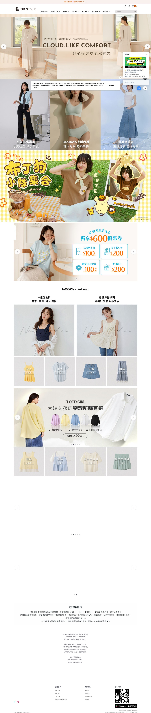

**대표 상품 이미지** (상위 6장, 출처 URL 포함)

- 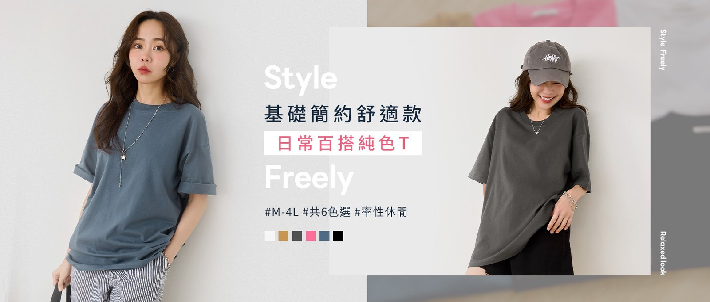 — 출처 <https://cms-static.cdn.91app.com/images/original/41602/92f19e4d-89b7-4330-9570-02cf1dff9742-1782446690-dn1wmx9ffo_d_1920x820_1280x547_1124x480_800x342_600x256_400x171.jpg>
- 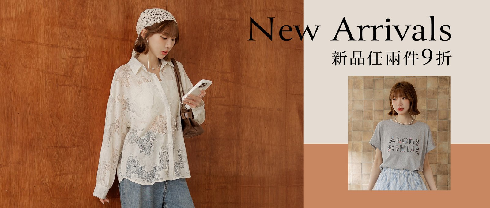 — 출처 <https://cms-static.cdn.91app.com/images/original/41602/92f19e4d-89b7-4330-9570-02cf1dff9742-1782700781-w0s0fz0ca4_d_1920x820_1280x547_1124x480_800x342_600x256_400x171.jpg>
- 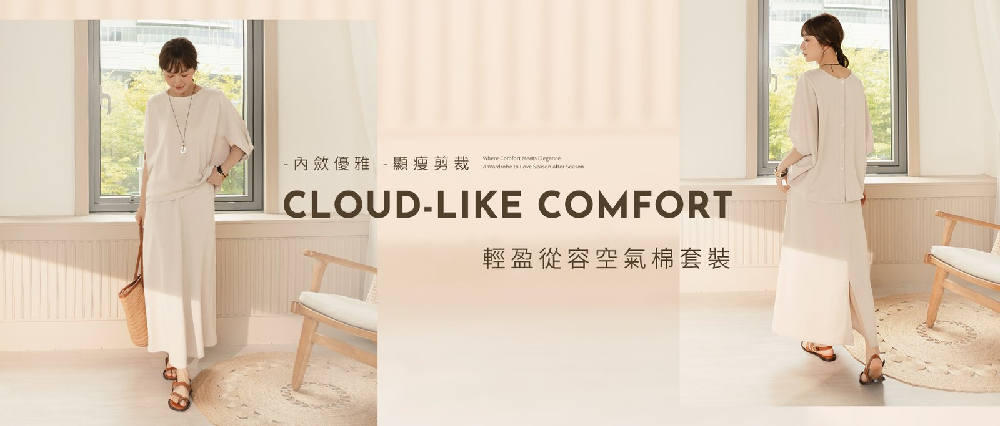 — 출처 <https://cms-static.cdn.91app.com/images/original/41602/92f19e4d-89b7-4330-9570-02cf1dff9742-1782700743-a0d3jhklbp_d_1920x820_1280x547_1124x480_800x342_600x256_400x171.jpg>
- 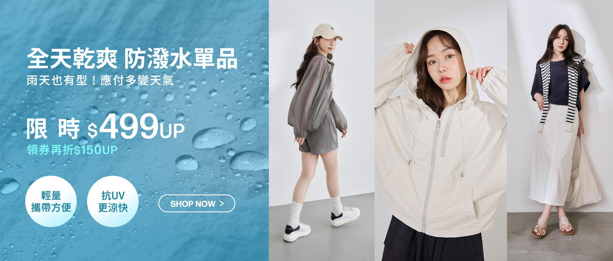 — 출처 <https://cms-static.cdn.91app.com/images/original/41602/92f19e4d-89b7-4330-9570-02cf1dff9742-1782357764-p7ileh8xvh_d_1920x820_1280x547_1124x480_800x342_600x256_400x171.jpg>
-  — 출처 <https://cms-static.cdn.91app.com/images/original/41602/92f19e4d-89b7-4330-9570-02cf1dff9742-1782358071-3sy0baovmv_d_1920x820_1280x547_1124x480_800x342_600x256_400x171.jpg>
-  — 출처 <https://cms-static.cdn.91app.com/images/compress/41602/92f19e4d-89b7-4330-9570-02cf1dff9742-1782358071-3sy0baovmv_d_400x171.webp>

**페이지 메타 정보**

| page | title | description |
|---|---|---|
| [`home`](https://www.obdesign.com.tw/) | OB嚴選｜高CP值人氣熱銷服飾，流行服飾品牌 | 你的日常穿搭好夥伴，快上OB嚴選找，OB嚴選提供女裝、孕童、運動、男裝各項流行服飾，秉持優質服務給你高CP值的購物體驗。各種風格都能滿足熱愛穿搭的你，天天上新品，快速出貨，一起加入OB style！網路人氣服飾品牌OB嚴選 |

#### [PChome](https://24h.pchome.com.tw/)

- URL: <https://24h.pchome.com.tw/>
- 페이지: **OK 0 · FAIL 1**

**실패 페이지**

- `home` — http_status_429

#### [Pinkoi Taiwan](https://www.pinkoi.com/)

- URL: <https://www.pinkoi.com/>
- 페이지: **OK 2 · FAIL 0**

**대표 상품 이미지** (상위 6장, 출처 URL 포함)

-  — 출처 <https://cdn04.pinkoi.com/pinkoi.site/logo/og_image.png>

**페이지 메타 정보**

| page | title | description |
|---|---|---|
| [`accessories`](https://en.pinkoi.com/) | Pinkoi | Asia’s cross-border design marketplace | Design the way you are | Shop for original design products from Asia's independent designers. Pinkoi lives and breathes great design, great quality, great service, a |
| [`bags`](https://en.pinkoi.com/) | Pinkoi | Asia’s cross-border design marketplace | Design the way you are | Shop for original design products from Asia's independent designers. Pinkoi lives and breathes great design, great quality, great service, a |

#### [Yahoo Taiwan Shopping](https://tw.buy.yahoo.com/)

- URL: <https://tw.buy.yahoo.com/>
- 페이지: **OK 1 · FAIL 0**

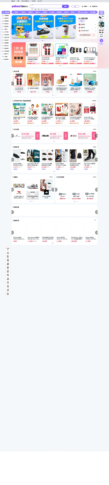

**대표 상품 이미지** (상위 6장, 출처 URL 포함)

- 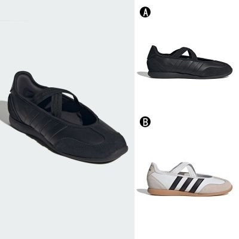 — 출처 <https://img.yec.tw/zp/MerchandiseImages/90FA940966-SP-22504211.jpg>
- 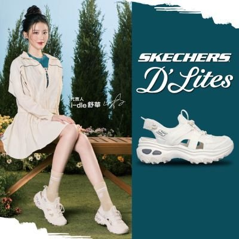 — 출처 <https://img.yec.tw/zp/MerchandiseImages/E64FEEFB66-SP-22447442.jpg>
- 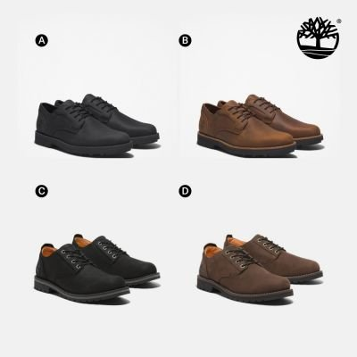 — 출처 <https://img.yec.tw/zp/MerchandiseImages/B72F0CEBA8-SP-21601397.jpg>

**페이지 메타 정보**

| page | title | description |
|---|---|---|
| [`home`](https://tw.buy.yahoo.com/) | Yahoo購物中心 - 最懂生活的人 | 數百萬件商品，貼心客服為您服務，15天鑑賞期購物保障！ |

### 4.5 태국 _( Thailand )_

- 한국 수출규모 순위: **#8** · region: `asia` · tier `1` · currency `THB`
- 수집 사이트: **5개** (성공 4)
- 메모: 동남아 K-패션 핵심 시장
#### [Central Online](https://www.central.co.th/)

- URL: <https://www.central.co.th/>
- 페이지: **OK 1 · FAIL 0**

**대표 상품 이미지** (상위 6장, 출처 URL 포함)

-  — 출처 <https://www.central.co.th/_next/image?url=https%3A%2F%2Fassets.central.co.th%2Ffile-assets%2Fassets%2FCMS%2Fcampaign%2F2026%2F07jul%2F20260701_7.7_HP_Herobanner.jpg&w=3840&q=75>
-  — 출처 <https://www.central.co.th/_next/image?url=https%3A%2F%2Fassets.central.co.th%2Ffile-assets%2Fassets%2FCMS%2Fcampaign%2F2026%2F07jul%2F20260701_estee_heroweb_d.jpg&w=3840&q=75>
-  — 출처 <https://www.central.co.th/_next/image?url=https%3A%2F%2Fassets.central.co.th%2Ffile-assets%2Fassets%2FCMS%2Fcampaign%2F2026%2F07jul%2F20260701_smeg_heroweb_d.jpg&w=3840&q=75>
-  — 출처 <https://www.central.co.th/_next/image?url=%2Fimages%2Ffallback-image.webp&w=3840&q=75>
-  — 출처 <https://assets.central.co.th/file-assets/assets/CMS/campaign/2026/07jul/20260701_lego_heroweb_d.jpg>
-  — 출처 <https://www.central.co.th/_next/image?url=https%3A%2F%2Fassets.central.co.th%2Ffile-assets%2Fassets%2FCMS%2Fcampaign%2F2026%2F07jul%2F20260701_sanrio_heroweb_d.jpg&w=3840&q=75>

**페이지 메타 정보**

| page | title | description |
|---|---|---|
| [`home`](https://www.central.co.th/th) | Central Online | 7.7 | ลดสูงสุด 70% + คูปองลดเพิ่ม 30% | 7.7 Sale โปรโมชั่นสุดยิ่งใหญ่ของปี 2026 เริ่มต้นขึ้นแล้ว! พบกับสินค้าจากหลากหลายแบรนด์ดังที่เราคัดสรรมาลดราคาสูงสุดถึง 70% พร้อมคูปองลดเพิ่ม |

#### [Lazada Thailand Fashion](https://www.lazada.co.th/)

- URL: <https://www.lazada.co.th/>
- 페이지: **OK 1 · FAIL 0**

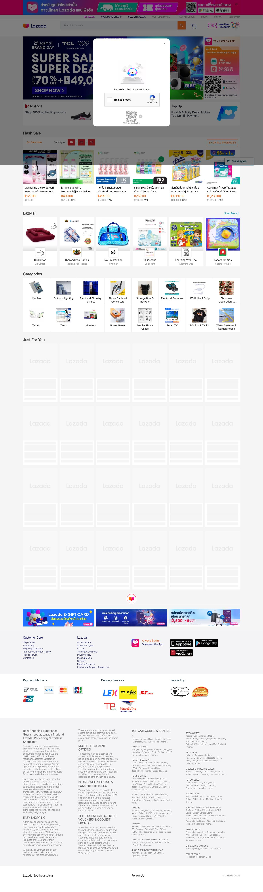

**대표 상품 이미지** (상위 6장, 출처 URL 포함)

-  — 출처 <https://img.lazcdn.com/us/domino/40845120240f19d13f738fa9a7978edd.png>
-  — 출처 <https://img.lazcdn.com/g/tps/images/ims-web/TB1KB2laMFY.1VjSZFnXXcFHXXa.png>
-  — 출처 <https://img.lazcdn.com/us/domino/db45c378-e43f-4755-ab50-56345a80153d_TH-1976-688.jpg_2200x2200q80.jpg>
-  — 출처 <https://img.lazcdn.com/us/domino/50afc554-b3e7-423c-864a-680fe0b242f7_TH-1976-688.jpg_2200x2200q80.jpg>
-  — 출처 <https://img.lazcdn.com/us/domino/2fef4e2a-cb41-4bac-9f8c-5888704d96b9_TH-1976-688.jpg_2200x2200q80.jpg>
- 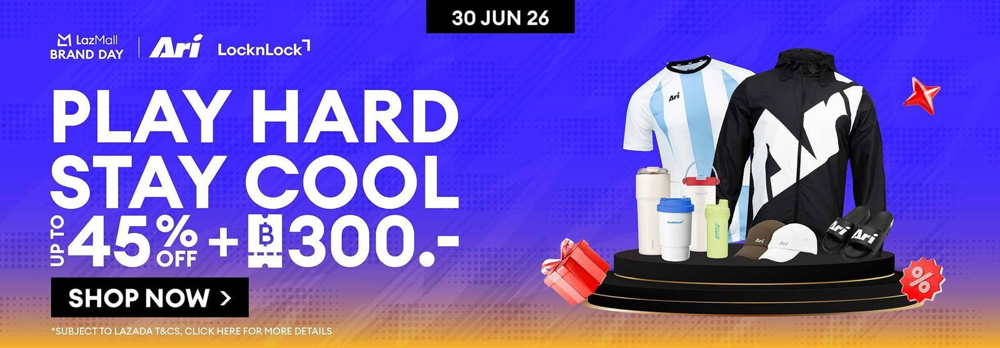 — 출처 <https://img.lazcdn.com/us/domino/18b7faff-d1d2-40b9-8d9d-52690eb16aa1_TH-1976-688.jpg_2200x2200q80.jpg>

**페이지 메타 정보**

| page | title | description |
|---|---|---|
| [`home`](https://www.lazada.co.th/#?) | Lazada Thailand | ช้อปออนไลน์ สินค้าดี พร้อมดีลพิเศษทุกวัน | พบกับ Lazada แพลตฟอร์มช้อปปิ้งชั้นนำในอาเซียน พร้อมบริการเก็บเงินปลายทาง LazMall LazFlash และดีลเด็ดจากแบรนด์ดังทุกวัน |

#### [Pomelo](https://www.pomelofashion.com/)

- URL: <https://www.pomelofashion.com/>
- 페이지: **OK 0 · FAIL 2**

**실패 페이지**

- `new` — robots_disallowed
- `best` — robots_disallowed

#### [Shopee Thailand Fashion](https://shopee.co.th/)

- URL: <https://shopee.co.th/>
- 페이지: **OK 1 · FAIL 0**

**페이지 메타 정보**

| page | title | description |
|---|---|---|
| [`home`](https://shopee.co.th/verify/traffic/error?home_url=https%3A%2F%2Fshopee.co.th&is_logged_in=false&next=https%3A%2F%2Fshopee.co.th%2F&tracking_id=812dc2811ad-063f-48d0-b3f9-8a466c5e5cde&type=4) | Shopee Thailand | Hot Deals, Best Prices |  |

#### [Zalora Thailand](https://www.zalora.co.th/)

- URL: <https://www.zalora.co.th/>
- 페이지: **OK 1 · FAIL 0**

**대표 상품 이미지** (상위 6장, 출처 URL 포함)

-  — 출처 <https://www.zalora.co.th/images/landingpage/525x500.gif>

**페이지 메타 정보**

| page | title | description |
|---|---|---|
| [`home`](https://www.zalora.co.th/) | ZALORA - ASIA'S LEADING ONLINE FASHION DESTINATION |  |

### 4.6 미국 _( United States )_

- 한국 수출규모 순위: **#1** · region: `north_america` · tier `1` · currency `USD`
- 수집 사이트: **5개** (성공 4)
- 메모: 한국 의류 최대 수출국. 대형 이커머스와 브랜드 커머스 중심
#### [Etsy](https://www.etsy.com/)

- URL: <https://www.etsy.com/>
- 페이지: **OK 2 · FAIL 0**

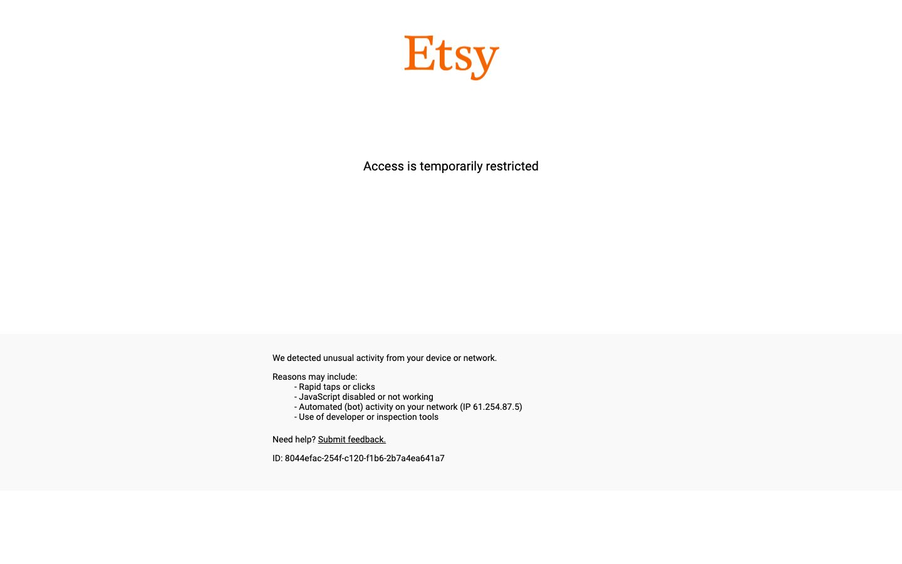

**페이지 메타 정보**

| page | title | description |
|---|---|---|
| [`trending_jewelry`](https://www.etsy.com/c/jewelry) | etsy.com |  |
| [`trending_accessories`](https://www.etsy.com/c/accessories) | etsy.com |  |

#### [Macy's](https://www.macys.com/)

- URL: <https://www.macys.com/>
- 페이지: **OK 1 · FAIL 0**

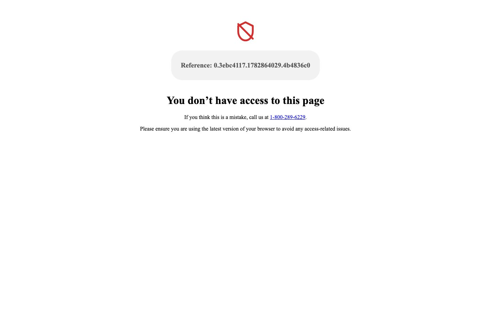

**페이지 메타 정보**

| page | title | description |
|---|---|---|
| [`new`](https://www.macys.com/shop/whats-new?id=14834) | Access Denied - Macy's | Access denied 403 |

#### [Nordstrom](https://www.nordstrom.com/)

- URL: <https://www.nordstrom.com/>
- 페이지: **OK 2 · FAIL 0**

**대표 상품 이미지** (상위 6장, 출처 URL 포함)

-  — 출처 <https://n.nordstrommedia.com/it/7f51c20a-b069-4154-9cfb-1e6d13a7c608.gif>
-  — 출처 <https://n.nordstrommedia.com/is/image/nordstrom/WMNS_TRD01F_0526_0068.jpeg?width=240&dpr=2&crop=2760%3A3450%2Coffset-x50%2Coffset-y50>
-  — 출처 <https://n.nordstrommedia.com/is/image/nordstrom/MENS_CONT01F_0526_0028.jpeg?width=240&dpr=2&crop=2418.371%3A3022.964%2Coffset-x50%2Coffset-y0&trim=0.073%2C0.098%2C0%2C0.026>
-  — 출처 <https://n.nordstrommedia.com/is/image/nordstrom/DESW_APP01F_0326_1696.jpeg?width=240&dpr=2&crop=3791.155%3A4738.944%2Coffset-x28.288%2Coffset-y50&trim=0.312%2C0%2C0.114%2C0>
-  — 출처 <https://n.nordstrommedia.com/is/image/nordstrom/NPG_0824_KIDS_01_LK04_003.jpeg?width=240&dpr=2&crop=4247%3A5308.75%2Coffset-x50%2Coffset-y50>
-  — 출처 <https://n.nordstrommedia.com/is/image/nordstrom/FRA_FRGW03P_0226.jpeg?width=240&dpr=2&crop=4372%3A5465%2Coffset-x60.734%2Coffset-y50>

**페이지 메타 정보**

| page | title | description |
|---|---|---|
| [`new`](https://www.nordstrom.com/browse/new) | New & Now | Nordstrom | Shop a great selection of New Arrivals at Nordstrom.com. Top brands. New trends. |
| [`women`](https://www.nordstrom.com/browse/women) | Women's Clothing, Shoes, & Accessories | Nordstrom | Find a great selection of Women's Clothing, Shoes, & Accessories at Nordstrom.com. Shop popular brands and top designers. |

#### [Revolve](https://www.revolve.com/)

- URL: <https://www.revolve.com/>
- 페이지: **OK 0 · FAIL 2**

**실패 페이지**

- `new` — playwright_error: Error: Page.goto: net::ERR_HTTP2_PROTOCOL_ERROR at https://www.revolve.com/new/br/c79f88/
Call log:
  - navigating to "https://www.revolve.com/new/br/c79f88/", waiting until "domcontentloaded"

- `trending` — playwright_error: Error: Page.goto: net::ERR_HTTP2_PROTOCOL_ERROR at https://www.revolve.com/most-loved/br/4a9ca5/
Call log:
  - navigating to "https://www.revolve.com/most-loved/br/4a9ca5/", waiting until "domcontentloaded"

#### [Urban Outfitters](https://www.urbanoutfitters.com/)

- URL: <https://www.urbanoutfitters.com/>
- 페이지: **OK 1 · FAIL 0**

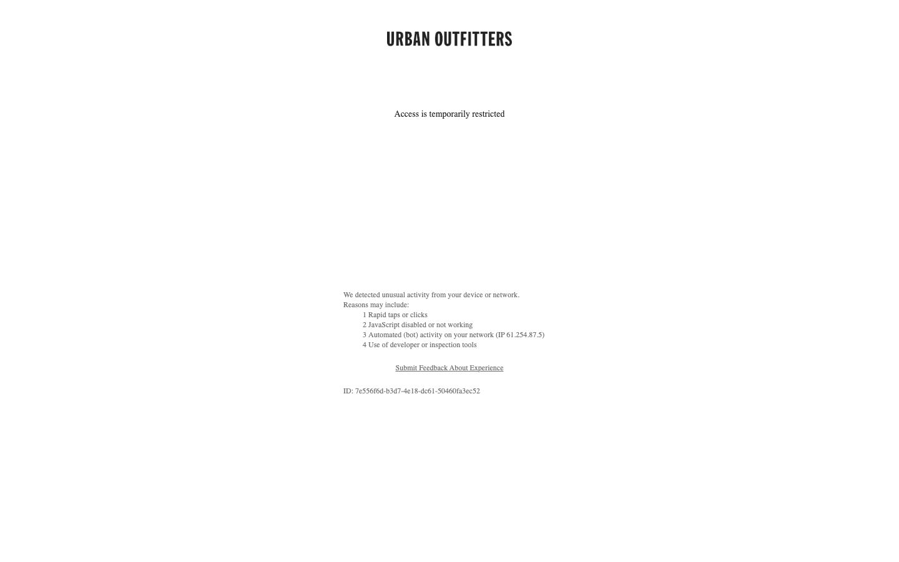

**페이지 메타 정보**

| page | title | description |
|---|---|---|
| [`new_women`](https://www.urbanoutfitters.com/womens-new-arrivals) | urbanoutfitters.com |  |

### 4.7 베트남 _( Vietnam )_

- 한국 수출규모 순위: **#4** · region: `asia` · tier `1` · currency `VND`
- 수집 사이트: **5개** (성공 5)
- 메모: 의류 생산기지/원단 수출 비중 큼. 빠르게 성장하는 이커머스
#### [Canifa](https://canifa.com/)

- URL: <https://canifa.com/>
- 페이지: **OK 1 · FAIL 0**

**대표 상품 이미지** (상위 6장, 출처 URL 포함)

-  — 출처 <https://2885371169.e.cdneverest.net/Simiconnector/BannerSlider/t/c/tce_topbanner_desktop-130526.webp>
-  — 출처 <https://2885371169.e.cdneverest.net/Simiconnector/BannerSlider/a/c/active_topbanner_desktop-250626.webp>
-  — 출처 <https://canifa.com/_nuxt/img/chatbot-icon.c84d6ec.webp>
-  — 출처 <https://canifa.com/_nuxt/img/chat-zalo.ab5351f.webp>

**페이지 메타 정보**

| page | title | description |
|---|---|---|
| [`home`](https://canifa.com/) | CANIFA | Fashion For All | CANIFA - thương hiệu thời trang hàng đầu Việt Nam. Hàng ngàn mẫu quần áo phụ kiện nam, nữ, trẻ em cao cấp, chất lượng, an toàn liên tục được |

#### [IVY moda](https://ivymoda.com/)

- URL: <https://ivymoda.com/>
- 페이지: **OK 1 · FAIL 0**

**대표 상품 이미지** (상위 6장, 출처 URL 포함)

- 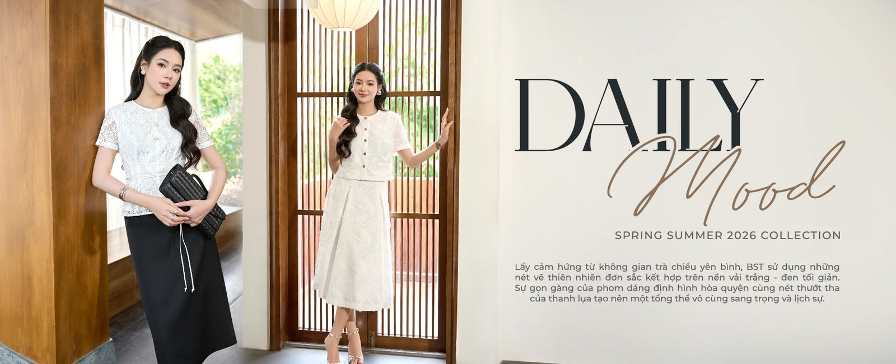 — 출처 <https://cotton4u.vn/files/news/2026/06/19/6a051c7c1a148911a0f04bb13704e9e4.webp>
-  — 출처 <https://cotton4u.vn/files/news/2026/06/15/0d61087c01460e154abd6acbbd3706b9.webp>
-  — 출처 <https://cotton4u.vn/files/news/2026/06/23/da4faa3fe3af0cef91c4696275413c54.webp>
-  — 출처 <https://cotton4u.vn/files/product/thumab/400/2026/06/08/2cf9b85228b3e78f22cfc3718f6e24b6.webp>
- 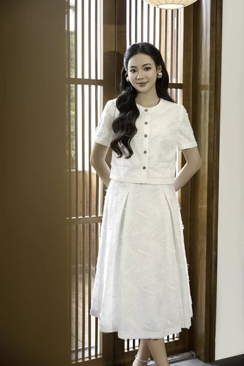 — 출처 <https://cotton4u.vn/files/product/thumab/400/2026/06/08/15562de9138d1c5927ee7f195c512e06.webp>
-  — 출처 <https://cotton4u.vn/files/product/thumab/400/2026/06/08/84ceec2e174853ef07c4201f1c60aee3.webp>

**페이지 메타 정보**

| page | title | description |
|---|---|---|
| [`home`](https://ivymoda.com/) | IVY moda - Thời Trang Công Sở Hiện Đại | IVY moda |  |

#### [Lazada Vietnam](https://www.lazada.vn/)

- URL: <https://www.lazada.vn/>
- 페이지: **OK 1 · FAIL 0**

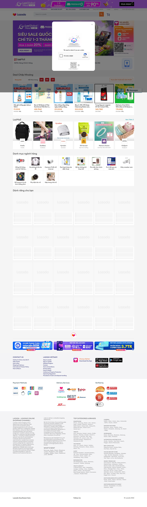

**대표 상품 이미지** (상위 6장, 출처 URL 포함)

-  — 출처 <https://img.lazcdn.com/us/domino/2ad4f22ce5a43dc145f221d13feed352.png>
-  — 출처 <https://img.lazcdn.com/g/tps/images/ims-web/TB1T7K2d8Cw3KVjSZFuXXcAOpXa.png>
-  — 출처 <https://img.lazcdn.com/us/domino/bb1be9e5-70ca-4876-ab63-73940b432cdc_VN-1976-688.jpg_2200x2200q80.jpg>
- 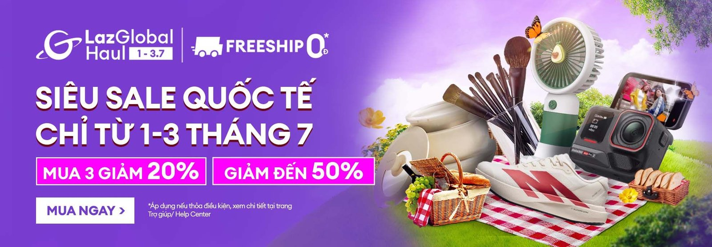 — 출처 <https://img.lazcdn.com/us/domino/71bdb75c-a4e9-414b-be0c-e42b90ddc217_VN-1976-688.jpg_2200x2200q80.jpg>
- 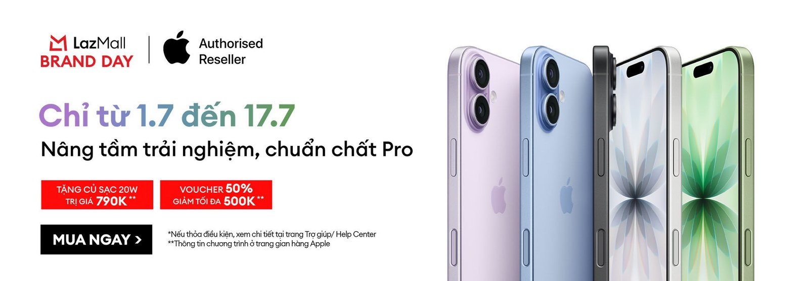 — 출처 <https://img.lazcdn.com/us/domino/196057f4-5fa2-4a80-9dae-83c669f4ad64_VN-1976-688.jpg_2200x2200q80.jpg>
- 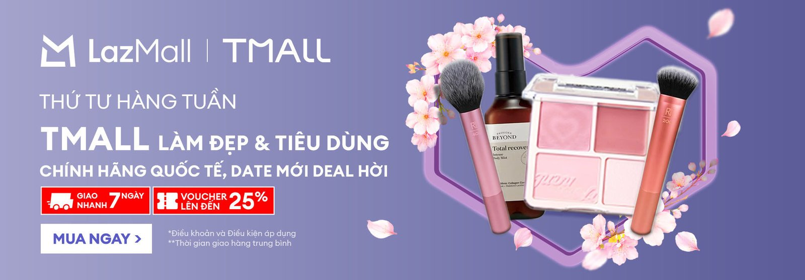 — 출처 <https://img.lazcdn.com/us/domino/7ffc967e-9dbd-49ef-b05c-a5d9c8cb6ef7_VN-1976-688.jpg_2200x2200q80.jpg>

**페이지 메타 정보**

| page | title | description |
|---|---|---|
| [`home`](https://www.lazada.vn/#?) | Lazada Việt Nam | Mua Sắm Online, Giá Tốt Nhất Mỗi Ngày | Mua sắm đồ điện tử, thời trang, làm đẹp và đồ chơi giá cả phải chăng. Đảm bảo sản phẩm chính hãng và trải nghiệm mua sắm tiện lợi – mua ngay |

#### [Shopee Vietnam](https://shopee.vn/)

- URL: <https://shopee.vn/>
- 페이지: **OK 1 · FAIL 0**

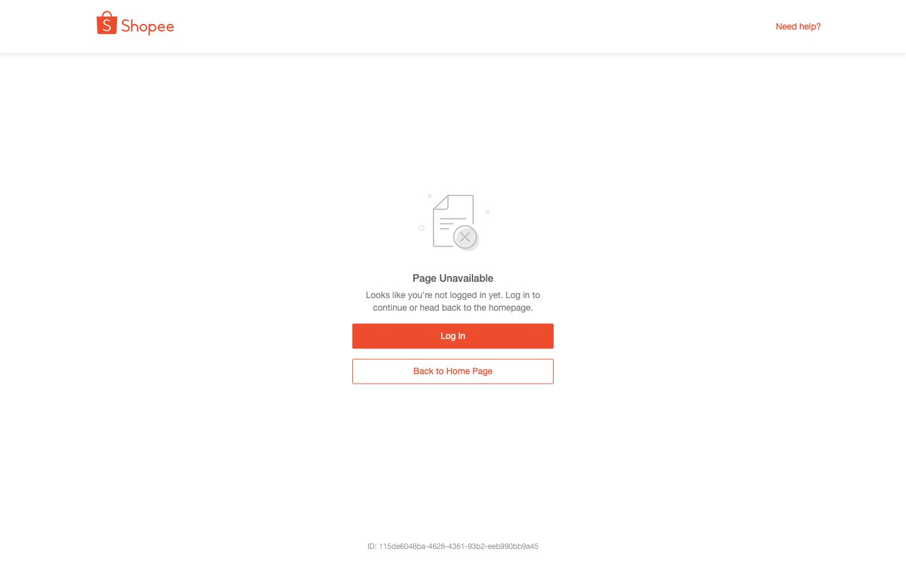

**페이지 메타 정보**

| page | title | description |
|---|---|---|
| [`home`](https://shopee.vn/verify/traffic/error?home_url=https%3A%2F%2Fshopee.vn&is_logged_in=false&next=https%3A%2F%2Fshopee.vn%2F&tracking_id=115de6046ba-4626-4361-93b2-eeb990bb9a45&type=4) | Shopee Việt Nam | Hot Deals, Best Prices |  |

#### [Tiki](https://tiki.vn/)

- URL: <https://tiki.vn/>
- 페이지: **OK 1 · FAIL 0**

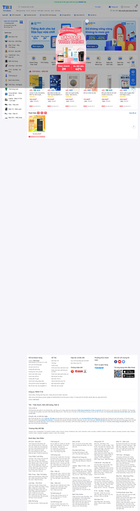

**대표 상품 이미지** (상위 6장, 출처 URL 포함)

-  — 출처 <https://salt.tikicdn.com/ts/tikimsp/85/d5/11/4161c9c346258d433ffbd39f25bfbbe7.png>
-  — 출처 <https://salt.tikicdn.com/cache/100x100/ts/category/ed/20/60/afa9b3b474bf7ad70f10dd6443211d5f.png>
-  — 출처 <https://salt.tikicdn.com/cache/100x100/ts/category/f6/22/46/7e2185d2cf1bca72d5aeac385a865b2b.png>
-  — 출처 <https://salt.tikicdn.com/cache/100x100/ts/category/54/c0/ff/fe98a4afa2d3e5142dc8096addc4e40b.png>
-  — 출처 <https://salt.tikicdn.com/cache/100x100/ts/category/13/64/43/226301adcc7660ffcf44a61bb6df99b7.png>

**페이지 메타 정보**

| page | title | description |
|---|---|---|
| [`home`](https://tiki.vn/) | Tiki - Mua hàng online giá tốt, hàng chuẩn, ship nhanh | Tiện lợi mua sắm hàng triệu mặt hàng, dịch vụ. Vô vàn ưu đãi freeship, mã giảm giá. Hoàn tiền 15% tối đa 600k/tháng với thẻ tín dụng TikiCAR |

## 5. 의류 카테고리별 글로벌 트렌드

| # | 카테고리 | 건수 | 대표 상품명 |
|---:|---|---:|---|
| 1 | `셔츠` | 12 | SITP5147 노블 시어서커 ST 셔츠_Ivory · SITP5278 소프트 쉬어 썸머 셔츠_Beige · SITP5278 소프트 쉬어 썸머 셔츠_White |
| 2 | `블라우스` | 12 | [반팔블라우스💙/하객룩/made] 드멜린 블라우스 (2color) · [반팔💙/하객룩/made] 플롯 레이어드 블라우스 (6color) · Founders 파운더스 델핀 링클 블라우스 유넥 반팔 주름 bl (3 color) |
| 3 | `blouse` | 9 | [정린 PICK] CLARE SHIRRING BLOUSE [WHITE] · [헤이가가PICK/29CM단독/2차] CLARE SHIRRING BLOUSE [CHECK] · [에이핑크 보미착용/3차 REORDER] SCOOP NECK LACE BLOUSE [WHITE] |
| 4 | `shirt` | 9 | [29CM 단독][다연 PICK]BACK-ADJUSTABLE SHIRT_SKY BLUE · PESTO RAGLAN T-SHIRT EARTH BLUE · PESTO RAGLAN T-SHIRT APPLE |
| 5 | `팬츠` | 9 | [XS 사이즈 추가] SIPT7153 컴포트 라인 카프리 팬츠_Black · SIPT7153 컴포트 라인 카프리 팬츠 (여름 ver)_Black · SIPT7196 리조트 와이드 밴딩 팬츠_White |
| 6 | `슬랙스` | 6 | [단독]SIPT7078 투턱 나일론 슬랙스_2PACK · SIPT7078 투턱 나일론 슬랙스_Beige · SIPT7078 투턱 나일론 슬랙스_Black |
| 7 | `가디건` | 5 | 린넨 시스루 라운드 가디건 5 COLOR COWCD007 · 린넨 시스루 골지 라운드 가디건 5 COLOR COWCD008 · 린넨 시스루 슬림 라운드 가디건 4 COLOR COWCD009 |
| 8 | `스커트` | 5 | SIST9024 나일론 퍼티그 스커트_2Colors · SIST9060 컴포트 다이마루 밴딩 롱 스커트_Black · [오픈할인중/베스트재입고] only. 마인드 올데이 밴딩롱스커트 - 3 color (무료배송) |
| 9 | `니트` | 3 | 메쉬 니트 가디건_Cloud · 메쉬 니트 가디건_Deep Navy · [살안타템✨/R넥&V넥/made] 맬리 팬던트 니트 가디건 (8color) |
| 10 | `pants` | 3 | CLAUDE PANTS (COTTON POPLIN) · Daily washed bermuda denim pants_Blue · [헤이가가 PICK]PINSTRIPE CAPRI PANTS_DARK NAVY |

**국가별 의류 TOP**

- **korea**: `셔츠`(12), `블라우스`(12), `blouse`(9), `shirt`(9), `팬츠`(9)
## 6. 악세사리 카테고리별 글로벌 트렌드

| # | 카테고리 | 건수 | 대표 상품명 |
|---:|---|---:|---|
| 1 | `샌들` | 1 | [바로배송] Dune Mult Strap Sandal 스트랩 샌들 6.5cm -WS9054 (3color) |
| 2 | `로퍼` | 1 | [바로배송] Kenshington Belted Loafer 벨티드 로퍼 4.5cm -WS9025 (1color) |
| 3 | `bag` | 1 | SIAC3071 Lotus Bag_Black |

**국가별 악세사리 TOP**

- **korea**: `샌들`(1), `로퍼`(1), `bag`(1)
## 7. 국가별 가격대 비교

| 국가 | 통화 | 표본 | min | p25 | median | p75 | max | median (USD) |
|---|---|---:|---:|---:|---:|---:|---:|---:|
| korea | KRW | 116 | 7900 | 27200 | 47400 | 66572 | 336000 | 30.74 |

> p25/p75 는 IQR 기준 분위수. USD 환산은 `config/exchange_rates.yaml` 기준 (운영자가 정기 갱신).

## 8. 국내 의류·악세사리 사업동향

### KITA K-stat

- 한국무역통계의 국가 수출입 통계 총괄 페이지입니다.
- 사이트: <https://stat.kita.net/stat/kts/ctr/CtrTotalImpExpList.screen>

| # | topic | title | url |
|---:|---|---|---|
| 1 | `trade` | KITA.NET | <https://www.kita.net/> |
| 2 | `trade` | K-stat 란? | <https://www.kita.net/pdf/statGuide/index.html#p=1> |
| 3 | `무역통계` | 무역통계 분류 | <https://stat.kita.net/stat/guide/guide_18_01.screen> |
| 4 | `trade` | 한국품목코드 | <https://stat.kita.net/stat/kts/statCode/ItemHierCodeList.screen> |
| 5 | `trade` | 해외품목코드 | <https://stat.kita.net/stat/istat/common/IstatHSCode.screen> |
| 6 | `trade` | 대륙/경제코드 | <https://stat.kita.net/stat/kts/statCode/ConEcoCodeList.screen> |
| 7 | `trade` | 수출입 총괄 | <https://stat.kita.net/stat/kts/sum/SumImpExpTotalList.screen> |
| 8 | `trade` | 가공단계 수출입 | <https://stat.kita.net/stat/kts/use/BecList.screen> |
| 9 | `trade` | 품목 수출입 | <https://stat.kita.net/stat/kts/pum/ItemImpExpList.screen> |
| 10 | `trade` | 국가 수출입 | <https://stat.kita.net/stat/kts/ctr/CtrTotalImpExpList.screen> |
| 11 | `trade` | 대륙/경제권 수출입 | <https://stat.kita.net/stat/kts/rel/RelColligationList.screen> |
| 12 | `trade` | 지자체 수출입 | <https://stat.kita.net/stat/kts/prod/ProdWholeList.screen> |
| 13 | `trade` | 항구/공항 수출입 | <https://stat.kita.net/stat/kts/port/PortImpExpList.screen> |
| 14 | `trade` | FTA체결국 수출입 | <https://stat.kita.net/stat/kts/fta/FtaCtrImpExpList.screen> |
| 15 | `trade` | 간접수출 현황 | <https://stat.kita.net/stat/ind/KtsIndMain.screen> |

### Korea Customs Service

- 수출입 현황, 물류통계 등 관세청 무역통계정보를 종합적으로 제공
- 사이트: <https://tradedata.go.kr/cts/index_eng.do>

| # | topic | title | url |
|---:|---|---|---|
| 1 | `trade` | Korea Customs Service | <http://customs.go.kr/english/main.do> |

### KOSIS

- 코시스, 국가데이터처가 제공하는 원스톱 통계 서비스, 국가승인통계, 국제통계, 북한통계, e-지방지표, 통계시각화콘텐츠, 온라인간행물 등 제공
- 사이트: <https://kosis.kr/statisticsList/statisticsListIndex.do;jsessionid=xIrTrAVZyDLOExxepc6qCQcY4ENT0TtREJgjQpUZ.esvwas4_S41?parmTabId=M_01_01&vwcd=MT_ZTITLE&menuId=M_01_01&outLink=Y&entrType=>

| # | topic | title | url |
|---:|---|---|---|
| 1 | `statistics` | 쉽게 보는 통계 | <http://kosis.kr/easyViewStatis/customStatisIndex.do?vwcd=MT_TM1_TITLE&menuId=M_03_01> |
| 2 | `statistics` | 이슈별 접근 | <http://kosis.kr/easyViewStatis/customStatisIndex.do?vwcd=MT_TM2_TITLE&menuId=M_03_02> |
| 3 | `statistics` | 통계시각화콘텐츠 | <http://kosis.kr/easyViewStatis/visualizationIndex.do> |
| 4 | `statistics` | 온라인간행물 | <http://kosis.kr/publication/publicationThema.do> |
| 5 | `statistics` | 기획간행물 | <http://kosis.kr/publication/publicationStat.do> |
| 6 | `statistics` | KOSIS 길라잡이 | <http://kosis.kr/civilComplaint/kosisGuideIndex.do> |
| 7 | `statistics` | 홈페이지 개선의견 | <http://kosis.kr/civilComplaint/siteRequestList.do> |
| 8 | `statistics` | 찾아가는 KOSIS | <http://kosis.kr/civilComplaint/kosisEduIndex.do> |
| 9 | `statistics` | 서비스 소개 | <http://kosis.kr/serviceInfo/kosisIntroduce.do> |
| 10 | `statistics` | 국가통계현황 | <http://kosis.kr/serviceInfo/statisInstitution.do> |
| 11 | `statistics` | 국가통계 공표일정 | <http://kosis.kr/serviceInfo/statisPublicationList.do> |
| 12 | `statistics` | 팩트체크 서비스 | <http://kosis.kr/serviceInfo/factCheckList.do> |
| 13 | `statistics` | 서비스정책 | <http://kosis.kr/serviceInfo/useGuide.do> |
| 14 | `statistics` | 공유서비스 (OpenAPI) | <http://kosis.kr/serviceInfo/openAPIGuide.do> |
| 15 | `statistics` | English | <https://kosis.kr/eng> |

### KOTRA

- 트라이빅(TriBig)은 코트라(KOTRA)가 제공하는 무역투자 빅데이터 플랫폼으로 무역투자통계, 국가별 시장정보, 품목별 유망시장, 기업별 맞춤정보, 해외바이어 정보의 서비스를 제공합니다.
- 사이트: <https://www.kotra.or.kr/bigdata/visualization/korea#search/ALL/ALL/2024>

| # | topic | title | url |
|---:|---|---|---|
| 1 | `trade` | kotra 무역투자24 | <https://www.kotra.or.kr/bigdata/kotraSsoRedirect?targetURL=https://www.kotra.or.kr> |
| 2 | `trade` | 해외비즈니스 정보 포털 | <https://www.kotra.or.kr/bigdata/kotraSsoRedirect?targetURL=https://dream.kotra.or.kr/dream> |
| 3 | `trade` | 글로벌 전시포털 | <https://www.kotra.or.kr/bigdata/kotraSsoRedirect?targetURL=https://www.gep.or.kr/> |
| 4 | `trade` | KOTRA 해외인재유치센터 | <https://www.kotra.or.kr/gtc_kor> |
| 5 | `trade` | 투자유치정보제공 | <https://www.kotra.or.kr/bigdata/kotraSsoRedirect?targetURL=https://www.investkorea.org/> |
| 6 | `수출지원` | 수출지원 온라인 플랫폼 | <https://www.kotra.or.kr/bigdata/kotraSsoRedirect?targetURL=https://www.buykorea.or.kr/> |
| 7 | `trade` | 빅데이터 서비스 | <https://www.kotra.or.kr/bigdata/> |
| 8 | `trade` | 경제외교 활용포털 | <https://www.kotra.or.kr/bigdata/kotraSsoRedirect?targetURL=https://president.globalwindow.org> |
| 9 | `trade` | 방산물자교역지원센터 | <https://www.kotra.or.kr/bigdata/kotraSsoRedirect?targetURL=https://www.kotra.or.kr/kodits> |
| 10 | `trade` | 외투기업고충처리 | <https://www.kotra.or.kr/bigdata/kotraSsoRedirect?targetURL=https://ombudsman.kotra.or.kr/ob-kr> |
| 11 | `trade` | 수출바우처 · 지사화 | <https://www.exportvoucher.com> |
| 12 | `trade` | 무역투자통계 | <https://www.kotra.or.kr/bigdata/visualization/korea> |
| 13 | `trade` | 국가별 시장정보 | <https://www.kotra.or.kr/bigdata/marketAnalysis> |
| 14 | `trade` | 품목별 유망시장 | <https://www.kotra.or.kr/bigdata/bhrcMarket> |
| 15 | `trade` | 해외바이어 정보 | <https://www.kotra.or.kr/bigdata/partner/search> |

### Statistics Korea Online Shopping

- 국가데이터처,List | 전체 | 보도자료 | 새소식
- 사이트: <https://mods.go.kr/board.es?mid=a10301010000&bid=11789>

| # | topic | title | url |
|---:|---|---|---|
| 1 | `statistics` | 정보공개제도 | <https://mods.go.kr/menu.es?mid=a10101010100> |
| 2 | `statistics` | 정보공개청구 | <https://www.open.go.kr/com/main/mainView.do> |
| 3 | `statistics` | 비공개대상정보세부기준 | <https://mods.go.kr/menu.es?mid=a10101030000> |
| 4 | `statistics` | 고객수요분석 | <https://mods.go.kr/menu.es?mid=a10101040000> |
| 5 | `statistics` | 사전정보공표 | <https://mods.go.kr/menu.es?mid=a10103010000> |
| 6 | `statistics` | 사전정보공표목록 | <https://mods.go.kr/menu.es?mid=a10103010100> |
| 7 | `statistics` | 핵심단어목록 | <https://mods.go.kr/menu.es?mid=a10103020100> |
| 8 | `statistics` | 인기정보TOP10 | <https://mods.go.kr/menu.es?mid=a10103030100> |
| 9 | `statistics` | 행정자료실 | <https://mods.go.kr/menu.es?mid=a10104010000> |
| 10 | `statistics` | 업무추진비 | <https://mods.go.kr/menu.es?mid=a10104010100> |
| 11 | `statistics` | 국회관련정보 | <https://mods.go.kr/menu.es?mid=a10104040000> |
| 12 | `statistics` | 정책실명제 | <https://mods.go.kr/menu.es?mid=a10105010000> |
| 13 | `statistics` | 연도별대상사업현황 | <https://mods.go.kr/menu.es?mid=a10105020000> |
| 14 | `statistics` | 중점관리대상사업 | <https://mods.go.kr/menu.es?mid=a10105030600> |
| 15 | `statistics` | 국민신청실명제 | <https://mods.go.kr/menu.es?mid=a10105040000> |

### 기업마당

- 기업마당>정책정보>지원사업 공고
- 사이트: <https://www.bizinfo.go.kr/sii/siia/selectSIIA200View.do?null>

| # | topic | title | url |
|---:|---|---|---|
| 1 | `policy` | 지원사업 공고 | <https://www.bizinfo.go.kr/sii/siia/selectSIIA200View.do> |
| 2 | `policy` | 품목별 법정의무 인증제도 | <https://www.bizinfo.go.kr/biz/biza/selectBIZA100View.do> |
| 3 | `policy` | 입법·행정예고/고시 | <https://www.bizinfo.go.kr/biz/biza/selectBIZA300View.do> |
| 4 | `policy` | 월간 중기누리 | <https://www.bizinfo.go.kr/biz/biza/selectBIZA400View.do> |
| 5 | `policy` | 기업업무용 서식 | <https://www.bizinfo.go.kr/biz/bizb/selectBIZB100View.do> |
| 6 | `policy` | 입주기업 모집공고 | <https://www.bizinfo.go.kr/biz/bizb/selectBIZB200View.do> |
| 7 | `policy` | 온라인화상회의실 | <https://www.k-startup.go.kr/web/contents/webOLNIVIDEOMTRM.do> |
| 8 | `policy` | 정책정보 개방 | <https://www.bizinfo.go.kr/apiList.do> |
| 9 | `policy` | 속보성 대시보드 | <https://www.bizinfo.go.kr/dashboard.do> |
| 10 | `policy` | 고객의 소리 | <https://www.bizinfo.go.kr/biz/bizc/selectBIZC200Regist.do> |
| 11 | `policy` | 자주하는질문 | <https://www.bizinfo.go.kr/biz/bizc/selectBIZC300View.do> |
| 12 | `policy` | 이메일주소 무단 수집 거부안내 | <https://www.bizinfo.go.kr/biz/bizd/selectBIZD110View.do> |
| 13 | `policy` | 저작권 정책 | <https://www.bizinfo.go.kr/biz/bizd/selectBIZD120View.do> |
| 14 | `policy` | 웹접근성 정책 | <https://www.bizinfo.go.kr/biz/bizd/selectBIZD130View.do> |
| 15 | `policy` | 전체메뉴보기 | <https://www.bizinfo.go.kr/sitemap/intro.do> |

### 서울경제진흥원

- 서울경제진흥원 에러페이지
- 사이트: <https://www.sba.seoul.kr/Pages/error_404.html?aspxerrorpath=/Pages/NSub06_01.aspx>

### 소상공인24

- 소상공인24
- 사이트: <https://www.sbiz24.kr/#/pbanc>

### 중소벤처기업부

- 중소기업중앙회 등 기관 중소기업 조사, 통계 DB화 검색, 내려받기 등 제공.
- 사이트: <https://www.mss.go.kr/site/smba/ex/bbs/List.do?cbIdx=86>

| # | topic | title | url |
|---:|---|---|---|
| 1 | `policy` | 어린이 누리집 | <https://www.mss.go.kr/site/kids/main.do> |
| 2 | `policy` | English | <https://www.mss.go.kr/site/eng/main.do> |
| 3 | `policy` | 누리집 안내지도 | <https://www.mss.go.kr/site/smba/ex/siteMap/siteMap.do> |
| 4 | `policy` | 훈령/예규/고시/공고 | <https://www.mss.go.kr/site/smba/ex/bbs/List.do?cbIdx=125&ext6=Y> |
| 5 | `policy` | 입법/행정예고 | <https://www.mss.go.kr/site/smba/ex/bbs/List.do?cbIdx=126&searchRltnYn=Y> |
| 6 | `policy` | 인사·채용 | <https://www.mss.go.kr/site/smba/ex/bbs/List.do?cbIdx=82> |
| 7 | `policy` | 보도설명자료 | <https://www.mss.go.kr/site/smba/ex/bbs/List.do?cbIdx=87> |
| 8 | `policy` | 현장속으로 | <https://www.mss.go.kr/site/smba/brdcststnVod/brdcststnVodList.do?ctgr_code=C01> |
| 9 | `policy` | 중기부소식지 | <https://www.mss.go.kr/site/smba/ex/bbs/List.do?cbIdx=95> |
| 10 | `policy` | 통계발표자료 | <https://www.mss.go.kr/site/smba/foffice/ex/statDB/ptScheduleList.do> |
| 11 | `policy` | 주제별 통계 | <https://www.mss.go.kr/site/smba/foffice/ex/statDB/temaList.do?tabCd=0001> |
| 12 | `policy` | 조사별 통계 | <https://www.mss.go.kr/site/smba/foffice/ex/statDB/surveyList.do?tabCd=0001> |
| 13 | `policy` | 조사보고서 | <https://www.mss.go.kr/site/smba/foffice/ex/statDB/stReportRoList.do?gb=1&nodeId=&roCode=> |
| 14 | `policy` | 주제별 조회 | <https://www.mss.go.kr/site/smba/foffice/ex/statDB/stReportRcList.do?gb=2&nodeId=&rcCode=> |
| 15 | `policy` | 중소기업위상 | <https://www.mss.go.kr/site/smba/foffice/ex/statDB/MainSubStat.do?scd=0001> |

## 9. 한국 사업자 관점 기회 국가 TOP 10

| # | 국가 | tier | region | 점수 | 근거 |
|---:|---|---:|---|---:|---|
| 1 | 태국 _( Thailand )_ | 1 | `asia` | **143.5** | tier1 기본점(90); 아시아 권역(+20); ASEAN 시장(+10); K-패션/콘텐츠 친화 시장(+20); 트렌드 신호 밀도 4 |
| 2 | 대만 _( Taiwan )_ | 1 | `asia` | **136.5** | tier1 기본점(90); 아시아 권역(+20); K-패션/콘텐츠 친화 시장(+20); 트렌드 신호 밀도 6 |
| 3 | 일본 _( Japan )_ | 1 | `asia` | **130.0** | tier1 기본점(90); 아시아 권역(+20); K-패션/콘텐츠 친화 시장(+20) |
| 4 | 베트남 _( Vietnam )_ | 1 | `asia` | **123.5** | tier1 기본점(90); 아시아 권역(+20); ASEAN 시장(+10); 트렌드 신호 밀도 4 |
| 5 | 인도네시아 _( Indonesia )_ | 1 | `asia` | **122.5** | tier1 기본점(90); 아시아 권역(+20); ASEAN 시장(+10); 트렌드 신호 밀도 2 |
| 6 | 미국 _( United States )_ | 1 | `north_america` | **115.0** | tier1 기본점(90); 트렌드 신호 밀도 25 |
| 7 | 필리핀 _( Philippines )_ | 2 | `asia` | **110.0** | tier2 기본점(60); 아시아 권역(+20); ASEAN 시장(+10); K-패션/콘텐츠 친화 시장(+20) |
| 8 | 말레이시아 _( Malaysia )_ | 2 | `asia` | **90.0** | tier2 기본점(60); 아시아 권역(+20); ASEAN 시장(+10) |
| 9 | 싱가포르 _( Singapore )_ | 2 | `asia` | **90.0** | tier2 기본점(60); 아시아 권역(+20); ASEAN 시장(+10) |
| 10 | 홍콩 _( Hong Kong )_ | 2 | `asia` | **80.0** | tier2 기본점(60); 아시아 권역(+20) |

## 10. 실행 제안

### **1위 태국** (점수 144, tier1 · asia)

- 현지 스타일 TOP: `wide` — 시즌 컬렉션 기획 시 우선 반영.
- 현지 컬러 TOP: `red` — 시즌 컬렉션 기획 시 우선 반영.
- 현지 카테고리 TOP: `tee`, `bag`, `accessories` — 시즌 컬렉션 기획 시 우선 반영.
- K-패션 친화도가 명시된 시장이므로 K-브랜드 아이덴티티 및 한류 셀럽 협업을 강조.
- ASEAN 권역 시장 — 물류/관세(FTA) 활용 + 동남아 통합 마케팅 검토 권장.
- tier1 핵심 시장 — 현지 마켓플레이스(예: 해당 국가의 대표 패션 플랫폼) 공식 입점 + 셀러 운영 채널 확보 우선.
- 연계 가능한 국내 수출/지원 사업이 식별되지 않음 — `domestic_sources.yaml` 의 `landing_url` 을 KOTRA 사업 공고/기업마당 수출바우처로 직접 지정 권장.

### **2위 대만** (점수 136, tier1 · asia)

- 현지 컬러 TOP: `pink`, `red` — 시즌 컬렉션 기획 시 우선 반영.
- 현지 소재 TOP: `lace` — 시즌 컬렉션 기획 시 우선 반영.
- K-패션 친화도가 명시된 시장이므로 K-브랜드 아이덴티티 및 한류 셀럽 협업을 강조.
- 아시아 권역 시장 — 시차/언어 친화 + 한국 본사 직배송 모델 검토.
- tier1 핵심 시장 — 현지 마켓플레이스(예: 해당 국가의 대표 패션 플랫폼) 공식 입점 + 셀러 운영 채널 확보 우선.
- 연계 가능한 국내 수출/지원 사업이 식별되지 않음 — `domestic_sources.yaml` 의 `landing_url` 을 KOTRA 사업 공고/기업마당 수출바우처로 직접 지정 권장.

### **3위 일본** (점수 130, tier1 · asia)

- K-패션 친화도가 명시된 시장이므로 K-브랜드 아이덴티티 및 한류 셀럽 협업을 강조.
- 아시아 권역 시장 — 시차/언어 친화 + 한국 본사 직배송 모델 검토.
- tier1 핵심 시장 — 현지 마켓플레이스(예: 해당 국가의 대표 패션 플랫폼) 공식 입점 + 셀러 운영 채널 확보 우선.
- 연계 가능한 국내 수출/지원 사업이 식별되지 않음 — `domestic_sources.yaml` 의 `landing_url` 을 KOTRA 사업 공고/기업마당 수출바우처로 직접 지정 권장.

### 운영 점검 노트

- **ASEAN 다중 진출 기회**: TOP10 중 ASEAN 국가가 3개 이상. Shopee/Lazada/Zalora 통합 운영을 통한 동남아 멀티마켓 전략을 검토 권장.

## 11. 수집 실패/주의 사이트

| 국가 | 사이트 | 페이지 | 상태 | 사유 |
|---|---|---|---|---|
| usa | Revolve | new | failed | playwright_error: Error: Page.goto: net::ERR_HTTP2_PROTOCOL_ERROR at https://www.revolve.com/new/br/c79f88/
Call log:
  - navigating to "https://www.revolve.com/new/br/c79f88/", waiting until "domcontentloaded"
 |
| usa | Revolve | trending | failed | playwright_error: Error: Page.goto: net::ERR_HTTP2_PROTOCOL_ERROR at https://www.revolve.com/most-loved/br/4a9ca5/
Call log:
  - navigating to "https://www.revolve.com/most-loved/br/4a9ca5/", waiting until "domcontentloaded"
 |
| japan | ZOZOTOWN | new | failed | playwright_error: TimeoutError: Page.goto: Timeout 30000ms exceeded.
Call log:
  - navigating to "https://zozo.jp/category/new/", waiting until "domcontentloaded"
 |
| japan | ZOZOTOWN | ranking | failed | playwright_error: TimeoutError: Page.goto: Timeout 30000ms exceeded.
Call log:
  - navigating to "https://zozo.jp/ranking/", waiting until "domcontentloaded"
 |
| japan | Rakuten Fashion | women | failed | http_status_404 |
| indonesia | Tokopedia | home | failed | playwright_error: Error: Page.goto: net::ERR_HTTP2_PROTOCOL_ERROR at https://www.tokopedia.com/
Call log:
  - navigating to "https://www.tokopedia.com/", waiting until "domcontentloaded"
 |
| indonesia | Berrybenka | home | failed | http_error: ConnectError: [Errno 8] nodename nor servname provided, or not known |
| taiwan | PChome | home | failed | http_status_429 |
| thailand | Pomelo | new | failed | robots_disallowed |
| thailand | Pomelo | best | failed | robots_disallowed |
| korea | Musinsa | home | failed | robots_disallowed |

## 12. 원문 출처 및 이미지 출처

### 인도네시아

- **Berrybenka** — <https://www.berrybenka.com/>
- **Hijup** — <https://www.hijup.com/>
- **Shopee Indonesia** — <https://shopee.co.id/>
  - 이미지 출처: <https://deo.shopeemobile.com/shopee/shopee-pcmall-live-sg/assets/1c8bdaaf45e1fd48.png>
- **Tokopedia** — <https://www.tokopedia.com/>
- **Zalora Indonesia** — <https://www.zalora.co.id/>
  - 이미지 출처: <https://static-id.zacdn.com/next-assets/static-assets/images/logo/icon_mastercard.png>
  - 이미지 출처: <https://static-id.zacdn.com/next-assets/static-assets/images/logo/icon_visa.png>
  - 이미지 출처: <https://static-id.zacdn.com/next-assets/static-assets/images/logo/icon_ovo.png>

### 일본

- **GU Japan** — <https://www.gu-global.com/jp/>
  - 이미지 출처: <https://image.uniqlo.com/GU/ST3/jp/imagesother/Navigation/WOMEN_Category/2026/260513/Category_w_Half-Tshirt.png>
  - 이미지 출처: <https://image.uniqlo.com/GU/ST3/jp/imagesother/Navigation/WOMEN_Category/2026/260515/Category_w_Tshirt.png>
  - 이미지 출처: <https://image.uniqlo.com/GU/ST3/jp/imagesother/Navigation/WOMEN_Category/2026/260612/Category_w_shirt-blouse.png>
  - 이미지 출처: <https://image.uniqlo.com/GU/ST3/jp/imagesother/Navigation/WOMEN_Category/2026/260612/Category_w_Knit-cardigan.png>
  - 이미지 출처: <https://image.uniqlo.com/GU/ST3/jp/imagesother/Navigation/WOMEN_Category/2026/260513/Category_w_onepeace.png>
  - 이미지 출처: <https://image.uniqlo.com/GU/ST3/jp/imagesother/Navigation/WOMEN_Category/2026/260513/Category_w_Sweat.png>
  - 이미지 출처: <https://image.uniqlo.com/GU/ST3/jp/imagesother/Navigation/WOMEN_Category/2026/260513/Category_w_Outer.png>
  - 이미지 출처: <https://image.uniqlo.com/GU/ST3/jp/imagesother/Navigation/WOMEN_Category/2026/260513/Category_w_Haori.png>
  - 이미지 출처: <https://image.uniqlo.com/GU/ST3/jp/imagesother/Navigation/category-icon/260615_w_360647.jpg>
  - 이미지 출처: <https://image.uniqlo.com/GU/ST3/jp/imagesother/Navigation/WOMEN_Category/2026/260528/Category_w_skirt.png>
  - 이미지 출처: <https://image.uniqlo.com/GU/ST3/jp/imagesother/Navigation/WOMEN_Category/2026/260518/Category_w_Short-Pants.png>
  - 이미지 출처: <https://image.uniqlo.com/GU/ST3/jp/imagesother/Navigation/WOMEN_Category/2026/260605/Category_w_roomwear.png>
  - 이미지 출처: <https://image.uniqlo.com/GU/ST3/jp/imagesother/Navigation/WOMEN_Category/2026/260513/Category_w_inner.png>
  - 이미지 출처: <https://image.uniqlo.com/GU/ST3/jp/imagesother/Navigation/WOMEN_Category/2026/260513/Category_w_DRY-inner.png>
- **Rakuten Fashion** — <https://brandavenue.rakuten.co.jp/>
  - 이미지 출처: <https://brandavenue.r10s.jp/img/library/index/sbn_flagshipstore_20231003.png>
  - 이미지 출처: <https://brandavenue.r10s.jp/img/news/01/382759/pc_n.jpg>
  - 이미지 출처: <https://brandavenue.r10s.jp/img/news/01/382745/pc_n.jpg>
  - 이미지 출처: <https://brandavenue.r10s.jp/img/news/01/382609/pc_n.jpg>
  - 이미지 출처: <https://brandavenue.r10s.jp/img/news/01/382746/pc_n.jpg>
  - 이미지 출처: <https://brandavenue.r10s.jp/img/news/01/382405/pc_n.jpg>
  - 이미지 출처: <https://brandavenue.r10s.jp/img/news/01/382587/pc_n.jpg>
  - 이미지 출처: <https://brandavenue.r10s.jp/img/news/01/382752/pc_n.jpg>
  - 이미지 출처: <https://brandavenue.r10s.jp/img/news/01/382227/pc_n.jpg>
  - 이미지 출처: <https://brandavenue.r10s.jp/img/news/01/381497/pc_n.png>
  - 이미지 출처: <https://brandavenue.r10s.jp/img/news/01/381494/pc_n.png>
  - 이미지 출처: <https://brandavenue.r10s.jp/img/news/01/381859/pc_n.jpg>
  - 이미지 출처: <https://brandavenue.r10s.jp/img/news/01/382140/pc_n.jpg>
  - 이미지 출처: <https://brandavenue.r10s.jp/img/news/01/382318/pc_n.jpg>
  - 이미지 출처: <https://brandavenue.r10s.jp/img/news/01/382459/pc_n.jpg>
  - 이미지 출처: <https://brandavenue.r10s.jp/img/news/13/382671/pc_n.jpg>
  - 이미지 출처: <https://brandavenue.r10s.jp/img/news/01/382602/pc_n.jpg>
  - 이미지 출처: <https://brandavenue.r10s.jp/img/news/01/377927/pc_n.jpg>
- **Uniqlo Japan** — <https://www.uniqlo.com/jp/>
- **WEAR** — <https://wear.jp/>
  - 이미지 출처: <https://wear.jp/public/_next/static/media/notfound_bg.1ywd-k_shp-hy.png>
  - 이미지 출처: <https://wear.jp/public/_next/static/media/notfound_4.1ho27atf54bbv.png>
  - 이미지 출처: <https://wear.jp/public/_next/static/media/notfound_0.438l9b9xjj6tm.png>
  - 이미지 출처: <https://images.wear2.jp/coordinate/lei08o60/7AxNnVmG/1782831748_276.jpg>
  - 이미지 출처: <https://images.wear2.jp/coordinate/kAiO3P8/Yue7TH8S/1782812431_276.jpg>
  - 이미지 출처: <https://images.wear2.jp/coordinate/Z8iyzr/IyKsseaj/1782715301_276.jpg>
  - 이미지 출처: <https://images.wear2.jp/coordinate/wniplx08/CLBcG13B/1782661717_276.jpg>
  - 이미지 출처: <https://images.wear2.jp/coordinate/7bin5r8/3m66ljKw/1781785981_276.jpg>
  - 이미지 출처: <https://images.wear2.jp/coordinate/lei0jZzl/sgx7qBx6/1782537247_276.jpg>
  - 이미지 출처: <https://images.wear2.jp/profile/6gio2xl5/hpSX0raH/1715229637_120.jpg>
  - 이미지 출처: <https://images.wear2.jp/profile/xViddom4/nu6GUhrN/1710578951_120.jpg>
  - 이미지 출처: <https://images.wear2.jp/profile/3oiw78Xa/ZyHljuxj/1777108607_120.jpg>
  - 이미지 출처: <https://images.wear2.jp/profile/6ginq68V/NRgMxEW6/1772581058_120.jpg>
  - 이미지 출처: <https://images.wear2.jp/profile/YMibJzWz/Zg1H8s2k/1730388182_120.jpg>
  - 이미지 출처: <https://images.wear2.jp/profile/DZiMWDQ2/4Bo8fUk9/1688269853_120.jpg>
  - 이미지 출처: <https://images.wear2.jp/profile/ekiqYE0j/DuftZhCX/1731761488_120.jpg>
  - 이미지 출처: <https://images.wear2.jp/profile/AAixLj7j/q4JaxAdC/1765876658_120.jpg>
  - 이미지 출처: <https://images.wear2.jp/profile/m0iA6wA5/F0eZo10P/1752485832_120.jpg>
  - 이미지 출처: <https://wear.jp/public/_next/static/media/mock.1nojp5gcpw2a6.webp>
  - 이미지 출처: <https://wear.jp/public/_next/static/media/icon_ios.3bb2u7wtfxz7c.webp>
- **ZOZOTOWN** — <https://zozo.jp/>

### 한국

- **29CM** — <https://www.29cm.co.kr/>
  - 이미지 출처: <https://img.29cm.co.kr/cms/202606/11f17379972fe00a81a7a947ed52a053.png?width=3840&format=webp>
  - 이미지 출처: <https://img.29cm.co.kr/cms/202606/11f173798bba864d9993c97bbce23693.png?width=3840&format=webp>
  - 이미지 출처: <https://img.29cm.co.kr/cms/202606/11f17379856595559993eb9e3200cc9d.png?width=3840&format=webp>
  - 이미지 출처: <https://img.29cm.co.kr/cms/202606/11f173797c84546681a7794ff43bc5a0.png?width=3840&format=webp>
  - 이미지 출처: <https://img.29cm.co.kr/cms/202606/11f1737972ee1ae999938bd42f0dcc5c.png?width=3840&format=webp>
  - 이미지 출처: <https://img.29cm.co.kr/cms/202606/11f1737969c5228e81a71f99e389c3df.png?width=3840&format=webp>
  - 이미지 출처: <https://img.29cm.co.kr/cms/202606/11f173795efa12c881a7e7bb61508db4.png?width=3840&format=webp>
  - 이미지 출처: <https://img.29cm.co.kr/cms/202606/11f17103595e517b9090d7aef389a227.png?width=3840&format=webp>
  - 이미지 출처: <https://img.29cm.co.kr/cms/202606/11f1710329c54269b3571be1bdb54d34.png?width=3840&format=webp>
  - 이미지 출처: <https://img.29cm.co.kr/cms/202606/11f17039b87a5e29b357f711823fb760.png?width=3840&format=webp>
  - 이미지 출처: <https://img.29cm.co.kr/cms/202606/11f17039b0dff4e1b357610a2b56a11c.png?width=3840&format=webp>
  - 이미지 출처: <https://img.29cm.co.kr/cms/202606/11f16f72209a1635b357dfe91bbc84fa.png?width=3840&format=webp>
  - 이미지 출처: <https://img.29cm.co.kr/cms/202606/11f16f72196facb1909001fe7e528509.png?width=3840&format=webp>
  - 이미지 출처: <https://img.29cm.co.kr/cms/202606/11f16f720988531fb357a9185d4fd150.png?width=3840&format=webp>
  - 이미지 출처: <https://img.29cm.co.kr/cms/202606/11f16ea951393ceb9090dfe8a7dc8f4a.png?width=3840&format=webp>
  - 이미지 출처: <https://img.29cm.co.kr/cms/202606/11f16dd9dd593d7db357dd38b09c50e8.png?width=3840&format=webp>
  - 이미지 출처: <https://img.29cm.co.kr/cms/202606/11f16dd9d4908d679090e12cd375824b.png?width=3840&format=webp>
  - 이미지 출처: <https://img.29cm.co.kr/cms/202606/11f16b9905d577b3b357150c4bf289ea.png?width=3840&format=webp>
  - 이미지 출처: <https://img.29cm.co.kr/cms/202606/11f16b98f20ec0edb357ad5238929bcd.png?width=3840&format=webp>
- **Musinsa** — <https://www.musinsa.com/>
- **W Concept** — <https://www.wconcept.co.kr/>
- **Zigzag** — <https://zigzag.kr/>
  - 이미지 출처: <https://cf.image-farm.s.zigzag.kr/original/cms/2026/06/28/202606281520269827_051126.png?width=1029&height=1188&quality=80&format=webp&transparent=true>
  - 이미지 출처: <https://cf.image-farm.s.zigzag.kr/original/cms/2026/06/29/202606290707484034_069554.png?width=1029&height=1188&quality=80&format=webp&transparent=true>
  - 이미지 출처: <https://cf.image-farm.s.zigzag.kr/original/cms/2026/06/30/202606300622564126_080814.jpg?width=1029&height=1188&quality=80&format=webp&transparent=true>
  - 이미지 출처: <https://cf.image-farm.s.zigzag.kr/original/cms/2026/06/26/202606260214476372_012478.png?quality=80&format=webp&transparent=true&width=1029&height=1188>
  - 이미지 출처: <https://cf.image-farm.s.zigzag.kr/original/cms/2026/06/29/202606291100546712_021310.png?quality=80&format=webp&transparent=true&width=1029&height=1188>
  - 이미지 출처: <https://cf.image-farm.s.zigzag.kr/original/cms/2026/06/23/202606230530501514_058486.jpg?width=1029&height=1188&quality=80&format=webp&transparent=true>
  - 이미지 출처: <https://cf.image-farm.s.zigzag.kr/original/cms/2026/06/30/202606301227275532_037672.jpg?width=1029&height=1188&quality=80&format=webp&transparent=true>
  - 이미지 출처: <https://cf.image-farm.s.zigzag.kr/original/cms/2026/06/26/202606260816532798_019520.jpg?width=1029&height=1188&quality=80&format=webp&transparent=true>
  - 이미지 출처: <https://cf.image-farm.s.zigzag.kr/original/cms/2026/06/25/202606250336386606_059480.png?quality=80&format=webp&transparent=true&width=1029&height=1188>
  - 이미지 출처: <https://cf.image-farm.s.zigzag.kr/original/cms/2026/06/25/202606250644415418_090502.png?quality=80&format=webp&transparent=true&width=1029&height=1188>
  - 이미지 출처: <https://cf.image-farm.s.zigzag.kr/original/cms/2026/06/23/202606230315312956_037748.png?quality=80&format=webp&transparent=true&width=1029&height=1188>
  - 이미지 출처: <https://cf.image-farm.s.zigzag.kr/original/cms/2026/06/30/202606300231503889_074214.jpg?format=webp&quality=80&width=1029&height=1188>
  - 이미지 출처: <https://cf.image-farm.s.zigzag.kr/original/cms/2026/06/25/202606250536488457_031442.png?quality=80&format=webp&transparent=true&width=1029&height=1188>
  - 이미지 출처: <https://cf.image-farm.s.zigzag.kr/original/cms/2026/06/23/202606230802501689_031110.jpg?width=1029&height=1188&quality=80&format=webp&transparent=true>
  - 이미지 출처: <https://cf.image-farm.s.zigzag.kr/original/cms/2026/06/28/202606280856377735_084949.jpg?width=1029&height=1188&quality=80&format=webp&transparent=true>
  - 이미지 출처: <https://cf.image-farm.s.zigzag.kr/original/cms/2026/06/30/202606300716433750_082366.jpg?width=1029&height=1188&quality=80&format=webp&transparent=true>
  - 이미지 출처: <https://cf.image-farm.s.zigzag.kr/original/cms/2026/06/26/202606260215137908_033566.png?quality=80&format=webp&transparent=true&width=1029&height=1188>
  - 이미지 출처: <https://cf.image-farm.s.zigzag.kr/original/cms/2026/06/24/202606240954097668_037853.jpg?width=1029&height=1188&quality=80&format=webp&transparent=true>

### 대만

- **momo** — <https://www.momoshop.com.tw/>
  - 이미지 출처: <https://img2.momoshop.com.tw/ecm/img/online/10/998/00/000/bt_0_271_01/bt_0_271_01_e2.jpg?t=1782816137623>
  - 이미지 출처: <https://img1.momoshop.com.tw/ecm/img/online/10/998/00/000/bt_0_245_01/bt_0_245_01_P1_1_e2.png?t=1782835211764>
  - 이미지 출처: <https://img1.momoshop.com.tw/ecm/img/online/10/998/00/000/bt_0_245_01/bt_0_245_01_P1_2_e2.png?t=1782835211764>
  - 이미지 출처: <https://img1.momoshop.com.tw/ecm/img/online/10/998/00/000/bt_0_245_01/bt_0_245_01_P1_3_e2.png?t=1782835211764>
  - 이미지 출처: <https://img2.momoshop.com.tw/ecm/img/online/81/998/00/000/mobile/bt_7_707_09/bt_7_707_09_P1_1_e2.jpg?t=1782835751645>
  - 이미지 출처: <https://img2.momoshop.com.tw/ecm/img/online/81/998/00/000/mobile/bt_7_707_09/bt_7_707_09_P1_2_e2.jpg?t=1782835217010>
  - 이미지 출처: <https://img2.momoshop.com.tw/ecm/img/online/81/998/00/000/mobile/bt_7_707_09/bt_7_707_09_P1_3_e2.jpg?t=1782835217010>
  - 이미지 출처: <https://img2.momoshop.com.tw/ecm/img/online/81/998/00/000/mobile/bt_7_701_01/bt_7_701_01_e161.jpg?t=1782807763824>
  - 이미지 출처: <https://img2.momoshop.com.tw/ecm/img/online/81/998/00/000/mobile/bt_7_701_01/bt_7_701_01_e81.jpg?t=1782807731856>
  - 이미지 출처: <https://img2.momoshop.com.tw/ecm/img/online/81/998/00/000/mobile/bt_7_701_01/bt_7_701_01_e31.jpg?t=1782807731590>
  - 이미지 출처: <https://img2.momoshop.com.tw/ecm/img/online/81/998/00/000/mobile/bt_7_701_01/bt_7_701_01_e21.jpg?t=1782812907594>
  - 이미지 출처: <https://img2.momoshop.com.tw/ecm/img/online/81/998/00/000/mobile/bt_7_701_01/bt_7_701_01_e101.jpg?t=1782807763733>
  - 이미지 출처: <https://img2.momoshop.com.tw/ecm/img/online/81/998/00/000/mobile/bt_7_701_01/bt_7_701_01_e71.jpg?t=1782807731640>
  - 이미지 출처: <https://img2.momoshop.com.tw/ecm/img/online/81/998/00/000/mobile/bt_7_701_01/bt_7_701_01_e121.jpg?t=1782807763768>
  - 이미지 출처: <https://img2.momoshop.com.tw/ecm/img/online/81/998/00/000/mobile/bt_7_701_01/bt_7_701_01_e131.jpg?t=1782807763782>
  - 이미지 출처: <https://img2.momoshop.com.tw/ecm/img/online/81/998/00/000/mobile/bt_7_701_01/bt_7_701_01_e141.jpg?t=1782807763796>
  - 이미지 출처: <https://img2.momoshop.com.tw/ecm/img/online/81/998/00/000/mobile/bt_7_701_01/bt_7_701_01_e91.jpg?t=1782807763714>
  - 이미지 출처: <https://img2.momoshop.com.tw/ecm/img/online/81/998/00/000/mobile/bt_7_701_01/bt_7_701_01_e41.jpg?t=1782807731603>
  - 이미지 출처: <https://img2.momoshop.com.tw/ecm/img/online/81/998/00/000/mobile/bt_7_701_01/bt_7_701_01_e171.jpg?t=1782807763837>
- **OB Design** — <https://www.obdesign.com.tw/>
  - 이미지 출처: <https://cms-static.cdn.91app.com/images/original/41602/92f19e4d-89b7-4330-9570-02cf1dff9742-1782446690-dn1wmx9ffo_d_1920x820_1280x547_1124x480_800x342_600x256_400x171.jpg>
  - 이미지 출처: <https://cms-static.cdn.91app.com/images/original/41602/92f19e4d-89b7-4330-9570-02cf1dff9742-1782700781-w0s0fz0ca4_d_1920x820_1280x547_1124x480_800x342_600x256_400x171.jpg>
  - 이미지 출처: <https://cms-static.cdn.91app.com/images/original/41602/92f19e4d-89b7-4330-9570-02cf1dff9742-1782700743-a0d3jhklbp_d_1920x820_1280x547_1124x480_800x342_600x256_400x171.jpg>
  - 이미지 출처: <https://cms-static.cdn.91app.com/images/original/41602/92f19e4d-89b7-4330-9570-02cf1dff9742-1782357764-p7ileh8xvh_d_1920x820_1280x547_1124x480_800x342_600x256_400x171.jpg>
  - 이미지 출처: <https://cms-static.cdn.91app.com/images/original/41602/92f19e4d-89b7-4330-9570-02cf1dff9742-1782358071-3sy0baovmv_d_1920x820_1280x547_1124x480_800x342_600x256_400x171.jpg>
  - 이미지 출처: <https://cms-static.cdn.91app.com/images/compress/41602/92f19e4d-89b7-4330-9570-02cf1dff9742-1782358071-3sy0baovmv_d_400x171.webp>
  - 이미지 출처: <https://cms-static.cdn.91app.com/images/original/41602/92f19e4d-89b7-4330-9570-02cf1dff9742-1782446187-wz3vkxolfi_d_1920x820_1280x547_1124x480_800x342_600x256_400x171.jpg>
  - 이미지 출처: <https://cms-static.cdn.91app.com/images/original/41602/92f19e4d-89b7-4330-9570-02cf1dff9742-1782183339-7fae3kspsb_d_1920x820_1280x547_1124x480_800x342_600x256_400x171.jpg>
  - 이미지 출처: <https://cms-static.cdn.91app.com/images/compress/41602/92f19e4d-89b7-4330-9570-02cf1dff9742-1782183339-7fae3kspsb_d_400x171.webp>
  - 이미지 출처: <https://cms-static.cdn.91app.com/images/original/41602/92f19e4d-89b7-4330-9570-02cf1dff9742-1782183223-6drun5zyc4_d_1920x820_1280x547_1124x480_800x342_600x256_400x171.jpg>
  - 이미지 출처: <https://cms-static.cdn.91app.com/images/original/41602/20e150ef-f3b9-41e5-a7d1-3e246e070a59-1766996640-zaqbt3m2o6_m.png>
  - 이미지 출처: <https://cms-static.cdn.91app.com/images/original/41602/20e150ef-f3b9-41e5-a7d1-3e246e070a59-1767328066-hpr7vgg5h2_m.png>
  - 이미지 출처: <https://cms-static.cdn.91app.com/images/original/41602/20e150ef-f3b9-41e5-a7d1-3e246e070a59-1767067052-avl82sdmyk_m.gif>
  - 이미지 출처: <https://cms-static.cdn.91app.com/images/original/41602/20e150ef-f3b9-41e5-a7d1-3e246e070a59-1772016038-bahn8sg6xa_m.png>
  - 이미지 출처: <https://cms-static.cdn.91app.com/images/original/41602/92f19e4d-89b7-4330-9570-02cf1dff9742-1781081018-94akhqr4gj_d_1280x600_1124x527_800x375_600x281_400x188.jpg>
  - 이미지 출처: <https://cms-static.cdn.91app.com/images/original/41602/92f19e4d-89b7-4330-9570-02cf1dff9742-1781575431-ittsqzd6wy_m_1280x600_1124x527_800x375_600x281_400x188.jpg>
- **PChome** — <https://24h.pchome.com.tw/>
- **Pinkoi Taiwan** — <https://www.pinkoi.com/>
  - 이미지 출처: <https://cdn04.pinkoi.com/pinkoi.site/logo/og_image.png>
- **Yahoo Taiwan Shopping** — <https://tw.buy.yahoo.com/>
  - 이미지 출처: <https://img.yec.tw/zp/MerchandiseImages/90FA940966-SP-22504211.jpg>
  - 이미지 출처: <https://img.yec.tw/zp/MerchandiseImages/E64FEEFB66-SP-22447442.jpg>
  - 이미지 출처: <https://img.yec.tw/zp/MerchandiseImages/B72F0CEBA8-SP-21601397.jpg>

### 태국

- **Central Online** — <https://www.central.co.th/>
  - 이미지 출처: <https://www.central.co.th/_next/image?url=https%3A%2F%2Fassets.central.co.th%2Ffile-assets%2Fassets%2FCMS%2Fcampaign%2F2026%2F07jul%2F20260701_7.7_HP_Herobanner.jpg&w=3840&q=75>
  - 이미지 출처: <https://www.central.co.th/_next/image?url=https%3A%2F%2Fassets.central.co.th%2Ffile-assets%2Fassets%2FCMS%2Fcampaign%2F2026%2F07jul%2F20260701_estee_heroweb_d.jpg&w=3840&q=75>
  - 이미지 출처: <https://www.central.co.th/_next/image?url=https%3A%2F%2Fassets.central.co.th%2Ffile-assets%2Fassets%2FCMS%2Fcampaign%2F2026%2F07jul%2F20260701_smeg_heroweb_d.jpg&w=3840&q=75>
  - 이미지 출처: <https://www.central.co.th/_next/image?url=%2Fimages%2Ffallback-image.webp&w=3840&q=75>
  - 이미지 출처: <https://assets.central.co.th/file-assets/assets/CMS/campaign/2026/07jul/20260701_lego_heroweb_d.jpg>
  - 이미지 출처: <https://www.central.co.th/_next/image?url=https%3A%2F%2Fassets.central.co.th%2Ffile-assets%2Fassets%2FCMS%2Fcampaign%2F2026%2F07jul%2F20260701_sanrio_heroweb_d.jpg&w=3840&q=75>
  - 이미지 출처: <https://www.central.co.th/_next/image?url=https%3A%2F%2Fassets.central.co.th%2Ffile-assets%2Fassets%2FCMS%2Fcampaign%2F2026%2F07jul%2F20260701_aesop_heroweb_d.jpg&w=3840&q=75>
  - 이미지 출처: <https://www.central.co.th/_next/image?url=https%3A%2F%2Fassets.central.co.th%2Ffile-assets%2Fassets%2FCMS%2Fcampaign%2F2026%2F07jul%2F20260701_JoMalone-_heroweb_d.jpg&w=3840&q=75>
  - 이미지 출처: <https://www.central.co.th/_next/image?url=https%3A%2F%2Fassets.central.co.th%2Ffile-assets%2Fassets%2FCMS%2Fcampaign%2F2026%2F07jul%2F20260701_seiko_heroweb_d.jpg&w=3840&q=75>
  - 이미지 출처: <https://www.central.co.th/_next/image?url=https%3A%2F%2Fassets.central.co.th%2Ffile-assets%2Fassets%2FCMS%2Fcampaign%2F2026%2F07jul%2F20260701_samoondoh_heroweb_d.jpg&w=3840&q=75>
  - 이미지 출처: <https://www.central.co.th/_next/image?url=https%3A%2F%2Fassets.central.co.th%2Ffile-assets%2Fassets%2FCMS%2Fcampaign%2F2026%2F07jul%2F20260701_ninja_heroweb_d.jpg&w=3840&q=75>
  - 이미지 출처: <https://www.central.co.th/_next/image?url=https%3A%2F%2Fassets.central.co.th%2Ffile-assets%2Fassets%2FCMS%2Fcampaign%2F2026%2F07jul%2F20260701_hr_heroweb_d.jpg&w=3840&q=75>
  - 이미지 출처: <https://www.central.co.th/_next/image?url=https%3A%2F%2Fassets.central.co.th%2Ffile-assets%2Fassets%2FCMS%2Fcampaign%2F2026%2F07jul%2F20260701_Dunlopillo_heroweb_d.jpg&w=3840&q=75>
  - 이미지 출처: <https://www.central.co.th/_next/image?url=https%3A%2F%2Fassets.central.co.th%2Ffile-assets%2Fassets%2FCMS%2Fcampaign%2F2026%2F07jul%2F20260623_EXERCISE_PRO_heroweb_d.jpg&w=3840&q=75>
  - 이미지 출처: <https://www.central.co.th/_next/image?url=https%3A%2F%2Fassets.central.co.th%2Ffile-assets%2Fassets%2FCMS%2Fcampaign%2F2026%2F07jul%2F20260701_elements-proofs_heroweb_d.jpg&w=3840&q=75>
  - 이미지 출처: <https://www.central.co.th/_next/image?url=https%3A%2F%2Fassets.central.co.th%2Ffile-assets%2Fassets%2FCMS%2Fcampaign%2F2026%2F06jun%2F20260701_aesop_categorynavigation_th_1.png&w=3840&q=75>
  - 이미지 출처: <https://www.central.co.th/_next/image?url=https%3A%2F%2Fassets.central.co.th%2Ffile-assets%2Fassets%2FCMS%2Fevm%2Fcategory-navigation%2FCategory-carousel%2FWomen%2FTH_women.png&w=3840&q=75>
- **Lazada Thailand Fashion** — <https://www.lazada.co.th/>
  - 이미지 출처: <https://img.lazcdn.com/us/domino/40845120240f19d13f738fa9a7978edd.png>
  - 이미지 출처: <https://img.lazcdn.com/g/tps/images/ims-web/TB1KB2laMFY.1VjSZFnXXcFHXXa.png>
  - 이미지 출처: <https://img.lazcdn.com/us/domino/db45c378-e43f-4755-ab50-56345a80153d_TH-1976-688.jpg_2200x2200q80.jpg>
  - 이미지 출처: <https://img.lazcdn.com/us/domino/50afc554-b3e7-423c-864a-680fe0b242f7_TH-1976-688.jpg_2200x2200q80.jpg>
  - 이미지 출처: <https://img.lazcdn.com/us/domino/2fef4e2a-cb41-4bac-9f8c-5888704d96b9_TH-1976-688.jpg_2200x2200q80.jpg>
  - 이미지 출처: <https://img.lazcdn.com/us/domino/18b7faff-d1d2-40b9-8d9d-52690eb16aa1_TH-1976-688.jpg_2200x2200q80.jpg>
  - 이미지 출처: <https://img.lazcdn.com/us/domino/241ea118-8f3e-4945-a210-e2a80992e80d_TH-1976-688.jpg_2200x2200q80.jpg>
  - 이미지 출처: <https://img.lazcdn.com/us/domino/4ea6e7e0-ce14-4669-b828-50f95d15a219_TH-1976-688.jpg_2200x2200q80.jpg>
  - 이미지 출처: <https://img.lazcdn.com/us/domino/916c32ff-5be1-469e-bec5-7cef5f8830ca_TH-1976-688.jpg_2200x2200q80.jpg>
  - 이미지 출처: <https://img.lazcdn.com/us/domino/462c2147-201d-41c4-8e5d-f433bb5454bc_TH-1976-688.jpg_2200x2200q80.jpg>
  - 이미지 출처: <https://img.lazcdn.com/us/domino/ae0097cdb1eceff6a1c6c8e67b5c09f7.png_360x360q80.png>
  - 이미지 출처: <https://img.lazcdn.com/us/domino/2982506b-639f-44f6-8482-d49a42106fe6_TH-276-260.png_300x300q80.png>
- **Pomelo** — <https://www.pomelofashion.com/>
- **Shopee Thailand Fashion** — <https://shopee.co.th/>
- **Zalora Thailand** — <https://www.zalora.co.th/>
  - 이미지 출처: <https://www.zalora.co.th/images/landingpage/525x500.gif>

### 미국

- **Etsy** — <https://www.etsy.com/>
- **Macy's** — <https://www.macys.com/>
- **Nordstrom** — <https://www.nordstrom.com/>
  - 이미지 출처: <https://n.nordstrommedia.com/it/7f51c20a-b069-4154-9cfb-1e6d13a7c608.gif>
  - 이미지 출처: <https://n.nordstrommedia.com/is/image/nordstrom/WMNS_TRD01F_0526_0068.jpeg?width=240&dpr=2&crop=2760%3A3450%2Coffset-x50%2Coffset-y50>
  - 이미지 출처: <https://n.nordstrommedia.com/is/image/nordstrom/MENS_CONT01F_0526_0028.jpeg?width=240&dpr=2&crop=2418.371%3A3022.964%2Coffset-x50%2Coffset-y0&trim=0.073%2C0.098%2C0%2C0.026>
  - 이미지 출처: <https://n.nordstrommedia.com/is/image/nordstrom/DESW_APP01F_0326_1696.jpeg?width=240&dpr=2&crop=3791.155%3A4738.944%2Coffset-x28.288%2Coffset-y50&trim=0.312%2C0%2C0.114%2C0>
  - 이미지 출처: <https://n.nordstrommedia.com/is/image/nordstrom/NPG_0824_KIDS_01_LK04_003.jpeg?width=240&dpr=2&crop=4247%3A5308.75%2Coffset-x50%2Coffset-y50>
  - 이미지 출처: <https://n.nordstrommedia.com/is/image/nordstrom/FRA_FRGW03P_0226.jpeg?width=240&dpr=2&crop=4372%3A5465%2Coffset-x60.734%2Coffset-y50>
  - 이미지 출처: <https://n.nordstrommedia.com/is/image/nordstrom/parachute_0226_v05717a_001-1.jpeg?width=240&dpr=2&crop=4000%3A5000%2Coffset-x50%2Coffset-y50>
  - 이미지 출처: <https://n.nordstrommedia.com/it/e4bf0bf2-ec45-4fdd-84ce-9ca0d6a99b3e.jpeg?q=45&dpr=2&h=353&w=230>
  - 이미지 출처: <https://n.nordstrommedia.com/it/3b5f65c9-e03d-4b06-856d-3af3d33a61e8.jpeg?q=45&dpr=2&h=353&w=230>
  - 이미지 출처: <https://n.nordstrommedia.com/it/3822594f-fdd9-4f01-8fb4-b88d8f6fbf55.jpeg?q=45&dpr=2&h=353&w=230>
  - 이미지 출처: <https://n.nordstrommedia.com/it/af2321a9-7291-4eeb-a607-ac2b166a6229.jpeg?q=45&dpr=2&h=353&w=230>
  - 이미지 출처: <https://n.nordstrommedia.com/it/a090811b-b3b3-4aac-9ed5-af662edb35f7.jpeg?q=45&dpr=2&h=353&w=230>
  - 이미지 출처: <https://n.nordstrommedia.com/it/3e80778b-1fc3-4f65-8834-6b968b902aa6.jpeg?q=45&dpr=2&h=353&w=230>
  - 이미지 출처: <https://n.nordstrommedia.com/it/4762d40a-5c18-47d9-a736-7b26682d3441.jpeg?q=45&dpr=2&h=353&w=230>
  - 이미지 출처: <https://n.nordstrommedia.com/it/5490434b-989c-4029-a2ad-93a1c94e1fe0.jpeg?q=45&dpr=2&h=353&w=230>
  - 이미지 출처: <https://n.nordstrommedia.com/it/14b7c107-e910-412c-8c33-ef83d777c404.jpeg?q=45&dpr=2&h=353&w=230>
  - 이미지 출처: <https://n.nordstrommedia.com/it/4bacd8ee-36fa-4346-8313-48b330951e44.jpeg?q=45&dpr=2&h=353&w=230>
  - 이미지 출처: <https://n.nordstrommedia.com/it/6b5488f7-4aad-4da9-a9fc-e20b06f40391.jpeg?q=45&dpr=2&h=353&w=230>
  - 이미지 출처: <https://n.nordstrommedia.com/it/b8067310-900c-4321-b72f-5f4c7faca438.jpeg?q=45&dpr=2&h=353&w=230>
  - 이미지 출처: <https://n.nordstrommedia.com/is/image/nordstrom/WMNS_ADC01F_0626_0049.jpeg?width=240&dpr=2&crop=2519.661%3A3149.577%2Coffset-x76.185%2Coffset-y50&trim=0.117%2C0%2C0.027%2C0>
- **Revolve** — <https://www.revolve.com/>
- **Urban Outfitters** — <https://www.urbanoutfitters.com/>

### 베트남

- **Canifa** — <https://canifa.com/>
  - 이미지 출처: <https://2885371169.e.cdneverest.net/Simiconnector/BannerSlider/t/c/tce_topbanner_desktop-130526.webp>
  - 이미지 출처: <https://2885371169.e.cdneverest.net/Simiconnector/BannerSlider/a/c/active_topbanner_desktop-250626.webp>
  - 이미지 출처: <https://canifa.com/_nuxt/img/chatbot-icon.c84d6ec.webp>
  - 이미지 출처: <https://canifa.com/_nuxt/img/chat-zalo.ab5351f.webp>
- **IVY moda** — <https://ivymoda.com/>
  - 이미지 출처: <https://cotton4u.vn/files/news/2026/06/19/6a051c7c1a148911a0f04bb13704e9e4.webp>
  - 이미지 출처: <https://cotton4u.vn/files/news/2026/06/15/0d61087c01460e154abd6acbbd3706b9.webp>
  - 이미지 출처: <https://cotton4u.vn/files/news/2026/06/23/da4faa3fe3af0cef91c4696275413c54.webp>
  - 이미지 출처: <https://cotton4u.vn/files/product/thumab/400/2026/06/08/2cf9b85228b3e78f22cfc3718f6e24b6.webp>
  - 이미지 출처: <https://cotton4u.vn/files/product/thumab/400/2026/06/08/15562de9138d1c5927ee7f195c512e06.webp>
  - 이미지 출처: <https://cotton4u.vn/files/product/thumab/400/2026/06/08/84ceec2e174853ef07c4201f1c60aee3.webp>
  - 이미지 출처: <https://cotton4u.vn/files/product/thumab/400/2026/06/08/9b5bf42f1df7ad28f286fab5b2cd6622.webp>
  - 이미지 출처: <https://cotton4u.vn/files/product/thumab/400/2026/06/08/5877f3534b232631d1cf7fdd8277859b.webp>
  - 이미지 출처: <https://cotton4u.vn/files/product/thumab/400/2026/06/08/7b92778cdf3ca6ecdda23623e14c73dd.webp>
  - 이미지 출처: <https://cotton4u.vn/files/product/thumab/400/2026/06/09/a9f9d92197126efdabe0be59ef2006e7.webp>
  - 이미지 출처: <https://cotton4u.vn/files/product/thumab/400/2026/06/09/049ba3d1ae8ce2ec91c7cdf00d01e0d7.webp>
  - 이미지 출처: <https://cotton4u.vn/files/product/thumab/400/2026/06/08/ac6ca29438fd3746a3c2e84b75b2a46a.webp>
  - 이미지 출처: <https://cotton4u.vn/files/product/thumab/400/2026/06/08/ffef76478137d3b4273a125121c96be7.webp>
- **Lazada Vietnam** — <https://www.lazada.vn/>
  - 이미지 출처: <https://img.lazcdn.com/us/domino/2ad4f22ce5a43dc145f221d13feed352.png>
  - 이미지 출처: <https://img.lazcdn.com/g/tps/images/ims-web/TB1T7K2d8Cw3KVjSZFuXXcAOpXa.png>
  - 이미지 출처: <https://img.lazcdn.com/us/domino/bb1be9e5-70ca-4876-ab63-73940b432cdc_VN-1976-688.jpg_2200x2200q80.jpg>
  - 이미지 출처: <https://img.lazcdn.com/us/domino/71bdb75c-a4e9-414b-be0c-e42b90ddc217_VN-1976-688.jpg_2200x2200q80.jpg>
  - 이미지 출처: <https://img.lazcdn.com/us/domino/196057f4-5fa2-4a80-9dae-83c669f4ad64_VN-1976-688.jpg_2200x2200q80.jpg>
  - 이미지 출처: <https://img.lazcdn.com/us/domino/7ffc967e-9dbd-49ef-b05c-a5d9c8cb6ef7_VN-1976-688.jpg_2200x2200q80.jpg>
  - 이미지 출처: <https://img.lazcdn.com/us/domino/6625d58b-f6b5-4afb-b182-9140c8981cf9_VN-1976-688.jpg_2200x2200q80.jpg>
  - 이미지 출처: <https://img.lazcdn.com/us/domino/954a3f41-c4ee-4ceb-b678-58a73f5c0164_VN-1976-688.jpg_2200x2200q80.jpg>
  - 이미지 출처: <https://img.lazcdn.com/us/domino/502516f3-b70d-4acf-9a75-e657e8560e13_VN-1976-688.jpg_2200x2200q80.jpg>
  - 이미지 출처: <https://img.lazcdn.com/us/domino/3f09056b-1803-419f-8272-021e4020c49b_VN-1976-688.jpg_2200x2200q80.jpg>
  - 이미지 출처: <https://img.lazcdn.com/us/domino/c516ceb5-fcd9-44d0-a1b1-8e6b6b1c5da2_VN-1976-688.jpg_2200x2200q80.jpg>
  - 이미지 출처: <https://img.lazcdn.com/us/domino/f182e4c2-a17d-405b-a260-c579199e63f8_VN-1976-688.jpg_2200x2200q80.jpg>
  - 이미지 출처: <https://img.lazcdn.com/us/domino/9a74896e-5ea3-4c46-9a8f-5a27f0cfac52_VN-1976-688.jpg_2200x2200q80.jpg>
  - 이미지 출처: <https://img.lazcdn.com/us/domino/62bf3545-eeb3-4459-858f-70ed29de4f19_VN-1976-688.jpg_2200x2200q80.jpg>
  - 이미지 출처: <https://img.lazcdn.com/us/domino/a96c58a6a88070c43bc63444f6774f51.png_120x120q80.png>
  - 이미지 출처: <https://img.lazcdn.com/us/domino/c7412e89f2d826219b7a37ed5f7d6d50.png_360x360q80.png>
- **Shopee Vietnam** — <https://shopee.vn/>
- **Tiki** — <https://tiki.vn/>
  - 이미지 출처: <https://salt.tikicdn.com/ts/tikimsp/85/d5/11/4161c9c346258d433ffbd39f25bfbbe7.png>
  - 이미지 출처: <https://salt.tikicdn.com/cache/100x100/ts/category/ed/20/60/afa9b3b474bf7ad70f10dd6443211d5f.png>
  - 이미지 출처: <https://salt.tikicdn.com/cache/100x100/ts/category/f6/22/46/7e2185d2cf1bca72d5aeac385a865b2b.png>
  - 이미지 출처: <https://salt.tikicdn.com/cache/100x100/ts/category/54/c0/ff/fe98a4afa2d3e5142dc8096addc4e40b.png>
  - 이미지 출처: <https://salt.tikicdn.com/cache/100x100/ts/category/13/64/43/226301adcc7660ffcf44a61bb6df99b7.png>

---

_본 보고서는 fashion-sensing-agent 가 자동 생성한 운영용 리포트입니다. 이미지/스크린샷의 저작권은 원 출처에 있으며, 외부 공개 시 출처 표기 또는 링크 전환을 권장합니다._
