# 글로벌 패션·악세사리 트렌드 리포트

- **날짜**: 2026-07-02
- **생성**: 2026-07-02 09:10 KST
- **센싱 국가**: 7개
- **센싱 사이트**: 34개 (성공 27)
- **수집 페이지**: OK 30 / FAIL 11
- **다운로드 이미지**: 222장

---

## 1. Executive Summary

오늘 7개국 34개 사이트에서 30개 페이지를 수집하고, 222장의 대표 이미지를 정규화/저장했습니다.

## 2. 글로벌 트렌드 TOP 10

### 키워드

| # | keyword | count | 출처 사이트 수 |
|---:|---|---:|---:|
| 1 | `design` | 12 | 1 |
| 2 | `online` | 10 | 6 |
| 3 | `lazada` | 10 | 2 |
| 4 | `pinkoi` | 8 | 1 |
| 5 | `great` | 8 | 1 |
| 6 | `sneaker` | 8 | 1 |
| 7 | `ファッション` | 7 | 1 |
| 8 | `adidas` | 7 | 1 |
| 9 | `trang` | 7 | 3 |
| 10 | `nam` | 7 | 4 |

### 컬러

| # | keyword | count | 출처 사이트 수 |
|---:|---|---:|---:|
| 1 | `pink` | 8 | 1 |
| 2 | `red` | 2 | 2 |
| 3 | `gray` | 2 | 1 |
| 4 | `blue` | 2 | 1 |
| 5 | `gold` | 2 | 1 |
| 6 | `블루` | 1 | 1 |
| 7 | `white` | 1 | 1 |
| 8 | `black` | 1 | 1 |

### 소재

| # | keyword | count | 출처 사이트 수 |
|---:|---|---:|---:|
| 1 | `cotton` | 6 | 2 |
| 2 | `lace` | 5 | 2 |
| 3 | `linen` | 4 | 1 |
| 4 | `denim` | 2 | 1 |
| 5 | `knit` | 2 | 1 |
| 6 | `leather` | 1 | 1 |
| 7 | `mesh` | 1 | 1 |
| 8 | `satin` | 1 | 1 |
| 9 | `silk` | 1 | 1 |

### 스타일

| # | keyword | count | 출처 사이트 수 |
|---:|---|---:|---:|
| 1 | `wide` | 9 | 3 |
| 2 | `basic` | 2 | 1 |
| 3 | `crop` | 2 | 1 |
| 4 | `스트릿` | 1 | 1 |
| 5 | `casual` | 1 | 1 |

### 카테고리

| # | keyword | count | 출처 사이트 수 |
|---:|---|---:|---:|
| 1 | `shirt` | 6 | 1 |
| 2 | `dress` | 5 | 2 |
| 3 | `pants` | 5 | 1 |
| 4 | `t-shirt` | 5 | 1 |
| 5 | `accessories` | 4 | 2 |
| 6 | `blouse` | 3 | 2 |
| 7 | `ring` | 3 | 1 |
| 8 | `shoes` | 3 | 1 |
| 9 | `scarf` | 2 | 1 |
| 10 | `denim` | 2 | 1 |

## 3. 국가별 핵심 트렌드 요약

### 인도네시아

- **키워드** (10): `online`(3), `latest`(2), `scarf`(2), `tunic`(2), `dress`(2)- **카테고리** (3): `dress`(2), `scarf`(2), `blouse`(1)
### 일본

- **키워드** (10): `ファッション`(7), `楽天`(6), `rakuten`(5), `fashion`(5), `らせ`(4)
### 한국

- **키워드** (10): `감도`(3), `깊은`(3), `여름`(3), `취향`(2), `셀렉트샵`(2)- **컬러** (1): `블루`(1)- **스타일** (1): `스트릿`(1)
### 대만

- **키워드** (10): `design`(12), `pinkoi`(8), `great`(8), `momo`(5), `asia`(4)- **컬러** (2): `pink`(8), `red`(1)- **소재** (1): `lace`(4)
### 태국

- **키워드** (10): `lazada`(6), `thailand`(4), `online`(3), `deals`(3), `best`(3)- **컬러** (1): `red`(1)- **스타일** (1): `wide`(3)- **카테고리** (3): `tee`(1), `bag`(1), `accessories`(1)
### 미국

- **키워드** (10): `sneaker`(8), `adidas`(7), `new`(6), `top`(5), `t-shirt`(5)- **컬러** (2): `gray`(2), `white`(1)- **소재** (8): `linen`(4), `cotton`(4), `denim`(2), `knit`(2), `leather`(1)- **스타일** (4): `wide`(4), `basic`(2), `crop`(2), `casual`(1)- **카테고리** (10): `shirt`(6), `pants`(5), `t-shirt`(5), `dress`(3), `ring`(3)
### 베트남

- **키워드** (10): `trang`(7), `nam`(7), `mua`(7), `canifa`(5), `lazada`(4)- **컬러** (3): `blue`(2), `gold`(2), `black`(1)- **소재** (2): `cotton`(2), `silk`(1)- **스타일** (1): `wide`(2)- **카테고리** (1): `hat`(1)

## 4. 국가별 상세 센싱 결과

### 4.1 인도네시아 _( Indonesia )_

- 한국 수출규모 순위: **#5** · region: `asia` · tier `1` · currency `IDR`
- 수집 사이트: **5개** (성공 3)
- 메모: 동남아 최대 인구, modest fashion 비중 큼
#### [Berrybenka](https://www.berrybenka.com/)

- URL: <https://www.berrybenka.com/>
- 페이지: **OK 0 · FAIL 1**

**실패 페이지**

- `home` — http_error: ConnectError: [Errno 8] nodename nor servname provided, or not known

#### [Hijup](https://www.hijup.com/)

- URL: <https://www.hijup.com/>
- 페이지: **OK 1 · FAIL 0**

**페이지 메타 정보**

| page | title | description |
|---|---|---|
| [`home`](https://www.hijup.com/) | Latest Scarf, Tunic, Long Dress Collection | HIJUP | Trusted Muslim Women's Clothing Online Shopping Site. Buy latest collection of Abaya, Blouse, Dress, Tunic, Printed Scarf. International shi |

#### [Shopee Indonesia](https://shopee.co.id/)

- URL: <https://shopee.co.id/>
- 페이지: **OK 1 · FAIL 0**

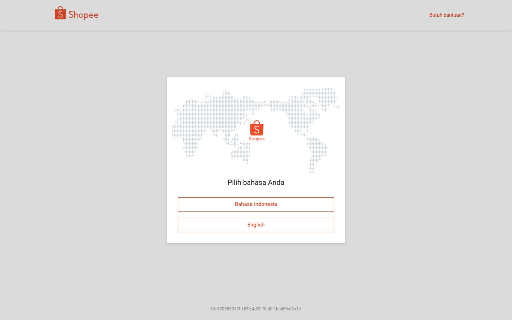

**대표 상품 이미지** (상위 6장, 출처 URL 포함)

-  — 출처 <https://deo.shopeemobile.com/shopee/shopee-pcmall-live-sg/assets/1c8bdaaf45e1fd48.png>

**페이지 메타 정보**

| page | title | description |
|---|---|---|
| [`home`](https://shopee.co.id/verify/traffic/error?home_url=https%3A%2F%2Fshopee.co.id&is_logged_in=false&next=https%3A%2F%2Fshopee.co.id%2F&tracking_id=67038991f3-187e-4d99-9bd0-1bc45fce7a1d&type=4) | Shopee Indonesia | Situs Belanja Online Terlengkap & Terpercaya |  |

#### [Tokopedia](https://www.tokopedia.com/)

- URL: <https://www.tokopedia.com/>
- 페이지: **OK 0 · FAIL 1**

**실패 페이지**

- `home` — playwright_error: Error: Page.goto: net::ERR_HTTP2_PROTOCOL_ERROR at https://www.tokopedia.com/
Call log:
  - navigating to "https://www.tokopedia.com/", waiting until "domcontentloaded"

#### [Zalora Indonesia](https://www.zalora.co.id/)

- URL: <https://www.zalora.co.id/>
- 페이지: **OK 1 · FAIL 0**

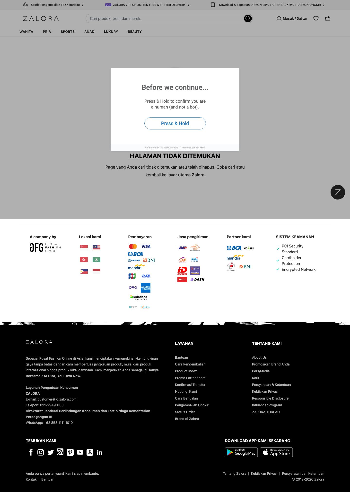

**대표 상품 이미지** (상위 6장, 출처 URL 포함)

-  — 출처 <https://static-id.zacdn.com/next-assets/static-assets/images/logo/icon_mastercard.png>
-  — 출처 <https://static-id.zacdn.com/next-assets/static-assets/images/logo/icon_visa.png>
-  — 출처 <https://static-id.zacdn.com/next-assets/static-assets/images/logo/icon_ovo.png>

**페이지 메타 정보**

| page | title | description |
|---|---|---|
| [`new_women`](https://www.zalora.co.id/wanita/new-arrivals) | Halaman tidak ditemukan | ZALORA |  |

### 4.2 일본 _( Japan )_

- 한국 수출규모 순위: **#2** · region: `asia` · tier `1` · currency `JPY`
- 수집 사이트: **5개** (성공 4)
- 메모: K-패션 선호도 높고 온라인 패션몰 발달
#### [GU Japan](https://www.gu-global.com/jp/)

- URL: <https://www.gu-global.com/jp/>
- 페이지: **OK 1 · FAIL 0**

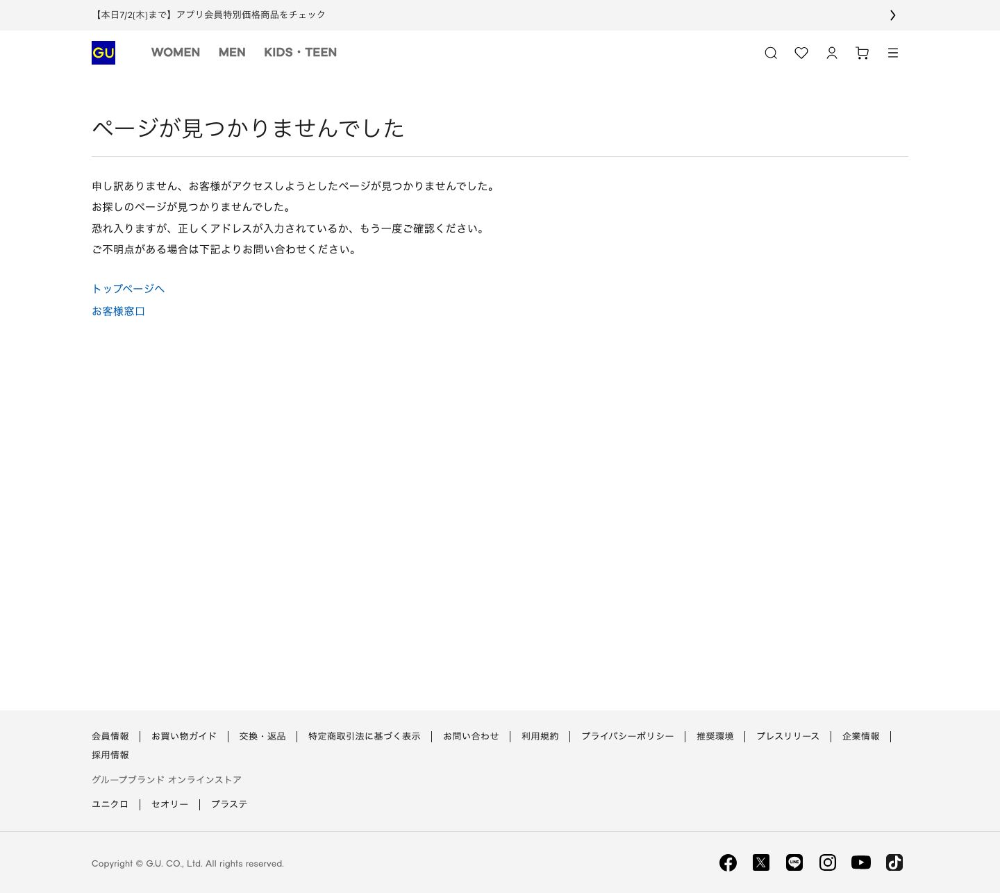

**대표 상품 이미지** (상위 6장, 출처 URL 포함)

-  — 출처 <https://image.uniqlo.com/GU/ST3/jp/imagesother/Navigation/WOMEN_Category/2026/260513/Category_w_Half-Tshirt.png>
-  — 출처 <https://image.uniqlo.com/GU/ST3/jp/imagesother/Navigation/WOMEN_Category/2026/260515/Category_w_Tshirt.png>
-  — 출처 <https://image.uniqlo.com/GU/ST3/jp/imagesother/Navigation/WOMEN_Category/2026/260612/Category_w_shirt-blouse.png>
-  — 출처 <https://image.uniqlo.com/GU/ST3/jp/imagesother/Navigation/WOMEN_Category/2026/260612/Category_w_Knit-cardigan.png>
-  — 출처 <https://image.uniqlo.com/GU/ST3/jp/imagesother/Navigation/WOMEN_Category/2026/260513/Category_w_onepeace.png>
-  — 출처 <https://image.uniqlo.com/GU/ST3/jp/imagesother/Navigation/WOMEN_Category/2026/260513/Category_w_Sweat.png>

**페이지 메타 정보**

| page | title | description |
|---|---|---|
| [`new_arrivals`](https://www.gu-global.com/jp/ja/not-found) | 申し訳ありません、お客様がアクセスしようとしたページが見つかりませんでした。恐れ入りますが、正しくアドレスが入力されているか、もう一度ご確認ください。 | ジーユー | 申し訳ありません、お客様がアクセスしようとしたページが見つかりませんでした。恐れ入りますが、正しくアドレスが入力されているか、もう一度ご確認ください。 |

#### [Rakuten Fashion](https://brandavenue.rakuten.co.jp/)

- URL: <https://brandavenue.rakuten.co.jp/>
- 페이지: **OK 1 · FAIL 1**

**대표 상품 이미지** (상위 6장, 출처 URL 포함)

-  — 출처 <https://brandavenue.r10s.jp/img/library/index/sbn_flagshipstore_20231003.png>
- 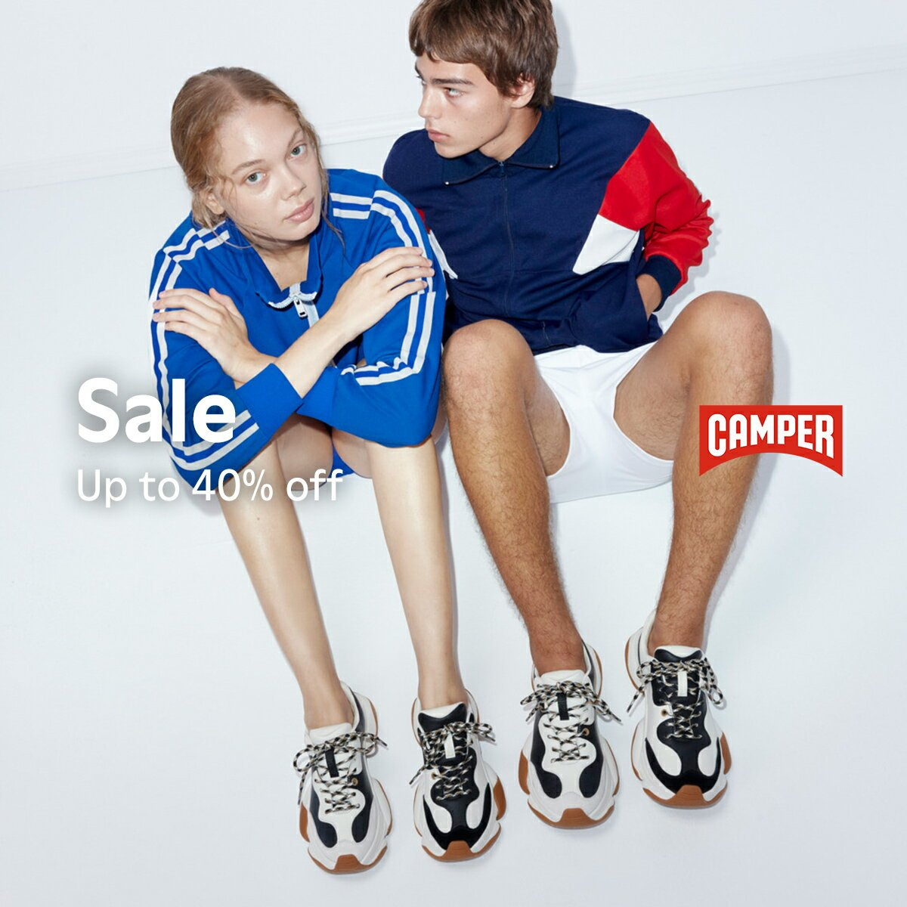 — 출처 <https://brandavenue.r10s.jp/img/news/01/381757/pc_n.jpg>
-  — 출처 <https://brandavenue.r10s.jp/img/news/01/382696/pc_n.jpg>
- 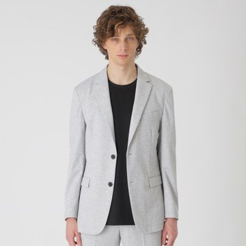 — 출처 <https://brandavenue.r10s.jp/img/news/01/382841/pc_n.jpg>
-  — 출처 <https://brandavenue.r10s.jp/img/news/01/382661/pc_n.jpg>
- 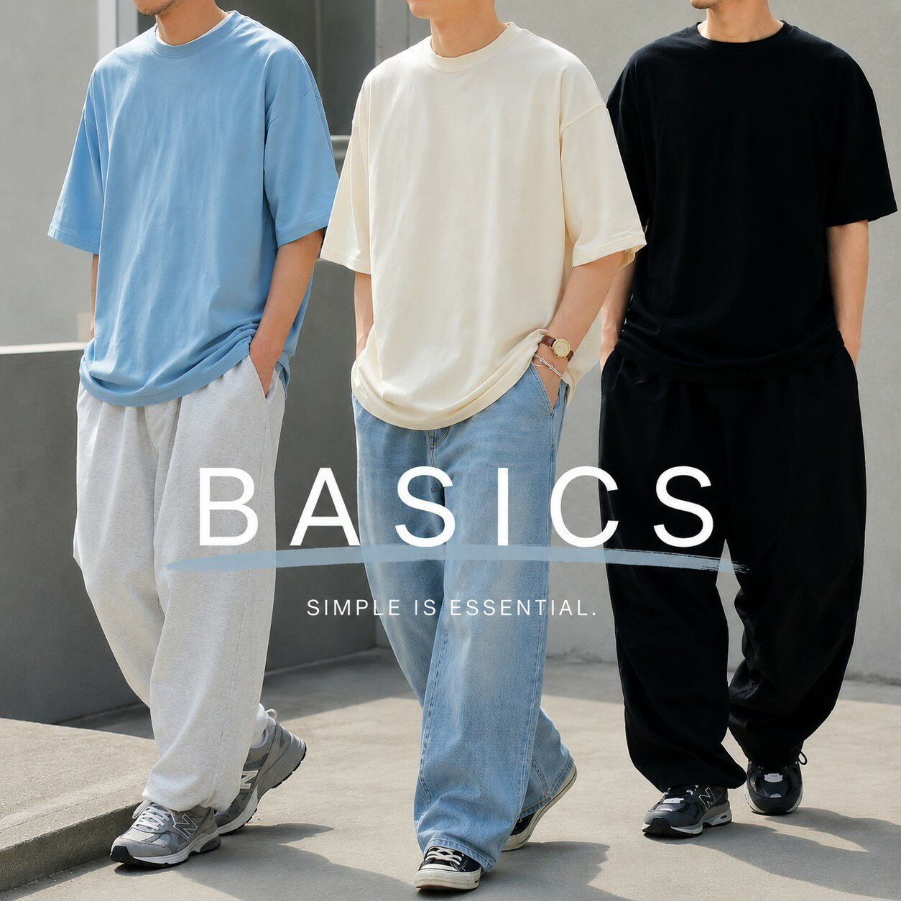 — 출처 <https://brandavenue.r10s.jp/img/news/01/382977/pc_n.jpg>

**페이지 메타 정보**

| page | title | description |
|---|---|---|
| [`men`](https://brandavenue.rakuten.co.jp/men/) | MEN | ファッション通販 Rakuten Fashion(楽天ファッション／旧楽天ブランドアベニュー) | Rakuten Fashion(楽天ファッション)は人気ブランドを取り扱うファッション通販サイトです。新作アイテム続々入荷！セール商品やクーポン対象商品も豊富。／税込3,980円以上購入で送料無料／楽天ポイントが使えて貯まる！ |

**실패 페이지**

- `women` — http_status_404

#### [Uniqlo Japan](https://www.uniqlo.com/jp/)

- URL: <https://www.uniqlo.com/jp/>
- 페이지: **OK 1 · FAIL 0**

**페이지 메타 정보**

| page | title | description |
|---|---|---|
| [`new_arrivals`](https://www.uniqlo.com/jp/ja/contents/feature/new-arrivals/) | 404 Not Found |  |

#### [WEAR](https://wear.jp/)

- URL: <https://wear.jp/>
- 페이지: **OK 1 · FAIL 0**

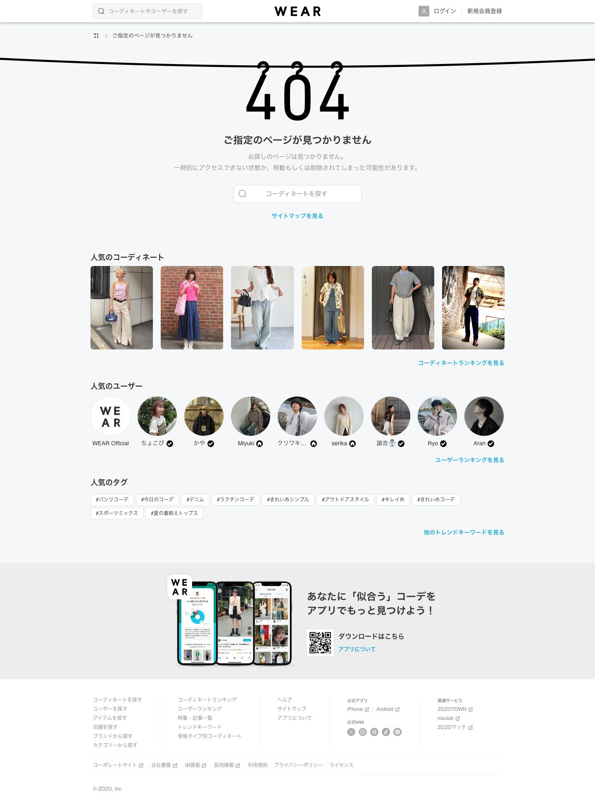

**대표 상품 이미지** (상위 6장, 출처 URL 포함)

-  — 출처 <https://wear.jp/public/_next/static/media/notfound_bg.1ywd-k_shp-hy.png>
-  — 출처 <https://wear.jp/public/_next/static/media/notfound_4.1ho27atf54bbv.png>
-  — 출처 <https://wear.jp/public/_next/static/media/notfound_0.438l9b9xjj6tm.png>
-  — 출처 <https://images.wear2.jp/coordinate/Z8iyzr/DM2A8w9R/1782695469_276.jpg>
- 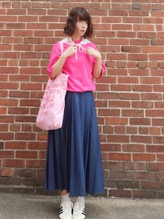 — 출처 <https://images.wear2.jp/coordinate/Grin7q0y/OgYrdotR/1782862300_276.jpg>
- 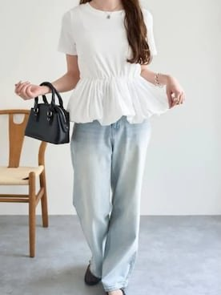 — 출처 <https://images.wear2.jp/coordinate/7binyqO8/urB4U2LU/1782804667_276.jpg>

**페이지 메타 정보**

| page | title | description |
|---|---|---|
| [`ranking`](https://wear.jp/ranking/coordinate/) | ご指定のページが見つかりません - WEAR |  |

#### [ZOZOTOWN](https://zozo.jp/)

- URL: <https://zozo.jp/>
- 페이지: **OK 0 · FAIL 2**

**실패 페이지**

- `new` — playwright_error: TimeoutError: Page.goto: Timeout 30000ms exceeded.
Call log:
  - navigating to "https://zozo.jp/category/new/", waiting until "domcontentloaded"

- `ranking` — playwright_error: TimeoutError: Page.goto: Timeout 30000ms exceeded.
Call log:
  - navigating to "https://zozo.jp/ranking/", waiting until "domcontentloaded"

### 4.3 한국 _( South Korea )_

- 한국 수출규모 순위: **#30** · region: `asia` · tier `1` · currency `KRW`
- 수집 사이트: **4개** (성공 3)
- 메모: 비교 기준 (자국). 국내 사업동향 센싱
#### [29CM](https://www.29cm.co.kr/)

- URL: <https://www.29cm.co.kr/>
- 페이지: **OK 1 · FAIL 0**

**최근 유행 상품** (50건 · 상품명 클릭 시 해당 사이트로 이동)

| # | 상품명 | 브랜드 | 가격 | 페이지 |
|---:|---|---|---:|---|
| 1 | [여성용 PU 스퀘어토 페니로퍼-블랙 (HS-4900_BLACK)](https://product.29cm.co.kr/catalog/1455225) | 하루타 | 94,250 KRW | `home` |
| 2 | [여성용 PU 스퀘어토 페니로퍼-자메이카 (HS-4900_JAMAICA)](https://product.29cm.co.kr/catalog/1455223) | 하루타 | 94,250 KRW | `home` |
| 3 | [여성 PU 링스트랩 힐로퍼 4600-BLACK](https://product.29cm.co.kr/catalog/3259425) | 하루타 | 89,020 KRW | `home` |
| 4 | [Planete Shoulder Medium FB6SB363-97](https://product.29cm.co.kr/catalog/3896830) | 루에브르 | 161,480 KRW | `home` |
| 5 | [Brise Shoulder Small FA5SB333_2color](https://product.29cm.co.kr/catalog/3296423) | 루에브르 | 196,450 KRW | `home` |
| 6 | [Courbe Shoulder Medium FA6SB374-97](https://product.29cm.co.kr/catalog/3797434) | 루에브르 | 203,740 KRW | `home` |
| 7 | [3-FOLDING UMBRELLA / WHITE 자동3단우산 자외선차단우양산 (화이트)](https://product.29cm.co.kr/catalog/3977722) | 지비에이치 | 32,480 KRW | `home` |
| 8 | [RUBBER RAIN BOOTS (5 SIZES) 레인부츠 장화 (220-260mm)](https://product.29cm.co.kr/catalog/2625888) | 지비에이치 | 77,620 KRW | `home` |
| 9 | [3-FOLDING UMBRELLA / LIGHT GREY 자동3단우산 자외선차단우양산 + 파우치 포함 (라이트그레이)](https://product.29cm.co.kr/catalog/3977723) | 지비에이치 | 32,480 KRW | `home` |
| 10 | [[당일출고] 트라이앵글 레이스 스카프_베이지](https://product.29cm.co.kr/catalog/3949881) | 에이에이유 | 22,940 KRW | `home` |
| 11 | [[당일출고] 에이프런 핀턱 롱 원피스_옐로우](https://product.29cm.co.kr/catalog/3949880) | 에이에이유 | 97,130 KRW | `home` |
| 12 | [[당일출고] 레이스 콤비 원피스_블랙](https://product.29cm.co.kr/catalog/3949878) | 에이에이유 | 66,460 KRW | `home` |
| 13 | [[29CM 단독] (당일출고) 클래식 캡소매 티셔츠 (레드)](https://product.29cm.co.kr/catalog/4041150) | 포르어 | 32,950 KRW | `home` |
| 14 | [[29CM 단독] (2PACK_당일출고) 클래식 캡소매 티셔츠_8colors](https://product.29cm.co.kr/catalog/3968058) | 포르어 | 53,120 KRW | `home` |
| 15 | [[29CM 단독] 클래식 레더 벨트(블랙)](https://product.29cm.co.kr/catalog/3955851) | 포르어 | 40,630 KRW | `home` |
| 16 | [(선물포장)모먼트 면모달 데일리 타월 Calm Beige 3P](https://product.29cm.co.kr/catalog/3871770) | 세렌디먼트 | 43,480 KRW | `home` |
| 17 | [(선물포장)모먼트 면모달 데일리 타월 Fade Green 3P](https://product.29cm.co.kr/catalog/3871728) | 세렌디먼트 | 43,480 KRW | `home` |
| 18 | [(선물포장)모먼트 면모달 데일리 타월 Settle Blue 3P](https://product.29cm.co.kr/catalog/3871723) | 세렌디먼트 | 43,480 KRW | `home` |
| 19 | [[29CM 단독] 소다 수건_4P(패키지포장)](https://product.29cm.co.kr/catalog/2631129) | 디어리얼 | 44,800 KRW | `home` |
| 20 | [살구 수건_4P(패키지포장)](https://product.29cm.co.kr/catalog/2699192) | 디어리얼 | 44,800 KRW | `home` |

**대표 상품 이미지** (상위 6장, 출처 URL 포함)

- 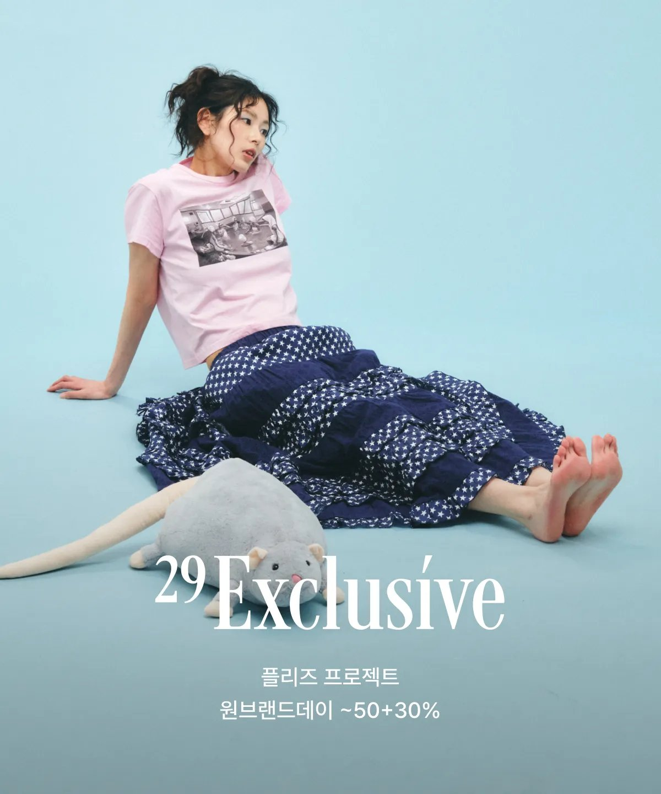 — 출처 <https://img.29cm.co.kr/cms/202606/11f17442e2ac6b5f999341d007c3c5b0.png?width=3840&format=webp>
- 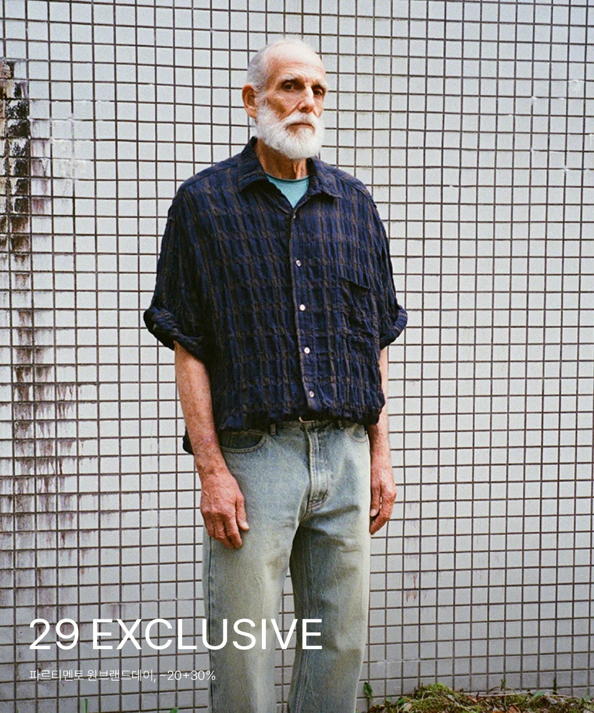 — 출처 <https://img.29cm.co.kr/cms/202606/11f17442c0fc74c999936109824fe325.png?width=3840&format=webp>
- 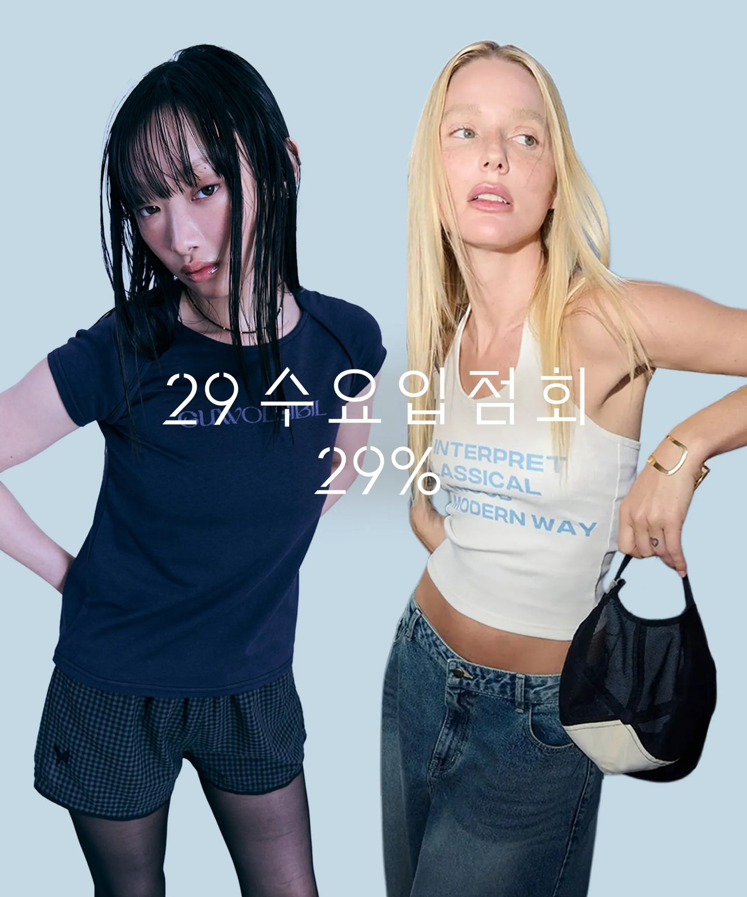 — 출처 <https://img.29cm.co.kr/cms/202606/11f17442b8f8c25b99935dfe06f42f29.jpg?width=3840&format=webp>
- 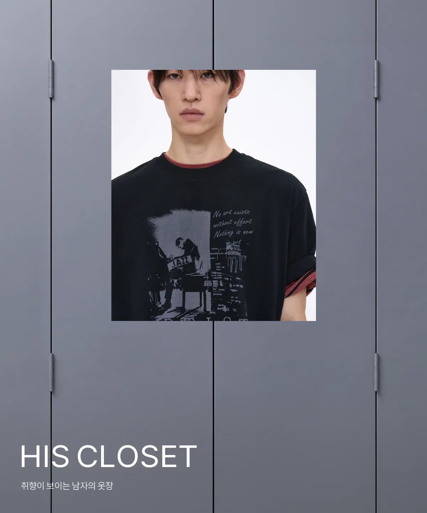 — 출처 <https://img.29cm.co.kr/cms/202606/11f17442ae1681f281a7712dc2482d85.png?width=3840&format=webp>
- 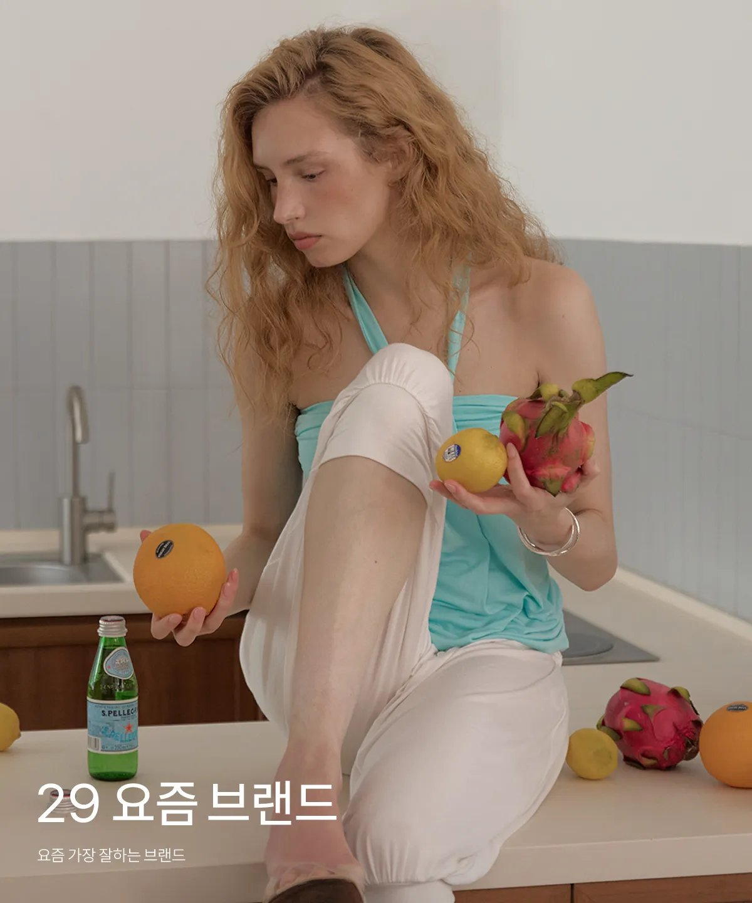 — 출처 <https://img.29cm.co.kr/cms/202606/11f174429a8a152399934ba352003d2e.png?width=3840&format=webp>
- 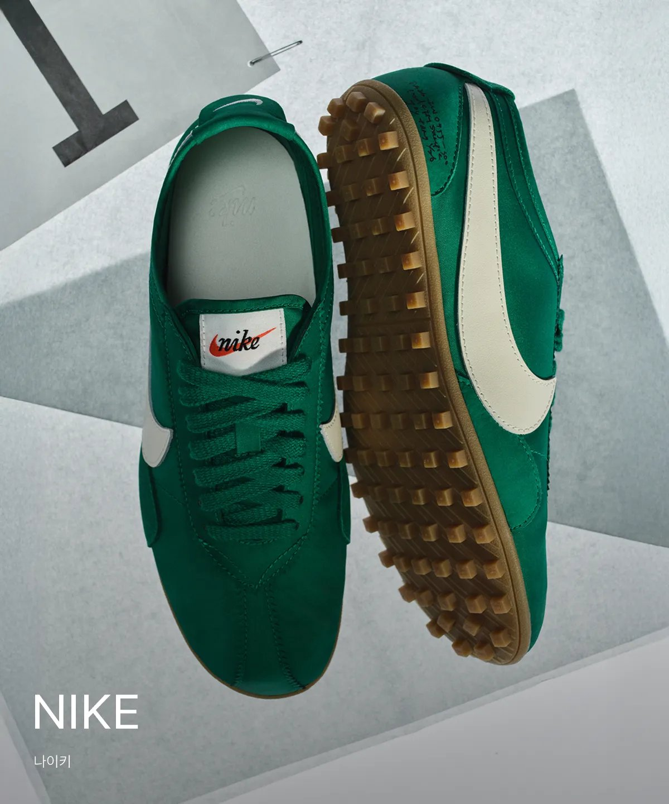 — 출처 <https://img.29cm.co.kr/cms/202606/11f1744292d93da799932f90f2488693.png?width=3840&format=webp>

**페이지 메타 정보**

| page | title | description |
|---|---|---|
| [`home`](https://www.29cm.co.kr/) | 감도 깊은 취향 셀렉트샵 29CM | 패션, 라이프스타일, 컬처까지 29CM만의 감도 깊은 셀렉션을 만나보세요. |

#### [Musinsa](https://www.musinsa.com/)

- URL: <https://www.musinsa.com/>
- 페이지: **OK 0 · FAIL 1**

**실패 페이지**

- `home` — robots_disallowed

#### [W Concept](https://www.wconcept.co.kr/)

- URL: <https://www.wconcept.co.kr/>
- 페이지: **OK 1 · FAIL 0**

**최근 유행 상품** (30건 · 상품명 클릭 시 해당 사이트로 이동)

| # | 상품명 | 브랜드 | 가격 | 페이지 |
|---:|---|---|---:|---|
| 1 | [[10차 리오더][NEW컬러 추가] 제제 언발란스 티셔츠 / ZEZE UNBALANCE T-SHIRT_6colors](https://m.wconcept.co.kr/Product/308442104) | 룩캐스트 | 28,251 KRW | `home` |
| 2 | [[단독][4차 리오더][SET-UP]엠마 린넨 스트랩 자켓 / EMMA LINEN STRAP JACKET_3colors](https://m.wconcept.co.kr/Product/306811066) | 룩캐스트 | 82,790 KRW | `home` |
| 3 | [[단독][3차 리오더]슈 슬리브리스 미니 드레스 / SHU SLEEVELESS MINI DRESS_2colors](https://m.wconcept.co.kr/Product/306811054) | 룩캐스트 | 84,656 KRW | `home` |
| 4 | [[5차 리오더]시아 텐셀 드레이프 티셔츠 / SIA TENCEL DRAPED T-SHIRT_3colors](https://m.wconcept.co.kr/Product/308442112) | 룩캐스트 | 30,134 KRW | `home` |
| 5 | [[6차 리오더]클로에 스퀘어 넥 슬리브리스 니트 / CHLOE SQUARE NECK SLEEVELESS KNIT_3colors](https://m.wconcept.co.kr/Product/305814273) | 룩캐스트 | 27,623 KRW | `home` |
| 6 | [[3차 리오더][SET-UP]엠마 린넨 턱 쇼츠 팬츠 / EMMA LINEN TUCK SHORT PANTS_3colors](https://m.wconcept.co.kr/Product/306811062) | 룩캐스트 | 37,926 KRW | `home` |
| 7 | [[단독][3차 리오더]루아 숄 니트 셋업  / LUA SHAWL KNIT SET UP_3colors](https://m.wconcept.co.kr/Product/308442087) | 룩캐스트 | 50,107 KRW | `home` |
| 8 | [끌로에 실크 카울넥 블라우스 / CHLOE SILK COWL NECK BLOUSE_3colors](https://m.wconcept.co.kr/Product/308510617) | 룩캐스트 | 67,802 KRW | `home` |
| 9 | [에리카 썸머 울 클레식 미니 드레스_블랙 / ERICA SUMMER WOOL CLASSIC MINI DRESS_BLACK](https://m.wconcept.co.kr/Product/308442062) | 룩캐스트 | 54,648 KRW | `home` |
| 10 | [[단독]아델 홀터넥 리브드 슬림 캡 탑 / ADELE HALTER RIBBED SLIM CAP TOP_4colors](https://m.wconcept.co.kr/Product/308562555) | 룩캐스트 | 25,594 KRW | `home` |
| 11 | [[3차 리오더] 노라 베이직 티셔츠 / NORA BASIC T-SHIRT_5colors](https://m.wconcept.co.kr/Product/308145541) | 룩캐스트 | 25,645 KRW | `home` |
| 12 | [[워셔블] 레나 리브드 브이넥 슬리브리스 니트 / LENA RIBBED V-NECK SLEEVELESS KNIT_4colors](https://m.wconcept.co.kr/Product/308442086) | 룩캐스트 | 22,176 KRW | `home` |
| 13 | [[단독]알린 스트라이프 투턱 와이드 슬랙스 / ALINE STRIPE TWO-TUCK WIDE SLACKS_2colors](https://m.wconcept.co.kr/Product/308442076) | 룩캐스트 | 75,803 KRW | `home` |
| 14 | [모니카 퍼프 슬리브 벨트 드레스_블랙 / MONICA PUFF SLEEVE BELT DRESS_BLACK](https://m.wconcept.co.kr/Product/308145323) | 룩캐스트 | 62,568 KRW | `home` |
| 15 | [모드 슬리브리스 티셔츠 / MAUD SLEEVELESS T-SHIRT_3colors](https://m.wconcept.co.kr/Product/308442106) | 룩캐스트 | 25,594 KRW | `home` |
| 16 | [[워셔블] 오리안 모크넥 슬림 슬리브리스 니트 탑 / ORIANE MOCK NECK SLIM SLEEVELESS KNIT TOP_3colors](https://m.wconcept.co.kr/Product/308510600) | 룩캐스트 | 37,259 KRW | `home` |
| 17 | [[3차 리오더]아리아 플라워 슬리브리스 블라우스 / ARIA FLOWER SLEEVELESS BLOUSE_2colors](https://m.wconcept.co.kr/Product/306811064) | 룩캐스트 | 47,197 KRW | `home` |
| 18 | [[단독]벨린 히든 프론트 퍼프 슬리브 블라우스_화이트 / BELINE HIDDEN FRONT PUFF SLEEVE BLOUSE_WHITE](https://m.wconcept.co.kr/Product/308442100) | 룩캐스트 | 52,013 KRW | `home` |
| 19 | [카롤 카울 넥 슬리브리스 티셔츠 / CAROLE COWL NECK SLEEVELESS T-SHIRT_4colors](https://m.wconcept.co.kr/Product/308510848) | 룩캐스트 | 23,478 KRW | `home` |
| 20 | [젠 스트라이프 티셔츠 / JEN STRIPE T-SHIRT_5colors](https://m.wconcept.co.kr/Product/308562556) | 룩캐스트 | 26,832 KRW | `home` |

**페이지 메타 정보**

| page | title | description |
|---|---|---|
| [`home`](https://www.wconcept.co.kr/) | _(empty)_ |  |

#### [Zigzag](https://zigzag.kr/)

- URL: <https://zigzag.kr/>
- 페이지: **OK 1 · FAIL 0**

**최근 유행 상품** (36건 · 상품명 클릭 시 해당 사이트로 이동)

| # | 상품명 | 브랜드 | 가격 | 페이지 |
|---:|---|---|---:|---|
| 1 | [헨리넥 반팔티_SPRWG24G01](https://store.zigzag.kr/app/catalog/products/168759103?browsing_type=NATIVE_BROWSER) | 스파오 | 17,480 KRW | `home` |
| 2 | [[단독][하객룩] 모니크 시어 러플 반팔 블라우스_2colors](https://store.zigzag.kr/app/catalog/products/169662170?browsing_type=NATIVE_BROWSER) | 룩캐스트 | 68,600 KRW | `home` |
| 3 | [[+바스락ver] WONT 리코 밴딩 팬츠 (숏,롱ver)/ 코튼 와이드 밴딩 팬츠](https://store.zigzag.kr/app/catalog/products/160974693?browsing_type=NATIVE_BROWSER) | 원로그 | 32,800 KRW | `home` |
| 4 | [[재입고] 530 스틸그레이 화이트 운동화 택일](https://store.zigzag.kr/app/catalog/products/157958686?browsing_type=NATIVE_BROWSER) | 뉴발란스 | 61,030 KRW | `home` |
| 5 | [🚀유라이크 사파이어 쿨링 팬시 IPL 제모 의료기기(퍼플/핑크) UI06](https://store.zigzag.kr/app/catalog/products/160381146?browsing_type=NATIVE_BROWSER) | 유라이크 | 308,000 KRW | `home` |
| 6 | [[반팔블라우스💙/하객룩/made] 드멜린 블라우스 (2color)](https://store.zigzag.kr/app/catalog/products/160291434?browsing_type=NATIVE_BROWSER) | 리얼코코 | 25,530 KRW | `home` |
| 7 | [[🧊여름바지/✨구김걱정NO] made. 세미부츠컷 찰랑슬랙스 (+숏/베이직/롱ver) - 4 size](https://store.zigzag.kr/app/catalog/products/142355088?browsing_type=NATIVE_BROWSER) | 슬로우앤드 | 25,520 KRW | `home` |
| 8 | [[반팔💙/하객룩/made] 플롯 레이어드 블라우스 (6color)](https://store.zigzag.kr/app/catalog/products/159975319?browsing_type=NATIVE_BROWSER) | 리얼코코 | 18,500 KRW | `home` |
| 9 | [[💙여름/사계절필수] made. 솔트 클린 반팔티셔츠 (스탠다드핏/루즈핏) - 7 color](https://store.zigzag.kr/app/catalog/products/141373178?browsing_type=NATIVE_BROWSER) | 슬로우앤드 | 12,920 KRW | `home` |
| 10 | [[💗부유방커버] made. 쫀쫀 커버핏 슬리브리스 (유교걸나시!) - 7 color](https://store.zigzag.kr/app/catalog/products/160291278?browsing_type=NATIVE_BROWSER) | 슬로우앤드 | 15,710 KRW | `home` |
| 11 | [[🧊여름/살안타템] made. 플레인 여리핏 썸머가디건 - 6 color](https://store.zigzag.kr/app/catalog/products/141374160?browsing_type=NATIVE_BROWSER) | 슬로우앤드 | 28,720 KRW | `home` |
| 12 | [[🧊여름바지/후기인증] made. 나스 디테일러 와이드팬츠 (+베이직/롱ver) - 4 size](https://store.zigzag.kr/app/catalog/products/140796259?browsing_type=NATIVE_BROWSER) | 슬로우앤드 | 30,320 KRW | `home` |
| 13 | [[여름바지🌴/50만장돌파/made] 허쉬 코튼 와이드팬츠 (숏/기본/롱)](https://store.zigzag.kr/app/catalog/products/143224732?browsing_type=NATIVE_BROWSER) | 리얼코코 | 18,500 KRW | `home` |
| 14 | [[여름청바지👖/3단기장/made] 시그니처 논페이드 데님 팬츠 (2color)](https://store.zigzag.kr/app/catalog/products/158971418?browsing_type=NATIVE_BROWSER) | 리얼코코 | 18,500 KRW | `home` |
| 15 | [[made] 웨이브 블라우스 (잔꽃)](https://store.zigzag.kr/app/catalog/products/170515918?browsing_type=NATIVE_BROWSER) | 오트앤드 | 45,600 KRW | `home` |
| 16 | [[3타입][무지/배색/스트라이프][MADE] 러브유 보트넥 레이어드 민소매 골지나시 (44~110) (빅사이즈나시-끈나시-민소매-무지나시-스트라이프나시--부유방커버나시)](https://store.zigzag.kr/app/catalog/products/159214859?browsing_type=NATIVE_BROWSER) | 핫핑 | 15,620 KRW | `home` |
| 17 | [[여름🍦/체형커버💗/후기보장🏆/MADE] 마르텔 데님 숏 팬츠](https://store.zigzag.kr/app/catalog/products/125654107?browsing_type=NATIVE_BROWSER) | 트렌디어패럴 | 26,870 KRW | `home` |
| 18 | [임부복*쿨링도트맥시 임산부스커트](https://store.zigzag.kr/app/catalog/products/170514511?browsing_type=NATIVE_BROWSER) | 소임 | 34,960 KRW | `home` |
| 19 | [[탄탄핏/구김X/하비탈출핏][MADE] 누비크 사이드슬릿 밴딩 롱스커트(44~110) (빅사이즈롱스커트-H라인롱스커트-원마일웨어-체형커버-H라인롱스커트-H라인롱치마-데일리룩-롱치마)](https://store.zigzag.kr/app/catalog/products/170524231?browsing_type=NATIVE_BROWSER) | 핫핑 | 22,700 KRW | `home` |
| 20 | [[🏆역대급100만장/썸머XL추가!] made. 마켓 와이드 트레이닝슬랙스 (+숏/베이직/롱ver) - 4 size](https://store.zigzag.kr/app/catalog/products/141360158?browsing_type=NATIVE_BROWSER) | 슬로우앤드 | 25,550 KRW | `home` |

**대표 상품 이미지** (상위 6장, 출처 URL 포함)

-  — 출처 <https://cf.image-farm.s.zigzag.kr/original/cms/2026/06/23/202606230530501514_058486.jpg?width=1029&height=1188&quality=80&format=webp&transparent=true>
- 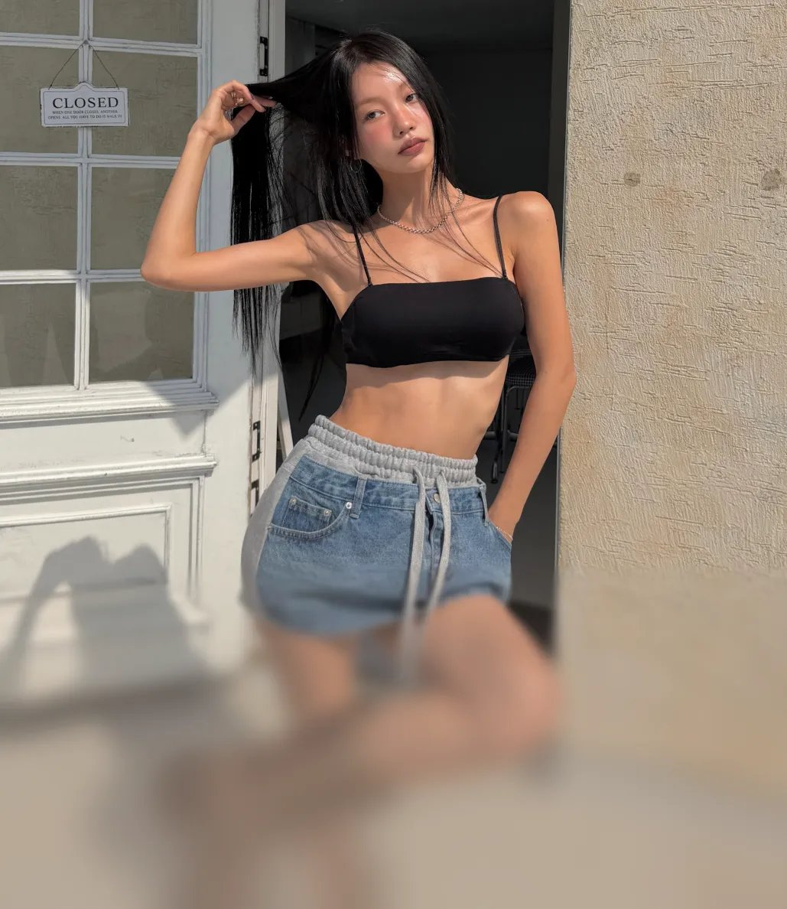 — 출처 <https://cf.image-farm.s.zigzag.kr/original/cms/2026/06/29/202606290713143114_088248.png?width=1029&height=1188&quality=80&format=webp&transparent=true>
- 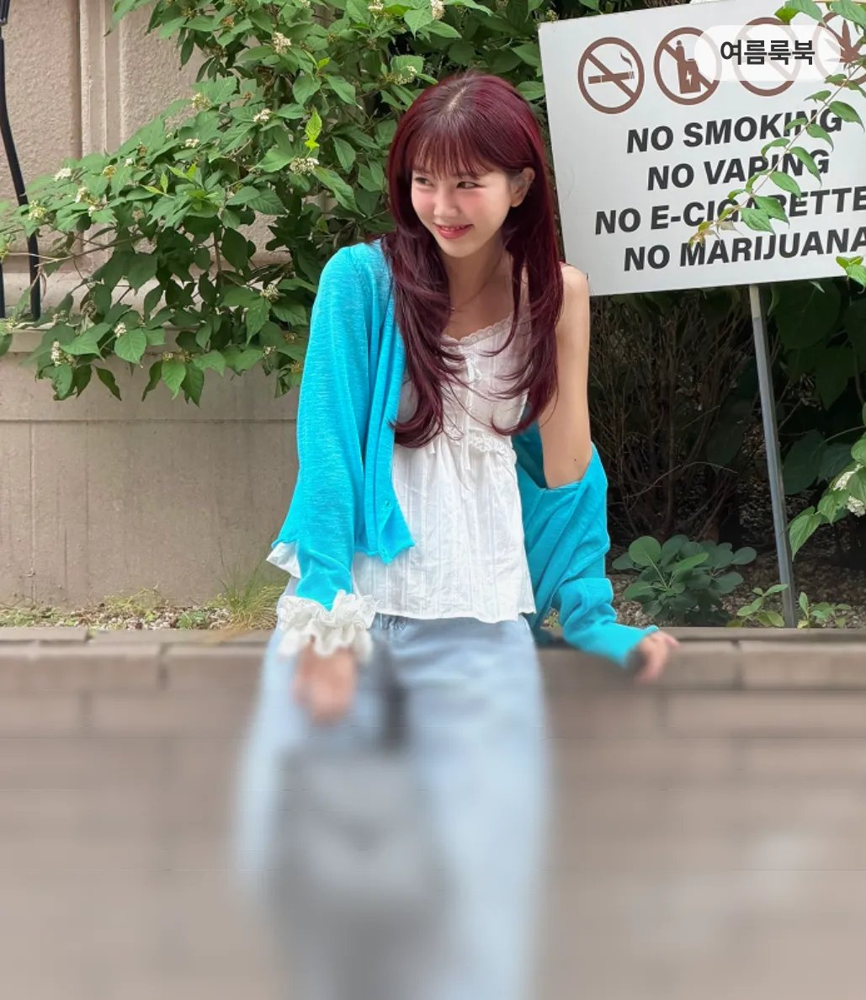 — 출처 <https://cf.image-farm.s.zigzag.kr/original/cms/2026/06/26/202606260539287916_052448.png?quality=80&format=webp&transparent=true&width=1029&height=1188>
- 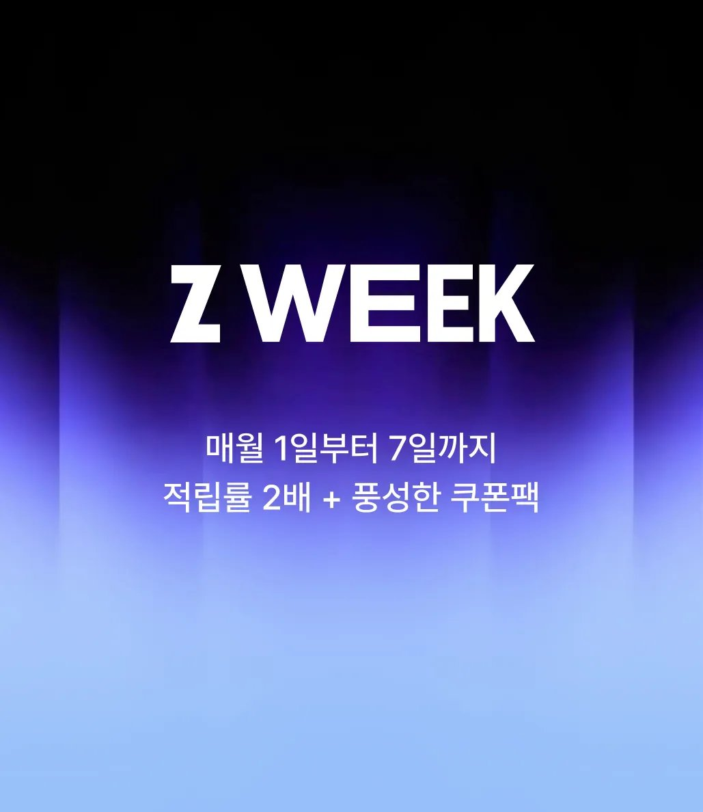 — 출처 <https://cf.image-farm.s.zigzag.kr/original/cms/2026/06/30/202606300807337208_020210.jpg?width=1029&height=1188&quality=80&format=webp&transparent=true>
-  — 출처 <https://cf.image-farm.s.zigzag.kr/original/cms/2026/06/25/202606250634256837_073785.png?quality=80&format=webp&transparent=true&width=1029&height=1188>
-  — 출처 <https://cf.image-farm.s.zigzag.kr/original/cms/2026/06/30/202606300045567035_025920.png?quality=80&format=webp&transparent=true&width=1029&height=1188>

**페이지 메타 정보**

| page | title | description |
|---|---|---|
| [`home`](https://zigzag.kr/) | 지그재그 스토어 | 4,000만 여성이 선택한 올인원 쇼핑 앱 지그재그 - 제가 알아서 살게요. |

### 4.4 대만 _( Taiwan )_

- 한국 수출규모 순위: **#7** · region: `asia` · tier `1` · currency `TWD`
- 수집 사이트: **5개** (성공 4)
- 메모: K-패션 친화도 높음
#### [momo](https://www.momoshop.com.tw/)

- URL: <https://www.momoshop.com.tw/>
- 페이지: **OK 1 · FAIL 0**

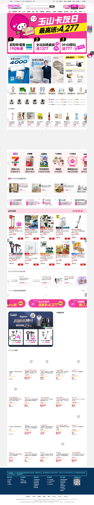

**대표 상품 이미지** (상위 6장, 출처 URL 포함)

-  — 출처 <https://img2.momoshop.com.tw/ecm/img/online/10/998/00/000/bt_0_271_01/bt_0_271_01_e2.jpg?t=1782816137623>
- 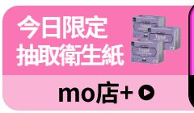 — 출처 <https://img2.momoshop.com.tw/ecm/img/online/10/998/00/000/bt_0_245_01/bt_0_245_01_P1_1_e2.png?t=1782921608632>
-  — 출처 <https://img1.momoshop.com.tw/ecm/img/online/10/998/00/000/bt_0_245_01/bt_0_245_01_P1_2_e2.png?t=1782878407771>
-  — 출처 <https://img1.momoshop.com.tw/ecm/img/online/10/998/00/000/bt_0_245_01/bt_0_245_01_P1_3_e2.png?t=1782835211764>
-  — 출처 <https://img3.momoshop.com.tw/ecm/img/online/81/998/00/000/mobile/bt_7_707_09/bt_7_707_09_P1_1_e2.jpg?t=1782921614359>
- 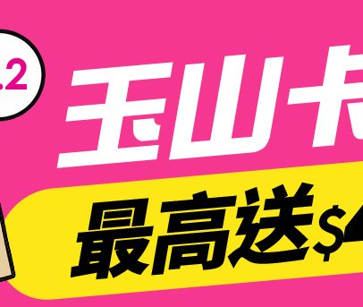 — 출처 <https://img3.momoshop.com.tw/ecm/img/online/81/998/00/000/mobile/bt_7_707_09/bt_7_707_09_P1_2_e2.jpg?t=1782921614359>

**페이지 메타 정보**

| page | title | description |
|---|---|---|
| [`home`](https://www.momoshop.com.tw/main/Main.jsp) | momo購物網 - 好評推薦 - 2026年7月 | momo購物網提供美妝保養、流行服飾、時尚精品、3C、數位家電、生活用品、美食旅遊票券…等數百萬件商品。快速到貨、超商取貨讓您購物最便利。mo店+商品抵用券天天搶、免運吃到飽，電視/直播商品限時下殺，每日讓您享超低價，並享有十天猶豫期；momo購物網為富邦及台灣大哥大關係企業 |

#### [OB Design](https://www.obdesign.com.tw/)

- URL: <https://www.obdesign.com.tw/>
- 페이지: **OK 1 · FAIL 0**

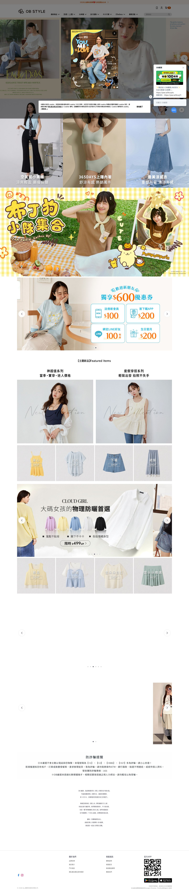

**대표 상품 이미지** (상위 6장, 출처 URL 포함)

-  — 출처 <https://cms-static.cdn.91app.com/images/original/41602/92f19e4d-89b7-4330-9570-02cf1dff9742-1782358071-3sy0baovmv_d_1920x820_1280x547_1124x480_800x342_600x256_400x171.jpg>
-  — 출처 <https://cms-static.cdn.91app.com/images/compress/41602/92f19e4d-89b7-4330-9570-02cf1dff9742-1782358071-3sy0baovmv_d_400x171.webp>
-  — 출처 <https://cms-static.cdn.91app.com/images/original/41602/92f19e4d-89b7-4330-9570-02cf1dff9742-1782875993-a0d3jhklbp_d_1920x820_1280x547_1124x480_800x342_600x256_400x171.jpg>
- 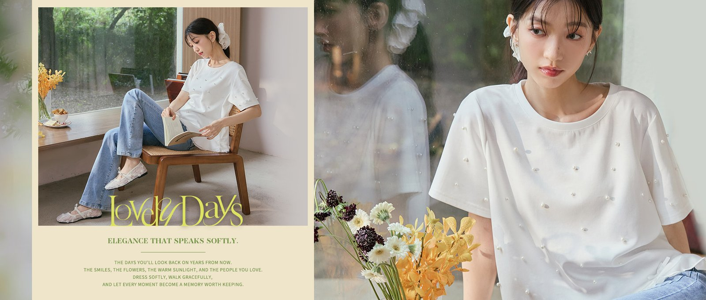 — 출처 <https://cms-static.cdn.91app.com/images/original/41602/92f19e4d-89b7-4330-9570-02cf1dff9742-1782876067-p7ileh8xvh_d_1920x820_1280x547_1124x480_800x342_600x256_400x171.jpg>
- 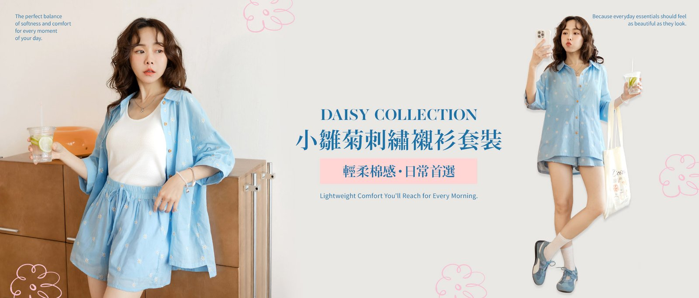 — 출처 <https://cms-static.cdn.91app.com/images/original/41602/92f19e4d-89b7-4330-9570-02cf1dff9742-1782876120-6drun5zyc4_d_1920x820_1280x547_1124x480_800x342_600x256_400x171.jpg>
- 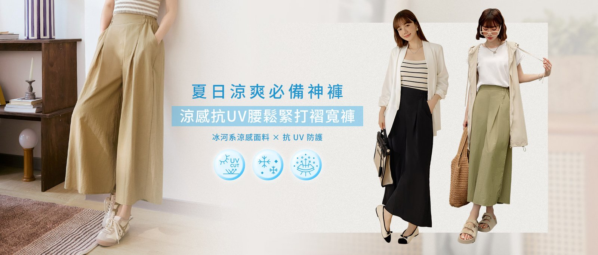 — 출처 <https://cms-static.cdn.91app.com/images/original/41602/92f19e4d-89b7-4330-9570-02cf1dff9742-1782878204-dn1wmx9ffo_d_1920x820_1280x547_1124x480_800x342_600x256_400x171.jpg>

**페이지 메타 정보**

| page | title | description |
|---|---|---|
| [`home`](https://www.obdesign.com.tw/) | OB嚴選｜高CP值人氣熱銷服飾，流行服飾品牌 | 你的日常穿搭好夥伴，快上OB嚴選找，OB嚴選提供女裝、孕童、運動、男裝各項流行服飾，秉持優質服務給你高CP值的購物體驗。各種風格都能滿足熱愛穿搭的你，天天上新品，快速出貨，一起加入OB style！網路人氣服飾品牌OB嚴選 |

#### [PChome](https://24h.pchome.com.tw/)

- URL: <https://24h.pchome.com.tw/>
- 페이지: **OK 0 · FAIL 1**

**실패 페이지**

- `home` — http_status_429

#### [Pinkoi Taiwan](https://www.pinkoi.com/)

- URL: <https://www.pinkoi.com/>
- 페이지: **OK 2 · FAIL 0**

**대표 상품 이미지** (상위 6장, 출처 URL 포함)

-  — 출처 <https://cdn04.pinkoi.com/pinkoi.site/logo/og_image.png>

**페이지 메타 정보**

| page | title | description |
|---|---|---|
| [`accessories`](https://en.pinkoi.com/) | Pinkoi | Asia’s cross-border design marketplace | Design the way you are | Shop for original design products from Asia's independent designers. Pinkoi lives and breathes great design, great quality, great service, a |
| [`bags`](https://en.pinkoi.com/) | Pinkoi | Asia’s cross-border design marketplace | Design the way you are | Shop for original design products from Asia's independent designers. Pinkoi lives and breathes great design, great quality, great service, a |

#### [Yahoo Taiwan Shopping](https://tw.buy.yahoo.com/)

- URL: <https://tw.buy.yahoo.com/>
- 페이지: **OK 1 · FAIL 0**

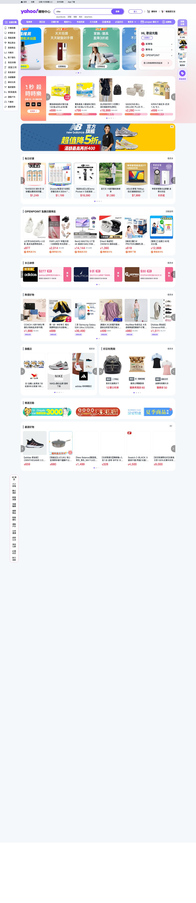

**대표 상품 이미지** (상위 6장, 출처 URL 포함)

- 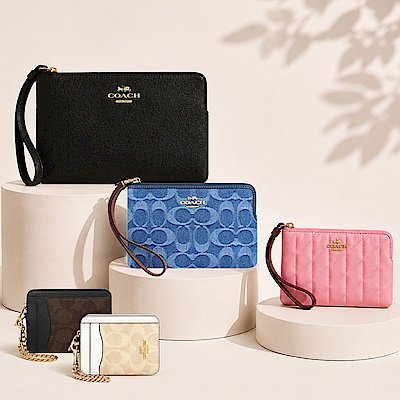 — 출처 <https://img.yec.tw/zp/MerchandiseImages/C467748C7E-Gd-9268067.jpg>
- 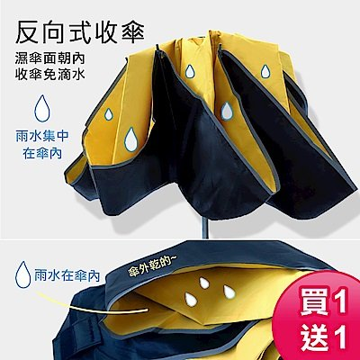 — 출처 <https://img.yec.tw/zp/MerchandiseImages/F658120596-Gd-10519695.jpg>
- 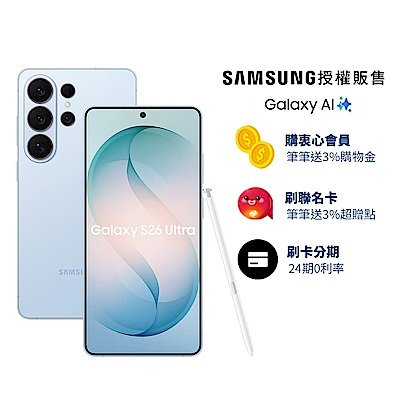 — 출처 <https://img.yec.tw/zp/MerchandiseImages/4DC072CE0C-Gd-12002098.jpg>

**페이지 메타 정보**

| page | title | description |
|---|---|---|
| [`home`](https://tw.buy.yahoo.com/) | Yahoo購物中心 - 最懂生活的人 | 數百萬件商品，貼心客服為您服務，15天鑑賞期購物保障！ |

### 4.5 태국 _( Thailand )_

- 한국 수출규모 순위: **#8** · region: `asia` · tier `1` · currency `THB`
- 수집 사이트: **5개** (성공 4)
- 메모: 동남아 K-패션 핵심 시장
#### [Central Online](https://www.central.co.th/)

- URL: <https://www.central.co.th/>
- 페이지: **OK 1 · FAIL 0**

**대표 상품 이미지** (상위 6장, 출처 URL 포함)

-  — 출처 <https://www.central.co.th/_next/image?url=https%3A%2F%2Fassets.central.co.th%2Ffile-assets%2Fassets%2FCMS%2Fcampaign%2F2026%2F07jul%2F20260701_7.7_HP_Herobanner.jpg&w=3840&q=75>
-  — 출처 <https://www.central.co.th/_next/image?url=https%3A%2F%2Fassets.central.co.th%2Ffile-assets%2Fassets%2FCMS%2Fcampaign%2F2026%2F07jul%2F20260701_estee_heroweb_d.jpg&w=3840&q=75>
- 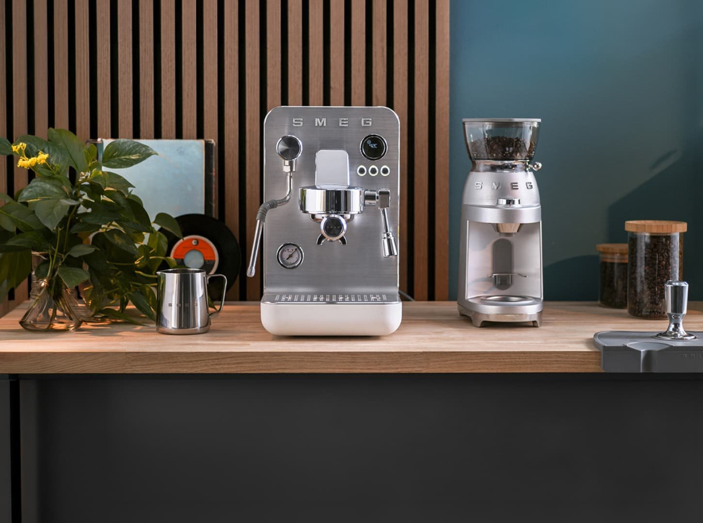 — 출처 <https://www.central.co.th/_next/image?url=https%3A%2F%2Fassets.central.co.th%2Ffile-assets%2Fassets%2FCMS%2Fcampaign%2F2026%2F07jul%2F20260701_smeg_heroweb_d.jpg&w=3840&q=75>
-  — 출처 <https://www.central.co.th/_next/image?url=%2Fimages%2Ffallback-image.webp&w=3840&q=75>
- 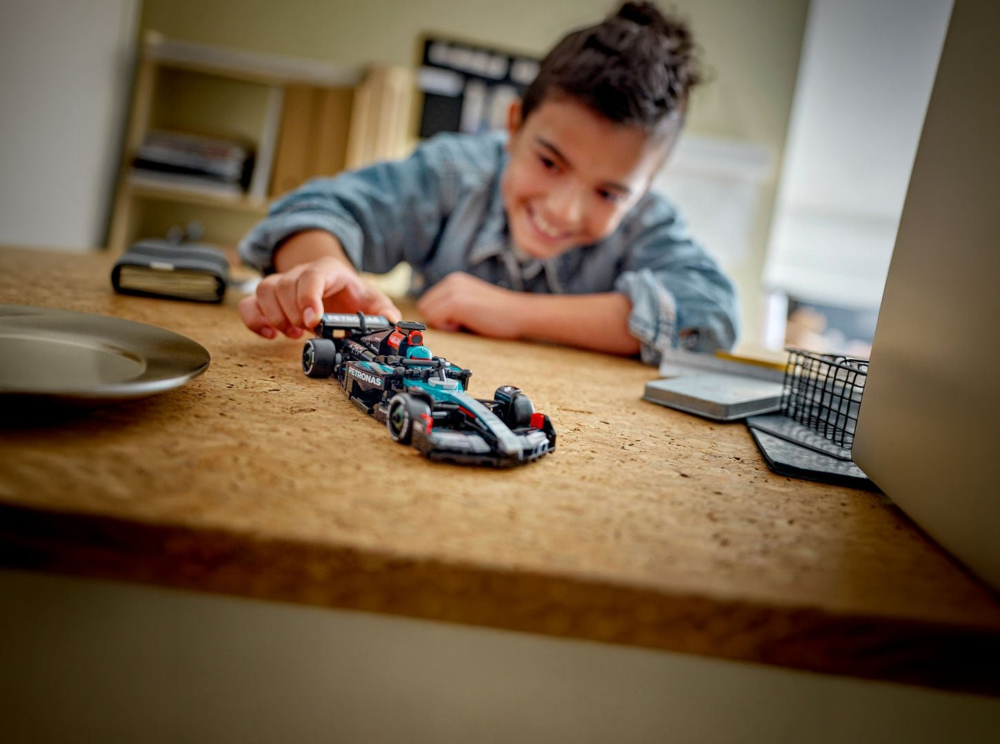 — 출처 <https://assets.central.co.th/file-assets/assets/CMS/campaign/2026/07jul/20260701_lego_heroweb_d.jpg>
- 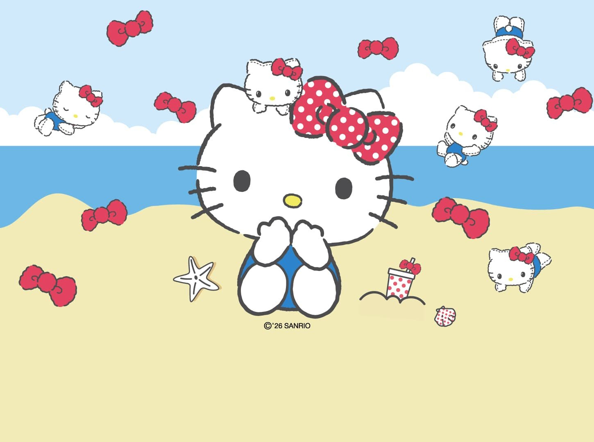 — 출처 <https://www.central.co.th/_next/image?url=https%3A%2F%2Fassets.central.co.th%2Ffile-assets%2Fassets%2FCMS%2Fcampaign%2F2026%2F07jul%2F20260701_sanrio_heroweb_d.jpg&w=3840&q=75>

**페이지 메타 정보**

| page | title | description |
|---|---|---|
| [`home`](https://www.central.co.th/th) | Central Online | 7.7 | ลดสูงสุด 70% + คูปองลดเพิ่ม 30% | 7.7 Sale โปรโมชั่นสุดยิ่งใหญ่ของปี 2026 เริ่มต้นขึ้นแล้ว! พบกับสินค้าจากหลากหลายแบรนด์ดังที่เราคัดสรรมาลดราคาสูงสุดถึง 70% พร้อมคูปองลดเพิ่ม |

#### [Lazada Thailand Fashion](https://www.lazada.co.th/)

- URL: <https://www.lazada.co.th/>
- 페이지: **OK 1 · FAIL 0**

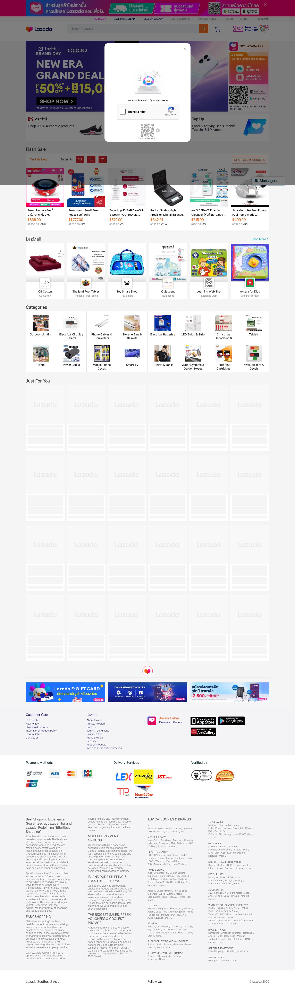

**대표 상품 이미지** (상위 6장, 출처 URL 포함)

-  — 출처 <https://img.lazcdn.com/us/domino/40845120240f19d13f738fa9a7978edd.png>
-  — 출처 <https://img.lazcdn.com/g/tps/images/ims-web/TB1KB2laMFY.1VjSZFnXXcFHXXa.png>
-  — 출처 <https://img.lazcdn.com/us/domino/40ef9bc7-b831-4670-9f97-c3c6e6669300_TH-1976-688.jpg_2200x2200q80.jpg>
-  — 출처 <https://img.lazcdn.com/us/domino/2a0a3493-28fb-47e8-ad53-9197ea062e56_TH-1976-688.jpg_2200x2200q80.jpg>
-  — 출처 <https://img.lazcdn.com/us/domino/4d9546c0-f970-4369-a129-837b6d17ac6e_TH-1976-688.jpg_2200x2200q80.jpg>
-  — 출처 <https://img.lazcdn.com/us/domino/3744fac6-7a44-4e41-a2b1-65317f2659fc_TH-1976-688.jpg_2200x2200q80.jpg>

**페이지 메타 정보**

| page | title | description |
|---|---|---|
| [`home`](https://www.lazada.co.th/#?) | Lazada Thailand | ช้อปออนไลน์ สินค้าดี พร้อมดีลพิเศษทุกวัน | พบกับ Lazada แพลตฟอร์มช้อปปิ้งชั้นนำในอาเซียน พร้อมบริการเก็บเงินปลายทาง LazMall LazFlash และดีลเด็ดจากแบรนด์ดังทุกวัน |

#### [Pomelo](https://www.pomelofashion.com/)

- URL: <https://www.pomelofashion.com/>
- 페이지: **OK 0 · FAIL 2**

**실패 페이지**

- `new` — robots_disallowed
- `best` — robots_disallowed

#### [Shopee Thailand Fashion](https://shopee.co.th/)

- URL: <https://shopee.co.th/>
- 페이지: **OK 1 · FAIL 0**

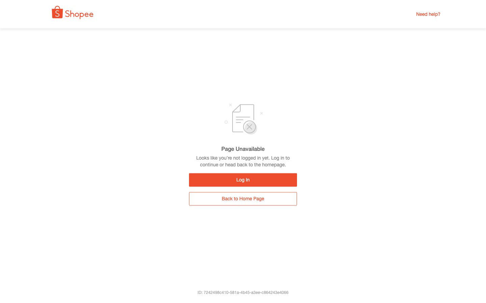

**페이지 메타 정보**

| page | title | description |
|---|---|---|
| [`home`](https://shopee.co.th/verify/traffic/error?home_url=https%3A%2F%2Fshopee.co.th&is_logged_in=false&next=https%3A%2F%2Fshopee.co.th%2F&tracking_id=7242498c410-581a-4b45-a3ee-c864243e4066&type=4) | Shopee Thailand | Hot Deals, Best Prices |  |

#### [Zalora Thailand](https://www.zalora.co.th/)

- URL: <https://www.zalora.co.th/>
- 페이지: **OK 1 · FAIL 0**

**대표 상품 이미지** (상위 6장, 출처 URL 포함)

-  — 출처 <https://www.zalora.co.th/images/landingpage/525x500.gif>

**페이지 메타 정보**

| page | title | description |
|---|---|---|
| [`home`](https://www.zalora.co.th/) | ZALORA - ASIA'S LEADING ONLINE FASHION DESTINATION |  |

### 4.6 미국 _( United States )_

- 한국 수출규모 순위: **#1** · region: `north_america` · tier `1` · currency `USD`
- 수집 사이트: **5개** (성공 4)
- 메모: 한국 의류 최대 수출국. 대형 이커머스와 브랜드 커머스 중심
#### [Etsy](https://www.etsy.com/)

- URL: <https://www.etsy.com/>
- 페이지: **OK 2 · FAIL 0**

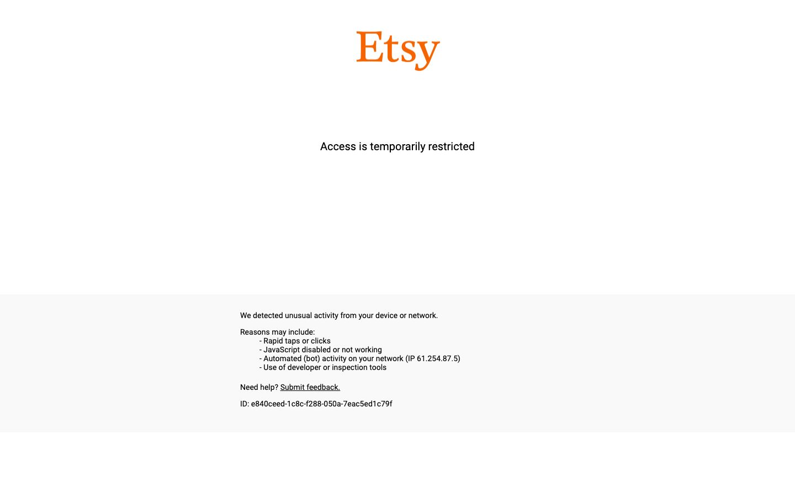

**페이지 메타 정보**

| page | title | description |
|---|---|---|
| [`trending_jewelry`](https://www.etsy.com/c/jewelry) | etsy.com |  |
| [`trending_accessories`](https://www.etsy.com/c/accessories) | etsy.com |  |

#### [Macy's](https://www.macys.com/)

- URL: <https://www.macys.com/>
- 페이지: **OK 1 · FAIL 0**

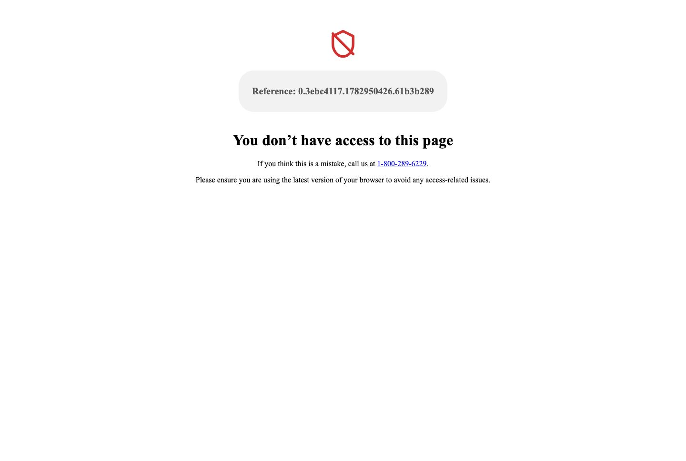

**페이지 메타 정보**

| page | title | description |
|---|---|---|
| [`new`](https://www.macys.com/shop/whats-new?id=14834) | Access Denied - Macy's | Access denied 403 |

#### [Nordstrom](https://www.nordstrom.com/)

- URL: <https://www.nordstrom.com/>
- 페이지: **OK 2 · FAIL 0**

**대표 상품 이미지** (상위 6장, 출처 URL 포함)

-  — 출처 <https://n.nordstrommedia.com/it/7f51c20a-b069-4154-9cfb-1e6d13a7c608.gif>
-  — 출처 <https://n.nordstrommedia.com/is/image/nordstrom/WMNS_TRD01F_0526_0068.jpeg?width=240&dpr=2&crop=2760%3A3450%2Coffset-x50%2Coffset-y50>
-  — 출처 <https://n.nordstrommedia.com/is/image/nordstrom/MENS_CONT01F_0526_0028.jpeg?width=240&dpr=2&crop=2418.371%3A3022.964%2Coffset-x50%2Coffset-y0&trim=0.073%2C0.098%2C0%2C0.026>
-  — 출처 <https://n.nordstrommedia.com/is/image/nordstrom/DESW_APP01F_0326_1696.jpeg?width=240&dpr=2&crop=3791.155%3A4738.944%2Coffset-x28.288%2Coffset-y50&trim=0.312%2C0%2C0.114%2C0>
- 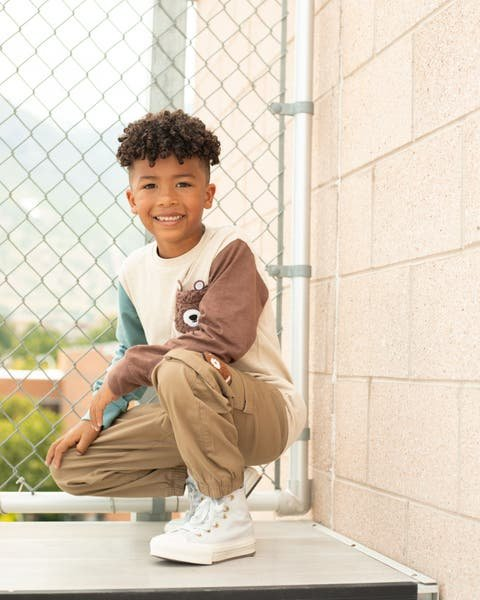 — 출처 <https://n.nordstrommedia.com/is/image/nordstrom/NPG_0824_KIDS_01_LK04_003.jpeg?width=240&dpr=2&crop=4247%3A5308.75%2Coffset-x50%2Coffset-y50>
-  — 출처 <https://n.nordstrommedia.com/is/image/nordstrom/FRA_FRGW03P_0226.jpeg?width=240&dpr=2&crop=4372%3A5465%2Coffset-x60.734%2Coffset-y50>

**페이지 메타 정보**

| page | title | description |
|---|---|---|
| [`new`](https://www.nordstrom.com/browse/new) | New & Now | Nordstrom | Shop a great selection of New Arrivals at Nordstrom.com. Top brands. New trends. |
| [`women`](https://www.nordstrom.com/browse/women) | Women's Clothing, Shoes, & Accessories | Nordstrom | Find a great selection of Women's Clothing, Shoes, & Accessories at Nordstrom.com. Shop popular brands and top designers. |

#### [Revolve](https://www.revolve.com/)

- URL: <https://www.revolve.com/>
- 페이지: **OK 0 · FAIL 2**

**실패 페이지**

- `new` — playwright_error: Error: Page.goto: net::ERR_HTTP2_PROTOCOL_ERROR at https://www.revolve.com/new/br/c79f88/
Call log:
  - navigating to "https://www.revolve.com/new/br/c79f88/", waiting until "domcontentloaded"

- `trending` — playwright_error: Error: Page.goto: net::ERR_HTTP2_PROTOCOL_ERROR at https://www.revolve.com/most-loved/br/4a9ca5/
Call log:
  - navigating to "https://www.revolve.com/most-loved/br/4a9ca5/", waiting until "domcontentloaded"

#### [Urban Outfitters](https://www.urbanoutfitters.com/)

- URL: <https://www.urbanoutfitters.com/>
- 페이지: **OK 1 · FAIL 0**

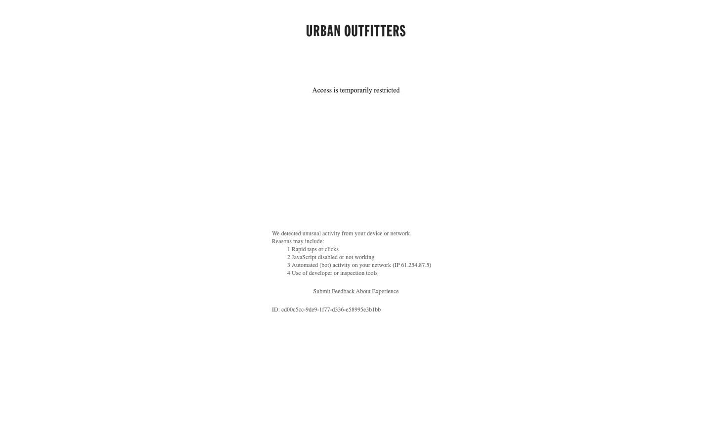

**페이지 메타 정보**

| page | title | description |
|---|---|---|
| [`new_women`](https://www.urbanoutfitters.com/womens-new-arrivals) | urbanoutfitters.com |  |

### 4.7 베트남 _( Vietnam )_

- 한국 수출규모 순위: **#4** · region: `asia` · tier `1` · currency `VND`
- 수집 사이트: **5개** (성공 5)
- 메모: 의류 생산기지/원단 수출 비중 큼. 빠르게 성장하는 이커머스
#### [Canifa](https://canifa.com/)

- URL: <https://canifa.com/>
- 페이지: **OK 1 · FAIL 0**

**대표 상품 이미지** (상위 6장, 출처 URL 포함)

-  — 출처 <https://2885371169.e.cdneverest.net/Simiconnector/BannerSlider/t/c/tce_topbanner_desktop-130526.webp>
- 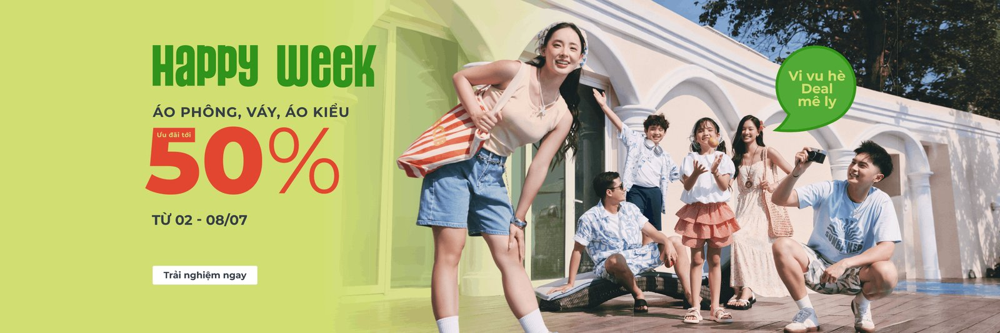 — 출처 <https://2885371169.e.cdneverest.net/Simiconnector/BannerSlider/h/w/hw1_topbanner_desktop-010726.webp>
-  — 출처 <https://2885371169.e.cdneverest.net/Simiconnector/BannerSlider/a/c/active_topbanner_desktop-250626.webp>
-  — 출처 <https://canifa.com/_nuxt/img/chatbot-icon.c84d6ec.webp>
-  — 출처 <https://canifa.com/_nuxt/img/chat-zalo.ab5351f.webp>

**페이지 메타 정보**

| page | title | description |
|---|---|---|
| [`home`](https://canifa.com/) | CANIFA | Fashion For All | CANIFA - thương hiệu thời trang hàng đầu Việt Nam. Hàng ngàn mẫu quần áo phụ kiện nam, nữ, trẻ em cao cấp, chất lượng, an toàn liên tục được |

#### [IVY moda](https://ivymoda.com/)

- URL: <https://ivymoda.com/>
- 페이지: **OK 1 · FAIL 0**

**대표 상품 이미지** (상위 6장, 출처 URL 포함)

-  — 출처 <https://cotton4u.vn/files/news/2026/07/01/85c6b6fb920cb5020c2f84a10874d7cf.webp>
-  — 출처 <https://cotton4u.vn/files/news/2026/06/19/6a051c7c1a148911a0f04bb13704e9e4.webp>
-  — 출처 <https://cotton4u.vn/files/news/2026/06/23/da4faa3fe3af0cef91c4696275413c54.webp>
-  — 출처 <https://cotton4u.vn/files/product/thumab/400/2026/06/08/2cf9b85228b3e78f22cfc3718f6e24b6.webp>
-  — 출처 <https://cotton4u.vn/files/product/thumab/400/2026/06/08/15562de9138d1c5927ee7f195c512e06.webp>
-  — 출처 <https://cotton4u.vn/files/product/thumab/400/2026/06/08/84ceec2e174853ef07c4201f1c60aee3.webp>

**페이지 메타 정보**

| page | title | description |
|---|---|---|
| [`home`](https://ivymoda.com/) | IVY moda - Thời Trang Công Sở Hiện Đại | IVY moda |  |

#### [Lazada Vietnam](https://www.lazada.vn/)

- URL: <https://www.lazada.vn/>
- 페이지: **OK 1 · FAIL 0**

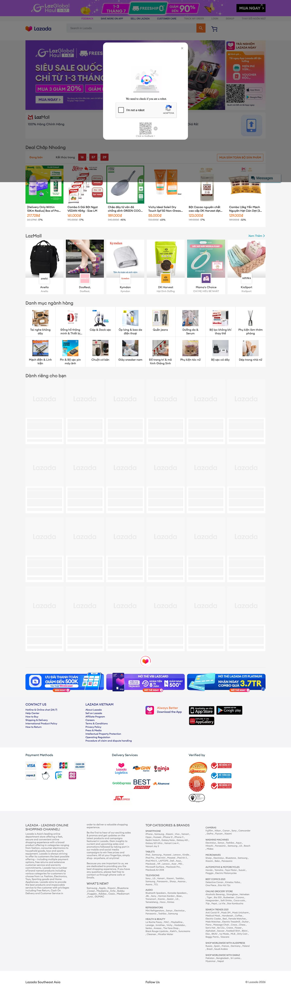

**대표 상품 이미지** (상위 6장, 출처 URL 포함)

-  — 출처 <https://img.lazcdn.com/us/domino/2ad4f22ce5a43dc145f221d13feed352.png>
-  — 출처 <https://img.lazcdn.com/g/tps/images/ims-web/TB1T7K2d8Cw3KVjSZFuXXcAOpXa.png>
-  — 출처 <https://img.lazcdn.com/us/domino/09dbfdec-5d8c-49f6-b4d0-1cf5ca13db61_VN-1976-688.jpg_2200x2200q80.jpg>
- 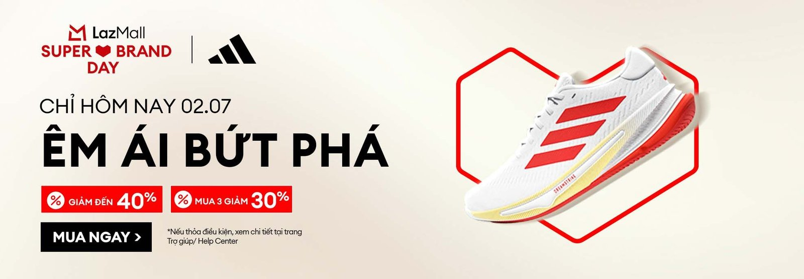 — 출처 <https://img.lazcdn.com/us/domino/a6c1844a-e346-4153-b36d-cf6a4da3d83a_VN-1976-688.jpg_2200x2200q80.jpg>
-  — 출처 <https://img.lazcdn.com/us/domino/71bdb75c-a4e9-414b-be0c-e42b90ddc217_VN-1976-688.jpg_2200x2200q80.jpg>
- 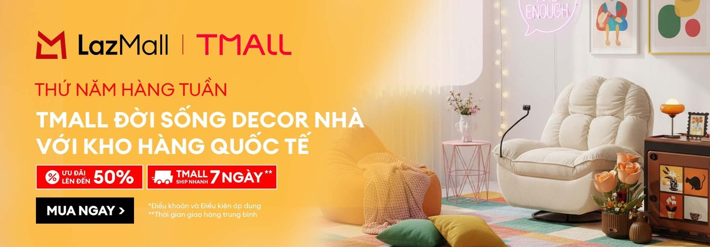 — 출처 <https://img.lazcdn.com/us/domino/163e42ce-e38c-4df1-8d0e-8eacdcd52f84_VN-1976-688.jpg_2200x2200q80.jpg>

**페이지 메타 정보**

| page | title | description |
|---|---|---|
| [`home`](https://www.lazada.vn/#?) | Lazada Việt Nam | Mua Sắm Online, Giá Tốt Nhất Mỗi Ngày | Mua sắm đồ điện tử, thời trang, làm đẹp và đồ chơi giá cả phải chăng. Đảm bảo sản phẩm chính hãng và trải nghiệm mua sắm tiện lợi – mua ngay |

#### [Shopee Vietnam](https://shopee.vn/)

- URL: <https://shopee.vn/>
- 페이지: **OK 1 · FAIL 0**

**페이지 메타 정보**

| page | title | description |
|---|---|---|
| [`home`](https://shopee.vn/verify/traffic/error?home_url=https%3A%2F%2Fshopee.vn&is_logged_in=false&next=https%3A%2F%2Fshopee.vn%2F&tracking_id=472d68dc0dc-b61a-452d-a953-ece157a5da8e&type=4) | Shopee Việt Nam | Hot Deals, Best Prices |  |

#### [Tiki](https://tiki.vn/)

- URL: <https://tiki.vn/>
- 페이지: **OK 1 · FAIL 0**

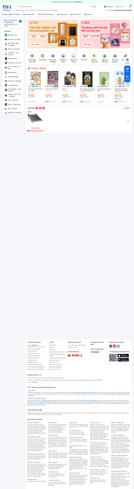

**대표 상품 이미지** (상위 6장, 출처 URL 포함)

-  — 출처 <https://salt.tikicdn.com/cache/100x100/ts/category/ed/20/60/afa9b3b474bf7ad70f10dd6443211d5f.png>
-  — 출처 <https://salt.tikicdn.com/cache/100x100/ts/category/f6/22/46/7e2185d2cf1bca72d5aeac385a865b2b.png>
-  — 출처 <https://salt.tikicdn.com/cache/100x100/ts/category/54/c0/ff/fe98a4afa2d3e5142dc8096addc4e40b.png>
-  — 출처 <https://salt.tikicdn.com/cache/100x100/ts/category/13/64/43/226301adcc7660ffcf44a61bb6df99b7.png>
-  — 출처 <https://salt.tikicdn.com/cache/100x100/ts/category/75/34/29/78e428fdd90408587181005f5cc3de32.png>
-  — 출처 <https://salt.tikicdn.com/cache/100x100/ts/category/61/d4/ea/e6ea3ffc1fcde3b6224d2bb691ea16a2.png>

**페이지 메타 정보**

| page | title | description |
|---|---|---|
| [`home`](https://tiki.vn/) | Tiki - Mua hàng online giá tốt, hàng chuẩn, ship nhanh | Tiện lợi mua sắm hàng triệu mặt hàng, dịch vụ. Vô vàn ưu đãi freeship, mã giảm giá. Hoàn tiền 15% tối đa 600k/tháng với thẻ tín dụng TikiCAR |

## 5. 의류 카테고리별 글로벌 트렌드

| # | 카테고리 | 건수 | 대표 상품명 |
|---:|---|---:|---|
| 1 | `블라우스` | 15 | 끌로에 실크 카울넥 블라우스 / CHLOE SILK COWL NECK BLOUSE_3colors · [3차 리오더]아리아 플라워 슬리브리스 블라우스 / ARIA FLOWER SLEEVELESS BLOUSE_2colors · [단독]벨린 히든 프론트 퍼프 슬리브 블라우스_화이트 / BELINE HIDDEN FRONT PUFF SLEEVE BLOUSE_WHITE |
| 2 | `셔츠` | 12 | [29CM 단독] (당일출고) 클래식 캡소매 티셔츠 (레드) · [29CM 단독] (2PACK_당일출고) 클래식 캡소매 티셔츠_8colors · 썸머 소프트 슬럽 U넥 크롭 하프 티셔츠 [모카베이지] |
| 3 | `팬츠` | 10 | [3COLORS] 에어쿨링 라이트웨이트 팬츠 · [3차 리오더][SET-UP]엠마 린넨 턱 쇼츠 팬츠 / EMMA LINEN TUCK SHORT PANTS_3colors · [기장 옵션추가] [3차 리오더] 리네아 스트레이트 데님 팬츠 / LINEA STRAIGHT DENIM PANTS_3colors |
| 4 | `스커트` | 5 | [단독]아리안느 텍스처 레이스 트림 미니 스커트 / ARIANE TEXTURED LACE TRIM MINI SKIRT_2colors · 플로라 플레어 롱 스커트 / FLORA FLARE LONG SKIRT_2colors · 임부복*쿨링도트맥시 임산부스커트 |
| 5 | `dress` | 4 | [단독][3차 리오더]슈 슬리브리스 미니 드레스 / SHU SLEEVELESS MINI DRESS_2colors · 에리카 썸머 울 클레식 미니 드레스_블랙 / ERICA SUMMER WOOL CLASSIC MINI DRESS_BLACK · 모니카 퍼프 슬리브 벨트 드레스_블랙 / MONICA PUFF SLEEVE BELT DRESS_BLACK |
| 6 | `니트` | 4 | [6차 리오더]클로에 스퀘어 넥 슬리브리스 니트 / CHLOE SQUARE NECK SLEEVELESS KNIT_3colors · [단독][3차 리오더]루아 숄 니트 셋업  / LUA SHAWL KNIT SET UP_3colors · [워셔블] 레나 리브드 브이넥 슬리브리스 니트 / LENA RIBBED V-NECK SLEEVELESS KNIT_4colors |
| 7 | `가디건` | 3 | 에디트 베이직 라운드 가디건 / EDITH BASIC ROUND CARDIGAN_5colors · [🧊여름/살안타템] made. 플레인 여리핏 썸머가디건 - 6 color · [살안타템🌴여름가디건🏆매시즌베스트/FREE+L/사이즈선택/살안타가디건/여름/살안템/여름하객룩][MADE]마렌라운드가디건 - 9color |
| 8 | `바지` | 3 | [🧊여름바지/✨구김걱정NO] made. 세미부츠컷 찰랑슬랙스 (+숏/베이직/롱ver) - 4 size · [🧊여름바지/🎖️1등슬랙스] made. 모먼트 투커버 올데이슬랙스 (+숏/베이직/롱ver) - 4 size · [주문폭주]💕트윈 프릴 탑비키니 사선 니트 아이보리 오프숄더 반바지 수영복 2피스 모노키니 신행(4C) |
| 9 | `원피스` | 2 | [당일출고] 에이프런 핀턱 롱 원피스_옐로우 · [당일출고] 레이스 콤비 원피스_블랙 |
| 10 | `slacks` | 2 | Lio Slacks_Charcoal · Lio Slacks_Beige |

**국가별 의류 TOP**

- **korea**: `블라우스`(15), `셔츠`(12), `팬츠`(10), `스커트`(5), `dress`(4)
## 6. 악세사리 카테고리별 글로벌 트렌드

| # | 카테고리 | 건수 | 대표 상품명 |
|---:|---|---:|---|
| 1 | `로퍼` | 3 | 여성용 PU 스퀘어토 페니로퍼-블랙 (HS-4900_BLACK) · 여성용 PU 스퀘어토 페니로퍼-자메이카 (HS-4900_JAMAICA) · 여성 PU 링스트랩 힐로퍼 4600-BLACK |
| 2 | `부츠` | 2 | RUBBER RAIN BOOTS (5 SIZES) 레인부츠 장화 (220-260mm) · [4차 리오더]제니 레인부츠 / JENNY RAIN BOOTS_2colors |
| 3 | `벨트` | 2 | [29CM 단독] 클래식 레더 벨트(블랙) · 엘르 비건 레더 벨트 / ELLE VEGAN LEATHER BELT_4colors |
| 4 | `백팩` | 2 | [4COLORS] 징거 컬러 블록 백팩 · [4COLORS] 욜리 립스탑 백팩 |
| 5 | `스카프` | 1 | [당일출고] 트라이앵글 레이스 스카프_베이지 |
| 6 | `cap` | 1 | [단독]아델 홀터넥 리브드 슬림 캡 탑 / ADELE HALTER RIBBED SLIM CAP TOP_4colors |

**국가별 악세사리 TOP**

- **korea**: `로퍼`(3), `부츠`(2), `벨트`(2), `백팩`(2), `스카프`(1)
## 7. 국가별 가격대 비교

| 국가 | 통화 | 표본 | min | p25 | median | p75 | max | median (USD) |
|---|---|---:|---:|---:|---:|---:|---:|---:|
| korea | KRW | 116 | 9240 | 25528 | 34880 | 59040 | 308000 | 22.52 |

> p25/p75 는 IQR 기준 분위수. USD 환산은 `config/exchange_rates.yaml` 기준 (운영자가 정기 갱신).

## 8. 국내 의류·악세사리 사업동향

### KITA K-stat

- 한국무역통계의 국가 수출입 통계 총괄 페이지입니다.
- 사이트: <https://stat.kita.net/stat/kts/ctr/CtrTotalImpExpList.screen>

| # | topic | title | url |
|---:|---|---|---|
| 1 | `trade` | KITA.NET | <https://www.kita.net/> |
| 2 | `trade` | K-stat 란? | <https://www.kita.net/pdf/statGuide/index.html#p=1> |
| 3 | `무역통계` | 무역통계 분류 | <https://stat.kita.net/stat/guide/guide_18_01.screen> |
| 4 | `trade` | 한국품목코드 | <https://stat.kita.net/stat/kts/statCode/ItemHierCodeList.screen> |
| 5 | `trade` | 해외품목코드 | <https://stat.kita.net/stat/istat/common/IstatHSCode.screen> |
| 6 | `trade` | 대륙/경제코드 | <https://stat.kita.net/stat/kts/statCode/ConEcoCodeList.screen> |
| 7 | `trade` | 수출입 총괄 | <https://stat.kita.net/stat/kts/sum/SumImpExpTotalList.screen> |
| 8 | `trade` | 가공단계 수출입 | <https://stat.kita.net/stat/kts/use/BecList.screen> |
| 9 | `trade` | 품목 수출입 | <https://stat.kita.net/stat/kts/pum/ItemImpExpList.screen> |
| 10 | `trade` | 국가 수출입 | <https://stat.kita.net/stat/kts/ctr/CtrTotalImpExpList.screen> |
| 11 | `trade` | 대륙/경제권 수출입 | <https://stat.kita.net/stat/kts/rel/RelColligationList.screen> |
| 12 | `trade` | 지자체 수출입 | <https://stat.kita.net/stat/kts/prod/ProdWholeList.screen> |
| 13 | `trade` | 항구/공항 수출입 | <https://stat.kita.net/stat/kts/port/PortImpExpList.screen> |
| 14 | `trade` | FTA체결국 수출입 | <https://stat.kita.net/stat/kts/fta/FtaCtrImpExpList.screen> |
| 15 | `trade` | 간접수출 현황 | <https://stat.kita.net/stat/ind/KtsIndMain.screen> |

### Korea Customs Service

- 수출입 현황, 물류통계 등 관세청 무역통계정보를 종합적으로 제공
- 사이트: <https://tradedata.go.kr/cts/index_eng.do>

| # | topic | title | url |
|---:|---|---|---|
| 1 | `trade` | Korea Customs Service | <http://customs.go.kr/english/main.do> |

### KOSIS

- 코시스, 국가데이터처가 제공하는 원스톱 통계 서비스, 국가승인통계, 국제통계, 북한통계, e-지방지표, 통계시각화콘텐츠, 온라인간행물 등 제공
- 사이트: <https://kosis.kr/statisticsList/statisticsListIndex.do;jsessionid=89NCXoBMtHVmrDhcan8m3UAa9Gv23W0PSz3zMAr0.esvwas1_S11?parmTabId=M_01_01&vwcd=MT_ZTITLE&menuId=M_01_01&outLink=Y&entrType=>

| # | topic | title | url |
|---:|---|---|---|
| 1 | `statistics` | 쉽게 보는 통계 | <http://kosis.kr/easyViewStatis/customStatisIndex.do?vwcd=MT_TM1_TITLE&menuId=M_03_01> |
| 2 | `statistics` | 이슈별 접근 | <http://kosis.kr/easyViewStatis/customStatisIndex.do?vwcd=MT_TM2_TITLE&menuId=M_03_02> |
| 3 | `statistics` | 통계시각화콘텐츠 | <http://kosis.kr/easyViewStatis/visualizationIndex.do> |
| 4 | `statistics` | 온라인간행물 | <http://kosis.kr/publication/publicationThema.do> |
| 5 | `statistics` | 기획간행물 | <http://kosis.kr/publication/publicationStat.do> |
| 6 | `statistics` | KOSIS 길라잡이 | <http://kosis.kr/civilComplaint/kosisGuideIndex.do> |
| 7 | `statistics` | 홈페이지 개선의견 | <http://kosis.kr/civilComplaint/siteRequestList.do> |
| 8 | `statistics` | 찾아가는 KOSIS | <http://kosis.kr/civilComplaint/kosisEduIndex.do> |
| 9 | `statistics` | 서비스 소개 | <http://kosis.kr/serviceInfo/kosisIntroduce.do> |
| 10 | `statistics` | 국가통계현황 | <http://kosis.kr/serviceInfo/statisInstitution.do> |
| 11 | `statistics` | 국가통계 공표일정 | <http://kosis.kr/serviceInfo/statisPublicationList.do> |
| 12 | `statistics` | 팩트체크 서비스 | <http://kosis.kr/serviceInfo/factCheckList.do> |
| 13 | `statistics` | 서비스정책 | <http://kosis.kr/serviceInfo/useGuide.do> |
| 14 | `statistics` | 공유서비스 (OpenAPI) | <http://kosis.kr/serviceInfo/openAPIGuide.do> |
| 15 | `statistics` | English | <https://kosis.kr/eng> |

### KOTRA

- 트라이빅(TriBig)은 코트라(KOTRA)가 제공하는 무역투자 빅데이터 플랫폼으로 무역투자통계, 국가별 시장정보, 품목별 유망시장, 기업별 맞춤정보, 해외바이어 정보의 서비스를 제공합니다.
- 사이트: <https://www.kotra.or.kr/bigdata/visualization/korea#search/ALL/ALL/2024>

| # | topic | title | url |
|---:|---|---|---|
| 1 | `trade` | kotra 무역투자24 | <https://www.kotra.or.kr/bigdata/kotraSsoRedirect?targetURL=https://www.kotra.or.kr> |
| 2 | `trade` | 해외비즈니스 정보 포털 | <https://www.kotra.or.kr/bigdata/kotraSsoRedirect?targetURL=https://dream.kotra.or.kr/dream> |
| 3 | `trade` | 글로벌 전시포털 | <https://www.kotra.or.kr/bigdata/kotraSsoRedirect?targetURL=https://www.gep.or.kr/> |
| 4 | `trade` | KOTRA 해외인재유치센터 | <https://www.kotra.or.kr/gtc_kor> |
| 5 | `trade` | 투자유치정보제공 | <https://www.kotra.or.kr/bigdata/kotraSsoRedirect?targetURL=https://www.investkorea.org/> |
| 6 | `수출지원` | 수출지원 온라인 플랫폼 | <https://www.kotra.or.kr/bigdata/kotraSsoRedirect?targetURL=https://www.buykorea.or.kr/> |
| 7 | `trade` | 빅데이터 서비스 | <https://www.kotra.or.kr/bigdata/> |
| 8 | `trade` | 경제외교 활용포털 | <https://www.kotra.or.kr/bigdata/kotraSsoRedirect?targetURL=https://president.globalwindow.org> |
| 9 | `trade` | 방산물자교역지원센터 | <https://www.kotra.or.kr/bigdata/kotraSsoRedirect?targetURL=https://www.kotra.or.kr/kodits> |
| 10 | `trade` | 외투기업고충처리 | <https://www.kotra.or.kr/bigdata/kotraSsoRedirect?targetURL=https://ombudsman.kotra.or.kr/ob-kr> |
| 11 | `trade` | 수출바우처 · 지사화 | <https://www.exportvoucher.com> |
| 12 | `trade` | 무역투자통계 | <https://www.kotra.or.kr/bigdata/visualization/korea> |
| 13 | `trade` | 국가별 시장정보 | <https://www.kotra.or.kr/bigdata/marketAnalysis> |
| 14 | `trade` | 품목별 유망시장 | <https://www.kotra.or.kr/bigdata/bhrcMarket> |
| 15 | `trade` | 해외바이어 정보 | <https://www.kotra.or.kr/bigdata/partner/search> |

### Statistics Korea Online Shopping

- 국가데이터처,List | 전체 | 보도자료 | 새소식
- 사이트: <https://mods.go.kr/board.es?mid=a10301010000&bid=11789>

| # | topic | title | url |
|---:|---|---|---|
| 1 | `statistics` | 정보공개제도 | <https://mods.go.kr/menu.es?mid=a10101010100> |
| 2 | `statistics` | 정보공개청구 | <https://www.open.go.kr/com/main/mainView.do> |
| 3 | `statistics` | 비공개대상정보세부기준 | <https://mods.go.kr/menu.es?mid=a10101030000> |
| 4 | `statistics` | 고객수요분석 | <https://mods.go.kr/menu.es?mid=a10101040000> |
| 5 | `statistics` | 사전정보공표 | <https://mods.go.kr/menu.es?mid=a10103010000> |
| 6 | `statistics` | 사전정보공표목록 | <https://mods.go.kr/menu.es?mid=a10103010100> |
| 7 | `statistics` | 핵심단어목록 | <https://mods.go.kr/menu.es?mid=a10103020100> |
| 8 | `statistics` | 인기정보TOP10 | <https://mods.go.kr/menu.es?mid=a10103030100> |
| 9 | `statistics` | 행정자료실 | <https://mods.go.kr/menu.es?mid=a10104010000> |
| 10 | `statistics` | 업무추진비 | <https://mods.go.kr/menu.es?mid=a10104010100> |
| 11 | `statistics` | 국회관련정보 | <https://mods.go.kr/menu.es?mid=a10104040000> |
| 12 | `statistics` | 정책실명제 | <https://mods.go.kr/menu.es?mid=a10105010000> |
| 13 | `statistics` | 연도별대상사업현황 | <https://mods.go.kr/menu.es?mid=a10105020000> |
| 14 | `statistics` | 중점관리대상사업 | <https://mods.go.kr/menu.es?mid=a10105030600> |
| 15 | `statistics` | 국민신청실명제 | <https://mods.go.kr/menu.es?mid=a10105040000> |

### 기업마당

- 기업마당>정책정보>지원사업 공고
- 사이트: <https://www.bizinfo.go.kr/sii/siia/selectSIIA200View.do?null>

| # | topic | title | url |
|---:|---|---|---|
| 1 | `policy` | 지원사업 공고 | <https://www.bizinfo.go.kr/sii/siia/selectSIIA200View.do> |
| 2 | `policy` | 품목별 법정의무 인증제도 | <https://www.bizinfo.go.kr/biz/biza/selectBIZA100View.do> |
| 3 | `policy` | 입법·행정예고/고시 | <https://www.bizinfo.go.kr/biz/biza/selectBIZA300View.do> |
| 4 | `policy` | 월간 중기누리 | <https://www.bizinfo.go.kr/biz/biza/selectBIZA400View.do> |
| 5 | `policy` | 기업업무용 서식 | <https://www.bizinfo.go.kr/biz/bizb/selectBIZB100View.do> |
| 6 | `policy` | 입주기업 모집공고 | <https://www.bizinfo.go.kr/biz/bizb/selectBIZB200View.do> |
| 7 | `policy` | 온라인화상회의실 | <https://www.k-startup.go.kr/web/contents/webOLNIVIDEOMTRM.do> |
| 8 | `policy` | 정책정보 개방 | <https://www.bizinfo.go.kr/apiList.do> |
| 9 | `policy` | 속보성 대시보드 | <https://www.bizinfo.go.kr/dashboard.do> |
| 10 | `policy` | 고객의 소리 | <https://www.bizinfo.go.kr/biz/bizc/selectBIZC200Regist.do> |
| 11 | `policy` | 자주하는질문 | <https://www.bizinfo.go.kr/biz/bizc/selectBIZC300View.do> |
| 12 | `policy` | 이메일주소 무단 수집 거부안내 | <https://www.bizinfo.go.kr/biz/bizd/selectBIZD110View.do> |
| 13 | `policy` | 저작권 정책 | <https://www.bizinfo.go.kr/biz/bizd/selectBIZD120View.do> |
| 14 | `policy` | 웹접근성 정책 | <https://www.bizinfo.go.kr/biz/bizd/selectBIZD130View.do> |
| 15 | `policy` | 전체메뉴보기 | <https://www.bizinfo.go.kr/sitemap/intro.do> |

### 서울경제진흥원

- 서울경제진흥원 에러페이지
- 사이트: <https://www.sba.seoul.kr/Pages/error_404.html?aspxerrorpath=/Pages/NSub06_01.aspx>

### 소상공인24

- 소상공인24
- 사이트: <https://www.sbiz24.kr/#/pbanc>

### 중소벤처기업부

- 중소기업중앙회 등 기관 중소기업 조사, 통계 DB화 검색, 내려받기 등 제공.
- 사이트: <https://www.mss.go.kr/site/smba/ex/bbs/List.do?cbIdx=86>

| # | topic | title | url |
|---:|---|---|---|
| 1 | `policy` | 어린이 누리집 | <https://www.mss.go.kr/site/kids/main.do> |
| 2 | `policy` | English | <https://www.mss.go.kr/site/eng/main.do> |
| 3 | `policy` | 누리집 안내지도 | <https://www.mss.go.kr/site/smba/ex/siteMap/siteMap.do> |
| 4 | `policy` | 훈령/예규/고시/공고 | <https://www.mss.go.kr/site/smba/ex/bbs/List.do?cbIdx=125&ext6=Y> |
| 5 | `policy` | 입법/행정예고 | <https://www.mss.go.kr/site/smba/ex/bbs/List.do?cbIdx=126&searchRltnYn=Y> |
| 6 | `policy` | 인사·채용 | <https://www.mss.go.kr/site/smba/ex/bbs/List.do?cbIdx=82> |
| 7 | `policy` | 보도설명자료 | <https://www.mss.go.kr/site/smba/ex/bbs/List.do?cbIdx=87> |
| 8 | `policy` | 현장속으로 | <https://www.mss.go.kr/site/smba/brdcststnVod/brdcststnVodList.do?ctgr_code=C01> |
| 9 | `policy` | 중기부소식지 | <https://www.mss.go.kr/site/smba/ex/bbs/List.do?cbIdx=95> |
| 10 | `policy` | 통계발표자료 | <https://www.mss.go.kr/site/smba/foffice/ex/statDB/ptScheduleList.do> |
| 11 | `policy` | 주제별 통계 | <https://www.mss.go.kr/site/smba/foffice/ex/statDB/temaList.do?tabCd=0001> |
| 12 | `policy` | 조사별 통계 | <https://www.mss.go.kr/site/smba/foffice/ex/statDB/surveyList.do?tabCd=0001> |
| 13 | `policy` | 조사보고서 | <https://www.mss.go.kr/site/smba/foffice/ex/statDB/stReportRoList.do?gb=1&nodeId=&roCode=> |
| 14 | `policy` | 주제별 조회 | <https://www.mss.go.kr/site/smba/foffice/ex/statDB/stReportRcList.do?gb=2&nodeId=&rcCode=> |
| 15 | `policy` | 중소기업위상 | <https://www.mss.go.kr/site/smba/foffice/ex/statDB/MainSubStat.do?scd=0001> |

## 9. 한국 사업자 관점 기회 국가 TOP 10

| # | 국가 | tier | region | 점수 | 근거 |
|---:|---|---:|---|---:|---|
| 1 | 태국 _( Thailand )_ | 1 | `asia` | **143.5** | tier1 기본점(90); 아시아 권역(+20); ASEAN 시장(+10); K-패션/콘텐츠 친화 시장(+20); 트렌드 신호 밀도 4 |
| 2 | 대만 _( Taiwan )_ | 1 | `asia` | **136.5** | tier1 기본점(90); 아시아 권역(+20); K-패션/콘텐츠 친화 시장(+20); 트렌드 신호 밀도 6 |
| 3 | 일본 _( Japan )_ | 1 | `asia` | **130.0** | tier1 기본점(90); 아시아 권역(+20); K-패션/콘텐츠 친화 시장(+20) |
| 4 | 베트남 _( Vietnam )_ | 1 | `asia` | **125.5** | tier1 기본점(90); 아시아 권역(+20); ASEAN 시장(+10); 트렌드 신호 밀도 6 |
| 5 | 인도네시아 _( Indonesia )_ | 1 | `asia` | **122.5** | tier1 기본점(90); 아시아 권역(+20); ASEAN 시장(+10); 트렌드 신호 밀도 2 |
| 6 | 미국 _( United States )_ | 1 | `north_america` | **121.0** | tier1 기본점(90); 트렌드 신호 밀도 31 |
| 7 | 필리핀 _( Philippines )_ | 2 | `asia` | **110.0** | tier2 기본점(60); 아시아 권역(+20); ASEAN 시장(+10); K-패션/콘텐츠 친화 시장(+20) |
| 8 | 말레이시아 _( Malaysia )_ | 2 | `asia` | **90.0** | tier2 기본점(60); 아시아 권역(+20); ASEAN 시장(+10) |
| 9 | 싱가포르 _( Singapore )_ | 2 | `asia` | **90.0** | tier2 기본점(60); 아시아 권역(+20); ASEAN 시장(+10) |
| 10 | 홍콩 _( Hong Kong )_ | 2 | `asia` | **80.0** | tier2 기본점(60); 아시아 권역(+20) |

## 10. 실행 제안

### **1위 태국** (점수 144, tier1 · asia)

- 현지 스타일 TOP: `wide` — 시즌 컬렉션 기획 시 우선 반영.
- 현지 컬러 TOP: `red` — 시즌 컬렉션 기획 시 우선 반영.
- 현지 카테고리 TOP: `tee`, `bag`, `accessories` — 시즌 컬렉션 기획 시 우선 반영.
- K-패션 친화도가 명시된 시장이므로 K-브랜드 아이덴티티 및 한류 셀럽 협업을 강조.
- ASEAN 권역 시장 — 물류/관세(FTA) 활용 + 동남아 통합 마케팅 검토 권장.
- tier1 핵심 시장 — 현지 마켓플레이스(예: 해당 국가의 대표 패션 플랫폼) 공식 입점 + 셀러 운영 채널 확보 우선.
- 연계 가능한 국내 수출/지원 사업이 식별되지 않음 — `domestic_sources.yaml` 의 `landing_url` 을 KOTRA 사업 공고/기업마당 수출바우처로 직접 지정 권장.

### **2위 대만** (점수 136, tier1 · asia)

- 현지 컬러 TOP: `pink`, `red` — 시즌 컬렉션 기획 시 우선 반영.
- 현지 소재 TOP: `lace` — 시즌 컬렉션 기획 시 우선 반영.
- K-패션 친화도가 명시된 시장이므로 K-브랜드 아이덴티티 및 한류 셀럽 협업을 강조.
- 아시아 권역 시장 — 시차/언어 친화 + 한국 본사 직배송 모델 검토.
- tier1 핵심 시장 — 현지 마켓플레이스(예: 해당 국가의 대표 패션 플랫폼) 공식 입점 + 셀러 운영 채널 확보 우선.
- 연계 가능한 국내 수출/지원 사업이 식별되지 않음 — `domestic_sources.yaml` 의 `landing_url` 을 KOTRA 사업 공고/기업마당 수출바우처로 직접 지정 권장.

### **3위 일본** (점수 130, tier1 · asia)

- K-패션 친화도가 명시된 시장이므로 K-브랜드 아이덴티티 및 한류 셀럽 협업을 강조.
- 아시아 권역 시장 — 시차/언어 친화 + 한국 본사 직배송 모델 검토.
- tier1 핵심 시장 — 현지 마켓플레이스(예: 해당 국가의 대표 패션 플랫폼) 공식 입점 + 셀러 운영 채널 확보 우선.
- 연계 가능한 국내 수출/지원 사업이 식별되지 않음 — `domestic_sources.yaml` 의 `landing_url` 을 KOTRA 사업 공고/기업마당 수출바우처로 직접 지정 권장.

### 운영 점검 노트

- **ASEAN 다중 진출 기회**: TOP10 중 ASEAN 국가가 3개 이상. Shopee/Lazada/Zalora 통합 운영을 통한 동남아 멀티마켓 전략을 검토 권장.

## 11. 수집 실패/주의 사이트

| 국가 | 사이트 | 페이지 | 상태 | 사유 |
|---|---|---|---|---|
| usa | Revolve | new | failed | playwright_error: Error: Page.goto: net::ERR_HTTP2_PROTOCOL_ERROR at https://www.revolve.com/new/br/c79f88/
Call log:
  - navigating to "https://www.revolve.com/new/br/c79f88/", waiting until "domcontentloaded"
 |
| usa | Revolve | trending | failed | playwright_error: Error: Page.goto: net::ERR_HTTP2_PROTOCOL_ERROR at https://www.revolve.com/most-loved/br/4a9ca5/
Call log:
  - navigating to "https://www.revolve.com/most-loved/br/4a9ca5/", waiting until "domcontentloaded"
 |
| japan | ZOZOTOWN | new | failed | playwright_error: TimeoutError: Page.goto: Timeout 30000ms exceeded.
Call log:
  - navigating to "https://zozo.jp/category/new/", waiting until "domcontentloaded"
 |
| japan | ZOZOTOWN | ranking | failed | playwright_error: TimeoutError: Page.goto: Timeout 30000ms exceeded.
Call log:
  - navigating to "https://zozo.jp/ranking/", waiting until "domcontentloaded"
 |
| japan | Rakuten Fashion | women | failed | http_status_404 |
| indonesia | Tokopedia | home | failed | playwright_error: Error: Page.goto: net::ERR_HTTP2_PROTOCOL_ERROR at https://www.tokopedia.com/
Call log:
  - navigating to "https://www.tokopedia.com/", waiting until "domcontentloaded"
 |
| indonesia | Berrybenka | home | failed | http_error: ConnectError: [Errno 8] nodename nor servname provided, or not known |
| taiwan | PChome | home | failed | http_status_429 |
| thailand | Pomelo | new | failed | robots_disallowed |
| thailand | Pomelo | best | failed | robots_disallowed |
| korea | Musinsa | home | failed | robots_disallowed |

## 12. 원문 출처 및 이미지 출처

### 인도네시아

- **Berrybenka** — <https://www.berrybenka.com/>
- **Hijup** — <https://www.hijup.com/>
- **Shopee Indonesia** — <https://shopee.co.id/>
  - 이미지 출처: <https://deo.shopeemobile.com/shopee/shopee-pcmall-live-sg/assets/1c8bdaaf45e1fd48.png>
- **Tokopedia** — <https://www.tokopedia.com/>
- **Zalora Indonesia** — <https://www.zalora.co.id/>
  - 이미지 출처: <https://static-id.zacdn.com/next-assets/static-assets/images/logo/icon_mastercard.png>
  - 이미지 출처: <https://static-id.zacdn.com/next-assets/static-assets/images/logo/icon_visa.png>
  - 이미지 출처: <https://static-id.zacdn.com/next-assets/static-assets/images/logo/icon_ovo.png>

### 일본

- **GU Japan** — <https://www.gu-global.com/jp/>
  - 이미지 출처: <https://image.uniqlo.com/GU/ST3/jp/imagesother/Navigation/WOMEN_Category/2026/260513/Category_w_Half-Tshirt.png>
  - 이미지 출처: <https://image.uniqlo.com/GU/ST3/jp/imagesother/Navigation/WOMEN_Category/2026/260515/Category_w_Tshirt.png>
  - 이미지 출처: <https://image.uniqlo.com/GU/ST3/jp/imagesother/Navigation/WOMEN_Category/2026/260612/Category_w_shirt-blouse.png>
  - 이미지 출처: <https://image.uniqlo.com/GU/ST3/jp/imagesother/Navigation/WOMEN_Category/2026/260612/Category_w_Knit-cardigan.png>
  - 이미지 출처: <https://image.uniqlo.com/GU/ST3/jp/imagesother/Navigation/WOMEN_Category/2026/260513/Category_w_onepeace.png>
  - 이미지 출처: <https://image.uniqlo.com/GU/ST3/jp/imagesother/Navigation/WOMEN_Category/2026/260513/Category_w_Sweat.png>
  - 이미지 출처: <https://image.uniqlo.com/GU/ST3/jp/imagesother/Navigation/WOMEN_Category/2026/260513/Category_w_Outer.png>
  - 이미지 출처: <https://image.uniqlo.com/GU/ST3/jp/imagesother/Navigation/WOMEN_Category/2026/260513/Category_w_Haori.png>
  - 이미지 출처: <https://image.uniqlo.com/GU/ST3/jp/imagesother/Navigation/category-icon/260615_w_360647.jpg>
  - 이미지 출처: <https://image.uniqlo.com/GU/ST3/jp/imagesother/Navigation/WOMEN_Category/2026/260528/Category_w_skirt.png>
  - 이미지 출처: <https://image.uniqlo.com/GU/ST3/jp/imagesother/Navigation/WOMEN_Category/2026/260518/Category_w_Short-Pants.png>
  - 이미지 출처: <https://image.uniqlo.com/GU/ST3/jp/imagesother/Navigation/WOMEN_Category/2026/260605/Category_w_roomwear.png>
  - 이미지 출처: <https://image.uniqlo.com/GU/ST3/jp/imagesother/Navigation/WOMEN_Category/2026/260513/Category_w_inner.png>
  - 이미지 출처: <https://image.uniqlo.com/GU/ST3/jp/imagesother/Navigation/WOMEN_Category/2026/260513/Category_w_DRY-inner.png>
- **Rakuten Fashion** — <https://brandavenue.rakuten.co.jp/>
  - 이미지 출처: <https://brandavenue.r10s.jp/img/library/index/sbn_flagshipstore_20231003.png>
  - 이미지 출처: <https://brandavenue.r10s.jp/img/news/01/381757/pc_n.jpg>
  - 이미지 출처: <https://brandavenue.r10s.jp/img/news/01/382696/pc_n.jpg>
  - 이미지 출처: <https://brandavenue.r10s.jp/img/news/01/382841/pc_n.jpg>
  - 이미지 출처: <https://brandavenue.r10s.jp/img/news/01/382661/pc_n.jpg>
  - 이미지 출처: <https://brandavenue.r10s.jp/img/news/01/382977/pc_n.jpg>
  - 이미지 출처: <https://brandavenue.r10s.jp/img/news/01/382816/pc_n.jpg>
  - 이미지 출처: <https://brandavenue.r10s.jp/img/news/01/382322/pc_n.jpg>
  - 이미지 출처: <https://brandavenue.r10s.jp/img/news/01/382790/pc_n.jpg>
  - 이미지 출처: <https://brandavenue.r10s.jp/img/news/01/382782/pc_n.jpg>
  - 이미지 출처: <https://brandavenue.r10s.jp/img/news/13/382994/pc_n.jpg>
  - 이미지 출처: <https://brandavenue.r10s.jp/img/news/01/383033/pc_n.jpg>
  - 이미지 출처: <https://brandavenue.r10s.jp/img/news/01/382815/pc_n.jpg>
  - 이미지 출처: <https://brandavenue.r10s.jp/img/news/01/382780/pc_n.jpg>
  - 이미지 출처: <https://brandavenue.r10s.jp/img/news/01/382292/pc_n.jpg>
  - 이미지 출처: <https://brandavenue.r10s.jp/img/news/01/382436/pc_n.jpg>
  - 이미지 출처: <https://brandavenue.r10s.jp/img/news/01/382576/pc_n.jpg>
  - 이미지 출처: <https://brandavenue.r10s.jp/img/news/01/382585/pc_n.png>
- **Uniqlo Japan** — <https://www.uniqlo.com/jp/>
- **WEAR** — <https://wear.jp/>
  - 이미지 출처: <https://wear.jp/public/_next/static/media/notfound_bg.1ywd-k_shp-hy.png>
  - 이미지 출처: <https://wear.jp/public/_next/static/media/notfound_4.1ho27atf54bbv.png>
  - 이미지 출처: <https://wear.jp/public/_next/static/media/notfound_0.438l9b9xjj6tm.png>
  - 이미지 출처: <https://images.wear2.jp/coordinate/Z8iyzr/DM2A8w9R/1782695469_276.jpg>
  - 이미지 출처: <https://images.wear2.jp/coordinate/Grin7q0y/OgYrdotR/1782862300_276.jpg>
  - 이미지 출처: <https://images.wear2.jp/coordinate/7binyqO8/urB4U2LU/1782804667_276.jpg>
  - 이미지 출처: <https://images.wear2.jp/coordinate/qriJ3n/h36uGzEz/1782886722_276.jpg>
  - 이미지 출처: <https://images.wear2.jp/coordinate/ROimdwAa/RsoH6ulP/1781964728_276.jpg>
  - 이미지 출처: <https://images.wear2.jp/coordinate/lei0jZzl/1BtPsr22/1782864445_276.jpg>
  - 이미지 출처: <https://images.wear2.jp/profile/6gio2xl5/hpSX0raH/1715229637_120.jpg>
  - 이미지 출처: <https://images.wear2.jp/profile/d2id7ZM/yT7GwNRe/1750349717_120.jpg>
  - 이미지 출처: <https://images.wear2.jp/profile/MniLz3DR/gm7qQK4c/1662291663_120.jpg>
  - 이미지 출처: <https://images.wear2.jp/profile/ROizw2x0/Wgc4aXFj/1765789441_120.jpg>
  - 이미지 출처: <https://images.wear2.jp/profile/JLiByjkm/k4prmOdt/1760834430_120.jpg>
  - 이미지 출처: <https://images.wear2.jp/profile/wni2z42b/I61GgCgU/1755789856_120.jpg>
  - 이미지 출처: <https://cdn.wimg.jp/profile/wts8ls/20200929101620932_120.jpg>
  - 이미지 출처: <https://images.wear2.jp/profile/leikWnG/c13Q7vcl/1641973100_120.jpg>
  - 이미지 출처: <https://images.wear2.jp/profile/nZinE87v/L5XxT9ne/1715166698_120.jpg>
  - 이미지 출처: <https://wear.jp/public/_next/static/media/mock.1nojp5gcpw2a6.webp>
  - 이미지 출처: <https://wear.jp/public/_next/static/media/engineer_exposition_2028_sp.1yz91c6agm9sc.webp>
- **ZOZOTOWN** — <https://zozo.jp/>

### 한국

- **29CM** — <https://www.29cm.co.kr/>
  - 이미지 출처: <https://img.29cm.co.kr/cms/202606/11f17442e2ac6b5f999341d007c3c5b0.png?width=3840&format=webp>
  - 이미지 출처: <https://img.29cm.co.kr/cms/202606/11f17442c0fc74c999936109824fe325.png?width=3840&format=webp>
  - 이미지 출처: <https://img.29cm.co.kr/cms/202606/11f17442b8f8c25b99935dfe06f42f29.jpg?width=3840&format=webp>
  - 이미지 출처: <https://img.29cm.co.kr/cms/202606/11f17442ae1681f281a7712dc2482d85.png?width=3840&format=webp>
  - 이미지 출처: <https://img.29cm.co.kr/cms/202606/11f174429a8a152399934ba352003d2e.png?width=3840&format=webp>
  - 이미지 출처: <https://img.29cm.co.kr/cms/202606/11f1744292d93da799932f90f2488693.png?width=3840&format=webp>
  - 이미지 출처: <https://img.29cm.co.kr/cms/202606/11f17442874addd39993c9accbec1247.png?width=3840&format=webp>
  - 이미지 출처: <https://img.29cm.co.kr/cms/202606/11f17379972fe00a81a7a947ed52a053.png?width=3840&format=webp>
  - 이미지 출처: <https://img.29cm.co.kr/cms/202606/11f1737972ee1ae999938bd42f0dcc5c.png?width=3840&format=webp>
  - 이미지 출처: <https://img.29cm.co.kr/cms/202606/11f173795efa12c881a7e7bb61508db4.png?width=3840&format=webp>
  - 이미지 출처: <https://img.29cm.co.kr/cms/202606/11f17103595e517b9090d7aef389a227.png?width=3840&format=webp>
  - 이미지 출처: <https://img.29cm.co.kr/cms/202606/11f1710329c54269b3571be1bdb54d34.png?width=3840&format=webp>
  - 이미지 출처: <https://img.29cm.co.kr/cms/202606/11f17039b87a5e29b357f711823fb760.png?width=3840&format=webp>
  - 이미지 출처: <https://img.29cm.co.kr/cms/202606/11f17039b0dff4e1b357610a2b56a11c.png?width=3840&format=webp>
  - 이미지 출처: <https://img.29cm.co.kr/cms/202606/11f16f72209a1635b357dfe91bbc84fa.png?width=3840&format=webp>
  - 이미지 출처: <https://img.29cm.co.kr/cms/202606/11f16f72196facb1909001fe7e528509.png?width=3840&format=webp>
  - 이미지 출처: <https://img.29cm.co.kr/cms/202606/11f16f720988531fb357a9185d4fd150.png?width=3840&format=webp>
  - 이미지 출처: <https://img.29cm.co.kr/cms/202606/11f16ea951393ceb9090dfe8a7dc8f4a.png?width=3840&format=webp>
  - 이미지 출처: <https://img.29cm.co.kr/cms/202606/11f16dd9dd593d7db357dd38b09c50e8.png?width=3840&format=webp>
- **Musinsa** — <https://www.musinsa.com/>
- **W Concept** — <https://www.wconcept.co.kr/>
- **Zigzag** — <https://zigzag.kr/>
  - 이미지 출처: <https://cf.image-farm.s.zigzag.kr/original/cms/2026/06/23/202606230530501514_058486.jpg?width=1029&height=1188&quality=80&format=webp&transparent=true>
  - 이미지 출처: <https://cf.image-farm.s.zigzag.kr/original/cms/2026/06/29/202606290713143114_088248.png?width=1029&height=1188&quality=80&format=webp&transparent=true>
  - 이미지 출처: <https://cf.image-farm.s.zigzag.kr/original/cms/2026/06/26/202606260539287916_052448.png?quality=80&format=webp&transparent=true&width=1029&height=1188>
  - 이미지 출처: <https://cf.image-farm.s.zigzag.kr/original/cms/2026/06/30/202606300807337208_020210.jpg?width=1029&height=1188&quality=80&format=webp&transparent=true>
  - 이미지 출처: <https://cf.image-farm.s.zigzag.kr/original/cms/2026/06/25/202606250634256837_073785.png?quality=80&format=webp&transparent=true&width=1029&height=1188>
  - 이미지 출처: <https://cf.image-farm.s.zigzag.kr/original/cms/2026/06/30/202606300045567035_025920.png?quality=80&format=webp&transparent=true&width=1029&height=1188>
  - 이미지 출처: <https://cf.image-farm.s.zigzag.kr/original/cms/2026/06/30/202606300625178629_098429.jpg?width=1029&height=1188&quality=80&format=webp&transparent=true>
  - 이미지 출처: <https://cf.image-farm.s.zigzag.kr/original/cms/2026/06/28/202606280856377735_084949.jpg?width=1029&height=1188&quality=80&format=webp&transparent=true>
  - 이미지 출처: <https://cf.image-farm.s.zigzag.kr/original/cms/2026/06/30/202606301229508535_087560.jpg?width=1029&height=1188&quality=80&format=webp&transparent=true>
  - 이미지 출처: <https://cf.image-farm.s.zigzag.kr/original/cms/2026/06/25/202606250807469483_073629.png?quality=80&format=webp&transparent=true&width=1029&height=1188>
  - 이미지 출처: <https://cf.image-farm.s.zigzag.kr/original/cms/2026/06/26/202606260508504926_044236.jpg?width=1029&height=1188&quality=80&format=webp&transparent=true>
  - 이미지 출처: <https://cf.image-farm.s.zigzag.kr/original/cms/2026/06/24/202606240943293465_023261.jpg?width=1029&height=1188&quality=80&format=webp&transparent=true>
  - 이미지 출처: <https://cf.image-farm.s.zigzag.kr/original/cms/2026/06/25/202606251447215475_084181.jpg?width=1029&height=1188&quality=80&format=webp&transparent=true>
  - 이미지 출처: <https://cf.image-farm.s.zigzag.kr/original/cms/2026/06/30/202606300825556549_074838.png?quality=80&format=webp&transparent=true&width=1029&height=1188>
  - 이미지 출처: <https://cf.image-farm.s.zigzag.kr/original/cms/2026/06/26/202606260338452864_076287.png?quality=80&format=webp&transparent=true&width=1029&height=1188>
  - 이미지 출처: <https://cf.image-farm.s.zigzag.kr/original/cms/2026/06/25/202606250354055631_091335.png?quality=80&format=webp&transparent=true&width=1029&height=1188>
  - 이미지 출처: <https://cf.image-farm.s.zigzag.kr/original/cms/2026/07/01/202607010812588044_063674.png?quality=80&format=webp&transparent=true&width=1029&height=1188>
  - 이미지 출처: <https://cf.image-farm.s.zigzag.kr/original/cms/2026/06/28/202606281520269827_051126.png?width=1029&height=1188&quality=80&format=webp&transparent=true>

### 대만

- **momo** — <https://www.momoshop.com.tw/>
  - 이미지 출처: <https://img2.momoshop.com.tw/ecm/img/online/10/998/00/000/bt_0_271_01/bt_0_271_01_e2.jpg?t=1782816137623>
  - 이미지 출처: <https://img2.momoshop.com.tw/ecm/img/online/10/998/00/000/bt_0_245_01/bt_0_245_01_P1_1_e2.png?t=1782921608632>
  - 이미지 출처: <https://img1.momoshop.com.tw/ecm/img/online/10/998/00/000/bt_0_245_01/bt_0_245_01_P1_2_e2.png?t=1782878407771>
  - 이미지 출처: <https://img1.momoshop.com.tw/ecm/img/online/10/998/00/000/bt_0_245_01/bt_0_245_01_P1_3_e2.png?t=1782835211764>
  - 이미지 출처: <https://img3.momoshop.com.tw/ecm/img/online/81/998/00/000/mobile/bt_7_707_09/bt_7_707_09_P1_1_e2.jpg?t=1782921614359>
  - 이미지 출처: <https://img3.momoshop.com.tw/ecm/img/online/81/998/00/000/mobile/bt_7_707_09/bt_7_707_09_P1_2_e2.jpg?t=1782921614359>
  - 이미지 출처: <https://img3.momoshop.com.tw/ecm/img/online/81/998/00/000/mobile/bt_7_707_09/bt_7_707_09_P1_3_e2.jpg?t=1782921614359>
  - 이미지 출처: <https://img1.momoshop.com.tw/ecm/img/online/81/998/00/000/mobile/bt_7_701_01/bt_7_701_01_e41.jpg?t=1782894166023>
  - 이미지 출처: <https://img1.momoshop.com.tw/ecm/img/online/81/998/00/000/mobile/bt_7_701_01/bt_7_701_01_e161.jpg?t=1782894166061>
  - 이미지 출처: <https://img1.momoshop.com.tw/ecm/img/online/81/998/00/000/mobile/bt_7_701_01/bt_7_701_01_e61.jpg?t=1782894166030>
  - 이미지 출처: <https://img1.momoshop.com.tw/ecm/img/online/81/998/00/000/mobile/bt_7_701_01/bt_7_701_01_e31.jpg?t=1782898686833>
  - 이미지 출처: <https://img1.momoshop.com.tw/ecm/img/online/81/998/00/000/mobile/bt_7_701_01/bt_7_701_01_e101.jpg?t=1782894166045>
  - 이미지 출처: <https://img1.momoshop.com.tw/ecm/img/online/81/998/00/000/mobile/bt_7_701_01/bt_7_701_01_e71.jpg?t=1782894166035>
  - 이미지 출처: <https://img1.momoshop.com.tw/ecm/img/online/81/998/00/000/mobile/bt_7_701_01/bt_7_701_01_e151.jpg?t=1782894166058>
  - 이미지 출처: <https://img1.momoshop.com.tw/ecm/img/online/81/998/00/000/mobile/bt_7_701_01/bt_7_701_01_e51.jpg?t=1782894166027>
  - 이미지 출처: <https://img1.momoshop.com.tw/ecm/img/online/81/998/00/000/mobile/bt_7_701_01/bt_7_701_01_e81.jpg?t=1782894166038>
  - 이미지 출처: <https://img1.momoshop.com.tw/ecm/img/online/81/998/00/000/mobile/bt_7_701_01/bt_7_701_01_e21.jpg?t=1782894491115>
  - 이미지 출처: <https://img1.momoshop.com.tw/ecm/img/online/81/998/00/000/mobile/bt_7_701_01/bt_7_701_01_e91.jpg?t=1782894166042>
  - 이미지 출처: <https://img1.momoshop.com.tw/ecm/img/online/81/998/00/000/mobile/bt_7_701_01/bt_7_701_01_e121.jpg?t=1782894166048>
- **OB Design** — <https://www.obdesign.com.tw/>
  - 이미지 출처: <https://cms-static.cdn.91app.com/images/original/41602/92f19e4d-89b7-4330-9570-02cf1dff9742-1782358071-3sy0baovmv_d_1920x820_1280x547_1124x480_800x342_600x256_400x171.jpg>
  - 이미지 출처: <https://cms-static.cdn.91app.com/images/compress/41602/92f19e4d-89b7-4330-9570-02cf1dff9742-1782358071-3sy0baovmv_d_400x171.webp>
  - 이미지 출처: <https://cms-static.cdn.91app.com/images/original/41602/92f19e4d-89b7-4330-9570-02cf1dff9742-1782875993-a0d3jhklbp_d_1920x820_1280x547_1124x480_800x342_600x256_400x171.jpg>
  - 이미지 출처: <https://cms-static.cdn.91app.com/images/original/41602/92f19e4d-89b7-4330-9570-02cf1dff9742-1782876067-p7ileh8xvh_d_1920x820_1280x547_1124x480_800x342_600x256_400x171.jpg>
  - 이미지 출처: <https://cms-static.cdn.91app.com/images/original/41602/92f19e4d-89b7-4330-9570-02cf1dff9742-1782876120-6drun5zyc4_d_1920x820_1280x547_1124x480_800x342_600x256_400x171.jpg>
  - 이미지 출처: <https://cms-static.cdn.91app.com/images/original/41602/92f19e4d-89b7-4330-9570-02cf1dff9742-1782878204-dn1wmx9ffo_d_1920x820_1280x547_1124x480_800x342_600x256_400x171.jpg>
  - 이미지 출처: <https://cms-static.cdn.91app.com/images/original/41602/92f19e4d-89b7-4330-9570-02cf1dff9742-1782700781-w0s0fz0ca4_d_1920x820_1280x547_1124x480_800x342_600x256_400x171.jpg>
  - 이미지 출처: <https://cms-static.cdn.91app.com/images/original/41602/92f19e4d-89b7-4330-9570-02cf1dff9742-1782446187-wz3vkxolfi_d_1920x820_1280x547_1124x480_800x342_600x256_400x171.jpg>
  - 이미지 출처: <https://cms-static.cdn.91app.com/images/original/41602/92f19e4d-89b7-4330-9570-02cf1dff9742-1782183339-7fae3kspsb_d_1920x820_1280x547_1124x480_800x342_600x256_400x171.jpg>
  - 이미지 출처: <https://cms-static.cdn.91app.com/images/compress/41602/92f19e4d-89b7-4330-9570-02cf1dff9742-1782183339-7fae3kspsb_d_400x171.webp>
  - 이미지 출처: <https://cms-static.cdn.91app.com/images/original/41602/20e150ef-f3b9-41e5-a7d1-3e246e070a59-1766996640-zaqbt3m2o6_m.png>
  - 이미지 출처: <https://cms-static.cdn.91app.com/images/original/41602/20e150ef-f3b9-41e5-a7d1-3e246e070a59-1767328066-hpr7vgg5h2_m.png>
  - 이미지 출처: <https://cms-static.cdn.91app.com/images/original/41602/20e150ef-f3b9-41e5-a7d1-3e246e070a59-1767067052-avl82sdmyk_m.gif>
  - 이미지 출처: <https://cms-static.cdn.91app.com/images/original/41602/20e150ef-f3b9-41e5-a7d1-3e246e070a59-1772016038-bahn8sg6xa_m.png>
  - 이미지 출처: <https://cms-static.cdn.91app.com/images/original/41602/92f19e4d-89b7-4330-9570-02cf1dff9742-1781081018-94akhqr4gj_d_1280x600_1124x527_800x375_600x281_400x188.jpg>
  - 이미지 출처: <https://cms-static.cdn.91app.com/images/original/41602/92f19e4d-89b7-4330-9570-02cf1dff9742-1781575431-ittsqzd6wy_m_1280x600_1124x527_800x375_600x281_400x188.jpg>
- **PChome** — <https://24h.pchome.com.tw/>
- **Pinkoi Taiwan** — <https://www.pinkoi.com/>
  - 이미지 출처: <https://cdn04.pinkoi.com/pinkoi.site/logo/og_image.png>
- **Yahoo Taiwan Shopping** — <https://tw.buy.yahoo.com/>
  - 이미지 출처: <https://img.yec.tw/zp/MerchandiseImages/C467748C7E-Gd-9268067.jpg>
  - 이미지 출처: <https://img.yec.tw/zp/MerchandiseImages/F658120596-Gd-10519695.jpg>
  - 이미지 출처: <https://img.yec.tw/zp/MerchandiseImages/4DC072CE0C-Gd-12002098.jpg>

### 태국

- **Central Online** — <https://www.central.co.th/>
  - 이미지 출처: <https://www.central.co.th/_next/image?url=https%3A%2F%2Fassets.central.co.th%2Ffile-assets%2Fassets%2FCMS%2Fcampaign%2F2026%2F07jul%2F20260701_7.7_HP_Herobanner.jpg&w=3840&q=75>
  - 이미지 출처: <https://www.central.co.th/_next/image?url=https%3A%2F%2Fassets.central.co.th%2Ffile-assets%2Fassets%2FCMS%2Fcampaign%2F2026%2F07jul%2F20260701_estee_heroweb_d.jpg&w=3840&q=75>
  - 이미지 출처: <https://www.central.co.th/_next/image?url=https%3A%2F%2Fassets.central.co.th%2Ffile-assets%2Fassets%2FCMS%2Fcampaign%2F2026%2F07jul%2F20260701_smeg_heroweb_d.jpg&w=3840&q=75>
  - 이미지 출처: <https://www.central.co.th/_next/image?url=%2Fimages%2Ffallback-image.webp&w=3840&q=75>
  - 이미지 출처: <https://assets.central.co.th/file-assets/assets/CMS/campaign/2026/07jul/20260701_lego_heroweb_d.jpg>
  - 이미지 출처: <https://www.central.co.th/_next/image?url=https%3A%2F%2Fassets.central.co.th%2Ffile-assets%2Fassets%2FCMS%2Fcampaign%2F2026%2F07jul%2F20260701_sanrio_heroweb_d.jpg&w=3840&q=75>
  - 이미지 출처: <https://www.central.co.th/_next/image?url=https%3A%2F%2Fassets.central.co.th%2Ffile-assets%2Fassets%2FCMS%2Fcampaign%2F2026%2F07jul%2F20260701_aesop_heroweb_d.jpg&w=3840&q=75>
  - 이미지 출처: <https://www.central.co.th/_next/image?url=https%3A%2F%2Fassets.central.co.th%2Ffile-assets%2Fassets%2FCMS%2Fcampaign%2F2026%2F07jul%2F20260701_JoMalone-_heroweb_d.jpg&w=3840&q=75>
  - 이미지 출처: <https://www.central.co.th/_next/image?url=https%3A%2F%2Fassets.central.co.th%2Ffile-assets%2Fassets%2FCMS%2Fcampaign%2F2026%2F07jul%2F20260701_seiko_heroweb_d.jpg&w=3840&q=75>
  - 이미지 출처: <https://www.central.co.th/_next/image?url=https%3A%2F%2Fassets.central.co.th%2Ffile-assets%2Fassets%2FCMS%2Fcampaign%2F2026%2F07jul%2F20260701_samoondoh_heroweb_d.jpg&w=3840&q=75>
  - 이미지 출처: <https://www.central.co.th/_next/image?url=https%3A%2F%2Fassets.central.co.th%2Ffile-assets%2Fassets%2FCMS%2Fcampaign%2F2026%2F07jul%2F20260701_ninja_heroweb_d.jpg&w=3840&q=75>
  - 이미지 출처: <https://www.central.co.th/_next/image?url=https%3A%2F%2Fassets.central.co.th%2Ffile-assets%2Fassets%2FCMS%2Fcampaign%2F2026%2F07jul%2F20260701_hr_heroweb_d.jpg&w=3840&q=75>
  - 이미지 출처: <https://www.central.co.th/_next/image?url=https%3A%2F%2Fassets.central.co.th%2Ffile-assets%2Fassets%2FCMS%2Fcampaign%2F2026%2F07jul%2F20260701_Dunlopillo_heroweb_d.jpg&w=3840&q=75>
  - 이미지 출처: <https://www.central.co.th/_next/image?url=https%3A%2F%2Fassets.central.co.th%2Ffile-assets%2Fassets%2FCMS%2Fcampaign%2F2026%2F07jul%2F20260623_EXERCISE_PRO_heroweb_d.jpg&w=3840&q=75>
  - 이미지 출처: <https://www.central.co.th/_next/image?url=https%3A%2F%2Fassets.central.co.th%2Ffile-assets%2Fassets%2FCMS%2Fcampaign%2F2026%2F07jul%2F20260701_elements-proofs_heroweb_d.jpg&w=3840&q=75>
  - 이미지 출처: <https://www.central.co.th/_next/image?url=https%3A%2F%2Fassets.central.co.th%2Ffile-assets%2Fassets%2FCMS%2Fcampaign%2F2026%2F06jun%2F20260701_aesop_categorynavigation_th_1.png&w=3840&q=75>
  - 이미지 출처: <https://www.central.co.th/_next/image?url=https%3A%2F%2Fassets.central.co.th%2Ffile-assets%2Fassets%2FCMS%2Fevm%2Fcategory-navigation%2FCategory-carousel%2FWomen%2FTH_women.png&w=3840&q=75>
- **Lazada Thailand Fashion** — <https://www.lazada.co.th/>
  - 이미지 출처: <https://img.lazcdn.com/us/domino/40845120240f19d13f738fa9a7978edd.png>
  - 이미지 출처: <https://img.lazcdn.com/g/tps/images/ims-web/TB1KB2laMFY.1VjSZFnXXcFHXXa.png>
  - 이미지 출처: <https://img.lazcdn.com/us/domino/40ef9bc7-b831-4670-9f97-c3c6e6669300_TH-1976-688.jpg_2200x2200q80.jpg>
  - 이미지 출처: <https://img.lazcdn.com/us/domino/2a0a3493-28fb-47e8-ad53-9197ea062e56_TH-1976-688.jpg_2200x2200q80.jpg>
  - 이미지 출처: <https://img.lazcdn.com/us/domino/4d9546c0-f970-4369-a129-837b6d17ac6e_TH-1976-688.jpg_2200x2200q80.jpg>
  - 이미지 출처: <https://img.lazcdn.com/us/domino/3744fac6-7a44-4e41-a2b1-65317f2659fc_TH-1976-688.jpg_2200x2200q80.jpg>
  - 이미지 출처: <https://img.lazcdn.com/us/domino/e1dc4fe3-fba4-4d1a-bb70-1efb2ffffc58_TH-1976-688.jpg_2200x2200q80.jpg>
  - 이미지 출처: <https://img.lazcdn.com/us/domino/57779a09-1b86-48b8-8e40-4159ebd13e66_TH-1976-688.jpg_2200x2200q80.jpg>
  - 이미지 출처: <https://img.lazcdn.com/us/domino/e8342939-5dca-4220-beaa-fe912b717421_TH-1976-688.jpg_2200x2200q80.jpg>
  - 이미지 출처: <https://img.lazcdn.com/us/domino/ab8510e7-02e1-4623-9843-62a61862b32e_TH-1976-688.jpg_2200x2200q80.jpg>
  - 이미지 출처: <https://img.lazcdn.com/us/domino/ae0097cdb1eceff6a1c6c8e67b5c09f7.png_360x360q80.png>
  - 이미지 출처: <https://img.lazcdn.com/us/domino/2982506b-639f-44f6-8482-d49a42106fe6_TH-276-260.png_300x300q80.png>
- **Pomelo** — <https://www.pomelofashion.com/>
- **Shopee Thailand Fashion** — <https://shopee.co.th/>
- **Zalora Thailand** — <https://www.zalora.co.th/>
  - 이미지 출처: <https://www.zalora.co.th/images/landingpage/525x500.gif>

### 미국

- **Etsy** — <https://www.etsy.com/>
- **Macy's** — <https://www.macys.com/>
- **Nordstrom** — <https://www.nordstrom.com/>
  - 이미지 출처: <https://n.nordstrommedia.com/it/7f51c20a-b069-4154-9cfb-1e6d13a7c608.gif>
  - 이미지 출처: <https://n.nordstrommedia.com/is/image/nordstrom/WMNS_TRD01F_0526_0068.jpeg?width=240&dpr=2&crop=2760%3A3450%2Coffset-x50%2Coffset-y50>
  - 이미지 출처: <https://n.nordstrommedia.com/is/image/nordstrom/MENS_CONT01F_0526_0028.jpeg?width=240&dpr=2&crop=2418.371%3A3022.964%2Coffset-x50%2Coffset-y0&trim=0.073%2C0.098%2C0%2C0.026>
  - 이미지 출처: <https://n.nordstrommedia.com/is/image/nordstrom/DESW_APP01F_0326_1696.jpeg?width=240&dpr=2&crop=3791.155%3A4738.944%2Coffset-x28.288%2Coffset-y50&trim=0.312%2C0%2C0.114%2C0>
  - 이미지 출처: <https://n.nordstrommedia.com/is/image/nordstrom/NPG_0824_KIDS_01_LK04_003.jpeg?width=240&dpr=2&crop=4247%3A5308.75%2Coffset-x50%2Coffset-y50>
  - 이미지 출처: <https://n.nordstrommedia.com/is/image/nordstrom/FRA_FRGW03P_0226.jpeg?width=240&dpr=2&crop=4372%3A5465%2Coffset-x60.734%2Coffset-y50>
  - 이미지 출처: <https://n.nordstrommedia.com/is/image/nordstrom/parachute_0226_v05717a_001-1.jpeg?width=240&dpr=2&crop=4000%3A5000%2Coffset-x50%2Coffset-y50>
  - 이미지 출처: <https://n.nordstrommedia.com/it/af2321a9-7291-4eeb-a607-ac2b166a6229.jpeg?q=45&dpr=2&h=353&w=230>
  - 이미지 출처: <https://n.nordstrommedia.com/it/3b5f65c9-e03d-4b06-856d-3af3d33a61e8.jpeg?q=45&dpr=2&h=353&w=230>
  - 이미지 출처: <https://n.nordstrommedia.com/it/3822594f-fdd9-4f01-8fb4-b88d8f6fbf55.jpeg?q=45&dpr=2&h=353&w=230>
  - 이미지 출처: <https://n.nordstrommedia.com/it/3e80778b-1fc3-4f65-8834-6b968b902aa6.jpeg?q=45&dpr=2&h=353&w=230>
  - 이미지 출처: <https://n.nordstrommedia.com/it/3f18df24-2d18-4772-af98-899eab05a709.jpeg?q=45&dpr=2&h=353&w=230>
  - 이미지 출처: <https://n.nordstrommedia.com/it/07e1a874-041b-4f1e-8799-76585924dd04.jpeg?q=45&dpr=2&h=353&w=230>
  - 이미지 출처: <https://n.nordstrommedia.com/it/47fe31c8-d936-48e3-a32b-3e1df51d8de0.jpeg?q=45&dpr=2&h=353&w=230>
  - 이미지 출처: <https://n.nordstrommedia.com/it/6b5488f7-4aad-4da9-a9fc-e20b06f40391.jpeg?q=45&dpr=2&h=353&w=230>
  - 이미지 출처: <https://n.nordstrommedia.com/it/d86f160f-3073-4ddb-a377-b1ef8d640631.png?q=45&dpr=2&h=353&w=230>
  - 이미지 출처: <https://n.nordstrommedia.com/it/4bacd8ee-36fa-4346-8313-48b330951e44.jpeg?q=45&dpr=2&h=353&w=230>
  - 이미지 출처: <https://n.nordstrommedia.com/it/b8067310-900c-4321-b72f-5f4c7faca438.jpeg?q=45&dpr=2&h=353&w=230>
  - 이미지 출처: <https://n.nordstrommedia.com/it/374d8e30-53b2-4cb0-88f9-275e2b639929.jpeg?q=45&dpr=2&h=353&w=230>
  - 이미지 출처: <https://n.nordstrommedia.com/is/image/nordstrom/WMNS_ADC01F_0626_0049.jpeg?width=240&dpr=2&crop=2519.661%3A3149.577%2Coffset-x76.185%2Coffset-y50&trim=0.117%2C0%2C0.027%2C0>
- **Revolve** — <https://www.revolve.com/>
- **Urban Outfitters** — <https://www.urbanoutfitters.com/>

### 베트남

- **Canifa** — <https://canifa.com/>
  - 이미지 출처: <https://2885371169.e.cdneverest.net/Simiconnector/BannerSlider/t/c/tce_topbanner_desktop-130526.webp>
  - 이미지 출처: <https://2885371169.e.cdneverest.net/Simiconnector/BannerSlider/h/w/hw1_topbanner_desktop-010726.webp>
  - 이미지 출처: <https://2885371169.e.cdneverest.net/Simiconnector/BannerSlider/a/c/active_topbanner_desktop-250626.webp>
  - 이미지 출처: <https://canifa.com/_nuxt/img/chatbot-icon.c84d6ec.webp>
  - 이미지 출처: <https://canifa.com/_nuxt/img/chat-zalo.ab5351f.webp>
- **IVY moda** — <https://ivymoda.com/>
  - 이미지 출처: <https://cotton4u.vn/files/news/2026/07/01/85c6b6fb920cb5020c2f84a10874d7cf.webp>
  - 이미지 출처: <https://cotton4u.vn/files/news/2026/06/19/6a051c7c1a148911a0f04bb13704e9e4.webp>
  - 이미지 출처: <https://cotton4u.vn/files/news/2026/06/23/da4faa3fe3af0cef91c4696275413c54.webp>
  - 이미지 출처: <https://cotton4u.vn/files/product/thumab/400/2026/06/08/2cf9b85228b3e78f22cfc3718f6e24b6.webp>
  - 이미지 출처: <https://cotton4u.vn/files/product/thumab/400/2026/06/08/15562de9138d1c5927ee7f195c512e06.webp>
  - 이미지 출처: <https://cotton4u.vn/files/product/thumab/400/2026/06/08/84ceec2e174853ef07c4201f1c60aee3.webp>
  - 이미지 출처: <https://cotton4u.vn/files/product/thumab/400/2026/06/08/9b5bf42f1df7ad28f286fab5b2cd6622.webp>
  - 이미지 출처: <https://cotton4u.vn/files/product/thumab/400/2026/06/08/5877f3534b232631d1cf7fdd8277859b.webp>
  - 이미지 출처: <https://cotton4u.vn/files/product/thumab/400/2026/06/08/7b92778cdf3ca6ecdda23623e14c73dd.webp>
  - 이미지 출처: <https://cotton4u.vn/files/product/thumab/400/2026/06/09/a9f9d92197126efdabe0be59ef2006e7.webp>
  - 이미지 출처: <https://cotton4u.vn/files/product/thumab/400/2026/06/09/049ba3d1ae8ce2ec91c7cdf00d01e0d7.webp>
  - 이미지 출처: <https://cotton4u.vn/files/product/thumab/400/2026/06/08/ac6ca29438fd3746a3c2e84b75b2a46a.webp>
  - 이미지 출처: <https://cotton4u.vn/files/product/thumab/400/2026/06/08/ffef76478137d3b4273a125121c96be7.webp>
- **Lazada Vietnam** — <https://www.lazada.vn/>
  - 이미지 출처: <https://img.lazcdn.com/us/domino/2ad4f22ce5a43dc145f221d13feed352.png>
  - 이미지 출처: <https://img.lazcdn.com/g/tps/images/ims-web/TB1T7K2d8Cw3KVjSZFuXXcAOpXa.png>
  - 이미지 출처: <https://img.lazcdn.com/us/domino/09dbfdec-5d8c-49f6-b4d0-1cf5ca13db61_VN-1976-688.jpg_2200x2200q80.jpg>
  - 이미지 출처: <https://img.lazcdn.com/us/domino/a6c1844a-e346-4153-b36d-cf6a4da3d83a_VN-1976-688.jpg_2200x2200q80.jpg>
  - 이미지 출처: <https://img.lazcdn.com/us/domino/71bdb75c-a4e9-414b-be0c-e42b90ddc217_VN-1976-688.jpg_2200x2200q80.jpg>
  - 이미지 출처: <https://img.lazcdn.com/us/domino/163e42ce-e38c-4df1-8d0e-8eacdcd52f84_VN-1976-688.jpg_2200x2200q80.jpg>
  - 이미지 출처: <https://img.lazcdn.com/us/domino/bb1be9e5-70ca-4876-ab63-73940b432cdc_VN-1976-688.jpg_2200x2200q80.jpg>
  - 이미지 출처: <https://img.lazcdn.com/us/domino/a637d32b-fb97-47ad-9508-4c9ec71bc269_VN-1976-688.jpg_2200x2200q80.jpg>
  - 이미지 출처: <https://img.lazcdn.com/us/domino/0c35864f-9b11-433c-b1f2-40669bbb5d4e_VN-1976-688.jpg_2200x2200q80.jpg>
  - 이미지 출처: <https://img.lazcdn.com/us/domino/6625d58b-f6b5-4afb-b182-9140c8981cf9_VN-1976-688.jpg_2200x2200q80.jpg>
  - 이미지 출처: <https://img.lazcdn.com/us/domino/f182e4c2-a17d-405b-a260-c579199e63f8_VN-1976-688.jpg_2200x2200q80.jpg>
  - 이미지 출처: <https://img.lazcdn.com/us/domino/9a74896e-5ea3-4c46-9a8f-5a27f0cfac52_VN-1976-688.jpg_2200x2200q80.jpg>
  - 이미지 출처: <https://img.lazcdn.com/us/domino/62bf3545-eeb3-4459-858f-70ed29de4f19_VN-1976-688.jpg_2200x2200q80.jpg>
  - 이미지 출처: <https://img.lazcdn.com/us/domino/c5fc7ece-803c-491c-8733-be870a764d4f_VN-1976-688.jpg_2200x2200q80.jpg>
  - 이미지 출처: <https://img.lazcdn.com/us/domino/a96c58a6a88070c43bc63444f6774f51.png_120x120q80.png>
  - 이미지 출처: <https://img.lazcdn.com/us/domino/c7412e89f2d826219b7a37ed5f7d6d50.png_360x360q80.png>
- **Shopee Vietnam** — <https://shopee.vn/>
- **Tiki** — <https://tiki.vn/>
  - 이미지 출처: <https://salt.tikicdn.com/cache/100x100/ts/category/ed/20/60/afa9b3b474bf7ad70f10dd6443211d5f.png>
  - 이미지 출처: <https://salt.tikicdn.com/cache/100x100/ts/category/f6/22/46/7e2185d2cf1bca72d5aeac385a865b2b.png>
  - 이미지 출처: <https://salt.tikicdn.com/cache/100x100/ts/category/54/c0/ff/fe98a4afa2d3e5142dc8096addc4e40b.png>
  - 이미지 출처: <https://salt.tikicdn.com/cache/100x100/ts/category/13/64/43/226301adcc7660ffcf44a61bb6df99b7.png>
  - 이미지 출처: <https://salt.tikicdn.com/cache/100x100/ts/category/75/34/29/78e428fdd90408587181005f5cc3de32.png>
  - 이미지 출처: <https://salt.tikicdn.com/cache/100x100/ts/category/61/d4/ea/e6ea3ffc1fcde3b6224d2bb691ea16a2.png>

---

_본 보고서는 fashion-sensing-agent 가 자동 생성한 운영용 리포트입니다. 이미지/스크린샷의 저작권은 원 출처에 있으며, 외부 공개 시 출처 표기 또는 링크 전환을 권장합니다._
