# 글로벌 패션·악세사리 트렌드 리포트

- **날짜**: 2026-09-17
- **생성**: 2026-09-17 09:09 KST
- **센싱 국가**: 7개
- **센싱 사이트**: 34개 (성공 28)
- **수집 페이지**: OK 31 / FAIL 10
- **다운로드 이미지**: 225장

---

## 1. Executive Summary

오늘 7개국 34개 사이트에서 31개 페이지를 수집하고, 225장의 대표 이미지를 정규화/저장했습니다.

## 2. 글로벌 트렌드 TOP 10

### 키워드

| # | keyword | count | 출처 사이트 수 |
|---:|---|---:|---:|
| 1 | `online` | 16 | 7 |
| 2 | `berrybenka` | 14 | 1 |
| 3 | `design` | 12 | 1 |
| 4 | `mua` | 12 | 4 |
| 5 | `shopee` | 11 | 3 |
| 6 | `lazada` | 10 | 2 |
| 7 | `sofia` | 8 | 1 |
| 8 | `pinkoi` | 8 | 1 |
| 9 | `great` | 8 | 1 |
| 10 | `ファッション` | 7 | 1 |

### 컬러

| # | keyword | count | 출처 사이트 수 |
|---:|---|---:|---:|
| 1 | `pink` | 8 | 1 |
| 2 | `beige` | 3 | 1 |
| 3 | `black` | 2 | 1 |
| 4 | `red` | 2 | 2 |
| 5 | `ivory` | 1 | 1 |
| 6 | `grey` | 1 | 1 |
| 7 | `khaki` | 1 | 1 |
| 8 | `blue` | 1 | 1 |

### 소재

| # | keyword | count | 출처 사이트 수 |
|---:|---|---:|---:|
| 1 | `lace` | 6 | 2 |
| 2 | `cotton` | 3 | 2 |
| 3 | `mesh` | 2 | 1 |
| 4 | `leather` | 2 | 1 |
| 5 | `wool` | 2 | 1 |
| 6 | `퍼` | 1 | 1 |
| 7 | `니트` | 1 | 1 |
| 8 | `tweed` | 1 | 1 |
| 9 | `satin` | 1 | 1 |

### 스타일

| # | keyword | count | 출처 사이트 수 |
|---:|---|---:|---:|
| 1 | `wide` | 6 | 3 |
| 2 | `modern` | 2 | 1 |
| 3 | `빈티지` | 1 | 1 |

### 카테고리

| # | keyword | count | 출처 사이트 수 |
|---:|---|---:|---:|
| 1 | `shoes` | 5 | 2 |
| 2 | `dress` | 4 | 2 |
| 3 | `accessories` | 4 | 2 |
| 4 | `scarf` | 2 | 1 |
| 5 | `coat` | 2 | 1 |
| 6 | `shirt` | 2 | 1 |
| 7 | `jeans` | 2 | 1 |
| 8 | `sweater` | 2 | 1 |
| 9 | `blouse` | 1 | 1 |
| 10 | `니트` | 1 | 1 |

## 3. 국가별 핵심 트렌드 요약

### 인도네시아

- **키워드** (10): `berrybenka`(14), `sofia`(8), `online`(5), `mary`(4), `jane`(4)- **컬러** (5): `beige`(3), `black`(2), `ivory`(1), `grey`(1), `khaki`(1)- **소재** (2): `mesh`(2), `lace`(2)- **카테고리** (4): `shoes`(2), `dress`(2), `scarf`(2), `blouse`(1)
### 일본

- **키워드** (10): `ファッション`(7), `楽天`(6), `cookie`(5), `rakuten`(5), `fashion`(5)
### 한국

- **키워드** (10): `가을`(5), `감도`(3), `깊은`(3), `신상`(3), `취향`(2)- **소재** (2): `퍼`(1), `니트`(1)- **스타일** (1): `빈티지`(1)- **카테고리** (2): `니트`(1), `구두`(1)
### 대만

- **키워드** (10): `design`(12), `pinkoi`(8), `great`(8), `momo`(5), `asia`(4)- **컬러** (2): `pink`(8), `red`(1)- **소재** (1): `lace`(4)
### 태국

- **키워드** (10): `lazada`(6), `thailand`(4), `shopee`(4), `online`(3), `shopping`(3)- **컬러** (1): `red`(1)- **스타일** (1): `wide`(3)- **카테고리** (3): `tee`(1), `bag`(1), `accessories`(1)
### 미국

- **키워드** (10): `lauren`(4), `women's`(3), `clothing`(3), `shoes`(3), `accessories`(3)- **소재** (5): `leather`(2), `wool`(2), `cotton`(1), `tweed`(1), `satin`(1)- **스타일** (1): `wide`(1)- **카테고리** (10): `accessories`(3), `shoes`(3), `coat`(2), `shirt`(2), `dress`(2)
### 베트남

- **키워드** (10): `mua`(12), `online`(8), `trang`(7), `nam`(7), `canifa`(5)- **컬러** (1): `blue`(1)- **소재** (1): `cotton`(2)- **스타일** (2): `modern`(2), `wide`(2)- **카테고리** (1): `hat`(1)

## 4. 국가별 상세 센싱 결과

### 4.1 인도네시아 _( Indonesia )_

- 한국 수출규모 순위: **#5** · region: `asia` · tier `1` · currency `IDR`
- 수집 사이트: **5개** (성공 4)
- 메모: 동남아 최대 인구, modest fashion 비중 큼
#### [Berrybenka](https://www.berrybenka.com/)

- URL: <https://www.berrybenka.com/>
- 페이지: **OK 1 · FAIL 0**

**대표 상품 이미지** (상위 6장, 출처 URL 포함)

-  — 출처 <https://berrybenka.com/cdn/shop/files/berrybenka_logo.png?height=288&v=1788942734>
-  — 출처 <https://berrybenka.com/cdn/shop/files/Cover-web.png?v=1789450341&width=3840>
-  — 출처 <https://berrybenka.com/cdn/shop/files/th-11134207-81zto-mr01nsim06pz1d.jpg?v=1788923925&width=3840>
-  — 출처 <https://berrybenka.com/cdn/shop/files/th-11134207-81ztm-mr01nsai9iis83.jpg?v=1788923925&width=3840>
-  — 출처 <https://berrybenka.com/cdn/shop/files/th-11134207-81zti-mr01ns6xfbb69c.jpg?v=1788923925&width=3840>
-  — 출처 <https://berrybenka.com/cdn/shop/files/th-11134207-81ztl-mr01ns6yd0y418.jpg?v=1788923925&width=3840>

**페이지 메타 정보**

| page | title | description |
|---|---|---|
| [`home`](https://berrybenka.com/) | Berrybenka | #berrybenka #trendy fashion # berrybenka_Thailand #Trendy Shoes #Flat shoes |

#### [Hijup](https://www.hijup.com/)

- URL: <https://www.hijup.com/>
- 페이지: **OK 1 · FAIL 0**

**페이지 메타 정보**

| page | title | description |
|---|---|---|
| [`home`](https://www.hijup.com/) | Latest Scarf, Tunic, Long Dress Collection | HIJUP | Trusted Muslim Women's Clothing Online Shopping Site. Buy latest collection of Abaya, Blouse, Dress, Tunic, Printed Scarf. International shi |

#### [Shopee Indonesia](https://shopee.co.id/)

- URL: <https://shopee.co.id/>
- 페이지: **OK 1 · FAIL 0**

**대표 상품 이미지** (상위 6장, 출처 URL 포함)

-  — 출처 <https://deo.shopeemobile.com/shopee/shopee-pcmall-live-sg/assets/1c8bdaaf45e1fd48.png>
-  — 출처 <https://deo.shopeemobile.com/shopee/shopee-pcmall-live-sg/homepagefe/42ba6075c82a85ab.png>

**페이지 메타 정보**

| page | title | description |
|---|---|---|
| [`home`](https://shopee.co.id/verify/captcha?anti_bot_tracking_id=gqRjZGVrxHSFomtptTE0MjUxOnRyYWNraW5nX2lkX2tleaJrdtEAAqRhbGdv0gAAAGSjZGVrwKJjdMRAAAAADMPc0R2hCGactn2nr9DcAFBQpHMoHjAbjrdsrt_pSEAwvu3D4ZqEQ0V0kSHM0Nn9K_1xVJ0eNyntbq4tnqpjaXBoZXJ0ZXh0xQLPAAAADCsOYW38CFIW_5aYwCMVHNaEmfvLYTPW5OI_6B6BGkrDmOph52rbHzMSOXDarFXNLSiGwsIowj0sDsh1I8LPsf9LojrHxzZvXZdqEaR1zB0uHriyT8gLyESjkakC2UjXimBY8fMkASfRXR9nvlGIohD8CPHvkJB5Rl-l6B2gD38Lk3A51s219cRPkRrRFSLEF821GSq9apSISQXWDzFS3_FXw-aASwdhT_N9LBVxt4T344fGZVDD08GwWFS-4jKlHH9yEBefWp_1LoYqfF06JAteekLT8v_Qc4nwdrs6EOJvi5D2uqkk6XEBjqAYYdc2Kz07PFvwUExEC-4I-0pQLABJooNVe-b8pOpM1fOuo_S5pl1HroBCejt7yKL7iWE5O3gh358s0zAp_bcX9BjCxRY4I9YjuUpvRUk4xMlSZkqL2l1fMVJbp5CVMZH5uC0RuzEOOqGxBgAyfKmck15Bh2Uf6r9sIhcbFLVhUMCs5hMTm9tDzGTomHUeHIHMDueI7rm7bU7835c8oy2j4CLHRIY3KMc1KgDe3qJdSkpgs3cSiuESDLQafsFh4QKj4LXI8JONzIanpyiOSiaiSq30JvFdNdMCYPYjX8QVqbyrIqA-C8mUsVLLiBVTUvNYJW3GW65PCsPIlGZC7mAjEDo4XnYH7aLa5fHdfyTv_LUw-scWMPPaiNyMW5eS1LGUOaMn7MeekI-cHwigkTUUPKBcbEEaPVw1wMP-lAa7DrnghN6eWn9z55aHezVxzvm8LZQ01WTGkWcXS43659RdISd_iW3-zJL9rY_uvJOagajZMs8AVXRMOivYnfSuL88aYWekhBW3_knR1mr4t7nyX2c72A8LXG7lJNIM075Vr84KMin8jG4e1wqyrgCqISfC3zwgPf5JsEqnI_YgjFjNvJdo3igrfJoTZp3g6951uDpIw7fwsjPT4VKL-4JDmrs&app_key=FlashSale.PC&client_id=1&next=https%3A%2F%2Fshopee.co.id%2Fverify%2Ftraffic%3F%3Fclient_id%3D%26next%3Dhttps%253A%252F%252Fshopee.co.id%252F%26redirect_type%3D2%26should_replace_history%3Dfalse&redirect_type=2&scene=crawler_item&should_replace_history=false) | Shopee Indonesia | Belanja Online Terlengkap & Terpercaya | Belanja Online di Shopee Indonesia!  Nikmati Keuntungan Jual Beli Online Mudah dengan Shopee COD (Bayar di Tempat), Gratis Ongkir, & Pengiri |

#### [Tokopedia](https://www.tokopedia.com/)

- URL: <https://www.tokopedia.com/>
- 페이지: **OK 0 · FAIL 1**

**실패 페이지**

- `home` — playwright_error: Error: Page.goto: net::ERR_HTTP2_PROTOCOL_ERROR at https://www.tokopedia.com/
Call log:
  - navigating to "https://www.tokopedia.com/", waiting until "domcontentloaded"

#### [Zalora Indonesia](https://www.zalora.co.id/)

- URL: <https://www.zalora.co.id/>
- 페이지: **OK 1 · FAIL 0**

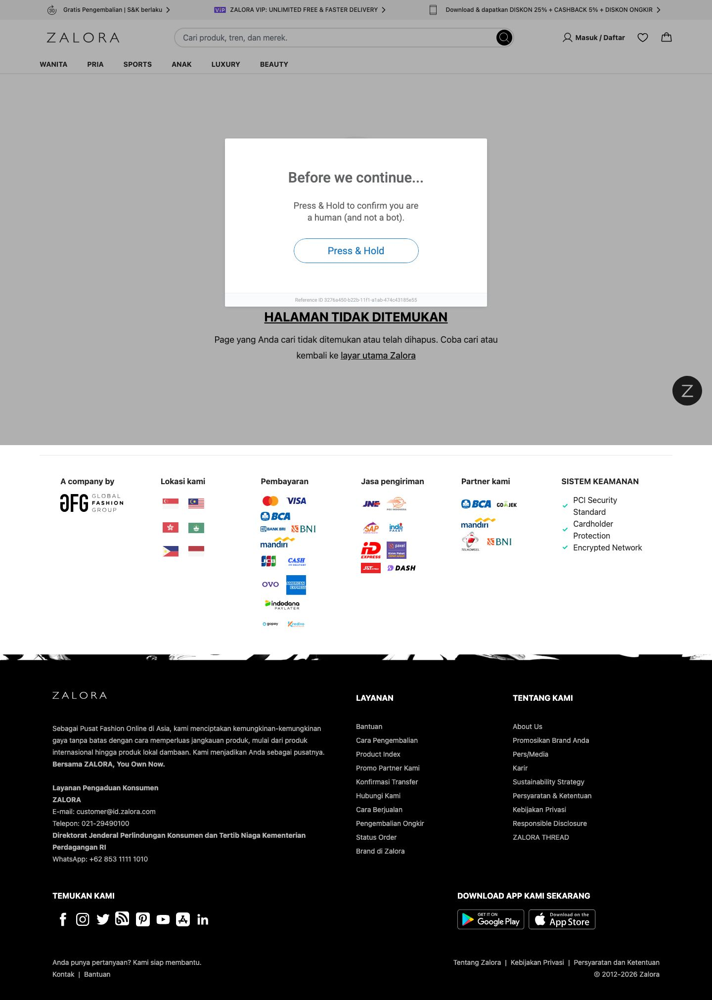

**대표 상품 이미지** (상위 6장, 출처 URL 포함)

-  — 출처 <https://static-id.zacdn.com/next-assets/static-assets/images/logo/icon_mastercard.png>
-  — 출처 <https://static-id.zacdn.com/next-assets/static-assets/images/logo/icon_visa.png>
-  — 출처 <https://static-id.zacdn.com/next-assets/static-assets/images/logo/icon_ovo.png>

**페이지 메타 정보**

| page | title | description |
|---|---|---|
| [`new_women`](https://www.zalora.co.id/wanita/new-arrivals) | Halaman tidak ditemukan | ZALORA |  |

### 4.2 일본 _( Japan )_

- 한국 수출규모 순위: **#2** · region: `asia` · tier `1` · currency `JPY`
- 수집 사이트: **5개** (성공 4)
- 메모: K-패션 선호도 높고 온라인 패션몰 발달
#### [GU Japan](https://www.gu-global.com/jp/)

- URL: <https://www.gu-global.com/jp/>
- 페이지: **OK 1 · FAIL 0**

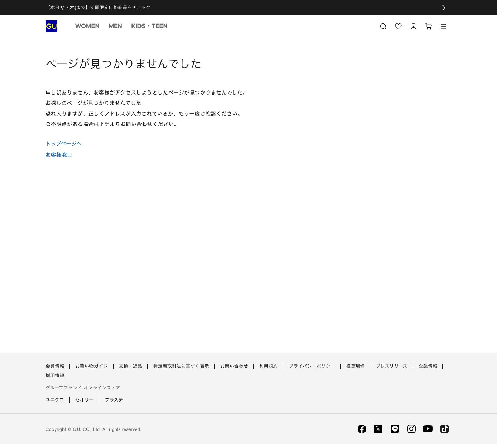

**대표 상품 이미지** (상위 6장, 출처 URL 포함)

-  — 출처 <https://image.uniqlo.com/GU/ST3/jp/imagesother/Navigation/WOMEN_Category/2026/260724/Category_w_Pants.jpg>
- 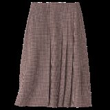 — 출처 <https://image.uniqlo.com/GU/ST3/jp/imagesother/Navigation/WOMEN_Category/2026/260820/Category_w_skirt_361518.png>
-  — 출처 <https://image.uniqlo.com/GU/ST3/jp/imagesother/Navigation/WOMEN_Category/2026/260911/Category_w_tops_358739.png>
-  — 출처 <https://image.uniqlo.com/GU/ST3/jp/imagesother/Navigation/WOMEN_Category/2026/260911/Category_w_sweat_361784.png>
-  — 출처 <https://image.uniqlo.com/GU/ST3/jp/imagesother/Navigation/WOMEN_Category/2026/260807/Category_w_shirt_361657.png>
-  — 출처 <https://image.uniqlo.com/GU/ST3/jp/imagesother/Navigation/WOMEN_Category/2026/260911/Category_w_knit-and-cardigan_360832.png>

**페이지 메타 정보**

| page | title | description |
|---|---|---|
| [`new_arrivals`](https://www.gu-global.com/jp/ja/not-found) | 申し訳ありません、お客様がアクセスしようとしたページが見つかりませんでした。恐れ入りますが、正しくアドレスが入力されているか、もう一度ご確認ください。 | ジーユー | 申し訳ありません、お客様がアクセスしようとしたページが見つかりませんでした。恐れ入りますが、正しくアドレスが入力されているか、もう一度ご確認ください。 |

#### [Rakuten Fashion](https://brandavenue.rakuten.co.jp/)

- URL: <https://brandavenue.rakuten.co.jp/>
- 페이지: **OK 1 · FAIL 1**

**대표 상품 이미지** (상위 6장, 출처 URL 포함)

-  — 출처 <https://brandavenue.r10s.jp/img/library/index/sbn_flagshipstore_20231003.png>
- 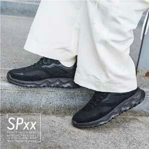 — 출처 <https://brandavenue.r10s.jp/img/news/01/397594/pc_n.jpg>
-  — 출처 <https://brandavenue.r10s.jp/img/news/01/397409/pc_n.jpg>
- 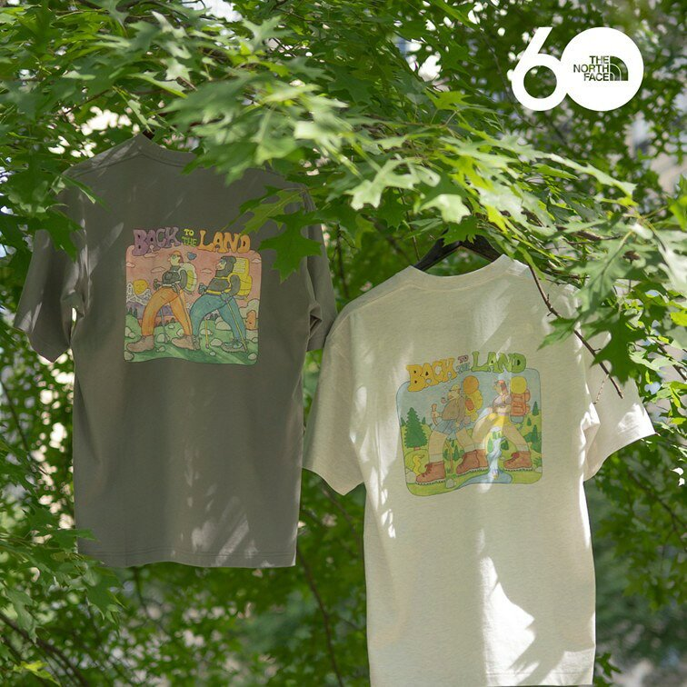 — 출처 <https://brandavenue.r10s.jp/img/news/01/397821/pc_n.jpg>
- 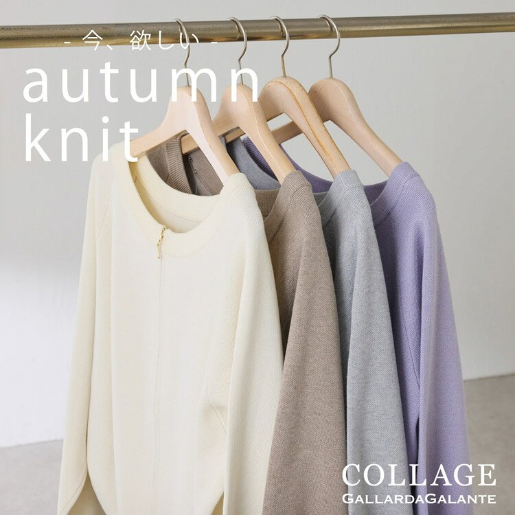 — 출처 <https://brandavenue.r10s.jp/img/news/01/397751/pc_n.jpg>
-  — 출처 <https://brandavenue.r10s.jp/img/news/01/397634/pc_n.jpg>

**페이지 메타 정보**

| page | title | description |
|---|---|---|
| [`men`](https://brandavenue.rakuten.co.jp/men/) | MEN | ファッション通販 Rakuten Fashion(楽天ファッション／旧楽天ブランドアベニュー) | Rakuten Fashion(楽天ファッション)は人気ブランドを取り扱うファッション通販サイトです。新作アイテム続々入荷！セール商品やクーポン対象商品も豊富。／税込3,980円以上購入で送料無料／楽天ポイントが使えて貯まる！ |

**실패 페이지**

- `women` — http_status_404

#### [Uniqlo Japan](https://www.uniqlo.com/jp/)

- URL: <https://www.uniqlo.com/jp/>
- 페이지: **OK 1 · FAIL 0**

**페이지 메타 정보**

| page | title | description |
|---|---|---|
| [`new_arrivals`](https://www.uniqlo.com/jp/ja/contents/feature/new-arrivals/) | 404 Not Found |  |

#### [WEAR](https://wear.jp/)

- URL: <https://wear.jp/>
- 페이지: **OK 1 · FAIL 0**

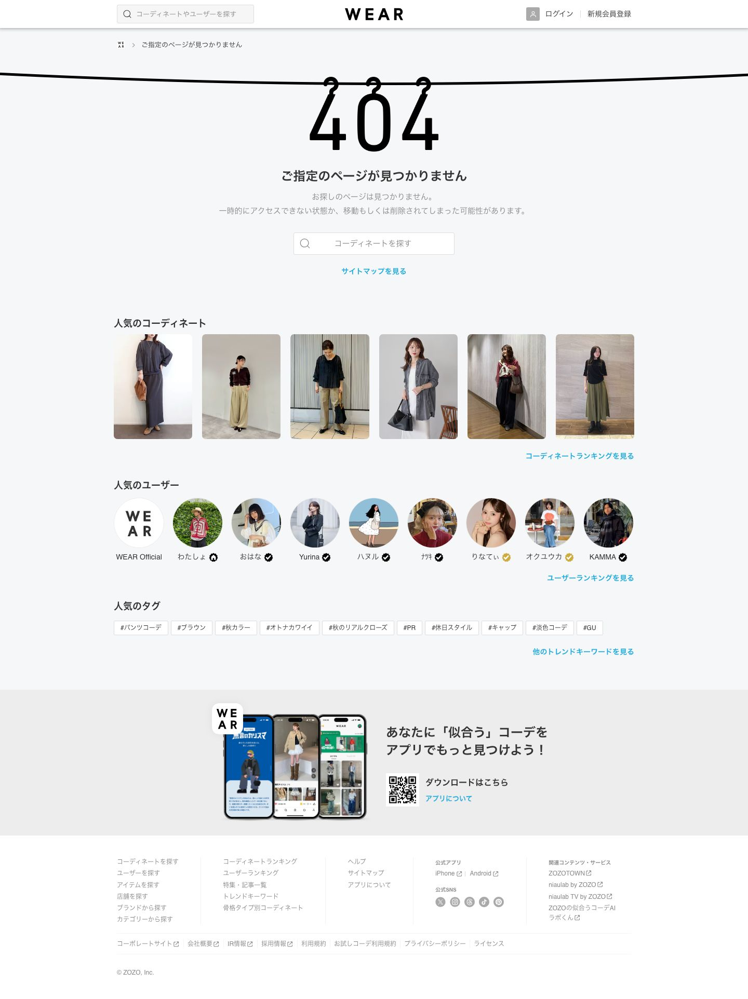

**대표 상품 이미지** (상위 6장, 출처 URL 포함)

-  — 출처 <https://wear.jp/public/_next/static/media/notfound_bg.1ywd-k_shp-hy.png>
-  — 출처 <https://wear.jp/public/_next/static/media/notfound_4.1ho27atf54bbv.png>
-  — 출처 <https://wear.jp/public/_next/static/media/notfound_0.438l9b9xjj6tm.png>
- 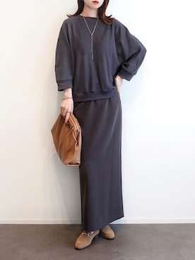 — 출처 <https://images.wear2.jp/coordinate/kAiO3P8/3ZpZkEhY/1789554037_276.jpg>
- 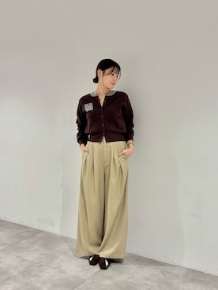 — 출처 <https://images.wear2.jp/coordinate/oJiZ7MgL/dycQBuLQ/1789556217_276.jpg>
- 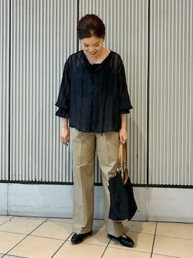 — 출처 <https://images.wear2.jp/coordinate/6gin5PRJ/dRnMRmD2/1789506440_276.jpg>

**페이지 메타 정보**

| page | title | description |
|---|---|---|
| [`ranking`](https://wear.jp/ranking/coordinate/) | ご指定のページが見つかりません - WEAR |  |

#### [ZOZOTOWN](https://zozo.jp/)

- URL: <https://zozo.jp/>
- 페이지: **OK 0 · FAIL 2**

**실패 페이지**

- `new` — playwright_error: TimeoutError: Page.goto: Timeout 30000ms exceeded.
Call log:
  - navigating to "https://zozo.jp/category/new/", waiting until "domcontentloaded"

- `ranking` — playwright_error: TimeoutError: Page.goto: Timeout 30000ms exceeded.
Call log:
  - navigating to "https://zozo.jp/ranking/", waiting until "domcontentloaded"

### 4.3 한국 _( South Korea )_

- 한국 수출규모 순위: **#30** · region: `asia` · tier `1` · currency `KRW`
- 수집 사이트: **4개** (성공 3)
- 메모: 비교 기준 (자국). 국내 사업동향 센싱
#### [29CM](https://www.29cm.co.kr/)

- URL: <https://www.29cm.co.kr/>
- 페이지: **OK 1 · FAIL 0**

**최근 유행 상품** (50건 · 상품명 클릭 시 해당 사이트로 이동)

| # | 상품명 | 브랜드 | 가격 | 페이지 |
|---:|---|---|---:|---|
| 1 | [Utility wind shell jacket - light grey (MEN)](https://product.29cm.co.kr/catalog/4175353) | 포에토 | 198,140 KRW | `home` |
| 2 | [[2nd] Code patch hoody zip-up - ivory](https://product.29cm.co.kr/catalog/4166049) | 포에토 | 116,280 KRW | `home` |
| 3 | [[3rd] Dover buckle leather](https://product.29cm.co.kr/catalog/4166038) | 포에토 | 228,200 KRW | `home` |
| 4 | [닌텐도 스위치 2 본체 단품](https://product.29cm.co.kr/catalog/3961093) | 닌텐도 | 758,000 KRW | `home` |
| 5 | [[닌텐도 스위치 2] 파이어 엠블렘 만자천홍(아크릴 스탠드 증정)](https://product.29cm.co.kr/catalog/4223503) | 닌텐도 | 98,000 KRW | `home` |
| 6 | [쿠시노 950폭 수납장(책장형)](https://product.29cm.co.kr/catalog/3994175) | 일룸 | 134,100 KRW | `home` |
| 7 | [쿠시노 950폭 수납장(PL박스+책장형)](https://product.29cm.co.kr/catalog/3994180) | 일룸 | 143,100 KRW | `home` |
| 8 | [쿠시노 950폭 수납장(PL박스형)](https://product.29cm.co.kr/catalog/3994185) | 일룸 | 152,100 KRW | `home` |
| 9 | [[VITRA] Panton Chair Deep Black 비트라 팬톤 체어 딥블랙](https://product.29cm.co.kr/catalog/1619803) | 비트라 | 620,000 KRW | `home` |
| 10 | [[VITRA] Tabouret Bois Natural Solid Oak 스툴 & 사이드 테이블](https://product.29cm.co.kr/catalog/2723462) | 비트라 | 1,370,000 KRW | `home` |
| 11 | [[VITRA] Panton Chair Soft Mint 비트라 팬톤 체어 소프트 민트](https://product.29cm.co.kr/catalog/1621826) | 비트라 | 620,000 KRW | `home` |
| 12 | [Textured Scarf (Charcoal)](https://product.29cm.co.kr/catalog/4152371) | 에토브 | 34,790 KRW | `home` |
| 13 | [Textured Scarf (Ivory)](https://product.29cm.co.kr/catalog/4152360) | 에토브 | 34,790 KRW | `home` |
| 14 | [Soft Leather Hobo Bag  (Khaki)](https://product.29cm.co.kr/catalog/4152309) | 에토브 | 57,510 KRW | `home` |
| 15 | [ODETTE Wool Bubble Coat Vintage Brown](https://product.29cm.co.kr/catalog/4237337) | 엘무드 우먼 | 204,480 KRW | `home` |
| 16 | [VALENTINA Wool-Fur Combo Jacket Black](https://product.29cm.co.kr/catalog/4237336) | 엘무드 우먼 | 230,040 KRW | `home` |
| 17 | [VALENTINA Wool-Fur Combo Jacket Vanilla Cream](https://product.29cm.co.kr/catalog/4237335) | 엘무드 우먼 | 230,040 KRW | `home` |
| 18 | [Polka dot chiffon midi skirt_Black](https://product.29cm.co.kr/catalog/4012745) | 로에일 | 37,070 KRW | `home` |
| 19 | [Polka dot chiffon midi skirt_Ivory](https://product.29cm.co.kr/catalog/4012619) | 로에일 | 37,070 KRW | `home` |
| 20 | [Basic V-neck knit cardigan_Ivory](https://product.29cm.co.kr/catalog/3917174) | 로에일 | 47,860 KRW | `home` |

**대표 상품 이미지** (상위 6장, 출처 URL 포함)

- 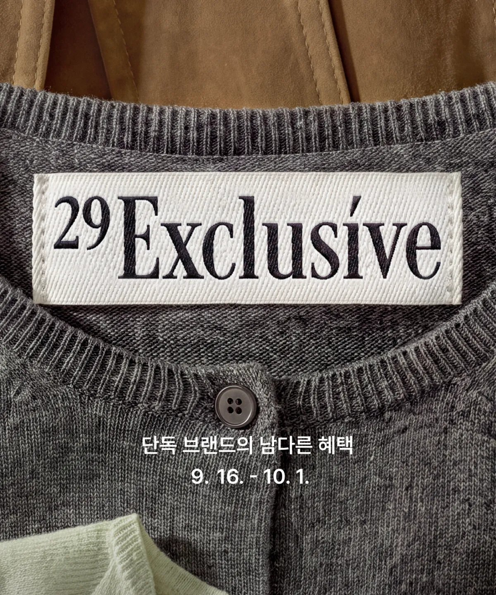 — 출처 <https://img.29cm.co.kr/cms/202609/11f1b0c6a8dced2f9446cde683e23e87.png?width=3840&format=webp>
- 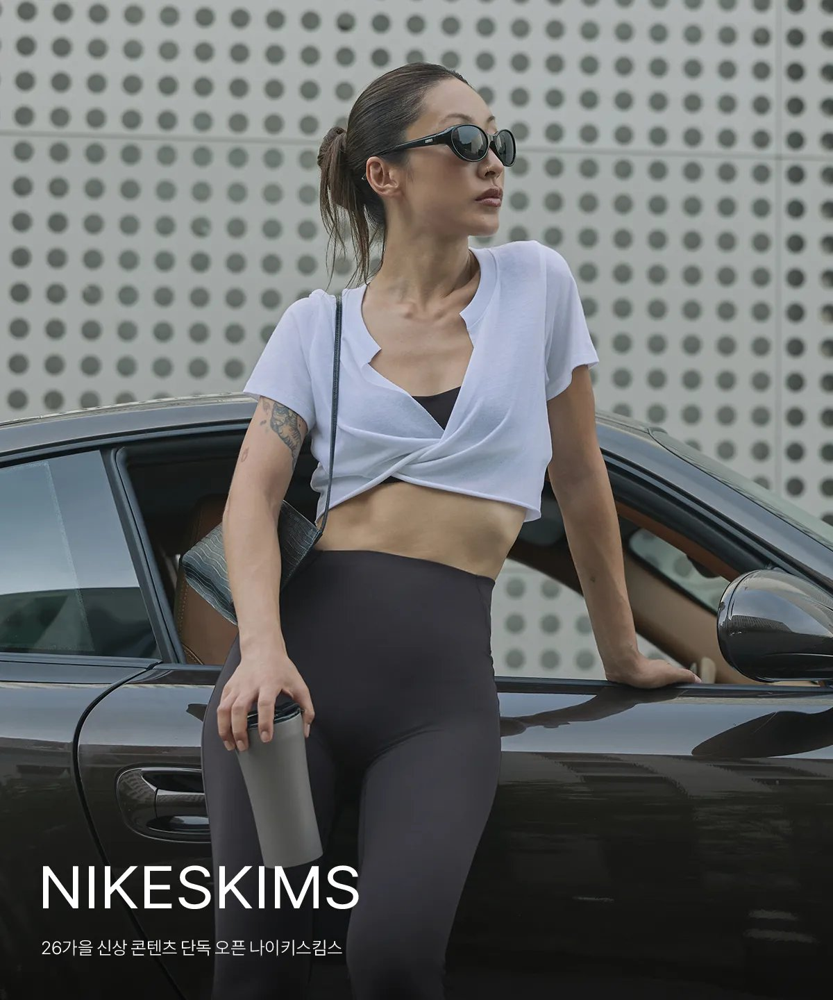 — 출처 <https://img.29cm.co.kr/cms/202609/11f1b0c69ee46f8a91275d8c14c53ddf.png?width=3840&format=webp>
- 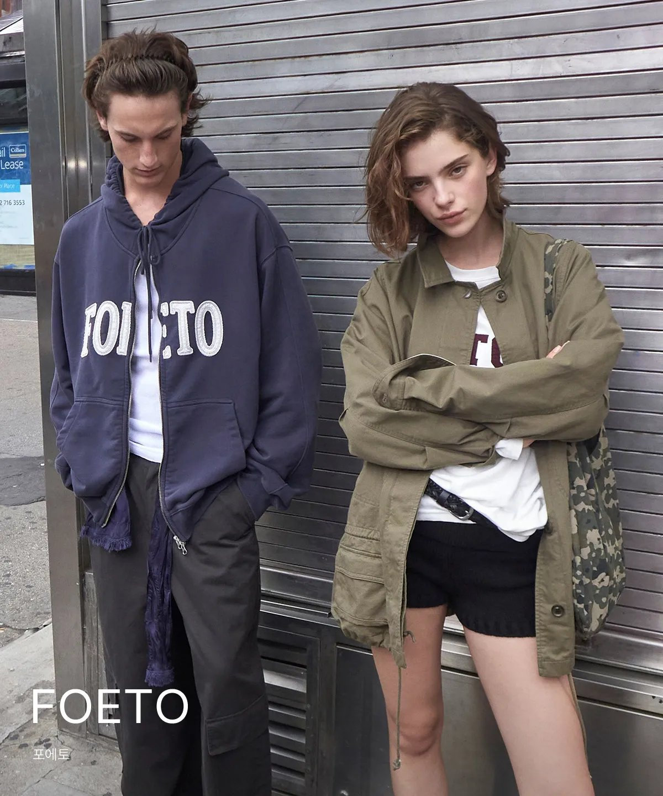 — 출처 <https://img.29cm.co.kr/cms/202609/11f1b0c69290c4119446e1a69ab44f67.png?width=3840&format=webp>
-  — 출처 <https://img.29cm.co.kr/cms/202609/11f1b0c689169e499446eb42f3d88309.png?width=3840&format=webp>
- 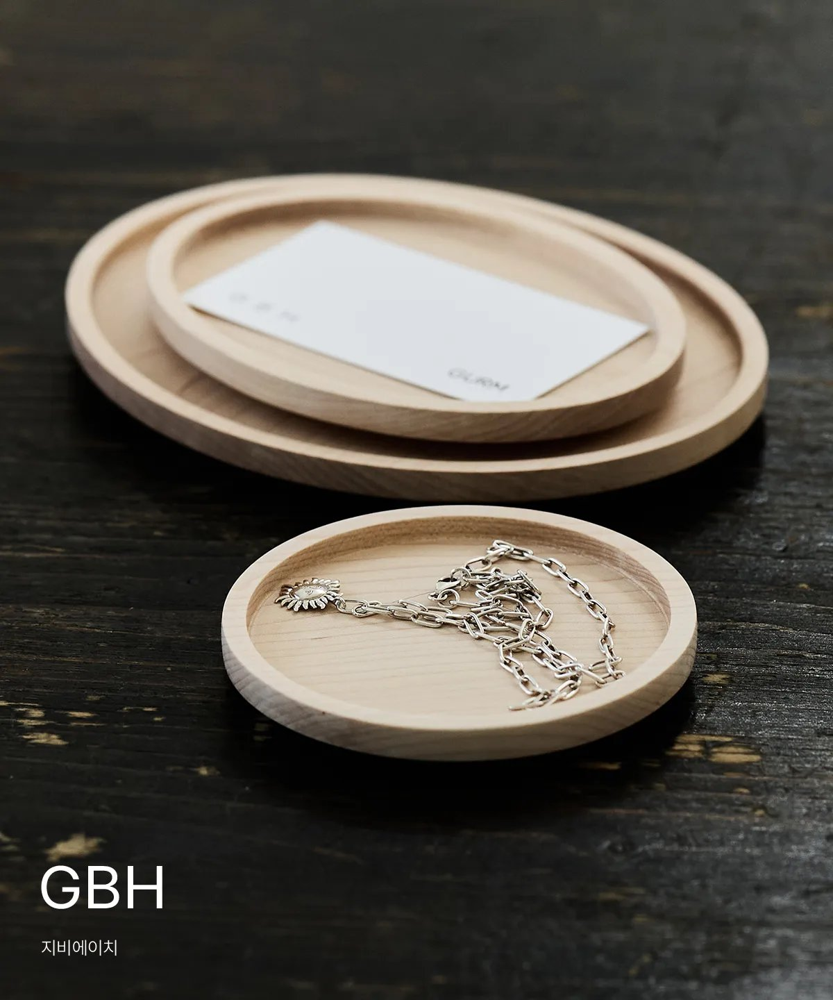 — 출처 <https://img.29cm.co.kr/cms/202609/11f1b0c67fc276f69127ef9e74fbd50d.png?width=3840&format=webp>
- 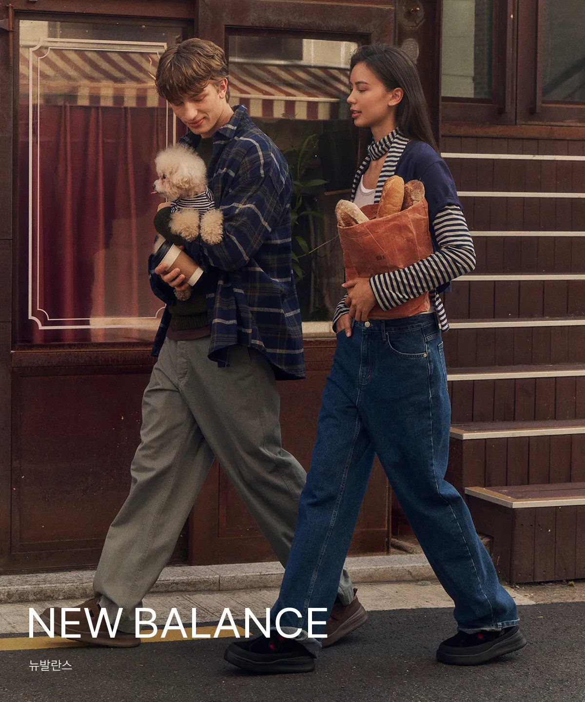 — 출처 <https://img.29cm.co.kr/cms/202609/11f1b0c6759a85159446e16ffce52c03.png?width=3840&format=webp>

**페이지 메타 정보**

| page | title | description |
|---|---|---|
| [`home`](https://www.29cm.co.kr/) | 감도 깊은 취향 셀렉트샵 29CM | 패션, 라이프스타일, 컬처까지 29CM만의 감도 깊은 셀렉션을 만나보세요. |

#### [Musinsa](https://www.musinsa.com/)

- URL: <https://www.musinsa.com/>
- 페이지: **OK 0 · FAIL 1**

**실패 페이지**

- `home` — robots_disallowed

#### [W Concept](https://www.wconcept.co.kr/)

- URL: <https://www.wconcept.co.kr/>
- 페이지: **OK 1 · FAIL 0**

**최근 유행 상품** (30건 · 상품명 클릭 시 해당 사이트로 이동)

| # | 상품명 | 브랜드 | 가격 | 페이지 |
|---:|---|---|---:|---|
| 1 | [[단독] 야미야미 페이보릿 베스트 (딸기)](https://m.wconcept.co.kr/Product/308961274) | 보나츠 | 27,436 KRW | `home` |
| 2 | [[단독] 야미야미 페이보릿 베스트 (토마토)](https://m.wconcept.co.kr/Product/308961254) | 보나츠 | 27,436 KRW | `home` |
| 3 | [[단독] 야미야미 플리스 루즈팬츠 (토마토)](https://m.wconcept.co.kr/Product/308961269) | 보나츠 | 29,564 KRW | `home` |
| 4 | [[단독] 야미야미 플리스 루즈팬츠 (딸기)](https://m.wconcept.co.kr/Product/308961302) | 보나츠 | 29,564 KRW | `home` |
| 5 | [[단독] 젤리뽀곰 스티치 래글런 스웻셔츠_BLUE](https://m.wconcept.co.kr/Product/307519765) | 보나츠 | 33,060 KRW | `home` |
| 6 | [[단독] 젤리뽀곰 루즈팬츠_BROWN](https://m.wconcept.co.kr/Product/307519816) | 보나츠 | 33,060 KRW | `home` |
| 7 | [[단독] 젤리뽀곰 스티치 래글런 스웻셔츠_BROWN](https://m.wconcept.co.kr/Product/307519781) | 보나츠 | 33,060 KRW | `home` |
| 8 | [[단독] 젤리뽀곰 스티치 래글런 스웻셔츠_MUSTARD](https://m.wconcept.co.kr/Product/307519757) | 보나츠 | 33,060 KRW | `home` |
| 9 | [코지 리버 말랑 티셔츠_5COLOR](https://m.wconcept.co.kr/Product/308494008) | 보나츠 | 19,988 KRW | `home` |
| 10 | [애착 뽀피 크로스백 (퍼피)_BBOPPY](https://m.wconcept.co.kr/Product/307469103) | 보나츠 | 29,564 KRW | `home` |
| 11 | [[단독] 러브 러브 러브 몽글라바](https://m.wconcept.co.kr/Product/309022167) | 보나츠 | 41,800 KRW | `home` |
| 12 | [플로스 루즈팬츠_BROWN](https://m.wconcept.co.kr/Product/308128098) | 보나츠 | 29,564 KRW | `home` |
| 13 | [토이 뽀피 니삭스 (퍼피)_3COLOR](https://m.wconcept.co.kr/Product/307435868) | 보나츠 | 12,160 KRW | `home` |
| 14 | [야미야미 프루츠 레깅스_5COLOR](https://m.wconcept.co.kr/Product/308494061) | 보나츠 | 21,888 KRW | `home` |
| 15 | [젤리뽀 뽀곰 니삭스_3COLOR](https://m.wconcept.co.kr/Product/307513565) | 보나츠 | 6,460 KRW | `home` |
| 16 | [애착 빠방 크로스백_2COLOR](https://m.wconcept.co.kr/Product/307442328) | 보나츠 | 29,640 KRW | `home` |
| 17 | [펌킨 뽀피 쇼츠_BEIGE-BROWN](https://m.wconcept.co.kr/Product/308307748) | 보나츠 | 25,384 KRW | `home` |
| 18 | [멜로우 도트 래글런 롱 슬리브_3COLOR](https://m.wconcept.co.kr/Product/308732851) | 보나츠 | 23,256 KRW | `home` |
| 19 | [뽀뚜루 마뚜루 레깅스_9COLOR](https://m.wconcept.co.kr/Product/308347672) | 보나츠 | 14,060 KRW | `home` |
| 20 | [[단독] 펌킨 뽀피 쇼츠_DOVE-GRAY](https://m.wconcept.co.kr/Product/308307735) | 보나츠 | 25,384 KRW | `home` |

**페이지 메타 정보**

| page | title | description |
|---|---|---|
| [`home`](https://www.wconcept.co.kr/) | _(empty)_ |  |

#### [Zigzag](https://zigzag.kr/)

- URL: <https://zigzag.kr/>
- 페이지: **OK 1 · FAIL 0**

**최근 유행 상품** (36건 · 상품명 클릭 시 해당 사이트로 이동)

| # | 상품명 | 브랜드 | 가격 | 페이지 |
|---:|---|---|---:|---|
| 1 | [[단독컬러💖][소프트얀] 딥 브이넥 니트_SPKWG49G01](https://store.zigzag.kr/app/catalog/products/171834823?browsing_type=NATIVE_BROWSER) | 스파오 | 26,910 KRW | `home` |
| 2 | [[단독선발매] (미영픽) 캡 슬리브 하프넥 베스트 [4COL] / GF7LKV519](https://store.zigzag.kr/app/catalog/products/171471244?browsing_type=NATIVE_BROWSER) | 제너럴아이디어 | 26,250 KRW | `home` |
| 3 | [[부츠컷 추가]커브드 밴딩 팬츠_MIWTMG70QB/MIWTMG80QC/MIWTMG90QC/MIWTMG92QA/MIWTMG940A/MIWTJGT36J](https://store.zigzag.kr/app/catalog/products/169131450?browsing_type=NATIVE_BROWSER) | 미쏘 | 49,900 KRW | `home` |
| 4 | [[직잭단독🎀]하이넥 하프 트렌치 코트_MIWJTG916C](https://store.zigzag.kr/app/catalog/products/171180994?browsing_type=NATIVE_BROWSER) | 미쏘 | 104,000 KRW | `home` |
| 5 | [하프 트렌치코트_MIWJTG90QB](https://store.zigzag.kr/app/catalog/products/171067688?browsing_type=NATIVE_BROWSER) | 미쏘 | 99,000 KRW | `home` |
| 6 | [[🍁가을/3기장선택!] made. 모먼트 투커버 올데이슬랙스 (+숏/베이직/롱ver) - 4 size](https://store.zigzag.kr/app/catalog/products/136095576?browsing_type=NATIVE_BROWSER) | 슬로우앤드 | 31,840 KRW | `home` |
| 7 | [[✨하객룩] made. 더블스티치 워싱셔츠 - 13 color](https://store.zigzag.kr/app/catalog/products/127356723?browsing_type=NATIVE_BROWSER) | 슬로우앤드 | 27,120 KRW | `home` |
| 8 | [[핏보정팬츠] made. 나이브 히든밴딩 세미부츠컷 팬츠 (+숏/베이직/롱ver) - 4 size](https://store.zigzag.kr/app/catalog/products/159899063?browsing_type=NATIVE_BROWSER) | 슬로우앤드 | 26,910 KRW | `home` |
| 9 | [[🏆인생부츠컷/3기장선택!] made. 세미부츠컷 찰랑슬랙스 (+숏/베이직/롱ver) - 4 size](https://store.zigzag.kr/app/catalog/products/142355088?browsing_type=NATIVE_BROWSER) | 슬로우앤드 | 25,520 KRW | `home` |
| 10 | [[🍁어텀세일/취향기록15%] made. 오브 울텐셀 레이어드 티셔츠 - 3 color (문의폭주/무료배송)](https://store.zigzag.kr/app/catalog/products/171349199?browsing_type=NATIVE_BROWSER) | 슬로우앤드 | 26,400 KRW | `home` |
| 11 | [울블렌디드 테일러드 롱코트_MIWJHGV0PB](https://store.zigzag.kr/app/catalog/products/171900729?browsing_type=NATIVE_BROWSER) | 미쏘 | 96,750 KRW | `home` |
| 12 | [[예약판매]핸드메이드 하이넥 숏코트_MIWJHGV31B](https://store.zigzag.kr/app/catalog/products/171941073?browsing_type=NATIVE_BROWSER) | 미쏘 | 134,250 KRW | `home` |
| 13 | [핸드메이드 롱코트_MIWJHGV1PB](https://store.zigzag.kr/app/catalog/products/171904453?browsing_type=NATIVE_BROWSER) | 미쏘 | 149,000 KRW | `home` |
| 14 | [[made/R,U넥]에센스골지티셔츠](https://store.zigzag.kr/app/catalog/products/167976864?browsing_type=NATIVE_BROWSER) | 어텀 | 12,510 KRW | `home` |
| 15 | [[신상할인][🍁가을셔츠][하객룩][ofm] 루시 스트랩 시스루 셔츠 (nb)](https://store.zigzag.kr/app/catalog/products/171971911?browsing_type=NATIVE_BROWSER) | 메리어라운드 | 36,000 KRW | `home` |
| 16 | [[에센셜] 캐시미어블렌드 브이넥 니트_MIWKAGT20T](https://store.zigzag.kr/app/catalog/products/171408080?browsing_type=NATIVE_BROWSER) | 미쏘 | 59,900 KRW | `home` |
| 17 | [[Atelier Flily] Color Flare Pants](https://store.zigzag.kr/app/catalog/products/171758214?browsing_type=NATIVE_BROWSER) | 프릴리 | 39,600 KRW | `home` |
| 18 | [마일스 세미 크롭 다트-포인트 셔츠 (차콜)](https://store.zigzag.kr/app/catalog/products/171994791?browsing_type=NATIVE_BROWSER) | 사색 | 41,300 KRW | `home` |
| 19 | [테일러드 세미 오버핏 자켓_MIWJKGT0PG](https://store.zigzag.kr/app/catalog/products/171067678?browsing_type=NATIVE_BROWSER) | 미쏘 | 59,920 KRW | `home` |
| 20 | [울블렌디드 하프코트_MIWJHGV3PG](https://store.zigzag.kr/app/catalog/products/171900742?browsing_type=NATIVE_BROWSER) | 미쏘 | 74,920 KRW | `home` |

**대표 상품 이미지** (상위 6장, 출처 URL 포함)

- 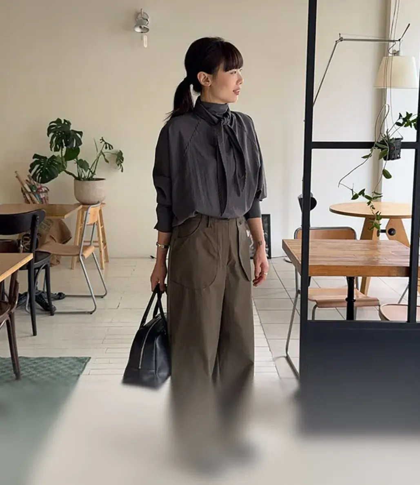 — 출처 <https://cf.image-farm.s.zigzag.kr/original/cms/2026/09/11/202609110117427478_025602.png?quality=80&format=webp&transparent=true&width=1029&height=1188>
-  — 출처 <https://cf.image-farm.s.zigzag.kr/original/cms/2026/09/10/202609100825489437_042625.jpg?width=1029&height=1188&quality=80&format=webp&transparent=true>
-  — 출처 <https://cf.image-farm.s.zigzag.kr/original/cms/2026/09/11/202609110028568423_098010.png?quality=80&format=webp&transparent=true&width=1029&height=1188>
- 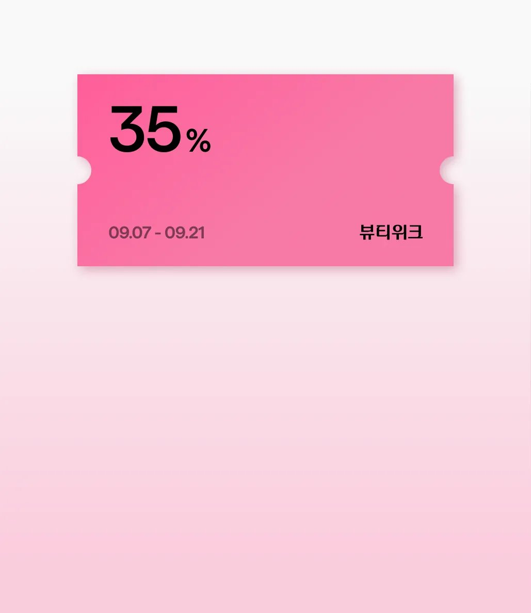 — 출처 <https://cf.image-farm.s.zigzag.kr/original/cms/2026/09/11/202609111344177148_083548.png?format=webp&quality=80&width=1029&height=1188&transparent=true>
-  — 출처 <https://cf.image-farm.s.zigzag.kr/original/cms/2026/09/11/202609110331492760_038822.png?quality=80&format=webp&transparent=true&width=1029&height=1188>
-  — 출처 <https://cf.image-farm.s.zigzag.kr/original/cms/2026/09/10/202609100336487194_042061.png?quality=80&format=webp&transparent=true&width=1029&height=1188>

**페이지 메타 정보**

| page | title | description |
|---|---|---|
| [`home`](https://zigzag.kr/) | 지그재그 스토어 | 4,000만 여성이 선택한 올인원 쇼핑 앱 지그재그 - 제가 알아서 살게요. |

### 4.4 대만 _( Taiwan )_

- 한국 수출규모 순위: **#7** · region: `asia` · tier `1` · currency `TWD`
- 수집 사이트: **5개** (성공 4)
- 메모: K-패션 친화도 높음
#### [momo](https://www.momoshop.com.tw/)

- URL: <https://www.momoshop.com.tw/>
- 페이지: **OK 1 · FAIL 0**

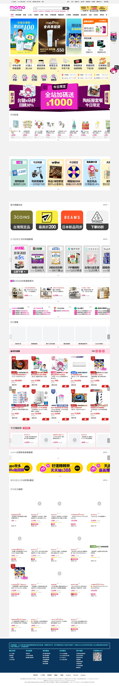

**대표 상품 이미지** (상위 6장, 출처 URL 포함)

-  — 출처 <https://img3.momoshop.com.tw/ecm/img/online/10/998/00/000/bt_0_271_01/bt_0_271_01_e2.jpg?t=1785743060613>
- 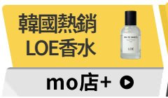 — 출처 <https://img1.momoshop.com.tw/ecm/img/online/10/998/00/000/bt_0_245_01/bt_0_245_01_P1_1_e2.png?t=1789574410712>
-  — 출처 <https://img2.momoshop.com.tw/ecm/img/online/10/998/00/000/bt_0_245_01/bt_0_245_01_P1_2_e2.png?t=1789315213331>
-  — 출처 <https://img1.momoshop.com.tw/ecm/img/online/10/998/00/000/bt_0_245_01/bt_0_245_01_P1_3_e2.png?t=1789228811645>
-  — 출처 <https://img3.momoshop.com.tw/ecm/img/online/81/998/00/000/mobile/bt_7_701_01/bt_7_701_01_e21.jpg?t=1789550012603>
-  — 출처 <https://img3.momoshop.com.tw/ecm/img/online/81/998/00/000/mobile/bt_7_701_01/bt_7_701_01_e91.jpg?t=1789550012628>

**페이지 메타 정보**

| page | title | description |
|---|---|---|
| [`home`](https://www.momoshop.com.tw/main/Main.jsp) | momo購物網 - 好評推薦 - 2026年9月 | momo購物網提供美妝保養、流行服飾、時尚精品、3C、數位家電、生活用品、美食旅遊票券…等數百萬件商品。快速到貨、超商取貨讓您購物最便利。mo店+商品抵用券天天搶、免運吃到飽，電視/直播商品限時下殺，每日讓您享超低價，並享有十天猶豫期；momo購物網為富邦及台灣大哥大關係企業 |

#### [OB Design](https://www.obdesign.com.tw/)

- URL: <https://www.obdesign.com.tw/>
- 페이지: **OK 1 · FAIL 0**

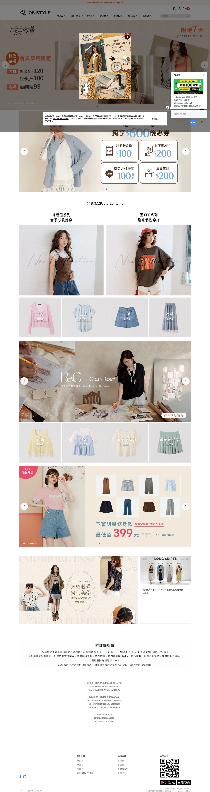

**대표 상품 이미지** (상위 6장, 출처 URL 포함)

-  — 출처 <https://cms-static.cdn.91app.com/images/original/41602/92f19e4d-89b7-4330-9570-02cf1dff9742-1789441273-6drun5zyc4_d_1920x820_1280x547_1124x480_800x342_600x256_400x171.jpg>
-  — 출처 <https://cms-static.cdn.91app.com/images/original/41602/92f19e4d-89b7-4330-9570-02cf1dff9742-1789523695-aojl08hwlx_d_1920x820_1280x547_1124x480_800x342_600x256_400x171.jpg>
-  — 출처 <https://cms-static.cdn.91app.com/images/compress/41602/92f19e4d-89b7-4330-9570-02cf1dff9742-1789523695-aojl08hwlx_d_400x171.webp>
-  — 출처 <https://cms-static.cdn.91app.com/images/original/41602/92f19e4d-89b7-4330-9570-02cf1dff9742-1789441323-w0s0fz0ca4_d_1920x820_1280x547_1124x480_800x342_600x256_400x171.jpg>
- 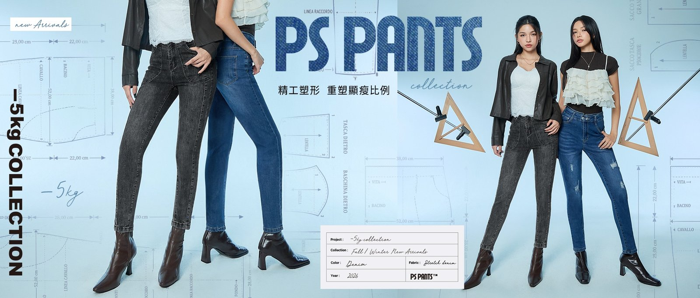 — 출처 <https://cms-static.cdn.91app.com/images/original/41602/92f19e4d-89b7-4330-9570-02cf1dff9742-1789527296-wz3vkxolfi_d_1920x820_1280x547_1124x480_800x342_600x256_400x171.jpg>
- 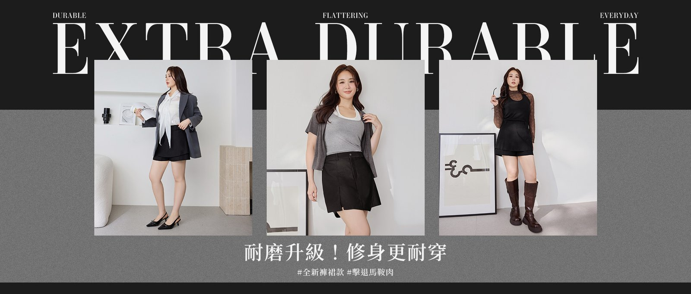 — 출처 <https://cms-static.cdn.91app.com/images/original/41602/92f19e4d-89b7-4330-9570-02cf1dff9742-1789354406-3sy0baovmv_d_1920x820_1280x547_1124x480_800x342_600x256_400x171.jpg>

**페이지 메타 정보**

| page | title | description |
|---|---|---|
| [`home`](https://www.obdesign.com.tw/) | OB嚴選｜高CP值人氣熱銷服飾，流行服飾品牌 | 你的日常穿搭好夥伴，快上OB嚴選找，OB嚴選提供女裝、孕童、運動、男裝各項流行服飾，秉持優質服務給你高CP值的購物體驗。各種風格都能滿足熱愛穿搭的你，天天上新品，快速出貨，一起加入OB style！網路人氣服飾品牌OB嚴選 |

#### [PChome](https://24h.pchome.com.tw/)

- URL: <https://24h.pchome.com.tw/>
- 페이지: **OK 0 · FAIL 1**

**실패 페이지**

- `home` — http_status_429

#### [Pinkoi Taiwan](https://www.pinkoi.com/)

- URL: <https://www.pinkoi.com/>
- 페이지: **OK 2 · FAIL 0**

**대표 상품 이미지** (상위 6장, 출처 URL 포함)

-  — 출처 <https://cdn04.pinkoi.com/pinkoi.site/logo/og_image.png>

**페이지 메타 정보**

| page | title | description |
|---|---|---|
| [`accessories`](https://en.pinkoi.com/) | Pinkoi | Asia’s cross-border design marketplace | Design the way you are | Shop for original design products from Asia's independent designers. Pinkoi lives and breathes great design, great quality, great service, a |
| [`bags`](https://en.pinkoi.com/) | Pinkoi | Asia’s cross-border design marketplace | Design the way you are | Shop for original design products from Asia's independent designers. Pinkoi lives and breathes great design, great quality, great service, a |

#### [Yahoo Taiwan Shopping](https://tw.buy.yahoo.com/)

- URL: <https://tw.buy.yahoo.com/>
- 페이지: **OK 1 · FAIL 0**

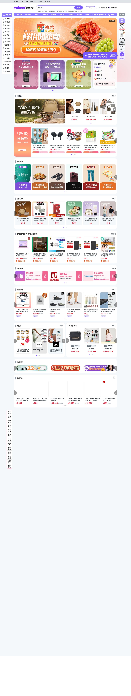

**대표 상품 이미지** (상위 6장, 출처 URL 포함)

- 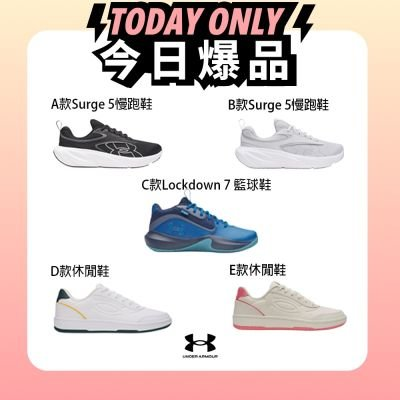 — 출처 <https://img.yec.tw/zp/MerchandiseImages/286f4b0549-Gd-12246810.jpg>
- 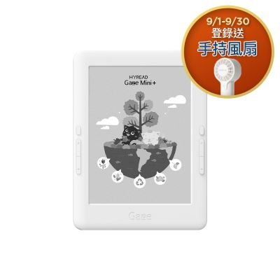 — 출처 <https://img.yec.tw/zp/MerchandiseImages/232e7bbb1f-Gd-11038274.jpg>
- 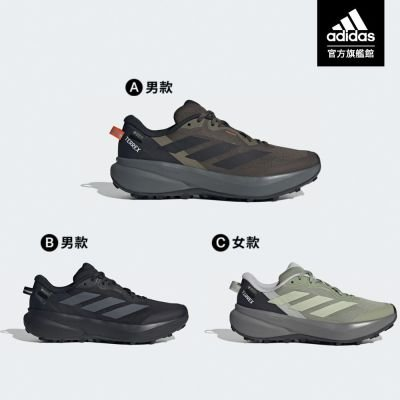 — 출처 <https://img.yec.tw/zp/MerchandiseImages/1335bb5b7b-Gd-12235008.jpg>

**페이지 메타 정보**

| page | title | description |
|---|---|---|
| [`home`](https://tw.buy.yahoo.com/) | Yahoo購物中心 - 最懂生活的人 | 數百萬件商品，貼心客服為您服務，15天鑑賞期購物保障！ |

### 4.5 태국 _( Thailand )_

- 한국 수출규모 순위: **#8** · region: `asia` · tier `1` · currency `THB`
- 수집 사이트: **5개** (성공 4)
- 메모: 동남아 K-패션 핵심 시장
#### [Central Online](https://www.central.co.th/)

- URL: <https://www.central.co.th/>
- 페이지: **OK 1 · FAIL 0**

**페이지 메타 정보**

| page | title | description |
|---|---|---|
| [`home`](https://www.central.co.th/th) | Central Online | ลดสูงสุด 30% + คูปองลดเพิ่ม 12% | The 1 Point Fest โปรโมชั่นสุดยิ่งใหญ่ของปี 2026 เริ่มต้นขึ้นแล้ว! พบกับสินค้าจากหลากหลายแบรนด์ดังที่เราคัดสรรมาลดราคาสูงสุดถึง 30% พร้อมคูปอ |

#### [Lazada Thailand Fashion](https://www.lazada.co.th/)

- URL: <https://www.lazada.co.th/>
- 페이지: **OK 1 · FAIL 0**

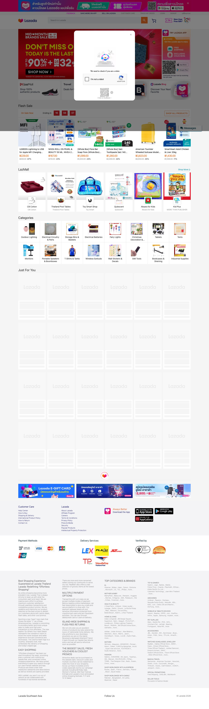

**대표 상품 이미지** (상위 6장, 출처 URL 포함)

-  — 출처 <https://img.lazcdn.com/us/domino/40845120240f19d13f738fa9a7978edd.png>
-  — 출처 <https://img.lazcdn.com/g/tps/images/ims-web/TB1KB2laMFY.1VjSZFnXXcFHXXa.png>
-  — 출처 <https://img.lazcdn.com/us/domino/2577c46e-8b06-4dfa-903a-697760aa5248_TH-1976-688.jpg_2200x2200q80.jpg>
-  — 출처 <https://img.lazcdn.com/us/domino/fc87d6a7-069b-4281-bd47-857b40b3debb_TH-1976-688.jpg_2200x2200q80.jpg>
-  — 출처 <https://img.lazcdn.com/us/domino/47739d6c-b412-4d2a-8e43-15869efee398_TH-1976-688.jpg_2200x2200q80.jpg>
-  — 출처 <https://img.lazcdn.com/us/domino/160a656e-8272-4212-aa56-ed72d01f923e_TH-1976-688.jpg_2200x2200q80.jpg>

**페이지 메타 정보**

| page | title | description |
|---|---|---|
| [`home`](https://www.lazada.co.th/#?) | Lazada Thailand | ช้อปออนไลน์ สินค้าดี พร้อมดีลพิเศษทุกวัน | พบกับ Lazada แพลตฟอร์มช้อปปิ้งชั้นนำในอาเซียน พร้อมบริการเก็บเงินปลายทาง LazMall LazFlash และดีลเด็ดจากแบรนด์ดังทุกวัน |

#### [Pomelo](https://www.pomelofashion.com/)

- URL: <https://www.pomelofashion.com/>
- 페이지: **OK 0 · FAIL 2**

**실패 페이지**

- `new` — robots_disallowed
- `best` — robots_disallowed

#### [Shopee Thailand Fashion](https://shopee.co.th/)

- URL: <https://shopee.co.th/>
- 페이지: **OK 1 · FAIL 0**

**대표 상품 이미지** (상위 6장, 출처 URL 포함)

-  — 출처 <https://deo.shopeemobile.com/shopee/shopee-pcmall-live-sg/assets/1c8bdaaf45e1fd48.png>

**페이지 메타 정보**

| page | title | description |
|---|---|---|
| [`home`](https://shopee.co.th/verify/captcha?anti_bot_tracking_id=gqRjZGVrxHSFomtptTE0MjUxOnRyYWNraW5nX2lkX2tleaJrdtEAAqRhbGdv0gAAAGSjZGVrwKJjdMRAAAAADMPc0R2hCGactn2nr9DcAFBQpHMoHjAbjrdsrt_pSEAwvu3D4ZqEQ0V0kSHM0Nn9K_1xVJ0eNyntbq4tnqpjaXBoZXJ0ZXh0xQLPAAAADCP8u2Y6EEJWsvZXInC7vbGAjhWp9zQGgYZT4ifbJ8xK_N6MRloA_BtPvFD5v07BXSNtHp5XkgS7zooRqah8nwZFRgaiqnQBla8X4MaMpvbSe3inZvomMhBAF2Vy-R9GLU3eJR5ECv_gk6W61hPVt_L6KGls5oyl8ORjfGvaqEMVglZFoFVtnA6DVPDek-W0ts9Dcb_TXFfnUOQLNd4H7rtWopzD2F96bls0ARxEf-_scLsfKtDusuUqOwXh2_p939di1ezhzGKkK-_QvsGzTy4yZIxGAlbA6KJWoRkEJ8x_0DJRGhxUCiFmZd5JjFmbBP0I27INuh7ZLySVqrSa5QCdLDi4cGvPpZbJFu-Nvv5bm1hN8pqjRdjZmyRQ2kI-vHMgmjUz0EPWhK9kajb6Z5tQ4DCrK3ttwsFJ-WBy0hkvtZsxKSTzRkpfgbBN0E5cBgl2hPuyyuoxx58Q88oFXaxzuLBZJW1vo2Q3H8IjaPtaEz8fWr9cC9lFY_6DVggFKx3B61FtHqCiyTgTDpmOL2_XV8mOX5KQtEO5LZQ1Rmk9_lmYNB72cISu-3hsRK9xgCTDpqlRGubvHHmKHRPZ17huMM2agIcZDDlUYE55nWxlj2Tr3mBaO7h45fJlHcmoQ_J7RfANjHSpwKzcN4Ak2iEdWqbOqjhFLIbmQI6LpAvsElsn0-T2KrHatEm2u0n89T4dbU5_onn9sGWPvOOR-h7WPlF1iBmFWWxYnCNXaqlSGtRfmXP0NWiZ0Ed3xQD5paKTZk7HNc-eg0Q4brRfeX6VdKnaDczhKHqCBm6AqHg2HqXBkoxxkx7EeQBQV83smpM570sOIPeBtyRaXt4dKeheFjwP6c8xoGlkcxNqTRuH9k_lbwk8kn--9qJHf_Y4_6c926m31LKP-uo4vUmPp40RxtAaQbZ6qQKTmgI5B9fhIN3gpWWGI-bKm7g&app_key=FlashSale.PC&client_id=1&next=https%3A%2F%2Fshopee.co.th%2Fverify%2Ftraffic%3F%3Fclient_id%3D%26next%3Dhttps%253A%252F%252Fshopee.co.th%252F%26redirect_type%3D2%26should_replace_history%3Dfalse&redirect_type=2&scene=crawler_item&should_replace_history=false) | Shopee Thailand | ช้อปปิ้งออนไลน์ ผ่านมือถือและเว็บไซต์ | ซื้อทุกอย่างที่ Shopee! ช้อปปิ้งออนไลน์จบในที่เดียว ซื้อหรือขายก็ง่ายสุดๆ มีโปรและส่วนลดเพียบ การันตีโดย Shopee | ส่งฟรีทั่วไทย | เก็บเงินปล |

#### [Zalora Thailand](https://www.zalora.co.th/)

- URL: <https://www.zalora.co.th/>
- 페이지: **OK 1 · FAIL 0**

**대표 상품 이미지** (상위 6장, 출처 URL 포함)

-  — 출처 <https://www.zalora.co.th/images/landingpage/525x500.gif>

**페이지 메타 정보**

| page | title | description |
|---|---|---|
| [`home`](https://www.zalora.co.th/) | ZALORA - ASIA'S LEADING ONLINE FASHION DESTINATION |  |

### 4.6 미국 _( United States )_

- 한국 수출규모 순위: **#1** · region: `north_america` · tier `1` · currency `USD`
- 수집 사이트: **5개** (성공 4)
- 메모: 한국 의류 최대 수출국. 대형 이커머스와 브랜드 커머스 중심
#### [Etsy](https://www.etsy.com/)

- URL: <https://www.etsy.com/>
- 페이지: **OK 2 · FAIL 0**

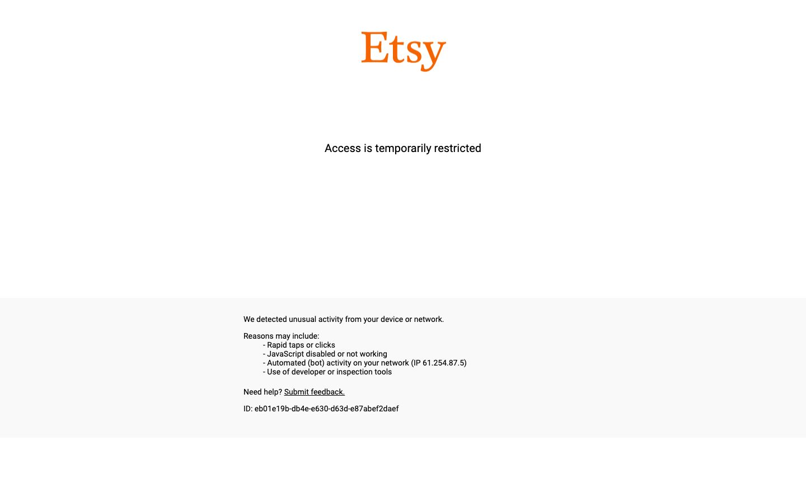

**페이지 메타 정보**

| page | title | description |
|---|---|---|
| [`trending_jewelry`](https://www.etsy.com/c/jewelry) | etsy.com |  |
| [`trending_accessories`](https://www.etsy.com/c/accessories) | etsy.com |  |

#### [Macy's](https://www.macys.com/)

- URL: <https://www.macys.com/>
- 페이지: **OK 1 · FAIL 0**

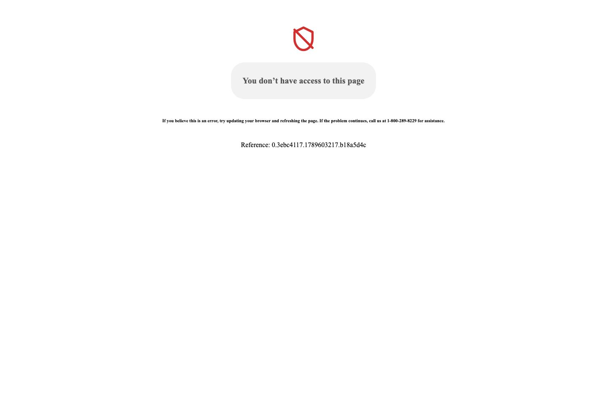

**페이지 메타 정보**

| page | title | description |
|---|---|---|
| [`new`](https://www.macys.com/shop/whats-new?id=14834) | Access Denied - Macy's | Access denied 403 |

#### [Nordstrom](https://www.nordstrom.com/)

- URL: <https://www.nordstrom.com/>
- 페이지: **OK 2 · FAIL 0**

**대표 상품 이미지** (상위 6장, 출처 URL 포함)

-  — 출처 <https://n.nordstrommedia.com/it/7f51c20a-b069-4154-9cfb-1e6d13a7c608.gif>
-  — 출처 <https://n.nordstrommedia.com/is/image/nordstrom/01_Womens-Sale_Tile_1-1_12364522-1.png?width=240&dpr=2&crop=1280%3A1600%2Coffset-x50%2Coffset-y50>
- 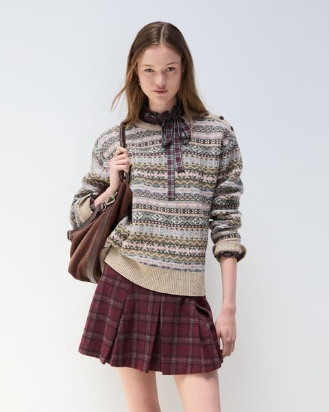 — 출처 <https://n.nordstrommedia.com/is/image/nordstrom/WMNS_OPC01F_0926_062_altBgd_ext_1-1.jpeg?width=240&dpr=2&crop=2312.576%3A2890.72%2Coffset-x59.295%2Coffset-y50&trim=0.047%2C0.071%2C0.36%2C0>
- 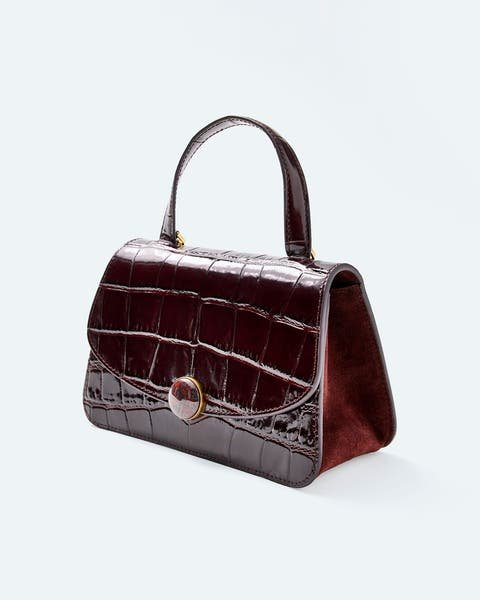 — 출처 <https://n.nordstrommedia.com/is/image/nordstrom/20_Handbags_Tile_1-1_13300122.jpeg?width=240&dpr=2&crop=1280%3A1600%2Coffset-x50%2Coffset-y50>
-  — 출처 <https://n.nordstrommedia.com/is/image/nordstrom/WSH_YC02P_0926_V1.jpeg?width=240&dpr=2&crop=5357%3A6696.25%2Coffset-x50%2Coffset-y50>
-  — 출처 <https://n.nordstrommedia.com/is/image/nordstrom/WSH_YC03F_0826_0029_altBgd_ext_1-1.jpeg?width=240&dpr=2&crop=5390.787%3A6738.484%2Coffset-x40.672%2Coffset-y50&trim=0%2C0%2C0.018%2C0>

**페이지 메타 정보**

| page | title | description |
|---|---|---|
| [`new`](https://www.nordstrom.com/browse/new) | _(empty)_ |  |
| [`women`](https://www.nordstrom.com/browse/women) | Women's Clothing, Shoes, & Accessories | Nordstrom | Find a great selection of Women's Clothing, Shoes, & Accessories at Nordstrom.com. Shop popular brands and top designers. |

#### [Revolve](https://www.revolve.com/)

- URL: <https://www.revolve.com/>
- 페이지: **OK 0 · FAIL 2**

**실패 페이지**

- `new` — playwright_error: Error: Page.goto: net::ERR_HTTP2_PROTOCOL_ERROR at https://www.revolve.com/new/br/c79f88/
Call log:
  - navigating to "https://www.revolve.com/new/br/c79f88/", waiting until "domcontentloaded"

- `trending` — playwright_error: Error: Page.goto: net::ERR_HTTP2_PROTOCOL_ERROR at https://www.revolve.com/most-loved/br/4a9ca5/
Call log:
  - navigating to "https://www.revolve.com/most-loved/br/4a9ca5/", waiting until "domcontentloaded"

#### [Urban Outfitters](https://www.urbanoutfitters.com/)

- URL: <https://www.urbanoutfitters.com/>
- 페이지: **OK 1 · FAIL 0**

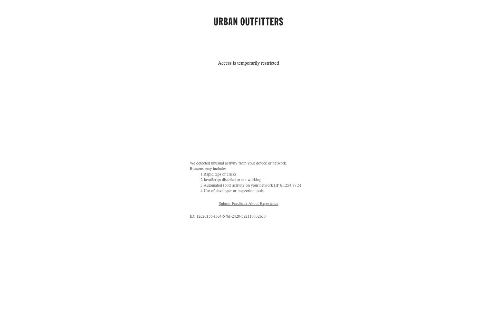

**페이지 메타 정보**

| page | title | description |
|---|---|---|
| [`new_women`](https://www.urbanoutfitters.com/womens-new-arrivals) | urbanoutfitters.com |  |

### 4.7 베트남 _( Vietnam )_

- 한국 수출규모 순위: **#4** · region: `asia` · tier `1` · currency `VND`
- 수집 사이트: **5개** (성공 5)
- 메모: 의류 생산기지/원단 수출 비중 큼. 빠르게 성장하는 이커머스
#### [Canifa](https://canifa.com/)

- URL: <https://canifa.com/>
- 페이지: **OK 1 · FAIL 0**

**대표 상품 이미지** (상위 6장, 출처 URL 포함)

-  — 출처 <https://2885371169.e.cdneverest.net/Simiconnector/BannerSlider/a/o/ao-gio_topbanner_desktop-180826.webp>
-  — 출처 <https://2885371169.e.cdneverest.net/Simiconnector/BannerSlider/f/i/finalsale_topbanner_desktop-160926.webp>
-  — 출처 <https://2885371169.e.cdneverest.net/Simiconnector/BannerSlider/j/e/jeans_topbanner_desktop-110926a.webp>
-  — 출처 <https://canifa.com/_nuxt/img/chatbot-icon.c84d6ec.webp>
-  — 출처 <https://canifa.com/_nuxt/img/chat-zalo.ab5351f.webp>

**페이지 메타 정보**

| page | title | description |
|---|---|---|
| [`home`](https://canifa.com/) | CANIFA | Fashion For All | CANIFA - thương hiệu thời trang hàng đầu Việt Nam. Hàng ngàn mẫu quần áo phụ kiện nam, nữ, trẻ em cao cấp, chất lượng, an toàn liên tục được |

#### [IVY moda](https://ivymoda.com/)

- URL: <https://ivymoda.com/>
- 페이지: **OK 1 · FAIL 0**

**대표 상품 이미지** (상위 6장, 출처 URL 포함)

- 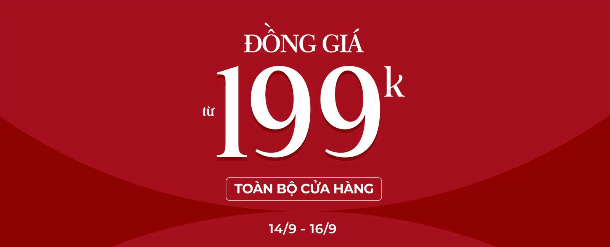 — 출처 <https://cotton4u.vn/files/news/2026/09/10/8b3d79122f6e32b60aa7ed584c8a9b02.webp>
- 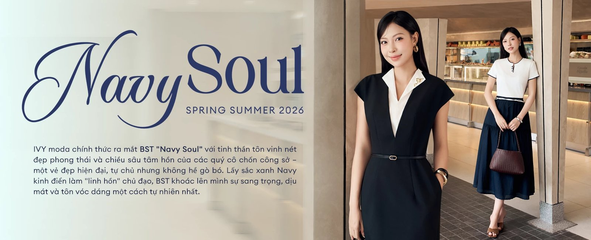 — 출처 <https://cotton4u.vn/files/news/2026/07/28/15df65aa488e134e6745a5282bd0818c.webp>
-  — 출처 <https://cotton4u.vn/files/product/thumab/400/2026/07/23/b46e690b78a6fc9556a65e1f1e91b59d.webp>
-  — 출처 <https://cotton4u.vn/files/product/thumab/400/2026/07/23/81cf098c4655bb80d97ac71e3e4b67e5.webp>
- 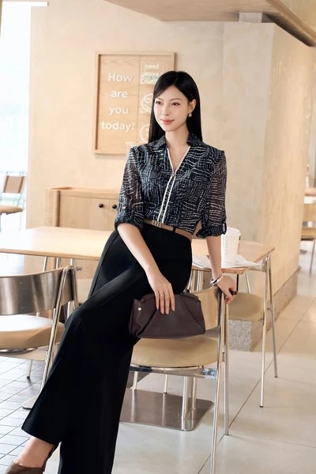 — 출처 <https://cotton4u.vn/files/product/thumab/400/2026/07/23/b0d88eb30b5f0187a9c3054094d442d4.webp>
- 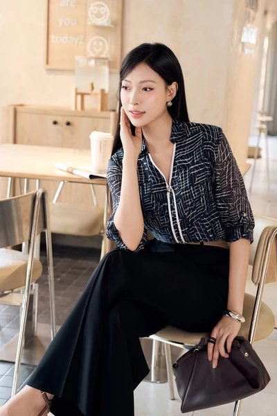 — 출처 <https://cotton4u.vn/files/product/thumab/400/2026/07/23/ca614d8ecd42755d1c06d8b8c4ad80c5.webp>

**페이지 메타 정보**

| page | title | description |
|---|---|---|
| [`home`](https://ivymoda.com/) | IVY moda - Thời Trang Công Sở Hiện Đại | IVY moda |  |

#### [Lazada Vietnam](https://www.lazada.vn/)

- URL: <https://www.lazada.vn/>
- 페이지: **OK 1 · FAIL 0**

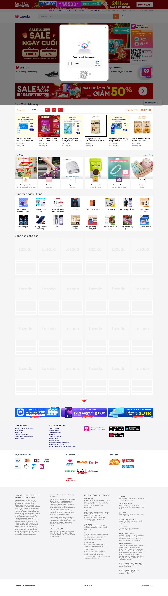

**대표 상품 이미지** (상위 6장, 출처 URL 포함)

-  — 출처 <https://img.lazcdn.com/us/domino/2ad4f22ce5a43dc145f221d13feed352.png>
-  — 출처 <https://img.lazcdn.com/g/tps/images/ims-web/TB1T7K2d8Cw3KVjSZFuXXcAOpXa.png>
- 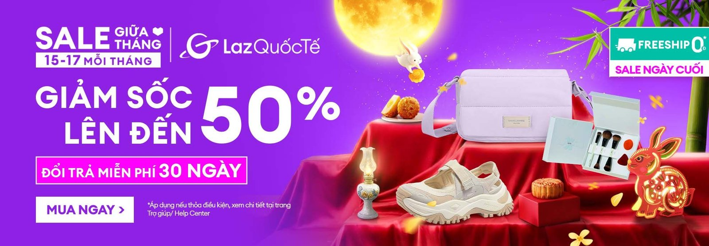 — 출처 <https://img.lazcdn.com/us/domino/0a1f4abf-3bb5-487b-a6f9-42e81433ec2e_VN-1976-688.jpg_2200x2200q80.jpg>
- 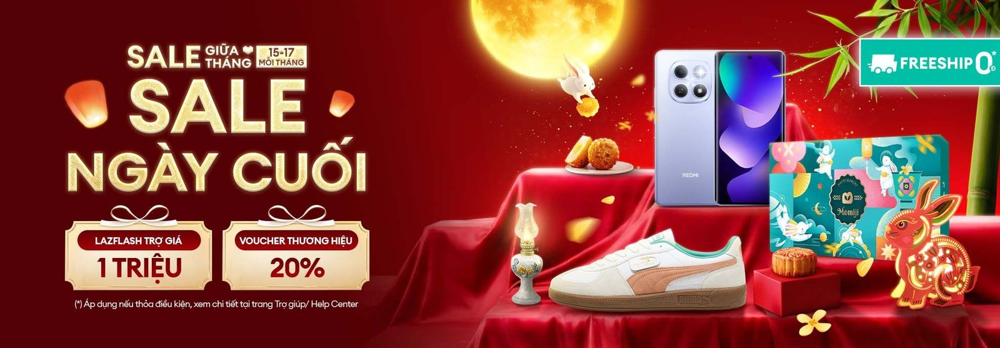 — 출처 <https://img.lazcdn.com/us/domino/bd9ab46c-0b09-4126-9f56-1fdb14b440d8_VN-1976-688.jpg_2200x2200q80.jpg>
-  — 출처 <https://img.lazcdn.com/us/domino/d6800cea-92b3-4e03-82c5-c00200946ff4_VN-1976-688.jpg_2200x2200q80.jpg>
- 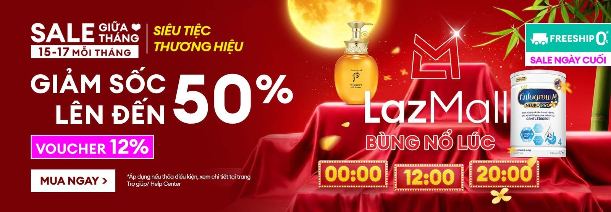 — 출처 <https://img.lazcdn.com/us/domino/6e304fb1-9fab-41fe-80f5-53f5cf366405_VN-1976-688.jpg_2200x2200q80.jpg>

**페이지 메타 정보**

| page | title | description |
|---|---|---|
| [`home`](https://www.lazada.vn/#?) | Lazada Việt Nam | Mua Sắm Online, Giá Tốt Nhất Mỗi Ngày | Mua sắm đồ điện tử, thời trang, làm đẹp và đồ chơi giá cả phải chăng. Đảm bảo sản phẩm chính hãng và trải nghiệm mua sắm tiện lợi – mua ngay |

#### [Shopee Vietnam](https://shopee.vn/)

- URL: <https://shopee.vn/>
- 페이지: **OK 1 · FAIL 0**

**대표 상품 이미지** (상위 6장, 출처 URL 포함)

-  — 출처 <https://deo.shopeemobile.com/shopee/shopee-pcmall-live-sg/homepagefe/42ba6075c82a85ab.png>

**페이지 메타 정보**

| page | title | description |
|---|---|---|
| [`home`](https://shopee.vn/verify/captcha?anti_bot_tracking_id=gqRjZGVrxHSFomtptTE0MjUxOnRyYWNraW5nX2lkX2tleaJrdtEAAqRhbGdv0gAAAGSjZGVrwKJjdMRAAAAADMPc0R2hCGactn2nr9DcAFBQpHMoHjAbjrdsrt_pSEAwvu3D4ZqEQ0V0kSHM0Nn9K_1xVJ0eNyntbq4tnqpjaXBoZXJ0ZXh0xQMsAAAADL3-k74d5NrJTj8Pbhj_N7QUKdZq9NmGY4PHVhM5CIIzD8ylUYFBciIg5Pxzo1Jukp87f8slJrYfKTU3vCoLzQ2ELWkLmwkwaOhmNzMN1_xAapNP320GQc09--t3fMuTJE5HBIZdcDWK8mDuuDkC7qToJ-KLtAS6ppqjgGfcnuPnGTu7jW6cbbjtEGc96mqVQU00oLlgsAlzhYc99tfkxU-aY2DQnVIH1ZkzDfrgSDz3C-8RBeoyDAxaqjTMpsE1E95xKO8xcQfzbCqag2Q9DvEeqWOMXGA_OaBxtBaAdheCZ-zblwFg9lr7KNQZ8gVhi3R6cCUu7yIH84uQ1O64zRyTmYMvRiUZ08rhXAdmdphUKjLOSTBXllGTmNn3oTZSH92CPtkS7qTtrWEKqw8WV0vJGS8VmcahsbRqaFyfFedC17jCfsK_tBBcsU_N7TVpRNhg9qxoleYB2GoQ-nvUdp0gEsAWdaUnqDYaDcTcUErpm4PjbFhQRVUZ_c3N6K95qm70yEUaKuK45HbUOVdrBW7Eo9pX4CYupIluWtb2Mr2AOdifXwk122Gq99vbj8FsD2yE87PzJoMSypPpDUhScVguCDUcVTvSclpopfI6QlyP6oG9o5h9-8UvnWDaUHuHNFy-ySfYZRrO243hHo7Qa6zMdr6QyjQD_iOXSFdXn1pZKQzLXSq1_Z2yEZtxJKvrYUIjjrcogxTvB7qJLCdnmSN9z3XbZWyfeN5rXmpzUtaz6vDpLB3ReQNSxG2l4PSqIqnhs2M0oXFGY7aeeH1EVDtYqQhn-cAdFZJxefwiiiAfOvD-u3HECUKjb5azjgeml92fAklBNuKuqHv0upLTAwPdyzvbVtRKMg0e4LLUEhBcH_jcXu2qdqBQ7dYJn_RFsdjEBNem7ad5A8tpIkHnCn4Yb4ohwMRTHRaiH4fdEAFGah4nesb1K6lxjDODlB6K7D9dm207LlOX8WXIQ3LWyuQ3VqDV8RYBBXS957YLL9lPcECVjb1I80OMmtB1ULatDHP0Esc0J9AGC5qVeBQdpIVC3k-0WnSyyPD-J4mR3BivcBg1SH8fD3M&app_key=FlashSale.PC&client_id=1&next=https%3A%2F%2Fshopee.vn%2Fverify%2Ftraffic%3F%3Fclient_id%3D%26next%3Dhttps%253A%252F%252Fshopee.vn%252F%26redirect_type%3D2%26should_replace_history%3Dfalse&redirect_type=2&scene=crawler_item&should_replace_history=false) | Shopee Việt Nam | Mua Sắm Online | Mua sắm trực tuyến hàng triệu sản phẩm ở tất cả ngành hàng. Giá tốt & Miễn phí vận chuyển. Mua và bán online trong 30 giây. Voucher Xtra | F |

#### [Tiki](https://tiki.vn/)

- URL: <https://tiki.vn/>
- 페이지: **OK 1 · FAIL 0**

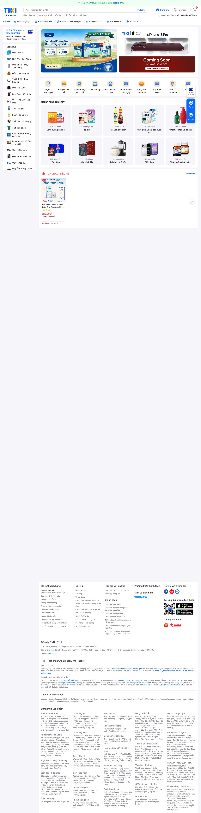

**대표 상품 이미지** (상위 6장, 출처 URL 포함)

-  — 출처 <https://salt.tikicdn.com/cache/100x100/ts/category/ed/20/60/afa9b3b474bf7ad70f10dd6443211d5f.png>
-  — 출처 <https://salt.tikicdn.com/cache/100x100/ts/category/f6/22/46/7e2185d2cf1bca72d5aeac385a865b2b.png>
-  — 출처 <https://salt.tikicdn.com/cache/100x100/ts/category/54/c0/ff/fe98a4afa2d3e5142dc8096addc4e40b.png>
-  — 출처 <https://salt.tikicdn.com/cache/100x100/ts/category/13/64/43/226301adcc7660ffcf44a61bb6df99b7.png>
-  — 출처 <https://salt.tikicdn.com/cache/100x100/ts/category/75/34/29/78e428fdd90408587181005f5cc3de32.png>
-  — 출처 <https://salt.tikicdn.com/cache/100x100/ts/category/61/d4/ea/e6ea3ffc1fcde3b6224d2bb691ea16a2.png>

**페이지 메타 정보**

| page | title | description |
|---|---|---|
| [`home`](https://tiki.vn/) | Tiki - Mua hàng online giá tốt, hàng chuẩn, ship nhanh | Tiện lợi mua sắm hàng triệu mặt hàng, dịch vụ. Vô vàn ưu đãi freeship, mã giảm giá. Hoàn tiền 15% tối đa 600k/tháng với thẻ tín dụng TikiCAR |

## 5. 의류 카테고리별 글로벌 트렌드

| # | 카테고리 | 건수 | 대표 상품명 |
|---:|---|---:|---|
| 1 | `셔츠` | 12 | [단독] 젤리뽀곰 스티치 래글런 스웻셔츠_BLUE · [단독] 젤리뽀곰 스티치 래글런 스웻셔츠_BROWN · [단독] 젤리뽀곰 스티치 래글런 스웻셔츠_MUSTARD |
| 2 | `팬츠` | 8 | [단독] 야미야미 플리스 루즈팬츠 (토마토) · [단독] 야미야미 플리스 루즈팬츠 (딸기) · [단독] 젤리뽀곰 루즈팬츠_BROWN |
| 3 | `shirt` | 6 | FADE INTO YOU T-SHIRT (WHITE)_G26BUJTS03 · FADE INTO YOU T-SHIRT (WASHED BLACK)_G26BUJTS03 · SMALL LOGO T-SHIRT (WHITE)_G26BUJTS05 |
| 4 | `코트` | 6 | [직잭단독🎀]하이넥 하프 트렌치 코트_MIWJTG916C · 하프 트렌치코트_MIWJTG90QB · 울블렌디드 테일러드 롱코트_MIWJHGV0PB |
| 5 | `니트` | 5 | [단독컬러💖][소프트얀] 딥 브이넥 니트_SPKWG49G01 · [에센셜] 캐시미어블렌드 브이넥 니트_MIWKAGT20T · [🍁어텀세일/취향기록15%] made. 포트 컬러웨이 딥브이넥 니트 - 5 color (무료배송) |
| 6 | `jacket` | 3 | Utility wind shell jacket - light grey (MEN) · VALENTINA Wool-Fur Combo Jacket Black · VALENTINA Wool-Fur Combo Jacket Vanilla Cream |
| 7 | `슬랙스` | 3 | [🍁가을/3기장선택!] made. 모먼트 투커버 올데이슬랙스 (+숏/베이직/롱ver) - 4 size · [🏆인생부츠컷/3기장선택!] made. 세미부츠컷 찰랑슬랙스 (+숏/베이직/롱ver) - 4 size · [🏆역대급100만장/3기장선택!] made. 마켓 와이드 트레이닝슬랙스 (+숏/베이직/롱ver) - 4 size |
| 8 | `자켓` | 3 | 테일러드 세미 오버핏 자켓_MIWJKGT0PG · (woman) VTG 워시드 필드 자켓_Khaki · [야상 1등👍] 이즈니 투웨이 숏야상/봄야상/봄자켓/야상자켓/야상점퍼/오버핏야상/가을옷/가을신상/간절기/간절기아우터/간절기자켓/워크자켓/개강룩/가을자켓 |
| 9 | `skirt` | 2 | Polka dot chiffon midi skirt_Black · Polka dot chiffon midi skirt_Ivory |
| 10 | `coat` | 1 | ODETTE Wool Bubble Coat Vintage Brown |

**국가별 의류 TOP**

- **korea**: `셔츠`(12), `팬츠`(8), `shirt`(6), `코트`(6), `니트`(5)
## 6. 악세사리 카테고리별 글로벌 트렌드

| # | 카테고리 | 건수 | 대표 상품명 |
|---:|---|---:|---|
| 1 | `scarf` | 2 | Textured Scarf (Charcoal) · Textured Scarf (Ivory) |
| 2 | `크로스백` | 2 | 애착 뽀피 크로스백 (퍼피)_BBOPPY · 애착 빠방 크로스백_2COLOR |
| 3 | `bag` | 1 | Soft Leather Hobo Bag  (Khaki) |

**국가별 악세사리 TOP**

- **korea**: `scarf`(2), `크로스백`(2), `bag`(1)
## 7. 국가별 가격대 비교

| 국가 | 통화 | 표본 | min | p25 | median | p75 | max | median (USD) |
|---|---|---:|---:|---:|---:|---:|---:|---:|
| korea | KRW | 116 | 6460 | 26910 | 37070 | 93308 | 1421200 | 27.25 |

> p25/p75 는 IQR 기준 분위수. USD 환산은 `config/exchange_rates.yaml` 기준 (운영자가 정기 갱신).

## 8. 국내 의류·악세사리 사업동향

### KITA K-stat

- 한국무역통계의 국가 수출입 통계 총괄 페이지입니다.
- 사이트: <https://stat.kita.net/stat/kts/ctr/CtrTotalImpExpList.screen>

| # | topic | title | url |
|---:|---|---|---|
| 1 | `trade` | KITA.NET | <https://www.kita.net/> |
| 2 | `trade` | K-stat 란? | <https://www.kita.net/pdf/statGuide/index.html#p=1> |
| 3 | `무역통계` | 무역통계 분류 | <https://stat.kita.net/stat/guide/guide_18_01.screen> |
| 4 | `trade` | 한국품목코드 | <https://stat.kita.net/stat/kts/statCode/ItemHierCodeList.screen> |
| 5 | `trade` | 해외품목코드 | <https://stat.kita.net/stat/istat/common/IstatHSCode.screen> |
| 6 | `trade` | 대륙/경제코드 | <https://stat.kita.net/stat/kts/statCode/ConEcoCodeList.screen> |
| 7 | `trade` | 수출입 총괄 | <https://stat.kita.net/stat/kts/sum/SumImpExpTotalList.screen> |
| 8 | `trade` | 가공단계 수출입 | <https://stat.kita.net/stat/kts/use/BecList.screen> |
| 9 | `trade` | 품목 수출입 | <https://stat.kita.net/stat/kts/pum/ItemImpExpList.screen> |
| 10 | `trade` | 국가 수출입 | <https://stat.kita.net/stat/kts/ctr/CtrTotalImpExpList.screen> |
| 11 | `trade` | 대륙/경제권 수출입 | <https://stat.kita.net/stat/kts/rel/RelColligationList.screen> |
| 12 | `trade` | 지자체 수출입 | <https://stat.kita.net/stat/kts/prod/ProdWholeList.screen> |
| 13 | `trade` | 항구/공항 수출입 | <https://stat.kita.net/stat/kts/port/PortImpExpList.screen> |
| 14 | `trade` | FTA체결국 수출입 | <https://stat.kita.net/stat/kts/fta/FtaCtrImpExpList.screen> |
| 15 | `trade` | 간접수출 현황 | <https://stat.kita.net/stat/ind/KtsIndMain.screen> |

### Korea Customs Service

- 수출입 현황, 물류통계 등 관세청 무역통계정보를 종합적으로 제공
- 사이트: <https://tradedata.go.kr/cts/index_eng.do>

| # | topic | title | url |
|---:|---|---|---|
| 1 | `trade` | Korea Customs Service | <http://customs.go.kr/english/main.do> |

### KOSIS

- 코시스, 국가데이터처가 제공하는 원스톱 통계 서비스, 국가승인통계, 국제통계, 북한통계, e-지방지표, 통계시각화콘텐츠, 온라인간행물 등 제공
- 사이트: <https://kosis.kr/statisticsList/statisticsListIndex.do?parmTabId=M_01_01&vwcd=MT_ZTITLE&menuId=M_01_01&outLink=Y&entrType=>

| # | topic | title | url |
|---:|---|---|---|
| 1 | `statistics` | 쉽게 보는 통계 | <http://kosis.kr/easyViewStatis/customStatisIndex.do?vwcd=MT_TM1_TITLE&menuId=M_03_01> |
| 2 | `statistics` | 이슈별 접근 | <http://kosis.kr/easyViewStatis/customStatisIndex.do?vwcd=MT_TM2_TITLE&menuId=M_03_02> |
| 3 | `statistics` | 통계시각화콘텐츠 | <http://kosis.kr/easyViewStatis/visualizationIndex.do> |
| 4 | `statistics` | 온라인간행물 | <http://kosis.kr/publication/publicationThema.do> |
| 5 | `statistics` | 기획간행물 | <http://kosis.kr/publication/publicationStat.do> |
| 6 | `statistics` | KOSIS 길라잡이 | <http://kosis.kr/civilComplaint/kosisGuideIndex.do> |
| 7 | `statistics` | 홈페이지 개선의견 | <http://kosis.kr/civilComplaint/siteRequestList.do> |
| 8 | `statistics` | 찾아가는 KOSIS | <http://kosis.kr/civilComplaint/kosisEduIndex.do> |
| 9 | `statistics` | 서비스 소개 | <http://kosis.kr/serviceInfo/kosisIntroduce.do> |
| 10 | `statistics` | 국가통계현황 | <http://kosis.kr/serviceInfo/statisInstitution.do> |
| 11 | `statistics` | 국가통계 공표일정 | <http://kosis.kr/serviceInfo/statisPublicationList.do> |
| 12 | `statistics` | 팩트체크 서비스 | <http://kosis.kr/serviceInfo/factCheckList.do> |
| 13 | `statistics` | 서비스정책 | <http://kosis.kr/serviceInfo/useGuide.do> |
| 14 | `statistics` | 공유서비스 (OpenAPI) | <http://kosis.kr/serviceInfo/openAPIGuide.do> |
| 15 | `statistics` | English | <https://kosis.kr/eng> |

### KOTRA

- 트라이빅(TriBig)은 코트라(KOTRA)가 제공하는 무역투자 빅데이터 플랫폼으로 무역투자통계, 국가별 시장정보, 품목별 유망시장, 기업별 맞춤정보, 해외바이어 정보의 서비스를 제공합니다.
- 사이트: <https://www.kotra.or.kr/bigdata/visualization/korea#search/ALL/ALL/2024>

| # | topic | title | url |
|---:|---|---|---|
| 1 | `trade` | kotra 무역투자24 | <https://www.kotra.or.kr/bigdata/kotraSsoRedirect?targetURL=https://www.kotra.or.kr> |
| 2 | `trade` | 해외비즈니스 정보 포털 | <https://www.kotra.or.kr/bigdata/kotraSsoRedirect?targetURL=https://dream.kotra.or.kr/dream> |
| 3 | `trade` | 글로벌 전시포털 | <https://www.kotra.or.kr/bigdata/kotraSsoRedirect?targetURL=https://www.gep.or.kr/> |
| 4 | `trade` | KOTRA 해외인재유치센터 | <https://www.kotra.or.kr/gtc_kor> |
| 5 | `trade` | 투자유치정보제공 | <https://www.kotra.or.kr/bigdata/kotraSsoRedirect?targetURL=https://www.investkorea.org/> |
| 6 | `수출지원` | 수출지원 온라인 플랫폼 | <https://www.kotra.or.kr/bigdata/kotraSsoRedirect?targetURL=https://www.buykorea.or.kr/> |
| 7 | `trade` | 빅데이터 서비스 | <https://www.kotra.or.kr/bigdata/> |
| 8 | `trade` | 경제외교 활용포털 | <https://www.kotra.or.kr/bigdata/kotraSsoRedirect?targetURL=https://president.globalwindow.org> |
| 9 | `trade` | 방산물자교역지원센터 | <https://www.kotra.or.kr/bigdata/kotraSsoRedirect?targetURL=https://www.kotra.or.kr/kodits> |
| 10 | `trade` | 외투기업고충처리 | <https://www.kotra.or.kr/bigdata/kotraSsoRedirect?targetURL=https://ombudsman.kotra.or.kr/ob-kr> |
| 11 | `trade` | 수출바우처 · 지사화 | <https://www.exportvoucher.com> |
| 12 | `trade` | 무역투자통계 | <https://www.kotra.or.kr/bigdata/visualization/korea> |
| 13 | `trade` | 국가별 시장정보 | <https://www.kotra.or.kr/bigdata/marketAnalysis> |
| 14 | `trade` | 품목별 유망시장 | <https://www.kotra.or.kr/bigdata/bhrcMarket> |
| 15 | `trade` | 해외바이어 정보 | <https://www.kotra.or.kr/bigdata/partner/search> |

### Statistics Korea Online Shopping

- 국가데이터처,List | 전체 | 보도자료 | 새소식
- 사이트: <https://mods.go.kr/board.es?mid=a10301010000&bid=11789>

| # | topic | title | url |
|---:|---|---|---|
| 1 | `statistics` | 정보공개제도 | <https://mods.go.kr/menu.es?mid=a10101010100> |
| 2 | `statistics` | 정보공개청구 | <https://www.open.go.kr/com/main/mainView.do> |
| 3 | `statistics` | 비공개대상정보세부기준 | <https://mods.go.kr/menu.es?mid=a10101030000> |
| 4 | `statistics` | 고객수요분석 | <https://mods.go.kr/menu.es?mid=a10101040000> |
| 5 | `statistics` | 사전정보공표 | <https://mods.go.kr/menu.es?mid=a10103010000> |
| 6 | `statistics` | 사전정보공표목록 | <https://mods.go.kr/menu.es?mid=a10103010100> |
| 7 | `statistics` | 핵심단어목록 | <https://mods.go.kr/menu.es?mid=a10103020100> |
| 8 | `statistics` | 인기정보TOP10 | <https://mods.go.kr/menu.es?mid=a10103030100> |
| 9 | `statistics` | 행정자료실 | <https://mods.go.kr/menu.es?mid=a10104010000> |
| 10 | `statistics` | 업무추진비 | <https://mods.go.kr/menu.es?mid=a10104010100> |
| 11 | `statistics` | 국회관련정보 | <https://mods.go.kr/menu.es?mid=a10104040000> |
| 12 | `statistics` | 정책실명제 | <https://mods.go.kr/menu.es?mid=a10105010000> |
| 13 | `statistics` | 연도별대상사업현황 | <https://mods.go.kr/menu.es?mid=a10105020000> |
| 14 | `statistics` | 중점관리대상사업 | <https://mods.go.kr/menu.es?mid=a10105030600> |
| 15 | `statistics` | 국민신청실명제 | <https://mods.go.kr/menu.es?mid=a10105040000> |

### 기업마당

- 기업마당>정책정보>지원사업 공고
- 사이트: <https://www.bizinfo.go.kr/sii/siia/selectSIIA200View.do?null>

| # | topic | title | url |
|---:|---|---|---|
| 1 | `policy` | 지원사업 공고 | <https://www.bizinfo.go.kr/sii/siia/selectSIIA200View.do> |
| 2 | `policy` | 품목별 법정의무 인증제도 | <https://www.bizinfo.go.kr/biz/biza/selectBIZA100View.do> |
| 3 | `policy` | 입법·행정예고/고시 | <https://www.bizinfo.go.kr/biz/biza/selectBIZA300View.do> |
| 4 | `policy` | 월간 중기누리 | <https://www.bizinfo.go.kr/biz/biza/selectBIZA400View.do> |
| 5 | `policy` | 기업업무용 서식 | <https://www.bizinfo.go.kr/biz/bizb/selectBIZB100View.do> |
| 6 | `policy` | 입주기업 모집공고 | <https://www.bizinfo.go.kr/biz/bizb/selectBIZB200View.do> |
| 7 | `policy` | 온라인화상회의실 | <https://www.k-startup.go.kr/web/contents/webOLNIVIDEOMTRM.do> |
| 8 | `policy` | 정책정보 개방 | <https://www.bizinfo.go.kr/apiList.do> |
| 9 | `policy` | 속보성 대시보드 | <https://www.bizinfo.go.kr/dashboard.do> |
| 10 | `policy` | 고객의 소리 | <https://www.bizinfo.go.kr/biz/bizc/selectBIZC200Regist.do> |
| 11 | `policy` | 자주하는질문 | <https://www.bizinfo.go.kr/biz/bizc/selectBIZC300View.do> |
| 12 | `policy` | 이메일주소 무단 수집 거부안내 | <https://www.bizinfo.go.kr/biz/bizd/selectBIZD110View.do> |
| 13 | `policy` | 저작권 정책 | <https://www.bizinfo.go.kr/biz/bizd/selectBIZD120View.do> |
| 14 | `policy` | 웹접근성 정책 | <https://www.bizinfo.go.kr/biz/bizd/selectBIZD130View.do> |
| 15 | `policy` | 전체메뉴보기 | <https://www.bizinfo.go.kr/sitemap/intro.do> |

### 서울경제진흥원

- 서울경제진흥원 에러페이지
- 사이트: <https://www.sba.seoul.kr/Pages/error_404.html?aspxerrorpath=/Pages/NSub06_01.aspx>

### 소상공인24

- 소상공인24
- 사이트: <https://www.sbiz24.kr/#/pbanc>

### 중소벤처기업부

- 중소기업중앙회 등 기관 중소기업 조사, 통계 DB화 검색, 내려받기 등 제공.
- 사이트: <https://www.mss.go.kr/site/smba/ex/bbs/List.do?cbIdx=86>

| # | topic | title | url |
|---:|---|---|---|
| 1 | `policy` | 어린이 누리집 | <https://www.mss.go.kr/site/kids/main.do> |
| 2 | `policy` | English | <https://www.mss.go.kr/site/eng/main.do> |
| 3 | `policy` | 누리집 안내지도 | <https://www.mss.go.kr/site/smba/ex/siteMap/siteMap.do> |
| 4 | `policy` | 훈령/예규/고시/공고 | <https://www.mss.go.kr/site/smba/ex/bbs/List.do?cbIdx=125&ext6=Y> |
| 5 | `policy` | 입법/행정예고 | <https://www.mss.go.kr/site/smba/ex/bbs/List.do?cbIdx=126&searchRltnYn=Y> |
| 6 | `policy` | 인사·채용 | <https://www.mss.go.kr/site/smba/ex/bbs/List.do?cbIdx=82> |
| 7 | `policy` | 보도설명자료 | <https://www.mss.go.kr/site/smba/ex/bbs/List.do?cbIdx=87> |
| 8 | `policy` | 현장속으로 | <https://www.mss.go.kr/site/smba/brdcststnVod/brdcststnVodList.do?ctgr_code=C01> |
| 9 | `policy` | 중기부소식지 | <https://www.mss.go.kr/site/smba/ex/bbs/List.do?cbIdx=95> |
| 10 | `policy` | 통계발표자료 | <https://www.mss.go.kr/site/smba/foffice/ex/statDB/ptScheduleList.do> |
| 11 | `policy` | 주제별 통계 | <https://www.mss.go.kr/site/smba/foffice/ex/statDB/temaList.do?tabCd=0001> |
| 12 | `policy` | 조사별 통계 | <https://www.mss.go.kr/site/smba/foffice/ex/statDB/surveyList.do?tabCd=0001> |
| 13 | `policy` | 조사보고서 | <https://www.mss.go.kr/site/smba/foffice/ex/statDB/stReportRoList.do?gb=1&nodeId=&roCode=> |
| 14 | `policy` | 주제별 조회 | <https://www.mss.go.kr/site/smba/foffice/ex/statDB/stReportRcList.do?gb=2&nodeId=&rcCode=> |
| 15 | `policy` | 중소기업위상 | <https://www.mss.go.kr/site/smba/foffice/ex/statDB/MainSubStat.do?scd=0001> |

## 9. 한국 사업자 관점 기회 국가 TOP 10

| # | 국가 | tier | region | 점수 | 근거 |
|---:|---|---:|---|---:|---|
| 1 | 태국 _( Thailand )_ | 1 | `asia` | **143.5** | tier1 기본점(90); 아시아 권역(+20); ASEAN 시장(+10); K-패션/콘텐츠 친화 시장(+20); 트렌드 신호 밀도 4 |
| 2 | 대만 _( Taiwan )_ | 1 | `asia` | **136.5** | tier1 기본점(90); 아시아 권역(+20); K-패션/콘텐츠 친화 시장(+20); 트렌드 신호 밀도 6 |
| 3 | 일본 _( Japan )_ | 1 | `asia` | **130.0** | tier1 기본점(90); 아시아 권역(+20); K-패션/콘텐츠 친화 시장(+20) |
| 4 | 인도네시아 _( Indonesia )_ | 1 | `asia` | **129.5** | tier1 기본점(90); 아시아 권역(+20); ASEAN 시장(+10); 트렌드 신호 밀도 10 |
| 5 | 베트남 _( Vietnam )_ | 1 | `asia` | **124.0** | tier1 기본점(90); 아시아 권역(+20); ASEAN 시장(+10); 트렌드 신호 밀도 4 |
| 6 | 필리핀 _( Philippines )_ | 2 | `asia` | **110.0** | tier2 기본점(60); 아시아 권역(+20); ASEAN 시장(+10); K-패션/콘텐츠 친화 시장(+20) |
| 7 | 미국 _( United States )_ | 1 | `north_america` | **103.5** | tier1 기본점(90); 트렌드 신호 밀도 14 |
| 8 | 말레이시아 _( Malaysia )_ | 2 | `asia` | **90.0** | tier2 기본점(60); 아시아 권역(+20); ASEAN 시장(+10) |
| 9 | 싱가포르 _( Singapore )_ | 2 | `asia` | **90.0** | tier2 기본점(60); 아시아 권역(+20); ASEAN 시장(+10) |
| 10 | 홍콩 _( Hong Kong )_ | 2 | `asia` | **80.0** | tier2 기본점(60); 아시아 권역(+20) |

## 10. 실행 제안

### **1위 태국** (점수 144, tier1 · asia)

- 현지 스타일 TOP: `wide` — 시즌 컬렉션 기획 시 우선 반영.
- 현지 컬러 TOP: `red` — 시즌 컬렉션 기획 시 우선 반영.
- 현지 카테고리 TOP: `tee`, `bag`, `accessories` — 시즌 컬렉션 기획 시 우선 반영.
- K-패션 친화도가 명시된 시장이므로 K-브랜드 아이덴티티 및 한류 셀럽 협업을 강조.
- ASEAN 권역 시장 — 물류/관세(FTA) 활용 + 동남아 통합 마케팅 검토 권장.
- tier1 핵심 시장 — 현지 마켓플레이스(예: 해당 국가의 대표 패션 플랫폼) 공식 입점 + 셀러 운영 채널 확보 우선.
- 연계 가능한 국내 수출/지원 사업이 식별되지 않음 — `domestic_sources.yaml` 의 `landing_url` 을 KOTRA 사업 공고/기업마당 수출바우처로 직접 지정 권장.

### **2위 대만** (점수 136, tier1 · asia)

- 현지 컬러 TOP: `pink`, `red` — 시즌 컬렉션 기획 시 우선 반영.
- 현지 소재 TOP: `lace` — 시즌 컬렉션 기획 시 우선 반영.
- K-패션 친화도가 명시된 시장이므로 K-브랜드 아이덴티티 및 한류 셀럽 협업을 강조.
- 아시아 권역 시장 — 시차/언어 친화 + 한국 본사 직배송 모델 검토.
- tier1 핵심 시장 — 현지 마켓플레이스(예: 해당 국가의 대표 패션 플랫폼) 공식 입점 + 셀러 운영 채널 확보 우선.
- 연계 가능한 국내 수출/지원 사업이 식별되지 않음 — `domestic_sources.yaml` 의 `landing_url` 을 KOTRA 사업 공고/기업마당 수출바우처로 직접 지정 권장.

### **3위 일본** (점수 130, tier1 · asia)

- K-패션 친화도가 명시된 시장이므로 K-브랜드 아이덴티티 및 한류 셀럽 협업을 강조.
- 아시아 권역 시장 — 시차/언어 친화 + 한국 본사 직배송 모델 검토.
- tier1 핵심 시장 — 현지 마켓플레이스(예: 해당 국가의 대표 패션 플랫폼) 공식 입점 + 셀러 운영 채널 확보 우선.
- 연계 가능한 국내 수출/지원 사업이 식별되지 않음 — `domestic_sources.yaml` 의 `landing_url` 을 KOTRA 사업 공고/기업마당 수출바우처로 직접 지정 권장.

### 운영 점검 노트

- **ASEAN 다중 진출 기회**: TOP10 중 ASEAN 국가가 3개 이상. Shopee/Lazada/Zalora 통합 운영을 통한 동남아 멀티마켓 전략을 검토 권장.

## 11. 수집 실패/주의 사이트

| 국가 | 사이트 | 페이지 | 상태 | 사유 |
|---|---|---|---|---|
| usa | Revolve | new | failed | playwright_error: Error: Page.goto: net::ERR_HTTP2_PROTOCOL_ERROR at https://www.revolve.com/new/br/c79f88/
Call log:
  - navigating to "https://www.revolve.com/new/br/c79f88/", waiting until "domcontentloaded"
 |
| usa | Revolve | trending | failed | playwright_error: Error: Page.goto: net::ERR_HTTP2_PROTOCOL_ERROR at https://www.revolve.com/most-loved/br/4a9ca5/
Call log:
  - navigating to "https://www.revolve.com/most-loved/br/4a9ca5/", waiting until "domcontentloaded"
 |
| japan | ZOZOTOWN | new | failed | playwright_error: TimeoutError: Page.goto: Timeout 30000ms exceeded.
Call log:
  - navigating to "https://zozo.jp/category/new/", waiting until "domcontentloaded"
 |
| japan | ZOZOTOWN | ranking | failed | playwright_error: TimeoutError: Page.goto: Timeout 30000ms exceeded.
Call log:
  - navigating to "https://zozo.jp/ranking/", waiting until "domcontentloaded"
 |
| japan | Rakuten Fashion | women | failed | http_status_404 |
| indonesia | Tokopedia | home | failed | playwright_error: Error: Page.goto: net::ERR_HTTP2_PROTOCOL_ERROR at https://www.tokopedia.com/
Call log:
  - navigating to "https://www.tokopedia.com/", waiting until "domcontentloaded"
 |
| taiwan | PChome | home | failed | http_status_429 |
| thailand | Pomelo | new | failed | robots_disallowed |
| thailand | Pomelo | best | failed | robots_disallowed |
| korea | Musinsa | home | failed | robots_disallowed |

## 12. 원문 출처 및 이미지 출처

### 인도네시아

- **Berrybenka** — <https://www.berrybenka.com/>
  - 이미지 출처: <https://berrybenka.com/cdn/shop/files/berrybenka_logo.png?height=288&v=1788942734>
  - 이미지 출처: <https://berrybenka.com/cdn/shop/files/Cover-web.png?v=1789450341&width=3840>
  - 이미지 출처: <https://berrybenka.com/cdn/shop/files/th-11134207-81zto-mr01nsim06pz1d.jpg?v=1788923925&width=3840>
  - 이미지 출처: <https://berrybenka.com/cdn/shop/files/th-11134207-81ztm-mr01nsai9iis83.jpg?v=1788923925&width=3840>
  - 이미지 출처: <https://berrybenka.com/cdn/shop/files/th-11134207-81zti-mr01ns6xfbb69c.jpg?v=1788923925&width=3840>
  - 이미지 출처: <https://berrybenka.com/cdn/shop/files/th-11134207-81ztl-mr01ns6yd0y418.jpg?v=1788923925&width=3840>
  - 이미지 출처: <https://berrybenka.com/cdn/shop/files/th-11134207-81ztl-mr01mnofturra9.jpg?v=1788923924&width=3840>
  - 이미지 출처: <https://berrybenka.com/cdn/shop/files/th-11134207-81ztq-mr01mno9uxvp15.jpg?v=1788923924&width=3840>
  - 이미지 출처: <https://berrybenka.com/cdn/shop/files/th-11134207-81ztq-mr01mnoar8xw27.jpg?v=1788923924&width=3840>
  - 이미지 출처: <https://berrybenka.com/cdn/shop/files/th-11134207-81zto-mr01mnofsg7b62.jpg?v=1788923923&width=3840>
  - 이미지 출처: <https://berrybenka.com/cdn/shop/files/th-11134207-81zti-msvb3gvta1oo58.jpg?v=1788923922&width=3840>
  - 이미지 출처: <https://berrybenka.com/cdn/shop/files/th-11134207-81ztp-mr01qtd745j641.jpg?v=1788923922&width=3840>
  - 이미지 출처: <https://berrybenka.com/cdn/shop/files/th-11134207-81zti-mr01qtd6evbb7f.jpg?v=1788923922&width=3840>
  - 이미지 출처: <https://berrybenka.com/cdn/shop/files/th-11134207-81ztl-mr01qz2tf5s510.jpg?v=1788923922&width=3840>
  - 이미지 출처: <https://berrybenka.com/cdn/shop/files/th-11134207-81ztl-msvb35ff8a2t0a.jpg?v=1788923923&width=3840>
  - 이미지 출처: <https://berrybenka.com/cdn/shop/files/th-11134201-81ztg-mrqs8dp8xwqudf.jpg?v=1788923923&width=3840>
  - 이미지 출처: <https://berrybenka.com/cdn/shop/files/th-11134207-81ztc-mr01plx5mqdodf.jpg?v=1788923923&width=3840>
  - 이미지 출처: <https://berrybenka.com/cdn/shop/files/th-11134207-81ztp-mr01q60upou882.jpg?v=1788923923&width=3840>
  - 이미지 출처: <https://berrybenka.com/cdn/shop/files/th-11134207-81ztn-mr01q03aliq452.jpg?v=1788923923&width=3840>
- **Hijup** — <https://www.hijup.com/>
- **Shopee Indonesia** — <https://shopee.co.id/>
  - 이미지 출처: <https://deo.shopeemobile.com/shopee/shopee-pcmall-live-sg/assets/1c8bdaaf45e1fd48.png>
  - 이미지 출처: <https://deo.shopeemobile.com/shopee/shopee-pcmall-live-sg/homepagefe/42ba6075c82a85ab.png>
- **Tokopedia** — <https://www.tokopedia.com/>
- **Zalora Indonesia** — <https://www.zalora.co.id/>
  - 이미지 출처: <https://static-id.zacdn.com/next-assets/static-assets/images/logo/icon_mastercard.png>
  - 이미지 출처: <https://static-id.zacdn.com/next-assets/static-assets/images/logo/icon_visa.png>
  - 이미지 출처: <https://static-id.zacdn.com/next-assets/static-assets/images/logo/icon_ovo.png>

### 일본

- **GU Japan** — <https://www.gu-global.com/jp/>
  - 이미지 출처: <https://image.uniqlo.com/GU/ST3/jp/imagesother/Navigation/WOMEN_Category/2026/260724/Category_w_Pants.jpg>
  - 이미지 출처: <https://image.uniqlo.com/GU/ST3/jp/imagesother/Navigation/WOMEN_Category/2026/260820/Category_w_skirt_361518.png>
  - 이미지 출처: <https://image.uniqlo.com/GU/ST3/jp/imagesother/Navigation/WOMEN_Category/2026/260911/Category_w_tops_358739.png>
  - 이미지 출처: <https://image.uniqlo.com/GU/ST3/jp/imagesother/Navigation/WOMEN_Category/2026/260911/Category_w_sweat_361784.png>
  - 이미지 출처: <https://image.uniqlo.com/GU/ST3/jp/imagesother/Navigation/WOMEN_Category/2026/260807/Category_w_shirt_361657.png>
  - 이미지 출처: <https://image.uniqlo.com/GU/ST3/jp/imagesother/Navigation/WOMEN_Category/2026/260911/Category_w_knit-and-cardigan_360832.png>
  - 이미지 출처: <https://image.uniqlo.com/GU/ST3/jp/imagesother/Navigation/WOMEN_Category/2026/260820/Category_w_onepeace_361516.png>
  - 이미지 출처: <https://image.uniqlo.com/GU/ST3/jp/imagesother/Navigation/WOMEN_Category/2026/260901/Category_w_Outer_361430.png>
  - 이미지 출처: <https://image.uniqlo.com/GU/ST3/jp/imagesother/Navigation/WOMEN_Category/2026/260911/Category_w_roomwear_358761.png>
  - 이미지 출처: <https://image.uniqlo.com/GU/ST3/jp/imagesother/Navigation/WOMEN_Category/2026/260818/Category_w_inner_360961.png>
  - 이미지 출처: <https://image.uniqlo.com/GU/ST3/jp/imagesother/Navigation/WOMEN_Category/2026/260724/Category_w_Shoes.jpg>
  - 이미지 출처: <https://image.uniqlo.com/GU/ST3/jp/imagesother/Navigation/WOMEN_Category/2026/260911/Category_w_goods_360893.png>
  - 이미지 출처: <https://image.uniqlo.com/GU/ST3/jp/imagesother/Navigation/WOMEN_Category/2026/260820/Category_w_haori_360549.png>
  - 이미지 출처: <https://image.uniqlo.com/GU/ST3/jp/imagesother/Navigation/WOMEN_Category/2026/260818/Category_w_Kireime_361373.png>
- **Rakuten Fashion** — <https://brandavenue.rakuten.co.jp/>
  - 이미지 출처: <https://brandavenue.r10s.jp/img/library/index/sbn_flagshipstore_20231003.png>
  - 이미지 출처: <https://brandavenue.r10s.jp/img/news/01/397594/pc_n.jpg>
  - 이미지 출처: <https://brandavenue.r10s.jp/img/news/01/397409/pc_n.jpg>
  - 이미지 출처: <https://brandavenue.r10s.jp/img/news/01/397821/pc_n.jpg>
  - 이미지 출처: <https://brandavenue.r10s.jp/img/news/01/397751/pc_n.jpg>
  - 이미지 출처: <https://brandavenue.r10s.jp/img/news/01/397634/pc_n.jpg>
  - 이미지 출처: <https://brandavenue.r10s.jp/img/news/01/397953/pc_n.jpg>
  - 이미지 출처: <https://brandavenue.r10s.jp/img/news/01/397626/pc_n.jpg>
  - 이미지 출처: <https://brandavenue.r10s.jp/img/news/01/397482/pc_n.jpg>
  - 이미지 출처: <https://brandavenue.r10s.jp/img/news/13/397709/pc_n.jpg>
  - 이미지 출처: <https://brandavenue.r10s.jp/img/news/01/397955/pc_n.jpg>
  - 이미지 출처: <https://brandavenue.r10s.jp/img/news/01/397836/pc_n.jpg>
  - 이미지 출처: <https://brandavenue.r10s.jp/img/news/01/397956/pc_n.jpg>
  - 이미지 출처: <https://brandavenue.r10s.jp/img/news/01/397949/pc_n.jpg>
  - 이미지 출처: <https://brandavenue.r10s.jp/img/news/01/397948/pc_n.jpg>
  - 이미지 출처: <https://brandavenue.r10s.jp/img/news/01/397815/pc_n.png>
  - 이미지 출처: <https://brandavenue.r10s.jp/img/news/01/395188/pc_n.jpg>
  - 이미지 출처: <https://brandavenue.r10s.jp/img/news/01/397723/pc_n.jpg>
  - 이미지 출처: <https://brandavenue.r10s.jp/img/news/01/397932/pc_n.jpg>
- **Uniqlo Japan** — <https://www.uniqlo.com/jp/>
- **WEAR** — <https://wear.jp/>
  - 이미지 출처: <https://wear.jp/public/_next/static/media/notfound_bg.1ywd-k_shp-hy.png>
  - 이미지 출처: <https://wear.jp/public/_next/static/media/notfound_4.1ho27atf54bbv.png>
  - 이미지 출처: <https://wear.jp/public/_next/static/media/notfound_0.438l9b9xjj6tm.png>
  - 이미지 출처: <https://images.wear2.jp/coordinate/kAiO3P8/3ZpZkEhY/1789554037_276.jpg>
  - 이미지 출처: <https://images.wear2.jp/coordinate/oJiZ7MgL/dycQBuLQ/1789556217_276.jpg>
  - 이미지 출처: <https://images.wear2.jp/coordinate/6gin5PRJ/dRnMRmD2/1789506440_276.jpg>
  - 이미지 출처: <https://images.wear2.jp/coordinate/bBilZqYv/4Fv3yQS3/1789551847_276.jpg>
  - 이미지 출처: <https://images.wear2.jp/coordinate/oJidRbye/z5JwRt8R/1789577072_276.jpg>
  - 이미지 출처: <https://images.wear2.jp/coordinate/8BiXk3Md/bYwBNu1J/1789527785_276.jpg>
  - 이미지 출처: <https://images.wear2.jp/profile/6gio2xl5/hpSX0raH/1715229637_120.jpg>
  - 이미지 출처: <https://images.wear2.jp/profile/DZiqjLak/j8lDP8fW/1723220510_120.jpg>
  - 이미지 출처: <https://images.wear2.jp/profile/V7ilOGVJ/yi6GKYnx/1656512207_120.jpg>
  - 이미지 출처: <https://images.wear2.jp/profile/3oi3qdWO/31V6384c/1702453056_120.jpg>
  - 이미지 출처: <https://images.wear2.jp/profile/7biB2xGy/1r6pEyAG/1714910829_120.jpg>
  - 이미지 출처: <https://images.wear2.jp/profile/DZiekqVZ/79WNu9Ri/1779683603_120.jpg>
  - 이미지 출처: <https://images.wear2.jp/profile/08iY7Jpg/DrSnTmGc/1785738151_120.jpg>
  - 이미지 출처: <https://images.wear2.jp/profile/p3iAdrj6/LvLTmtFg/1786094657_120.jpg>
  - 이미지 출처: <https://images.wear2.jp/profile/5EiDePM4/Cdjn9Gl6/1732378353_120.jpg>
  - 이미지 출처: <https://wear.jp/public/_next/static/media/mock_niau.1rl8d86z-j78c.webp>
  - 이미지 출처: <https://wear.jp/public/_next/static/media/business_exposition_2028_sp.0447xu75vsqwi.webp>
- **ZOZOTOWN** — <https://zozo.jp/>

### 한국

- **29CM** — <https://www.29cm.co.kr/>
  - 이미지 출처: <https://img.29cm.co.kr/cms/202609/11f1b0c6a8dced2f9446cde683e23e87.png?width=3840&format=webp>
  - 이미지 출처: <https://img.29cm.co.kr/cms/202609/11f1b0c69ee46f8a91275d8c14c53ddf.png?width=3840&format=webp>
  - 이미지 출처: <https://img.29cm.co.kr/cms/202609/11f1b0c69290c4119446e1a69ab44f67.png?width=3840&format=webp>
  - 이미지 출처: <https://img.29cm.co.kr/cms/202609/11f1b0c689169e499446eb42f3d88309.png?width=3840&format=webp>
  - 이미지 출처: <https://img.29cm.co.kr/cms/202609/11f1b0c67fc276f69127ef9e74fbd50d.png?width=3840&format=webp>
  - 이미지 출처: <https://img.29cm.co.kr/cms/202609/11f1b0c6759a85159446e16ffce52c03.png?width=3840&format=webp>
  - 이미지 출처: <https://img.29cm.co.kr/cms/202609/11f1b0c66cca5ade9127a387da3a6b30.png?width=3840&format=webp>
  - 이미지 출처: <https://img.29cm.co.kr/cms/202609/11f1b0c661d3ce2e9127755d7b05e529.png?width=3840&format=webp>
  - 이미지 출처: <https://img.29cm.co.kr/cms/202609/11f1afff13b9a1d79446478b07749f50.png?width=3840&format=webp>
  - 이미지 출처: <https://img.29cm.co.kr/cms/202609/11f1afff0c14641a912757f3fc8b2f55.png?width=3840&format=webp>
  - 이미지 출처: <https://img.29cm.co.kr/cms/202609/11f1afff03c9486c9127031b04ac1d58.png?width=3840&format=webp>
  - 이미지 출처: <https://img.29cm.co.kr/cms/202609/11f1affefaa3f9579446810517e1401b.png?width=3840&format=webp>
  - 이미지 출처: <https://img.29cm.co.kr/cms/202609/11f1affef294871b944603e3efd9b9d0.png?width=3840&format=webp>
  - 이미지 출처: <https://img.29cm.co.kr/cms/202609/11f1affee86f54489127eb87a311e5ea.png?width=3840&format=webp>
  - 이미지 출처: <https://img.29cm.co.kr/cms/202609/11f1ad9b508d9cc0912723a4c92c38db.png?width=3840&format=webp>
  - 이미지 출처: <https://img.29cm.co.kr/cms/202609/11f1ad9b48e5030594468385834071d2.png?width=3840&format=webp>
  - 이미지 출처: <https://img.29cm.co.kr/cms/202609/11f1ad9b2bd34ce691277548793d07d3.png?width=3840&format=webp>
  - 이미지 출처: <https://img.29cm.co.kr/cms/202609/11f1ad9b21ef1aa89127c72b22e3eccc.png?width=3840&format=webp>
  - 이미지 출처: <https://img.29cm.co.kr/cms/202609/11f1ace0e6f985d2898fa5eead69d09c.png?width=3840&format=webp>
- **Musinsa** — <https://www.musinsa.com/>
- **W Concept** — <https://www.wconcept.co.kr/>
- **Zigzag** — <https://zigzag.kr/>
  - 이미지 출처: <https://cf.image-farm.s.zigzag.kr/original/cms/2026/09/11/202609110117427478_025602.png?quality=80&format=webp&transparent=true&width=1029&height=1188>
  - 이미지 출처: <https://cf.image-farm.s.zigzag.kr/original/cms/2026/09/10/202609100825489437_042625.jpg?width=1029&height=1188&quality=80&format=webp&transparent=true>
  - 이미지 출처: <https://cf.image-farm.s.zigzag.kr/original/cms/2026/09/11/202609110028568423_098010.png?quality=80&format=webp&transparent=true&width=1029&height=1188>
  - 이미지 출처: <https://cf.image-farm.s.zigzag.kr/original/cms/2026/09/11/202609111344177148_083548.png?format=webp&quality=80&width=1029&height=1188&transparent=true>
  - 이미지 출처: <https://cf.image-farm.s.zigzag.kr/original/cms/2026/09/11/202609110331492760_038822.png?quality=80&format=webp&transparent=true&width=1029&height=1188>
  - 이미지 출처: <https://cf.image-farm.s.zigzag.kr/original/cms/2026/09/10/202609100336487194_042061.png?quality=80&format=webp&transparent=true&width=1029&height=1188>
  - 이미지 출처: <https://cf.image-farm.s.zigzag.kr/original/cms/2026/09/10/202609100554127148_061716.png?quality=80&format=webp&transparent=true&width=1029&height=1188>
  - 이미지 출처: <https://cf.image-farm.s.zigzag.kr/original/cms/2026/09/10/202609100226015194_075888.png?quality=80&format=webp&transparent=true&width=1029&height=1188>
  - 이미지 출처: <https://cf.image-farm.s.zigzag.kr/original/cms/2026/09/11/202609110114230162_087586.jpg?width=1029&height=1188&quality=80&format=webp&transparent=true>
  - 이미지 출처: <https://cf.image-farm.s.zigzag.kr/original/cms/2026/09/10/202609100732233554_024989.jpg?width=1029&height=1188&quality=80&format=webp&transparent=true>
  - 이미지 출처: <https://cf.image-farm.s.zigzag.kr/original/cms/2026/09/13/202609130712306401_075685.jpg?width=1029&height=1188&quality=80&format=webp&transparent=true>
  - 이미지 출처: <https://cf.image-farm.s.zigzag.kr/original/cms/2026/09/16/202609160551172461_017760.jpg?width=1029&height=1188&quality=80&format=webp&transparent=true>
  - 이미지 출처: <https://cf.image-farm.s.zigzag.kr/original/cms/2026/09/10/202609100730401115_042631.jpg?width=1029&height=1188&quality=80&format=webp&transparent=true>
  - 이미지 출처: <https://cf.image-farm.s.zigzag.kr/original/cms/2026/09/13/202609130719429082_051008.jpg?width=1029&height=1188&quality=80&format=webp&transparent=true>
  - 이미지 출처: <https://cf.image-farm.s.zigzag.kr/original/cms/2026/09/10/202609100241225840_031442.jpg?width=1029&height=1188&quality=80&format=webp&transparent=true>
  - 이미지 출처: <https://cf.image-farm.s.zigzag.kr/original/cms/2026/09/14/202609140159259755_037522.jpg?width=1029&height=1188&quality=80&format=webp&transparent=true>
  - 이미지 출처: <https://cf.image-farm.s.zigzag.kr/original/cms/2026/09/06/202609060149556840_036949.jpg?width=1029&height=1188&quality=80&format=webp&transparent=true>
  - 이미지 출처: <https://cf.image-farm.s.zigzag.kr/original/cms/2026/09/06/202609061448499759_019011.jpg?width=1029&height=1188&quality=80&format=webp&transparent=true>

### 대만

- **momo** — <https://www.momoshop.com.tw/>
  - 이미지 출처: <https://img3.momoshop.com.tw/ecm/img/online/10/998/00/000/bt_0_271_01/bt_0_271_01_e2.jpg?t=1785743060613>
  - 이미지 출처: <https://img1.momoshop.com.tw/ecm/img/online/10/998/00/000/bt_0_245_01/bt_0_245_01_P1_1_e2.png?t=1789574410712>
  - 이미지 출처: <https://img2.momoshop.com.tw/ecm/img/online/10/998/00/000/bt_0_245_01/bt_0_245_01_P1_2_e2.png?t=1789315213331>
  - 이미지 출처: <https://img1.momoshop.com.tw/ecm/img/online/10/998/00/000/bt_0_245_01/bt_0_245_01_P1_3_e2.png?t=1789228811645>
  - 이미지 출처: <https://img3.momoshop.com.tw/ecm/img/online/81/998/00/000/mobile/bt_7_701_01/bt_7_701_01_e21.jpg?t=1789550012603>
  - 이미지 출처: <https://img3.momoshop.com.tw/ecm/img/online/81/998/00/000/mobile/bt_7_701_01/bt_7_701_01_e91.jpg?t=1789550012628>
  - 이미지 출처: <https://img3.momoshop.com.tw/ecm/img/online/81/998/00/000/mobile/bt_7_701_01/bt_7_701_01_e41.jpg?t=1789550012610>
  - 이미지 출처: <https://img3.momoshop.com.tw/ecm/img/online/81/998/00/000/mobile/bt_7_701_01/bt_7_701_01_e141.jpg?t=1789550012644>
  - 이미지 출처: <https://img3.momoshop.com.tw/ecm/img/online/81/998/00/000/mobile/bt_7_701_01/bt_7_701_01_e101.jpg?t=1789550012632>
  - 이미지 출처: <https://img3.momoshop.com.tw/ecm/img/online/81/998/00/000/mobile/bt_7_701_01/bt_7_701_01_e121.png?t=1789550012638>
  - 이미지 출처: <https://img3.momoshop.com.tw/ecm/img/online/81/998/00/000/mobile/bt_7_701_01/bt_7_701_01_e61.jpg?t=1789550012617>
  - 이미지 출처: <https://img3.momoshop.com.tw/ecm/img/online/81/998/00/000/mobile/bt_7_701_01/bt_7_701_01_e81.jpg?t=1789550012624>
  - 이미지 출처: <https://img3.momoshop.com.tw/ecm/img/online/81/998/00/000/mobile/bt_7_701_01/bt_7_701_01_e131.jpg?t=1789550012641>
  - 이미지 출처: <https://img3.momoshop.com.tw/ecm/img/online/81/998/00/000/mobile/bt_7_701_01/bt_7_701_01_e51.jpg?t=1789550012613>
  - 이미지 출처: <https://img3.momoshop.com.tw/ecm/img/online/81/998/00/000/mobile/bt_7_701_01/bt_7_701_01_e181.jpg?t=1789550012654>
  - 이미지 출처: <https://img3.momoshop.com.tw/ecm/img/online/81/998/00/000/mobile/bt_7_701_01/bt_7_701_01_e31.jpg?t=1789550012607>
  - 이미지 출처: <https://img1.momoshop.com.tw/ecm/img/online/81/998/00/000/mobile/bt_7_701_01/bt_7_701_01_e171.jpg?t=1789550030666>
  - 이미지 출처: <https://img3.momoshop.com.tw/ecm/img/online/81/998/00/000/mobile/bt_7_701_01/bt_7_701_01_e111.jpg?t=1789550012635>
  - 이미지 출처: <https://img3.momoshop.com.tw/ecm/img/online/81/998/00/000/mobile/bt_7_701_01/bt_7_701_01_e161.png?t=1789550012648>
- **OB Design** — <https://www.obdesign.com.tw/>
  - 이미지 출처: <https://cms-static.cdn.91app.com/images/original/41602/92f19e4d-89b7-4330-9570-02cf1dff9742-1789441273-6drun5zyc4_d_1920x820_1280x547_1124x480_800x342_600x256_400x171.jpg>
  - 이미지 출처: <https://cms-static.cdn.91app.com/images/original/41602/92f19e4d-89b7-4330-9570-02cf1dff9742-1789523695-aojl08hwlx_d_1920x820_1280x547_1124x480_800x342_600x256_400x171.jpg>
  - 이미지 출처: <https://cms-static.cdn.91app.com/images/compress/41602/92f19e4d-89b7-4330-9570-02cf1dff9742-1789523695-aojl08hwlx_d_400x171.webp>
  - 이미지 출처: <https://cms-static.cdn.91app.com/images/original/41602/92f19e4d-89b7-4330-9570-02cf1dff9742-1789441323-w0s0fz0ca4_d_1920x820_1280x547_1124x480_800x342_600x256_400x171.jpg>
  - 이미지 출처: <https://cms-static.cdn.91app.com/images/original/41602/92f19e4d-89b7-4330-9570-02cf1dff9742-1789527296-wz3vkxolfi_d_1920x820_1280x547_1124x480_800x342_600x256_400x171.jpg>
  - 이미지 출처: <https://cms-static.cdn.91app.com/images/original/41602/92f19e4d-89b7-4330-9570-02cf1dff9742-1789354406-3sy0baovmv_d_1920x820_1280x547_1124x480_800x342_600x256_400x171.jpg>
  - 이미지 출처: <https://cms-static.cdn.91app.com/images/compress/41602/92f19e4d-89b7-4330-9570-02cf1dff9742-1789354406-3sy0baovmv_d_400x171.webp>
  - 이미지 출처: <https://cms-static.cdn.91app.com/images/original/41602/92f19e4d-89b7-4330-9570-02cf1dff9742-1789441221-dn1wmx9ffo_d_1920x820_1280x547_1124x480_800x342_600x256_400x171.jpg>
  - 이미지 출처: <https://cms-static.cdn.91app.com/images/compress/41602/92f19e4d-89b7-4330-9570-02cf1dff9742-1789441221-dn1wmx9ffo_d_400x171.webp>
  - 이미지 출처: <https://cms-static.cdn.91app.com/images/original/41602/92f19e4d-89b7-4330-9570-02cf1dff9742-1789354300-a0d3jhklbp_d_1920x820_1280x547_1124x480_800x342_600x256_400x171.jpg>
  - 이미지 출처: <https://cms-static.cdn.91app.com/images/original/41602/92f19e4d-89b7-4330-9570-02cf1dff9742-1789354375-p7ileh8xvh_d_1920x820_1280x547_1124x480_800x342_600x256_400x171.jpg>
  - 이미지 출처: <https://cms-static.cdn.91app.com/images/original/41602/20e150ef-f3b9-41e5-a7d1-3e246e070a59-1766996640-zaqbt3m2o6_m.png>
  - 이미지 출처: <https://cms-static.cdn.91app.com/images/original/41602/20e150ef-f3b9-41e5-a7d1-3e246e070a59-1767328066-hpr7vgg5h2_m.png>
  - 이미지 출처: <https://cms-static.cdn.91app.com/images/original/41602/20e150ef-f3b9-41e5-a7d1-3e246e070a59-1767067052-avl82sdmyk_m.gif>
  - 이미지 출처: <https://cms-static.cdn.91app.com/images/original/41602/20e150ef-f3b9-41e5-a7d1-3e246e070a59-1772016038-bahn8sg6xa_m.png>
  - 이미지 출처: <https://cms-static.cdn.91app.com/images/original/41602/92f19e4d-89b7-4330-9570-02cf1dff9742-1789354550-oy3ba049j8_m_1280x600_1124x527_800x375_600x281_400x188.jpg>
- **PChome** — <https://24h.pchome.com.tw/>
- **Pinkoi Taiwan** — <https://www.pinkoi.com/>
  - 이미지 출처: <https://cdn04.pinkoi.com/pinkoi.site/logo/og_image.png>
- **Yahoo Taiwan Shopping** — <https://tw.buy.yahoo.com/>
  - 이미지 출처: <https://img.yec.tw/zp/MerchandiseImages/286f4b0549-Gd-12246810.jpg>
  - 이미지 출처: <https://img.yec.tw/zp/MerchandiseImages/232e7bbb1f-Gd-11038274.jpg>
  - 이미지 출처: <https://img.yec.tw/zp/MerchandiseImages/1335bb5b7b-Gd-12235008.jpg>

### 태국

- **Central Online** — <https://www.central.co.th/>
- **Lazada Thailand Fashion** — <https://www.lazada.co.th/>
  - 이미지 출처: <https://img.lazcdn.com/us/domino/40845120240f19d13f738fa9a7978edd.png>
  - 이미지 출처: <https://img.lazcdn.com/g/tps/images/ims-web/TB1KB2laMFY.1VjSZFnXXcFHXXa.png>
  - 이미지 출처: <https://img.lazcdn.com/us/domino/2577c46e-8b06-4dfa-903a-697760aa5248_TH-1976-688.jpg_2200x2200q80.jpg>
  - 이미지 출처: <https://img.lazcdn.com/us/domino/fc87d6a7-069b-4281-bd47-857b40b3debb_TH-1976-688.jpg_2200x2200q80.jpg>
  - 이미지 출처: <https://img.lazcdn.com/us/domino/47739d6c-b412-4d2a-8e43-15869efee398_TH-1976-688.jpg_2200x2200q80.jpg>
  - 이미지 출처: <https://img.lazcdn.com/us/domino/160a656e-8272-4212-aa56-ed72d01f923e_TH-1976-688.jpg_2200x2200q80.jpg>
  - 이미지 출처: <https://img.lazcdn.com/us/domino/095dc8d7-632e-4ef1-9a60-96cb2ca8885b_TH-1976-688.jpg_2200x2200q80.jpg>
  - 이미지 출처: <https://img.lazcdn.com/us/domino/944062ab-7613-4826-864c-15fa0f27a800_TH-1976-688.jpg_2200x2200q80.jpg>
  - 이미지 출처: <https://img.lazcdn.com/us/domino/a1ee463b-4bcc-420e-b879-0e438cc81811_TH-1976-688.jpg_2200x2200q80.jpg>
  - 이미지 출처: <https://img.lazcdn.com/us/domino/13ac653a-7522-4185-95a2-9bdd75ef9a70_TH-1976-688.jpg_2200x2200q80.jpg>
  - 이미지 출처: <https://img.lazcdn.com/us/domino/ae0097cdb1eceff6a1c6c8e67b5c09f7.png_360x360q80.png>
  - 이미지 출처: <https://img.lazcdn.com/us/domino/2982506b-639f-44f6-8482-d49a42106fe6_TH-276-260.png_300x300q80.png>
- **Pomelo** — <https://www.pomelofashion.com/>
- **Shopee Thailand Fashion** — <https://shopee.co.th/>
  - 이미지 출처: <https://deo.shopeemobile.com/shopee/shopee-pcmall-live-sg/assets/1c8bdaaf45e1fd48.png>
- **Zalora Thailand** — <https://www.zalora.co.th/>
  - 이미지 출처: <https://www.zalora.co.th/images/landingpage/525x500.gif>

### 미국

- **Etsy** — <https://www.etsy.com/>
- **Macy's** — <https://www.macys.com/>
- **Nordstrom** — <https://www.nordstrom.com/>
  - 이미지 출처: <https://n.nordstrommedia.com/it/7f51c20a-b069-4154-9cfb-1e6d13a7c608.gif>
  - 이미지 출처: <https://n.nordstrommedia.com/is/image/nordstrom/01_Womens-Sale_Tile_1-1_12364522-1.png?width=240&dpr=2&crop=1280%3A1600%2Coffset-x50%2Coffset-y50>
  - 이미지 출처: <https://n.nordstrommedia.com/is/image/nordstrom/WMNS_OPC01F_0926_062_altBgd_ext_1-1.jpeg?width=240&dpr=2&crop=2312.576%3A2890.72%2Coffset-x59.295%2Coffset-y50&trim=0.047%2C0.071%2C0.36%2C0>
  - 이미지 출처: <https://n.nordstrommedia.com/is/image/nordstrom/20_Handbags_Tile_1-1_13300122.jpeg?width=240&dpr=2&crop=1280%3A1600%2Coffset-x50%2Coffset-y50>
  - 이미지 출처: <https://n.nordstrommedia.com/is/image/nordstrom/WSH_YC02P_0926_V1.jpeg?width=240&dpr=2&crop=5357%3A6696.25%2Coffset-x50%2Coffset-y50>
  - 이미지 출처: <https://n.nordstrommedia.com/is/image/nordstrom/WSH_YC03F_0826_0029_altBgd_ext_1-1.jpeg?width=240&dpr=2&crop=5390.787%3A6738.484%2Coffset-x40.672%2Coffset-y50&trim=0%2C0%2C0.018%2C0>
  - 이미지 출처: <https://n.nordstrommedia.com/is/image/nordstrom/FRA_FRGW03P_0126_V1.jpeg?width=240&dpr=2&crop=4371.2%3A5464%2Coffset-x78.978%2Coffset-y50&trim=0%2C0%2C0%2C0.261>
  - 이미지 출처: <https://n.nordstrommedia.com/it/6ef57583-06de-49c7-9e03-a42d99ff8004.jpeg?q=45&dpr=2&h=353&w=230>
  - 이미지 출처: <https://n.nordstrommedia.com/it/5264e794-d871-4807-8a24-b819a5ca7545.jpeg?q=45&dpr=2&h=353&w=230>
  - 이미지 출처: <https://n.nordstrommedia.com/it/9cc36a80-d5ab-4ea2-97c7-f036c4d1491a.jpeg?q=45&dpr=2&h=353&w=230>
  - 이미지 출처: <https://n.nordstrommedia.com/it/f3ef1c5a-af47-4f0c-bf92-ed37e02eff75.jpeg?q=45&dpr=2&h=353&w=230>
  - 이미지 출처: <https://n.nordstrommedia.com/it/e40a1c19-9a2c-4e96-8e0c-2a711fe901e5.jpeg?q=45&dpr=2&h=353&w=230>
  - 이미지 출처: <https://n.nordstrommedia.com/it/97c6257b-ece7-46e1-8099-fa8fa037a199.jpeg?q=45&dpr=2&h=353&w=230>
  - 이미지 출처: <https://n.nordstrommedia.com/it/daca03e2-c8dc-47f4-aeaa-629bec0508e6.jpeg?q=45&dpr=2&h=353&w=230>
  - 이미지 출처: <https://n.nordstrommedia.com/it/45117760-e1f0-434d-af0a-abc69283c9cb.jpeg?q=45&dpr=2&h=353&w=230>
  - 이미지 출처: <https://n.nordstrommedia.com/it/4b35c1ed-9295-4822-b674-918c20fdfee1.jpeg?q=45&dpr=2&h=353&w=230>
  - 이미지 출처: <https://n.nordstrommedia.com/it/268b2520-c13d-4449-9dd9-f32357eb6488.jpeg?q=45&dpr=2&h=353&w=230>
  - 이미지 출처: <https://n.nordstrommedia.com/it/51a8e341-56a4-4e85-9729-6cef2cdfe4e7.jpeg?q=45&dpr=2&h=353&w=230>
  - 이미지 출처: <https://n.nordstrommedia.com/it/1a11d538-e799-435c-bedf-b980255e2f6d.jpeg?q=45&dpr=2&h=353&w=230>
  - 이미지 출처: <https://n.nordstrommedia.com/it/f6a4f62c-98dd-46f7-b5ab-4d3faf9ae8ab.jpeg?q=45&dpr=2&h=353&w=230>
- **Revolve** — <https://www.revolve.com/>
- **Urban Outfitters** — <https://www.urbanoutfitters.com/>

### 베트남

- **Canifa** — <https://canifa.com/>
  - 이미지 출처: <https://2885371169.e.cdneverest.net/Simiconnector/BannerSlider/a/o/ao-gio_topbanner_desktop-180826.webp>
  - 이미지 출처: <https://2885371169.e.cdneverest.net/Simiconnector/BannerSlider/f/i/finalsale_topbanner_desktop-160926.webp>
  - 이미지 출처: <https://2885371169.e.cdneverest.net/Simiconnector/BannerSlider/j/e/jeans_topbanner_desktop-110926a.webp>
  - 이미지 출처: <https://canifa.com/_nuxt/img/chatbot-icon.c84d6ec.webp>
  - 이미지 출처: <https://canifa.com/_nuxt/img/chat-zalo.ab5351f.webp>
- **IVY moda** — <https://ivymoda.com/>
  - 이미지 출처: <https://cotton4u.vn/files/news/2026/09/10/8b3d79122f6e32b60aa7ed584c8a9b02.webp>
  - 이미지 출처: <https://cotton4u.vn/files/news/2026/07/28/15df65aa488e134e6745a5282bd0818c.webp>
  - 이미지 출처: <https://cotton4u.vn/files/product/thumab/400/2026/07/23/b46e690b78a6fc9556a65e1f1e91b59d.webp>
  - 이미지 출처: <https://cotton4u.vn/files/product/thumab/400/2026/07/23/81cf098c4655bb80d97ac71e3e4b67e5.webp>
  - 이미지 출처: <https://cotton4u.vn/files/product/thumab/400/2026/07/23/b0d88eb30b5f0187a9c3054094d442d4.webp>
  - 이미지 출처: <https://cotton4u.vn/files/product/thumab/400/2026/07/23/ca614d8ecd42755d1c06d8b8c4ad80c5.webp>
  - 이미지 출처: <https://cotton4u.vn/files/product/thumab/400/2026/07/23/62bf70703c3f60da84f478dafa2fefa7.webp>
  - 이미지 출처: <https://cotton4u.vn/files/product/thumab/400/2026/07/23/73fdbc63f907a934592da1ade52dfb88.webp>
  - 이미지 출처: <https://cotton4u.vn/files/product/thumab/400/2026/07/23/400154fc5886e3b42548361db70be36c.webp>
  - 이미지 출처: <https://cotton4u.vn/files/product/thumab/400/2026/07/23/02963a9d670071b2fa4d5123be2da402.webp>
  - 이미지 출처: <https://cotton4u.vn/files/product/thumab/400/2026/07/23/bc8f1b76d8e1b36792143f5e343ca903.webp>
  - 이미지 출처: <https://cotton4u.vn/files/product/thumab/400/2026/07/23/2e361cfb1dafc68e7cf4b9b303a0cc78.webp>
- **Lazada Vietnam** — <https://www.lazada.vn/>
  - 이미지 출처: <https://img.lazcdn.com/us/domino/2ad4f22ce5a43dc145f221d13feed352.png>
  - 이미지 출처: <https://img.lazcdn.com/g/tps/images/ims-web/TB1T7K2d8Cw3KVjSZFuXXcAOpXa.png>
  - 이미지 출처: <https://img.lazcdn.com/us/domino/0a1f4abf-3bb5-487b-a6f9-42e81433ec2e_VN-1976-688.jpg_2200x2200q80.jpg>
  - 이미지 출처: <https://img.lazcdn.com/us/domino/bd9ab46c-0b09-4126-9f56-1fdb14b440d8_VN-1976-688.jpg_2200x2200q80.jpg>
  - 이미지 출처: <https://img.lazcdn.com/us/domino/d6800cea-92b3-4e03-82c5-c00200946ff4_VN-1976-688.jpg_2200x2200q80.jpg>
  - 이미지 출처: <https://img.lazcdn.com/us/domino/6e304fb1-9fab-41fe-80f5-53f5cf366405_VN-1976-688.jpg_2200x2200q80.jpg>
  - 이미지 출처: <https://img.lazcdn.com/us/domino/37874628-cf19-45d0-b430-10ab7cb8625d_VN-1976-688.jpg_2200x2200q80.jpg>
  - 이미지 출처: <https://img.lazcdn.com/us/domino/6b22f224-d085-4886-889f-46aea33ee537_VN-1976-688.jpg_2200x2200q80.jpg>
  - 이미지 출처: <https://img.lazcdn.com/us/domino/f340b46f-e08f-4fe2-961f-2d700e750e22_VN-1976-688.jpg_2200x2200q80.jpg>
  - 이미지 출처: <https://img.lazcdn.com/us/domino/1f9bab2e-8c7a-4e6d-a2a2-21869c903433_VN-1976-688.jpg_2200x2200q80.jpg>
  - 이미지 출처: <https://img.lazcdn.com/us/domino/b2c9243f-469e-4168-9d72-5e19e3869865_VN-1976-688.jpg_2200x2200q80.jpg>
  - 이미지 출처: <https://img.lazcdn.com/us/domino/a96c58a6a88070c43bc63444f6774f51.png_120x120q80.png>
  - 이미지 출처: <https://img.lazcdn.com/us/domino/c7412e89f2d826219b7a37ed5f7d6d50.png_360x360q80.png>
  - 이미지 출처: <https://img.lazcdn.com/us/domino/901aecdc-e8dc-4bf2-9464-476f799a8200_VN-276-260.png_300x300q80.png>
- **Shopee Vietnam** — <https://shopee.vn/>
  - 이미지 출처: <https://deo.shopeemobile.com/shopee/shopee-pcmall-live-sg/homepagefe/42ba6075c82a85ab.png>
- **Tiki** — <https://tiki.vn/>
  - 이미지 출처: <https://salt.tikicdn.com/cache/100x100/ts/category/ed/20/60/afa9b3b474bf7ad70f10dd6443211d5f.png>
  - 이미지 출처: <https://salt.tikicdn.com/cache/100x100/ts/category/f6/22/46/7e2185d2cf1bca72d5aeac385a865b2b.png>
  - 이미지 출처: <https://salt.tikicdn.com/cache/100x100/ts/category/54/c0/ff/fe98a4afa2d3e5142dc8096addc4e40b.png>
  - 이미지 출처: <https://salt.tikicdn.com/cache/100x100/ts/category/13/64/43/226301adcc7660ffcf44a61bb6df99b7.png>
  - 이미지 출처: <https://salt.tikicdn.com/cache/100x100/ts/category/75/34/29/78e428fdd90408587181005f5cc3de32.png>
  - 이미지 출처: <https://salt.tikicdn.com/cache/100x100/ts/category/61/d4/ea/e6ea3ffc1fcde3b6224d2bb691ea16a2.png>

---

_본 보고서는 fashion-sensing-agent 가 자동 생성한 운영용 리포트입니다. 이미지/스크린샷의 저작권은 원 출처에 있으며, 외부 공개 시 출처 표기 또는 링크 전환을 권장합니다._
