# 글로벌 패션·악세사리 트렌드 리포트

- **날짜**: 2026-09-20
- **생성**: 2026-09-20 09:10 KST
- **센싱 국가**: 7개
- **센싱 사이트**: 34개 (성공 28)
- **수집 페이지**: OK 31 / FAIL 10
- **다운로드 이미지**: 224장

---

## 1. Executive Summary

오늘 7개국 34개 사이트에서 31개 페이지를 수집하고, 224장의 대표 이미지를 정규화/저장했습니다.

## 2. 글로벌 트렌드 TOP 10

### 키워드

| # | keyword | count | 출처 사이트 수 |
|---:|---|---:|---:|
| 1 | `berrybenka` | 14 | 1 |
| 2 | `online` | 13 | 5 |
| 3 | `design` | 12 | 1 |
| 4 | `mua` | 12 | 4 |
| 5 | `lazada` | 10 | 2 |
| 6 | `sofia` | 8 | 1 |
| 7 | `shopee` | 8 | 2 |
| 8 | `pinkoi` | 8 | 1 |
| 9 | `great` | 8 | 1 |
| 10 | `ファッション` | 7 | 1 |

### 컬러

| # | keyword | count | 출처 사이트 수 |
|---:|---|---:|---:|
| 1 | `pink` | 8 | 1 |
| 2 | `red` | 4 | 4 |
| 3 | `beige` | 3 | 1 |
| 4 | `black` | 2 | 1 |
| 5 | `ivory` | 1 | 1 |
| 6 | `grey` | 1 | 1 |
| 7 | `khaki` | 1 | 1 |
| 8 | `neutral` | 1 | 1 |

### 소재

| # | keyword | count | 출처 사이트 수 |
|---:|---|---:|---:|
| 1 | `lace` | 7 | 3 |
| 2 | `tweed` | 4 | 2 |
| 3 | `mesh` | 2 | 1 |
| 4 | `퍼` | 2 | 1 |
| 5 | `cotton` | 2 | 1 |
| 6 | `울` | 1 | 1 |
| 7 | `면` | 1 | 1 |
| 8 | `linen` | 1 | 1 |
| 9 | `wool` | 1 | 1 |
| 10 | `satin` | 1 | 1 |

### 스타일

| # | keyword | count | 출처 사이트 수 |
|---:|---|---:|---:|
| 1 | `wide` | 6 | 3 |
| 2 | `crop` | 1 | 1 |

### 카테고리

| # | keyword | count | 출처 사이트 수 |
|---:|---|---:|---:|
| 1 | `shoes` | 5 | 2 |
| 2 | `accessories` | 4 | 2 |
| 3 | `dress` | 3 | 2 |
| 4 | `scarf` | 2 | 1 |
| 5 | `hat` | 2 | 2 |
| 6 | `shirt` | 2 | 1 |
| 7 | `pants` | 2 | 1 |
| 8 | `sweater` | 2 | 1 |
| 9 | `blouse` | 1 | 1 |
| 10 | `구두` | 1 | 1 |

## 3. 국가별 핵심 트렌드 요약

### 인도네시아

- **키워드** (10): `berrybenka`(14), `sofia`(8), `online`(5), `mary`(4), `jane`(4)- **컬러** (5): `beige`(3), `black`(2), `ivory`(1), `grey`(1), `khaki`(1)- **소재** (2): `mesh`(2), `lace`(2)- **카테고리** (4): `shoes`(2), `dress`(2), `scarf`(2), `blouse`(1)
### 일본

- **키워드** (10): `ファッション`(7), `楽天`(6), `cookie`(5), `rakuten`(5), `fashion`(5)
### 한국

- **키워드** (10): `가을`(5), `감도`(3), `깊은`(3), `지그재그`(3), `오늘`(3)- **소재** (3): `퍼`(2), `울`(1), `면`(1)- **카테고리** (1): `구두`(1)
### 대만

- **키워드** (10): `design`(12), `pinkoi`(8), `great`(8), `momo`(5), `asia`(4)- **컬러** (2): `pink`(8), `red`(1)- **소재** (1): `lace`(4)
### 태국

- **키워드** (10): `lazada`(6), `thailand`(4), `shopee`(4), `shopping`(3), `been`(2)- **컬러** (1): `red`(2)- **스타일** (1): `wide`(3)- **카테고리** (4): `hat`(1), `tee`(1), `bag`(1), `accessories`(1)
### 미국

- **키워드** (10): `top`(4), `women's`(3), `clothing`(3), `shoes`(3), `accessories`(3)- **컬러** (1): `red`(1)- **소재** (4): `linen`(1), `wool`(1), `tweed`(1), `satin`(1)- **스타일** (1): `wide`(1)- **카테고리** (10): `accessories`(3), `shoes`(3), `shirt`(2), `pants`(2), `sweater`(2)
### 베트남

- **키워드** (10): `mua`(12), `online`(8), `trang`(7), `nam`(7), `canifa`(5)- **컬러** (1): `neutral`(1)- **소재** (3): `tweed`(3), `cotton`(2), `lace`(1)- **스타일** (2): `wide`(2), `crop`(1)- **카테고리** (2): `blazer`(1), `hat`(1)

## 4. 국가별 상세 센싱 결과

### 4.1 인도네시아 _( Indonesia )_

- 한국 수출규모 순위: **#5** · region: `asia` · tier `1` · currency `IDR`
- 수집 사이트: **5개** (성공 4)
- 메모: 동남아 최대 인구, modest fashion 비중 큼
#### [Berrybenka](https://www.berrybenka.com/)

- URL: <https://www.berrybenka.com/>
- 페이지: **OK 1 · FAIL 0**

**대표 상품 이미지** (상위 6장, 출처 URL 포함)

-  — 출처 <https://berrybenka.com/cdn/shop/files/berrybenka_logo.png?height=288&v=1788942734>
-  — 출처 <https://berrybenka.com/cdn/shop/files/Cover-web.png?v=1789450341&width=3840>
-  — 출처 <https://berrybenka.com/cdn/shop/files/th-11134207-81zto-mr01nsim06pz1d.jpg?v=1788923925&width=3840>
-  — 출처 <https://berrybenka.com/cdn/shop/files/th-11134207-81ztm-mr01nsai9iis83.jpg?v=1788923925&width=3840>
-  — 출처 <https://berrybenka.com/cdn/shop/files/th-11134207-81zti-mr01ns6xfbb69c.jpg?v=1788923925&width=3840>
-  — 출처 <https://berrybenka.com/cdn/shop/files/th-11134207-81ztl-mr01ns6yd0y418.jpg?v=1788923925&width=3840>

**페이지 메타 정보**

| page | title | description |
|---|---|---|
| [`home`](https://berrybenka.com/) | Berrybenka | #berrybenka #trendy fashion # berrybenka_Thailand #Trendy Shoes #Flat shoes |

#### [Hijup](https://www.hijup.com/)

- URL: <https://www.hijup.com/>
- 페이지: **OK 1 · FAIL 0**

**페이지 메타 정보**

| page | title | description |
|---|---|---|
| [`home`](https://www.hijup.com/) | Latest Scarf, Tunic, Long Dress Collection | HIJUP | Trusted Muslim Women's Clothing Online Shopping Site. Buy latest collection of Abaya, Blouse, Dress, Tunic, Printed Scarf. International shi |

#### [Shopee Indonesia](https://shopee.co.id/)

- URL: <https://shopee.co.id/>
- 페이지: **OK 1 · FAIL 0**

**대표 상품 이미지** (상위 6장, 출처 URL 포함)

-  — 출처 <https://deo.shopeemobile.com/shopee/shopee-pcmall-live-sg/assets/1c8bdaaf45e1fd48.png>

**페이지 메타 정보**

| page | title | description |
|---|---|---|
| [`home`](https://shopee.co.id/verify/captcha?anti_bot_tracking_id=gqRjZGVrxHSFomtptTE0MjUxOnRyYWNraW5nX2lkX2tleaJrdtEAAqRhbGdv0gAAAGSjZGVrwKJjdMRAAAAADMPc0R2hCGactn2nr9DcAFBQpHMoHjAbjrdsrt_pSEAwvu3D4ZqEQ0V0kSHM0Nn9K_1xVJ0eNyntbq4tnqpjaXBoZXJ0ZXh0xQLgAAAADLEDKSf-PpGiIglEEEp3rUg7vgG--rdu94uqxsIxhOenIVBXl9h3B3arWIphMyfuDyRo1xWy100CnmWvjhlX1_fTYjQTDOtqgyULAj21Ur7NCnkGioc-cX1pb67ZaGjlMpEVhEyVPDHyDj3KWTEmulrTqddO6MxK1_SPC1agIKgGhtK1Rn15mMkuAV_DHjwyF8fk7nx5uf6uQoJzOwIBEt1-F7pj5hjDSAVX4ciJy9zA-QmmnEMhup0JWvxdbRAA0MCdfVSPJxcvmm8mvcCj8FNfhCuayqxAaCEN8D2FZR-0p52bGebKUbfWePEccFBdTmDWC00Z0FbNd4x_LEY80R4xOh74Szv8kuQbvTh9JM6Jc8AO1XpK08uZlo8Q2aGm77lT2YDGtA71IYYXcUWWhKhtXU0hc_UqnvHRh0uHeykqnyMWHwRCXwl3v2q_VvJih2SzfVCATfezwMMZUTVmLAoKE-nMnzZa4fvpgaPx0gTyUBY_ZBjvmwO9qx2b2dEJrBDvsZCbHoiyQxTo0KGhYN3OE9AMXb3YFkTIiZqrQGF5WXpzvxAaLfau6BsGMbry-mM4Qg3b73Ws2e-ojUDr4ER89iOM2YRx91K4butPzoAHPYztoQG4TsbQ8sfwQ13noIoiEq0b3_DXMFierAFYeLcK89XEQRUM29uO3xtui5q3JYlsh715d29Uv6Sa_Df5LLlTFLdQSaZwwZZvJhDtKRoFBH8H_WZH19aV0HLMeR7kxjYBf2X7ibyr6SBSm1PbUdLmRhuS58h-eKjiOveCGXY4R9gq0c8xxdLUXUfcDbRGYCmHwp_3dGz9tIRiESA9hNF3qPSreocgGN8J3tP4iIB3-gC9w_1Zn_W5aPEKwwf5sieHUsEV0JdxRPIlARjxGD_0JBwwLNwCuvCT1d79oRRUDqILML1Gti9ZWT43izLaRyra5CcYd1VFlR5r0qdxPR2pDP2vGtq_CcKckg&app_key=Recommendation.PC&client_id=1&next=https%3A%2F%2Fshopee.co.id%2Fverify%2Ftraffic%3F%3Fclient_id%3D%26next%3Dhttps%253A%252F%252Fshopee.co.id%252F%26redirect_type%3D2%26should_replace_history%3Dtrue&redirect_type=2&scene=crawler_item&should_replace_history=true) | Shopee Indonesia | Belanja Online Terlengkap & Terpercaya | Belanja Online di Shopee Indonesia!  Nikmati Keuntungan Jual Beli Online Mudah dengan Shopee COD (Bayar di Tempat), Gratis Ongkir, & Pengiri |

#### [Tokopedia](https://www.tokopedia.com/)

- URL: <https://www.tokopedia.com/>
- 페이지: **OK 0 · FAIL 1**

**실패 페이지**

- `home` — playwright_error: Error: Page.goto: net::ERR_HTTP2_PROTOCOL_ERROR at https://www.tokopedia.com/
Call log:
  - navigating to "https://www.tokopedia.com/", waiting until "domcontentloaded"

#### [Zalora Indonesia](https://www.zalora.co.id/)

- URL: <https://www.zalora.co.id/>
- 페이지: **OK 1 · FAIL 0**

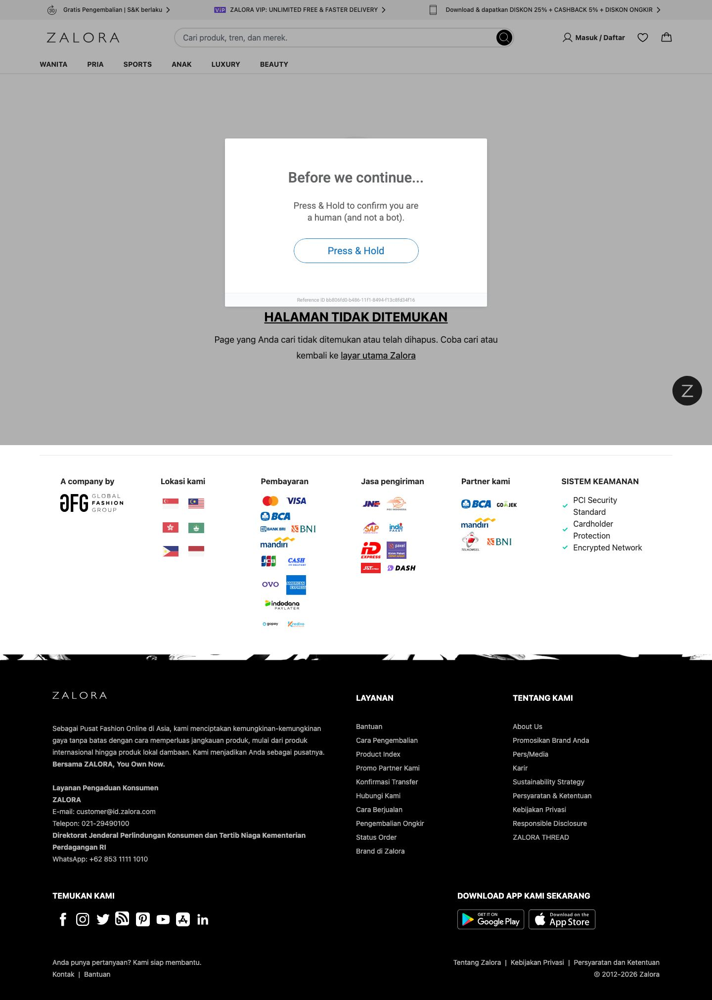

**대표 상품 이미지** (상위 6장, 출처 URL 포함)

-  — 출처 <https://static-id.zacdn.com/next-assets/static-assets/images/logo/icon_mastercard.png>
-  — 출처 <https://static-id.zacdn.com/next-assets/static-assets/images/logo/icon_visa.png>
-  — 출처 <https://static-id.zacdn.com/next-assets/static-assets/images/logo/icon_ovo.png>

**페이지 메타 정보**

| page | title | description |
|---|---|---|
| [`new_women`](https://www.zalora.co.id/wanita/new-arrivals) | Halaman tidak ditemukan | ZALORA |  |

### 4.2 일본 _( Japan )_

- 한국 수출규모 순위: **#2** · region: `asia` · tier `1` · currency `JPY`
- 수집 사이트: **5개** (성공 4)
- 메모: K-패션 선호도 높고 온라인 패션몰 발달
#### [GU Japan](https://www.gu-global.com/jp/)

- URL: <https://www.gu-global.com/jp/>
- 페이지: **OK 1 · FAIL 0**

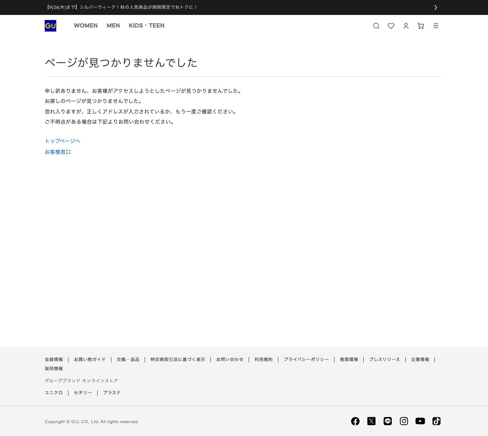

**대표 상품 이미지** (상위 6장, 출처 URL 포함)

-  — 출처 <https://image.uniqlo.com/GU/ST3/jp/imagesother/Navigation/Category-icon_V2/2026/0918/category_silver-week.png>
-  — 출처 <https://image.uniqlo.com/GU/ST3/jp/imagesother/Navigation/WOMEN_Category/2026/260724/Category_w_Pants.jpg>
-  — 출처 <https://image.uniqlo.com/GU/ST3/jp/imagesother/Navigation/WOMEN_Category/2026/260820/Category_w_skirt_361518.png>
-  — 출처 <https://image.uniqlo.com/GU/ST3/jp/imagesother/Navigation/WOMEN_Category/2026/260901/Category_w_Outer_361430.png>
-  — 출처 <https://image.uniqlo.com/GU/ST3/jp/imagesother/Navigation/WOMEN_Category/2026/260911/Category_w_tops_358739.png>
-  — 출처 <https://image.uniqlo.com/GU/ST3/jp/imagesother/Navigation/WOMEN_Category/2026/260911/Category_w_sweat_361784.png>

**페이지 메타 정보**

| page | title | description |
|---|---|---|
| [`new_arrivals`](https://www.gu-global.com/jp/ja/not-found) | 申し訳ありません、お客様がアクセスしようとしたページが見つかりませんでした。恐れ入りますが、正しくアドレスが入力されているか、もう一度ご確認ください。 | ジーユー | 申し訳ありません、お客様がアクセスしようとしたページが見つかりませんでした。恐れ入りますが、正しくアドレスが入力されているか、もう一度ご確認ください。 |

#### [Rakuten Fashion](https://brandavenue.rakuten.co.jp/)

- URL: <https://brandavenue.rakuten.co.jp/>
- 페이지: **OK 1 · FAIL 1**

**대표 상품 이미지** (상위 6장, 출처 URL 포함)

-  — 출처 <https://brandavenue.r10s.jp/img/library/index/sbn_flagshipstore_20231003.png>
- 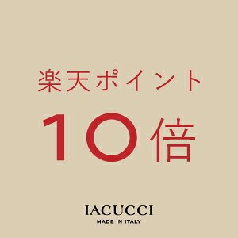 — 출처 <https://brandavenue.r10s.jp/img/news/01/397898/pc_n.jpg>
-  — 출처 <https://brandavenue.r10s.jp/img/news/01/397640/pc_n.jpg>
- 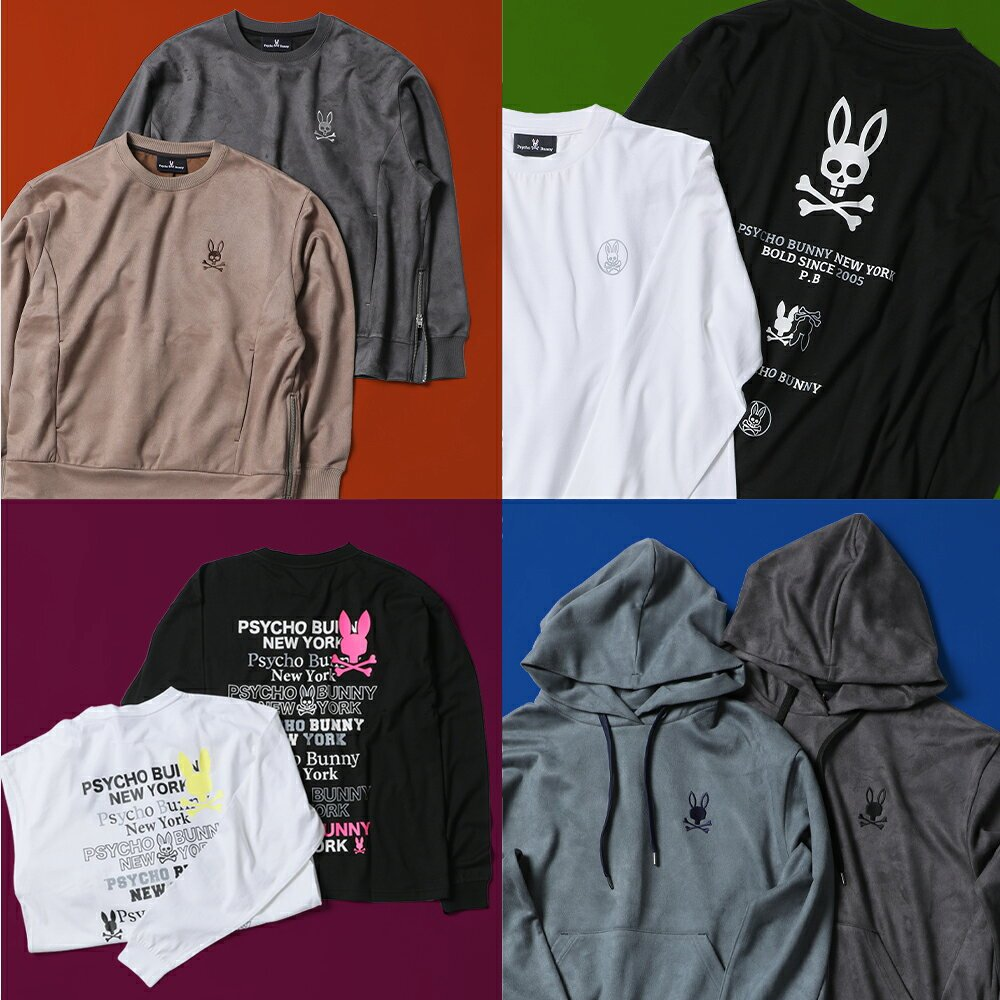 — 출처 <https://brandavenue.r10s.jp/img/news/01/398619/pc_n.jpg>
-  — 출처 <https://brandavenue.r10s.jp/img/news/01/398477/pc_n.jpg>
-  — 출처 <https://brandavenue.r10s.jp/img/news/01/398479/pc_n.jpg>

**페이지 메타 정보**

| page | title | description |
|---|---|---|
| [`men`](https://brandavenue.rakuten.co.jp/men/) | MEN | ファッション通販 Rakuten Fashion(楽天ファッション／旧楽天ブランドアベニュー) | Rakuten Fashion(楽天ファッション)は人気ブランドを取り扱うファッション通販サイトです。新作アイテム続々入荷！セール商品やクーポン対象商品も豊富。／税込3,980円以上購入で送料無料／楽天ポイントが使えて貯まる！ |

**실패 페이지**

- `women` — http_status_404

#### [Uniqlo Japan](https://www.uniqlo.com/jp/)

- URL: <https://www.uniqlo.com/jp/>
- 페이지: **OK 1 · FAIL 0**

**페이지 메타 정보**

| page | title | description |
|---|---|---|
| [`new_arrivals`](https://www.uniqlo.com/jp/ja/contents/feature/new-arrivals/) | 404 Not Found |  |

#### [WEAR](https://wear.jp/)

- URL: <https://wear.jp/>
- 페이지: **OK 1 · FAIL 0**

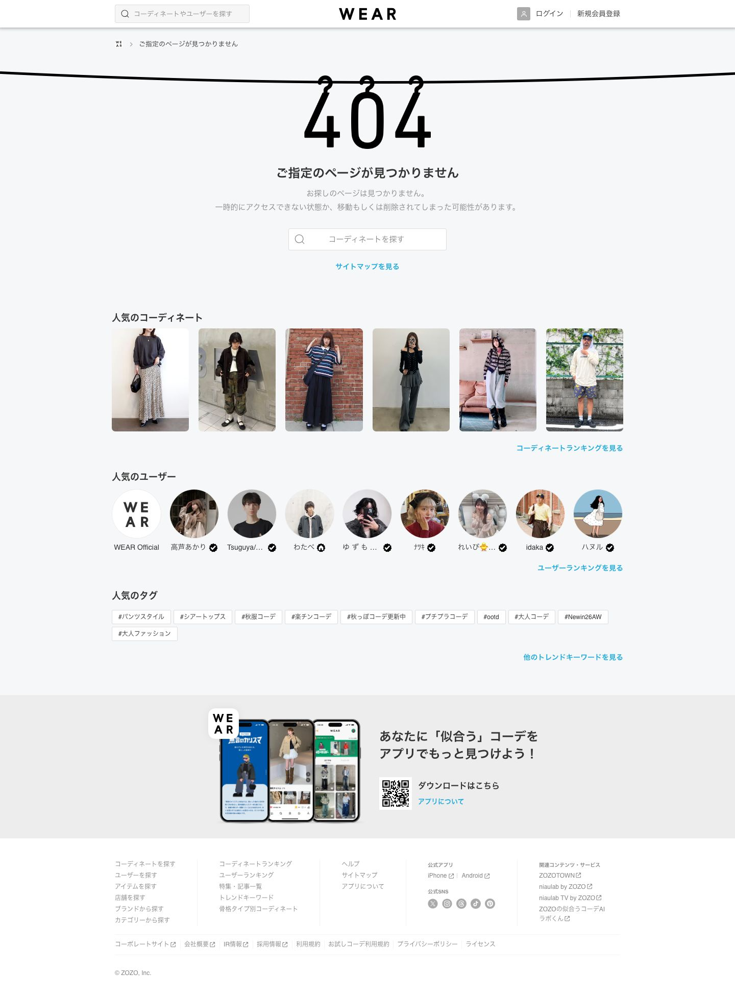

**대표 상품 이미지** (상위 6장, 출처 URL 포함)

-  — 출처 <https://wear.jp/public/_next/static/media/notfound_bg.1ywd-k_shp-hy.png>
-  — 출처 <https://wear.jp/public/_next/static/media/notfound_4.1ho27atf54bbv.png>
-  — 출처 <https://wear.jp/public/_next/static/media/notfound_0.438l9b9xjj6tm.png>
- 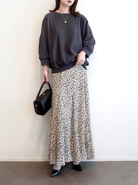 — 출처 <https://images.wear2.jp/coordinate/kAiO3P8/xrEG6C1W/1789835201_276.jpg>
-  — 출처 <https://images.wear2.jp/coordinate/qriJ3n/itDaDAaO/1789642288_276.jpg>
- 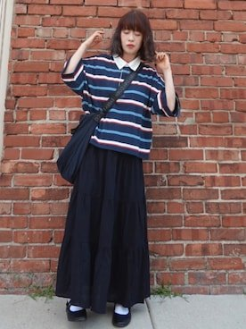 — 출처 <https://images.wear2.jp/coordinate/Grin7q0y/lML5Z0xs/1789776788_276.jpg>

**페이지 메타 정보**

| page | title | description |
|---|---|---|
| [`ranking`](https://wear.jp/ranking/coordinate/) | ご指定のページが見つかりません - WEAR | お探しのページは見つかりません。一時的にアクセスできない状態か、移動もしくは削除されてしまった可能性があります。 |

#### [ZOZOTOWN](https://zozo.jp/)

- URL: <https://zozo.jp/>
- 페이지: **OK 0 · FAIL 2**

**실패 페이지**

- `new` — playwright_error: TimeoutError: Page.goto: Timeout 30000ms exceeded.
Call log:
  - navigating to "https://zozo.jp/category/new/", waiting until "domcontentloaded"

- `ranking` — playwright_error: TimeoutError: Page.goto: Timeout 30000ms exceeded.
Call log:
  - navigating to "https://zozo.jp/ranking/", waiting until "domcontentloaded"

### 4.3 한국 _( South Korea )_

- 한국 수출규모 순위: **#30** · region: `asia` · tier `1` · currency `KRW`
- 수집 사이트: **4개** (성공 3)
- 메모: 비교 기준 (자국). 국내 사업동향 센싱
#### [29CM](https://www.29cm.co.kr/)

- URL: <https://www.29cm.co.kr/>
- 페이지: **OK 1 · FAIL 0**

**최근 유행 상품** (45건 · 상품명 클릭 시 해당 사이트로 이동)

| # | 상품명 | 브랜드 | 가격 | 페이지 |
|---:|---|---|---:|---|
| 1 | [허그 뚱냥이 바디필로우](https://product.29cm.co.kr/catalog/4122825) | 미뇽맨션 | 30,720 KRW | `home` |
| 2 | [액막이 냥태](https://product.29cm.co.kr/catalog/3931343) | 미뇽맨션 | 21,920 KRW | `home` |
| 3 | [액막이 캣 도어벨](https://product.29cm.co.kr/catalog/4085843) | 미뇽맨션 | 15,760 KRW | `home` |
| 4 | [Jeogori gift set](https://product.29cm.co.kr/catalog/3246670) | 얼스디아카이브 | 63,000 KRW | `home` |
| 5 | [New born essential gift set - PINK](https://product.29cm.co.kr/catalog/3246673) | 얼스디아카이브 | 96,000 KRW | `home` |
| 6 | [Mini cooler bag (3colors)](https://product.29cm.co.kr/catalog/4077844) | 얼스디아카이브 | 35,000 KRW | `home` |
| 7 | [나미키라 프리미엄 물결 글래스 2P 330ml](https://product.29cm.co.kr/catalog/4189890) | 하로로 | 14,400 KRW | `home` |
| 8 | [나미키라 프리미엄 물결 글래스 2P 300ml](https://product.29cm.co.kr/catalog/4189892) | 하로로 | 12,640 KRW | `home` |
| 9 | [[1+1]스텐 304 해머톤 아이스 컵 510ml+510ml](https://product.29cm.co.kr/catalog/3643741) | 하로로 | 16,720 KRW | `home` |
| 10 | [아르떼미데 달루(Dalu) 테이블 단스탠드 조명(8color)](https://product.29cm.co.kr/catalog/4041803) | 아르떼미데 | 243,000 KRW | `home` |
| 11 | [아테나 플로어 램프(블랙) ATHENA FLOOR (BLACK) 3000K](https://product.29cm.co.kr/catalog/3995326) | 아르떼미데 | 1,989,000 KRW | `home` |
| 12 | [아르떼미데 신테시(Sintesi) 단스탠드 테이블조명(4color)](https://product.29cm.co.kr/catalog/3919708) | 아르떼미데 | 585,000 KRW | `home` |
| 13 | [USM Haller Bedside Table (500/1door)_14 Colors](https://product.29cm.co.kr/catalog/3364021) | 유에스엠 | 1,773,000 KRW | `home` |
| 14 | [USM Haller Storage 2x2 (1500/4door)_14 Colors](https://product.29cm.co.kr/catalog/3400750) | 유에스엠 | 4,882,500 KRW | `home` |
| 15 | [USM Haller Storage 1x3 (750/2door)_14 Colors](https://product.29cm.co.kr/catalog/3400920) | 유에스엠 | 3,090,600 KRW | `home` |
| 16 | [몬타나 미니 셰프 나이프_레드](https://product.29cm.co.kr/catalog/2070724) | 사넬리 암브로지오 | 29,800 KRW | `home` |
| 17 | [몬타나 미니 셰프 산토쿠 나이프_블루](https://product.29cm.co.kr/catalog/2094040) | 사넬리 암브로지오 | 29,800 KRW | `home` |
| 18 | [몬타나 미니 셰프 산토쿠 나이프_퍼플](https://product.29cm.co.kr/catalog/2070734) | 사넬리 암브로지오 | 29,800 KRW | `home` |
| 19 | [비알레띠 모카 익스프레스 4컵](https://product.29cm.co.kr/catalog/2878376) | 비알레띠 | 47,920 KRW | `home` |
| 20 | [비알레띠 브리카 인덕션 4컵](https://product.29cm.co.kr/catalog/2896238) | 비알레띠 | 84,000 KRW | `home` |

**대표 상품 이미지** (상위 6장, 출처 URL 포함)

-  — 출처 <https://img.29cm.co.kr/cms/202609/11f1b33215b6956694a3bdceb7131384.png?width=3840&format=webp>
- 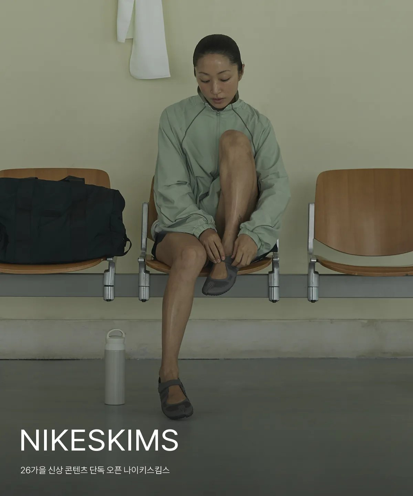 — 출처 <https://img.29cm.co.kr/cms/202609/11f1b3320c1cd9eea9b8ff8acbe455f8.png?width=3840&format=webp>
- 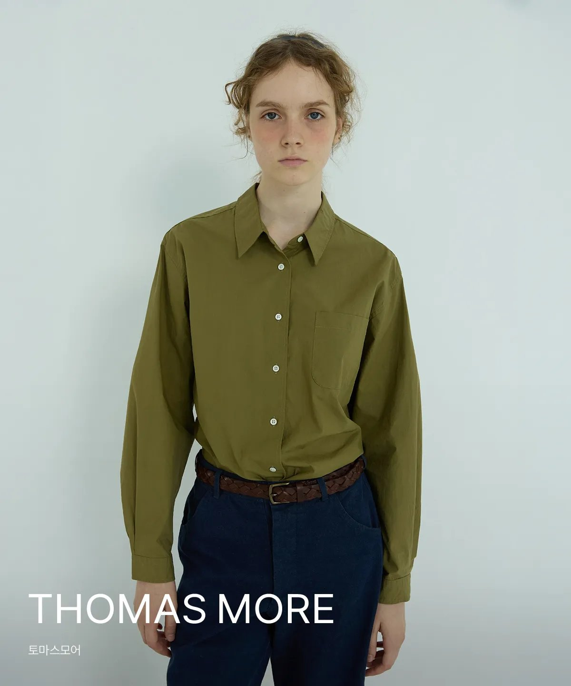 — 출처 <https://img.29cm.co.kr/cms/202609/11f1b2554170eccc94a3019958824d19.png?width=3840&format=webp>
-  — 출처 <https://img.29cm.co.kr/cms/202609/11f1b25539582bc094a3bf1e28c5e22b.png?width=3840&format=webp>
-  — 출처 <https://img.29cm.co.kr/cms/202609/11f1b255282f03cca9b8152ecb4e327b.png?width=3840&format=webp>
- 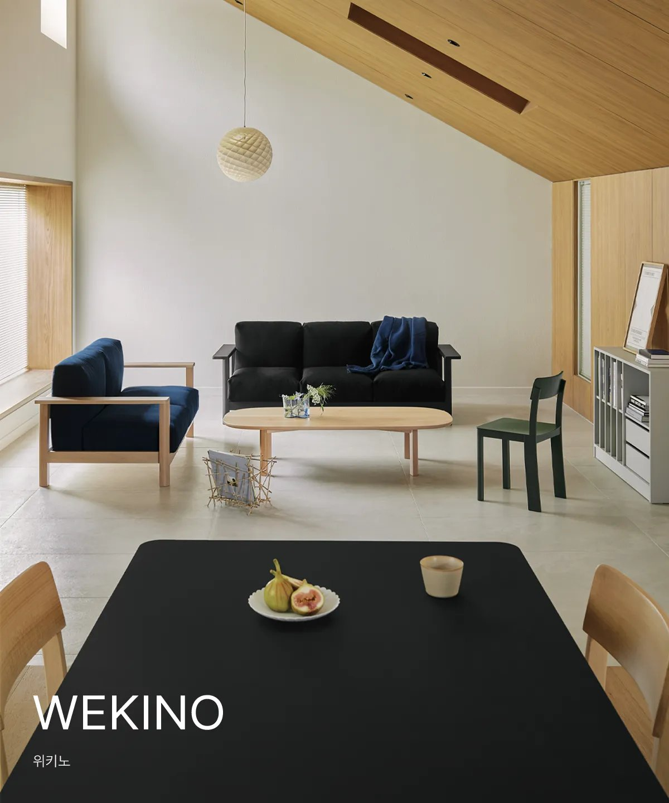 — 출처 <https://img.29cm.co.kr/cms/202609/11f1b19939b80614912703a337aaf19d.png?width=3840&format=webp>

**페이지 메타 정보**

| page | title | description |
|---|---|---|
| [`home`](https://www.29cm.co.kr/) | 감도 깊은 취향 셀렉트샵 29CM | 패션, 라이프스타일, 컬처까지 29CM만의 감도 깊은 셀렉션을 만나보세요. |

#### [Musinsa](https://www.musinsa.com/)

- URL: <https://www.musinsa.com/>
- 페이지: **OK 0 · FAIL 1**

**실패 페이지**

- `home` — robots_disallowed

#### [W Concept](https://www.wconcept.co.kr/)

- URL: <https://www.wconcept.co.kr/>
- 페이지: **OK 1 · FAIL 0**

**최근 유행 상품** (30건 · 상품명 클릭 시 해당 사이트로 이동)

| # | 상품명 | 브랜드 | 가격 | 페이지 |
|---:|---|---|---:|---|
| 1 | [빈티지 캐빈 백_black](https://m.wconcept.co.kr/Product/305715992) | 파사드패턴 | 178,000 KRW | `home` |
| 2 | [커브드 데님_vintage midnight](https://m.wconcept.co.kr/Product/306933814) | 파사드패턴 | 158,000 KRW | `home` |
| 3 | [클래식 래글런 티셔츠_3color](https://m.wconcept.co.kr/Product/306064004) | 파사드패턴 | 78,000 KRW | `home` |
| 4 | [빈티지 캐빈 백 미디엄_black](https://m.wconcept.co.kr/Product/307394597) | 파사드패턴 | 198,000 KRW | `home` |
| 5 | [파사드 실켓 코튼 삭스_7color](https://m.wconcept.co.kr/Product/303574710) | 파사드패턴 | 9,000 KRW | `home` |
| 6 | [브리즈 울 티셔츠_6color](https://m.wconcept.co.kr/Product/306064006) | 파사드패턴 | 85,000 KRW | `home` |
| 7 | [스트라이프 롱 슬리브 티셔츠_8color](https://m.wconcept.co.kr/Product/307527443) | 파사드패턴 | 78,000 KRW | `home` |
| 8 | [헨리넥 워시드 코튼 립 티셔츠_3color](https://m.wconcept.co.kr/Product/307393905) | 파사드패턴 | 68,000 KRW | `home` |
| 9 | [빈티지 캐빈 백_chocolate](https://m.wconcept.co.kr/Product/306063535) | 파사드패턴 | 178,000 KRW | `home` |
| 10 | [커브드 코튼 팬츠_olive beige](https://m.wconcept.co.kr/Product/306063505) | 파사드패턴 | 187,000 KRW | `home` |
| 11 | [디스트로이드 와이드 데님_faded wash](https://m.wconcept.co.kr/Product/308613796) | 파사드패턴 | 168,000 KRW | `home` |
| 12 | [미니멀 래글런 티셔츠_4color](https://m.wconcept.co.kr/Product/306064005) | 파사드패턴 | 78,000 KRW | `home` |
| 13 | [클래식 데님_vintage black](https://m.wconcept.co.kr/Product/301218263) | 파사드패턴 | 158,000 KRW | `home` |
| 14 | [커브드 테이퍼드 데님_faded wash](https://m.wconcept.co.kr/Product/308473766) | 파사드패턴 | 158,000 KRW | `home` |
| 15 | [빈티지 캐빈 백_red](https://m.wconcept.co.kr/Product/306063534) | 파사드패턴 | 178,000 KRW | `home` |
| 16 | [딥 브이넥 니트_black](https://m.wconcept.co.kr/Product/308306334) | 파사드패턴 | 158,000 KRW | `home` |
| 17 | [오버핏 레더 블루종_black](https://m.wconcept.co.kr/Product/303574548) | 파사드패턴 | 358,000 KRW | `home` |
| 18 | [스티브 백_black](https://m.wconcept.co.kr/Product/306063539) | 파사드패턴 | 298,000 KRW | `home` |
| 19 | [스트링 퍼티그 팬츠_khaki](https://m.wconcept.co.kr/Product/308613620) | 파사드패턴 | 178,000 KRW | `home` |
| 20 | [클래식 데님_vintage washing](https://m.wconcept.co.kr/Product/301463356) | 파사드패턴 | 158,000 KRW | `home` |

**페이지 메타 정보**

| page | title | description |
|---|---|---|
| [`home`](https://www.wconcept.co.kr/) | _(empty)_ |  |

#### [Zigzag](https://zigzag.kr/)

- URL: <https://zigzag.kr/>
- 페이지: **OK 1 · FAIL 0**

**최근 유행 상품** (36건 · 상품명 클릭 시 해당 사이트로 이동)

| # | 상품명 | 브랜드 | 가격 | 페이지 |
|---:|---|---|---:|---|
| 1 | [[가을바지🍁/50만장돌파/made] 허쉬 코튼 와이드팬츠 (숏/기본/롱)](https://store.zigzag.kr/app/catalog/products/143224732?browsing_type=NATIVE_BROWSER) | 리얼코코 | 15,210 KRW | `home` |
| 2 | [[🍁어텀세일/무료배송] made. 포트 컬러웨이 딥브이넥 니트 - 5 color](https://store.zigzag.kr/app/catalog/products/171386405?browsing_type=NATIVE_BROWSER) | 슬로우앤드 | 27,920 KRW | `home` |
| 3 | [[어텀🍂][10만장][ordinaire] 마르소 가디건 (썸머·오리지널·라이트/25color/단독주문시오늘출발)](https://store.zigzag.kr/app/catalog/products/159422845?browsing_type=NATIVE_BROWSER) | 가내스라 | 29,200 KRW | `home` |
| 4 | [[가을니트🍁/50만장돌파/made] 시오 니트 (라운드넥/브이넥)](https://store.zigzag.kr/app/catalog/products/147921597?browsing_type=NATIVE_BROWSER) | 리얼코코 | 11,840 KRW | `home` |
| 5 | [[단 3일 20%][최실장PICK][2만장판매][mlt] 카밀 비스코스 골지 라운드넥 긴소매 니트](https://store.zigzag.kr/app/catalog/products/165663917?browsing_type=NATIVE_BROWSER) | 모렌트 | 30,240 KRW | `home` |
| 6 | [[✨하객룩] made. 더블스티치 워싱셔츠 - 13 color](https://store.zigzag.kr/app/catalog/products/127356723?browsing_type=NATIVE_BROWSER) | 슬로우앤드 | 27,120 KRW | `home` |
| 7 | [[핏보정팬츠] made. 나이브 히든밴딩 세미부츠컷 팬츠 (+숏/베이직/롱ver) - 4 size](https://store.zigzag.kr/app/catalog/products/159899063?browsing_type=NATIVE_BROWSER) | 슬로우앤드 | 26,910 KRW | `home` |
| 8 | [[🍁가을/3기장선택!] made. 모먼트 투커버 올데이슬랙스 (+숏/베이직/롱ver) - 4 size](https://store.zigzag.kr/app/catalog/products/136095576?browsing_type=NATIVE_BROWSER) | 슬로우앤드 | 31,840 KRW | `home` |
| 9 | [[🏆인생부츠컷/3기장선택!] made. 세미부츠컷 찰랑슬랙스 (+숏/베이직/롱ver) - 4 size](https://store.zigzag.kr/app/catalog/products/142355088?browsing_type=NATIVE_BROWSER) | 슬로우앤드 | 25,520 KRW | `home` |
| 10 | [[가을셔츠🍂/made] 메이킹 스트라이프 셔츠 (반팔/긴팔)](https://store.zigzag.kr/app/catalog/products/141728678?browsing_type=NATIVE_BROWSER) | 리얼코코 | 13,280 KRW | `home` |
| 11 | [[🍁어텀세일/문의폭주] made. 오브 울텐셀 레이어드 티셔츠 - 3 color (무료배송)](https://store.zigzag.kr/app/catalog/products/171349199?browsing_type=NATIVE_BROWSER) | 슬로우앤드 | 26,400 KRW | `home` |
| 12 | [[가을니트🍁/브이넥&라운드넥/made] 에트 니트 (6color)](https://store.zigzag.kr/app/catalog/products/129456378?browsing_type=NATIVE_BROWSER) | 리얼코코 | 14,800 KRW | `home` |
| 13 | [[가을셔츠🤎/스트라이프&무지/10만장돌파/made] 로셀 라인 셔츠 (7color)](https://store.zigzag.kr/app/catalog/products/145426176?browsing_type=NATIVE_BROWSER) | 리얼코코 | 12,200 KRW | `home` |
| 14 | [[가을바지🍁/3단기장/made] 시그니처 논페이드 데님 팬츠 (2color)](https://store.zigzag.kr/app/catalog/products/158971418?browsing_type=NATIVE_BROWSER) | 리얼코코 | 17,950 KRW | `home` |
| 15 | [말차 딥브이니트 3color](https://store.zigzag.kr/app/catalog/products/172057993?browsing_type=NATIVE_BROWSER) | 파인땡큐 | 25,330 KRW | `home` |
| 16 | [[made/R,U넥]에센스골지티셔츠](https://store.zigzag.kr/app/catalog/products/167976864?browsing_type=NATIVE_BROWSER) | 어텀 | 12,510 KRW | `home` |
| 17 | [[MD픽] 포니 배색 나그랑 루즈핏 브이넥 니트](https://store.zigzag.kr/app/catalog/products/172051624?browsing_type=NATIVE_BROWSER) | 유라타임 | 24,830 KRW | `home` |
| 18 | [카르 울 레이어드 딥 브이넥 니트](https://store.zigzag.kr/app/catalog/products/172054953?browsing_type=NATIVE_BROWSER) | 오브뮤트 | 38,400 KRW | `home` |
| 19 | [[🥇레이어드룩1위] made. 세이 셔츠앤 레이어링 니트 (워셔블니트) - 5 color](https://store.zigzag.kr/app/catalog/products/167765387?browsing_type=NATIVE_BROWSER) | 슬로우앤드 | 36,000 KRW | `home` |
| 20 | [[🏆역대급100만장/3기장선택!] made. 마켓 와이드 트레이닝슬랙스 (+숏/베이직/롱ver) - 4 size](https://store.zigzag.kr/app/catalog/products/141360158?browsing_type=NATIVE_BROWSER) | 슬로우앤드 | 26,320 KRW | `home` |

**대표 상품 이미지** (상위 6장, 출처 URL 포함)

-  — 출처 <https://cf.image-farm.s.zigzag.kr/original/cms/2026/09/11/202609110713346336_079475.png?quality=80&format=webp&transparent=true&width=1029&height=1188>
- 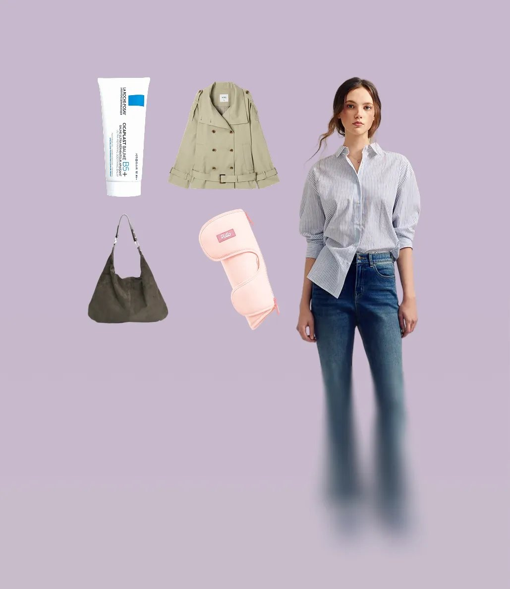 — 출처 <https://cf.image-farm.s.zigzag.kr/original/cms/2026/09/10/202609100825489437_042625.jpg?width=1029&height=1188&quality=80&format=webp&transparent=true>
- 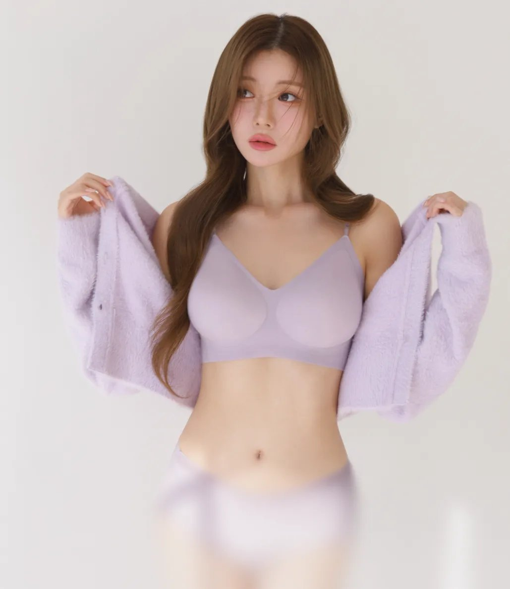 — 출처 <https://cf.image-farm.s.zigzag.kr/original/cms/2026/09/11/202609110234137975_097587.png?quality=80&format=webp&transparent=true&width=1029&height=1188>
- 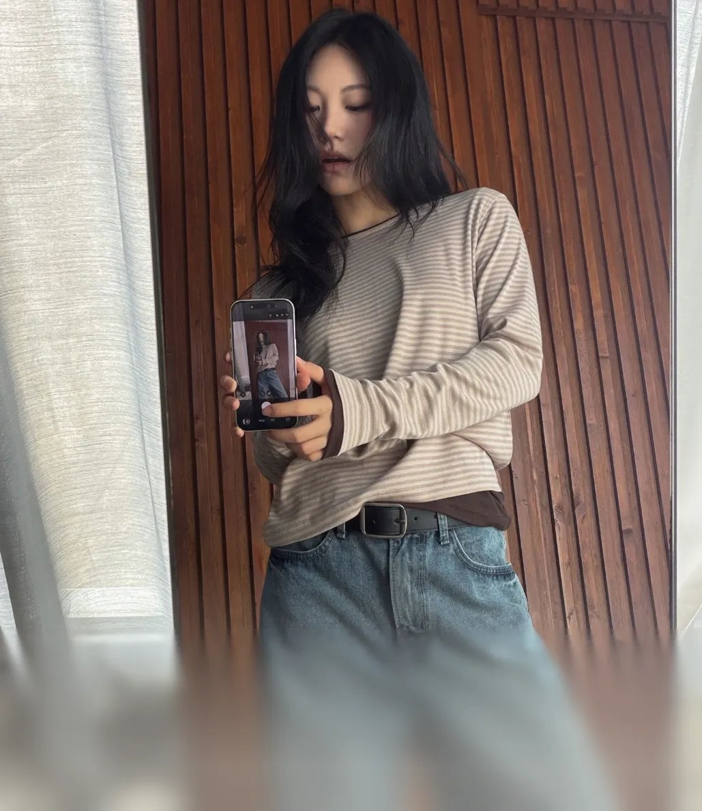 — 출처 <https://cf.image-farm.s.zigzag.kr/original/cms/2026/09/11/202609110551173384_048980.png?quality=80&format=webp&transparent=true&width=1029&height=1188>
- 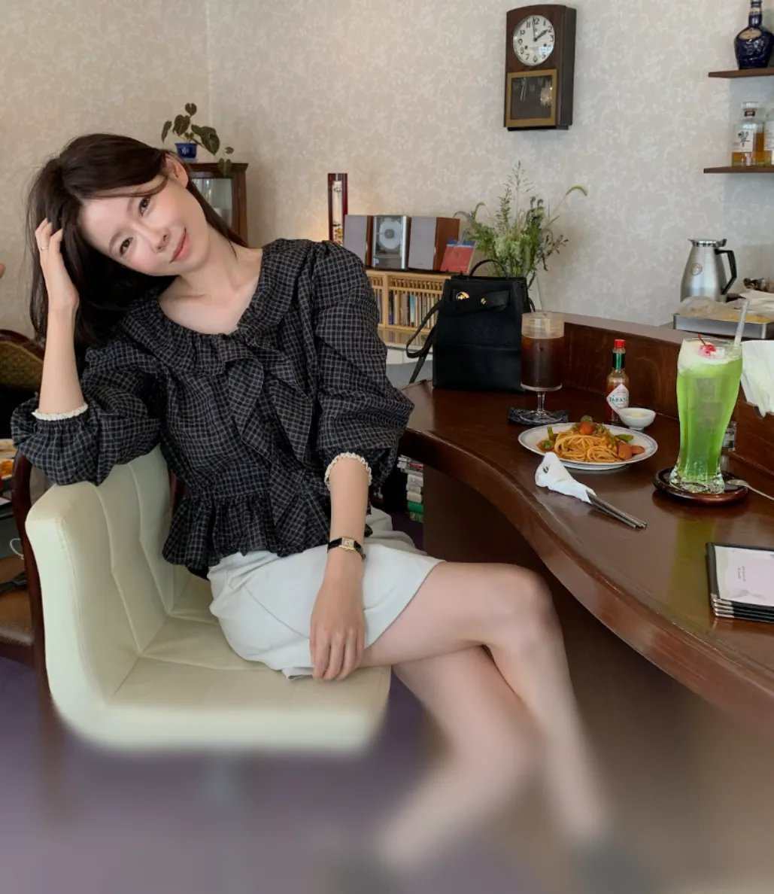 — 출처 <https://cf.image-farm.s.zigzag.kr/original/cms/2026/09/10/202609102352006010_076305.png?quality=80&format=webp&transparent=true&width=1029&height=1188>
- 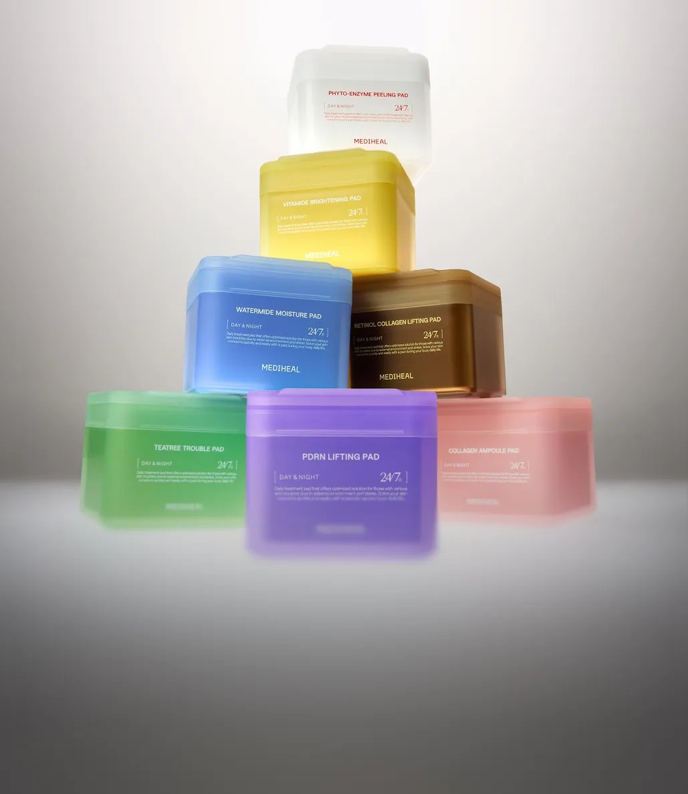 — 출처 <https://cf.image-farm.s.zigzag.kr/original/cms/2026/09/05/202609050909092551_074082.png?width=1029&height=1188&quality=80&format=webp&transparent=true>

**페이지 메타 정보**

| page | title | description |
|---|---|---|
| [`home`](https://zigzag.kr/) | 지그재그 스토어 | 4,000만 여성이 선택한 올인원 쇼핑 앱 지그재그 - 제가 알아서 살게요. |

### 4.4 대만 _( Taiwan )_

- 한국 수출규모 순위: **#7** · region: `asia` · tier `1` · currency `TWD`
- 수집 사이트: **5개** (성공 4)
- 메모: K-패션 친화도 높음
#### [momo](https://www.momoshop.com.tw/)

- URL: <https://www.momoshop.com.tw/>
- 페이지: **OK 1 · FAIL 0**

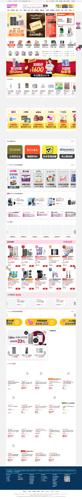

**대표 상품 이미지** (상위 6장, 출처 URL 포함)

-  — 출처 <https://img3.momoshop.com.tw/ecm/img/online/10/998/00/000/bt_0_271_01/bt_0_271_01_e2.jpg?t=1785743060613>
-  — 출처 <https://img2.momoshop.com.tw/ecm/img/online/10/998/00/000/bt_0_245_01/bt_0_245_01_P1_1_e2.png?t=1789833608081>
-  — 출처 <https://img1.momoshop.com.tw/ecm/img/online/10/998/00/000/bt_0_245_01/bt_0_245_01_P1_2_e2.png?t=1789747209601>
-  — 출처 <https://img1.momoshop.com.tw/ecm/img/online/10/998/00/000/bt_0_245_01/bt_0_245_01_P1_3_e2.png?t=1789747209601>
- 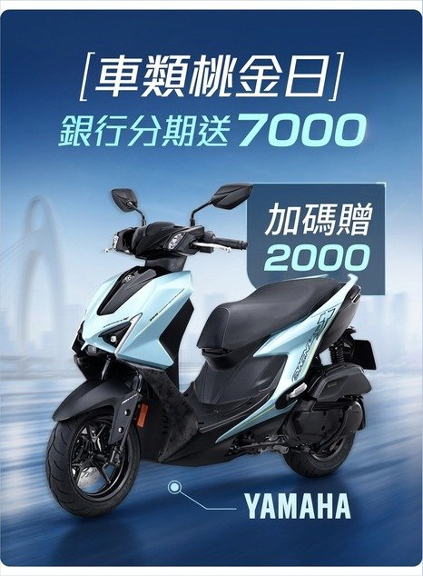 — 출처 <https://img1.momoshop.com.tw/ecm/img/online/81/998/00/000/mobile/bt_7_701_01/bt_7_701_01_e91.jpg?t=1789723580390>
- 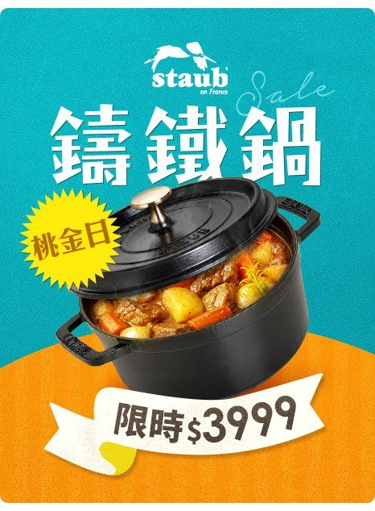 — 출처 <https://img1.momoshop.com.tw/ecm/img/online/81/998/00/000/mobile/bt_7_701_01/bt_7_701_01_e71.jpg?t=1789723580383>

**페이지 메타 정보**

| page | title | description |
|---|---|---|
| [`home`](https://www.momoshop.com.tw/main/Main.jsp) | momo購物網 - 好評推薦 - 2026年9月 | momo購物網提供美妝保養、流行服飾、時尚精品、3C、數位家電、生活用品、美食旅遊票券…等數百萬件商品。快速到貨、超商取貨讓您購物最便利。mo店+商品抵用券天天搶、免運吃到飽，電視/直播商品限時下殺，每日讓您享超低價，並享有十天猶豫期；momo購物網為富邦及台灣大哥大關係企業 |

#### [OB Design](https://www.obdesign.com.tw/)

- URL: <https://www.obdesign.com.tw/>
- 페이지: **OK 1 · FAIL 0**

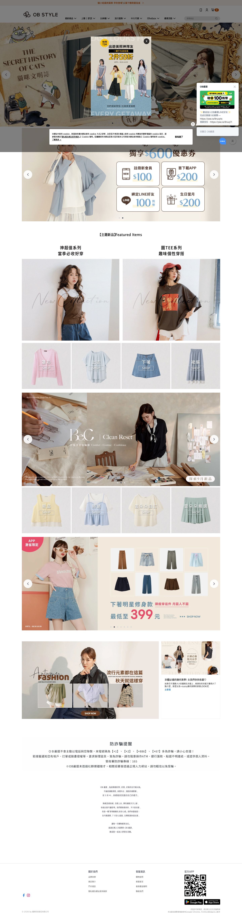

**대표 상품 이미지** (상위 6장, 출처 URL 포함)

-  — 출처 <https://cms-static.cdn.91app.com/images/original/41602/92f19e4d-89b7-4330-9570-02cf1dff9742-1789354375-p7ileh8xvh_d_1920x820_1280x547_1124x480_800x342_600x256_400x171.jpg>
- 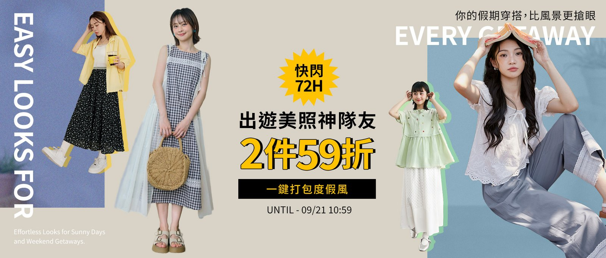 — 출처 <https://cms-static.cdn.91app.com/images/original/41602/92f19e4d-89b7-4330-9570-02cf1dff9742-1789700803-yk436pahek_d_1920x820_1280x547_1124x480_800x342_600x256_400x171.jpg>
- 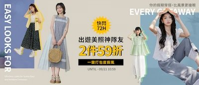 — 출처 <https://cms-static.cdn.91app.com/images/compress/41602/92f19e4d-89b7-4330-9570-02cf1dff9742-1789700803-yk436pahek_d_400x171.webp>
-  — 출처 <https://cms-static.cdn.91app.com/images/original/41602/92f19e4d-89b7-4330-9570-02cf1dff9742-1789523695-aojl08hwlx_d_1920x820_1280x547_1124x480_800x342_600x256_400x171.jpg>
-  — 출처 <https://cms-static.cdn.91app.com/images/compress/41602/92f19e4d-89b7-4330-9570-02cf1dff9742-1789523695-aojl08hwlx_d_400x171.webp>
-  — 출처 <https://cms-static.cdn.91app.com/images/original/41602/92f19e4d-89b7-4330-9570-02cf1dff9742-1789441323-w0s0fz0ca4_d_1920x820_1280x547_1124x480_800x342_600x256_400x171.jpg>

**페이지 메타 정보**

| page | title | description |
|---|---|---|
| [`home`](https://www.obdesign.com.tw/) | OB嚴選｜高CP值人氣熱銷服飾，流行服飾品牌 | 你的日常穿搭好夥伴，快上OB嚴選找，OB嚴選提供女裝、孕童、運動、男裝各項流行服飾，秉持優質服務給你高CP值的購物體驗。各種風格都能滿足熱愛穿搭的你，天天上新品，快速出貨，一起加入OB style！網路人氣服飾品牌OB嚴選 |

#### [PChome](https://24h.pchome.com.tw/)

- URL: <https://24h.pchome.com.tw/>
- 페이지: **OK 0 · FAIL 1**

**실패 페이지**

- `home` — http_status_429

#### [Pinkoi Taiwan](https://www.pinkoi.com/)

- URL: <https://www.pinkoi.com/>
- 페이지: **OK 2 · FAIL 0**

**대표 상품 이미지** (상위 6장, 출처 URL 포함)

-  — 출처 <https://cdn04.pinkoi.com/pinkoi.site/logo/og_image.png>

**페이지 메타 정보**

| page | title | description |
|---|---|---|
| [`accessories`](https://en.pinkoi.com/) | Pinkoi | Asia’s cross-border design marketplace | Design the way you are | Shop for original design products from Asia's independent designers. Pinkoi lives and breathes great design, great quality, great service, a |
| [`bags`](https://en.pinkoi.com/) | Pinkoi | Asia’s cross-border design marketplace | Design the way you are | Shop for original design products from Asia's independent designers. Pinkoi lives and breathes great design, great quality, great service, a |

#### [Yahoo Taiwan Shopping](https://tw.buy.yahoo.com/)

- URL: <https://tw.buy.yahoo.com/>
- 페이지: **OK 1 · FAIL 0**

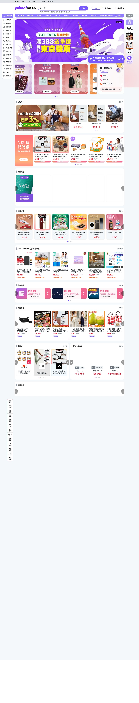

**대표 상품 이미지** (상위 6장, 출처 URL 포함)

-  — 출처 <https://img.yec.tw/zp/MerchandiseImages/E2555384C5-SP-22803821.jpg>
- 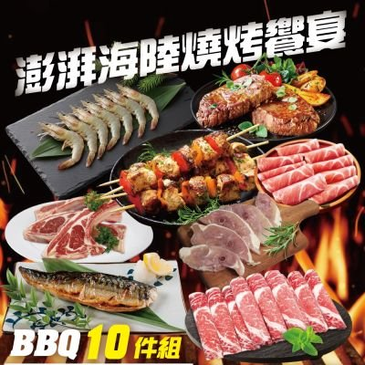 — 출처 <https://img.yec.tw/zp/MerchandiseImages/E1B3D49B32-SP-23248432.jpg>
- 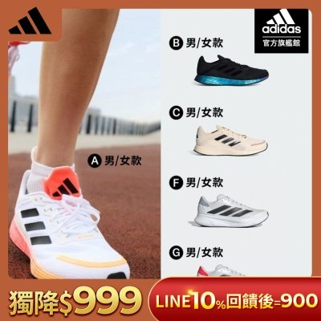 — 출처 <https://img.yec.tw/zp/MerchandiseImages/c55063bb07-Gd-12074110.jpg>

**페이지 메타 정보**

| page | title | description |
|---|---|---|
| [`home`](https://tw.buy.yahoo.com/) | Yahoo購物中心 - 最懂生活的人 | 數百萬件商品，貼心客服為您服務，15天鑑賞期購物保障！ |

### 4.5 태국 _( Thailand )_

- 한국 수출규모 순위: **#8** · region: `asia` · tier `1` · currency `THB`
- 수집 사이트: **5개** (성공 4)
- 메모: 동남아 K-패션 핵심 시장
#### [Central Online](https://www.central.co.th/)

- URL: <https://www.central.co.th/>
- 페이지: **OK 1 · FAIL 0**

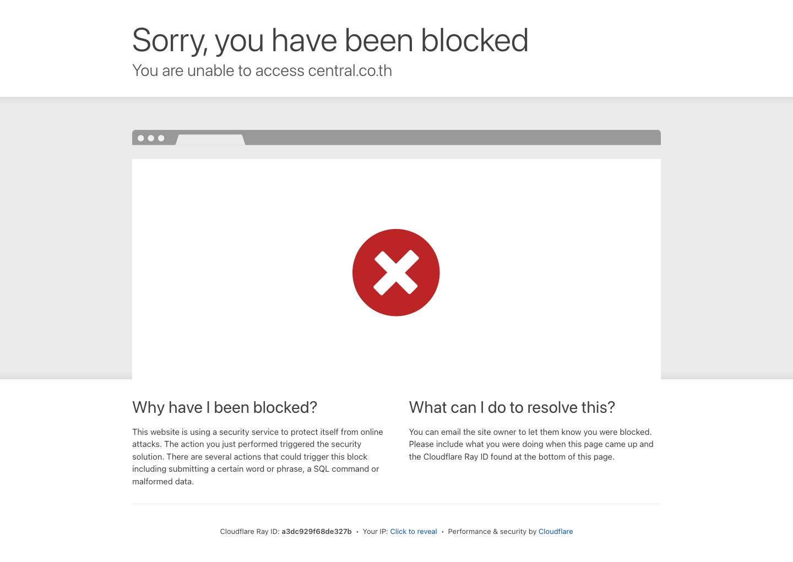

**페이지 메타 정보**

| page | title | description |
|---|---|---|
| [`home`](https://www.central.co.th/th) | Attention Required! | Cloudflare |  |

#### [Lazada Thailand Fashion](https://www.lazada.co.th/)

- URL: <https://www.lazada.co.th/>
- 페이지: **OK 1 · FAIL 0**

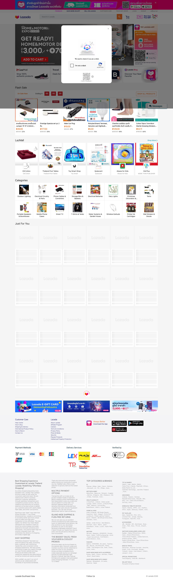

**대표 상품 이미지** (상위 6장, 출처 URL 포함)

-  — 출처 <https://img.lazcdn.com/us/domino/40845120240f19d13f738fa9a7978edd.png>
-  — 출처 <https://img.lazcdn.com/g/tps/images/ims-web/TB1KB2laMFY.1VjSZFnXXcFHXXa.png>
-  — 출처 <https://img.lazcdn.com/us/domino/ccfda069-494d-4bda-9acf-af87013c3abf_TH-1976-688.jpg_2200x2200q80.jpg>
-  — 출처 <https://img.lazcdn.com/us/domino/79f18bc6-67a0-4122-b1be-367c8bc3677e_TH-1976-688.jpg_2200x2200q80.jpg>
-  — 출처 <https://img.lazcdn.com/us/domino/2d486723-4364-479c-8ac2-e77f9244dc62_TH-1976-688.jpg_2200x2200q80.jpg>
-  — 출처 <https://img.lazcdn.com/us/domino/6882523b-8b76-456b-8f2b-39e6dbf14023_TH-1976-688.jpg_2200x2200q80.jpg>

**페이지 메타 정보**

| page | title | description |
|---|---|---|
| [`home`](https://www.lazada.co.th/#?) | Lazada Thailand | ช้อปออนไลน์ สินค้าดี พร้อมดีลพิเศษทุกวัน | พบกับ Lazada แพลตฟอร์มช้อปปิ้งชั้นนำในอาเซียน พร้อมบริการเก็บเงินปลายทาง LazMall LazFlash และดีลเด็ดจากแบรนด์ดังทุกวัน |

#### [Pomelo](https://www.pomelofashion.com/)

- URL: <https://www.pomelofashion.com/>
- 페이지: **OK 0 · FAIL 2**

**실패 페이지**

- `new` — robots_disallowed
- `best` — robots_disallowed

#### [Shopee Thailand Fashion](https://shopee.co.th/)

- URL: <https://shopee.co.th/>
- 페이지: **OK 1 · FAIL 0**

**대표 상품 이미지** (상위 6장, 출처 URL 포함)

-  — 출처 <https://deo.shopeemobile.com/shopee/shopee-pcmall-live-sg/assets/1c8bdaaf45e1fd48.png>

**페이지 메타 정보**

| page | title | description |
|---|---|---|
| [`home`](https://shopee.co.th/verify/captcha?anti_bot_tracking_id=gqRjZGVrxHSFomtptTE0MjUxOnRyYWNraW5nX2lkX2tleaJrdtEAAqRhbGdv0gAAAGSjZGVrwKJjdMRAAAAADMPc0R2hCGactn2nr9DcAFBQpHMoHjAbjrdsrt_pSEAwvu3D4ZqEQ0V0kSHM0Nn9K_1xVJ0eNyntbq4tnqpjaXBoZXJ0ZXh0xQOJAAAADI0bYyWQYu5Yo4c_YuINQ8rapGxPL6tJDC7pS2PaoaX1behIE1MFP4kJF_2vjzfbHChwophTl4Wk_hWa6LNckqfewezIfbEI3bKuOf6-SqcbssEn1FNj7YeAW2D8NppBwh8CTTFILA2n5ntCRd0QH2vxfumWnbXMChwyJOR00RacQ8syrfzwrrEbBP5OEn53buhlxYqWcegRZXX3DT-DIgZxAPFgExxgKZA0fJM5jiaoHcpXhIRcO04Qn5xqoMUgltOHxk7GC4JrRe2vqMM7gFouamP-vXT0mspRWRWFBg2e0DotPl-tUbK6-ECNRCTLWD3n-QvJY2bZUk5u0oCvJgnNjfFF-_wZ9eHmQs2eAX7XsmJGH1LeUhDBFWrGp2ReuAJbWhbx2IgstYn5yBUhMO8vg1G5LXWgkw2W5t4R8Gy4TTQq7Nca85GZ1lBxdAxAuGHLh5FciCWIMrZORijRMRLqyKWefbKSFyNyFmok24Vxk-2vQrAa6DGDUYkoicZdNyRh-Bo12xPF-WdQQeZT0Seaalq7a6aNl_ppRmdbdHcPoW6j_wXxHzvSMNLzeS8gKJsZHGGHoH6j9BPoEo8f45-FjvhHLp9MvnzIb2mFxCK-hQSosSBJh9OXjxNzzzHu3v4mptT3dY7AFKoV_EVCXDXQzWRQqiz3G_TrJKGhRHOsm0DHz5wpM2k_pJM1LRyU1JfS1M3tBmYd1pk4xoxccVckumLlzKbFiZAVzA1nT8Cx2MivLBaU1ZSHF7H6IuUk8nwjsGNjMPxmhnBGelatLk0IFBR2jel8RUyjfu6nQIW6098GEfX6XcnkAT0L5P6Kbo1dIp-gzthXxzVtIip3Bky1UW_GW7iiX_d2EZrKPvCQFq4qEY30EFWYojDVPUISUiO-oC6Tfn_6z9EHW6w2f8bN1J1ujv1f9oFPbQ-0dvg2Y72aadnhaS7fC4mSP-bAV3LmMiXiUBcloe9kGXMqcekb-sbRc3q3zTVgNIfsVAaQnBydxJUi5XI73KvT6eVyewzUvK9az0VKi81oKUlSwWBNn3Gj2otsZf29uE8YGmmD9Z9NnmjogTVFaMAhJnlEAdc2NZueRc5Xu94i2aLj8wbTrMQNEBCrXueYwuZQAxzzdoZMYTjyvLQ7PykKfXEonxFu_1vmVbvMtyrQXEV3IsPu6mUalv5bdnopqBLXN2KfF0xTWx8&app_key=FlashSale.PC&client_id=1&next=https%3A%2F%2Fshopee.co.th%2Fverify%2Ftraffic%3F%3Fclient_id%3D%26next%3Dhttps%253A%252F%252Fshopee.co.th%252F%26redirect_type%3D2%26should_replace_history%3Dfalse&redirect_type=2&scene=crawler_item&should_replace_history=false) | Shopee Thailand | ช้อปปิ้งออนไลน์ ผ่านมือถือและเว็บไซต์ | ซื้อทุกอย่างที่ Shopee! ช้อปปิ้งออนไลน์จบในที่เดียว ซื้อหรือขายก็ง่ายสุดๆ มีโปรและส่วนลดเพียบ การันตีโดย Shopee | ส่งฟรีทั่วไทย | เก็บเงินปล |

#### [Zalora Thailand](https://www.zalora.co.th/)

- URL: <https://www.zalora.co.th/>
- 페이지: **OK 1 · FAIL 0**

**대표 상품 이미지** (상위 6장, 출처 URL 포함)

-  — 출처 <https://www.zalora.co.th/images/landingpage/525x500.gif>

**페이지 메타 정보**

| page | title | description |
|---|---|---|
| [`home`](https://www.zalora.co.th/) | ZALORA - ASIA'S LEADING ONLINE FASHION DESTINATION |  |

### 4.6 미국 _( United States )_

- 한국 수출규모 순위: **#1** · region: `north_america` · tier `1` · currency `USD`
- 수집 사이트: **5개** (성공 4)
- 메모: 한국 의류 최대 수출국. 대형 이커머스와 브랜드 커머스 중심
#### [Etsy](https://www.etsy.com/)

- URL: <https://www.etsy.com/>
- 페이지: **OK 2 · FAIL 0**

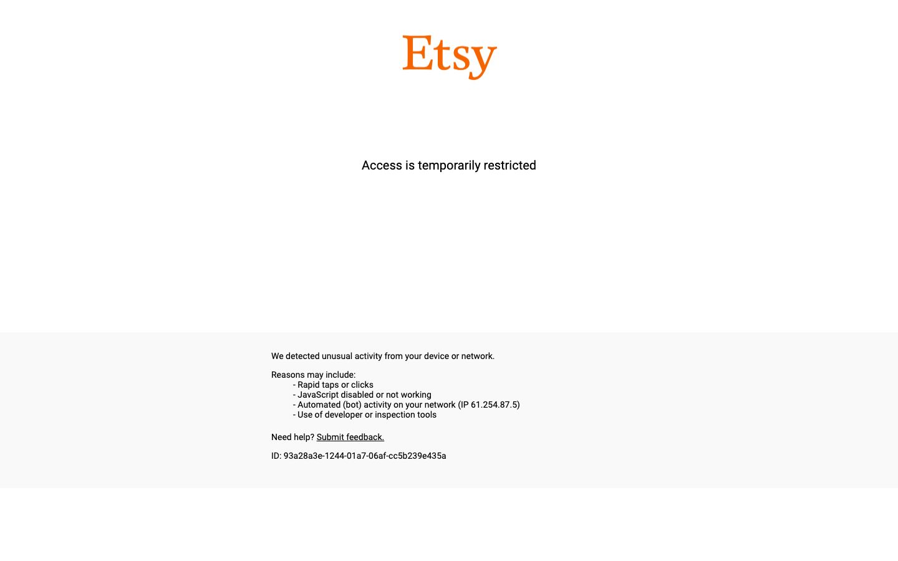

**페이지 메타 정보**

| page | title | description |
|---|---|---|
| [`trending_jewelry`](https://www.etsy.com/c/jewelry) | etsy.com |  |
| [`trending_accessories`](https://www.etsy.com/c/accessories) | etsy.com |  |

#### [Macy's](https://www.macys.com/)

- URL: <https://www.macys.com/>
- 페이지: **OK 1 · FAIL 0**

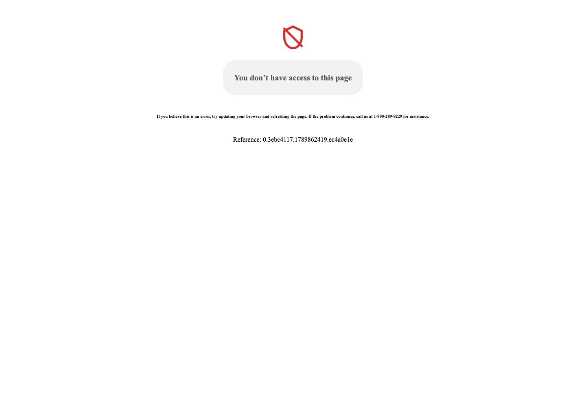

**페이지 메타 정보**

| page | title | description |
|---|---|---|
| [`new`](https://www.macys.com/shop/whats-new?id=14834) | Access Denied - Macy's | Access denied 403 |

#### [Nordstrom](https://www.nordstrom.com/)

- URL: <https://www.nordstrom.com/>
- 페이지: **OK 2 · FAIL 0**

**대표 상품 이미지** (상위 6장, 출처 URL 포함)

-  — 출처 <https://n.nordstrommedia.com/it/7f51c20a-b069-4154-9cfb-1e6d13a7c608.gif>
-  — 출처 <https://n.nordstrommedia.com/is/image/nordstrom/01_Womens-Sale_Tile_1-1_12364522-1.png?width=240&dpr=2&crop=1280%3A1600%2Coffset-x50%2Coffset-y50>
-  — 출처 <https://n.nordstrommedia.com/is/image/nordstrom/WMNS_OPC01F_0926_062_altBgd_ext_1-1.jpeg?width=240&dpr=2&crop=2312.576%3A2890.72%2Coffset-x59.295%2Coffset-y50&trim=0.047%2C0.071%2C0.36%2C0>
-  — 출처 <https://n.nordstrommedia.com/is/image/nordstrom/20_Handbags_Tile_1-1_13300122.jpeg?width=240&dpr=2&crop=1280%3A1600%2Coffset-x50%2Coffset-y50>
-  — 출처 <https://n.nordstrommedia.com/is/image/nordstrom/WSH_YC02P_0926_V1.jpeg?width=240&dpr=2&crop=5357%3A6696.25%2Coffset-x50%2Coffset-y50>
-  — 출처 <https://n.nordstrommedia.com/is/image/nordstrom/WSH_YC03F_0826_0029_altBgd_ext_1-1.jpeg?width=240&dpr=2&crop=5390.787%3A6738.484%2Coffset-x40.672%2Coffset-y50&trim=0%2C0%2C0.018%2C0>

**페이지 메타 정보**

| page | title | description |
|---|---|---|
| [`new`](https://www.nordstrom.com/browse/new) | _(empty)_ |  |
| [`women`](https://www.nordstrom.com/browse/women) | Women's Clothing, Shoes, & Accessories | Nordstrom | Find a great selection of Women's Clothing, Shoes, & Accessories at Nordstrom.com. Shop popular brands and top designers. |

#### [Revolve](https://www.revolve.com/)

- URL: <https://www.revolve.com/>
- 페이지: **OK 0 · FAIL 2**

**실패 페이지**

- `new` — playwright_error: Error: Page.goto: net::ERR_HTTP2_PROTOCOL_ERROR at https://www.revolve.com/new/br/c79f88/
Call log:
  - navigating to "https://www.revolve.com/new/br/c79f88/", waiting until "domcontentloaded"

- `trending` — playwright_error: Error: Page.goto: net::ERR_HTTP2_PROTOCOL_ERROR at https://www.revolve.com/most-loved/br/4a9ca5/
Call log:
  - navigating to "https://www.revolve.com/most-loved/br/4a9ca5/", waiting until "domcontentloaded"

#### [Urban Outfitters](https://www.urbanoutfitters.com/)

- URL: <https://www.urbanoutfitters.com/>
- 페이지: **OK 1 · FAIL 0**

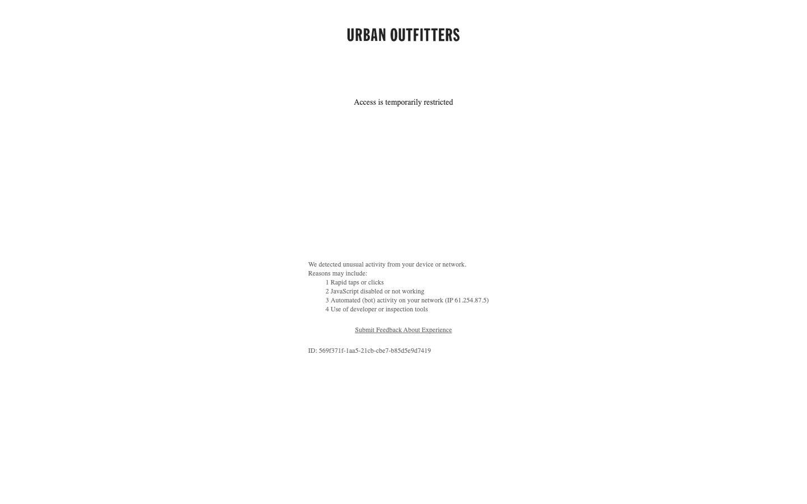

**페이지 메타 정보**

| page | title | description |
|---|---|---|
| [`new_women`](https://www.urbanoutfitters.com/womens-new-arrivals) | urbanoutfitters.com |  |

### 4.7 베트남 _( Vietnam )_

- 한국 수출규모 순위: **#4** · region: `asia` · tier `1` · currency `VND`
- 수집 사이트: **5개** (성공 5)
- 메모: 의류 생산기지/원단 수출 비중 큼. 빠르게 성장하는 이커머스
#### [Canifa](https://canifa.com/)

- URL: <https://canifa.com/>
- 페이지: **OK 1 · FAIL 0**

**대표 상품 이미지** (상위 6장, 출처 URL 포함)

-  — 출처 <https://2885371169.e.cdneverest.net/Simiconnector/BannerSlider/a/o/ao-gio_topbanner_desktop-180826.webp>
- 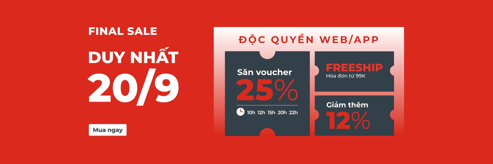 — 출처 <https://2885371169.e.cdneverest.net/Simiconnector/BannerSlider/2/0/209_topbanner_desktop-180926.webp>
-  — 출처 <https://2885371169.e.cdneverest.net/Simiconnector/BannerSlider/j/e/jeans_topbanner_desktop-110926a.webp>
-  — 출처 <https://canifa.com/_nuxt/img/chatbot-icon.c84d6ec.webp>
-  — 출처 <https://canifa.com/_nuxt/img/chat-zalo.ab5351f.webp>

**페이지 메타 정보**

| page | title | description |
|---|---|---|
| [`home`](https://canifa.com/) | CANIFA | Fashion For All | CANIFA - thương hiệu thời trang hàng đầu Việt Nam. Hàng ngàn mẫu quần áo phụ kiện nam, nữ, trẻ em cao cấp, chất lượng, an toàn liên tục được |

#### [IVY moda](https://ivymoda.com/)

- URL: <https://ivymoda.com/>
- 페이지: **OK 1 · FAIL 0**

**대표 상품 이미지** (상위 6장, 출처 URL 포함)

-  — 출처 <https://cotton4u.vn/files/news/2026/09/18/1a249b0da6bda290a0d8e8198f8a7aa1.webp>
- 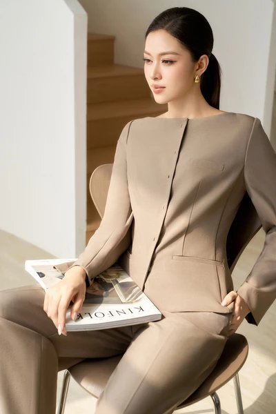 — 출처 <https://cotton4u.vn/files/product/thumab/400/2026/09/04/83f65b9f520dec4baaae7d4c23955870.webp>
- 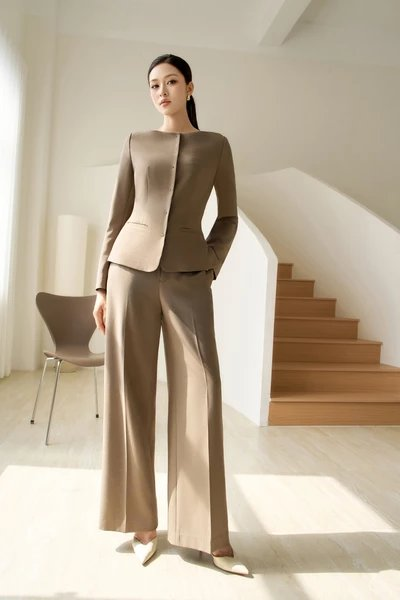 — 출처 <https://cotton4u.vn/files/product/thumab/400/2026/09/04/2a972ed5e530c54b0feaa89c5e0d03fe.webp>
-  — 출처 <https://cotton4u.vn/files/product/thumab/400/2026/09/04/d2d1ff32270bd49cc3a46396e2c64356.webp>
-  — 출처 <https://cotton4u.vn/files/product/thumab/400/2026/09/04/404cd34b6e7a21325201e266b2797aac.webp>
-  — 출처 <https://cotton4u.vn/files/product/thumab/400/2026/09/04/276fb7bcba4d8de4223eadf84797fecd.webp>

**페이지 메타 정보**

| page | title | description |
|---|---|---|
| [`home`](https://ivymoda.com/) | IVY moda - Thời Trang Công Sở Hiện Đại | IVY moda |  |

#### [Lazada Vietnam](https://www.lazada.vn/)

- URL: <https://www.lazada.vn/>
- 페이지: **OK 1 · FAIL 0**

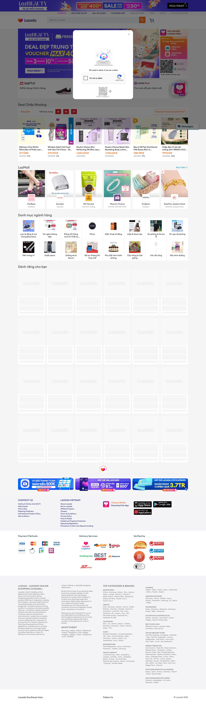

**대표 상품 이미지** (상위 6장, 출처 URL 포함)

-  — 출처 <https://img.lazcdn.com/us/domino/2ad4f22ce5a43dc145f221d13feed352.png>
-  — 출처 <https://img.lazcdn.com/g/tps/images/ims-web/TB1T7K2d8Cw3KVjSZFuXXcAOpXa.png>
-  — 출처 <https://img.lazcdn.com/us/domino/148763cd-d2bd-4903-ad02-77c858d3bf5f_VN-1976-688.jpg_2200x2200q80.jpg>
-  — 출처 <https://img.lazcdn.com/us/domino/7458c8bc-35ae-4a49-bf6b-75b2a3b577f2_VN-1976-688.jpg_2200x2200q80.jpg>
-  — 출처 <https://img.lazcdn.com/us/domino/91c6f12c-f9a5-4da5-9da4-147f8bba203a_VN-1976-688.jpg_2200x2200q80.jpg>
- 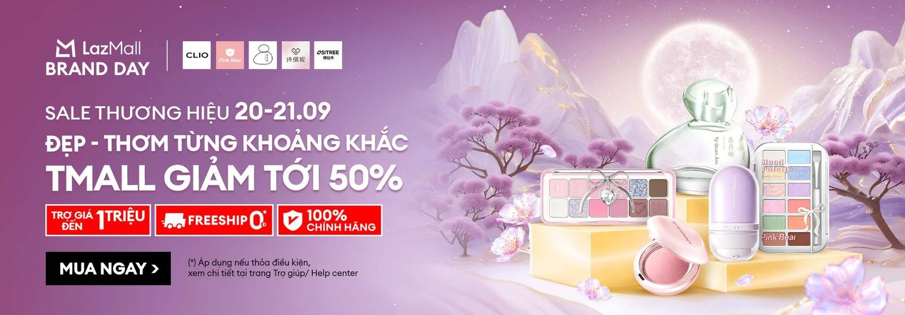 — 출처 <https://img.lazcdn.com/us/domino/49184f7e-546a-4286-b1f6-96b2d3e6881d_VN-1976-688.jpg_2200x2200q80.jpg>

**페이지 메타 정보**

| page | title | description |
|---|---|---|
| [`home`](https://www.lazada.vn/#?) | Lazada Việt Nam | Mua Sắm Online, Giá Tốt Nhất Mỗi Ngày | Mua sắm đồ điện tử, thời trang, làm đẹp và đồ chơi giá cả phải chăng. Đảm bảo sản phẩm chính hãng và trải nghiệm mua sắm tiện lợi – mua ngay |

#### [Shopee Vietnam](https://shopee.vn/)

- URL: <https://shopee.vn/>
- 페이지: **OK 1 · FAIL 0**

**페이지 메타 정보**

| page | title | description |
|---|---|---|
| [`home`](https://shopee.vn/verify/captcha?anti_bot_tracking_id=gqRjZGVrxHSFomtptTE0MjUxOnRyYWNraW5nX2lkX2tleaJrdtEAAqRhbGdv0gAAAGSjZGVrwKJjdMRAAAAADMPc0R2hCGactn2nr9DcAFBQpHMoHjAbjrdsrt_pSEAwvu3D4ZqEQ0V0kSHM0Nn9K_1xVJ0eNyntbq4tnqpjaXBoZXJ0ZXh0xQOGAAAADFJG0KMpW0e5AMLZ6NlL6FFX-9J4-fpc8eodan9YK8OFpKehqnEPPJY3b27zSWeE8Ybs4pC3UHA_eI-_XHwaN4tEWXWjsWMW7qzBX6dARTp5F3TJ0sZ4jeBnJ9eA5B9ZshlmMnSS2nC1tbguyFoZz90QD4iAf1dXDJaO67dy5FcFTpeDA9xYElKrgBHj4cjtyt1SlVx13CPR-J57Gf-6aUCRpkx7ZcK9vAAJTNRtgOyKrEebrdaUc1a26I7f9qLirmnosqZ7O4rBOy18bk6qjPU8p5MRnhSua8Tjq6XhTtZAibXpZiK8UuFvdx5bxGUzo_1nf1z8pbjgprrMVb3AUI4VV9FSwi88ZZ82BUGjnz10K2-iH0aZ0Kw_mG2pnoHDU7W_SNzsXKC9Z_dKWfGETp4M5qGRQkgUts_0vEbZog1hIFu-VR_fUnT7aauTmD3FuGl5HPYYeWXZjZ7xc4Z0Hvw1_vxjMhvNvs3xWeA8h-xf1Tt4GAbwsLOs_bgwEvSQA-LDvj4kTNo2rl0CM48fYZVx6R_4NQanetxXPFuuw_JxqGX22A-7KcQ-iFdXcgYmLzHEECGcm2mq8Y6Pf_Y_oJukCZMx1g505MjAAE2BfFzTOeIhtvxkAs8I3yXNfy4CIjIw9KdkzMc0ZjkP8g_DXjSQH2EMiU1StxbR95zmVxMjbvFZEZO_Fw3foqcaGPFRQnpnT_dzyt_he2uW2cgQhz1UVRw1uMv4UGzrptj3RhwC258TvM882V28YnUo_PoMOTxuLyap54IOEi0gcKlBOA74dik9fUDZ58sjggCxXC-tdX8SfmV08T294H9u9rk5ov-7MijFsfl7lCMQEeTuU0rvT-0yGaLDkSgoaiMwqCdXlO1d3HlmsEPD7jrtqbtnGrSHc1qV6mfyxlheiRhz3AUHxm-f4Un4zHVO8vk_tlifanCWBUzUjnhz9JAqFGSPL1gKvducH3dqSs8zMy0FXK0JGpi8ULd2pj0Mt6zh_jZ7lQ6eQrOXDDltHDITVkkcvlm_tPk8hwbf2u4s7kD12N5vb5ILHpyY_6TSlKnZb693tZsyk7b9JPsxCLoD73yAVhw1RkTPabwD7MXisDTeB2HlFb-h5gDFA4du6jPcmpONJD8DA6GqEprFl8_rzY7-N0-y84vcOEbYw08TJW-43RAtO1RBzdNQMz7-_LNRKD8yMnM&app_key=FlashSale.PC&client_id=1&next=https%3A%2F%2Fshopee.vn%2Fverify%2Ftraffic%3F%3Fclient_id%3D%26next%3Dhttps%253A%252F%252Fshopee.vn%252F%26redirect_type%3D2%26should_replace_history%3Dfalse&redirect_type=2&scene=crawler_item&should_replace_history=false) | Shopee Việt Nam | Mua Sắm Online | Mua sắm trực tuyến hàng triệu sản phẩm ở tất cả ngành hàng. Giá tốt & Miễn phí vận chuyển. Mua và bán online trong 30 giây. Voucher Xtra | F |

#### [Tiki](https://tiki.vn/)

- URL: <https://tiki.vn/>
- 페이지: **OK 1 · FAIL 0**

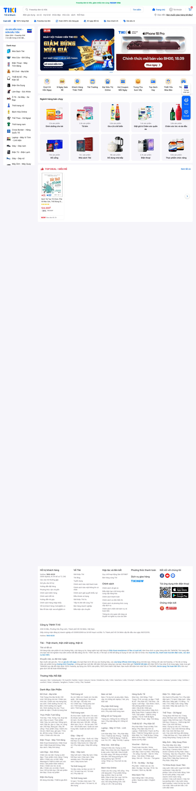

**대표 상품 이미지** (상위 6장, 출처 URL 포함)

-  — 출처 <https://salt.tikicdn.com/cache/100x100/ts/category/ed/20/60/afa9b3b474bf7ad70f10dd6443211d5f.png>
-  — 출처 <https://salt.tikicdn.com/cache/100x100/ts/category/f6/22/46/7e2185d2cf1bca72d5aeac385a865b2b.png>
-  — 출처 <https://salt.tikicdn.com/cache/100x100/ts/category/54/c0/ff/fe98a4afa2d3e5142dc8096addc4e40b.png>
-  — 출처 <https://salt.tikicdn.com/cache/100x100/ts/category/13/64/43/226301adcc7660ffcf44a61bb6df99b7.png>
-  — 출처 <https://salt.tikicdn.com/cache/100x100/ts/category/75/34/29/78e428fdd90408587181005f5cc3de32.png>
-  — 출처 <https://salt.tikicdn.com/cache/100x100/ts/category/61/d4/ea/e6ea3ffc1fcde3b6224d2bb691ea16a2.png>

**페이지 메타 정보**

| page | title | description |
|---|---|---|
| [`home`](https://tiki.vn/) | Tiki - Mua hàng online giá tốt, hàng chuẩn, ship nhanh | Tiện lợi mua sắm hàng triệu mặt hàng, dịch vụ. Vô vàn ưu đãi freeship, mã giảm giá. Hoàn tiền 15% tối đa 600k/tháng với thẻ tín dụng TikiCAR |

## 5. 의류 카테고리별 글로벌 트렌드

| # | 카테고리 | 건수 | 대표 상품명 |
|---:|---|---:|---|
| 1 | `셔츠` | 19 | 클래식 래글런 티셔츠_3color · 브리즈 울 티셔츠_6color · 스트라이프 롱 슬리브 티셔츠_8color |
| 2 | `니트` | 11 | 딥 브이넥 니트_black · 캐시미어 딥 브이넥 니트_sage olive · [🍁어텀세일/무료배송] made. 포트 컬러웨이 딥브이넥 니트 - 5 color |
| 3 | `팬츠` | 9 | 커브드 코튼 팬츠_olive beige · 스트링 퍼티그 팬츠_khaki · 커브드 코튼 팬츠_dark brown |
| 4 | `데님` | 8 | 커브드 데님_vintage midnight · 디스트로이드 와이드 데님_faded wash · 클래식 데님_vintage black |
| 5 | `슬랙스` | 3 | [🍁가을/3기장선택!] made. 모먼트 투커버 올데이슬랙스 (+숏/베이직/롱ver) - 4 size · [🏆인생부츠컷/3기장선택!] made. 세미부츠컷 찰랑슬랙스 (+숏/베이직/롱ver) - 4 size · [🏆역대급100만장/3기장선택!] made. 마켓 와이드 트레이닝슬랙스 (+숏/베이직/롱ver) - 4 size |
| 6 | `dress` | 1 | SMOCKED COLLAR MINI DRESS (WHITE) |
| 7 | `blouse` | 1 | GATHERED FLORAL BLOUSE (FLORAL) |
| 8 | `cardigan` | 1 | WAVE BUTTON CARDIGAN (GREY) |
| 9 | `가디건` | 1 | [어텀🍂][10만장][ordinaire] 마르소 가디건 (썸머·오리지널·라이트/25color/단독주문시오늘출발) |
| 10 | `jacket` | 1 | nuos tweed jacket (2color) 순차발송 |

**국가별 의류 TOP**

- **korea**: `셔츠`(19), `니트`(11), `팬츠`(9), `데님`(8), `슬랙스`(3)
## 6. 악세사리 카테고리별 글로벌 트렌드

| # | 카테고리 | 건수 | 대표 상품명 |
|---:|---|---:|---|
| 1 | `bag` | 1 | Mini cooler bag (3colors) |

**국가별 악세사리 TOP**

- **korea**: `bag`(1)
## 7. 국가별 가격대 비교

| 국가 | 통화 | 표본 | min | p25 | median | p75 | max | median (USD) |
|---|---|---:|---:|---:|---:|---:|---:|---:|
| korea | KRW | 111 | 4240 | 26360 | 46320 | 158000 | 4882500 | 33.4 |

> p25/p75 는 IQR 기준 분위수. USD 환산은 `config/exchange_rates.yaml` 기준 (운영자가 정기 갱신).

## 8. 국내 의류·악세사리 사업동향

### KITA K-stat

- 한국무역통계의 국가 수출입 통계 총괄 페이지입니다.
- 사이트: <https://stat.kita.net/stat/kts/ctr/CtrTotalImpExpList.screen>

| # | topic | title | url |
|---:|---|---|---|
| 1 | `trade` | KITA.NET | <https://www.kita.net/> |
| 2 | `trade` | K-stat 란? | <https://www.kita.net/pdf/statGuide/index.html#p=1> |
| 3 | `무역통계` | 무역통계 분류 | <https://stat.kita.net/stat/guide/guide_18_01.screen> |
| 4 | `trade` | 한국품목코드 | <https://stat.kita.net/stat/kts/statCode/ItemHierCodeList.screen> |
| 5 | `trade` | 해외품목코드 | <https://stat.kita.net/stat/istat/common/IstatHSCode.screen> |
| 6 | `trade` | 대륙/경제코드 | <https://stat.kita.net/stat/kts/statCode/ConEcoCodeList.screen> |
| 7 | `trade` | 수출입 총괄 | <https://stat.kita.net/stat/kts/sum/SumImpExpTotalList.screen> |
| 8 | `trade` | 가공단계 수출입 | <https://stat.kita.net/stat/kts/use/BecList.screen> |
| 9 | `trade` | 품목 수출입 | <https://stat.kita.net/stat/kts/pum/ItemImpExpList.screen> |
| 10 | `trade` | 국가 수출입 | <https://stat.kita.net/stat/kts/ctr/CtrTotalImpExpList.screen> |
| 11 | `trade` | 대륙/경제권 수출입 | <https://stat.kita.net/stat/kts/rel/RelColligationList.screen> |
| 12 | `trade` | 지자체 수출입 | <https://stat.kita.net/stat/kts/prod/ProdWholeList.screen> |
| 13 | `trade` | 항구/공항 수출입 | <https://stat.kita.net/stat/kts/port/PortImpExpList.screen> |
| 14 | `trade` | FTA체결국 수출입 | <https://stat.kita.net/stat/kts/fta/FtaCtrImpExpList.screen> |
| 15 | `trade` | 간접수출 현황 | <https://stat.kita.net/stat/ind/KtsIndMain.screen> |

### Korea Customs Service

- 수출입 현황, 물류통계 등 관세청 무역통계정보를 종합적으로 제공
- 사이트: <https://tradedata.go.kr/cts/index_eng.do>

| # | topic | title | url |
|---:|---|---|---|
| 1 | `trade` | Korea Customs Service | <http://customs.go.kr/english/main.do> |

### KOSIS

- 코시스, 국가데이터처가 제공하는 원스톱 통계 서비스, 국가승인통계, 국제통계, 북한통계, e-지방지표, 통계시각화콘텐츠, 온라인간행물 등 제공
- 사이트: <https://kosis.kr/statisticsList/statisticsListIndex.do?parmTabId=M_01_01&vwcd=MT_ZTITLE&menuId=M_01_01&outLink=Y&entrType=>

| # | topic | title | url |
|---:|---|---|---|
| 1 | `statistics` | 쉽게 보는 통계 | <http://kosis.kr/easyViewStatis/customStatisIndex.do?vwcd=MT_TM1_TITLE&menuId=M_03_01> |
| 2 | `statistics` | 이슈별 접근 | <http://kosis.kr/easyViewStatis/customStatisIndex.do?vwcd=MT_TM2_TITLE&menuId=M_03_02> |
| 3 | `statistics` | 통계시각화콘텐츠 | <http://kosis.kr/easyViewStatis/visualizationIndex.do> |
| 4 | `statistics` | 온라인간행물 | <http://kosis.kr/publication/publicationThema.do> |
| 5 | `statistics` | 기획간행물 | <http://kosis.kr/publication/publicationStat.do> |
| 6 | `statistics` | KOSIS 길라잡이 | <http://kosis.kr/civilComplaint/kosisGuideIndex.do> |
| 7 | `statistics` | 홈페이지 개선의견 | <http://kosis.kr/civilComplaint/siteRequestList.do> |
| 8 | `statistics` | 찾아가는 KOSIS | <http://kosis.kr/civilComplaint/kosisEduIndex.do> |
| 9 | `statistics` | 서비스 소개 | <http://kosis.kr/serviceInfo/kosisIntroduce.do> |
| 10 | `statistics` | 국가통계현황 | <http://kosis.kr/serviceInfo/statisInstitution.do> |
| 11 | `statistics` | 국가통계 공표일정 | <http://kosis.kr/serviceInfo/statisPublicationList.do> |
| 12 | `statistics` | 팩트체크 서비스 | <http://kosis.kr/serviceInfo/factCheckList.do> |
| 13 | `statistics` | 서비스정책 | <http://kosis.kr/serviceInfo/useGuide.do> |
| 14 | `statistics` | 공유서비스 (OpenAPI) | <http://kosis.kr/serviceInfo/openAPIGuide.do> |
| 15 | `statistics` | English | <https://kosis.kr/eng> |

### KOTRA

- 트라이빅(TriBig)은 코트라(KOTRA)가 제공하는 무역투자 빅데이터 플랫폼으로 무역투자통계, 국가별 시장정보, 품목별 유망시장, 기업별 맞춤정보, 해외바이어 정보의 서비스를 제공합니다.
- 사이트: <https://www.kotra.or.kr/bigdata/visualization/korea#search/ALL/ALL/2024>

| # | topic | title | url |
|---:|---|---|---|
| 1 | `trade` | kotra 무역투자24 | <https://www.kotra.or.kr/bigdata/kotraSsoRedirect?targetURL=https://www.kotra.or.kr> |
| 2 | `trade` | 해외비즈니스 정보 포털 | <https://www.kotra.or.kr/bigdata/kotraSsoRedirect?targetURL=https://dream.kotra.or.kr/dream> |
| 3 | `trade` | 글로벌 전시포털 | <https://www.kotra.or.kr/bigdata/kotraSsoRedirect?targetURL=https://www.gep.or.kr/> |
| 4 | `trade` | KOTRA 해외인재유치센터 | <https://www.kotra.or.kr/gtc_kor> |
| 5 | `trade` | 투자유치정보제공 | <https://www.kotra.or.kr/bigdata/kotraSsoRedirect?targetURL=https://www.investkorea.org/> |
| 6 | `수출지원` | 수출지원 온라인 플랫폼 | <https://www.kotra.or.kr/bigdata/kotraSsoRedirect?targetURL=https://www.buykorea.or.kr/> |
| 7 | `trade` | 빅데이터 서비스 | <https://www.kotra.or.kr/bigdata/> |
| 8 | `trade` | 경제외교 활용포털 | <https://www.kotra.or.kr/bigdata/kotraSsoRedirect?targetURL=https://president.globalwindow.org> |
| 9 | `trade` | 방산물자교역지원센터 | <https://www.kotra.or.kr/bigdata/kotraSsoRedirect?targetURL=https://www.kotra.or.kr/kodits> |
| 10 | `trade` | 외투기업고충처리 | <https://www.kotra.or.kr/bigdata/kotraSsoRedirect?targetURL=https://ombudsman.kotra.or.kr/ob-kr> |
| 11 | `trade` | 수출바우처 · 지사화 | <https://www.exportvoucher.com> |
| 12 | `trade` | 무역투자통계 | <https://www.kotra.or.kr/bigdata/visualization/korea> |
| 13 | `trade` | 국가별 시장정보 | <https://www.kotra.or.kr/bigdata/marketAnalysis> |
| 14 | `trade` | 품목별 유망시장 | <https://www.kotra.or.kr/bigdata/bhrcMarket> |
| 15 | `trade` | 해외바이어 정보 | <https://www.kotra.or.kr/bigdata/partner/search> |

### Statistics Korea Online Shopping

- 국가데이터처,List | 전체 | 보도자료 | 새소식
- 사이트: <https://mods.go.kr/board.es?mid=a10301010000&bid=11789>

| # | topic | title | url |
|---:|---|---|---|
| 1 | `statistics` | 정보공개제도 | <https://mods.go.kr/menu.es?mid=a10101010100> |
| 2 | `statistics` | 정보공개청구 | <https://www.open.go.kr/com/main/mainView.do> |
| 3 | `statistics` | 비공개대상정보세부기준 | <https://mods.go.kr/menu.es?mid=a10101030000> |
| 4 | `statistics` | 고객수요분석 | <https://mods.go.kr/menu.es?mid=a10101040000> |
| 5 | `statistics` | 사전정보공표 | <https://mods.go.kr/menu.es?mid=a10103010000> |
| 6 | `statistics` | 사전정보공표목록 | <https://mods.go.kr/menu.es?mid=a10103010100> |
| 7 | `statistics` | 핵심단어목록 | <https://mods.go.kr/menu.es?mid=a10103020100> |
| 8 | `statistics` | 인기정보TOP10 | <https://mods.go.kr/menu.es?mid=a10103030100> |
| 9 | `statistics` | 행정자료실 | <https://mods.go.kr/menu.es?mid=a10104010000> |
| 10 | `statistics` | 업무추진비 | <https://mods.go.kr/menu.es?mid=a10104010100> |
| 11 | `statistics` | 국회관련정보 | <https://mods.go.kr/menu.es?mid=a10104040000> |
| 12 | `statistics` | 정책실명제 | <https://mods.go.kr/menu.es?mid=a10105010000> |
| 13 | `statistics` | 연도별대상사업현황 | <https://mods.go.kr/menu.es?mid=a10105020000> |
| 14 | `statistics` | 중점관리대상사업 | <https://mods.go.kr/menu.es?mid=a10105030600> |
| 15 | `statistics` | 국민신청실명제 | <https://mods.go.kr/menu.es?mid=a10105040000> |

### 기업마당

- 기업마당>정책정보>지원사업 공고
- 사이트: <https://www.bizinfo.go.kr/sii/siia/selectSIIA200View.do?null>

| # | topic | title | url |
|---:|---|---|---|
| 1 | `policy` | 지원사업 공고 | <https://www.bizinfo.go.kr/sii/siia/selectSIIA200View.do> |
| 2 | `policy` | 품목별 법정의무 인증제도 | <https://www.bizinfo.go.kr/biz/biza/selectBIZA100View.do> |
| 3 | `policy` | 입법·행정예고/고시 | <https://www.bizinfo.go.kr/biz/biza/selectBIZA300View.do> |
| 4 | `policy` | 월간 중기누리 | <https://www.bizinfo.go.kr/biz/biza/selectBIZA400View.do> |
| 5 | `policy` | 기업업무용 서식 | <https://www.bizinfo.go.kr/biz/bizb/selectBIZB100View.do> |
| 6 | `policy` | 입주기업 모집공고 | <https://www.bizinfo.go.kr/biz/bizb/selectBIZB200View.do> |
| 7 | `policy` | 온라인화상회의실 | <https://www.k-startup.go.kr/web/contents/webOLNIVIDEOMTRM.do> |
| 8 | `policy` | 정책정보 개방 | <https://www.bizinfo.go.kr/apiList.do> |
| 9 | `policy` | 속보성 대시보드 | <https://www.bizinfo.go.kr/dashboard.do> |
| 10 | `policy` | 고객의 소리 | <https://www.bizinfo.go.kr/biz/bizc/selectBIZC200Regist.do> |
| 11 | `policy` | 자주하는질문 | <https://www.bizinfo.go.kr/biz/bizc/selectBIZC300View.do> |
| 12 | `policy` | 이메일주소 무단 수집 거부안내 | <https://www.bizinfo.go.kr/biz/bizd/selectBIZD110View.do> |
| 13 | `policy` | 저작권 정책 | <https://www.bizinfo.go.kr/biz/bizd/selectBIZD120View.do> |
| 14 | `policy` | 웹접근성 정책 | <https://www.bizinfo.go.kr/biz/bizd/selectBIZD130View.do> |
| 15 | `policy` | 전체메뉴보기 | <https://www.bizinfo.go.kr/sitemap/intro.do> |

### 서울경제진흥원

- 서울경제진흥원 에러페이지
- 사이트: <https://www.sba.seoul.kr/Pages/error_404.html?aspxerrorpath=/Pages/NSub06_01.aspx>

### 소상공인24

- 소상공인24
- 사이트: <https://www.sbiz24.kr/#/pbanc>

### 중소벤처기업부

- 중소기업중앙회 등 기관 중소기업 조사, 통계 DB화 검색, 내려받기 등 제공.
- 사이트: <https://www.mss.go.kr/site/smba/ex/bbs/List.do?cbIdx=86>

| # | topic | title | url |
|---:|---|---|---|
| 1 | `policy` | 어린이 누리집 | <https://www.mss.go.kr/site/kids/main.do> |
| 2 | `policy` | English | <https://www.mss.go.kr/site/eng/main.do> |
| 3 | `policy` | 누리집 안내지도 | <https://www.mss.go.kr/site/smba/ex/siteMap/siteMap.do> |
| 4 | `policy` | 훈령/예규/고시/공고 | <https://www.mss.go.kr/site/smba/ex/bbs/List.do?cbIdx=125&ext6=Y> |
| 5 | `policy` | 입법/행정예고 | <https://www.mss.go.kr/site/smba/ex/bbs/List.do?cbIdx=126&searchRltnYn=Y> |
| 6 | `policy` | 인사·채용 | <https://www.mss.go.kr/site/smba/ex/bbs/List.do?cbIdx=82> |
| 7 | `policy` | 보도설명자료 | <https://www.mss.go.kr/site/smba/ex/bbs/List.do?cbIdx=87> |
| 8 | `policy` | 현장속으로 | <https://www.mss.go.kr/site/smba/brdcststnVod/brdcststnVodList.do?ctgr_code=C01> |
| 9 | `policy` | 중기부소식지 | <https://www.mss.go.kr/site/smba/ex/bbs/List.do?cbIdx=95> |
| 10 | `policy` | 통계발표자료 | <https://www.mss.go.kr/site/smba/foffice/ex/statDB/ptScheduleList.do> |
| 11 | `policy` | 주제별 통계 | <https://www.mss.go.kr/site/smba/foffice/ex/statDB/temaList.do?tabCd=0001> |
| 12 | `policy` | 조사별 통계 | <https://www.mss.go.kr/site/smba/foffice/ex/statDB/surveyList.do?tabCd=0001> |
| 13 | `policy` | 조사보고서 | <https://www.mss.go.kr/site/smba/foffice/ex/statDB/stReportRoList.do?gb=1&nodeId=&roCode=> |
| 14 | `policy` | 주제별 조회 | <https://www.mss.go.kr/site/smba/foffice/ex/statDB/stReportRcList.do?gb=2&nodeId=&rcCode=> |
| 15 | `policy` | 중소기업위상 | <https://www.mss.go.kr/site/smba/foffice/ex/statDB/MainSubStat.do?scd=0001> |

## 9. 한국 사업자 관점 기회 국가 TOP 10

| # | 국가 | tier | region | 점수 | 근거 |
|---:|---|---:|---|---:|---|
| 1 | 태국 _( Thailand )_ | 1 | `asia` | **144.5** | tier1 기본점(90); 아시아 권역(+20); ASEAN 시장(+10); K-패션/콘텐츠 친화 시장(+20); 트렌드 신호 밀도 4 |
| 2 | 대만 _( Taiwan )_ | 1 | `asia` | **136.5** | tier1 기본점(90); 아시아 권역(+20); K-패션/콘텐츠 친화 시장(+20); 트렌드 신호 밀도 6 |
| 3 | 일본 _( Japan )_ | 1 | `asia` | **130.0** | tier1 기본점(90); 아시아 권역(+20); K-패션/콘텐츠 친화 시장(+20) |
| 4 | 인도네시아 _( Indonesia )_ | 1 | `asia` | **129.5** | tier1 기본점(90); 아시아 권역(+20); ASEAN 시장(+10); 트렌드 신호 밀도 10 |
| 5 | 베트남 _( Vietnam )_ | 1 | `asia` | **126.0** | tier1 기본점(90); 아시아 권역(+20); ASEAN 시장(+10); 트렌드 신호 밀도 6 |
| 6 | 필리핀 _( Philippines )_ | 2 | `asia` | **110.0** | tier2 기본점(60); 아시아 권역(+20); ASEAN 시장(+10); K-패션/콘텐츠 친화 시장(+20) |
| 7 | 미국 _( United States )_ | 1 | `north_america` | **101.5** | tier1 기본점(90); 트렌드 신호 밀도 12 |
| 8 | 말레이시아 _( Malaysia )_ | 2 | `asia` | **90.0** | tier2 기본점(60); 아시아 권역(+20); ASEAN 시장(+10) |
| 9 | 싱가포르 _( Singapore )_ | 2 | `asia` | **90.0** | tier2 기본점(60); 아시아 권역(+20); ASEAN 시장(+10) |
| 10 | 홍콩 _( Hong Kong )_ | 2 | `asia` | **80.0** | tier2 기본점(60); 아시아 권역(+20) |

## 10. 실행 제안

### **1위 태국** (점수 144, tier1 · asia)

- 현지 스타일 TOP: `wide` — 시즌 컬렉션 기획 시 우선 반영.
- 현지 컬러 TOP: `red` — 시즌 컬렉션 기획 시 우선 반영.
- 현지 카테고리 TOP: `hat`, `tee`, `bag` — 시즌 컬렉션 기획 시 우선 반영.
- K-패션 친화도가 명시된 시장이므로 K-브랜드 아이덴티티 및 한류 셀럽 협업을 강조.
- ASEAN 권역 시장 — 물류/관세(FTA) 활용 + 동남아 통합 마케팅 검토 권장.
- tier1 핵심 시장 — 현지 마켓플레이스(예: 해당 국가의 대표 패션 플랫폼) 공식 입점 + 셀러 운영 채널 확보 우선.
- 연계 가능한 국내 수출/지원 사업이 식별되지 않음 — `domestic_sources.yaml` 의 `landing_url` 을 KOTRA 사업 공고/기업마당 수출바우처로 직접 지정 권장.

### **2위 대만** (점수 136, tier1 · asia)

- 현지 컬러 TOP: `pink`, `red` — 시즌 컬렉션 기획 시 우선 반영.
- 현지 소재 TOP: `lace` — 시즌 컬렉션 기획 시 우선 반영.
- K-패션 친화도가 명시된 시장이므로 K-브랜드 아이덴티티 및 한류 셀럽 협업을 강조.
- 아시아 권역 시장 — 시차/언어 친화 + 한국 본사 직배송 모델 검토.
- tier1 핵심 시장 — 현지 마켓플레이스(예: 해당 국가의 대표 패션 플랫폼) 공식 입점 + 셀러 운영 채널 확보 우선.
- 연계 가능한 국내 수출/지원 사업이 식별되지 않음 — `domestic_sources.yaml` 의 `landing_url` 을 KOTRA 사업 공고/기업마당 수출바우처로 직접 지정 권장.

### **3위 일본** (점수 130, tier1 · asia)

- K-패션 친화도가 명시된 시장이므로 K-브랜드 아이덴티티 및 한류 셀럽 협업을 강조.
- 아시아 권역 시장 — 시차/언어 친화 + 한국 본사 직배송 모델 검토.
- tier1 핵심 시장 — 현지 마켓플레이스(예: 해당 국가의 대표 패션 플랫폼) 공식 입점 + 셀러 운영 채널 확보 우선.
- 연계 가능한 국내 수출/지원 사업이 식별되지 않음 — `domestic_sources.yaml` 의 `landing_url` 을 KOTRA 사업 공고/기업마당 수출바우처로 직접 지정 권장.

### 운영 점검 노트

- **ASEAN 다중 진출 기회**: TOP10 중 ASEAN 국가가 3개 이상. Shopee/Lazada/Zalora 통합 운영을 통한 동남아 멀티마켓 전략을 검토 권장.

## 11. 수집 실패/주의 사이트

| 국가 | 사이트 | 페이지 | 상태 | 사유 |
|---|---|---|---|---|
| usa | Revolve | new | failed | playwright_error: Error: Page.goto: net::ERR_HTTP2_PROTOCOL_ERROR at https://www.revolve.com/new/br/c79f88/
Call log:
  - navigating to "https://www.revolve.com/new/br/c79f88/", waiting until "domcontentloaded"
 |
| usa | Revolve | trending | failed | playwright_error: Error: Page.goto: net::ERR_HTTP2_PROTOCOL_ERROR at https://www.revolve.com/most-loved/br/4a9ca5/
Call log:
  - navigating to "https://www.revolve.com/most-loved/br/4a9ca5/", waiting until "domcontentloaded"
 |
| japan | ZOZOTOWN | new | failed | playwright_error: TimeoutError: Page.goto: Timeout 30000ms exceeded.
Call log:
  - navigating to "https://zozo.jp/category/new/", waiting until "domcontentloaded"
 |
| japan | ZOZOTOWN | ranking | failed | playwright_error: TimeoutError: Page.goto: Timeout 30000ms exceeded.
Call log:
  - navigating to "https://zozo.jp/ranking/", waiting until "domcontentloaded"
 |
| japan | Rakuten Fashion | women | failed | http_status_404 |
| indonesia | Tokopedia | home | failed | playwright_error: Error: Page.goto: net::ERR_HTTP2_PROTOCOL_ERROR at https://www.tokopedia.com/
Call log:
  - navigating to "https://www.tokopedia.com/", waiting until "domcontentloaded"
 |
| taiwan | PChome | home | failed | http_status_429 |
| thailand | Pomelo | new | failed | robots_disallowed |
| thailand | Pomelo | best | failed | robots_disallowed |
| korea | Musinsa | home | failed | robots_disallowed |

## 12. 원문 출처 및 이미지 출처

### 인도네시아

- **Berrybenka** — <https://www.berrybenka.com/>
  - 이미지 출처: <https://berrybenka.com/cdn/shop/files/berrybenka_logo.png?height=288&v=1788942734>
  - 이미지 출처: <https://berrybenka.com/cdn/shop/files/Cover-web.png?v=1789450341&width=3840>
  - 이미지 출처: <https://berrybenka.com/cdn/shop/files/th-11134207-81zto-mr01nsim06pz1d.jpg?v=1788923925&width=3840>
  - 이미지 출처: <https://berrybenka.com/cdn/shop/files/th-11134207-81ztm-mr01nsai9iis83.jpg?v=1788923925&width=3840>
  - 이미지 출처: <https://berrybenka.com/cdn/shop/files/th-11134207-81zti-mr01ns6xfbb69c.jpg?v=1788923925&width=3840>
  - 이미지 출처: <https://berrybenka.com/cdn/shop/files/th-11134207-81ztl-mr01ns6yd0y418.jpg?v=1788923925&width=3840>
  - 이미지 출처: <https://berrybenka.com/cdn/shop/files/th-11134207-81ztl-mr01mnofturra9.jpg?v=1788923924&width=3840>
  - 이미지 출처: <https://berrybenka.com/cdn/shop/files/th-11134207-81ztq-mr01mno9uxvp15.jpg?v=1788923924&width=3840>
  - 이미지 출처: <https://berrybenka.com/cdn/shop/files/th-11134207-81ztq-mr01mnoar8xw27.jpg?v=1788923924&width=3840>
  - 이미지 출처: <https://berrybenka.com/cdn/shop/files/th-11134207-81zto-mr01mnofsg7b62.jpg?v=1788923923&width=3840>
  - 이미지 출처: <https://berrybenka.com/cdn/shop/files/th-11134207-81zti-msvb3gvta1oo58.jpg?v=1788923922&width=3840>
  - 이미지 출처: <https://berrybenka.com/cdn/shop/files/th-11134207-81ztp-mr01qtd745j641.jpg?v=1788923922&width=3840>
  - 이미지 출처: <https://berrybenka.com/cdn/shop/files/th-11134207-81zti-mr01qtd6evbb7f.jpg?v=1788923922&width=3840>
  - 이미지 출처: <https://berrybenka.com/cdn/shop/files/th-11134207-81ztl-mr01qz2tf5s510.jpg?v=1788923922&width=3840>
  - 이미지 출처: <https://berrybenka.com/cdn/shop/files/th-11134207-81ztl-msvb35ff8a2t0a.jpg?v=1788923923&width=3840>
  - 이미지 출처: <https://berrybenka.com/cdn/shop/files/th-11134201-81ztg-mrqs8dp8xwqudf.jpg?v=1788923923&width=3840>
  - 이미지 출처: <https://berrybenka.com/cdn/shop/files/th-11134207-81ztc-mr01plx5mqdodf.jpg?v=1788923923&width=3840>
  - 이미지 출처: <https://berrybenka.com/cdn/shop/files/th-11134207-81ztp-mr01q60upou882.jpg?v=1788923923&width=3840>
  - 이미지 출처: <https://berrybenka.com/cdn/shop/files/th-11134207-81ztn-mr01q03aliq452.jpg?v=1788923923&width=3840>
- **Hijup** — <https://www.hijup.com/>
- **Shopee Indonesia** — <https://shopee.co.id/>
  - 이미지 출처: <https://deo.shopeemobile.com/shopee/shopee-pcmall-live-sg/assets/1c8bdaaf45e1fd48.png>
- **Tokopedia** — <https://www.tokopedia.com/>
- **Zalora Indonesia** — <https://www.zalora.co.id/>
  - 이미지 출처: <https://static-id.zacdn.com/next-assets/static-assets/images/logo/icon_mastercard.png>
  - 이미지 출처: <https://static-id.zacdn.com/next-assets/static-assets/images/logo/icon_visa.png>
  - 이미지 출처: <https://static-id.zacdn.com/next-assets/static-assets/images/logo/icon_ovo.png>

### 일본

- **GU Japan** — <https://www.gu-global.com/jp/>
  - 이미지 출처: <https://image.uniqlo.com/GU/ST3/jp/imagesother/Navigation/Category-icon_V2/2026/0918/category_silver-week.png>
  - 이미지 출처: <https://image.uniqlo.com/GU/ST3/jp/imagesother/Navigation/WOMEN_Category/2026/260724/Category_w_Pants.jpg>
  - 이미지 출처: <https://image.uniqlo.com/GU/ST3/jp/imagesother/Navigation/WOMEN_Category/2026/260820/Category_w_skirt_361518.png>
  - 이미지 출처: <https://image.uniqlo.com/GU/ST3/jp/imagesother/Navigation/WOMEN_Category/2026/260901/Category_w_Outer_361430.png>
  - 이미지 출처: <https://image.uniqlo.com/GU/ST3/jp/imagesother/Navigation/WOMEN_Category/2026/260911/Category_w_tops_358739.png>
  - 이미지 출처: <https://image.uniqlo.com/GU/ST3/jp/imagesother/Navigation/WOMEN_Category/2026/260911/Category_w_sweat_361784.png>
  - 이미지 출처: <https://image.uniqlo.com/GU/ST3/jp/imagesother/Navigation/WOMEN_Category/2026/260807/Category_w_shirt_361657.png>
  - 이미지 출처: <https://image.uniqlo.com/GU/ST3/jp/imagesother/Navigation/WOMEN_Category/2026/260911/Category_w_knit-and-cardigan_360832.png>
  - 이미지 출처: <https://image.uniqlo.com/GU/ST3/jp/imagesother/Navigation/WOMEN_Category/2026/260820/Category_w_onepeace_361516.png>
  - 이미지 출처: <https://image.uniqlo.com/GU/ST3/jp/imagesother/Navigation/WOMEN_Category/2026/260911/Category_w_roomwear_358761.png>
  - 이미지 출처: <https://image.uniqlo.com/GU/ST3/jp/imagesother/Navigation/WOMEN_Category/2026/260818/Category_w_inner_360961.png>
  - 이미지 출처: <https://image.uniqlo.com/GU/ST3/jp/imagesother/Navigation/WOMEN_Category/2026/260724/Category_w_Shoes.jpg>
  - 이미지 출처: <https://image.uniqlo.com/GU/ST3/jp/imagesother/Navigation/WOMEN_Category/2026/260911/Category_w_goods_360893.png>
  - 이미지 출처: <https://image.uniqlo.com/GU/ST3/jp/imagesother/Navigation/WOMEN_Category/2026/260820/Category_w_haori_360549.png>
- **Rakuten Fashion** — <https://brandavenue.rakuten.co.jp/>
  - 이미지 출처: <https://brandavenue.r10s.jp/img/library/index/sbn_flagshipstore_20231003.png>
  - 이미지 출처: <https://brandavenue.r10s.jp/img/news/01/397898/pc_n.jpg>
  - 이미지 출처: <https://brandavenue.r10s.jp/img/news/01/397640/pc_n.jpg>
  - 이미지 출처: <https://brandavenue.r10s.jp/img/news/01/398619/pc_n.jpg>
  - 이미지 출처: <https://brandavenue.r10s.jp/img/news/01/398477/pc_n.jpg>
  - 이미지 출처: <https://brandavenue.r10s.jp/img/news/01/398479/pc_n.jpg>
  - 이미지 출처: <https://brandavenue.r10s.jp/img/news/01/398646/pc_n.jpg>
  - 이미지 출처: <https://brandavenue.r10s.jp/img/news/01/398671/pc_n.jpg>
  - 이미지 출처: <https://brandavenue.r10s.jp/img/news/01/398653/pc_n.jpg>
  - 이미지 출처: <https://brandavenue.r10s.jp/img/news/01/398570/pc_n.jpg>
  - 이미지 출처: <https://brandavenue.r10s.jp/img/news/01/398482/pc_n.jpg>
  - 이미지 출처: <https://brandavenue.r10s.jp/img/news/01/398784/pc_n.jpg>
  - 이미지 출처: <https://brandavenue.r10s.jp/img/news/01/397412/pc_n.jpg>
  - 이미지 출처: <https://brandavenue.r10s.jp/img/news/01/394717/pc_n.jpg>
  - 이미지 출처: <https://brandavenue.r10s.jp/img/news/01/398311/pc_n.jpg>
  - 이미지 출처: <https://brandavenue.r10s.jp/img/news/01/398325/pc_n.jpg>
  - 이미지 출처: <https://brandavenue.r10s.jp/img/news/01/398338/pc_n.jpg>
  - 이미지 출처: <https://brandavenue.r10s.jp/img/news/01/398137/pc_n.jpg>
  - 이미지 출처: <https://brandavenue.r10s.jp/img/news/01/398852/pc_n.jpg>
- **Uniqlo Japan** — <https://www.uniqlo.com/jp/>
- **WEAR** — <https://wear.jp/>
  - 이미지 출처: <https://wear.jp/public/_next/static/media/notfound_bg.1ywd-k_shp-hy.png>
  - 이미지 출처: <https://wear.jp/public/_next/static/media/notfound_4.1ho27atf54bbv.png>
  - 이미지 출처: <https://wear.jp/public/_next/static/media/notfound_0.438l9b9xjj6tm.png>
  - 이미지 출처: <https://images.wear2.jp/coordinate/kAiO3P8/xrEG6C1W/1789835201_276.jpg>
  - 이미지 출처: <https://images.wear2.jp/coordinate/qriJ3n/itDaDAaO/1789642288_276.jpg>
  - 이미지 출처: <https://images.wear2.jp/coordinate/Grin7q0y/lML5Z0xs/1789776788_276.jpg>
  - 이미지 출처: <https://images.wear2.jp/coordinate/4XiqbX2a/CmiILpeS/1789841715_276.jpg>
  - 이미지 출처: <https://images.wear2.jp/coordinate/5EiWpMDP/ODodRkmG/1789809514_276.jpg>
  - 이미지 출처: <https://images.wear2.jp/coordinate/Gri6LZm/lE565QW9/1789517208_276.jpg>
  - 이미지 출처: <https://images.wear2.jp/profile/6gio2xl5/hpSX0raH/1715229637_120.jpg>
  - 이미지 출처: <https://images.wear2.jp/profile/4XivrgMQ/TsY83XIz/1739358434_120.jpg>
  - 이미지 출처: <https://images.wear2.jp/profile/Mniv4bE/A8v7HSsc/1726841922_120.jpg>
  - 이미지 출처: <https://cdn.wimg.jp/profile/yh53jp/20200514025339648_120.jpg>
  - 이미지 출처: <https://images.wear2.jp/profile/ekiqgwAP/UzG6RKri/1728729496_120.jpg>
  - 이미지 출처: <https://images.wear2.jp/profile/DZiekqVZ/79WNu9Ri/1779683603_120.jpg>
  - 이미지 출처: <https://images.wear2.jp/profile/qri8P5Oz/eiBxbSsv/1722699460_120.jpg>
  - 이미지 출처: <https://images.wear2.jp/profile/m0iA6wA5/F0eZo10P/1752485832_120.jpg>
  - 이미지 출처: <https://images.wear2.jp/profile/7biB2xGy/1r6pEyAG/1714910829_120.jpg>
  - 이미지 출처: <https://wear.jp/public/_next/static/media/mock.1rl8d86z-j78c.webp>
  - 이미지 출처: <https://wear.jp/public/_next/static/media/business_exposition_2028_sp.0447xu75vsqwi.webp>
- **ZOZOTOWN** — <https://zozo.jp/>

### 한국

- **29CM** — <https://www.29cm.co.kr/>
  - 이미지 출처: <https://img.29cm.co.kr/cms/202609/11f1b33215b6956694a3bdceb7131384.png?width=3840&format=webp>
  - 이미지 출처: <https://img.29cm.co.kr/cms/202609/11f1b3320c1cd9eea9b8ff8acbe455f8.png?width=3840&format=webp>
  - 이미지 출처: <https://img.29cm.co.kr/cms/202609/11f1b2554170eccc94a3019958824d19.png?width=3840&format=webp>
  - 이미지 출처: <https://img.29cm.co.kr/cms/202609/11f1b25539582bc094a3bf1e28c5e22b.png?width=3840&format=webp>
  - 이미지 출처: <https://img.29cm.co.kr/cms/202609/11f1b255282f03cca9b8152ecb4e327b.png?width=3840&format=webp>
  - 이미지 출처: <https://img.29cm.co.kr/cms/202609/11f1b19939b80614912703a337aaf19d.png?width=3840&format=webp>
  - 이미지 출처: <https://img.29cm.co.kr/cms/202609/11f1b1993095761c9127c7070860f986.png?width=3840&format=webp>
  - 이미지 출처: <https://img.29cm.co.kr/cms/202609/11f1b199267e73fb9446db048a245f45.png?width=3840&format=webp>
  - 이미지 출처: <https://img.29cm.co.kr/cms/202609/11f1b1991a4555489127f90eeee6d8f6.png?width=3840&format=webp>
  - 이미지 출처: <https://img.29cm.co.kr/cms/202609/11f1b0c69290c4119446e1a69ab44f67.png?width=3840&format=webp>
  - 이미지 출처: <https://img.29cm.co.kr/cms/202609/11f1b0c689169e499446eb42f3d88309.png?width=3840&format=webp>
  - 이미지 출처: <https://img.29cm.co.kr/cms/202609/11f1b0c67fc276f69127ef9e74fbd50d.png?width=3840&format=webp>
  - 이미지 출처: <https://img.29cm.co.kr/cms/202609/11f1b0c66cca5ade9127a387da3a6b30.png?width=3840&format=webp>
  - 이미지 출처: <https://img.29cm.co.kr/cms/202609/11f1afff13b9a1d79446478b07749f50.png?width=3840&format=webp>
  - 이미지 출처: <https://img.29cm.co.kr/cms/202609/11f1afff0c14641a912757f3fc8b2f55.png?width=3840&format=webp>
  - 이미지 출처: <https://img.29cm.co.kr/cms/202609/11f1afff03c9486c9127031b04ac1d58.png?width=3840&format=webp>
  - 이미지 출처: <https://img.29cm.co.kr/cms/202609/11f1affef294871b944603e3efd9b9d0.png?width=3840&format=webp>
  - 이미지 출처: <https://img.29cm.co.kr/cms/202609/11f1affee86f54489127eb87a311e5ea.png?width=3840&format=webp>
  - 이미지 출처: <https://img.29cm.co.kr/cms/202609/11f1ad9b508d9cc0912723a4c92c38db.png?width=3840&format=webp>
- **Musinsa** — <https://www.musinsa.com/>
- **W Concept** — <https://www.wconcept.co.kr/>
- **Zigzag** — <https://zigzag.kr/>
  - 이미지 출처: <https://cf.image-farm.s.zigzag.kr/original/cms/2026/09/11/202609110713346336_079475.png?quality=80&format=webp&transparent=true&width=1029&height=1188>
  - 이미지 출처: <https://cf.image-farm.s.zigzag.kr/original/cms/2026/09/10/202609100825489437_042625.jpg?width=1029&height=1188&quality=80&format=webp&transparent=true>
  - 이미지 출처: <https://cf.image-farm.s.zigzag.kr/original/cms/2026/09/11/202609110234137975_097587.png?quality=80&format=webp&transparent=true&width=1029&height=1188>
  - 이미지 출처: <https://cf.image-farm.s.zigzag.kr/original/cms/2026/09/11/202609110551173384_048980.png?quality=80&format=webp&transparent=true&width=1029&height=1188>
  - 이미지 출처: <https://cf.image-farm.s.zigzag.kr/original/cms/2026/09/10/202609102352006010_076305.png?quality=80&format=webp&transparent=true&width=1029&height=1188>
  - 이미지 출처: <https://cf.image-farm.s.zigzag.kr/original/cms/2026/09/05/202609050909092551_074082.png?width=1029&height=1188&quality=80&format=webp&transparent=true>
  - 이미지 출처: <https://cf.image-farm.s.zigzag.kr/original/cms/2026/09/10/202609100618482572_011760.jpg?format=webp&quality=80&width=1029&height=1188>
  - 이미지 출처: <https://cf.image-farm.s.zigzag.kr/original/cms/2026/09/09/202609090815533947_081849.png?quality=80&format=webp&transparent=true&width=1029&height=1188>
  - 이미지 출처: <https://cf.image-farm.s.zigzag.kr/original/cms/2026/08/27/202608270612116053_031556.png?format=webp&quality=80&width=1029&height=1188&transparent=true>
  - 이미지 출처: <https://cf.image-farm.s.zigzag.kr/original/cms/2026/09/12/202609121609350966_023785.png?quality=80&format=webp&transparent=true&width=1029&height=1188>
  - 이미지 출처: <https://cf.image-farm.s.zigzag.kr/original/cms/2026/09/06/202609060149556840_036949.jpg?width=1029&height=1188&quality=80&format=webp&transparent=true>
  - 이미지 출처: <https://cf.image-farm.s.zigzag.kr/original/cms/2026/09/11/202609110031409331_043108.png?quality=80&format=webp&transparent=true&width=1029&height=1188>
  - 이미지 출처: <https://cf.image-farm.s.zigzag.kr/original/cms/2026/09/03/202609031242173866_075385.jpg?format=webp&quality=80&width=1029&height=1188>
  - 이미지 출처: <https://cf.image-farm.s.zigzag.kr/original/cms/2026/09/11/202609110113557489_019385.jpg?width=1029&height=1188&quality=80&format=webp&transparent=true>
  - 이미지 출처: <https://cf.image-farm.s.zigzag.kr/original/cms/2026/08/14/202608140601126130_016570.png?quality=80&format=webp&transparent=true&width=1029&height=1188>
  - 이미지 출처: <https://cf.image-farm.s.zigzag.kr/original/cms/2026/09/11/202609110724378497_066796.jpg?width=1029&height=1188&quality=80&format=webp&transparent=true>
  - 이미지 출처: <https://cf.image-farm.s.zigzag.kr/original/cms/2026/09/10/202609100152252774_049765.png?quality=80&format=webp&transparent=true&width=1029&height=1188>
  - 이미지 출처: <https://cf.image-farm.s.zigzag.kr/original/cms/2026/09/14/202609140159259755_037522.jpg?width=1029&height=1188&quality=80&format=webp&transparent=true>

### 대만

- **momo** — <https://www.momoshop.com.tw/>
  - 이미지 출처: <https://img3.momoshop.com.tw/ecm/img/online/10/998/00/000/bt_0_271_01/bt_0_271_01_e2.jpg?t=1785743060613>
  - 이미지 출처: <https://img2.momoshop.com.tw/ecm/img/online/10/998/00/000/bt_0_245_01/bt_0_245_01_P1_1_e2.png?t=1789833608081>
  - 이미지 출처: <https://img1.momoshop.com.tw/ecm/img/online/10/998/00/000/bt_0_245_01/bt_0_245_01_P1_2_e2.png?t=1789747209601>
  - 이미지 출처: <https://img1.momoshop.com.tw/ecm/img/online/10/998/00/000/bt_0_245_01/bt_0_245_01_P1_3_e2.png?t=1789747209601>
  - 이미지 출처: <https://img1.momoshop.com.tw/ecm/img/online/81/998/00/000/mobile/bt_7_701_01/bt_7_701_01_e91.jpg?t=1789723580390>
  - 이미지 출처: <https://img1.momoshop.com.tw/ecm/img/online/81/998/00/000/mobile/bt_7_701_01/bt_7_701_01_e71.jpg?t=1789723580383>
  - 이미지 출처: <https://img1.momoshop.com.tw/ecm/img/online/81/998/00/000/mobile/bt_7_701_01/bt_7_701_01_e111.jpg?t=1789723580396>
  - 이미지 출처: <https://img1.momoshop.com.tw/ecm/img/online/81/998/00/000/mobile/bt_7_701_01/bt_7_701_01_e61.jpg?t=1789723580379>
  - 이미지 출처: <https://img1.momoshop.com.tw/ecm/img/online/81/998/00/000/mobile/bt_7_701_01/bt_7_701_01_e51.jpg?t=1789723580376>
  - 이미지 출처: <https://img1.momoshop.com.tw/ecm/img/online/81/998/00/000/mobile/bt_7_701_01/bt_7_701_01_e121.jpg?t=1789723580399>
  - 이미지 출처: <https://img1.momoshop.com.tw/ecm/img/online/81/998/00/000/mobile/bt_7_701_01/bt_7_701_01_e131.jpg?t=1789723580402>
  - 이미지 출처: <https://img1.momoshop.com.tw/ecm/img/online/81/998/00/000/mobile/bt_7_701_01/bt_7_701_01_e101.jpg?t=1789723580393>
  - 이미지 출처: <https://img1.momoshop.com.tw/ecm/img/online/81/998/00/000/mobile/bt_7_701_01/bt_7_701_01_e21.jpg?t=1789723580365>
  - 이미지 출처: <https://img1.momoshop.com.tw/ecm/img/online/81/998/00/000/mobile/bt_7_701_01/bt_7_701_01_e41.jpg?t=1789723580372>
  - 이미지 출처: <https://img1.momoshop.com.tw/ecm/img/online/81/998/00/000/mobile/bt_7_701_01/bt_7_701_01_e161.png?t=1789723580413>
  - 이미지 출처: <https://img1.momoshop.com.tw/ecm/img/online/81/998/00/000/mobile/bt_7_701_01/bt_7_701_01_e151.jpg?t=1789723580409>
  - 이미지 출처: <https://img1.momoshop.com.tw/ecm/img/online/81/998/00/000/mobile/bt_7_701_01/bt_7_701_01_e141.jpg?t=1789723580406>
  - 이미지 출처: <https://img1.momoshop.com.tw/ecm/img/online/81/998/00/000/mobile/bt_7_701_01/bt_7_701_01_e81.jpg?t=1789723580386>
  - 이미지 출처: <https://img1.momoshop.com.tw/ecm/img/online/81/998/00/000/mobile/bt_7_701_01/bt_7_701_01_e31.jpg?t=1789723580368>
- **OB Design** — <https://www.obdesign.com.tw/>
  - 이미지 출처: <https://cms-static.cdn.91app.com/images/original/41602/92f19e4d-89b7-4330-9570-02cf1dff9742-1789354375-p7ileh8xvh_d_1920x820_1280x547_1124x480_800x342_600x256_400x171.jpg>
  - 이미지 출처: <https://cms-static.cdn.91app.com/images/original/41602/92f19e4d-89b7-4330-9570-02cf1dff9742-1789700803-yk436pahek_d_1920x820_1280x547_1124x480_800x342_600x256_400x171.jpg>
  - 이미지 출처: <https://cms-static.cdn.91app.com/images/compress/41602/92f19e4d-89b7-4330-9570-02cf1dff9742-1789700803-yk436pahek_d_400x171.webp>
  - 이미지 출처: <https://cms-static.cdn.91app.com/images/original/41602/92f19e4d-89b7-4330-9570-02cf1dff9742-1789523695-aojl08hwlx_d_1920x820_1280x547_1124x480_800x342_600x256_400x171.jpg>
  - 이미지 출처: <https://cms-static.cdn.91app.com/images/compress/41602/92f19e4d-89b7-4330-9570-02cf1dff9742-1789523695-aojl08hwlx_d_400x171.webp>
  - 이미지 출처: <https://cms-static.cdn.91app.com/images/original/41602/92f19e4d-89b7-4330-9570-02cf1dff9742-1789441323-w0s0fz0ca4_d_1920x820_1280x547_1124x480_800x342_600x256_400x171.jpg>
  - 이미지 출처: <https://cms-static.cdn.91app.com/images/original/41602/92f19e4d-89b7-4330-9570-02cf1dff9742-1789527296-wz3vkxolfi_d_1920x820_1280x547_1124x480_800x342_600x256_400x171.jpg>
  - 이미지 출처: <https://cms-static.cdn.91app.com/images/original/41602/92f19e4d-89b7-4330-9570-02cf1dff9742-1789354406-3sy0baovmv_d_1920x820_1280x547_1124x480_800x342_600x256_400x171.jpg>
  - 이미지 출처: <https://cms-static.cdn.91app.com/images/compress/41602/92f19e4d-89b7-4330-9570-02cf1dff9742-1789354406-3sy0baovmv_d_400x171.webp>
  - 이미지 출처: <https://cms-static.cdn.91app.com/images/original/41602/92f19e4d-89b7-4330-9570-02cf1dff9742-1789441221-dn1wmx9ffo_d_1920x820_1280x547_1124x480_800x342_600x256_400x171.jpg>
  - 이미지 출처: <https://cms-static.cdn.91app.com/images/compress/41602/92f19e4d-89b7-4330-9570-02cf1dff9742-1789441221-dn1wmx9ffo_d_400x171.webp>
  - 이미지 출처: <https://cms-static.cdn.91app.com/images/original/41602/92f19e4d-89b7-4330-9570-02cf1dff9742-1789354300-a0d3jhklbp_d_1920x820_1280x547_1124x480_800x342_600x256_400x171.jpg>
  - 이미지 출처: <https://cms-static.cdn.91app.com/images/original/41602/20e150ef-f3b9-41e5-a7d1-3e246e070a59-1766996640-zaqbt3m2o6_m.png>
  - 이미지 출처: <https://cms-static.cdn.91app.com/images/original/41602/20e150ef-f3b9-41e5-a7d1-3e246e070a59-1767328066-hpr7vgg5h2_m.png>
  - 이미지 출처: <https://cms-static.cdn.91app.com/images/original/41602/20e150ef-f3b9-41e5-a7d1-3e246e070a59-1767067052-avl82sdmyk_m.gif>
  - 이미지 출처: <https://cms-static.cdn.91app.com/images/original/41602/20e150ef-f3b9-41e5-a7d1-3e246e070a59-1772016038-bahn8sg6xa_m.png>
- **PChome** — <https://24h.pchome.com.tw/>
- **Pinkoi Taiwan** — <https://www.pinkoi.com/>
  - 이미지 출처: <https://cdn04.pinkoi.com/pinkoi.site/logo/og_image.png>
- **Yahoo Taiwan Shopping** — <https://tw.buy.yahoo.com/>
  - 이미지 출처: <https://img.yec.tw/zp/MerchandiseImages/E2555384C5-SP-22803821.jpg>
  - 이미지 출처: <https://img.yec.tw/zp/MerchandiseImages/E1B3D49B32-SP-23248432.jpg>
  - 이미지 출처: <https://img.yec.tw/zp/MerchandiseImages/c55063bb07-Gd-12074110.jpg>

### 태국

- **Central Online** — <https://www.central.co.th/>
- **Lazada Thailand Fashion** — <https://www.lazada.co.th/>
  - 이미지 출처: <https://img.lazcdn.com/us/domino/40845120240f19d13f738fa9a7978edd.png>
  - 이미지 출처: <https://img.lazcdn.com/g/tps/images/ims-web/TB1KB2laMFY.1VjSZFnXXcFHXXa.png>
  - 이미지 출처: <https://img.lazcdn.com/us/domino/ccfda069-494d-4bda-9acf-af87013c3abf_TH-1976-688.jpg_2200x2200q80.jpg>
  - 이미지 출처: <https://img.lazcdn.com/us/domino/79f18bc6-67a0-4122-b1be-367c8bc3677e_TH-1976-688.jpg_2200x2200q80.jpg>
  - 이미지 출처: <https://img.lazcdn.com/us/domino/2d486723-4364-479c-8ac2-e77f9244dc62_TH-1976-688.jpg_2200x2200q80.jpg>
  - 이미지 출처: <https://img.lazcdn.com/us/domino/6882523b-8b76-456b-8f2b-39e6dbf14023_TH-1976-688.jpg_2200x2200q80.jpg>
  - 이미지 출처: <https://img.lazcdn.com/us/domino/6a1e8aad-654a-48b1-b58e-57dbf9dcc82d_TH-1976-688.jpg_2200x2200q80.jpg>
  - 이미지 출처: <https://img.lazcdn.com/us/domino/08e3b5fb-1786-4e2b-895c-5d58c56a230d_TH-1976-688.jpg_2200x2200q80.jpg>
  - 이미지 출처: <https://img.lazcdn.com/us/domino/29ba287e-86e3-4e71-8ebe-b50b9d3c9633_TH-1976-688.jpg_2200x2200q80.jpg>
  - 이미지 출처: <https://img.lazcdn.com/us/domino/b8c6dbd4-7d47-4a26-96de-cb86c967c73b_TH-1976-688.jpg_2200x2200q80.jpg>
  - 이미지 출처: <https://img.lazcdn.com/us/domino/ae0097cdb1eceff6a1c6c8e67b5c09f7.png_360x360q80.png>
  - 이미지 출처: <https://img.lazcdn.com/us/domino/2982506b-639f-44f6-8482-d49a42106fe6_TH-276-260.png_300x300q80.png>
- **Pomelo** — <https://www.pomelofashion.com/>
- **Shopee Thailand Fashion** — <https://shopee.co.th/>
  - 이미지 출처: <https://deo.shopeemobile.com/shopee/shopee-pcmall-live-sg/assets/1c8bdaaf45e1fd48.png>
- **Zalora Thailand** — <https://www.zalora.co.th/>
  - 이미지 출처: <https://www.zalora.co.th/images/landingpage/525x500.gif>

### 미국

- **Etsy** — <https://www.etsy.com/>
- **Macy's** — <https://www.macys.com/>
- **Nordstrom** — <https://www.nordstrom.com/>
  - 이미지 출처: <https://n.nordstrommedia.com/it/7f51c20a-b069-4154-9cfb-1e6d13a7c608.gif>
  - 이미지 출처: <https://n.nordstrommedia.com/is/image/nordstrom/01_Womens-Sale_Tile_1-1_12364522-1.png?width=240&dpr=2&crop=1280%3A1600%2Coffset-x50%2Coffset-y50>
  - 이미지 출처: <https://n.nordstrommedia.com/is/image/nordstrom/WMNS_OPC01F_0926_062_altBgd_ext_1-1.jpeg?width=240&dpr=2&crop=2312.576%3A2890.72%2Coffset-x59.295%2Coffset-y50&trim=0.047%2C0.071%2C0.36%2C0>
  - 이미지 출처: <https://n.nordstrommedia.com/is/image/nordstrom/20_Handbags_Tile_1-1_13300122.jpeg?width=240&dpr=2&crop=1280%3A1600%2Coffset-x50%2Coffset-y50>
  - 이미지 출처: <https://n.nordstrommedia.com/is/image/nordstrom/WSH_YC02P_0926_V1.jpeg?width=240&dpr=2&crop=5357%3A6696.25%2Coffset-x50%2Coffset-y50>
  - 이미지 출처: <https://n.nordstrommedia.com/is/image/nordstrom/WSH_YC03F_0826_0029_altBgd_ext_1-1.jpeg?width=240&dpr=2&crop=5390.787%3A6738.484%2Coffset-x40.672%2Coffset-y50&trim=0%2C0%2C0.018%2C0>
  - 이미지 출처: <https://n.nordstrommedia.com/is/image/nordstrom/FRA_FRGW03P_0126_V1.jpeg?width=240&dpr=2&crop=4371.2%3A5464%2Coffset-x78.978%2Coffset-y50&trim=0%2C0%2C0%2C0.261>
  - 이미지 출처: <https://n.nordstrommedia.com/it/6ef57583-06de-49c7-9e03-a42d99ff8004.jpeg?q=45&dpr=2&h=353&w=230>
  - 이미지 출처: <https://n.nordstrommedia.com/it/a316d560-c40e-4169-963c-7ec8c54242e7.jpeg?q=45&dpr=2&h=353&w=230>
  - 이미지 출처: <https://n.nordstrommedia.com/it/ee6812dc-24da-45b3-9ee8-e73affff90e7.jpeg?q=45&dpr=2&h=353&w=230>
  - 이미지 출처: <https://n.nordstrommedia.com/it/97c6257b-ece7-46e1-8099-fa8fa037a199.jpeg?q=45&dpr=2&h=353&w=230>
  - 이미지 출처: <https://n.nordstrommedia.com/it/e2f9e83d-c41e-4fcd-8c76-e52989e411a2.jpeg?q=45&dpr=2&h=353&w=230>
  - 이미지 출처: <https://n.nordstrommedia.com/it/45117760-e1f0-434d-af0a-abc69283c9cb.jpeg?q=45&dpr=2&h=353&w=230>
  - 이미지 출처: <https://n.nordstrommedia.com/it/e878cb6f-2e1d-4f87-8f4b-426955fd5788.jpeg?q=45&dpr=2&h=353&w=230>
  - 이미지 출처: <https://n.nordstrommedia.com/it/f3ef1c5a-af47-4f0c-bf92-ed37e02eff75.jpeg?q=45&dpr=2&h=353&w=230>
  - 이미지 출처: <https://n.nordstrommedia.com/it/7019af8c-4575-4ef2-8172-f5fd57330cef.jpeg?q=45&dpr=2&h=353&w=230>
  - 이미지 출처: <https://n.nordstrommedia.com/it/52dc3d73-f56a-438c-9832-1b7f2ac83b10.jpeg?q=45&dpr=2&h=353&w=230>
  - 이미지 출처: <https://n.nordstrommedia.com/it/94144096-0b88-44d4-8ce9-4f10200b6bc6.jpeg?q=45&dpr=2&h=353&w=230>
  - 이미지 출처: <https://n.nordstrommedia.com/it/30ec9f60-c17f-4383-9020-fc4d1a2a776a.jpeg?q=45&dpr=2&h=353&w=230>
- **Revolve** — <https://www.revolve.com/>
- **Urban Outfitters** — <https://www.urbanoutfitters.com/>

### 베트남

- **Canifa** — <https://canifa.com/>
  - 이미지 출처: <https://2885371169.e.cdneverest.net/Simiconnector/BannerSlider/a/o/ao-gio_topbanner_desktop-180826.webp>
  - 이미지 출처: <https://2885371169.e.cdneverest.net/Simiconnector/BannerSlider/2/0/209_topbanner_desktop-180926.webp>
  - 이미지 출처: <https://2885371169.e.cdneverest.net/Simiconnector/BannerSlider/j/e/jeans_topbanner_desktop-110926a.webp>
  - 이미지 출처: <https://canifa.com/_nuxt/img/chatbot-icon.c84d6ec.webp>
  - 이미지 출처: <https://canifa.com/_nuxt/img/chat-zalo.ab5351f.webp>
- **IVY moda** — <https://ivymoda.com/>
  - 이미지 출처: <https://cotton4u.vn/files/news/2026/09/18/1a249b0da6bda290a0d8e8198f8a7aa1.webp>
  - 이미지 출처: <https://cotton4u.vn/files/product/thumab/400/2026/09/04/83f65b9f520dec4baaae7d4c23955870.webp>
  - 이미지 출처: <https://cotton4u.vn/files/product/thumab/400/2026/09/04/2a972ed5e530c54b0feaa89c5e0d03fe.webp>
  - 이미지 출처: <https://cotton4u.vn/files/product/thumab/400/2026/09/04/d2d1ff32270bd49cc3a46396e2c64356.webp>
  - 이미지 출처: <https://cotton4u.vn/files/product/thumab/400/2026/09/04/404cd34b6e7a21325201e266b2797aac.webp>
  - 이미지 출처: <https://cotton4u.vn/files/product/thumab/400/2026/09/04/276fb7bcba4d8de4223eadf84797fecd.webp>
  - 이미지 출처: <https://cotton4u.vn/files/product/thumab/400/2026/09/04/0471b5f82bfdb9d5ed2592ed70205dde.webp>
  - 이미지 출처: <https://cotton4u.vn/files/product/thumab/400/2026/09/04/1ab26212f75aecc27b149d61ad96f2fc.webp>
  - 이미지 출처: <https://cotton4u.vn/files/product/thumab/400/2026/09/04/ceff70bce7212f474771703f6c510b6a.webp>
  - 이미지 출처: <https://cotton4u.vn/files/product/thumab/400/2026/09/04/b7b93ccd7c3360410e0c9b0094466889.webp>
  - 이미지 출처: <https://cotton4u.vn/files/product/thumab/400/2026/09/04/ca9647e1dfb0a93def8b8f1cb707ed4f.webp>
  - 이미지 출처: <https://cotton4u.vn/files/product/thumab/400/2026/09/05/409c6bc5a1577e07d3aa280db1b45537.webp>
  - 이미지 출처: <https://cotton4u.vn/files/product/thumab/400/2026/09/05/7546936c443d1b793deec74373e7b090.webp>
- **Lazada Vietnam** — <https://www.lazada.vn/>
  - 이미지 출처: <https://img.lazcdn.com/us/domino/2ad4f22ce5a43dc145f221d13feed352.png>
  - 이미지 출처: <https://img.lazcdn.com/g/tps/images/ims-web/TB1T7K2d8Cw3KVjSZFuXXcAOpXa.png>
  - 이미지 출처: <https://img.lazcdn.com/us/domino/148763cd-d2bd-4903-ad02-77c858d3bf5f_VN-1976-688.jpg_2200x2200q80.jpg>
  - 이미지 출처: <https://img.lazcdn.com/us/domino/7458c8bc-35ae-4a49-bf6b-75b2a3b577f2_VN-1976-688.jpg_2200x2200q80.jpg>
  - 이미지 출처: <https://img.lazcdn.com/us/domino/91c6f12c-f9a5-4da5-9da4-147f8bba203a_VN-1976-688.jpg_2200x2200q80.jpg>
  - 이미지 출처: <https://img.lazcdn.com/us/domino/49184f7e-546a-4286-b1f6-96b2d3e6881d_VN-1976-688.jpg_2200x2200q80.jpg>
  - 이미지 출처: <https://img.lazcdn.com/us/domino/b82379b1-5399-479d-b851-e4aa31b7def1_VN-1976-688.jpg_2200x2200q80.jpg>
  - 이미지 출처: <https://img.lazcdn.com/us/domino/d4de3f4b-bf69-4618-8ff8-1514560954df_VN-1976-688.jpg_2200x2200q80.jpg>
  - 이미지 출처: <https://img.lazcdn.com/us/domino/375acd37-cb33-4860-8c00-0d0c2bc331bd_VN-1976-688.jpg_2200x2200q80.jpg>
  - 이미지 출처: <https://img.lazcdn.com/us/domino/83bb341b-8a5c-49bb-8178-8417994ff36b_VN-1976-688.jpg_2200x2200q80.jpg>
  - 이미지 출처: <https://img.lazcdn.com/us/domino/384e4e62-0e60-4a52-806e-d15949bbebfb_VN-1976-688.jpg_2200x2200q80.jpg>
  - 이미지 출처: <https://img.lazcdn.com/us/domino/30dff34a-5eb9-4a1f-b4b2-86eb75890991_VN-1976-688.jpg_2200x2200q80.jpg>
  - 이미지 출처: <https://img.lazcdn.com/us/domino/3e7f603e-55f3-4714-913b-a84cd0646e08_VN-1976-688.jpg_2200x2200q80.jpg>
  - 이미지 출처: <https://img.lazcdn.com/us/domino/a96c58a6a88070c43bc63444f6774f51.png_120x120q80.png>
  - 이미지 출처: <https://img.lazcdn.com/us/domino/c7412e89f2d826219b7a37ed5f7d6d50.png_360x360q80.png>
- **Shopee Vietnam** — <https://shopee.vn/>
- **Tiki** — <https://tiki.vn/>
  - 이미지 출처: <https://salt.tikicdn.com/cache/100x100/ts/category/ed/20/60/afa9b3b474bf7ad70f10dd6443211d5f.png>
  - 이미지 출처: <https://salt.tikicdn.com/cache/100x100/ts/category/f6/22/46/7e2185d2cf1bca72d5aeac385a865b2b.png>
  - 이미지 출처: <https://salt.tikicdn.com/cache/100x100/ts/category/54/c0/ff/fe98a4afa2d3e5142dc8096addc4e40b.png>
  - 이미지 출처: <https://salt.tikicdn.com/cache/100x100/ts/category/13/64/43/226301adcc7660ffcf44a61bb6df99b7.png>
  - 이미지 출처: <https://salt.tikicdn.com/cache/100x100/ts/category/75/34/29/78e428fdd90408587181005f5cc3de32.png>
  - 이미지 출처: <https://salt.tikicdn.com/cache/100x100/ts/category/61/d4/ea/e6ea3ffc1fcde3b6224d2bb691ea16a2.png>

---

_본 보고서는 fashion-sensing-agent 가 자동 생성한 운영용 리포트입니다. 이미지/스크린샷의 저작권은 원 출처에 있으며, 외부 공개 시 출처 표기 또는 링크 전환을 권장합니다._
