# 글로벌 패션·악세사리 트렌드 리포트

- **날짜**: 2026-09-22
- **생성**: 2026-09-22 09:09 KST
- **센싱 국가**: 7개
- **센싱 사이트**: 34개 (성공 28)
- **수집 페이지**: OK 31 / FAIL 10
- **다운로드 이미지**: 212장

---

## 1. Executive Summary

오늘 7개국 34개 사이트에서 31개 페이지를 수집하고, 212장의 대표 이미지를 정규화/저장했습니다.

## 2. 글로벌 트렌드 TOP 10

### 키워드

| # | keyword | count | 출처 사이트 수 |
|---:|---|---:|---:|
| 1 | `berrybenka` | 14 | 1 |
| 2 | `online` | 13 | 5 |
| 3 | `design` | 12 | 1 |
| 4 | `mua` | 12 | 4 |
| 5 | `lazada` | 10 | 2 |
| 6 | `sofia` | 8 | 1 |
| 7 | `shopee` | 8 | 2 |
| 8 | `pinkoi` | 8 | 1 |
| 9 | `great` | 8 | 1 |
| 10 | `ファッション` | 7 | 1 |

### 컬러

| # | keyword | count | 출처 사이트 수 |
|---:|---|---:|---:|
| 1 | `pink` | 8 | 1 |
| 2 | `beige` | 3 | 1 |
| 3 | `red` | 3 | 3 |
| 4 | `black` | 2 | 1 |
| 5 | `ivory` | 1 | 1 |
| 6 | `grey` | 1 | 1 |
| 7 | `khaki` | 1 | 1 |
| 8 | `그레이` | 1 | 1 |
| 9 | `neutral` | 1 | 1 |

### 소재

| # | keyword | count | 출처 사이트 수 |
|---:|---|---:|---:|
| 1 | `lace` | 7 | 3 |
| 2 | `cotton` | 4 | 2 |
| 3 | `tweed` | 3 | 1 |
| 4 | `mesh` | 2 | 1 |
| 5 | `퍼` | 2 | 1 |
| 6 | `울` | 1 | 1 |
| 7 | `레이스` | 1 | 1 |
| 8 | `wool` | 1 | 1 |
| 9 | `fleece` | 1 | 1 |

### 스타일

| # | keyword | count | 출처 사이트 수 |
|---:|---|---:|---:|
| 1 | `wide` | 7 | 3 |
| 2 | `crop` | 2 | 2 |
| 3 | `classic` | 1 | 1 |

### 카테고리

| # | keyword | count | 출처 사이트 수 |
|---:|---|---:|---:|
| 1 | `pants` | 4 | 1 |
| 2 | `dress` | 3 | 2 |
| 3 | `hat` | 3 | 3 |
| 4 | `sweater` | 3 | 1 |
| 5 | `shoes` | 2 | 1 |
| 6 | `scarf` | 2 | 1 |
| 7 | `coat` | 2 | 1 |
| 8 | `jeans` | 2 | 1 |
| 9 | `blouse` | 1 | 1 |
| 10 | `tee` | 1 | 1 |

## 3. 국가별 핵심 트렌드 요약

### 인도네시아

- **키워드** (10): `berrybenka`(14), `sofia`(8), `online`(5), `mary`(4), `jane`(4)- **컬러** (5): `beige`(3), `black`(2), `ivory`(1), `grey`(1), `khaki`(1)- **소재** (2): `mesh`(2), `lace`(2)- **카테고리** (4): `shoes`(2), `dress`(2), `scarf`(2), `blouse`(1)
### 일본

- **키워드** (10): `ファッション`(7), `楽天`(6), `cookie`(5), `rakuten`(5), `fashion`(5)
### 한국

- **키워드** (10): `가을`(4), `감도`(3), `깊은`(3), `지그재그`(3), `신상`(3)- **컬러** (1): `그레이`(1)- **소재** (3): `퍼`(2), `울`(1), `레이스`(1)
### 대만

- **키워드** (10): `design`(12), `pinkoi`(8), `great`(8), `momo`(5), `asia`(4)- **컬러** (2): `pink`(8), `red`(1)- **소재** (1): `lace`(4)
### 태국

- **키워드** (10): `lazada`(6), `thailand`(4), `shopee`(4), `shopping`(3), `been`(2)- **컬러** (1): `red`(2)- **스타일** (1): `wide`(3)- **카테고리** (4): `hat`(1), `tee`(1), `bag`(1), `accessories`(1)
### 미국

- **키워드** (10): `new`(5), `now`(4), `nordstrom`(3), `top`(3), `leg`(3)- **소재** (4): `cotton`(2), `wool`(1), `lace`(1), `fleece`(1)- **스타일** (3): `wide`(2), `crop`(1), `classic`(1)- **카테고리** (9): `pants`(4), `sweater`(3), `coat`(2), `jeans`(2), `shirt`(1)
### 베트남

- **키워드** (10): `mua`(12), `online`(8), `trang`(7), `nam`(7), `canifa`(5)- **컬러** (1): `neutral`(1)- **소재** (2): `tweed`(3), `cotton`(2)- **스타일** (2): `wide`(2), `crop`(1)- **카테고리** (2): `blazer`(1), `hat`(1)

## 4. 국가별 상세 센싱 결과

### 4.1 인도네시아 _( Indonesia )_

- 한국 수출규모 순위: **#5** · region: `asia` · tier `1` · currency `IDR`
- 수집 사이트: **5개** (성공 4)
- 메모: 동남아 최대 인구, modest fashion 비중 큼
#### [Berrybenka](https://www.berrybenka.com/)

- URL: <https://www.berrybenka.com/>
- 페이지: **OK 1 · FAIL 0**

**대표 상품 이미지** (상위 6장, 출처 URL 포함)

-  — 출처 <https://berrybenka.com/cdn/shop/files/berrybenka_logo.png?height=288&v=1788942734>
-  — 출처 <https://berrybenka.com/cdn/shop/files/Cover-web.png?v=1789450341&width=3840>
- 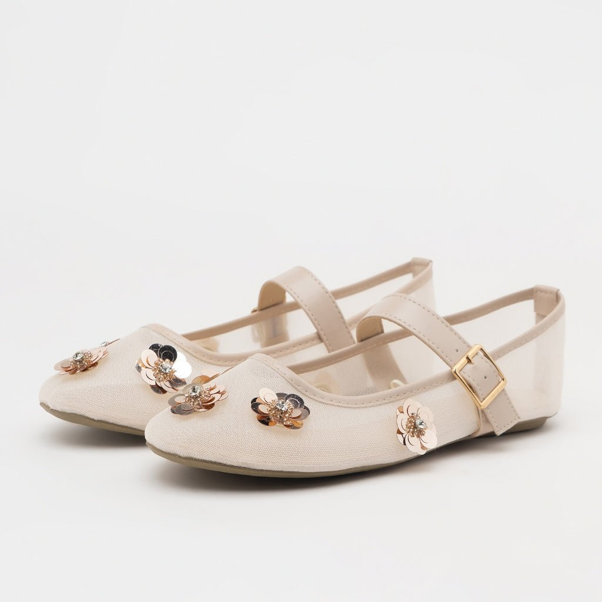 — 출처 <https://berrybenka.com/cdn/shop/files/th-11134207-81zto-mr01nsim06pz1d.jpg?v=1788923925&width=3840>
- 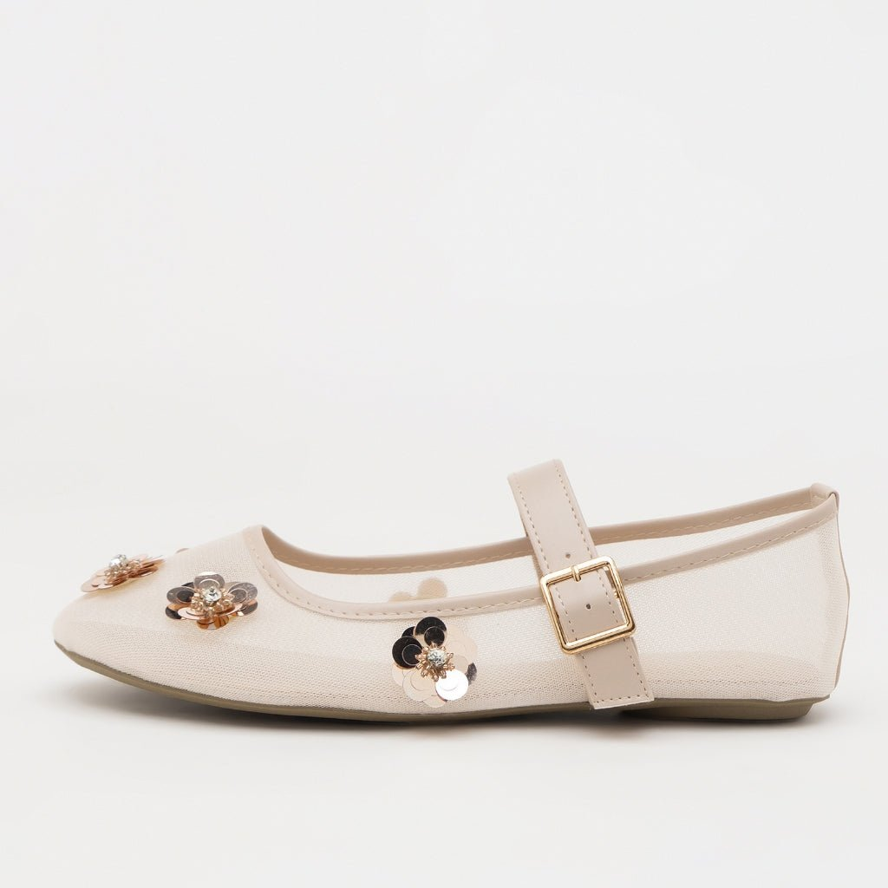 — 출처 <https://berrybenka.com/cdn/shop/files/th-11134207-81ztm-mr01nsai9iis83.jpg?v=1788923925&width=3840>
- 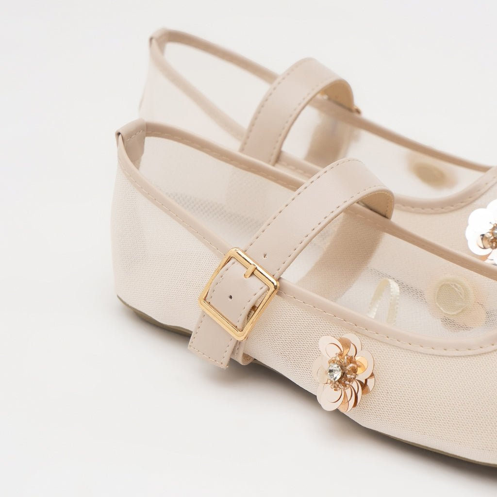 — 출처 <https://berrybenka.com/cdn/shop/files/th-11134207-81zti-mr01ns6xfbb69c.jpg?v=1788923925&width=3840>
- 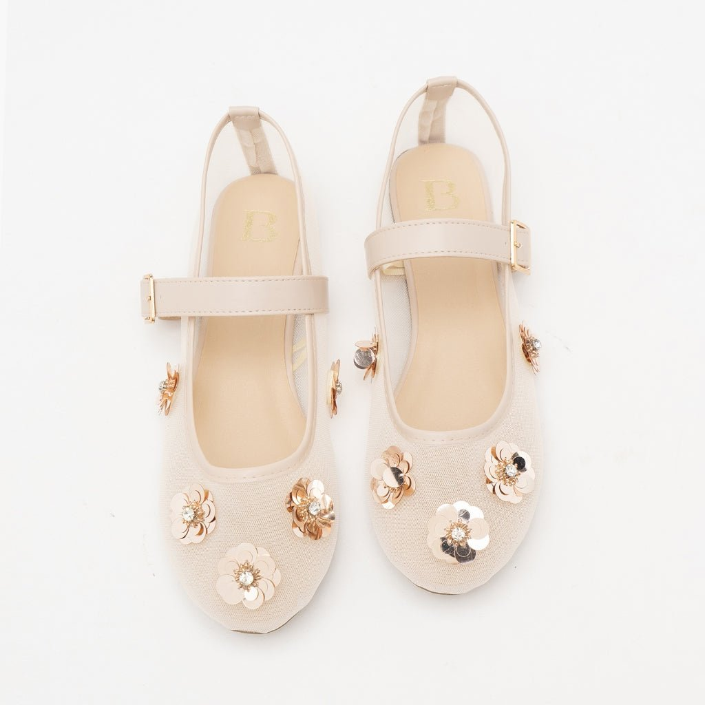 — 출처 <https://berrybenka.com/cdn/shop/files/th-11134207-81ztl-mr01ns6yd0y418.jpg?v=1788923925&width=3840>

**페이지 메타 정보**

| page | title | description |
|---|---|---|
| [`home`](https://berrybenka.com/) | Berrybenka | #berrybenka #trendy fashion # berrybenka_Thailand #Trendy Shoes #Flat shoes |

#### [Hijup](https://www.hijup.com/)

- URL: <https://www.hijup.com/>
- 페이지: **OK 1 · FAIL 0**

**페이지 메타 정보**

| page | title | description |
|---|---|---|
| [`home`](https://www.hijup.com/) | Latest Scarf, Tunic, Long Dress Collection | HIJUP | Trusted Muslim Women's Clothing Online Shopping Site. Buy latest collection of Abaya, Blouse, Dress, Tunic, Printed Scarf. International shi |

#### [Shopee Indonesia](https://shopee.co.id/)

- URL: <https://shopee.co.id/>
- 페이지: **OK 1 · FAIL 0**

**대표 상품 이미지** (상위 6장, 출처 URL 포함)

-  — 출처 <https://deo.shopeemobile.com/shopee/shopee-pcmall-live-sg/assets/1c8bdaaf45e1fd48.png>
-  — 출처 <https://deo.shopeemobile.com/shopee/shopee-pcmall-live-sg/homepagefe/42ba6075c82a85ab.png>

**페이지 메타 정보**

| page | title | description |
|---|---|---|
| [`home`](https://shopee.co.id/verify/captcha?anti_bot_tracking_id=gqRjZGVrxHSFomtptTE0MjUxOnRyYWNraW5nX2lkX2tleaJrdtEAAqRhbGdv0gAAAGSjZGVrwKJjdMRAAAAADMPc0R2hCGactn2nr9DcAFBQpHMoHjAbjrdsrt_pSEAwvu3D4ZqEQ0V0kSHM0Nn9K_1xVJ0eNyntbq4tnqpjaXBoZXJ0ZXh0xQLPAAAADMX0T2jB6LGj-W8QB9xRl56KYRIdqvc4k32r4OmibeGCIjJNNgOW3Sp0dCcSihEmow7OAfIOGyohy1Sef1SySChycVeDLHfcf0B55tg-s8MxielEiqeRiPcXxL2r4XvGzJCNjkWLdXOAgeCj-XDKkLmhf8QULcDD55AfwgF7Y1HTXTXkDKl5WYUbej5EIusejItpjtti31-OHc4j0pjDT7XsV0VvAqhPKVgBAJrqvwIWa54wcAUOtKQE7rtzMbMy96BeUfV7IayTnhhgEjsq20_kqRmJH0SYqAK2CDYVIo8P3FnkD-q2tOd8g56gNhaXHN_MPk4LDPqdw_hk3mmC_QQz_3Dqi9Bme2zLStcAtUrUQHK7-ygJFvzSteBLvMvc3tdBwEmfHU0iJqQnREYKzEbxmbJiy8DM85G-MhQRNKwLtAUyEH7rsysTZ9B5Wz4vYSUkxtsHjiAk0vbeucBlM5K98u6njfr3OtWPEAZq9CHR1o7v-I4yAjHfV8JRNvg9vwqFXEYbzTX3QZTWHN9lTl4OzX5Lh9AALvcxyFIiP6eFdtvxCLd1FX4-YHn67pUHOm9xzao5vaAdycM_Og9R3NeDdDqAqG4t5UDcqICUHLVrL3tyNLd6Bh_NQ2SECj-zJ4Vpc8CDSOTQOwIsEFx5j8NjcMSC_dvkcp69PpncmFW8xdq8wIZPJ8d4Q6gHh73HoH6XpSU7xyg16UmTham70t2UJquxpmOG-cgDpMzw-rj7ACo8q1B9bFWpcmLuaD_KDNlf4THnxGE8Ha40nJ5U9ZVqFZukVLrM6h6ozAyspuiLB5Dex_UUhKA_tuRXgvaDbU_8C9AQMs9k376o-gmjoCgtKBemXEaOYKOhf0HbfW0FEVV-dEZvHRz4O8wLnZzG4eFDdTdbJthdrbpx-LLxDW99EROyoojMK8Y8Lq9S2rZduofZArdI4Cq-cP8&app_key=FlashSale.PC&client_id=1&next=https%3A%2F%2Fshopee.co.id%2Fverify%2Ftraffic%3F%3Fclient_id%3D%26next%3Dhttps%253A%252F%252Fshopee.co.id%252F%26redirect_type%3D2%26should_replace_history%3Dfalse&redirect_type=2&scene=crawler_item&should_replace_history=false) | Shopee Indonesia | Belanja Online Terlengkap & Terpercaya | Belanja Online di Shopee Indonesia!  Nikmati Keuntungan Jual Beli Online Mudah dengan Shopee COD (Bayar di Tempat), Gratis Ongkir, & Pengiri |

#### [Tokopedia](https://www.tokopedia.com/)

- URL: <https://www.tokopedia.com/>
- 페이지: **OK 0 · FAIL 1**

**실패 페이지**

- `home` — playwright_error: Error: Page.goto: net::ERR_HTTP2_PROTOCOL_ERROR at https://www.tokopedia.com/
Call log:
  - navigating to "https://www.tokopedia.com/", waiting until "domcontentloaded"

#### [Zalora Indonesia](https://www.zalora.co.id/)

- URL: <https://www.zalora.co.id/>
- 페이지: **OK 1 · FAIL 0**

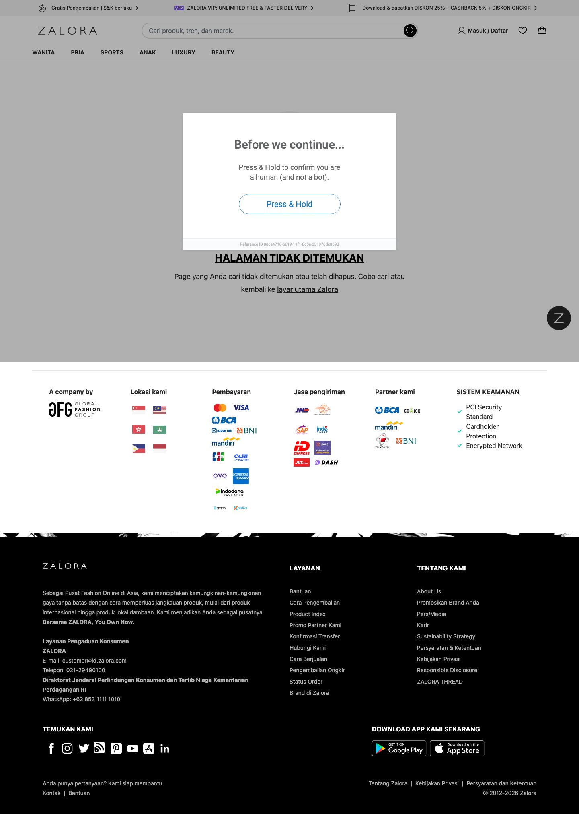

**대표 상품 이미지** (상위 6장, 출처 URL 포함)

-  — 출처 <https://static-id.zacdn.com/next-assets/static-assets/images/logo/icon_mastercard.png>
-  — 출처 <https://static-id.zacdn.com/next-assets/static-assets/images/logo/icon_visa.png>
-  — 출처 <https://static-id.zacdn.com/next-assets/static-assets/images/logo/icon_ovo.png>

**페이지 메타 정보**

| page | title | description |
|---|---|---|
| [`new_women`](https://www.zalora.co.id/wanita/new-arrivals) | Halaman tidak ditemukan | ZALORA |  |

### 4.2 일본 _( Japan )_

- 한국 수출규모 순위: **#2** · region: `asia` · tier `1` · currency `JPY`
- 수집 사이트: **5개** (성공 4)
- 메모: K-패션 선호도 높고 온라인 패션몰 발달
#### [GU Japan](https://www.gu-global.com/jp/)

- URL: <https://www.gu-global.com/jp/>
- 페이지: **OK 1 · FAIL 0**

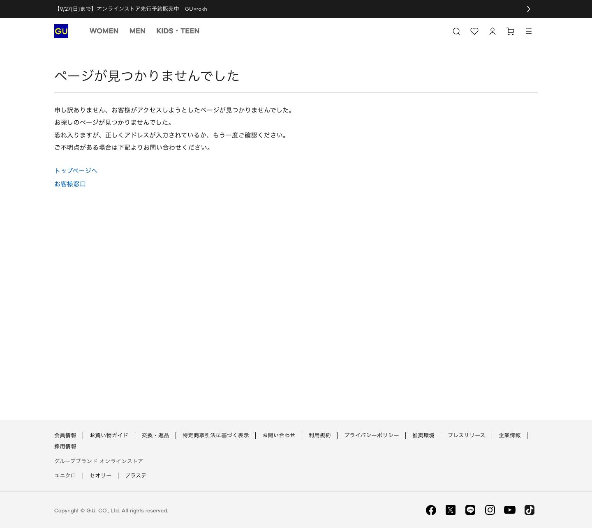

**대표 상품 이미지** (상위 6장, 출처 URL 포함)

-  — 출처 <https://image.uniqlo.com/GU/ST3/jp/imagesother/Navigation/Category-icon_V2/2026/0918/category_silver-week.png>
-  — 출처 <https://image.uniqlo.com/GU/ST3/jp/imagesother/Navigation/WOMEN_Category/2026/260724/Category_w_Pants.jpg>
-  — 출처 <https://image.uniqlo.com/GU/ST3/jp/imagesother/Navigation/WOMEN_Category/2026/260820/Category_w_skirt_361518.png>
-  — 출처 <https://image.uniqlo.com/GU/ST3/jp/imagesother/Navigation/WOMEN_Category/2026/260901/Category_w_Outer_361430.png>
-  — 출처 <https://image.uniqlo.com/GU/ST3/jp/imagesother/Navigation/WOMEN_Category/2026/260911/Category_w_tops_358739.png>
- 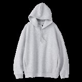 — 출처 <https://image.uniqlo.com/GU/ST3/jp/imagesother/Navigation/WOMEN_Category/2026/260911/Category_w_sweat_361784.png>

**페이지 메타 정보**

| page | title | description |
|---|---|---|
| [`new_arrivals`](https://www.gu-global.com/jp/ja/not-found) | 申し訳ありません、お客様がアクセスしようとしたページが見つかりませんでした。恐れ入りますが、正しくアドレスが入力されているか、もう一度ご確認ください。 | ジーユー | 申し訳ありません、お客様がアクセスしようとしたページが見つかりませんでした。恐れ入りますが、正しくアドレスが入力されているか、もう一度ご確認ください。 |

#### [Rakuten Fashion](https://brandavenue.rakuten.co.jp/)

- URL: <https://brandavenue.rakuten.co.jp/>
- 페이지: **OK 1 · FAIL 1**

**대표 상품 이미지** (상위 6장, 출처 URL 포함)

-  — 출처 <https://brandavenue.r10s.jp/img/library/index/sbn_flagshipstore_20231003.png>
- 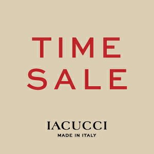 — 출처 <https://brandavenue.r10s.jp/img/news/01/397645/pc_n.jpg>
- 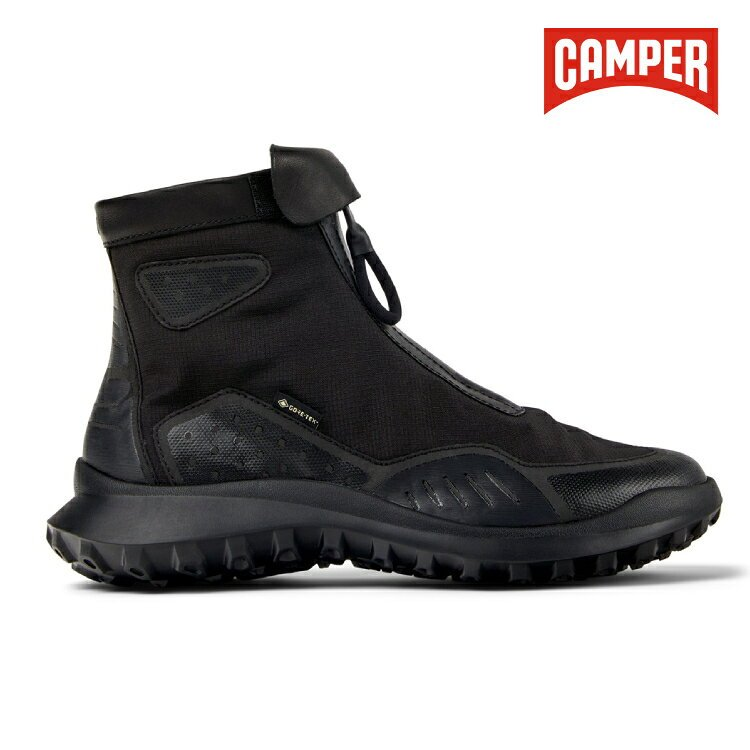 — 출처 <https://brandavenue.r10s.jp/img/news/01/397417/pc_n.jpg>
- 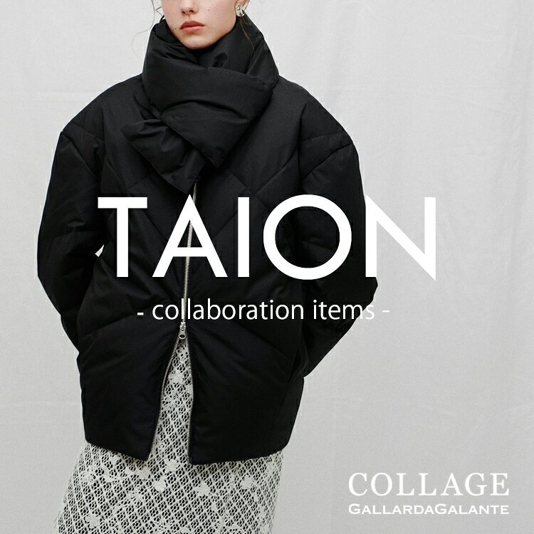 — 출처 <https://brandavenue.r10s.jp/img/news/01/397920/pc_n.jpg>
- 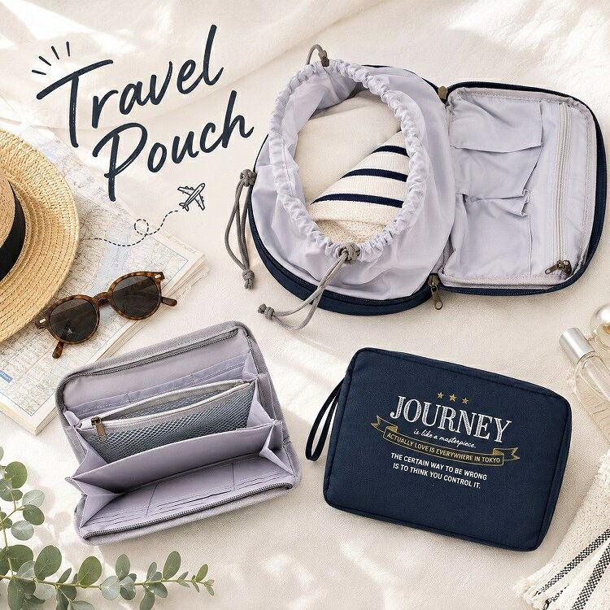 — 출처 <https://brandavenue.r10s.jp/img/news/01/398794/pc_n.jpg>
- 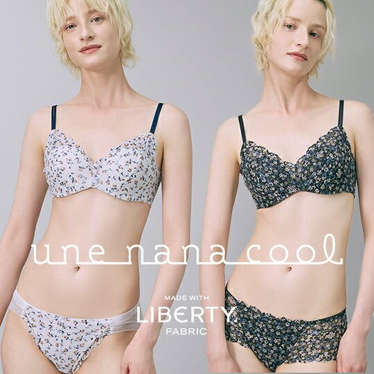 — 출처 <https://brandavenue.r10s.jp/img/news/01/397324/pc_n.jpg>

**페이지 메타 정보**

| page | title | description |
|---|---|---|
| [`men`](https://brandavenue.rakuten.co.jp/men/) | MEN | ファッション通販 Rakuten Fashion(楽天ファッション／旧楽天ブランドアベニュー) | Rakuten Fashion(楽天ファッション)は人気ブランドを取り扱うファッション通販サイトです。新作アイテム続々入荷！セール商品やクーポン対象商品も豊富。／税込3,980円以上購入で送料無料／楽天ポイントが使えて貯まる！ |

**실패 페이지**

- `women` — http_status_404

#### [Uniqlo Japan](https://www.uniqlo.com/jp/)

- URL: <https://www.uniqlo.com/jp/>
- 페이지: **OK 1 · FAIL 0**

**페이지 메타 정보**

| page | title | description |
|---|---|---|
| [`new_arrivals`](https://www.uniqlo.com/jp/ja/contents/feature/new-arrivals/) | 404 Not Found |  |

#### [WEAR](https://wear.jp/)

- URL: <https://wear.jp/>
- 페이지: **OK 1 · FAIL 0**

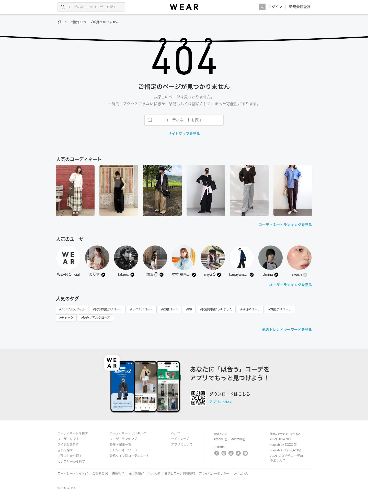

**대표 상품 이미지** (상위 6장, 출처 URL 포함)

-  — 출처 <https://wear.jp/public/_next/static/media/notfound_bg.1ywd-k_shp-hy.png>
-  — 출처 <https://wear.jp/public/_next/static/media/notfound_4.1ho27atf54bbv.png>
-  — 출처 <https://wear.jp/public/_next/static/media/notfound_0.438l9b9xjj6tm.png>
- 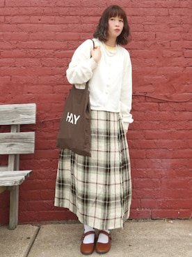 — 출처 <https://images.wear2.jp/coordinate/Grin7q0y/gSPeNjAV/1789930372_276.jpg>
- 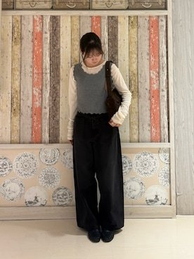 — 출처 <https://images.wear2.jp/coordinate/QWiWEABz/t0SW5YB1/1790024776_276.jpg>
- 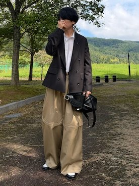 — 출처 <https://images.wear2.jp/coordinate/wni4jx2v/G7hkIjsS/1789992375_276.jpg>

**페이지 메타 정보**

| page | title | description |
|---|---|---|
| [`ranking`](https://wear.jp/ranking/coordinate/) | ご指定のページが見つかりません - WEAR | お探しのページは見つかりません。一時的にアクセスできない状態か、移動もしくは削除されてしまった可能性があります。 |

#### [ZOZOTOWN](https://zozo.jp/)

- URL: <https://zozo.jp/>
- 페이지: **OK 0 · FAIL 2**

**실패 페이지**

- `new` — playwright_error: TimeoutError: Page.goto: Timeout 30000ms exceeded.
Call log:
  - navigating to "https://zozo.jp/category/new/", waiting until "domcontentloaded"

- `ranking` — playwright_error: TimeoutError: Page.goto: Timeout 30000ms exceeded.
Call log:
  - navigating to "https://zozo.jp/ranking/", waiting until "domcontentloaded"

### 4.3 한국 _( South Korea )_

- 한국 수출규모 순위: **#30** · region: `asia` · tier `1` · currency `KRW`
- 수집 사이트: **4개** (성공 3)
- 메모: 비교 기준 (자국). 국내 사업동향 센싱
#### [29CM](https://www.29cm.co.kr/)

- URL: <https://www.29cm.co.kr/>
- 페이지: **OK 1 · FAIL 0**

**최근 유행 상품** (50건 · 상품명 클릭 시 해당 사이트로 이동)

| # | 상품명 | 브랜드 | 가격 | 페이지 |
|---:|---|---|---:|---|
| 1 | [[네세서리 X 솔비] Tencel Pencil Midi Skirt (Black)](https://product.29cm.co.kr/catalog/4208781) | 네세서리 | 129,330 KRW | `home` |
| 2 | [[네세서리 X 솔비] Wool Roll Detail Cardigan (Charcoal)](https://product.29cm.co.kr/catalog/4209275) | 네세서리 | 191,470 KRW | `home` |
| 3 | [Chunky Handmade Knit Cardigan (Beige)](https://product.29cm.co.kr/catalog/4209311) | 네세서리 | 182,070 KRW | `home` |
| 4 | [루씨에어 레이더3 실링팬 천장형 선풍기 132cm 6colors](https://product.29cm.co.kr/catalog/3359333) | 루씨에어 | 620,000 KRW | `home` |
| 5 | [루씨에어 코타라 커넥트 CTC 실링팬 137cm 3colors](https://product.29cm.co.kr/catalog/3359303) | 루씨에어 | 670,000 KRW | `home` |
| 6 | [루씨에어 화이트헤이븐 플러스+ 실링팬 천장형 선풍기 142cm 4colors](https://product.29cm.co.kr/catalog/3359174) | 루씨에어 | 620,000 KRW | `home` |
| 7 | [LIDO DAYBED](https://product.29cm.co.kr/catalog/4201227) | 사멘스카브 | 1,512,000 KRW | `home` |
| 8 | [PB SOFA 2인 (6 Colors)](https://product.29cm.co.kr/catalog/3999991) | 사멘스카브 | 2,850,000 KRW | `home` |
| 9 | [FARO SOFA 2인 (6 Colors)](https://product.29cm.co.kr/catalog/3999024) | 사멘스카브 | 1,490,000 KRW | `home` |
| 10 | [Northcove Raglan hood Goosedown Jacket Charcoal](https://product.29cm.co.kr/catalog/3607549) | 홀리선 | 512,100 KRW | `home` |
| 11 | [Frost Hood Duckdown Light Jacket Dark Brown](https://product.29cm.co.kr/catalog/3576603) | 홀리선 | 358,200 KRW | `home` |
| 12 | [Frost Hood Duckdown Light Jacket Black](https://product.29cm.co.kr/catalog/3576599) | 홀리선 | 358,200 KRW | `home` |
| 13 | [NBNAG3W832 / WOMEN ALLDAY 워시드 후드형 바람막이 (D/CHARCOAL)](https://product.29cm.co.kr/catalog/4115784) | 뉴발란스 | 179,000 KRW | `home` |
| 14 | [NBNAG3W832 / WOMEN ALLDAY 워시드 후드형 바람막이 (D/BLUE)](https://product.29cm.co.kr/catalog/4115783) | 뉴발란스 | 179,000 KRW | `home` |
| 15 | [NBNAG3W822 / WOMEN ALLDAY 후드형 바람막이 (S/BLUE)](https://product.29cm.co.kr/catalog/4115777) | 뉴발란스 | 159,000 KRW | `home` |
| 16 | [[쇼트] 휴대용 유리빨대 21, 23cm](https://product.29cm.co.kr/catalog/4194441) | 메세 | 10,740 KRW | `home` |
| 17 | [[쇼트] 휴대용 유리빨대 케이스 21, 23cm](https://product.29cm.co.kr/catalog/4191106) | 메세 | 3,280 KRW | `home` |
| 18 | [[쇼트] 로고 유리 빨대 4P 세트 20, 23cm](https://product.29cm.co.kr/catalog/4188507) | 메세 | 35,430 KRW | `home` |
| 19 | [[타센] 커피컵 앤 소스 세트 200ml](https://product.29cm.co.kr/catalog/4202131) | 메세 | 54,000 KRW | `home` |
| 20 | [[타센] 에그컵 50ml 2P 세트](https://product.29cm.co.kr/catalog/4205790) | 메세 | 54,000 KRW | `home` |

**대표 상품 이미지** (상위 6장, 출처 URL 포함)

-  — 출처 <https://img.29cm.co.kr/cms/202609/11f1b3329156b02aa9b875f163fdaa53.png?width=3840&format=webp>
- 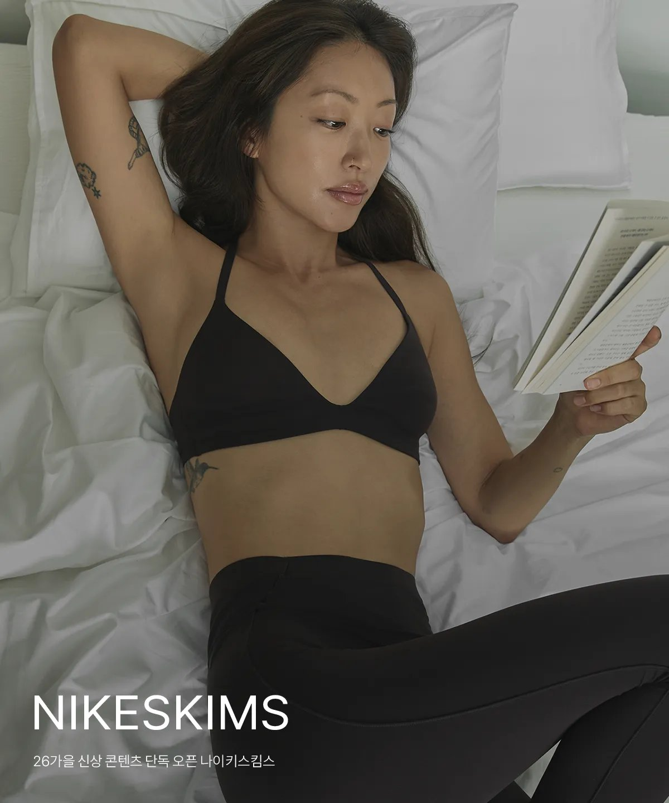 — 출처 <https://img.29cm.co.kr/cms/202609/11f1b3328cef852a94a3bb5e3faa2d61.png?width=3840&format=webp>
- 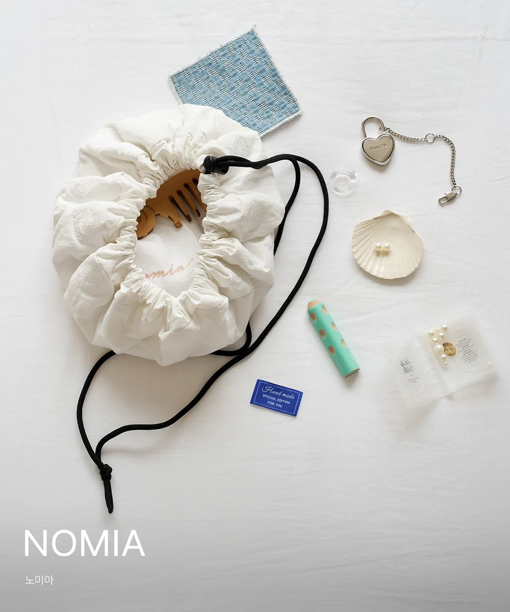 — 출처 <https://img.29cm.co.kr/cms/202609/11f1b332756250a4a9b8a1d1c8509cc0.png?width=3840&format=webp>
- 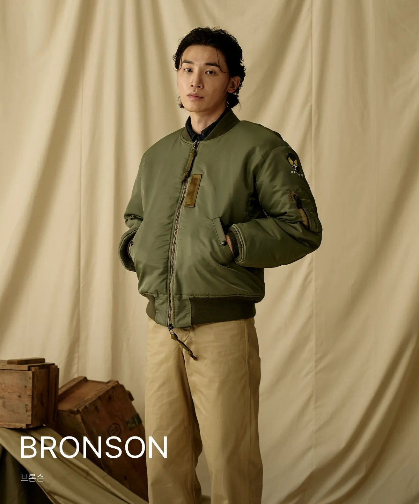 — 출처 <https://img.29cm.co.kr/cms/202609/11f1b3326c62d8c094a3d38e8747fa2f.png?width=3840&format=webp>
- 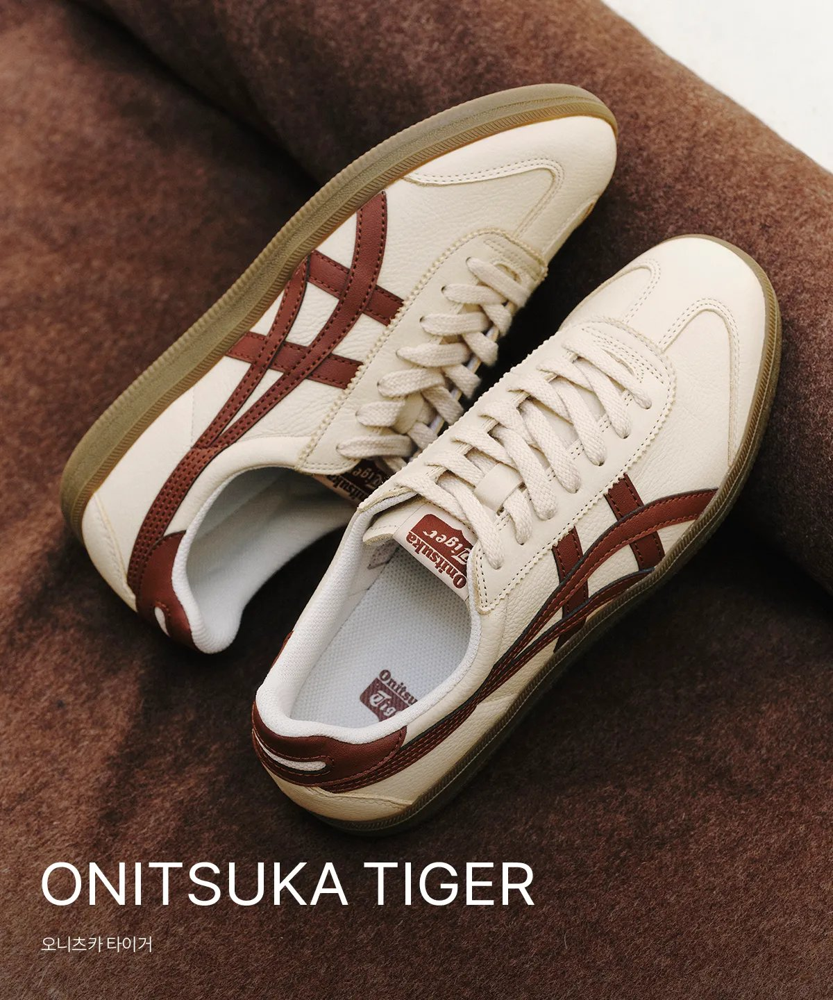 — 출처 <https://img.29cm.co.kr/cms/202609/11f1b33260c36230a9b82f75516f509d.png?width=3840&format=webp>
- 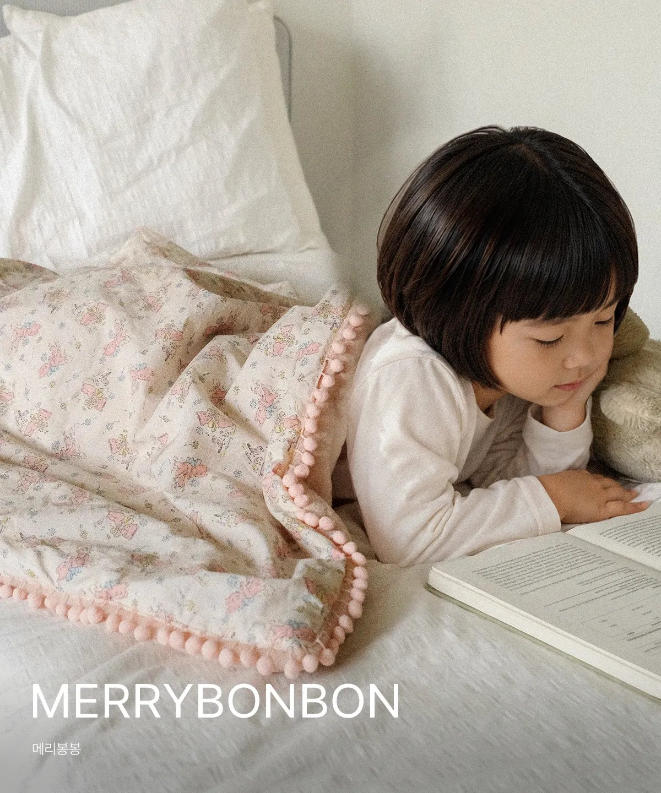 — 출처 <https://img.29cm.co.kr/cms/202609/11f1b3323e44353e94a39d3a5a31fe1a.png?width=3840&format=webp>

**페이지 메타 정보**

| page | title | description |
|---|---|---|
| [`home`](https://www.29cm.co.kr/) | 감도 깊은 취향 셀렉트샵 29CM | 패션, 라이프스타일, 컬처까지 29CM만의 감도 깊은 셀렉션을 만나보세요. |

#### [Musinsa](https://www.musinsa.com/)

- URL: <https://www.musinsa.com/>
- 페이지: **OK 0 · FAIL 1**

**실패 페이지**

- `home` — robots_disallowed

#### [W Concept](https://www.wconcept.co.kr/)

- URL: <https://www.wconcept.co.kr/>
- 페이지: **OK 1 · FAIL 0**

**최근 유행 상품** (30건 · 상품명 클릭 시 해당 사이트로 이동)

| # | 상품명 | 브랜드 | 가격 | 페이지 |
|---:|---|---|---:|---|
| 1 | [ARKVE 미우 골지 면 여성 여자 패션 양말 SOCKS](https://m.wconcept.co.kr/Product/308931527) | 엔젤삭스 | 3,500 KRW | `home` |
| 2 | [1327 벨벳도트 3D 회색 그레이 차콜 검정 면 땡땡이 팬티 차정원 김나영 타이즈   스타킹](https://m.wconcept.co.kr/Product/308867821) | 엔젤삭스 | 13,485 KRW | `home` |
| 3 | [1339 이중 레이어 핑크 탭 여자 패션 양말   socks](https://m.wconcept.co.kr/Product/308867793) | 엔젤삭스 | 4,500 KRW | `home` |
| 4 | [1335 빨강 스트라이프 여성 패션 양말   브랜드](https://m.wconcept.co.kr/Product/308867798) | 엔젤삭스 | 3,900 KRW | `home` |
| 5 | [ARKVE 도트 레이스 땡땡이 패션 여성 여자 브랜드 양말](https://m.wconcept.co.kr/Product/308956210) | 엔젤삭스 | 4,500 KRW | `home` |
| 6 | [1329 루즈 면 니 일본 갸루 삭스   양말](https://m.wconcept.co.kr/Product/308867796) | 엔젤삭스 | 2,900 KRW | `home` |
| 7 | [1319버튼탭 면 여성 패션 브랜드 단추 래터링 로고 명품 브랜드 fashion socks   양말](https://m.wconcept.co.kr/Product/308867824) | 엔젤삭스 | 3,500 KRW | `home` |
| 8 | [ARKVE 미우 롱 골지 면 여성 여자 패션 양말 SOCKS 니삭스](https://m.wconcept.co.kr/Product/308931462) | 엔젤삭스 | 6,500 KRW | `home` |
| 9 | [1326 골지 3D 회색 그레이 차콜 검정 면 팬티 김나영 차정원 타이즈   스타킹](https://m.wconcept.co.kr/Product/308867820) | 엔젤삭스 | 9,900 KRW | `home` |
| 10 | [1336 투톤 면 파스텔 면 골지 컬러 양말 PINK   SOCKS](https://m.wconcept.co.kr/Product/308867789) | 엔젤삭스 | 3,500 KRW | `home` |
| 11 | [ARKVE 옆탭 골지 니트 여성 여자 패션 양말 SOCKS](https://m.wconcept.co.kr/Product/308956202) | 엔젤삭스 | 4,500 KRW | `home` |
| 12 | [1310쓰리톤탭면양말 컬러 여자 여성 패션 김나영   양말](https://m.wconcept.co.kr/Product/308867701) | 엔젤삭스 | 3,900 KRW | `home` |
| 13 | [1328 꽃 패션 여성 시스루 회색 양말   socks](https://m.wconcept.co.kr/Product/308867795) | 엔젤삭스 | 3,500 KRW | `home` |
| 14 | [ARKVE 뒷탭 골지 면 여성 여자 패션 양말 SOCKS](https://m.wconcept.co.kr/Product/308949368) | 엔젤삭스 | 4,500 KRW | `home` |
| 15 | [1254 골지 면 양말 기본 학생 컬러 무지 노랑 빨강 형광 여자   SOCKS](https://m.wconcept.co.kr/Product/308867673) | 엔젤삭스 | 2,900 KRW | `home` |
| 16 | [양말선물세트 SET006-흑임자 그레이 회색 여성 패션 리본 꽃 양말   SOCKS](https://m.wconcept.co.kr/Product/308867799) | 엔젤삭스 | 17,313 KRW | `home` |
| 17 | [1313패턴하프양말 시스루 여름 여성 여자 스타킹 얇은 패션 명품 중목 흰 프릴 양말   니삭스](https://m.wconcept.co.kr/Product/308867715) | 엔젤삭스 | 2,900 KRW | `home` |
| 18 | [1276  스마일자수면양말](https://m.wconcept.co.kr/Product/308867690) | 엔젤삭스 | 3,900 KRW | `home` |
| 19 | [1302 R 골지 탭 여성 패션 양말 SOCKS   차정원](https://m.wconcept.co.kr/Product/308867698) | 엔젤삭스 | 4,900 KRW | `home` |
| 20 | [[10개 세트]착붙덧신3종 페이크삭스 덧신양말 실리콘 여자 덧버선 10켤레 국산 안벗겨지는 기본 여름 여성 면  덧신](https://m.wconcept.co.kr/Product/308867714) | 엔젤삭스 | 22,185 KRW | `home` |

**페이지 메타 정보**

| page | title | description |
|---|---|---|
| [`home`](https://www.wconcept.co.kr/) | _(empty)_ |  |

#### [Zigzag](https://zigzag.kr/)

- URL: <https://zigzag.kr/>
- 페이지: **OK 1 · FAIL 0**

**최근 유행 상품** (36건 · 상품명 클릭 시 해당 사이트로 이동)

| # | 상품명 | 브랜드 | 가격 | 페이지 |
|---:|---|---|---:|---|
| 1 | [[가을바지🍁/made] 모엔르 비죠 코튼 팬츠 (2color)](https://store.zigzag.kr/app/catalog/products/171368533?browsing_type=NATIVE_BROWSER) | 리얼코코 | 28,720 KRW | `home` |
| 2 | [화이트랩스 치아미백기 LED 셀프 자가 치아미백기계 & 치아미백젤 세트 (1인용)](https://store.zigzag.kr/app/catalog/products/168362278?browsing_type=NATIVE_BROWSER) | 화이트랩스 | 159,000 KRW | `home` |
| 3 | [[서경PICK🤎][골반뽕탈부착][~2XL][8만장🏆][힙딥커버]렌더 코튼 부츠컷 팬츠 (숏/롱ver)(7color)](https://store.zigzag.kr/app/catalog/products/162075326?browsing_type=NATIVE_BROWSER) | 프렌치오브 | 18,690 KRW | `home` |
| 4 | [(9/30 예약배송) [lean PICK] 아콘 스니커즈 412430006 (6cm)](https://store.zigzag.kr/app/catalog/products/148161810?browsing_type=NATIVE_BROWSER) | 솔트앤초콜릿 | 63,200 KRW | `home` |
| 5 | [[단독컬러💖][소프트얀] 딥 브이넥 니트_SPKWG49G01](https://store.zigzag.kr/app/catalog/products/171474132?browsing_type=NATIVE_BROWSER) | 스파오 | 26,910 KRW | `home` |
| 6 | [[후기인증핏👖/4만장돌파!] made. 투데이 와이드 중청데님팬츠 (숏/베이직/롱)](https://store.zigzag.kr/app/catalog/products/119829258?browsing_type=NATIVE_BROWSER) | 슬로우앤드 | 31,840 KRW | `home` |
| 7 | [[핏보정팬츠] made. 나이브 히든밴딩 세미부츠컷 팬츠 (+숏/베이직/롱ver) - 4 size](https://store.zigzag.kr/app/catalog/products/159899063?browsing_type=NATIVE_BROWSER) | 슬로우앤드 | 26,910 KRW | `home` |
| 8 | [[가을바지🍁/50만장돌파/made] 허쉬 코튼 와이드팬츠 (숏/기본/롱)](https://store.zigzag.kr/app/catalog/products/143224732?browsing_type=NATIVE_BROWSER) | 리얼코코 | 15,210 KRW | `home` |
| 9 | [[🏆데님No.1/4만장돌파] made. 투데이 와이드 진청데님팬츠 (숏/베이직/롱)](https://store.zigzag.kr/app/catalog/products/120443272?browsing_type=NATIVE_BROWSER) | 슬로우앤드 | 31,840 KRW | `home` |
| 10 | [[가을셔츠🍂/made] 메이킹 스트라이프 셔츠 (반팔/긴팔)](https://store.zigzag.kr/app/catalog/products/141728678?browsing_type=NATIVE_BROWSER) | 리얼코코 | 13,280 KRW | `home` |
| 11 | [[가을니트🍁/브이넥&라운드넥/made] 에트 니트 (6color)](https://store.zigzag.kr/app/catalog/products/129456378?browsing_type=NATIVE_BROWSER) | 리얼코코 | 14,800 KRW | `home` |
| 12 | [[가을셔츠🤎/스트라이프&무지/10만장돌파/made] 로셀 라인 셔츠 (7color)](https://store.zigzag.kr/app/catalog/products/145426176?browsing_type=NATIVE_BROWSER) | 리얼코코 | 12,200 KRW | `home` |
| 13 | [[🍁어텀세일/무료배송] made. 포트 컬러웨이 딥브이넥 니트 - 5 color](https://store.zigzag.kr/app/catalog/products/171386405?browsing_type=NATIVE_BROWSER) | 슬로우앤드 | 27,920 KRW | `home` |
| 14 | [[🥇레이어드룩1위] made. 세이 셔츠앤 레이어링 니트 (워셔블니트) - 5 color](https://store.zigzag.kr/app/catalog/products/167765387?browsing_type=NATIVE_BROWSER) | 슬로우앤드 | 36,000 KRW | `home` |
| 15 | [고퀄리티 나시세트 오프숄더 모헤어 니트 가을 키드 레이어드 세트 4컬러](https://store.zigzag.kr/app/catalog/products/172073472?browsing_type=NATIVE_BROWSER) | 느루아 | 100,000 KRW | `home` |
| 16 | [[🍁가을/3기장선택!] made. 모먼트 투커버 올데이슬랙스 (+숏/베이직/롱ver) - 4 size](https://store.zigzag.kr/app/catalog/products/136095576?browsing_type=NATIVE_BROWSER) | 슬로우앤드 | 31,840 KRW | `home` |
| 17 | [[바로배송] 힐 롤업 버튼 티셔츠_2 컬러ㅣ모달 코튼 면 헨리넥 소매롤업 오버핏 루즈핏 헨리넥티 버튼티 롤업티 데일리 간절기 봄 가을](https://store.zigzag.kr/app/catalog/products/172072405?browsing_type=NATIVE_BROWSER) | 포타 | 33,200 KRW | `home` |
| 18 | [워싱레더자켓](https://store.zigzag.kr/app/catalog/products/172072775?browsing_type=NATIVE_BROWSER) | 하이콤마 | 154,450 KRW | `home` |
| 19 | [[🏆역대급100만장/3기장선택!] made. 마켓 와이드 트레이닝슬랙스 (+숏/베이직/롱ver) - 4 size](https://store.zigzag.kr/app/catalog/products/141360158?browsing_type=NATIVE_BROWSER) | 슬로우앤드 | 26,320 KRW | `home` |
| 20 | [[쫀득스판🏆8만장] 중독팬츠ver.코튼와이드 - 6color (와이드팬츠/코튼팬츠/면바지/롱와이드/브라운팬츠/흰바지/가을바지/출근룩/MADE/키작녀)](https://store.zigzag.kr/app/catalog/products/150592199?browsing_type=NATIVE_BROWSER) | 고고싱 | 26,820 KRW | `home` |

**대표 상품 이미지** (상위 6장, 출처 URL 포함)

- 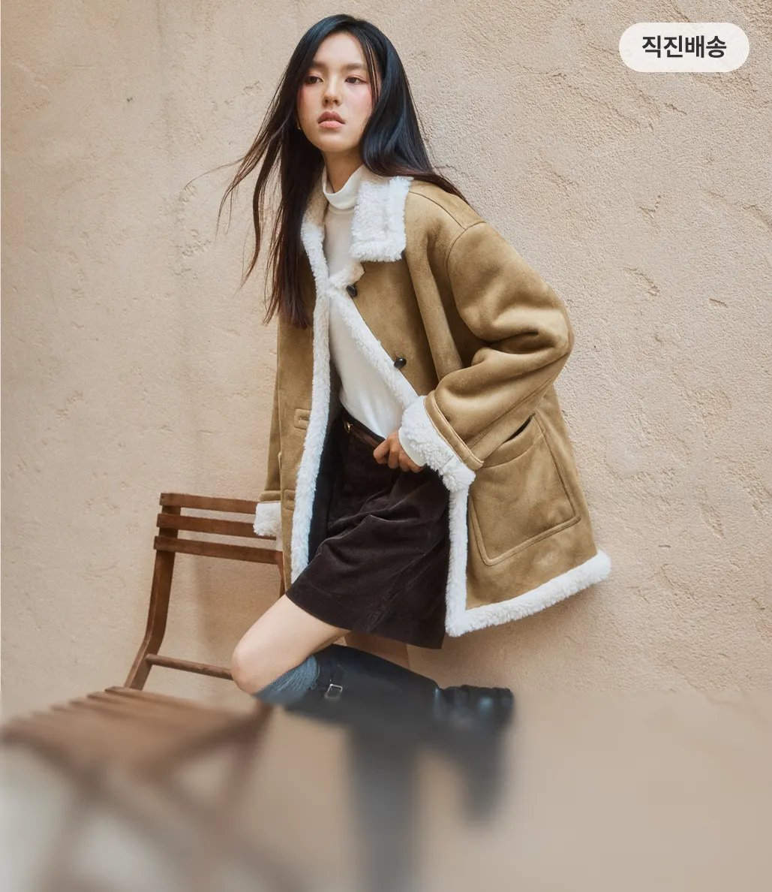 — 출처 <https://cf.image-farm.s.zigzag.kr/original/cms/2026/09/17/202609172313279061_068035.png?quality=80&format=webp&transparent=true&width=1029&height=1188>
- 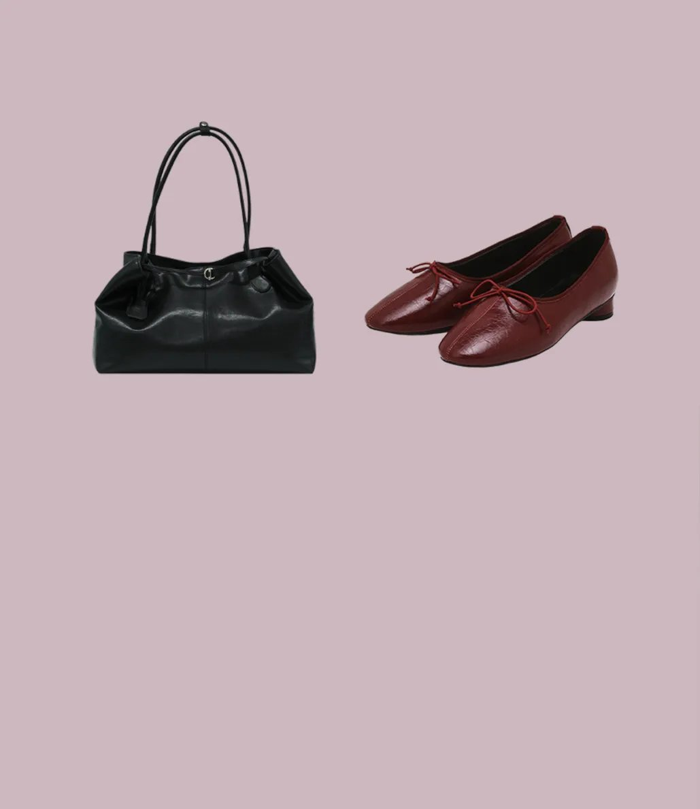 — 출처 <https://cf.image-farm.s.zigzag.kr/original/cms/2026/09/18/202609180000443751_013719.jpg?format=webp&quality=80&width=1029&height=1188>
-  — 출처 <https://cf.image-farm.s.zigzag.kr/original/cms/2026/09/14/202609140638412919_090904.jpg?width=1029&height=1188&quality=80&format=webp&transparent=true>
- 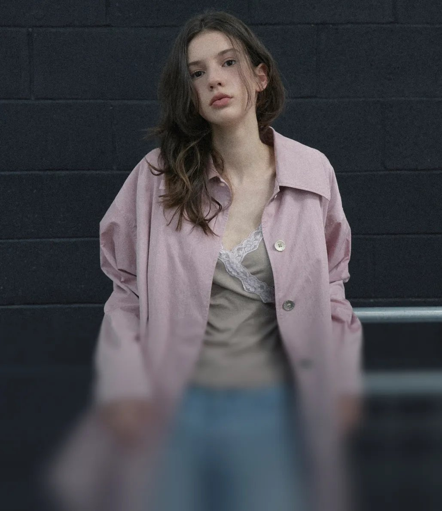 — 출처 <https://cf.image-farm.s.zigzag.kr/original/cms/2026/09/20/202609200753132114_031464.jpg?width=1029&height=1188&quality=80&format=webp&transparent=true>
-  — 출처 <https://cf.image-farm.s.zigzag.kr/original/cms/2026/09/20/202609200611551414_034331.jpg?width=1029&height=1188&quality=80&format=webp&transparent=true>
-  — 출처 <https://cf.image-farm.s.zigzag.kr/original/cms/2026/09/17/202609170844241661_099444.jpg?width=1029&height=1188&quality=80&format=webp&transparent=true>

**페이지 메타 정보**

| page | title | description |
|---|---|---|
| [`home`](https://zigzag.kr/) | 지그재그 스토어 | 4,000만 여성이 선택한 올인원 쇼핑 앱 지그재그 - 제가 알아서 살게요. |

### 4.4 대만 _( Taiwan )_

- 한국 수출규모 순위: **#7** · region: `asia` · tier `1` · currency `TWD`
- 수집 사이트: **5개** (성공 4)
- 메모: K-패션 친화도 높음
#### [momo](https://www.momoshop.com.tw/)

- URL: <https://www.momoshop.com.tw/>
- 페이지: **OK 1 · FAIL 0**

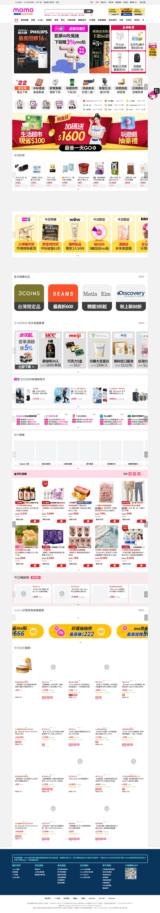

**대표 상품 이미지** (상위 6장, 출처 URL 포함)

-  — 출처 <https://img3.momoshop.com.tw/ecm/img/online/10/998/00/000/bt_0_271_01/bt_0_271_01_e2.jpg?t=1785743060613>
- 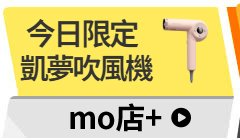 — 출처 <https://img2.momoshop.com.tw/ecm/img/online/10/998/00/000/bt_0_245_01/bt_0_245_01_P1_1_e2.png?t=1790006407364>
-  — 출처 <https://img1.momoshop.com.tw/ecm/img/online/10/998/00/000/bt_0_245_01/bt_0_245_01_P1_2_e2.png?t=1789747209601>
-  — 출처 <https://img1.momoshop.com.tw/ecm/img/online/10/998/00/000/bt_0_245_01/bt_0_245_01_P1_3_e2.png?t=1789747209601>

**페이지 메타 정보**

| page | title | description |
|---|---|---|
| [`home`](https://www.momoshop.com.tw/main/Main.jsp) | momo購物網 - 好評推薦 - 2026年9月 | momo購物網提供美妝保養、流行服飾、時尚精品、3C、數位家電、生活用品、美食旅遊票券…等數百萬件商品。快速到貨、超商取貨讓您購物最便利。mo店+商品抵用券天天搶、免運吃到飽，電視/直播商品限時下殺，每日讓您享超低價，並享有十天猶豫期；momo購物網為富邦及台灣大哥大關係企業 |

#### [OB Design](https://www.obdesign.com.tw/)

- URL: <https://www.obdesign.com.tw/>
- 페이지: **OK 1 · FAIL 0**

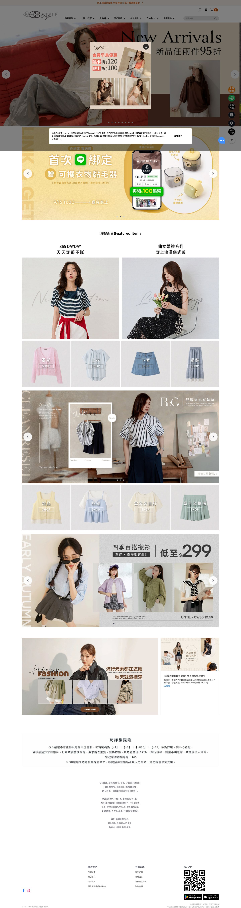

**대표 상품 이미지** (상위 6장, 출처 URL 포함)

- 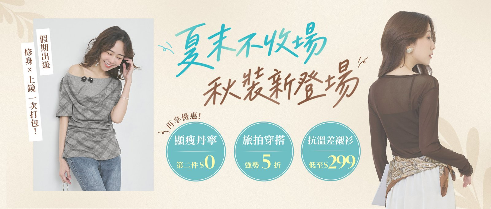 — 출처 <https://cms-static.cdn.91app.com/images/original/41602/92f19e4d-89b7-4330-9570-02cf1dff9742-1789441273-6drun5zyc4_d_1920x820_1280x547_1124x480_800x342_600x256_400x171.jpg>
- 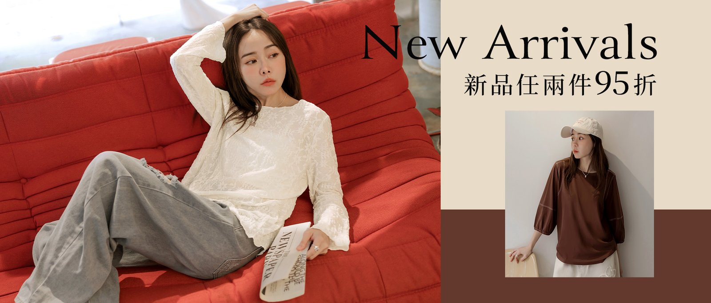 — 출처 <https://cms-static.cdn.91app.com/images/original/41602/92f19e4d-89b7-4330-9570-02cf1dff9742-1789958545-w0s0fz0ca4_d_1920x820_1280x547_1124x480_800x342_600x256_400x171.jpg>
- 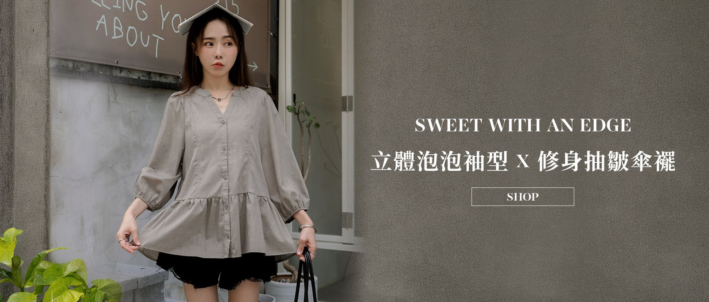 — 출처 <https://cms-static.cdn.91app.com/images/original/41602/92f19e4d-89b7-4330-9570-02cf1dff9742-1789958626-p7ileh8xvh_d_1920x820_1280x547_1124x480_800x342_600x256_400x171.jpg>
- 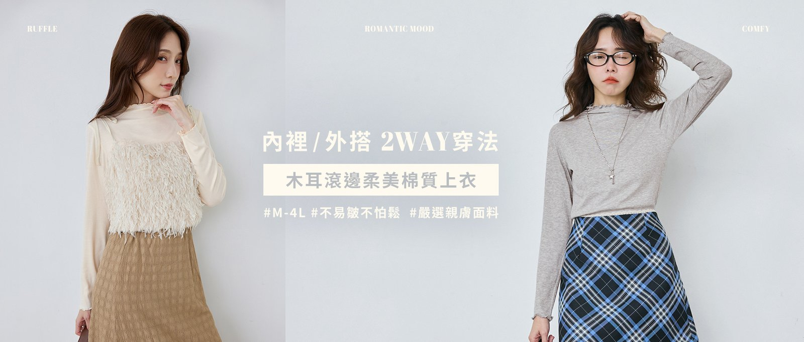 — 출처 <https://cms-static.cdn.91app.com/images/original/41602/92f19e4d-89b7-4330-9570-02cf1dff9742-1789958669-a0d3jhklbp_d_1920x820_1280x547_1124x480_800x342_600x256_400x171.jpg>
- 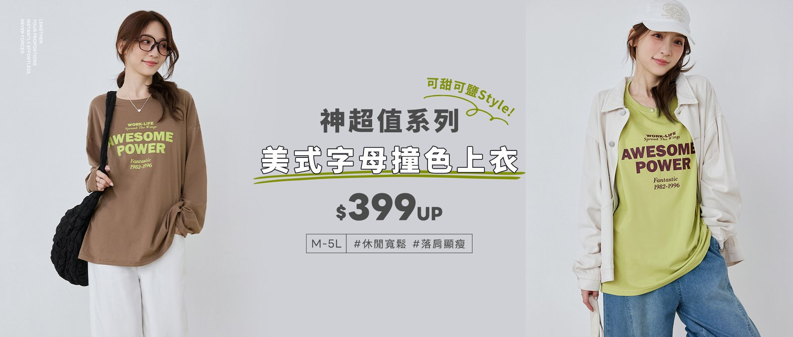 — 출처 <https://cms-static.cdn.91app.com/images/original/41602/92f19e4d-89b7-4330-9570-02cf1dff9742-1789958731-3sy0baovmv_d_1920x820_1280x547_1124x480_800x342_600x256_400x171.jpg>
-  — 출처 <https://cms-static.cdn.91app.com/images/compress/41602/92f19e4d-89b7-4330-9570-02cf1dff9742-1789958731-3sy0baovmv_d_400x171.webp>

**페이지 메타 정보**

| page | title | description |
|---|---|---|
| [`home`](https://www.obdesign.com.tw/) | OB嚴選｜高CP值人氣熱銷服飾，流行服飾品牌 | 你的日常穿搭好夥伴，快上OB嚴選找，OB嚴選提供女裝、孕童、運動、男裝各項流行服飾，秉持優質服務給你高CP值的購物體驗。各種風格都能滿足熱愛穿搭的你，天天上新品，快速出貨，一起加入OB style！網路人氣服飾品牌OB嚴選 |

#### [PChome](https://24h.pchome.com.tw/)

- URL: <https://24h.pchome.com.tw/>
- 페이지: **OK 0 · FAIL 1**

**실패 페이지**

- `home` — http_status_429

#### [Pinkoi Taiwan](https://www.pinkoi.com/)

- URL: <https://www.pinkoi.com/>
- 페이지: **OK 2 · FAIL 0**

**대표 상품 이미지** (상위 6장, 출처 URL 포함)

-  — 출처 <https://cdn04.pinkoi.com/pinkoi.site/logo/og_image.png>

**페이지 메타 정보**

| page | title | description |
|---|---|---|
| [`accessories`](https://en.pinkoi.com/) | Pinkoi | Asia’s cross-border design marketplace | Design the way you are | Shop for original design products from Asia's independent designers. Pinkoi lives and breathes great design, great quality, great service, a |
| [`bags`](https://en.pinkoi.com/) | Pinkoi | Asia’s cross-border design marketplace | Design the way you are | Shop for original design products from Asia's independent designers. Pinkoi lives and breathes great design, great quality, great service, a |

#### [Yahoo Taiwan Shopping](https://tw.buy.yahoo.com/)

- URL: <https://tw.buy.yahoo.com/>
- 페이지: **OK 1 · FAIL 0**

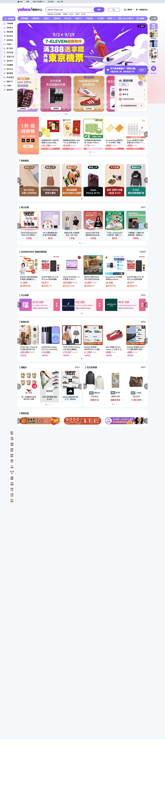

**대표 상품 이미지** (상위 6장, 출처 URL 포함)

- 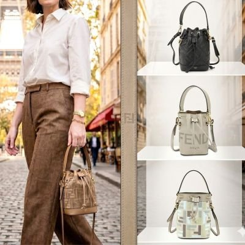 — 출처 <https://img.yec.tw/zp/MerchandiseImages/2046a9f899-Gd-11789427.jpg>
- 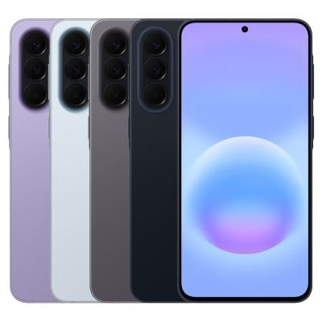 — 출처 <https://img.yec.tw/zp/MerchandiseImages/EFFDF5CBFE-SP-22541435.jpg>
- 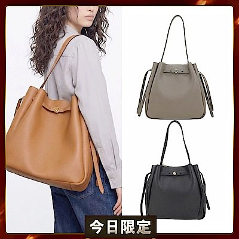 — 출처 <https://img.yec.tw/zp/MerchandiseImages/A690221151-Gd-12218410.jpg>

**페이지 메타 정보**

| page | title | description |
|---|---|---|
| [`home`](https://tw.buy.yahoo.com/) | Yahoo購物中心 - 最懂生活的人 | 數百萬件商品，貼心客服為您服務，15天鑑賞期購物保障！ |

### 4.5 태국 _( Thailand )_

- 한국 수출규모 순위: **#8** · region: `asia` · tier `1` · currency `THB`
- 수집 사이트: **5개** (성공 4)
- 메모: 동남아 K-패션 핵심 시장
#### [Central Online](https://www.central.co.th/)

- URL: <https://www.central.co.th/>
- 페이지: **OK 1 · FAIL 0**

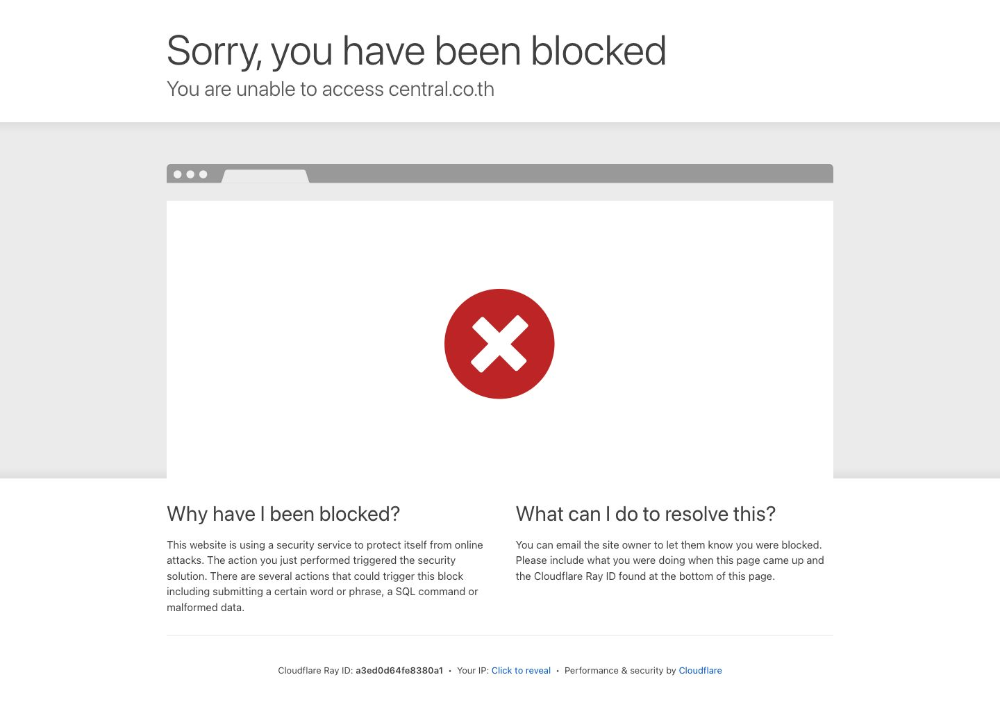

**페이지 메타 정보**

| page | title | description |
|---|---|---|
| [`home`](https://www.central.co.th/th) | Attention Required! | Cloudflare |  |

#### [Lazada Thailand Fashion](https://www.lazada.co.th/)

- URL: <https://www.lazada.co.th/>
- 페이지: **OK 1 · FAIL 0**

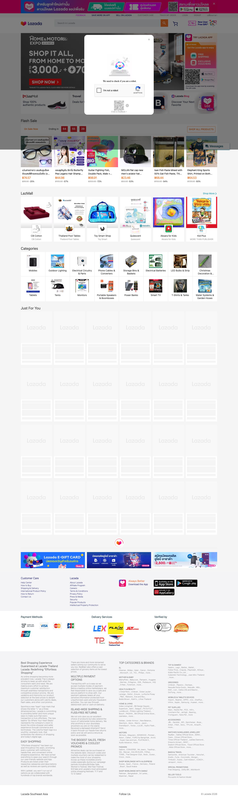

**대표 상품 이미지** (상위 6장, 출처 URL 포함)

-  — 출처 <https://img.lazcdn.com/us/domino/40845120240f19d13f738fa9a7978edd.png>
-  — 출처 <https://img.lazcdn.com/g/tps/images/ims-web/TB1KB2laMFY.1VjSZFnXXcFHXXa.png>
-  — 출처 <https://img.lazcdn.com/us/domino/4c4b508c-b075-4eb1-8e2e-cd6f08805a04_TH-1976-688.jpg_2200x2200q80.jpg>
-  — 출처 <https://img.lazcdn.com/us/domino/3312e6ed-eaad-4df4-b8e3-8a2eac605c92_TH-1976-688.jpg_2200x2200q80.jpg>
-  — 출처 <https://img.lazcdn.com/us/domino/ad405124-2b3f-4d08-b2c2-f67aa5a29dbd_TH-1976-688.jpg_2200x2200q80.jpg>
-  — 출처 <https://img.lazcdn.com/us/domino/3572691b-40bd-4adb-bb42-cec5f3c71063_TH-1976-688.jpg_2200x2200q80.jpg>

**페이지 메타 정보**

| page | title | description |
|---|---|---|
| [`home`](https://www.lazada.co.th/#?) | Lazada Thailand | ช้อปออนไลน์ สินค้าดี พร้อมดีลพิเศษทุกวัน | พบกับ Lazada แพลตฟอร์มช้อปปิ้งชั้นนำในอาเซียน พร้อมบริการเก็บเงินปลายทาง LazMall LazFlash และดีลเด็ดจากแบรนด์ดังทุกวัน |

#### [Pomelo](https://www.pomelofashion.com/)

- URL: <https://www.pomelofashion.com/>
- 페이지: **OK 0 · FAIL 2**

**실패 페이지**

- `new` — robots_disallowed
- `best` — robots_disallowed

#### [Shopee Thailand Fashion](https://shopee.co.th/)

- URL: <https://shopee.co.th/>
- 페이지: **OK 1 · FAIL 0**

**대표 상품 이미지** (상위 6장, 출처 URL 포함)

-  — 출처 <https://deo.shopeemobile.com/shopee/shopee-pcmall-live-sg/assets/1c8bdaaf45e1fd48.png>
-  — 출처 <https://deo.shopeemobile.com/shopee/shopee-pcmall-live-sg/homepagefe/42ba6075c82a85ab.png>

**페이지 메타 정보**

| page | title | description |
|---|---|---|
| [`home`](https://shopee.co.th/verify/captcha?anti_bot_tracking_id=gqRjZGVrxHSFomtptTE0MjUxOnRyYWNraW5nX2lkX2tleaJrdtEAAqRhbGdv0gAAAGSjZGVrwKJjdMRAAAAADMPc0R2hCGactn2nr9DcAFBQpHMoHjAbjrdsrt_pSEAwvu3D4ZqEQ0V0kSHM0Nn9K_1xVJ0eNyntbq4tnqpjaXBoZXJ0ZXh0xQOGAAAADMdJ8jQQUpy2441rddw5ujWaBwK7EKteyUhM6YZ6XFqzeSZ-MLe7RR_pd1tOvS1Ycapudpz4C9WDUstznocvIaBQH5ujSD3BYdwAudaN4EgjCOBWj7TJ16-AnQR6qL82G0wzUZpt22c5moEtsv4pTFg_mFvo3eKGzzMVJY08P1L8B5jwrbw7EXHmyF6Dk5BgsBqw7TVZFsCkoVQtODVLLeOtbbwyIS_uqgmlybGACeuYQ_fBGLREYWnAG_8UnHHv0CuovDrFNNSXiSKvMfeOVpf67-ssl0x7gIXDw3gQ4LkvWrMUhet_QIM9qxK1bijgwIqnoMxaWS4s0zmqMzk94jIAPHU_ITOGu7Ff6TMzvCjvIM5uAAYXs04T7oFs_SVMZngM1GZA5YP73pThJVvKIgA0QnOvXLQAetogS0Um8NZzzEBB-4bTa8VlV5fGqRpYArtG7bPPOd4cplnhhQ38VjO-IUeEbAZyFgVtqPZoUW2ENtHRH9MmTMJDBEQBWfo6UKQTcBAfvgNnGM7h7U_POnFjqWrDLesRi6jcBPvqfVDZDhtKYwlwOvHPy8Y3pgmeRCdHNtuG82euwylkIpV5tTStyROZh_OGCbtyp-TrxJNYmFZvSjiish0YaUZK2nMDe_BH7-8-6akPFPXVVYPElMgmoQey3VDyBwvXpAWFbQAalkzS2jPudaFlNRUDjZuXnNPaqdN_jFdPSa_daSucvJopzXrxMTQy1hn0xMeBdmw2YYqK4BWgaSeuU20rfqE72q9jrNrbhKH1BS6qJuLxjjar8cY6wrBE-1iohS21W6Bi4hNr31UrQWtQ3uXTFu4djHckR8-3NNPQEbxt4H-XPgbri2zQVq1DfPPT2FafnPS6px54x39ADrYkuHml3LCp6mICYL5iV9qUYLHNzlYno1twanQA0_cV_n2wwa890SMSjlX3rRlyg_6ri0aaXVLy22T3PGyb55gixrwTEUFDW-zsroGIOqfFjJkNHXf-L-cQE_VoU14Y0Dr-dgUW2gDSYi4Cexi5yeqK_cjjIuQUuXCBlYubEXEwTRviaYvMEgLnwmDaL8o8v0p0TC2i-OS5I9b-P-7VRYypgSaCZszvigmvrrG2HkSWNfZLjaW6UV2WwtfGCZQ7034vDxRtZ5EvkvO4HHxr69SMCvB-DpGaidQFTxDf4oTHM8R20By5Uzoz_38&app_key=FlashSale.PC&client_id=1&next=https%3A%2F%2Fshopee.co.th%2Fverify%2Ftraffic%3F%3Fclient_id%3D%26next%3Dhttps%253A%252F%252Fshopee.co.th%252F%26redirect_type%3D2%26should_replace_history%3Dfalse&redirect_type=2&scene=crawler_item&should_replace_history=false) | Shopee Thailand | ช้อปปิ้งออนไลน์ ผ่านมือถือและเว็บไซต์ | ซื้อทุกอย่างที่ Shopee! ช้อปปิ้งออนไลน์จบในที่เดียว ซื้อหรือขายก็ง่ายสุดๆ มีโปรและส่วนลดเพียบ การันตีโดย Shopee | ส่งฟรีทั่วไทย | เก็บเงินปล |

#### [Zalora Thailand](https://www.zalora.co.th/)

- URL: <https://www.zalora.co.th/>
- 페이지: **OK 1 · FAIL 0**

**대표 상품 이미지** (상위 6장, 출처 URL 포함)

-  — 출처 <https://www.zalora.co.th/images/landingpage/525x500.gif>

**페이지 메타 정보**

| page | title | description |
|---|---|---|
| [`home`](https://www.zalora.co.th/) | ZALORA - ASIA'S LEADING ONLINE FASHION DESTINATION |  |

### 4.6 미국 _( United States )_

- 한국 수출규모 순위: **#1** · region: `north_america` · tier `1` · currency `USD`
- 수집 사이트: **5개** (성공 4)
- 메모: 한국 의류 최대 수출국. 대형 이커머스와 브랜드 커머스 중심
#### [Etsy](https://www.etsy.com/)

- URL: <https://www.etsy.com/>
- 페이지: **OK 2 · FAIL 0**

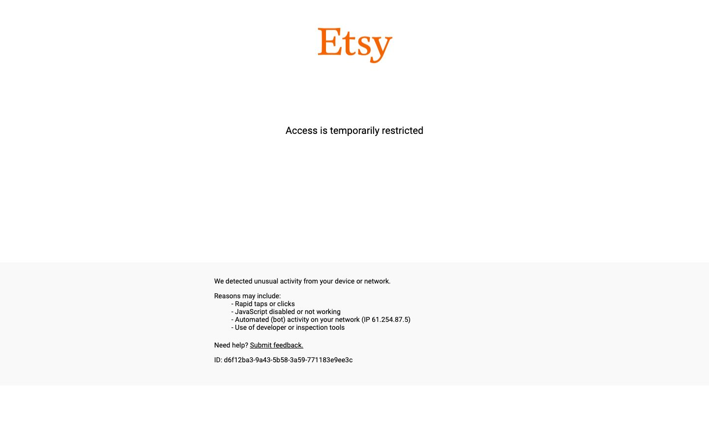

**페이지 메타 정보**

| page | title | description |
|---|---|---|
| [`trending_jewelry`](https://www.etsy.com/c/jewelry) | etsy.com |  |
| [`trending_accessories`](https://www.etsy.com/c/accessories) | etsy.com |  |

#### [Macy's](https://www.macys.com/)

- URL: <https://www.macys.com/>
- 페이지: **OK 1 · FAIL 0**

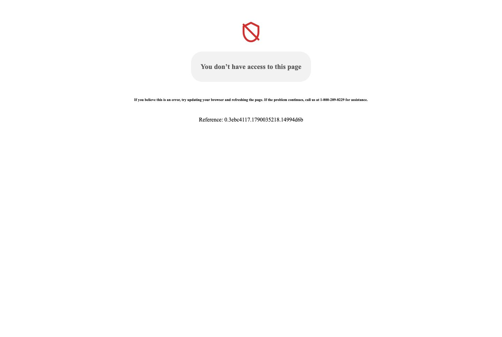

**페이지 메타 정보**

| page | title | description |
|---|---|---|
| [`new`](https://www.macys.com/shop/whats-new?id=14834) | Access Denied - Macy's | Access denied 403 |

#### [Nordstrom](https://www.nordstrom.com/)

- URL: <https://www.nordstrom.com/>
- 페이지: **OK 2 · FAIL 0**

**대표 상품 이미지** (상위 6장, 출처 URL 포함)

-  — 출처 <https://n.nordstrommedia.com/it/7f51c20a-b069-4154-9cfb-1e6d13a7c608.gif>
- 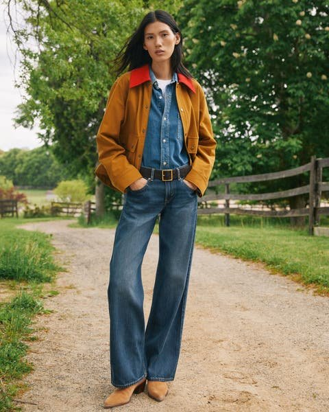 — 출처 <https://n.nordstrommedia.com/is/image/nordstrom/WMNS_ADC03F_0826_0089.jpeg?width=240&dpr=2&crop=4388%3A5485%2Coffset-x50%2Coffset-y71.956>
-  — 출처 <https://n.nordstrommedia.com/is/image/nordstrom/MENS_DRES02F_0826_0082.jpeg?width=240&dpr=2&crop=3600%3A4500%2Coffset-x50%2Coffset-y29.508>
-  — 출처 <https://n.nordstrommedia.com/is/image/nordstrom/DESW_APP01F_0826_0046.jpeg?width=240&dpr=2&crop=4480%3A5600%2Coffset-x50%2Coffset-y37.441&trim=0%2C0%2C0.001%2C0>
- 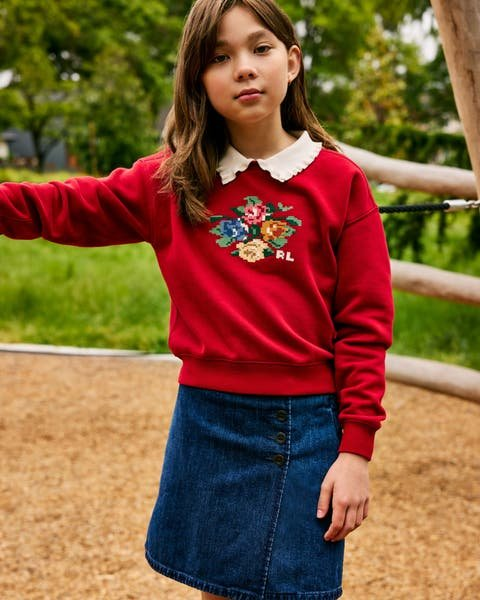 — 출처 <https://n.nordstrommedia.com/is/image/nordstrom/KIDS_BG02F_0726_01586.jpeg?width=240&dpr=2&crop=5334%3A6667.5%2Coffset-x50%2Coffset-y0>
-  — 출처 <https://n.nordstrommedia.com/is/image/nordstrom/BEA_MKUP06P_0626.jpeg?width=240&dpr=2&crop=5370%3A6712.5%2Coffset-x50%2Coffset-y50>

**페이지 메타 정보**

| page | title | description |
|---|---|---|
| [`new`](https://www.nordstrom.com/browse/new) | New & Now | Nordstrom | Shop a great selection of New Arrivals at Nordstrom.com. Top brands. New trends. |
| [`women`](https://siteclosed.nordstrom.com/invitation.html) | Nordstrom |  |

#### [Revolve](https://www.revolve.com/)

- URL: <https://www.revolve.com/>
- 페이지: **OK 0 · FAIL 2**

**실패 페이지**

- `new` — playwright_error: Error: Page.goto: net::ERR_HTTP2_PROTOCOL_ERROR at https://www.revolve.com/new/br/c79f88/
Call log:
  - navigating to "https://www.revolve.com/new/br/c79f88/", waiting until "domcontentloaded"

- `trending` — playwright_error: Error: Page.goto: net::ERR_HTTP2_PROTOCOL_ERROR at https://www.revolve.com/most-loved/br/4a9ca5/
Call log:
  - navigating to "https://www.revolve.com/most-loved/br/4a9ca5/", waiting until "domcontentloaded"

#### [Urban Outfitters](https://www.urbanoutfitters.com/)

- URL: <https://www.urbanoutfitters.com/>
- 페이지: **OK 1 · FAIL 0**

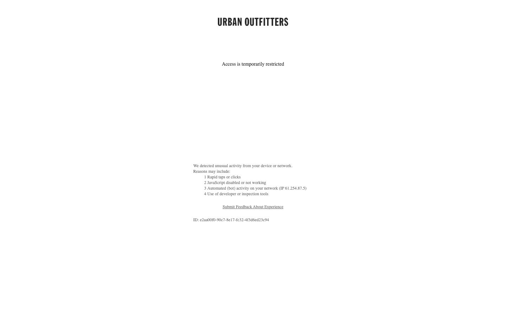

**페이지 메타 정보**

| page | title | description |
|---|---|---|
| [`new_women`](https://www.urbanoutfitters.com/womens-new-arrivals) | urbanoutfitters.com |  |

### 4.7 베트남 _( Vietnam )_

- 한국 수출규모 순위: **#4** · region: `asia` · tier `1` · currency `VND`
- 수집 사이트: **5개** (성공 5)
- 메모: 의류 생산기지/원단 수출 비중 큼. 빠르게 성장하는 이커머스
#### [Canifa](https://canifa.com/)

- URL: <https://canifa.com/>
- 페이지: **OK 1 · FAIL 0**

**대표 상품 이미지** (상위 6장, 출처 URL 포함)

-  — 출처 <https://2885371169.e.cdneverest.net/Simiconnector/BannerSlider/a/o/ao-gio_topbanner_desktop-180826.webp>
- 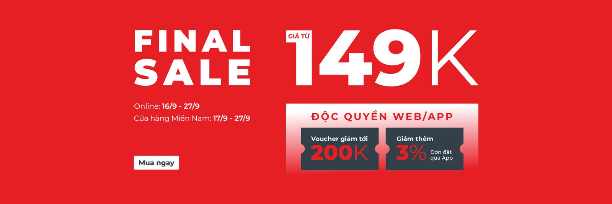 — 출처 <https://2885371169.e.cdneverest.net/Simiconnector/BannerSlider/f/i/finalsale_topbanner_desktop-160926.webp>
-  — 출처 <https://2885371169.e.cdneverest.net/Simiconnector/BannerSlider/j/e/jeans_topbanner_desktop-110926a.webp>
-  — 출처 <https://canifa.com/_nuxt/img/chatbot-icon.c84d6ec.webp>
-  — 출처 <https://canifa.com/_nuxt/img/chat-zalo.ab5351f.webp>

**페이지 메타 정보**

| page | title | description |
|---|---|---|
| [`home`](https://canifa.com/) | CANIFA | Fashion For All | CANIFA - thương hiệu thời trang hàng đầu Việt Nam. Hàng ngàn mẫu quần áo phụ kiện nam, nữ, trẻ em cao cấp, chất lượng, an toàn liên tục được |

#### [IVY moda](https://ivymoda.com/)

- URL: <https://ivymoda.com/>
- 페이지: **OK 1 · FAIL 0**

**대표 상품 이미지** (상위 6장, 출처 URL 포함)

-  — 출처 <https://cotton4u.vn/files/news/2026/09/18/1a249b0da6bda290a0d8e8198f8a7aa1.webp>
-  — 출처 <https://cotton4u.vn/files/product/thumab/400/2026/09/04/83f65b9f520dec4baaae7d4c23955870.webp>
-  — 출처 <https://cotton4u.vn/files/product/thumab/400/2026/09/04/2a972ed5e530c54b0feaa89c5e0d03fe.webp>
-  — 출처 <https://cotton4u.vn/files/product/thumab/400/2026/09/04/d2d1ff32270bd49cc3a46396e2c64356.webp>
-  — 출처 <https://cotton4u.vn/files/product/thumab/400/2026/09/04/404cd34b6e7a21325201e266b2797aac.webp>
-  — 출처 <https://cotton4u.vn/files/product/thumab/400/2026/09/04/276fb7bcba4d8de4223eadf84797fecd.webp>

**페이지 메타 정보**

| page | title | description |
|---|---|---|
| [`home`](https://ivymoda.com/) | IVY moda - Thời Trang Công Sở Hiện Đại | IVY moda |  |

#### [Lazada Vietnam](https://www.lazada.vn/)

- URL: <https://www.lazada.vn/>
- 페이지: **OK 1 · FAIL 0**

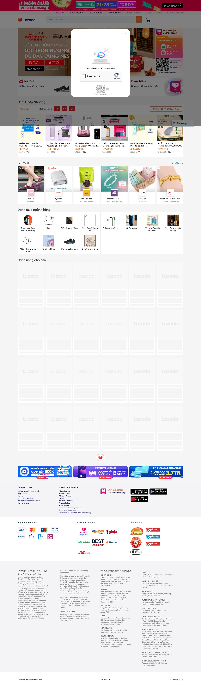

**대표 상품 이미지** (상위 6장, 출처 URL 포함)

-  — 출처 <https://img.lazcdn.com/us/domino/2ad4f22ce5a43dc145f221d13feed352.png>
-  — 출처 <https://img.lazcdn.com/g/tps/images/ims-web/TB1T7K2d8Cw3KVjSZFuXXcAOpXa.png>
-  — 출처 <https://img.lazcdn.com/us/domino/b82379b1-5399-479d-b851-e4aa31b7def1_VN-1976-688.jpg_2200x2200q80.jpg>
- 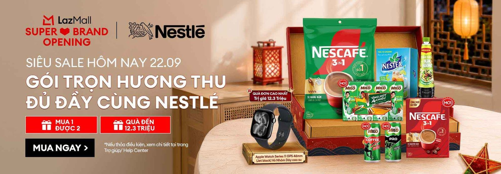 — 출처 <https://img.lazcdn.com/us/domino/5f9eae8f-539d-4f1d-8573-d910b82026b7_VN-1976-688.jpg_2200x2200q80.jpg>
- 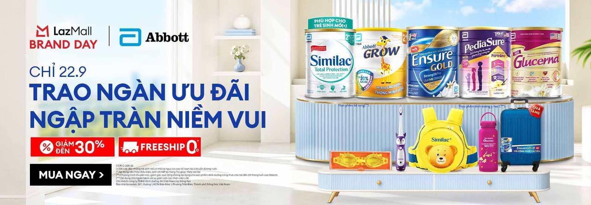 — 출처 <https://img.lazcdn.com/us/domino/fbb00e51-ba85-420e-9d98-e3a54e8926cb_VN-1976-688.jpg_2200x2200q80.jpg>
- 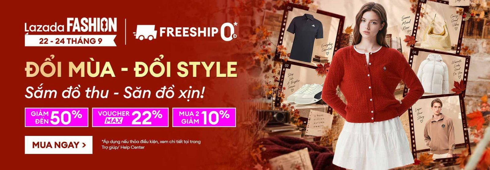 — 출처 <https://img.lazcdn.com/us/domino/c5d90ab7-a0fe-47ba-8d49-998eda961723_VN-1976-688.jpg_2200x2200q80.jpg>

**페이지 메타 정보**

| page | title | description |
|---|---|---|
| [`home`](https://www.lazada.vn/#?) | Lazada Việt Nam | Mua Sắm Online, Giá Tốt Nhất Mỗi Ngày | Mua sắm đồ điện tử, thời trang, làm đẹp và đồ chơi giá cả phải chăng. Đảm bảo sản phẩm chính hãng và trải nghiệm mua sắm tiện lợi – mua ngay |

#### [Shopee Vietnam](https://shopee.vn/)

- URL: <https://shopee.vn/>
- 페이지: **OK 1 · FAIL 0**

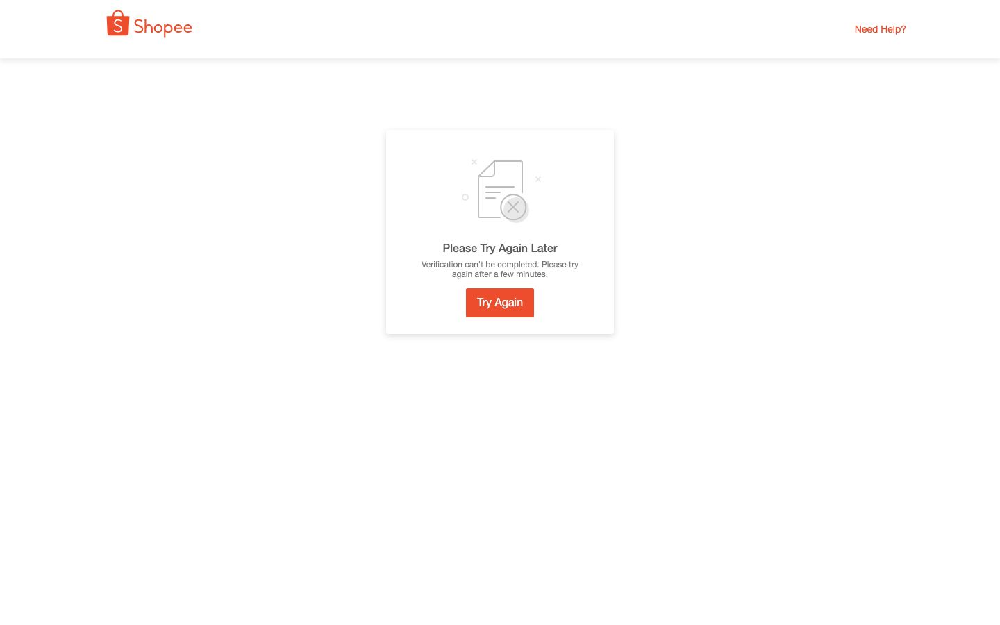

**대표 상품 이미지** (상위 6장, 출처 URL 포함)

-  — 출처 <https://deo.shopeemobile.com/shopee/shopee-pcmall-live-sg/homepagefe/42ba6075c82a85ab.png>

**페이지 메타 정보**

| page | title | description |
|---|---|---|
| [`home`](https://shopee.vn/verify/captcha?anti_bot_tracking_id=gqRjZGVrxHSFomtptTE0MjUxOnRyYWNraW5nX2lkX2tleaJrdtEAAqRhbGdv0gAAAGSjZGVrwKJjdMRAAAAADMPc0R2hCGactn2nr9DcAFBQpHMoHjAbjrdsrt_pSEAwvu3D4ZqEQ0V0kSHM0Nn9K_1xVJ0eNyntbq4tnqpjaXBoZXJ0ZXh0xQODAAAADPgAsar-WLotWX1gtzXCSYurFcUOZM09Su7EjvkxJPKwvxfgGUGSOp-9L8UT6xsHRmIIpeJJlCtlYI-yPCwTzRumFXHF6j5rbAoUGyd6qpL80QaNnPyetJzzvqYlKdNZD-71hfJ6kZBAD9cbq-Ix8tmPGgTda62QKWalkdul3meFyof6A35Y2LybMAQ4yWrJWUEisKJ8_uG5RPPkY63JTCATKy6Ca8YHt3-JrDXsI92TOX7XSzucwDqYZ9UWi251isbk-QaUhtSG93OUKjC8V7P9ue1MUNE-C5gczfwVwTota4aaO15t3tN5cd9fILeiNh6g0NdBVWcqkYMXTPM3eC9OUIKZ1hEKlYXlsWW91LscUqu9XOKq-cv0WaKczlLhz9GyqEbIbDPnrUoeiFGXlVIK5vKNeE_akR05gjO0uUtVeY7TTtPaKnoRFyoG7ZRdEaoXmnUKTpYziUq8Xu9c5UW5efmyL2wI4hZaX21AaQQ6529Fs-agUbEAFkrtYMKuMohwtG0A4IEahCbAOMMv5lJ_1algtFtki3Xdd9hnwAPkyih7dBvSh0k1GKkCJJhl-6s5ueiX-B_eZ_KJ01Gf8D5FLmDBcteHvPcF0tZ8zj7dbTzEWm5TfcZaiOR6uTtjDwTxD3O4rfJSDD-QVOEjysjt0R-wagngI46wJxXGHgPIRie6iOYH9rfunXvLxWpnLz1nS0l37ujUJgro5PmqzCG9EybajM2K4KUza_F4zhnNf9qVkdWjymijP5mET11sTgzJHYPQ1_h5zU6zWBVtQBdWPyC2h7cJkuyv1FyvBwUkoajVosvyyUsLaEMzX9uWXVAcxNex39t3n3f64cxNbnRH3fuGMRXzxX5i2tPXBftnYnoanGgtloQn0RbvllNxP01JxhP6NDEXcb4d3G1XuR08Wt-fB1NRZ680vnlMqR1WMSHrsgQ6zVHdoZD7hNeu5-ATuJzqyCeh7STvn5IFCWMvjZYVu4Jh79O5OmdarOmT-b0ASzAbCoxInzfppqXECkn4Dc__M6uc7uUTazUtgvX7YhBojrIvqwu9HgBrc0464AOvqNmjhFl3OPrSIQzbsgw1ES9661RK7Ip4yLt6ahJJXvgo1sabtiyLDFp2O3NWJYEWehFPyLGENRH5pJBPRAhNQ8z_klYnkmksGWdkRLHnw-LsEDDiAxpt_JUgZ7c&app_key=FlashSale.PC&client_id=1&next=https%3A%2F%2Fshopee.vn%2Fverify%2Ftraffic%3F%3Fclient_id%3D%26next%3Dhttps%253A%252F%252Fshopee.vn%252F%26redirect_type%3D2%26should_replace_history%3Dfalse&redirect_type=2&scene=crawler_item&should_replace_history=false) | Shopee Việt Nam | Mua Sắm Online | Mua sắm trực tuyến hàng triệu sản phẩm ở tất cả ngành hàng. Giá tốt & Miễn phí vận chuyển. Mua và bán online trong 30 giây. Voucher Xtra | F |

#### [Tiki](https://tiki.vn/)

- URL: <https://tiki.vn/>
- 페이지: **OK 1 · FAIL 0**

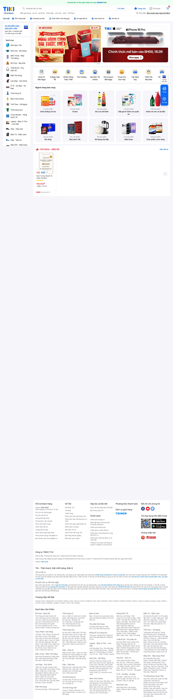

**대표 상품 이미지** (상위 6장, 출처 URL 포함)

-  — 출처 <https://salt.tikicdn.com/cache/100x100/ts/category/ed/20/60/afa9b3b474bf7ad70f10dd6443211d5f.png>
-  — 출처 <https://salt.tikicdn.com/cache/100x100/ts/category/f6/22/46/7e2185d2cf1bca72d5aeac385a865b2b.png>
-  — 출처 <https://salt.tikicdn.com/cache/100x100/ts/category/54/c0/ff/fe98a4afa2d3e5142dc8096addc4e40b.png>
-  — 출처 <https://salt.tikicdn.com/cache/100x100/ts/category/13/64/43/226301adcc7660ffcf44a61bb6df99b7.png>
-  — 출처 <https://salt.tikicdn.com/cache/100x100/ts/category/75/34/29/78e428fdd90408587181005f5cc3de32.png>
-  — 출처 <https://salt.tikicdn.com/cache/100x100/ts/category/61/d4/ea/e6ea3ffc1fcde3b6224d2bb691ea16a2.png>

**페이지 메타 정보**

| page | title | description |
|---|---|---|
| [`home`](https://tiki.vn/) | Tiki - Mua hàng online giá tốt, hàng chuẩn, ship nhanh | Tiện lợi mua sắm hàng triệu mặt hàng, dịch vụ. Vô vàn ưu đãi freeship, mã giảm giá. Hoàn tiền 15% tối đa 600k/tháng với thẻ tín dụng TikiCAR |

## 5. 의류 카테고리별 글로벌 트렌드

| # | 카테고리 | 건수 | 대표 상품명 |
|---:|---|---:|---|
| 1 | `팬츠` | 10 | [가을바지🍁/made] 모엔르 비죠 코튼 팬츠 (2color) · [서경PICK🤎][골반뽕탈부착][~2XL][8만장🏆][힙딥커버]렌더 코튼 부츠컷 팬츠 (숏/롱ver)(7color) · [후기인증핏👖/4만장돌파!] made. 투데이 와이드 중청데님팬츠 (숏/베이직/롱) |
| 2 | `셔츠` | 7 | [가을셔츠🍂/made] 메이킹 스트라이프 셔츠 (반팔/긴팔) · [가을셔츠🤎/스트라이프&무지/10만장돌파/made] 로셀 라인 셔츠 (7color) · [🥇레이어드룩1위] made. 세이 셔츠앤 레이어링 니트 (워셔블니트) - 5 color |
| 3 | `니트` | 6 | ARKVE 옆탭 골지 니트 여성 여자 패션 양말 SOCKS · SET004_우드브라운 니트 울 돌돌이 무압박 추석 설 명절 답례품 브랜드 선물 삭스 SOCKS   양말 · [단독컬러💖][소프트얀] 딥 브이넥 니트_SPKWG49G01 |
| 4 | `jacket` | 3 | Northcove Raglan hood Goosedown Jacket Charcoal · Frost Hood Duckdown Light Jacket Dark Brown · Frost Hood Duckdown Light Jacket Black |
| 5 | `후드` | 3 | NBNAG3W832 / WOMEN ALLDAY 워시드 후드형 바람막이 (D/CHARCOAL) · NBNAG3W832 / WOMEN ALLDAY 워시드 후드형 바람막이 (D/BLUE) · NBNAG3W822 / WOMEN ALLDAY 후드형 바람막이 (S/BLUE) |
| 6 | `cardigan` | 2 | [네세서리 X 솔비] Wool Roll Detail Cardigan (Charcoal) · Chunky Handmade Knit Cardigan (Beige) |
| 7 | `슬랙스` | 2 | [🍁가을/3기장선택!] made. 모먼트 투커버 올데이슬랙스 (+숏/베이직/롱ver) - 4 size · [🏆역대급100만장/3기장선택!] made. 마켓 와이드 트레이닝슬랙스 (+숏/베이직/롱ver) - 4 size |
| 8 | `자켓` | 2 | 워싱레더자켓 · [야상 1등👍] 이즈니 투웨이 숏야상/봄야상/봄자켓/야상자켓/야상점퍼/오버핏야상/가을옷/가을신상/간절기/간절기아우터/간절기자켓/워크자켓/개강룩/가을자켓 |
| 9 | `맨투맨` | 2 | [멜라운지]와플 버튼 맨투맨 · 아다놀라 바시티 릴랙스드 퍼넬 넥 하프 집업 맨투맨 켄달제너 착용 |
| 10 | `데님` | 2 | [서경 PICK][어텀🍂][ordinaire] 디핀 데님 (11color/숏·롱/XS-L) · [26FW트렌드핏/스트레이트핏🍁가을데님/누적12만장🏆재구매율1등/코튼+데님][출근룩/스판데님/세미와이드/와이드데님][MADE]투게더워싱세미와이드데님 - 9color |

**국가별 의류 TOP**

- **korea**: `팬츠`(10), `셔츠`(7), `니트`(6), `jacket`(3), `후드`(3)
## 6. 악세사리 카테고리별 글로벌 트렌드

| # | 카테고리 | 건수 | 대표 상품명 |
|---:|---|---:|---|
| 1 | `양말` | 25 | ARKVE 미우 골지 면 여성 여자 패션 양말 SOCKS · 1339 이중 레이어 핑크 탭 여자 패션 양말   socks · 1335 빨강 스트라이프 여성 패션 양말   브랜드 |
| 2 | `부츠` | 1 | [선물포장] 부츠 화병 boots vase, blue |
| 3 | `스니커즈` | 1 | (9/30 예약배송) [lean PICK] 아콘 스니커즈 412430006 (6cm) |

**국가별 악세사리 TOP**

- **korea**: `양말`(25), `부츠`(1), `스니커즈`(1)
## 7. 국가별 가격대 비교

| 국가 | 통화 | 표본 | min | p25 | median | p75 | max | median (USD) |
|---|---|---:|---:|---:|---:|---:|---:|---:|
| korea | KRW | 116 | 2500 | 13434 | 26550 | 55740 | 2850000 | 19.16 |

> p25/p75 는 IQR 기준 분위수. USD 환산은 `config/exchange_rates.yaml` 기준 (운영자가 정기 갱신).

## 8. 국내 의류·악세사리 사업동향

### KITA K-stat

- 한국무역통계의 국가 수출입 통계 총괄 페이지입니다.
- 사이트: <https://stat.kita.net/stat/kts/ctr/CtrTotalImpExpList.screen>

| # | topic | title | url |
|---:|---|---|---|
| 1 | `trade` | KITA.NET | <https://www.kita.net/> |
| 2 | `trade` | K-stat 란? | <https://www.kita.net/pdf/statGuide/index.html#p=1> |
| 3 | `무역통계` | 무역통계 분류 | <https://stat.kita.net/stat/guide/guide_18_01.screen> |
| 4 | `trade` | 한국품목코드 | <https://stat.kita.net/stat/kts/statCode/ItemHierCodeList.screen> |
| 5 | `trade` | 해외품목코드 | <https://stat.kita.net/stat/istat/common/IstatHSCode.screen> |
| 6 | `trade` | 대륙/경제코드 | <https://stat.kita.net/stat/kts/statCode/ConEcoCodeList.screen> |
| 7 | `trade` | 수출입 총괄 | <https://stat.kita.net/stat/kts/sum/SumImpExpTotalList.screen> |
| 8 | `trade` | 가공단계 수출입 | <https://stat.kita.net/stat/kts/use/BecList.screen> |
| 9 | `trade` | 품목 수출입 | <https://stat.kita.net/stat/kts/pum/ItemImpExpList.screen> |
| 10 | `trade` | 국가 수출입 | <https://stat.kita.net/stat/kts/ctr/CtrTotalImpExpList.screen> |
| 11 | `trade` | 대륙/경제권 수출입 | <https://stat.kita.net/stat/kts/rel/RelColligationList.screen> |
| 12 | `trade` | 지자체 수출입 | <https://stat.kita.net/stat/kts/prod/ProdWholeList.screen> |
| 13 | `trade` | 항구/공항 수출입 | <https://stat.kita.net/stat/kts/port/PortImpExpList.screen> |
| 14 | `trade` | FTA체결국 수출입 | <https://stat.kita.net/stat/kts/fta/FtaCtrImpExpList.screen> |
| 15 | `trade` | 간접수출 현황 | <https://stat.kita.net/stat/ind/KtsIndMain.screen> |

### Korea Customs Service

- 수출입 현황, 물류통계 등 관세청 무역통계정보를 종합적으로 제공
- 사이트: <https://tradedata.go.kr/cts/index_eng.do>

| # | topic | title | url |
|---:|---|---|---|
| 1 | `trade` | Korea Customs Service | <http://customs.go.kr/english/main.do> |

### KOSIS

- 코시스, 국가데이터처가 제공하는 원스톱 통계 서비스, 국가승인통계, 국제통계, 북한통계, e-지방지표, 통계시각화콘텐츠, 온라인간행물 등 제공
- 사이트: <https://kosis.kr/statisticsList/statisticsListIndex.do?parmTabId=M_01_01&vwcd=MT_ZTITLE&menuId=M_01_01&outLink=Y&entrType=>

| # | topic | title | url |
|---:|---|---|---|
| 1 | `statistics` | 쉽게 보는 통계 | <http://kosis.kr/easyViewStatis/customStatisIndex.do?vwcd=MT_TM1_TITLE&menuId=M_03_01> |
| 2 | `statistics` | 이슈별 접근 | <http://kosis.kr/easyViewStatis/customStatisIndex.do?vwcd=MT_TM2_TITLE&menuId=M_03_02> |
| 3 | `statistics` | 통계시각화콘텐츠 | <http://kosis.kr/easyViewStatis/visualizationIndex.do> |
| 4 | `statistics` | 온라인간행물 | <http://kosis.kr/publication/publicationThema.do> |
| 5 | `statistics` | 기획간행물 | <http://kosis.kr/publication/publicationStat.do> |
| 6 | `statistics` | KOSIS 길라잡이 | <http://kosis.kr/civilComplaint/kosisGuideIndex.do> |
| 7 | `statistics` | 홈페이지 개선의견 | <http://kosis.kr/civilComplaint/siteRequestList.do> |
| 8 | `statistics` | 찾아가는 KOSIS | <http://kosis.kr/civilComplaint/kosisEduIndex.do> |
| 9 | `statistics` | 서비스 소개 | <http://kosis.kr/serviceInfo/kosisIntroduce.do> |
| 10 | `statistics` | 국가통계현황 | <http://kosis.kr/serviceInfo/statisInstitution.do> |
| 11 | `statistics` | 국가통계 공표일정 | <http://kosis.kr/serviceInfo/statisPublicationList.do> |
| 12 | `statistics` | 팩트체크 서비스 | <http://kosis.kr/serviceInfo/factCheckList.do> |
| 13 | `statistics` | 서비스정책 | <http://kosis.kr/serviceInfo/useGuide.do> |
| 14 | `statistics` | 공유서비스 (OpenAPI) | <http://kosis.kr/serviceInfo/openAPIGuide.do> |
| 15 | `statistics` | English | <https://kosis.kr/eng> |

### KOTRA

- 트라이빅(TriBig)은 코트라(KOTRA)가 제공하는 무역투자 빅데이터 플랫폼으로 무역투자통계, 국가별 시장정보, 품목별 유망시장, 기업별 맞춤정보, 해외바이어 정보의 서비스를 제공합니다.
- 사이트: <https://www.kotra.or.kr/bigdata/visualization/korea#search/ALL/ALL/2024>

| # | topic | title | url |
|---:|---|---|---|
| 1 | `trade` | kotra 무역투자24 | <https://www.kotra.or.kr/bigdata/kotraSsoRedirect?targetURL=https://www.kotra.or.kr> |
| 2 | `trade` | 해외비즈니스 정보 포털 | <https://www.kotra.or.kr/bigdata/kotraSsoRedirect?targetURL=https://dream.kotra.or.kr/dream> |
| 3 | `trade` | 글로벌 전시포털 | <https://www.kotra.or.kr/bigdata/kotraSsoRedirect?targetURL=https://www.gep.or.kr/> |
| 4 | `trade` | KOTRA 해외인재유치센터 | <https://www.kotra.or.kr/gtc_kor> |
| 5 | `trade` | 투자유치정보제공 | <https://www.kotra.or.kr/bigdata/kotraSsoRedirect?targetURL=https://www.investkorea.org/> |
| 6 | `수출지원` | 수출지원 온라인 플랫폼 | <https://www.kotra.or.kr/bigdata/kotraSsoRedirect?targetURL=https://www.buykorea.or.kr/> |
| 7 | `trade` | 빅데이터 서비스 | <https://www.kotra.or.kr/bigdata/> |
| 8 | `trade` | 경제외교 활용포털 | <https://www.kotra.or.kr/bigdata/kotraSsoRedirect?targetURL=https://president.globalwindow.org> |
| 9 | `trade` | 방산물자교역지원센터 | <https://www.kotra.or.kr/bigdata/kotraSsoRedirect?targetURL=https://www.kotra.or.kr/kodits> |
| 10 | `trade` | 외투기업고충처리 | <https://www.kotra.or.kr/bigdata/kotraSsoRedirect?targetURL=https://ombudsman.kotra.or.kr/ob-kr> |
| 11 | `trade` | 수출바우처 · 지사화 | <https://www.exportvoucher.com> |
| 12 | `trade` | 무역투자통계 | <https://www.kotra.or.kr/bigdata/visualization/korea> |
| 13 | `trade` | 국가별 시장정보 | <https://www.kotra.or.kr/bigdata/marketAnalysis> |
| 14 | `trade` | 품목별 유망시장 | <https://www.kotra.or.kr/bigdata/bhrcMarket> |
| 15 | `trade` | 해외바이어 정보 | <https://www.kotra.or.kr/bigdata/partner/search> |

### Statistics Korea Online Shopping

- 국가데이터처,List | 전체 | 보도자료 | 새소식
- 사이트: <https://mods.go.kr/board.es?mid=a10301010000&bid=11789>

| # | topic | title | url |
|---:|---|---|---|
| 1 | `statistics` | 정보공개제도 | <https://mods.go.kr/menu.es?mid=a10101010100> |
| 2 | `statistics` | 정보공개청구 | <https://www.open.go.kr/com/main/mainView.do> |
| 3 | `statistics` | 비공개대상정보세부기준 | <https://mods.go.kr/menu.es?mid=a10101030000> |
| 4 | `statistics` | 고객수요분석 | <https://mods.go.kr/menu.es?mid=a10101040000> |
| 5 | `statistics` | 사전정보공표 | <https://mods.go.kr/menu.es?mid=a10103010000> |
| 6 | `statistics` | 사전정보공표목록 | <https://mods.go.kr/menu.es?mid=a10103010100> |
| 7 | `statistics` | 핵심단어목록 | <https://mods.go.kr/menu.es?mid=a10103020100> |
| 8 | `statistics` | 인기정보TOP10 | <https://mods.go.kr/menu.es?mid=a10103030100> |
| 9 | `statistics` | 행정자료실 | <https://mods.go.kr/menu.es?mid=a10104010000> |
| 10 | `statistics` | 업무추진비 | <https://mods.go.kr/menu.es?mid=a10104010100> |
| 11 | `statistics` | 국회관련정보 | <https://mods.go.kr/menu.es?mid=a10104040000> |
| 12 | `statistics` | 정책실명제 | <https://mods.go.kr/menu.es?mid=a10105010000> |
| 13 | `statistics` | 연도별대상사업현황 | <https://mods.go.kr/menu.es?mid=a10105020000> |
| 14 | `statistics` | 중점관리대상사업 | <https://mods.go.kr/menu.es?mid=a10105030600> |
| 15 | `statistics` | 국민신청실명제 | <https://mods.go.kr/menu.es?mid=a10105040000> |

### 기업마당

- 기업마당>정책정보>지원사업 공고
- 사이트: <https://www.bizinfo.go.kr/sii/siia/selectSIIA200View.do?null>

| # | topic | title | url |
|---:|---|---|---|
| 1 | `policy` | 지원사업 공고 | <https://www.bizinfo.go.kr/sii/siia/selectSIIA200View.do> |
| 2 | `policy` | 품목별 법정의무 인증제도 | <https://www.bizinfo.go.kr/biz/biza/selectBIZA100View.do> |
| 3 | `policy` | 입법·행정예고/고시 | <https://www.bizinfo.go.kr/biz/biza/selectBIZA300View.do> |
| 4 | `policy` | 월간 중기누리 | <https://www.bizinfo.go.kr/biz/biza/selectBIZA400View.do> |
| 5 | `policy` | 기업업무용 서식 | <https://www.bizinfo.go.kr/biz/bizb/selectBIZB100View.do> |
| 6 | `policy` | 입주기업 모집공고 | <https://www.bizinfo.go.kr/biz/bizb/selectBIZB200View.do> |
| 7 | `policy` | 온라인화상회의실 | <https://www.k-startup.go.kr/web/contents/webOLNIVIDEOMTRM.do> |
| 8 | `policy` | 정책정보 개방 | <https://www.bizinfo.go.kr/apiList.do> |
| 9 | `policy` | 속보성 대시보드 | <https://www.bizinfo.go.kr/dashboard.do> |
| 10 | `policy` | 고객의 소리 | <https://www.bizinfo.go.kr/biz/bizc/selectBIZC200Regist.do> |
| 11 | `policy` | 자주하는질문 | <https://www.bizinfo.go.kr/biz/bizc/selectBIZC300View.do> |
| 12 | `policy` | 이메일주소 무단 수집 거부안내 | <https://www.bizinfo.go.kr/biz/bizd/selectBIZD110View.do> |
| 13 | `policy` | 저작권 정책 | <https://www.bizinfo.go.kr/biz/bizd/selectBIZD120View.do> |
| 14 | `policy` | 웹접근성 정책 | <https://www.bizinfo.go.kr/biz/bizd/selectBIZD130View.do> |
| 15 | `policy` | 전체메뉴보기 | <https://www.bizinfo.go.kr/sitemap/intro.do> |

### 서울경제진흥원

- 서울경제진흥원 에러페이지
- 사이트: <https://www.sba.seoul.kr/Pages/error_404.html?aspxerrorpath=/Pages/NSub06_01.aspx>

### 소상공인24

- 소상공인24
- 사이트: <https://www.sbiz24.kr/#/pbanc>

### 중소벤처기업부

- 중소기업중앙회 등 기관 중소기업 조사, 통계 DB화 검색, 내려받기 등 제공.
- 사이트: <https://www.mss.go.kr/site/smba/ex/bbs/List.do?cbIdx=86>

| # | topic | title | url |
|---:|---|---|---|
| 1 | `policy` | 어린이 누리집 | <https://www.mss.go.kr/site/kids/main.do> |
| 2 | `policy` | English | <https://www.mss.go.kr/site/eng/main.do> |
| 3 | `policy` | 누리집 안내지도 | <https://www.mss.go.kr/site/smba/ex/siteMap/siteMap.do> |
| 4 | `policy` | 훈령/예규/고시/공고 | <https://www.mss.go.kr/site/smba/ex/bbs/List.do?cbIdx=125&ext6=Y> |
| 5 | `policy` | 입법/행정예고 | <https://www.mss.go.kr/site/smba/ex/bbs/List.do?cbIdx=126&searchRltnYn=Y> |
| 6 | `policy` | 인사·채용 | <https://www.mss.go.kr/site/smba/ex/bbs/List.do?cbIdx=82> |
| 7 | `policy` | 보도설명자료 | <https://www.mss.go.kr/site/smba/ex/bbs/List.do?cbIdx=87> |
| 8 | `policy` | 현장속으로 | <https://www.mss.go.kr/site/smba/brdcststnVod/brdcststnVodList.do?ctgr_code=C01> |
| 9 | `policy` | 중기부소식지 | <https://www.mss.go.kr/site/smba/ex/bbs/List.do?cbIdx=95> |
| 10 | `policy` | 통계발표자료 | <https://www.mss.go.kr/site/smba/foffice/ex/statDB/ptScheduleList.do> |
| 11 | `policy` | 주제별 통계 | <https://www.mss.go.kr/site/smba/foffice/ex/statDB/temaList.do?tabCd=0001> |
| 12 | `policy` | 조사별 통계 | <https://www.mss.go.kr/site/smba/foffice/ex/statDB/surveyList.do?tabCd=0001> |
| 13 | `policy` | 조사보고서 | <https://www.mss.go.kr/site/smba/foffice/ex/statDB/stReportRoList.do?gb=1&nodeId=&roCode=> |
| 14 | `policy` | 주제별 조회 | <https://www.mss.go.kr/site/smba/foffice/ex/statDB/stReportRcList.do?gb=2&nodeId=&rcCode=> |
| 15 | `policy` | 중소기업위상 | <https://www.mss.go.kr/site/smba/foffice/ex/statDB/MainSubStat.do?scd=0001> |

## 9. 한국 사업자 관점 기회 국가 TOP 10

| # | 국가 | tier | region | 점수 | 근거 |
|---:|---|---:|---|---:|---|
| 1 | 태국 _( Thailand )_ | 1 | `asia` | **144.5** | tier1 기본점(90); 아시아 권역(+20); ASEAN 시장(+10); K-패션/콘텐츠 친화 시장(+20); 트렌드 신호 밀도 4 |
| 2 | 대만 _( Taiwan )_ | 1 | `asia` | **136.5** | tier1 기본점(90); 아시아 권역(+20); K-패션/콘텐츠 친화 시장(+20); 트렌드 신호 밀도 6 |
| 3 | 일본 _( Japan )_ | 1 | `asia` | **130.0** | tier1 기본점(90); 아시아 권역(+20); K-패션/콘텐츠 친화 시장(+20) |
| 4 | 인도네시아 _( Indonesia )_ | 1 | `asia` | **129.5** | tier1 기본점(90); 아시아 권역(+20); ASEAN 시장(+10); 트렌드 신호 밀도 10 |
| 5 | 베트남 _( Vietnam )_ | 1 | `asia` | **125.5** | tier1 기본점(90); 아시아 권역(+20); ASEAN 시장(+10); 트렌드 신호 밀도 6 |
| 6 | 필리핀 _( Philippines )_ | 2 | `asia` | **110.0** | tier2 기본점(60); 아시아 권역(+20); ASEAN 시장(+10); K-패션/콘텐츠 친화 시장(+20) |
| 7 | 미국 _( United States )_ | 1 | `north_america` | **102.5** | tier1 기본점(90); 트렌드 신호 밀도 12 |
| 8 | 말레이시아 _( Malaysia )_ | 2 | `asia` | **90.0** | tier2 기본점(60); 아시아 권역(+20); ASEAN 시장(+10) |
| 9 | 싱가포르 _( Singapore )_ | 2 | `asia` | **90.0** | tier2 기본점(60); 아시아 권역(+20); ASEAN 시장(+10) |
| 10 | 홍콩 _( Hong Kong )_ | 2 | `asia` | **80.0** | tier2 기본점(60); 아시아 권역(+20) |

## 10. 실행 제안

### **1위 태국** (점수 144, tier1 · asia)

- 현지 스타일 TOP: `wide` — 시즌 컬렉션 기획 시 우선 반영.
- 현지 컬러 TOP: `red` — 시즌 컬렉션 기획 시 우선 반영.
- 현지 카테고리 TOP: `hat`, `tee`, `bag` — 시즌 컬렉션 기획 시 우선 반영.
- K-패션 친화도가 명시된 시장이므로 K-브랜드 아이덴티티 및 한류 셀럽 협업을 강조.
- ASEAN 권역 시장 — 물류/관세(FTA) 활용 + 동남아 통합 마케팅 검토 권장.
- tier1 핵심 시장 — 현지 마켓플레이스(예: 해당 국가의 대표 패션 플랫폼) 공식 입점 + 셀러 운영 채널 확보 우선.
- 연계 가능한 국내 수출/지원 사업이 식별되지 않음 — `domestic_sources.yaml` 의 `landing_url` 을 KOTRA 사업 공고/기업마당 수출바우처로 직접 지정 권장.

### **2위 대만** (점수 136, tier1 · asia)

- 현지 컬러 TOP: `pink`, `red` — 시즌 컬렉션 기획 시 우선 반영.
- 현지 소재 TOP: `lace` — 시즌 컬렉션 기획 시 우선 반영.
- K-패션 친화도가 명시된 시장이므로 K-브랜드 아이덴티티 및 한류 셀럽 협업을 강조.
- 아시아 권역 시장 — 시차/언어 친화 + 한국 본사 직배송 모델 검토.
- tier1 핵심 시장 — 현지 마켓플레이스(예: 해당 국가의 대표 패션 플랫폼) 공식 입점 + 셀러 운영 채널 확보 우선.
- 연계 가능한 국내 수출/지원 사업이 식별되지 않음 — `domestic_sources.yaml` 의 `landing_url` 을 KOTRA 사업 공고/기업마당 수출바우처로 직접 지정 권장.

### **3위 일본** (점수 130, tier1 · asia)

- K-패션 친화도가 명시된 시장이므로 K-브랜드 아이덴티티 및 한류 셀럽 협업을 강조.
- 아시아 권역 시장 — 시차/언어 친화 + 한국 본사 직배송 모델 검토.
- tier1 핵심 시장 — 현지 마켓플레이스(예: 해당 국가의 대표 패션 플랫폼) 공식 입점 + 셀러 운영 채널 확보 우선.
- 연계 가능한 국내 수출/지원 사업이 식별되지 않음 — `domestic_sources.yaml` 의 `landing_url` 을 KOTRA 사업 공고/기업마당 수출바우처로 직접 지정 권장.

### 운영 점검 노트

- **ASEAN 다중 진출 기회**: TOP10 중 ASEAN 국가가 3개 이상. Shopee/Lazada/Zalora 통합 운영을 통한 동남아 멀티마켓 전략을 검토 권장.

## 11. 수집 실패/주의 사이트

| 국가 | 사이트 | 페이지 | 상태 | 사유 |
|---|---|---|---|---|
| usa | Revolve | new | failed | playwright_error: Error: Page.goto: net::ERR_HTTP2_PROTOCOL_ERROR at https://www.revolve.com/new/br/c79f88/
Call log:
  - navigating to "https://www.revolve.com/new/br/c79f88/", waiting until "domcontentloaded"
 |
| usa | Revolve | trending | failed | playwright_error: Error: Page.goto: net::ERR_HTTP2_PROTOCOL_ERROR at https://www.revolve.com/most-loved/br/4a9ca5/
Call log:
  - navigating to "https://www.revolve.com/most-loved/br/4a9ca5/", waiting until "domcontentloaded"
 |
| japan | ZOZOTOWN | new | failed | playwright_error: TimeoutError: Page.goto: Timeout 30000ms exceeded.
Call log:
  - navigating to "https://zozo.jp/category/new/", waiting until "domcontentloaded"
 |
| japan | ZOZOTOWN | ranking | failed | playwright_error: TimeoutError: Page.goto: Timeout 30000ms exceeded.
Call log:
  - navigating to "https://zozo.jp/ranking/", waiting until "domcontentloaded"
 |
| japan | Rakuten Fashion | women | failed | http_status_404 |
| indonesia | Tokopedia | home | failed | playwright_error: Error: Page.goto: net::ERR_HTTP2_PROTOCOL_ERROR at https://www.tokopedia.com/
Call log:
  - navigating to "https://www.tokopedia.com/", waiting until "domcontentloaded"
 |
| taiwan | PChome | home | failed | http_status_429 |
| thailand | Pomelo | new | failed | robots_disallowed |
| thailand | Pomelo | best | failed | robots_disallowed |
| korea | Musinsa | home | failed | robots_disallowed |

## 12. 원문 출처 및 이미지 출처

### 인도네시아

- **Berrybenka** — <https://www.berrybenka.com/>
  - 이미지 출처: <https://berrybenka.com/cdn/shop/files/berrybenka_logo.png?height=288&v=1788942734>
  - 이미지 출처: <https://berrybenka.com/cdn/shop/files/Cover-web.png?v=1789450341&width=3840>
  - 이미지 출처: <https://berrybenka.com/cdn/shop/files/th-11134207-81zto-mr01nsim06pz1d.jpg?v=1788923925&width=3840>
  - 이미지 출처: <https://berrybenka.com/cdn/shop/files/th-11134207-81ztm-mr01nsai9iis83.jpg?v=1788923925&width=3840>
  - 이미지 출처: <https://berrybenka.com/cdn/shop/files/th-11134207-81zti-mr01ns6xfbb69c.jpg?v=1788923925&width=3840>
  - 이미지 출처: <https://berrybenka.com/cdn/shop/files/th-11134207-81ztl-mr01ns6yd0y418.jpg?v=1788923925&width=3840>
  - 이미지 출처: <https://berrybenka.com/cdn/shop/files/th-11134207-81ztl-mr01mnofturra9.jpg?v=1788923924&width=3840>
  - 이미지 출처: <https://berrybenka.com/cdn/shop/files/th-11134207-81ztq-mr01mno9uxvp15.jpg?v=1788923924&width=3840>
  - 이미지 출처: <https://berrybenka.com/cdn/shop/files/th-11134207-81ztq-mr01mnoar8xw27.jpg?v=1788923924&width=3840>
  - 이미지 출처: <https://berrybenka.com/cdn/shop/files/th-11134207-81zto-mr01mnofsg7b62.jpg?v=1788923923&width=3840>
  - 이미지 출처: <https://berrybenka.com/cdn/shop/files/th-11134207-81zti-msvb3gvta1oo58.jpg?v=1788923922&width=3840>
  - 이미지 출처: <https://berrybenka.com/cdn/shop/files/th-11134207-81ztp-mr01qtd745j641.jpg?v=1788923922&width=3840>
  - 이미지 출처: <https://berrybenka.com/cdn/shop/files/th-11134207-81zti-mr01qtd6evbb7f.jpg?v=1788923922&width=3840>
  - 이미지 출처: <https://berrybenka.com/cdn/shop/files/th-11134207-81ztl-mr01qz2tf5s510.jpg?v=1788923922&width=3840>
  - 이미지 출처: <https://berrybenka.com/cdn/shop/files/th-11134207-81ztl-msvb35ff8a2t0a.jpg?v=1788923923&width=3840>
  - 이미지 출처: <https://berrybenka.com/cdn/shop/files/th-11134201-81ztg-mrqs8dp8xwqudf.jpg?v=1788923923&width=3840>
  - 이미지 출처: <https://berrybenka.com/cdn/shop/files/th-11134207-81ztc-mr01plx5mqdodf.jpg?v=1788923923&width=3840>
  - 이미지 출처: <https://berrybenka.com/cdn/shop/files/th-11134207-81ztp-mr01q60upou882.jpg?v=1788923923&width=3840>
  - 이미지 출처: <https://berrybenka.com/cdn/shop/files/th-11134207-81ztn-mr01q03aliq452.jpg?v=1788923923&width=3840>
- **Hijup** — <https://www.hijup.com/>
- **Shopee Indonesia** — <https://shopee.co.id/>
  - 이미지 출처: <https://deo.shopeemobile.com/shopee/shopee-pcmall-live-sg/assets/1c8bdaaf45e1fd48.png>
  - 이미지 출처: <https://deo.shopeemobile.com/shopee/shopee-pcmall-live-sg/homepagefe/42ba6075c82a85ab.png>
- **Tokopedia** — <https://www.tokopedia.com/>
- **Zalora Indonesia** — <https://www.zalora.co.id/>
  - 이미지 출처: <https://static-id.zacdn.com/next-assets/static-assets/images/logo/icon_mastercard.png>
  - 이미지 출처: <https://static-id.zacdn.com/next-assets/static-assets/images/logo/icon_visa.png>
  - 이미지 출처: <https://static-id.zacdn.com/next-assets/static-assets/images/logo/icon_ovo.png>

### 일본

- **GU Japan** — <https://www.gu-global.com/jp/>
  - 이미지 출처: <https://image.uniqlo.com/GU/ST3/jp/imagesother/Navigation/Category-icon_V2/2026/0918/category_silver-week.png>
  - 이미지 출처: <https://image.uniqlo.com/GU/ST3/jp/imagesother/Navigation/WOMEN_Category/2026/260724/Category_w_Pants.jpg>
  - 이미지 출처: <https://image.uniqlo.com/GU/ST3/jp/imagesother/Navigation/WOMEN_Category/2026/260820/Category_w_skirt_361518.png>
  - 이미지 출처: <https://image.uniqlo.com/GU/ST3/jp/imagesother/Navigation/WOMEN_Category/2026/260901/Category_w_Outer_361430.png>
  - 이미지 출처: <https://image.uniqlo.com/GU/ST3/jp/imagesother/Navigation/WOMEN_Category/2026/260911/Category_w_tops_358739.png>
  - 이미지 출처: <https://image.uniqlo.com/GU/ST3/jp/imagesother/Navigation/WOMEN_Category/2026/260911/Category_w_sweat_361784.png>
  - 이미지 출처: <https://image.uniqlo.com/GU/ST3/jp/imagesother/Navigation/WOMEN_Category/2026/260807/Category_w_shirt_361657.png>
  - 이미지 출처: <https://image.uniqlo.com/GU/ST3/jp/imagesother/Navigation/WOMEN_Category/2026/260911/Category_w_knit-and-cardigan_360832.png>
  - 이미지 출처: <https://image.uniqlo.com/GU/ST3/jp/imagesother/Navigation/WOMEN_Category/2026/260820/Category_w_onepeace_361516.png>
  - 이미지 출처: <https://image.uniqlo.com/GU/ST3/jp/imagesother/Navigation/WOMEN_Category/2026/260911/Category_w_roomwear_358761.png>
  - 이미지 출처: <https://image.uniqlo.com/GU/ST3/jp/imagesother/Navigation/WOMEN_Category/2026/260818/Category_w_inner_360961.png>
  - 이미지 출처: <https://image.uniqlo.com/GU/ST3/jp/imagesother/Navigation/WOMEN_Category/2026/260724/Category_w_Shoes.jpg>
  - 이미지 출처: <https://image.uniqlo.com/GU/ST3/jp/imagesother/Navigation/WOMEN_Category/2026/260911/Category_w_goods_360893.png>
  - 이미지 출처: <https://image.uniqlo.com/GU/ST3/jp/imagesother/Navigation/WOMEN_Category/2026/260820/Category_w_haori_360549.png>
- **Rakuten Fashion** — <https://brandavenue.rakuten.co.jp/>
  - 이미지 출처: <https://brandavenue.r10s.jp/img/library/index/sbn_flagshipstore_20231003.png>
  - 이미지 출처: <https://brandavenue.r10s.jp/img/news/01/397645/pc_n.jpg>
  - 이미지 출처: <https://brandavenue.r10s.jp/img/news/01/397417/pc_n.jpg>
  - 이미지 출처: <https://brandavenue.r10s.jp/img/news/01/397920/pc_n.jpg>
  - 이미지 출처: <https://brandavenue.r10s.jp/img/news/01/398794/pc_n.jpg>
  - 이미지 출처: <https://brandavenue.r10s.jp/img/news/01/397324/pc_n.jpg>
  - 이미지 출처: <https://brandavenue.r10s.jp/img/news/01/398618/pc_n.jpg>
  - 이미지 출처: <https://brandavenue.r10s.jp/img/news/01/398869/pc_n.jpg>
  - 이미지 출처: <https://brandavenue.r10s.jp/img/news/01/398909/pc_n.png>
  - 이미지 출처: <https://brandavenue.r10s.jp/img/news/01/398884/pc_n.jpg>
  - 이미지 출처: <https://brandavenue.r10s.jp/img/news/01/398937/pc_n.jpg>
  - 이미지 출처: <https://brandavenue.r10s.jp/img/news/01/397902/pc_n.jpg>
  - 이미지 출처: <https://brandavenue.r10s.jp/img/news/01/398177/pc_n.jpg>
  - 이미지 출처: <https://brandavenue.r10s.jp/img/news/01/398678/pc_n.jpg>
  - 이미지 출처: <https://brandavenue.r10s.jp/img/news/01/398948/pc_n.jpg>
  - 이미지 출처: <https://brandavenue.r10s.jp/img/news/01/395194/pc_n.jpg>
  - 이미지 출처: <https://brandavenue.r10s.jp/img/news/01/398882/pc_n.jpg>
  - 이미지 출처: <https://brandavenue.r10s.jp/img/news/01/398942/pc_n.jpg>
  - 이미지 출처: <https://brandavenue.r10s.jp/img/news/01/398933/pc_n.png>
- **Uniqlo Japan** — <https://www.uniqlo.com/jp/>
- **WEAR** — <https://wear.jp/>
  - 이미지 출처: <https://wear.jp/public/_next/static/media/notfound_bg.1ywd-k_shp-hy.png>
  - 이미지 출처: <https://wear.jp/public/_next/static/media/notfound_4.1ho27atf54bbv.png>
  - 이미지 출처: <https://wear.jp/public/_next/static/media/notfound_0.438l9b9xjj6tm.png>
  - 이미지 출처: <https://images.wear2.jp/coordinate/Grin7q0y/gSPeNjAV/1789930372_276.jpg>
  - 이미지 출처: <https://images.wear2.jp/coordinate/QWiWEABz/t0SW5YB1/1790024776_276.jpg>
  - 이미지 출처: <https://images.wear2.jp/coordinate/wni4jx2v/G7hkIjsS/1789992375_276.jpg>
  - 이미지 출처: <https://images.wear2.jp/coordinate/ekiqgwAP/Ak7vkGRc/1789781912_276.jpg>
  - 이미지 출처: <https://images.wear2.jp/coordinate/7binyqO8/1IYIk3cL/1789545978_276.jpg>
  - 이미지 출처: <https://images.wear2.jp/coordinate/kAiO3P8/IeqycxrP/1790001580_276.jpg>
  - 이미지 출처: <https://images.wear2.jp/profile/6gio2xl5/hpSX0raH/1715229637_120.jpg>
  - 이미지 출처: <https://images.wear2.jp/profile/oJiZrkxv/Pp3ntQXy/1788514843_120.jpg>
  - 이미지 출처: <https://images.wear2.jp/profile/YMibJzWz/Zg1H8s2k/1730388182_120.jpg>
  - 이미지 출처: <https://cdn.wimg.jp/profile/wts8ls/20200929101620932_120.jpg>
  - 이미지 출처: <https://images.wear2.jp/profile/8BiXGLDM/clJDk0Oi/1735569078_120.jpg>
  - 이미지 출처: <https://images.wear2.jp/profile/ywimEQYb/4ktlbdVo/1708350257_120.jpg>
  - 이미지 출처: <https://cdn.wimg.jp/profile/r6ivl5/20200225194738715_120.jpg>
  - 이미지 출처: <https://images.wear2.jp/profile/p3i3gQG8/mkN8o8ST/1719935956_120.jpg>
  - 이미지 출처: <https://images.wear2.jp/profile/qrir3Qg/yhymAz3d/1772908220_120.jpg>
  - 이미지 출처: <https://wear.jp/public/_next/static/media/mock.1rl8d86z-j78c.webp>
  - 이미지 출처: <https://wear.jp/public/_next/static/media/business_exposition_2028_sp.0447xu75vsqwi.webp>
- **ZOZOTOWN** — <https://zozo.jp/>

### 한국

- **29CM** — <https://www.29cm.co.kr/>
  - 이미지 출처: <https://img.29cm.co.kr/cms/202609/11f1b3329156b02aa9b875f163fdaa53.png?width=3840&format=webp>
  - 이미지 출처: <https://img.29cm.co.kr/cms/202609/11f1b3328cef852a94a3bb5e3faa2d61.png?width=3840&format=webp>
  - 이미지 출처: <https://img.29cm.co.kr/cms/202609/11f1b332756250a4a9b8a1d1c8509cc0.png?width=3840&format=webp>
  - 이미지 출처: <https://img.29cm.co.kr/cms/202609/11f1b3326c62d8c094a3d38e8747fa2f.png?width=3840&format=webp>
  - 이미지 출처: <https://img.29cm.co.kr/cms/202609/11f1b33260c36230a9b82f75516f509d.png?width=3840&format=webp>
  - 이미지 출처: <https://img.29cm.co.kr/cms/202609/11f1b3323e44353e94a39d3a5a31fe1a.png?width=3840&format=webp>
  - 이미지 출처: <https://img.29cm.co.kr/cms/202609/11f1b33236b5649c94a34dd346e95cd0.png?width=3840&format=webp>
  - 이미지 출처: <https://img.29cm.co.kr/cms/202609/11f1b255282f03cca9b8152ecb4e327b.png?width=3840&format=webp>
  - 이미지 출처: <https://img.29cm.co.kr/cms/202609/11f1b19939b80614912703a337aaf19d.png?width=3840&format=webp>
  - 이미지 출처: <https://img.29cm.co.kr/cms/202609/11f1b1993095761c9127c7070860f986.png?width=3840&format=webp>
  - 이미지 출처: <https://img.29cm.co.kr/cms/202609/11f1b199267e73fb9446db048a245f45.png?width=3840&format=webp>
  - 이미지 출처: <https://img.29cm.co.kr/cms/202609/11f1b1991a4555489127f90eeee6d8f6.png?width=3840&format=webp>
  - 이미지 출처: <https://img.29cm.co.kr/cms/202609/11f1b0c69290c4119446e1a69ab44f67.png?width=3840&format=webp>
  - 이미지 출처: <https://img.29cm.co.kr/cms/202609/11f1b0c689169e499446eb42f3d88309.png?width=3840&format=webp>
  - 이미지 출처: <https://img.29cm.co.kr/cms/202609/11f1b0c67fc276f69127ef9e74fbd50d.png?width=3840&format=webp>
  - 이미지 출처: <https://img.29cm.co.kr/cms/202609/11f1afff13b9a1d79446478b07749f50.png?width=3840&format=webp>
  - 이미지 출처: <https://img.29cm.co.kr/cms/202609/11f1afff0c14641a912757f3fc8b2f55.png?width=3840&format=webp>
  - 이미지 출처: <https://img.29cm.co.kr/cms/202609/11f1afff03c9486c9127031b04ac1d58.png?width=3840&format=webp>
  - 이미지 출처: <https://img.29cm.co.kr/cms/202609/11f1affee86f54489127eb87a311e5ea.png?width=3840&format=webp>
- **Musinsa** — <https://www.musinsa.com/>
- **W Concept** — <https://www.wconcept.co.kr/>
- **Zigzag** — <https://zigzag.kr/>
  - 이미지 출처: <https://cf.image-farm.s.zigzag.kr/original/cms/2026/09/17/202609172313279061_068035.png?quality=80&format=webp&transparent=true&width=1029&height=1188>
  - 이미지 출처: <https://cf.image-farm.s.zigzag.kr/original/cms/2026/09/18/202609180000443751_013719.jpg?format=webp&quality=80&width=1029&height=1188>
  - 이미지 출처: <https://cf.image-farm.s.zigzag.kr/original/cms/2026/09/14/202609140638412919_090904.jpg?width=1029&height=1188&quality=80&format=webp&transparent=true>
  - 이미지 출처: <https://cf.image-farm.s.zigzag.kr/original/cms/2026/09/20/202609200753132114_031464.jpg?width=1029&height=1188&quality=80&format=webp&transparent=true>
  - 이미지 출처: <https://cf.image-farm.s.zigzag.kr/original/cms/2026/09/20/202609200611551414_034331.jpg?width=1029&height=1188&quality=80&format=webp&transparent=true>
  - 이미지 출처: <https://cf.image-farm.s.zigzag.kr/original/cms/2026/09/17/202609170844241661_099444.jpg?width=1029&height=1188&quality=80&format=webp&transparent=true>
  - 이미지 출처: <https://cf.image-farm.s.zigzag.kr/original/cms/2026/09/18/202609181220259789_097928.png?width=1029&height=1188&quality=80&format=webp&transparent=true>
  - 이미지 출처: <https://cf.image-farm.s.zigzag.kr/original/cms/2026/09/12/202609121603020826_058192.png?quality=80&format=webp&transparent=true&width=1029&height=1188>
  - 이미지 출처: <https://cf.image-farm.s.zigzag.kr/original/cms/2026/09/17/202609170827549864_046959.jpg?width=1029&height=1188&quality=80&format=webp&transparent=true>
  - 이미지 출처: <https://cf.image-farm.s.zigzag.kr/original/cms/2026/08/27/202608270612116053_031556.png?format=webp&quality=80&width=1029&height=1188&transparent=true>
  - 이미지 출처: <https://cf.image-farm.s.zigzag.kr/original/cms/2026/09/16/202609160538213519_067658.png?quality=80&format=webp&transparent=true&width=1029&height=1188>
  - 이미지 출처: <https://cf.image-farm.s.zigzag.kr/original/cms/2026/09/17/202609170336508896_096790.png?quality=80&format=webp&transparent=true&width=1029&height=1188>
  - 이미지 출처: <https://cf.image-farm.s.zigzag.kr/original/cms/2026/08/14/202608140601126130_016570.png?quality=80&format=webp&transparent=true&width=1029&height=1188>
  - 이미지 출처: <https://cf.image-farm.s.zigzag.kr/original/cms/2026/09/17/202609170311215867_036430.jpg?format=webp&quality=80&width=1029&height=1188>
  - 이미지 출처: <https://cf.image-farm.s.zigzag.kr/original/cms/2026/09/18/202609180244410746_087202.png?quality=80&format=webp&transparent=true&width=1029&height=1188>
  - 이미지 출처: <https://cf.image-farm.s.zigzag.kr/original/cms/2026/09/17/202609170923084176_070260.png?quality=80&format=webp&transparent=true&width=1029&height=1188>
  - 이미지 출처: <https://cf.image-farm.s.zigzag.kr/original/cms/2026/09/17/202609170137221366_080937.png?width=1029&height=1188&quality=80&format=webp&transparent=true>
  - 이미지 출처: <https://cf.image-farm.s.zigzag.kr/original/cms/2026/09/11/202609110107037573_091202.jpg?width=1029&height=1188&quality=80&format=webp&transparent=true>

### 대만

- **momo** — <https://www.momoshop.com.tw/>
  - 이미지 출처: <https://img3.momoshop.com.tw/ecm/img/online/10/998/00/000/bt_0_271_01/bt_0_271_01_e2.jpg?t=1785743060613>
  - 이미지 출처: <https://img2.momoshop.com.tw/ecm/img/online/10/998/00/000/bt_0_245_01/bt_0_245_01_P1_1_e2.png?t=1790006407364>
  - 이미지 출처: <https://img1.momoshop.com.tw/ecm/img/online/10/998/00/000/bt_0_245_01/bt_0_245_01_P1_2_e2.png?t=1789747209601>
  - 이미지 출처: <https://img1.momoshop.com.tw/ecm/img/online/10/998/00/000/bt_0_245_01/bt_0_245_01_P1_3_e2.png?t=1789747209601>
- **OB Design** — <https://www.obdesign.com.tw/>
  - 이미지 출처: <https://cms-static.cdn.91app.com/images/original/41602/92f19e4d-89b7-4330-9570-02cf1dff9742-1789441273-6drun5zyc4_d_1920x820_1280x547_1124x480_800x342_600x256_400x171.jpg>
  - 이미지 출처: <https://cms-static.cdn.91app.com/images/original/41602/92f19e4d-89b7-4330-9570-02cf1dff9742-1789958545-w0s0fz0ca4_d_1920x820_1280x547_1124x480_800x342_600x256_400x171.jpg>
  - 이미지 출처: <https://cms-static.cdn.91app.com/images/original/41602/92f19e4d-89b7-4330-9570-02cf1dff9742-1789958626-p7ileh8xvh_d_1920x820_1280x547_1124x480_800x342_600x256_400x171.jpg>
  - 이미지 출처: <https://cms-static.cdn.91app.com/images/original/41602/92f19e4d-89b7-4330-9570-02cf1dff9742-1789958669-a0d3jhklbp_d_1920x820_1280x547_1124x480_800x342_600x256_400x171.jpg>
  - 이미지 출처: <https://cms-static.cdn.91app.com/images/original/41602/92f19e4d-89b7-4330-9570-02cf1dff9742-1789958731-3sy0baovmv_d_1920x820_1280x547_1124x480_800x342_600x256_400x171.jpg>
  - 이미지 출처: <https://cms-static.cdn.91app.com/images/compress/41602/92f19e4d-89b7-4330-9570-02cf1dff9742-1789958731-3sy0baovmv_d_400x171.webp>
  - 이미지 출처: <https://cms-static.cdn.91app.com/images/original/41602/92f19e4d-89b7-4330-9570-02cf1dff9742-1789523695-aojl08hwlx_d_1920x820_1280x547_1124x480_800x342_600x256_400x171.jpg>
  - 이미지 출처: <https://cms-static.cdn.91app.com/images/compress/41602/92f19e4d-89b7-4330-9570-02cf1dff9742-1789523695-aojl08hwlx_d_400x171.webp>
  - 이미지 출처: <https://cms-static.cdn.91app.com/images/original/41602/92f19e4d-89b7-4330-9570-02cf1dff9742-1789527296-wz3vkxolfi_d_1920x820_1280x547_1124x480_800x342_600x256_400x171.jpg>
  - 이미지 출처: <https://cms-static.cdn.91app.com/images/original/41602/92f19e4d-89b7-4330-9570-02cf1dff9742-1789441221-dn1wmx9ffo_d_1920x820_1280x547_1124x480_800x342_600x256_400x171.jpg>
  - 이미지 출처: <https://cms-static.cdn.91app.com/images/compress/41602/92f19e4d-89b7-4330-9570-02cf1dff9742-1789441221-dn1wmx9ffo_d_400x171.webp>
  - 이미지 출처: <https://cms-static.cdn.91app.com/images/original/41602/20e150ef-f3b9-41e5-a7d1-3e246e070a59-1766996640-zaqbt3m2o6_m.png>
  - 이미지 출처: <https://cms-static.cdn.91app.com/images/original/41602/20e150ef-f3b9-41e5-a7d1-3e246e070a59-1767328066-hpr7vgg5h2_m.png>
  - 이미지 출처: <https://cms-static.cdn.91app.com/images/original/41602/20e150ef-f3b9-41e5-a7d1-3e246e070a59-1767067052-avl82sdmyk_m.gif>
  - 이미지 출처: <https://cms-static.cdn.91app.com/images/original/41602/20e150ef-f3b9-41e5-a7d1-3e246e070a59-1772016038-bahn8sg6xa_m.png>
  - 이미지 출처: <https://cms-static.cdn.91app.com/images/original/41602/92f19e4d-89b7-4330-9570-02cf1dff9742-1789354550-oy3ba049j8_m_1280x600_1124x527_800x375_600x281_400x188.jpg>
- **PChome** — <https://24h.pchome.com.tw/>
- **Pinkoi Taiwan** — <https://www.pinkoi.com/>
  - 이미지 출처: <https://cdn04.pinkoi.com/pinkoi.site/logo/og_image.png>
- **Yahoo Taiwan Shopping** — <https://tw.buy.yahoo.com/>
  - 이미지 출처: <https://img.yec.tw/zp/MerchandiseImages/2046a9f899-Gd-11789427.jpg>
  - 이미지 출처: <https://img.yec.tw/zp/MerchandiseImages/EFFDF5CBFE-SP-22541435.jpg>
  - 이미지 출처: <https://img.yec.tw/zp/MerchandiseImages/A690221151-Gd-12218410.jpg>

### 태국

- **Central Online** — <https://www.central.co.th/>
- **Lazada Thailand Fashion** — <https://www.lazada.co.th/>
  - 이미지 출처: <https://img.lazcdn.com/us/domino/40845120240f19d13f738fa9a7978edd.png>
  - 이미지 출처: <https://img.lazcdn.com/g/tps/images/ims-web/TB1KB2laMFY.1VjSZFnXXcFHXXa.png>
  - 이미지 출처: <https://img.lazcdn.com/us/domino/4c4b508c-b075-4eb1-8e2e-cd6f08805a04_TH-1976-688.jpg_2200x2200q80.jpg>
  - 이미지 출처: <https://img.lazcdn.com/us/domino/3312e6ed-eaad-4df4-b8e3-8a2eac605c92_TH-1976-688.jpg_2200x2200q80.jpg>
  - 이미지 출처: <https://img.lazcdn.com/us/domino/ad405124-2b3f-4d08-b2c2-f67aa5a29dbd_TH-1976-688.jpg_2200x2200q80.jpg>
  - 이미지 출처: <https://img.lazcdn.com/us/domino/3572691b-40bd-4adb-bb42-cec5f3c71063_TH-1976-688.jpg_2200x2200q80.jpg>
  - 이미지 출처: <https://img.lazcdn.com/us/domino/547fff14-088b-43ee-8d3e-6e46438abb4c_TH-1976-688.jpg_2200x2200q80.jpg>
  - 이미지 출처: <https://img.lazcdn.com/us/domino/b90652e7-e8d1-448f-a12b-a2de07fc9370_TH-1976-688.jpg_2200x2200q80.jpg>
  - 이미지 출처: <https://img.lazcdn.com/us/domino/1f9de393-fd5d-498d-9740-f66ad6ea7a8b_TH-1976-688.jpg_2200x2200q80.jpg>
  - 이미지 출처: <https://img.lazcdn.com/us/domino/62953210-0533-44bc-8d06-51b1e19a3aa4_TH-1976-688.jpg_2200x2200q80.jpg>
  - 이미지 출처: <https://img.lazcdn.com/us/domino/ae0097cdb1eceff6a1c6c8e67b5c09f7.png_360x360q80.png>
  - 이미지 출처: <https://img.lazcdn.com/us/domino/2982506b-639f-44f6-8482-d49a42106fe6_TH-276-260.png_300x300q80.png>
- **Pomelo** — <https://www.pomelofashion.com/>
- **Shopee Thailand Fashion** — <https://shopee.co.th/>
  - 이미지 출처: <https://deo.shopeemobile.com/shopee/shopee-pcmall-live-sg/assets/1c8bdaaf45e1fd48.png>
  - 이미지 출처: <https://deo.shopeemobile.com/shopee/shopee-pcmall-live-sg/homepagefe/42ba6075c82a85ab.png>
- **Zalora Thailand** — <https://www.zalora.co.th/>
  - 이미지 출처: <https://www.zalora.co.th/images/landingpage/525x500.gif>

### 미국

- **Etsy** — <https://www.etsy.com/>
- **Macy's** — <https://www.macys.com/>
- **Nordstrom** — <https://www.nordstrom.com/>
  - 이미지 출처: <https://n.nordstrommedia.com/it/7f51c20a-b069-4154-9cfb-1e6d13a7c608.gif>
  - 이미지 출처: <https://n.nordstrommedia.com/is/image/nordstrom/WMNS_ADC03F_0826_0089.jpeg?width=240&dpr=2&crop=4388%3A5485%2Coffset-x50%2Coffset-y71.956>
  - 이미지 출처: <https://n.nordstrommedia.com/is/image/nordstrom/MENS_DRES02F_0826_0082.jpeg?width=240&dpr=2&crop=3600%3A4500%2Coffset-x50%2Coffset-y29.508>
  - 이미지 출처: <https://n.nordstrommedia.com/is/image/nordstrom/DESW_APP01F_0826_0046.jpeg?width=240&dpr=2&crop=4480%3A5600%2Coffset-x50%2Coffset-y37.441&trim=0%2C0%2C0.001%2C0>
  - 이미지 출처: <https://n.nordstrommedia.com/is/image/nordstrom/KIDS_BG02F_0726_01586.jpeg?width=240&dpr=2&crop=5334%3A6667.5%2Coffset-x50%2Coffset-y0>
  - 이미지 출처: <https://n.nordstrommedia.com/is/image/nordstrom/BEA_MKUP06P_0626.jpeg?width=240&dpr=2&crop=5370%3A6712.5%2Coffset-x50%2Coffset-y50>
  - 이미지 출처: <https://n.nordstrommedia.com/is/image/nordstrom/WF13033955_P8418921-Lifestyle.jpeg?width=240&dpr=2&crop=2640%3A3300%2Coffset-x50%2Coffset-y100>
  - 이미지 출처: <https://n.nordstrommedia.com/it/ba1b6867-eaab-4eb8-8344-9847b7bcbe26.jpeg?q=45&dpr=2&h=353&w=230>
  - 이미지 출처: <https://n.nordstrommedia.com/it/6ef57583-06de-49c7-9e03-a42d99ff8004.jpeg?q=45&dpr=2&h=353&w=230>
  - 이미지 출처: <https://n.nordstrommedia.com/it/7b48bf27-6201-4459-8fbd-5d7d7060b0db.jpeg?q=45&dpr=2&h=353&w=230>
  - 이미지 출처: <https://n.nordstrommedia.com/it/23d72b72-1847-450a-bf52-cb2103cd6184.jpeg?q=45&dpr=2&h=353&w=230>
  - 이미지 출처: <https://n.nordstrommedia.com/it/c74acdcd-0306-4f4c-bc84-1d3f80db96eb.jpeg?q=45&dpr=2&h=353&w=230>
  - 이미지 출처: <https://n.nordstrommedia.com/it/78ffc670-2ab3-4f58-b1fe-94aa05c290d1.jpeg?q=45&dpr=2&h=353&w=230>
  - 이미지 출처: <https://n.nordstrommedia.com/it/94144096-0b88-44d4-8ce9-4f10200b6bc6.jpeg?q=45&dpr=2&h=353&w=230>
  - 이미지 출처: <https://n.nordstrommedia.com/it/e40a1c19-9a2c-4e96-8e0c-2a711fe901e5.jpeg?q=45&dpr=2&h=353&w=230>
  - 이미지 출처: <https://n.nordstrommedia.com/it/1f22c2a4-d5ae-4a1f-937e-e46dadc08f49.jpeg?q=45&dpr=2&h=353&w=230>
  - 이미지 출처: <https://n.nordstrommedia.com/it/76a7e105-12e6-4712-b59d-c9b28bebd422.jpeg?q=45&dpr=2&h=353&w=230>
  - 이미지 출처: <https://n.nordstrommedia.com/it/8a9e1c02-39df-45a3-906a-22f899dc9082.jpeg?q=45&dpr=2&h=353&w=230>
  - 이미지 출처: <https://n.nordstrommedia.com/it/70934a49-7bf3-47a1-9b54-afac2f536562.jpeg?q=45&dpr=2&h=353&w=230>
- **Revolve** — <https://www.revolve.com/>
- **Urban Outfitters** — <https://www.urbanoutfitters.com/>

### 베트남

- **Canifa** — <https://canifa.com/>
  - 이미지 출처: <https://2885371169.e.cdneverest.net/Simiconnector/BannerSlider/a/o/ao-gio_topbanner_desktop-180826.webp>
  - 이미지 출처: <https://2885371169.e.cdneverest.net/Simiconnector/BannerSlider/f/i/finalsale_topbanner_desktop-160926.webp>
  - 이미지 출처: <https://2885371169.e.cdneverest.net/Simiconnector/BannerSlider/j/e/jeans_topbanner_desktop-110926a.webp>
  - 이미지 출처: <https://canifa.com/_nuxt/img/chatbot-icon.c84d6ec.webp>
  - 이미지 출처: <https://canifa.com/_nuxt/img/chat-zalo.ab5351f.webp>
- **IVY moda** — <https://ivymoda.com/>
  - 이미지 출처: <https://cotton4u.vn/files/news/2026/09/18/1a249b0da6bda290a0d8e8198f8a7aa1.webp>
  - 이미지 출처: <https://cotton4u.vn/files/product/thumab/400/2026/09/04/83f65b9f520dec4baaae7d4c23955870.webp>
  - 이미지 출처: <https://cotton4u.vn/files/product/thumab/400/2026/09/04/2a972ed5e530c54b0feaa89c5e0d03fe.webp>
  - 이미지 출처: <https://cotton4u.vn/files/product/thumab/400/2026/09/04/d2d1ff32270bd49cc3a46396e2c64356.webp>
  - 이미지 출처: <https://cotton4u.vn/files/product/thumab/400/2026/09/04/404cd34b6e7a21325201e266b2797aac.webp>
  - 이미지 출처: <https://cotton4u.vn/files/product/thumab/400/2026/09/04/276fb7bcba4d8de4223eadf84797fecd.webp>
  - 이미지 출처: <https://cotton4u.vn/files/product/thumab/400/2026/09/04/0471b5f82bfdb9d5ed2592ed70205dde.webp>
  - 이미지 출처: <https://cotton4u.vn/files/product/thumab/400/2026/09/04/1ab26212f75aecc27b149d61ad96f2fc.webp>
  - 이미지 출처: <https://cotton4u.vn/files/product/thumab/400/2026/09/04/ceff70bce7212f474771703f6c510b6a.webp>
  - 이미지 출처: <https://cotton4u.vn/files/product/thumab/400/2026/09/04/b7b93ccd7c3360410e0c9b0094466889.webp>
  - 이미지 출처: <https://cotton4u.vn/files/product/thumab/400/2026/09/04/ca9647e1dfb0a93def8b8f1cb707ed4f.webp>
  - 이미지 출처: <https://cotton4u.vn/files/product/thumab/400/2026/09/05/7546936c443d1b793deec74373e7b090.webp>
  - 이미지 출처: <https://cotton4u.vn/files/product/thumab/400/2026/09/21/d42ba1c418d85156addb4bf17a071d3e.webp>
- **Lazada Vietnam** — <https://www.lazada.vn/>
  - 이미지 출처: <https://img.lazcdn.com/us/domino/2ad4f22ce5a43dc145f221d13feed352.png>
  - 이미지 출처: <https://img.lazcdn.com/g/tps/images/ims-web/TB1T7K2d8Cw3KVjSZFuXXcAOpXa.png>
  - 이미지 출처: <https://img.lazcdn.com/us/domino/b82379b1-5399-479d-b851-e4aa31b7def1_VN-1976-688.jpg_2200x2200q80.jpg>
  - 이미지 출처: <https://img.lazcdn.com/us/domino/5f9eae8f-539d-4f1d-8573-d910b82026b7_VN-1976-688.jpg_2200x2200q80.jpg>
  - 이미지 출처: <https://img.lazcdn.com/us/domino/fbb00e51-ba85-420e-9d98-e3a54e8926cb_VN-1976-688.jpg_2200x2200q80.jpg>
  - 이미지 출처: <https://img.lazcdn.com/us/domino/c5d90ab7-a0fe-47ba-8d49-998eda961723_VN-1976-688.jpg_2200x2200q80.jpg>
  - 이미지 출처: <https://img.lazcdn.com/us/domino/02573ce7-aab1-43fd-9109-53b4c3cfffe5_VN-1976-688.jpg_2200x2200q80.jpg>
  - 이미지 출처: <https://img.lazcdn.com/us/domino/83bb341b-8a5c-49bb-8178-8417994ff36b_VN-1976-688.jpg_2200x2200q80.jpg>
  - 이미지 출처: <https://img.lazcdn.com/us/domino/91c6f12c-f9a5-4da5-9da4-147f8bba203a_VN-1976-688.jpg_2200x2200q80.jpg>
  - 이미지 출처: <https://img.lazcdn.com/us/domino/bbd1109b-4ef9-495f-827b-d164ef3817e8_VN-1976-688.jpg_2200x2200q80.jpg>
  - 이미지 출처: <https://img.lazcdn.com/us/domino/c637bda2-f38d-4588-890f-d86ed4c845ae_VN-1976-688.jpg_2200x2200q80.jpg>
  - 이미지 출처: <https://img.lazcdn.com/us/domino/62bde50f-be2a-4ea9-bfc9-f3b79a4dc007_VN-1976-688.jpg_2200x2200q80.jpg>
  - 이미지 출처: <https://img.lazcdn.com/us/domino/8bc175a5-defc-415f-b153-15df794fa04a_VN-1976-688.jpg_2200x2200q80.jpg>
  - 이미지 출처: <https://img.lazcdn.com/us/domino/a96c58a6a88070c43bc63444f6774f51.png_120x120q80.png>
  - 이미지 출처: <https://img.lazcdn.com/us/domino/c7412e89f2d826219b7a37ed5f7d6d50.png_360x360q80.png>
- **Shopee Vietnam** — <https://shopee.vn/>
  - 이미지 출처: <https://deo.shopeemobile.com/shopee/shopee-pcmall-live-sg/homepagefe/42ba6075c82a85ab.png>
- **Tiki** — <https://tiki.vn/>
  - 이미지 출처: <https://salt.tikicdn.com/cache/100x100/ts/category/ed/20/60/afa9b3b474bf7ad70f10dd6443211d5f.png>
  - 이미지 출처: <https://salt.tikicdn.com/cache/100x100/ts/category/f6/22/46/7e2185d2cf1bca72d5aeac385a865b2b.png>
  - 이미지 출처: <https://salt.tikicdn.com/cache/100x100/ts/category/54/c0/ff/fe98a4afa2d3e5142dc8096addc4e40b.png>
  - 이미지 출처: <https://salt.tikicdn.com/cache/100x100/ts/category/13/64/43/226301adcc7660ffcf44a61bb6df99b7.png>
  - 이미지 출처: <https://salt.tikicdn.com/cache/100x100/ts/category/75/34/29/78e428fdd90408587181005f5cc3de32.png>
  - 이미지 출처: <https://salt.tikicdn.com/cache/100x100/ts/category/61/d4/ea/e6ea3ffc1fcde3b6224d2bb691ea16a2.png>

---

_본 보고서는 fashion-sensing-agent 가 자동 생성한 운영용 리포트입니다. 이미지/스크린샷의 저작권은 원 출처에 있으며, 외부 공개 시 출처 표기 또는 링크 전환을 권장합니다._
