# 글로벌 패션·악세사리 트렌드 리포트

- **날짜**: 2026-09-25
- **생성**: 2026-09-25 09:10 KST
- **센싱 국가**: 7개
- **센싱 사이트**: 34개 (성공 28)
- **수집 페이지**: OK 31 / FAIL 10
- **다운로드 이미지**: 226장

---

## 1. Executive Summary

오늘 7개국 34개 사이트에서 31개 페이지를 수집하고, 226장의 대표 이미지를 정규화/저장했습니다.

## 2. 글로벌 트렌드 TOP 10

### 키워드

| # | keyword | count | 출처 사이트 수 |
|---:|---|---:|---:|
| 1 | `berrybenka` | 14 | 1 |
| 2 | `online` | 13 | 5 |
| 3 | `design` | 12 | 1 |
| 4 | `mua` | 12 | 4 |
| 5 | `lazada` | 10 | 2 |
| 6 | `sofia` | 8 | 1 |
| 7 | `shopee` | 8 | 2 |
| 8 | `pinkoi` | 8 | 1 |
| 9 | `great` | 8 | 1 |
| 10 | `ファッション` | 7 | 1 |

### 컬러

| # | keyword | count | 출처 사이트 수 |
|---:|---|---:|---:|
| 1 | `pink` | 8 | 1 |
| 2 | `beige` | 4 | 1 |
| 3 | `red` | 3 | 3 |
| 4 | `black` | 2 | 1 |
| 5 | `ivory` | 1 | 1 |
| 6 | `khaki` | 1 | 1 |
| 7 | `brown` | 1 | 1 |
| 8 | `neutral` | 1 | 1 |

### 소재

| # | keyword | count | 출처 사이트 수 |
|---:|---|---:|---:|
| 1 | `lace` | 8 | 3 |
| 2 | `leather` | 3 | 1 |
| 3 | `cotton` | 3 | 2 |
| 4 | `tweed` | 2 | 1 |
| 5 | `퍼` | 1 | 1 |
| 6 | `wool` | 1 | 1 |
| 7 | `fur` | 1 | 1 |

### 스타일

| # | keyword | count | 출처 사이트 수 |
|---:|---|---:|---:|
| 1 | `wide` | 5 | 2 |
| 2 | `classic` | 1 | 1 |
| 3 | `crop` | 1 | 1 |

### 카테고리

| # | keyword | count | 출처 사이트 수 |
|---:|---|---:|---:|
| 1 | `bag` | 4 | 2 |
| 2 | `dress` | 3 | 2 |
| 3 | `hat` | 3 | 3 |
| 4 | `shoes` | 2 | 1 |
| 5 | `scarf` | 2 | 1 |
| 6 | `blouse` | 1 | 1 |
| 7 | `tee` | 1 | 1 |
| 8 | `accessories` | 1 | 1 |
| 9 | `pants` | 1 | 1 |
| 10 | `sweater` | 1 | 1 |

## 3. 국가별 핵심 트렌드 요약

### 인도네시아

- **키워드** (10): `berrybenka`(14), `sofia`(8), `online`(5), `flat`(4), `beige`(4)- **컬러** (4): `beige`(4), `black`(2), `ivory`(1), `khaki`(1)- **소재** (1): `lace`(3)- **카테고리** (4): `shoes`(2), `dress`(2), `scarf`(2), `blouse`(1)
### 일본

- **키워드** (10): `ファッション`(7), `楽天`(6), `cookie`(5), `rakuten`(5), `fashion`(5)
### 한국

- **키워드** (10): `가을`(4), `감도`(3), `깊은`(3), `취향`(2), `셀렉트샵`(2)- **소재** (1): `퍼`(1)
### 대만

- **키워드** (10): `design`(12), `pinkoi`(8), `great`(8), `momo`(5), `asia`(4)- **컬러** (2): `pink`(8), `red`(1)- **소재** (1): `lace`(4)
### 태국

- **키워드** (10): `lazada`(6), `thailand`(4), `shopee`(4), `shopping`(3), `been`(2)- **컬러** (1): `red`(2)- **스타일** (1): `wide`(3)- **카테고리** (4): `hat`(1), `tee`(1), `bag`(1), `accessories`(1)
### 미국

- **키워드** (10): `new`(5), `now`(4), `nordstrom`(3), `leather`(3), `sneaker`(3)- **컬러** (1): `brown`(1)- **소재** (5): `leather`(3), `wool`(1), `cotton`(1), `fur`(1), `lace`(1)- **스타일** (1): `classic`(1)- **카테고리** (7): `bag`(3), `dress`(1), `pants`(1), `sweater`(1), `cardigan`(1)
### 베트남

- **키워드** (10): `mua`(12), `online`(8), `trang`(7), `nam`(7), `canifa`(5)- **컬러** (1): `neutral`(1)- **소재** (2): `cotton`(2), `tweed`(2)- **스타일** (2): `wide`(2), `crop`(1)- **카테고리** (2): `blazer`(1), `hat`(1)

## 4. 국가별 상세 센싱 결과

### 4.1 인도네시아 _( Indonesia )_

- 한국 수출규모 순위: **#5** · region: `asia` · tier `1` · currency `IDR`
- 수집 사이트: **5개** (성공 4)
- 메모: 동남아 최대 인구, modest fashion 비중 큼
#### [Berrybenka](https://www.berrybenka.com/)

- URL: <https://www.berrybenka.com/>
- 페이지: **OK 1 · FAIL 0**

**대표 상품 이미지** (상위 6장, 출처 URL 포함)

-  — 출처 <https://berrybenka.com/cdn/shop/files/berrybenka_logo.png?height=288&v=1788942734>
-  — 출처 <https://berrybenka.com/cdn/shop/files/Cover-web.png?v=1789450341&width=3840>
-  — 출처 <https://berrybenka.com/cdn/shop/files/th-11134207-81zto-mr01nsim06pz1d.jpg?v=1788923925&width=3840>
-  — 출처 <https://berrybenka.com/cdn/shop/files/th-11134207-81ztm-mr01nsai9iis83.jpg?v=1788923925&width=3840>
-  — 출처 <https://berrybenka.com/cdn/shop/files/th-11134207-81zti-mr01ns6xfbb69c.jpg?v=1788923925&width=3840>
-  — 출처 <https://berrybenka.com/cdn/shop/files/th-11134207-81ztl-mr01ns6yd0y418.jpg?v=1788923925&width=3840>

**페이지 메타 정보**

| page | title | description |
|---|---|---|
| [`home`](https://berrybenka.com/) | Berrybenka | #berrybenka #trendy fashion # berrybenka_Thailand #Trendy Shoes #Flat shoes |

#### [Hijup](https://www.hijup.com/)

- URL: <https://www.hijup.com/>
- 페이지: **OK 1 · FAIL 0**

**페이지 메타 정보**

| page | title | description |
|---|---|---|
| [`home`](https://www.hijup.com/) | Latest Scarf, Tunic, Long Dress Collection | HIJUP | Trusted Muslim Women's Clothing Online Shopping Site. Buy latest collection of Abaya, Blouse, Dress, Tunic, Printed Scarf. International shi |

#### [Shopee Indonesia](https://shopee.co.id/)

- URL: <https://shopee.co.id/>
- 페이지: **OK 1 · FAIL 0**

**대표 상품 이미지** (상위 6장, 출처 URL 포함)

-  — 출처 <https://deo.shopeemobile.com/shopee/shopee-pcmall-live-sg/assets/1c8bdaaf45e1fd48.png>
-  — 출처 <https://deo.shopeemobile.com/shopee/shopee-pcmall-live-sg/homepagefe/42ba6075c82a85ab.png>

**페이지 메타 정보**

| page | title | description |
|---|---|---|
| [`home`](https://shopee.co.id/verify/captcha?anti_bot_tracking_id=gqRjZGVrxHSFomtptTE0MjUxOnRyYWNraW5nX2lkX2tleaJrdtEAAqRhbGdv0gAAAGSjZGVrwKJjdMRAAAAADMPc0R2hCGactn2nr9DcAFBQpHMoHjAbjrdsrt_pSEAwvu3D4ZqEQ0V0kSHM0Nn9K_1xVJ0eNyntbq4tnqpjaXBoZXJ0ZXh0xQOGAAAADBBEzIimgRvEI9Smf-5jlf7KjQxkcZybH46qiy3Q6E2qZ8nZFC6VA2_kM2rzcnoSNBlsJG5KmI1fVckN12V6FYgoIxDHOsaQnwDwvqp0Jb7DEweVttjYQxh4Rkjv2V92fubjvL5cKtlUD3gNqmssEaUwIXDITIiFjwDLga0md39aX0NtrSTxcisuLe6wed6Xt2Zn4HWChp8vIymnlGPIogXSeIftrPhXyyVYj3qLXdDQZrZmxBJgooi777W6mOy5JANIiQbG6Kwt3KbtWVkx5SmQMt6Wn24ZhQN8F4aukOTjvldD2SSYSyKjaBWuPpFBxIxwK4VMgtGJHmaPAVJ7q9wpHUpoUHwh1nhNyh--70Y_6xZzV23eci3tLWbNwJK1arbHaEndvNbGrkzIZpeuLqwuFC0GZPf5aVFZYY_M_-rwa8ykctfitaZIjDXhvbT3BAT3p5Q1o2ZuH7QvnhDgvqO_EcATvZp9Fad4sjS6n7p9P82zM8Mm7rqBp45oamdKW2sb2_w3XSFVCDjpGrWt1SW9FgdkZb2HzodukKLROEhmH-JavRJBTFI5HorYJgnBsAzSxoaaLgunh2sRiVx7jTgHQl8aksjMyxA7zQTCAUW-7LZF85p-h3DwoMds8bNCfamyjfBr-GRIwqDhq1Gkdh56Nz1vqUVHl6L3LOrNsReirpbEzPZnR0SveOVv8yOlIgVucCoP72gRYsB68v3jeevh6W4A9FIVJmp43NRbUtnKI2AlAnlU4OQlgMDx-BDmKtPlJb2LrZ7g1i9Dr4_MiUluusfaIrrYKNBnh3m1DpGjMPVSaq0xGFZy_1QXL56QWRWJmtTP6RMzzMWVd9oI8YR0lEcHD_GDtJmhfsDLPh6cdJP1yjAybrXkmUDhENGRhT6XJiGljSsn9wQDOWNupc83XRvQxbrSiE5gw-NeDsEnKSeIEfU_qWCJs9QO8TVkHt4PePxQr7Dut7-qzzdUx5F2F93goGLqt93ihGxVo-xPvLWMvACy5U_9cxQhiBU_CGQ2g1fNWpIE5RyOGmrnBMskOy95DpRCv8OelsCq7o2A2UnBpU8C7_j33qMVlgtZj1wo3XG4o0PQGtJaMvVBfZljAoE3Gf2q0uGluJ0_udoBHig8KTZpz61VzwEmAgO66Kwr0a6cOGi87HKl3y4ogeRJk3MZJb4sdBZEW_NiwYmj2UM&app_key=FlashSale.PC&client_id=1&next=https%3A%2F%2Fshopee.co.id%2Fverify%2Ftraffic%3F%3Fclient_id%3D%26next%3Dhttps%253A%252F%252Fshopee.co.id%252F%26redirect_type%3D2%26should_replace_history%3Dfalse&redirect_type=2&scene=crawler_item&should_replace_history=false) | Shopee Indonesia | Belanja Online Terlengkap & Terpercaya | Belanja Online di Shopee Indonesia!  Nikmati Keuntungan Jual Beli Online Mudah dengan Shopee COD (Bayar di Tempat), Gratis Ongkir, & Pengiri |

#### [Tokopedia](https://www.tokopedia.com/)

- URL: <https://www.tokopedia.com/>
- 페이지: **OK 0 · FAIL 1**

**실패 페이지**

- `home` — playwright_error: Error: Page.goto: net::ERR_HTTP2_PROTOCOL_ERROR at https://www.tokopedia.com/
Call log:
  - navigating to "https://www.tokopedia.com/", waiting until "domcontentloaded"

#### [Zalora Indonesia](https://www.zalora.co.id/)

- URL: <https://www.zalora.co.id/>
- 페이지: **OK 1 · FAIL 0**

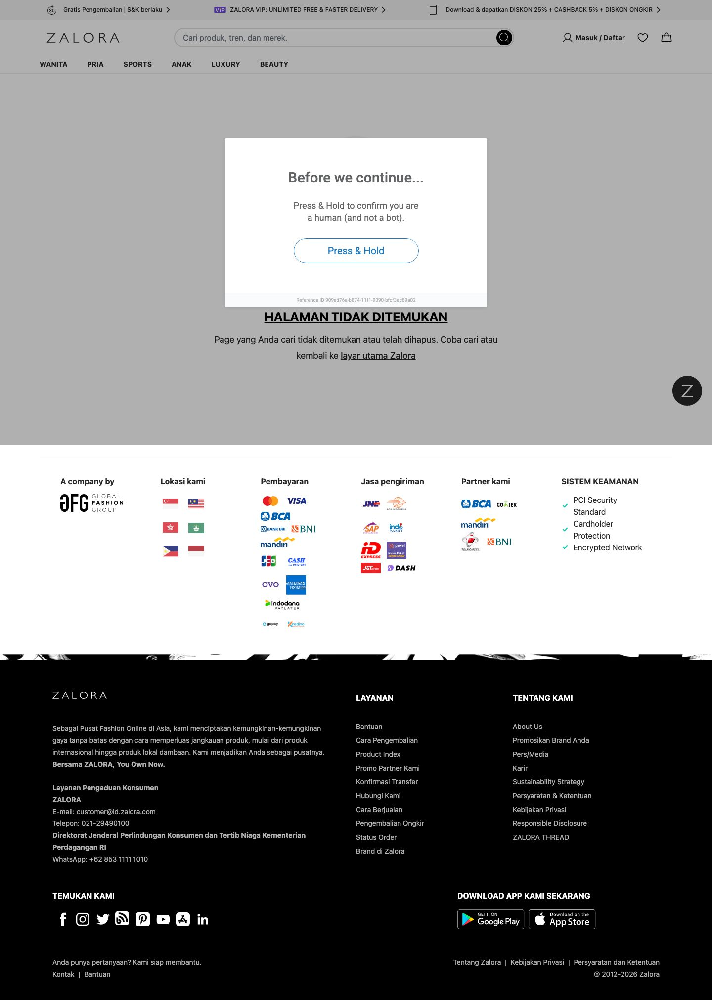

**대표 상품 이미지** (상위 6장, 출처 URL 포함)

-  — 출처 <https://static-id.zacdn.com/next-assets/static-assets/images/logo/icon_mastercard.png>
-  — 출처 <https://static-id.zacdn.com/next-assets/static-assets/images/logo/icon_visa.png>
-  — 출처 <https://static-id.zacdn.com/next-assets/static-assets/images/logo/icon_ovo.png>

**페이지 메타 정보**

| page | title | description |
|---|---|---|
| [`new_women`](https://www.zalora.co.id/wanita/new-arrivals) | Halaman tidak ditemukan | ZALORA |  |

### 4.2 일본 _( Japan )_

- 한국 수출규모 순위: **#2** · region: `asia` · tier `1` · currency `JPY`
- 수집 사이트: **5개** (성공 4)
- 메모: K-패션 선호도 높고 온라인 패션몰 발달
#### [GU Japan](https://www.gu-global.com/jp/)

- URL: <https://www.gu-global.com/jp/>
- 페이지: **OK 1 · FAIL 0**

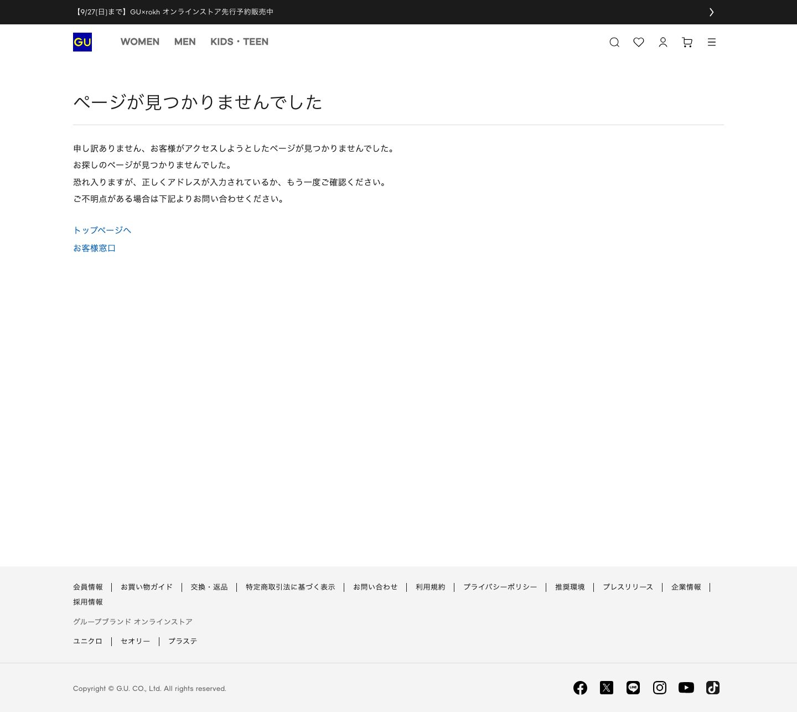

**대표 상품 이미지** (상위 6장, 출처 URL 포함)

-  — 출처 <https://image.uniqlo.com/GU/ST3/jp/imagesother/Navigation/WOMEN_Category/2026/260724/Category_w_Pants.jpg>
-  — 출처 <https://image.uniqlo.com/GU/ST3/jp/imagesother/Navigation/WOMEN_Category/2026/260820/Category_w_skirt_361518.png>
- 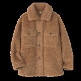 — 출처 <https://image.uniqlo.com/GU/ST3/jp/imagesother/Navigation/WOMEN_Category/2026/260901/Category_w_Outer_361430.png>
-  — 출처 <https://image.uniqlo.com/GU/ST3/jp/imagesother/Navigation/WOMEN_Category/2026/260911/Category_w_tops_358739.png>
-  — 출처 <https://image.uniqlo.com/GU/ST3/jp/imagesother/Navigation/WOMEN_Category/2026/260807/Category_w_shirt_361657.png>
-  — 출처 <https://image.uniqlo.com/GU/ST3/jp/imagesother/Navigation/WOMEN_Category/2026/260911/Category_w_knit-and-cardigan_360832.png>

**페이지 메타 정보**

| page | title | description |
|---|---|---|
| [`new_arrivals`](https://www.gu-global.com/jp/ja/not-found) | 申し訳ありません、お客様がアクセスしようとしたページが見つかりませんでした。恐れ入りますが、正しくアドレスが入力されているか、もう一度ご確認ください。 | ジーユー | 申し訳ありません、お客様がアクセスしようとしたページが見つかりませんでした。恐れ入りますが、正しくアドレスが入力されているか、もう一度ご確認ください。 |

#### [Rakuten Fashion](https://brandavenue.rakuten.co.jp/)

- URL: <https://brandavenue.rakuten.co.jp/>
- 페이지: **OK 1 · FAIL 1**

**대표 상품 이미지** (상위 6장, 출처 URL 포함)

-  — 출처 <https://brandavenue.r10s.jp/img/library/index/sbn_flagshipstore_20231003.png>
- 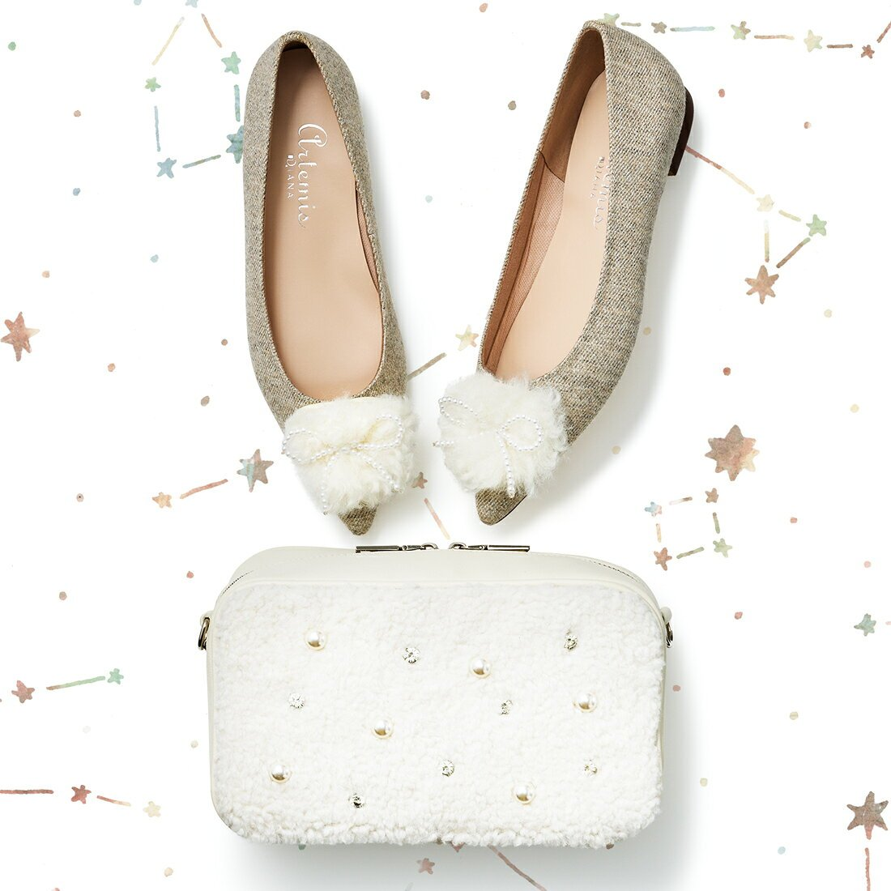 — 출처 <https://brandavenue.r10s.jp/img/news/01/398945/pc_n.jpg>
-  — 출처 <https://brandavenue.r10s.jp/img/news/01/397873/pc_n.jpg>
- 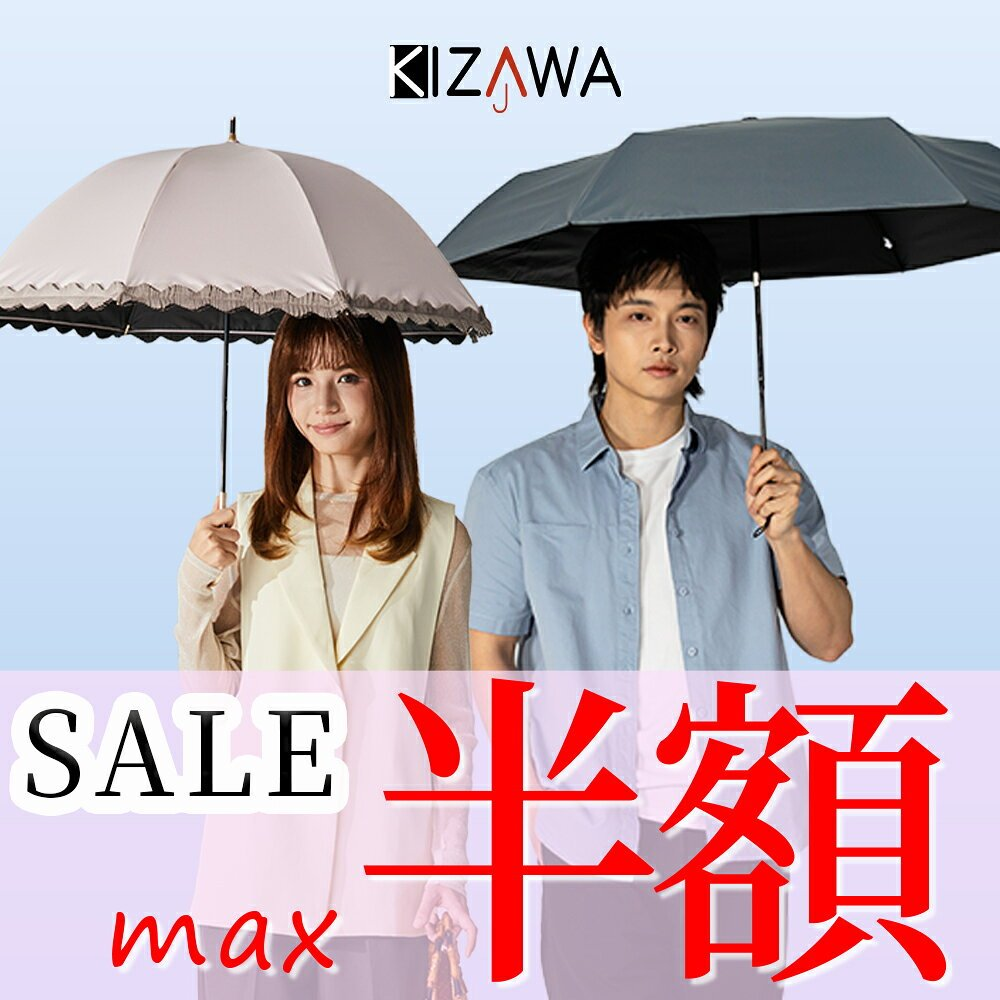 — 출처 <https://brandavenue.r10s.jp/img/news/01/398013/pc_n.jpg>
- 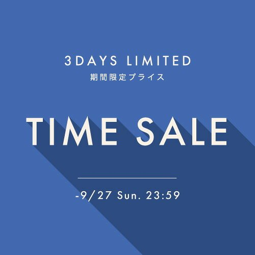 — 출처 <https://brandavenue.r10s.jp/img/news/01/398572/pc_n.jpg>
-  — 출처 <https://brandavenue.r10s.jp/img/news/01/398575/pc_n.jpg>

**페이지 메타 정보**

| page | title | description |
|---|---|---|
| [`men`](https://brandavenue.rakuten.co.jp/men/) | MEN | ファッション通販 Rakuten Fashion(楽天ファッション／旧楽天ブランドアベニュー) | Rakuten Fashion(楽天ファッション)は人気ブランドを取り扱うファッション通販サイトです。新作アイテム続々入荷！セール商品やクーポン対象商品も豊富。／税込3,980円以上購入で送料無料／楽天ポイントが使えて貯まる！ |

**실패 페이지**

- `women` — http_status_404

#### [Uniqlo Japan](https://www.uniqlo.com/jp/)

- URL: <https://www.uniqlo.com/jp/>
- 페이지: **OK 1 · FAIL 0**

**페이지 메타 정보**

| page | title | description |
|---|---|---|
| [`new_arrivals`](https://www.uniqlo.com/jp/ja/contents/feature/new-arrivals/) | 404 Not Found |  |

#### [WEAR](https://wear.jp/)

- URL: <https://wear.jp/>
- 페이지: **OK 1 · FAIL 0**

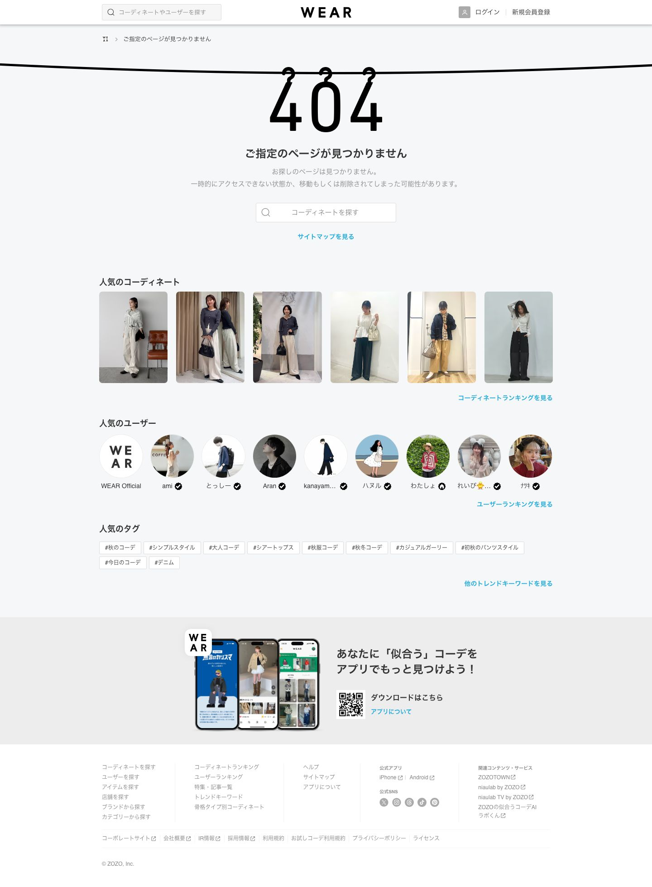

**대표 상품 이미지** (상위 6장, 출처 URL 포함)

-  — 출처 <https://wear.jp/public/_next/static/media/notfound_bg.1ywd-k_shp-hy.png>
-  — 출처 <https://wear.jp/public/_next/static/media/notfound_4.1ho27atf54bbv.png>
-  — 출처 <https://wear.jp/public/_next/static/media/notfound_0.438l9b9xjj6tm.png>
- 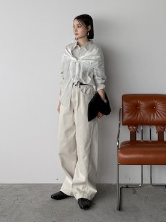 — 출처 <https://images.wear2.jp/coordinate/ekiqYE0j/FKt3pnyb/1789601139_276.jpg>
- 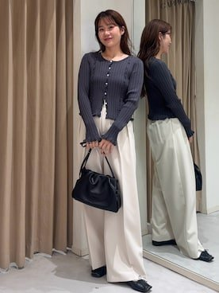 — 출처 <https://images.wear2.jp/coordinate/QWi0q82/nA1woDT7/1790139319_276.jpg>
- 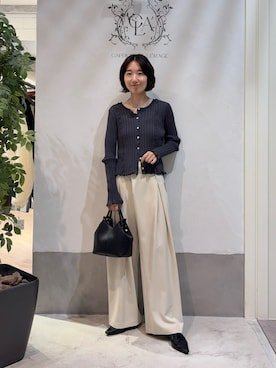 — 출처 <https://images.wear2.jp/coordinate/OwibGv42/qxkzL6WE/1790174484_276.jpg>

**페이지 메타 정보**

| page | title | description |
|---|---|---|
| [`ranking`](https://wear.jp/ranking/coordinate/) | ご指定のページが見つかりません - WEAR | お探しのページは見つかりません。一時的にアクセスできない状態か、移動もしくは削除されてしまった可能性があります。 |

#### [ZOZOTOWN](https://zozo.jp/)

- URL: <https://zozo.jp/>
- 페이지: **OK 0 · FAIL 2**

**실패 페이지**

- `new` — playwright_error: TimeoutError: Page.goto: Timeout 30000ms exceeded.
Call log:
  - navigating to "https://zozo.jp/category/new/", waiting until "domcontentloaded"

- `ranking` — playwright_error: TimeoutError: Page.goto: Timeout 30000ms exceeded.
Call log:
  - navigating to "https://zozo.jp/ranking/", waiting until "domcontentloaded"

### 4.3 한국 _( South Korea )_

- 한국 수출규모 순위: **#30** · region: `asia` · tier `1` · currency `KRW`
- 수집 사이트: **4개** (성공 3)
- 메모: 비교 기준 (자국). 국내 사업동향 센싱
#### [29CM](https://www.29cm.co.kr/)

- URL: <https://www.29cm.co.kr/>
- 페이지: **OK 1 · FAIL 0**

**최근 유행 상품** (50건 · 상품명 클릭 시 해당 사이트로 이동)

| # | 상품명 | 브랜드 | 가격 | 페이지 |
|---:|---|---|---:|---|
| 1 | [[9/30 예약발송] Hi-Neck Work Jumper (Black)](https://product.29cm.co.kr/catalog/4231704) | 아쎄르 | 276,170 KRW | `home` |
| 2 | [[9/30 예약발송] Hi-Neck Work Jumper (Cobalt Blue)](https://product.29cm.co.kr/catalog/4231669) | 아쎄르 | 276,170 KRW | `home` |
| 3 | [Rolling Round Neck Cardigan (Melange Grey)](https://product.29cm.co.kr/catalog/4231571) | 아쎄르 | 128,400 KRW | `home` |
| 4 | [[네세서리 X 솔비] Tencel Pencil Midi Skirt (Black)](https://product.29cm.co.kr/catalog/4208781) | 네세서리 | 129,330 KRW | `home` |
| 5 | [[네세서리 X 솔비] Wool Roll Detail Cardigan (Charcoal)](https://product.29cm.co.kr/catalog/4209275) | 네세서리 | 191,470 KRW | `home` |
| 6 | [Chunky Handmade Knit Cardigan (Beige)](https://product.29cm.co.kr/catalog/4209311) | 네세서리 | 182,070 KRW | `home` |
| 7 | [[2nd] Washed Classic Trench Coat](https://product.29cm.co.kr/catalog/4151542) | 더 피스드 | 247,280 KRW | `home` |
| 8 | [Glossy High Neck Leather Jacket](https://product.29cm.co.kr/catalog/4151541) | 더 피스드 | 250,000 KRW | `home` |
| 9 | [[4th] 3/4 Sleeve V-Neck Knit_2colors](https://product.29cm.co.kr/catalog/4151539) | 더 피스드 | 104,720 KRW | `home` |
| 10 | [알로소 엘머 1인소파 패브릭소파](https://product.29cm.co.kr/catalog/2536996) | 알로소 | 1,102,000 KRW | `home` |
| 11 | [알로소 보눔 3인소파 가죽소파 (라운지형)](https://product.29cm.co.kr/catalog/3079953) | 알로소 | 2,728,400 KRW | `home` |
| 12 | [알로소 보눔 3인소파 가죽소파 (풀베이스, 오픈베이스)](https://product.29cm.co.kr/catalog/3080190) | 알로소 | 2,340,800 KRW | `home` |
| 13 | [[ARTEK] Stool 60 Birch (28000151)](https://product.29cm.co.kr/catalog/642645) | 아르텍 | 430,000 KRW | `home` |
| 14 | [[ARTEK] Stool 60 Walnut Stained Birch (28000171)](https://product.29cm.co.kr/catalog/643096) | 아르텍 | 580,000 KRW | `home` |
| 15 | [[ARTEK] Chair 69 2Heights Birch](https://product.29cm.co.kr/catalog/2899707) | 아르텍 | 730,000 KRW | `home` |
| 16 | [[VITRA] Panton Chair Red 비트라 팬톤 체어 레드](https://product.29cm.co.kr/catalog/2661939) | 비트라 | 620,000 KRW | `home` |
| 17 | [[VITRA] Panton Chair Pale Rose 비트라 팬톤 체어 페일 로즈](https://product.29cm.co.kr/catalog/1621830) | 비트라 | 620,000 KRW | `home` |
| 18 | [[VITRA] Panton Chair Bordeaux 비트라 팬톤 체어 보르도 버건디](https://product.29cm.co.kr/catalog/1619809) | 비트라 | 620,000 KRW | `home` |
| 19 | [[SET] 패밀리 소파 룬드 SET2 솔리드 (모이테이블 포함)](https://product.29cm.co.kr/catalog/4242769) | 스테이모어 | 4,608,000 KRW | `home` |
| 20 | [[SET] 패밀리 침대 룬드 (매트리스 포함)](https://product.29cm.co.kr/catalog/4242766) | 스테이모어 | 4,923,000 KRW | `home` |

**대표 상품 이미지** (상위 6장, 출처 URL 포함)

-  — 출처 <https://img.29cm.co.kr/cms/202609/11f1b647983e50f894a377b8f519374f.png?width=3840&format=webp>
- 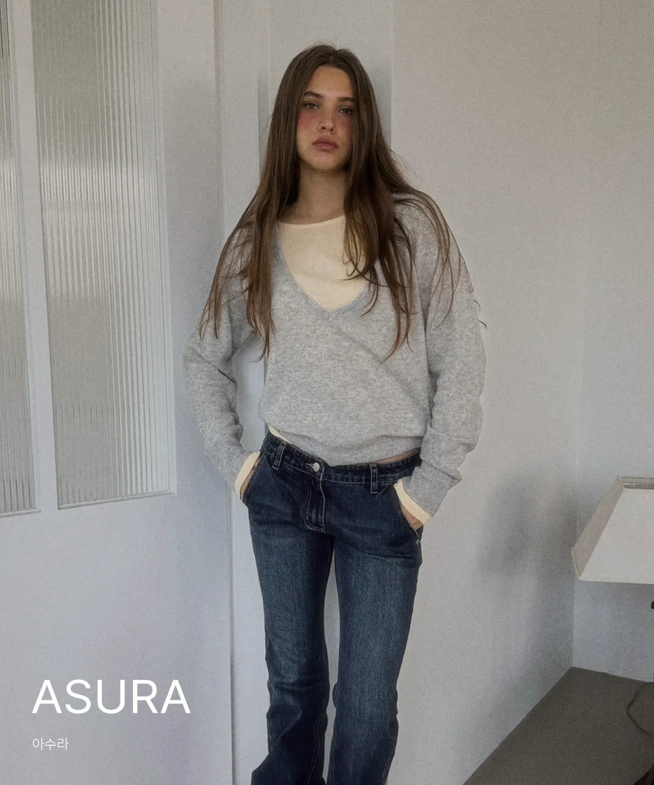 — 출처 <https://img.29cm.co.kr/cms/202609/11f1b64782588b72a9b843e8b1ac19f2.png?width=3840&format=webp>
- 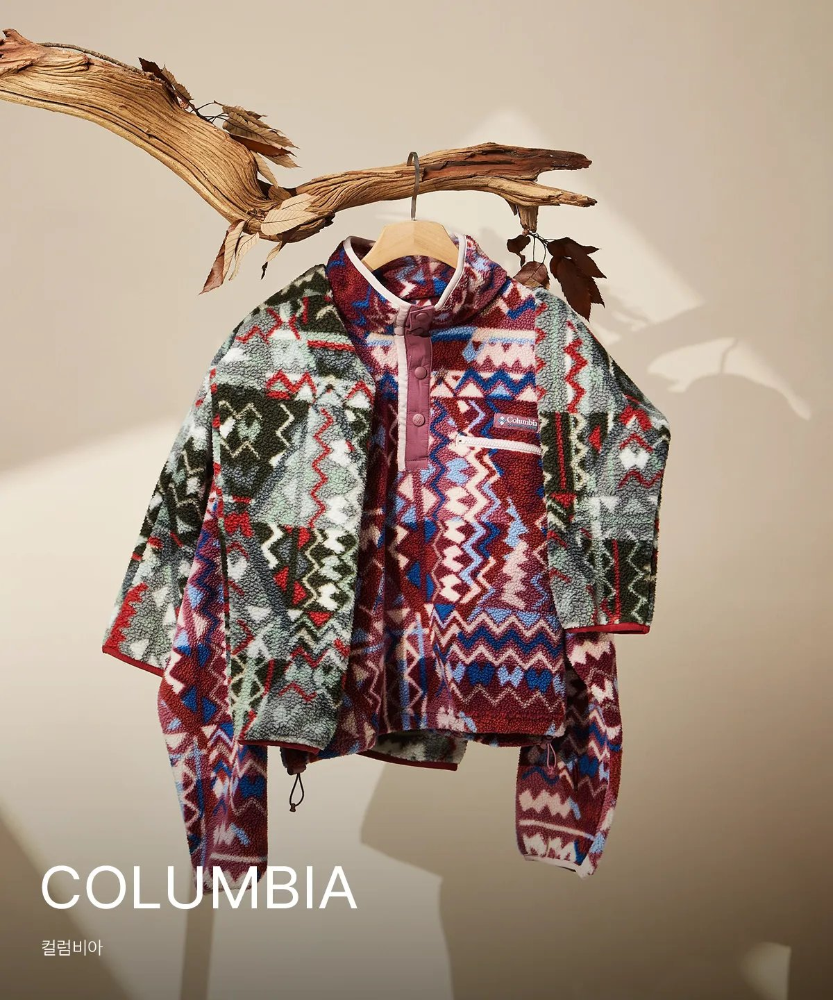 — 출처 <https://img.29cm.co.kr/cms/202609/11f1b6477719354494a3d17c7b934d36.png?width=3840&format=webp>
- 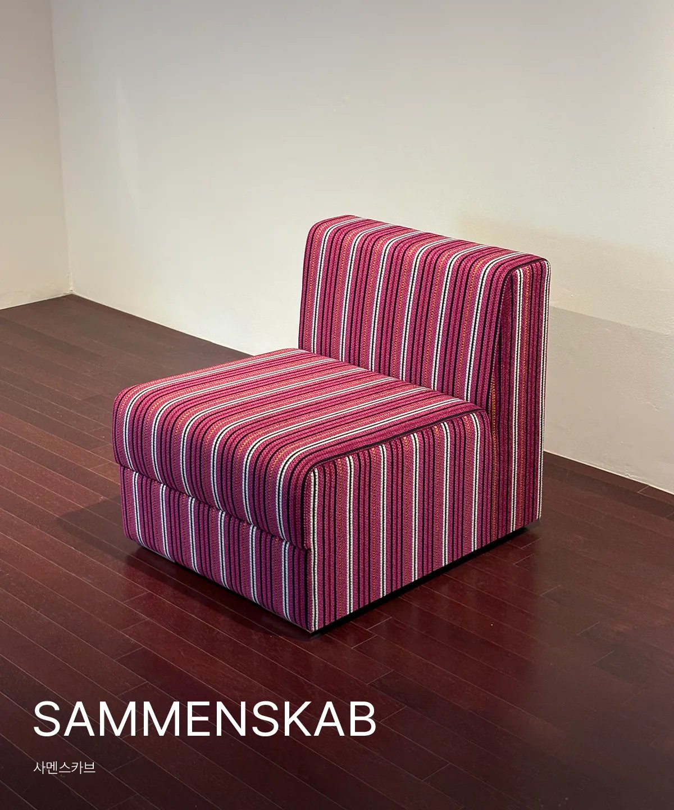 — 출처 <https://img.29cm.co.kr/cms/202609/11f1b6476cf058e494a30dfc37a439cb.png?width=3840&format=webp>
- 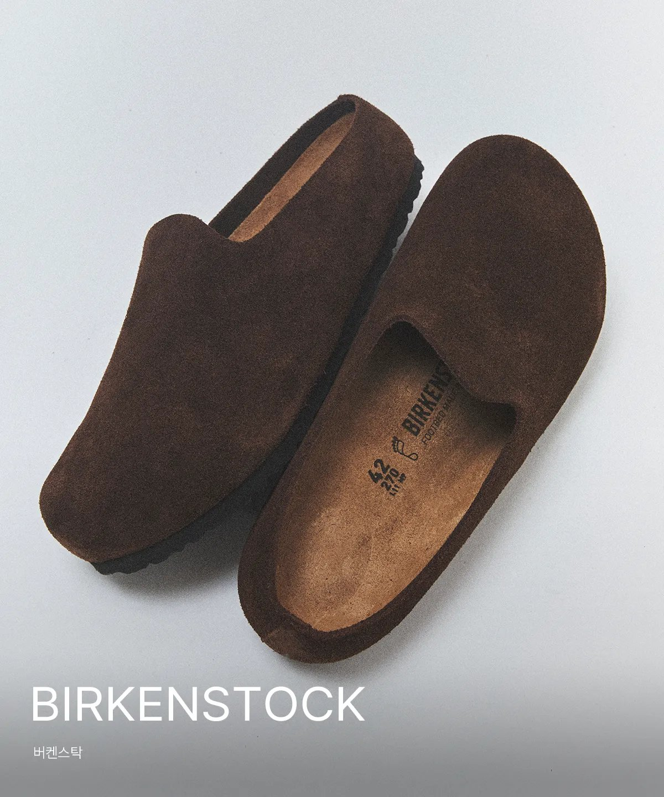 — 출처 <https://img.29cm.co.kr/cms/202609/11f1b64764899fb8a9b83785ad7440d2.png?width=3840&format=webp>
- 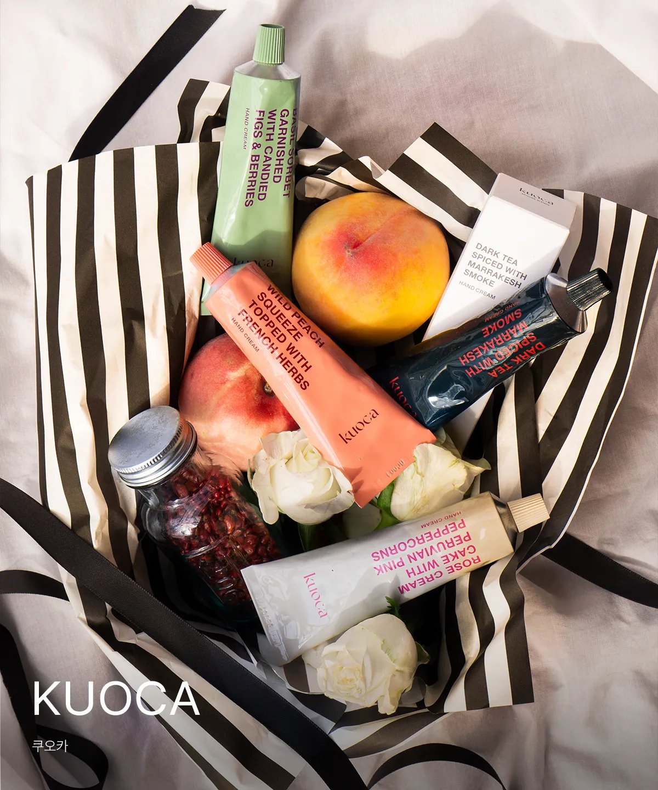 — 출처 <https://img.29cm.co.kr/cms/202609/11f1b6475b6f4d2aa9b8e9584d217eed.png?width=3840&format=webp>

**페이지 메타 정보**

| page | title | description |
|---|---|---|
| [`home`](https://www.29cm.co.kr/) | 감도 깊은 취향 셀렉트샵 29CM | 패션, 라이프스타일, 컬처까지 29CM만의 감도 깊은 셀렉션을 만나보세요. |

#### [Musinsa](https://www.musinsa.com/)

- URL: <https://www.musinsa.com/>
- 페이지: **OK 0 · FAIL 1**

**실패 페이지**

- `home` — robots_disallowed

#### [W Concept](https://www.wconcept.co.kr/)

- URL: <https://www.wconcept.co.kr/>
- 페이지: **OK 1 · FAIL 0**

**최근 유행 상품** (30건 · 상품명 클릭 시 해당 사이트로 이동)

| # | 상품명 | 브랜드 | 가격 | 페이지 |
|---:|---|---|---:|---|
| 1 | [[Drama Signature] Slim Button Blazer_3color](https://m.wconcept.co.kr/Product/305612236) | 프론트로우 | 152,424 KRW | `home` |
| 2 | [[이태리 트위드]Trimmed Over-fit Tweed Jacket_3color](https://m.wconcept.co.kr/Product/308023502) | 프론트로우 | 194,184 KRW | `home` |
| 3 | [[Drama Signature] Relaxed Bootcut Trousers_2color](https://m.wconcept.co.kr/Product/305613843) | 프론트로우 | 103,704 KRW | `home` |
| 4 | [[Drama Signature] Collarless Classic Jacket](https://m.wconcept.co.kr/Product/308740194) | 프론트로우 | 161,950 KRW | `home` |
| 5 | [[Premium] Cashmere Knit Cardigan_8color](https://m.wconcept.co.kr/Product/307181407) | 프론트로우 | 78,604 KRW | `home` |
| 6 | [[Drama Signature] Tie-Collar Silky Blouse_6color](https://m.wconcept.co.kr/Product/301827414) | 프론트로우 | 97,222 KRW | `home` |
| 7 | [[이태리 울]Over-fit Wool Single Jacket_3color](https://m.wconcept.co.kr/Product/308015094) | 프론트로우 | 168,997 KRW | `home` |
| 8 | [[Drama Signature] Slim Bootcut  Trousers_3color](https://m.wconcept.co.kr/Product/301824084) | 프론트로우 | 103,704 KRW | `home` |
| 9 | [Leather Half Jacket](https://m.wconcept.co.kr/Product/308836423) | 프론트로우 | 157,731 KRW | `home` |
| 10 | [[Premium] Cashmere-blend Handmade Coat_3color](https://m.wconcept.co.kr/Product/301799005) | 프론트로우 | 559,150 KRW | `home` |
| 11 | [Cotton Boat-neck Blouse](https://m.wconcept.co.kr/Product/306028055) | 프론트로우 | 51,600 KRW | `home` |
| 12 | [V-neck Cardigan & Sleeveless Top Set_9color](https://m.wconcept.co.kr/Product/306690200) | 프론트로우 | 61,726 KRW | `home` |
| 13 | [Palette Sheer Linen Cardigan Set_7color](https://m.wconcept.co.kr/Product/308343794) | 프론트로우 | 66,381 KRW | `home` |
| 14 | [[Drama Signature] Button Silky Blouse _4color](https://m.wconcept.co.kr/Product/308146519) | 프론트로우 | 90,741 KRW | `home` |
| 15 | [Half-neck Trench Jumper_2color](https://m.wconcept.co.kr/Product/308740093) | 프론트로우 | 157,731 KRW | `home` |
| 16 | [Suede Bomber Jacket_3 color](https://m.wconcept.co.kr/Product/307349815) | 프론트로우 | 157,731 KRW | `home` |
| 17 | [[Drama Signature] Tailored Wrap Dress](https://m.wconcept.co.kr/Product/301169174) | 프론트로우 | 176,740 KRW | `home` |
| 18 | [Bold Rib Knit Cardigan_2color](https://m.wconcept.co.kr/Product/307421828) | 프론트로우 | 78,561 KRW | `home` |
| 19 | [[Drama Signature] Slim Leather Belt_2color](https://m.wconcept.co.kr/Product/301608996) | 프론트로우 | 51,025 KRW | `home` |
| 20 | [H-line Midi Skirt_2color](https://m.wconcept.co.kr/Product/307386627) | 프론트로우 | 78,561 KRW | `home` |

**페이지 메타 정보**

| page | title | description |
|---|---|---|
| [`home`](https://www.wconcept.co.kr/) | _(empty)_ |  |

#### [Zigzag](https://zigzag.kr/)

- URL: <https://zigzag.kr/>
- 페이지: **OK 1 · FAIL 0**

**최근 유행 상품** (36건 · 상품명 클릭 시 해당 사이트로 이동)

| # | 상품명 | 브랜드 | 가격 | 페이지 |
|---:|---|---|---:|---|
| 1 | [화이트랩스 치아미백기 LED 셀프 자가 치아미백기계 & 치아미백젤 세트 (1인용)](https://store.zigzag.kr/app/catalog/products/168362278?browsing_type=NATIVE_BROWSER) | 화이트랩스 | 159,000 KRW | `home` |
| 2 | [[서경PICK🤎][골반뽕탈부착][~2XL][8만장🏆][힙딥커버]렌더 코튼 부츠컷 팬츠 (숏/롱ver)(7color)](https://store.zigzag.kr/app/catalog/products/162075326?browsing_type=NATIVE_BROWSER) | 프렌치오브 | 18,690 KRW | `home` |
| 3 | [[🍂가을][mlt] 밀리스 셔링 베이직 브이넥 티셔츠 (7부/긴소매)](https://store.zigzag.kr/app/catalog/products/171225737?browsing_type=NATIVE_BROWSER) | 모렌트 | 18,360 KRW | `home` |
| 4 | [[직잭단독][1+1할인🍁][레이어드/퍼플니트/브이넥니트/루즈핏/니트/간절기니트/캐주얼/페미닌/딥브이넥][made]그루브딥브이넥니트 - 5color](https://store.zigzag.kr/app/catalog/products/171375418?browsing_type=NATIVE_BROWSER) | 니썸 | 27,200 KRW | `home` |
| 5 | [[직잭단독] 롬앤 클리어런스 모음.ZIP](https://store.zigzag.kr/app/catalog/products/169907977?browsing_type=NATIVE_BROWSER) | 롬앤 | 3,900 KRW | `home` |
| 6 | [[가을바지🍁/50만장돌파/made] 허쉬 코튼 와이드팬츠 (숏/기본/롱)](https://store.zigzag.kr/app/catalog/products/143224732?browsing_type=NATIVE_BROWSER) | 리얼코코 | 15,210 KRW | `home` |
| 7 | [[핏보정팬츠] made. 나이브 히든밴딩 세미부츠컷 팬츠 (+숏/베이직/롱ver) - 4 size](https://store.zigzag.kr/app/catalog/products/159899063?browsing_type=NATIVE_BROWSER) | 슬로우앤드 | 26,910 KRW | `home` |
| 8 | [[가을니트🍁/브이넥&라운드넥/made] 에트 니트 (6color)](https://store.zigzag.kr/app/catalog/products/129456378?browsing_type=NATIVE_BROWSER) | 리얼코코 | 14,800 KRW | `home` |
| 9 | [[가을셔츠🤎/스트라이프&무지/10만장돌파/made] 로셀 라인 셔츠 (7color)](https://store.zigzag.kr/app/catalog/products/145426176?browsing_type=NATIVE_BROWSER) | 리얼코코 | 12,200 KRW | `home` |
| 10 | [[🍁추석세일/무료배송] made. 포트 컬러웨이 딥브이넥 니트 - 5 color](https://store.zigzag.kr/app/catalog/products/171386405?browsing_type=NATIVE_BROWSER) | 슬로우앤드 | 34,900 KRW | `home` |
| 11 | [[🥇레이어드룩1위] made. 세이 셔츠앤 레이어링 니트 (워셔블니트) - 5 color](https://store.zigzag.kr/app/catalog/products/167765387?browsing_type=NATIVE_BROWSER) | 슬로우앤드 | 36,000 KRW | `home` |
| 12 | [[🍁추석세일/란제리코어] only. 보니 캡내장 레이스 슬리브리스 - 3 color (무료배송)](https://store.zigzag.kr/app/catalog/products/168688154?browsing_type=NATIVE_BROWSER) | 슬로우앤드 | 15,660 KRW | `home` |
| 13 | [[🍁가을/3기장선택!] made. 모먼트 투커버 올데이슬랙스 (+숏/베이직/롱ver) - 4 size](https://store.zigzag.kr/app/catalog/products/136095576?browsing_type=NATIVE_BROWSER) | 슬로우앤드 | 31,840 KRW | `home` |
| 14 | [[🏆역대급100만장/3기장선택!] made. 마켓 와이드 트레이닝슬랙스 (+숏/베이직/롱ver) - 4 size](https://store.zigzag.kr/app/catalog/products/141360158?browsing_type=NATIVE_BROWSER) | 슬로우앤드 | 32,900 KRW | `home` |
| 15 | [[리브레]피스 트렌치 코트](https://store.zigzag.kr/app/catalog/products/172106668?browsing_type=NATIVE_BROWSER) | 헬로마틸다 | 79,200 KRW | `home` |
| 16 | [[7만장판매] [B-BASIC] 헤비스웨트 와이드 투웨이 팬츠](https://store.zigzag.kr/app/catalog/products/146599750?browsing_type=NATIVE_BROWSER) | 블랙업 | 52,000 KRW | `home` |
| 17 | [[소프트촉감] 로아 루즈핏 헨리넥 티셔츠 90221](https://store.zigzag.kr/app/catalog/products/172114356?browsing_type=NATIVE_BROWSER) | 공구우먼 | 28,800 KRW | `home` |
| 18 | [[🍁추석세일/무료배송] made.  리얼여리핏 헨리넥 버튼니트 - 6 color](https://store.zigzag.kr/app/catalog/products/172108499?browsing_type=NATIVE_BROWSER) | 슬로우앤드 | 33,600 KRW | `home` |
| 19 | [[쫀득스판🏆8만장] 중독팬츠ver.코튼와이드 - 6color (와이드팬츠/코튼팬츠/면바지/롱와이드/브라운팬츠/흰바지/가을바지/출근룩/MADE/키작녀)](https://store.zigzag.kr/app/catalog/products/150592199?browsing_type=NATIVE_BROWSER) | 고고싱 | 26,820 KRW | `home` |
| 20 | [[🍁추석세일/문의폭주] made. 오브 울텐셀 레이어드 티셔츠 - 3 color (무료배송)](https://store.zigzag.kr/app/catalog/products/171349199?browsing_type=NATIVE_BROWSER) | 슬로우앤드 | 26,400 KRW | `home` |

**대표 상품 이미지** (상위 6장, 출처 URL 포함)

-  — 출처 <https://cf.image-farm.s.zigzag.kr/original/cms/2026/09/18/202609180246143283_070383.png?quality=80&format=webp&transparent=true&width=1029&height=1188>
- 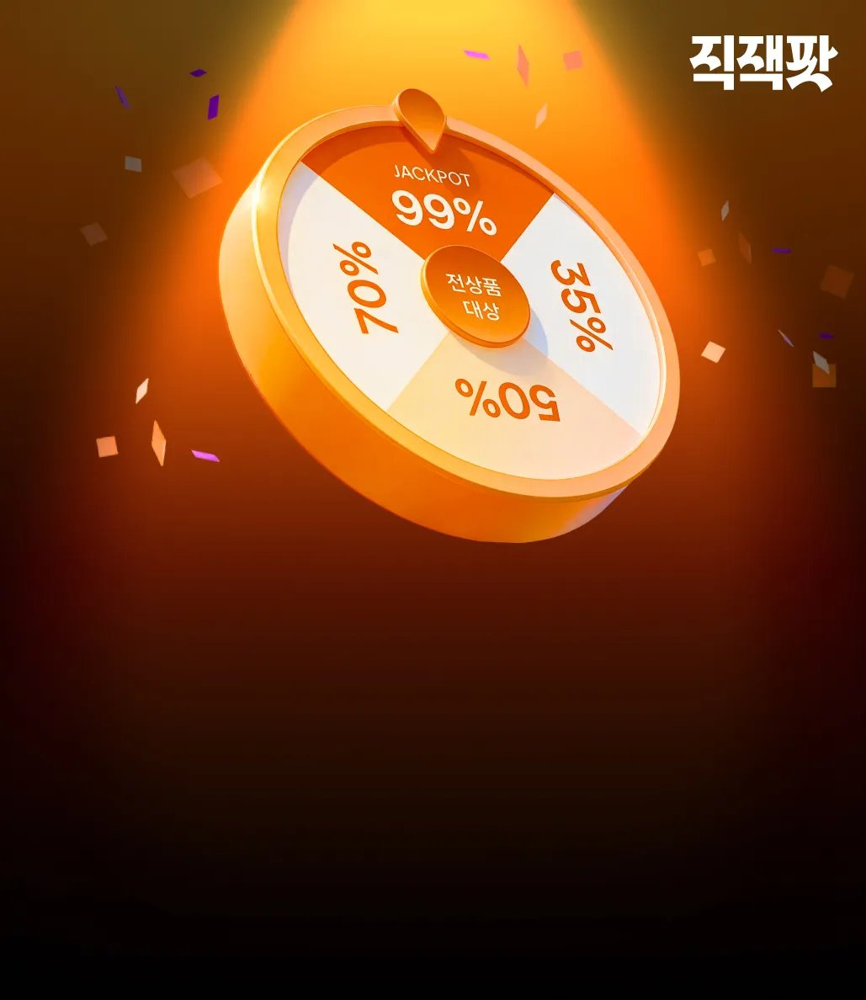 — 출처 <https://cf.image-farm.s.zigzag.kr/original/cms/2026/09/14/202609140041324266_051635.jpg?width=1029&height=1188&quality=80&format=webp&transparent=true>
- 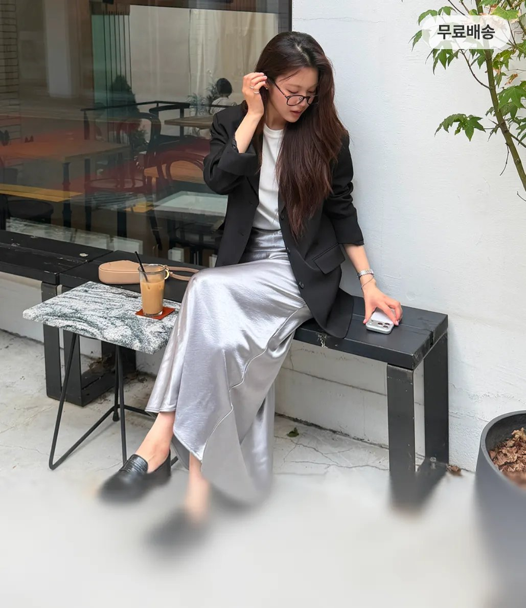 — 출처 <https://cf.image-farm.s.zigzag.kr/original/cms/2026/09/17/202609170959024570_053494.png?quality=80&format=webp&transparent=true&width=1029&height=1188>
-  — 출처 <https://cf.image-farm.s.zigzag.kr/original/cms/2026/09/17/202609170126302556_058883.jpg?width=1029&height=1188&quality=80&format=webp&transparent=true>
- 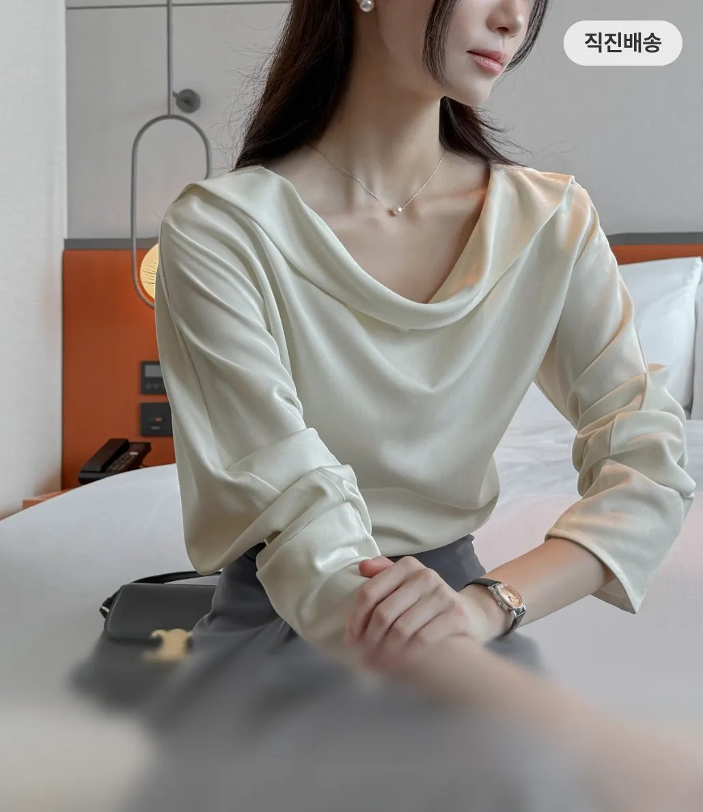 — 출처 <https://cf.image-farm.s.zigzag.kr/original/cms/2026/09/17/202609170537527708_014365.png?quality=80&format=webp&transparent=true&width=1029&height=1188>
-  — 출처 <https://cf.image-farm.s.zigzag.kr/original/cms/2026/09/18/202609180157057204_039760.jpg?width=1029&height=1188&quality=80&format=webp&transparent=true>

**페이지 메타 정보**

| page | title | description |
|---|---|---|
| [`home`](https://zigzag.kr/) | 지그재그 스토어 | 4,000만 여성이 선택한 올인원 쇼핑 앱 지그재그 - 제가 알아서 살게요. |

### 4.4 대만 _( Taiwan )_

- 한국 수출규모 순위: **#7** · region: `asia` · tier `1` · currency `TWD`
- 수집 사이트: **5개** (성공 4)
- 메모: K-패션 친화도 높음
#### [momo](https://www.momoshop.com.tw/)

- URL: <https://www.momoshop.com.tw/>
- 페이지: **OK 1 · FAIL 0**

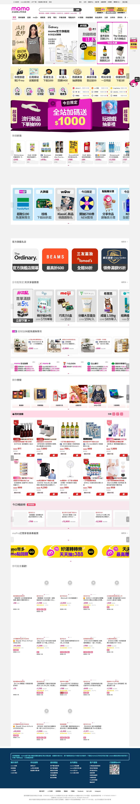

**대표 상품 이미지** (상위 6장, 출처 URL 포함)

-  — 출처 <https://img3.momoshop.com.tw/ecm/img/online/10/998/00/000/bt_0_271_01/bt_0_271_01_e2.jpg?t=1785743060613>
-  — 출처 <https://img1.momoshop.com.tw/ecm/img/online/10/998/00/000/bt_0_245_01/bt_0_245_01_P1_1_e2.png?t=1790265606127>
-  — 출처 <https://img1.momoshop.com.tw/ecm/img/online/10/998/00/000/bt_0_245_01/bt_0_245_01_P1_2_e2.png?t=1790092809269>
-  — 출처 <https://img1.momoshop.com.tw/ecm/img/online/10/998/00/000/bt_0_245_01/bt_0_245_01_P1_3_e2.png?t=1790092809269>
-  — 출처 <https://img1.momoshop.com.tw/ecm/img/online/81/998/00/000/mobile/bt_7_701_01/bt_7_701_01_e121.png?t=1790147648319>
-  — 출처 <https://img1.momoshop.com.tw/ecm/img/online/81/998/00/000/mobile/bt_7_701_01/bt_7_701_01_e101.jpg?t=1790147648295>

**페이지 메타 정보**

| page | title | description |
|---|---|---|
| [`home`](https://www.momoshop.com.tw/main/Main.jsp) | momo購物網 - 好評推薦 - 2026年9月 | momo購物網提供美妝保養、流行服飾、時尚精品、3C、數位家電、生活用品、美食旅遊票券…等數百萬件商品。快速到貨、超商取貨讓您購物最便利。mo店+商品抵用券天天搶、免運吃到飽，電視/直播商品限時下殺，每日讓您享超低價，並享有十天猶豫期；momo購物網為富邦及台灣大哥大關係企業 |

#### [OB Design](https://www.obdesign.com.tw/)

- URL: <https://www.obdesign.com.tw/>
- 페이지: **OK 1 · FAIL 0**

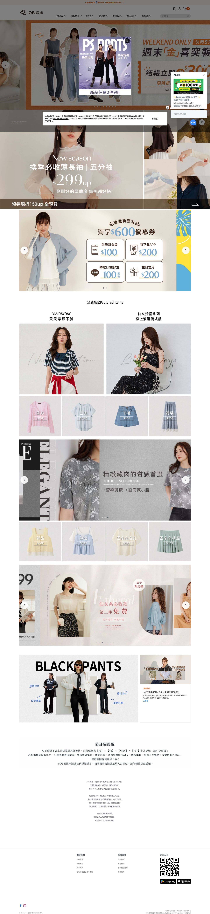

**대표 상품 이미지** (상위 6장, 출처 URL 포함)

-  — 출처 <https://cms-static.cdn.91app.com/images/original/41602/92f19e4d-89b7-4330-9570-02cf1dff9742-1790069198-6drun5zyc4_d_1920x820_1280x547_1124x480_800x342_600x256_400x171.jpg>
- 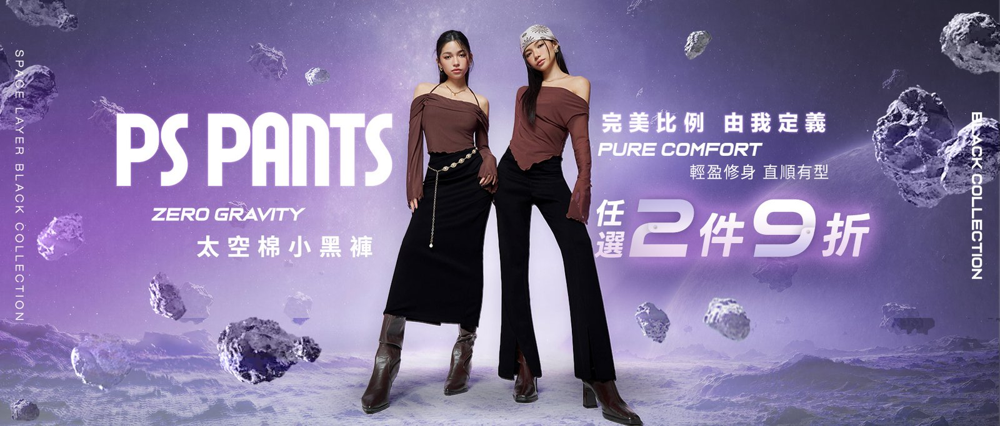 — 출처 <https://cms-static.cdn.91app.com/images/original/41602/92f19e4d-89b7-4330-9570-02cf1dff9742-1790044813-wz3vkxolfi_d_1920x820_1280x547_1124x480_800x342_600x256_400x171.jpg>
- 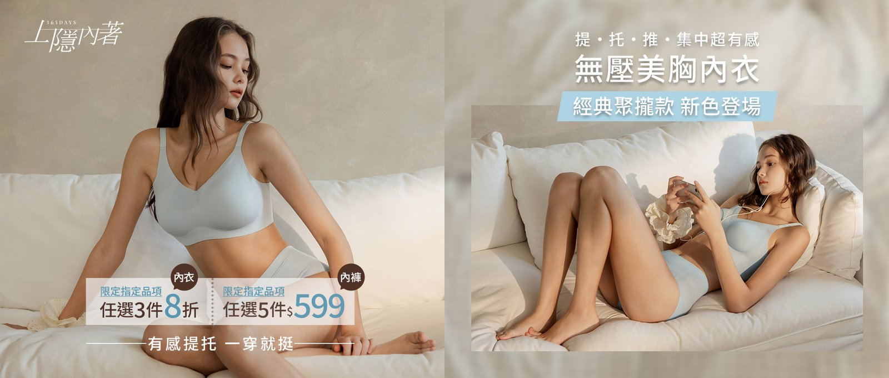 — 출처 <https://cms-static.cdn.91app.com/images/original/41602/92f19e4d-89b7-4330-9570-02cf1dff9742-1790044895-p27lxg1r1p_d_1920x820_1280x547_1124x480_800x342_600x256_400x171.jpg>
-  — 출처 <https://cms-static.cdn.91app.com/images/compress/41602/92f19e4d-89b7-4330-9570-02cf1dff9742-1790044895-p27lxg1r1p_d_400x171.webp>
- 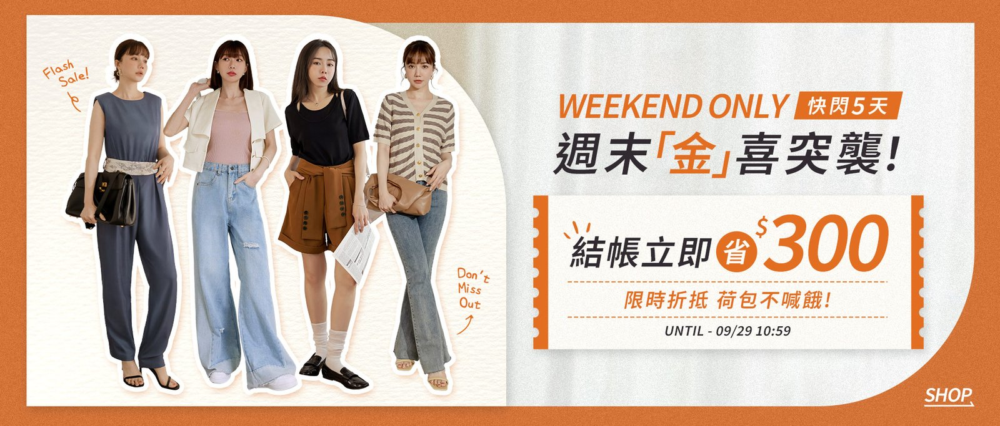 — 출처 <https://cms-static.cdn.91app.com/images/original/41602/92f19e4d-89b7-4330-9570-02cf1dff9742-1790216432-zzeye1jal0_d_1920x820_1280x547_1124x480_800x342_600x256_400x171.jpg>
- 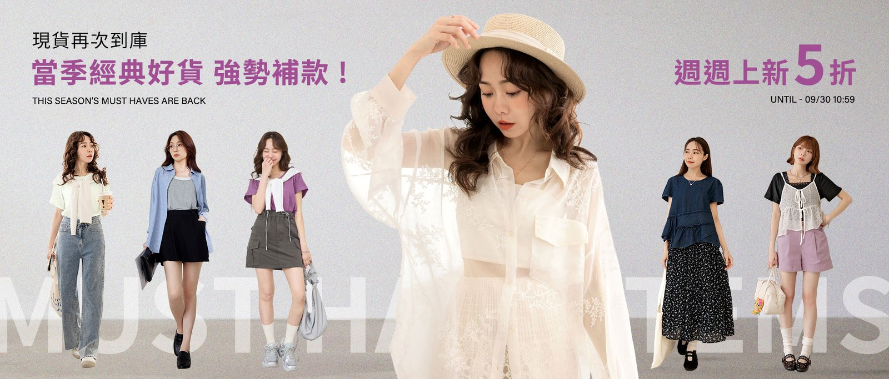 — 출처 <https://cms-static.cdn.91app.com/images/original/41602/92f19e4d-89b7-4330-9570-02cf1dff9742-1789441221-dn1wmx9ffo_d_1920x820_1280x547_1124x480_800x342_600x256_400x171.jpg>

**페이지 메타 정보**

| page | title | description |
|---|---|---|
| [`home`](https://www.obdesign.com.tw/) | OB嚴選｜高CP值人氣熱銷服飾，流行服飾品牌 | 你的日常穿搭好夥伴，快上OB嚴選找，OB嚴選提供女裝、孕童、運動、男裝各項流行服飾，秉持優質服務給你高CP值的購物體驗。各種風格都能滿足熱愛穿搭的你，天天上新品，快速出貨，一起加入OB style！網路人氣服飾品牌OB嚴選 |

#### [PChome](https://24h.pchome.com.tw/)

- URL: <https://24h.pchome.com.tw/>
- 페이지: **OK 0 · FAIL 1**

**실패 페이지**

- `home` — http_status_429

#### [Pinkoi Taiwan](https://www.pinkoi.com/)

- URL: <https://www.pinkoi.com/>
- 페이지: **OK 2 · FAIL 0**

**대표 상품 이미지** (상위 6장, 출처 URL 포함)

-  — 출처 <https://cdn04.pinkoi.com/pinkoi.site/logo/og_image.png>

**페이지 메타 정보**

| page | title | description |
|---|---|---|
| [`accessories`](https://en.pinkoi.com/) | Pinkoi | Asia’s cross-border design marketplace | Design the way you are | Shop for original design products from Asia's independent designers. Pinkoi lives and breathes great design, great quality, great service, a |
| [`bags`](https://en.pinkoi.com/) | Pinkoi | Asia’s cross-border design marketplace | Design the way you are | Shop for original design products from Asia's independent designers. Pinkoi lives and breathes great design, great quality, great service, a |

#### [Yahoo Taiwan Shopping](https://tw.buy.yahoo.com/)

- URL: <https://tw.buy.yahoo.com/>
- 페이지: **OK 1 · FAIL 0**

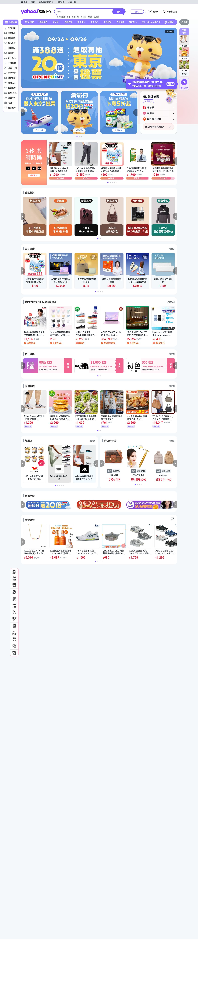

**대표 상품 이미지** (상위 6장, 출처 URL 포함)

- 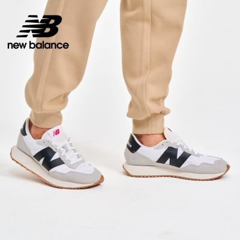 — 출처 <https://img.yec.tw/zp/MerchandiseImages/55929bb438-Gd-11695461.jpg>
-  — 출처 <https://img.yec.tw/zp/MerchandiseImages/AB1F4DCB92-SP-17639959.jpg>
- 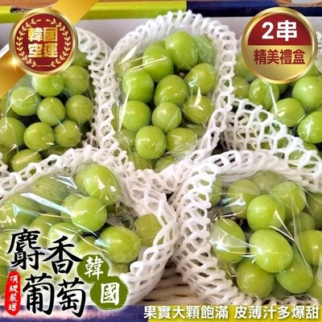 — 출처 <https://img.yec.tw/zp/MerchandiseImages/74c67d86e8-Gd-7841510.jpg>

**페이지 메타 정보**

| page | title | description |
|---|---|---|
| [`home`](https://tw.buy.yahoo.com/) | Yahoo購物中心 - 最懂生活的人 | 數百萬件商品，貼心客服為您服務，15天鑑賞期購物保障！ |

### 4.5 태국 _( Thailand )_

- 한국 수출규모 순위: **#8** · region: `asia` · tier `1` · currency `THB`
- 수집 사이트: **5개** (성공 4)
- 메모: 동남아 K-패션 핵심 시장
#### [Central Online](https://www.central.co.th/)

- URL: <https://www.central.co.th/>
- 페이지: **OK 1 · FAIL 0**

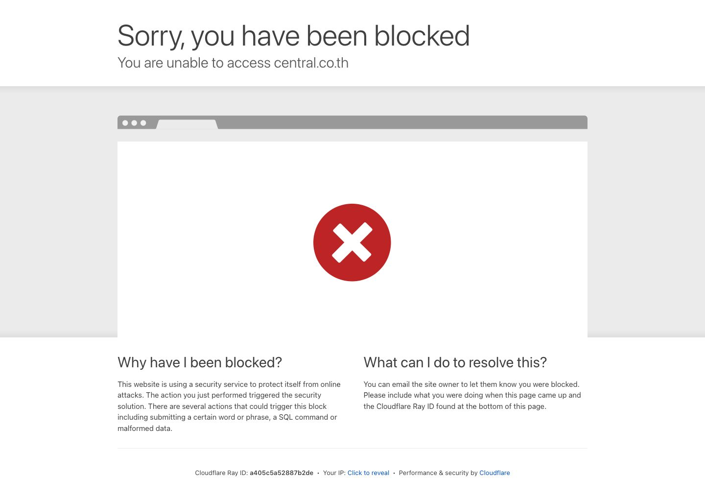

**페이지 메타 정보**

| page | title | description |
|---|---|---|
| [`home`](https://www.central.co.th/th) | Attention Required! | Cloudflare |  |

#### [Lazada Thailand Fashion](https://www.lazada.co.th/)

- URL: <https://www.lazada.co.th/>
- 페이지: **OK 1 · FAIL 0**

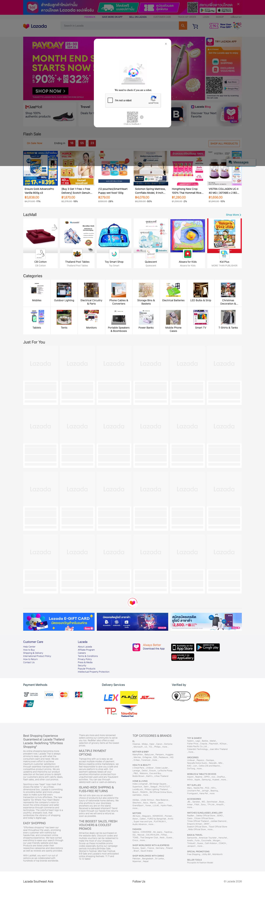

**대표 상품 이미지** (상위 6장, 출처 URL 포함)

-  — 출처 <https://img.lazcdn.com/us/domino/40845120240f19d13f738fa9a7978edd.png>
-  — 출처 <https://img.lazcdn.com/g/tps/images/ims-web/TB1KB2laMFY.1VjSZFnXXcFHXXa.png>
- 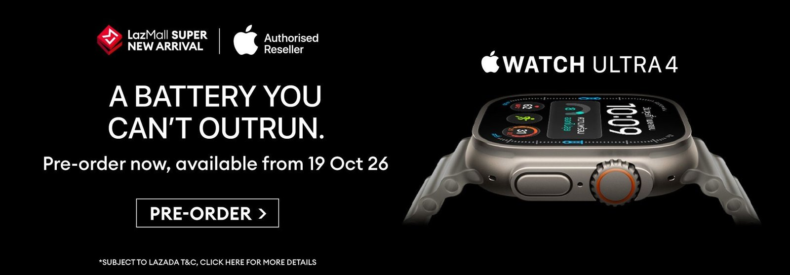 — 출처 <https://img.lazcdn.com/us/domino/0103bb62-f533-4a9c-9d94-00e69edded10_TH-1976-688.jpg_2200x2200q80.jpg>
-  — 출처 <https://img.lazcdn.com/us/domino/58a9762a-9ae8-44b7-9084-adeeae5ce874_TH-1976-688.jpg_2200x2200q80.jpg>
- 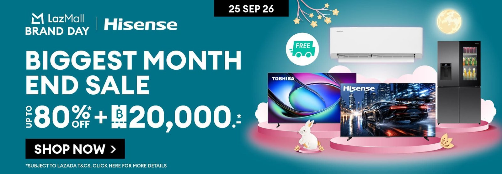 — 출처 <https://img.lazcdn.com/us/domino/202942c8-4299-4a10-af35-c2c91dd17111_TH-1976-688.jpg_2200x2200q80.jpg>
-  — 출처 <https://img.lazcdn.com/us/domino/c4d0aac5-a269-42e9-8b7a-08dd5f1d5257_TH-1976-688.jpg_2200x2200q80.jpg>

**페이지 메타 정보**

| page | title | description |
|---|---|---|
| [`home`](https://www.lazada.co.th/#?) | Lazada Thailand | ช้อปออนไลน์ สินค้าดี พร้อมดีลพิเศษทุกวัน | พบกับ Lazada แพลตฟอร์มช้อปปิ้งชั้นนำในอาเซียน พร้อมบริการเก็บเงินปลายทาง LazMall LazFlash และดีลเด็ดจากแบรนด์ดังทุกวัน |

#### [Pomelo](https://www.pomelofashion.com/)

- URL: <https://www.pomelofashion.com/>
- 페이지: **OK 0 · FAIL 2**

**실패 페이지**

- `new` — robots_disallowed
- `best` — robots_disallowed

#### [Shopee Thailand Fashion](https://shopee.co.th/)

- URL: <https://shopee.co.th/>
- 페이지: **OK 1 · FAIL 0**

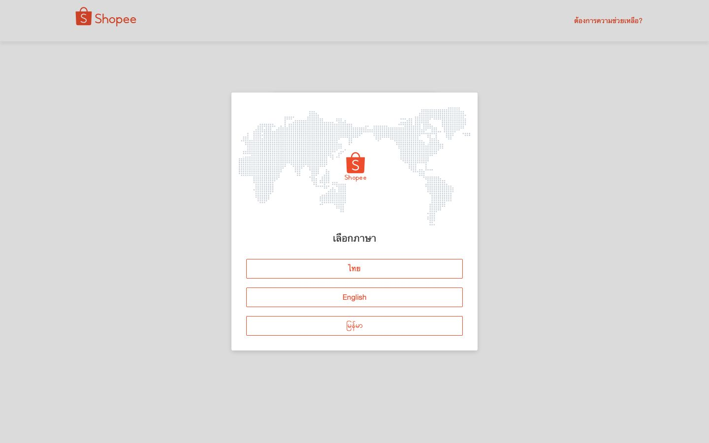

**대표 상품 이미지** (상위 6장, 출처 URL 포함)

-  — 출처 <https://deo.shopeemobile.com/shopee/shopee-pcmall-live-sg/assets/1c8bdaaf45e1fd48.png>
-  — 출처 <https://deo.shopeemobile.com/shopee/shopee-pcmall-live-sg/homepagefe/42ba6075c82a85ab.png>

**페이지 메타 정보**

| page | title | description |
|---|---|---|
| [`home`](https://shopee.co.th/verify/captcha?anti_bot_tracking_id=gqRjZGVrxHSFomtptTE0MjUxOnRyYWNraW5nX2lkX2tleaJrdtEAAqRhbGdv0gAAAGSjZGVrwKJjdMRAAAAADMPc0R2hCGactn2nr9DcAFBQpHMoHjAbjrdsrt_pSEAwvu3D4ZqEQ0V0kSHM0Nn9K_1xVJ0eNyntbq4tnqpjaXBoZXJ0ZXh0xQOGAAAADBDHVwBEP7rrjPx7akHeO6NtnAHveR-CHpOD_soYXoCJ6HGGlfuce_p4C6Q4gj-IUgEHEPJ8rnabm5MmbZylVGpYOniq-0lYRXh9RmPl8YgOf6WNpTn5F669wOGBuscPAErCaxka-MtqNhyokeTK7CORHhjDHi2idC8bF7218d9fqrjhwlOkNyNzOPEwpzIUBqnxtCxQPqNUEzuxqXlBKcvVpoXlC1m2BBFTjui5W-fW4cyKQa4iHjTvspSnWlLV0PyJk8EbwKWQ9sW32CLYs3m9tg5TzIVldhd-EYgmjI0C12ZPJcyxboCP4GmgcPXnvBCdRJzSYoUi8q2KMdICZvqA0fd4h5NPk-SfrBWk2ab_yIYTqsCGwS_T63d8FS6efQE0VTU2XPNHO1yMMD6IB88kl24A2pcvtVmdBkwJAKe4gtCRupwk7UB13_YPsJdOys532rppb3ANeaCIduTS0lvBdGfGW8_MQyrMTN5evTstftE2ZLmUnFROR6fzrk754v2R8ErKQazc_MBKBjsvxph7SnD79wUGmHUVsEjZBmAcayvfRjMOqo69I4O5SaXeQzkHU02CvzkTLGWFe0ICsq4_HBIbg9JSiAso_ugTFJMCMZlyNDW6UbQOQJPlC7uW5cExAduOMH1F1tfVjf4X2B7I5YZce3dfLvOmuCktHWfp7fP7VbTbbuKpFpiF9voIDkdhqmIBmCV0vdoTOuLJloGRsk2zCDgQM72vMKKiyeiokz2y6CEuD1vEY96trX7yuYcvlbArpzCsIfzXy0KM493WqofPHhuYP27ZOtyfrz0SpqmzXwOFIU_fS0kFkqCKDjBa_ZRMfLkIvPH2Vtk2jIOI7vZrWwsq6EqbawXinLiNw-Y2CMmwFYMarBhYfKPfF-ajQ2ykgXqBCgHSOzdJ3pdO06feJ83gDytBVNzU9XhWoPPDm_DNmxnIaBKXpKFFE2J_RqBBVP9dLbHdoBUtMiPo7GZOOq-K_qeJgOFmVk3QaUJJtqoPMElh2lYx3D7MWaYZ0Ek1yEmSe7hnuuzufG78Xpsz5c6e-t2d7pKarJNjfTKoq0x8aMgPyPeCWs0-2yOu2jCiaVuHlQslWAGflYJU86w9lNNHG7goS03G6YP__d5ZXIhrtPp1vBz1Bk4DG8Pt_WD9H_mGwRaXUdtQOhTHPJhd9Dw0hjT0Luo3-K7uT-8&app_key=FlashSale.PC&client_id=1&next=https%3A%2F%2Fshopee.co.th%2Fverify%2Ftraffic%3F%3Fclient_id%3D%26next%3Dhttps%253A%252F%252Fshopee.co.th%252F%26redirect_type%3D2%26should_replace_history%3Dfalse&redirect_type=2&scene=crawler_item&should_replace_history=false) | Shopee Thailand | ช้อปปิ้งออนไลน์ ผ่านมือถือและเว็บไซต์ | ซื้อทุกอย่างที่ Shopee! ช้อปปิ้งออนไลน์จบในที่เดียว ซื้อหรือขายก็ง่ายสุดๆ มีโปรและส่วนลดเพียบ การันตีโดย Shopee | ส่งฟรีทั่วไทย | เก็บเงินปล |

#### [Zalora Thailand](https://www.zalora.co.th/)

- URL: <https://www.zalora.co.th/>
- 페이지: **OK 1 · FAIL 0**

**대표 상품 이미지** (상위 6장, 출처 URL 포함)

-  — 출처 <https://www.zalora.co.th/images/landingpage/525x500.gif>

**페이지 메타 정보**

| page | title | description |
|---|---|---|
| [`home`](https://www.zalora.co.th/) | ZALORA - ASIA'S LEADING ONLINE FASHION DESTINATION |  |

### 4.6 미국 _( United States )_

- 한국 수출규모 순위: **#1** · region: `north_america` · tier `1` · currency `USD`
- 수집 사이트: **5개** (성공 4)
- 메모: 한국 의류 최대 수출국. 대형 이커머스와 브랜드 커머스 중심
#### [Etsy](https://www.etsy.com/)

- URL: <https://www.etsy.com/>
- 페이지: **OK 2 · FAIL 0**

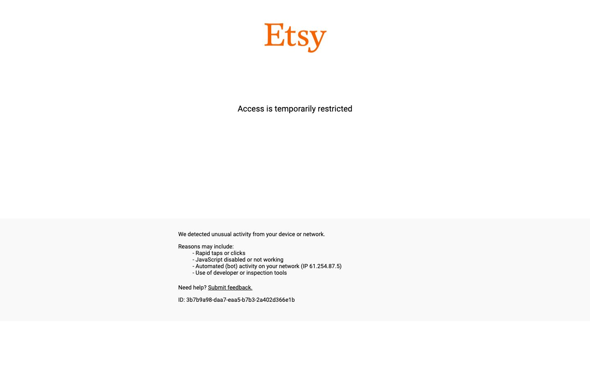

**페이지 메타 정보**

| page | title | description |
|---|---|---|
| [`trending_jewelry`](https://www.etsy.com/c/jewelry) | etsy.com |  |
| [`trending_accessories`](https://www.etsy.com/c/accessories) | etsy.com |  |

#### [Macy's](https://www.macys.com/)

- URL: <https://www.macys.com/>
- 페이지: **OK 1 · FAIL 0**

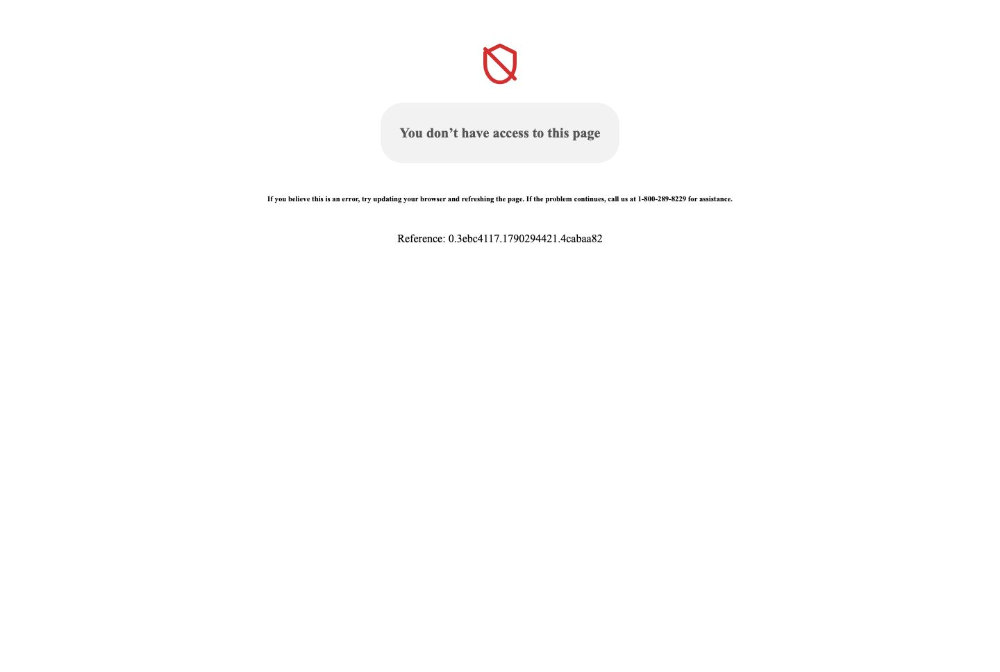

**페이지 메타 정보**

| page | title | description |
|---|---|---|
| [`new`](https://www.macys.com/shop/whats-new?id=14834) | Access Denied - Macy's | Access denied 403 |

#### [Nordstrom](https://www.nordstrom.com/)

- URL: <https://www.nordstrom.com/>
- 페이지: **OK 2 · FAIL 0**

**대표 상품 이미지** (상위 6장, 출처 URL 포함)

-  — 출처 <https://n.nordstrommedia.com/it/7f51c20a-b069-4154-9cfb-1e6d13a7c608.gif>
-  — 출처 <https://n.nordstrommedia.com/is/image/nordstrom/WMNS_ADC03F_0826_0089.jpeg?width=240&dpr=2&crop=4388%3A5485%2Coffset-x50%2Coffset-y71.956>
-  — 출처 <https://n.nordstrommedia.com/is/image/nordstrom/MENS_DRES02F_0826_0082.jpeg?width=240&dpr=2&crop=3600%3A4500%2Coffset-x50%2Coffset-y29.508>
-  — 출처 <https://n.nordstrommedia.com/is/image/nordstrom/DESW_APP01F_0826_0046.jpeg?width=240&dpr=2&crop=4480%3A5600%2Coffset-x50%2Coffset-y37.441&trim=0%2C0%2C0.001%2C0>
-  — 출처 <https://n.nordstrommedia.com/is/image/nordstrom/KIDS_BG02F_0726_01586.jpeg?width=240&dpr=2&crop=5334%3A6667.5%2Coffset-x50%2Coffset-y0>
-  — 출처 <https://n.nordstrommedia.com/is/image/nordstrom/BEA_MKUP06P_0626.jpeg?width=240&dpr=2&crop=5370%3A6712.5%2Coffset-x50%2Coffset-y50>

**페이지 메타 정보**

| page | title | description |
|---|---|---|
| [`new`](https://www.nordstrom.com/browse/new) | New & Now | Nordstrom | Shop a great selection of New Arrivals at Nordstrom.com. Top brands. New trends. |
| [`women`](https://siteclosed.nordstrom.com/invitation.html) | Nordstrom |  |

#### [Revolve](https://www.revolve.com/)

- URL: <https://www.revolve.com/>
- 페이지: **OK 0 · FAIL 2**

**실패 페이지**

- `new` — playwright_error: Error: Page.goto: net::ERR_HTTP2_PROTOCOL_ERROR at https://www.revolve.com/new/br/c79f88/
Call log:
  - navigating to "https://www.revolve.com/new/br/c79f88/", waiting until "domcontentloaded"

- `trending` — playwright_error: Error: Page.goto: net::ERR_HTTP2_PROTOCOL_ERROR at https://www.revolve.com/most-loved/br/4a9ca5/
Call log:
  - navigating to "https://www.revolve.com/most-loved/br/4a9ca5/", waiting until "domcontentloaded"

#### [Urban Outfitters](https://www.urbanoutfitters.com/)

- URL: <https://www.urbanoutfitters.com/>
- 페이지: **OK 1 · FAIL 0**

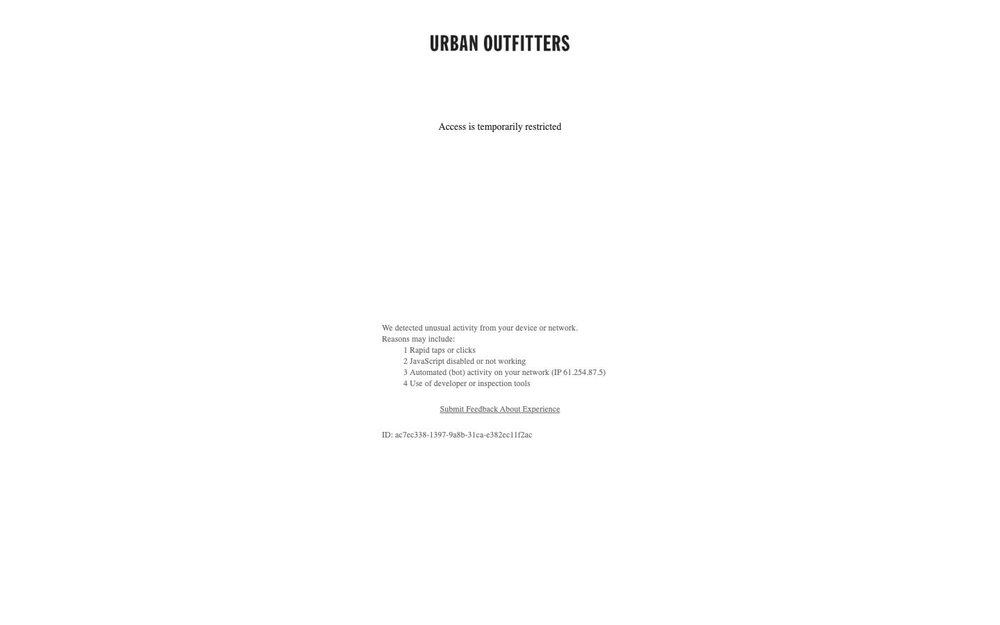

**페이지 메타 정보**

| page | title | description |
|---|---|---|
| [`new_women`](https://www.urbanoutfitters.com/womens-new-arrivals) | urbanoutfitters.com |  |

### 4.7 베트남 _( Vietnam )_

- 한국 수출규모 순위: **#4** · region: `asia` · tier `1` · currency `VND`
- 수집 사이트: **5개** (성공 5)
- 메모: 의류 생산기지/원단 수출 비중 큼. 빠르게 성장하는 이커머스
#### [Canifa](https://canifa.com/)

- URL: <https://canifa.com/>
- 페이지: **OK 1 · FAIL 0**

**대표 상품 이미지** (상위 6장, 출처 URL 포함)

-  — 출처 <https://2885371169.e.cdneverest.net/Simiconnector/BannerSlider/a/o/ao-gio_topbanner_desktop-180826.webp>
- 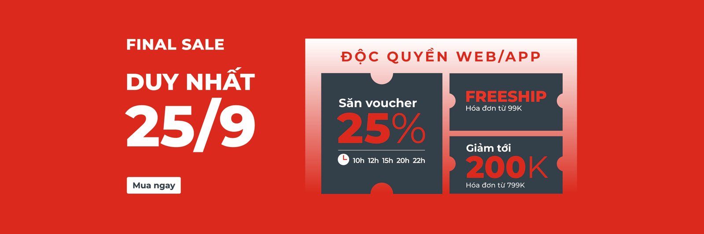 — 출처 <https://2885371169.e.cdneverest.net/Simiconnector/BannerSlider/2/5/259_topbanner_desktop-240926.webp>
-  — 출처 <https://2885371169.e.cdneverest.net/Simiconnector/BannerSlider/j/e/jeans_topbanner_desktop-110926a.webp>
-  — 출처 <https://canifa.com/_nuxt/img/chatbot-icon.c84d6ec.webp>
-  — 출처 <https://canifa.com/_nuxt/img/chat-zalo.ab5351f.webp>

**페이지 메타 정보**

| page | title | description |
|---|---|---|
| [`home`](https://canifa.com/) | CANIFA | Fashion For All | CANIFA - thương hiệu thời trang hàng đầu Việt Nam. Hàng ngàn mẫu quần áo phụ kiện nam, nữ, trẻ em cao cấp, chất lượng, an toàn liên tục được |

#### [IVY moda](https://ivymoda.com/)

- URL: <https://ivymoda.com/>
- 페이지: **OK 1 · FAIL 0**

**대표 상품 이미지** (상위 6장, 출처 URL 포함)

-  — 출처 <https://cotton4u.vn/files/news/2026/09/18/1a249b0da6bda290a0d8e8198f8a7aa1.webp>
-  — 출처 <https://cotton4u.vn/files/news/2026/09/23/c48e88b39a3595266b460bdcc226415e.webp>
-  — 출처 <https://cotton4u.vn/files/product/thumab/400/2026/09/04/83f65b9f520dec4baaae7d4c23955870.webp>
-  — 출처 <https://cotton4u.vn/files/product/thumab/400/2026/09/04/2a972ed5e530c54b0feaa89c5e0d03fe.webp>
- 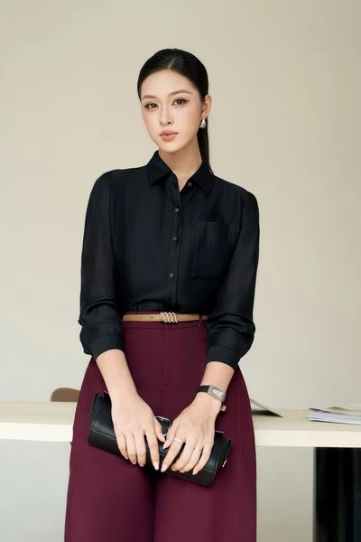 — 출처 <https://cotton4u.vn/files/product/thumab/400/2026/09/04/d2d1ff32270bd49cc3a46396e2c64356.webp>
-  — 출처 <https://cotton4u.vn/files/product/thumab/400/2026/09/04/404cd34b6e7a21325201e266b2797aac.webp>

**페이지 메타 정보**

| page | title | description |
|---|---|---|
| [`home`](https://ivymoda.com/) | IVY moda - Thời Trang Công Sở Hiện Đại | IVY moda |  |

#### [Lazada Vietnam](https://www.lazada.vn/)

- URL: <https://www.lazada.vn/>
- 페이지: **OK 1 · FAIL 0**

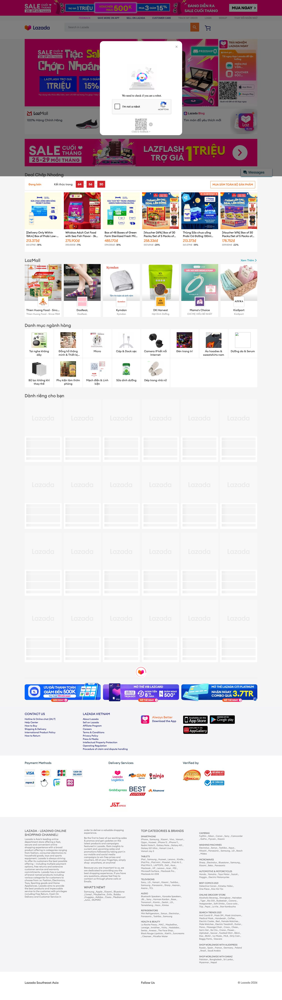

**대표 상품 이미지** (상위 6장, 출처 URL 포함)

-  — 출처 <https://img.lazcdn.com/us/domino/2ad4f22ce5a43dc145f221d13feed352.png>
-  — 출처 <https://img.lazcdn.com/g/tps/images/ims-web/TB1T7K2d8Cw3KVjSZFuXXcAOpXa.png>
- 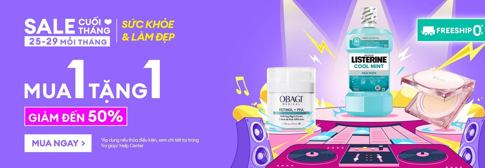 — 출처 <https://img.lazcdn.com/us/domino/bb51a91e-9a52-419b-bef3-30240ceea0cc_VN-1976-688.jpg_2200x2200q80.jpg>
-  — 출처 <https://img.lazcdn.com/us/domino/14919a82-7a26-4ea3-b610-f9ef60b5a30f_VN-1976-688.jpg_2200x2200q80.jpg>
- 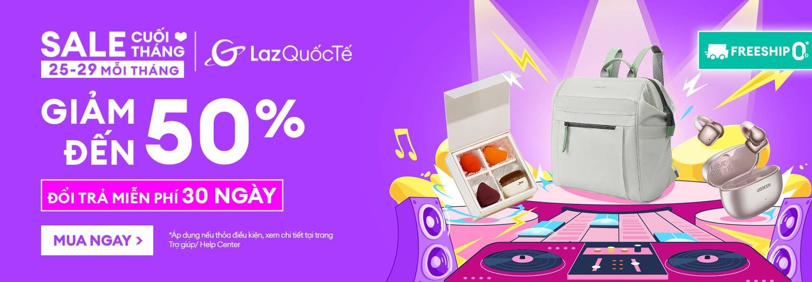 — 출처 <https://img.lazcdn.com/us/domino/1d1bc80e-4690-4628-95cd-37db204d19e1_VN-1976-688.jpg_2200x2200q80.jpg>
-  — 출처 <https://img.lazcdn.com/us/domino/d8434642-6768-4d30-8545-6a98e34cd8fc_VN-1976-688.jpg_2200x2200q80.jpg>

**페이지 메타 정보**

| page | title | description |
|---|---|---|
| [`home`](https://www.lazada.vn/#?) | Lazada Việt Nam | Mua Sắm Online, Giá Tốt Nhất Mỗi Ngày | Mua sắm đồ điện tử, thời trang, làm đẹp và đồ chơi giá cả phải chăng. Đảm bảo sản phẩm chính hãng và trải nghiệm mua sắm tiện lợi – mua ngay |

#### [Shopee Vietnam](https://shopee.vn/)

- URL: <https://shopee.vn/>
- 페이지: **OK 1 · FAIL 0**

**페이지 메타 정보**

| page | title | description |
|---|---|---|
| [`home`](https://shopee.vn/verify/captcha?anti_bot_tracking_id=gqRjZGVrxHSFomtptTE0MjUxOnRyYWNraW5nX2lkX2tleaJrdtEAAqRhbGdv0gAAAGSjZGVrwKJjdMRAAAAADMPc0R2hCGactn2nr9DcAFBQpHMoHjAbjrdsrt_pSEAwvu3D4ZqEQ0V0kSHM0Nn9K_1xVJ0eNyntbq4tnqpjaXBoZXJ0ZXh0xQOTAAAADHV9hVGBQFzMTPjHHlYajOw10-BugEVWvGxJcEqIHmbRbPit8iCKFNo0-Lfd1Rj_xghGJqNTzniDL-0jUT9Oc61AolWEKkMNMWnatjVM8j9n5etmqqwlygP1Fr2KxN9DfDL6Zgew2-vkpLvEcJmpWIJDgjR89D7g2Rr7JQZVoTe08mRyvuwi4iz-P5b9PoHWENINAkWJrC4wnFwcQgv7L343KeMFlMBFUXkNqofVe8lLtcWliHT3pu7mnUx1M7P1N3L9Ag_qVVfzjL28Z7himZabTxo1ZD28ACmih-0bk7NIhHffHri-REcCbCILLMzz9-kdf-RkdDBASkZpE2NEZTGBay3IN5rdf2tgEaZFyiLIVeUo0zKoDhAnZN0Q5lz3UJZOEUzGZqnKWa8oLY1eaAWz1jPId3ldsq7R0bwjUyBLnaFjdJeceRA1NxbT3Skj1Gle9R172RP8VrHdoOI0k-FVA9f9LZuk4j-8ZB1IOZ7gFVcdCRitMAV8vNSmKiHPrcQG8Z3-HrvSgqxtVX1oBt8xHcIDYwd12rfX7YxUJeIixhQDY_-d9HfgmdQUvmkYuMotLL7uPKdMnm3B0K73RDjyUEBpHnNKXRBjSpAqNyP7JVtLYJf5INYOOZ-rLloVfXlZ7o3s11dSRGPe1l3bgBXe8cOWKj2kUGI2qiiGBuPmpZr88pwZ_OJ5wHuDMOabd30ia_Ge-GfPx9SBttVoaVDpjpPZnCqpnXHXg1tPlE45vrb-N3_NNZwjaYMIfZ6ZbgDYjbSNGJj_UCSbSdL18GPTXHTq6ZDuUbZP24wKASIqV53pI2sC3UnIlGNfFkc5FyXwRi70Kr8gFVoEIRSjp330aQ40wXgbN7XkYE2e_YlVwJreO1wCStidnH97VcL_xnVBITkiadiRvDQk73w-f4PxtqKe-4-JwZVuyKxxfLfppGayvj5ACopmjtQ2DNGCoIvq1G5RdmYMQ54HClO1rA-NMyUClVQODEIRLeGrDLmDdPa5Opi1xxEg9XbH5mfHdilT_3WM5ekjXbBfdzMgELZk6rKtO0_vhZ-vrk05EmJIFVC6RCYWOk2cF9HRseKuNjC3Nb9b3clRbWvQWbZ3PvrZapt1mW2vyPeHhx3Cwz4Cwj_gX_vbfRf2ltLNyiJMJ18MVWSzL93e4sYD_RrkPX7KuDBHtA42gBbj3kVnVlVG0k17Hc0QHOu8bZzsspgE&app_key=Recommendation.PC&client_id=1&next=https%3A%2F%2Fshopee.vn%2Fverify%2Ftraffic%3F%3Fclient_id%3D%26next%3Dhttps%253A%252F%252Fshopee.vn%252F%26redirect_type%3D2%26should_replace_history%3Dtrue&redirect_type=2&scene=crawler_item&should_replace_history=true) | Shopee Việt Nam | Mua Sắm Online | Mua sắm trực tuyến hàng triệu sản phẩm ở tất cả ngành hàng. Giá tốt & Miễn phí vận chuyển. Mua và bán online trong 30 giây. Voucher Xtra | F |

#### [Tiki](https://tiki.vn/)

- URL: <https://tiki.vn/>
- 페이지: **OK 1 · FAIL 0**

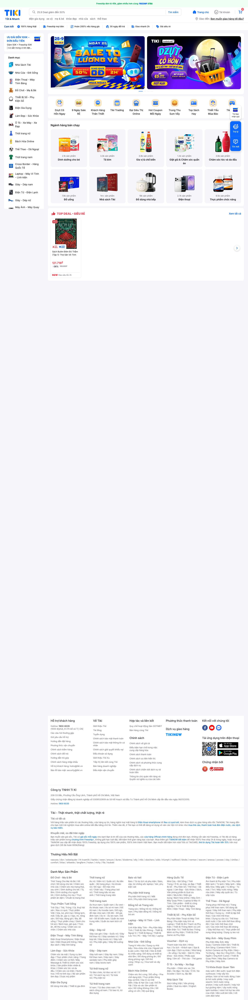

**대표 상품 이미지** (상위 6장, 출처 URL 포함)

-  — 출처 <https://salt.tikicdn.com/cache/100x100/ts/category/ed/20/60/afa9b3b474bf7ad70f10dd6443211d5f.png>
-  — 출처 <https://salt.tikicdn.com/cache/100x100/ts/category/f6/22/46/7e2185d2cf1bca72d5aeac385a865b2b.png>
-  — 출처 <https://salt.tikicdn.com/cache/100x100/ts/category/54/c0/ff/fe98a4afa2d3e5142dc8096addc4e40b.png>
-  — 출처 <https://salt.tikicdn.com/cache/100x100/ts/category/13/64/43/226301adcc7660ffcf44a61bb6df99b7.png>
-  — 출처 <https://salt.tikicdn.com/cache/100x100/ts/category/75/34/29/78e428fdd90408587181005f5cc3de32.png>
-  — 출처 <https://salt.tikicdn.com/cache/100x100/ts/category/61/d4/ea/e6ea3ffc1fcde3b6224d2bb691ea16a2.png>

**페이지 메타 정보**

| page | title | description |
|---|---|---|
| [`home`](https://tiki.vn/) | Tiki - Mua hàng online giá tốt, hàng chuẩn, ship nhanh | Tiện lợi mua sắm hàng triệu mặt hàng, dịch vụ. Vô vàn ưu đãi freeship, mã giảm giá. Hoàn tiền 15% tối đa 600k/tháng với thẻ tín dụng TikiCAR |

## 5. 의류 카테고리별 글로벌 트렌드

| # | 카테고리 | 건수 | 대표 상품명 |
|---:|---|---:|---|
| 1 | `jacket` | 12 | Glossy High Neck Leather Jacket · Kevin Work Jacket (Brown) · Kevin Work Jacket (Navy) |
| 2 | `cardigan` | 9 | Rolling Round Neck Cardigan (Melange Grey) · [네세서리 X 솔비] Wool Roll Detail Cardigan (Charcoal) · Chunky Handmade Knit Cardigan (Beige) |
| 3 | `니트` | 9 | [직잭단독][1+1할인🍁][레이어드/퍼플니트/브이넥니트/루즈핏/니트/간절기니트/캐주얼/페미닌/딥브이넥][made]그루브딥브이넥니트 - 5color · [가을니트🍁/브이넥&라운드넥/made] 에트 니트 (6color) · [🍁추석세일/무료배송] made. 포트 컬러웨이 딥브이넥 니트 - 5 color |
| 4 | `팬츠` | 8 | 시그니쳐 세미 와이드 데님 팬츠_GREEN BEIGE · [서경PICK🤎][골반뽕탈부착][~2XL][8만장🏆][힙딥커버]렌더 코튼 부츠컷 팬츠 (숏/롱ver)(7color) · [가을바지🍁/50만장돌파/made] 허쉬 코튼 와이드팬츠 (숏/기본/롱) |
| 5 | `셔츠` | 8 | [🍂가을][mlt] 밀리스 셔링 베이직 브이넥 티셔츠 (7부/긴소매) · [가을셔츠🤎/스트라이프&무지/10만장돌파/made] 로셀 라인 셔츠 (7color) · [🥇레이어드룩1위] made. 세이 셔츠앤 레이어링 니트 (워셔블니트) - 5 color |
| 6 | `skirt` | 4 | [네세서리 X 솔비] Tencel Pencil Midi Skirt (Black) · H-line Midi Skirt_2color · [이태리 울] Summer Wool H-line Long Skirt_2color |
| 7 | `coat` | 4 | [2nd] Washed Classic Trench Coat · [홍보현 착용] FONDE TRENCH COAT (BLACK) · [Premium] Cashmere-blend Handmade Coat_3color |
| 8 | `hoodie` | 3 | Dusty Raglan Hoodie_Beige · Dusty Raglan Hoodie_Light Melange · [3rd reorder] Lounge hoodie zip-up (ivory) |
| 9 | `자켓` | 3 | 플로렌스 버튼 플리스 자켓 - Charcoal · [MADE] 세틀러 오버핏 스웨이드 자켓 · [가을아우터][역대급판매량자켓][ofm] 페이보릿 클래식 (jk) |
| 10 | `shirt` | 3 | Alma oxford shirt (Navy stripe) · Alma oxford shirt (White) · Button Slim Long Sleeve T-shirt_3color |

**국가별 의류 TOP**

- **korea**: `jacket`(12), `cardigan`(9), `니트`(9), `팬츠`(8), `셔츠`(8)
## 6. 악세사리 카테고리별 글로벌 트렌드

| # | 카테고리 | 건수 | 대표 상품명 |
|---:|---|---:|---|
| 1 | `belt` | 1 | [Drama Signature] Slim Leather Belt_2color |

**국가별 악세사리 TOP**

- **korea**: `belt`(1)
## 7. 국가별 가격대 비교

| 국가 | 통화 | 표본 | min | p25 | median | p75 | max | median (USD) |
|---|---|---:|---:|---:|---:|---:|---:|---:|
| korea | KRW | 116 | 3900 | 39450 | 107895 | 189450 | 4923000 | 79.06 |

> p25/p75 는 IQR 기준 분위수. USD 환산은 `config/exchange_rates.yaml` 기준 (운영자가 정기 갱신).

## 8. 국내 의류·악세사리 사업동향

### KITA K-stat

- 한국무역통계의 국가 수출입 통계 총괄 페이지입니다.
- 사이트: <https://stat.kita.net/stat/kts/ctr/CtrTotalImpExpList.screen>

| # | topic | title | url |
|---:|---|---|---|
| 1 | `trade` | KITA.NET | <https://www.kita.net/> |
| 2 | `trade` | K-stat 란? | <https://www.kita.net/pdf/statGuide/index.html#p=1> |
| 3 | `무역통계` | 무역통계 분류 | <https://stat.kita.net/stat/guide/guide_18_01.screen> |
| 4 | `trade` | 한국품목코드 | <https://stat.kita.net/stat/kts/statCode/ItemHierCodeList.screen> |
| 5 | `trade` | 해외품목코드 | <https://stat.kita.net/stat/istat/common/IstatHSCode.screen> |
| 6 | `trade` | 대륙/경제코드 | <https://stat.kita.net/stat/kts/statCode/ConEcoCodeList.screen> |
| 7 | `trade` | 수출입 총괄 | <https://stat.kita.net/stat/kts/sum/SumImpExpTotalList.screen> |
| 8 | `trade` | 가공단계 수출입 | <https://stat.kita.net/stat/kts/use/BecList.screen> |
| 9 | `trade` | 품목 수출입 | <https://stat.kita.net/stat/kts/pum/ItemImpExpList.screen> |
| 10 | `trade` | 국가 수출입 | <https://stat.kita.net/stat/kts/ctr/CtrTotalImpExpList.screen> |
| 11 | `trade` | 대륙/경제권 수출입 | <https://stat.kita.net/stat/kts/rel/RelColligationList.screen> |
| 12 | `trade` | 지자체 수출입 | <https://stat.kita.net/stat/kts/prod/ProdWholeList.screen> |
| 13 | `trade` | 항구/공항 수출입 | <https://stat.kita.net/stat/kts/port/PortImpExpList.screen> |
| 14 | `trade` | FTA체결국 수출입 | <https://stat.kita.net/stat/kts/fta/FtaCtrImpExpList.screen> |
| 15 | `trade` | 간접수출 현황 | <https://stat.kita.net/stat/ind/KtsIndMain.screen> |

### Korea Customs Service

- 수출입 현황, 물류통계 등 관세청 무역통계정보를 종합적으로 제공
- 사이트: <https://tradedata.go.kr/cts/index_eng.do>

| # | topic | title | url |
|---:|---|---|---|
| 1 | `trade` | Korea Customs Service | <http://customs.go.kr/english/main.do> |

### KOSIS

- 코시스, 국가데이터처가 제공하는 원스톱 통계 서비스, 국가승인통계, 국제통계, 북한통계, e-지방지표, 통계시각화콘텐츠, 온라인간행물 등 제공
- 사이트: <https://kosis.kr/statisticsList/statisticsListIndex.do?parmTabId=M_01_01&vwcd=MT_ZTITLE&menuId=M_01_01&outLink=Y&entrType=>

| # | topic | title | url |
|---:|---|---|---|
| 1 | `statistics` | 쉽게 보는 통계 | <http://kosis.kr/easyViewStatis/customStatisIndex.do?vwcd=MT_TM1_TITLE&menuId=M_03_01> |
| 2 | `statistics` | 이슈별 접근 | <http://kosis.kr/easyViewStatis/customStatisIndex.do?vwcd=MT_TM2_TITLE&menuId=M_03_02> |
| 3 | `statistics` | 통계시각화콘텐츠 | <http://kosis.kr/easyViewStatis/visualizationIndex.do> |
| 4 | `statistics` | 온라인간행물 | <http://kosis.kr/publication/publicationThema.do> |
| 5 | `statistics` | 기획간행물 | <http://kosis.kr/publication/publicationStat.do> |
| 6 | `statistics` | KOSIS 길라잡이 | <http://kosis.kr/civilComplaint/kosisGuideIndex.do> |
| 7 | `statistics` | 홈페이지 개선의견 | <http://kosis.kr/civilComplaint/siteRequestList.do> |
| 8 | `statistics` | 찾아가는 KOSIS | <http://kosis.kr/civilComplaint/kosisEduIndex.do> |
| 9 | `statistics` | 서비스 소개 | <http://kosis.kr/serviceInfo/kosisIntroduce.do> |
| 10 | `statistics` | 국가통계현황 | <http://kosis.kr/serviceInfo/statisInstitution.do> |
| 11 | `statistics` | 국가통계 공표일정 | <http://kosis.kr/serviceInfo/statisPublicationList.do> |
| 12 | `statistics` | 팩트체크 서비스 | <http://kosis.kr/serviceInfo/factCheckList.do> |
| 13 | `statistics` | 서비스정책 | <http://kosis.kr/serviceInfo/useGuide.do> |
| 14 | `statistics` | 공유서비스 (OpenAPI) | <http://kosis.kr/serviceInfo/openAPIGuide.do> |
| 15 | `statistics` | English | <https://kosis.kr/eng> |

### KOTRA

- 트라이빅(TriBig)은 코트라(KOTRA)가 제공하는 무역투자 빅데이터 플랫폼으로 무역투자통계, 국가별 시장정보, 품목별 유망시장, 기업별 맞춤정보, 해외바이어 정보의 서비스를 제공합니다.
- 사이트: <https://www.kotra.or.kr/bigdata/visualization/korea#search/ALL/ALL/2024>

| # | topic | title | url |
|---:|---|---|---|
| 1 | `trade` | kotra 무역투자24 | <https://www.kotra.or.kr/bigdata/kotraSsoRedirect?targetURL=https://www.kotra.or.kr> |
| 2 | `trade` | 해외비즈니스 정보 포털 | <https://www.kotra.or.kr/bigdata/kotraSsoRedirect?targetURL=https://dream.kotra.or.kr/dream> |
| 3 | `trade` | 글로벌 전시포털 | <https://www.kotra.or.kr/bigdata/kotraSsoRedirect?targetURL=https://www.gep.or.kr/> |
| 4 | `trade` | KOTRA 해외인재유치센터 | <https://www.kotra.or.kr/gtc_kor> |
| 5 | `trade` | 투자유치정보제공 | <https://www.kotra.or.kr/bigdata/kotraSsoRedirect?targetURL=https://www.investkorea.org/> |
| 6 | `수출지원` | 수출지원 온라인 플랫폼 | <https://www.kotra.or.kr/bigdata/kotraSsoRedirect?targetURL=https://www.buykorea.or.kr/> |
| 7 | `trade` | 빅데이터 서비스 | <https://www.kotra.or.kr/bigdata/> |
| 8 | `trade` | 경제외교 활용포털 | <https://www.kotra.or.kr/bigdata/kotraSsoRedirect?targetURL=https://president.globalwindow.org> |
| 9 | `trade` | 방산물자교역지원센터 | <https://www.kotra.or.kr/bigdata/kotraSsoRedirect?targetURL=https://www.kotra.or.kr/kodits> |
| 10 | `trade` | 외투기업고충처리 | <https://www.kotra.or.kr/bigdata/kotraSsoRedirect?targetURL=https://ombudsman.kotra.or.kr/ob-kr> |
| 11 | `trade` | 수출바우처 · 지사화 | <https://www.exportvoucher.com> |
| 12 | `trade` | 무역투자통계 | <https://www.kotra.or.kr/bigdata/visualization/korea> |
| 13 | `trade` | 국가별 시장정보 | <https://www.kotra.or.kr/bigdata/marketAnalysis> |
| 14 | `trade` | 품목별 유망시장 | <https://www.kotra.or.kr/bigdata/bhrcMarket> |
| 15 | `trade` | 해외바이어 정보 | <https://www.kotra.or.kr/bigdata/partner/search> |

### Statistics Korea Online Shopping

- 국가데이터처,List | 전체 | 보도자료 | 새소식
- 사이트: <https://mods.go.kr/board.es?mid=a10301010000&bid=11789>

| # | topic | title | url |
|---:|---|---|---|
| 1 | `statistics` | 정보공개제도 | <https://mods.go.kr/menu.es?mid=a10101010100> |
| 2 | `statistics` | 정보공개청구 | <https://www.open.go.kr/com/main/mainView.do> |
| 3 | `statistics` | 비공개대상정보세부기준 | <https://mods.go.kr/menu.es?mid=a10101030000> |
| 4 | `statistics` | 고객수요분석 | <https://mods.go.kr/menu.es?mid=a10101040000> |
| 5 | `statistics` | 사전정보공표 | <https://mods.go.kr/menu.es?mid=a10103010000> |
| 6 | `statistics` | 사전정보공표목록 | <https://mods.go.kr/menu.es?mid=a10103010100> |
| 7 | `statistics` | 핵심단어목록 | <https://mods.go.kr/menu.es?mid=a10103020100> |
| 8 | `statistics` | 인기정보TOP10 | <https://mods.go.kr/menu.es?mid=a10103030100> |
| 9 | `statistics` | 행정자료실 | <https://mods.go.kr/menu.es?mid=a10104010000> |
| 10 | `statistics` | 업무추진비 | <https://mods.go.kr/menu.es?mid=a10104010100> |
| 11 | `statistics` | 국회관련정보 | <https://mods.go.kr/menu.es?mid=a10104040000> |
| 12 | `statistics` | 정책실명제 | <https://mods.go.kr/menu.es?mid=a10105010000> |
| 13 | `statistics` | 연도별대상사업현황 | <https://mods.go.kr/menu.es?mid=a10105020000> |
| 14 | `statistics` | 중점관리대상사업 | <https://mods.go.kr/menu.es?mid=a10105030600> |
| 15 | `statistics` | 국민신청실명제 | <https://mods.go.kr/menu.es?mid=a10105040000> |

### 기업마당

- 기업마당>정책정보>지원사업 공고
- 사이트: <https://www.bizinfo.go.kr/sii/siia/selectSIIA200View.do?null>

| # | topic | title | url |
|---:|---|---|---|
| 1 | `policy` | 지원사업 공고 | <https://www.bizinfo.go.kr/sii/siia/selectSIIA200View.do> |
| 2 | `policy` | 품목별 법정의무 인증제도 | <https://www.bizinfo.go.kr/biz/biza/selectBIZA100View.do> |
| 3 | `policy` | 입법·행정예고/고시 | <https://www.bizinfo.go.kr/biz/biza/selectBIZA300View.do> |
| 4 | `policy` | 월간 중기누리 | <https://www.bizinfo.go.kr/biz/biza/selectBIZA400View.do> |
| 5 | `policy` | 기업업무용 서식 | <https://www.bizinfo.go.kr/biz/bizb/selectBIZB100View.do> |
| 6 | `policy` | 입주기업 모집공고 | <https://www.bizinfo.go.kr/biz/bizb/selectBIZB200View.do> |
| 7 | `policy` | 온라인화상회의실 | <https://www.k-startup.go.kr/web/contents/webOLNIVIDEOMTRM.do> |
| 8 | `policy` | 정책정보 개방 | <https://www.bizinfo.go.kr/apiList.do> |
| 9 | `policy` | 속보성 대시보드 | <https://www.bizinfo.go.kr/dashboard.do> |
| 10 | `policy` | 고객의 소리 | <https://www.bizinfo.go.kr/biz/bizc/selectBIZC200Regist.do> |
| 11 | `policy` | 자주하는질문 | <https://www.bizinfo.go.kr/biz/bizc/selectBIZC300View.do> |
| 12 | `policy` | 이메일주소 무단 수집 거부안내 | <https://www.bizinfo.go.kr/biz/bizd/selectBIZD110View.do> |
| 13 | `policy` | 저작권 정책 | <https://www.bizinfo.go.kr/biz/bizd/selectBIZD120View.do> |
| 14 | `policy` | 웹접근성 정책 | <https://www.bizinfo.go.kr/biz/bizd/selectBIZD130View.do> |
| 15 | `policy` | 전체메뉴보기 | <https://www.bizinfo.go.kr/sitemap/intro.do> |

### 서울경제진흥원

- 서울경제진흥원 에러페이지
- 사이트: <https://www.sba.seoul.kr/Pages/error_404.html?aspxerrorpath=/Pages/NSub06_01.aspx>

### 소상공인24

- 소상공인24
- 사이트: <https://www.sbiz24.kr/#/pbanc>

### 중소벤처기업부

- 중소기업중앙회 등 기관 중소기업 조사, 통계 DB화 검색, 내려받기 등 제공.
- 사이트: <https://www.mss.go.kr/site/smba/ex/bbs/List.do?cbIdx=86>

| # | topic | title | url |
|---:|---|---|---|
| 1 | `policy` | 어린이 누리집 | <https://www.mss.go.kr/site/kids/main.do> |
| 2 | `policy` | English | <https://www.mss.go.kr/site/eng/main.do> |
| 3 | `policy` | 누리집 안내지도 | <https://www.mss.go.kr/site/smba/ex/siteMap/siteMap.do> |
| 4 | `policy` | 훈령/예규/고시/공고 | <https://www.mss.go.kr/site/smba/ex/bbs/List.do?cbIdx=125&ext6=Y> |
| 5 | `policy` | 입법/행정예고 | <https://www.mss.go.kr/site/smba/ex/bbs/List.do?cbIdx=126&searchRltnYn=Y> |
| 6 | `policy` | 인사·채용 | <https://www.mss.go.kr/site/smba/ex/bbs/List.do?cbIdx=82> |
| 7 | `policy` | 보도설명자료 | <https://www.mss.go.kr/site/smba/ex/bbs/List.do?cbIdx=87> |
| 8 | `policy` | 현장속으로 | <https://www.mss.go.kr/site/smba/brdcststnVod/brdcststnVodList.do?ctgr_code=C01> |
| 9 | `policy` | 중기부소식지 | <https://www.mss.go.kr/site/smba/ex/bbs/List.do?cbIdx=95> |
| 10 | `policy` | 통계발표자료 | <https://www.mss.go.kr/site/smba/foffice/ex/statDB/ptScheduleList.do> |
| 11 | `policy` | 주제별 통계 | <https://www.mss.go.kr/site/smba/foffice/ex/statDB/temaList.do?tabCd=0001> |
| 12 | `policy` | 조사별 통계 | <https://www.mss.go.kr/site/smba/foffice/ex/statDB/surveyList.do?tabCd=0001> |
| 13 | `policy` | 조사보고서 | <https://www.mss.go.kr/site/smba/foffice/ex/statDB/stReportRoList.do?gb=1&nodeId=&roCode=> |
| 14 | `policy` | 주제별 조회 | <https://www.mss.go.kr/site/smba/foffice/ex/statDB/stReportRcList.do?gb=2&nodeId=&rcCode=> |
| 15 | `policy` | 중소기업위상 | <https://www.mss.go.kr/site/smba/foffice/ex/statDB/MainSubStat.do?scd=0001> |

## 9. 한국 사업자 관점 기회 국가 TOP 10

| # | 국가 | tier | region | 점수 | 근거 |
|---:|---|---:|---|---:|---|
| 1 | 태국 _( Thailand )_ | 1 | `asia` | **144.5** | tier1 기본점(90); 아시아 권역(+20); ASEAN 시장(+10); K-패션/콘텐츠 친화 시장(+20); 트렌드 신호 밀도 4 |
| 2 | 대만 _( Taiwan )_ | 1 | `asia` | **136.5** | tier1 기본점(90); 아시아 권역(+20); K-패션/콘텐츠 친화 시장(+20); 트렌드 신호 밀도 6 |
| 3 | 일본 _( Japan )_ | 1 | `asia` | **130.0** | tier1 기본점(90); 아시아 권역(+20); K-패션/콘텐츠 친화 시장(+20) |
| 4 | 인도네시아 _( Indonesia )_ | 1 | `asia` | **129.0** | tier1 기본점(90); 아시아 권역(+20); ASEAN 시장(+10); 트렌드 신호 밀도 9 |
| 5 | 베트남 _( Vietnam )_ | 1 | `asia` | **125.0** | tier1 기본점(90); 아시아 권역(+20); ASEAN 시장(+10); 트렌드 신호 밀도 5 |
| 6 | 필리핀 _( Philippines )_ | 2 | `asia` | **110.0** | tier2 기본점(60); 아시아 권역(+20); ASEAN 시장(+10); K-패션/콘텐츠 친화 시장(+20) |
| 7 | 미국 _( United States )_ | 1 | `north_america` | **99.0** | tier1 기본점(90); 트렌드 신호 밀도 9 |
| 8 | 말레이시아 _( Malaysia )_ | 2 | `asia` | **90.0** | tier2 기본점(60); 아시아 권역(+20); ASEAN 시장(+10) |
| 9 | 싱가포르 _( Singapore )_ | 2 | `asia` | **90.0** | tier2 기본점(60); 아시아 권역(+20); ASEAN 시장(+10) |
| 10 | 홍콩 _( Hong Kong )_ | 2 | `asia` | **80.0** | tier2 기본점(60); 아시아 권역(+20) |

## 10. 실행 제안

### **1위 태국** (점수 144, tier1 · asia)

- 현지 스타일 TOP: `wide` — 시즌 컬렉션 기획 시 우선 반영.
- 현지 컬러 TOP: `red` — 시즌 컬렉션 기획 시 우선 반영.
- 현지 카테고리 TOP: `hat`, `tee`, `bag` — 시즌 컬렉션 기획 시 우선 반영.
- K-패션 친화도가 명시된 시장이므로 K-브랜드 아이덴티티 및 한류 셀럽 협업을 강조.
- ASEAN 권역 시장 — 물류/관세(FTA) 활용 + 동남아 통합 마케팅 검토 권장.
- tier1 핵심 시장 — 현지 마켓플레이스(예: 해당 국가의 대표 패션 플랫폼) 공식 입점 + 셀러 운영 채널 확보 우선.
- 연계 가능한 국내 수출/지원 사업이 식별되지 않음 — `domestic_sources.yaml` 의 `landing_url` 을 KOTRA 사업 공고/기업마당 수출바우처로 직접 지정 권장.

### **2위 대만** (점수 136, tier1 · asia)

- 현지 컬러 TOP: `pink`, `red` — 시즌 컬렉션 기획 시 우선 반영.
- 현지 소재 TOP: `lace` — 시즌 컬렉션 기획 시 우선 반영.
- K-패션 친화도가 명시된 시장이므로 K-브랜드 아이덴티티 및 한류 셀럽 협업을 강조.
- 아시아 권역 시장 — 시차/언어 친화 + 한국 본사 직배송 모델 검토.
- tier1 핵심 시장 — 현지 마켓플레이스(예: 해당 국가의 대표 패션 플랫폼) 공식 입점 + 셀러 운영 채널 확보 우선.
- 연계 가능한 국내 수출/지원 사업이 식별되지 않음 — `domestic_sources.yaml` 의 `landing_url` 을 KOTRA 사업 공고/기업마당 수출바우처로 직접 지정 권장.

### **3위 일본** (점수 130, tier1 · asia)

- K-패션 친화도가 명시된 시장이므로 K-브랜드 아이덴티티 및 한류 셀럽 협업을 강조.
- 아시아 권역 시장 — 시차/언어 친화 + 한국 본사 직배송 모델 검토.
- tier1 핵심 시장 — 현지 마켓플레이스(예: 해당 국가의 대표 패션 플랫폼) 공식 입점 + 셀러 운영 채널 확보 우선.
- 연계 가능한 국내 수출/지원 사업이 식별되지 않음 — `domestic_sources.yaml` 의 `landing_url` 을 KOTRA 사업 공고/기업마당 수출바우처로 직접 지정 권장.

### 운영 점검 노트

- **ASEAN 다중 진출 기회**: TOP10 중 ASEAN 국가가 3개 이상. Shopee/Lazada/Zalora 통합 운영을 통한 동남아 멀티마켓 전략을 검토 권장.

## 11. 수집 실패/주의 사이트

| 국가 | 사이트 | 페이지 | 상태 | 사유 |
|---|---|---|---|---|
| usa | Revolve | new | failed | playwright_error: Error: Page.goto: net::ERR_HTTP2_PROTOCOL_ERROR at https://www.revolve.com/new/br/c79f88/
Call log:
  - navigating to "https://www.revolve.com/new/br/c79f88/", waiting until "domcontentloaded"
 |
| usa | Revolve | trending | failed | playwright_error: Error: Page.goto: net::ERR_HTTP2_PROTOCOL_ERROR at https://www.revolve.com/most-loved/br/4a9ca5/
Call log:
  - navigating to "https://www.revolve.com/most-loved/br/4a9ca5/", waiting until "domcontentloaded"
 |
| japan | ZOZOTOWN | new | failed | playwright_error: TimeoutError: Page.goto: Timeout 30000ms exceeded.
Call log:
  - navigating to "https://zozo.jp/category/new/", waiting until "domcontentloaded"
 |
| japan | ZOZOTOWN | ranking | failed | playwright_error: TimeoutError: Page.goto: Timeout 30000ms exceeded.
Call log:
  - navigating to "https://zozo.jp/ranking/", waiting until "domcontentloaded"
 |
| japan | Rakuten Fashion | women | failed | http_status_404 |
| indonesia | Tokopedia | home | failed | playwright_error: Error: Page.goto: net::ERR_HTTP2_PROTOCOL_ERROR at https://www.tokopedia.com/
Call log:
  - navigating to "https://www.tokopedia.com/", waiting until "domcontentloaded"
 |
| taiwan | PChome | home | failed | http_status_429 |
| thailand | Pomelo | new | failed | robots_disallowed |
| thailand | Pomelo | best | failed | robots_disallowed |
| korea | Musinsa | home | failed | robots_disallowed |

## 12. 원문 출처 및 이미지 출처

### 인도네시아

- **Berrybenka** — <https://www.berrybenka.com/>
  - 이미지 출처: <https://berrybenka.com/cdn/shop/files/berrybenka_logo.png?height=288&v=1788942734>
  - 이미지 출처: <https://berrybenka.com/cdn/shop/files/Cover-web.png?v=1789450341&width=3840>
  - 이미지 출처: <https://berrybenka.com/cdn/shop/files/th-11134207-81zto-mr01nsim06pz1d.jpg?v=1788923925&width=3840>
  - 이미지 출처: <https://berrybenka.com/cdn/shop/files/th-11134207-81ztm-mr01nsai9iis83.jpg?v=1788923925&width=3840>
  - 이미지 출처: <https://berrybenka.com/cdn/shop/files/th-11134207-81zti-mr01ns6xfbb69c.jpg?v=1788923925&width=3840>
  - 이미지 출처: <https://berrybenka.com/cdn/shop/files/th-11134207-81ztl-mr01ns6yd0y418.jpg?v=1788923925&width=3840>
  - 이미지 출처: <https://berrybenka.com/cdn/shop/files/th-11134207-81ztl-mr01mnofturra9.jpg?v=1788923924&width=3840>
  - 이미지 출처: <https://berrybenka.com/cdn/shop/files/th-11134207-81ztq-mr01mno9uxvp15.jpg?v=1788923924&width=3840>
  - 이미지 출처: <https://berrybenka.com/cdn/shop/files/th-11134207-81ztq-mr01mnoar8xw27.jpg?v=1788923924&width=3840>
  - 이미지 출처: <https://berrybenka.com/cdn/shop/files/th-11134207-81zto-mr01mnofsg7b62.jpg?v=1788923923&width=3840>
  - 이미지 출처: <https://berrybenka.com/cdn/shop/files/th-11134207-81ztf-mpkkrks9afwvcc.jpg?v=1788923910&width=3840>
  - 이미지 출처: <https://berrybenka.com/cdn/shop/files/th-11134207-81zti-mpkkrs4h1slq20.jpg?v=1788923910&width=3840>
  - 이미지 출처: <https://berrybenka.com/cdn/shop/files/th-11134207-81ztk-mpkkrw87hwy520.jpg?v=1788923910&width=3840>
  - 이미지 출처: <https://berrybenka.com/cdn/shop/files/th-11134207-81zti-mpkkrs6b3w24a1.jpg?v=1788923910&width=3840>
  - 이미지 출처: <https://berrybenka.com/cdn/shop/files/th-11134207-81ztl-mpkkrw9095hnee.jpg?v=1788923910&width=3840>
  - 이미지 출처: <https://berrybenka.com/cdn/shop/files/th-11134207-81zti-msvb3gvta1oo58.jpg?v=1788923922&width=3840>
  - 이미지 출처: <https://berrybenka.com/cdn/shop/files/th-11134207-81ztp-mr01qtd745j641.jpg?v=1788923922&width=3840>
  - 이미지 출처: <https://berrybenka.com/cdn/shop/files/th-11134207-81zti-mr01qtd6evbb7f.jpg?v=1788923922&width=3840>
  - 이미지 출처: <https://berrybenka.com/cdn/shop/files/th-11134207-81ztl-mr01qz2tf5s510.jpg?v=1788923922&width=3840>
- **Hijup** — <https://www.hijup.com/>
- **Shopee Indonesia** — <https://shopee.co.id/>
  - 이미지 출처: <https://deo.shopeemobile.com/shopee/shopee-pcmall-live-sg/assets/1c8bdaaf45e1fd48.png>
  - 이미지 출처: <https://deo.shopeemobile.com/shopee/shopee-pcmall-live-sg/homepagefe/42ba6075c82a85ab.png>
- **Tokopedia** — <https://www.tokopedia.com/>
- **Zalora Indonesia** — <https://www.zalora.co.id/>
  - 이미지 출처: <https://static-id.zacdn.com/next-assets/static-assets/images/logo/icon_mastercard.png>
  - 이미지 출처: <https://static-id.zacdn.com/next-assets/static-assets/images/logo/icon_visa.png>
  - 이미지 출처: <https://static-id.zacdn.com/next-assets/static-assets/images/logo/icon_ovo.png>

### 일본

- **GU Japan** — <https://www.gu-global.com/jp/>
  - 이미지 출처: <https://image.uniqlo.com/GU/ST3/jp/imagesother/Navigation/WOMEN_Category/2026/260724/Category_w_Pants.jpg>
  - 이미지 출처: <https://image.uniqlo.com/GU/ST3/jp/imagesother/Navigation/WOMEN_Category/2026/260820/Category_w_skirt_361518.png>
  - 이미지 출처: <https://image.uniqlo.com/GU/ST3/jp/imagesother/Navigation/WOMEN_Category/2026/260901/Category_w_Outer_361430.png>
  - 이미지 출처: <https://image.uniqlo.com/GU/ST3/jp/imagesother/Navigation/WOMEN_Category/2026/260911/Category_w_tops_358739.png>
  - 이미지 출처: <https://image.uniqlo.com/GU/ST3/jp/imagesother/Navigation/WOMEN_Category/2026/260807/Category_w_shirt_361657.png>
  - 이미지 출처: <https://image.uniqlo.com/GU/ST3/jp/imagesother/Navigation/WOMEN_Category/2026/260911/Category_w_knit-and-cardigan_360832.png>
  - 이미지 출처: <https://image.uniqlo.com/GU/ST3/jp/imagesother/Navigation/WOMEN_Category/2026/260820/Category_w_onepeace_361516.png>
  - 이미지 출처: <https://image.uniqlo.com/GU/ST3/jp/imagesother/Navigation/WOMEN_Category/2026/260911/Category_w_sweat_361784.png>
  - 이미지 출처: <https://image.uniqlo.com/GU/ST3/jp/imagesother/Navigation/WOMEN_Category/2026/260820/Category_w_haori_360549.png>
  - 이미지 출처: <https://image.uniqlo.com/GU/ST3/jp/imagesother/Navigation/WOMEN_Category/2026/260818/Category_w_Kireime_361373.png>
  - 이미지 출처: <https://image.uniqlo.com/GU/ST3/jp/imagesother/Navigation/WOMEN_Category/2026/260911/Category_w_roomwear_358761.png>
  - 이미지 출처: <https://image.uniqlo.com/GU/ST3/jp/imagesother/Navigation/WOMEN_Category/2026/260818/Category_w_inner_360961.png>
  - 이미지 출처: <https://image.uniqlo.com/GU/ST3/jp/imagesother/Navigation/WOMEN/2026/09/0922/category_w_shoes_361781.png>
  - 이미지 출처: <https://image.uniqlo.com/GU/ST3/jp/imagesother/Navigation/WOMEN_Category/2026/260911/Category_w_goods_360893.png>
- **Rakuten Fashion** — <https://brandavenue.rakuten.co.jp/>
  - 이미지 출처: <https://brandavenue.r10s.jp/img/library/index/sbn_flagshipstore_20231003.png>
  - 이미지 출처: <https://brandavenue.r10s.jp/img/news/01/398945/pc_n.jpg>
  - 이미지 출처: <https://brandavenue.r10s.jp/img/news/01/397873/pc_n.jpg>
  - 이미지 출처: <https://brandavenue.r10s.jp/img/news/01/398013/pc_n.jpg>
  - 이미지 출처: <https://brandavenue.r10s.jp/img/news/01/398572/pc_n.jpg>
  - 이미지 출처: <https://brandavenue.r10s.jp/img/news/01/398575/pc_n.jpg>
  - 이미지 출처: <https://brandavenue.r10s.jp/img/news/01/398577/pc_n.jpg>
  - 이미지 출처: <https://brandavenue.r10s.jp/img/news/01/398581/pc_n.jpg>
  - 이미지 출처: <https://brandavenue.r10s.jp/img/news/01/398587/pc_n.jpg>
  - 이미지 출처: <https://brandavenue.r10s.jp/img/news/01/398588/pc_n.jpg>
  - 이미지 출처: <https://brandavenue.r10s.jp/img/news/01/398592/pc_n.jpg>
  - 이미지 출처: <https://brandavenue.r10s.jp/img/news/01/399175/pc_n.jpg>
  - 이미지 출처: <https://brandavenue.r10s.jp/img/news/01/398571/pc_n.jpg>
  - 이미지 출처: <https://brandavenue.r10s.jp/img/news/01/399213/pc_n.jpg>
  - 이미지 출처: <https://brandavenue.r10s.jp/img/news/01/399011/pc_n.jpg>
  - 이미지 출처: <https://brandavenue.r10s.jp/img/news/01/397413/pc_n.jpg>
  - 이미지 출처: <https://brandavenue.r10s.jp/img/news/01/397331/pc_n.jpg>
  - 이미지 출처: <https://brandavenue.r10s.jp/img/news/01/394721/pc_n.jpg>
  - 이미지 출처: <https://brandavenue.r10s.jp/img/news/01/398746/pc_n.jpg>
- **Uniqlo Japan** — <https://www.uniqlo.com/jp/>
- **WEAR** — <https://wear.jp/>
  - 이미지 출처: <https://wear.jp/public/_next/static/media/notfound_bg.1ywd-k_shp-hy.png>
  - 이미지 출처: <https://wear.jp/public/_next/static/media/notfound_4.1ho27atf54bbv.png>
  - 이미지 출처: <https://wear.jp/public/_next/static/media/notfound_0.438l9b9xjj6tm.png>
  - 이미지 출처: <https://images.wear2.jp/coordinate/ekiqYE0j/FKt3pnyb/1789601139_276.jpg>
  - 이미지 출처: <https://images.wear2.jp/coordinate/QWi0q82/nA1woDT7/1790139319_276.jpg>
  - 이미지 출처: <https://images.wear2.jp/coordinate/OwibGv42/qxkzL6WE/1790174484_276.jpg>
  - 이미지 출처: <https://images.wear2.jp/coordinate/ywimOMnJ/eYcBEViP/1790164931_276.jpg>
  - 이미지 출처: <https://images.wear2.jp/coordinate/ekiqPVyQ/BdlTfj2t/1790253016_276.jpg>
  - 이미지 출처: <https://images.wear2.jp/coordinate/MniLPPWd/z1kMvSiy/1789873638_276.jpg>
  - 이미지 출처: <https://images.wear2.jp/profile/6gio2xl5/hpSX0raH/1715229637_120.jpg>
  - 이미지 출처: <https://images.wear2.jp/profile/DZiMWDQ2/4Bo8fUk9/1688269853_120.jpg>
  - 이미지 출처: <https://images.wear2.jp/profile/V7ik3g7/HAPwAAh8/1788448914_120.jpg>
  - 이미지 출처: <https://images.wear2.jp/profile/nZinE87v/L5XxT9ne/1715166698_120.jpg>
  - 이미지 출처: <https://cdn.wimg.jp/profile/r6ivl5/20200225194738715_120.jpg>
  - 이미지 출처: <https://images.wear2.jp/profile/7biB2xGy/1r6pEyAG/1714910829_120.jpg>
  - 이미지 출처: <https://images.wear2.jp/profile/DZiqjLak/j8lDP8fW/1723220510_120.jpg>
  - 이미지 출처: <https://images.wear2.jp/profile/qri8P5Oz/eiBxbSsv/1722699460_120.jpg>
  - 이미지 출처: <https://images.wear2.jp/profile/DZiekqVZ/79WNu9Ri/1779683603_120.jpg>
  - 이미지 출처: <https://wear.jp/public/_next/static/media/mock.1rl8d86z-j78c.webp>
  - 이미지 출처: <https://wear.jp/public/_next/static/media/business_exposition_2028_sp.0447xu75vsqwi.webp>
- **ZOZOTOWN** — <https://zozo.jp/>

### 한국

- **29CM** — <https://www.29cm.co.kr/>
  - 이미지 출처: <https://img.29cm.co.kr/cms/202609/11f1b647983e50f894a377b8f519374f.png?width=3840&format=webp>
  - 이미지 출처: <https://img.29cm.co.kr/cms/202609/11f1b64782588b72a9b843e8b1ac19f2.png?width=3840&format=webp>
  - 이미지 출처: <https://img.29cm.co.kr/cms/202609/11f1b6477719354494a3d17c7b934d36.png?width=3840&format=webp>
  - 이미지 출처: <https://img.29cm.co.kr/cms/202609/11f1b6476cf058e494a30dfc37a439cb.png?width=3840&format=webp>
  - 이미지 출처: <https://img.29cm.co.kr/cms/202609/11f1b64764899fb8a9b83785ad7440d2.png?width=3840&format=webp>
  - 이미지 출처: <https://img.29cm.co.kr/cms/202609/11f1b6475b6f4d2aa9b8e9584d217eed.png?width=3840&format=webp>
  - 이미지 출처: <https://img.29cm.co.kr/cms/202609/11f1b6474f88460ea9b8f1775a0b4f67.png?width=3840&format=webp>
  - 이미지 출처: <https://img.29cm.co.kr/cms/202609/11f1b644be476fba94a38941ac37758d.png?width=3840&format=webp>
  - 이미지 출처: <https://img.29cm.co.kr/cms/202609/11f1b644845dffbe94a3db8006fc13a2.png?width=3840&format=webp>
  - 이미지 출처: <https://img.29cm.co.kr/cms/202609/11f1b6447a6fe27294a3f150e1be81d4.png?width=3840&format=webp>
  - 이미지 출처: <https://img.29cm.co.kr/cms/202609/11f1b6446f2edf7aa9b89d48e7db75fb.png?width=3840&format=webp>
  - 이미지 출처: <https://img.29cm.co.kr/cms/202609/11f1b575eeca4394a9b8355392a177e6.png?width=3840&format=webp>
  - 이미지 출처: <https://img.29cm.co.kr/cms/202609/11f1b575e42bc1d294a3cf156f9a0337.png?width=3840&format=webp>
  - 이미지 출처: <https://img.29cm.co.kr/cms/202609/11f1b624f4c9ce9aa9b8f94c24edb117.png?width=3840&format=webp>
  - 이미지 출처: <https://img.29cm.co.kr/cms/202609/11f1b575c2c1fc88a9b8213325dc73a7.png?width=3840&format=webp>
  - 이미지 출처: <https://img.29cm.co.kr/cms/202609/11f1b575b6bbfc2c94a3fd62ada1f063.png?width=3840&format=webp>
  - 이미지 출처: <https://img.29cm.co.kr/cms/202609/11f1b332756250a4a9b8a1d1c8509cc0.png?width=3840&format=webp>
  - 이미지 출처: <https://img.29cm.co.kr/cms/202609/11f1b255282f03cca9b8152ecb4e327b.png?width=3840&format=webp>
  - 이미지 출처: <https://img.29cm.co.kr/cms/202609/11f1b19939b80614912703a337aaf19d.png?width=3840&format=webp>
- **Musinsa** — <https://www.musinsa.com/>
- **W Concept** — <https://www.wconcept.co.kr/>
- **Zigzag** — <https://zigzag.kr/>
  - 이미지 출처: <https://cf.image-farm.s.zigzag.kr/original/cms/2026/09/18/202609180246143283_070383.png?quality=80&format=webp&transparent=true&width=1029&height=1188>
  - 이미지 출처: <https://cf.image-farm.s.zigzag.kr/original/cms/2026/09/14/202609140041324266_051635.jpg?width=1029&height=1188&quality=80&format=webp&transparent=true>
  - 이미지 출처: <https://cf.image-farm.s.zigzag.kr/original/cms/2026/09/17/202609170959024570_053494.png?quality=80&format=webp&transparent=true&width=1029&height=1188>
  - 이미지 출처: <https://cf.image-farm.s.zigzag.kr/original/cms/2026/09/17/202609170126302556_058883.jpg?width=1029&height=1188&quality=80&format=webp&transparent=true>
  - 이미지 출처: <https://cf.image-farm.s.zigzag.kr/original/cms/2026/09/17/202609170537527708_014365.png?quality=80&format=webp&transparent=true&width=1029&height=1188>
  - 이미지 출처: <https://cf.image-farm.s.zigzag.kr/original/cms/2026/09/18/202609180157057204_039760.jpg?width=1029&height=1188&quality=80&format=webp&transparent=true>
  - 이미지 출처: <https://cf.image-farm.s.zigzag.kr/original/cms/2026/09/18/202609180609424151_064655.jpg?width=1029&height=1188&quality=80&format=webp&transparent=true>
  - 이미지 출처: <https://cf.image-farm.s.zigzag.kr/original/cms/2026/09/21/202609210129272981_044903.jpg?format=webp&quality=80&width=1029&height=1188>
  - 이미지 출처: <https://cf.image-farm.s.zigzag.kr/original/cms/2026/09/17/202609171042434530_073881.jpg?width=1029&height=1188&quality=80&format=webp&transparent=true>
  - 이미지 출처: <https://cf.image-farm.s.zigzag.kr/original/cms/2026/09/16/202609160620451987_035413.png?quality=80&format=webp&transparent=true&width=1029&height=1188>
  - 이미지 출처: <https://cf.image-farm.s.zigzag.kr/original/cms/2026/09/12/202609121609350966_023785.png?quality=80&format=webp&transparent=true&width=1029&height=1188>
  - 이미지 출처: <https://cf.image-farm.s.zigzag.kr/original/cms/2026/09/17/202609171017222359_019650.jpg?width=1029&height=1188&quality=80&format=webp&transparent=true>
  - 이미지 출처: <https://cf.image-farm.s.zigzag.kr/original/cms/2026/09/10/202609100618482572_011760.jpg?format=webp&quality=80&width=1029&height=1188>
  - 이미지 출처: <https://cf.image-farm.s.zigzag.kr/original/cms/2026/09/03/202609030825203121_077421.jpg?width=1029&height=1188&quality=80&format=webp&transparent=true>
  - 이미지 출처: <https://cf.image-farm.s.zigzag.kr/original/cms/2026/09/18/202609180003577718_074697.jpg?width=1029&height=1188&quality=80&format=webp&transparent=true>
  - 이미지 출처: <https://cf.image-farm.s.zigzag.kr/original/cms/2026/09/18/202609180330042234_083270.png?quality=80&format=webp&transparent=true&width=1029&height=1188>
  - 이미지 출처: <https://cf.image-farm.s.zigzag.kr/original/cms/2026/09/17/202609170152585911_010994.png?width=1029&height=1188&quality=80&format=webp&transparent=true>
  - 이미지 출처: <https://cf.image-farm.s.zigzag.kr/original/cms/2026/09/18/202609180431276177_023049.png?quality=80&format=webp&transparent=true&width=1029&height=1188>

### 대만

- **momo** — <https://www.momoshop.com.tw/>
  - 이미지 출처: <https://img3.momoshop.com.tw/ecm/img/online/10/998/00/000/bt_0_271_01/bt_0_271_01_e2.jpg?t=1785743060613>
  - 이미지 출처: <https://img1.momoshop.com.tw/ecm/img/online/10/998/00/000/bt_0_245_01/bt_0_245_01_P1_1_e2.png?t=1790265606127>
  - 이미지 출처: <https://img1.momoshop.com.tw/ecm/img/online/10/998/00/000/bt_0_245_01/bt_0_245_01_P1_2_e2.png?t=1790092809269>
  - 이미지 출처: <https://img1.momoshop.com.tw/ecm/img/online/10/998/00/000/bt_0_245_01/bt_0_245_01_P1_3_e2.png?t=1790092809269>
  - 이미지 출처: <https://img1.momoshop.com.tw/ecm/img/online/81/998/00/000/mobile/bt_7_701_01/bt_7_701_01_e121.png?t=1790147648319>
  - 이미지 출처: <https://img1.momoshop.com.tw/ecm/img/online/81/998/00/000/mobile/bt_7_701_01/bt_7_701_01_e101.jpg?t=1790147648295>
  - 이미지 출처: <https://img1.momoshop.com.tw/ecm/img/online/81/998/00/000/mobile/bt_7_701_01/bt_7_701_01_e91.jpg?t=1790147648282>
  - 이미지 출처: <https://img1.momoshop.com.tw/ecm/img/online/81/998/00/000/mobile/bt_7_701_01/bt_7_701_01_e31.jpg?t=1790147648208>
  - 이미지 출처: <https://img1.momoshop.com.tw/ecm/img/online/81/998/00/000/mobile/bt_7_701_01/bt_7_701_01_e41.jpg?t=1790147648221>
  - 이미지 출처: <https://img1.momoshop.com.tw/ecm/img/online/81/998/00/000/mobile/bt_7_701_01/bt_7_701_01_e51.jpg?t=1790147648234>
  - 이미지 출처: <https://img1.momoshop.com.tw/ecm/img/online/81/998/00/000/mobile/bt_7_701_01/bt_7_701_01_e161.png?t=1790147648370>
  - 이미지 출처: <https://img1.momoshop.com.tw/ecm/img/online/81/998/00/000/mobile/bt_7_701_01/bt_7_701_01_e61.jpg?t=1790147648245>
  - 이미지 출처: <https://img1.momoshop.com.tw/ecm/img/online/81/998/00/000/mobile/bt_7_701_01/bt_7_701_01_e171.jpg?t=1790147674285>
  - 이미지 출처: <https://img1.momoshop.com.tw/ecm/img/online/81/998/00/000/mobile/bt_7_701_01/bt_7_701_01_e151.jpg?t=1790147648358>
  - 이미지 출처: <https://img1.momoshop.com.tw/ecm/img/online/81/998/00/000/mobile/bt_7_701_01/bt_7_701_01_e21.jpg?t=1790147648194>
  - 이미지 출처: <https://img1.momoshop.com.tw/ecm/img/online/81/998/00/000/mobile/bt_7_701_01/bt_7_701_01_e81.jpg?t=1790147648269>
  - 이미지 출처: <https://img1.momoshop.com.tw/ecm/img/online/81/998/00/000/mobile/bt_7_701_01/bt_7_701_01_e111.png?t=1790147648306>
  - 이미지 출처: <https://img1.momoshop.com.tw/ecm/img/online/81/998/00/000/mobile/bt_7_701_01/bt_7_701_01_e131.jpg?t=1790147648333>
  - 이미지 출처: <https://img1.momoshop.com.tw/ecm/img/online/81/998/00/000/mobile/bt_7_701_01/bt_7_701_01_e141.jpg?t=1790147648344>
- **OB Design** — <https://www.obdesign.com.tw/>
  - 이미지 출처: <https://cms-static.cdn.91app.com/images/original/41602/92f19e4d-89b7-4330-9570-02cf1dff9742-1790069198-6drun5zyc4_d_1920x820_1280x547_1124x480_800x342_600x256_400x171.jpg>
  - 이미지 출처: <https://cms-static.cdn.91app.com/images/original/41602/92f19e4d-89b7-4330-9570-02cf1dff9742-1790044813-wz3vkxolfi_d_1920x820_1280x547_1124x480_800x342_600x256_400x171.jpg>
  - 이미지 출처: <https://cms-static.cdn.91app.com/images/original/41602/92f19e4d-89b7-4330-9570-02cf1dff9742-1790044895-p27lxg1r1p_d_1920x820_1280x547_1124x480_800x342_600x256_400x171.jpg>
  - 이미지 출처: <https://cms-static.cdn.91app.com/images/compress/41602/92f19e4d-89b7-4330-9570-02cf1dff9742-1790044895-p27lxg1r1p_d_400x171.webp>
  - 이미지 출처: <https://cms-static.cdn.91app.com/images/original/41602/92f19e4d-89b7-4330-9570-02cf1dff9742-1790216432-zzeye1jal0_d_1920x820_1280x547_1124x480_800x342_600x256_400x171.jpg>
  - 이미지 출처: <https://cms-static.cdn.91app.com/images/original/41602/92f19e4d-89b7-4330-9570-02cf1dff9742-1789441221-dn1wmx9ffo_d_1920x820_1280x547_1124x480_800x342_600x256_400x171.jpg>
  - 이미지 출처: <https://cms-static.cdn.91app.com/images/compress/41602/92f19e4d-89b7-4330-9570-02cf1dff9742-1789441221-dn1wmx9ffo_d_400x171.webp>
  - 이미지 출처: <https://cms-static.cdn.91app.com/images/original/41602/92f19e4d-89b7-4330-9570-02cf1dff9742-1789958545-w0s0fz0ca4_d_1920x820_1280x547_1124x480_800x342_600x256_400x171.jpg>
  - 이미지 출처: <https://cms-static.cdn.91app.com/images/original/41602/92f19e4d-89b7-4330-9570-02cf1dff9742-1789958626-p7ileh8xvh_d_1920x820_1280x547_1124x480_800x342_600x256_400x171.jpg>
  - 이미지 출처: <https://cms-static.cdn.91app.com/images/original/41602/92f19e4d-89b7-4330-9570-02cf1dff9742-1789958731-3sy0baovmv_d_1920x820_1280x547_1124x480_800x342_600x256_400x171.jpg>
  - 이미지 출처: <https://cms-static.cdn.91app.com/images/compress/41602/92f19e4d-89b7-4330-9570-02cf1dff9742-1789958731-3sy0baovmv_d_400x171.webp>
  - 이미지 출처: <https://cms-static.cdn.91app.com/images/original/41602/20e150ef-f3b9-41e5-a7d1-3e246e070a59-1766996640-zaqbt3m2o6_m.png>
  - 이미지 출처: <https://cms-static.cdn.91app.com/images/original/41602/20e150ef-f3b9-41e5-a7d1-3e246e070a59-1767328066-hpr7vgg5h2_m.png>
  - 이미지 출처: <https://cms-static.cdn.91app.com/images/original/41602/20e150ef-f3b9-41e5-a7d1-3e246e070a59-1767067052-avl82sdmyk_m.gif>
  - 이미지 출처: <https://cms-static.cdn.91app.com/images/original/41602/20e150ef-f3b9-41e5-a7d1-3e246e070a59-1772016038-bahn8sg6xa_m.png>
  - 이미지 출처: <https://cms-static.cdn.91app.com/images/original/41602/92f19e4d-89b7-4330-9570-02cf1dff9742-1790218320-ittsqzd6wy_m_1280x600_1124x527_800x375_600x281_400x188.jpg>
- **PChome** — <https://24h.pchome.com.tw/>
- **Pinkoi Taiwan** — <https://www.pinkoi.com/>
  - 이미지 출처: <https://cdn04.pinkoi.com/pinkoi.site/logo/og_image.png>
- **Yahoo Taiwan Shopping** — <https://tw.buy.yahoo.com/>
  - 이미지 출처: <https://img.yec.tw/zp/MerchandiseImages/55929bb438-Gd-11695461.jpg>
  - 이미지 출처: <https://img.yec.tw/zp/MerchandiseImages/AB1F4DCB92-SP-17639959.jpg>
  - 이미지 출처: <https://img.yec.tw/zp/MerchandiseImages/74c67d86e8-Gd-7841510.jpg>

### 태국

- **Central Online** — <https://www.central.co.th/>
- **Lazada Thailand Fashion** — <https://www.lazada.co.th/>
  - 이미지 출처: <https://img.lazcdn.com/us/domino/40845120240f19d13f738fa9a7978edd.png>
  - 이미지 출처: <https://img.lazcdn.com/g/tps/images/ims-web/TB1KB2laMFY.1VjSZFnXXcFHXXa.png>
  - 이미지 출처: <https://img.lazcdn.com/us/domino/0103bb62-f533-4a9c-9d94-00e69edded10_TH-1976-688.jpg_2200x2200q80.jpg>
  - 이미지 출처: <https://img.lazcdn.com/us/domino/58a9762a-9ae8-44b7-9084-adeeae5ce874_TH-1976-688.jpg_2200x2200q80.jpg>
  - 이미지 출처: <https://img.lazcdn.com/us/domino/202942c8-4299-4a10-af35-c2c91dd17111_TH-1976-688.jpg_2200x2200q80.jpg>
  - 이미지 출처: <https://img.lazcdn.com/us/domino/c4d0aac5-a269-42e9-8b7a-08dd5f1d5257_TH-1976-688.jpg_2200x2200q80.jpg>
  - 이미지 출처: <https://img.lazcdn.com/us/domino/4af3c220-2931-4a58-aa2c-885cf222e4eb_TH-1976-688.jpg_2200x2200q80.jpg>
  - 이미지 출처: <https://img.lazcdn.com/us/domino/aff7b313-d6f2-41fc-83f1-4ff0bd72431f_TH-1976-688.jpg_2200x2200q80.jpg>
  - 이미지 출처: <https://img.lazcdn.com/us/domino/e3f3b844-3262-4430-9aea-e0c28bf2eb5f_TH-1976-688.jpg_2200x2200q80.jpg>
  - 이미지 출처: <https://img.lazcdn.com/us/domino/3c0b2685-d12f-4ae1-bff5-8a3a25182d75_TH-1976-688.jpg_2200x2200q80.jpg>
  - 이미지 출처: <https://img.lazcdn.com/us/domino/ae0097cdb1eceff6a1c6c8e67b5c09f7.png_360x360q80.png>
  - 이미지 출처: <https://img.lazcdn.com/us/domino/2982506b-639f-44f6-8482-d49a42106fe6_TH-276-260.png_300x300q80.png>
- **Pomelo** — <https://www.pomelofashion.com/>
- **Shopee Thailand Fashion** — <https://shopee.co.th/>
  - 이미지 출처: <https://deo.shopeemobile.com/shopee/shopee-pcmall-live-sg/assets/1c8bdaaf45e1fd48.png>
  - 이미지 출처: <https://deo.shopeemobile.com/shopee/shopee-pcmall-live-sg/homepagefe/42ba6075c82a85ab.png>
- **Zalora Thailand** — <https://www.zalora.co.th/>
  - 이미지 출처: <https://www.zalora.co.th/images/landingpage/525x500.gif>

### 미국

- **Etsy** — <https://www.etsy.com/>
- **Macy's** — <https://www.macys.com/>
- **Nordstrom** — <https://www.nordstrom.com/>
  - 이미지 출처: <https://n.nordstrommedia.com/it/7f51c20a-b069-4154-9cfb-1e6d13a7c608.gif>
  - 이미지 출처: <https://n.nordstrommedia.com/is/image/nordstrom/WMNS_ADC03F_0826_0089.jpeg?width=240&dpr=2&crop=4388%3A5485%2Coffset-x50%2Coffset-y71.956>
  - 이미지 출처: <https://n.nordstrommedia.com/is/image/nordstrom/MENS_DRES02F_0826_0082.jpeg?width=240&dpr=2&crop=3600%3A4500%2Coffset-x50%2Coffset-y29.508>
  - 이미지 출처: <https://n.nordstrommedia.com/is/image/nordstrom/DESW_APP01F_0826_0046.jpeg?width=240&dpr=2&crop=4480%3A5600%2Coffset-x50%2Coffset-y37.441&trim=0%2C0%2C0.001%2C0>
  - 이미지 출처: <https://n.nordstrommedia.com/is/image/nordstrom/KIDS_BG02F_0726_01586.jpeg?width=240&dpr=2&crop=5334%3A6667.5%2Coffset-x50%2Coffset-y0>
  - 이미지 출처: <https://n.nordstrommedia.com/is/image/nordstrom/BEA_MKUP06P_0626.jpeg?width=240&dpr=2&crop=5370%3A6712.5%2Coffset-x50%2Coffset-y50>
  - 이미지 출처: <https://n.nordstrommedia.com/is/image/nordstrom/WF13033955_P8418921-Lifestyle.jpeg?width=240&dpr=2&crop=2640%3A3300%2Coffset-x50%2Coffset-y100>
  - 이미지 출처: <https://n.nordstrommedia.com/it/78ffc670-2ab3-4f58-b1fe-94aa05c290d1.jpeg?q=45&dpr=2&h=353&w=230>
  - 이미지 출처: <https://n.nordstrommedia.com/it/8a9e1c02-39df-45a3-906a-22f899dc9082.jpeg?q=45&dpr=2&h=353&w=230>
  - 이미지 출처: <https://n.nordstrommedia.com/it/c74acdcd-0306-4f4c-bc84-1d3f80db96eb.jpeg?q=45&dpr=2&h=353&w=230>
  - 이미지 출처: <https://n.nordstrommedia.com/it/7b48bf27-6201-4459-8fbd-5d7d7060b0db.jpeg?q=45&dpr=2&h=353&w=230>
  - 이미지 출처: <https://n.nordstrommedia.com/it/1ddae09c-9421-4f87-9f3b-f1f03ce5de34.jpeg?q=45&dpr=2&h=353&w=230>
  - 이미지 출처: <https://n.nordstrommedia.com/it/23d72b72-1847-450a-bf52-cb2103cd6184.jpeg?q=45&dpr=2&h=353&w=230>
  - 이미지 출처: <https://n.nordstrommedia.com/it/ba1b6867-eaab-4eb8-8344-9847b7bcbe26.jpeg?q=45&dpr=2&h=353&w=230>
  - 이미지 출처: <https://n.nordstrommedia.com/it/aa874551-d2a8-4eb6-b278-7f2c1766d523.jpeg?q=45&dpr=2&h=353&w=230>
  - 이미지 출처: <https://n.nordstrommedia.com/it/76a7e105-12e6-4712-b59d-c9b28bebd422.jpeg?q=45&dpr=2&h=353&w=230>
  - 이미지 출처: <https://n.nordstrommedia.com/it/fecd1600-32e1-4ac8-8367-745c68dc1455.jpeg?q=45&dpr=2&h=353&w=230>
  - 이미지 출처: <https://n.nordstrommedia.com/it/336b74ec-4314-4be0-98ef-c9715f0e5b2c.jpeg?q=45&dpr=2&h=353&w=230>
  - 이미지 출처: <https://n.nordstrommedia.com/it/40ab16a6-9951-45db-8781-e28eb73f9dda.jpeg?q=45&dpr=2&h=353&w=230>
- **Revolve** — <https://www.revolve.com/>
- **Urban Outfitters** — <https://www.urbanoutfitters.com/>

### 베트남

- **Canifa** — <https://canifa.com/>
  - 이미지 출처: <https://2885371169.e.cdneverest.net/Simiconnector/BannerSlider/a/o/ao-gio_topbanner_desktop-180826.webp>
  - 이미지 출처: <https://2885371169.e.cdneverest.net/Simiconnector/BannerSlider/2/5/259_topbanner_desktop-240926.webp>
  - 이미지 출처: <https://2885371169.e.cdneverest.net/Simiconnector/BannerSlider/j/e/jeans_topbanner_desktop-110926a.webp>
  - 이미지 출처: <https://canifa.com/_nuxt/img/chatbot-icon.c84d6ec.webp>
  - 이미지 출처: <https://canifa.com/_nuxt/img/chat-zalo.ab5351f.webp>
- **IVY moda** — <https://ivymoda.com/>
  - 이미지 출처: <https://cotton4u.vn/files/news/2026/09/18/1a249b0da6bda290a0d8e8198f8a7aa1.webp>
  - 이미지 출처: <https://cotton4u.vn/files/news/2026/09/23/c48e88b39a3595266b460bdcc226415e.webp>
  - 이미지 출처: <https://cotton4u.vn/files/product/thumab/400/2026/09/04/83f65b9f520dec4baaae7d4c23955870.webp>
  - 이미지 출처: <https://cotton4u.vn/files/product/thumab/400/2026/09/04/2a972ed5e530c54b0feaa89c5e0d03fe.webp>
  - 이미지 출처: <https://cotton4u.vn/files/product/thumab/400/2026/09/04/d2d1ff32270bd49cc3a46396e2c64356.webp>
  - 이미지 출처: <https://cotton4u.vn/files/product/thumab/400/2026/09/04/404cd34b6e7a21325201e266b2797aac.webp>
  - 이미지 출처: <https://cotton4u.vn/files/product/thumab/400/2026/09/04/276fb7bcba4d8de4223eadf84797fecd.webp>
  - 이미지 출처: <https://cotton4u.vn/files/product/thumab/400/2026/09/04/0471b5f82bfdb9d5ed2592ed70205dde.webp>
  - 이미지 출처: <https://cotton4u.vn/files/product/thumab/400/2026/09/04/b7b93ccd7c3360410e0c9b0094466889.webp>
  - 이미지 출처: <https://cotton4u.vn/files/product/thumab/400/2026/09/04/ca9647e1dfb0a93def8b8f1cb707ed4f.webp>
  - 이미지 출처: <https://cotton4u.vn/files/product/thumab/400/2026/09/04/1ab26212f75aecc27b149d61ad96f2fc.webp>
  - 이미지 출처: <https://cotton4u.vn/files/product/thumab/400/2026/09/04/ceff70bce7212f474771703f6c510b6a.webp>
  - 이미지 출처: <https://cotton4u.vn/files/product/thumab/400/2026/09/24/f30816ac666d8dcb651b06f354f3424f.webp>
- **Lazada Vietnam** — <https://www.lazada.vn/>
  - 이미지 출처: <https://img.lazcdn.com/us/domino/2ad4f22ce5a43dc145f221d13feed352.png>
  - 이미지 출처: <https://img.lazcdn.com/g/tps/images/ims-web/TB1T7K2d8Cw3KVjSZFuXXcAOpXa.png>
  - 이미지 출처: <https://img.lazcdn.com/us/domino/bb51a91e-9a52-419b-bef3-30240ceea0cc_VN-1976-688.jpg_2200x2200q80.jpg>
  - 이미지 출처: <https://img.lazcdn.com/us/domino/14919a82-7a26-4ea3-b610-f9ef60b5a30f_VN-1976-688.jpg_2200x2200q80.jpg>
  - 이미지 출처: <https://img.lazcdn.com/us/domino/1d1bc80e-4690-4628-95cd-37db204d19e1_VN-1976-688.jpg_2200x2200q80.jpg>
  - 이미지 출처: <https://img.lazcdn.com/us/domino/d8434642-6768-4d30-8545-6a98e34cd8fc_VN-1976-688.jpg_2200x2200q80.jpg>
  - 이미지 출처: <https://img.lazcdn.com/us/domino/8f9defcf-6b69-4697-b041-818ef934454f_VN-1976-688.jpg_2200x2200q80.jpg>
  - 이미지 출처: <https://img.lazcdn.com/us/domino/1d326a10-85b8-4845-a6b7-3ff2c44ef5a8_VN-1976-688.jpg_2200x2200q80.jpg>
  - 이미지 출처: <https://img.lazcdn.com/us/domino/59a5bb85-c584-4d62-937a-0d2990ce0a9f_VN-1976-688.jpg_2200x2200q80.jpg>
  - 이미지 출처: <https://img.lazcdn.com/us/domino/2a645562-71c8-4b10-a179-e56c66362dd2_VN-1976-688.jpg_2200x2200q80.jpg>
  - 이미지 출처: <https://img.lazcdn.com/us/domino/7e90cab3-84db-4e69-a06e-d1ae6a5b2ed5_VN-1976-688.jpg_2200x2200q80.jpg>
  - 이미지 출처: <https://img.lazcdn.com/us/domino/9cd24ff7-5ebc-4575-9aaa-722f095d1947_VN-1976-688.jpg_2200x2200q80.jpg>
  - 이미지 출처: <https://img.lazcdn.com/us/domino/f270d205-52ae-4ad6-988a-09df5bcd2f90_VN-1976-688.jpg_2200x2200q80.jpg>
  - 이미지 출처: <https://img.lazcdn.com/us/domino/a96c58a6a88070c43bc63444f6774f51.png_120x120q80.png>
  - 이미지 출처: <https://img.lazcdn.com/us/domino/c7412e89f2d826219b7a37ed5f7d6d50.png_360x360q80.png>
- **Shopee Vietnam** — <https://shopee.vn/>
- **Tiki** — <https://tiki.vn/>
  - 이미지 출처: <https://salt.tikicdn.com/cache/100x100/ts/category/ed/20/60/afa9b3b474bf7ad70f10dd6443211d5f.png>
  - 이미지 출처: <https://salt.tikicdn.com/cache/100x100/ts/category/f6/22/46/7e2185d2cf1bca72d5aeac385a865b2b.png>
  - 이미지 출처: <https://salt.tikicdn.com/cache/100x100/ts/category/54/c0/ff/fe98a4afa2d3e5142dc8096addc4e40b.png>
  - 이미지 출처: <https://salt.tikicdn.com/cache/100x100/ts/category/13/64/43/226301adcc7660ffcf44a61bb6df99b7.png>
  - 이미지 출처: <https://salt.tikicdn.com/cache/100x100/ts/category/75/34/29/78e428fdd90408587181005f5cc3de32.png>
  - 이미지 출처: <https://salt.tikicdn.com/cache/100x100/ts/category/61/d4/ea/e6ea3ffc1fcde3b6224d2bb691ea16a2.png>

---

_본 보고서는 fashion-sensing-agent 가 자동 생성한 운영용 리포트입니다. 이미지/스크린샷의 저작권은 원 출처에 있으며, 외부 공개 시 출처 표기 또는 링크 전환을 권장합니다._
