# 글로벌 패션·악세사리 트렌드 리포트

- **날짜**: 2026-10-09
- **생성**: 2026-10-09 09:10 KST
- **센싱 국가**: 7개
- **센싱 사이트**: 34개 (성공 28)
- **수집 페이지**: OK 31 / FAIL 10
- **다운로드 이미지**: 228장

---

## 1. Executive Summary

오늘 7개국 34개 사이트에서 31개 페이지를 수집하고, 228장의 대표 이미지를 정규화/저장했습니다.

## 2. 글로벌 트렌드 TOP 10

### 키워드

| # | keyword | count | 출처 사이트 수 |
|---:|---|---:|---:|
| 1 | `online` | 17 | 7 |
| 2 | `berrybenka` | 14 | 1 |
| 3 | `design` | 12 | 1 |
| 4 | `mua` | 12 | 4 |
| 5 | `lazada` | 10 | 2 |
| 6 | `sofia` | 8 | 1 |
| 7 | `shopee` | 8 | 2 |
| 8 | `pinkoi` | 8 | 1 |
| 9 | `great` | 8 | 1 |
| 10 | `ファッション` | 7 | 1 |

### 컬러

| # | keyword | count | 출처 사이트 수 |
|---:|---|---:|---:|
| 1 | `pink` | 8 | 1 |
| 2 | `beige` | 4 | 1 |
| 3 | `black` | 2 | 1 |
| 4 | `red` | 2 | 2 |
| 5 | `ivory` | 1 | 1 |
| 6 | `khaki` | 1 | 1 |
| 7 | `퍼플` | 1 | 1 |
| 8 | `gold` | 1 | 1 |
| 9 | `neutral` | 1 | 1 |

### 소재

| # | keyword | count | 출처 사이트 수 |
|---:|---|---:|---:|
| 1 | `lace` | 8 | 3 |
| 2 | `cotton` | 3 | 2 |
| 3 | `울` | 2 | 1 |
| 4 | `퍼` | 2 | 1 |
| 5 | `leather` | 2 | 1 |
| 6 | `corduroy` | 2 | 1 |
| 7 | `cashmere` | 2 | 1 |
| 8 | `knit` | 2 | 2 |
| 9 | `tweed` | 2 | 1 |
| 10 | `니트` | 1 | 1 |

### 스타일

| # | keyword | count | 출처 사이트 수 |
|---:|---|---:|---:|
| 1 | `wide` | 7 | 3 |
| 2 | `modern` | 1 | 1 |
| 3 | `classic` | 1 | 1 |

### 카테고리

| # | keyword | count | 출처 사이트 수 |
|---:|---|---:|---:|
| 1 | `sweater` | 6 | 1 |
| 2 | `shoes` | 5 | 2 |
| 3 | `accessories` | 4 | 2 |
| 4 | `pants` | 4 | 1 |
| 5 | `bag` | 3 | 2 |
| 6 | `shirt` | 3 | 1 |
| 7 | `hat` | 3 | 2 |
| 8 | `dress` | 2 | 1 |
| 9 | `scarf` | 2 | 1 |
| 10 | `t-shirt` | 2 | 1 |

## 3. 국가별 핵심 트렌드 요약

### 인도네시아

- **키워드** (10): `berrybenka`(14), `sofia`(8), `online`(5), `flat`(4), `beige`(4)- **컬러** (4): `beige`(4), `black`(2), `ivory`(1), `khaki`(1)- **소재** (1): `lace`(3)- **카테고리** (4): `shoes`(2), `dress`(2), `scarf`(2), `blouse`(1)
### 일본

- **키워드** (10): `ファッション`(7), `楽天`(6), `cookie`(5), `rakuten`(5), `fashion`(5)
### 한국

- **키워드** (10): `가을`(7), `지그재그`(4), `감도`(3), `깊은`(3), `취향`(2)- **컬러** (1): `퍼플`(1)- **소재** (3): `울`(2), `퍼`(2), `니트`(1)- **카테고리** (1): `니트`(1)
### 대만

- **키워드** (10): `design`(12), `pinkoi`(8), `great`(8), `momo`(5), `asia`(4)- **컬러** (2): `pink`(8), `red`(1)- **소재** (1): `lace`(4)
### 태국

- **키워드** (10): `lazada`(6), `central`(5), `online`(4), `thailand`(4), `shopee`(4)- **컬러** (1): `red`(1)- **스타일** (2): `wide`(3), `modern`(1)- **카테고리** (3): `tee`(1), `bag`(1), `accessories`(1)
### 미국

- **키워드** (10): `nordstrom`(7), `sweater`(6), `new`(5), `now`(5), `top`(5)- **소재** (7): `leather`(2), `corduroy`(2), `cashmere`(2), `lace`(1), `satin`(1)- **스타일** (2): `wide`(2), `classic`(1)- **카테고리** (10): `sweater`(6), `pants`(4), `shirt`(3), `accessories`(3), `shoes`(3)
### 베트남

- **키워드** (10): `mua`(12), `online`(8), `trang`(7), `nam`(7), `canifa`(5)- **컬러** (2): `gold`(1), `neutral`(1)- **소재** (3): `cotton`(2), `tweed`(2), `knit`(1)- **스타일** (1): `wide`(2)- **카테고리** (4): `blazer`(1), `knit`(1), `hat`(1), `jeans`(1)

## 4. 국가별 상세 센싱 결과

### 4.1 인도네시아 _( Indonesia )_

- 한국 수출규모 순위: **#5** · region: `asia` · tier `1` · currency `IDR`
- 수집 사이트: **5개** (성공 4)
- 메모: 동남아 최대 인구, modest fashion 비중 큼
#### [Berrybenka](https://www.berrybenka.com/)

- URL: <https://www.berrybenka.com/>
- 페이지: **OK 1 · FAIL 0**

**대표 상품 이미지** (상위 6장, 출처 URL 포함)

-  — 출처 <https://berrybenka.com/cdn/shop/files/logo.jpg?height=288&v=1791288203>
-  — 출처 <https://berrybenka.com/cdn/shop/files/Shopee1.png?v=1791286518&width=3840>
-  — 출처 <https://berrybenka.com/cdn/shop/files/Shopee2.png?v=1791282529&width=3840>
- 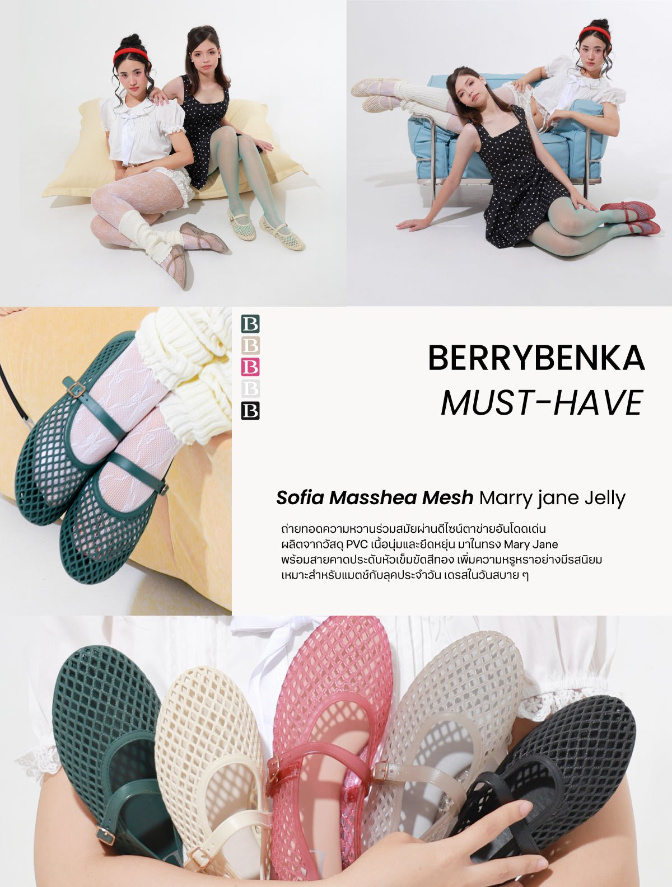 — 출처 <https://berrybenka.com/cdn/shop/files/Banner-3-1.jpg?v=1791283147&width=3840>
-  — 출처 <https://berrybenka.com/cdn/shop/files/Banner-3-2.jpg?v=1791283866&width=3840>
- 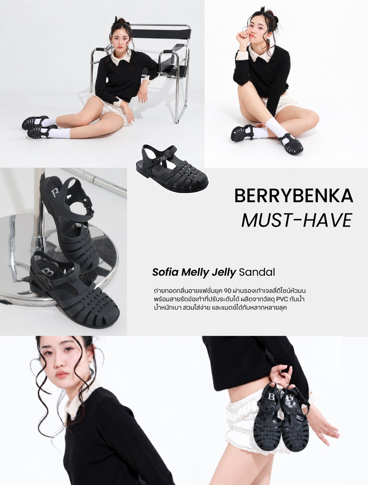 — 출처 <https://berrybenka.com/cdn/shop/files/Banner-3-3.jpg?v=1791283948&width=3840>

**페이지 메타 정보**

| page | title | description |
|---|---|---|
| [`home`](https://berrybenka.com/) | Berrybenka | #berrybenka #trendy fashion # berrybenka_Thailand #Trendy Shoes #Flat shoes |

#### [Hijup](https://www.hijup.com/)

- URL: <https://www.hijup.com/>
- 페이지: **OK 1 · FAIL 0**

**페이지 메타 정보**

| page | title | description |
|---|---|---|
| [`home`](https://www.hijup.com/) | Latest Scarf, Tunic, Long Dress Collection | HIJUP | Trusted Muslim Women's Clothing Online Shopping Site. Buy latest collection of Abaya, Blouse, Dress, Tunic, Printed Scarf. International shi |

#### [Shopee Indonesia](https://shopee.co.id/)

- URL: <https://shopee.co.id/>
- 페이지: **OK 1 · FAIL 0**

**대표 상품 이미지** (상위 6장, 출처 URL 포함)

-  — 출처 <https://deo.shopeemobile.com/shopee/shopee-pcmall-live-sg/assets/1c8bdaaf45e1fd48.png>

**페이지 메타 정보**

| page | title | description |
|---|---|---|
| [`home`](https://shopee.co.id/verify/captcha?anti_bot_tracking_id=gqRjZGVrxHSFomtptTE0MjUxOnRyYWNraW5nX2lkX2tleaJrdtEAAqRhbGdv0gAAAGSjZGVrwKJjdMRAAAAADLyQlHjbhu_tIJoVd59UO0aGI3u8EPZbMRUCgbeCPd4w23IClM5T1bD7-qxvztQnbHA8L7r5z24rbHP-k6pjaXBoZXJ0ZXh0xQLPAAAADIW-fkDVYULxlSwWezhlGa-HCbvtA9sdTbcueTLlwSqp4rVeYcwoxKI35AtqPi83S_cmtp-PjU8_NWDFIGob-vh7rlqpydneAapxx2ZseQsvKvgiNeYKN0Jat0lvEOI96iitMyZcKVNfEN6SfVAEgpW4SAkxbFijzSXQoFKgf0P-wNL20pDexd2PGIYMJA8o2kBWc1LmUSWdZwddAqg8o0g3pTje7cmCE7FdCEhBhX_K4gb2fcSoCPiLdphy-nssVrg8iDKiu9Ilq5Pf0AKifuQaduh_-HWPx2CsthuXPV6djrYoSfWirEwYpkAyupwBPGGe1W7eBsRTHppwj7ozxpX_xR6nEVcors3Y_5qslMailakrkoebArJh05hn8WZh7iIPcZBGJkOYTRZ0go-G1honiDzz5mWt_wNZg9eT3LzW2VlFmTtCpCTb4g-hygp0jnIKgj2yU61L1U-1MCNTWsHxPS3MxX70mcakg82P4MPApNduCJU1JkaK4SQHIwboU_glrN4i5wDH7lmqrHkXDN81YyTnoDz7s7940Znvid74YOqJ3k1P1McfjsMaTj6t4LKU2TE0l3nD5LWPH-l7e5RPynlUYyINDAybDgxUGCbRPWv_NSTJIyQPkcg5mK3hc7FnVsVDn6QJROhgdHVXeMimvW--3plu5-phnBYX3lcFnBU6FL13hLlUB9DMstMrrYsu_O0kAVB3HBCTVhMcoBSmeK2MmqD9EkEzSLPK0aG1G-Lc5HZdyL5pwVL0XB7LCymt-pSgZYGEGlnzBLCDZLcWeT-xqZIeG3d5HHuGRkic3sXtFy5Z5X8wTY1XHgUaW4gtCFRYB8z6P3_3PAt2w_s86waJbMetl43EYkf6_drNpl5PK8ckt1zJw5nAQ5BfMlZ6rjyHn-hz7CXSHQ8Q99aZwF5VfZJm8_5lKWkskGH8nY_QBs-AlORPFeU&app_key=FlashSale.PC&client_id=1&next=https%3A%2F%2Fshopee.co.id%2Fverify%2Ftraffic%3F%3Fclient_id%3D%26next%3Dhttps%253A%252F%252Fshopee.co.id%252F%26redirect_type%3D2%26should_replace_history%3Dfalse&redirect_type=2&scene=crawler_item&should_replace_history=false) | Shopee Indonesia | Belanja Online Terlengkap & Terpercaya | Belanja Online di Shopee Indonesia!  Nikmati Keuntungan Jual Beli Online Mudah dengan Shopee COD (Bayar di Tempat), Gratis Ongkir, & Pengiri |

#### [Tokopedia](https://www.tokopedia.com/)

- URL: <https://www.tokopedia.com/>
- 페이지: **OK 0 · FAIL 1**

**실패 페이지**

- `home` — playwright_error: Error: Page.goto: net::ERR_HTTP2_PROTOCOL_ERROR at https://www.tokopedia.com/
Call log:
  - navigating to "https://www.tokopedia.com/", waiting until "domcontentloaded"

#### [Zalora Indonesia](https://www.zalora.co.id/)

- URL: <https://www.zalora.co.id/>
- 페이지: **OK 1 · FAIL 0**

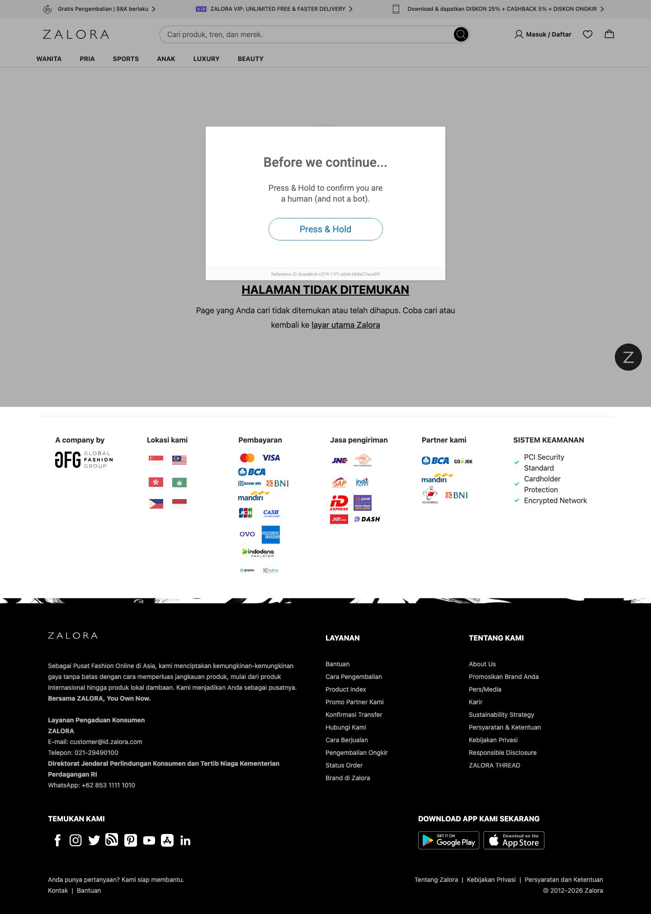

**대표 상품 이미지** (상위 6장, 출처 URL 포함)

-  — 출처 <https://static-id.zacdn.com/next-assets/static-assets/images/logo/icon_mastercard.png>
-  — 출처 <https://static-id.zacdn.com/next-assets/static-assets/images/logo/icon_visa.png>
-  — 출처 <https://static-id.zacdn.com/next-assets/static-assets/images/logo/icon_ovo.png>

**페이지 메타 정보**

| page | title | description |
|---|---|---|
| [`new_women`](https://www.zalora.co.id/wanita/new-arrivals) | Halaman tidak ditemukan | ZALORA |  |

### 4.2 일본 _( Japan )_

- 한국 수출규모 순위: **#2** · region: `asia` · tier `1` · currency `JPY`
- 수집 사이트: **5개** (성공 4)
- 메모: K-패션 선호도 높고 온라인 패션몰 발달
#### [GU Japan](https://www.gu-global.com/jp/)

- URL: <https://www.gu-global.com/jp/>
- 페이지: **OK 1 · FAIL 0**

**대표 상품 이미지** (상위 6장, 출처 URL 포함)

-  — 출처 <https://image.uniqlo.com/GU/ST3/jp/imagesother/Navigation/Category-icon_V2/2026/0724/Categoy_SALE.jpg>
-  — 출처 <https://image.uniqlo.com/GU/ST3/jp/imagesother/Navigation/collaboration_Category/26FW/rokh_category_icon.png>
-  — 출처 <https://image.uniqlo.com/GU/ST3/jp/imagesother/Navigation/WOMEN_Category/2026/260901/Category_w_Outer_361430.png>
-  — 출처 <https://image.uniqlo.com/GU/ST3/jp/imagesother/Navigation/WOMEN_Category/2026/261008/category_w_knit-and-cardigan_360549.png>
-  — 출처 <https://image.uniqlo.com/GU/ST3/jp/imagesother/Navigation/WOMEN_Category/2026/261008/category_w_tops_361505.png>
-  — 출처 <https://image.uniqlo.com/GU/ST3/jp/imagesother/Navigation/WOMEN_Category/2026/260911/Category_w_sweat_361784.png>

**페이지 메타 정보**

| page | title | description |
|---|---|---|
| [`new_arrivals`](https://www.gu-global.com/jp/ja/not-found) | 申し訳ありません、お客様がアクセスしようとしたページが見つかりませんでした。恐れ入りますが、正しくアドレスが入力されているか、もう一度ご確認ください。 | ジーユー | 申し訳ありません、お客様がアクセスしようとしたページが見つかりませんでした。恐れ入りますが、正しくアドレスが入力されているか、もう一度ご確認ください。 |

#### [Rakuten Fashion](https://brandavenue.rakuten.co.jp/)

- URL: <https://brandavenue.rakuten.co.jp/>
- 페이지: **OK 1 · FAIL 1**

**대표 상품 이미지** (상위 6장, 출처 URL 포함)

-  — 출처 <https://brandavenue.r10s.jp/img/library/index/sbn_flagshipstore_20231003.png>
-  — 출처 <https://brandavenue.r10s.jp/img/news/01/401760/pc_n.jpg>
- 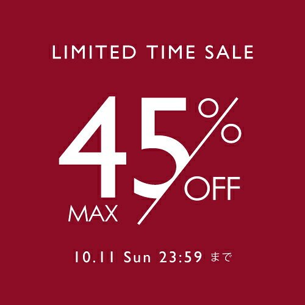 — 출처 <https://brandavenue.r10s.jp/img/news/01/401766/pc_n.jpg>
-  — 출처 <https://brandavenue.r10s.jp/img/news/01/401767/pc_n.jpg>
-  — 출처 <https://brandavenue.r10s.jp/img/news/01/401771/pc_n.jpg>
- 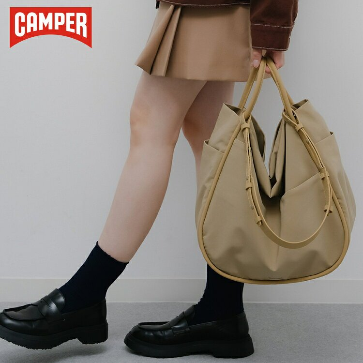 — 출처 <https://brandavenue.r10s.jp/img/news/01/399937/pc_n.jpg>

**페이지 메타 정보**

| page | title | description |
|---|---|---|
| [`men`](https://brandavenue.rakuten.co.jp/men/) | MEN | ファッション通販 Rakuten Fashion(楽天ファッション／旧楽天ブランドアベニュー) | Rakuten Fashion(楽天ファッション)は人気ブランドを取り扱うファッション通販サイトです。新作アイテム続々入荷！セール商品やクーポン対象商品も豊富。／税込3,980円以上購入で送料無料／楽天ポイントが使えて貯まる！ |

**실패 페이지**

- `women` — http_status_404

#### [Uniqlo Japan](https://www.uniqlo.com/jp/)

- URL: <https://www.uniqlo.com/jp/>
- 페이지: **OK 1 · FAIL 0**

**페이지 메타 정보**

| page | title | description |
|---|---|---|
| [`new_arrivals`](https://www.uniqlo.com/jp/ja/contents/feature/new-arrivals/) | 404 Not Found |  |

#### [WEAR](https://wear.jp/)

- URL: <https://wear.jp/>
- 페이지: **OK 1 · FAIL 0**

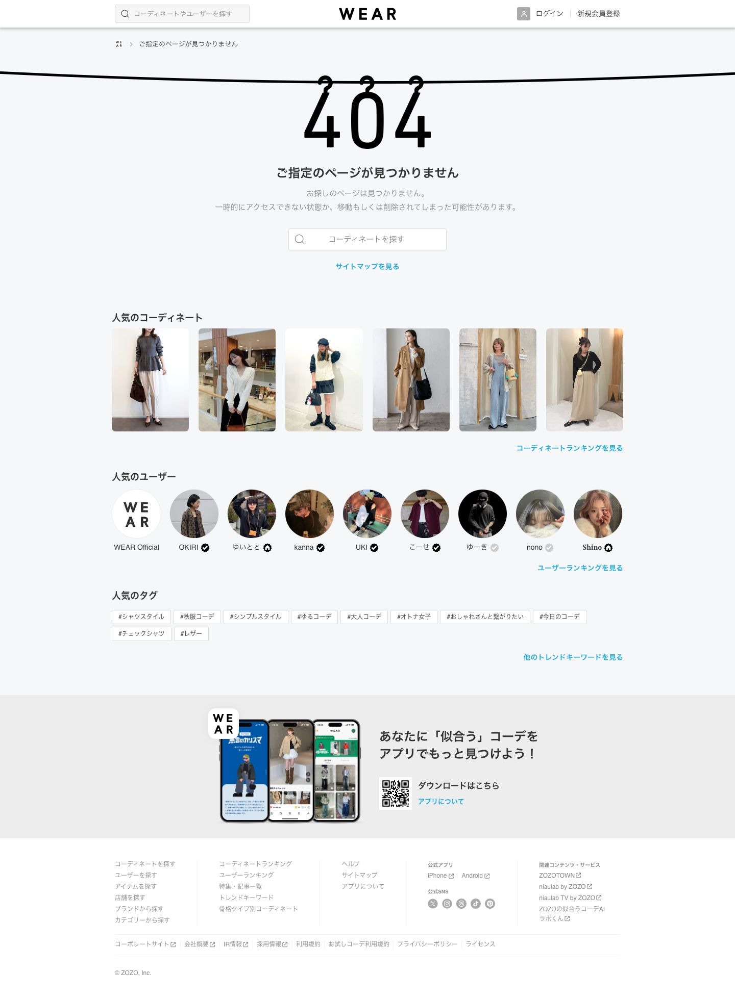

**대표 상품 이미지** (상위 6장, 출처 URL 포함)

-  — 출처 <https://wear.jp/public/_next/static/media/notfound_bg.1ywd-k_shp-hy.png>
-  — 출처 <https://wear.jp/public/_next/static/media/notfound_4.1ho27atf54bbv.png>
-  — 출처 <https://wear.jp/public/_next/static/media/notfound_0.438l9b9xjj6tm.png>
- 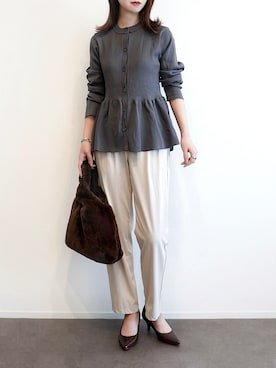 — 출처 <https://images.wear2.jp/coordinate/kAiO3P8/3OR1rIQ6/1791380438_276.jpg>
-  — 출처 <https://images.wear2.jp/coordinate/7binyqO8/NkhuK28i/1791256866_276.jpg>
- 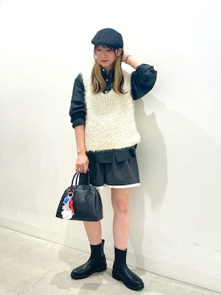 — 출처 <https://images.wear2.jp/coordinate/ywimOMnJ/6Nqsvwq6/1791254143_276.jpg>

**페이지 메타 정보**

| page | title | description |
|---|---|---|
| [`ranking`](https://wear.jp/ranking/coordinate/) | ご指定のページが見つかりません - WEAR | お探しのページは見つかりません。一時的にアクセスできない状態か、移動もしくは削除されてしまった可能性があります。 |

#### [ZOZOTOWN](https://zozo.jp/)

- URL: <https://zozo.jp/>
- 페이지: **OK 0 · FAIL 2**

**실패 페이지**

- `new` — playwright_error: TimeoutError: Page.goto: Timeout 30000ms exceeded.
Call log:
  - navigating to "https://zozo.jp/category/new/", waiting until "domcontentloaded"

- `ranking` — playwright_error: TimeoutError: Page.goto: Timeout 30000ms exceeded.
Call log:
  - navigating to "https://zozo.jp/ranking/", waiting until "domcontentloaded"

### 4.3 한국 _( South Korea )_

- 한국 수출규모 순위: **#30** · region: `asia` · tier `1` · currency `KRW`
- 수집 사이트: **4개** (성공 3)
- 메모: 비교 기준 (자국). 국내 사업동향 센싱
#### [29CM](https://www.29cm.co.kr/)

- URL: <https://www.29cm.co.kr/>
- 페이지: **OK 1 · FAIL 0**

**최근 유행 상품** (50건 · 상품명 클릭 시 해당 사이트로 이동)

| # | 상품명 | 브랜드 | 가격 | 페이지 |
|---:|---|---|---:|---|
| 1 | [KIDS KNIT VEST ivory](https://product.29cm.co.kr/catalog/3007003) | 마리떼 키즈 | 37,830 KRW | `home` |
| 2 | [KIDS W RUFFLE KNIT VEST cream](https://product.29cm.co.kr/catalog/3404172) | 마리떼 키즈 | 37,830 KRW | `home` |
| 3 | [KIDS W RUFFLE KNIT VEST gray pink](https://product.29cm.co.kr/catalog/3404171) | 마리떼 키즈 | 37,830 KRW | `home` |
| 4 | [[장미맨숀] 해나 오크원목 데이베드소파 2colors](https://product.29cm.co.kr/catalog/465115) | 장미맨숀 | 320,090 KRW | `home` |
| 5 | [[장미맨숀] 로사 원목 다이닝 식탁/책상/카페 테이블 1800](https://product.29cm.co.kr/catalog/469911) | 장미맨숀 | 243,960 KRW | `home` |
| 6 | [[10월 중순 입고] 세토 3단 와이드 수납장](https://product.29cm.co.kr/catalog/1278451) | 오투가구 | 500,250 KRW | `home` |
| 7 | [[장미맨숀] 이카 원목 스툴 01](https://product.29cm.co.kr/catalog/3672214) | 장미맨숀 | 57,180 KRW | `home` |
| 8 | [[장미맨숀] 이카 원목 침대 01 Q(퀸)](https://product.29cm.co.kr/catalog/2843430) | 장미맨숀 | 443,530 KRW | `home` |
| 9 | [[장미맨숀] 리브 원목 화장대 01 세트 (브라운)](https://product.29cm.co.kr/catalog/981383) | 장미맨숀 | 344,670 KRW | `home` |
| 10 | [몰토 소파 테이블_미드나잇 블랙](https://product.29cm.co.kr/catalog/3352815) | 피아바 | 940,000 KRW | `home` |
| 11 | [스카포 소파 테이블](https://product.29cm.co.kr/catalog/4023392) | 피아바 | 1,190,000 KRW | `home` |
| 12 | [미노 소파 테이블](https://product.29cm.co.kr/catalog/4023301) | 피아바 | 990,000 KRW | `home` |
| 13 | [Arka bed Q (4주 소요)](https://product.29cm.co.kr/catalog/3432121) | 탈로리피 | 2,718,580 KRW | `home` |
| 14 | [솔라비치 태슬 러그](https://product.29cm.co.kr/catalog/1637600) | 탈로리피 | 159,000 KRW | `home` |
| 15 | [나바 소파 테이블 (3 colors)](https://product.29cm.co.kr/catalog/3427477) | 탈로리피 | 667,500 KRW | `home` |
| 16 | [FLOS 플로스 파렌티지(parentesi) 디머 조명 dimmer lamp 4color(유상설치/전구별도구매)](https://product.29cm.co.kr/catalog/2915233) | 플로스 | 689,400 KRW | `home` |
| 17 | [플로스 루미네이터 Luminator Floor lamp 전구 (무상설치)](https://product.29cm.co.kr/catalog/2886339) | 플로스 | 1,530,000 KRW | `home` |
| 18 | [FLOS 플로스 프리스비 frisbi suspension 펜던트 조명(유상설치)](https://product.29cm.co.kr/catalog/2886285) | 플로스 | 904,500 KRW | `home` |
| 19 | [[60S X MW] 릴렉스 볼스터 쿠션 (3 Colors)](https://product.29cm.co.kr/catalog/4269222) | 식스티세컨즈 | 73,440 KRW | `home` |
| 20 | [로우레스트 쉘브 2P 세트 (5 Types) 나왕 모듈형 수납장](https://product.29cm.co.kr/catalog/3123269) | 식스티세컨즈 | 323,000 KRW | `home` |

**대표 상품 이미지** (상위 6장, 출처 URL 포함)

-  — 출처 <https://img.29cm.co.kr/cms/202610/11f1c1f2c32a47078aae83c2faec2c60.png?width=3840&format=webp>
-  — 출처 <https://img.29cm.co.kr/cms/202610/11f1c1f2bde713a790ed9f9086a2b7ac.png?width=3840&format=webp>
- 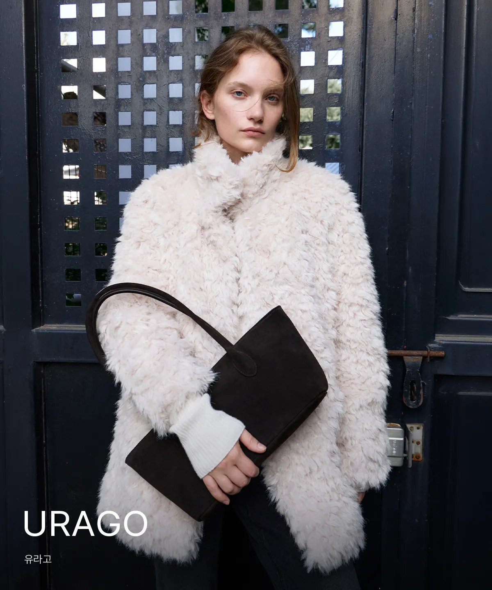 — 출처 <https://img.29cm.co.kr/cms/202610/11f1c1f2b204a0d38aae839512bb3215.png?width=3840&format=webp>
- 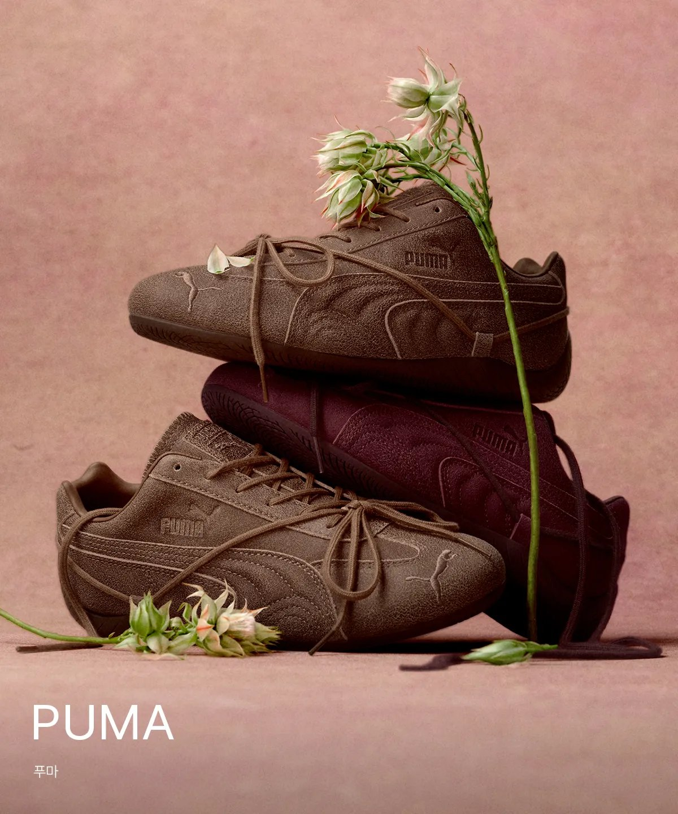 — 출처 <https://img.29cm.co.kr/cms/202610/11f1c1f2a71e404190ed83b363062416.png?width=3840&format=webp>
- 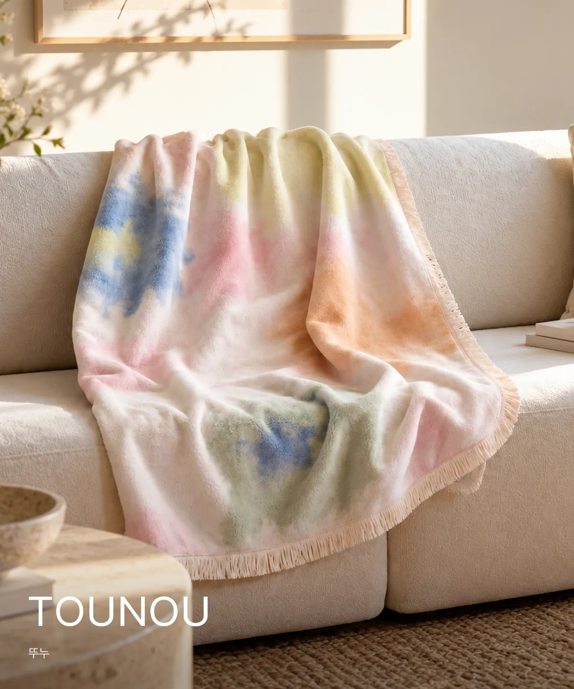 — 출처 <https://img.29cm.co.kr/cms/202610/11f1c1f29e17eb618aae6571112ca624.png?width=3840&format=webp>
- 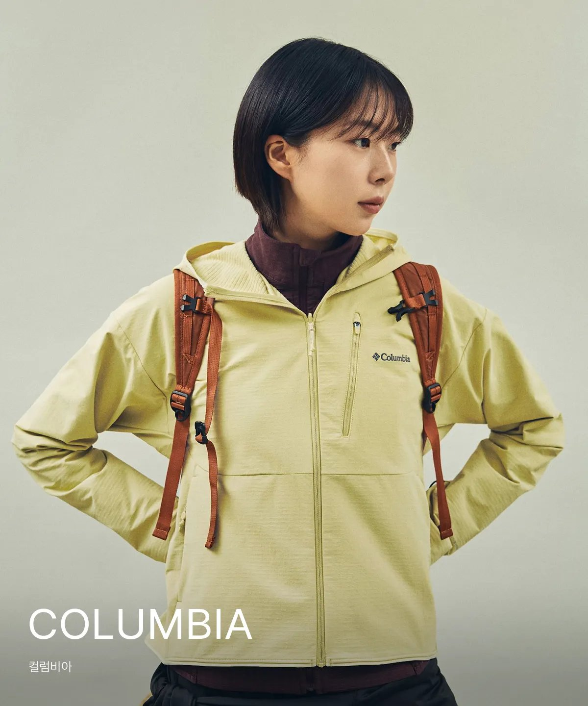 — 출처 <https://img.29cm.co.kr/cms/202610/11f1c1f28b2a2f548aaef7b7a81bee7a.png?width=3840&format=webp>

**페이지 메타 정보**

| page | title | description |
|---|---|---|
| [`home`](https://www.29cm.co.kr/) | 감도 깊은 취향 셀렉트샵 29CM | 패션, 라이프스타일, 컬처까지 29CM만의 감도 깊은 셀렉션을 만나보세요. |

#### [Musinsa](https://www.musinsa.com/)

- URL: <https://www.musinsa.com/>
- 페이지: **OK 0 · FAIL 1**

**실패 페이지**

- `home` — robots_disallowed

#### [W Concept](https://www.wconcept.co.kr/)

- URL: <https://www.wconcept.co.kr/>
- 페이지: **OK 1 · FAIL 0**

**최근 유행 상품** (30건 · 상품명 클릭 시 해당 사이트로 이동)

| # | 상품명 | 브랜드 | 가격 | 페이지 |
|---:|---|---|---:|---|
| 1 | [남성 G132 메리먼트 긴소매 파자마 세트](https://m.wconcept.co.kr/Product/307820225) | 오르시떼 | 32,215 KRW | `home` |
| 2 | [남성 I103 퍼플레이지 긴소매 파자마 세트](https://m.wconcept.co.kr/Product/308848981) | 오르시떼 | 39,015 KRW | `home` |
| 3 | [남성 I107 블뢰테 9부 파자마 팬츠](https://m.wconcept.co.kr/Product/308950508) | 오르시떼 | 19,125 KRW | `home` |
| 4 | [성인 C810 미닝체크 로브](https://m.wconcept.co.kr/Product/309017182) | 오르시떼 | 36,465 KRW | `home` |
| 5 | [남성 F306 온더씨 긴소매 파자마 세트](https://m.wconcept.co.kr/Product/308231978) | 오르시떼 | 39,015 KRW | `home` |
| 6 | [여성 G022 스케이트루이 긴소매 파자마 세트](https://m.wconcept.co.kr/Product/307456749) | 오르시떼 | 32,594 KRW | `home` |
| 7 | [여성 I108 빈타리아 긴소매 파자마 세트](https://m.wconcept.co.kr/Product/308922799) | 오르시떼 | 39,474 KRW | `home` |
| 8 | [남성 H821 블러쉬 긴소매 파자마 세트](https://m.wconcept.co.kr/Product/308632997) | 오르시떼 | 39,015 KRW | `home` |
| 9 | [여성 I103 퍼플레이지 긴소매 파자마 세트](https://m.wconcept.co.kr/Product/308849042) | 오르시떼 | 39,474 KRW | `home` |
| 10 | [여성 I135 빅토리아체크 긴소매 파자마 세트](https://m.wconcept.co.kr/Product/308848864) | 오르시떼 | 39,474 KRW | `home` |
| 11 | [여성 F130 프라그란자 긴소매 파자마 세트](https://m.wconcept.co.kr/Product/308849473) | 오르시떼 | 39,474 KRW | `home` |
| 12 | [여성 I010 마일스 긴소매 파자마 세트](https://m.wconcept.co.kr/Product/308950426) | 오르시떼 | 46,440 KRW | `home` |
| 13 | [남성 I135 빅토리아체크 긴소매 파자마 세트](https://m.wconcept.co.kr/Product/308848835) | 오르시떼 | 39,015 KRW | `home` |
| 14 | [남성 D802 네르하 긴소매 파자마 세트](https://m.wconcept.co.kr/Product/307389499) | 오르시떼 | 39,015 KRW | `home` |
| 15 | [남녀공용 G339 지브라인 긴소매 파자마 세트](https://m.wconcept.co.kr/Product/307593133) | 오르시떼 | 39,015 KRW | `home` |
| 16 | [여성 I047 프리다피치 긴소매 파자마 세트](https://m.wconcept.co.kr/Product/308950464) | 오르시떼 | 46,440 KRW | `home` |
| 17 | [남성 F129 원스 9부 파자마 팬츠](https://m.wconcept.co.kr/Product/308950524) | 오르시떼 | 19,125 KRW | `home` |
| 18 | [여성 G132 메리먼트 긴소매 파자마 세트](https://m.wconcept.co.kr/Product/307820235) | 오르시떼 | 32,594 KRW | `home` |
| 19 | [여성 F818 프레스꼬 9부 파자마 팬츠](https://m.wconcept.co.kr/Product/308950513) | 오르시떼 | 19,350 KRW | `home` |
| 20 | [여성 I107 블뢰테 9부 파자마 팬츠](https://m.wconcept.co.kr/Product/308950509) | 오르시떼 | 19,350 KRW | `home` |

**페이지 메타 정보**

| page | title | description |
|---|---|---|
| [`home`](https://www.wconcept.co.kr/) | _(empty)_ |  |

#### [Zigzag](https://zigzag.kr/)

- URL: <https://zigzag.kr/>
- 페이지: **OK 1 · FAIL 0**

**최근 유행 상품** (36건 · 상품명 클릭 시 해당 사이트로 이동)

| # | 상품명 | 브랜드 | 가격 | 페이지 |
|---:|---|---|---:|---|
| 1 | [[made]바스야상점퍼](https://store.zigzag.kr/app/catalog/products/129651097?browsing_type=NATIVE_BROWSER) | 어텀 | 56,590 KRW | `home` |
| 2 | [[라방 앵콜 특가🔴/가을니트🍁/50만장돌파/made] 시오 니트 (라운드넥/브이넥)](https://store.zigzag.kr/app/catalog/products/147921597?browsing_type=NATIVE_BROWSER) | 리얼코코 | 11,840 KRW | `home` |
| 3 | [[쭈언니X시그니처] 앵클부츠 (4cm) HPWXAGF910](https://store.zigzag.kr/app/catalog/products/171827376?browsing_type=NATIVE_BROWSER) | 슈펜 | 49,900 KRW | `home` |
| 4 | [[+기모🔥][골반뽕탈부착][서경PICK][~2XL][8만장🏆][힙딥커버]렌더 코튼 부츠컷 팬츠 (숏/롱ver)(7color)](https://store.zigzag.kr/app/catalog/products/162075326?browsing_type=NATIVE_BROWSER) | 프렌치오브 | 28,460 KRW | `home` |
| 5 | [화이트랩스 치아미백기 LED 셀프 자가 치아미백기계 & 치아미백젤 세트 (1인용)](https://store.zigzag.kr/app/catalog/products/168362278?browsing_type=NATIVE_BROWSER) | 화이트랩스 | 179,000 KRW | `home` |
| 6 | [[🍁가을/3기장선택!] made. 모먼트 투커버 올데이슬랙스 (+숏/베이직/롱ver) - 4 size](https://store.zigzag.kr/app/catalog/products/136095576?browsing_type=NATIVE_BROWSER) | 슬로우앤드 | 31,840 KRW | `home` |
| 7 | [[문의폭주/무료배송] made. 오브 울텐셀 레이어드 티셔츠 - 3 color](https://store.zigzag.kr/app/catalog/products/171349199?browsing_type=NATIVE_BROWSER) | 슬로우앤드 | 26,400 KRW | `home` |
| 8 | [[무료배송] #LENTO. Curve-Fit Shoulder Bag](https://store.zigzag.kr/app/catalog/products/172176796?browsing_type=NATIVE_BROWSER) | 슬로우앤드 | 67,200 KRW | `home` |
| 9 | [[🤎기장선택/편한바지!] made. 마켓 울라이크 핀턱 트레이닝 슬랙스 (숏/베이직/롱)](https://store.zigzag.kr/app/catalog/products/172227674?browsing_type=NATIVE_BROWSER) | 슬로우앤드 | 29,520 KRW | `home` |
| 10 | [[라방 앵콜 특가🔴/가을바지🍁/50만장돌파/made] 허쉬 코튼 와이드팬츠 (숏/기본/롱)](https://store.zigzag.kr/app/catalog/products/143224732?browsing_type=NATIVE_BROWSER) | 리얼코코 | 17,950 KRW | `home` |
| 11 | [[made]헤어리탑가디건](https://store.zigzag.kr/app/catalog/products/165474003?browsing_type=NATIVE_BROWSER) | 어텀 | 28,880 KRW | `home` |
| 12 | [[10%할인/롱치마] 폴런 폴딩 맥시 스커트 (4color)](https://store.zigzag.kr/app/catalog/products/172302112?browsing_type=NATIVE_BROWSER) | 리얼코코 | 20,970 KRW | `home` |
| 13 | [[🎉직잭팟][🏆팬츠1위🏆누적5만장][❣️가을ver/S~L/2기장] 밸런스 데일리 팬츠 / 부츠컷추리닝 / 부츠컷트레이닝팬츠 / 와이드팬츠 / 로우라이즈 / 세미부츠컷](https://store.zigzag.kr/app/catalog/products/168688249?browsing_type=NATIVE_BROWSER) | 코코블랑 | 23,740 KRW | `home` |
| 14 | [[백지헌PICK/V넥단독💖][소프트얀] 여성 라운드넥 카디건_SPCKG49W01,SPCKG49W03](https://store.zigzag.kr/app/catalog/products/171262525?browsing_type=NATIVE_BROWSER) | 스파오 | 32,310 KRW | `home` |
| 15 | [[15만장돌파🏆/+반팔/made] 코튼 스판 베이직 긴팔티셔츠 (라운드넥/유넥)](https://store.zigzag.kr/app/catalog/products/109044865?browsing_type=NATIVE_BROWSER) | 리얼코코 | 18,270 KRW | `home` |
| 16 | [[무료배송] made. 포트 컬러웨이 딥브이넥 니트 - 5 color  (예약주문: 10월 말 이후 순차출고예정)](https://store.zigzag.kr/app/catalog/products/171386405?browsing_type=NATIVE_BROWSER) | 슬로우앤드 | 27,920 KRW | `home` |
| 17 | [[야크/엑스트라파인울 60%] 미토 니트 스커트 (3color) ★10/9 금요일 오후 6시까지 15% 할인적용:)](https://store.zigzag.kr/app/catalog/products/172290569?browsing_type=NATIVE_BROWSER) | 미뉴에트 | 53,180 KRW | `home` |
| 18 | [founders 파운더스 슬론 코튼 셔츠 코튼 긴팔 카라 포켓 남방 (2col)](https://store.zigzag.kr/app/catalog/products/172305393?browsing_type=NATIVE_BROWSER) | 나우어데이즈 | 55,760 KRW | `home` |
| 19 | [[핏보정팬츠] made. 나이브 히든밴딩 세미부츠컷 팬츠 (+숏/베이직/롱ver) - 4 size](https://store.zigzag.kr/app/catalog/products/159899063?browsing_type=NATIVE_BROWSER) | 슬로우앤드 | 26,910 KRW | `home` |
| 20 | [[🍁가을/MNQ] 페트리 안티필링 워셔블 오버핏 딥브이넥 니트](https://store.zigzag.kr/app/catalog/products/171226174?browsing_type=NATIVE_BROWSER) | 매니크 | 31,130 KRW | `home` |

**대표 상품 이미지** (상위 6장, 출처 URL 포함)

-  — 출처 <https://cf.image-farm.s.zigzag.kr/original/cms/2026/10/01/202610010705314839_039131.png?quality=80&format=webp&transparent=true&width=1029&height=1188>
- 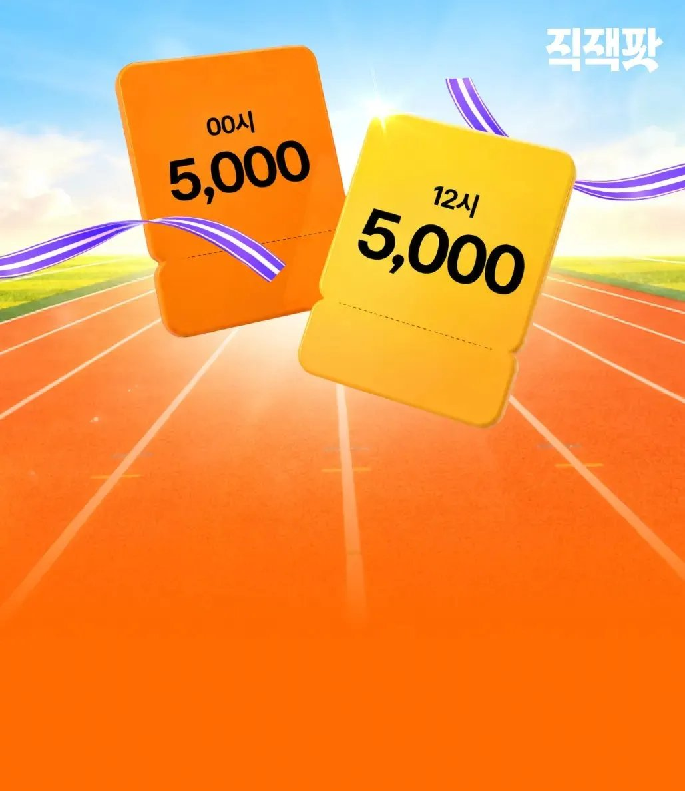 — 출처 <https://cf.image-farm.s.zigzag.kr/original/cms/2026/10/01/202610010226568667_083695.jpg?format=webp&quality=80&width=1029&height=1188>
-  — 출처 <https://cf.image-farm.s.zigzag.kr/original/cms/2026/10/01/202610010228309748_097514.jpg?format=webp&quality=80&width=1029&height=1188>
- 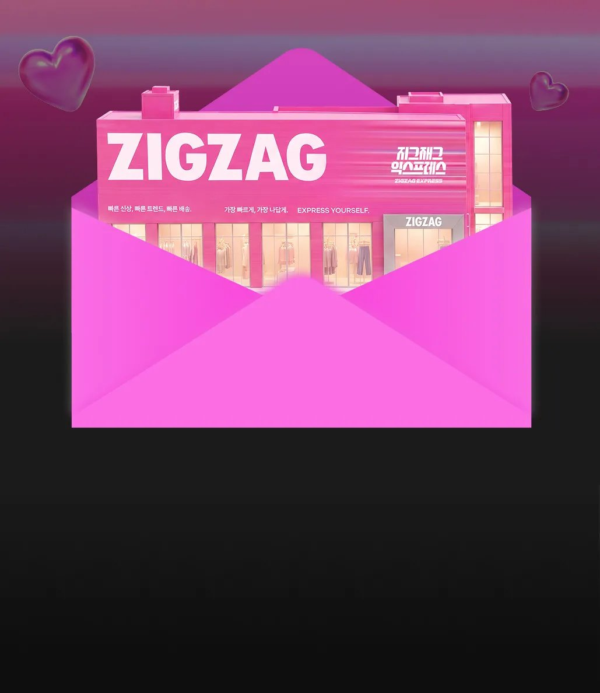 — 출처 <https://cf.image-farm.s.zigzag.kr/original/cms/2026/10/07/202610070058580121_041890.jpg?width=1029&height=1188&quality=80&format=webp&transparent=true>
-  — 출처 <https://cf.image-farm.s.zigzag.kr/original/cms/2026/10/07/202610070734398580_041098.jpg?width=1029&height=1188&quality=80&format=webp&transparent=true>
- 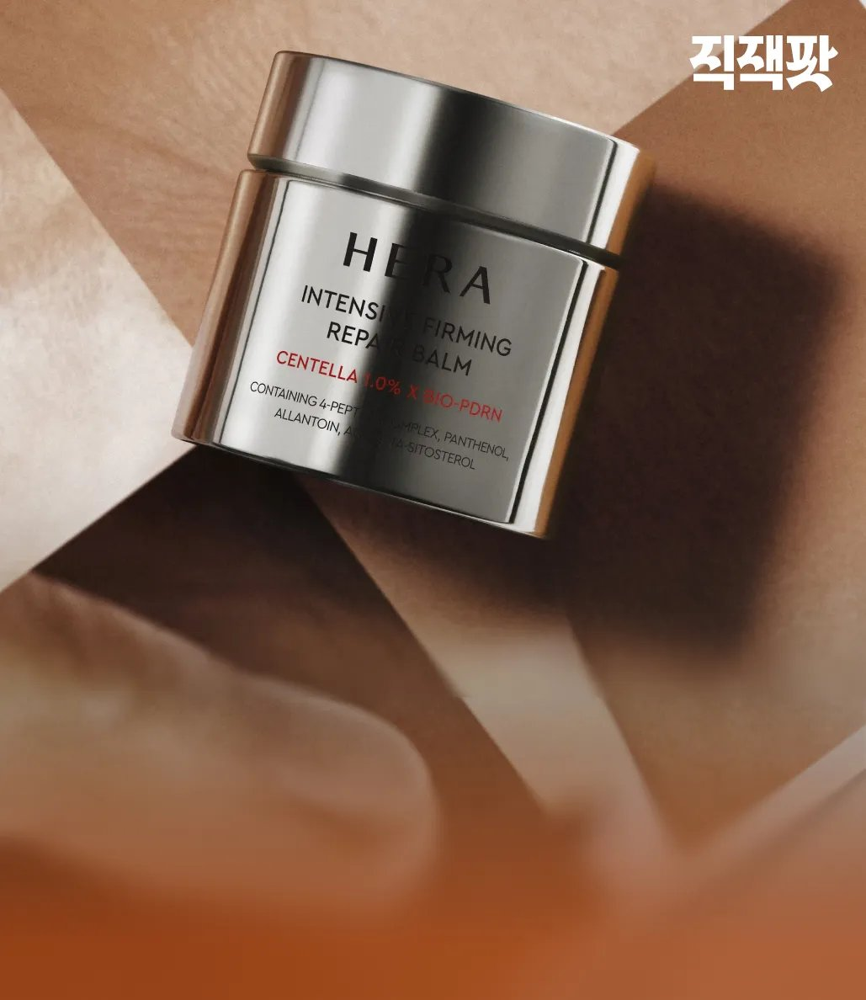 — 출처 <https://cf.image-farm.s.zigzag.kr/original/cms/2026/10/04/202610040839058107_079609.jpg?width=1029&height=1188&quality=80&format=webp&transparent=true>

**페이지 메타 정보**

| page | title | description |
|---|---|---|
| [`home`](https://zigzag.kr/) | 지그재그 스토어 | 4,000만 여성이 선택한 올인원 쇼핑 앱 지그재그 - 제가 알아서 살게요. |

### 4.4 대만 _( Taiwan )_

- 한국 수출규모 순위: **#7** · region: `asia` · tier `1` · currency `TWD`
- 수집 사이트: **5개** (성공 4)
- 메모: K-패션 친화도 높음
#### [momo](https://www.momoshop.com.tw/)

- URL: <https://www.momoshop.com.tw/>
- 페이지: **OK 1 · FAIL 0**

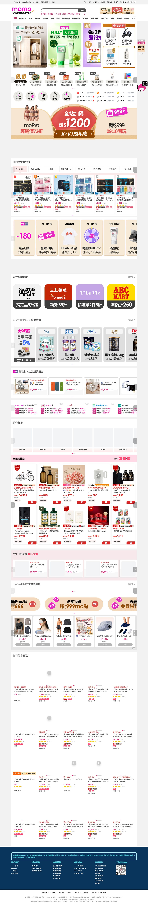

**대표 상품 이미지** (상위 6장, 출처 URL 포함)

-  — 출처 <https://img3.momoshop.com.tw/ecm/img/online/10/998/00/000/bt_0_271_01/bt_0_271_01_e2.jpg?t=1785743060613>
- 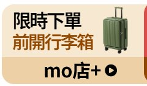 — 출처 <https://img1.momoshop.com.tw/ecm/img/online/10/998/00/000/bt_0_245_01/bt_0_245_01_P1_1_e2.png?t=1791475206094>
-  — 출처 <https://img2.momoshop.com.tw/ecm/img/online/10/998/00/000/bt_0_245_01/bt_0_245_01_P1_3_e2.png?t=1791129612995>
-  — 출처 <https://img1.momoshop.com.tw/ecm/img/online/81/998/00/000/mobile/bt_7_701_01/bt_7_701_01_e181.jpg?t=1791370386084>

**페이지 메타 정보**

| page | title | description |
|---|---|---|
| [`home`](https://www.momoshop.com.tw/main/Main.jsp) | momo購物網 - 好評推薦 - 2026年10月 | momo購物網提供美妝保養、流行服飾、時尚精品、3C、數位家電、生活用品、美食旅遊票券…等數百萬件商品。快速到貨、超商取貨讓您購物最便利。mo店+商品抵用券天天搶、免運吃到飽，電視/直播商品限時下殺，每日讓您享超低價，並享有十天猶豫期；momo購物網為富邦及台灣大哥大關係企業 |

#### [OB Design](https://www.obdesign.com.tw/)

- URL: <https://www.obdesign.com.tw/>
- 페이지: **OK 1 · FAIL 0**

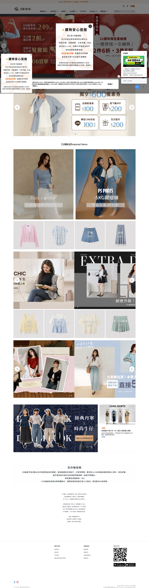

**대표 상품 이미지** (상위 6장, 출처 URL 포함)

-  — 출처 <https://cms-static.cdn.91app.com/images/original/41602/92f19e4d-89b7-4330-9570-02cf1dff9742-1791168325-a0d3jhklbp_d_1920x820_1280x547_1124x480_800x342_600x256_400x171.jpg>
- 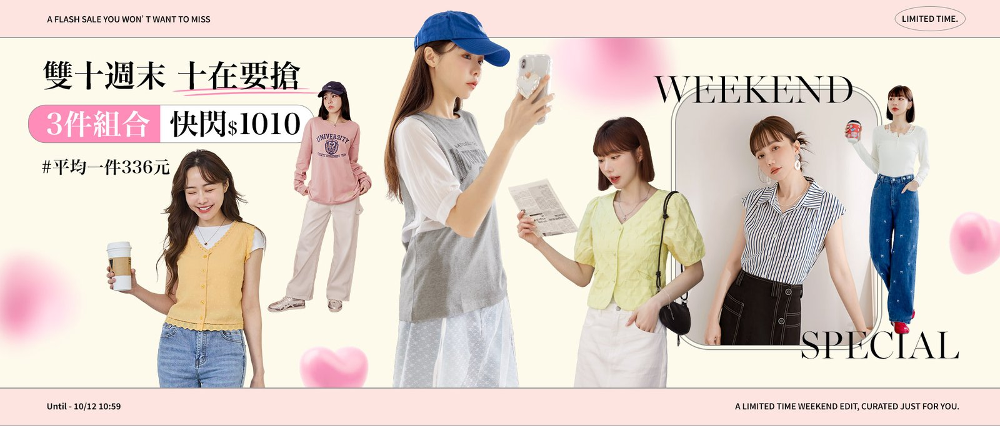 — 출처 <https://cms-static.cdn.91app.com/images/original/41602/92f19e4d-89b7-4330-9570-02cf1dff9742-1791423153-am2333qfvj_d_1920x820_1280x547_1124x480_800x342_600x256_400x171.jpg>
- 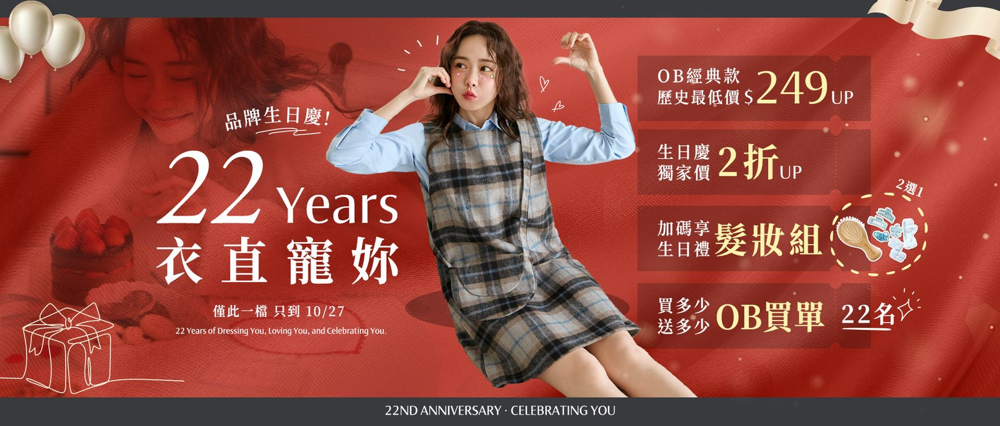 — 출처 <https://cms-static.cdn.91app.com/images/original/41602/92f19e4d-89b7-4330-9570-02cf1dff9742-1791254186-6drun5zyc4_d_1920x820_1280x547_1124x480_800x342_600x256_400x171.jpg>
-  — 출처 <https://cms-static.cdn.91app.com/images/original/41602/92f19e4d-89b7-4330-9570-02cf1dff9742-1791254336-r939wwxl10_d_1920x820_1280x547_1124x480_800x342_600x256_400x171.jpg>
-  — 출처 <https://cms-static.cdn.91app.com/images/original/41602/92f19e4d-89b7-4330-9570-02cf1dff9742-1791254373-wtfzxkcvms_d_1920x820_1280x547_1124x480_800x342_600x256_400x171.jpg>
-  — 출처 <https://cms-static.cdn.91app.com/images/original/41602/92f19e4d-89b7-4330-9570-02cf1dff9742-1791168529-3sy0baovmv_d_1920x820_1280x547_1124x480_800x342_600x256_400x171.jpg>

**페이지 메타 정보**

| page | title | description |
|---|---|---|
| [`home`](https://www.obdesign.com.tw/) | OB嚴選｜高CP值人氣熱銷服飾，流行服飾品牌 | 你的日常穿搭好夥伴，快上OB嚴選找，OB嚴選提供女裝、孕童、運動、男裝各項流行服飾，秉持優質服務給你高CP值的購物體驗。各種風格都能滿足熱愛穿搭的你，天天上新品，快速出貨，一起加入OB style！網路人氣服飾品牌OB嚴選 |

#### [PChome](https://24h.pchome.com.tw/)

- URL: <https://24h.pchome.com.tw/>
- 페이지: **OK 0 · FAIL 1**

**실패 페이지**

- `home` — http_status_429

#### [Pinkoi Taiwan](https://www.pinkoi.com/)

- URL: <https://www.pinkoi.com/>
- 페이지: **OK 2 · FAIL 0**

**대표 상품 이미지** (상위 6장, 출처 URL 포함)

-  — 출처 <https://cdn04.pinkoi.com/pinkoi.site/logo/og_image.png>

**페이지 메타 정보**

| page | title | description |
|---|---|---|
| [`accessories`](https://en.pinkoi.com/) | Pinkoi | Asia’s cross-border design marketplace | Design the way you are | Shop for original design products from Asia's independent designers. Pinkoi lives and breathes great design, great quality, great service, a |
| [`bags`](https://en.pinkoi.com/) | Pinkoi | Asia’s cross-border design marketplace | Design the way you are | Shop for original design products from Asia's independent designers. Pinkoi lives and breathes great design, great quality, great service, a |

#### [Yahoo Taiwan Shopping](https://tw.buy.yahoo.com/)

- URL: <https://tw.buy.yahoo.com/>
- 페이지: **OK 1 · FAIL 0**

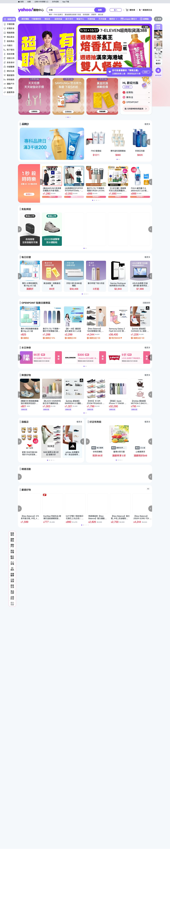

**대표 상품 이미지** (상위 6장, 출처 URL 포함)

- 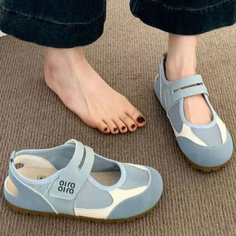 — 출처 <https://img.yec.tw/zp/MerchandiseImages/F9B6FCCE60-SP-23130111.jpg>
- 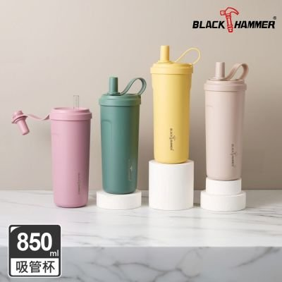 — 출처 <https://img.yec.tw/zp/MerchandiseImages/bbe1bc9d82-Gd-12284720.jpg>
- 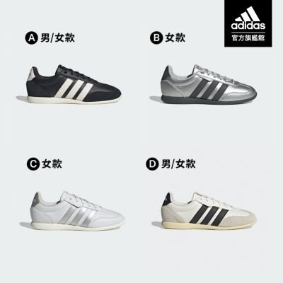 — 출처 <https://img.yec.tw/zp/MerchandiseImages/70a654f572-Gd-12041877.jpg>

**페이지 메타 정보**

| page | title | description |
|---|---|---|
| [`home`](https://tw.buy.yahoo.com/) | Yahoo購物中心 - 最懂生活的人 | 數百萬件商品，貼心客服為您服務，15天鑑賞期購物保障！ |

### 4.5 태국 _( Thailand )_

- 한국 수출규모 순위: **#8** · region: `asia` · tier `1` · currency `THB`
- 수집 사이트: **5개** (성공 4)
- 메모: 동남아 K-패션 핵심 시장
#### [Central Online](https://www.central.co.th/)

- URL: <https://www.central.co.th/>
- 페이지: **OK 1 · FAIL 0**

**대표 상품 이미지** (상위 6장, 출처 URL 포함)

- 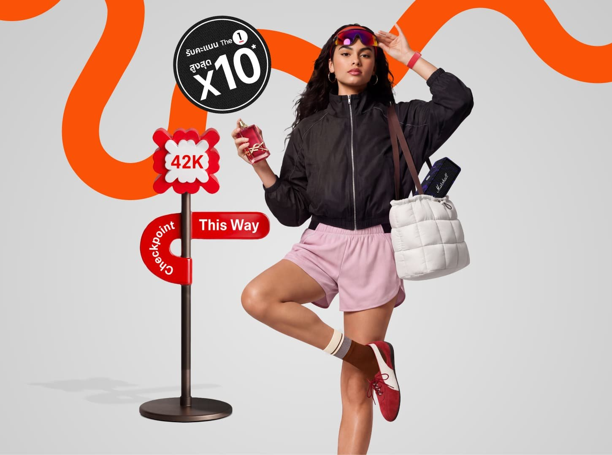 — 출처 <https://www.central.co.th/_next/image?url=https%3A%2F%2Fassets.central.co.th%2Ffile-assets%2Fassets%2FCMS%2Fcampaign%2F2026%2F10oct%2F20261005_mc_1010_Homepage_herobanner.jpg&w=3840&q=75>
-  — 출처 <https://www.central.co.th/_next/image?url=https%3A%2F%2Fassets.central.co.th%2Ffile-assets%2Fassets%2FCMS%2Fcampaign%2F2026%2F10oct%2F20261001_muji_heroweb_d.jpg&w=3840&q=75>
- 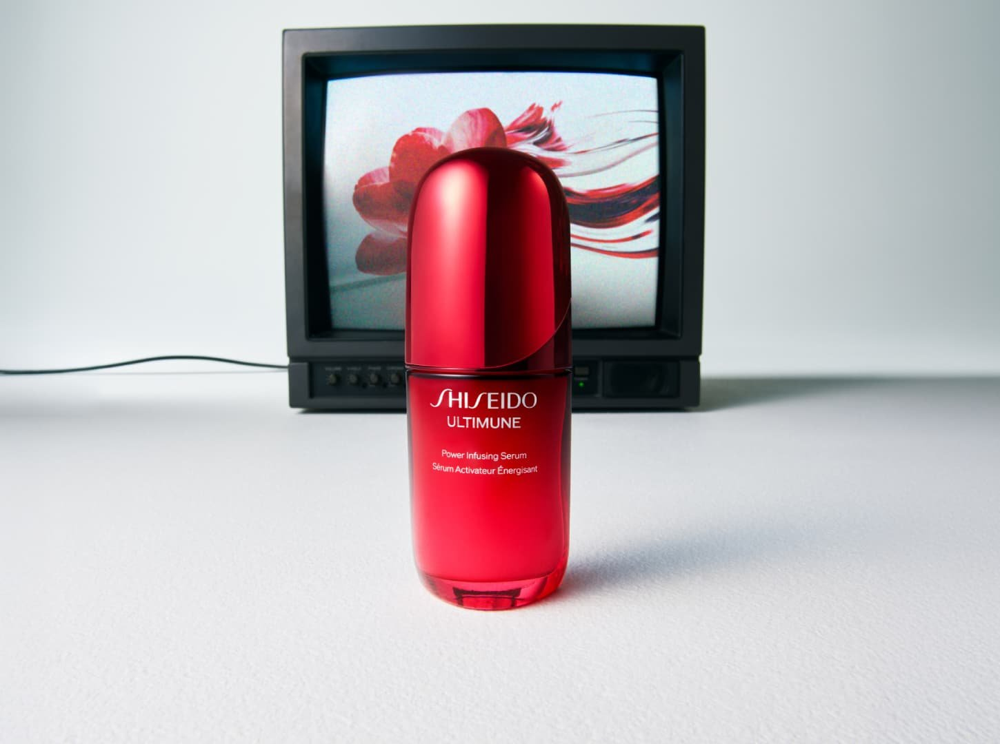 — 출처 <https://www.central.co.th/_next/image?url=https%3A%2F%2Fassets.central.co.th%2Ffile-assets%2Fassets%2FCMS%2Fcampaign%2F2026%2F10oct%2F20261009_shiseido_heroweb_d.jpg&w=3840&q=75>
-  — 출처 <https://www.central.co.th/_next/image?url=%2Fimages%2Ffallback-image.webp&w=3840&q=75>
- 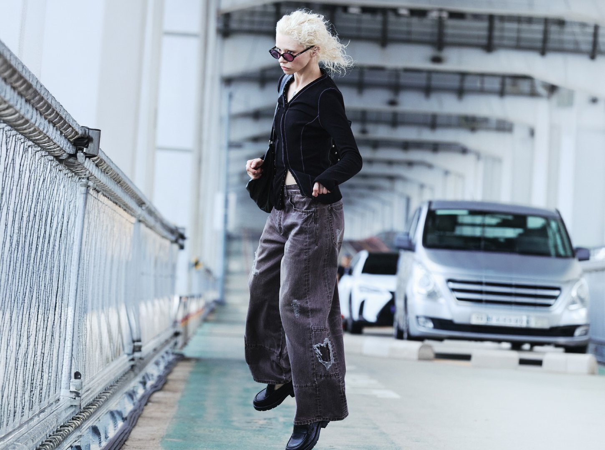 — 출처 <https://assets.central.co.th/file-assets/assets/CMS/campaign/2026/10oct/20261005_matinkim_heroweb_d.jpg>
-  — 출처 <https://www.central.co.th/_next/image?url=https%3A%2F%2Fassets.central.co.th%2Ffile-assets%2Fassets%2FCMS%2Fcampaign%2F2026%2F10oct%2F20261007_lamer_heroweb_d.jpg&w=3840&q=75>

**페이지 메타 정보**

| page | title | description |
|---|---|---|
| [`home`](https://www.central.co.th/th) | Central Online | 10.10 | ลดสูงสุด 70% + คูปองลดเพิ่ม 25% | 10.10 Sale โปรโมชั่นสุดยิ่งใหญ่ของปี 2026 เริ่มต้นขึ้นแล้ว! พบกับสินค้าจากหลากหลายแบรนด์ดังที่เราคัดสรรมาลดราคาสูงสุดถึง 70% พร้อมคูปองลดเพิ |

#### [Lazada Thailand Fashion](https://www.lazada.co.th/)

- URL: <https://www.lazada.co.th/>
- 페이지: **OK 1 · FAIL 0**

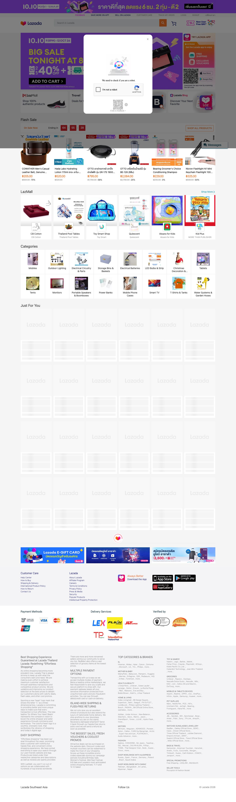

**대표 상품 이미지** (상위 6장, 출처 URL 포함)

-  — 출처 <https://img.lazcdn.com/us/domino/40845120240f19d13f738fa9a7978edd.png>
-  — 출처 <https://img.lazcdn.com/g/tps/images/ims-web/TB1KB2laMFY.1VjSZFnXXcFHXXa.png>
- 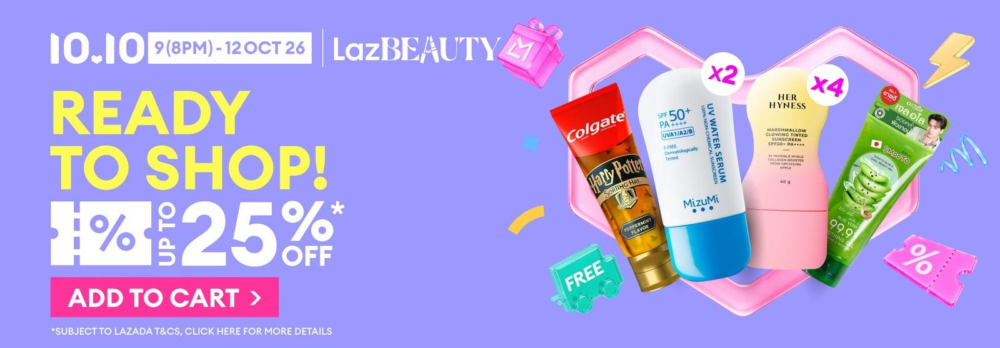 — 출처 <https://img.lazcdn.com/us/domino/2da13e12-361b-42b1-bbc9-a99f760fc58c_TH-1976-688.jpg_2200x2200q80.jpg>
- 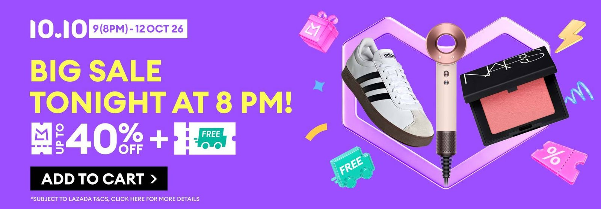 — 출처 <https://img.lazcdn.com/us/domino/c21e0de8-9433-43f0-8388-eb8bc1a885b5_TH-1976-688.jpg_2200x2200q80.jpg>
-  — 출처 <https://img.lazcdn.com/us/domino/8a0cf359-81de-403f-a4ac-e5f842d07119_TH-1976-688.jpg_2200x2200q80.jpg>
-  — 출처 <https://img.lazcdn.com/us/domino/b622fd92-c706-4f4f-8508-00f4cb9ee3db_TH-1976-688.jpg_2200x2200q80.jpg>

**페이지 메타 정보**

| page | title | description |
|---|---|---|
| [`home`](https://www.lazada.co.th/#?) | Lazada Thailand | ช้อปออนไลน์ สินค้าดี พร้อมดีลพิเศษทุกวัน | พบกับ Lazada แพลตฟอร์มช้อปปิ้งชั้นนำในอาเซียน พร้อมบริการเก็บเงินปลายทาง LazMall LazFlash และดีลเด็ดจากแบรนด์ดังทุกวัน |

#### [Pomelo](https://www.pomelofashion.com/)

- URL: <https://www.pomelofashion.com/>
- 페이지: **OK 0 · FAIL 2**

**실패 페이지**

- `new` — robots_disallowed
- `best` — robots_disallowed

#### [Shopee Thailand Fashion](https://shopee.co.th/)

- URL: <https://shopee.co.th/>
- 페이지: **OK 1 · FAIL 0**

**대표 상품 이미지** (상위 6장, 출처 URL 포함)

-  — 출처 <https://deo.shopeemobile.com/shopee/shopee-pcmall-live-sg/assets/1c8bdaaf45e1fd48.png>

**페이지 메타 정보**

| page | title | description |
|---|---|---|
| [`home`](https://shopee.co.th/verify/captcha?anti_bot_tracking_id=gqRjZGVrxHSFomtptTE0MjUxOnRyYWNraW5nX2lkX2tleaJrdtEAAqRhbGdv0gAAAGSjZGVrwKJjdMRAAAAADLyQlHjbhu_tIJoVd59UO0aGI3u8EPZbMRUCgbeCPd4w23IClM5T1bD7-qxvztQnbHA8L7r5z24rbHP-k6pjaXBoZXJ0ZXh0xQLPAAAADO0Pieuc89yTEd_y7icYY0l35Cnhu_drawODudpxvGk1AFLJEyZVaMGJkogRlAR3tCC-PNY6g2gvNeE7xDioBDHCGZiWTWuJsqLaktqTBGO320dCGIdR6x-fKzD-tAsowPeYaEdr3BuIVUaPxobSoFfU3JE47lH_FPzypnpS7QPGqQIXb_cp0ixrb0o28DHNxbi8u9xciuAvDnLf4Tjn2BRuXNZcxpc_jrpH4k7Tpylkb3P8Bnf_MhXV_xVcmdL1ulyGR9zCJJWavCUgaeWBvSbq7Y1kIzsUqPsxh6nSossrLCnEVb9eRXjvVrhSC1Y3sOwtoRrEkta_lDxJS7NGlDUImtg6Akk61T3p-EcV0tU_vIuw7ZM4mPpbzVzLDzqUZEq-GDPf_vAH51I6NNbVEpdQpVGqc3CMhZcuT8VXW1Eg99ofdk656EgVkC-hMH6zR-tS8fxb2ga8PR8cbdpfXIi_jHo9RgpAB5n7XM8c5aRu0KfoGStxCxXcKcCPkmlpma9vlePAdh_qtslJpX7tKZypXwdp0u3CRWjSkNekDsHqdvo1E0Ydj4vUrZiJxq9ahN88k-AoZYWSnOQpYnptDE2hlkfGv01EYnrWbvTVI5-3ouIDVK2-GDib4homOegreDzhL8UgU92PHf6E5zPdrX48R3HnNvS-ATn-Yrvbccsi6OKHYPUGtkTXzbFAP4qKofy_w6ApCImdp9Mxk20_1sR8UzrIYE2k8cUQogoXueHFQ7V98tFG3a6xPGMUdrnTzNjQk346wXGKzTnxxN1VPFcH437kJ8bm8APFq9B6Dqlm3IUrfnGMlXPXFgkWITSQARLyLGfI_143sWY1Kqq26k9fdAKAGTz5xCXhO3IJeRR4tzTcFwH3ohyhpDKyOHyHM6jLbgo5lrxgcJpvismQt-O_uJqrlTWogofp4IS0GLhBhXIvXPoqmCxNFHQ&app_key=FlashSale.PC&client_id=1&next=https%3A%2F%2Fshopee.co.th%2Fverify%2Ftraffic%3F%3Fclient_id%3D%26next%3Dhttps%253A%252F%252Fshopee.co.th%252F%26redirect_type%3D2%26should_replace_history%3Dfalse&redirect_type=2&scene=crawler_item&should_replace_history=false) | Shopee Thailand | ช้อปปิ้งออนไลน์ ผ่านมือถือและเว็บไซต์ | ซื้อทุกอย่างที่ Shopee! ช้อปปิ้งออนไลน์จบในที่เดียว ซื้อหรือขายก็ง่ายสุดๆ มีโปรและส่วนลดเพียบ การันตีโดย Shopee | ส่งฟรีทั่วไทย | เก็บเงินปล |

#### [Zalora Thailand](https://www.zalora.co.th/)

- URL: <https://www.zalora.co.th/>
- 페이지: **OK 1 · FAIL 0**

**대표 상품 이미지** (상위 6장, 출처 URL 포함)

-  — 출처 <https://www.zalora.co.th/images/landingpage/525x500.gif>

**페이지 메타 정보**

| page | title | description |
|---|---|---|
| [`home`](https://www.zalora.co.th/) | ZALORA - ASIA'S LEADING ONLINE FASHION DESTINATION |  |

### 4.6 미국 _( United States )_

- 한국 수출규모 순위: **#1** · region: `north_america` · tier `1` · currency `USD`
- 수집 사이트: **5개** (성공 4)
- 메모: 한국 의류 최대 수출국. 대형 이커머스와 브랜드 커머스 중심
#### [Etsy](https://www.etsy.com/)

- URL: <https://www.etsy.com/>
- 페이지: **OK 2 · FAIL 0**

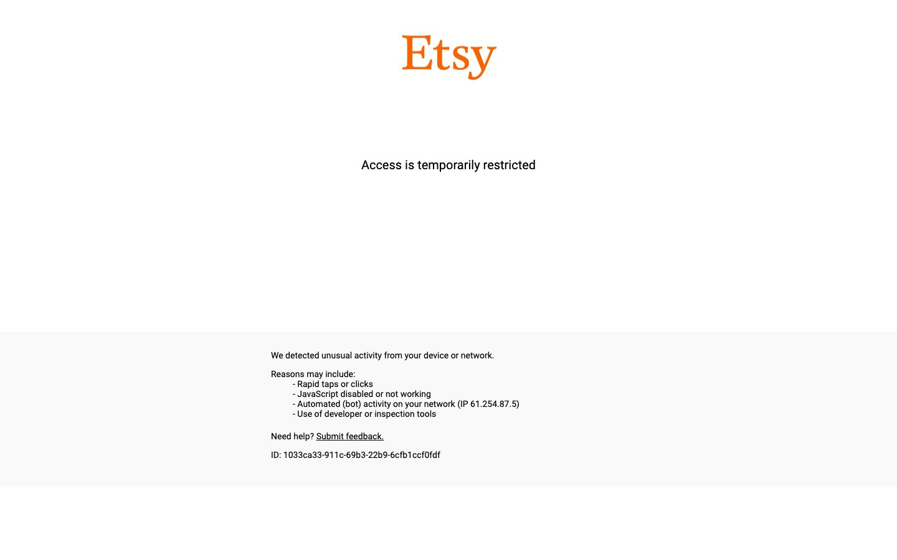

**페이지 메타 정보**

| page | title | description |
|---|---|---|
| [`trending_jewelry`](https://www.etsy.com/c/jewelry) | etsy.com |  |
| [`trending_accessories`](https://www.etsy.com/c/accessories) | etsy.com |  |

#### [Macy's](https://www.macys.com/)

- URL: <https://www.macys.com/>
- 페이지: **OK 1 · FAIL 0**

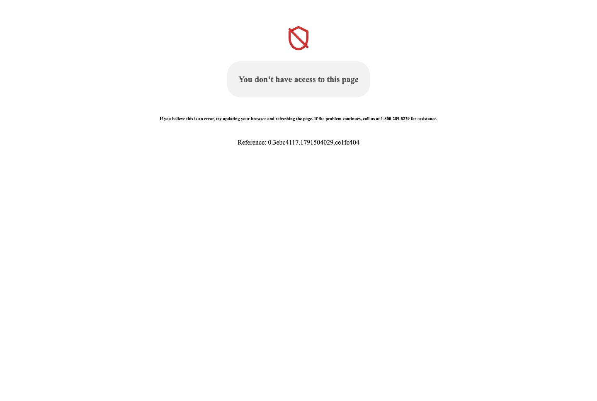

**페이지 메타 정보**

| page | title | description |
|---|---|---|
| [`new`](https://www.macys.com/shop/whats-new?id=14834) | Access Denied - Macy's | Access denied 403 |

#### [Nordstrom](https://www.nordstrom.com/)

- URL: <https://www.nordstrom.com/>
- 페이지: **OK 2 · FAIL 0**

**대표 상품 이미지** (상위 6장, 출처 URL 포함)

-  — 출처 <https://n.nordstrommedia.com/it/7f51c20a-b069-4154-9cfb-1e6d13a7c608.gif>
-  — 출처 <https://n.nordstrommedia.com/is/image/nordstrom/WMNS_ADC03F_0826_0089.jpeg?width=240&dpr=2&crop=4388%3A5485%2Coffset-x50%2Coffset-y71.956>
-  — 출처 <https://n.nordstrommedia.com/is/image/nordstrom/MENS_DRES02F_0826_0082.jpeg?width=240&dpr=2&crop=3600%3A4500%2Coffset-x50%2Coffset-y29.508>
- 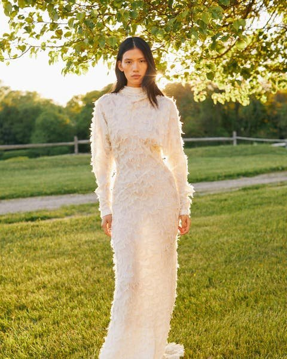 — 출처 <https://n.nordstrommedia.com/is/image/nordstrom/DESW_APP01F_0826_0046.jpeg?width=240&dpr=2&crop=4480%3A5600%2Coffset-x50%2Coffset-y0&trim=0%2C0%2C0.001%2C0>
- 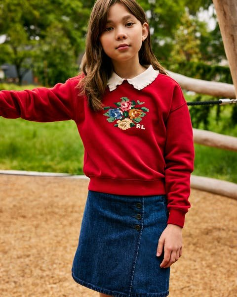 — 출처 <https://n.nordstrommedia.com/is/image/nordstrom/KIDS_BG02F_0726_01586.jpeg?width=240&dpr=2&crop=5334%3A6667.5%2Coffset-x50%2Coffset-y0>
- 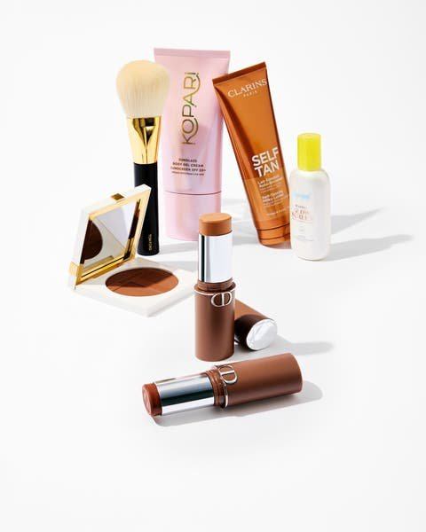 — 출처 <https://n.nordstrommedia.com/is/image/nordstrom/BEA_MKUP06P_0626.jpeg?width=240&dpr=2&crop=5370%3A6712.5%2Coffset-x50%2Coffset-y50>

**페이지 메타 정보**

| page | title | description |
|---|---|---|
| [`new`](https://www.nordstrom.com/browse/new) | New & Now | Nordstrom | Shop a great selection of New Arrivals at Nordstrom.com. Top brands. New trends. |
| [`women`](https://www.nordstrom.com/browse/women) | Women's Clothing, Shoes, & Accessories | Nordstrom | Find a great selection of Women's Clothing, Shoes, & Accessories at Nordstrom.com. Shop popular brands and top designers. |

#### [Revolve](https://www.revolve.com/)

- URL: <https://www.revolve.com/>
- 페이지: **OK 0 · FAIL 2**

**실패 페이지**

- `new` — playwright_error: Error: Page.goto: net::ERR_HTTP2_PROTOCOL_ERROR at https://www.revolve.com/new/br/c79f88/
Call log:
  - navigating to "https://www.revolve.com/new/br/c79f88/", waiting until "domcontentloaded"

- `trending` — playwright_error: Error: Page.goto: net::ERR_HTTP2_PROTOCOL_ERROR at https://www.revolve.com/most-loved/br/4a9ca5/
Call log:
  - navigating to "https://www.revolve.com/most-loved/br/4a9ca5/", waiting until "domcontentloaded"

#### [Urban Outfitters](https://www.urbanoutfitters.com/)

- URL: <https://www.urbanoutfitters.com/>
- 페이지: **OK 1 · FAIL 0**

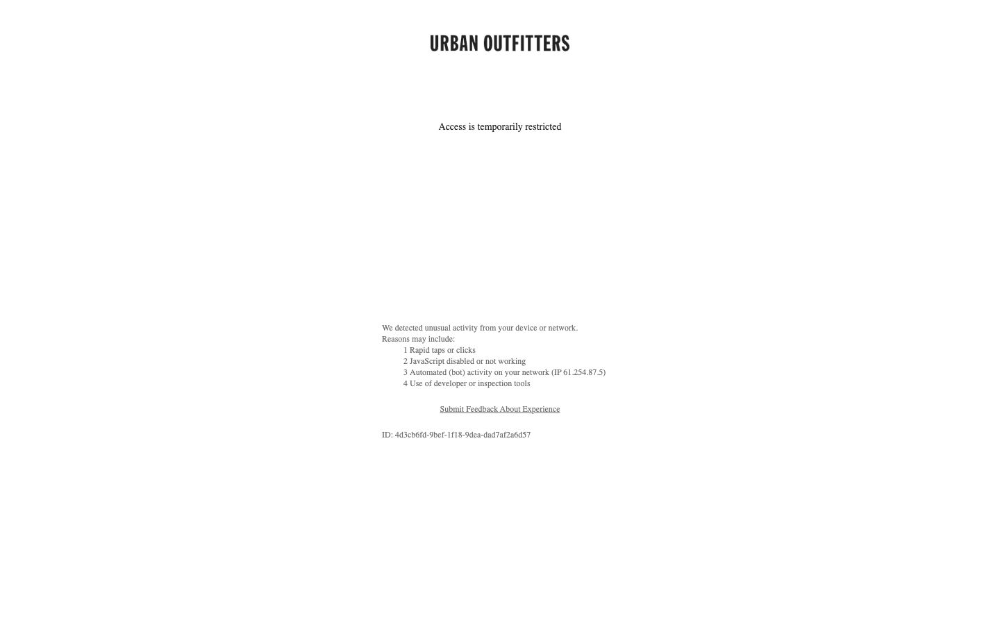

**페이지 메타 정보**

| page | title | description |
|---|---|---|
| [`new_women`](https://www.urbanoutfitters.com/womens-new-arrivals) | urbanoutfitters.com |  |

### 4.7 베트남 _( Vietnam )_

- 한국 수출규모 순위: **#4** · region: `asia` · tier `1` · currency `VND`
- 수집 사이트: **5개** (성공 5)
- 메모: 의류 생산기지/원단 수출 비중 큼. 빠르게 성장하는 이커머스
#### [Canifa](https://canifa.com/)

- URL: <https://canifa.com/>
- 페이지: **OK 1 · FAIL 0**

**대표 상품 이미지** (상위 6장, 출처 URL 포함)

- 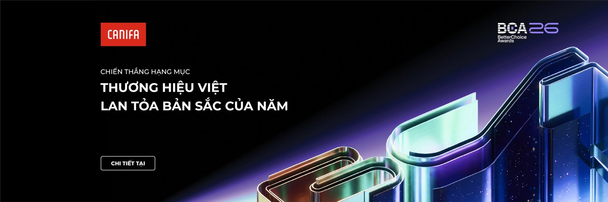 — 출처 <https://2885371169.e.cdneverest.net/Simiconnector/BannerSlider/b/c/bca_topbanner_desk-051026.webp>
-  — 출처 <https://2885371169.e.cdneverest.net/Simiconnector/BannerSlider/s/s/ssndt10_topbanner_desktop-051026.webp>
-  — 출처 <https://2885371169.e.cdneverest.net/Simiconnector/BannerSlider/t/c/tce_topbanner_desktop-081026a.webp>
- 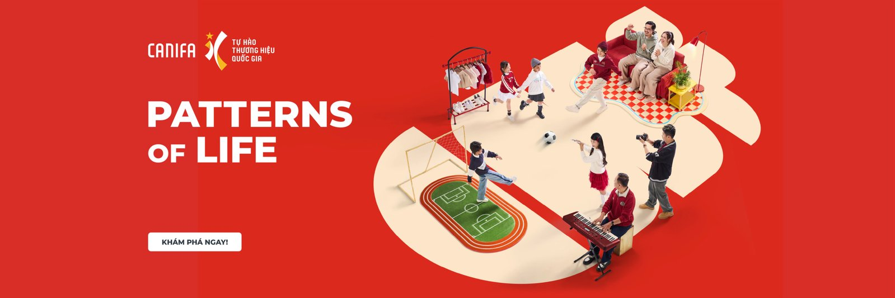 — 출처 <https://2885371169.e.cdneverest.net/Simiconnector/BannerSlider/p/a/pattern-of-life_topbanner_desk-051026.webp>
-  — 출처 <https://canifa.com/_nuxt/img/chatbot-icon.c84d6ec.webp>
-  — 출처 <https://canifa.com/_nuxt/img/chat-zalo.ab5351f.webp>

**페이지 메타 정보**

| page | title | description |
|---|---|---|
| [`home`](https://canifa.com/) | CANIFA | Fashion For All | CANIFA - thương hiệu thời trang hàng đầu Việt Nam. Hàng ngàn mẫu quần áo phụ kiện nam, nữ, trẻ em cao cấp, chất lượng, an toàn liên tục được |

#### [IVY moda](https://ivymoda.com/)

- URL: <https://ivymoda.com/>
- 페이지: **OK 1 · FAIL 0**

**대표 상품 이미지** (상위 6장, 출처 URL 포함)

- 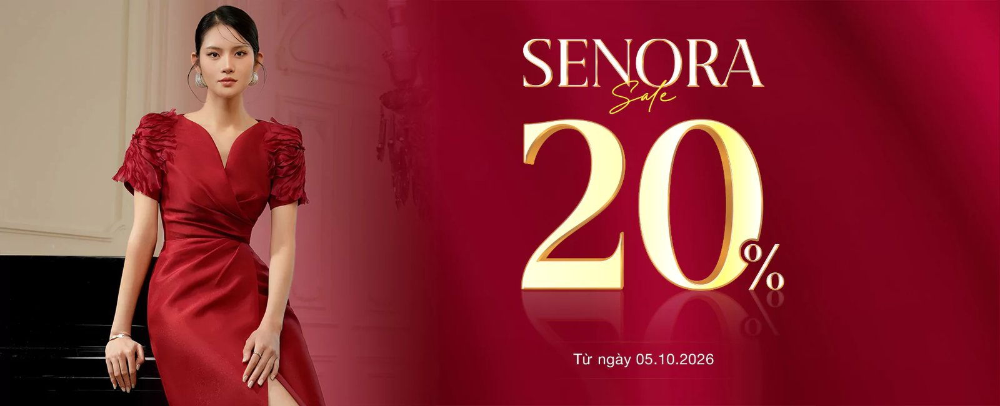 — 출처 <https://cotton4u.vn/files/news/2026/10/05/9f75481224001830953edc5297b8bced.webp>
-  — 출처 <https://cotton4u.vn/files/news/2026/09/26/470fbfc7cf5488f4162c15acfbb4b6ee.webp>
-  — 출처 <https://cotton4u.vn/files/product/thumab/400/2026/09/24/fffcb775a4b281449bd00ef7df885731.webp>
-  — 출처 <https://cotton4u.vn/files/product/thumab/400/2026/09/24/9748a6ee4292f681dcde0097fbc58c2a.webp>
-  — 출처 <https://cotton4u.vn/files/product/thumab/400/2026/09/24/428daeaa6cd901cf24a9c4ed0bd03100.webp>
-  — 출처 <https://cotton4u.vn/files/product/thumab/400/2026/09/24/59e3f8436ce86f0875899e0a230a39aa.webp>

**페이지 메타 정보**

| page | title | description |
|---|---|---|
| [`home`](https://ivymoda.com/) | IVY moda - Thời Trang Công Sở Hiện Đại | IVY moda |  |

#### [Lazada Vietnam](https://www.lazada.vn/)

- URL: <https://www.lazada.vn/>
- 페이지: **OK 1 · FAIL 0**

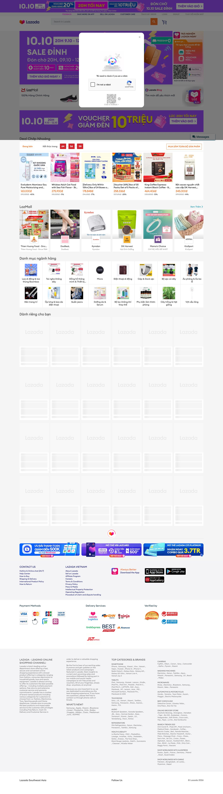

**대표 상품 이미지** (상위 6장, 출처 URL 포함)

-  — 출처 <https://img.lazcdn.com/us/domino/2ad4f22ce5a43dc145f221d13feed352.png>
-  — 출처 <https://img.lazcdn.com/g/tps/images/ims-web/TB1T7K2d8Cw3KVjSZFuXXcAOpXa.png>
-  — 출처 <https://img.lazcdn.com/us/domino/89a881e4-842e-49b0-83f8-67a2fe68cea4_VN-1976-688.jpg_2200x2200q80.jpg>
-  — 출처 <https://img.lazcdn.com/us/domino/e37751b7-4177-4303-881d-5c7ecd12da6d_VN-1976-688.jpg_2200x2200q80.jpg>
-  — 출처 <https://img.lazcdn.com/us/domino/65dda410-3a11-4236-811f-77e721b130e7_VN-1976-688.jpg_2200x2200q80.jpg>
-  — 출처 <https://img.lazcdn.com/us/domino/fa5d4ed9-58cc-4b3c-b3b3-fd2773ee4167_VN-1976-688.jpg_2200x2200q80.jpg>

**페이지 메타 정보**

| page | title | description |
|---|---|---|
| [`home`](https://www.lazada.vn/#?) | Lazada Việt Nam | Mua Sắm Online, Giá Tốt Nhất Mỗi Ngày | Mua sắm đồ điện tử, thời trang, làm đẹp và đồ chơi giá cả phải chăng. Đảm bảo sản phẩm chính hãng và trải nghiệm mua sắm tiện lợi – mua ngay |

#### [Shopee Vietnam](https://shopee.vn/)

- URL: <https://shopee.vn/>
- 페이지: **OK 1 · FAIL 0**

**페이지 메타 정보**

| page | title | description |
|---|---|---|
| [`home`](https://shopee.vn/verify/captcha?anti_bot_tracking_id=gqRjZGVrxHSFomtptTE0MjUxOnRyYWNraW5nX2lkX2tleaJrdtEAAqRhbGdv0gAAAGSjZGVrwKJjdMRAAAAADLyQlHjbhu_tIJoVd59UO0aGI3u8EPZbMRUCgbeCPd4w23IClM5T1bD7-qxvztQnbHA8L7r5z24rbHP-k6pjaXBoZXJ0ZXh0xQODAAAADMvH6407LYalytu5l9HP8LtEyrVu6DeblqnBK-eUSgfsnie8YqblYWhPZcGV2zCKc5B8Rv1LoaGHYEtNIQdWUTGsGXpFjftl_nFwglGrGg9Hos6OqH3TXiACYV4wPxOZFWxalxHvon19t8LV4mXs8J719K332Go4tvidEV3bo0l01QqDtaqiX6PSx8-asH3BsNLnKUVwMg62L4sY2Y2r0Z-7F05IT2wSdYviz2dZbCAllcAp9RFZitFDmVmP3WRkrOqlE9uIxWpOu74sgzQgKElM76-PfDEaAc4yPZCSWe1ta-Fn0VXTvlfzT13597NFqupovwQFcUs6lDC37BMkWTCfW8A8oyPZ9ZQc9sEXZ7q8ZiFvNNZCtcgUlBWWybfxq65uHRtwhQa19jfSU3aRB1Yyu_aG6iff-2ByXMOnnn2zCWBbDXd2Oe56WVLBeSluqRXu3HGlHWxlCvTZPzD2PAcGiSbs0GJ02DzC2WgEId-meHtu6un2ENzt02d8a0up6VhxRe5_7MzJXSrjkei6t0y43Xl6TL3B-EH2JnYJXsd7wIvSS8X8nkaBZGcAe1lQ3DUot50icz4Bi5HudfsxAKlVwS4gPkemCAlVBbO6kftEXs4iORDaOhE1-J3UnOzAQsD8Frkybi3M_k8GWeZXLNE51ZhNGsJ3y3N6hESfLNICDGzhHf77kLA8sfUqzh7Cb4WG7Usd84hOJdZfRBD82UBLQKn_YcjE7jXDdU5XCntXM7oSVLfqd01idYsitrCpVO5lis6d7V2H_ly8QRUy4G0JXJU2P_ZkQOdpVpwPyRihEXXKxy0792ReEMBo6PP0pMfRXSkrqbuPx_XqacnSfeb9pL0KcRFS8EqcA7DfdwllJrSp9NzsaKPqOWllNOc_GE4tAlhOL87p5rCMYTy7058i9cS9slCfL8e05ERUtmGtilCxFVp9N5e9em8jdRppPIODgiDRawZtkKoJsdqwT6IE7l1jajV0QObYF_2quYvgGqA5j_ONETcGrZMSydcAiz_dxPHC_l2czAAKcZaMD-T8L8LyVWpUZya4bY9afbeliGUrTxSKURPFyNRfI_vw1dJKsejxsMM63JJgfcbUt7aolwr6G50K2PzZ3YU9_uGnuzf0tPsz3YcNHNRyYzLS2CPYPR64lSyutEPBCrjuJ7izrRwGQTI06kpatQPaARs&app_key=FlashSale.PC&client_id=1&next=https%3A%2F%2Fshopee.vn%2Fverify%2Ftraffic%3F%3Fclient_id%3D%26next%3Dhttps%253A%252F%252Fshopee.vn%252F%26redirect_type%3D2%26should_replace_history%3Dfalse&redirect_type=2&scene=crawler_item&should_replace_history=false) | Shopee Việt Nam | Mua Sắm Online | Mua sắm trực tuyến hàng triệu sản phẩm ở tất cả ngành hàng. Giá tốt & Miễn phí vận chuyển. Mua và bán online trong 30 giây. Voucher Xtra | F |

#### [Tiki](https://tiki.vn/)

- URL: <https://tiki.vn/>
- 페이지: **OK 1 · FAIL 0**

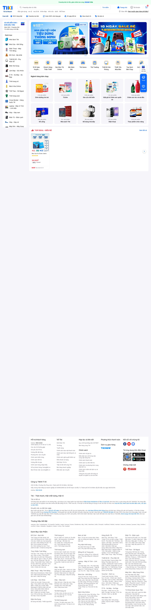

**대표 상품 이미지** (상위 6장, 출처 URL 포함)

-  — 출처 <https://salt.tikicdn.com/cache/100x100/ts/category/ed/20/60/afa9b3b474bf7ad70f10dd6443211d5f.png>
-  — 출처 <https://salt.tikicdn.com/cache/100x100/ts/category/f6/22/46/7e2185d2cf1bca72d5aeac385a865b2b.png>
-  — 출처 <https://salt.tikicdn.com/cache/100x100/ts/category/54/c0/ff/fe98a4afa2d3e5142dc8096addc4e40b.png>
-  — 출처 <https://salt.tikicdn.com/cache/100x100/ts/category/13/64/43/226301adcc7660ffcf44a61bb6df99b7.png>
-  — 출처 <https://salt.tikicdn.com/cache/100x100/ts/category/75/34/29/78e428fdd90408587181005f5cc3de32.png>
-  — 출처 <https://salt.tikicdn.com/cache/100x100/ts/category/61/d4/ea/e6ea3ffc1fcde3b6224d2bb691ea16a2.png>

**페이지 메타 정보**

| page | title | description |
|---|---|---|
| [`home`](https://tiki.vn/) | Tiki - Mua hàng online giá tốt, hàng chuẩn, ship nhanh | Tiện lợi mua sắm hàng triệu mặt hàng, dịch vụ. Vô vàn ưu đãi freeship, mã giảm giá. Hoàn tiền 15% tối đa 600k/tháng với thẻ tín dụng TikiCAR |

## 5. 의류 카테고리별 글로벌 트렌드

| # | 카테고리 | 건수 | 대표 상품명 |
|---:|---|---:|---|
| 1 | `팬츠` | 15 | 남성 I107 블뢰테 9부 파자마 팬츠 · 남성 F129 원스 9부 파자마 팬츠 · 여성 F818 프레스꼬 9부 파자마 팬츠 |
| 2 | `셔츠` | 6 | [3COLORS] 스트라이프 롱 슬리브 티셔츠 · [문의폭주/무료배송] made. 오브 울텐셀 레이어드 티셔츠 - 3 color · [15만장돌파🏆/+반팔/made] 코튼 스판 베이직 긴팔티셔츠 (라운드넥/유넥) |
| 3 | `니트` | 5 | [라방 앵콜 특가🔴/가을니트🍁/50만장돌파/made] 시오 니트 (라운드넥/브이넥) · [무료배송] made. 포트 컬러웨이 딥브이넥 니트 - 5 color  (예약주문: 10월 말 이후 순차출고예정) · [🍁가을/MNQ] 페트리 안티필링 워셔블 오버핏 딥브이넥 니트 |
| 4 | `자켓` | 3 | 라이트 시어쉘 패디드 자켓 · 스포츠 자켓 네이비 · 루앙 루즈핏 노카라 트위드 자켓(black) |
| 5 | `스커트` | 3 | [10%할인/롱치마] 폴런 폴딩 맥시 스커트 (4color) · [야크/엑스트라파인울 60%] 미토 니트 스커트 (3color) ★10/9 금요일 오후 6시까지 15% 할인적용:) · [어텀🍂][🔥모델소장/주문폭주][ordinaire] 델리 밴딩 롱스커트 (3color/숏·롱) |
| 6 | `blazer` | 2 | UNISEX CLASSIC 3 BUTTON WOOL BLAZER BLACK_UDJA6C106BK · UNISEX CLASSIC 3 BUTTON WOOL BLAZER NAVY STRIPE_UDJA6C106N1 |
| 7 | `슬랙스` | 2 | [🍁가을/3기장선택!] made. 모먼트 투커버 올데이슬랙스 (+숏/베이직/롱ver) - 4 size · [🏆역대급100만장/3기장선택!] made. 마켓 와이드 트레이닝슬랙스 (+숏/베이직/롱ver) - 4 size |
| 8 | `패딩` | 1 | [한정기획] 버튼 스위블 의자(글라이드,좌판패딩) |
| 9 | `jacket` | 1 | UNISEX LILY SUEDE HALF JACKET BLUE NAVY_UDJA6C102N1 |
| 10 | `바지` | 1 | [🤎기장선택/편한바지!] made. 마켓 울라이크 핀턱 트레이닝 슬랙스 (숏/베이직/롱) |

**국가별 의류 TOP**

- **korea**: `팬츠`(15), `셔츠`(6), `니트`(5), `자켓`(3), `스커트`(3)
## 6. 악세사리 카테고리별 글로벌 트렌드

| # | 카테고리 | 건수 | 대표 상품명 |
|---:|---|---:|---|
| 1 | `부츠` | 1 | [쭈언니X시그니처] 앵클부츠 (4cm) HPWXAGF910 |
| 2 | `bag` | 1 | [무료배송] #LENTO. Curve-Fit Shoulder Bag |

**국가별 악세사리 TOP**

- **korea**: `부츠`(1), `bag`(1)
## 7. 국가별 가격대 비교

| 국가 | 통화 | 표본 | min | p25 | median | p75 | max | median (USD) |
|---|---|---:|---:|---:|---:|---:|---:|---:|
| korea | KRW | 116 | 8400 | 30695 | 39474 | 161500 | 2718580 | 29.48 |

> p25/p75 는 IQR 기준 분위수. USD 환산은 `config/exchange_rates.yaml` 기준 (운영자가 정기 갱신).

## 8. 국내 의류·악세사리 사업동향

### KITA K-stat

- 한국무역통계의 국가 수출입 통계 총괄 페이지입니다.
- 사이트: <https://stat.kita.net/stat/kts/ctr/CtrTotalImpExpList.screen>

| # | topic | title | url |
|---:|---|---|---|
| 1 | `trade` | KITA.NET | <https://www.kita.net/> |
| 2 | `trade` | K-stat 란? | <https://www.kita.net/pdf/statGuide/index.html#p=1> |
| 3 | `무역통계` | 무역통계 분류 | <https://stat.kita.net/stat/guide/guide_18_01.screen> |
| 4 | `trade` | 한국품목코드 | <https://stat.kita.net/stat/kts/statCode/ItemHierCodeList.screen> |
| 5 | `trade` | 해외품목코드 | <https://stat.kita.net/stat/istat/common/IstatHSCode.screen> |
| 6 | `trade` | 대륙/경제코드 | <https://stat.kita.net/stat/kts/statCode/ConEcoCodeList.screen> |
| 7 | `trade` | 수출입 총괄 | <https://stat.kita.net/stat/kts/sum/SumImpExpTotalList.screen> |
| 8 | `trade` | 가공단계 수출입 | <https://stat.kita.net/stat/kts/use/BecList.screen> |
| 9 | `trade` | 품목 수출입 | <https://stat.kita.net/stat/kts/pum/ItemImpExpList.screen> |
| 10 | `trade` | 국가 수출입 | <https://stat.kita.net/stat/kts/ctr/CtrTotalImpExpList.screen> |
| 11 | `trade` | 대륙/경제권 수출입 | <https://stat.kita.net/stat/kts/rel/RelColligationList.screen> |
| 12 | `trade` | 지자체 수출입 | <https://stat.kita.net/stat/kts/prod/ProdWholeList.screen> |
| 13 | `trade` | 항구/공항 수출입 | <https://stat.kita.net/stat/kts/port/PortImpExpList.screen> |
| 14 | `trade` | FTA체결국 수출입 | <https://stat.kita.net/stat/kts/fta/FtaCtrImpExpList.screen> |
| 15 | `trade` | 간접수출 현황 | <https://stat.kita.net/stat/ind/KtsIndMain.screen> |

### Korea Customs Service

- 수출입 현황, 물류통계 등 관세청 무역통계정보를 종합적으로 제공
- 사이트: <https://tradedata.go.kr/cts/index_eng.do>

| # | topic | title | url |
|---:|---|---|---|
| 1 | `trade` | Korea Customs Service | <http://customs.go.kr/english/main.do> |

### KOSIS

- 코시스, 국가데이터처가 제공하는 원스톱 통계 서비스, 국가승인통계, 국제통계, 북한통계, e-지방지표, 통계시각화콘텐츠, 온라인간행물 등 제공
- 사이트: <https://kosis.kr/statisticsList/statisticsListIndex.do?parmTabId=M_01_01&vwcd=MT_ZTITLE&menuId=M_01_01&outLink=Y&entrType=>

| # | topic | title | url |
|---:|---|---|---|
| 1 | `statistics` | 쉽게 보는 통계 | <http://kosis.kr/easyViewStatis/customStatisIndex.do?vwcd=MT_TM1_TITLE&menuId=M_03_01> |
| 2 | `statistics` | 이슈별 접근 | <http://kosis.kr/easyViewStatis/customStatisIndex.do?vwcd=MT_TM2_TITLE&menuId=M_03_02> |
| 3 | `statistics` | 통계시각화콘텐츠 | <http://kosis.kr/easyViewStatis/visualizationIndex.do> |
| 4 | `statistics` | 온라인간행물 | <http://kosis.kr/publication/publicationThema.do> |
| 5 | `statistics` | 기획간행물 | <http://kosis.kr/publication/publicationStat.do> |
| 6 | `statistics` | KOSIS 길라잡이 | <http://kosis.kr/civilComplaint/kosisGuideIndex.do> |
| 7 | `statistics` | 홈페이지 개선의견 | <http://kosis.kr/civilComplaint/siteRequestList.do> |
| 8 | `statistics` | 찾아가는 KOSIS | <http://kosis.kr/civilComplaint/kosisEduIndex.do> |
| 9 | `statistics` | 서비스 소개 | <http://kosis.kr/serviceInfo/kosisIntroduce.do> |
| 10 | `statistics` | 국가통계현황 | <http://kosis.kr/serviceInfo/statisInstitution.do> |
| 11 | `statistics` | 국가통계 공표일정 | <http://kosis.kr/serviceInfo/statisPublicationList.do> |
| 12 | `statistics` | 팩트체크 서비스 | <http://kosis.kr/serviceInfo/factCheckList.do> |
| 13 | `statistics` | 서비스정책 | <http://kosis.kr/serviceInfo/useGuide.do> |
| 14 | `statistics` | 공유서비스 (OpenAPI) | <http://kosis.kr/serviceInfo/openAPIGuide.do> |
| 15 | `statistics` | English | <https://kosis.kr/eng> |

### KOTRA

- 트라이빅(TriBig)은 코트라(KOTRA)가 제공하는 무역투자 빅데이터 플랫폼으로 무역투자통계, 국가별 시장정보, 품목별 유망시장, 기업별 맞춤정보, 해외바이어 정보의 서비스를 제공합니다.
- 사이트: <https://www.kotra.or.kr/bigdata/visualization/korea#search/ALL/ALL/2024>

| # | topic | title | url |
|---:|---|---|---|
| 1 | `trade` | kotra 무역투자24 | <https://www.kotra.or.kr/bigdata/kotraSsoRedirect?targetURL=https://www.kotra.or.kr> |
| 2 | `trade` | 해외비즈니스 정보 포털 | <https://www.kotra.or.kr/bigdata/kotraSsoRedirect?targetURL=https://dream.kotra.or.kr/dream> |
| 3 | `trade` | 글로벌 전시포털 | <https://www.kotra.or.kr/bigdata/kotraSsoRedirect?targetURL=https://www.gep.or.kr/> |
| 4 | `trade` | KOTRA 해외인재유치센터 | <https://www.kotra.or.kr/gtc_kor> |
| 5 | `trade` | 투자유치정보제공 | <https://www.kotra.or.kr/bigdata/kotraSsoRedirect?targetURL=https://www.investkorea.org/> |
| 6 | `수출지원` | 수출지원 온라인 플랫폼 | <https://www.kotra.or.kr/bigdata/kotraSsoRedirect?targetURL=https://www.buykorea.or.kr/> |
| 7 | `trade` | 빅데이터 서비스 | <https://www.kotra.or.kr/bigdata/> |
| 8 | `trade` | 경제외교 활용포털 | <https://www.kotra.or.kr/bigdata/kotraSsoRedirect?targetURL=https://president.globalwindow.org> |
| 9 | `trade` | 방산물자교역지원센터 | <https://www.kotra.or.kr/bigdata/kotraSsoRedirect?targetURL=https://www.kotra.or.kr/kodits> |
| 10 | `trade` | 외투기업고충처리 | <https://www.kotra.or.kr/bigdata/kotraSsoRedirect?targetURL=https://ombudsman.kotra.or.kr/ob-kr> |
| 11 | `trade` | 수출바우처 · 지사화 | <https://www.exportvoucher.com> |
| 12 | `trade` | 무역투자통계 | <https://www.kotra.or.kr/bigdata/visualization/korea> |
| 13 | `trade` | 국가별 시장정보 | <https://www.kotra.or.kr/bigdata/marketAnalysis> |
| 14 | `trade` | 품목별 유망시장 | <https://www.kotra.or.kr/bigdata/bhrcMarket> |
| 15 | `trade` | 해외바이어 정보 | <https://www.kotra.or.kr/bigdata/partner/search> |

### Statistics Korea Online Shopping

- 국가데이터처,List | 전체 | 보도자료 | 새소식
- 사이트: <https://mods.go.kr/board.es?mid=a10301010000&bid=11789>

| # | topic | title | url |
|---:|---|---|---|
| 1 | `statistics` | 정보공개제도 | <https://mods.go.kr/menu.es?mid=a10101010100> |
| 2 | `statistics` | 정보공개청구 | <https://www.open.go.kr/com/main/mainView.do> |
| 3 | `statistics` | 비공개대상정보세부기준 | <https://mods.go.kr/menu.es?mid=a10101030000> |
| 4 | `statistics` | 고객수요분석 | <https://mods.go.kr/menu.es?mid=a10101040000> |
| 5 | `statistics` | 사전정보공표 | <https://mods.go.kr/menu.es?mid=a10103010000> |
| 6 | `statistics` | 사전정보공표목록 | <https://mods.go.kr/menu.es?mid=a10103010100> |
| 7 | `statistics` | 핵심단어목록 | <https://mods.go.kr/menu.es?mid=a10103020100> |
| 8 | `statistics` | 인기정보TOP10 | <https://mods.go.kr/menu.es?mid=a10103030100> |
| 9 | `statistics` | 행정자료실 | <https://mods.go.kr/menu.es?mid=a10104010000> |
| 10 | `statistics` | 업무추진비 | <https://mods.go.kr/menu.es?mid=a10104010100> |
| 11 | `statistics` | 국회관련정보 | <https://mods.go.kr/menu.es?mid=a10104040000> |
| 12 | `statistics` | 정책실명제 | <https://mods.go.kr/menu.es?mid=a10105010000> |
| 13 | `statistics` | 연도별대상사업현황 | <https://mods.go.kr/menu.es?mid=a10105020000> |
| 14 | `statistics` | 중점관리대상사업 | <https://mods.go.kr/menu.es?mid=a10105030600> |
| 15 | `statistics` | 국민신청실명제 | <https://mods.go.kr/menu.es?mid=a10105040000> |

### 기업마당

- 기업마당>정책정보>지원사업 공고
- 사이트: <https://www.bizinfo.go.kr/sii/siia/selectSIIA200View.do?null>

| # | topic | title | url |
|---:|---|---|---|
| 1 | `policy` | 지원사업 공고 | <https://www.bizinfo.go.kr/sii/siia/selectSIIA200View.do> |
| 2 | `policy` | 품목별 법정의무 인증제도 | <https://www.bizinfo.go.kr/biz/biza/selectBIZA100View.do> |
| 3 | `policy` | 입법·행정예고/고시 | <https://www.bizinfo.go.kr/biz/biza/selectBIZA300View.do> |
| 4 | `policy` | 월간 중기누리 | <https://www.bizinfo.go.kr/biz/biza/selectBIZA400View.do> |
| 5 | `policy` | 기업업무용 서식 | <https://www.bizinfo.go.kr/biz/bizb/selectBIZB100View.do> |
| 6 | `policy` | 입주기업 모집공고 | <https://www.bizinfo.go.kr/biz/bizb/selectBIZB200View.do> |
| 7 | `policy` | 온라인화상회의실 | <https://www.k-startup.go.kr/web/contents/webOLNIVIDEOMTRM.do> |
| 8 | `policy` | 정책정보 개방 | <https://www.bizinfo.go.kr/apiList.do> |
| 9 | `policy` | 속보성 대시보드 | <https://www.bizinfo.go.kr/dashboard.do> |
| 10 | `policy` | 고객의 소리 | <https://www.bizinfo.go.kr/biz/bizc/selectBIZC200Regist.do> |
| 11 | `policy` | 자주하는질문 | <https://www.bizinfo.go.kr/biz/bizc/selectBIZC300View.do> |
| 12 | `policy` | 이메일주소 무단 수집 거부안내 | <https://www.bizinfo.go.kr/biz/bizd/selectBIZD110View.do> |
| 13 | `policy` | 저작권 정책 | <https://www.bizinfo.go.kr/biz/bizd/selectBIZD120View.do> |
| 14 | `policy` | 웹접근성 정책 | <https://www.bizinfo.go.kr/biz/bizd/selectBIZD130View.do> |
| 15 | `policy` | 전체메뉴보기 | <https://www.bizinfo.go.kr/sitemap/intro.do> |

### 서울경제진흥원

- 서울경제진흥원 에러페이지
- 사이트: <https://www.sba.seoul.kr/Pages/error_404.html?aspxerrorpath=/Pages/NSub06_01.aspx>

### 소상공인24

- 소상공인24
- 사이트: <https://www.sbiz24.kr/#/pbanc>

### 중소벤처기업부

- 중소기업중앙회 등 기관 중소기업 조사, 통계 DB화 검색, 내려받기 등 제공.
- 사이트: <https://www.mss.go.kr/site/smba/ex/bbs/List.do?cbIdx=86>

| # | topic | title | url |
|---:|---|---|---|
| 1 | `policy` | 어린이 누리집 | <https://www.mss.go.kr/site/kids/main.do> |
| 2 | `policy` | English | <https://www.mss.go.kr/site/eng/main.do> |
| 3 | `policy` | 누리집 안내지도 | <https://www.mss.go.kr/site/smba/ex/siteMap/siteMap.do> |
| 4 | `policy` | 훈령/예규/고시/공고 | <https://www.mss.go.kr/site/smba/ex/bbs/List.do?cbIdx=125&ext6=Y> |
| 5 | `policy` | 입법/행정예고 | <https://www.mss.go.kr/site/smba/ex/bbs/List.do?cbIdx=126&searchRltnYn=Y> |
| 6 | `policy` | 인사·채용 | <https://www.mss.go.kr/site/smba/ex/bbs/List.do?cbIdx=82> |
| 7 | `policy` | 보도설명자료 | <https://www.mss.go.kr/site/smba/ex/bbs/List.do?cbIdx=87> |
| 8 | `policy` | 현장속으로 | <https://www.mss.go.kr/site/smba/brdcststnVod/brdcststnVodList.do?ctgr_code=C01> |
| 9 | `policy` | 중기부소식지 | <https://www.mss.go.kr/site/smba/ex/bbs/List.do?cbIdx=95> |
| 10 | `policy` | 통계발표자료 | <https://www.mss.go.kr/site/smba/foffice/ex/statDB/ptScheduleList.do> |
| 11 | `policy` | 주제별 통계 | <https://www.mss.go.kr/site/smba/foffice/ex/statDB/temaList.do?tabCd=0001> |
| 12 | `policy` | 조사별 통계 | <https://www.mss.go.kr/site/smba/foffice/ex/statDB/surveyList.do?tabCd=0001> |
| 13 | `policy` | 조사보고서 | <https://www.mss.go.kr/site/smba/foffice/ex/statDB/stReportRoList.do?gb=1&nodeId=&roCode=> |
| 14 | `policy` | 주제별 조회 | <https://www.mss.go.kr/site/smba/foffice/ex/statDB/stReportRcList.do?gb=2&nodeId=&rcCode=> |
| 15 | `policy` | 중소기업위상 | <https://www.mss.go.kr/site/smba/foffice/ex/statDB/MainSubStat.do?scd=0001> |

## 9. 한국 사업자 관점 기회 국가 TOP 10

| # | 국가 | tier | region | 점수 | 근거 |
|---:|---|---:|---|---:|---|
| 1 | 태국 _( Thailand )_ | 1 | `asia` | **144.0** | tier1 기본점(90); 아시아 권역(+20); ASEAN 시장(+10); K-패션/콘텐츠 친화 시장(+20); 트렌드 신호 밀도 4 |
| 2 | 대만 _( Taiwan )_ | 1 | `asia` | **136.5** | tier1 기본점(90); 아시아 권역(+20); K-패션/콘텐츠 친화 시장(+20); 트렌드 신호 밀도 6 |
| 3 | 일본 _( Japan )_ | 1 | `asia` | **130.0** | tier1 기본점(90); 아시아 권역(+20); K-패션/콘텐츠 친화 시장(+20) |
| 4 | 인도네시아 _( Indonesia )_ | 1 | `asia` | **129.0** | tier1 기본점(90); 아시아 권역(+20); ASEAN 시장(+10); 트렌드 신호 밀도 9 |
| 5 | 베트남 _( Vietnam )_ | 1 | `asia` | **126.5** | tier1 기본점(90); 아시아 권역(+20); ASEAN 시장(+10); 트렌드 신호 밀도 6 |
| 6 | 미국 _( United States )_ | 1 | `north_america` | **110.0** | tier1 기본점(90); 트렌드 신호 밀도 20 |
| 7 | 필리핀 _( Philippines )_ | 2 | `asia` | **110.0** | tier2 기본점(60); 아시아 권역(+20); ASEAN 시장(+10); K-패션/콘텐츠 친화 시장(+20) |
| 8 | 말레이시아 _( Malaysia )_ | 2 | `asia` | **90.0** | tier2 기본점(60); 아시아 권역(+20); ASEAN 시장(+10) |
| 9 | 싱가포르 _( Singapore )_ | 2 | `asia` | **90.0** | tier2 기본점(60); 아시아 권역(+20); ASEAN 시장(+10) |
| 10 | 홍콩 _( Hong Kong )_ | 2 | `asia` | **80.0** | tier2 기본점(60); 아시아 권역(+20) |

## 10. 실행 제안

### **1위 태국** (점수 144, tier1 · asia)

- 현지 스타일 TOP: `wide`, `modern` — 시즌 컬렉션 기획 시 우선 반영.
- 현지 컬러 TOP: `red` — 시즌 컬렉션 기획 시 우선 반영.
- 현지 카테고리 TOP: `tee`, `bag`, `accessories` — 시즌 컬렉션 기획 시 우선 반영.
- K-패션 친화도가 명시된 시장이므로 K-브랜드 아이덴티티 및 한류 셀럽 협업을 강조.
- ASEAN 권역 시장 — 물류/관세(FTA) 활용 + 동남아 통합 마케팅 검토 권장.
- tier1 핵심 시장 — 현지 마켓플레이스(예: 해당 국가의 대표 패션 플랫폼) 공식 입점 + 셀러 운영 채널 확보 우선.
- 연계 가능한 국내 수출/지원 사업이 식별되지 않음 — `domestic_sources.yaml` 의 `landing_url` 을 KOTRA 사업 공고/기업마당 수출바우처로 직접 지정 권장.

### **2위 대만** (점수 136, tier1 · asia)

- 현지 컬러 TOP: `pink`, `red` — 시즌 컬렉션 기획 시 우선 반영.
- 현지 소재 TOP: `lace` — 시즌 컬렉션 기획 시 우선 반영.
- K-패션 친화도가 명시된 시장이므로 K-브랜드 아이덴티티 및 한류 셀럽 협업을 강조.
- 아시아 권역 시장 — 시차/언어 친화 + 한국 본사 직배송 모델 검토.
- tier1 핵심 시장 — 현지 마켓플레이스(예: 해당 국가의 대표 패션 플랫폼) 공식 입점 + 셀러 운영 채널 확보 우선.
- 연계 가능한 국내 수출/지원 사업이 식별되지 않음 — `domestic_sources.yaml` 의 `landing_url` 을 KOTRA 사업 공고/기업마당 수출바우처로 직접 지정 권장.

### **3위 일본** (점수 130, tier1 · asia)

- K-패션 친화도가 명시된 시장이므로 K-브랜드 아이덴티티 및 한류 셀럽 협업을 강조.
- 아시아 권역 시장 — 시차/언어 친화 + 한국 본사 직배송 모델 검토.
- tier1 핵심 시장 — 현지 마켓플레이스(예: 해당 국가의 대표 패션 플랫폼) 공식 입점 + 셀러 운영 채널 확보 우선.
- 연계 가능한 국내 수출/지원 사업이 식별되지 않음 — `domestic_sources.yaml` 의 `landing_url` 을 KOTRA 사업 공고/기업마당 수출바우처로 직접 지정 권장.

### 운영 점검 노트

- **ASEAN 다중 진출 기회**: TOP10 중 ASEAN 국가가 3개 이상. Shopee/Lazada/Zalora 통합 운영을 통한 동남아 멀티마켓 전략을 검토 권장.

## 11. 수집 실패/주의 사이트

| 국가 | 사이트 | 페이지 | 상태 | 사유 |
|---|---|---|---|---|
| usa | Revolve | new | failed | playwright_error: Error: Page.goto: net::ERR_HTTP2_PROTOCOL_ERROR at https://www.revolve.com/new/br/c79f88/
Call log:
  - navigating to "https://www.revolve.com/new/br/c79f88/", waiting until "domcontentloaded"
 |
| usa | Revolve | trending | failed | playwright_error: Error: Page.goto: net::ERR_HTTP2_PROTOCOL_ERROR at https://www.revolve.com/most-loved/br/4a9ca5/
Call log:
  - navigating to "https://www.revolve.com/most-loved/br/4a9ca5/", waiting until "domcontentloaded"
 |
| japan | ZOZOTOWN | new | failed | playwright_error: TimeoutError: Page.goto: Timeout 30000ms exceeded.
Call log:
  - navigating to "https://zozo.jp/category/new/", waiting until "domcontentloaded"
 |
| japan | ZOZOTOWN | ranking | failed | playwright_error: TimeoutError: Page.goto: Timeout 30000ms exceeded.
Call log:
  - navigating to "https://zozo.jp/ranking/", waiting until "domcontentloaded"
 |
| japan | Rakuten Fashion | women | failed | http_status_404 |
| indonesia | Tokopedia | home | failed | playwright_error: Error: Page.goto: net::ERR_HTTP2_PROTOCOL_ERROR at https://www.tokopedia.com/
Call log:
  - navigating to "https://www.tokopedia.com/", waiting until "domcontentloaded"
 |
| taiwan | PChome | home | failed | http_status_429 |
| thailand | Pomelo | new | failed | robots_disallowed |
| thailand | Pomelo | best | failed | robots_disallowed |
| korea | Musinsa | home | failed | robots_disallowed |

## 12. 원문 출처 및 이미지 출처

### 인도네시아

- **Berrybenka** — <https://www.berrybenka.com/>
  - 이미지 출처: <https://berrybenka.com/cdn/shop/files/logo.jpg?height=288&v=1791288203>
  - 이미지 출처: <https://berrybenka.com/cdn/shop/files/Shopee1.png?v=1791286518&width=3840>
  - 이미지 출처: <https://berrybenka.com/cdn/shop/files/Shopee2.png?v=1791282529&width=3840>
  - 이미지 출처: <https://berrybenka.com/cdn/shop/files/Banner-3-1.jpg?v=1791283147&width=3840>
  - 이미지 출처: <https://berrybenka.com/cdn/shop/files/Banner-3-2.jpg?v=1791283866&width=3840>
  - 이미지 출처: <https://berrybenka.com/cdn/shop/files/Banner-3-3.jpg?v=1791283948&width=3840>
  - 이미지 출처: <https://berrybenka.com/cdn/shop/files/Banner-3-4.jpg?v=1791284027&width=3840>
  - 이미지 출처: <https://berrybenka.com/cdn/shop/files/Banner-3-5.jpg?v=1791284112&width=3840>
  - 이미지 출처: <https://berrybenka.com/cdn/shop/files/Shopee4.jpg?v=1791285843&width=3840>
  - 이미지 출처: <https://berrybenka.com/cdn/shop/files/shopee6-1.jpg?v=1791286001&width=3840>
  - 이미지 출처: <https://berrybenka.com/cdn/shop/files/shopee6-2.jpg?v=1791286073&width=3840>
  - 이미지 출처: <https://berrybenka.com/cdn/shop/files/shopee6-3.jpg?v=1791286117&width=3840>
  - 이미지 출처: <https://berrybenka.com/cdn/shop/files/shopee6-4.jpg?v=1791286156&width=3840>
  - 이미지 출처: <https://berrybenka.com/cdn/shop/files/shopee6-5.jpg?v=1791286367&width=3840>
  - 이미지 출처: <https://berrybenka.com/cdn/shop/files/th-11134207-81zto-mr01nsim06pz1d.jpg?v=1788923925&width=3840>
  - 이미지 출처: <https://berrybenka.com/cdn/shop/files/th-11134207-81ztm-mr01nsai9iis83.jpg?v=1788923925&width=3840>
  - 이미지 출처: <https://berrybenka.com/cdn/shop/files/th-11134207-81zti-mr01ns6xfbb69c.jpg?v=1788923925&width=3840>
  - 이미지 출처: <https://berrybenka.com/cdn/shop/files/th-11134207-81ztl-mr01ns6yd0y418.jpg?v=1788923925&width=3840>
  - 이미지 출처: <https://berrybenka.com/cdn/shop/files/th-11134207-81ztl-mr01mnofturra9.jpg?v=1788923924&width=3840>
- **Hijup** — <https://www.hijup.com/>
- **Shopee Indonesia** — <https://shopee.co.id/>
  - 이미지 출처: <https://deo.shopeemobile.com/shopee/shopee-pcmall-live-sg/assets/1c8bdaaf45e1fd48.png>
- **Tokopedia** — <https://www.tokopedia.com/>
- **Zalora Indonesia** — <https://www.zalora.co.id/>
  - 이미지 출처: <https://static-id.zacdn.com/next-assets/static-assets/images/logo/icon_mastercard.png>
  - 이미지 출처: <https://static-id.zacdn.com/next-assets/static-assets/images/logo/icon_visa.png>
  - 이미지 출처: <https://static-id.zacdn.com/next-assets/static-assets/images/logo/icon_ovo.png>

### 일본

- **GU Japan** — <https://www.gu-global.com/jp/>
  - 이미지 출처: <https://image.uniqlo.com/GU/ST3/jp/imagesother/Navigation/Category-icon_V2/2026/0724/Categoy_SALE.jpg>
  - 이미지 출처: <https://image.uniqlo.com/GU/ST3/jp/imagesother/Navigation/collaboration_Category/26FW/rokh_category_icon.png>
  - 이미지 출처: <https://image.uniqlo.com/GU/ST3/jp/imagesother/Navigation/WOMEN_Category/2026/260901/Category_w_Outer_361430.png>
  - 이미지 출처: <https://image.uniqlo.com/GU/ST3/jp/imagesother/Navigation/WOMEN_Category/2026/261008/category_w_knit-and-cardigan_360549.png>
  - 이미지 출처: <https://image.uniqlo.com/GU/ST3/jp/imagesother/Navigation/WOMEN_Category/2026/261008/category_w_tops_361505.png>
  - 이미지 출처: <https://image.uniqlo.com/GU/ST3/jp/imagesother/Navigation/WOMEN_Category/2026/260911/Category_w_sweat_361784.png>
  - 이미지 출처: <https://image.uniqlo.com/GU/ST3/jp/imagesother/Navigation/WOMEN_Category/2026/260807/Category_w_shirt_361657.png>
  - 이미지 출처: <https://image.uniqlo.com/GU/ST3/jp/imagesother/Navigation/WOMEN_Category/2026/260724/Category_w_Pants.jpg>
  - 이미지 출처: <https://image.uniqlo.com/GU/ST3/jp/imagesother/Navigation/WOMEN_Category/2026/260820/Category_w_skirt_361518.png>
  - 이미지 출처: <https://image.uniqlo.com/GU/ST3/jp/imagesother/Navigation/WOMEN_Category/2026/260820/Category_w_onepeace_361516.png>
  - 이미지 출처: <https://image.uniqlo.com/GU/ST3/jp/imagesother/Navigation/WOMEN_Category/2026/261008/category_m_roomwear_361883.png>
  - 이미지 출처: <https://image.uniqlo.com/GU/ST3/jp/imagesother/Navigation/WOMEN_Category/2026/260818/Category_w_inner_360961.png>
  - 이미지 출처: <https://image.uniqlo.com/GU/ST3/jp/imagesother/Navigation/WOMEN/2026/09/0922/category_w_shoes_361781.png>
  - 이미지 출처: <https://image.uniqlo.com/GU/ST3/jp/imagesother/Navigation/WOMEN_Category/2026/260911/Category_w_goods_360893.png>
- **Rakuten Fashion** — <https://brandavenue.rakuten.co.jp/>
  - 이미지 출처: <https://brandavenue.r10s.jp/img/library/index/sbn_flagshipstore_20231003.png>
  - 이미지 출처: <https://brandavenue.r10s.jp/img/news/01/401760/pc_n.jpg>
  - 이미지 출처: <https://brandavenue.r10s.jp/img/news/01/401766/pc_n.jpg>
  - 이미지 출처: <https://brandavenue.r10s.jp/img/news/01/401767/pc_n.jpg>
  - 이미지 출처: <https://brandavenue.r10s.jp/img/news/01/401771/pc_n.jpg>
  - 이미지 출처: <https://brandavenue.r10s.jp/img/news/01/399937/pc_n.jpg>
  - 이미지 출처: <https://brandavenue.r10s.jp/img/news/01/401756/pc_n.jpg>
  - 이미지 출처: <https://brandavenue.r10s.jp/img/news/01/401757/pc_n.jpg>
  - 이미지 출처: <https://brandavenue.r10s.jp/img/news/01/401979/pc_n.jpg>
  - 이미지 출처: <https://brandavenue.r10s.jp/img/news/01/401657/pc_n.jpg>
  - 이미지 출처: <https://brandavenue.r10s.jp/img/news/01/402181/pc_n.jpg>
  - 이미지 출처: <https://brandavenue.r10s.jp/img/news/01/401753/pc_n.jpg>
  - 이미지 출처: <https://brandavenue.r10s.jp/img/news/01/401768/pc_n.jpg>
  - 이미지 출처: <https://brandavenue.r10s.jp/img/news/01/402229/pc_n.jpg>
  - 이미지 출처: <https://brandavenue.r10s.jp/img/news/01/401654/pc_n.jpg>
  - 이미지 출처: <https://brandavenue.r10s.jp/img/news/01/401557/pc_n.jpg>
  - 이미지 출처: <https://brandavenue.r10s.jp/img/news/01/402090/pc_n.jpg>
  - 이미지 출처: <https://brandavenue.r10s.jp/img/news/01/402092/pc_n.jpg>
  - 이미지 출처: <https://brandavenue.r10s.jp/img/news/01/402230/pc_n.jpg>
- **Uniqlo Japan** — <https://www.uniqlo.com/jp/>
- **WEAR** — <https://wear.jp/>
  - 이미지 출처: <https://wear.jp/public/_next/static/media/notfound_bg.1ywd-k_shp-hy.png>
  - 이미지 출처: <https://wear.jp/public/_next/static/media/notfound_4.1ho27atf54bbv.png>
  - 이미지 출처: <https://wear.jp/public/_next/static/media/notfound_0.438l9b9xjj6tm.png>
  - 이미지 출처: <https://images.wear2.jp/coordinate/kAiO3P8/3OR1rIQ6/1791380438_276.jpg>
  - 이미지 출처: <https://images.wear2.jp/coordinate/7binyqO8/NkhuK28i/1791256866_276.jpg>
  - 이미지 출처: <https://images.wear2.jp/coordinate/ywimOMnJ/6Nqsvwq6/1791254143_276.jpg>
  - 이미지 출처: <https://images.wear2.jp/coordinate/Mni7423d/1qa872ur/1789112376_276.jpg>
  - 이미지 출처: <https://images.wear2.jp/coordinate/6giPwrbb/muTTYGVK/1787646810_276.jpg>
  - 이미지 출처: <https://images.wear2.jp/coordinate/6gi77v3G/ceC60YCk/1791485186_276.jpg>
  - 이미지 출처: <https://images.wear2.jp/profile/6gio2xl5/hpSX0raH/1715229637_120.jpg>
  - 이미지 출처: <https://images.wear2.jp/profile/QWio67p0/1qYVj2ZO/1759579064_120.jpg>
  - 이미지 출처: <https://images.wear2.jp/profile/6ginq68V/NRgMxEW6/1772581058_120.jpg>
  - 이미지 출처: <https://images.wear2.jp/profile/3oiqj2MY/ThKO9oo8/1674043725_120.jpg>
  - 이미지 출처: <https://images.wear2.jp/profile/oJiz5V0k/Nw4d72hL/1729144639_120.jpg>
  - 이미지 출처: <https://images.wear2.jp/profile/oJizV4pM/31jZ25th/1743354003_120.jpg>
  - 이미지 출처: <https://images.wear2.jp/profile/nZiLPVym/r8IX8nog/1790403215_120.jpg>
  - 이미지 출처: <https://cdn.wimg.jp/profile/a8dw6h/20200106215100518_120.jpg>
  - 이미지 출처: <https://images.wear2.jp/profile/wnipYnRD/X8dWuLfA/1706628765_120.jpg>
  - 이미지 출처: <https://wear.jp/public/_next/static/media/mock.1rl8d86z-j78c.webp>
  - 이미지 출처: <https://wear.jp/public/_next/static/media/newgrad28-business-entry-sp.400k08y827-wx.webp>
- **ZOZOTOWN** — <https://zozo.jp/>

### 한국

- **29CM** — <https://www.29cm.co.kr/>
  - 이미지 출처: <https://img.29cm.co.kr/cms/202610/11f1c1f2c32a47078aae83c2faec2c60.png?width=3840&format=webp>
  - 이미지 출처: <https://img.29cm.co.kr/cms/202610/11f1c1f2bde713a790ed9f9086a2b7ac.png?width=3840&format=webp>
  - 이미지 출처: <https://img.29cm.co.kr/cms/202610/11f1c1f2b204a0d38aae839512bb3215.png?width=3840&format=webp>
  - 이미지 출처: <https://img.29cm.co.kr/cms/202610/11f1c1f2a71e404190ed83b363062416.png?width=3840&format=webp>
  - 이미지 출처: <https://img.29cm.co.kr/cms/202610/11f1c1f29e17eb618aae6571112ca624.png?width=3840&format=webp>
  - 이미지 출처: <https://img.29cm.co.kr/cms/202610/11f1c1f28b2a2f548aaef7b7a81bee7a.png?width=3840&format=webp>
  - 이미지 출처: <https://img.29cm.co.kr/cms/202610/11f1c1f28296727390edc5052fcb98c7.png?width=3840&format=webp>
  - 이미지 출처: <https://img.29cm.co.kr/cms/202610/11f1c143351d2cab8aae4588205cd62c.png?width=3840&format=webp>
  - 이미지 출처: <https://img.29cm.co.kr/cms/202610/11f1c1432a702c298aae7b2035cae8bc.png?width=3840&format=webp>
  - 이미지 출처: <https://img.29cm.co.kr/cms/202610/11f1c14320bd912190eddbd8c1d693b4.png?width=3840&format=webp>
  - 이미지 출처: <https://img.29cm.co.kr/cms/202610/11f1c143122c2b838aae375ff6bdc4e0.png?width=3840&format=webp>
  - 이미지 출처: <https://img.29cm.co.kr/cms/202610/11f1c1430937fe8d8aae5dcf2bb73fc5.png?width=3840&format=webp>
  - 이미지 출처: <https://img.29cm.co.kr/cms/202610/11f1be2b8dc2efc190ed2d733be412de.png?width=3840&format=webp>
  - 이미지 출처: <https://img.29cm.co.kr/cms/202610/11f1be2b85b1f7af8aae094e06f632c7.png?width=3840&format=webp>
  - 이미지 출처: <https://img.29cm.co.kr/cms/202610/11f1be2b7d21bcb58aae5f976f155d3d.png?width=3840&format=webp>
  - 이미지 출처: <https://img.29cm.co.kr/cms/202610/11f1be2b74ecc1198aae71859c72b148.png?width=3840&format=webp>
  - 이미지 출처: <https://img.29cm.co.kr/cms/202610/11f1be2b6a29a0898aae5bc84403a2d1.png?width=3840&format=webp>
  - 이미지 출처: <https://img.29cm.co.kr/cms/202610/11f1be2b5553ead190ed93f154982a72.png?width=3840&format=webp>
  - 이미지 출처: <https://img.29cm.co.kr/cms/202610/11f1be2b06a4a34c8aaed1450e7fa3f2.png?width=3840&format=webp>
- **Musinsa** — <https://www.musinsa.com/>
- **W Concept** — <https://www.wconcept.co.kr/>
- **Zigzag** — <https://zigzag.kr/>
  - 이미지 출처: <https://cf.image-farm.s.zigzag.kr/original/cms/2026/10/01/202610010705314839_039131.png?quality=80&format=webp&transparent=true&width=1029&height=1188>
  - 이미지 출처: <https://cf.image-farm.s.zigzag.kr/original/cms/2026/10/01/202610010226568667_083695.jpg?format=webp&quality=80&width=1029&height=1188>
  - 이미지 출처: <https://cf.image-farm.s.zigzag.kr/original/cms/2026/10/01/202610010228309748_097514.jpg?format=webp&quality=80&width=1029&height=1188>
  - 이미지 출처: <https://cf.image-farm.s.zigzag.kr/original/cms/2026/10/07/202610070058580121_041890.jpg?width=1029&height=1188&quality=80&format=webp&transparent=true>
  - 이미지 출처: <https://cf.image-farm.s.zigzag.kr/original/cms/2026/10/07/202610070734398580_041098.jpg?width=1029&height=1188&quality=80&format=webp&transparent=true>
  - 이미지 출처: <https://cf.image-farm.s.zigzag.kr/original/cms/2026/10/04/202610040839058107_079609.jpg?width=1029&height=1188&quality=80&format=webp&transparent=true>
  - 이미지 출처: <https://cf.image-farm.s.zigzag.kr/original/cms/2026/10/01/202610010113136589_069791.jpg?width=1029&height=1188&quality=80&format=webp&transparent=true>
  - 이미지 출처: <https://cf.image-farm.s.zigzag.kr/original/cms/2026/10/02/202610020309210731_099606.png?quality=80&format=webp&transparent=true&width=1029&height=1188>
  - 이미지 출처: <https://cf.image-farm.s.zigzag.kr/original/cms/2026/09/30/202609302259251202_053447.jpg?width=1029&height=1188&quality=80&format=webp&transparent=true>
  - 이미지 출처: <https://cf.image-farm.s.zigzag.kr/original/cms/2026/10/02/202610020302262659_041719.png?quality=80&format=webp&transparent=true&width=1029&height=1188>
  - 이미지 출처: <https://cf.image-farm.s.zigzag.kr/original/cms/2026/10/08/202610080011455086_072102.png?quality=80&format=webp&transparent=true&width=1029&height=1188>
  - 이미지 출처: <https://cf.image-farm.s.zigzag.kr/original/cms/2026/10/08/202610080901171108_074836.png?quality=80&format=webp&transparent=true&width=1029&height=1188>
  - 이미지 출처: <https://cf.image-farm.s.zigzag.kr/original/cms/2026/10/01/202610010330563258_077342.png?quality=80&format=webp&transparent=true&width=1029&height=1188>
  - 이미지 출처: <https://cf.image-farm.s.zigzag.kr/original/cms/2026/10/02/202610020235310536_075179.png?quality=80&format=webp&transparent=true&width=1029&height=1188>
  - 이미지 출처: <https://cf.image-farm.s.zigzag.kr/original/cms/2026/10/02/202610020952362731_080072.png?quality=80&format=webp&transparent=true&width=1029&height=1188>
  - 이미지 출처: <https://cf.image-farm.s.zigzag.kr/original/cms/2026/08/27/202608270612116053_031556.png?format=webp&quality=80&width=1029&height=1188&transparent=true>
  - 이미지 출처: <https://cf.image-farm.s.zigzag.kr/original/cms/2026/10/01/202610010735099565_062055.png?quality=80&format=webp&transparent=true&width=1029&height=1188>
  - 이미지 출처: <https://cf.image-farm.s.zigzag.kr/original/cms/2026/09/30/202609300556076355_012737.png?quality=80&format=webp&transparent=true&width=1029&height=1188>

### 대만

- **momo** — <https://www.momoshop.com.tw/>
  - 이미지 출처: <https://img3.momoshop.com.tw/ecm/img/online/10/998/00/000/bt_0_271_01/bt_0_271_01_e2.jpg?t=1785743060613>
  - 이미지 출처: <https://img1.momoshop.com.tw/ecm/img/online/10/998/00/000/bt_0_245_01/bt_0_245_01_P1_1_e2.png?t=1791475206094>
  - 이미지 출처: <https://img2.momoshop.com.tw/ecm/img/online/10/998/00/000/bt_0_245_01/bt_0_245_01_P1_3_e2.png?t=1791129612995>
  - 이미지 출처: <https://img1.momoshop.com.tw/ecm/img/online/81/998/00/000/mobile/bt_7_701_01/bt_7_701_01_e181.jpg?t=1791370386084>
- **OB Design** — <https://www.obdesign.com.tw/>
  - 이미지 출처: <https://cms-static.cdn.91app.com/images/original/41602/92f19e4d-89b7-4330-9570-02cf1dff9742-1791168325-a0d3jhklbp_d_1920x820_1280x547_1124x480_800x342_600x256_400x171.jpg>
  - 이미지 출처: <https://cms-static.cdn.91app.com/images/original/41602/92f19e4d-89b7-4330-9570-02cf1dff9742-1791423153-am2333qfvj_d_1920x820_1280x547_1124x480_800x342_600x256_400x171.jpg>
  - 이미지 출처: <https://cms-static.cdn.91app.com/images/original/41602/92f19e4d-89b7-4330-9570-02cf1dff9742-1791254186-6drun5zyc4_d_1920x820_1280x547_1124x480_800x342_600x256_400x171.jpg>
  - 이미지 출처: <https://cms-static.cdn.91app.com/images/original/41602/92f19e4d-89b7-4330-9570-02cf1dff9742-1791254336-r939wwxl10_d_1920x820_1280x547_1124x480_800x342_600x256_400x171.jpg>
  - 이미지 출처: <https://cms-static.cdn.91app.com/images/original/41602/92f19e4d-89b7-4330-9570-02cf1dff9742-1791254373-wtfzxkcvms_d_1920x820_1280x547_1124x480_800x342_600x256_400x171.jpg>
  - 이미지 출처: <https://cms-static.cdn.91app.com/images/original/41602/92f19e4d-89b7-4330-9570-02cf1dff9742-1791168529-3sy0baovmv_d_1920x820_1280x547_1124x480_800x342_600x256_400x171.jpg>
  - 이미지 출처: <https://cms-static.cdn.91app.com/images/compress/41602/92f19e4d-89b7-4330-9570-02cf1dff9742-1791168529-3sy0baovmv_d_400x171.webp>
  - 이미지 출처: <https://cms-static.cdn.91app.com/images/original/41602/92f19e4d-89b7-4330-9570-02cf1dff9742-1791168218-p7ileh8xvh_d_1920x820_1280x547_1124x480_800x342_600x256_400x171.jpg>
  - 이미지 출처: <https://cms-static.cdn.91app.com/images/original/41602/92f19e4d-89b7-4330-9570-02cf1dff9742-1791168653-ndhwwtyuk8_d_1920x820_1280x547_1124x480_800x342_600x256_400x171.jpg>
  - 이미지 출처: <https://cms-static.cdn.91app.com/images/original/41602/20e150ef-f3b9-41e5-a7d1-3e246e070a59-1766996640-zaqbt3m2o6_m.png>
  - 이미지 출처: <https://cms-static.cdn.91app.com/images/original/41602/20e150ef-f3b9-41e5-a7d1-3e246e070a59-1767328066-hpr7vgg5h2_m.png>
  - 이미지 출처: <https://cms-static.cdn.91app.com/images/original/41602/20e150ef-f3b9-41e5-a7d1-3e246e070a59-1767067052-avl82sdmyk_m.gif>
  - 이미지 출처: <https://cms-static.cdn.91app.com/images/original/41602/20e150ef-f3b9-41e5-a7d1-3e246e070a59-1772016038-bahn8sg6xa_m.png>
  - 이미지 출처: <https://cms-static.cdn.91app.com/images/original/41602/92f19e4d-89b7-4330-9570-02cf1dff9742-1789354550-oy3ba049j8_m_1280x600_1124x527_800x375_600x281_400x188.jpg>
  - 이미지 출처: <https://cms-static.cdn.91app.com/images/original/41602/92f19e4d-89b7-4330-9570-02cf1dff9742-1791427653-5v0mdx8m2e_m_1280x600_1124x527_800x375_600x281_400x188.jpg>
  - 이미지 출처: <https://cms-static.cdn.91app.com/images/original/41602/92f19e4d-89b7-4330-9570-02cf1dff9742-1791443423-ymm4osncd8_m_600x700_400x467.jpg>
- **PChome** — <https://24h.pchome.com.tw/>
- **Pinkoi Taiwan** — <https://www.pinkoi.com/>
  - 이미지 출처: <https://cdn04.pinkoi.com/pinkoi.site/logo/og_image.png>
- **Yahoo Taiwan Shopping** — <https://tw.buy.yahoo.com/>
  - 이미지 출처: <https://img.yec.tw/zp/MerchandiseImages/F9B6FCCE60-SP-23130111.jpg>
  - 이미지 출처: <https://img.yec.tw/zp/MerchandiseImages/bbe1bc9d82-Gd-12284720.jpg>
  - 이미지 출처: <https://img.yec.tw/zp/MerchandiseImages/70a654f572-Gd-12041877.jpg>

### 태국

- **Central Online** — <https://www.central.co.th/>
  - 이미지 출처: <https://www.central.co.th/_next/image?url=https%3A%2F%2Fassets.central.co.th%2Ffile-assets%2Fassets%2FCMS%2Fcampaign%2F2026%2F10oct%2F20261005_mc_1010_Homepage_herobanner.jpg&w=3840&q=75>
  - 이미지 출처: <https://www.central.co.th/_next/image?url=https%3A%2F%2Fassets.central.co.th%2Ffile-assets%2Fassets%2FCMS%2Fcampaign%2F2026%2F10oct%2F20261001_muji_heroweb_d.jpg&w=3840&q=75>
  - 이미지 출처: <https://www.central.co.th/_next/image?url=https%3A%2F%2Fassets.central.co.th%2Ffile-assets%2Fassets%2FCMS%2Fcampaign%2F2026%2F10oct%2F20261009_shiseido_heroweb_d.jpg&w=3840&q=75>
  - 이미지 출처: <https://www.central.co.th/_next/image?url=%2Fimages%2Ffallback-image.webp&w=3840&q=75>
  - 이미지 출처: <https://assets.central.co.th/file-assets/assets/CMS/campaign/2026/10oct/20261005_matinkim_heroweb_d.jpg>
  - 이미지 출처: <https://www.central.co.th/_next/image?url=https%3A%2F%2Fassets.central.co.th%2Ffile-assets%2Fassets%2FCMS%2Fcampaign%2F2026%2F10oct%2F20261007_lamer_heroweb_d.jpg&w=3840&q=75>
  - 이미지 출처: <https://www.central.co.th/_next/image?url=https%3A%2F%2Fassets.central.co.th%2Ffile-assets%2Fassets%2FCMS%2Fcampaign%2F2026%2F10oct%2F20261005_clarins_heroweb_d.jpg&w=3840&q=75>
  - 이미지 출처: <https://www.central.co.th/_next/image?url=https%3A%2F%2Fassets.central.co.th%2Ffile-assets%2Fassets%2FCMS%2Fcampaign%2F2026%2F10oct%2F20261001_clinique_heroweb.jpg&w=3840&q=75>
  - 이미지 출처: <https://www.central.co.th/_next/image?url=https%3A%2F%2Fassets.central.co.th%2Ffile-assets%2Fassets%2FCMS%2Fcampaign%2F2026%2F10oct%2F20261006_Kiehl_s_heroweb_d.jpg&w=3840&q=75>
  - 이미지 출처: <https://www.central.co.th/_next/image?url=https%3A%2F%2Fassets.central.co.th%2Ffile-assets%2Fassets%2FCMS%2Fcampaign%2F2026%2F10oct%2F20261006_seiko_heroweb_d.jpg&w=3840&q=75>
  - 이미지 출처: <https://www.central.co.th/_next/image?url=https%3A%2F%2Fassets.central.co.th%2Ffile-assets%2Fassets%2FCMS%2Fcampaign%2F2026%2F10oct%2F20261005_g2000_heroweb_d.jpg&w=3840&q=75>
  - 이미지 출처: <https://www.central.co.th/_next/image?url=https%3A%2F%2Fassets.central.co.th%2Ffile-assets%2Fassets%2FCMS%2Fcampaign%2F2026%2F10oct%2F20261005_calvinklein_heroweb_d.jpg&w=3840&q=75>
  - 이미지 출처: <https://www.central.co.th/_next/image?url=https%3A%2F%2Fassets.central.co.th%2Ffile-assets%2Fassets%2FCMS%2Fcampaign%2F2026%2F10oct%2F20261005_philipsda_heroweb_d.jpg&w=3840&q=75>
  - 이미지 출처: <https://www.central.co.th/_next/image?url=https%3A%2F%2Fassets.central.co.th%2Ffile-assets%2Fassets%2FCMS%2Fcampaign%2F2026%2F10oct%2F20260928_MEGA-CODE-BABY-%26-KIDS_PRO_heroweb_d.jpg&w=3840&q=75>
  - 이미지 출처: <https://www.central.co.th/_next/image?url=https%3A%2F%2Fassets.central.co.th%2Ffile-assets%2Fassets%2FCMS%2Fcampaign%2F2026%2F10oct%2F20261001_A.P.C._heroweb_d.jpg&w=3840&q=75>
  - 이미지 출처: <https://www.central.co.th/_next/image?url=https%3A%2F%2Fassets.central.co.th%2Ffile-assets%2Fassets%2FCMS%2Fcampaign%2F2026%2F10oct%2F20261001_chloe_icon_cateicon%201.png&w=3840&q=75>
  - 이미지 출처: <https://www.central.co.th/_next/image?url=https%3A%2F%2Fassets.central.co.th%2Ffile-assets%2Fassets%2FCMS%2Fevm%2Fcategory-navigation%2FCategory-carousel%2FWomen%2FTH_women.png&w=3840&q=75>
- **Lazada Thailand Fashion** — <https://www.lazada.co.th/>
  - 이미지 출처: <https://img.lazcdn.com/us/domino/40845120240f19d13f738fa9a7978edd.png>
  - 이미지 출처: <https://img.lazcdn.com/g/tps/images/ims-web/TB1KB2laMFY.1VjSZFnXXcFHXXa.png>
  - 이미지 출처: <https://img.lazcdn.com/us/domino/2da13e12-361b-42b1-bbc9-a99f760fc58c_TH-1976-688.jpg_2200x2200q80.jpg>
  - 이미지 출처: <https://img.lazcdn.com/us/domino/c21e0de8-9433-43f0-8388-eb8bc1a885b5_TH-1976-688.jpg_2200x2200q80.jpg>
  - 이미지 출처: <https://img.lazcdn.com/us/domino/8a0cf359-81de-403f-a4ac-e5f842d07119_TH-1976-688.jpg_2200x2200q80.jpg>
  - 이미지 출처: <https://img.lazcdn.com/us/domino/b622fd92-c706-4f4f-8508-00f4cb9ee3db_TH-1976-688.jpg_2200x2200q80.jpg>
  - 이미지 출처: <https://img.lazcdn.com/us/domino/522aac2f-0555-4bd6-a6fe-6799f37f44a8_TH-1976-688.jpg_2200x2200q80.jpg>
  - 이미지 출처: <https://img.lazcdn.com/us/domino/b4092ad6-9255-4baf-8755-0be618884896_TH-1976-688.jpg_2200x2200q80.jpg>
  - 이미지 출처: <https://img.lazcdn.com/us/domino/1df53474-4c36-4a23-b8e0-f9f68a3b98d3_TH-1976-688.jpg_2200x2200q80.jpg>
  - 이미지 출처: <https://img.lazcdn.com/us/domino/0e353739-48a9-4f55-84a1-5bf1ae44488c_TH-1976-688.jpg_2200x2200q80.jpg>
  - 이미지 출처: <https://img.lazcdn.com/us/domino/ae0097cdb1eceff6a1c6c8e67b5c09f7.png_360x360q80.png>
  - 이미지 출처: <https://img.lazcdn.com/us/domino/2982506b-639f-44f6-8482-d49a42106fe6_TH-276-260.png_300x300q80.png>
- **Pomelo** — <https://www.pomelofashion.com/>
- **Shopee Thailand Fashion** — <https://shopee.co.th/>
  - 이미지 출처: <https://deo.shopeemobile.com/shopee/shopee-pcmall-live-sg/assets/1c8bdaaf45e1fd48.png>
- **Zalora Thailand** — <https://www.zalora.co.th/>
  - 이미지 출처: <https://www.zalora.co.th/images/landingpage/525x500.gif>

### 미국

- **Etsy** — <https://www.etsy.com/>
- **Macy's** — <https://www.macys.com/>
- **Nordstrom** — <https://www.nordstrom.com/>
  - 이미지 출처: <https://n.nordstrommedia.com/it/7f51c20a-b069-4154-9cfb-1e6d13a7c608.gif>
  - 이미지 출처: <https://n.nordstrommedia.com/is/image/nordstrom/WMNS_ADC03F_0826_0089.jpeg?width=240&dpr=2&crop=4388%3A5485%2Coffset-x50%2Coffset-y71.956>
  - 이미지 출처: <https://n.nordstrommedia.com/is/image/nordstrom/MENS_DRES02F_0826_0082.jpeg?width=240&dpr=2&crop=3600%3A4500%2Coffset-x50%2Coffset-y29.508>
  - 이미지 출처: <https://n.nordstrommedia.com/is/image/nordstrom/DESW_APP01F_0826_0046.jpeg?width=240&dpr=2&crop=4480%3A5600%2Coffset-x50%2Coffset-y0&trim=0%2C0%2C0.001%2C0>
  - 이미지 출처: <https://n.nordstrommedia.com/is/image/nordstrom/KIDS_BG02F_0726_01586.jpeg?width=240&dpr=2&crop=5334%3A6667.5%2Coffset-x50%2Coffset-y0>
  - 이미지 출처: <https://n.nordstrommedia.com/is/image/nordstrom/BEA_MKUP06P_0626.jpeg?width=240&dpr=2&crop=5370%3A6712.5%2Coffset-x50%2Coffset-y50>
  - 이미지 출처: <https://n.nordstrommedia.com/is/image/nordstrom/WF13033955_P8418921-Lifestyle.jpeg?width=240&dpr=2&crop=2640%3A3300%2Coffset-x50%2Coffset-y100>
  - 이미지 출처: <https://n.nordstrommedia.com/it/6ef57583-06de-49c7-9e03-a42d99ff8004.jpeg?q=45&dpr=2&h=353&w=230>
  - 이미지 출처: <https://n.nordstrommedia.com/it/5698182b-4100-4178-817c-664ddb855025.jpeg?q=45&dpr=2&h=353&w=230>
  - 이미지 출처: <https://n.nordstrommedia.com/it/9cc25fd9-cf08-42ca-aa50-757e31399899.jpeg?q=45&dpr=2&h=353&w=230>
  - 이미지 출처: <https://n.nordstrommedia.com/it/8a814abc-726b-4cdd-8f7d-283d74aa5373.jpeg?q=45&dpr=2&h=353&w=230>
  - 이미지 출처: <https://n.nordstrommedia.com/it/8893beec-098e-4371-a5a5-a5a7a48da8fd.jpeg?q=45&dpr=2&h=353&w=230>
  - 이미지 출처: <https://n.nordstrommedia.com/it/5fe04d6e-26e6-4dc4-9eb7-86d498771957.jpeg?q=45&dpr=2&h=353&w=230>
  - 이미지 출처: <https://n.nordstrommedia.com/it/e40a1c19-9a2c-4e96-8e0c-2a711fe901e5.jpeg?q=45&dpr=2&h=353&w=230>
  - 이미지 출처: <https://n.nordstrommedia.com/it/46d504ce-85de-4757-9ee4-0f78e48e0e52.jpeg?q=45&dpr=2&h=353&w=230>
  - 이미지 출처: <https://n.nordstrommedia.com/it/4bf3286c-910c-4df7-b6c9-846b07e90186.jpeg?q=45&dpr=2&h=353&w=230>
  - 이미지 출처: <https://n.nordstrommedia.com/it/c74acdcd-0306-4f4c-bc84-1d3f80db96eb.jpeg?q=45&dpr=2&h=353&w=230>
  - 이미지 출처: <https://n.nordstrommedia.com/it/e64f5a62-f6df-43cd-b48e-912a3273119b.jpeg?q=45&dpr=2&h=353&w=230>
  - 이미지 출처: <https://n.nordstrommedia.com/it/892c7e96-42bf-48dc-acb6-0c3db144e27e.jpeg?q=45&dpr=2&h=353&w=230>
  - 이미지 출처: <https://n.nordstrommedia.com/is/image/nordstrom/WMNS_OPC01F_0926_062_altBgd_ext_1-1.jpeg?width=240&dpr=2&crop=2312.576%3A2890.72%2Coffset-x59.295%2Coffset-y50&trim=0.047%2C0.071%2C0.36%2C0>
- **Revolve** — <https://www.revolve.com/>
- **Urban Outfitters** — <https://www.urbanoutfitters.com/>

### 베트남

- **Canifa** — <https://canifa.com/>
  - 이미지 출처: <https://2885371169.e.cdneverest.net/Simiconnector/BannerSlider/b/c/bca_topbanner_desk-051026.webp>
  - 이미지 출처: <https://2885371169.e.cdneverest.net/Simiconnector/BannerSlider/s/s/ssndt10_topbanner_desktop-051026.webp>
  - 이미지 출처: <https://2885371169.e.cdneverest.net/Simiconnector/BannerSlider/t/c/tce_topbanner_desktop-081026a.webp>
  - 이미지 출처: <https://2885371169.e.cdneverest.net/Simiconnector/BannerSlider/p/a/pattern-of-life_topbanner_desk-051026.webp>
  - 이미지 출처: <https://canifa.com/_nuxt/img/chatbot-icon.c84d6ec.webp>
  - 이미지 출처: <https://canifa.com/_nuxt/img/chat-zalo.ab5351f.webp>
- **IVY moda** — <https://ivymoda.com/>
  - 이미지 출처: <https://cotton4u.vn/files/news/2026/10/05/9f75481224001830953edc5297b8bced.webp>
  - 이미지 출처: <https://cotton4u.vn/files/news/2026/09/26/470fbfc7cf5488f4162c15acfbb4b6ee.webp>
  - 이미지 출처: <https://cotton4u.vn/files/product/thumab/400/2026/09/24/fffcb775a4b281449bd00ef7df885731.webp>
  - 이미지 출처: <https://cotton4u.vn/files/product/thumab/400/2026/09/24/9748a6ee4292f681dcde0097fbc58c2a.webp>
  - 이미지 출처: <https://cotton4u.vn/files/product/thumab/400/2026/09/24/428daeaa6cd901cf24a9c4ed0bd03100.webp>
  - 이미지 출처: <https://cotton4u.vn/files/product/thumab/400/2026/09/24/59e3f8436ce86f0875899e0a230a39aa.webp>
  - 이미지 출처: <https://cotton4u.vn/files/product/thumab/400/2026/09/24/44a3add8458356ab487fb3e0697725e8.webp>
  - 이미지 출처: <https://cotton4u.vn/files/product/thumab/400/2026/09/24/a42ca91b7b76dffb844fd5bae4ae1a19.webp>
  - 이미지 출처: <https://cotton4u.vn/files/product/thumab/400/2026/09/24/0244a4be315cfb5d6789a2d8c3f0c2d3.webp>
  - 이미지 출처: <https://cotton4u.vn/files/product/thumab/400/2026/09/24/196524ce03081b2567702cfbe874f04d.webp>
  - 이미지 출처: <https://cotton4u.vn/files/product/thumab/400/2026/09/24/5dc9a29177372cf3f8289a327473e13c.webp>
  - 이미지 출처: <https://cotton4u.vn/files/product/thumab/400/2026/09/24/1d0a6bd5e4f9db83bce11569da8a9ba0.webp>
- **Lazada Vietnam** — <https://www.lazada.vn/>
  - 이미지 출처: <https://img.lazcdn.com/us/domino/2ad4f22ce5a43dc145f221d13feed352.png>
  - 이미지 출처: <https://img.lazcdn.com/g/tps/images/ims-web/TB1T7K2d8Cw3KVjSZFuXXcAOpXa.png>
  - 이미지 출처: <https://img.lazcdn.com/us/domino/89a881e4-842e-49b0-83f8-67a2fe68cea4_VN-1976-688.jpg_2200x2200q80.jpg>
  - 이미지 출처: <https://img.lazcdn.com/us/domino/e37751b7-4177-4303-881d-5c7ecd12da6d_VN-1976-688.jpg_2200x2200q80.jpg>
  - 이미지 출처: <https://img.lazcdn.com/us/domino/65dda410-3a11-4236-811f-77e721b130e7_VN-1976-688.jpg_2200x2200q80.jpg>
  - 이미지 출처: <https://img.lazcdn.com/us/domino/fa5d4ed9-58cc-4b3c-b3b3-fd2773ee4167_VN-1976-688.jpg_2200x2200q80.jpg>
  - 이미지 출처: <https://img.lazcdn.com/us/domino/a58bb9bb-fef4-4525-9823-4934dd87171e_VN-1976-688.jpg_2200x2200q80.jpg>
  - 이미지 출처: <https://img.lazcdn.com/us/domino/7c40e4aa-478f-4da4-a272-36313c95fdef_VN-1976-688.jpg_2200x2200q80.jpg>
  - 이미지 출처: <https://img.lazcdn.com/us/domino/280dea86-3a5c-4c60-8983-fbc622d09dde_VN-1976-688.jpg_2200x2200q80.jpg>
  - 이미지 출처: <https://img.lazcdn.com/us/domino/cf6ea50d-66d6-40dc-844e-5d5ad4915e25_VN-1976-688.jpg_2200x2200q80.jpg>
  - 이미지 출처: <https://img.lazcdn.com/us/domino/97db18f4-0d7f-4661-80cb-d5c52b7f1b67_VN-1976-688.jpg_2200x2200q80.jpg>
  - 이미지 출처: <https://img.lazcdn.com/us/domino/6b1ed3bc-fd56-4e69-b3da-a41c3a965437_VN-1976-688.jpg_2200x2200q80.jpg>
  - 이미지 출처: <https://img.lazcdn.com/us/domino/220967fb-8070-46ee-96d7-490451a748e2_VN-1976-688.jpg_2200x2200q80.jpg>
  - 이미지 출처: <https://img.lazcdn.com/us/domino/a7493568-b871-4609-b442-a9e04b07a7bd_VN-1976-688.jpg_2200x2200q80.jpg>
  - 이미지 출처: <https://img.lazcdn.com/us/domino/a96c58a6a88070c43bc63444f6774f51.png_120x120q80.png>
  - 이미지 출처: <https://img.lazcdn.com/us/domino/c7412e89f2d826219b7a37ed5f7d6d50.png_360x360q80.png>
- **Shopee Vietnam** — <https://shopee.vn/>
- **Tiki** — <https://tiki.vn/>
  - 이미지 출처: <https://salt.tikicdn.com/cache/100x100/ts/category/ed/20/60/afa9b3b474bf7ad70f10dd6443211d5f.png>
  - 이미지 출처: <https://salt.tikicdn.com/cache/100x100/ts/category/f6/22/46/7e2185d2cf1bca72d5aeac385a865b2b.png>
  - 이미지 출처: <https://salt.tikicdn.com/cache/100x100/ts/category/54/c0/ff/fe98a4afa2d3e5142dc8096addc4e40b.png>
  - 이미지 출처: <https://salt.tikicdn.com/cache/100x100/ts/category/13/64/43/226301adcc7660ffcf44a61bb6df99b7.png>
  - 이미지 출처: <https://salt.tikicdn.com/cache/100x100/ts/category/75/34/29/78e428fdd90408587181005f5cc3de32.png>
  - 이미지 출처: <https://salt.tikicdn.com/cache/100x100/ts/category/61/d4/ea/e6ea3ffc1fcde3b6224d2bb691ea16a2.png>

---

_본 보고서는 fashion-sensing-agent 가 자동 생성한 운영용 리포트입니다. 이미지/스크린샷의 저작권은 원 출처에 있으며, 외부 공개 시 출처 표기 또는 링크 전환을 권장합니다._
